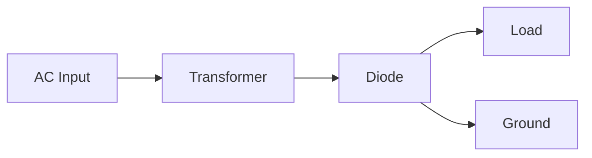
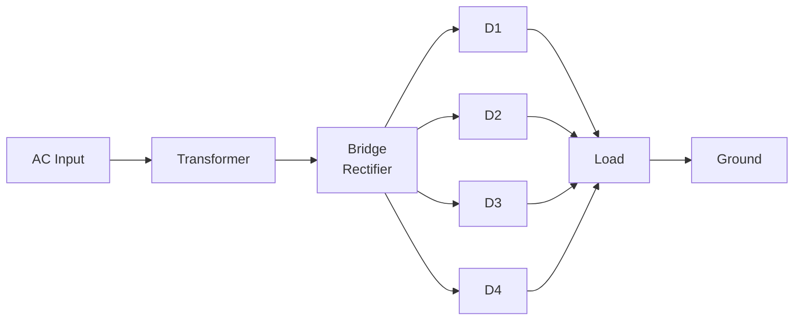
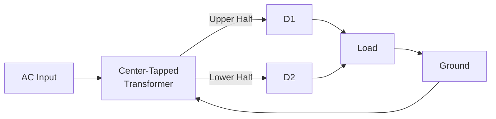
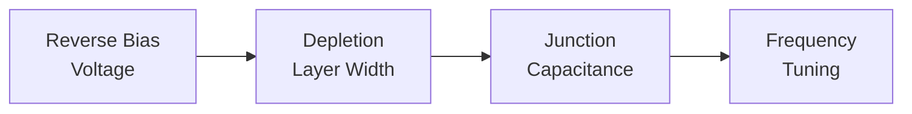
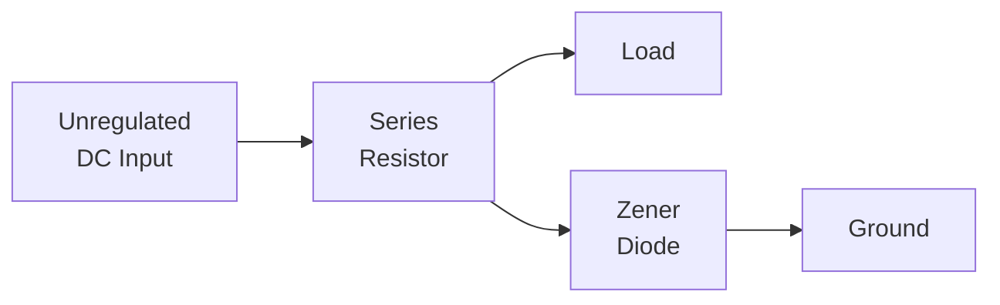
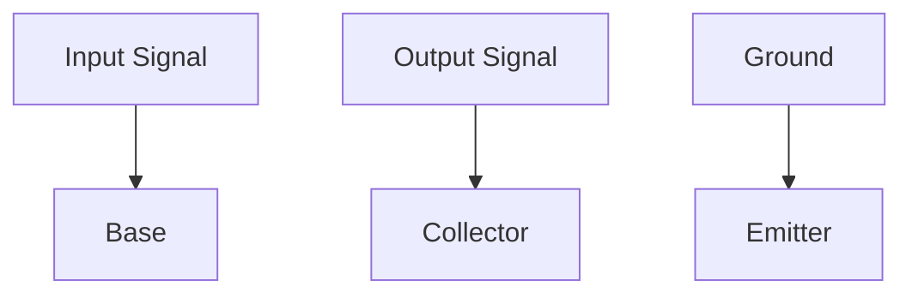

## Question 1(a) [3 marks]

**Give the difference between Passive components and Active components**

**Answer**:

| **Passive Components** | **Active Components** |
|---|---|
| Do not require external power source | Require external power source to operate |
| Cannot amplify or process signals | Can amplify, switch or process signals |
| Examples: Resistors, Capacitors, Inductors | Examples: Transistors, Diodes, ICs |
| Cannot control current flow by another signal | Can control current flow using another signal |
| Store or dissipate energy | Generate energy or provide gain |

**Mnemonic:** "PAPER-A" - Passive Are Power-free, Energy-storing/Resistive; Active Are Amplifying

## Question 1(b) [4 marks]

**Explain Working of Light dependent resistor with neat diagram.**

**Answer**:


**Working of LDR:**

- **Construction**: LDR consists of a semiconductor material (typically cadmium sulfide) with high resistance in darkness
- **Photoconductivity**: When light falls on the surface, photons transfer energy to electrons, creating free electron-hole pairs
- **Resistance variation**: Resistance decreases dramatically as light intensity increases - from megaohms in darkness to few hundred ohms in bright light
- **Applications**: Used in light sensing circuits, automatic street lights, camera exposure control

**Mnemonic:** "MILD" - More Illumination, Less resistance in Devices

## Question 1(c) [7 marks]

**Define Intrinsic and Extrinsic Semiconductor. Explain P type and N type semiconductors in detail.**

**Answer**:

| **Semiconductor Type** | **Description** |
|---|---|
| **Intrinsic** | Pure semiconductor material with no impurities added |
| **Extrinsic** | Semiconductor with controlled impurities added through doping |

**P-type Semiconductor:**

- **Doping**: Created by adding trivalent impurities (boron, gallium, indium) to pure silicon
- **Hole creation**: Each impurity atom creates a hole by accepting valence electrons
- **Majority carriers**: Holes are majority carriers
- **Minority carriers**: Electrons are minority carriers
- **Electrical properties**: Positive charge carriers dominate conduction

**N-type Semiconductor:**

- **Doping**: Created by adding pentavalent impurities (phosphorus, arsenic, antimony) to pure silicon
- **Electron creation**: Each impurity atom donates an extra electron
- **Majority carriers**: Electrons are majority carriers
- **Minority carriers**: Holes are minority carriers
- **Electrical properties**: Negative charge carriers dominate conduction

**Diagram:**

```goat
+----------------+   +----------------+
| N-type         |   | P-type         |
|                |   |                |
| Si Si Si Si Si |   | Si Si Si Si Si |
|                |   |                |
| Si Si P  Si Si |   | Si Si B  Si Si |
|      |         |   |      |         |
| Si Si|Si Si Si |   | Si Si|Si Si Si |
|      v         |   |      v         |
| Si Si e- Si Si |   | Si Si h+ Si Si |
|                |   |                |
| Si Si Si Si Si |   | Si Si Si Si Si |
+----------------+   +----------------+
  Extra electron       Extra hole
```

**Mnemonic:** "PINE" - Positive Impurities make N-type Electrons, Pentavalent donors

## Question 1(c) OR [7 marks]

**What is filter circuit? Give type and necessity of Filter and Explain "PI" Filter circuit in brief.**

**Answer**:

**Filter Circuit**: Electronic circuit that removes unwanted frequency components from a signal, allowing desired frequencies to pass through.

**Necessity of Filters**:

- **Ripple reduction**: Reduces AC ripple from rectifier output
- **Clean DC**: Provides smoother DC output voltage
- **Component protection**: Protects downstream components from voltage fluctuations
- **Efficiency**: Improves overall power supply efficiency

**Types of Filters**:

| **Filter Type** | **Components** | **Application** |
|---|---|---|
| Shunt Capacitor | Single capacitor in parallel | Basic filtering |
| L-Type | Inductor and capacitor | Better filtering |
| π (Pi) Filter | Two capacitors and one inductor | Superior filtering |
| RC Filter | Resistor and capacitor | Low-power applications |

**Pi (π) Filter**:


- **Working**: First capacitor (C1) reduces initial ripple, inductor (L) blocks AC components, second capacitor (C2) filters remaining ripples
- **Advantage**: Provides superior filtering with ripple factor typically below 0.5%
- **Applications**: Used in high-current power supplies where clean DC is critical

**Mnemonic:** "PIRO" - Pi filters Input Ripples Out effectively

## Question 2(a) [3 marks]

**Write down different types of capacitors and explain any two.**

**Answer**:

**Types of Capacitors**:

- Ceramic capacitors
- Electrolytic capacitors
- Tantalum capacitors
- Film capacitors
- Mica capacitors
- Variable capacitors

**Ceramic Capacitors**:

- **Construction**: Made from ceramic material as dielectric between metal plates
- **Capacity**: 1pF to 1μF
- **Advantages**: Low cost, high stability, non-polarized
- **Applications**: High-frequency filtering, coupling/decoupling

**Electrolytic Capacitors**:

- **Construction**: Aluminum foil with oxide layer as dielectric
- **Capacity**: 1μF to 10,000μF
- **Characteristics**: Polarized, higher leakage current
- **Applications**: Power supply filtering, audio coupling

**Mnemonic:** "CAPEX" - Ceramics Are Precise, Electrolytics Expand capacity

## Question 2(b) [4 marks]

**Explain air core and toroidal inductor.**

**Answer**:

**Air Core Inductor:**

```goat
   +----------+
   |    Air   |
   |          |
 +-|----------|--+
 | |          |  |
 | |          |  |
 | |          |  |
 | |          |  |
 | |          |  |
 +-|----------|--+
   |          |
   +----------+
   Wire windings
```

- **Construction**: Wire coiled around non-magnetic material (plastic, air)
- **Properties**: Lower inductance, no magnetic core saturation
- **Applications**: High-frequency circuits, RF applications
- **Advantages**: No core losses, linear operation, no saturation

**Toroidal Inductor:**

```goat
      +-------+
     /         \
    /           \
   /     Air     \
  |       +       |
  |      / \      |
  |     /   \     |
  |    +-----+    |
   \   |     |   /
    \  |     |  /
     \ |     | /
      ++-----++
     Wire windings
      around core
```

- **Construction**: Wire wound around a ring-shaped magnetic core
- **Properties**: Higher inductance, self-shielding magnetic field
- **Applications**: Power supplies, filters, transformers
- **Advantages**: Low electromagnetic interference, efficient flux containment

**Mnemonic:** "TACO" - Toroids Are Contained, Omnidirectional field reduction

## Question 2(c) [7 marks]

**Explain Half wave rectifier and Compare different rectifier circuits.**

**Answer**:

**Half Wave Rectifier:**



**Working Principle:**

- During positive half-cycle: Diode conducts, current flows through load
- During negative half-cycle: Diode blocks, no current flows
- Output contains only positive half-cycles of input waveform

**Comparison of Rectifiers:**

| **Parameter** | **Half Wave** | **Full Wave (Center-Tap)** | **Bridge Rectifier** |
|---|---|---|---|
| Diodes required | 1 | 2 | 4 |
| Output frequency | f₁ = f<sub>in</sub> | f₂ = 2×f<sub>in</sub> | f₂ = 2×f<sub>in</sub> |
| Ripple factor | 1.21 | 0.48 | 0.48 |
| Efficiency | 40.6% | 81.2% | 81.2% |
| PIV | 2V<sub>m</sub> | 2V<sub>m</sub> | V<sub>m</sub> |
| TUF | 0.287 | 0.693 | 0.812 |
| DC output | V<sub>m</sub>/π | 2V<sub>m</sub>/π | 2V<sub>m</sub>/π |

**Mnemonic:** "BRIEF" - Bridge Rectifiers Improve Efficiency Fundamentally

## Question 2(a) OR [3 marks]

**Write down different capacitor specifications and explain any two in detail.**

**Answer**:

**Capacitor Specifications:**

- Capacitance value
- Voltage rating
- Tolerance
- Temperature coefficient
- ESR (Equivalent Series Resistance)
- Leakage current
- Dielectric type

**Capacitance Value:**

- **Definition**: Amount of electric charge stored per volt
- **Units**: Measured in farads (F), typically microfarads (μF), nanofarads (nF), or picofarads (pF)
- **Importance**: Determines application suitability for coupling, filtering, timing
- **Marking**: Directly printed or color-coded on component

**Voltage Rating:**

- **Definition**: Maximum voltage that can be applied without breakdown
- **Specification**: Working voltage (WVDC) and surge voltage
- **Importance**: Exceeding rating causes dielectric breakdown and failure
- **Safety factor**: Typically use capacitors rated 50% higher than circuit voltage

**Mnemonic:** "CAVERN" - Capacitance And Voltage Ensure Reliable Network

## Question 2(b) OR [4 marks]

**Explain classification of Resistor based on materials.**

**Answer**:

| **Resistor Type** | **Material** | **Properties** | **Applications** |
|---|---|---|---|
| **Carbon Composition** | Carbon particles + Ceramic binder | High temperature coefficient, noisy | General purpose, surge protection |
| **Carbon Film** | Carbon film on ceramic | Better stability than carbon composition | General purpose circuits |
| **Metal Film** | Nickel chromium film on ceramic | Low noise, stable, precise | Audio circuits, instrumentation |
| **Wire Wound** | Resistance wire around ceramic | High power, low temperature coefficient | Power supplies, high current applications |
| **Metal Oxide** | Metal oxide film on ceramic | Stable, high temperature tolerance | High stability applications, power supplies |

**Characteristics of Carbon Film Resistors:**

- Temperature coefficient: -250 to 500 ppm/°C
- Tolerance: 5% to 10%
- Noise: Moderate to low

**Characteristics of Metal Film Resistors:**

- Temperature coefficient: 50 to 100 ppm/°C
- Tolerance: 0.1% to 2%
- Noise: Very low

**Mnemonic:** "COMFORT" - Carbon Offers Moderate Films, Others Resist Temperature better

## Question 2(c) OR [7 marks]

**Explain full wave bridge and center tapped rectifier with diagram and waveform.**

**Answer**:

**Full Wave Bridge Rectifier:**



**Working:**

- **Positive half-cycle**: D1 and D3 conduct, current flows through load
- **Negative half-cycle**: D2 and D4 conduct, current still flows through load in same direction
- **Output**: Both half-cycles of input converted to positive output

**Center Tapped Full Wave Rectifier:**



**Working:**

- **Positive half-cycle**: D1 conducts, D2 blocks
- **Negative half-cycle**: D2 conducts, D1 blocks
- **Output**: Both half-cycles of input converted to positive output

**Waveforms:**

```goat
Input:  ∿∿∿∿∿∿∿∿∿∿∿∿∿∿∿
         |
         v
Bridge: ∩∩∩∩∩∩∩∩∩∩∩∩∩∩∩
Rectifier
         |
         v
Output: ∩∩∩∩∩∩∩∩∩∩∩∩∩∩∩
(with filter)
```

**Mnemonic:** "FOUR-TWO" - FOUr diodes for Bridge, TWO diodes for Center-Tap

## Question 3(a) [3 marks]

**Explain the characteristic of Varactor diode.**

**Answer**:

**Varactor Diode Characteristics:**



- **Operating principle**: Junction capacitance varies with reverse bias voltage
- **C-V relationship**: Capacitance decreases as reverse voltage increases
- **Tuning ratio**: Typically 4:1 to 10:1 capacitance variation
- **Applications**: Voltage-controlled oscillators, FM modulation, tuning circuits

**Mnemonic:** "VARA" - Voltage Adjusts Reverse-biased capacitance Automatically

## Question 3(b) [3 marks]

**State and explain Faraday's laws of electromagnetic induction.**

**Answer**:

**Faraday's Laws of Electromagnetic Induction:**

**First Law:**

- **Statement**: Whenever a conductor cuts magnetic flux, an EMF is induced in the conductor
- **Mathematical expression**: EMF ∝ Rate of change of magnetic flux
- **Application**: Basis for generators, transformers, inductors

**Second Law:**

- **Statement**: The magnitude of induced EMF equals the rate of change of magnetic flux linkage
- **Mathematical expression**: EMF = -N × (dΦ/dt)
  - Where: N = number of turns, dΦ/dt = rate of change of flux
- **Negative sign**: Indicates direction (Lenz's Law) - induced current opposes the change

**Diagram:**

```goat
    N     S       
    |     |       
    v     v       
  +---+ +---+     
  |   | |   |     
  |   | |   |     
  +---+ +---+     
    ^     ^       
    |     |       
    |     |       
  +----------+    
  |   Coil   |-----> Induced EMF
  +----------+    
```

**Mnemonic:** "FACE" - Flux Alteration Creates Electricity

## Question 3(c) [7 marks]

**Compare different Transistor Configurations.**

**Answer**:

| **Parameter** | **Common Emitter (CE)** | **Common Base (CB)** | **Common Collector (CC)** |
|---|---|---|---|
| **Input Terminal** | Base | Emitter | Base |
| **Output Terminal** | Collector | Collector | Emitter |
| **Common Terminal** | Emitter | Base | Collector |
| **Current Gain (α, β, γ)** | β = I<sub>C</sub>/I<sub>B</sub> (20-500) | α = I<sub>C</sub>/I<sub>E</sub> (0.95-0.99) | γ = I<sub>E</sub>/I<sub>B</sub> (β+1) |
| **Voltage Gain** | High (250-1000) | Medium (150-800) | Less than 1 |
| **Input Impedance** | Medium (1-2kΩ) | Low (30-150Ω) | High (50-500kΩ) |
| **Output Impedance** | High (30-50kΩ) | Very high (250kΩ-1MΩ) | Low (50-100Ω) |
| **Phase Shift** | 180° | 0° | 0° |
| **Applications** | Amplifiers, oscillators | RF amplifiers, high-frequency circuits | Impedance matching, buffers |

**Relationship between α, β and γ:**

- β = α/(1-α)
- α = β/(1+β)
- γ = β+1

**Mnemonic:** "BEC" - Base input for Emitter output needs Collector as common terminal

## Question 3(a) OR [3 marks]

**What is forbidden energy gap? Draw the energy band diagram for insulator, conductor and semiconductor.**

**Answer**:

**Forbidden Energy Gap:** Energy range in a solid where no electron states exist, separating the valence band from the conduction band.

**Energy Band Diagrams:**

```goat
+---------------+  +---------------+  +---------------+
|///////////////|  |///////////////|  |///////////////|
|/// Conduction |  |/// Conduction |  |/// Conduction |
|///////////////|  |///////////////|  |///////////////|
+---------------+  +---------------+  +---------------+
|               |  |///////////////|  |      |        |
|               |  |///////////////|  |      | Small  |
| Large         |  | Overlap       |  |      | Gap    |
| Forbidden     |  |///////////////|  |      |        |
| Gap (>5eV)    |  |///////////////|  |      | (~1eV) |
|               |  |///////////////|  |      |        |
+---------------+  +---------------+  +---------------+
|///////////////|  |///////////////|  |///////////////|
|/// Valence    |  |/// Valence    |  |/// Valence    |
|///////////////|  |///////////////|  |///////////////|
+---------------+  +---------------+  +---------------+
    Insulator          Conductor        Semiconductor
```

- **Insulator**: Large forbidden gap (>5eV) prevents electrons from reaching conduction band
- **Conductor**: Overlapping bands allow free electron movement
- **Semiconductor**: Small gap (~1eV) allows some electrons to cross at room temperature or when excited

**Mnemonic:** "IBCS" - Insulators Block, Conductors Share, Semiconductors have gap Between

## Question 3(b) OR [4 marks]

**Explain the function of Zener diode as a voltage regulator**

**Answer**:



**Working Principle:**

- **Normal operation**: Zener diode is reverse biased and conducts when voltage reaches breakdown voltage
- **Voltage regulation**: When input voltage rises, more current flows through Zener diode, maintaining constant voltage across it
- **Load variation**: When load draws more current, less current flows through Zener, keeping voltage stable
- **Series resistor**: Limits current and drops excess voltage

**Circuit behavior:**

- **V<sub>out</sub> = V<sub>z</sub>** (Zener breakdown voltage)
- **I<sub>z</sub> = (V<sub>in</sub> - V<sub>z</sub>)/R - I<sub>L</sub>**

**Mnemonic:** "SERZ" - Series resistor Enables Regulation with Zener

## Question 3(c) OR [7 marks]

**Explain V-I char of P-N junction diode and give comparison between P-N junction diode and Zener diode.**

**Answer**:

**V-I Characteristics of P-N Junction Diode:**

```goat
                 I
                 ^
                 |              /
                 |             /
                 |            /
                 |           /
Forward current  |          /
                 |         /
                 |        /
                 |       /
                 |  Knee/
                 |     /
        -V <-----|----+---> +V
                 |   /|
                 |    |
                 |    |
Reverse current  |    |
                 |    |    Breakdown
                 |    |       |
                 |    |       v
                 |    |       ⌄_____
```

**Key Points:**

- **Forward bias**: Conducts easily after exceeding knee voltage (~0.7V for silicon)
- **Reverse bias**: Very small leakage current until breakdown voltage
- **Breakdown region**: Occurs at high reverse voltage, causes damage in normal diodes

**P-N Junction Diode vs. Zener Diode:**

| **Parameter** | **P-N Junction Diode** | **Zener Diode** |
|---|---|---|
| **Symbol** | ▷\|— | ▷\|—◁ |
| **Forward operation** | Conducts easily | Same as normal diode |
| **Reverse breakdown** | At high voltage, causes damage | Controlled, non-destructive |
| **Doping level** | Moderate | Heavily doped |
| **Operating region** | Forward biased | Reverse biased (breakdown region) |
| **Applications** | Rectification, switching | Voltage regulation, reference |
| **Breakdown mechanism** | Avalanche | Zener effect and avalanche |
| **Temperature coefficient** | Negative | Can be positive or negative |

**Mnemonic:** "FORD" - Forward Operation for Rectifiers, Diodes; reverse operation for Zeners

## Question 4(a) [3 marks]

**Describe working principle of Photodiode.**

**Answer**:

**Working Principle of Photodiode:**


- **Construction**: P-N junction diode with transparent window or lens
- **Operation**: Reverse biased operation for light detection
- **Photon absorption**: Incoming photons create electron-hole pairs in depletion region
- **Current generation**: Electric field sweeps carriers to respective terminals, creating photocurrent
- **Light sensitivity**: Current proportional to light intensity

**Mnemonic:** "LIGER" - Light Induces Generation of Electrons in Reverse-bias

## Question 4(b) [4 marks]

**Explain the characteristic of Schottky barrier diode.**

**Answer**:

**Schottky Barrier Diode Characteristics:**

```goat
                 I
                 ^
                 |              /
                 |             / Schottky
                 |            /
                 |           /   PN Junction
Forward current  |          / ,/
                 |         / /
                 |        / /
                 |       / /
                 |      / /
                 |     //
        -V <-----|----|---> +V
                 |    |
                 |    |
                 |    |
Reverse current  |    |
                 |    |
```

- **Low forward voltage drop**: 0.2-0.3V compared to 0.7V for silicon PN junction
- **Fast switching**: No minority carrier storage, minimal reverse recovery time
- **Construction**: Metal-semiconductor junction instead of P-N junction
- **No reverse recovery time**: Majority carrier device (no stored charge)
- **Applications**: High-frequency applications, rectifiers in power supplies

**Mnemonic:** "FAST" - Forward voltage low, Allows Switching Timely

## Question 4(c) [7 marks]

**Explain working principle of PNP and NPN transistor.**

**Answer**:

**NPN Transistor Structure and Working:**

```goat
    +-------+     +-------+     +-------+
    |       |     |       |     |       |
    |   N   |     |   P   |     |   N   |
    |       |     |       |     |       |
    +-------+     +-------+     +-------+
    Emitter        Base        Collector
        |            |            |
        |            |            |
        v            v            v
    Electron      Hole        Electron
     source    controller     collector
```

- **Biasing**: Emitter-base junction forward biased, collector-base junction reverse biased
- **Current flow**: Electrons from emitter to collector through thin base region
- **Amplification principle**: Small base current controls larger collector current
- **Current relationship**: I<sub>E</sub> = I<sub>B</sub> + I<sub>C</sub>
- **Majority carriers**: Electrons

**PNP Transistor Structure and Working:**

```goat
    +-------+     +-------+     +-------+
    |       |     |       |     |       |
    |   P   |     |   N   |     |   P   |
    |       |     |       |     |       |
    +-------+     +-------+     +-------+
    Emitter        Base        Collector
        |            |            |
        |            |            |
        v            v            v
     Hole         Electron        Hole
     source     controller     collector
```

- **Biasing**: Emitter-base junction forward biased, collector-base junction reverse biased
- **Current flow**: Holes from emitter to collector through thin base region
- **Amplification principle**: Small base current controls larger collector current
- **Current relationship**: I<sub>E</sub> = I<sub>B</sub> + I<sub>C</sub>
- **Majority carriers**: Holes
- **Current direction**: Opposite to NPN (conventional current from emitter to collector)

**Mnemonic:** "NPNP" - Negative carriers in NPN, Positive carriers in PNP

## Question 4(a) OR [3 marks]

**Describe working principle of LED.**

**Answer**:

**Working Principle of LED:**


- **Construction**: P-N junction made from direct bandgap semiconductor materials
- **Forward biasing**: Electrons from n-region and holes from p-region recombine at junction
- **Recombination**: Electrons fall from conduction band to valence band
- **Energy emission**: Energy released during recombination emits photons (light)
- **Color determination**: Bandgap energy determines wavelength (color) of emitted light

**Mnemonic:** "REBEL" - Recombination of Electrons and holes By Energetic Light emission

## Question 4(b) OR [4 marks]

**Explain function of transistor as switch in cut off and application of saturation region.**

**Answer**:

**Transistor as a Switch:**

```goat
        Input                        Output
          |                            |
          |                            |
          v                            v
    +----------+                 +----------+
    |    R1    |                 |    RC    |
    +----------+                 +----------+
          |                            |
          |                            |
          |     +---------------+      |
          +---->|     B     C   |------+
                |       |       |
                |       |       |
                |     E         |
                +---------------+
                     |
                     |
                 Ground
```

**Cut-off Region (Switch OFF):**

- **Base voltage**: Below 0.7V (for silicon)
- **Base current**: Approximately zero
- **Collector current**: Approximately zero
- **Collector-emitter voltage**: Equal to supply voltage
- **Applications**: Logic gates, digital circuits, relay drivers

**Saturation Region (Switch ON):**

- **Base voltage**: Well above 0.7V
- **Base current**: Sufficient to ensure minimum V<sub>CE</sub>
- **Collector current**: Maximum (limited by collector resistor)
- **Collector-emitter voltage**: Very low (0.2V - 0.3V)
- **Applications**: Digital switches, motor drivers, LED drivers

**Mnemonic:** "COSI" - Cutoff Opens Switch, Input saturates to close

## Question 4(c) OR [7 marks]

**Explain common emitter (CE) configuration of Transistor. Derive relation between α and β for transistor amplifier.**

**Answer**:

**Common Emitter Configuration:**



**Characteristics of Common Emitter Configuration:**

- **Input terminal**: Base
- **Output terminal**: Collector
- **Common terminal**: Emitter (grounded)
- **Current gain (β)**: High (20-500)
- **Voltage gain**: High (250-1000)
- **Input impedance**: Medium (1-2kΩ)
- **Output impedance**: High (30-50kΩ)
- **Phase shift**: 180° (output inverted from input)

**Relationship between α and β:**

By definition:

- α = I<sub>C</sub>/I<sub>E</sub> (Common Base current gain)
- β = I<sub>C</sub>/I<sub>B</sub> (Common Emitter current gain)

From Kirchhoff's Current Law:

- I<sub>E</sub> = I<sub>B</sub> + I<sub>C</sub>

Dividing both sides by I<sub>E</sub>:

- 1 = I<sub>B</sub>/I<sub>E</sub> + I<sub>C</sub>/I<sub>E</sub>
- 1 = I<sub>B</sub>/I<sub>E</sub> + α

Therefore:

- I<sub>B</sub>/I<sub>E</sub> = 1 - α

Now, β = I<sub>C</sub>/I<sub>B</sub> = (I<sub>C</sub>/I<sub>E</sub>)/(I<sub>B</sub>/I<sub>E</sub>) = α/(1-α)

And conversely:

- α = β/(1+β)

**Mnemonic:** "BEAR" - Beta Equals Alpha divided by (1-alpha) Relation

## Question 5(a) [3 marks]

**What do you mean by E-waste? What are the different methods of E-waste disposal?**

**Answer**:

**E-waste (Electronic Waste)**: Discarded electronic devices and components that have reached end of life or are no longer useful.

**Methods of E-waste Disposal:**

| **Disposal Method** | **Description** |
|---|---|
| **Recycling** | Separating valuable materials like metals, plastics for reuse |
| **Landfilling** | Disposing in designated landfills (not recommended) |
| **Incineration** | Burning waste at high temperatures (creates toxic emissions) |
| **Reuse/Refurbishment** | Repairing and upgrading for extended use |
| **Extended Producer Responsibility** | Manufacturers take back and handle disposal |

**Mnemonic:** "RIPER" - Recycling Is Preferable to Environmentally-harmful Remedies

## Question 5(b) [4 marks]

**Explain methods of handling electronic waste with examples.**

**Answer**:

**Methods of Handling Electronic Waste:**


**Collection and Segregation:**

- **Example**: Dedicated e-waste bins in public places, e-waste collection drives
- **Benefit**: Prevents mixing with general waste, enables proper processing

**Dismantling and Resource Recovery:**

- **Example**: Recovering gold, silver, copper from circuit boards and connectors
- **Benefit**: Recovers valuable metals, reduces mining demands

**Refurbishment and Reuse:**

- **Example**: Repairing old computers for educational institutions
- **Benefit**: Extends product lifecycle, reduces waste generation

**Proper Disposal of Hazardous Components:**

- **Example**: Specialized treatment for mercury-containing components
- **Benefit**: Prevents toxic substances from entering environment

**Mnemonic:** "CREED" - Collect, Recover, Extract, Extend, Dispose safely

## Question 5(c) [7 marks]

**What is ripple factor? Derive the equation of the ripple factor for rectifier.**

**Answer**:

**Ripple Factor**: Measure of effectiveness of a rectifier's filtering - the ratio of AC component (ripple) to DC component in the output.

**Definition**:

- Ripple factor (γ) = RMS value of AC component / DC value
- Lower ripple factor indicates better filtering

**Derivation for Half Wave Rectifier:**

Let's assume sinusoidal input: v = V<sub>m</sub>sinωt

For half wave rectifier:

- Output is v = V<sub>m</sub>sinωt for 0 ≤ ωt ≤ π
- Output is v = 0 for π ≤ ωt ≤ 2π

**Step 1**: Find DC component (average value)

- V<sub>DC</sub> = (1/2π) ∫<sub>0</sub><sup>2π</sup> v(ωt) d(ωt)
- V<sub>DC</sub> = (1/2π) ∫<sub>0</sub><sup>π</sup> V<sub>m</sub>sinωt d(ωt)
- V<sub>DC</sub> = V<sub>m</sub>/π

**Step 2**: Find RMS value

- V<sub>RMS</sub> = √[(1/2π) ∫<sub>0</sub><sup>2π</sup> v²(ωt) d(ωt)]
- V<sub>RMS</sub> = √[(1/2π) ∫<sub>0</sub><sup>π</sup> V<sub>m</sub>²sin²ωt d(ωt)]
- V<sub>RMS</sub> = V<sub>m</sub>/2

**Step 3**: Find AC component

- V<sub>AC</sub>² = V<sub>RMS</sub>² - V<sub>DC</sub>²
- V<sub>AC</sub>² = (V<sub>m</sub>/2)² - (V<sub>m</sub>/π)²
- V<sub>AC</sub>² = V<sub>m</sub>²(1/4 - 1/π²)

**Step 4**: Calculate ripple factor

- γ = V<sub>AC</sub>/V<sub>DC</sub>
- γ = √(V<sub>m</sub>²(1/4 - 1/π²))/(V<sub>m</sub>/π)
- γ = π√(1/4 - 1/π²)
- γ = 1.21 (for half wave rectifier)

**For Full Wave Rectifier**:
Following similar steps leads to γ = 0.48

**Mnemonic:** "ROAD" - Ripple is Output's AC Divided by DC component

## Question 5(a) OR [3 marks]

**Which are the toxic substances present in e-waste?**

**Answer**:

**Toxic Substances in E-waste:**

| **Toxic Substance** | **Source in Electronics** | **Health/Environmental Impact** |
|---|---|---|
| **Lead (Pb)** | Solder, CRT monitors, batteries | Neurological damage, developmental issues |
| **Mercury (Hg)** | Switches, backlights, batteries | Neurological and kidney damage |
| **Cadmium (Cd)** | Rechargeable batteries, circuit boards | Kidney damage, bone disease |
| **Brominated Flame Retardants** | Plastic casings, circuit boards | Endocrine disruption, bioaccumulation |
| **Hexavalent Chromium** | Corrosion protection in metal parts | Allergic reactions, DNA damage |
| **Beryllium (Be)** | Connectors, springs | Lung disease, skin disorders |

**Mnemonic:** "LMBCHB" - Lead, Mercury, and Beryllium Cause Harmful Bodily effects

## Question 5(b) OR [4 marks]

**Write important parameters for selecting the right transistor for your application and explain any two.**

**Answer**:

**Important Transistor Selection Parameters:**

- Maximum collector current (I<sub>C</sub>)
- Maximum collector-emitter voltage (V<sub>CEO</sub>)
- Maximum collector-base voltage (V<sub>CBO</sub>)
- Current gain (hFE or β)
- Frequency response (f<sub>T</sub>)
- Power dissipation (P<sub>tot</sub>)
- Package type (TO-3, SMT, etc.)
- Temperature range

**Maximum Collector Current (I<sub>C</sub>):**

- **Definition**: Maximum current that can flow through collector without damage
- **Importance**: Must exceed application's peak current requirements with safety margin
- **Typical values**: 100mA to 100A depending on transistor type
- **Application consideration**: Select 50% higher rating than maximum required current

**Current Gain (hFE or β):**

- **Definition**: Ratio of collector current to base current
- **Importance**: Determines amplification capability and required base drive
- **Typical values**: 20-500 for general-purpose transistors
- **Application consideration**: For switching, high gain reduces base current requirement; for amplifiers, consistent gain across operating range is important

**Mnemonic:** "GIVE" - Gain and Ic are Very Essential parameters

## Question 5(c) OR [7 marks]

**What is rectifier efficiency? Find out efficiency of the full wave rectifier.**

**Answer**:

**Rectifier Efficiency**: The ratio of DC output power to the AC input power, expressed as a percentage.

**Definition**:

- Efficiency (η) = (P<sub>DC</sub>/P<sub>AC</sub>) × 100%
- Higher efficiency means better conversion of AC to DC power

**Derivation for Full Wave Rectifier:**

**Step 1**: Calculate DC output power

- I<sub>DC</sub> = V<sub>DC</sub>/R<sub>L</sub>
- P<sub>DC</sub> = I<sub>DC</sub>² × R<sub>L</sub> = V<sub>DC</sub>²/R<sub>L</sub>
- For full wave, V<sub>DC</sub> = 2V<sub>m</sub>/π
- P<sub>DC</sub> = (2V<sub>m</sub>/π)²/R<sub>L</sub> = 4V<sub>m</sub>²/(π²R<sub>L</sub>)

**Step 2**: Calculate AC input power

- I<sub>RMS</sub> = V<sub>RMS</sub>/R<sub>L</sub>
- P<sub>AC</sub> = I<sub>RMS</sub>² × R<sub>L</sub> = V<sub>RMS</sub>²/R<sub>L</sub>
- For sine wave, V<sub>RMS</sub> = V<sub>m</sub>/√2
- P<sub>AC</sub> = (V<sub>m</sub>/√2)²/R<sub>L</sub> = V<sub>m</sub>²/(2R<sub>L</sub>)

**Step 3**: Calculate efficiency

- η = (P<sub>DC</sub>/P<sub>AC</sub>) × 100%
- η = [4V<sub>m</sub>²/(π²R<sub>L</sub>)] / [V<sub>m</sub>²/(2R<sub>L</sub>)] × 100%
- η = [4/(π²)] × 2 × 100%
- η = 8/(π²) × 100%
- η = 8/9.87 × 100%
- η = 81.2%

**Full Wave Rectifier Efficiency** = 81.2%

**For comparison:**

- Half Wave Rectifier Efficiency = 40.6%
- Bridge Rectifier Efficiency = 81.2%

**Mnemonic:** "PIDE" - Power Input Determines Efficiency
