## પ્રશ્ન 1(અ) [3 ગુણ]

**બુલિયન એલ્જીબ્રા માટેના ડે-મોર્ગનના નિયમ સમજાવો**

**જવાબ**:
ડે-મોર્ગનના નિયમમાં બે કાયદા છે જે AND, OR અને NOT ક્રિયાઓ વચ્ચેના સંબંધને દર્શાવે છે:

**કાયદો 1**: સરવાળાના પૂરકની કિંમત પૂરકના ગુણાકાર બરાબર હોય છે
$\overline{A + B} = \overline{A} \cdot \overline{B}$

**કાયદો 2**: ગુણાકારના પૂરકની કિંમત પૂરકના સરવાળા બરાબર હોય છે
$\overline{A \cdot B} = \overline{A} + \overline{B}$

**કોષ્ટક: ડે-મોર્ગનના નિયમની ચકાસણી**

| A | B | A+B | $\overline{A+B}$ | $\overline{A}$ | $\overline{B}$ | $\overline{A}\cdot\overline{B}$ |
|---|---|-----|-----------------|----------------|----------------|------------------------------|
| 0 | 0 | 0   | 1               | 1              | 1              | 1                            |
| 0 | 1 | 1   | 0               | 1              | 0              | 0                            |
| 1 | 0 | 1   | 0               | 0              | 1              | 0                            |
| 1 | 1 | 1   | 0               | 0              | 0              | 0                            |

**સ્મૃતિસહાય:** "OR પર NOT થાય AND, AND પર NOT થાય OR"

## પ્રશ્ન 1(બ) [4 ગુણ]

**નીચેના ડેસિમલ નંબરને બાયનરી અને ઓકટલ નંબરમાં ફેરવો (i) 215 (ii) 59**

**જવાબ**:

**બાયનરી રૂપાંતર:**

**215 માટે:**

- 2 વડે ભાગ કરો: 215/2 = 107 શેષ 1
- 107/2 = 53 શેષ 1
- 53/2 = 26 શેષ 1
- 26/2 = 13 શેષ 0
- 13/2 = 6 શેષ 1
- 6/2 = 3 શેષ 0
- 3/2 = 1 શેષ 1
- 1/2 = 0 શેષ 1
- તેથી, (215)₁₀ = (11010111)₂

**59 માટે:**

- 2 વડે ભાગ કરો: 59/2 = 29 શેષ 1
- 29/2 = 14 શેષ 1
- 14/2 = 7 શેષ 0
- 7/2 = 3 શેષ 1
- 3/2 = 1 શેષ 1
- 1/2 = 0 શેષ 1
- તેથી, (59)₁₀ = (111011)₂

**ઓકટલ રૂપાંતર:**

**215 માટે:**

- 8 વડે ભાગ કરો: 215/8 = 26 શેષ 7
- 26/8 = 3 શેષ 2
- 3/8 = 0 શેષ 3
- તેથી, (215)₁₀ = (327)₈

**59 માટે:**

- 8 વડે ભાગ કરો: 59/8 = 7 શેષ 3
- 7/8 = 0 શેષ 7
- તેથી, (59)₁₀ = (73)₈

**કોષ્ટક: સંખ્યા રૂપાંતર સારાંશ**

| ડેસિમલ | બાયનરી   | ઓકટલ |
|--------|----------|-------|
| 215    | 11010111 | 327   |
| 59     | 111011   | 73    |

**સ્મૃતિસહાય:** "આધાર વડે ભાગો, શેષ નીચેથી ઉપર વાંચો"

## પ્રશ્ન 1(ક)(I) [2 ગુણ]

**ડેસિમલ, બાયનરી, ઓકટલ અને હેક્ઝાડેસિમલ નંબર સિસ્ટમનો બેઝ લખો**

**જવાબ**:

**કોષ્ટક: સંખ્યા પદ્ધતિના આધાર**

| સંખ્યા પદ્ધતિ | આધાર |
|---------------|------|
| ડેસિમલ        | 10   |
| બાયનરી        | 2    |
| ઓકટલ         | 8    |
| હેક્ઝાડેસિમલ   | 16   |

**સ્મૃતિસહાય:** "ડે-બા-ઓ-હે: 10-2-8-16"

## પ્રશ્ન 1(ક)(II) [2 ગુણ]

**(147)₁₀ = (____________)₂ = (______________)₁₆**

**જવાબ**:

**ડેસિમલથી બાયનરી રૂપાંતર:**

- 147/2 = 73 શેષ 1
- 73/2 = 36 શેષ 1
- 36/2 = 18 શેષ 0
- 18/2 = 9 શેષ 0
- 9/2 = 4 શેષ 1
- 4/2 = 2 શેષ 0
- 2/2 = 1 શેષ 0
- 1/2 = 0 શેષ 1
- તેથી, (147)₁₀ = (10010011)₂

**ડેસિમલથી હેક્ઝાડેસિમલ રૂપાંતર:**

- બાયનરી અંકોને 4ના સમૂહમાં વિભાજિત કરો: 1001 0011
- દરેક સમૂહને હેક્સમાં રૂપાંતરિત કરો: 1001 = 9, 0011 = 3
- તેથી, (147)₁₀ = (93)₁₆

**કોષ્ટક: રૂપાંતર પરિણામ**

| ડેસિમલ | બાયનરી   | હેક્ઝાડેસિમલ |
|--------|----------|-------------|
| 147    | 10010011 | 93          |

**સ્મૃતિસહાય:** "હેક્સ માટે જમણેથી 4ના સમૂહમાં વિભાજિત કરો"

## પ્રશ્ન 1(ક)(III) [3 ગુણ]

**નીચેના બાયનરી કોડનું ગ્રે કોડમાં રૂપાંતર કરો (i) 1011 (ii) 1110**

**જવાબ**:

**બાયનરીથી ગ્રે કોડ રૂપાંતર પ્રક્રિયા:**

1. ગ્રે કોડનો MSB (ડાબી બાજુનો બિટ) બાયનરી કોડના MSB જેવો જ હોય છે
2. ગ્રે કોડના અન્ય બિટ્સ બાયનરી કોડના આસપાસના બિટ્સને XOR કરીને મેળવવામાં આવે છે

**1011 માટે:**

- ગ્રે કોડનો MSB = બાયનરી કોડનો MSB = 1
- બીજો બિટ = 1 XOR 0 = 1
- ત્રીજો બિટ = 0 XOR 1 = 1
- ચોથો બિટ = 1 XOR 1 = 0
- તેથી, (1011)₂ = (1110)ᵍᵣₐᵧ

**1110 માટે:**

- ગ્રે કોડનો MSB = બાયનરી કોડનો MSB = 1
- બીજો બિટ = 1 XOR 1 = 0
- ત્રીજો બિટ = 1 XOR 1 = 0
- ચોથો બિટ = 1 XOR 0 = 1
- તેથી, (1110)₂ = (1001)ᵍᵣₐᵧ

**કોષ્ટક: બાયનરીથી ગ્રે કોડ રૂપાંતર**

| બાયનરી | રૂપાંતર પદ્ધતિ            | ગ્રે કોડ |
|--------|----------------------------|-----------|
| 1011   | 1, 1⊕0=1, 0⊕1=1, 1⊕1=0    | 1110      |
| 1110   | 1, 1⊕1=0, 1⊕1=0, 1⊕0=1    | 1001      |

**સ્મૃતિસહાય:** "પહેલો રાખો, બાકીના XOR કરો"

## પ્રશ્ન 1(ક) [વૈકલ્પિક પ્રશ્ન] (I) [2 ગુણ]

**BCD અને ASCII નું ફૂલફોર્મ લખો**

**જવાબ**:

**કોષ્ટક: BCD અને ASCII નું પૂર્ણ નામ**

| સંક્ષિપ્ત રૂપ | પૂર્ણ નામ                                   |
|--------------|----------------------------------------------|
| BCD          | Binary Coded Decimal                         |
| ASCII        | American Standard Code for Information Interchange |

**સ્મૃતિસહાય:** "બાયનરી કોડેડ ડેસિમલ, અમેરિકન સ્ટાન્ડર્ડ કોડ ફોર ઇન્ફોર્મેશન ઇન્ટરચેન્જ"

## પ્રશ્ન 1(ક) [વૈકલ્પિક પ્રશ્ન] (II) [2 ગુણ]

**નીચેના બાયનરી નંબરના 1's અને 2's કોમ્પ્લિમેન્ટ શોધો (i) 1010 (ii) 1011**

**જવાબ**:

**1's કોમ્પ્લિમેન્ટ:** બધા બિટ્સ ઉલટાવો (0 ને 1 અને 1 ને 0 માં બદલો)
**2's કોમ્પ્લિમેન્ટ:** 1's કોમ્પ્લિમેન્ટ લો અને 1 ઉમેરો

**1010 માટે:**

- 1's કોમ્પ્લિમેન્ટ: 0101
- 2's કોમ્પ્લિમેન્ટ: 0101 + 1 = 0110

**1011 માટે:**

- 1's કોમ્પ્લિમેન્ટ: 0100
- 2's કોમ્પ્લિમેન્ટ: 0100 + 1 = 0101

**કોષ્ટક: કોમ્પ્લિમેન્ટ પરિણામો**

| બાયનરી | 1's કોમ્પ્લિમેન્ટ | 2's કોમ્પ્લિમેન્ટ |
|--------|----------------|----------------|
| 1010   | 0101           | 0110           |
| 1011   | 0100           | 0101           |

**સ્મૃતિસહાય:** "1's માટે બધા બિટ ઉલટાવો, 2's માટે એક ઉમેરો"

## પ્રશ્ન 1(ક) [વૈકલ્પિક પ્રશ્ન] (III) [3 ગુણ]

**2's કોમ્પ્લિમેન્ટ મેથડથી બાદબાકી કરો (i) (110110)₂ – (101010)₂**

**જવાબ**:

2's કોમ્પ્લિમેન્ટ પદ્ધતિથી બાદબાકી માટે:

1. બાદ થનાર સંખ્યાનો 2's કોમ્પ્લિમેન્ટ શોધો
2. તેને મૂળ સંખ્યામાં ઉમેરો
3. બિટ વિડ્થની બહારના કેરીને છોડી દો

**બાદબાકી: (110110)₂ – (101010)₂**

**પગલું 1:** 101010 નો 2's કોમ્પ્લિમેન્ટ શોધો

- 101010 નો 1's કોમ્પ્લિમેન્ટ = 010101
- 2's કોમ્પ્લિમેન્ટ = 010101 + 1 = 010110

**પગલું 2:** 110110 + 010110 ઉમેરો

```
  1 1 1 1 1
  1 1 0 1 1 0
+ 0 1 0 1 1 0
--------------
  0 0 1 1 0 0
```

**પગલું 3:** પરિણામ 001100 = (12)₁₀

**કોષ્ટક: બાદબાકી પ્રક્રિયા**

| પગલું | ક્રિયા                      | પરિણામ      |
|------|------------------------------|-------------|
| 1    | 101010 નો 2's કોમ્પ્લિમેન્ટ  | 010110      |
| 2    | 110110 + 010110 ઉમેરો        | 001100      |
| 3    | અંતિમ પરિણામ (ડેસિમલ)        | 12          |

**સ્મૃતિસહાય:** "બાદનારનો કોમ્પ્લિમેન્ટ લો, ઉમેરો, કેરી ભૂલી જાઓ"

## પ્રશ્ન 2(અ) [3 ગુણ]

**NAND ગેટનો જ ઉપયોગ કરી AND, OR અને NOT ગેટની લૉજિક સર્કિટ બનાવો**

**જવાબ**:

**AND ગેટ NAND ગેટથી:**

- AND ગેટ = NAND ગેટ પછી NOT ગેટ (NAND ગેટ)

**OR ગેટ NAND ગેટથી:**

- OR ગેટ = બંને ઇનપુટને NOT (NAND ગેટ) લાગુ કરો, પછી તે પરિણામોને NAND કરો

**NOT ગેટ NAND ગેટથી:**

- NOT ગેટ = NAND ગેટ જેમાં બંને ઇનપુટ જોડાયેલા હોય

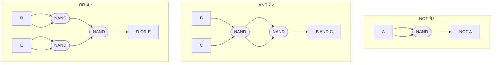

**સ્મૃતિસહાય:** "NOT માટે એક NAND, AND માટે બે NAND, OR માટે ત્રણ NAND"

## પ્રશ્ન 2(બ) [4 ગુણ]

**નીચેના લૉજિક ગેટનો લૉજિક સિમ્બોલ, ટ્રુથ ટેબલ અને સમીકરણ લખો/દોરો (i) XOR ગેટ (ii) OR ગેટ**

**જવાબ**:

**XOR ગેટ:**

**લૉજિક સિમ્બોલ:**

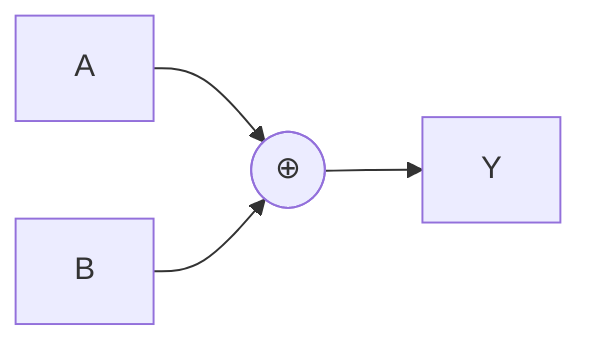

**ટ્રુથ ટેબલ:**

| A | B | Y (A⊕B) |
|---|---|---------|
| 0 | 0 | 0       |
| 0 | 1 | 1       |
| 1 | 0 | 1       |
| 1 | 1 | 0       |

**બુલિયન સમીકરણ:** Y = A⊕B = A'B + AB'

**OR ગેટ:**

**લૉજિક સિમ્બોલ:**

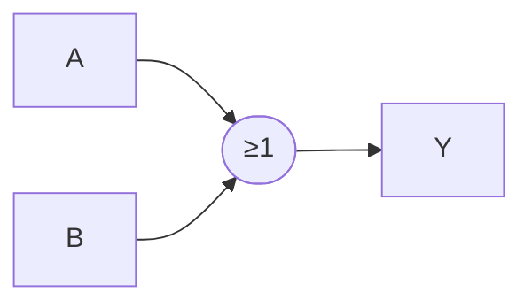

**ટ્રુથ ટેબલ:**

| A | B | Y (A+B) |
|---|---|---------|
| 0 | 0 | 0       |
| 0 | 1 | 1       |
| 1 | 0 | 1       |
| 1 | 1 | 1       |

**બુલિયન સમીકરણ:** Y = A+B

**સ્મૃતિસહાય:** "XOR: એક્સક્લુસિવ OR - એક અથવા બીજું પણ બંને નહીં; OR: એક અથવા બીજું અથવા બંને"

## પ્રશ્ન 2(ક)(I) [3 ગુણ]

**બુલિયન સમીકરણ Y = A + B[AC + (B + C̅)D] ને algebraic મેથડથી સરળ બનાવો**

**જવાબ**:

**પગલાંવાર સરળીકરણ:**

Y = A + B[AC + (B + C̅)D]
Y = A + B[AC + BD + C̅D]
Y = A + BAC + BBD + BC̅D
Y = A + BAC + BD + BC̅D        (કારણ કે BB = B)

**Absorption law (X + XY = X) લાગુ કરો:**
Y = A + AC + BD + BC̅D         (કારણ કે A + BAC = A + AC)
Y = A + BD + BC̅D              (કારણ કે A + AC = A)
Y = A + B(D + C̅D)
Y = A + BD + BC̅D
Y = A + BD(1 + C̅)
Y = A + BD                    (કારણ કે 1 + C̅ = 1)

**અંતિમ સમીકરણ:** Y = A + BD

**કોષ્ટક: સરળીકરણ પગલાં**

| પગલું | સમીકરણ                      | લાગુ પડેલ નિયમ          |
|------|---------------------------------|----------------------|
| 1    | A + B[AC + (B + C̅)D]            | મૂળ                  |
| 2    | A + B[AC + BD + C̅D]             | વિતરણ                |
| 3    | A + BAC + BBD + BC̅D             | વિતરણ                |
| 4    | A + BAC + BD + BC̅D              | આઇડેમ્પોટન્ટ (BB = B)  |
| 5    | A + AC + BD + BC̅D               | અવશોષણ               |
| 6    | A + BD + BC̅D                    | અવશોષણ (A+AC=A)      |
| 7    | A + B(D + C̅D)                   | ફેક્ટરિંગ              |
| 8    | A + BD                          | પૂરક નિયમ             |

**સ્મૃતિસહાય:** "આઇડેમ્પોટન્સ, અવશોષણ, અને પૂરક પેટર્ન માટે હંમેશા તપાસો"

## પ્રશ્ન 2(ક)(II) [4 ગુણ]

**બુલિયન સમીકરણ F(A,B,C) = Σm(0, 2, 3, 4, 5, 6) ને Karnaugh Map ની મદદથી સરળ બનાવો**

**જવાબ**:

**F(A,B,C) = Σm(0, 2, 3, 4, 5, 6) માટે K-map બનાવો:**

**K-map:**

```
    BC
   00 01 11 10
A 0| 1  0  0  1
  1| 1  1  0  1
```

**1 ની ગ્રુપિંગ કરો:**

- ગ્રુપ 1: m(0,4) - A'B'C' સાથે સંબંધિત
- ગ્રુપ 2: m(2,6) - B'C સાથે સંબંધિત
- ગ્રુપ 3: m(4,5) - AB' સાથે સંબંધિત

**સરળ સમીકરણ:** F(A,B,C) = B'C + A'B'C' + AB'

**વધુ સરળ કરીએ:**
F(A,B,C) = B'C + B'C'(A' + A)
F(A,B,C) = B'C + B'C'
F(A,B,C) = B'(C + C')
F(A,B,C) = B'

**અંતિમ સમીકરણ:** F(A,B,C) = B'

**આકૃતિ: K-map ગ્રુપિંગ**

```
    BC
   00 01 11 10
A 0| 1  0  0  1
  1| 1  1  0  1
    ↑_____↑  ↑_____↑
       │        │
    Group 1   Group 2
    
    ↑______↑
    │  
 Group 3
```

**સ્મૃતિસહાય:** "2ની પાવરમાં આસપાસના 1 ને ગ્રુપ કરો"

## પ્રશ્ન 2 [વૈકલ્પિક પ્રશ્ન] (અ) [3 ગુણ]

**NOR ગેટનો જ ઉપયોગ કરી AND, OR અને NOT ગેટની લૉજિક સર્કિટ બનાવો**

**જવાબ**:

**NOT ગેટ NOR ગેટથી:**

- NOT ગેટ = NOR ગેટ જેમાં બંને ઇનપુટ જોડાયેલા હોય

**AND ગેટ NOR ગેટથી:**

- AND ગેટ = બંને ઇનપુટને NOT (NOR ગેટ) લાગુ કરો, પછી તે પરિણામોને ફરીથી NOR કરો

**OR ગેટ NOR ગેટથી:**

- OR ગેટ = NOR ગેટ પછી NOT ગેટ (NOR ગેટ)

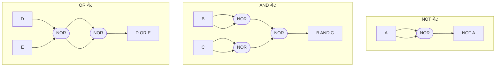

**સ્મૃતિસહાય:** "NOT માટે એક NOR, દરેકને NOT કરીને NOR કરો AND માટે, બે વાર NOR કરો OR માટે"

## પ્રશ્ન 2 [વૈકલ્પિક પ્રશ્ન] (બ) [4 ગુણ]

**નીચેના લૉજિક ગેટનો લૉજિક સિમ્બોલ, ટ્રુથ ટેબલ અને સમીકરણ લખો/દોરો (i) NOR ગેટ (ii) AND ગેટ**

**જવાબ**:

**NOR ગેટ:**

**લૉજિક સિમ્બોલ:**

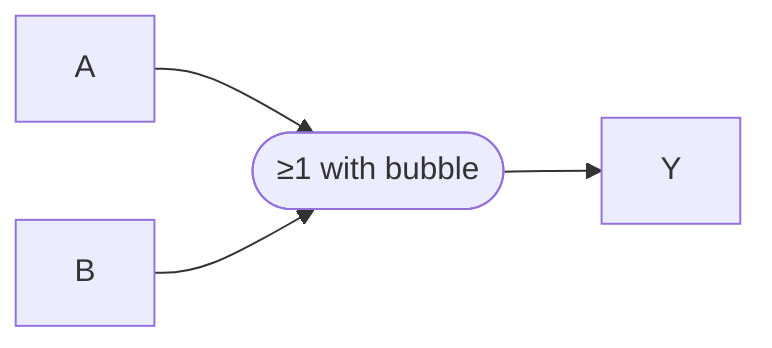

**ટ્રુથ ટેબલ:**

| A | B | Y (A+B)' |
|---|---|----------|
| 0 | 0 | 1        |
| 0 | 1 | 0        |
| 1 | 0 | 0        |
| 1 | 1 | 0        |

**બુલિયન સમીકરણ:** Y = (A+B)' = A'B'

**AND ગેટ:**

**લૉજિક સિમ્બોલ:**

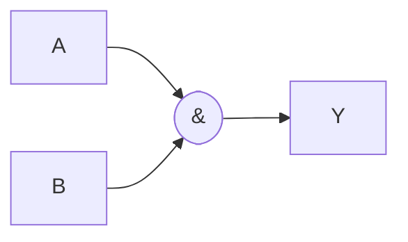

**ટ્રુથ ટેબલ:**

| A | B | Y (A·B) |
|---|---|---------|
| 0 | 0 | 0       |
| 0 | 1 | 0       |
| 1 | 0 | 0       |
| 1 | 1 | 1       |

**બુલિયન સમીકરણ:** Y = A·B

**સ્મૃતિસહાય:** "NOR: NOT OR - ન તો એક કે ન તો બીજું; AND: બંને 1 હોવા જ જોઈએ"

## પ્રશ્ન 2 [વૈકલ્પિક પ્રશ્ન] (ક) [7 ગુણ]

**ઉપરની લૉજિક સર્કિટ માટે બુલિયન સમીકરણ લખો. આ સમીકરણને સરળ બનાવો અને આ સરળ સમીકરણની લૉજિક સર્કિટ AND-OR-Invert મેથડથી દોરો**

**જવાબ**:

**પગલું 1:** સર્કિટમાંથી બુલિયન સમીકરણ લખો:
Q = (A + B) · (B + C · ((B + C)'))
Q = (A + B) · (B + C · (B' · C'))
Q = (A + B) · (B + C · B' · C')

**પગલું 2:** સમીકરણને સરળ બનાવો:

- નોંધ કરો કે C · C' = 0
- તેથી, C · B' · C' = 0
- એટલે Q = (A + B) · (B + 0) = (A + B) · B = A·B + B·B = A·B + B = B + A·B = B(1 + A) = B

**પગલું 3:** અંતિમ સરળ સમીકરણ: Q = B

**પગલું 4:** AND-OR-Invert દ્વારા Q = B નું અમલીકરણ:

- આ ફક્ત ઇનપુટ B થી આઉટપુટ Q સુધીનો એક તાર છે


**કોષ્ટક: સરળીકરણ પગલાં**

| પગલું | સમીકરણ                      | સરળીકરણ                |
|------|--------------------------------|--------------------------|
| 1    | (A + B) · (B + C · ((B + C)')) | મૂળ સમીકરણ              |
| 2    | (A + B) · (B + C · B' · C')    | ડી મોર્ગનનો નિયમ લાગુ કરવો |
| 3    | (A + B) · (B + 0)              | C · C' = 0              |
| 4    | (A + B) · B                    | સરળીકરણ                 |
| 5    | A·B + B·B                      | વિતરણ ગુણધર્મ             |
| 6    | A·B + B                        | આઇડેમ્પોટન્ટ ગુણધર્મ (B·B=B)|
| 7    | B(1 + A)                       | ફેક્ટરિંગ                 |
| 8    | B                              | 1 + A = 1               |

**સ્મૃતિસહાય:** "જ્યારે પૂરક ચલ ગુણાકાર કરે, તેઓ શૂન્ય થાય"

## પ્રશ્ન 3(અ) [3 ગુણ]

**કોમ્બીનેશનલ સર્કિટની વ્યાખ્યા લખો. કોમ્બીનેશનલ સર્કિટના બે ઉદાહરણ લખો**

**જવાબ**:

**કોમ્બીનેશનલ સર્કિટ:** એક ડિજિટલ સર્કિટ જેનું આઉટપુટ માત્ર વર્તમાન ઇનપુટ મૂલ્યો પર આધારિત હોય છે અને અગાઉના ઇનપુટ અથવા સ્થિતિઓ પર નહીં. કોમ્બીનેશનલ સર્કિટમાં કોઈ મેમરી અથવા ફીડબેક હોતા નથી.

**મુખ્ય લક્ષણો:**

- આઉટપુટ ફક્ત વર્તમાન ઇનપુટ પર આધારિત હોય છે
- કોઈ મેમરી એલિમેન્ટ નથી
- કોઈ ફીડબેક પાથ નથી

**કોમ્બીનેશનલ સર્કિટના ઉદાહરણો:**

1. મલ્ટિપ્લેક્સર (MUX)
2. ડિકોડર
3. એડર/સબટ્રેક્ટર
4. એનકોડર
5. કમ્પેરેટર

**કોષ્ટક: કોમ્બીનેશનલ vs સિક્વેન્શિયલ સર્કિટ**

| લક્ષણ     | કોમ્બીનેશનલ સર્કિટ | સિક્વેન્શિયલ સર્કિટ |
|----------------|----------------------|-------------------|
| મેમરી         | ના                   | હા               |
| ફીડબેક       | ના                   | સામાન્ય રીતે      |
| આઉટપુટ આધારિત | માત્ર વર્તમાન ઇનપુટ | વર્તમાન અને અગાઉના ઇનપુટ |
| ઉદાહરણો       | મલ્ટિપ્લેક્સર, એડર | ફ્લિપ-ફ્લોપ, કાઉન્ટર |

**સ્મૃતિસહાય:** "કોમ્બીનેશનલ સર્કિટ: વર્તમાન આવે, વર્તમાન જાય - કોઈ યાદ નહીં"

## પ્રશ્ન 3(બ) [4 ગુણ]

**લૉજિક સર્કિટ અને ટ્રુથ ટેબલની મદદથી હાફ એડર સમજાવો**

**જવાબ**:

**હાફ એડર:** એક કોમ્બીનેશનલ સર્કિટ જે બે બાયનરી અંકો ઉમેરે છે અને સમ અને કેરી આઉટપુટ ઉત્પન્ન કરે છે.

**લૉજિક સર્કિટ:**

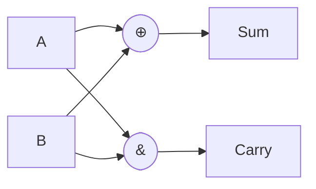

**ટ્રુથ ટેબલ:**

| A | B | Sum | Carry |
|---|---|-----|-------|
| 0 | 0 | 0   | 0     |
| 0 | 1 | 1   | 0     |
| 1 | 0 | 1   | 0     |
| 1 | 1 | 0   | 1     |

**બુલિયન સમીકરણ:**

- Sum = A ⊕ B = A'B + AB'
- Carry = A · B

**મર્યાદાઓ:**

- ત્રણ બાયનરી અંકો ઉમેરી શકતા નથી
- અગાઉના તબક્કામાંથી કેરી ઇનપુટ સમાવી શકતા નથી

**સ્મૃતિસહાય:** "XOR સમને માટે, AND કેરીને માટે"

## પ્રશ્ન 3(ક)(I) [3 ગુણ]

**મલ્ટિપ્લેક્સર ટૂંકમાં સમજાવો**

**જવાબ**:

**મલ્ટિપ્લેક્સર (MUX):** એક કોમ્બીનેશનલ સર્કિટ જે સિલેક્ટ લાઇન્સના આધારે અનેક ઇનપુટ સિગ્નલ્સમાંથી એકને પસંદ કરે છે અને તેને એક આઉટપુટ લાઇન પર મોકલે છે.

**મુખ્ય લક્ષણો:**

- ડિજિટલ સ્વિચ તરીકે કાર્ય કરે છે
- 2ⁿ ડેટા ઇનપુટ, n સિલેક્ટ લાઇન, અને 1 આઉટપુટ ધરાવે છે
- સિલેક્ટ લાઇન્સ નક્કી કરે છે કે કયું ઇનપુટ આઉટપુટથી જોડાયેલું છે

**સામાન્ય મલ્ટિપ્લેક્સર:**

- 2:1 MUX (1 સિલેક્ટ લાઇન)
- 4:1 MUX (2 સિલેક્ટ લાઇન)
- 8:1 MUX (3 સિલેક્ટ લાઇન)

**મૂળભૂત રચના:**

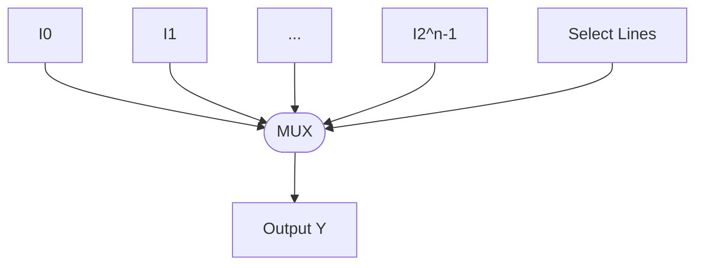

**ઉપયોગો:**

- ડેટા રાઉટિંગ
- ડેટા પસંદગી
- પેરેલલથી સીરિયલ રૂપાંતર
- બુલિયન ફંક્શનનું અમલીકરણ

**સ્મૃતિસહાય:** "ઘણા ઇન, સિલેક્શન પસંદ કરે, એક આઉટ"

## પ્રશ્ન 3(ક)(II) [4 ગુણ]

**8:1 મલ્ટિપ્લેક્સર ડિઝાઇન કરો. તેનું ટ્રુથ ટેબલ લખો અને લૉજિક સર્કિટ દોરો**

**જવાબ**:

**8:1 મલ્ટિપ્લેક્સર ડિઝાઇન:**

- 8 ડેટા ઇનપુટ (I₀ થી I₇)
- 3 સિલેક્ટ લાઇન (S₂, S₁, S₀)
- 1 આઉટપુટ (Y)

**ટ્રુથ ટેબલ:**

| S₂ | S₁ | S₀ | આઉટપુટ Y |
|----|----|----|----------|
| 0  | 0  | 0  | I₀       |
| 0  | 0  | 1  | I₁       |
| 0  | 1  | 0  | I₂       |
| 0  | 1  | 1  | I₃       |
| 1  | 0  | 0  | I₄       |
| 1  | 0  | 1  | I₅       |
| 1  | 1  | 0  | I₆       |
| 1  | 1  | 1  | I₇       |

**બુલિયન સમીકરણ:**
Y = S₂'·S₁'·S₀'·I₀ + S₂'·S₁'·S₀·I₁ + S₂'·S₁·S₀'·I₂ + S₂'·S₁·S₀·I₃ + S₂·S₁'·S₀'·I₄ + S₂·S₁'·S₀·I₅ + S₂·S₁·S₀'·I₆ + S₂·S₁·S₀·I₇

**લૉજિક સર્કિટ:**

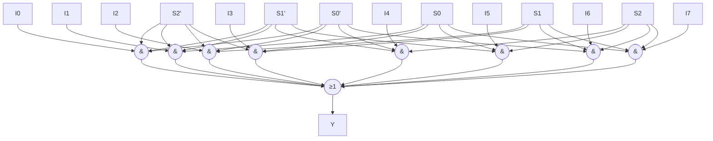

**સ્મૃતિસહાય:** "આઠ ઇનપુટ, ત્રણ સિલેક્ટ, ડિકોડ કરો અને આઉટપુટ મેળવવા OR કરો"

## પ્રશ્ન 3 [વૈકલ્પિક પ્રશ્ન] (અ) [3 ગુણ]

**4-bit બાયનરી પેરેલલ એડરનો બ્લોક ડાયાગ્રામ દોરો**

**જવાબ**:

**4-bit બાયનરી પેરેલલ એડર:**
બે 4-bit બાયનરી નંબર ઉમેરતી અને 4-bit સરવાળો અને એક કેરી આઉટપુટ ઉત્પન્ન કરતી સર્કિટ.

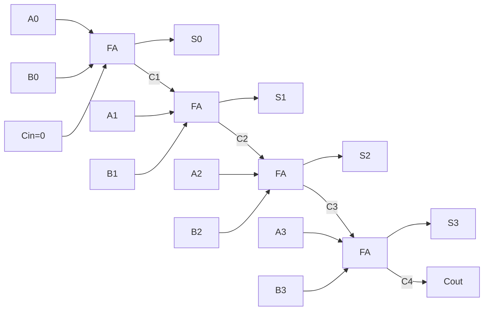

**ઘટકો:**

- ચાર ફુલ એડર (FA) કેસ્કેડમાં જોડાયેલા
- દરેક FA સંબંધિત બિટ્સ અને અગાઉના તબક્કાની કેરી ઉમેરે છે
- પ્રારંભિક કેરી-ઇન (Cin) સામાન્ય રીતે 0 હોય છે

**સ્મૃતિસહાય:** "ચાર FA જોડાયેલા, કેરીઓ વચ્ચેથી પસાર થાય છે"

## પ્રશ્ન 3 [વૈકલ્પિક પ્રશ્ન] (બ) [4 ગુણ]

**લૉજિક સર્કિટ અને ટ્રુથ ટેબલની મદદથી ફૂલ એડર સમજાવો**

**જવાબ**:

**ફૂલ એડર:** એક કોમ્બીનેશનલ સર્કિટ જે ત્રણ બાયનરી અંક (બે ઇનપુટ અને એક કેરી-ઇન) ઉમેરે છે અને સરવાળો અને કેરી આઉટપુટ ઉત્પન્ન કરે છે.

**લૉજિક સર્કિટ:**

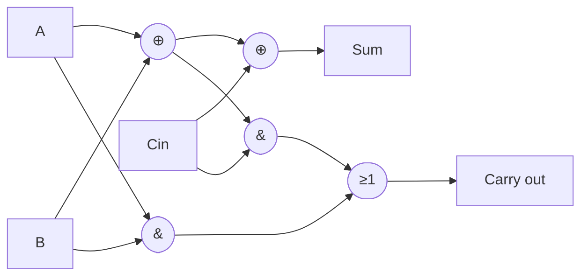

**ટ્રુથ ટેબલ:**

| A | B | Cin | Sum | Cout |
|---|---|-----|-----|------|
| 0 | 0 | 0   | 0   | 0    |
| 0 | 0 | 1   | 1   | 0    |
| 0 | 1 | 0   | 1   | 0    |
| 0 | 1 | 1   | 0   | 1    |
| 1 | 0 | 0   | 1   | 0    |
| 1 | 0 | 1   | 0   | 1    |
| 1 | 1 | 0   | 0   | 1    |
| 1 | 1 | 1   | 1   | 1    |

**બુલિયન સમીકરણ:**

- Sum = A ⊕ B ⊕ Cin
- Cout = A·B + (A⊕B)·Cin

**સ્મૃતિસહાય:** "ત્રણેય XOR કરો સમ માટે, ANDsને OR કરો કેરી માટે"

## પ્રશ્ન 3 [વૈકલ્પિક પ્રશ્ન] (ક) (I) [3 ગુણ]

**લૉજિક સર્કિટ અને ટ્રુથ ટેબલની મદદથી 4:1 મલ્ટિપ્લેક્સર સમજાવો**

**જવાબ**:

**4:1 મલ્ટિપ્લેક્સર:** એક ડિજિટલ સ્વિચ જે બે સિલેક્ટ લાઇન્સના આધારે ચાર ઇનપુટ લાઇન્સમાંથી એકને પસંદ કરે છે અને તેને આઉટપુટથી જોડે છે.

**લૉજિક સર્કિટ:**

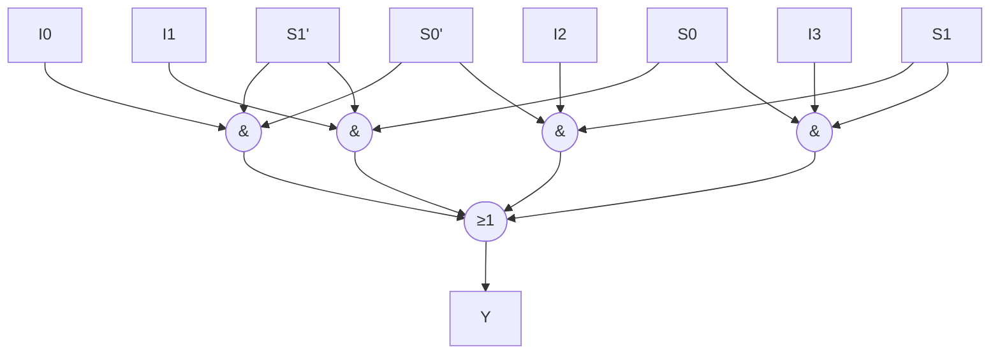

**ટ્રુથ ટેબલ:**

| S1 | S0 | આઉટપુટ Y |
|----|----|---------| 
| 0  | 0  | I0      |
| 0  | 1  | I1      |
| 1  | 0  | I2      |
| 1  | 1  | I3      |

**બુલિયન સમીકરણ:**
Y = S1'·S0'·I0 + S1'·S0·I1 + S1·S0'·I2 + S1·S0·I3

**સ્મૃતિસહાય:** "બે સિલેક્ટ લાઇન ચાર ઇનપુટમાંથી એક પસંદ કરે છે"

## પ્રશ્ન 3 [વૈકલ્પિક પ્રશ્ન] (ક) (II) [4 ગુણ]

**બે 4:1 મલ્ટિપ્લેક્સરનો ઉપયોગ કરીને 8:1 મલ્ટિપ્લેક્સર ડિઝાઇન કરો.**

**જવાબ**:

**ડિઝાઇન અભિગમ:** 8:1 MUX બનાવવા માટે બે 4:1 MUX અને એક 2:1 MUX વાપરો.

1. પ્રથમ 4:1 MUX ઇનપુટ I0-I3 સંભાળે છે, સિલેક્ટ લાઇન S0,S1નો ઉપયોગ કરીને
2. બીજો 4:1 MUX ઇનપુટ I4-I7 સંભાળે છે, સિલેક્ટ લાઇન S0,S1નો ઉપયોગ કરીને
3. 2:1 MUX બે 4:1 MUXના આઉટપુટ વચ્ચે S2નો ઉપયોગ કરીને પસંદગી કરે છે

**બ્લોક ડાયાગ્રામ:**

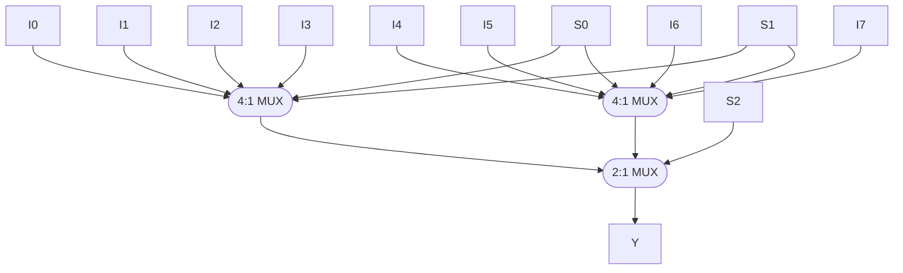

**ટ્રુથ ટેબલ:**

| S2 | S1 | S0 | આઉટપુટ Y |
|----|----|----|----------|
| 0  | 0  | 0  | I0       |
| 0  | 0  | 1  | I1       |
| 0  | 1  | 0  | I2       |
| 0  | 1  | 1  | I3       |
| 1  | 0  | 0  | I4       |
| 1  | 0  | 1  | I5       |
| 1  | 1  | 0  | I6       |
| 1  | 1  | 1  | I7       |

**સ્મૃતિસહાય:** "S0,S1 દરેક 4:1 MUXમાંથી પસંદ કરે છે, S2 તેમની વચ્ચે પસંદ કરે છે"

## પ્રશ્ન 4(અ) [3 ગુણ]

**સિક્વન્સીયલ સર્કિટની વ્યાખ્યા લખો. તેના બે ઉદાહરણ લખો**

**જવાબ**:

**સિક્વન્સીયલ સર્કિટ:** એક ડિજિટલ સર્કિટ જેનું આઉટપુટ માત્ર વર્તમાન ઇનપુટ પર જ નહીં પણ ઇનપુટના ભૂતકાળના ક્રમ (ઇતિહાસ/અગાઉની સ્થિતિ) પર પણ આધારિત હોય છે.

**મુખ્ય લક્ષણો:**

- મેમરી એલિમેન્ટ્સ (ફ્લિપ-ફ્લોપ) ધરાવે છે
- આઉટપુટ વર્તમાન ઇનપુટ અને અગાઉની સ્થિતિઓ બંને પર આધારિત છે
- સામાન્ય રીતે ફીડબેક પાથ સમાવે છે
- સિંક્રોનાઇઝેશન માટે ક્લોક સિગ્નલની જરૂર પડે છે (સિંક્રોનસ સર્કિટ માટે)

**સિક્વન્સીયલ સર્કિટના ઉદાહરણો:**

1. ફ્લિપ-ફ્લોપ (SR, JK, D, T)
2. રજિસ્ટર (શિફ્ટ રજિસ્ટર)
3. કાઉન્ટર (બાયનરી, ડેકેડ, રિંગ કાઉન્ટર)
4. સ્ટેટ મશીન
5. મેમરી યુનિટ

**કોષ્ટક: સિક્વન્સીયલ vs કોમ્બીનેશનલ સર્કિટ**

| લક્ષણ      | સિક્વન્સીયલ સર્કિટ | કોમ્બીનેશનલ સર્કિટ |
|----------------|-------------------|----------------------|
| મેમરી         | હા                | ના                    |
| ફીડબેક        | સામાન્ય રીતે      | ના                    |
| આઉટપુટ આધારિત | વર્તમાન & અગાઉના ઇનપુટ | માત્ર વર્તમાન ઇનપુટ  |
| ક્લોક જરૂરી    | સામાન્ય રીતે      | ના                    |
| ઉદાહરણો       | ફ્લિપ-ફ્લોપ, કાઉન્ટર | મલ્ટિપ્લેક્સર, એડર   |

**સ્મૃતિસહાય:** "સિક્વન્સીયલ ઇતિહાસ યાદ રાખે છે, કોમ્બીનેશનલ માત્ર વર્તમાન જાણે છે"

## પ્રશ્ન 4(બ) [4 ગુણ]

**ડિકેડ કાઉન્ટર ડિઝાઇન કરો**

**જવાબ**:

**ડિકેડ કાઉન્ટર:** એક સિક્વન્સીયલ સર્કિટ જે 0 થી 9 (ડેસિમલ) સુધી ગણે છે અને પછી 0 પર રીસેટ થાય છે.

**JK ફ્લિપ-ફ્લોપનો ઉપયોગ કરી ડિઝાઇન:**

- 4 બિટ બાયનરી નંબર રજૂ કરવા માટે 4 JK ફ્લિપ-ફ્લોપ (Q3,Q2,Q1,Q0) જરૂરી છે
- 0000 થી 1001 (0-9 ડેસિમલ) સુધી ગણે છે પછી રીસેટ થાય છે

**સ્ટેટ ટેબલ:**

| વર્તમાન સ્થિતિ | આગામી સ્થિતિ |
|---------------|------------|
| 0 (0000)      | 1 (0001)   |
| 1 (0001)      | 2 (0010)   |
| 2 (0010)      | 3 (0011)   |
| 3 (0011)      | 4 (0100)   |
| 4 (0100)      | 5 (0101)   |
| 5 (0101)      | 6 (0110)   |
| 6 (0110)      | 7 (0111)   |
| 7 (0111)      | 8 (1000)   |
| 8 (1000)      | 9 (1001)   |
| 9 (1001)      | 0 (0000)   |

**બ્લોક ડાયાગ્રામ:**

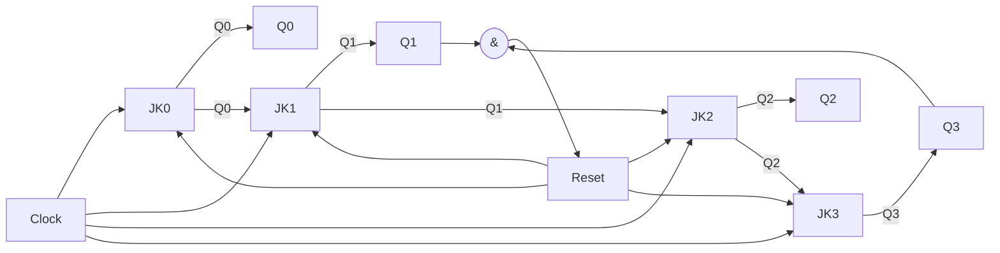

**J-K ઇનપુટ સમીકરણ:**

- J0 = K0 = 1 (દરેક ક્લોક પર ટોગલ)
- J1 = K1 = Q0
- J2 = K2 = Q1·Q0
- J3 = K3 = Q2·Q1·Q0

**રીસેટ સ્થિતિ:** જ્યારે Q3·Q1 = 1 (સ્થિતિ 1010), બધા ફ્લિપ-ફ્લોપ રીસેટ કરો

**સ્મૃતિસહાય:** "BCD ગણો, 9 પછી રીસેટ"

## પ્રશ્ન 4(ક)(I) [3 ગુણ]

**NOR ગેટની મદદથી S-R ફ્લિપ-ફ્લોપ સમજાવો. તેનો લૉજિક સિમ્બોલ દોરો અને ટ્રુથ ટેબલ લખો.**

**જવાબ**:

**NOR ગેટથી S-R ફ્લિપ-ફ્લોપ:** બે ક્રોસ-કપલ્ડ NOR ગેટમાંથી બનેલું એક મૂળભૂત ફ્લિપ-ફ્લોપ જે એક બિટની માહિતી સંગ્રહિત કરી શકે છે.

**લૉજિક સર્કિટ:**

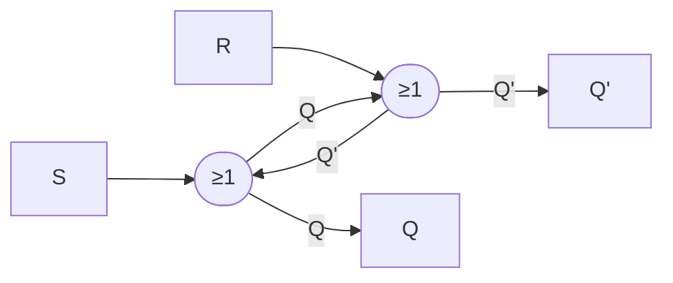

**લૉજિક સિમ્બોલ:**

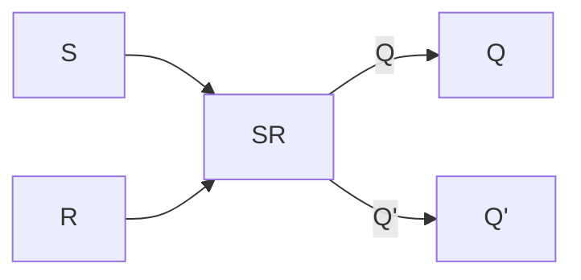

**ટ્રુથ ટેબલ:**

| S | R | Q (આગામી) | Q' (આગામી) | ઓપરેશન      |
|---|---|----------|-----------|----------------|
| 0 | 0 | Q (અગાઉની) | Q' (અગાઉની) | મેમરી (કોઈ ફેરફાર નહીં) |
| 0 | 1 | 0        | 1         | રીસેટ          |
| 1 | 0 | 1        | 0         | સેટ            |
| 1 | 1 | 0        | 0         | અમાન્ય (ટાળો) |

**સ્મૃતિસહાય:** "S થી 1 સેટ થાય, R થી 0 રીસેટ થાય, બંને એકસાથે અમાન્ય સ્થિતિ આપે"

## પ્રશ્ન 4(ક)(II) [4 ગુણ]

**NAND ગેટની મદદથી S-R ફ્લિપ-ફ્લોપ સમજાવો. S-R ફ્લિપ-ફ્લોપની મર્યાદા લખો**

**જવાબ**:

**NAND ગેટથી S-R ફ્લિપ-ફ્લોપ:** બે ક્રોસ-કપલ્ડ NAND ગેટમાંથી બનેલું એક મૂળભૂત ફ્લિપ-ફ્લોપ.

**લૉજિક સર્કિટ:**

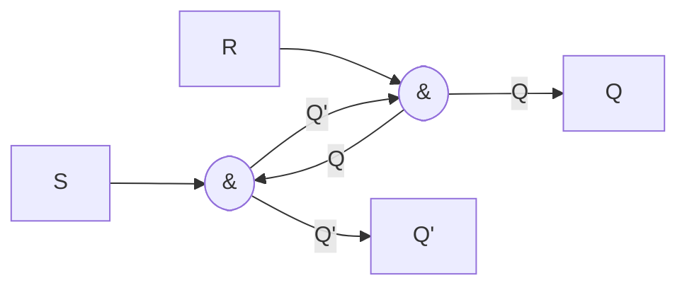

**ટ્રુથ ટેબલ:**

| S | R | Q (આગામી) | Q' (આગામી) | ઓપરેશન      |
|---|---|----------|-----------|----------------|
| 1 | 1 | Q (અગાઉની) | Q' (અગાઉની) | મેમરી (કોઈ ફેરફાર નહીં) |
| 1 | 0 | 1        | 0         | સેટ            |
| 0 | 1 | 0        | 1         | રીસેટ          |
| 0 | 0 | 1        | 1         | અમાન્ય (ટાળો) |

**SR ફ્લિપ-ફ્લોપની મર્યાદાઓ:**

1. **અમાન્ય સ્થિતિ:** જ્યારે S=1, R=1 (NOR માટે) અથવા S=0, R=0 (NAND માટે), આઉટપુટ અનિશ્ચિત રહે છે
2. **રેસ કન્ડિશન:** જ્યારે ઇનપુટ એકસાથે બદલાય છે, ત્યારે અંતિમ સ્થિતિ અનિશ્ચિત હોઈ શકે છે
3. **ક્લોકિંગ મેકેનિઝમ નથી:** અન્ય ડિજિટલ ઘટકો સાથે સિંક્રોનાઇઝ થઈ શકતું નથી
4. **એજ-ટ્રિગર્ડ નથી:** ટૂંકા પલ્સને વિશ્વસનીય રીતે પ્રતિક્રિયા આપી શકતું નથી
5. **અનિચ્છનીય ટોગલિંગ:** નોઇઝ કે ગ્લિચને પ્રતિક્રિયા આપી શકે છે

**કોષ્ટક: NAND vs NOR SR ફ્લિપ-ફ્લોપ**

| લક્ષણ | NAND SR ફ્લિપ-ફ્લોપ | NOR SR ફ્લિપ-ફ્લોપ |
|----------------|-------------------|------------------|
| સક્રિય ઇનપુટ  | લો (0)           | હાઇ (1)           |
| નિષ્ક્રિય ઇનપુટ| હાઇ (1)          | લો (0)            |
| અમાન્ય સ્થિતિ  | S=0, R=0          | S=1, R=1         |

**સ્મૃતિસહાય:** "NAND: ઇનપુટ એક્ટિવ-લો, NOR: ઇનપુટ એક્ટિવ-હાઇ; બંનેમાં એક અમાન્ય સ્થિતિ છે"

## પ્રશ્ન 4 [વૈકલ્પિક પ્રશ્ન] (અ) [3 ગુણ]

**ફ્લિપ-ફ્લોપની વ્યાખ્યા લખો. ફ્લિપ-ફ્લોપના પ્રકાર લખો**

**જવાબ**:

**ફ્લિપ-ફ્લોપ:** એક મૂળભૂત સિક્વન્સીયલ ડિજિટલ સર્કિટ જે એક બિટની માહિતી સંગ્રહિત કરી શકે છે અને બે સ્થાયી સ્થિતિઓ (0 અથવા 1) ધરાવે છે. તે ડિજિટલ સિસ્ટમમાં મૂળભૂત મેમરી એલિમેન્ટ તરીકે કામ કરે છે.

**મુખ્ય લક્ષણો:**

- બાયસ્ટેબલ મલ્ટિવાયબ્રેટર (બે સ્થાયી સ્થિતિઓ)
- જ્યાં સુધી બદલવાનો નિર્દેશ ન અપાય ત્યાં સુધી પોતાની સ્થિતિ અનિશ્ચિત સમય સુધી જાળવી રાખી શકે છે
- રજિસ્ટર, કાઉન્ટર અને મેમરી સર્કિટ માટે મૂળભૂત બિલ્ડિંગ બ્લોક બને છે
- ક્લોક સિગ્નલ (સિંક્રોનસ) અથવા લેવલ ચેન્જ (એસિંક્રોનસ) દ્વારા ટ્રિગર થઈ શકે છે

**ફ્લિપ-ફ્લોપના પ્રકાર:**

| ફ્લિપ-ફ્લોપ પ્રકાર | વર્ણન |
|----------------|-------------|
| SR (સેટ-રીસેટ) | સૌથી મૂળભૂત ફ્લિપ-ફ્લોપ જેમાં સેટ અને રીસેટ ઇનપુટ હોય છે |
| JK | SR ફ્લિપ-ફ્લોપની સુધારેલી આવૃત્તિ જે અમાન્ય સ્થિતિ દૂર કરે છે |
| D (ડેટા) | ઇનપુટ D પરનો મૂલ્ય સંગ્રહિત કરે છે, ડેટા સ્ટોરેજ માટે વપરાય છે |
| T (ટોગલ) | ટ્રિગર થયે સ્થિતિ બદલે છે, કાઉન્ટર માટે ઉપયોગી |
| માસ્ટર-સ્લેવ | રેસ કન્ડિશન અટકાવતું બે-તબક્કાનું ફ્લિપ-ફ્લોપ |

**સ્મૃતિસહાય:** "એક સિંગલ સ્ટેટ સ્ટોરેજ: SR, JK, D, T"

## પ્રશ્ન 4 [વૈકલ્પિક પ્રશ્ન] (બ) [4 ગુણ]

**3-bit રિંગ કાઉન્ટર ડિઝાઇન કરો**

**જવાબ**:

**રિંગ કાઉન્ટર:** એક સર્ક્યુલર શિફ્ટ રજિસ્ટર જેમાં ફક્ત એક બિટ સેટ (1) હોય છે અને બાકી બધા રીસેટ (0) હોય છે. એકમાત્ર સેટ બિટ ક્લોક થતાં રજિસ્ટરમાં "ફરે" છે.

**D ફ્લિપ-ફ્લોપનો ઉપયોગ કરી ડિઝાઇન:**

- 3-bit કાઉન્ટર માટે 3 D ફ્લિપ-ફ્લોપ જરૂરી છે
- પ્રારંભિક સ્થિતિ: 100, પછી 010, 001, અને પાછા 100 પર જાય છે

**સ્ટેટ ટેબલ:**

| વર્તમાન સ્થિતિ | આગામી સ્થિતિ |
|---------------|------------|
| 100          | 010         |
| 010          | 001         |
| 001          | 100         |

**બ્લોક ડાયાગ્રામ:**

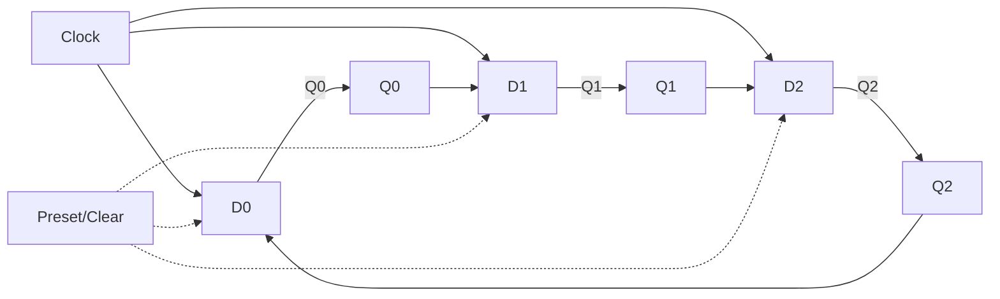

**D ઇનપુટ સમીકરણ:**

- D0 = Q2
- D1 = Q0
- D2 = Q1

**પ્રારંભિક સ્થિતિ સેટિંગ:** FF0ને 1 પર પ્રીસેટ કરો, FF1 અને FF2ને 0 પર ક્લિયર કરો

**સ્મૃતિસહાય:** "એક હોટ બિટ વર્તુળમાં ફરે છે"

## પ્રશ્ન 4 [વૈકલ્પિક પ્રશ્ન] (ક)(I) [3 ગુણ]

**લૉજિક સિમ્બોલ અને ટ્રુથ ટેબલની મદદથી J-K ફ્લિપ-ફ્લોપ સમજાવો**

**જવાબ**:

**J-K ફ્લિપ-ફ્લોપ:** SR ફ્લિપ-ફ્લોપની સુધારેલી આવૃત્તિ જે અમાન્ય સ્થિતિ દૂર કરે છે અને બધા ઇનપુટ સંયોજનોમાં સચોટ વર્તન દર્શાવે છે.

**લૉજિક સિમ્બોલ:**

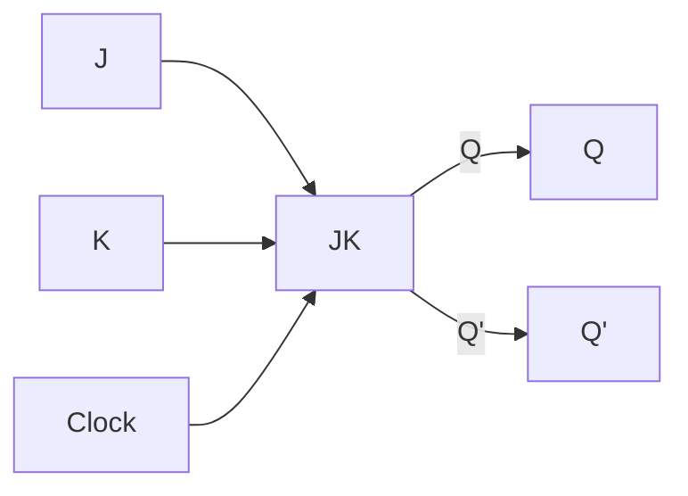

**ટ્રુથ ટેબલ:**

| J | K | Q (આગામી) | ઓપરેશન     |
|---|---|----------|---------------|
| 0 | 0 | Q (અગાઉની) | કોઈ ફેરફાર નહીં |
| 0 | 1 | 0        | રીસેટ        |
| 1 | 0 | 1        | સેટ          |
| 1 | 1 | Q' (અગાઉની)| ટોગલ         |

**મુખ્ય લક્ષણો:**

- જ્યારે J=K=1, ફ્લિપ-ફ્લોપ ટોગલ થાય છે (વિપરીત સ્થિતિમાં જાય છે)
- SR ફ્લિપ-ફ્લોપ જેવી કોઈ અમાન્ય સ્થિતિ નથી
- બધા ઓપરેશન કરી શકે છે: સેટ, રીસેટ, હોલ્ડ, ટોગલ

**સ્મૃતિસહાય:** "J સેટ કરે, K રીસેટ કરે, બંને ટોગલ કરે, કોઈ નહીં યાદ રાખે"

## પ્રશ્ન 4 [વૈકલ્પિક પ્રશ્ન] (ક)(II) [4 ગુણ]

**J-K ફ્લિપ-ફ્લોપનો ઉપયોગ કરી D ફ્લિપ-ફ્લોપ અને T ફ્લિપ-ફ્લોપની લૉજિક સર્કિટ દોરો**

**જવાબ**:

**JK ફ્લિપ-ફ્લોપનો ઉપયોગ કરી D ફ્લિપ-ફ્લોપ:**

JKને D ફ્લિપ-ફ્લોપમાં બદલવા માટે:

- D ઇનપુટને J સાથે જોડો
- D' (NOT D)ને K સાથે જોડો

**લૉજિક સર્કિટ:**

```mermaid
graph LR
    D[D] --> J[J]
    D --> NOT[NOT]
    NOT --> K[K]
    J --> JK[JK Flip-flop]
    K --> JK
    CLK[Clock] --> JK
    JK --Q--> Q[Q]
    JK --Q'--> Qn[Q']
```

**JK ફ્લિપ-ફ્લોપનો ઉપયોગ કરી T ફ્લિપ-ફ્લોપ:**

JKને T ફ્લિપ-ફ્લોપમાં બદલવા માટે:

- T ઇનપુટને J અને K બંને સાથે જોડો

**લૉજિક સર્કિટ:**

```mermaid
graph LR
    T[T] --> J[J]
    T --> K[K]
    J --> JK[JK Flip-flop]
    K --> JK
    CLK[Clock] --> JK
    JK --Q--> Q[Q]
    JK --Q'--> Qn[Q']
```

**ટ્રુથ ટેબલ:**

**D ફ્લિપ-ફ્લોપ:**

| D | Q (આગામી) | ઓપરેશન |
|---|----------|-----------|
| 0 | 0        | રીસેટ     |
| 1 | 1        | સેટ       |

**T ફ્લિપ-ફ્લોપ:**

| T | Q (આગામી)  | ઓપરેશન |
|---|-----------|-----------|
| 0 | Q (અગાઉની)  | કોઈ ફેરફાર નહીં |
| 1 | Q' (અગાઉની) | ટોગલ    |

**સ્મૃતિસહાય:** "D સીધું અનુસરે, T સાચું હોય ત્યારે ટોગલ થાય"

## પ્રશ્ન 5(અ) [3 ગુણ]

**RAM અને ROMની સરખામણી કરો**

**જવાબ**:

**RAM (Random Access Memory) vs ROM (Read-Only Memory):**

**કોષ્ટક: RAM vs ROM સરખામણી**

| લક્ષણ | RAM | ROM |
|----------------|-----|-----|
| **પૂર્ણ નામ** | Random Access Memory | Read-Only Memory |
| **ડેટા નિભાવણી** | અસ્થાયી (પાવર બંધ થતાં ડેટા ગુમાવે) | સ્થાયી (પાવર વિના પણ ડેટા જળવાય) |
| **વાંચન/લેખન ક્ષમતા** | વાંચન અને લેખન બંને | મુખ્યત્વે માત્ર વાંચન (PROM, EPROM, EEPROM સિવાય) |
| **ગતિ** | વધુ ઝડપી | ધીમી |
| **બિટ દીઠ ખર્ચ** | વધુ | ઓછો |
| **ઉપયોગો** | અસ્થાયી ડેટા સ્ટોરેજ, સક્રિય પ્રોગ્રામ એક્ઝિક્યુશન | બૂટ સૂચનાઓ, ફર્મવેર, કાયમી ડેટા |
| **પ્રકારો** | SRAM, DRAM | Mask ROM, PROM, EPROM, EEPROM, Flash |
| **સેલ જટિલતા** | વધુ જટિલ | સરળ |

**સ્મૃતિસહાય:** "RAM વાંચે અને સુધારે (પણ ભૂલી જાય), ROM શટડાઉન પર યાદ રાખે (પણ નિશ્ચિત)"

## પ્રશ્ન 5(બ) [4 ગુણ]

**સિરિયલ ઇન સિરિયલ આઉટ શિફ્ટ રજીસ્ટર સમજાવો**

**જવાબ**:

**સિરિયલ ઇન સિરિયલ આઉટ (SISO) શિફ્ટ રજિસ્ટર:** એક સિક્વન્સીયલ સર્કિટ જે ઇનપુટ અને આઉટપુટ બંને પર ડેટાને એક સમયે એક બિટ શિફ્ટ કરે છે.

**કાર્યપદ્ધતિ:**

- ડેટા સિરિયલી એક બિટ એક વખતે દાખલ થાય છે
- દરેક ક્લોક પલ્સ પર દરેક બિટ રજિસ્ટરમાંથી શિફ્ટ થાય છે
- ડેટા સિરિયલી એક બિટ એક વખતે બહાર નીકળે છે
- પ્રથમ-ઇન, પ્રથમ-આઉટ કાર્યપદ્ધતિ

**બ્લોક ડાયાગ્રામ:**

```mermaid
graph LR
    SI[Serial In] --> FF0[D0]
    CLK[Clock] --> FF0
    CLK --> FF1
    CLK --> FF2
    CLK --> FF3
    
    FF0 --Q0--> FF1[D1]
    FF1 --Q1--> FF2[D2]
    FF2 --Q2--> FF3[D3]
    FF3 --Q3--> SO[Serial Out]
```

**"1011" શિફ્ટ કરવા માટે ટાઇમિંગ ડાયાગ્રામ:**

```
CLK   _|‾|_|‾|_|‾|_|‾|_|‾|_
SI    __|‾|_|‾|‾|_________
Q0    ______|‾|_|‾|‾|_____
Q1    ________|‾|_|‾|‾|___
Q2    ____________|‾|_|‾|‾|
SO    ______________|‾|_|‾|
```

**ઉપયોગો:**

- ડિજિટલ સિસ્ટમ વચ્ચે ડેટા ટ્રાન્સમિશન
- સિરિયલ-થી-સિરિયલ ડેટા રૂપાંતર
- સમય વિલંબ સર્કિટ
- સિગ્નલ ફિલ્ટરિંગ

**સ્મૃતિસહાય:** "બિટ્સ લાઇનમાં પ્રવેશે, શ્રેણીમાં આગળ વધે, ક્રમમાં બહાર નીકળે"

## પ્રશ્ન 5(ક) [7 ગુણ]

**લૉજિક ફેમિલિઝ પર ટૂંક નોંધ લખો**

**જવાબ**:

**લૉજિક ફેમિલિઝ:** સમાન ઇલેક્ટ્રિકલ લક્ષણો, ફેબ્રિકેશન ટેકનોલોજી અને લૉજિક અમલીકરણ સાથેના ડિજિટલ ઇન્ટિગ્રેટેડ સર્કિટના સમૂહો.

**મુખ્ય લૉજિક ફેમિલિઝ:**

1. **TTL (ટ્રાન્ઝિસ્ટર-ટ્રાન્ઝિસ્ટર લૉજિક):**
   - બાયપોલર જંક્શન ટ્રાન્ઝિસ્ટર પર આધારિત
   - સ્ટાન્ડર્ડ સિરીઝ: 7400
   - સપ્લાય વોલ્ટેજ: 5V
   - મધ્યમ ઝડપ અને પાવર વપરાશ
   - ઊંચી નોઇઝ ઇમ્યુનિટી
   - વેરિયન્ટ: સ્ટાન્ડર્ડ TTL, લો-પાવર TTL (74L), શોટ્કી TTL (74S), એડવાન્સ્ડ શોટ્કી (74AS)

2. **CMOS (કોમ્પ્લિમેન્ટરી મેટલ-ઓક્સાઇડ-સેમિકન્ડક્ટર):**
   - MOSFETs (P-ટાઇપ અને N-ટાઇપ) પર આધારિત
   - સ્ટાન્ડર્ડ સિરીઝ: 4000, 74C00
   - વ્યાપક સપ્લાય વોલ્ટેજ રેન્જ (3-15V)
   - ખૂબ ઓછો પાવર વપરાશ
   - ઊંચી નોઇઝ ઇમ્યુનિટી
   - સ્ટેટિક ઇલેક્ટ્રિસિટી પ્રત્યે સંવેદનશીલ
   - એડવાન્સ્ડ વેરિયન્ટ: HC, HCT, AC, ACT, AHC, AHCT સિરીઝ

3. **ECL (ઇમિટર-કપલ્ડ લૉજિક):**
   - ઇમિટર-કપલ્ડ ટ્રાન્ઝિસ્ટર સાથેના ડિફરેન્શિયલ એમ્પ્લિફાયર પર આધારિત
   - અત્યંત ઊંચી ઝડપ (સૌથી ઝડપી લૉજિક ફેમિલી)
   - ઊંચો પાવર વપરાશ
   - ઓછી નોઇઝ ઇમ્યુનિટી
   - નેગેટિવ સપ્લાય વોલ્ટેજ
   - ઊંચી ઝડપની એપ્લિકેશનમાં વપરાય છે

**લૉજિક ફેમિલિઝના મુખ્ય પેરામીટર:**

| પેરામીટર | વર્ણન |
|-----------|-------------|
| **ફેન-ઇન** | ગેટ સ્વીકારી શકે તેવા ઇનપુટની મહત્તમ સંખ્યા |
| **ફેન-આઉટ** | એક આઉટપુટ દ્વારા ડ્રાઇવ થઈ શકતા ગેટની મહત્તમ સંખ્યા |
| **નોઇઝ માર્જિન** | અનિચ્છનીય ઇલેક્ટ્રિકલ નોઇઝ/સિગ્નલ સહન કરવાની ક્ષમતા |
| **પ્રોપેગેશન ડિલે** | ઇનપુટ ચેન્જ અને તેના તરત પછીના આઉટપુટ ચેન્જ વચ્ચેનો સમય વિલંબ |
| **પાવર ડિસિપેશન** | ગેટ દ્વારા વપરાતી પાવરની માત્રા |
| **ફિગર ઓફ મેરિટ** | ઝડપ અને પાવરનો ગુણાકાર (ઓછું હોવું વધુ સારું) |

**સરખામણી કોષ્ટક:**

| પેરામીટર | TTL | CMOS | ECL |
|-----------|-----|------|-----|
| ઝડપ | મધ્યમ | ઓછી થી ઊંચી | ખૂબ ઊંચી |
| પાવર વપરાશ | મધ્યમ | ખૂબ ઓછો | ઊંચો |
| નોઇઝ ઇમ્યુનિટી | ઊંચી | ખૂબ ઊંચી | ઓછી |
| ફેન-આઉટ | 10 | 50+ | 25 |
| સપ્લાય વોલ્ટેજ | 5V | 3-15V | -5.2V |
| ઇનપુટ/આઉટપુટ લેવલ | 0.8V/2.0V | 30%/70% of VDD | -1.75V/-0.9V |

**સ્મૃતિસહાય:** "TTL ટ્રાન્ઝિસ્ટર ટેક્નોલોજી, CMOS કરંટ ઓછો વાપરે છે, ECL એક્સટ્રીમ ઝડપે કામ કરે છે"

## પ્રશ્ન 5 [વૈકલ્પિક પ્રશ્ન] (અ) [3 ગુણ]

**SRAM અને DRAMની સરખામણી કરો**

**જવાબ**:

**SRAM (સ્ટેટિક RAM) vs DRAM (ડાયનેમિક RAM):**

**કોષ્ટક: SRAM vs DRAM સરખામણી**

| લક્ષણ | SRAM | DRAM |
|----------------|------|------|
| **પૂર્ણ નામ** | Static Random Access Memory | Dynamic Random Access Memory |
| **સેલ સ્ટ્રક્ચર** | 6 ટ્રાન્ઝિસ્ટર (ફ્લિપ-ફ્લોપ) | 1 ટ્રાન્ઝિસ્ટર + 1 કેપેસિટર |
| **સ્ટોરેજ એલિમેન્ટ** | ફ્લિપ-ફ્લોપ | કેપેસિટર |
| **રિફ્રેશિંગ** | જરૂરી નથી | સમયાંતરે જરૂરી (ms) |
| **ઝડપ** | વધુ ઝડપી (એક્સેસ ટાઇમ: 10-30ns) | ધીમી (એક્સેસ ટાઇમ: 60-100ns) |
| **ડેન્સિટી** | ઓછી (મોટો સેલ સાઇઝ) | ઊંચી (નાનો સેલ સાઇઝ) |
| **બિટ દીઠ ખર્ચ** | વધુ | ઓછો |
| **પાવર વપરાશ** | વધુ | ઓછો |
| **ઉપયોગો** | કેશ મેમરી, બફર | મુખ્ય મેમરી (RAM) |
| **ડેટા નિભાવણી** | જ્યાં સુધી પાવર સપ્લાય થાય | થોડી મિલિસેકન્ડ, રિફ્રેશની જરૂર |

**સ્મૃતિસહાય:** "સ્ટેટિક સ્થિર રહે છે છ ટ્રાન્ઝિસ્ટર સાથે, ડાયનેમિક ડ્રેઇન થાય અને નિયમિત રિફ્રેશ જોઈએ"

## પ્રશ્ન 5 [વૈકલ્પિક પ્રશ્ન] (બ) [4 ગુણ]

**8:3 એનકોડર સમજાવો**

**જવાબ**:

**8:3 એનકોડર:** એક કોમ્બીનેશનલ સર્કિટ જે 8 ઇનપુટ લાઇન્સને 3 આઉટપુટ લાઇન્સમાં રૂપાંતરિત કરે છે, મૂળભૂત રીતે સક્રિય ઇનપુટ લાઇનને તેની બાયનરી પોઝિશનમાં રૂપાંતરિત કરે છે.

**કાર્યપદ્ધતિ:**

- 8 ઇનપુટ લાઇન (I₀ થી I₇) અને 3 આઉટપુટ લાઇન (Y₂, Y₁, Y₀) ધરાવે છે
- એક સમયે માત્ર એક ઇનપુટ સક્રિય હોય છે
- આઉટપુટ સક્રિય ઇનપુટના સ્થાનને દર્શાવતો બાયનરી કોડ છે

**લૉજિક સર્કિટ:**

```mermaid
graph TD
    I1[I1] --> OR0([≥1])
    I3[I3] --> OR0
    I5[I5] --> OR0
    I7[I7] --> OR0
    OR0 --> Y0[Y0]
    
    I2[I2] --> OR1([≥1])
    I3[I3] --> OR1
    I6[I6] --> OR1
    I7[I7] --> OR1
    OR1 --> Y1[Y1]
    
    I4[I4] --> OR2([≥1])
    I5[I5] --> OR2
    I6[I6] --> OR2
    I7[I7] --> OR2
    OR2 --> Y2[Y2]
```

**ટ્રુથ ટેબલ:**

| ઇનપુટ | આઉટપુટ |
|--------|---------|
| I₇ I₆ I₅ I₄ I₃ I₂ I₁ I₀ | Y₂ Y₁ Y₀ |
| 0 0 0 0 0 0 0 1 | 0 0 0 |
| 0 0 0 0 0 0 1 0 | 0 0 1 |
| 0 0 0 0 0 1 0 0 | 0 1 0 |
| 0 0 0 0 1 0 0 0 | 0 1 1 |
| 0 0 0 1 0 0 0 0 | 1 0 0 |
| 0 0 1 0 0 0 0 0 | 1 0 1 |
| 0 1 0 0 0 0 0 0 | 1 1 0 |
| 1 0 0 0 0 0 0 0 | 1 1 1 |

**બુલિયન સમીકરણ:**

- Y₀ = I₁ + I₃ + I₅ + I₇
- Y₁ = I₂ + I₃ + I₆ + I₇
- Y₂ = I₄ + I₅ + I₆ + I₇

**ઉપયોગો:**

- પ્રાયોરિટી એનકોડર
- કીબોર્ડ એનકોડર
- એડ્રેસ ડિકોડર
- ડેટા સિલેક્ટર

**સ્મૃતિસહાય:** "આઠ ઇનપુટ તેમના સ્થાન ત્રણ બિટમાં બને"

## પ્રશ્ન 5 [વૈકલ્પિક પ્રશ્ન] (ક) [7 ગુણ]

**લૉજિક ફેમિલિઝ માટે નીચેની વ્યાખ્યાઓ લખો (i) ફેન-ઇન (ii) ફેન-આઉટ (iii) નોઇસ માર્જિન (iv) પ્રોપેગેશન ડિલે (v) પાવર ડિસિપેશન**

**જવાબ**:

**લૉજિક ફેમિલિઝના મુખ્ય પેરામીટર:**

**1. ફેન-ઇન:**

- **વ્યાખ્યા:** લૉજિક ગેટ સ્વીકારી શકે તેવા ઇનપુટની મહત્તમ સંખ્યા
- **મહત્વ:** લૉજિક અમલીકરણની જટિલતા નિર્ધારિત કરે છે
- **સામાન્ય મૂલ્યો:** મોટાભાગની ફેમિલિઝ માટે 2-8
- **ઉદાહરણ:** 4 ઇનપુટ ધરાવતા AND ગેટનો ફેન-ઇન 4 છે

**2. ફેન-આઉટ:**

- **વ્યાખ્યા:** એક ગેટ આઉટપુટ દ્વારા વિશ્વસનીય રીતે ડ્રાઇવ થઈ શકતા સમાન ગેટની મહત્તમ સંખ્યા
- **મહત્વ:** લોડિંગ ક્ષમતા અને સિસ્ટમ વિસ્તરણક્ષમતા નિર્ધારિત કરે છે
- **ગણતરી:** આઉટપુટ કરંટ ક્ષમતા અને ઇનપુટ કરંટ જરૂરિયાતો પર આધારિત
- **સામાન્ય મૂલ્યો:** TTL: 10, CMOS: 50+, ECL: 25

**3. નોઇઝ માર્જિન:**

- **વ્યાખ્યા:** અનિચ્છનીય ઇલેક્ટ્રિકલ નોઇઝ/સિગ્નલને સહન કરવાની સર્કિટની ક્ષમતાનું માપ
- **મહત્વ:** નોઇઝી વાતાવરણમાં વિશ્વસનીય કાર્યપદ્ધતિ સુનિશ્ચિત કરે છે
- **ગણતરી:** મિનિમમ હાઇ આઉટપુટ વોલ્ટેજ અને મેક્સિમમ હાઇ ઇનપુટ વોલ્ટેજ વચ્ચેનો તફાવત
- **સામાન્ય મૂલ્યો:** TTL: 0.4V, CMOS: 1.5V-2.25V, ECL: 0.2V

**4. પ્રોપેગેશન ડિલે:**

- **વ્યાખ્યા:** ઇનપુટ ચેન્જ અને તેના તરત પછીના આઉટપુટ ચેન્જ વચ્ચેનો સમય વિલંબ
- **મહત્વ:** મહત્તમ ઓપરેટિંગ ફ્રિક્વન્સી અને ઝડપ નિર્ધારિત કરે છે
- **માપન:** ઇનપુટ ટ્રાન્ઝિશનના 50% થી આઉટપુટ ટ્રાન્ઝિશનના 50% સુધીનો સમય
- **સામાન્ય મૂલ્યો:** TTL: 10ns, CMOS: 5-100ns, ECL: 1-2ns

**5. પાવર ડિસિપેશન:**

- **વ્યાખ્યા:** લૉજિક ગેટ દ્વારા વપરાતી પાવરની માત્રા
- **મહત્વ:** હીટ જનરેશન, પાવર સપ્લાય જરૂરિયાતો, બેટરી લાઇફને અસર કરે છે
- **ગણતરી:** સપ્લાય વોલ્ટેજ અને કરંટ ડ્રોનો ગુણાકાર
- **સામાન્ય મૂલ્યો:** TTL: 10mW, CMOS: 0.1mW (સ્ટેટિક), ECL: 25mW

**કોષ્ટક: લૉજિક ફેમિલી સરખામણી**

| પેરામીટર | TTL | CMOS | ECL |
|-----------|-----|------|-----|
| ફેન-ઇન    | 3-8 | 2-અમર્યાદિત | 2-4 |
| ફેન-આઉટ   | 10  | 50+  | 25  |
| નોઇઝ માર્જિન | 0.4V | 1.5V-2.25V | 0.2V |
| પ્રોપેગેશન ડિલે | 10ns | 5-100ns | 1-2ns |
| પાવર ડિસિપેશન | 10mW | 0.1mW (સ્ટેટિક) | 25mW |

**આકૃતિ: નોઇઝ માર્જિન અને સ્વિચિંગ થ્રેશોલ્ડ**

```
વોલ્ટેજ
   ^
   |                   VOH
   |    ┌───────┐      │
   |    │       │      │      લૉજિક હાઇ
   |    │       │      │
   |    │       │      V      VIH
   |    │       │      │
   |    │  NMH  │      │      અનિર્ધારિત
   |    │       │      │
   |    │       │      V      VIL
   |    │       │      │
   |    │  NML  │      │      લૉજિક લો
   |    │       │      V      VOL
   |    └───────┘
   └─────────────────────────> સિગ્નલ
```

**સંબંધો:**

- NMH (નોઇઝ માર્જિન હાઇ) = VOH(min) - VIH(min)
- NML (નોઇઝ માર્જિન લો) = VIL(max) - VOL(max)
- ફિગર ઓફ મેરિટ = પાવર × ડિલે પ્રોડક્ટ (ઓછું હોવું વધુ સારું)

**સ્મૃતિસહાય:** "પાંચ ફેક્ટર: ફેન-ઇન ઇનપુટ ગણે, ફેન-આઉટ ગેટ ચલાવે, નોઇઝ માર્જિન દખલ સામે લડે, પ્રોપેગેશન ડિલે ઝડપ માપે, પાવર ડિસિપેશન ગરમી ઉત્પન્ન કરે"
