## Question 1(a) [3 marks]

**Explain De-Morgan's theorem for Boolean algebra**

**Answer**:
De-Morgan's theorem consists of two laws that show the relationship between AND, OR, and NOT operations:

**Law 1**: The complement of a sum equals the product of complements
$\overline{A + B} = \overline{A} \cdot \overline{B}$

**Law 2**: The complement of a product equals the sum of complements
$\overline{A \cdot B} = \overline{A} + \overline{B}$

**Table: De-Morgan's Laws Verification**

| A | B | A+B | $\overline{A+B}$ | $\overline{A}$ | $\overline{B}$ | $\overline{A}\cdot\overline{B}$ |
|---|---|-----|-----------------|----------------|----------------|------------------------------|
| 0 | 0 | 0   | 1               | 1              | 1              | 1                            |
| 0 | 1 | 1   | 0               | 1              | 0              | 0                            |
| 1 | 0 | 1   | 0               | 0              | 1              | 0                            |
| 1 | 1 | 1   | 0               | 0              | 0              | 0                            |

**Mnemonic:** "NOT over OR becomes AND of NOTs, NOT over AND becomes OR of NOTs"

## Question 1(b) [4 marks]

**Convert following decimal number into binary and octal number (i) 215 (ii) 59**

**Answer**:

**Binary Conversion:**

**For 215:**

- Divide by 2 repeatedly: 215/2 = 107 remainder 1
- 107/2 = 53 remainder 1
- 53/2 = 26 remainder 1
- 26/2 = 13 remainder 0
- 13/2 = 6 remainder 1
- 6/2 = 3 remainder 0
- 3/2 = 1 remainder 1
- 1/2 = 0 remainder 1
- Therefore, (215)₁₀ = (11010111)₂

**For 59:**

- Divide by 2 repeatedly: 59/2 = 29 remainder 1
- 29/2 = 14 remainder 1
- 14/2 = 7 remainder 0
- 7/2 = 3 remainder 1
- 3/2 = 1 remainder 1
- 1/2 = 0 remainder 1
- Therefore, (59)₁₀ = (111011)₂

**Octal Conversion:**

**For 215:**

- Divide by 8 repeatedly: 215/8 = 26 remainder 7
- 26/8 = 3 remainder 2
- 3/8 = 0 remainder 3
- Therefore, (215)₁₀ = (327)₈

**For 59:**

- Divide by 8 repeatedly: 59/8 = 7 remainder 3
- 7/8 = 0 remainder 7
- Therefore, (59)₁₀ = (73)₈

**Table: Number Conversion Summary**

| Decimal | Binary   | Octal |
|---------|----------|-------|
| 215     | 11010111 | 327   |
| 59      | 111011   | 73    |

**Mnemonic:** "Divide by base, read remainders bottom-up"

## Question 1(c)(I) [2 marks]

**Write the base of decimal, binary, octal and hexadecimal number system**

**Answer**:

**Table: Number System Bases**

| Number System | Base |
|---------------|------|
| Decimal       | 10   |
| Binary        | 2    |
| Octal         | 8    |
| Hexadecimal   | 16   |

**Mnemonic:** "D-B-O-H: 10-2-8-16"

## Question 1(c)(II) [2 marks]

**(147)₁₀ = (____________)₂ = (______________)₁₆**

**Answer**:

**Decimal to Binary conversion:**

- 147/2 = 73 remainder 1
- 73/2 = 36 remainder 1
- 36/2 = 18 remainder 0
- 18/2 = 9 remainder 0
- 9/2 = 4 remainder 1
- 4/2 = 2 remainder 0
- 2/2 = 1 remainder 0
- 1/2 = 0 remainder 1
- Therefore, (147)₁₀ = (10010011)₂

**Decimal to Hexadecimal conversion:**

- Group binary digits in sets of 4: 1001 0011
- Convert each group to hex: 1001 = 9, 0011 = 3
- Therefore, (147)₁₀ = (93)₁₆

**Table: Conversion Result**

| Decimal | Binary    | Hexadecimal |
|---------|-----------|-------------|
| 147     | 10010011  | 93          |

**Mnemonic:** "Group by 4 from right for hex"

## Question 1(c)(III) [3 marks]

**Convert following binary code into grey code (i) 1011 (ii) 1110**

**Answer**:

**Binary to Gray code conversion procedure:**

1. The MSB (leftmost bit) of the Gray code is the same as the MSB of the binary code
2. Other bits of the Gray code are obtained by XORing adjacent bits of the binary code

**For 1011:**

- MSB of Gray = MSB of Binary = 1
- Second bit = 1 XOR 0 = 1
- Third bit = 0 XOR 1 = 1
- Fourth bit = 1 XOR 1 = 0
- Therefore, (1011)₂ = (1110)ᵍᵣₐᵧ

**For 1110:**

- MSB of Gray = MSB of Binary = 1
- Second bit = 1 XOR 1 = 0
- Third bit = 1 XOR 1 = 0
- Fourth bit = 1 XOR 0 = 1
- Therefore, (1110)₂ = (1001)ᵍᵣₐᵧ

**Table: Binary to Gray Code Conversion**

| Binary | Step-by-step               | Gray Code |
|--------|----------------------------|-----------|
| 1011   | 1, 1⊕0=1, 0⊕1=1, 1⊕1=0    | 1110      |
| 1110   | 1, 1⊕1=0, 1⊕1=0, 1⊕0=1    | 1001      |

**Mnemonic:** "Keep first, XOR the rest"

## Question 1(c) [OR Question] (I) [2 marks]

**Write the full form of BCD and ASCII**

**Answer**:

**Table: Full Forms of BCD and ASCII**

| Abbreviation | Full Form                                    |
|--------------|----------------------------------------------|
| BCD          | Binary Coded Decimal                         |
| ASCII        | American Standard Code for Information Interchange |

**Mnemonic:** "Binary Codes Decimal values, American Standards Code Information"

## Question 1(c) [OR Question] (II) [2 marks]

**Write 1's and 2's complement of following binary numbers: (i) 1010 (ii) 1011**

**Answer**:

**1's Complement:** Invert all bits (change 0 to 1 and 1 to 0)
**2's Complement:** Take 1's complement and add 1

**For 1010:**

- 1's complement: 0101
- 2's complement: 0101 + 1 = 0110

**For 1011:**

- 1's complement: 0100
- 2's complement: 0100 + 1 = 0101

**Table: Complement Results**

| Binary | 1's Complement | 2's Complement |
|--------|----------------|----------------|
| 1010   | 0101           | 0110           |
| 1011   | 0100           | 0101           |

**Mnemonic:** "Flip all bits for 1's, Add one more for 2's"

## Question 1(c) [OR Question] (III) [3 marks]

**Perform subtraction using 2's complement method (i) (110110)₂ – (101010)₂**

**Answer**:

To subtract using 2's complement method:

1. Find 2's complement of subtrahend
2. Add it to the minuend
3. Discard any carry beyond the bit width

**Subtraction: (110110)₂ – (101010)₂**

**Step 1:** Find 2's complement of 101010

- 1's complement of 101010 = 010101
- 2's complement = 010101 + 1 = 010110

**Step 2:** Add 110110 + 010110

```
  1 1 1 1 1
  1 1 0 1 1 0
+ 0 1 0 1 1 0
--------------
  0 0 1 1 0 0
```

**Step 3:** Result is 001100 = (12)₁₀

**Table: Subtraction Process**

| Step | Operation                     | Result      |
|------|-------------------------------|-------------|
| 1    | 2's complement of 101010      | 010110      |
| 2    | Add 110110 + 010110           | 001100      |
| 3    | Final result (decimal)        | 12          |

**Mnemonic:** "Complement the subtracted, add them up, carry goes away"

## Question 2(a) [3 marks]

**Draw logic circuit of AND, OR and NOT gate using NAND gate only**

**Answer**:

**AND gate using NAND gates:**

- AND gate = NAND gate followed by NOT gate (NAND gate)

**OR gate using NAND gates:**

- OR gate = Apply NOT (NAND gate) to both inputs, then NAND those results

**NOT gate using NAND gate:**

- NOT gate = NAND gate with both inputs tied together

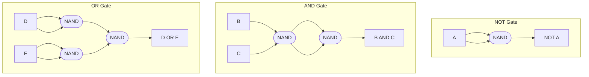

**Mnemonic:** "NAND alone for NOT, NAND twice for AND, NAND each then NAND again for OR"

## Question 2(b) [4 marks]

**Draw/Write logic symbol, truth table and equation of following logic gates (i) XOR gate (ii) OR gate**

**Answer**:

**XOR Gate:**

**Logic Symbol:**

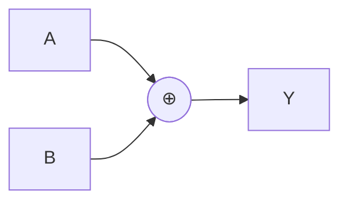

**Truth Table:**

| A | B | Y (A⊕B) |
|---|---|---------|
| 0 | 0 | 0       |
| 0 | 1 | 1       |
| 1 | 0 | 1       |
| 1 | 1 | 0       |

**Boolean Equation:** Y = A⊕B = A'B + AB'

**OR Gate:**

**Logic Symbol:**

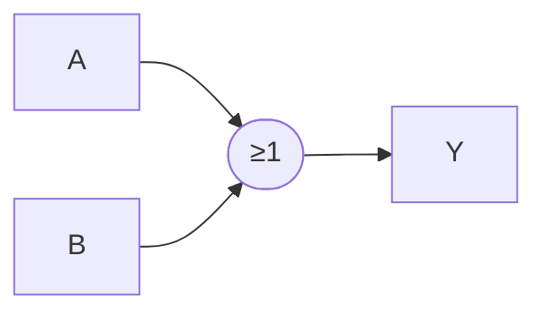

**Truth Table:**

| A | B | Y (A+B) |
|---|---|---------|
| 0 | 0 | 0       |
| 0 | 1 | 1       |
| 1 | 0 | 1       |
| 1 | 1 | 1       |

**Boolean Equation:** Y = A+B

**Mnemonic:** "XOR: Exclusive OR - one or the other but not both; OR: one or the other or both"

## Question 2(c)(I) [3 marks]

**Simplify the Boolean expression using algebraic method Y = A + B[AC + (B + C̅)D]**

**Answer**:

**Step-by-step simplification:**

Y = A + B[AC + (B + C̅)D]
Y = A + B[AC + BD + C̅D]
Y = A + BAC + BBD + BC̅D
Y = A + BAC + BD + BC̅D        (Since BB = B)

**Apply absorption law (X + XY = X):**
Y = A + AC + BD + BC̅D         (Since A + BAC = A + AC)
Y = A + BD + BC̅D              (Since A + AC = A)
Y = A + B(D + C̅D)
Y = A + BD + BC̅D
Y = A + BD(1 + C̅)
Y = A + BD                    (Since 1 + C̅ = 1)

**Final expression:** Y = A + BD

**Table: Simplification Steps**

| Step | Expression                    | Law Applied          |
|------|---------------------------------|----------------------|
| 1    | A + B[AC + (B + C̅)D]            | Initial              |
| 2    | A + B[AC + BD + C̅D]             | Distributive         |
| 3    | A + BAC + BBD + BC̅D             | Distributive         |
| 4    | A + BAC + BD + BC̅D              | Idempotent (BB = B)  |
| 5    | A + AC + BD + BC̅D               | Absorption           |
| 6    | A + BD + BC̅D                    | Absorption (A+AC=A)  |
| 7    | A + B(D + C̅D)                   | Factoring            |
| 8    | A + BD                          | Complementary law    |

**Mnemonic:** "Always look for idempotence, absorption, and complement patterns"

## Question 2(c)(II) [4 marks]

**Simplify the Boolean expression using Karnaugh Map F(A,B,C) = Σm(0, 2, 3, 4, 5, 6)**

**Answer**:

**Create K-map for F(A,B,C) = Σm(0, 2, 3, 4, 5, 6):**

**K-map:**

```
    BC
   00 01 11 10
A 0| 1  0  0  1
  1| 1  1  0  1
```

**Group the 1s:**

- Group 1: m(0,4) - corresponds to A'B'C'
- Group 2: m(2,6) - corresponds to B'C
- Group 3: m(4,5) - corresponds to AB'

**Simplified expression:** F(A,B,C) = B'C + A'B'C' + AB'

**Let's simplify further:**
F(A,B,C) = B'C + B'C'(A' + A)
F(A,B,C) = B'C + B'C'
F(A,B,C) = B'(C + C')
F(A,B,C) = B'

**Final expression:** F(A,B,C) = B'

**Diagram: K-map grouping**

```
    BC
   00 01 11 10
A 0| 1  0  0  1
  1| 1  1  0  1
    ↑_____↑  ↑_____↑
       │        │
    Group 1   Group 2
    
    ↑______↑
    │  
 Group 3
```

**Mnemonic:** "Group adjacent 1s in powers of 2"

## Question 2 [OR Question] (a) [3 marks]

**Draw logic circuit of AND, OR and NOT gate using NOR gate only**

**Answer**:

**NOT gate using NOR gate:**

- NOT gate = NOR gate with both inputs tied together

**AND gate using NOR gates:**

- AND gate = Apply NOT (NOR gate) to both inputs, then NOR those results again

**OR gate using NOR gates:**

- OR gate = NOR gate followed by NOT gate (NOR gate)

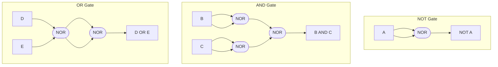

**Mnemonic:** "NOR alone for NOT, NOT each then NOR for AND, Double NOR for OR"

## Question 2 [OR Question] (b) [4 marks]

**Draw/Write logic symbol, truth table and equation of following logic gates (i) NOR gate (ii) AND gate**

**Answer**:

**NOR Gate:**

**Logic Symbol:**

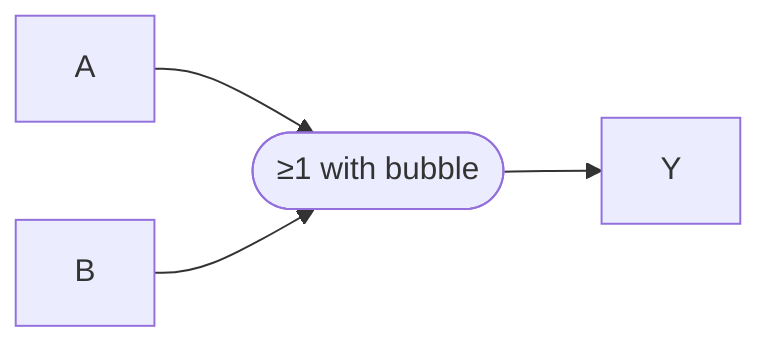

**Truth Table:**

| A | B | Y (A+B)' |
|---|---|----------|
| 0 | 0 | 1        |
| 0 | 1 | 0        |
| 1 | 0 | 0        |
| 1 | 1 | 0        |

**Boolean Equation:** Y = (A+B)' = A'B'

**AND Gate:**

**Logic Symbol:**

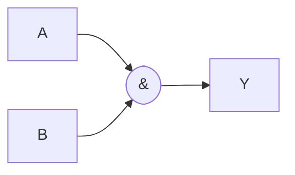

**Truth Table:**

| A | B | Y (A·B) |
|---|---|---------|
| 0 | 0 | 0       |
| 0 | 1 | 0       |
| 1 | 0 | 0       |
| 1 | 1 | 1       |

**Boolean Equation:** Y = A·B

**Mnemonic:** "NOR: NOT OR - neither one nor the other; AND: both must be 1"

## Question 2 [OR Question] (c) [7 marks]

**Write the Boolean expression of Q for above logic circuit. Simplify the Boolean expression of Q and draw the logic circuit of simplified circuit using AND-OR-Invert method**

**Answer**:

**Step 1:** Write Boolean expression from the circuit:
Q = (A + B) · (B + C · ((B + C)'))
Q = (A + B) · (B + C · (B' · C'))
Q = (A + B) · (B + C · B' · C')

**Step 2:** Simplify the expression:

- Note that C · C' = 0
- Therefore, C · B' · C' = 0
- So Q = (A + B) · (B + 0) = (A + B) · B = A·B + B·B = A·B + B = B + A·B = B(1 + A) = B

**Step 3:** Final simplified expression: Q = B

**Step 4:** AND-OR-Invert implementation of Q = B:

- This is simply a wire from input B to output Q

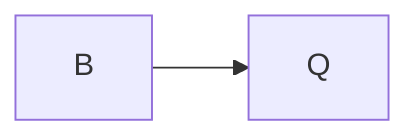

**Table: Simplification Steps**

| Step | Expression                      | Simplification             |
|------|--------------------------------|----------------------------|
| 1    | (A + B) · (B + C · ((B + C)')) | Original expression        |
| 2    | (A + B) · (B + C · B' · C')    | Applying De Morgan's       |
| 3    | (A + B) · (B + 0)              | C · C' = 0                 |
| 4    | (A + B) · B                    | Simplifying                |
| 5    | A·B + B·B                      | Distributive property      |
| 6    | A·B + B                        | Idempotent property (B·B=B)|
| 7    | B(1 + A)                       | Factoring                  |
| 8    | B                              | 1 + A = 1                  |

**Mnemonic:** "When complementary variables multiply, they zero out"

## Question 3(a) [3 marks]

**Define combinational circuit. Give two examples of combinational circuits**

**Answer**:

**Combinational circuit:** A digital circuit whose output depends only on the current input values and not on previous inputs or states. In combinational circuits, there is no memory or feedback.

**Key characteristics:**

- Output depends only on current inputs
- No memory elements
- No feedback paths

**Examples of combinational circuits:**

1. Multiplexers (MUX)
2. Decoders
3. Adders/Subtractors
4. Encoders
5. Comparators

**Table: Combinational vs Sequential Circuits**

| Characteristic | Combinational Circuit | Sequential Circuit |
|----------------|----------------------|-------------------|
| Memory         | No                   | Yes               |
| Feedback       | No                   | Usually           |
| Output depends on | Current inputs only | Current and previous inputs |
| Examples       | Multiplexers, Adders | Flip-flops, Counters |

**Mnemonic:** "Combinational circuits: Current In, Current Out - no memory about"

## Question 3(b) [4 marks]

**Explain half adder using logic circuit and truth table**

**Answer**:

**Half Adder:** A combinational circuit that adds two binary digits and produces sum and carry outputs.

**Logic Circuit:**

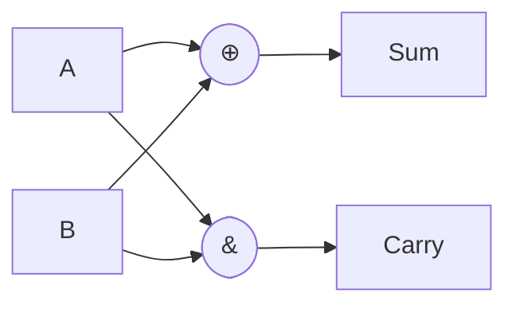

**Truth Table:**

| A | B | Sum | Carry |
|---|---|-----|-------|
| 0 | 0 | 0   | 0     |
| 0 | 1 | 1   | 0     |
| 1 | 0 | 1   | 0     |
| 1 | 1 | 0   | 1     |

**Boolean Equations:**

- Sum = A ⊕ B = A'B + AB'
- Carry = A · B

**Limitations:**

- Cannot add three binary digits
- Cannot accommodate carry input from previous stage

**Mnemonic:** "XOR for Sum, AND for Carry"

## Question 3(c)(I) [3 marks]

**Explain multiplexer in brief**

**Answer**:

**Multiplexer (MUX):** A combinational circuit that selects one of several input signals and forwards it to a single output line based on select lines.

**Key features:**

- Acts as a digital switch
- Has 2ⁿ data inputs, n select lines, and 1 output
- Select lines determine which input is connected to output

**Common multiplexers:**

- 2:1 MUX (1 select line)
- 4:1 MUX (2 select lines)
- 8:1 MUX (3 select lines)

**Basic structure:**

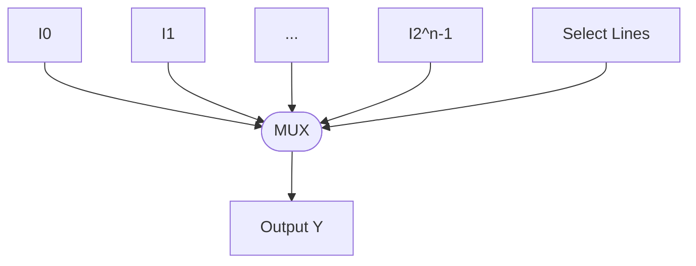

**Applications:**

- Data routing
- Data selection
- Parallel to serial conversion
- Implementation of Boolean functions

**Mnemonic:** "Many In, Selection picks, One Out"

## Question 3(c)(II) [4 marks]

**Design 8:1 multiplexer. Write its truth table and draw its logic circuit**

**Answer**:

**8:1 Multiplexer Design:**

- 8 data inputs (I₀ to I₇)
- 3 select lines (S₂, S₁, S₀)
- 1 output (Y)

**Truth Table:**

| S₂ | S₁ | S₀ | Output Y |
|----|----|----|----------|
| 0  | 0  | 0  | I₀       |
| 0  | 0  | 1  | I₁       |
| 0  | 1  | 0  | I₂       |
| 0  | 1  | 1  | I₃       |
| 1  | 0  | 0  | I₄       |
| 1  | 0  | 1  | I₅       |
| 1  | 1  | 0  | I₆       |
| 1  | 1  | 1  | I₇       |

**Boolean Equation:**
Y = S₂'·S₁'·S₀'·I₀ + S₂'·S₁'·S₀·I₁ + S₂'·S₁·S₀'·I₂ + S₂'·S₁·S₀·I₃ + S₂·S₁'·S₀'·I₄ + S₂·S₁'·S₀·I₅ + S₂·S₁·S₀'·I₆ + S₂·S₁·S₀·I₇

**Logic Circuit:**

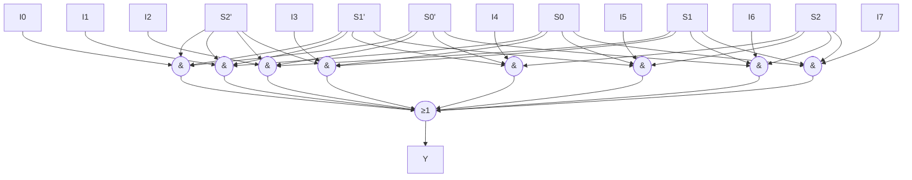

**Mnemonic:** "Eight inputs, three selects, decode and OR to output"

## Question 3 [OR Question] (a) [3 marks]

**Draw the block diagram of 4-bit binary parallel adder**

**Answer**:

**4-bit Binary Parallel Adder:**
A circuit that adds two 4-bit binary numbers and produces a 4-bit sum and a carry output.

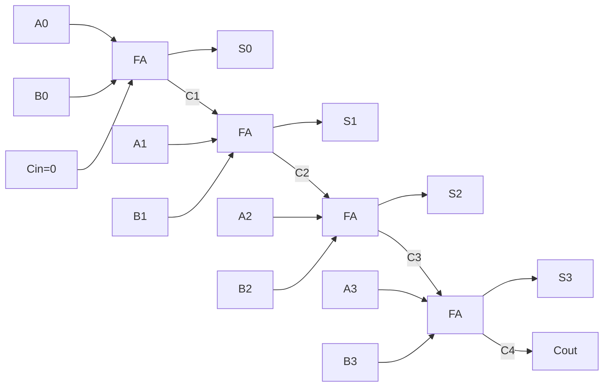

**Components:**

- Four full adders (FA) connected in cascade
- Each FA adds corresponding bits and the carry from previous stage
- Initial carry-in (Cin) is typically 0

**Mnemonic:** "Four FAs linked, carries ripple through"

## Question 3 [OR Question] (b) [4 marks]

**Explain full adder using logic circuit and truth table**

**Answer**:

**Full Adder:** A combinational circuit that adds three binary digits (two inputs and a carry-in) and produces sum and carry outputs.

**Logic Circuit:**

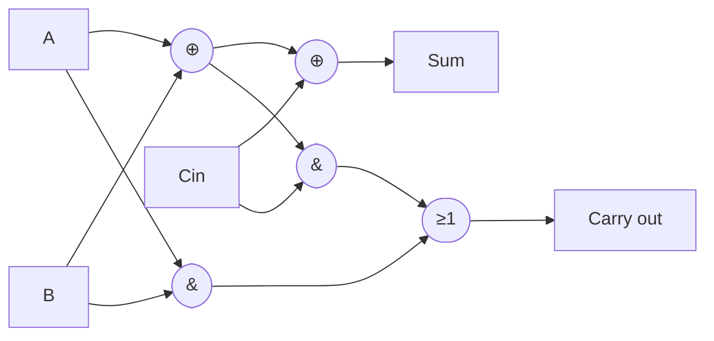

**Truth Table:**

| A | B | Cin | Sum | Cout |
|---|---|-----|-----|------|
| 0 | 0 | 0   | 0   | 0    |
| 0 | 0 | 1   | 1   | 0    |
| 0 | 1 | 0   | 1   | 0    |
| 0 | 1 | 1   | 0   | 1    |
| 1 | 0 | 0   | 1   | 0    |
| 1 | 0 | 1   | 0   | 1    |
| 1 | 1 | 0   | 0   | 1    |
| 1 | 1 | 1   | 1   | 1    |

**Boolean Equations:**

- Sum = A ⊕ B ⊕ Cin
- Cout = A·B + (A⊕B)·Cin

**Mnemonic:** "XOR all three for Sum, OR the ANDs for Carry"

## Question 3 [OR Question] (c) (I) [3 marks]

**Explain 4:1 multiplexer using logic circuit and truth table**

**Answer**:

**4:1 Multiplexer:** A digital switch that selects one of four input lines and connects it to the output based on two select lines.

**Logic Circuit:**

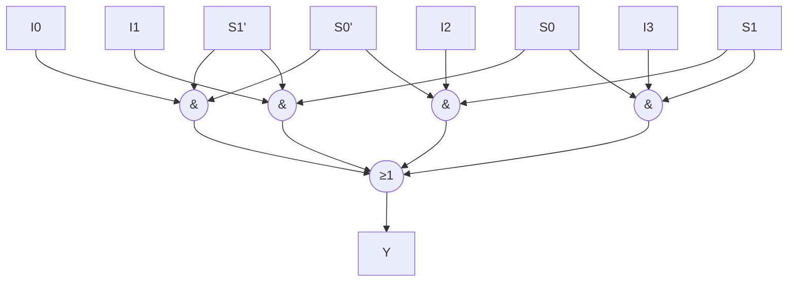

**Truth Table:**

| S1 | S0 | Output Y |
|----|----|---------|
| 0  | 0  | I0      |
| 0  | 1  | I1      |
| 1  | 0  | I2      |
| 1  | 1  | I3      |

**Boolean Equation:**
Y = S1'·S0'·I0 + S1'·S0·I1 + S1·S0'·I2 + S1·S0·I3

**Mnemonic:** "Two select lines choose one of four inputs"

## Question 3 [OR Question] (c) (II) [4 marks]

**Design 8:1 multiplexer using two 4:1 multiplexer.**

**Answer**:

**Design approach:** Use two 4:1 MUXes and one 2:1 MUX to create an 8:1 MUX.

1. First 4:1 MUX handles inputs I0-I3 using select lines S0,S1
2. Second 4:1 MUX handles inputs I4-I7 using select lines S0,S1
3. 2:1 MUX selects between outputs of the two 4:1 MUXes using S2

**Block Diagram:**

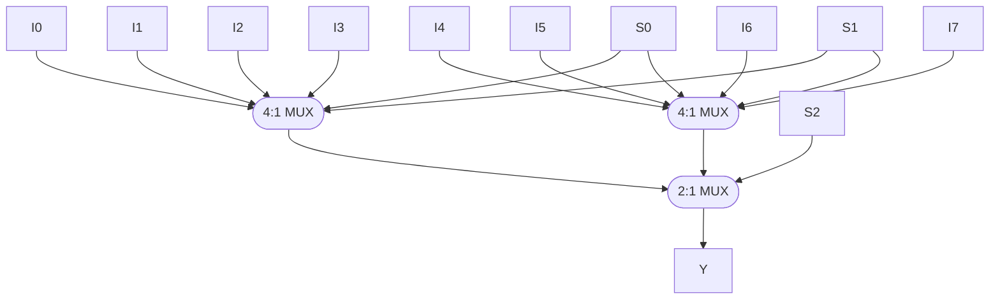

**Truth Table:**

| S2 | S1 | S0 | Output Y |
|----|----|----|----------|
| 0  | 0  | 0  | I0       |
| 0  | 0  | 1  | I1       |
| 0  | 1  | 0  | I2       |
| 0  | 1  | 1  | I3       |
| 1  | 0  | 0  | I4       |
| 1  | 0  | 1  | I5       |
| 1  | 1  | 0  | I6       |
| 1  | 1  | 1  | I7       |

**Mnemonic:** "S0,S1 select from each 4:1 MUX, S2 selects between them"

## Question 4(a) [3 marks]

**Define sequential circuit. Give two examples of it**

**Answer**:

**Sequential Circuit:** A digital circuit whose output depends not only on the current inputs but also on the past sequence of inputs (history/previous states).

**Key characteristics:**

- Contains memory elements (flip-flops)
- Output depends on both current inputs and previous states
- Usually incorporates feedback paths
- Requires clock signals for synchronization (for synchronous circuits)

**Examples of sequential circuits:**

1. Flip-flops (SR, JK, D, T)
2. Registers (shift registers)
3. Counters (binary, decade, ring counters)
4. State machines
5. Memory units

**Table: Sequential vs Combinational Circuits**

| Characteristic | Sequential Circuit | Combinational Circuit |
|----------------|-------------------|----------------------|
| Memory         | Yes               | No                   |
| Feedback       | Usually           | No                   |
| Output depends on | Current & previous inputs | Current inputs only |
| Clock required | Usually           | No                   |
| Examples       | Flip-flops, Counters | Multiplexers, Adders |

**Mnemonic:** "Sequential remembers history, combinational only knows now"

## Question 4(b) [4 marks]

**Design decade counter**

**Answer**:

**Decade Counter:** A sequential circuit that counts from 0 to 9 (decimal) and then resets to 0.

**Design using JK flip-flops:**

- Requires 4 JK flip-flops (Q3,Q2,Q1,Q0) to represent 4-bit binary number
- Counts from 0000 to 1001 (0-9 decimal) then resets

**State Table:**

| Current State | Next State |
|---------------|------------|
| 0 (0000)      | 1 (0001)   |
| 1 (0001)      | 2 (0010)   |
| 2 (0010)      | 3 (0011)   |
| 3 (0011)      | 4 (0100)   |
| 4 (0100)      | 5 (0101)   |
| 5 (0101)      | 6 (0110)   |
| 6 (0110)      | 7 (0111)   |
| 7 (0111)      | 8 (1000)   |
| 8 (1000)      | 9 (1001)   |
| 9 (1001)      | 0 (0000)   |

**Block Diagram:**

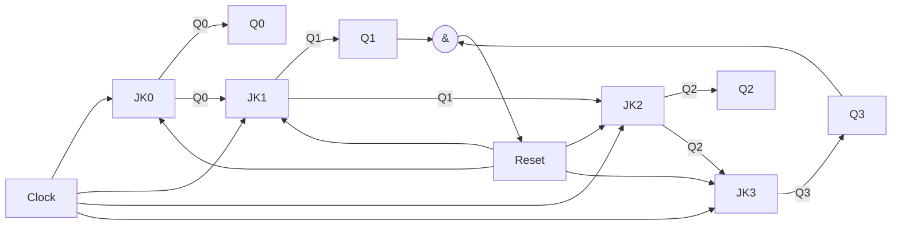

**J-K Input Equations:**

- J0 = K0 = 1 (toggle on every clock)
- J1 = K1 = Q0
- J2 = K2 = Q1·Q0
- J3 = K3 = Q2·Q1·Q0

**Reset condition:** When Q3·Q1 = 1 (state 1010), reset all flip-flops

**Mnemonic:** "Count BCD, reset after 9"

## Question 4(c)(I) [3 marks]

**Explain S-R flip-flop using NOR gate. Draw its logic symbol and write its truth table.**

**Answer**:

**S-R Flip-flop using NOR gates:** A basic flip-flop constructed from two cross-coupled NOR gates that can store one bit of information.

**Logic Circuit:**

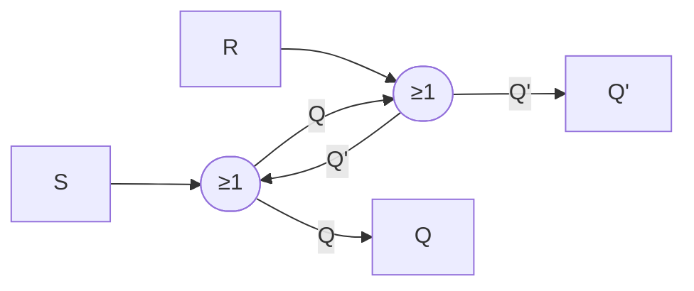

**Logic Symbol:**

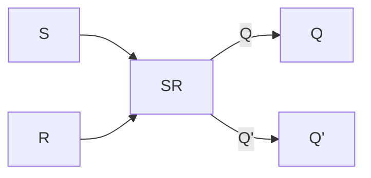

**Truth Table:**

| S | R | Q (next) | Q' (next) | Operation      |
|---|---|----------|-----------|----------------|
| 0 | 0 | Q (prev) | Q' (prev) | Memory (no change) |
| 0 | 1 | 0        | 1         | Reset          |
| 1 | 0 | 1        | 0         | Set            |
| 1 | 1 | 0        | 0         | Invalid (avoid) |

**Mnemonic:** "S sets to 1, R resets to 0, both active gives invalid state"

## Question 4(c)(II) [4 marks]

**Explain S-R flip-flop using NAND gate. Write the limitation of SR flip flop**

**Answer**:

**S-R Flip-flop using NAND gates:** A basic flip-flop constructed from two cross-coupled NAND gates.

**Logic Circuit:**

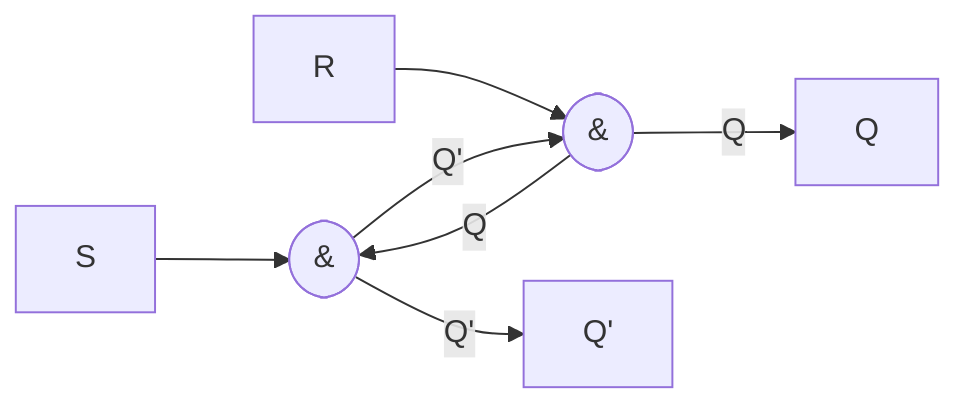

**Truth Table:**

| S | R | Q (next) | Q' (next) | Operation      |
|---|---|----------|-----------|----------------|
| 1 | 1 | Q (prev) | Q' (prev) | Memory (no change) |
| 1 | 0 | 1        | 0         | Set            |
| 0 | 1 | 0        | 1         | Reset          |
| 0 | 0 | 1        | 1         | Invalid (avoid) |

**Limitations of SR Flip-flop:**

1. **Invalid state:** When both S=1, R=1 (for NOR) or S=0, R=0 (for NAND), the output is unpredictable
2. **Race condition:** When inputs change simultaneously, the final state can be unpredictable
3. **No clocking mechanism:** Cannot synchronize with other digital components
4. **Not edge-triggered:** Cannot respond to brief pulses reliably
5. **Unwanted toggling:** May respond to noise or glitches

**Table: NAND vs NOR SR Flip-flop**

| Characteristic | NAND SR Flip-flop | NOR SR Flip-flop |
|----------------|-------------------|------------------|
| Active inputs  | Low (0)           | High (1)         |
| Inactive inputs| High (1)          | Low (0)          |
| Invalid state  | S=0, R=0          | S=1, R=1         |

**Mnemonic:** "NAND: active-low inputs, NOR: active-high inputs; both have an invalid state"

## Question 4 [OR Question] (a) [3 marks]

**Write the definition of flip-flop. List the types of flip-flops**

**Answer**:

**Flip-flop:** A basic sequential digital circuit that can store one bit of information and has two stable states (0 or 1). It serves as a basic memory element in digital systems.

**Key characteristics:**

- Bistable multivibrator (two stable states)
- Can maintain its state indefinitely until directed to change
- Forms the basic building block for registers, counters, and memory circuits
- Can be triggered by clock signals (synchronous) or level changes (asynchronous)

**Types of Flip-flops:**

| Flip-flop Type | Description |
|----------------|-------------|
| SR (Set-Reset) | The most basic flip-flop with set and reset inputs |
| JK | Improved version of SR that eliminates invalid state |
| D (Data) | Stores the value at input D, used for data storage |
| T (Toggle) | Changes state when triggered, useful for counters |
| Master-Slave | Two-stage flip-flop that prevents race conditions |

**Mnemonic:** "Storing a Single Step: SR, JK, D, T"

## Question 4 [OR Question] (b) [4 marks]

**Design 3-bit ring counter**

**Answer**:

**Ring Counter:** A circular shift register where only one bit is set (1) and all others are reset (0). The single set bit "rotates" around the register when clocked.

**Design using D flip-flops:**

- Requires 3 D flip-flops for 3-bit counter
- Initial state: 100, then cycles through 010, 001, and back to 100

**State Table:**

| Current State | Next State |
|---------------|------------|
| 100          | 010         |
| 010          | 001         |
| 001          | 100         |

**Block Diagram:**

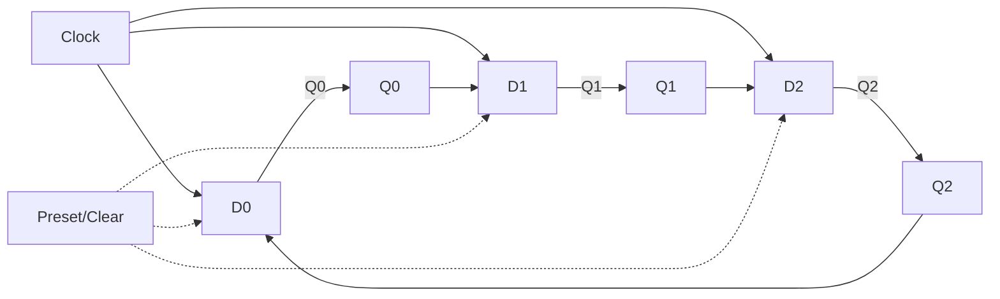

**D Input Equations:**

- D0 = Q2
- D1 = Q0
- D2 = Q1

**Initial state setting:** Preset FF0 to 1, Clear FF1 and FF2 to 0

**Mnemonic:** "One hot bit travels in a circle"

## Question 4 [OR Question] (c)(I) [3 marks]

**Explain J-K flip-flop using its logic symbol and truth table**

**Answer**:

**J-K Flip-flop:** An improved version of SR flip-flop that eliminates the invalid state and provides predictable behavior in all input combinations.

**Logic Symbol:**

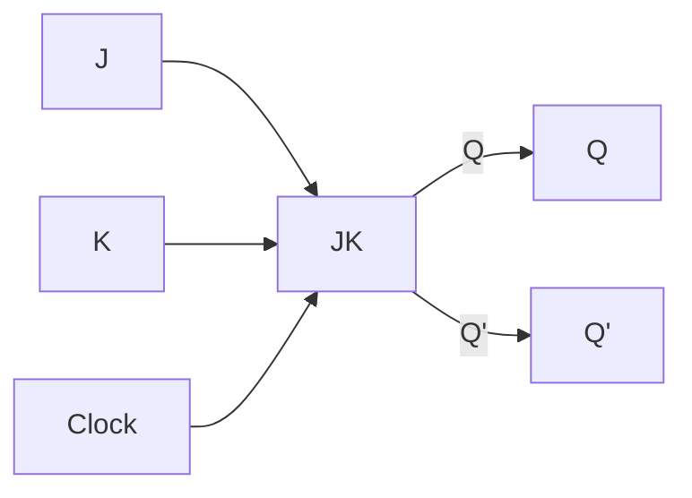

**Truth Table:**

| J | K | Q (next) | Operation     |
|---|---|----------|---------------|
| 0 | 0 | Q (prev) | No change     |
| 0 | 1 | 0        | Reset         |
| 1 | 0 | 1        | Set           |
| 1 | 1 | Q' (prev)| Toggle        |

**Key features:**

- When J=K=1, the flip-flop toggles (changes to opposite state)
- No invalid state like in SR flip-flop
- Can perform all operations: Set, Reset, Hold, Toggle

**Mnemonic:** "J sets, K resets, Both toggle, None remember"

## Question 4 [OR Question] (c)(II) [4 marks]

**Draw logic circuit of D flip-flop and T flip-flop using J-K flip-flop**

**Answer**:

**D Flip-flop using JK Flip-flop:**

To convert JK to D flip-flop:

- Connect D input to J
- Connect D' (NOT D) to K

**Logic Circuit:**

```mermaid
graph LR
    D[D] --> J[J]
    D --> NOT[NOT]
    NOT --> K[K]
    J --> JK[JK Flip-flop]
    K --> JK
    CLK[Clock] --> JK
    JK --Q--> Q[Q]
    JK --Q'--> Qn[Q']
```

**T Flip-flop using JK Flip-flop:**

To convert JK to T flip-flop:

- Connect T input to both J and K

**Logic Circuit:**

```mermaid
graph LR
    T[T] --> J[J]
    T --> K[K]
    J --> JK[JK Flip-flop]
    K --> JK
    CLK[Clock] --> JK
    JK --Q--> Q[Q]
    JK --Q'--> Qn[Q']
```

**Truth Tables:**

**D Flip-flop:**

| D | Q (next) | Operation |
|---|----------|-----------|
| 0 | 0        | Reset     |
| 1 | 1        | Set       |

**T Flip-flop:**

| T | Q (next)  | Operation |
|---|-----------|-----------|
| 0 | Q (prev)  | No change |
| 1 | Q' (prev) | Toggle    |

**Mnemonic:** "D directly follows, T toggles when true"

## Question 5(a) [3 marks]

**Compare RAM and ROM**

**Answer**:

**RAM (Random Access Memory) vs ROM (Read-Only Memory):**

**Table: RAM vs ROM Comparison**

| Characteristic | RAM | ROM |
|----------------|-----|-----|
| **Full form** | Random Access Memory | Read-Only Memory |
| **Data retention** | Volatile (loses data when power off) | Non-volatile (retains data without power) |
| **Read/Write capability** | Both read and write operations | Primarily read-only (except in PROM, EPROM, EEPROM) |
| **Speed** | Faster | Slower |
| **Cost per bit** | Higher | Lower |
| **Applications** | Temporary data storage, active program execution | Boot instructions, firmware, permanent data |
| **Types** | SRAM, DRAM | Mask ROM, PROM, EPROM, EEPROM, Flash |
| **Cell complexity** | More complex | Simpler |

**Mnemonic:** "RAM Reads And Modifies (but forgets), ROM Remembers On shutdown (but fixed)"

## Question 5(b) [4 marks]

**Explain Serial In Serial Out shift register**

**Answer**:

**Serial In Serial Out (SISO) Shift Register:** A sequential circuit that shifts data one bit at a time both at input and output.

**Operation:**

- Data enters serially one bit at a time
- Each bit shifts through the register on each clock pulse
- Data exits serially one bit at a time
- First-in, first-out operation

**Block Diagram:**

```mermaid
graph LR
    SI[Serial In] --> FF0[D0]
    CLK[Clock] --> FF0
    CLK --> FF1
    CLK --> FF2
    CLK --> FF3

    FF0 --Q0--> FF1[D1]
    FF1 --Q1--> FF2[D2]
    FF2 --Q2--> FF3[D3]
    FF3 --Q3--> SO[Serial Out]
```

**Timing Diagram for shifting "1011":**

```
CLK   _|‾|_|‾|_|‾|_|‾|_|‾|_
SI    __|‾|_|‾|‾|_________
Q0    ______|‾|_|‾|‾|_____
Q1    ________|‾|_|‾|‾|___
Q2    ____________|‾|_|‾|‾|
SO    ______________|‾|_|‾|
```

**Applications:**

- Data transmission between digital systems
- Serial-to-serial data conversion
- Time delay circuits
- Signal filtering

**Mnemonic:** "Bits enter line, march through chain, exit in sequence"

## Question 5(c) [7 marks]

**Write short note on logic families**

**Answer**:

**Logic Families:** Groups of digital integrated circuits with similar electrical characteristics, fabrication technology, and logic implementations.

**Major Logic Families:**

1. **TTL (Transistor-Transistor Logic):**
   - Based on bipolar junction transistors
   - Standard series: 7400
   - Supply voltage: 5V
   - Moderate speed and power consumption
   - High noise immunity
   - Variants: Standard TTL, Low-power TTL (74L), Schottky TTL (74S), Advanced Schottky (74AS)

2. **CMOS (Complementary Metal-Oxide-Semiconductor):**
   - Based on MOSFETs (P-type and N-type)
   - Standard series: 4000, 74C00
   - Wide supply voltage range (3-15V)
   - Very low power consumption
   - High noise immunity
   - Susceptible to static electricity
   - Advanced variants: HC, HCT, AC, ACT, AHC, AHCT series

3. **ECL (Emitter-Coupled Logic):**
   - Based on differential amplifier with emitter-coupled transistors
   - Extremely high speed (fastest logic family)
   - High power consumption
   - Low noise immunity
   - Negative supply voltage
   - Used in high-speed applications

**Key Parameters of Logic Families:**

| Parameter | Description |
|-----------|-------------|
| **Fan-in** | Maximum number of inputs a gate can accept |
| **Fan-out** | Maximum number of gates that can be driven by one output |
| **Noise margin** | Ability to tolerate electrical noise |
| **Propagation delay** | Time delay between input and output transitions |
| **Power dissipation** | Power consumed by the gate |
| **Figure of merit** | Product of speed and power (lower is better) |

**Comparison Table:**

| Parameter | TTL | CMOS | ECL |
|-----------|-----|------|-----|
| Speed | Medium | Low to High | Very High |
| Power consumption | Medium | Very Low | High |
| Noise immunity | High | Very High | Low |
| Fan-out | 10 | 50+ | 25 |
| Supply voltage | 5V | 3-15V | -5.2V |
| Input/Output levels | 0.8V/2.0V | 30%/70% of VDD | -1.75V/-0.9V |

**Mnemonic:** "TTL Takes Transistors, CMOS Conserves More Operational Supply, ECL Executes Calculations Lightning-fast"

## Question 5 [OR Question] (a) [3 marks]

**Compare SRAM and DRAM**

**Answer**:

**SRAM (Static RAM) vs DRAM (Dynamic RAM):**

**Table: SRAM vs DRAM Comparison**

| Characteristic | SRAM | DRAM |
|----------------|------|------|
| **Full form** | Static Random Access Memory | Dynamic Random Access Memory |
| **Cell structure** | 6 transistors (flip-flop) | 1 transistor + 1 capacitor |
| **Storage element** | Flip-flop | Capacitor |
| **Refreshing** | Not required | Required periodically (ms) |
| **Speed** | Faster (access time: 10-30ns) | Slower (access time: 60-100ns) |
| **Density** | Lower (larger cell size) | Higher (smaller cell size) |
| **Cost per bit** | Higher | Lower |
| **Power consumption** | Higher | Lower |
| **Applications** | Cache memory, buffer | Main memory (RAM) |
| **Data retention** | As long as power is supplied | Few milliseconds, needs refresh |

**Mnemonic:** "Static Stays steady with Six Transistors, Dynamic Drains and needs regular refreshing"

## Question 5 [OR Question] (b) [4 marks]

**Explain 8:3 encoder**

**Answer**:

**8:3 Encoder:** A combinational circuit that converts 8 input lines to 3 output lines, essentially converting an active input line to its binary position.

**Function:**

- Has 8 input lines (I₀ to I₇) and 3 output lines (Y₂, Y₁, Y₀)
- Only one input is active at a time
- Output is the binary code representing position of active input

**Logic Circuit:**

```mermaid
graph TD
    I1[I1] --> OR0([≥1])
    I3[I3] --> OR0
    I5[I5] --> OR0
    I7[I7] --> OR0
    OR0 --> Y0[Y0]

    I2[I2] --> OR1([≥1])
    I3[I3] --> OR1
    I6[I6] --> OR1
    I7[I7] --> OR1
    OR1 --> Y1[Y1]
    
    I4[I4] --> OR2([≥1])
    I5[I5] --> OR2
    I6[I6] --> OR2
    I7[I7] --> OR2
    OR2 --> Y2[Y2]
```

**Truth Table:**

| Inputs | Outputs |
|--------|---------|
| I₇ I₆ I₅ I₄ I₃ I₂ I₁ I₀ | Y₂ Y₁ Y₀ |
| 0 0 0 0 0 0 0 1 | 0 0 0 |
| 0 0 0 0 0 0 1 0 | 0 0 1 |
| 0 0 0 0 0 1 0 0 | 0 1 0 |
| 0 0 0 0 1 0 0 0 | 0 1 1 |
| 0 0 0 1 0 0 0 0 | 1 0 0 |
| 0 0 1 0 0 0 0 0 | 1 0 1 |
| 0 1 0 0 0 0 0 0 | 1 1 0 |
| 1 0 0 0 0 0 0 0 | 1 1 1 |

**Boolean Equations:**

- Y₀ = I₁ + I₃ + I₅ + I₇
- Y₁ = I₂ + I₃ + I₆ + I₇
- Y₂ = I₄ + I₅ + I₆ + I₇

**Applications:**

- Priority encoders
- Keyboard encoders
- Address decoders
- Data selectors

**Mnemonic:** "Eight Inputs become their position in Three bits"

## Question 5 [OR Question] (c) [7 marks]

**Define (i) Fan-in (ii) Fan-out (iii) Noise margin (iv) Propagation delay (v) Power dissipation for logic families**

**Answer**:

**Key Parameters of Logic Families:**

**1. Fan-in:**

- **Definition:** Maximum number of inputs a logic gate can accept
- **Importance:** Determines complexity of logic implementation
- **Typical values:** 2-8 for most families
- **Example:** AND gate with 4 inputs has fan-in of 4

**2. Fan-out:**

- **Definition:** Maximum number of similar gates that one gate output can drive reliably
- **Importance:** Determines loading capability and system expandability
- **Calculation:** Based on output current capacity and input current requirements
- **Typical values:** TTL: 10, CMOS: 50+, ECL: 25

**3. Noise Margin:**

- **Definition:** Measure of circuit's ability to tolerate unwanted electrical noise/signals
- **Importance:** Ensures reliable operation in noisy environments
- **Calculation:** Difference between minimum high output voltage and maximum high input voltage
- **Typical values:** TTL: 0.4V, CMOS: 1.5V-2.25V, ECL: 0.2V

**4. Propagation Delay:**

- **Definition:** Time delay between input change and corresponding output change
- **Importance:** Determines maximum operating frequency and speed
- **Measurement:** Time from 50% of input transition to 50% of output transition
- **Typical values:** TTL: 10ns, CMOS: 5-100ns, ECL: 1-2ns

**5. Power Dissipation:**

- **Definition:** Amount of power consumed by a logic gate
- **Importance:** Affects heat generation, power supply requirements, battery life
- **Calculation:** Product of supply voltage and current drawn
- **Typical values:** TTL: 10mW, CMOS: 0.1mW (static), ECL: 25mW

**Table: Logic Family Comparison**

| Parameter | TTL | CMOS | ECL |
|-----------|-----|------|-----|
| Fan-in    | 3-8 | 2-unlimited | 2-4 |
| Fan-out   | 10  | 50+  | 25 |
| Noise margin | 0.4V | 1.5V-2.25V | 0.2V |
| Propagation delay | 10ns | 5-100ns | 1-2ns |
| Power dissipation | 10mW | 0.1mW (static) | 25mW |
| Supply voltage | 5V | 3-15V | -5.2V |
| Figure of merit | 100pJ | 10pJ | 50pJ |

**Diagram: Noise Margin and Switching Thresholds**

```
Voltage
   ^
   |                   VOH
   |    ┌───────┐      │
   |    │       │      │      Logic High
   |    │       │      │
   |    │       │      V      VIH
   |    │       │      │
   |    │  NMH  │      │      Undefined
   |    │       │      │
   |    │       │      V      VIL
   |    │       │      │
   |    │  NML  │      │      Logic Low
   |    │       │      V      VOL
   |    └───────┘
   └─────────────────────────> Signal
```

**Relationships:**

- NMH (Noise Margin High) = VOH(min) - VIH(min)
- NML (Noise Margin Low) = VIL(max) - VOL(max)
- Figure of Merit = Power × Delay product (lower is better)

**Mnemonic:** "Five Factors: Fan-in counts inputs, Fan-out drives gates, Noise margin fights interference, Propagation delay measures speed, Power dissipation generates heat"
