## પ્રશ્ન 1(અ) [3 માર્ક્સ]

**કન્વર્ટ કરો: (110101)₂ = ( ___ )₁₀ = ( ___ )₈ = ( ___ )₁₆**

**જવાબ**:

**સ્ટેપ-બાય-સ્ટેપ કન્વર્ઝન (110101)₂**:

| બાઇનરી (110101)₂ | ડેસિમલ | ઑક્ટલ | હેક્ઝાડેસિમલ |
|------------------|---------|-------|-------------|
| 1×2⁵ + 1×2⁴ + 0×2³ + 1×2² + 0×2¹ + 1×2⁰ | 32+16+0+4+0+1 = 53 | 6×8¹ + 5×8⁰ = 48+5 = 53 | 3×16¹ + 5×16⁰ = 48+5 = 35 |
| (110101)₂ | (53)₁₀ | (65)₈ | (35)₁₆ |

**મેમરી ટ્રીક:** "બાઇનરી ડિજિટ આઉટ હિયર" (BDOH) બાઇનરી→ડેસિમલ→ઑક્ટલ→હેક્ઝાડેસિમલ કન્વર્ઝન માટે.

## પ્રશ્ન 1(બ) [4 માર્ક્સ]

**કરો: (i) (11101101)₂+(10101000)₂ (ii) (11011)₂*(1010)₂**

**જવાબ**:

**બાઇનરી સરવાળા અને ગુણાકાર માટે ટેબલ**:

| (i) બાઇનરી સરવાળો | (ii) બાઇનરી ગુણાકાર |
|--------------------|----------------------------|
| 11101101         |11011|
|   + 10101000       |      ×  1010              |
|   ----------       |      -------              |
|   110010101     |         00000             |
|                    |        11011             |
|                    |       00000          |
|                    |      11011         |
|                    |      --------             |
|                    |      11101110          |

**ડેસિમલ વેરિફિકેશન**:

- (i) (11101101)₂ = 237, (10101000)₂ = 168, સરવાળો = 405 = (110010101)₂
- (ii) (11011)₂ = 27, (1010)₂ = 10, ગુણાકાર = 270 = (11101110)₂

**મેમરી ટ્રીક:** સરવાળા માટે "કેરી અપ મેક્સ સમ" અને ગુણાકાર માટે "શિફ્ટ લેફ્ટ એડ પ્રોડક્ટ".

## પ્રશ્ન 1(ક) [7 માર્ક્સ]

**(i) કન્વર્ટ કરો: (48)₁₀ = ( ___ )₂ = ( ___ )₈ = ( ___ )₁₆**
**(ii) 2's Complement પદ્ધતિનો ઉપયોગ કરીને બાદબાકી કરો: (1110)₂ – (1000)₂**
**(iii) (1111101)₂ ને (101)₂ વડે વિભાજિત કરો.**

**જવાબ**:

**(i) કન્વર્ઝન ટેબલ**:

| ડેસિમલ (48)₁₀ | બાઇનરી | ઑક્ટલ | હેક્ઝાડેસિમલ |
|----------------|--------|-------|-------------|
| 48÷2 = 24 રેમ 0 | 110000 | 60 | 30 |
| 24÷2 = 12 રેમ 0 |  |  |  |
| 12÷2 = 6 રેમ 0 |  |  |  |
| 6÷2 = 3 રેમ 0 |  |  |  |
| 3÷2 = 1 રેમ 1 |  |  |  |
| 1÷2 = 0 રેમ 1 |  |  |  |
| (48)₁₀ | (110000)₂ | (60)₈ | (30)₁₆ |

**(ii) બાદબાકી ટેબલ**:

| 2's Complement પદ્ધતિ | સ્ટેપ્સ |
|-----------------------|-------|
| (1110)₂ – (1000)₂ | 1. (1000)₂ નો 2's complement શોધો |
| (1000)₂ નો 1's complement | (0111)₂ |
| 2's complement | (0111)₂ + 1 = (1000)₂ |
| (1110)₂ + (1000)₂ | (10110)₂ |
| કેરી દૂર કરો | (0110)₂ |
| પરિણામ | (0110)₂ = 6₁₀ |

**(iii) ભાગાકાર**:

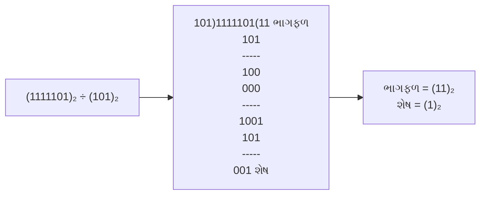

**મેમરી ટ્રીક:** લાંબા ભાગાકાર પ્રક્રિયા માટે "ડિવિઝન ડ્રોપ્સ ડાઉન રિમેન્ડર્સ".

## પ્રશ્ન 1(ક) અથવા [7 માર્ક્સ]

**કોડ્સ સમજાવો: ASCII, BCD, Gray**

**જવાબ**:

**સામાન્ય ડિજિટલ કોડ્સનું ટેબલ**:

| કોડ | વર્ણન | ઉદાહરણ |
|------|-------------|---------|
| **ASCII (American Standard Code for Information Interchange)** | 128 કેરેક્ટર્સને રજૂ કરતો 7-બિટ કોડ જેમાં આલ્ફાબેટ્સ, નંબર્સ અને સ્પેશિયલ સિમ્બોલ્સ શામેલ છે | A = 65 (1000001)₂ |
| **BCD (Binary Coded Decimal)** | દરેક ડેસિમલ અંક (0-9) ને 4 બિટ્સનો ઉપયોગ કરીને રજૂ કરે છે | 42 = 0100 0010 |
| **Gray Code** | બાઇનરી કોડ જેમાં આસપાસના નંબરો માત્ર એક બિટથી અલગ પડે છે | (0,1,3,2) = (00,01,11,10) |

**ડાયાગ્રામ: ગ્રે કોડ જનરેશન**:

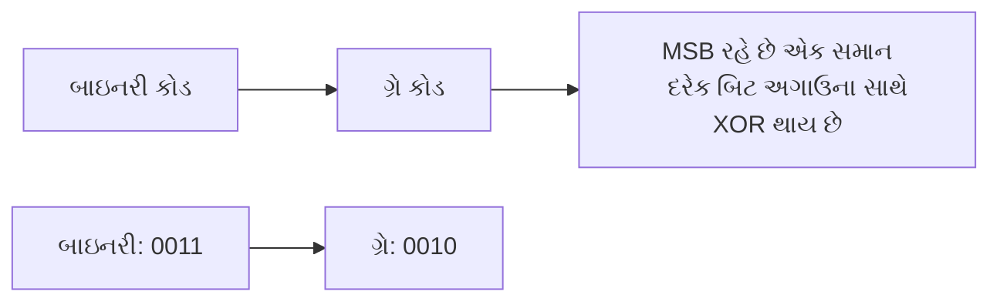

**મેમરી ટ્રીક:** "ઓલવેઝ બાઇનરી જનરેટ્સ" - દરેક કોડનો પ્રથમ અક્ષર (ASCII, BCD, Gray).

## પ્રશ્ન 2(અ) [3 માર્ક્સ]

**બુલિયન બીજગણિતનો ઉપયોગ કરીને સરળ બનાવો: Y = A B + A' B + A' B' + A B'**

**જવાબ**:

**સ્ટેપ-બાય-સ્ટેપ સરળીકરણ**:

| સ્ટેપ | એક્સપ્રેશન | બુલિયન નિયમ |
|------|------------|-------------|
| Y = A B + A' B + A' B' + A B' | પ્રારંભિક એક્સપ્રેશન | - |
| Y = A(B + B') + A'(B + B') | ફેક્ટરિંગ | ડિસ્ટ્રિબ્યુટિવ લૉ |
| Y = A(1) + A'(1) | કોમ્પ્લિમેન્ટ લૉ | B + B' = 1 |
| Y = A + A' | સરળીકરણ | - |
| Y = 1 | કોમ્પ્લિમેન્ટ લૉ | A + A' = 1 |

**મેમરી ટ્રીક:** બુલિયન સરળીકરણ સ્ટેપ્સ માટે "ફેક્ટર, સિમ્પ્લિફાય, ફિનિશ".

## પ્રશ્ન 2(બ) [4 માર્ક્સ]

**K-મેપનો ઉપયોગ કરીને નીચેના બુલિયન ફંક્શન ને સરળ બનાવો: f(A,B,C,D) = Σm (0,3,4,6,8,11,12)**

**જવાબ**:

**K-મેપ સોલ્યુશન**:

```
    AB
CD  00 01 11 10
00  1  0  0  1
01  0  0  0  1  
11  0  1  0  0
10  0  0  1  0
```

**ગ્રુપિંગ**:

- ગ્રુપ 1: m(0,8) = A'C'D'
- ગ્રુપ 2: m(4,12) = BD'
- ગ્રુપ 3: m(3,11) = CD
- ગ્રુપ 4: m(6) = A'B'CD'

**સરળ કરેલ એક્સપ્રેશન**: f(A,B,C,D) = A'C'D' + BD' + CD + A'B'CD'

**મેમરી ટ્રીક:** K-મેપ ગ્રુપિંગ સ્ટ્રેટેજી માટે "ગ્રુપ પાવર્સ ઓફ ટુ".

## પ્રશ્ન 2(ક) [7 માર્ક્સ]

**NOR ગેટને સ્વચ્છ આકૃતિઓ સાથે યુનિવર્સલ ગેટ તરીકે સમજાવો.**

**જવાબ**:

**NOR એઝ યુનિવર્સલ ગેટ**:

| ફંક્શન | NOR નો ઉપયોગ કરી ઇમ્પ્લિમેન્ટેશન | ટ્રુથ ટેબલ |
|----------|--------------------------|-------------|
| **NOT ગેટ** |  | A | A' |
|          |                          | 0 | 1  |
|          |                          | 1 | 0  |
| **AND ગેટ** |  | A B | A•B |
|          |                          | 0 0 | 0   |
|          |                          | 0 1 | 0   |
|          |                          | 1 0 | 0   |
|          |                          | 1 1 | 1   |
| **OR ગેટ** |  | A B | A+B |
|          |                          | 0 0 | 0   |
|          |                          | 0 1 | 1   |
|          |                          | 1 0 | 1   |
|          |                          | 1 1 | 1   |

**ડાયાગ્રામ: NOR ઇમ્પ્લિમેન્ટેશન**:

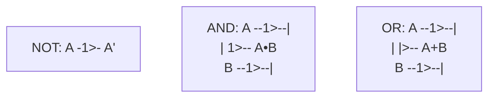

**મેમરી ટ્રીક:** NOR ગેટ ઇમ્પ્લિમેન્ટેશન માટે "NOT AND OR, NOR કરે મોર".

## પ્રશ્ન 2(અ) અથવા [3 માર્ક્સ]

**બુલિયન સમીકરણ માટે લોજિક સર્કિટ દોરો: Y = (A + B') . (A' + B') . (B + C)**

**જવાબ**:

**લોજિક સર્કિટ ઇમ્પ્લિમેન્ટેશન**:

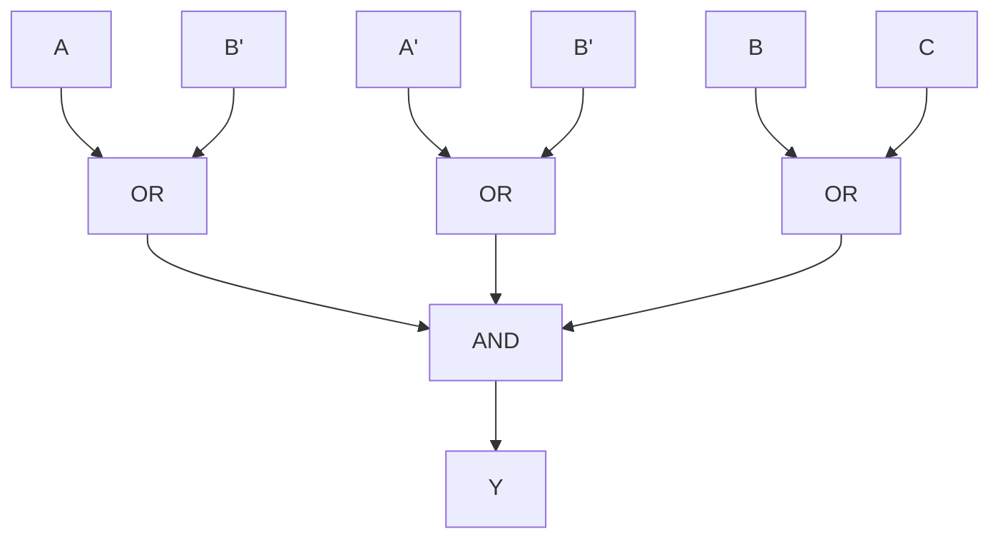

**ટ્રુથ ટેબલ વેરિફિકેશન**:

- ટર્મ 1: (A + B')
- ટર્મ 2: (A' + B')
- ટર્મ 3: (B + C)
- આઉટપુટ: Y = Term1 • Term2 • Term3

**મેમરી ટ્રીક:** જટિલ એક્સપ્રેશન માટે "દરેક ટર્મ અલગથી".

## પ્રશ્ન 2(બ) અથવા [4 માર્ક્સ]

**ડી-મોર્ગન્સના પ્રમેય લખો અને તેને સાબિત કરો.**

**જવાબ**:

**ડી-મોર્ગન્સ પ્રમેય અને પ્રૂફ**:

| પ્રમેય | સ્ટેટમેન્ટ | ટ્રુથ ટેબલ દ્વારા પ્રૂફ |
|---------|-----------|----------------------|
| **પ્રમેય 1** | (A•B)' = A' + B' | A B | A•B | (A•B)' | A' | B' | A'+B' |
|         |           | 0 0 | 0   | 1     | 1  | 1  | 1    |
|         |           | 0 1 | 0   | 1     | 1  | 0  | 1    |
|         |           | 1 0 | 0   | 1     | 0  | 1  | 1    |
|         |           | 1 1 | 1   | 0     | 0  | 0  | 0    |
| **પ્રમેય 2** | (A+B)' = A'•B' | A B | A+B | (A+B)' | A' | B' | A'•B' |
|         |           | 0 0 | 0   | 1     | 1  | 1  | 1    |
|         |           | 0 1 | 1   | 0     | 1  | 0  | 0    |
|         |           | 1 0 | 1   | 0     | 0  | 1  | 0    |
|         |           | 1 1 | 1   | 0     | 0  | 0  | 0    |

**ડાયાગ્રામ: ડી-મોર્ગન્સ લૉ વિઝ્યુલાઇઝેશન**:

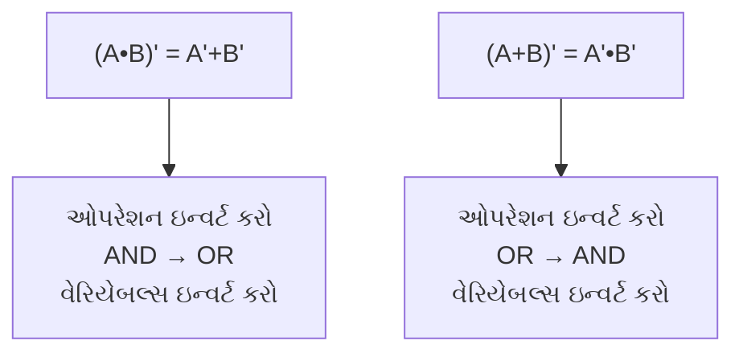

**મેમરી ટ્રીક:** ડી-મોર્ગન્સ લૉ લાગુ કરવા માટે "બાર તોડો, ઓપરેશન બદલો, ઇનપુટ ઇન્વર્ટ કરો".

## પ્રશ્ન 2(ક) અથવા [7 માર્ક્સ]

**સિમ્બોલ, ટ્રુથ ટેબલ અને સમીકરણની મદદથી તમામ લોજિક ગેટ્સ સમજાવો.**

**જવાબ**:

**લોજિક ગેટ્સ સમરી**:

| ગેટ | સિમ્બોલ | ટ્રુથ ટેબલ | સમીકરણ | વર્ણન |
|------|--------|-------------|----------|-------------|
| **AND** |  | A B | Y | Y = A•B | બધા ઇનપુટ્સ 1 હોય ત્યારે જ આઉટપુટ 1 |
|      |        | 0 0 | 0 |       |                                    |
|      |        | 0 1 | 0 |       |                                    |
|      |        | 1 0 | 0 |       |                                    |
|      |        | 1 1 | 1 |       |                                    |
| **OR**  |   | A B | Y | Y = A+B | કોઈપણ ઇનપુટ 1 હોય ત્યારે આઉટપુટ 1 |
|      |        | 0 0 | 0 |       |                                    |
|      |        | 0 1 | 1 |       |                                    |
|      |        | 1 0 | 1 |       |                                    |
|      |        | 1 1 | 1 |       |                                    |
| **NOT** |  | A | Y | Y = A' | ઇનપુટને ઇન્વર્ટ કરે છે |
|      |        | 0 | 1 |       |                                    |
|      |        | 1 | 0 |       |                                    |
| **NAND** |  | A B | Y | Y = (A•B)' | AND પછી NOT |
|      |        | 0 0 | 1 |       |                                    |
|      |        | 0 1 | 1 |       |                                    |
|      |        | 1 0 | 1 |       |                                    |
|      |        | 1 1 | 0 |       |                                    |
| **NOR** |   | A B | Y | Y = (A+B)' | OR પછી NOT |
|      |        | 0 0 | 1 |       |                                    |
|      |        | 0 1 | 0 |       |                                    |
|      |        | 1 0 | 0 |       |                                    |
|      |        | 1 1 | 0 |       |                                    |
| **XOR** |   | A B | Y | Y = A⊕B | ઇનપુટ્સ અલગ હોય ત્યારે આઉટપુટ 1 |
|      |        | 0 0 | 0 |       |                                    |
|      |        | 0 1 | 1 |       |                                    |
|      |        | 1 0 | 1 |       |                                    |
|      |        | 1 1 | 0 |       |                                    |
| **XNOR** |  | A B | Y | Y = (A⊕B)' | ઇનપુટ્સ સમાન હોય ત્યારે આઉટપુટ 1 |
|      |        | 0 0 | 1 |       |                                    |
|      |        | 0 1 | 0 |       |                                    |
|      |        | 1 0 | 0 |       |                                    |
|      |        | 1 1 | 1 |       |                                    |

**મેમરી ટ્રીક:** "All Operations Need Necessary eXecution" (દરેક ગેટનો પહેલો અક્ષર - AND, OR, NOT, NAND, NOR, XOR).

## પ્રશ્ન 3(અ) [3 માર્ક્સ]

**સંક્ષિપ્તમાં 4:2 એન્કોડર સમજાવો.**

**જવાબ**:

**4-to-2 એન્કોડર ઓવરવ્યુ**:

| ફંક્શન | વર્ણન | ટ્રુથ ટેબલ |
|----------|-------------|-------------|
| **4:2 એન્કોડર** | 4 ઇનપુટ લાઇન્સને 2 આઉટપુટ લાઇન્સમાં કન્વર્ટ કરે છે | I₀ I₁ I₂ I₃ | Y₁ Y₀ |
|          | એક સમયે માત્ર એક જ ઇનપુટ એક્ટિવ | 1 0 0 0 | 0 0 |
|          | ઇનપુટ પોઝિશન બાઇનરીમાં એન્કોડેડ | 0 1 0 0 | 0 1 |
|          |                                  | 0 0 1 0 | 1 0 |
|          |                                  | 0 0 0 1 | 1 1 |

**ડાયાગ્રામ: 4:2 એન્કોડર**:

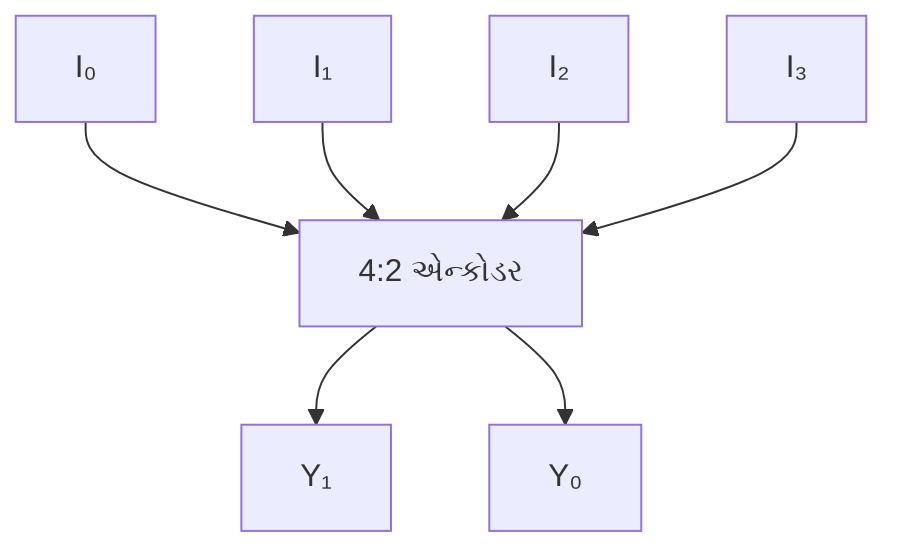

**મેમરી ટ્રીક:** એન્કોડર ફંક્શન માટે "ઇનપુટ પોઝિશન ક્રિએટ્સ આઉટપુટ".

## પ્રશ્ન 3(બ) [4 માર્ક્સ]

**ફુલ એડર બ્લોક્સનો ઉપયોગ કરીને 4-બિટ પેરેલલ એડરને સમજાવો.**

**જવાબ**:

**4-બિટ પેરેલલ એડર**:

| કોમ્પોનન્ટ | ફંક્શન |
|-----------|----------|
| **ફુલ એડર** | 3 બિટ્સ (A, B, Carry-in) ને એડ કરે છે અને Sum અને Carry-out આપે છે |
| **પેરેલલ એડર** | 4 ફુલ એડર્સને કેરી પ્રોપેગેશન સાથે જોડે છે |

**ડાયાગ્રામ: 4-બિટ પેરેલલ એડર**:

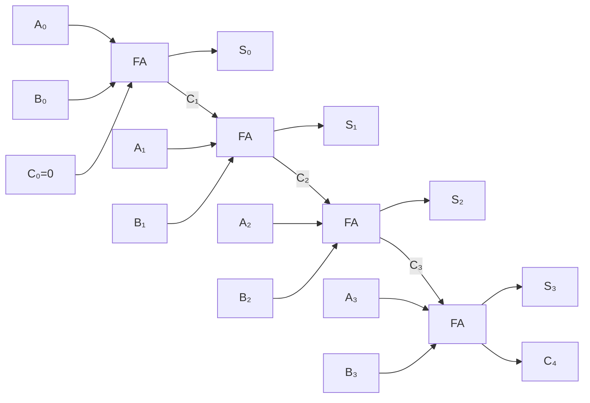

**મેમરી ટ્રીક:** પેરેલલ એડરમાં કેરી પ્રોપેગેશન માટે "કેરી ઓલવેઝ પાસેસ રાઇટ".

## પ્રશ્ન 3(ક) [7 માર્ક્સ]

**ટ્રુથ ટેબલ, સમીકરણ અને સર્કિટ ડાયાગ્રામ સાથે 8:1 મલ્ટિપ્લેક્સરનું વર્ણન કરો.**

**જવાબ**:

**8:1 મલ્ટિપ્લેક્સર**:

| કોમ્પોનન્ટ | વર્ણન | ફંક્શન |
|-----------|-------------|----------|
| **8:1 MUX** | 8 ઇનપુટ્સ, 3 સિલેક્ટ લાઇન્સ, 1 આઉટપુટ વાળો ડેટા સિલેક્ટર | સિલેક્ટ લાઇન્સના આધારે 8 ઇનપુટ્સમાંથી એક પસંદ કરે છે |

**ટ્રુથ ટેબલ**:

| સિલેક્ટ લાઇન્સ | આઉટપુટ |
|--------------|--------|
| S₂ S₁ S₀ | Y |
| 0 0 0 | D₀ |
| 0 0 1 | D₁ |
| 0 1 0 | D₂ |
| 0 1 1 | D₃ |
| 1 0 0 | D₄ |
| 1 0 1 | D₅ |
| 1 1 0 | D₆ |
| 1 1 1 | D₇ |

**બુલિયન સમીકરણ**:
Y = S₂'·S₁'·S₀'·D₀ + S₂'·S₁'·S₀·D₁ + S₂'·S₁·S₀'·D₂ + S₂'·S₁·S₀·D₃ + S₂·S₁'·S₀'·D₄ + S₂·S₁'·S₀·D₅ + S₂·S₁·S₀'·D₆ + S₂·S₁·S₀·D₇

**ડાયાગ્રામ: 8:1 MUX**:

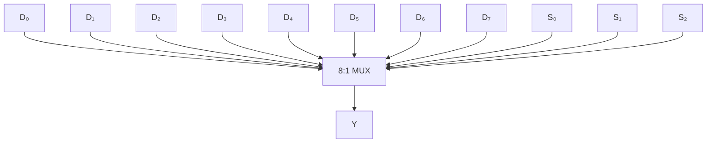

**મેમરી ટ્રીક:** મલ્ટિપ્લેક્સર ઓપરેશન માટે "સિલેક્ટ ડિસાઇડ્સ ડેટા આઉટપુટ".

## પ્રશ્ન 3(અ) અથવા [3 માર્ક્સ]

**હાફ સબટ્રેક્ટરની લોજિક સર્કિટ દોરો અને તેનું કાર્ય સમજાવો.**

**જવાબ**:

**હાફ સબટ્રેક્ટર**:

| ફંક્શન | વર્ણન | ટ્રુથ ટેબલ |
|----------|-------------|-------------|
| **હાફ સબટ્રેક્ટર** | બે બિટ્સને બાદ કરે છે અને ડિફરન્સ અને બોરો આપે છે | A B | D Bout |
|          |                                                               | 0 0 | 0 0 |
|          |                                                               | 0 1 | 1 1 |
|          |                                                               | 1 0 | 1 0 |
|          |                                                               | 1 1 | 0 0 |

**લોજિક સર્કિટ**:

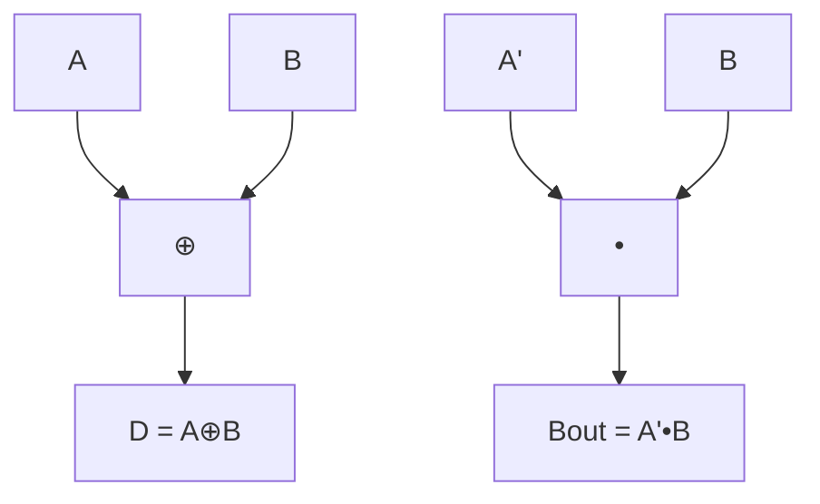

**સમીકરણો**:

- ડિફરન્સ (D) = A ⊕ B
- બોરો આઉટ (Bout) = A' • B

**મેમરી ટ્રીક:** હાફ સબટ્રેક્ટર ઓપરેશન માટે "ડિફરન્ટ બિટ્સ બોરો".

## પ્રશ્ન 3(બ) અથવા [4 માર્ક્સ]

**ટ્રુથ ટેબલ અને સર્કિટ ડાયાગ્રામ સાથે 3:8 ડીકોડર સમજાવો.**

**જવાબ**:

**3:8 ડીકોડર**:

| ફંક્શન | વર્ણન | ટ્રુથ ટેબલ (આંશિક) |
|----------|-------------|----------------------|
| **3:8 ડીકોડર** | 3-બિટ બાઇનરી ઇનપુટને 8 આઉટપુટ લાઇન્સમાં કન્વર્ટ કરે છે | A₂ A₁ A₀ | Y₀ Y₁ Y₂ Y₃ Y₄ Y₅ Y₆ Y₇ |
|          | એક સમયે માત્ર એક જ આઉટપુટ એક્ટિવ                     | 0 0 0 | 1 0 0 0 0 0 0 0 |
|          |                                                      | 0 0 1 | 0 1 0 0 0 0 0 0 |
|          |                                                      | ... | ... |
|          |                                                      | 1 1 1 | 0 0 0 0 0 0 0 1 |

**સર્કિટ ડાયાગ્રામ**:

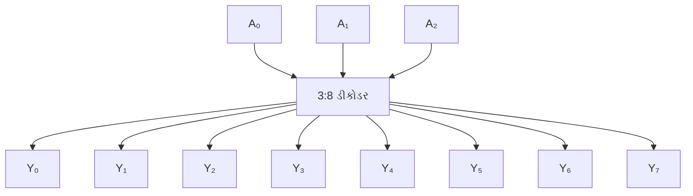

**સમીકરણો**:

- Y₀ = A₂' • A₁' • A₀'
- Y₁ = A₂' • A₁' • A₀
- ...
- Y₇ = A₂ • A₁ • A₀

**મેમરી ટ્રીક:** ડીકોડર ઓપરેશન માટે "બાઇનરી ઇનપુટ એક્ટિવેટ્સ આઉટપુટ".

## પ્રશ્ન 3(ક) અથવા [7 માર્ક્સ]

**ટ્રુથ ટેબલ, સમીકરણ અને સર્કિટ ડાયાગ્રામ સાથે ગ્રે થી બાઈનરી કોડ કન્વર્ટર સમજાવો.**

**જવાબ**:

**ગ્રે ટુ બાઇનરી કન્વર્ટર**:

| ફંક્શન | વર્ણન | ટેબલ: ગ્રે ટુ બાઇનરી |
|----------|-------------|----------------------|
| **ગ્રે ટુ બાઇનરી** | ગ્રે કોડને બાઇનરી કોડમાં કન્વર્ટ કરે છે | ગ્રે | બાઇનરી |
|          | બાઇનરીનો MSB ગ્રેના MSBને સમાન | 0000 | 0000 |
|          | દરેક બાઇનરી બિટ, હાલના ગ્રે બિટ અને અગાઉના બાઇનરી બિટનો XOR છે | 0001 | 0001 |
|          |                                                                    | 0011 | 0010 |
|          |                                                                    | 0010 | 0011 |
|          |                                                                    | 0110 | 0100 |
|          |                                                                    | ... | ... |

**સર્કિટ ડાયાગ્રામ**:

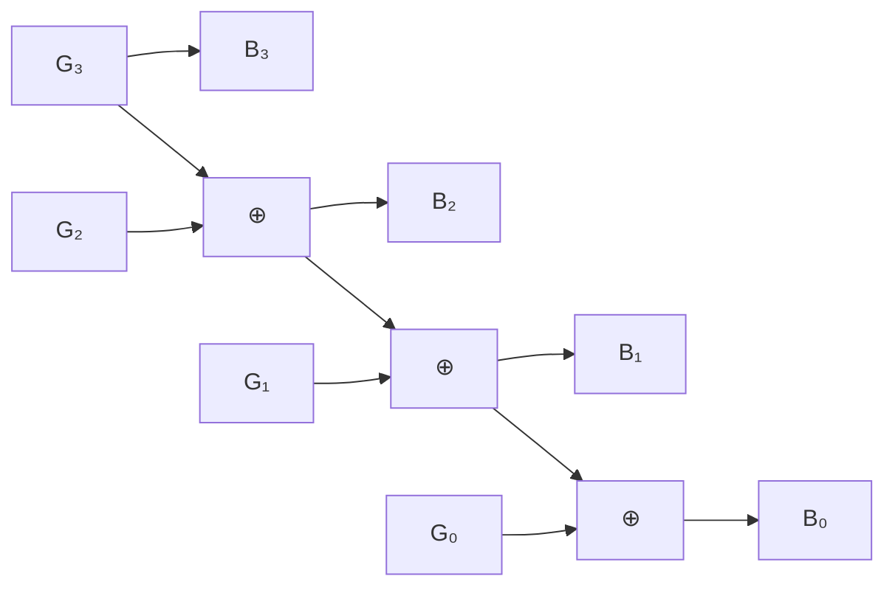

**સમીકરણો**:

- B₃ = G₃
- B₂ = G₃ ⊕ G₂
- B₁ = B₂ ⊕ G₁
- B₀ = B₁ ⊕ G₀

**મેમરી ટ્રીક:** ગ્રે ટુ બાઇનરી કન્વર્ઝન માટે "MSB સ્ટેઝ, રેસ્ટ XOR".

## પ્રશ્ન 4(અ) [3 માર્ક્સ]

**ટ્રુથ ટેબલ અને સર્કિટ ડાયાગ્રામ સાથે D ફ્લિપ ફ્લોપ સમજાવો.**

**જવાબ**:

**D ફ્લિપ-ફ્લોપ**:

| ફંક્શન | વર્ણન | ટ્રુથ ટેબલ |
|----------|-------------|-------------|
| **D ફ્લિપ-ફ્લોપ** | ડેટા/ડિલે ફ્લિપ-ફ્લોપ | CLK | D | Q | Q' |
|          | ક્લોક એજ પર Q, D ને ફોલો કરે છે | ↑ | 0 | 0 | 1 |
|          |                           | ↑ | 1 | 1 | 0 |

**સર્કિટ ડાયાગ્રામ**:

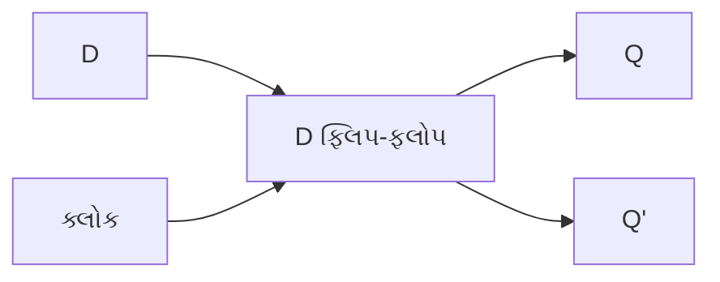

**કેરેક્ટરિસ્ટિક સમીકરણ**:

- Q(next) = D

**મેમરી ટ્રીક:** D ફ્લિપ-ફ્લોપ ઓપરેશન માટે "ડેટા ડિલેઝ વન ક્લોક".

## પ્રશ્ન 4(બ) [4 માર્ક્સ]

**માસ્ટર સ્લેવ JK ફ્લિપ ફ્લોપનું કાર્ય સમજાવો.**

**જવાબ**:

**માસ્ટર-સ્લેવ JK ફ્લિપ-ફ્લોપ**:

| કોમ્પોનન્ટ | ઓપરેશન | ટ્રુથ ટેબલ |
|-----------|-----------|-------------|
| **માસ્ટર** | CLK = 1 હોય ત્યારે ઇનપુટ્સને સેમ્પલ કરે છે | J K | Q(next) |
| **સ્લેવ** | CLK = 0 હોય ત્યારે માસ્ટર આઉટપુટને ટ્રાન્સફર કરે છે | 0 0 | કોઈ ફેરફાર નહીં |
|          |                                       | 0 1 | 0 |
|          |                                       | 1 0 | 1 |
|          |                                       | 1 1 | ટોગલ |

**ડાયાગ્રામ: માસ્ટર-સ્લેવ JK**:

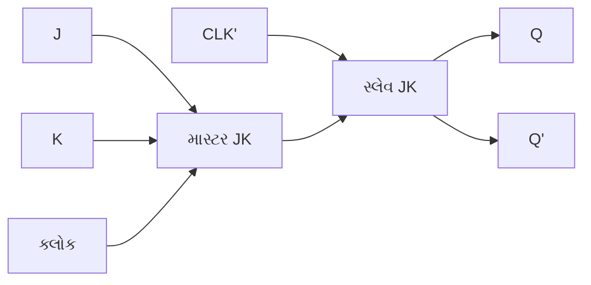

**કાર્યપદ્ધતિ**:

- **માસ્ટર સ્ટેજ**: ક્લોક હાઇ હોય ત્યારે ઇનપુટ કેપ્ચર કરે છે
- **સ્લેવ સ્ટેજ**: ક્લોક લો હોય ત્યારે આઉટપુટ અપડેટ કરે છે
- **રેસ કન્ડિશન અટકાવે છે** ઇનપુટ કેપ્ચર અને આઉટપુટ અપડેટને અલગ કરીને

**મેમરી ટ્રીક:** માસ્ટર-સ્લેવ ઓપરેશન માટે "માસ્ટર સેમ્પલ્સ, સ્લેવ ટ્રાન્સફર્સ".

## પ્રશ્ન 4(ક) [7 માર્ક્સ]

**બ્લોક ડાયાગ્રામની મદદથી શિફ્ટ રજિસ્ટર્સનું વર્ગીકરણ કરો અને તેમાંના કોઈપણ એકને વિગતવાર સમજાવો.**

**જવાબ**:

**શિફ્ટ રજિસ્ટર વર્ગીકરણ**:

| પ્રકાર | વર્ણન | ફંક્શન |
|------|-------------|----------|
| **SISO** | સિરિયલ ઇન સિરિયલ આઉટ | ડેટા સિરિયલી, બિટ દર બિટ, એન્ટર થાય છે અને એક્ઝિટ થાય છે |
| **SIPO** | સિરિયલ ઇન પેરેલલ આઉટ | ડેટા સિરિયલી એન્ટર થાય છે, પેરેલલમાં એક્ઝિટ થાય છે |
| **PISO** | પેરેલલ ઇન સિરિયલ આઉટ | ડેટા પેરેલલમાં એન્ટર થાય છે, સિરિયલી એક્ઝિટ થાય છે |
| **PIPO** | પેરેલલ ઇન પેરેલલ આઉટ | ડેટા પેરેલલમાં એન્ટર થાય છે અને પેરેલલમાં એક્ઝિટ થાય છે |

**SIPO શિફ્ટ રજિસ્ટર વિગતવાર**:

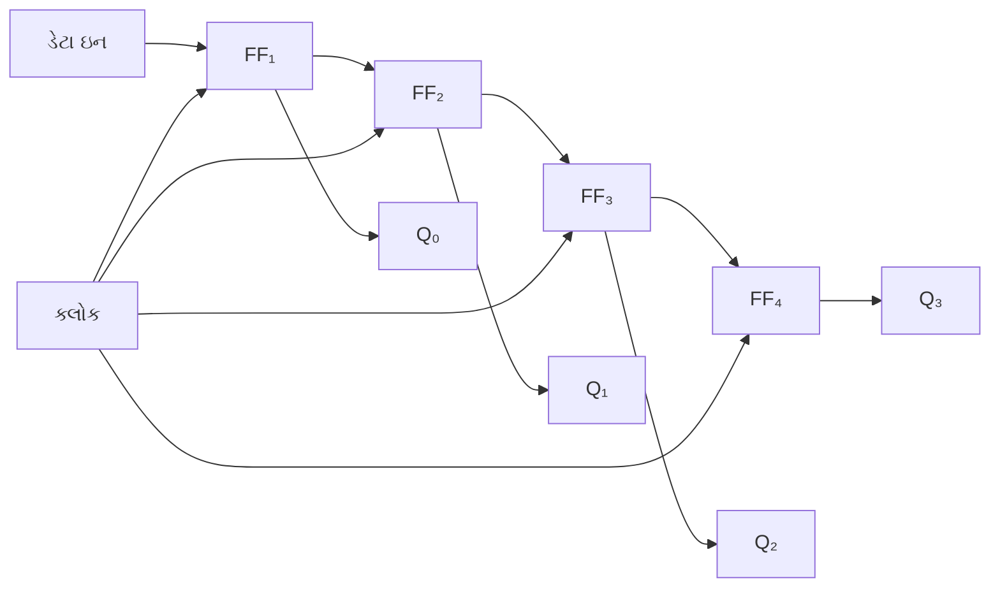

**SIPO શિફ્ટ રજિસ્ટરનું કાર્ય**:

- **સિરિયલ ડેટા** ડેટા-ઇન પિન પર, પ્રતિ ક્લોક સાયકલ એક બિટ, પ્રવેશે છે
- **દરેક ફ્લિપ-ફ્લોપ** ક્લોક પલ્સ પર તેની સામગ્રીને આગળના ફ્લિપ-ફ્લોપમાં પાસ કરે છે
- **4 ક્લોક સાયકલ્સ પછી**, 4-બિટ ડેટા બધા ફ્લિપ-ફ્લોપ્સમાં સ્ટોર થાય છે
- **પેરેલલ આઉટપુટ** Q0-Q3 પરથી એક સાથે ઉપલબ્ધ થાય છે

**SIPO માટે ટાઇમિંગ ડાયાગ્રામ**:

```goat
Clock   _|‾|_|‾|_|‾|_|‾|_
Data    ___|‾‾‾|___|‾‾‾|_
Q0      ___|‾‾‾|___|‾‾‾|_
Q1      _____|‾‾‾|___|‾‾
Q2      _______|‾‾‾|___
Q3      _________|‾‾‾|_
```

**મેમરી ટ્રીક:** SIPO ઓપરેશન માટે "સિરિયલ ઇનપુટ્સ પેરેલલ આઉટપુટ્સ".

## પ્રશ્ન 4(અ) અથવા [3 માર્ક્સ]

**ટ્રુથ ટેબલ અને સર્કિટ ડાયાગ્રામ સાથે SR ફ્લિપ ફ્લોપ સમજાવો.**

**જવાબ**:

**SR ફ્લિપ-ફ્લોપ**:

| ફંક્શન | વર્ણન | ટ્રુથ ટેબલ |
|----------|-------------|-------------|
| **SR ફ્લિપ-ફ્લોપ** | સેટ-રિસેટ ફ્લિપ-ફ્લોપ | S R | Q | Q' |
|              | બેઝિક મેમોરી એલિમેન્ટ | 0 0 | કોઈ ફેરફાર નહીં | કોઈ ફેરફાર નહીં |
|              |                      | 0 1 | 0 | 1 |
|              |                      | 1 0 | 1 | 0 |
|              |                      | 1 1 | અમાન્ય | અમાન્ય |

**સર્કિટ ડાયાગ્રામ**:

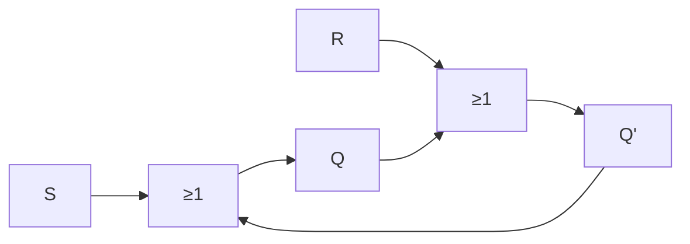

**મેમરી ટ્રીક:** SR ફ્લિપ-ફ્લોપ ઓપરેશન માટે "સેટ ટુ 1, રિસેટ ટુ 0".

## પ્રશ્ન 4(બ) અથવા [4 માર્ક્સ]

**ટ્રુથ ટેબલ અને સર્કિટ ડાયાગ્રામ સાથે JK ફ્લિપ ફ્લોપ સમજાવો.**

**જવાબ**:

**JK ફ્લિપ-ફ્લોપ**:

| ફંક્શન | વર્ણન | ટ્રુથ ટેબલ |
|----------|-------------|-------------|
| **JK ફ્લિપ-ફ્લોપ** | ઇમ્પ્રુવ્ડ SR ફ્લિપ-ફ્લોપ | J K | Q(next) |
|             | અમાન્ય કન્ડિશન હલ કરે છે | 0 0 | કોઈ ફેરફાર નહીં |
|             |                            | 0 1 | 0 |
|             |                            | 1 0 | 1 |
|             |                            | 1 1 | ટોગલ (Q') |

**સર્કિટ ડાયાગ્રામ**:

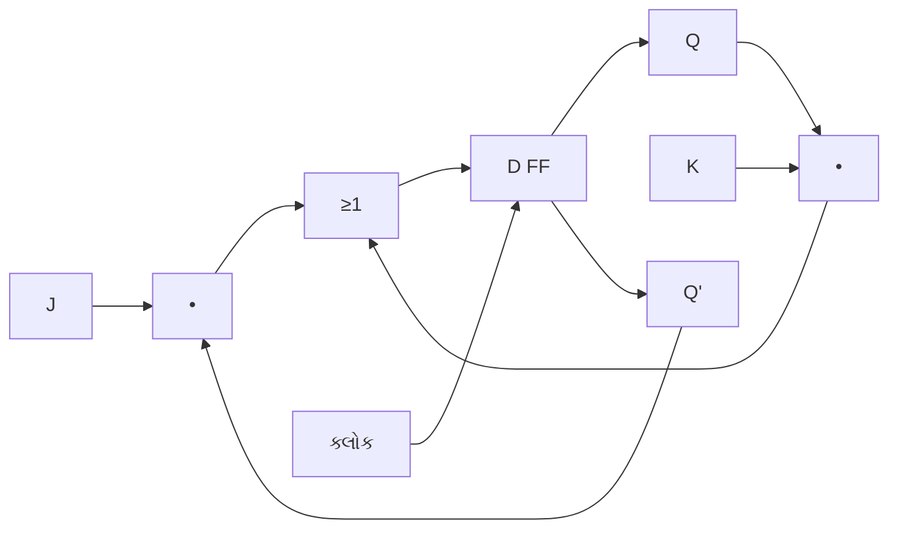

**કેરેક્ટરિસ્ટિક સમીકરણ**:

- Q(next) = J•Q' + K'•Q

**મેમરી ટ્રીક:** JK ફ્લિપ-ફ્લોપ સ્ટેટ્સ માટે "જમ્પ-કીપ-ટોગલ" (J=1 K=0: 1 પર જમ્પ, J=0 K=0: સ્ટેટ જાળવવો, J=1 K=1: ટોગલ).

## પ્રશ્ન 4(ક) અથવા [7 માર્ક્સ]

**ટ્રુથ ટેબલ અને સર્કિટ ડાયાગ્રામ સાથે 4-બિટ અસિંક્રોનસ અપ કાઉન્ટરનું વર્ણન કરો.**

**જવાબ**:

**4-બિટ અસિંક્રોનસ અપ કાઉન્ટર**:

| ફંક્શન | વર્ણન | કાઉન્ટ સિક્વન્સ |
|----------|-------------|----------------|
| **અસિંક્રોનસ કાઉન્ટર** | રિપલ કાઉન્ટર પણ કહેવાય છે | 0000 → 0001 → 0010 → 0011 |
| | ક્લોક માત્ર પહેલા FF ને ડ્રાઇવ કરે છે | 0100 → 0101 → 0110 → 0111 |
| | દરેક FF અગાઉના FF આઉટપુટ દ્વારા ટ્રિગર થાય છે | 1000 → 1001 → 1010 → 1011 |
| | | 1100 → 1101 → 1110 → 1111 |

**સર્કિટ ડાયાગ્રામ**:

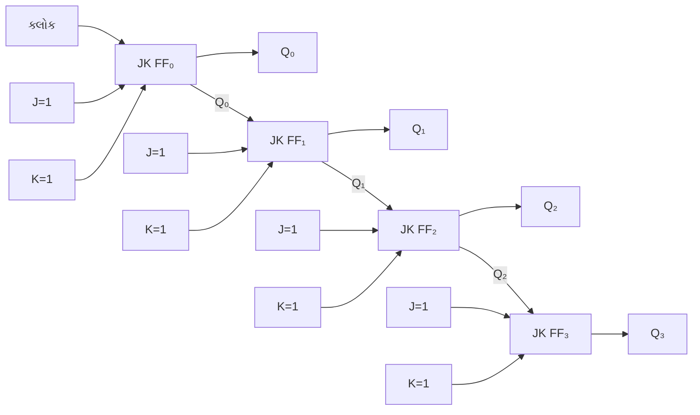

**કાર્યપદ્ધતિ**:

- **પહેલો FF** દરેક ક્લોક પલ્સ પર ટોગલ થાય છે
- **બીજો FF** જ્યારે પહેલો FF 1 થી 0 પર જાય છે ત્યારે ટોગલ થાય છે
- **ત્રીજો FF** જ્યારે બીજો FF 1 થી 0 પર જાય છે ત્યારે ટોગલ થાય છે
- **ચોથો FF** જ્યારે ત્રીજો FF 1 થી 0 પર જાય છે ત્યારે ટોગલ થાય છે

**મેમરી ટ્રીક:** અસિંક્રોનસ કાઉન્ટર ઓપરેશન માટે "રિપલ કેરીઝ પ્રોપેગેશન ડિલે".

## પ્રશ્ન 5(અ) [3 માર્ક્સ]

**નીચેની લોજીક ફેમિલીઝની તુલના કરો: TTL, CMOS, ECL**

**જવાબ**:

**લોજિક ફેમિલીઝ કમ્પેરિઝન**:

| પેરામીટર | TTL | CMOS | ECL |
|-----------|-----|------|-----|
| **ટેક્નોલોજી** | બાયપોલર ટ્રાન્ઝિસ્ટર્સ | MOSFETs | બાયપોલર ટ્રાન્ઝિસ્ટર્સ |
| **પાવર કન્ઝમ્પશન** | મધ્યમ | ખૂબ ઓછો | ઉચ્ચ |
| **સ્પીડ** | મધ્યમ | નીચી-મધ્યમ | ખૂબ ઉચ્ચ |
| **નોઇઝ ઇમ્યુનિટી** | મધ્યમ | ઉચ્ચ | નીચી |
| **ફેન-આઉટ** | 10 | 50+ | 25 |
| **સપ્લાય વોલ્ટેજ** | 5V | 3-15V | -5.2V |

**મેમરી ટ્રીક:** લોજિક ફેમિલીઝની તુલના માટે "ટેક્નોલોજી કન્ટ્રોલ્સ મેની ઇલેક્ટ્રિકલ કેરેક્ટરિસ્ટિક્સ".

## પ્રશ્ન 5(બ) [4 માર્ક્સ]

**કોમ્બિનેશનલ અને સિક્વેન્શિયલ લોજિક સર્કિટ્સની સરખામણી કરો.**

**જવાબ**:

**કોમ્બિનેશનલ vs સિક્વેન્શિયલ સર્કિટ્સ**:

| પેરામીટર | કોમ્બિનેશનલ સર્કિટ્સ | સિક્વેન્શિયલ સર્કિટ્સ |
|-----------|------------------------|---------------------|
| **આઉટપુટ આધારિત છે** | માત્ર વર્તમાન ઇનપુટ્સ પર | વર્તમાન ઇનપુટ્સ અને અગાઉની સ્ટેટ પર |
| **મેમોરી** | કોઈ મેમોરી નથી | મેમોરી એલિમેન્ટ્સ ધરાવે છે |
| **ફીડબેક** | કોઈ ફીડબેક પાથ નથી | ફીડબેક પાથ્સ ધરાવે છે |
| **ઉદાહરણો** | એડર્સ, MUX, ડિકોડર્સ | ફ્લિપ-ફ્લોપ્સ, કાઉન્ટર્સ, રજિસ્ટર્સ |
| **ક્લોક** | ક્લોકની જરૂર નથી | ઘણી વાર ક્લોકની જરૂર પડે છે |
| **ડિઝાઇન એપ્રોચ** | ટ્રુથ ટેબલ્સ, K-મેપ્સ | સ્ટેટ ડાયાગ્રામ્સ, ટેબલ્સ |

**ડાયાગ્રામ: કમ્પેરિઝન**:

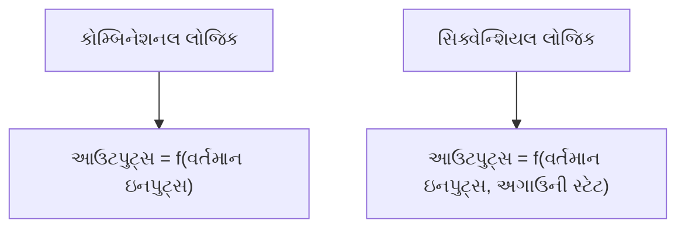

**મેમરી ટ્રીક:** કોમ્બિનેશનલ અને સિક્વેન્શિયલ સર્કિટ્સ વચ્ચે તફાવત કરવા માટે "કરંટ ઓન્લી vs મેમોરી સ્ટેટ્સ".

## પ્રશ્ન 5(ક) [7 માર્ક્સ]

**વ્યાખ્યાયિત કરો: ફેન ઇન, ફેન આઉટ, નોઇઝ માર્જિન, પ્રોપેગેશન ડિલે, પાવર ડિસીપેશન, ફિગર ઓફ મેરિટ, રેમ**

**જવાબ**:

**ડિજિટલ ઇલેક્ટ્રોનિક્સ કી ડેફિનિશન્સ**:

| ટર્મ | વ્યાખ્યા | ટિપિકલ વેલ્યુઝ |
|------|------------|----------------|
| **ફેન-ઇન** | લોજિક ગેટ જેટલા ઇનપુટ્સ હેન્ડલ કરી શકે તેની મહત્તમ સંખ્યા | TTL: 2-8, CMOS: 100+ |
| **ફેન-આઉટ** | સિંગલ આઉટપુટ દ્વારા જેટલા ગેટ ઇનપુટ્સ ડ્રાઇવ કરી શકાય તેની મહત્તમ સંખ્યા | TTL: 10, CMOS: 50 |
| **નોઇઝ માર્જિન** | એરર થાય તે પહેલાં ઉમેરી શકાય તેવો મહત્તમ નોઇઝ વોલ્ટેજ | TTL: 0.4V, CMOS: 1.5V |
| **પ્રોપેગેશન ડિલે** | ઇનપુટમાં બદલાવથી આઉટપુટમાં બદલાવ થવામાં લાગતો સમય | TTL: 10ns, CMOS: 20ns |
| **પાવર ડિસીપેશન** | ઓપરેશન દરમિયાન ગેટ દ્વારા વપરાતી શક્તિ | TTL: 10mW, CMOS: 0.1mW |
| **ફિગર ઓફ મેરિટ** | સ્પીડ અને પાવરનો ગુણાકાર (ઓછો વધુ સારો) | TTL: 100pJ, CMOS: 2pJ |
| **RAM** | રેન્ડમ એક્સેસ મેમોરી - ટેમ્પરરી સ્ટોરેજ ડિવાઇસ | પ્રકાર: SRAM, DRAM |

**ડાયાગ્રામ: ડિજિટલ પેરામીટર રિલેશનશિપ્સ**:

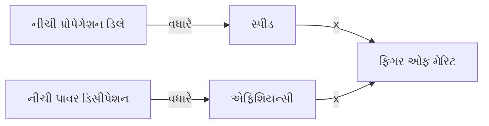

**મેમરી ટ્રીક:** પેરામીટર ટર્મ્સ યાદ રાખવા માટે "ફાસ્ટ પાવર નીડ્સ પ્રોપર ફિગર રેટિંગ્સ".

## પ્રશ્ન 5(અ) અથવા [3 માર્ક્સ]

**ડિજિટલ ICના ઇ-વેસ્ટ મેનેજમેન્ટના પગલાં અને જરૂરિયાતનું વર્ણન કરો.**

**જવાબ**:

**ડિજિટલ ICs માટે ઇ-વેસ્ટ મેનેજમેન્ટ**:

| સ્ટેપ | વર્ણન | મહત્વ |
|------|-------------|------------|
| **કલેક્શન** | ઇલેક્ટ્રોનિક વેસ્ટનું અલગ કલેક્શન | અયોગ્ય ડિસ્પોઝલને રોકે છે |
| **સેગ્રેગેશન** | ICsને અન્ય કોમ્પોનન્ટ્સથી અલગ કરવું | ટાર્ગેટેડ રિસાયક્લિંગ શક્ય બનાવે છે |
| **ડિસમેન્ટલિંગ** | હાનિકારક ભાગોને દૂર કરવા | પર્યાવરણીય નુકસાન ઘટાડે છે |
| **રિકવરી** | મૂલ્યવાન મટીરિયલ્સ (ગોલ્ડ, સિલિકોન) એક્સટ્રેક્ટ કરવા | સંસાધનો બચાવે છે |
| **સેફ ડિસ્પોઝલ** | નોન-રિસાયક્લેબલ પાર્ટ્સનો યોગ્ય નિકાલ | પ્રદૂષણ અટકાવે છે |

**ઇ-વેસ્ટ મેનેજમેન્ટની જરૂરિયાત**:

- **હાનિકારક મટીરિયલ્સ**: ICs લેડ, મર્ક્યુરી, કેડમિયમ ધરાવે છે
- **રિસોર્સ કન્ઝર્વેશન**: કિંમતી ધાતુઓ અને દુર્લભ સામગ્રી પુનઃપ્રાપ્ત કરે છે
- **પર્યાવરણ સંરક્ષણ**: જમીન અને પાણીના પ્રદૂષણને રોકે છે
- **હેલ્થ સેફ્ટી**: ઝેરી પદાર્થોના સંપર્કને ઘટાડે છે

**મેમરી ટ્રીક:** ઇ-વેસ્ટ મેનેજમેન્ટ સ્ટેપ્સ માટે "કલેક્શન સ્ટાર્ટ્સ ડિસમેન્ટલિંગ રિકવરી સેફ્લી".

## પ્રશ્ન 5(બ) અથવા [4 માર્ક્સ]

**સર્કિટ ડાયાગ્રામ સાથે રીંગ કાઉન્ટરનું કામ સમજાવો.**

**જવાબ**:

**રીંગ કાઉન્ટર**:

| ફંક્શન | વર્ણન | કાઉન્ટ સિક્વન્સ |
|----------|-------------|----------------|
| **રીંગ કાઉન્ટર** | સિંગલ 1 સાથે સર્ક્યુલર શિફ્ટ રજિસ્ટર | 1000 → 0100 → 0010 → 0001 → 1000 |
| | કોઈપણ સમયે માત્ર એક જ ફ્લિપ-ફ્લોપ સેટ થયેલ હોય છે | |
| | N સ્ટેટ્સ માટે N ફ્લિપ-ફ્લોપ્સ | |

**સર્કિટ ડાયાગ્રામ**:

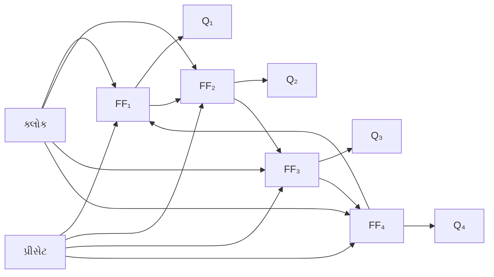

**કાર્યપદ્ધતિ**:

- **ઇનિશિયલાઇઝેશન**: પહેલા FF ને 1 પર સેટ કરવામાં આવે છે, બાકીના 0 પર
- **ઓપરેશન**: સિંગલ 1 બધા ફ્લિપ-ફ્લોપ્સમાં ફરે છે
- **એપ્લિકેશન્સ**: સિક્વેન્સર્સ, કન્ટ્રોલર્સ, ટાઇમિંગ સર્કિટ્સ

**મેમરી ટ્રીક:** રીંગ કાઉન્ટર ઓપરેશન માટે "વન બિટ રોટેટ્સ ઓન્લી".

## પ્રશ્ન 5(ક) અથવા [7 માર્ક્સ]

**વર્ગીકૃત કરો: (i) મેમોરીઝ (ii) વિવિધ લોજીક ફેમિલીઝ**

**જવાબ**:

**(i) મેમોરી વર્ગીકરણ**:

| પ્રકાર | સબટાઇપ્સ | લક્ષણો |
|------|----------|----------------|
| **RAM** | **SRAM** | - સ્ટેટિક RAM<br>- ફાસ્ટ, મોંઘી<br>- ફ્લિપ-ફ્લોપ્સનો ઉપયોગ કરે છે<br>- રિફ્રેશની જરૂર નથી |
|      | **DRAM** | - ડાયનેમિક RAM<br>- સ્લોઅર, સસ્તી<br>- કેપેસિટર્સનો ઉપયોગ કરે છે<br>- પીરિયોડિક રિફ્રેશની જરૂર પડે છે |
| **ROM** | **PROM** | - પ્રોગ્રામેબલ ROM<br>- વન-ટાઇમ પ્રોગ્રામેબલ |
|      | **EPROM** | - ઇરેઝેબલ PROM<br>- UV લાઇટ દ્વારા ઇરેઝેબલ<br>- મલ્ટિપલ રીપ્રોગ્રામિંગ |
|      | **EEPROM** | - ઇલેક્ટ્રિકલી ઇરેઝેબલ PROM<br>- ઇલેક્ટ્રિકલ ઇરેઝર<br>- બાઇટ-લેવલ ઇરેઝર |
|      | **ફ્લેશ** | - EEPROM વેરિએન્ટ<br>- બ્લોક-લેવલ ઇરેઝર<br>- નોન-વોલેટાઇલ |

**(ii) લોજિક ફેમિલીઝ વર્ગીકરણ**:

| ટેક્નોલોજી | ફેમિલીઝ | લક્ષણો |
|------------|----------|----------------|
| **બાયપોલર** | **TTL** | - ટ્રાન્ઝિસ્ટર-ટ્રાન્ઝિસ્ટર લોજિક<br>- મધ્યમ સ્પીડ<br>- 5V ઓપરેશન |
|          | **ECL** | - એમિટર-કપલ્ડ લોજિક<br>- ખૂબ હાઈ સ્પીડ<br>- હાઈ પાવર કન્ઝમ્પશન |
|          | **I²L** | - ઇન્ટિગ્રેટેડ ઇન્જેક્શન લોજિક<br>- હાઈ ડેન્સિટી |
| **MOS** | **NMOS** | - N-ચેનલ MOSFET<br>- સિમ્પલર ફેબ્રિકેશન |
|       | **PMOS** | - P-ચેનલ MOSFET<br>- લોઅર પરફોર્મન્સ |
|       | **CMOS** | - કોમ્પ્લિમેન્ટરી MOS<br>- લો પાવર કન્ઝમ્પશન<br>- હાઈ નોઇઝ ઇમ્યુનિટી |
| **હાઇબ્રિડ** | **BiCMOS** | - બાયપોલર અને CMOSને કોમ્બાઇન કરે છે<br>- લો પાવર સાથે હાઈ સ્પીડ |

**મેમોરી વર્ગીકરણ ડાયાગ્રામ**:

```mermaid
flowchart TB
    MEM["સેમિકન્ડક્ટર મેમોરીઝ"]
    MEM --> RAM["રેન્ડમ એક્સેસ મેમોરી (વોલેટાઇલ)"]
    MEM --> ROM["રીડ ઓન્લી મેમોરી (નોન-વોલેટાઇલ)"]
    RAM --> SRAM["SRAM (સ્ટેટિક)"]
    RAM --> DRAM["DRAM (ડાયનેમિક)"]
    ROM --> PROM["PROM (વન-ટાઇમ)"]
    ROM --> EPROM["EPROM (UV ઇરેઝેબલ)"]
    ROM --> EEPROM["EEPROM (ઇલેક્ટ્રિકલ ઇરેઝેબલ)"]
```

**મેમરી ટ્રીક:** મેમોરી પ્રકારો માટે "રિમેમ્બર સિમ્પલ ડિવિઝન: પ્રોગ્રામેબલ ઇરેઝેબલ ઇલેક્ટ્રિકલ" (RAM-SRAM-DRAM, PROM-EPROM-EEPROM).
