## Question 1(a) [3 marks]

**Convert: (110101)₂ = ( ___ )₁₀ = ( ___ )₈ = ( ___ )₁₆**

**Answer**:

**Step-by-step conversion of (110101)₂**:

| Binary (110101)₂ | Decimal | Octal | Hexadecimal |
|------------------|---------|-------|-------------|
| 1×2⁵ + 1×2⁴ + 0×2³ + 1×2² + 0×2¹ + 1×2⁰ | 32+16+0+4+0+1 = 53 | 6×8¹ + 5×8⁰ = 48+5 = 53 | 3×16¹ + 5×16⁰ = 48+5 = 35 |
| (110101)₂ | (53)₁₀ | (65)₈ | (35)₁₆ |

**Mnemonic:** "Binary Digits Out Here" (BDOH) for Binary→Decimal→Octal→Hexadecimal conversion.

## Question 1(b) [4 marks]

**Perform: (i) (11101101)₂+(10101000)₂ (ii) (11011)₂*(1010)₂**

**Answer**:

**Table for binary addition and multiplication**:

| (i) Binary Addition | (ii) Binary Multiplication |
|--------------------|----------------------------|
| ```   11101101     | ```     11011             |
|   + 10101000       |      ×  1010              |
|   ----------       |      -------              |
|   110010101```     |         00000             |
|                    |        11011              |
|                    |       00000               |
|                    |      11011                |
|                    |      --------             |
|                    |      11101110```          |

**Decimal verification**:

- (i) (11101101)₂ = 237, (10101000)₂ = 168, Sum = 405 = (110010101)₂
- (ii) (11011)₂ = 27, (1010)₂ = 10, Product = 270 = (11101110)₂

**Mnemonic:** "Carry Up Makes Sum" for addition and "Shift Left Add Product" for multiplication.

## Question 1(c) [7 marks]

**(i) Convert: (48)₁₀ = ( ___ )₂ = ( ___ )₈ = ( ___ )₁₆**
**(ii) Subtract using 2's Complement method: (1110)₂ – (1000)₂**
**(iii) Divide (1111101)₂ with (101)₂**

**Answer**:

**(i) Conversion Table**:

| Decimal (48)₁₀ | Binary | Octal | Hexadecimal |
|----------------|--------|-------|-------------|
| 48÷2 = 24 rem 0 | 110000 | 60 | 30 |
| 24÷2 = 12 rem 0 |  |  |  |
| 12÷2 = 6 rem 0 |  |  |  |
| 6÷2 = 3 rem 0 |  |  |  |
| 3÷2 = 1 rem 1 |  |  |  |
| 1÷2 = 0 rem 1 |  |  |  |
| (48)₁₀ | (110000)₂ | (60)₈ | (30)₁₆ |

**(ii) Subtraction Table**:

| 2's Complement Method | Steps |
|-----------------------|-------|
| (1110)₂ – (1000)₂ | 1. Find 2's complement of (1000)₂ |
| 1's complement of (1000)₂ | (0111)₂ |
| 2's complement | (0111)₂ + 1 = (1000)₂ |
| (1110)₂ + (1000)₂ | (10110)₂ |
| Discard carry | (0110)₂ |
| Result | (0110)₂ = 6₁₀ |

**(iii) Division**:

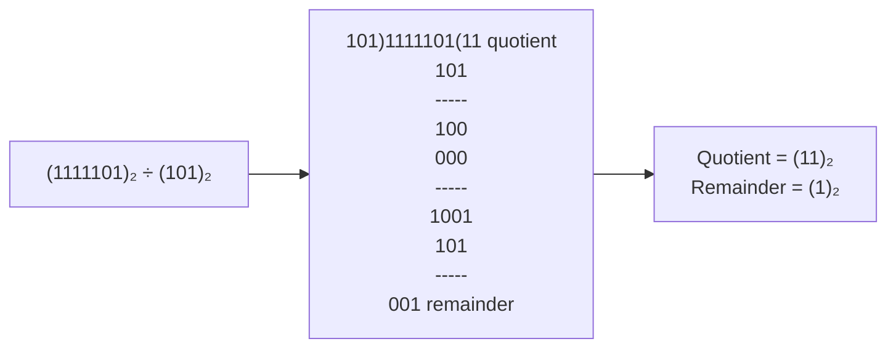

**Mnemonic:** "Division Drops Down Remainders" for long division process.

## Question 1(c) OR [7 marks]

**Explain Codes: ASCII, BCD, Gray**

**Answer**:

**Table of Common Digital Codes**:

| Code | Description | Example |
|------|-------------|---------|
| **ASCII (American Standard Code for Information Interchange)** | 7-bit code representing 128 characters including alphabets, numbers, and special symbols | A = 65 (1000001)₂ |
| **BCD (Binary Coded Decimal)** | Represents each decimal digit (0-9) using 4 bits | 42 = 0100 0010 |
| **Gray Code** | Binary code where adjacent numbers differ by only one bit | (0,1,3,2) = (00,01,11,10) |

**Diagram: Gray Code Generation**:

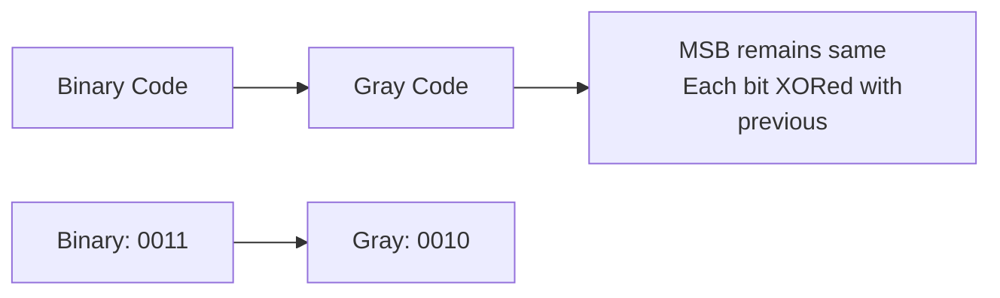

**Mnemonic:** "Always Binary Generates" - first letter of each code (ASCII, BCD, Gray).

## Question 2(a) [3 marks]

**Simplify using Boolean Algebra: Y = A B + A' B + A' B' + A B'**

**Answer**:

**Step-by-step simplification**:

| Step | Expression | Boolean Law |
|------|------------|-------------|
| Y = A B + A' B + A' B' + A B' | Initial expression | - |
| Y = A(B + B') + A'(B + B') | Factoring | Distributive law |
| Y = A(1) + A'(1) | Complement law | B + B' = 1 |
| Y = A + A' | Simplification | - |
| Y = 1 | Complement law | A + A' = 1 |

**Mnemonic:** "Factor, Simplify, Finish" for Boolean simplification steps.

## Question 2(b) [4 marks]

**Simplify the following Boolean function using K-map: f(A,B,C,D) = Σm (0,3,4,6,8,11,12)**

**Answer**:

**K-map Solution**:

```
    AB
CD  00 01 11 10
00  1  0  0  1
01  0  0  0  1  
11  0  1  0  0
10  0  0  1  0
```

**Grouping**:

- Group 1: m(0,8) = A'C'D'
- Group 2: m(4,12) = BD'
- Group 3: m(3,11) = CD
- Group 4: m(6) = A'B'CD'

**Simplified expression**: f(A,B,C,D) = A'C'D' + BD' + CD + A'B'CD'

**Mnemonic:** "Group Powers Of Two" for K-map grouping strategy.

## Question 2(c) [7 marks]

**Explain NOR gate as a universal gate with neat diagrams.**

**Answer**:

**NOR as Universal Gate**:

| Function | Implementation using NOR | Truth Table |
|----------|--------------------------|-------------|
| **NOT Gate** |  | A | A' |
|          |                          | 0 | 1  |
|          |                          | 1 | 0  |
| **AND Gate** |  | A B | A•B |
|          |                          | 0 0 | 0   |
|          |                          | 0 1 | 0   |
|          |                          | 1 0 | 0   |
|          |                          | 1 1 | 1   |
| **OR Gate** |  | A B | A+B |
|          |                          | 0 0 | 0   |
|          |                          | 0 1 | 1   |
|          |                          | 1 0 | 1   |
|          |                          | 1 1 | 1   |

**Diagram: NOR Implementation**:

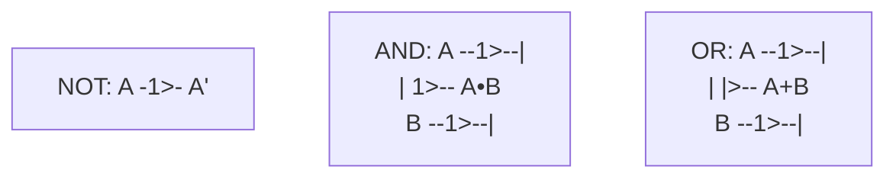

**Mnemonic:** "NOT AND OR, NOR does more" for remembering NOR gate implementations.

## Question 2(a) OR [3 marks]

**Draw logic circuit for Boolean expression: Y = (A + B') . (A' + B') . (B + C)**

**Answer**:

**Logic Circuit Implementation**:

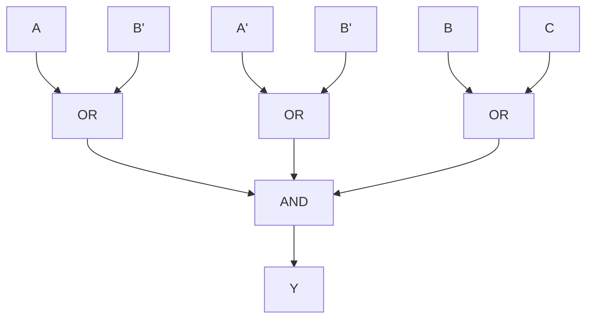

**Truth Table Verification**:

- Term 1: (A + B')
- Term 2: (A' + B')
- Term 3: (B + C)
- Output: Y = Term1 • Term2 • Term3

**Mnemonic:** "Each Term Separately" for breaking complex expressions.

## Question 2(b) OR [4 marks]

**State De-Morgan's theorems and prove it.**

**Answer**:

**De-Morgan's Theorems and Proof**:

| Theorem | Statement | Proof by Truth Table |
|---------|-----------|----------------------|
| **Theorem 1** | (A•B)' = A' + B' | A B | A•B | (A•B)' | A' | B' | A'+B' |
|         |           | 0 0 | 0   | 1     | 1  | 1  | 1    |
|         |           | 0 1 | 0   | 1     | 1  | 0  | 1    |
|         |           | 1 0 | 0   | 1     | 0  | 1  | 1    |
|         |           | 1 1 | 1   | 0     | 0  | 0  | 0    |
| **Theorem 2** | (A+B)' = A'•B' | A B | A+B | (A+B)' | A' | B' | A'•B' |
|         |           | 0 0 | 0   | 1     | 1  | 1  | 1    |
|         |           | 0 1 | 1   | 0     | 1  | 0  | 0    |
|         |           | 1 0 | 1   | 0     | 0  | 1  | 0    |
|         |           | 1 1 | 1   | 0     | 0  | 0  | 0    |

**Diagram: De-Morgan's Law Visualization**:

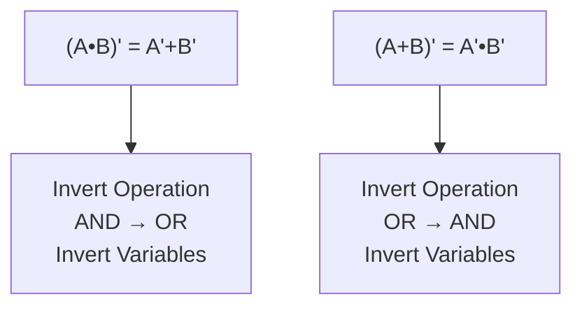

**Mnemonic:** "Break BAR, Change Operation, Invert Inputs" for applying De-Morgan's law.

## Question 2(c) OR [7 marks]

**Explain all the Logic Gates with the help of Symbol, Truth table and equation.**

**Answer**:

**Logic Gates Summary**:

| Gate | Symbol | Truth Table | Equation | Description |
|------|--------|-------------|----------|-------------|
| **AND** |  | A B | Y | Y = A•B | Output 1 only when all inputs are 1 |
|      |        | 0 0 | 0 |       |                                    |
|      |        | 0 1 | 0 |       |                                    |
|      |        | 1 0 | 0 |       |                                    |
|      |        | 1 1 | 1 |       |                                    |
| **OR**  |   | A B | Y | Y = A+B | Output 1 when any input is 1      |
|      |        | 0 0 | 0 |       |                                    |
|      |        | 0 1 | 1 |       |                                    |
|      |        | 1 0 | 1 |       |                                    |
|      |        | 1 1 | 1 |       |                                    |
| **NOT** |  | A | Y | Y = A' | Inverts the input                  |
|      |        | 0 | 1 |       |                                    |
|      |        | 1 | 0 |       |                                    |
| **NAND** |  | A B | Y | Y = (A•B)' | AND followed by NOT              |
|      |        | 0 0 | 1 |       |                                    |
|      |        | 0 1 | 1 |       |                                    |
|      |        | 1 0 | 1 |       |                                    |
|      |        | 1 1 | 0 |       |                                    |
| **NOR** |   | A B | Y | Y = (A+B)' | OR followed by NOT               |
|      |        | 0 0 | 1 |       |                                    |
|      |        | 0 1 | 0 |       |                                    |
|      |        | 1 0 | 0 |       |                                    |
|      |        | 1 1 | 0 |       |                                    |
| **XOR** |   | A B | Y | Y = A⊕B | Output 1 when inputs are different |
|      |        | 0 0 | 0 |       |                                    |
|      |        | 0 1 | 1 |       |                                    |
|      |        | 1 0 | 1 |       |                                    |
|      |        | 1 1 | 0 |       |                                    |
| **XNOR** |  | A B | Y | Y = (A⊕B)' | Output 1 when inputs are same      |
|      |        | 0 0 | 1 |       |                                    |
|      |        | 0 1 | 0 |       |                                    |
|      |        | 1 0 | 0 |       |                                    |
|      |        | 1 1 | 1 |       |                                    |

**Mnemonic:** "All Operations Need Necessary eXecution" (first letter of each gate - AND, OR, NOT, NAND, NOR, XOR).

## Question 3(a) [3 marks]

**Briefly explain 4:2 Encoder.**

**Answer**:

**4-to-2 Encoder Overview**:

| Function | Description | Truth Table |
|----------|-------------|-------------|
| **4:2 Encoder** | Converts 4 input lines to 2 output lines | I₀ I₁ I₂ I₃ | Y₁ Y₀ |
|          | Only one input active at a time | 1 0 0 0 | 0 0 |
|          | Input position encoded in binary | 0 1 0 0 | 0 1 |
|          |                                  | 0 0 1 0 | 1 0 |
|          |                                  | 0 0 0 1 | 1 1 |

**Diagram: 4:2 Encoder**:

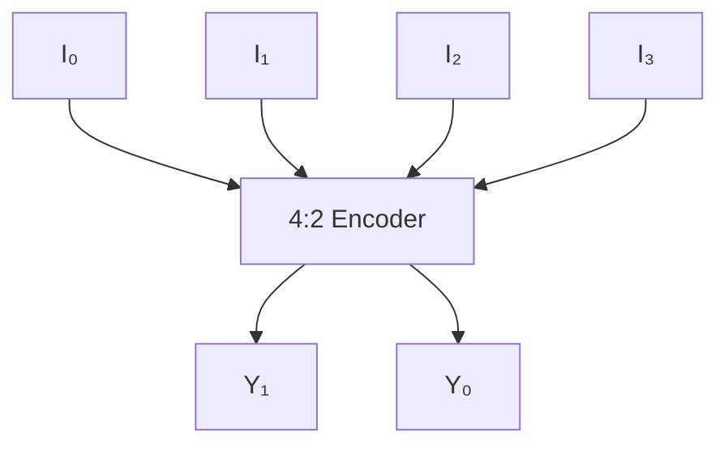

**Mnemonic:** "Input Position Creates Output" for encoder function.

## Question 3(b) [4 marks]

**Explain 4-bit Parallel adder using full adder blocks.**

**Answer**:

**4-bit Parallel Adder**:

| Component | Function |
|-----------|----------|
| **Full Adder** | Adds 3 bits (A, B, Carry-in) producing Sum and Carry-out |
| **Parallel Adder** | Connects 4 full adders with carry propagation |

**Diagram: 4-bit Parallel Adder**:

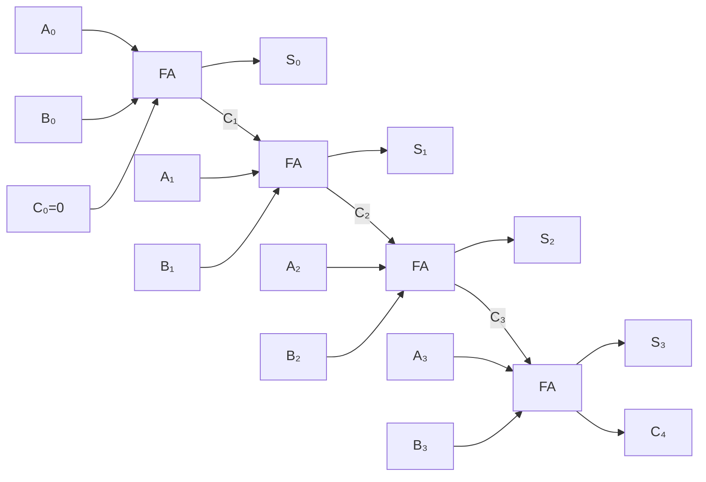

**Mnemonic:** "Carry Always Passes Right" for the carry propagation in parallel adder.

## Question 3(c) [7 marks]

**Describe 8:1 Multiplexer with truth table, equation and circuit diagram.**

**Answer**:

**8:1 Multiplexer**:

| Component | Description | Function |
|-----------|-------------|----------|
| **8:1 MUX** | Data selector with 8 inputs, 3 select lines, 1 output | Selects one of 8 inputs based on select lines |

**Truth Table**:

| Select Lines | Output |
|--------------|--------|
| S₂ S₁ S₀ | Y |
| 0 0 0 | D₀ |
| 0 0 1 | D₁ |
| 0 1 0 | D₂ |
| 0 1 1 | D₃ |
| 1 0 0 | D₄ |
| 1 0 1 | D₅ |
| 1 1 0 | D₆ |
| 1 1 1 | D₇ |

**Boolean Equation**:
Y = S₂'·S₁'·S₀'·D₀ + S₂'·S₁'·S₀·D₁ + S₂'·S₁·S₀'·D₂ + S₂'·S₁·S₀·D₃ + S₂·S₁'·S₀'·D₄ + S₂·S₁'·S₀·D₅ + S₂·S₁·S₀'·D₆ + S₂·S₁·S₀·D₇

**Diagram: 8:1 MUX**:

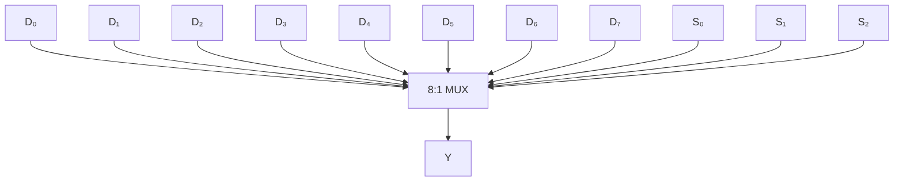

**Mnemonic:** "Select Decides Data Output" for multiplexer operation.

## Question 3(a) OR [3 marks]

**Draw the logic circuit of half Subtractor and explain its working.**

**Answer**:

**Half Subtractor**:

| Function | Description | Truth Table |
|----------|-------------|-------------|
| **Half Subtractor** | Subtracts two bits producing Difference and Borrow | A B | D Bout |
|          |                                                               | 0 0 | 0 0 |
|          |                                                               | 0 1 | 1 1 |
|          |                                                               | 1 0 | 1 0 |
|          |                                                               | 1 1 | 0 0 |

**Logic Circuit**:

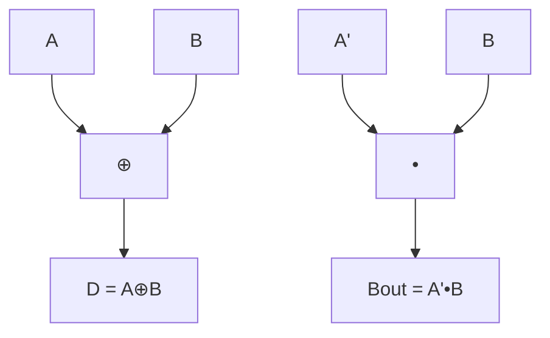

**Equations**:

- Difference (D) = A ⊕ B
- Borrow out (Bout) = A' • B

**Mnemonic:** "Different Bits Borrow" for half subtractor operation.

## Question 3(b) OR [4 marks]

**Explain 3:8 Decoder with truth table and circuit diagram.**

**Answer**:

**3:8 Decoder**:

| Function | Description | Truth Table (Partial) |
|----------|-------------|----------------------|
| **3:8 Decoder** | Converts 3-bit binary input to 8 output lines | A₂ A₁ A₀ | Y₀ Y₁ Y₂ Y₃ Y₄ Y₅ Y₆ Y₇ |
|          | Only one output active at a time                     | 0 0 0 | 1 0 0 0 0 0 0 0 |
|          |                                                      | 0 0 1 | 0 1 0 0 0 0 0 0 |
|          |                                                      | ... | ... |
|          |                                                      | 1 1 1 | 0 0 0 0 0 0 0 1 |

**Circuit Diagram**:

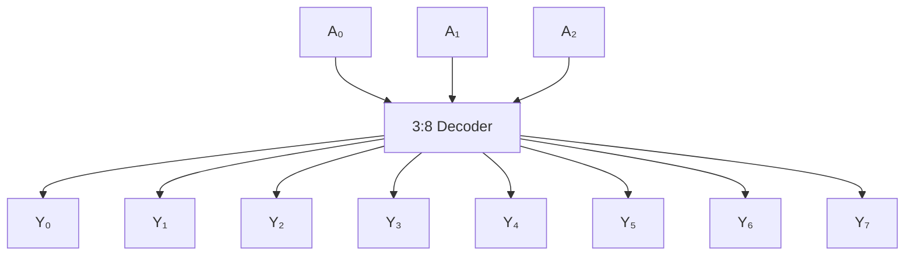

**Equations**:

- Y₀ = A₂' • A₁' • A₀'
- Y₁ = A₂' • A₁' • A₀
- ...
- Y₇ = A₂ • A₁ • A₀

**Mnemonic:** "Binary Input Activates Output" for decoder operation.

## Question 3(c) OR [7 marks]

**Explain Gray to Binary code converter with truth table, equation and circuit diagram.**

**Answer**:

**Gray to Binary Converter**:

| Function | Description | Table: Gray to Binary |
|----------|-------------|----------------------|
| **Gray to Binary** | Converts Gray code to Binary code | Gray | Binary |
|          | MSB of binary equals MSB of gray | 0000 | 0000 |
|          | Each binary bit is XOR of current gray bit and previous binary bit | 0001 | 0001 |
|          |                                                                    | 0011 | 0010 |
|          |                                                                    | 0010 | 0011 |
|          |                                                                    | 0110 | 0100 |
|          |                                                                    | ... | ... |

**Circuit Diagram**:

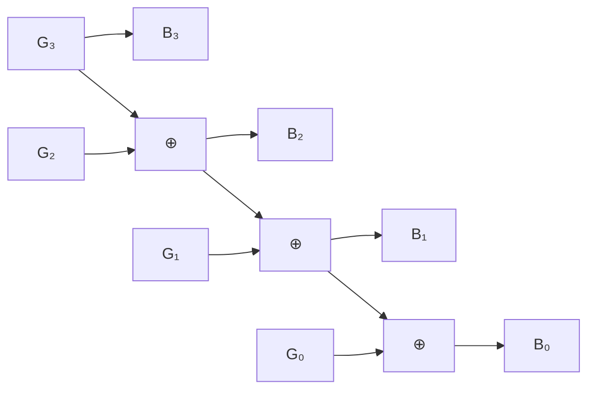

**Equations**:

- B₃ = G₃
- B₂ = G₃ ⊕ G₂
- B₁ = B₂ ⊕ G₁
- B₀ = B₁ ⊕ G₀

**Mnemonic:** "MSB Stays, Rest XOR" for Gray to Binary conversion.

## Question 4(a) [3 marks]

**Explain D flip flop with truth table and circuit diagram.**

**Answer**:

**D Flip-Flop**:

| Function | Description | Truth Table |
|----------|-------------|-------------|
| **D Flip-Flop** | Data/Delay flip-flop | CLK | D | Q | Q' |
|          | Q follows D at clock edge | ↑ | 0 | 0 | 1 |
|          |                           | ↑ | 1 | 1 | 0 |

**Circuit Diagram**:

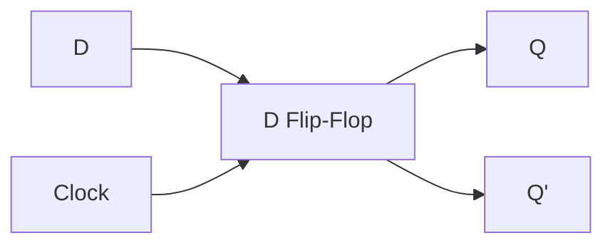

**Characteristic Equation**:

- Q(next) = D

**Mnemonic:** "Data Delays one clock" for D flip-flop operation.

## Question 4(b) [4 marks]

**Explain working of Master Slave JK flip flop.**

**Answer**:

**Master-Slave JK Flip-Flop**:

| Component | Operation | Truth Table |
|-----------|-----------|-------------|
| **Master** | Samples inputs when CLK = 1 | J K | Q(next) |
| **Slave** | Transfers master output when CLK = 0 | 0 0 | No change |
|          |                                       | 0 1 | 0 |
|          |                                       | 1 0 | 1 |
|          |                                       | 1 1 | Toggle |

**Diagram: Master-Slave JK**:

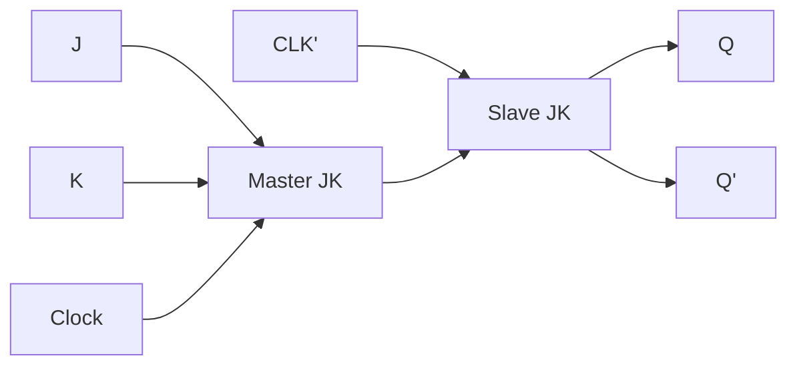

**Working**:

- **Master stage**: Captures input during clock high
- **Slave stage**: Updates output during clock low
- **Prevents race condition** by separating input capture and output update

**Mnemonic:** "Master Samples, Slave Transfers" for master-slave operation.

## Question 4(c) [7 marks]

**Classify Shift Registers with the help of Block diagram and Explain any one of them in detail.**

**Answer**:

**Shift Register Classification**:

| Type | Description | Function |
|------|-------------|----------|
| **SISO** | Serial In Serial Out | Data enters and exits serially, bit by bit |
| **SIPO** | Serial In Parallel Out | Data enters serially, exits in parallel |
| **PISO** | Parallel In Serial Out | Data enters in parallel, exits serially |
| **PIPO** | Parallel In Parallel Out | Data enters and exits in parallel |

**SIPO Shift Register in Detail**:

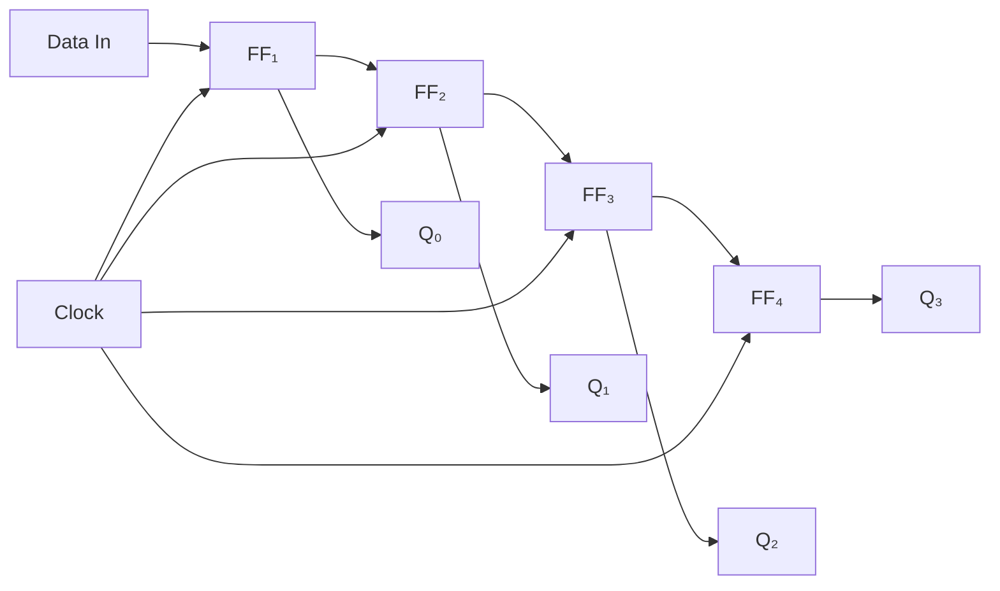

**Working of SIPO Shift Register**:

- **Serial data** enters at Data-In pin, one bit per clock cycle
- **Each flip-flop** passes its content to the next on clock pulse
- **After 4 clock cycles**, 4-bit data is stored in all flip-flops
- **Parallel output** available from Q0-Q3 simultaneously

**Timing Diagram for SIPO**:

```goat
Clock   _|‾|_|‾|_|‾|_|‾|_
Data    ___|‾‾‾|___|‾‾‾|_
Q0      ___|‾‾‾|___|‾‾‾|_
Q1      _____|‾‾‾|___|‾‾
Q2      _______|‾‾‾|___
Q3      _________|‾‾‾|_
```

**Mnemonic:** "Serial Inputs Parallel Outputs" for SIPO operation.

## Question 4(a) OR [3 marks]

**Explain SR flip flop with truth table and circuit diagram.**

**Answer**:

**SR Flip-Flop**:

| Function | Description | Truth Table |
|----------|-------------|-------------|
| **SR Flip-Flop** | Set-Reset flip-flop | S R | Q | Q' |
|              | Basic memory element | 0 0 | No Change | No Change |
|              |                      | 0 1 | 0 | 1 |
|              |                      | 1 0 | 1 | 0 |
|              |                      | 1 1 | Invalid | Invalid |

**Circuit Diagram**:

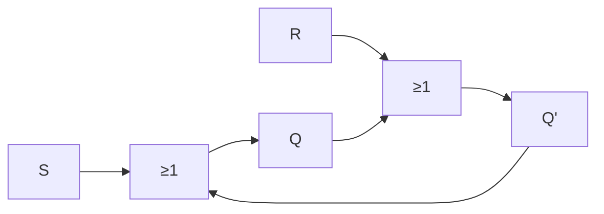

**Mnemonic:** "Set to 1, Reset to 0" for SR flip-flop operation.

## Question 4(b) OR [4 marks]

**Describe JK flip flop with truth table and circuit diagram.**

**Answer**:

**JK Flip-Flop**:

| Function | Description | Truth Table |
|----------|-------------|-------------|
| **JK Flip-Flop** | Improved SR flip-flop | J K | Q(next) |
|             | Resolves invalid condition | 0 0 | No Change |
|             |                            | 0 1 | 0 |
|             |                            | 1 0 | 1 |
|             |                            | 1 1 | Toggle (Q') |

**Circuit Diagram**:

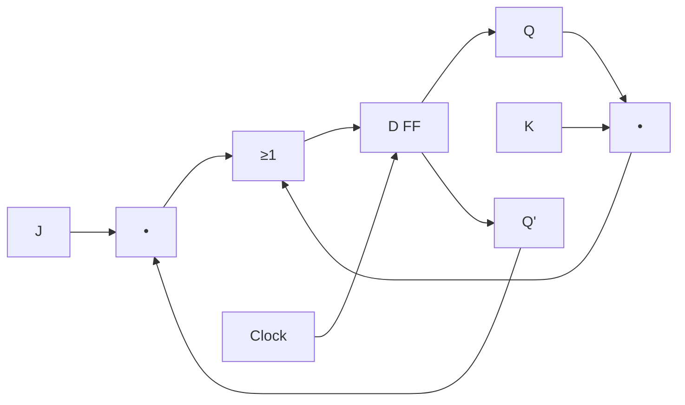

**Characteristic Equation**:

- Q(next) = J•Q' + K'•Q

**Mnemonic:** "Jump-Keep-Toggle" for JK flip-flop states (J=1 K=0: Jump to 1, J=0 K=0: Keep state, J=1 K=1: Toggle).

## Question 4(c) OR [7 marks]

**Describe 4-bit Asynchronous UP Counter with truth table and circuit diagram.**

**Answer**:

**4-bit Asynchronous UP Counter**:

| Function | Description | Count Sequence |
|----------|-------------|----------------|
| **Asynchronous Counter** | Also called ripple counter | 0000 → 0001 → 0010 → 0011 |
| | Clock drives only first FF | 0100 → 0101 → 0110 → 0111 |
| | Each FF triggered by previous FF output | 1000 → 1001 → 1010 → 1011 |
| | | 1100 → 1101 → 1110 → 1111 |

**Circuit Diagram**:

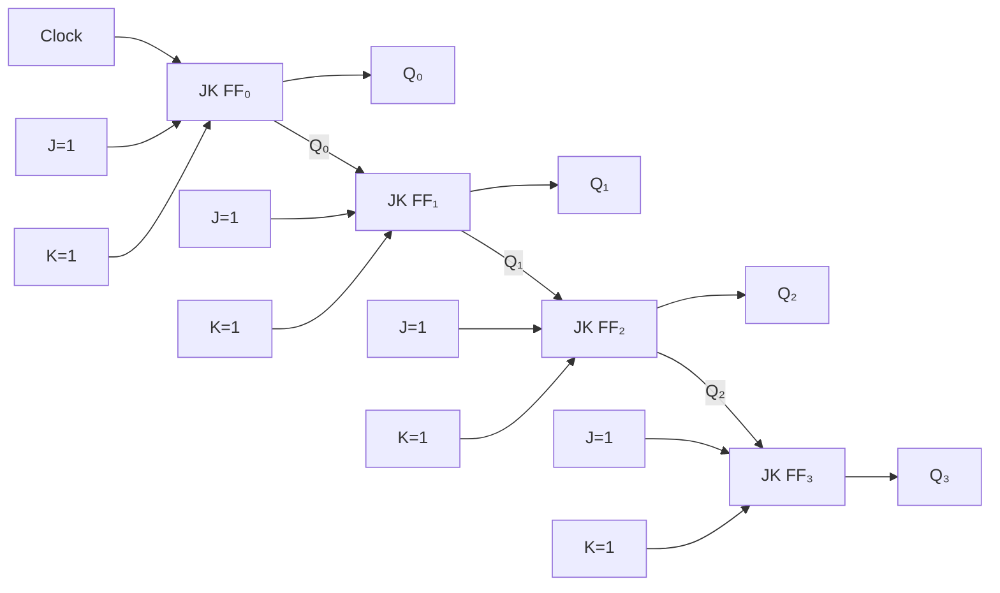

**Working**:

- **First FF** toggles on every clock pulse
- **Second FF** toggles when first FF goes from 1 to 0
- **Third FF** toggles when second FF goes from 1 to 0
- **Fourth FF** toggles when third FF goes from 1 to 0

**Mnemonic:** "Ripple Carries Propagation Delay" for asynchronous counter operation.

## Question 5(a) [3 marks]

**Compare following logic families: TTL, CMOS, ECL**

**Answer**:

**Logic Families Comparison**:

| Parameter | TTL | CMOS | ECL |
|-----------|-----|------|-----|
| **Technology** | Bipolar transistors | MOSFETs | Bipolar transistors |
| **Power Consumption** | Medium | Very low | High |
| **Speed** | Medium | Low-Medium | Very high |
| **Noise Immunity** | Medium | High | Low |
| **Fan-out** | 10 | 50+ | 25 |
| **Supply Voltage** | 5V | 3-15V | -5.2V |

**Mnemonic:** "Technology Controls Many Electrical Characteristics" for comparing logic families.

## Question 5(b) [4 marks]

**Compare Combinational and Sequential Logic Circuits.**

**Answer**:

**Combinational vs Sequential Circuits**:

| Parameter | Combinational Circuits | Sequential Circuits |
|-----------|------------------------|---------------------|
| **Output depends on** | Current inputs only | Current inputs and previous state |
| **Memory** | No memory | Has memory elements |
| **Feedback** | No feedback paths | Contains feedback paths |
| **Examples** | Adders, MUX, Decoders | Flip-flops, Counters, Registers |
| **Clock** | No clock required | Clock often required |
| **Design approach** | Truth tables, K-maps | State diagrams, tables |

**Diagram: Comparison**:

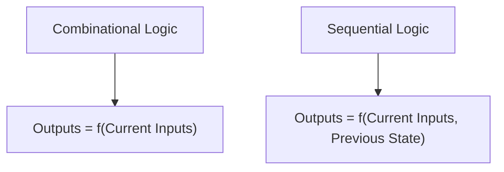

**Mnemonic:** "Current Only vs Memory States" for differentiating combinational and sequential circuits.

## Question 5(c) [7 marks]

**Define: Fan in, Fan out, Noise margin, Propagation delay, Power dissipation, Figure of merit, RAM**

**Answer**:

**Digital Electronics Key Definitions**:

| Term | Definition | Typical Values |
|------|------------|----------------|
| **Fan-in** | Maximum number of inputs a logic gate can handle | TTL: 2-8, CMOS: 100+ |
| **Fan-out** | Maximum number of gate inputs that can be driven by a single output | TTL: 10, CMOS: 50 |
| **Noise margin** | Maximum noise voltage that can be added before causing error | TTL: 0.4V, CMOS: 1.5V |
| **Propagation delay** | Time taken for change in input to cause change in output | TTL: 10ns, CMOS: 20ns |
| **Power dissipation** | Power consumed by gate during operation | TTL: 10mW, CMOS: 0.1mW |
| **Figure of merit** | Product of speed and power (lower is better) | TTL: 100pJ, CMOS: 2pJ |
| **RAM** | Random Access Memory - temporary storage device | Types: SRAM, DRAM |

**Diagram: Digital Parameter Relationships**:

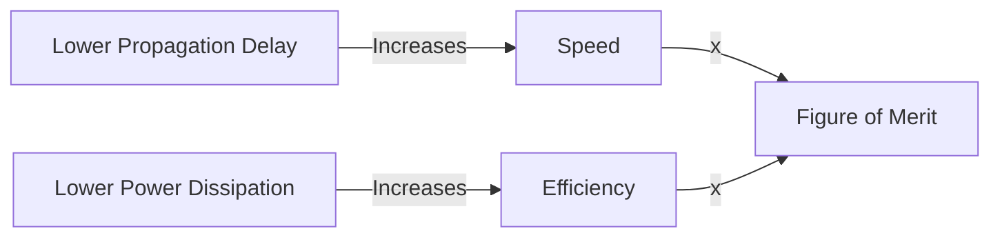

**Mnemonic:** "Fast Power Needs Proper Figure Ratings" for remembering the parameter terms.

## Question 5(a) OR [3 marks]

**Describe steps and the need of E-waste management of Digital ICs.**

**Answer**:

**E-waste Management for Digital ICs**:

| Step | Description | Importance |
|------|-------------|------------|
| **Collection** | Separate collection of electronic waste | Prevents improper disposal |
| **Segregation** | Separating ICs from other components | Enables targeted recycling |
| **Dismantling** | Removal of hazardous parts | Reduces environmental harm |
| **Recovery** | Extracting valuable materials (gold, silicon) | Conserves resources |
| **Safe disposal** | Proper disposal of non-recyclable parts | Prevents pollution |

**Need for E-waste Management**:

- **Hazardous Materials**: ICs contain lead, mercury, cadmium
- **Resource Conservation**: Recovers precious metals and rare materials
- **Environmental Protection**: Prevents soil and water contamination
- **Health Safety**: Reduces exposure to toxic substances

**Mnemonic:** "Collection Starts Dismantling Recovery Safely" for e-waste management steps.

## Question 5(b) OR [4 marks]

**Explain working of Ring Counter with circuit diagram.**

**Answer**:

**Ring Counter**:

| Function | Description | Count Sequence |
|----------|-------------|----------------|
| **Ring Counter** | Circular shift register with single 1 | 1000 → 0100 → 0010 → 0001 → 1000 |
| | Only one flip-flop is set at any time | |
| | N flip-flops for N states | |

**Circuit Diagram**:

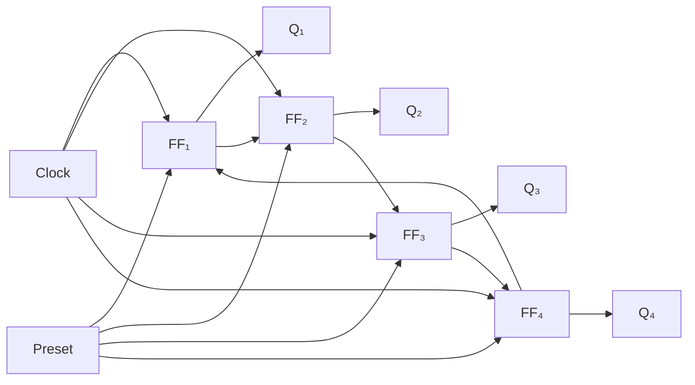

**Working**:

- **Initialization**: First FF set to 1, others to 0
- **Operation**: Single 1 rotates through all flip-flops
- **Applications**: Sequencers, controllers, timing circuits

**Mnemonic:** "One Bit Rotates Only" for ring counter operation.

## Question 5(c) OR [7 marks]

**Classify: (i) Memories (ii) Different Logic Families**

**Answer**:

**(i) Memory Classification**:

| Type | Subtypes | Characteristics |
|------|----------|----------------|
| **RAM** | **SRAM** | - Static RAM<br>- Fast, expensive<br>- Uses flip-flops<br>- No refresh needed |
|      | **DRAM** | - Dynamic RAM<br>- Slower, cheaper<br>- Uses capacitors<br>- Needs periodic refresh |
| **ROM** | **PROM** | - Programmable ROM<br>- One-time programmable |
|      | **EPROM** | - Erasable PROM<br>- UV light erasable<br>- Multiple reprogramming |
|      | **EEPROM** | - Electrically Erasable PROM<br>- Electrical erasure<br>- Byte-level erasure |
|      | **Flash** | - EEPROM variant<br>- Block-level erasure<br>- Non-volatile |

**(ii) Logic Families Classification**:

| Technology | Families | Characteristics |
|------------|----------|----------------|
| **Bipolar** | **TTL** | - Transistor-Transistor Logic<br>- Medium speed<br>- 5V operation |
|          | **ECL** | - Emitter-Coupled Logic<br>- Very high speed<br>- High power consumption |
|          | **I²L** | - Integrated Injection Logic<br>- High density |
| **MOS** | **NMOS** | - N-channel MOSFET<br>- Simpler fabrication |
|       | **PMOS** | - P-channel MOSFET<br>- Lower performance |
|       | **CMOS** | - Complementary MOS<br>- Low power consumption<br>- High noise immunity |
| **Hybrid** | **BiCMOS** | - Combines Bipolar and CMOS<br>- High speed with low power |

**Memory Classification Diagram**:

```mermaid
flowchart TB
    MEM["Semiconductor Memories"]
    MEM --> RAM["Random Access Memory (Volatile)"]
    MEM --> ROM["Read Only Memory (Non-volatile)"]
    RAM --> SRAM["SRAM (Static)"]
    RAM --> DRAM["DRAM (Dynamic)"]
    ROM --> PROM["PROM (One-time)"]
    ROM --> EPROM["EPROM (UV Erasable)"]
    ROM --> EEPROM["EEPROM (Electrical Erasable)"]
```

**Mnemonic:** "Remember Simple Division: Programmable Erasable Electrical" for memory types (RAM-SRAM-DRAM, PROM-EPROM-EEPROM).
