## પ્રશ્ન 1(અ) [3 ગુણ]

**(726)₁₀ = (_________)₂**

**જવાબ**:

**કોષ્ટક: દશાંશમાંથી બાઈનરીમાં રૂપાંતર**

| સ્ટેપ | ગણતરી | શેષ |
|------|-------------|-----------|
| 1    | 726 ÷ 2 = 363 | 0 |
| 2    | 363 ÷ 2 = 181 | 1 |
| 3    | 181 ÷ 2 = 90  | 1 |
| 4    | 90 ÷ 2 = 45   | 0 |
| 5    | 45 ÷ 2 = 22   | 1 |
| 6    | 22 ÷ 2 = 11   | 0 |
| 7    | 11 ÷ 2 = 5    | 1 |
| 8    | 5 ÷ 2 = 2     | 1 |
| 9    | 2 ÷ 2 = 1     | 0 |
| 10   | 1 ÷ 2 = 0     | 1 |

નીચેથી ઉપર વાંચતા: (726)₁₀ = (1011010110)₂

**મેમરી ટ્રીક:** "બે વડે ભાગો, શેષ ઉપરથી વાંચો"

## પ્રશ્ન 1(બ) [4 ગુણ]

**1) નીચેના બાઈનરી નંબર (10110101)₂ ને ગ્રે નંબરમાં કન્વર્ટ કરો.**

**2) નીચેના ગ્રે નંબર (10110110)gray ને બાઈનરી નંબરમાં કન્વર્ટ કરો.**

**જવાબ**:

**બાઈનરીથી ગ્રે કન્વર્ઝન:**
```
Binary:   1 0 1 1 0 1 0 1
           ↓ ↓ ↓ ↓ ↓ ↓ ↓
XOR:      1⊕0 0⊕1 1⊕1 1⊕0 0⊕1 1⊕0 0⊕1
           ↓   ↓   ↓   ↓   ↓   ↓   ↓
Gray:     1   1   0   1   1   1   1
```

તેથી: (10110101)₂ = (1101111)gray

**ગ્રેથી બાઈનરી કન્વર્ઝન:**
```
Gray:     1 0 1 1 0 1 1 0
           ↓
Binary:   1
          1⊕0 = 1
          1⊕1 = 0
          0⊕1 = 1
          1⊕0 = 1
          1⊕1 = 0
          0⊕1 = 1
          1⊕0 = 1
```

તેથી: (10110110)gray = (10110101)₂

**મેમરી ટ્રીક:** "પ્રથમ બિટ સરખો, બાકી XOR અગાઉના બાઈનરી સાથે"

## પ્રશ્ન 1(ક) [7 ગુણ]

**NAND ને યુનિવર્સલ ગેટ તરીકે સમજાવો.**

**જવાબ**:

**આકૃતિ: NAND યુનિવર્સલ ગેટ તરીકે**

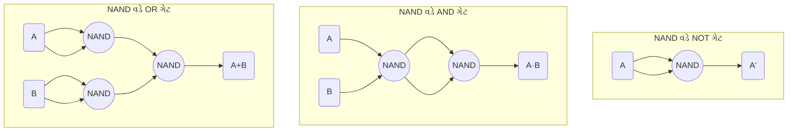

- **યુનિવર્સલ ગુણધર્મ**: NAND ગેટ કોઈપણ બુલિયન ફંક્શન બીજા કોઈપણ ગેટની જરૂર વિના બનાવી શકે છે
- **NOT ઇમ્પ્લિમેન્ટેશન**: NAND ગેટના બંને ઇનપુટ જોડવાથી NOT ગેટ બને છે
- **AND ઇમ્પ્લિમેન્ટેશન**: NAND પછી બીજો NAND ગેટ જોડવાથી AND ગેટ બને છે
- **OR ઇમ્પ્લિમેન્ટેશન**: બે NAND ગેટના સિંગલ ઇનપુટ્સ, પછી NAND જોડવાથી OR ગેટ બને છે

**કોષ્ટક: NAND ગેટ ઇમ્પ્લિમેન્ટેશન**

| લોજિક ફંક્શન | NAND ઇમ્પ્લિમેન્ટેશન |
|----------------|---------------------|
| NOT(A) | NAND(A,A) |
| AND(A,B) | NAND(NAND(A,B),NAND(A,B)) |
| OR(A,B) | NAND(NAND(A,A),NAND(B,B)) |

**મેમરી ટ્રીક:** "NAND બધા ગેટ બનાવી શકે છે"

## પ્રશ્ન 1(ક) OR [7 ગુણ]

**NOR ને યુનિવર્સલ ગેટ તરીકે સમજાવો.**

**જવાબ**:

**આકૃતિ: NOR યુનિવર્સલ ગેટ તરીકે**

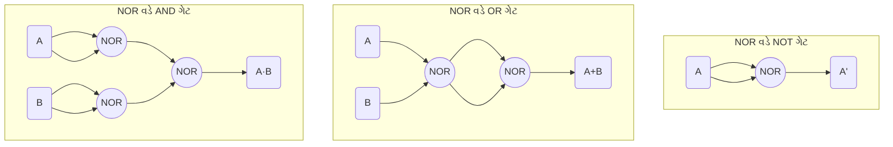

- **યુનિવર્સલ ગુણધર્મ**: NOR ગેટ કોઈપણ બુલિયન ફંક્શન બીજા કોઈપણ ગેટની જરૂર વિના બનાવી શકે છે
- **NOT ઇમ્પ્લિમેન્ટેશન**: NOR ગેટના બંને ઇનપુટ જોડવાથી NOT ગેટ બને છે
- **OR ઇમ્પ્લિમેન્ટેશન**: NOR પછી બીજો NOR ગેટ જોડવાથી OR ગેટ બને છે
- **AND ઇમ્પ્લિમેન્ટેશન**: બે NOR ગેટના સિંગલ ઇનપુટ્સ, પછી NOR જોડવાથી AND ગેટ બને છે

**કોષ્ટક: NOR ગેટ ઇમ્પ્લિમેન્ટેશન**

| લોજિક ફંક્શન | NOR ઇમ્પ્લિમેન્ટેશન |
|----------------|---------------------|
| NOT(A) | NOR(A,A) |
| OR(A,B) | NOR(NOR(A,B),NOR(A,B)) |
| AND(A,B) | NOR(NOR(A,A),NOR(B,B)) |

**મેમરી ટ્રીક:** "NOR બધા લોજિક સર્કિટ બનાવી શકે છે"

## પ્રશ્ન 2(અ) [3 ગુણ]

**(11011011)₂ X (110)₂ = (_________)₂**

**જવાબ**:

**કોષ્ટક: બાઈનરી ગુણાકાર**

```
    1 1 0 1 1 0 1 1
  ×         1 1 0
  ---------------
    1 1 0 1 1 0 1 1  (× 0)
  1 1 0 1 1 0 1 1    (× 1)
1 1 0 1 1 0 1 1      (× 1)
-----------------
1 0 0 0 0 0 0 0 1 1 0
```

તેથી: (11011011)₂ × (110)₂ = (10000001110)₂

**મેમરી ટ્રીક:** "દરેક બિટ સાથે ગુણાકાર કરો, પંક્તિઓ ઉમેરો"

## પ્રશ્ન 2(બ) [4 ગુણ]

**ડીમોર્ગનનો પ્રમેય સાબિત કરો.**

**જવાબ**:

**કોષ્ટક: ડીમોર્ગનના પ્રમેયની સાબિતી**

| A | B | A' | B' | A+B | (A+B)' | A'·B' |
|---|---|----|----|-----|--------|-------|
| 0 | 0 | 1  | 1  | 0   | 1      | 1     |
| 0 | 1 | 1  | 0  | 1   | 0      | 0     |
| 1 | 0 | 0  | 1  | 1   | 0      | 0     |
| 1 | 1 | 0  | 0  | 1   | 0      | 0     |

ડીમોર્ગનના પ્રમેય:
1. (A+B)' = A'·B'
2. (A·B)' = A'+B'

ટ્રુથ ટેબલ સાબિત કરે છે કે (A+B)' = A'·B' કારણ કે બંને કોલમ મેચ થાય છે.

**મેમરી ટ્રીક:** "રેખાને તોડો, ચિહ્ન બદલો"

## પ્રશ્ન 2(ક) [7 ગુણ]

**લોજિક સર્કિટ, બુલિયન સમીકરણ અને ટ્રુથ ટેબલનો ઉપયોગ કરીને ફુલ એડર સમજાવો.**

**જવાબ**:

**આકૃતિ: ફુલ એડર સર્કિટ**

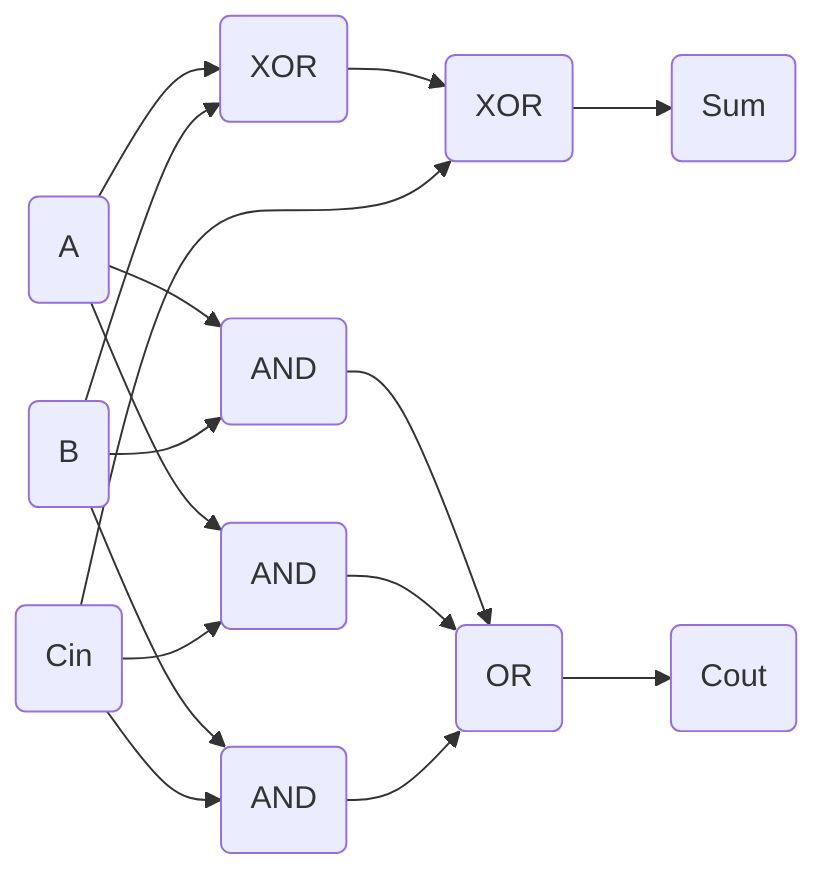

**કોષ્ટક: ફુલ એડર ટ્રુથ ટેબલ**

| A | B | Cin | Sum | Cout |
|---|---|-----|-----|------|
| 0 | 0 | 0   | 0   | 0    |
| 0 | 0 | 1   | 1   | 0    |
| 0 | 1 | 0   | 1   | 0    |
| 0 | 1 | 1   | 0   | 1    |
| 1 | 0 | 0   | 1   | 0    |
| 1 | 0 | 1   | 0   | 1    |
| 1 | 1 | 0   | 0   | 1    |
| 1 | 1 | 1   | 1   | 1    |

- **બુલિયન સમીકરણો**:
  - Sum = A ⊕ B ⊕ Cin
  - Cout = (A·B) + (B·Cin) + (A·Cin)

**મેમરી ટ્રીક:** "સરવાળા માટે ત્રણ XOR, કેરી માટે AND પછી OR"

## પ્રશ્ન 2(અ) OR [3 ગુણ]

**(11010010)₂ સાથે (101)₂ નો ભાગાકાર = (_________)₂**

**જવાબ**:

**કોષ્ટક: બાઈનરી ભાગાકાર**

```
            1 0 1 0 1 1
         ____________
101 ) 1 1 0 1 0 0 1 0
      1 0 1
      -----
        1 1 0
        1 0 1
        -----
          0 1 0
            0 0
          -----
            1 0 0
            1 0 1
            -----
              1 1 0
              1 0 1
              -----
                0 1 0
                  0 0
                -----
                  1 0
                   0
                 ----
                   0
```

તેથી: (11010010)₂ ÷ (101)₂ = (101011)₂ બાકી (0)₂

**મેમરી ટ્રીક:** "દશાંશની જેમ ભાગો, પણ બાઈનરી બાદબાકી વાપરો"

## પ્રશ્ન 2(બ) OR [4 ગુણ]

**બુલિયન અભિવ્યક્તિ Y = A'B+AB'+A'B'+AB ને સરળ બનાવો**

**જવાબ**:

**કોષ્ટક: બુલિયન સરલીકરણ**

| સ્ટેપ | અભિવ્યક્તિ | વપરાયેલ નિયમ |
|------|------------|--------------|
| 1 | Y = A'B+AB'+A'B'+AB | મૂળ |
| 2 | Y = A'(B+B')+A(B'+B) | ફેક્ટરિંગ |
| 3 | Y = A'(1)+A(1) | B+B' = 1 |
| 4 | Y = A'+A | સરલીકરણ |
| 5 | Y = 1 | A'+A = 1 |

તેથી: Y = 1 (હંમેશા TRUE)

**મેમરી ટ્રીક:** "પહેલા ફેક્ટર કરો, ઓળખો લાગુ કરો, સમાન પદો જોડો"

## પ્રશ્ન 2(ક) OR [7 ગુણ]

**લોજિક સર્કિટ, બુલિયન સમીકરણ અને ટ્રુથ ટેબલનો ઉપયોગ કરીને ફુલ સબટ્રેક્ટર સમજાવો.**

**જવાબ**:

**આકૃતિ: ફુલ સબટ્રેક્ટર સર્કિટ**

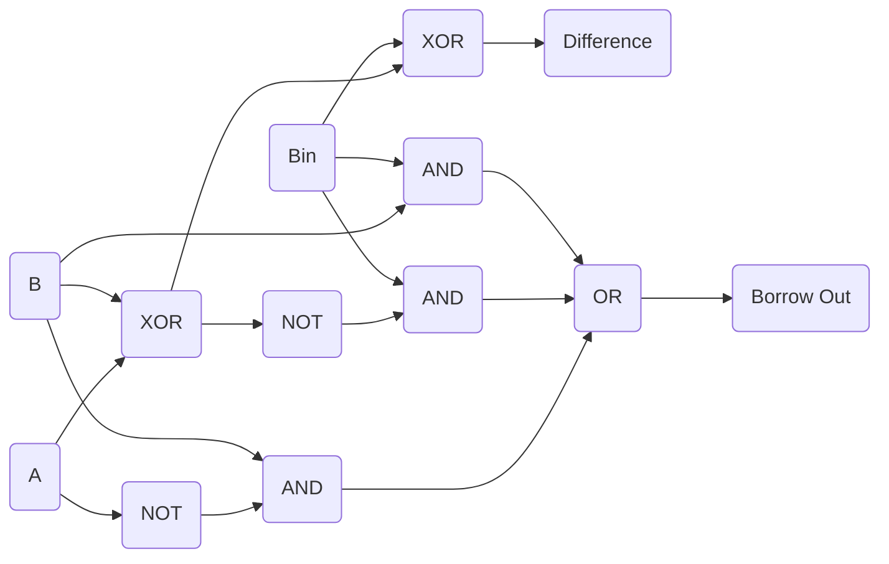

**કોષ્ટક: ફુલ સબટ્રેક્ટર ટ્રુથ ટેબલ**

| A | B | Bin | Difference | Bout |
|---|---|-----|------------|------|
| 0 | 0 | 0   | 0          | 0    |
| 0 | 0 | 1   | 1          | 1    |
| 0 | 1 | 0   | 1          | 1    |
| 0 | 1 | 1   | 0          | 1    |
| 1 | 0 | 0   | 1          | 0    |
| 1 | 0 | 1   | 0          | 0    |
| 1 | 1 | 0   | 0          | 0    |
| 1 | 1 | 1   | 1          | 1    |

- **બુલિયન સમીકરણો**:
  - Difference = A ⊕ B ⊕ Bin
  - Bout = (A'·B) + (A'·Bin) + (B·Bin)

**મેમરી ટ્રીક:** "તફાવત માટે ત્રિગણો XOR, ઇનપુટ મોટો હોય ત્યારે બોરો"

## પ્રશ્ન 3(અ) [3 ગુણ]

**૨'s કોંપ્લીમેંટનો ઉપયોગ કરીને (1011001)₂ ને (1101101)₂ માંથી બાદ કરો.**

**જવાબ**:

**કોષ્ટક: 2's કોંપ્લીમેંટ બાદબાકી**

| સ્ટેપ | ઓપરેશન | પરિણામ |
|------|-----------|--------|
| 1 | બાદ કરવાની સંખ્યા: | 1011001 |
| 2 | 1's કોંપ્લીમેંટ: | 0100110 |
| 3 | 2's કોંપ્લીમેંટ: | 0100111 |
| 4 | (1101101) + (0100111) = | 10010100 |
| 5 | કેરી છોડી દો: | 0010100 |

તેથી: (1101101)₂ - (1011001)₂ = (0010100)₂ = (20)₁₀

**મેમરી ટ્રીક:** "બિટ્સ ફ્લિપ કરો, એક ઉમેરો, પછી સંખ્યાઓ ઉમેરો"

## પ્રશ્ન 3(બ) [4 ગુણ]

**કનોફ મેપ (K' મેપ) પદ્ધતિનો ઉપયોગ કરીને બુલિયન સમીકરણને સરળ બનાવો: F(A,B,C,D) = Σm(0,1,2,6,7,8,12,15)**

**જવાબ**:

**કોષ્ટક: કનોફ મેપ**

```
      CD      
AB    00  01  11  10
00    1   1   0   1
01    0   0   1   1
11    0   0   1   0
10    1   0   0   0
```

**આકૃતિ: K-map ગ્રુપિંગ**

```goat
+-----+-----+-----+-----+
|  1  |  1  |  0  |  1  |
|  A  |  A  |     |  A  |
+-----+-----+-----+-----+
|  0  |  0  |  1  |  1  |
|     |     |  B  |  B  |
+-----+-----+-----+-----+
|  0  |  0  |  1  |  0  |
|     |     |  B  |     |
+-----+-----+-----+-----+
|  1  |  0  |  0  |  0  |
|  C  |     |     |     |
+-----+-----+-----+-----+
```

ગ્રુપ A: A'B'C' (4 સેલ)
ગ્રુપ B: BCD (3 સેલ)
ગ્રુપ C: A'B'CD' (1 સેલ)

સરળ અભિવ્યક્તિ: F(A,B,C,D) = A'B'C' + BCD + A'B'CD'

**મેમરી ટ્રીક:** "2ⁿ ના મોટામાં મોટા સમૂહો શોધો, લઘુત્તમ પદો વાપરો"

## પ્રશ્ન 3(ક) [7 ગુણ]

**લોજિક સર્કિટ અને ટ્રુથ ટેબલનો ઉપયોગ કરીને 3 થી 8 ડીકોડર સમજાવો.**

**જવાબ**:

**આકૃતિ: 3-થી-8 ડીકોડર**

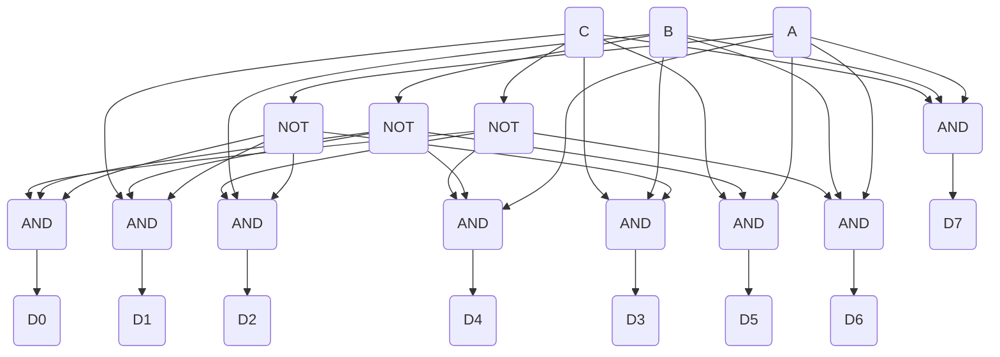

**કોષ્ટક: 3-થી-8 ડીકોડર ટ્રુથ ટેબલ**

| ઇનપુટ્સ |    | આઉટપુટ્સ |    |    |    |    |    |    |    |
|--------|----|---------|----|----|----|----|----|----|----|
| A | B | C | D0 | D1 | D2 | D3 | D4 | D5 | D6 | D7 |
| 0 | 0 | 0 | 1  | 0  | 0  | 0  | 0  | 0  | 0  | 0  |
| 0 | 0 | 1 | 0  | 1  | 0  | 0  | 0  | 0  | 0  | 0  |
| 0 | 1 | 0 | 0  | 0  | 1  | 0  | 0  | 0  | 0  | 0  |
| 0 | 1 | 1 | 0  | 0  | 0  | 1  | 0  | 0  | 0  | 0  |
| 1 | 0 | 0 | 0  | 0  | 0  | 0  | 1  | 0  | 0  | 0  |
| 1 | 0 | 1 | 0  | 0  | 0  | 0  | 0  | 1  | 0  | 0  |
| 1 | 1 | 0 | 0  | 0  | 0  | 0  | 0  | 0  | 1  | 0  |
| 1 | 1 | 1 | 0  | 0  | 0  | 0  | 0  | 0  | 0  | 1  |

- **કાર્ય**: 3-બિટ બાઈનરી ઇનપુટના આધારે 8 આઉટપુટ લાઈનમાંથી એક સક્રિય કરે છે
- **ઉપયોગો**: મેમરી એડ્રેસિંગ, ડેટા રાઉટિંગ, ઇન્સ્ટ્રક્શન ડિકોડિંગ
- **બુલિયન સમીકરણો**: D0 = A'·B'·C', D1 = A'·B'·C, વગેરે.

**મેમરી ટ્રીક:** "બાઈનરી એડ્રેસ પર એક હોટ આઉટપુટ"

## પ્રશ્ન 3(અ) OR [3 ગુણ]

**નિર્દેશ મુજબ કરો. 1) (101011010111)₂ = (___________)₈**

**જવાબ**:

**કોષ્ટક: બાઈનરીથી ઑક્ટલ કન્વર્ઝન**

```
Binary:    1 | 010 | 110 | 101 | 11
           ↓    ↓     ↓     ↓    ↓
Octal:     1    2     6     5    3
```

તેથી: (101011010111)₂ = (12653)₈

**મેમરી ટ્રીક:** "જમણેથી ડાબે ત્રણના સમૂહમાં વિભાજિત કરો"

## પ્રશ્ન 3(બ) OR [4 ગુણ]

**કનોફ મેપ (K' મેપ) પદ્ધતિનો ઉપયોગ કરીને બુલિયન સમીકરણને સરળ બનાવો: F(A,B,C,D) = Σm(1,3,5,7,8,9,10,11)**

**જવાબ**:

**કોષ્ટક: કનોફ મેપ**

```
      CD      
AB    00  01  11  10
00    0   1   1   0
01    0   1   1   0
11    0   0   0   0
10    1   1   1   1
```

**આકૃતિ: K-map ગ્રુપિંગ**

```goat
+-----+-----+-----+-----+
|  0  |  1  |  1  |  0  |
|     |  A  |  A  |     |
+-----+-----+-----+-----+
|  0  |  1  |  1  |  0  |
|     |  A  |  A  |     |
+-----+-----+-----+-----+
|  0  |  0  |  0  |  0  |
|     |     |     |     |
+-----+-----+-----+-----+
|  1  |  1  |  1  |  1  |
|  B  |  B  |  B  |  B  |
+-----+-----+-----+-----+
```

ગ્રુપ A: A'CD (4 સેલ)
ગ્રુપ B: AB' (4 સેલ)

સરળ અભિવ્યક્તિ: F(A,B,C,D) = A'CD + AB'

**મેમરી ટ્રીક:** "2ની ઘાતના સમૂહો બનાવો, ચલો ઘટાડો"

## પ્રશ્ન 3(ક) OR [7 ગુણ]

**લોજિક સર્કિટ અને ટ્રુથ ટેબલનો ઉપયોગ કરીને 8 થી 1 મલ્ટિપ્લેક્સર સમજાવો.**

**જવાબ**:

**આકૃતિ: 8-થી-1 મલ્ટિપ્લેક્સર**

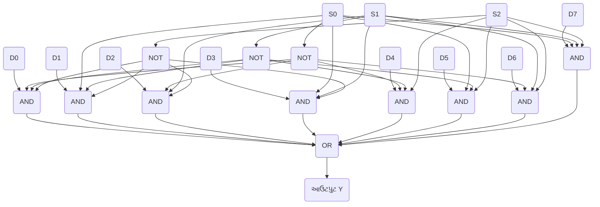

**કોષ્ટક: 8-થી-1 મલ્ટિપ્લેક્સર ટ્રુથ ટેબલ**

| સિલેક્ટ લાઈન્સ |    |    | આઉટપુટ |
|--------------|----|----|--------|
| S2 | S1 | S0 | Y  |
| 0  | 0  | 0  | D0 |
| 0  | 0  | 1  | D1 |
| 0  | 1  | 0  | D2 |
| 0  | 1  | 1  | D3 |
| 1  | 0  | 0  | D4 |
| 1  | 0  | 1  | D5 |
| 1  | 1  | 0  | D6 |
| 1  | 1  | 1  | D7 |

- **કાર્ય**: 8 ઇનપુટ ડેટા લાઈન્સમાંથી એક પસંદ કરી આઉટપુટ પર રૂટ કરે છે
- **ઉપયોગો**: ડેટા રૂટિંગ, ફંક્શન જનરેશન, પેરેલલ-ટુ-સીરિયલ કન્વર્ઝન
- **બુલિયન સમીકરણ**: Y = S2'·S1'·S0'·D0 + S2'·S1'·S0·D1 + ... + S2·S1·S0·D7

**મેમરી ટ્રીક:** "સિલેક્ટ બિટ્સ એક ઇનપુટને આઉટપુટ પર મોકલે છે"

## પ્રશ્ન 4(અ) [3 ગુણ]

**બાઈનરી થી ગ્રે કન્વર્ટર માટે લોજિક સર્કિટ દોરો.**

**જવાબ**:

**આકૃતિ: બાઈનરી થી ગ્રે કોડ કન્વર્ટર**

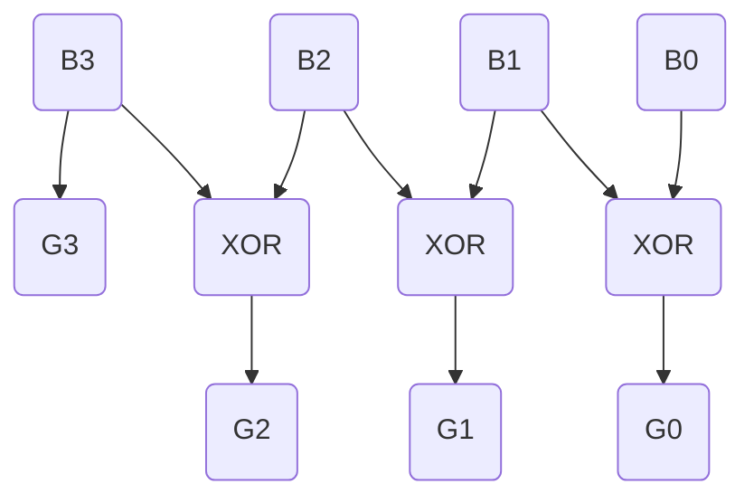

- **બાઈનરી ઇનપુટ્સ**: B3, B2, B1, B0 (સૌથી વધુથી ઓછા મહત્વના બિટ્સ)
- **ગ્રે આઉટપુટ્સ**: G3, G2, G1, G0 (સૌથી વધુથી ઓછા મહત્વના બિટ્સ)
- **કન્વર્ઝન નિયમ**: G3 = B3, G2 = B3 ⊕ B2, G1 = B2 ⊕ B1, G0 = B1 ⊕ B0

**મેમરી ટ્રીક:** "પ્રથમ બિટ સરખી, બાકી પડોશીઓ સાથે XOR"

## પ્રશ્ન 4(બ) [4 ગુણ]

**સીરિયલ ઇન સીરિયલ આઉટ શિફ્ટ રજિસ્ટરનું કામ સમજાવો**

**જવાબ**:

**આકૃતિ: સીરિયલ-ઇન સીરિયલ-આઉટ શિફ્ટ રજિસ્ટર**

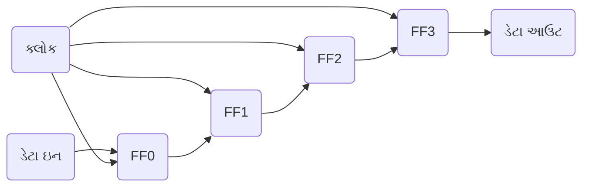

**કોષ્ટક: સીરિયલ-ઇન સીરિયલ-આઉટ ઓપરેશન**

| ક્લોક સાયકલ | FF0 | FF1 | FF2 | FF3 | ડેટા આઉટ |
|-------------|-----|-----|-----|-----|----------|
| પ્રારંભિક    | 0   | 0   | 0   | 0   | 0        |
| 1 (Din=1)   | 1   | 0   | 0   | 0   | 0        |
| 2 (Din=0)   | 0   | 1   | 0   | 0   | 0        |
| 3 (Din=1)   | 1   | 0   | 1   | 0   | 0        |
| 4 (Din=1)   | 1   | 1   | 0   | 1   | 1        |

- **કાર્ય**: ડેટા બિટ્સ ઇનપુટ પર ક્રમશઃ દાખલ થાય છે, બધા ફ્લિપ-ફ્લોપ્સ દ્વારા શિફ્ટ થાય છે, અને ક્રમશઃ બહાર નીકળે છે
- **ઉપયોગો**: ડેટા ટ્રાન્સમિશન, સમય વિલંબ, સીરિયલ-ટુ-સીરિયલ કન્વર્ઝન
- **વિશેષતાઓ**: સરળ ડિઝાઇન, ઓછા I/O પિન્સ જરૂરી પણ વધુ ક્લોક સાયકલ્સ લાગે

**મેમરી ટ્રીક:** "એક બિટ અંદર, બધા શિફ્ટ, એક બિટ બહાર"

## પ્રશ્ન 4(ક) [7 ગુણ]

**સર્કિટ ડાયાગ્રામ અને ટ્રુથ ટેબલનો ઉપયોગ કરીને D ફ્લિપ ફ્લોપ અને JK ફ્લિપ ફ્લોપની કામગીરી સમજાવો.**

**જવાબ**:

**આકૃતિ: D ફ્લિપ-ફ્લોપ**

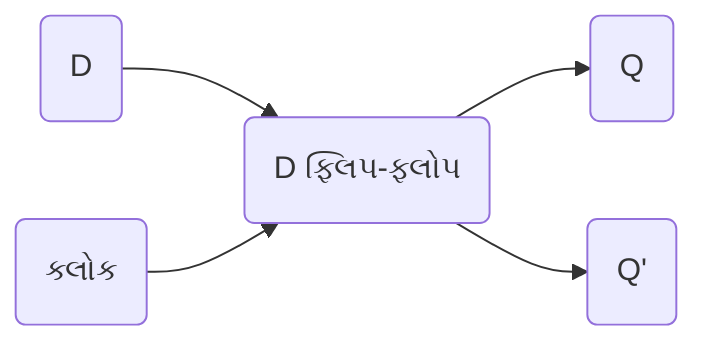

**કોષ્ટક: D ફ્લિપ-ફ્લોપ ટ્રુથ ટેબલ**

| D | ક્લોક | Q(આગામી) |
|---|-------|---------|
| 0 | ↑     | 0       |
| 1 | ↑     | 1       |

**આકૃતિ: JK ફ્લિપ-ફ્લોપ**

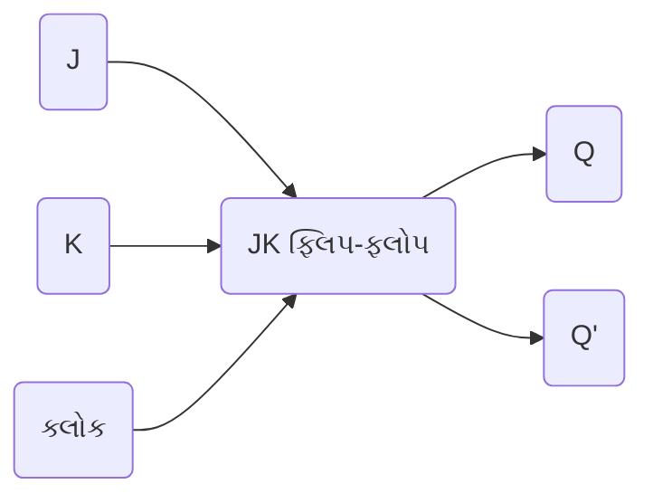

**કોષ્ટક: JK ફ્લિપ-ફ્લોપ ટ્રુથ ટેબલ**

| J | K | ક્લોક | Q(આગામી) |
|---|---|-------|---------|
| 0 | 0 | ↑     | Q(કોઈ ફેરફાર નહીં) |
| 0 | 1 | ↑     | 0       |
| 1 | 0 | ↑     | 1       |
| 1 | 1 | ↑     | Q' (ટોગલ) |

- **D ફ્લિપ-ફ્લોપ**: ડેટા (D) ઇનપુટ ક્લોકના પોઝિટિવ એજ પર આઉટપુટ Q પર ટ્રાન્સફર થાય છે
- **JK ફ્લિપ-ફ્લોપ**: વધુ બહુમુખી, સેટ (J), રીસેટ (K), હોલ્ડ અને ટોગલ ક્ષમતાઓ સાથે
- **ઉપયોગો**: સ્ટોરેજ તત્વો, કાઉન્ટર્સ, રજિસ્ટર્સ, સિક્વેન્શિયલ સર્કિટ્સ

**મેમરી ટ્રીક:** "D માં જે હોય તે Q માં જાય, JK ક્રમશઃ સેટ, રીસેટ, હોલ્ડ, ટોગલ કરે"

## પ્રશ્ન 4(અ) OR [3 ગુણ]

**ગ્રે થી બાઈનરી કન્વર્ટર માટે લોજિક સર્કિટ દોરો.**

**જવાબ**:

**આકૃતિ: ગ્રે થી બાઈનરી કોડ કન્વર્ટર**

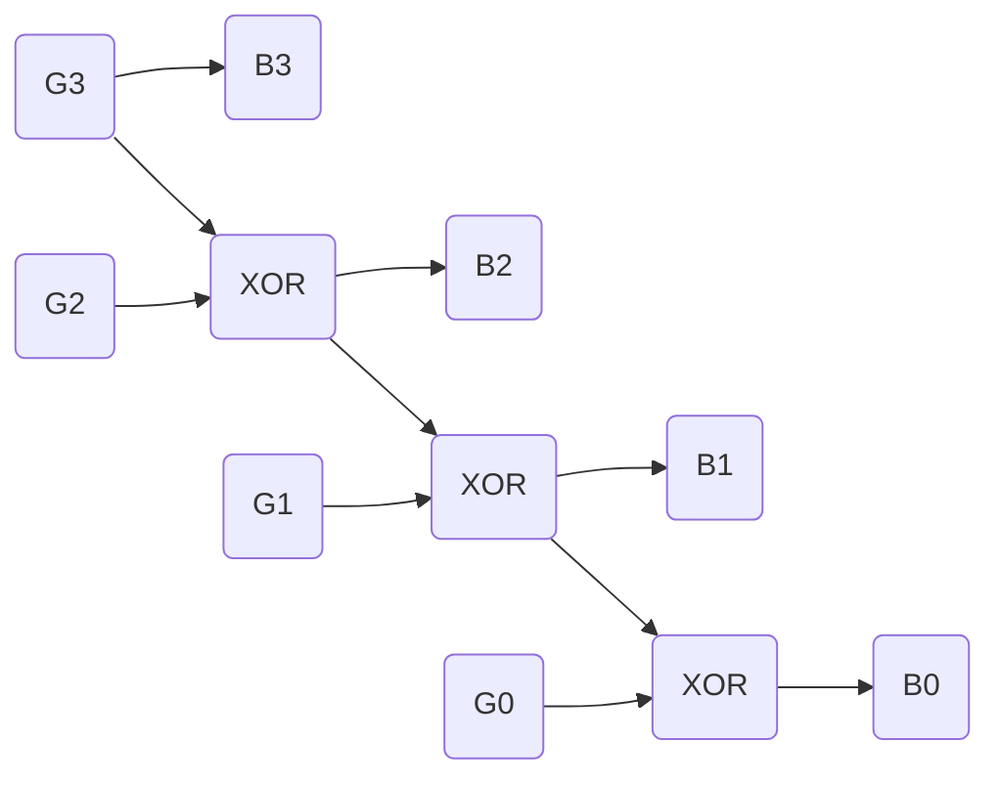

- **ગ્રે ઇનપુટ્સ**: G3, G2, G1, G0 (સૌથી વધુથી ઓછા મહત્વના બિટ્સ)
- **બાઈનરી આઉટપુટ્સ**: B3, B2, B1, B0 (સૌથી વધુથી ઓછા મહત્વના બિટ્સ)
- **કન્વર્ઝન નિયમ**: B3 = G3, B2 = B3 ⊕ G2, B1 = B2 ⊕ G1, B0 = B1 ⊕ G0

**મેમરી ટ્રીક:** "પ્રથમ બિટ સરખી, બાકી અગાઉના પરિણામ સાથે XOR"

## પ્રશ્ન 4(બ) OR [4 ગુણ]

**પેરેલલ ઇન પેરેલલ આઉટ શિફ્ટ રજિસ્ટરનું કામ સમજાવો**

**જવાબ**:

**આકૃતિ: પેરેલલ-ઇન પેરેલલ-આઉટ શિફ્ટ રજિસ્ટર**

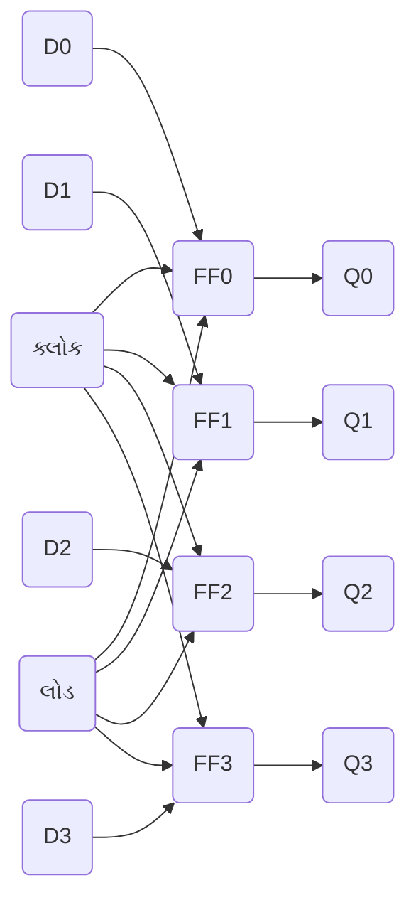

**કોષ્ટક: પેરેલલ-ઇન પેરેલલ-આઉટ ઓપરેશન**

| લોડ | ક્લોક | D0-D3 | Q0-Q3 (ક્લોક પછી) |
|------|-------|-------|---------------------|
| 1    | ↑     | 1010  | 1010                |
| 0    | ↑     | xxxx  | 1010 (કોઈ ફેરફાર નહીં)    |
| 1    | ↑     | 0101  | 0101                |

- **કાર્ય**: ડેટા સમાંતરમાં લોડ થાય છે, બધા બિટ્સ એક સાથે આઉટપુટ પર ટ્રાન્સફર થાય છે
- **ઉપયોગો**: ડેટા સ્ટોરેજ, બફરિંગ, કામચલાઉ હોલ્ડિંગ રજિસ્ટર્સ
- **વિશેષતાઓ**: સૌથી ઝડપી રજિસ્ટર પ્રકાર, સૌથી વધુ I/O પિન્સ જરૂરી, બિટ શિફ્ટિંગ નથી

**મેમરી ટ્રીક:** "બધું અંદર, બધું બહાર, બધું એક સાથે"

## પ્રશ્ન 4(ક) OR [7 ગુણ]

**સર્કિટ ડાયાગ્રામ અને ટ્રુથ ટેબલનો ઉપયોગ કરીને T ફ્લિપ ફ્લોપ અને SR ફ્લિપ ફ્લોપની કામગીરી સમજાવો.**

**જવાબ**:

**આકૃતિ: T ફ્લિપ-ફ્લોપ**

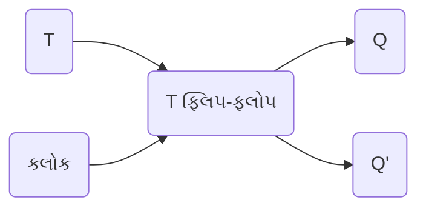

**કોષ્ટક: T ફ્લિપ-ફ્લોપ ટ્રુથ ટેબલ**

| T | ક્લોક | Q(આગામી) |
|---|-------|---------|
| 0 | ↑     | Q (કોઈ ફેરફાર નહીં) |
| 1 | ↑     | Q' (ટોગલ)   |

**આકૃતિ: SR ફ્લિપ-ફ્લોપ**

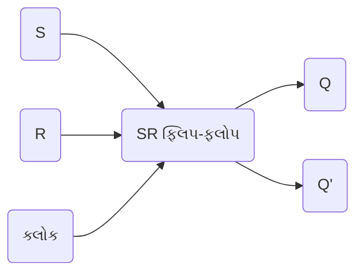

**કોષ્ટક: SR ફ્લિપ-ફ્લોપ ટ્રુથ ટેબલ**

| S | R | ક્લોક | Q(આગામી) |
|---|---|-------|---------|
| 0 | 0 | ↑     | Q (કોઈ ફેરફાર નહીં) |
| 0 | 1 | ↑     | 0 (રીસેટ)     |
| 1 | 0 | ↑     | 1 (સેટ)       |
| 1 | 1 | ↑     | અમાન્ય       |

- **T ફ્લિપ-ફ્લોપ**: ટોગલ ફ્લિપ-ફ્લોપ જ્યારે T=1 હોય ત્યારે સ્થિતિ બદલે છે, જ્યારે T=0 હોય ત્યારે સ્થિતિ જાળવે છે
- **SR ફ્લિપ-ફ્લોપ**: સેટ (S) અને રીસેટ (R) ઇનપુટ્સ સાથેનો મૂળભૂત ફ્લિપ-ફ્લોપ
- **ઉપયોગો**: T ફ્લિપ-ફ્લોપ કાઉન્ટર્સ અને ફ્રિક્વન્સી ડિવાઇડર્સ માટે, SR મૂળભૂત મેમરી માટે

**મેમરી ટ્રીક:** "T ટ્રુ હોય ત્યારે ટોગલ કરે, SR સેટ અથવા રીસેટ કરે"

## પ્રશ્ન 5(અ) [3 ગુણ]

**TTL, CMOS અને ECL લોજિક ફેમિલીની સરખામણી કરો.**

**જવાબ**:

**કોષ્ટક: લોજિક ફેમિલીઓની સરખામણી**

| પેરામીટર | TTL | CMOS | ECL |
|-----------|-----|------|-----|
| પાવર વપરાશ | મધ્યમ | ખૂબ ઓછો | ઉચ્ચ |
| સ્પીડ | મધ્યમ | ઓછી-મધ્યમ | ખૂબ ઉચ્ચ |
| નોઇઝ ઇમ્યુનિટી | મધ્યમ | ઉચ્ચ | ઓછી |
| ફેન-આઉટ | 10 | >50 | 25 |
| સપ્લાય વોલ્ટેજ | +5V | +3V થી +15V | -5.2V |
| જટિલતા | મધ્યમ | ઓછી | ઉચ્ચ |

- **TTL**: ટ્રાન્ઝિસ્ટર-ટ્રાન્ઝિસ્ટર લોજિક - સ્પીડ અને પાવરનું સારું સંતુલન
- **CMOS**: કોમ્પ્લિમેન્ટરી મેટલ-ઑક્સાઇડ-સેમિકન્ડક્ટર - ઓછો પાવર, ઉચ્ચ ઘનતા
- **ECL**: એમિટર-કપલ્ડ લોજિક - સૌથી વધુ સ્પીડ, ઉચ્ચ-પરફોર્મન્સ એપ્લિકેશન્સમાં વપરાય છે

**મેમરી ટ્રીક:** "TTL સમાધાન, CMOS કરકસર, ECL સ્પીડમાં શ્રેષ્ઠ"

## પ્રશ્ન 5(બ) [4 ગુણ]

**લોજિક સર્કિટ ડાયાગ્રામ અને ટ્રુથ ટેબલની મદદથી દાયકા કાઉન્ટર સમજાવો.**

**જવાબ**:

**આકૃતિ: દાયકા કાઉન્ટર (BCD કાઉન્ટર)**

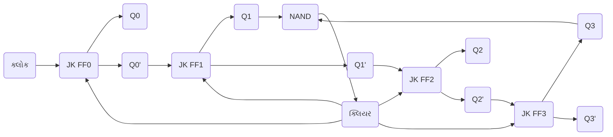

**કોષ્ટક: દાયકા કાઉન્ટર સ્ટેટ્સ**

| ગણતરી | Q3 | Q2 | Q1 | Q0 |
|-------|----|----|----|----|
| 0     | 0  | 0  | 0  | 0  |
| 1     | 0  | 0  | 0  | 1  |
| 2     | 0  | 0  | 1  | 0  |
| 3     | 0  | 0  | 1  | 1  |
| 4     | 0  | 1  | 0  | 0  |
| 5     | 0  | 1  | 0  | 1  |
| 6     | 0  | 1  | 1  | 0  |
| 7     | 0  | 1  | 1  | 1  |
| 8     | 1  | 0  | 0  | 0  |
| 9     | 1  | 0  | 0  | 1  |
| 0     | 0  | 0  | 0  | 0  |

- **કાર્ય**: 0 થી 9 (દશાંશ) સુધી ગણે છે અને પછી 0 પર રિસેટ થાય છે
- **ઉપયોગો**: ડિજિટલ ઘડિયાળો, ફ્રિક્વન્સી ડિવાઇડર્સ, BCD કાઉન્ટર્સ
- **વિશેષતાઓ**: 10ની ગણતરી પર ઑટો-રિસેટ, ક્લોક સાથે સિંક્રોનસ

**મેમરી ટ્રીક:** "એક દાયકો ગણે, નવ પછી રીસેટ"

## પ્રશ્ન 5(ક) [7 ગુણ]

**મેમરીનું વિગતવાર વર્ગીકરણ આપો.**

**જવાબ**:

**આકૃતિ: મેમરી વર્ગીકરણ**

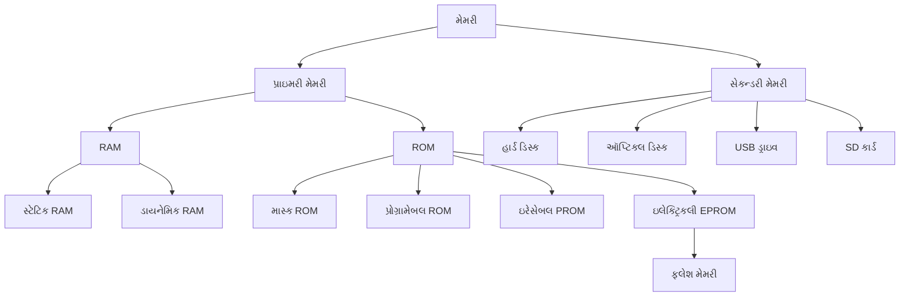

**કોષ્ટક: મેમરી પ્રકારોની સરખામણી**

| મેમરી પ્રકાર | વોલેટિલિટી | રીડ/રાઇટ | એક્સેસ સ્પીડ | સામાન્ય ઉપયોગ |
|-------------|------------|------------|--------------|-------------|
| SRAM | વોલેટાઇલ | R/W | ખૂબ ઝડપી | કેશ મેમરી |
| DRAM | વોલેટાઇલ | R/W | ઝડપી | મુખ્ય મેમરી |
| ROM | નોન-વોલેટાઇલ | માત્ર વાંચન | મધ્યમ | BIOS, ફર્મવેર |
| PROM | નોન-વોલેટાઇલ | એકવાર લખાણ | મધ્યમ | કાયમી પ્રોગ્રામ્સ |
| EPROM | નોન-વોલેટાઇલ | UV દ્વારા ભૂંસી શકાય | મધ્યમ | અપગ્રેડેબલ ફર્મવેર |
| EEPROM | નોન-વોલેટાઇલ | ઇલેક્ટ્રિકલી ભૂંસી શકાય | મધ્યમ | કોન્ફિગરેશન ડેટા |
| ફ્લેશ | નોન-વોલેટાઇલ | બ્લોક ભૂંસી શકાય | મધ્યમ-ઝડપી | સ્ટોરેજ ડિવાઇસ |

- **RAM (રેન્ડમ એક્સેસ મેમરી)**: અસ્થાયી, વોલેટાઇલ વર્કિંગ મેમરી
- **ROM (રીડ ઓન્લી મેમરી)**: કાયમી, નોન-વોલેટાઇલ પ્રોગ્રામ સ્ટોરેજ
- **વિશેષતાઓ**: એક્સેસ ટાઇમ, ડેટા રિટેન્શન, ક્ષમતા, બિટ દીઠ કિંમત

**મેમરી ટ્રીક:** "RAM અદૃશ્ય થાય, ROM રહી જાય"

## પ્રશ્ન 5(અ) OR [3 ગુણ]

**વ્યાખ્યાયિત કરો: ફેન આઉટ, ફેન ઇન અને ફિગર ઓફ મેરિટ.**

**જવાબ**:

**કોષ્ટક: ડિજિટલ લોજિક પેરામીટર્સ**

| પેરામીટર | વ્યાખ્યા | સામાન્ય મૂલ્યો |
|-----------|------------|----------------|
| ફેન-આઉટ | એક ગેટ આઉટપુટ ડ્રાઇવ કરી શકે તેવા સ્ટાન્ડર્ડ લોડ્સની સંખ્યા | TTL: 10, CMOS: >50 |
| ફેન-ઇન | એક લોજિક ગેટ સંભાળી શકે તેવા ઇનપુટ્સની સંખ્યા | TTL: 8, CMOS: 100+ |
| ફિગર ઓફ મેરિટ | સ્પીડ-પાવર પ્રોડક્ટ (પ્રોપેગેશન ડિલે × પાવર કન્ઝમ્પશન) | ઓછું હોય તે સારું |

- **ફેન-આઉટ**: એક ગેટ આઉટપુટથી જોડી શકાય તેવા ગેટ ઇનપુટ્સની મહત્તમ સંખ્યા
- **ફેન-ઇન**: એક જ લોજિક ગેટ પર ઉપલબ્ધ ઇનપુટ્સની મહત્તમ સંખ્યા
- **ફિગર ઓફ મેરિટ**: વિવિધ લોજિક ફેમિલીઓની તુલના માટેનો ગુણવત્તા ફેક્ટર

**મેમરી ટ્રીક:** "આઉટ ઘણાને ચલાવે, ઇન ઘણા સ્વીકારે, મેરિટ સારપ માપે"

## પ્રશ્ન 5(બ) OR [4 ગુણ]

**લોજિક સર્કિટ ડાયાગ્રામ અને ટ્રુથ ટેબલની મદદથી અસિંક્રોનસ અપ કાઉન્ટર સમજાવો.**

**જવાબ**:

**આકૃતિ: 4-બિટ અસિંક્રોનસ અપ કાઉન્ટર**

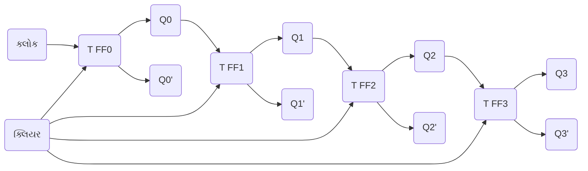

**કોષ્ટક: 4-બિટ અસિંક્રોનસ કાઉન્ટર સ્ટેટ્સ**

| ગણતરી | Q3 | Q2 | Q1 | Q0 |
|-------|----|----|----|----|
| 0     | 0  | 0  | 0  | 0  |
| 1     | 0  | 0  | 0  | 1  |
| 2     | 0  | 0  | 1  | 0  |
| ...   | .. | .. | .. | .. |
| 14    | 1  | 1  | 1  | 0  |
| 15    | 1  | 1  | 1  | 1  |

- **કાર્ય**: દરેક ફ્લિપ-ફ્લોપ 1 થી 0 પર ટ્રાન્ઝિશન થતાં આગલાને ટ્રિગર કરે છે
- **વિશેષતાઓ**: સરળ ડિઝાઇન પરંતુ પ્રોપેગેશન ડિલે (રિપલ)ની સમસ્યા
- **ઉપયોગો**: ફ્રિક્વન્સી ડિવિઝન, બેઝિક કાઉન્ટિંગ એપ્લિકેશન્સ

**મેમરી ટ્રીક:** "ઉપર તરફ લહેરો, દરેક બિટ આગલાને ટ્રિગર કરે"

## પ્રશ્ન 5(ક) OR [7 ગુણ]

**ડિજિટલ IC ના ઇ-વેસ્ટ મેનેજમેન્ટના પગલાં અને જરૂરિયાતનું વર્ણન કરો.**

**જવાબ**:

**આકૃતિ: ઇ-વેસ્ટ મેનેજમેન્ટ સાયકલ**

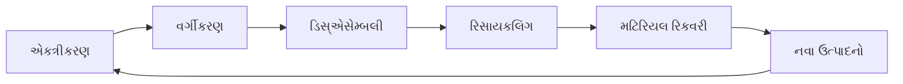

**કોષ્ટક: ઇ-વેસ્ટ મેનેજમેન્ટના પગલાં**

| પગલું | વર્ણન | મહત્વ |
|------|-------------|------------|
| એકત્રીકરણ | જૂના IC એકત્રિત કરવા | ખોટા નિકાલ રોકે છે |
| વર્ગીકરણ | પ્રકાર અનુસાર વર્ગીકરણ | કાર્યક્ષમ પ્રક્રિયા માટે |
| ડિસ્એસેમ્બલી | ઘટકોને અલગ કરવા | મટિરિયલ રિકવરી સરળ બનાવે છે |
| રિસાયકલિંગ | મટિરિયલ્સ પ્રોસેસિંગ | પર્યાવરણ પ્રભાવ ઘટાડે છે |
| મટિરિયલ રિકવરી | મૂલ્યવાન ધાતુઓ મેળવવી | સંસાધનો સંરક્ષિત કરે છે |
| સુરક્ષિત નિકાલ | વિષાક્ત ઘટકોનું સંચાલન | પ્રદૂષણ અટકાવે છે |

- **ઇ-વેસ્ટ મેનેજમેન્ટની જરૂરિયાત**:
  - **પર્યાવરણ રક્ષણ**: વિષાક્ત પદાર્થોને જમીન/પાણીમાં મિશ્રિત થતા રોકે છે
  - **સંસાધન સંરક્ષણ**: સોનું, ચાંદી, તાંબુ જેવી મૂલ્યવાન ધાતુઓ પુનઃપ્રાપ્ત કરે છે
  - **આરોગ્ય સુરક્ષા**: લેડ, પારા જેવા જોખમી પદાર્થોના સંપર્કને ઘટાડે છે
  - **કાયદાકીય અનુપાલન**: ઇલેક્ટ્રોનિક કચરા અંગેના નિયમોનું પાલન કરે છે

**મેમરી ટ્રીક:** "એકત્રિત કરો, વર્ગીકૃત કરો, છૂટા પાડો, રિસાયકલ કરો, પુનઃપ્રાપ્ત કરો, ફરીથી વાપરો"
