## Question 1(a) [3 marks]

**(726)₁₀ = (_________)₂**

**Answer**:

**Table: Decimal to Binary Conversion**

| Step | Calculation | Remainder |
|------|-------------|-----------|
| 1    | 726 ÷ 2 = 363 | 0 |
| 2    | 363 ÷ 2 = 181 | 1 |
| 3    | 181 ÷ 2 = 90  | 1 |
| 4    | 90 ÷ 2 = 45   | 0 |
| 5    | 45 ÷ 2 = 22   | 1 |
| 6    | 22 ÷ 2 = 11   | 0 |
| 7    | 11 ÷ 2 = 5    | 1 |
| 8    | 5 ÷ 2 = 2     | 1 |
| 9    | 2 ÷ 2 = 1     | 0 |
| 10   | 1 ÷ 2 = 0     | 1 |

Reading from bottom to top: (726)₁₀ = (1011010110)₂

**Mnemonic:** "Divide By Two, Read Remainders Up"

## Question 1(b) [4 marks]

**1) Convert binary number (10110101)₂ into gray number.**

**2) Convert gray number (10110110)gray into binary number.**

**Answer**:

**Binary to Gray Conversion:**
```
Binary:   1 0 1 1 0 1 0 1
           ↓ ↓ ↓ ↓ ↓ ↓ ↓
XOR:      1⊕0 0⊕1 1⊕1 1⊕0 0⊕1 1⊕0 0⊕1
           ↓   ↓   ↓   ↓   ↓   ↓   ↓
Gray:     1   1   0   1   1   1   1
```

Therefore: (10110101)₂ = (1101111)gray

**Gray to Binary Conversion:**
```
Gray:     1 0 1 1 0 1 1 0
           ↓
Binary:   1
          1⊕0 = 1
          1⊕1 = 0
          0⊕1 = 1
          1⊕0 = 1
          1⊕1 = 0
          0⊕1 = 1
          1⊕0 = 1
```

Therefore: (10110110)gray = (10110101)₂

**Mnemonic:** "First bit same, rest XOR with previous binary"

## Question 1(c) [7 marks]

**Explain NAND as a universal gate.**

**Answer**:

**Diagram: NAND as Universal Gate**

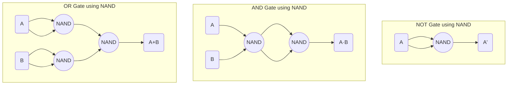

- **Universal Property**: NAND gate can implement any Boolean function without needing any other type of gate
- **NOT Implementation**: Connecting both inputs of NAND together creates NOT gate
- **AND Implementation**: NAND followed by another NAND creates AND gate
- **OR Implementation**: Two NAND gates with single inputs, followed by NAND creates OR gate

**Table: NAND Gate Implementations**

| Logic Function | NAND Implementation |
|----------------|---------------------|
| NOT(A) | NAND(A,A) |
| AND(A,B) | NAND(NAND(A,B),NAND(A,B)) |
| OR(A,B) | NAND(NAND(A,A),NAND(B,B)) |

**Mnemonic:** "NAND can STAND as All gates"

## Question 1(c) OR [7 marks]

**Explain NOR as a universal gate.**

**Answer**:

**Diagram: NOR as Universal Gate**

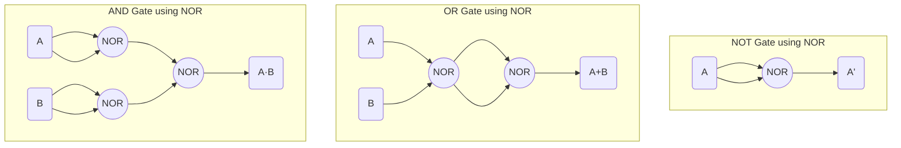

- **Universal Property**: NOR gate can implement any Boolean function without needing any other type of gate
- **NOT Implementation**: Connecting both inputs of NOR together creates NOT gate
- **OR Implementation**: NOR followed by another NOR creates OR gate
- **AND Implementation**: Two NOR gates with single inputs, followed by NOR creates AND gate

**Table: NOR Gate Implementations**

| Logic Function | NOR Implementation |
|----------------|---------------------|
| NOT(A) | NOR(A,A) |
| OR(A,B) | NOR(NOR(A,B),NOR(A,B)) |
| AND(A,B) | NOR(NOR(A,A),NOR(B,B)) |

**Mnemonic:** "NOR can form ALL logic cores"

## Question 2(a) [3 marks]

**(11011011)₂ X (110)₂ = (_________)₂**

**Answer**:

**Table: Binary Multiplication**

```
    1 1 0 1 1 0 1 1
  ×         1 1 0
  ---------------
    1 1 0 1 1 0 1 1  (× 0)
  1 1 0 1 1 0 1 1    (× 1)
1 1 0 1 1 0 1 1      (× 1)
-----------------
1 0 0 0 0 0 0 0 1 1 0
```

Therefore: (11011011)₂ × (110)₂ = (10000001110)₂

**Mnemonic:** "Multiply each bit, shift left, add all rows"

## Question 2(b) [4 marks]

**Prove DeMorgan's theorem.**

**Answer**:

**Table: DeMorgan's Theorem Proof**

| A | B | A' | B' | A+B | (A+B)' | A'·B' |
|---|---|----|----|-----|--------|-------|
| 0 | 0 | 1  | 1  | 0   | 1      | 1     |
| 0 | 1 | 1  | 0  | 1   | 0      | 0     |
| 1 | 0 | 0  | 1  | 1   | 0      | 0     |
| 1 | 1 | 0  | 0  | 1   | 0      | 0     |

DeMorgan's Theorems:
1. (A+B)' = A'·B'
2. (A·B)' = A'+B'

Truth table proves that (A+B)' = A'·B' since both columns match.

**Mnemonic:** "Break the line, change the sign"

## Question 2(c) [7 marks]

**Explain full adder using logic circuit, Boolean equation and truth table.**

**Answer**:

**Diagram: Full Adder Circuit**

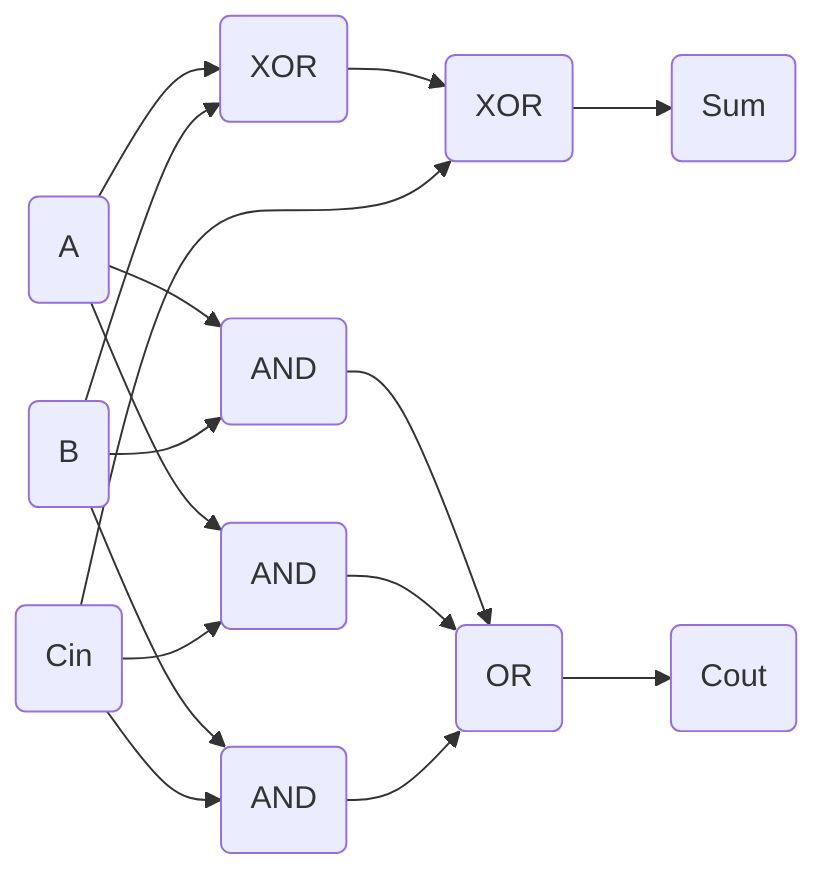

**Table: Full Adder Truth Table**

| A | B | Cin | Sum | Cout |
|---|---|-----|-----|------|
| 0 | 0 | 0   | 0   | 0    |
| 0 | 0 | 1   | 1   | 0    |
| 0 | 1 | 0   | 1   | 0    |
| 0 | 1 | 1   | 0   | 1    |
| 1 | 0 | 0   | 1   | 0    |
| 1 | 0 | 1   | 0   | 1    |
| 1 | 1 | 0   | 0   | 1    |
| 1 | 1 | 1   | 1   | 1    |

- **Boolean Equations**:
  - Sum = A ⊕ B ⊕ Cin
  - Cout = (A·B) + (B·Cin) + (A·Cin)

**Mnemonic:** "Sum needs XOR three, Carry needs AND then OR"

## Question 2(a) OR [3 marks]

**Divide (11010010)₂ with (101)₂ = (_________)₂**

**Answer**:

**Table: Binary Division**

```
            1 0 1 0 1 1
         ____________
101 ) 1 1 0 1 0 0 1 0
      1 0 1
      -----
        1 1 0
        1 0 1
        -----
          0 1 0
            0 0
          -----
            1 0 0
            1 0 1
            -----
              1 1 0
              1 0 1
              -----
                0 1 0
                  0 0
                -----
                  1 0
                   0
                 ----
                   0
```

Therefore: (11010010)₂ ÷ (101)₂ = (101011)₂ with remainder (0)₂

**Mnemonic:** "Divide like decimal, but use binary subtraction"

## Question 2(b) OR [4 marks]

**Simplify the Boolean expression Y = A'B+AB'+A'B'+AB**

**Answer**:

**Table: Boolean Simplification**

| Step | Expression | Rule Applied |
|------|------------|--------------|
| 1 | Y = A'B+AB'+A'B'+AB | Original |
| 2 | Y = A'(B+B')+A(B'+B) | Factoring |
| 3 | Y = A'(1)+A(1) | B+B' = 1 |
| 4 | Y = A'+A | Simplifying |
| 5 | Y = 1 | A'+A = 1 |

Therefore: Y = 1 (Always TRUE)

**Mnemonic:** "Factor first, apply identities, combine like terms"

## Question 2(c) OR [7 marks]

**Explain full subtractor using logic circuit, boolean equation and truth table.**

**Answer**:

**Diagram: Full Subtractor Circuit**

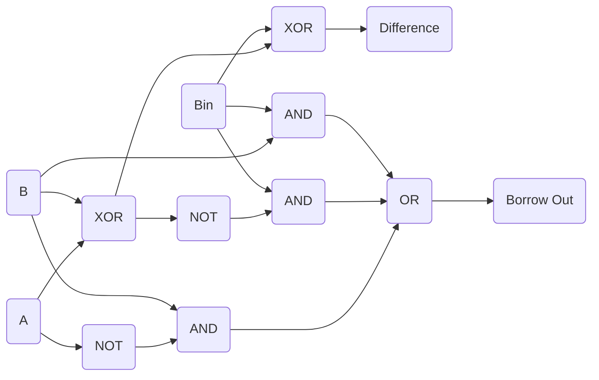

**Table: Full Subtractor Truth Table**

| A | B | Bin | Difference | Bout |
|---|---|-----|------------|------|
| 0 | 0 | 0   | 0          | 0    |
| 0 | 0 | 1   | 1          | 1    |
| 0 | 1 | 0   | 1          | 1    |
| 0 | 1 | 1   | 0          | 1    |
| 1 | 0 | 0   | 1          | 0    |
| 1 | 0 | 1   | 0          | 0    |
| 1 | 1 | 0   | 0          | 0    |
| 1 | 1 | 1   | 1          | 1    |

- **Boolean Equations**:
  - Difference = A ⊕ B ⊕ Bin
  - Bout = (A'·B) + (A'·Bin) + (B·Bin)

**Mnemonic:** "Difference uses triple XOR, Borrow when input is greater"

## Question 3(a) [3 marks]

**Using 2's complement subtract (1011001)₂ from (1101101)₂.**

**Answer**:

**Table: 2's Complement Subtraction**

| Step | Operation | Result |
|------|-----------|--------|
| 1 | Number to subtract: | 1011001 |
| 2 | 1's complement: | 0100110 |
| 3 | 2's complement: | 0100111 |
| 4 | (1101101) + (0100111) = | 10010100 |
| 5 | Discard carry: | 0010100 |

Therefore: (1101101)₂ - (1011001)₂ = (0010100)₂ = (20)₁₀

**Mnemonic:** "Flip bits, add one, then add numbers"

## Question 3(b) [4 marks]

**Simplify the Boolean equation using Karnaugh map (K' map) method: F(A,B,C,D) = Σm(0,1,2,6,7,8,12,15)**

**Answer**:

**Table: Karnaugh Map**

```
      CD      
AB    00  01  11  10
00    1   1   0   1
01    0   0   1   1
11    0   0   1   0
10    1   0   0   0
```

**Diagram: K-map Grouping**

```goat
+-----+-----+-----+-----+
|  1  |  1  |  0  |  1  |
|  A  |  A  |     |  A  |
+-----+-----+-----+-----+
|  0  |  0  |  1  |  1  |
|     |     |  B  |  B  |
+-----+-----+-----+-----+
|  0  |  0  |  1  |  0  |
|     |     |  B  |     |
+-----+-----+-----+-----+
|  1  |  0  |  0  |  0  |
|  C  |     |     |     |
+-----+-----+-----+-----+
```

Group A: A'B'C' (4 cells)
Group B: BCD (3 cells)
Group C: A'B'CD' (1 cell)

Simplified expression: F(A,B,C,D) = A'B'C' + BCD + A'B'CD'

**Mnemonic:** "Find largest groups of 2ⁿ, use minimal terms"

## Question 3(c) [7 marks]

**Explain 3 to 8 decoder using logic circuit and truth table.**

**Answer**:

**Diagram: 3-to-8 Decoder**

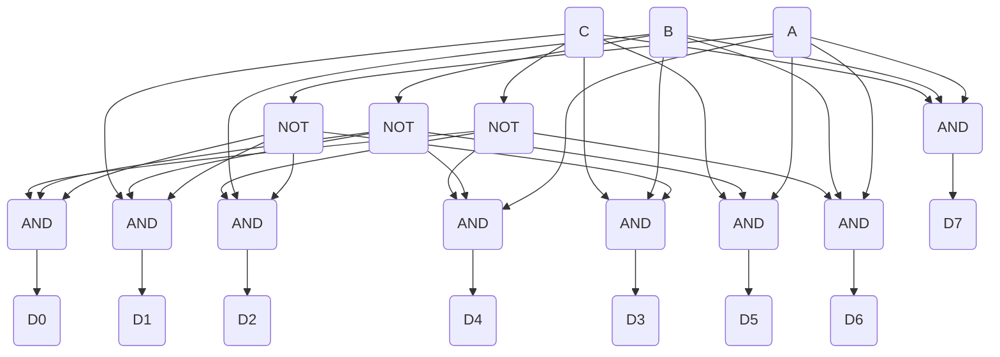

**Table: 3-to-8 Decoder Truth Table**

| Inputs |    | Outputs |    |    |    |    |    |    |    |
|--------|----|---------|----|----|----|----|----|----|----|
| A | B | C | D0 | D1 | D2 | D3 | D4 | D5 | D6 | D7 |
| 0 | 0 | 0 | 1  | 0  | 0  | 0  | 0  | 0  | 0  | 0  |
| 0 | 0 | 1 | 0  | 1  | 0  | 0  | 0  | 0  | 0  | 0  |
| 0 | 1 | 0 | 0  | 0  | 1  | 0  | 0  | 0  | 0  | 0  |
| 0 | 1 | 1 | 0  | 0  | 0  | 1  | 0  | 0  | 0  | 0  |
| 1 | 0 | 0 | 0  | 0  | 0  | 0  | 1  | 0  | 0  | 0  |
| 1 | 0 | 1 | 0  | 0  | 0  | 0  | 0  | 1  | 0  | 0  |
| 1 | 1 | 0 | 0  | 0  | 0  | 0  | 0  | 0  | 1  | 0  |
| 1 | 1 | 1 | 0  | 0  | 0  | 0  | 0  | 0  | 0  | 1  |

- **Function**: Activates one of 8 output lines based on 3-bit binary input
- **Applications**: Memory addressing, data routing, instruction decoding
- **Boolean Equations**: D0 = A'·B'·C', D1 = A'·B'·C, etc.

**Mnemonic:** "One hot output at binary address"

## Question 3(a) OR [3 marks]

**Do as directed. 1) (101011010111)₂ = (___________)₈**

**Answer**:

**Table: Binary to Octal Conversion**

```
Binary:    1 | 010 | 110 | 101 | 11
           ↓    ↓     ↓     ↓    ↓
Octal:     1    2     6     5    3
```

Therefore: (101011010111)₂ = (12653)₈

**Mnemonic:** "Group by threes, right to left"

## Question 3(b) OR [4 marks]

**Simplify the Boolean equation using Karnaugh map (K' map) method: F(A,B,C,D) = Σm(1,3,5,7,8,9,10,11)**

**Answer**:

**Table: Karnaugh Map**

```
      CD      
AB    00  01  11  10
00    0   1   1   0
01    0   1   1   0
11    0   0   0   0
10    1   1   1   1
```

**Diagram: K-map Grouping**

```goat
+-----+-----+-----+-----+
|  0  |  1  |  1  |  0  |
|     |  A  |  A  |     |
+-----+-----+-----+-----+
|  0  |  1  |  1  |  0  |
|     |  A  |  A  |     |
+-----+-----+-----+-----+
|  0  |  0  |  0  |  0  |
|     |     |     |     |
+-----+-----+-----+-----+
|  1  |  1  |  1  |  1  |
|  B  |  B  |  B  |  B  |
+-----+-----+-----+-----+
```

Group A: A'CD (4 cells)
Group B: AB' (4 cells)

Simplified expression: F(A,B,C,D) = A'CD + AB'

**Mnemonic:** "Group powers of 2, minimize variables"

## Question 3(c) OR [7 marks]

**Explain 8 to 1 multiplexer using logic circuit and truth table.**

**Answer**:

**Diagram: 8-to-1 Multiplexer**

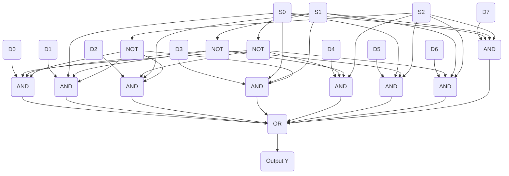

**Table: 8-to-1 Multiplexer Truth Table**

| Select Lines |    |    | Output |
|--------------|----|----|--------|
| S2 | S1 | S0 | Y  |
| 0  | 0  | 0  | D0 |
| 0  | 0  | 1  | D1 |
| 0  | 1  | 0  | D2 |
| 0  | 1  | 1  | D3 |
| 1  | 0  | 0  | D4 |
| 1  | 0  | 1  | D5 |
| 1  | 1  | 0  | D6 |
| 1  | 1  | 1  | D7 |

- **Function**: Selects one of 8 input data lines and routes it to output
- **Applications**: Data routing, function generation, parallel-to-serial conversion
- **Boolean Equation**: Y = S2'·S1'·S0'·D0 + S2'·S1'·S0·D1 + ... + S2·S1·S0·D7

**Mnemonic:** "Select bits route one input to output"

## Question 4(a) [3 marks]

**Draw the logic circuit for binary to gray convertor.**

**Answer**:

**Diagram: Binary to Gray Code Converter**

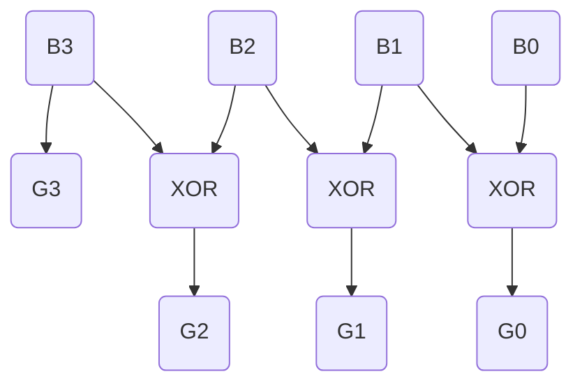

- **Binary Inputs**: B3, B2, B1, B0 (most to least significant bits)
- **Gray Outputs**: G3, G2, G1, G0 (most to least significant bits)
- **Conversion Rule**: G3 = B3, G2 = B3 ⊕ B2, G1 = B2 ⊕ B1, G0 = B1 ⊕ B0

**Mnemonic:** "First bit same, rest XOR neighbors"

## Question 4(b) [4 marks]

**Explain working of Serial in Serial out shift register.**

**Answer**:

**Diagram: Serial-In Serial-Out Shift Register**

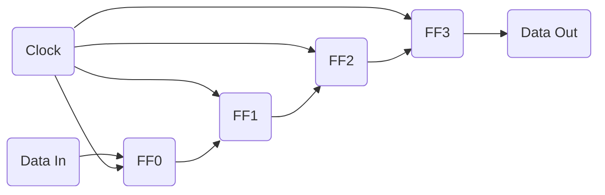

**Table: Serial-In Serial-Out Operation**

| Clock Cycle | FF0 | FF1 | FF2 | FF3 | Data Out |
|-------------|-----|-----|-----|-----|----------|
| Initial     | 0   | 0   | 0   | 0   | 0        |
| 1 (Din=1)   | 1   | 0   | 0   | 0   | 0        |
| 2 (Din=0)   | 0   | 1   | 0   | 0   | 0        |
| 3 (Din=1)   | 1   | 0   | 1   | 0   | 0        |
| 4 (Din=1)   | 1   | 1   | 0   | 1   | 1        |

- **Operation**: Data bits enter serially at input, shift through all flip-flops, and exit serially
- **Applications**: Data transmission, time delay, serial-to-serial conversion
- **Features**: Simple design, requires fewer I/O pins but more clock cycles

**Mnemonic:** "One bit in, shift all, one bit out"

## Question 4(c) [7 marks]

**Explain workings of D flip flop and JK flip flop using circuit diagram and truth table.**

**Answer**:

**Diagram: D Flip-Flop**

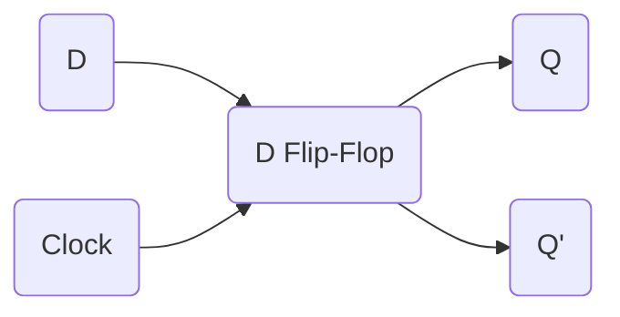

**Table: D Flip-Flop Truth Table**

| D | Clock | Q(next) |
|---|-------|---------|
| 0 | ↑     | 0       |
| 1 | ↑     | 1       |

**Diagram: JK Flip-Flop**

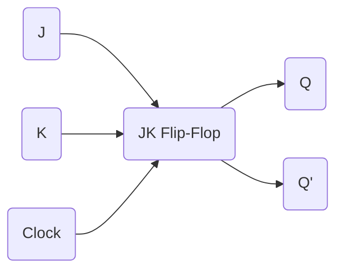

**Table: JK Flip-Flop Truth Table**

| J | K | Clock | Q(next) |
|---|---|-------|---------|
| 0 | 0 | ↑     | Q(no change) |
| 0 | 1 | ↑     | 0       |
| 1 | 0 | ↑     | 1       |
| 1 | 1 | ↑     | Q' (toggle) |

- **D Flip-Flop**: Data (D) input is transferred to output Q at positive clock edge
- **JK Flip-Flop**: More versatile with set (J), reset (K), hold and toggle capabilities
- **Applications**: Storage elements, counters, registers, sequential circuits

**Mnemonic:** "D Does what D is, JK Juggles Keep-Toggle-Set"

## Question 4(a) OR [3 marks]

**Draw the logic circuit for gray to binary convertor.**

**Answer**:

**Diagram: Gray to Binary Code Converter**

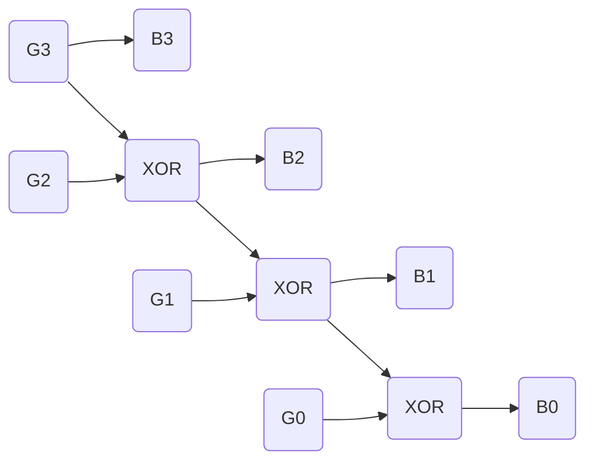

- **Gray Inputs**: G3, G2, G1, G0 (most to least significant bits)
- **Binary Outputs**: B3, B2, B1, B0 (most to least significant bits)
- **Conversion Rule**: B3 = G3, B2 = B3 ⊕ G2, B1 = B2 ⊕ G1, B0 = B1 ⊕ G0

**Mnemonic:** "First bit same, rest XOR with previous result"

## Question 4(b) OR [4 marks]

**Explain working of Parallel in Parallel out shift register.**

**Answer**:

**Diagram: Parallel-In Parallel-Out Shift Register**

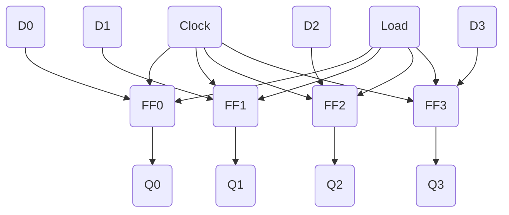

**Table: Parallel-In Parallel-Out Operation**

| LOAD | Clock | D0-D3 | Q0-Q3 (after clock) |
|------|-------|-------|---------------------|
| 1    | ↑     | 1010  | 1010                |
| 0    | ↑     | xxxx  | 1010 (no change)    |
| 1    | ↑     | 0101  | 0101                |

- **Operation**: Data loaded in parallel, all bits simultaneously transferred to outputs
- **Applications**: Data storage, buffering, temporary holding registers
- **Features**: Fastest register type, requires most I/O pins, no bit shifting

**Mnemonic:** "All in, all out, all at once"

## Question 4(c) OR [7 marks]

**Explain workings of T flip flop and SR flip flop using circuit diagram and truth table.**

**Answer**:

**Diagram: T Flip-Flop**

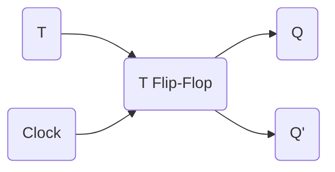

**Table: T Flip-Flop Truth Table**

| T | Clock | Q(next) |
|---|-------|---------|
| 0 | ↑     | Q (no change) |
| 1 | ↑     | Q' (toggle)   |

**Diagram: SR Flip-Flop**

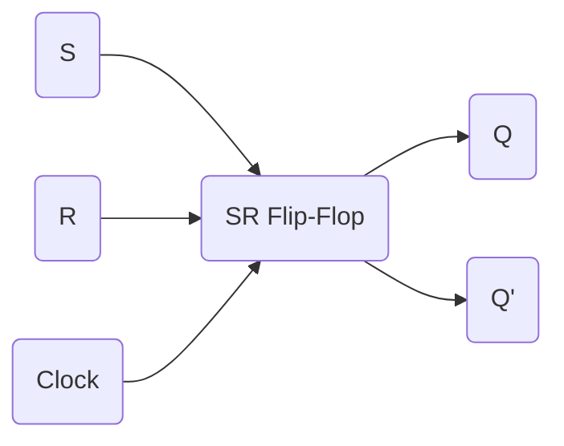

**Table: SR Flip-Flop Truth Table**

| S | R | Clock | Q(next) |
|---|---|-------|---------|
| 0 | 0 | ↑     | Q (no change) |
| 0 | 1 | ↑     | 0 (reset)     |
| 1 | 0 | ↑     | 1 (set)       |
| 1 | 1 | ↑     | Invalid       |

- **T Flip-Flop**: Toggle flip-flop changes state when T=1, maintains state when T=0
- **SR Flip-Flop**: Basic flip-flop with Set (S) and Reset (R) inputs
- **Applications**: T flip-flops for counters and frequency dividers, SR for basic memory

**Mnemonic:** "T Toggles when True, SR Sets or Resets"

## Question 5(a) [3 marks]

**Compare TTL, CMOS and ECL logic families.**

**Answer**:

**Table: Comparison of Logic Families**

| Parameter | TTL | CMOS | ECL |
|-----------|-----|------|-----|
| Power Consumption | Medium | Very Low | High |
| Speed | Medium | Low-Medium | Very High |
| Noise Immunity | Medium | High | Low |
| Fan-out | 10 | >50 | 25 |
| Supply Voltage | +5V | +3V to +15V | -5.2V |
| Complexity | Medium | Low | High |

- **TTL**: Transistor-Transistor Logic - Good balance of speed and power
- **CMOS**: Complementary Metal-Oxide-Semiconductor - Low power, high density
- **ECL**: Emitter-Coupled Logic - Highest speed, used in high-performance applications

**Mnemonic:** "TCE: TTL Compromises, CMOS Economizes, ECL Excels in speed"

## Question 5(b) [4 marks]

**Explain decade counter with the help of logic circuit diagram and truth table.**

**Answer**:

**Diagram: Decade Counter (BCD Counter)**

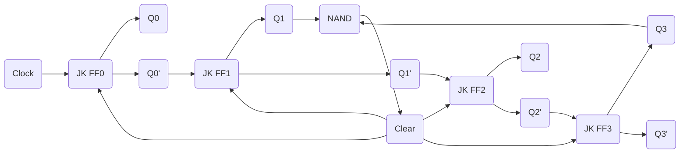

**Table: Decade Counter States**

| Count | Q3 | Q2 | Q1 | Q0 |
|-------|----|----|----|----|
| 0     | 0  | 0  | 0  | 0  |
| 1     | 0  | 0  | 0  | 1  |
| 2     | 0  | 0  | 1  | 0  |
| 3     | 0  | 0  | 1  | 1  |
| 4     | 0  | 1  | 0  | 0  |
| 5     | 0  | 1  | 0  | 1  |
| 6     | 0  | 1  | 1  | 0  |
| 7     | 0  | 1  | 1  | 1  |
| 8     | 1  | 0  | 0  | 0  |
| 9     | 1  | 0  | 0  | 1  |
| 0     | 0  | 0  | 0  | 0  |

- **Function**: Counts from 0 to 9 (decimal) and then resets to 0
- **Applications**: Digital clocks, frequency dividers, BCD counters
- **Features**: Auto-reset at count 10, synchronous with clock

**Mnemonic:** "Counts one Decade, resets after nine"

## Question 5(c) [7 marks]

**Give Classification of Memories in detail.**

**Answer**:

**Diagram: Memory Classification**

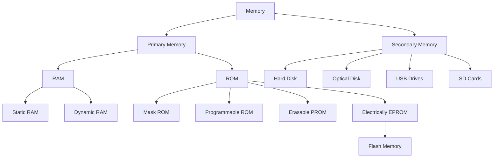

**Table: Memory Types Comparison**

| Memory Type | Volatility | Read/Write | Access Speed | Typical Use |
|-------------|------------|------------|--------------|-------------|
| SRAM | Volatile | R/W | Very Fast | Cache memory |
| DRAM | Volatile | R/W | Fast | Main memory |
| ROM | Non-volatile | Read-only | Medium | BIOS, firmware |
| PROM | Non-volatile | Write-once | Medium | Permanent programs |
| EPROM | Non-volatile | Erasable UV | Medium | Upgradable firmware |
| EEPROM | Non-volatile | Electrically erasable | Medium | Configuration data |
| Flash | Non-volatile | Block erasable | Medium-Fast | Storage devices |

- **RAM (Random Access Memory)**: Temporary, volatile working memory
- **ROM (Read Only Memory)**: Permanent, non-volatile program storage
- **Characteristics**: Access time, data retention, capacity, cost per bit

**Mnemonic:** "RAM Vanishes, ROM Remains"

## Question 5(a) OR [3 marks]

**Define: Fan out, Fan in and Figure of merit.**

**Answer**:

**Table: Digital Logic Parameters**

| Parameter | Definition | Typical Values |
|-----------|------------|----------------|
| Fan-out | Number of standard loads a gate output can drive | TTL: 10, CMOS: >50 |
| Fan-in | Number of inputs a logic gate can handle | TTL: 8, CMOS: 100+ |
| Figure of Merit | Speed-power product (propagation delay × power consumption) | Lower is better |

- **Fan-out**: Maximum number of gate inputs that can be connected to a gate output
- **Fan-in**: Maximum number of inputs available on a single logic gate
- **Figure of Merit**: Quality factor for comparing different logic families

**Mnemonic:** "Out drives many, In accepts many, Merit measures goodness"

## Question 5(b) OR [4 marks]

**Explain asynchronous up counter with the help of logic circuit diagram and truth table.**

**Answer**:

**Diagram: 4-bit Asynchronous Up Counter**

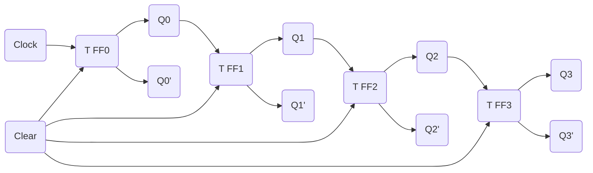

**Table: 4-bit Asynchronous Counter States**

| Count | Q3 | Q2 | Q1 | Q0 |
|-------|----|----|----|----|
| 0     | 0  | 0  | 0  | 0  |
| 1     | 0  | 0  | 0  | 1  |
| 2     | 0  | 0  | 1  | 0  |
| ...   | .. | .. | .. | .. |
| 14    | 1  | 1  | 1  | 0  |
| 15    | 1  | 1  | 1  | 1  |

- **Operation**: Each flip-flop triggers the next when transitioning from 1 to 0
- **Features**: Simple design but suffers from propagation delay (ripple)
- **Applications**: Frequency division, basic counting applications

**Mnemonic:** "Ripples Up, Each bit triggers Next"

## Question 5(c) OR [7 marks]

**Describe steps and the need of E-waste Management of Digital ICs.**

**Answer**:

**Diagram: E-waste Management Cycle**


**Table: E-waste Management Steps**

| Step | Description | Importance |
|------|-------------|------------|
| Collection | Gathering obsolete ICs | Prevents improper disposal |
| Sorting | Categorizing by type | Enables efficient processing |
| Disassembly | Separating components | Facilitates material recovery |
| Recycling | Processing materials | Reduces environmental impact |
| Material Recovery | Extracting valuable metals | Conserves resources |
| Safe Disposal | Handling toxic components | Prevents contamination |

- **Need for E-waste Management**:
  - **Environmental Protection**: Prevents toxic substances from leaching into soil/water
  - **Resource Conservation**: Recovers valuable metals like gold, silver, copper
  - **Health Safety**: Reduces exposure to hazardous materials like lead, mercury
  - **Legal Compliance**: Follows regulations regarding electronic waste

**Mnemonic:** "Collect, Sort, Disassemble, Recycle, Recover, Reuse"
