## પ્રશ્ન 1(અ) [3 ગુણ]

**થર્મલ રનઅવે વિગતવાર સમજાવો.**

**જવાબ**:
થર્મલ રનઅવે એ BJT ટ્રાન્ઝિસ્ટરમાં થતી વિનાશક પ્રક્રિયા છે જેમાં તાપમાનમાં વધારો સ્વ-પુનરાવર્તિત ચક્ર બનાવે છે જે ઉપકરણને નુકસાન પહોંચાડે છે.


- **ગરમી ઉત્પાદન**: સામાન્ય કાર્ય દરમિયાન તાપમાન વધે છે
- **લીકેજ કરંટ**: તાપમાન વધવાથી કલેક્ટર કરંટ Ic વધે છે
- **પાવર વ્યય**: વધુ પાવર = તાપમાન વધુ વધે છે
- **વિનાશક ચક્ર**: ટ્રાન્ઝિસ્ટર નાશ પામે ત્યાં સુધી સતત ચક્ર ચાલે છે

**મેમરી ટ્રીક:** "વધુ તાપમાન, વધુ કરંટ"

## પ્રશ્ન 1(બ) [4 ગુણ]

**સરળ બ્લોક ડાયાગ્રામ સાથે એમ્પ્લીફાયર વ્યાખ્યાયિત કરો એમ્પ્લીફાયર પરિમાણો લખો.**

**જવાબ**:
એમ્પ્લીફાયર એક ઇલેક્ટ્રોનિક ઉપકરણ છે જે ઇનપુટ સિગ્નલનો પાવર, વોલ્ટેજ અથવા કરંટ વધારે છે.

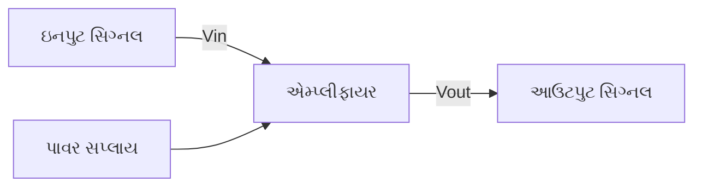

| એમ્પ્લીફાયર પરિમાણ | વર્ણન |
|---------------------|-------|
| **વોલ્ટેજ ગેઇન (Av)** | આઉટપુટ વોલ્ટેજનો ઇનપુટ વોલ્ટેજ સાથેનો ગુણોત્તર |
| **કરંટ ગેઇન (Ai)** | આઉટપુટ કરંટનો ઇનપુટ કરંટ સાથેનો ગુણોત્તર |
| **પાવર ગેઇન (Ap)** | વોલ્ટેજ ગેઇન અને કરંટ ગેઇનનો ગુણાકાર |
| **બેન્ડવિડ્થ** | એમ્પ્લીફાયર હેન્ડલ કરી શકે તેવી ફ્રીક્વન્સીની રેન્જ |
| **ઇનપુટ ઇમ્પીડન્સ** | ઇનપુટ સ્ત્રોત દ્વારા જોવામાં આવતો અવરોધ |
| **આઉટપુટ ઇમ્પીડન્સ** | એમ્પ્લીફાયરનો આંતરિક અવરોધ |

**મેમરી ટ્રીક:** "VIPS-BIO" (Voltage, Input impedance, Power, Supply, Bandwidth, Impedance Output)

## પ્રશ્ન 1(ક) [7 ગુણ]

**ટ્રાન્ઝિસ્ટરમાં બાયસિંગ વ્યાખ્યાયિત કરો? બાયસિંગ પદ્ધતિઓના પ્રકારો લખો. વોલ્ટેજ વિભાજક બાયસિંગ પદ્ધતિને વિગતોમાં સમજાવો.**

**જવાબ**:
બાયસિંગ એ ટ્રાન્ઝિસ્ટર માટે DC વોલ્ટેજ આપીને સ્થિર ઓપરેટિંગ પોઈન્ટ (Q-પોઈન્ટ) સ્થાપિત કરવાની પ્રક્રિયા છે.

| બાયસિંગ પદ્ધતિ | મુખ્ય લક્ષણો |
|----------------|-------------|
| **ફિક્સ્ડ બાયસ** | સરળ, ઓછી સ્થિરતા |
| **કલેક્ટર ફીડબેક** | સ્વ-સમાયોજિત, વધુ સારી સ્થિરતા |
| **વોલ્ટેજ વિભાજક** | શ્રેષ્ઠ સ્થિરતા, વ્યાપકપણે વપરાતી |
| **એમિટર બાયસ** | સારી સ્થિરતા, નેગેટિવ ફીડબેક |

**વોલ્ટેજ વિભાજક બાયસિંગ:**

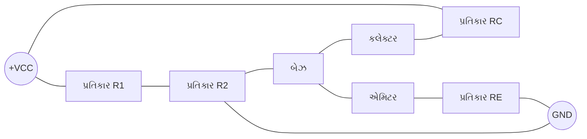

- **R1 & R2**: બેઝને સ્થિર વોલ્ટેજ આપવા માટે વોલ્ટેજ વિભાજક બનાવે છે
- **RE**: નેગેટિવ ફીડબેક દ્વારા સ્થિરીકરણ પ્રદાન કરે છે
- **RC**: કલેક્ટર કરંટ અને વોલ્ટેજ ગેઇન નક્કી કરે છે
- **સ્થિરતા**: તાપમાન ફેરફારો સામે શ્રેષ્ઠ સ્થિરતા

**મેમરી ટ્રીક:** "વિભાજીત વોલ્ટેજથી ટ્રાન્ઝિસ્ટર સારું વહન કરે"

## પ્રશ્ન 1(ક) અથવા [7 ગુણ]

**હીટ સિંક સમજાવો.**

**જવાબ**:
હીટ સિંક એ પેસિવ હીટ એક્સચેન્જર છે જે ઇલેક્ટ્રોનિક ઉપકરણોમાંથી ગરમીને આસપાસની હવામાં ટ્રાન્સફર કરે છે.

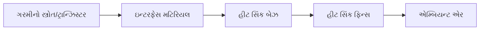

| ભાગ | કાર્ય |
|-----------|----------|
| **બેઝ** | ડિવાઇસમાંથી ગરમી વહન કરે છે |
| **ફિન્સ** | ગરમી ફેલાવા માટે સરફેસ એરિયા વધારે છે |
| **થર્મલ ઇન્ટરફેસ મટિરિયલ** | ડિવાઇસ અને સિંક વચ્ચેનો સંપર્ક સુધારે છે |
| **પ્રકારો** | એક્સટ્રૂડેડ, બોન્ડેડ, ફોલ્ડેડ, ડાઇ-કાસ્ટ |

- **થર્મલ રેઝિસ્ટન્સ**: ઓછું તે ગરમી ફેલાવા માટે વધુ સારું
- **મટિરિયલ**: સામાન્ય રીતે એલ્યુમિનિયમ અથવા કોપર સારી કન્ડક્ટિવિટી માટે
- **સરફેસ એરિયા**: વધુ ફિન્સ એટલે વધુ સારું કૂલિંગ
- **એરફ્લો**: કુશળ ગરમી દૂર કરવા માટે મહત્વપૂર્ણ

**મેમરી ટ્રીક:** "હીટ સિંક ટ્રાન્ઝિસ્ટરને ઠંડુ રાખે"

## પ્રશ્ન 2(અ) [3 ગુણ]

**D.C અને A.C. લોડ લાઇનોનું વર્ણન કરો.**

**જવાબ**:
લોડ લાઇન્સ ટ્રાન્ઝિસ્ટરનાં સંભવિત ઓપરેટિંગ પોઈન્ટ્સને તેના કેરેક્ટરિસ્ટિક કર્વ પર ગ્રાફિકલી દર્શાવે છે.

```goat
                     Ic
                      ↑
                      |
                      |        DC લોડ લાઇન
                      |       ╱
         Q-પોઈન્ટ       |      ╱
                      |     *
                      |    ╱  AC લોડ લાઇન
                      |   ╱
                      |  ╱
                      | ╱
                      |╱
                      +----------------→ Vce
                     0                Vcc
```

- **DC લોડ લાઇન**: DC સ્થિતિઓ હેઠળ બધા શક્ય ઓપરેટિંગ પોઈન્ટ્સ બતાવે છે
  - **સમીકરણ**: Ic = (VCC - VCE)/RC
  - **એન્ડપોઈન્ટ્સ**: (0, VCC/RC) અને (VCC, 0)

- **AC લોડ લાઇન**: AC સિગ્નલ હેન્ડલિંગ દરમિયાન ઓપરેટિંગ પોઈન્ટ્સ બતાવે છે
  - **વધુ તીક્ષ્ણ ઢાળ**: AC રેઝિસ્ટન્સ DC કરતાં ઓછો હોવાના કારણે
  - **Q-પોઈન્ટ પર કેન્દ્રિત**: બાયસિંગ દ્વારા સ્થાપિત ઓપરેટિંગ પોઈન્ટ

**મેમરી ટ્રીક:** "DC પૂર્ણ આલેખે, AC માર્ગ બદલે"

## પ્રશ્ન 2(બ) [4 ગુણ]

**એમ્પ્લીફાયરની બેન્ડવિડ્થ અને ગેઇન-બેન્ડવિડ્થ ઉત્પાદનને સંક્ષિપ્તમાં સમજાવો.**

**જવાબ**:
બેન્ડવિડ્થ અને ગેઇન-બેન્ડવિડ્થ ઉત્પાદન એમ્પ્લીફાયર ફ્રીક્વન્સી પરફોર્મન્સ માટેની મુખ્ય વિશેષતાઓ છે.


| પેરામીટર | વર્ણન |
|-----------|-------------|
| **બેન્ડવિડ્થ** | ફ્રીક્વન્સી રેન્જ જ્યાં ગેઇન 3dB કરતાં ઓછો ઘટે છે |
| **લોઅર કટઓફ (f₁)** | ફ્રીક્વન્સી જ્યાં નીચલા છેડે ગેઇન 3dB ઘટે છે |
| **અપર કટઓફ (f₂)** | ફ્રીક્વન્સી જ્યાં ઉપલા છેડે ગેઇન 3dB ઘટે છે |
| **ગેઇન-બેન્ડવિડ્થ ઉત્પાદન** | ગેઇન અને બેન્ડવિડ્થનો ગુણાકાર, સ્થિર રહે છે |

- **બેન્ડવિડ્થ ફોર્મ્યુલા**: BW = f₂ - f₁
- **ગેઇન-બેન્ડવિડ્થ**: ગેઇન બદલાય ત્યારે પણ સ્થિર રહે છે
- **ટ્રેડ-ઓફ**: વધુ ગેઇન એટલે ઓછી બેન્ડવિડ્થ

**મેમરી ટ્રીક:** "સારી બેન્ડવિડ્થ શ્રેષ્ઠ ટ્રાન્સમિશન આપે"

## પ્રશ્ન 2(ક) [7 ગુણ]

**બે તબક્કાના RC કપલ્ડ એમ્પ્લીફાયરનો આવર્તન પ્રતિભાવ સમજાવો.**

**જવાબ**:
બે-તબક્કાના RC કપલ્ડ એમ્પ્લીફાયરનો આવર્તન પ્રતિભાવ બતાવે છે કે ગેઇન આવર્તન સાથે કેવી રીતે બદલાય છે.

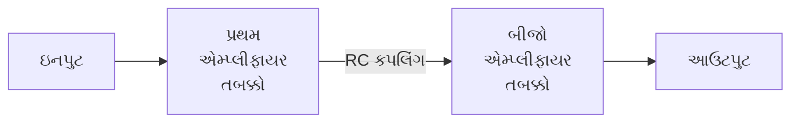

```goat
    ગેઇન(dB)
       ↑
       |    મધ્ય-આવર્તન બેન્ડ
       |    ┌───────────────┐
       |    │               │
       |    │               │
       |   ╱│               │╲
       |  ╱ │               │ ╲
       | ╱  │               │  ╲
       |╱   │               │   ╲
       +────┴───────────────┴────→ આવર્તન(Hz)
          f₁                 f₂
     નીચલા આવર્તન       ઉચ્ચ આવર્તન
```

- **નીચલા આવર્તન પ્રતિભાવ**: કપલિંગ કેપેસિટર્સ દ્વારા મર્યાદિત
  - **રોલ-ઓફ રેટ**: દરેક તબક્કા માટે -20 dB/decade
  
- **મધ્ય આવર્તન પ્રતિભાવ**: મહત્તમ અને સપાટ ગેઇન પ્રદેશ
  - **કુલ ગેઇન**: વ્યક્તિગત તબક્કાના ગેઇનનો ગુણાકાર

- **ઉચ્ચ આવર્તન પ્રતિભાવ**: ટ્રાન્ઝિસ્ટર કેપેસિટન્સ દ્વારા મર્યાદિત
  - **રોલ-ઓફ રેટ**: દરેક તબક્કા માટે -20 dB/decade

**મેમરી ટ્રીક:** "નીચે કપલિંગ નબળું, ઉપર કેપેસિટન્સ રોકે"

## પ્રશ્ન 2(અ) અથવા [3 ગુણ]

**ટ્રાન્ઝિસ્ટર બાયસિંગ માટે નિશ્ચિત બાયસ સર્કિટ સમજાવો.**

**જવાબ**:
ફિક્સ્ડ બાયસ એ ટ્રાન્ઝિસ્ટર માટેની સૌથી સરળ બાયસિંગ પદ્ધતિ છે, જેમાં બેઝ સાથે જોડાયેલ એક રેઝિસ્ટરનો ઉપયોગ થાય છે.

```goat
        +Vcc
          |
          R
          |
          |   C
    ------+---o
    |     |
   Vin    |    RC
    |     |     |
    |     |    +Vcc
    |     |
    +-----+
      બેઝ   કલેક્ટર
          |
          E
          |
         GND
```

- **સર્કિટ તત્વો**: બેઝ રેઝિસ્ટર (RB) અને કલેક્ટર રેઝિસ્ટર (RC)
- **બેઝ કરંટ**: IB = (VCC - VBE)/RB
- **કલેક્ટર કરંટ**: IC = β × IB
- **નુકસાન**: ઓછી સ્થિરતા, તાપમાન ફેરફારોથી અસર પામે છે

**મેમરી ટ્રીક:** "ફિક્સ બાયસ, ફેસ બર્ડન" (અસ્થિરતાનો)

## પ્રશ્ન 2(બ) અથવા [4 ગુણ]

**સિંગલ સ્ટેજ એમ્પ્લીફાયરનો આવર્તન પ્રતિભાવ સમજાવો.**

**જવાબ**:
સિંગલ-સ્ટેજ એમ્પ્લીફાયરનો આવર્તન પ્રતિભાવ બતાવે છે કે ગેઇન વિભિન્ન આવર્તનો પર કેવી રીતે બદલાય છે.

```goat
    ગેઇન(dB)
       ↑
       |    મધ્ય-આવર્તન બેન્ડ
       |    ┌───────────────┐
       |    │               │
       |   ╱│               │╲
       |  ╱ │               │ ╲
       | ╱  │               │  ╲
       |╱   │               │   ╲
       +────┴───────────────┴────→ આવર્તન(Hz)
          f₁                 f₂
     નીચલા આવર્તન       ઉચ્ચ આવર્તન
```

| આવર્તન રેન્જ | લક્ષણો |
|-----------------|-----------------|
| **નીચલા આવર્તન પ્રદેશ** | કપલિંગ કેપેસિટર્સને કારણે ગેઇન ઘટે છે |
| **મધ્ય આવર્તન પ્રદેશ** | મહત્તમ અને સ્થિર ગેઇન |
| **ઉચ્ચ આવર્તન પ્રદેશ** | ટ્રાન્ઝિસ્ટર કેપેસિટન્સને કારણે ગેઇન ઘટે છે |

- **નીચલી કટ-ઓફ આવર્તન**: કપલિંગ કેપેસિટર્સ દ્વારા નિર્ધારિત
- **ઉપલી કટ-ઓફ આવર્તન**: આંતરિક ટ્રાન્ઝિસ્ટર કેપેસિટન્સથી મર્યાદિત
- **બેન્ડવિડ્થ**: નીચલી અને ઉપલી કટ-ઓફ આવર્તનો વચ્ચેની રેન્જ

**મેમરી ટ્રીક:** "નીચું મધ્ય ઉંચું - કેપેસિટર અહીં મહત્વપૂર્ણ છે"

## પ્રશ્ન 2(ક) અથવા [7 ગુણ]

**ટ્રાન્સફોર્મર કપલ્ડ એમ્પ્લીફાયર અને RC કપલ્ડ એમ્પ્લીફાયરની સરખામણી કરો**

**જવાબ**:

| પેરામીટર | RC કપલ્ડ એમ્પ્લીફાયર | ટ્રાન્સફોર્મર કપલ્ડ એમ્પ્લીફાયર |
|-----------|----------------------|-------------------------------|
| **કપલિંગ તત્વ** | રેઝિસ્ટર અને કેપેસિટર | ટ્રાન્સફોર્મર |
| **આવર્તન પ્રતિભાવ** | વિશાળ બેન્ડવિડ્થ | મર્યાદિત બેન્ડવિડ્થ |
| **કાર્યક્ષમતા** | ઓછી (20-25%) | ઉચ્ચ (50-60%) |
| **કદ & વજન** | નાનું અને હલકું વજન | મોટું અને ભારે |
| **કિંમત** | સસ્તી | મોંઘી |
| **ઇમ્પીડન્સ મેચિંગ** | નબળું મેચિંગ | ઉત્કૃષ્ટ મેચિંગ |
| **વિકૃતિ** | ઓછી વિકૃતિ | કોર સેચુરેશનને કારણે વધુ |
| **DC આઇસોલેશન** | સારું આઇસોલેશન | ઉત્કૃષ્ટ આઇસોલેશન |
| **એપ્લિકેશન્સ** | સામાન્ય હેતુ | ઓડિયો પાવર એમ્પ્લીફાયર |

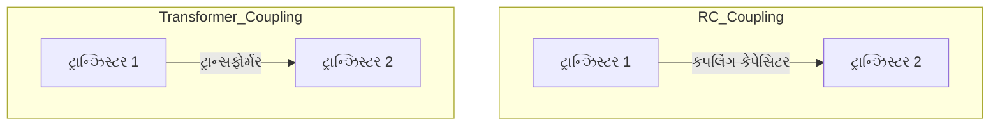

**મેમરી ટ્રીક:** "RC વિશાળતા લે, ટ્રાન્સફોર્મર પાવર લે"

## પ્રશ્ન 3(અ) [3 ગુણ]

**ડાયરેક્ટ કપલ્ડ એમ્પ્લીફાયરને સંક્ષિપ્તમાં સમજાવો.**

**જવાબ**:
ડાયરેક્ટ-કપલ્ડ એમ્પ્લીફાયર તબક્કાઓને કપલિંગ કેપેસિટર્સ અથવા ટ્રાન્સફોર્મર વિના જોડે છે, જે DC સિગ્નલ એમ્પ્લિફિકેશનની મંજૂરી આપે છે.


- **DC સિગ્નલ હેન્ડલિંગ**: ખૂબ નીચા આવર્તન અને DC એમ્પ્લિફાય કરી શકે છે
- **કોઈ કપલિંગ તત્વો નહીં**: પ્રથમ તબક્કાનું આઉટપુટ સીધું આગલા તબક્કાના ઇનપુટને જોડે છે
- **આવર્તન પ્રતિભાવ**: ઉત્કૃષ્ટ નીચલા આવર્તનનો પ્રતિભાવ
- **નુકસાન**: થર્મલ ડ્રિફ્ટ, બાયસ સ્થિરતાના મુદ્દાઓ

**મેમરી ટ્રીક:** "સીધું જોડાયેલ, સંપૂર્ણ શૂન્ય આવર્તન સુધી"

## પ્રશ્ન 3(બ) [4 ગુણ]

**એમ્પ્લીફાયરના ફ્રીક્વન્સી રિસ્પોન્સ પર એમિટર બાયપાસ કેપેસિટર અને કપલિંગ કેપેસિટરની અસરો સમજાવો.**

**જવાબ**:

| કેપેસિટર | કાર્ય | આવર્તન પ્રતિભાવ પર અસર |
|-----------|----------|------------------------------|
| **એમિટર બાયપાસ કેપેસિટર** | RE આસપાસ AC બાયપાસ કરે છે | મધ્ય અને ઉચ્ચ આવર્તનો પર ગેઇન વધારે છે |
| **કપલિંગ કેપેસિટર** | DC અવરોધે, AC પસાર કરે | નીચલી કટ-ઓફ આવર્તન નક્કી કરે છે |

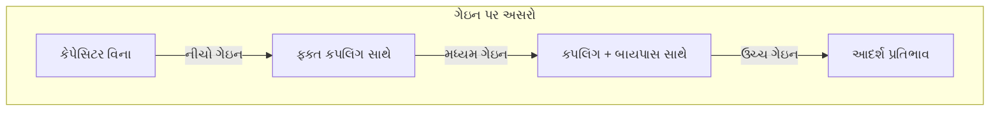

- **એમિટર બાયપાસ કેપેસિટર**:
  - **વિના**: નેગેટિવ ફીડબેકને કારણે ઓછો ગેઇન
  - **સાથે**: AC સિગ્નલ માટે RE બાયપાસ થવાથી ઉચ્ચ ગેઇન
  
- **કપલિંગ કેપેસિટર**:
  - **ખૂબ નાનું**: નબળો નીચલા-આવર્તન પ્રતિભાવ
  - **મોટું મૂલ્ય**: વધુ સારો નીચલા-આવર્તન પ્રતિભાવ

**મેમરી ટ્રીક:** "કપલિંગ નીચા નિયંત્રણ કરે, બાયપાસ બધાને વધારે"

## પ્રશ્ન 3(ક) [7 ગુણ]

**ટ્રાન્ઝિસ્ટર ટુ પોર્ટ નેટવર્ક દોરો અને તેના માટે h-પેરામીટર્સનું વર્ણન કરો. હાઇબ્રિડ પરિમાણોના ફાયદા લખો.**

**જવાબ**:
બે-પોર્ટ નેટવર્ક એ h-પેરામીટર્સ (હાઇબ્રિડ પેરામીટર્સ)નો ઉપયોગ કરીને ટ્રાન્ઝિસ્ટર વર્તનનું વિશ્લેષણ કરવા માટેનું મોડેલ છે.

```goat
                i₁                 i₂
                →                  ←
                |                  |
     +----------+------------------+---------+
     |          |                  |         |
     |          |                  |         |
 v₁  |    +-----+------+    +-----+------+   |
 ↓   |    |     |      |    |     |      |   |
     |    |  Two-Port  |    |     ↓      |   |
     +----+   Network  +----+     v₂     +---+
     |    |            |    |            |   |
     |    |            |    |            |   |
     |    +------------+    +------------+   |
     |                                       |
     +---------------------------------------+
```

| H-પેરામીટર | વ્યાખ્યા | ભૌતિક અર્થ |
|-------------|------------|------------------|
| **h₁₁ (hᵢₑ)** | આઉટપુટ શોર્ટ-સર્કિટેડ સાથે ઇનપુટ ઇમ્પીડન્સ | બેઝ-એમિટર રેઝિસ્ટન્સ |
| **h₁₂ (hᵣₑ)** | ઇનપુટ ઓપન-સર્કિટેડ સાથે રિવર્સ વોલ્ટેજ ગેઇન | આઉટપુટથી ઇનપુટ તરફ ફીડબેક |
| **h₂₁ (hfₑ)** | આઉટપુટ શોર્ટ-સર્કિટેડ સાથે ફોરવર્ડ કરંટ ગેઇન | કરંટ ગેઇન (β) |
| **h₂₂ (hoₑ)** | ઇનપુટ ઓપન-સર્કિટેડ સાથે આઉટપુટ એડમિટન્સ | આઉટપુટ કન્ડકટન્સ |

**H-પેરામીટર્સના ફાયદા:**

- **સરળતાથી માપી શકાય**: સરળ સર્કિટ્સ સાથે સીધા માપન
- **મિશ્રિત એકમો**: વોલ્ટેજ અને કરંટના ગુણોત્તરનો ઉપયોગ કરે છે
- **મોડેલ ચોકસાઈ**: ટ્રાન્ઝિસ્ટર વર્તનની નજીકની એપ્રોક્સિમેશન
- **ગાણિતિક સરળતા**: વિશ્લેષણ માટે લીનિયર સમીકરણો

**મેમરી ટ્રીક:** "ઇનપુટ, રિવર્સ, ફોરવર્ડ, આઉટપુટ - IRFO પેરામીટર્સ"

## પ્રશ્ન 3(અ) અથવા [3 ગુણ]

**એમ્પ્લીફાયરનો ફ્રીક્વન્સી રિસ્પોન્સ દોરો અને પ્રતિસાદ પર એમ્પ્લીફાયરની અપર કટ-ઓફ ફ્રીક્વન્સી, લોઅર કટ-ઓફ ફ્રીક્વન્સી, બેન્ડવિડ્થ અને મિડ ફ્રીક્વન્સી ગેઇન સૂચવો.**

**જવાબ**:
ફ્રીક્વન્સી રિસ્પોન્સ ગ્રાફ એમ્પ્લીફાયર માટે આવર્તન સાથે ગેઇન કેવી રીતે બદલાય છે તે બતાવે છે.

```goat
    Gain(dB)
       ↑
       |                Mid-frequency gain
       |    ┌─────────────────────────────┐
       |    │                             │
  0.707×Av -+                             +-
       |   /│                             │\
       |  / │                             │ \
       | /  │                             │  \
       |/   │                             │   \
       +────┴─────────────────────────────┴────→ Frequency(log scale)
          f₁                              f₂
          │                               │
          │←───────── Bandwidth ─────────→│
          │                               │
     Lower cutoff                    Upper cutoff
     frequency                       frequency
```

- **મિડ-ફ્રીક્વન્સી ગેઇન (Av)**: સપાટ ક્ષેત્રમાં મહત્તમ ગેઇન
- **લોઅર કટ-ઓફ ફ્રીક્વન્સી (f₁)**: આવર્તન જ્યાં ગેઇન 0.707×Av (-3dB) સુધી ઘટે છે
- **અપર કટ-ઓફ ફ્રીક્વન્સી (f₂)**: આવર્તન જ્યાં ગેઇન 0.707×Av (-3dB) સુધી ઘટે છે
- **બેન્ડવિડ્થ**: અપર અને લોઅર કટ-ઓફ આવર્તનો વચ્ચેનો તફાવત (f₂ - f₁)

**મેમરી ટ્રીક:** "લોઅર બેન્ડવિડ્થ અપર એમ્પ્લીફાયર પ્રતિસાદ બનાવે"

## પ્રશ્ન 3(બ) અથવા [4 ગુણ]

**ટ્યુન કરેલ એમ્પ્લીફાયર તરીકે ઉપયોગમાં લેવાતા ટ્રાન્ઝિસ્ટરનું વર્ણન કરો.**

**જવાબ**:
ટ્યુન્ડ એમ્પ્લીફાયર ચોક્કસ આવર્તનો પર સિગ્નલને પસંદગીપૂર્વક એમ્પ્લિફાય કરવા માટે LC રેઝોનન્ટ સર્કિટનો ઉપયોગ કરે છે.

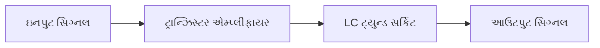

| ઘટક | કાર્ય |
|-----------|----------|
| **LC ટેન્ક સર્કિટ** | ચોક્કસ આવર્તન પર રેઝોનેટ કરે છે |
| **ટ્રાન્ઝિસ્ટર** | એમ્પ્લિફિકેશન પ્રદાન કરે છે |
| **રેઝોનન્સ આવર્તન** | f = 1/(2π√LC) |
| **ક્વોલિટી ફેક્ટર (Q)** | બેન્ડવિડ્થ નક્કી કરે છે |

- **ઉચ્ચ પસંદગી**: રેઝોનન્ટ આવર્તન પર સિગ્નલ એમ્પ્લિફાય કરે છે
- **એપ્લિકેશન્સ**: RF રિસીવર્સ, ટ્રાન્સમિટર્સ, કમ્યુનિકેશન્સ
- **પ્રકારો**: સિંગલ-ટ્યુન્ડ, ડબલ-ટ્યુન્ડ, સ્ટેગર-ટ્યુન્ડ
- **બેન્ડવિડ્થ**: Q ફેક્ટરના વ્યસ્ત પ્રમાણમાં

**મેમરી ટ્રીક:** "ટ્યુનિંગ LC સિગ્નલ્સ ચોકસાઈથી પસંદ કરે"

## પ્રશ્ન 3(ક) અથવા [7 ગુણ]

**બે પોર્ટ નેટવર્કમાં h પરિમાણોનું મહત્વ વર્ણવો. CE એમ્પ્લીફાયર માટે h-પેરામીટર્સ સર્કિટ દોરો.**

**જવાબ**:
H-પેરામીટર્સ ટ્રાન્ઝિસ્ટર સર્કિટ્સને બે-પોર્ટ નેટવર્ક તરીકે વિશ્લેષણ કરવા માટે સંપૂર્ણ ગાણિતિક મોડેલ પ્રદાન કરે છે.

**h-પેરામીટર્સનું મહત્વ:**

| પાસું | મહત્વ |
|--------|------------|
| **સર્કિટ વિશ્લેષણ** | જટિલ સર્કિટ્સ માટે સરળીકૃત સમીકરણો |
| **ડિઝાઇન ગણતરીઓ** | ગેઇન, ઇનપુટ/આઉટપુટ ઇમ્પીડન્સની આગાહી |
| **મેન્યુફેક્ચરર સ્પેક્સ** | ટ્રાન્ઝિસ્ટર લક્ષણો નિર્દિષ્ટ કરવાની માનક રીત |
| **સ્થિરતા વિશ્લેષણ** | સ્થિરતા શરતો નક્કી કરો |
| **આવર્તન પર આધાર** | આવર્તનો પર વર્તણૂકનું મોડેલ |

**CE એમ્પ્લીફાયર h-પેરામીટર સમતુલ્ય સર્કિટ:**

```goat
        +-------+      RC
        |       |      ┌─┐
    ┌─┐ |       |   ┌──┘ └──┐
   IB─→ |       |   |       |
        |       |   |       +---o Vout
Vin o───┤   hie  hre×Vce    |
        |       |   |       |
        |       |   |   hoe |
        |  hfe×ib   |       |
        |       |   |       |
        +-------+   +-------+
            |           |
            └───────────┘
                 GND
```

- **hie**: ઇનપુટ ઇમ્પીડન્સ (બેઝ-એમિટર રેઝિસ્ટન્સ)
- **hre**: રિવર્સ વોલ્ટેજ ફીડબેક રેશિયો
- **hfe**: ફોરવર્ડ કરંટ ગેઇન (β)
- **hoe**: આઉટપુટ એડમિટન્સ

**મેમરી ટ્રીક:** "ઇનપુટ રેઝિસ્ટન્સ, ફીડબેક રેશિયો, ફોરવર્ડ ગેઇન, આઉટપુટ કન્ડક્ટન્સ"

## પ્રશ્ન 4(અ) [3 ગુણ]

**જરૂરી ડાયાગ્રામ સાથે ડાયોડ ક્લિપર સર્કિટનું વર્ણન કરો.**

**જવાબ**:
ક્લિપર સર્કિટ ઇનપુટ સિગ્નલના તે ભાગને મર્યાદિત કરે છે અથવા કાપી નાખે છે જે ચોક્કસ વોલ્ટેજ લેવલથી વધી જાય છે.

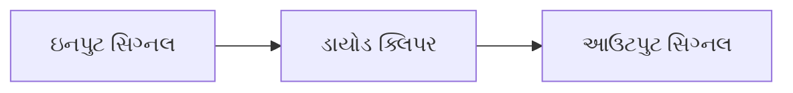

```goat
    ઇનપુટ               આઉટપુટ
     o─────┬───────────────o
           |
           |    D1
           ├────▶|─────┐
           |          ─┴─
           R           V
           |           │
           └───────────┘
              ગ્રાઉન્ડ
```

- **ઓપરેશન**: ડાયોડ વોલ્ટેજ થ્રેશોલ્ડથી વધી જાય ત્યારે કન્ડક્ટ કરે છે
- **પ્રકારો**:
  - **પોઝિટિવ ક્લિપર**: પોઝિટિવ હાફ-સાયકલ્સ ક્લિપ કરે છે
  - **નેગેટિવ ક્લિપર**: નેગેટિવ હાફ-સાયકલ્સ ક્લિપ કરે છે
  - **બાયસ્ડ ક્લિપર**: શૂન્ય સિવાયના વોલ્ટેજ લેવલ પર ક્લિપ કરે છે

**મેમરી ટ્રીક:** "નિશ્ચિત પોઈન્ટ પર ભાગોને કાપી નાખે"

## પ્રશ્ન 4(બ) [4 ગુણ]

**LDR પર ટૂંકી નોંધ સમજાવો.**

**જવાબ**:
LDR (લાઇટ ડિપેન્ડન્ટ રેઝિસ્ટર) એ ફોટોરેઝિસ્ટર છે જેનો રેઝિસ્ટન્સ પ્રકાશની તીવ્રતા વધવાથી ઘટે છે.


| ગુણધર્મ | વર્ણન |
|----------|-------------|
| **રચના** | કેડમિયમ સલ્ફાઇડ (CdS) અથવા કેડમિયમ સેલેનાઇડ (CdSe) |
| **રેઝિસ્ટન્સ રેન્જ** | 1MΩ (અંધકાર) થી થોડા KΩ (તેજ પ્રકાશ) |
| **પ્રતિસાદ સમય** | સામાન્ય રીતે 10-100ms |
| **સ્પેક્ટ્રલ પ્રતિસાદ** | દૃશ્યમાન સ્પેક્ટ્રમમાં શ્રેષ્ઠ સંવેદનશીલતા |

- **પ્રકાશનું શોષણ**: મુક્ત વાહકો ઉત્પન્ન કરે છે
- **રેઝિસ્ટન્સ**: પ્રકાશની તીવ્રતાના વ્યસ્ત પ્રમાણમાં
- **એપ્લિકેશન્સ**: લાઇટ સેન્સર, ઓટોમેટિક લાઇટિંગ, કેમેરા એક્સપોઝર કંટ્રોલ
- **સિમ્બોલ**: અંદર પોઇન્ટિંગ એરો સાથે વેરિએબલ રેઝિસ્ટર

**મેમરી ટ્રીક:** "પ્રકાશ રેઝિસ્ટન્સ ઘટાડે"

## પ્રશ્ન 4(ક) [7 ગુણ]

**ડાર્લિંગ્ટન જોડી અને તેની એપ્લિકેશનો સમજાવો.**

**જવાબ**:
ડાર્લિંગ્ટન જોડીમાં બે ટ્રાન્ઝિસ્ટર એવી રીતે જોડાયેલા હોય છે કે પ્રથમ દ્વારા એમ્પ્લિફાઇડ કરેલો કરંટ બીજા દ્વારા વધુ એમ્પ્લિફાય થાય છે.

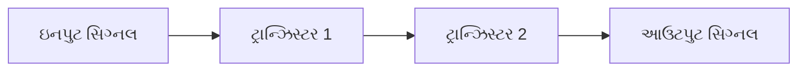

```goat
             +Vcc
               │
               │
               R
               │
               │
    બેઝ o──────┴───┐
               |   |
               |   |  કલેક્ટર
               |   +-------o
               |   |
               |   |
               └─┬─┘
                 │
                 └─┐
               |   |
               |   | 
               |   |
               └─┬─┘
                 │
                 │
                GND
```

| લક્ષણ | વર્ણન |
|----------------|-------------|
| **કરંટ ગેઇન** | β_total = β₁ × β₂ (ખૂબ ઊંચો) |
| **ઇનપુટ ઇમ્પીડન્સ** | ખૂબ ઊંચું (β₂ × R_e1) |
| **આઉટપુટ ઇમ્પીડન્સ** | નીચું |
| **સ્વિચિંગ સ્પીડ** | સિંગલ ટ્રાન્ઝિસ્ટર કરતાં ધીમી |

**એપ્લિકેશન્સ:**

- **પાવર એમ્પ્લીફાયર**: ઉચ્ચ કરંટ ગેઇન એપ્લિકેશન્સ
- **ઓડિયો એમ્પ્લીફાયર**: ઉચ્ચ ઇનપુટ ઇમ્પીડન્સ સ્ટેજ
- **બફર સર્કિટ્સ**: લોડિંગ ઇફેક્ટ્સ ઘટાડવા
- **મોટર કંટ્રોલ**: ઉચ્ચ-કરંટ લોડ ચલાવવા
- **ટચ સેન્સિટિવ સ્વિચ**: ઉચ્ચ ગેઇનને કારણે ઉચ્ચ સંવેદનશીલતા

**મેમરી ટ્રીક:** "બમણા ટ્રાન્ઝિસ્ટર ખૂબ વધારે એમ્પ્લિફાય કરે"

## પ્રશ્ન 4(અ) અથવા [3 ગુણ]

**જરૂરી ડાયાગ્રામ સાથે ડાયોડ ક્લેમ્પર સર્કિટનું વર્ણન કરો.**

**જવાબ**:
ક્લેમ્પર સર્કિટ સમગ્ર વેવફોર્મને તેના આકારને બદલ્યા વિના DC ઘટક ઉમેરીને ઉપર અથવા નીચે શિફ્ટ કરે છે.


```goat
    ઇનપુટ         D           આઉટપુટ
     o─────┬─────|◄──────┬─────o
           |            ─┴─
           C             │
           |             R
           └─────────────┘
              ગ્રાઉન્ડ
```

- **ઓપરેશન**: કેપેસિટર એક હાફ-સાયકલ દરમિયાન ચાર્જ થાય છે, DC લેવલ જાળવે છે
- **પ્રકારો**:
  - **પોઝિટિવ ક્લેમ્પર**: વેવફોર્મને ઉપર શિફ્ટ કરે છે
  - **નેગેટિવ ક્લેમ્પર**: વેવફોર્મને નીચે શિફ્ટ કરે છે
  - **બાયસ્ડ ક્લેમ્પર**: ચોક્કસ DC લેવલ પર શિફ્ટ કરે છે

**મેમરી ટ્રીક:** "પીક્સને સતત નીચે જકડે"

## પ્રશ્ન 4(બ) અથવા [4 ગુણ]

**OLED નું કાર્ય અને એપ્લિકેશન સમજાવો.**

**જવાબ**:
OLED (ઓર્ગેનિક લાઇટ એમિટિંગ ડાયોડ) એ ડિસ્પ્લે ટેકનોલોજી છે જે ઓર્ગેનિક કમ્પાઉન્ડનો ઉપયોગ કરે છે જે ઇલેક્ટ્રિક કરંટ પસાર થવાથી પ્રકાશ ઉત્સર્જિત કરે છે.


| લેયર | કાર્ય |
|-------|----------|
| **કેથોડ** | ઇલેક્ટ્રોન્સ ઇન્જેક્ટ કરે છે |
| **એમિસિવ લેયર** | ઓર્ગેનિક મટિરિયલ જે પ્રકાશ ઉત્સર્જિત કરે છે |
| **કન્ડક્ટિવ લેયર** | એનોડથી હોલ્સ વહન કરે છે |
| **એનોડ** | હોલ્સ ઇન્જેક્ટ કરે છે (સામાન્ય રીતે પારદર્શક) |

- **કાર્ય સિદ્ધાંત**: ઇલેક્ટ્રોન-હોલ રિકોમ્બિનેશન ફોટોન્સ બનાવે છે
- **સ્વ-પ્રકાશિત**: LCD ની વિપરીત બેકલાઇટની જરૂર નથી
- **પ્રકારો**: PMOLED (પેસિવ મેટ્રિક્સ) અને AMOLED (એક્ટિવ મેટ્રિક્સ)
- **ફાયદાઓ**: પાતળા, હલકા, વિશાળ દ્રશ્ય કોણ, વધુ સારો કોન્ટ્રાસ્ટ

**એપ્લિકેશન્સ:**

- સ્માર્ટફોન અને ટેબ્લેટ
- ટેલિવિઝન સ્ક્રીન
- ડિજિટલ કેમેરા ડિસ્પ્લે
- વેરેબલ ડિવાઇસ
- લાઇટિંગ પેનલ

**મેમરી ટ્રીક:** "ઓર્ગેનિક લેયર્સ ડાયોડ-પ્રકાશ ઉત્સર્જિત કરે"

## પ્રશ્ન 4(ક) અથવા [7 ગુણ]

**રિલે ડ્રાઇવર તરીકે વપરાતા ટ્રાન્ઝિસ્ટરનું વર્ણન કરો.**

**જવાબ**:
રિલે ડ્રાઇવર એક ટ્રાન્ઝિસ્ટરનો ઉપયોગ કરીને રિલેને નિયંત્રિત કરે છે, જે ઓછા-કરંટ કંટ્રોલ સિગ્નલને ઉચ્ચ-કરંટ લોડ સ્વિચ કરવાની મંજૂરી આપે છે.

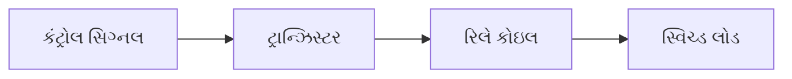

```goat
    +Vcc
     │
     ┌┐
    ┌┘└┐ રિલે
    │  │ કોઇલ
    └┐┌┘
     ││
     ││    ફ્લાયબેક
     ││    ડાયોડ
     ││    ┌─┐
     └┴────┤<├─┐
           └─┘ │
            ┌──┴─┐
            │    │
            │    │ ટ્રાન્ઝિસ્ટર
 ઇનપુટ ──────┤    │
            │    │
            └────┘
              │
             GND
```

| ઘટક | કાર્ય |
|-----------|----------|
| **ટ્રાન્ઝિસ્ટર** | રિલે ચલાવવા માટે કંટ્રોલ સિગ્નલને એમ્પ્લિફાય કરે છે |
| **ફ્લાયબેક ડાયોડ** | બેક EMF થી ટ્રાન્ઝિસ્ટરને સુરક્ષિત કરે છે |
| **બેઝ રેઝિસ્ટર** | બેઝ કરંટ મર્યાદિત કરે છે |
| **રિલે કોઇલ** | ઇલેક્ટ્રોમેગ્નેટિક સ્વિચ |

**એપ્લિકેશન્સ:**

- મોટર કંટ્રોલ સર્કિટ્સ
- ઔદ્યોગિક ઓટોમેશન
- ઓટોમોટિવ ઇલેક્ટ્રોનિક્સ
- હોમ એપ્લાયન્સ કંટ્રોલ
- પાવર ડિસ્ટ્રિબ્યુશન સિસ્ટમ

**મેમરી ટ્રીક:** "નાનું મોટા રિલે ચલાવે"

## પ્રશ્ન 5(અ) [3 ગુણ]

**LM317 IC નો ઉપયોગ કરીને વેરિયેબલ પાવર સપ્લાયનો સર્કિટ ડાયાગ્રામ દોરો.**

**જવાબ**:
LM317 એક એડજસ્ટેબલ વોલ્ટેજ રેગ્યુલેટર છે જેનો ઉપયોગ વેરિયેબલ પાવર સપ્લાય બનાવવા માટે થઈ શકે છે.

```goat
               LM317
    ઇનપુટ      ┌───┐
    o─────────┤IN │
              │   │
              │ADJ├─┬─────┬───o આઉટપુટ
              │   │ │     │
              └───┘ │     │
                │   │     │
                R1  R2    C2
                │   │     │
                └───┴─────┘
                    GND
```

- **ઘટકો**:
  - **LM317**: એડજસ્ટેબલ વોલ્ટેજ રેગ્યુલેટર IC
  - **R1**: ફિક્સ્ડ 240Ω રેઝિસ્ટર
  - **R2**: વેરિયેબલ રેઝિસ્ટર (પોટેન્શિયોમીટર)
  - **C1, C2**: ફિલ્ટર કેપેસિટર
  
- **આઉટપુટ વોલ્ટેજ**: VOUT = 1.25 × (1 + R2/R1)

**મેમરી ટ્રીક:** "LM317 વોલ્ટેજ એડજસ્ટેબલ બનાવે"

## પ્રશ્ન 5(બ) [4 ગુણ]

**યુપીએસની કામગીરી સમજાવો.**

**જવાબ**:
UPS (અનઇન્ટરપ્ટિબલ પાવર સપ્લાય) મુખ્ય પાવર ફેઇલ થાય ત્યારે ઇમરજન્સી પાવર પ્રદાન કરે છે.

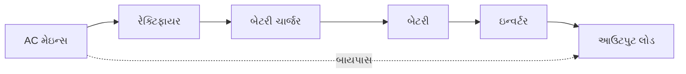

| UPS પ્રકાર | ઓપરેશન |
|----------|-----------|
| **ઓફલાઇન/સ્ટેન્ડબાય** | પાવર ફેઇલ થાય ત્યારે બેટરી પર સ્વિચ કરે છે |
| **લાઇન-ઇન્ટરેક્ટિવ** | વોલ્ટેજ રેગ્યુલેટ કરે છે અને બેટરી પર સ્વિચ કરે છે |
| **ઓનલાઇન/ડબલ-કન્વર્ઝન** | હંમેશા બેટરીથી પાવર આપે છે, સતત ચાર્જ થાય છે |

- **મુખ્ય ઘટકો**: રેક્ટિફાયર, બેટરી, ઇન્વર્ટર, કંટ્રોલ સર્કિટ
- **કાર્યો**:
  - પાવર કન્ડિશનિંગ
  - વોલ્ટેજ રેગ્યુલેશન
  - સર્જ પ્રોટેક્શન
  - બેટરી બેકઅપ

**મેમરી ટ્રીક:** "અવિરત પાવર બ્લેકઆઉટ દરમિયાન આપે"

## પ્રશ્ન 5(ક) [7 ગુણ]

**SMPS બ્લોક ડાયાગ્રામ દોરો અને સમજાવો.**

**જવાબ**:
SMPS (સ્વિચ મોડ પાવર સપ્લાય) ઇલેક્ટ્રિકલ પાવરને કુશળતાથી રૂપાંતરિત કરવા માટે સ્વિચિંગ રેગ્યુલેશનનો ઉપયોગ કરે છે.

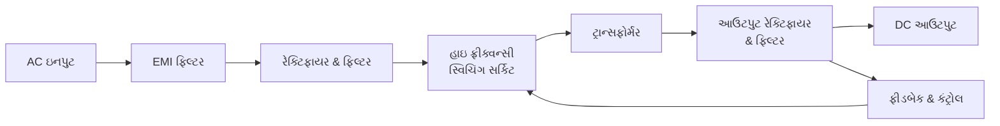

| બ્લોક | કાર્ય |
|-------|----------|
| **EMI ફિલ્ટર** | ઇલેક્ટ્રોમેગ્નેટિક ઇન્ટરફેરન્સ ઘટાડે છે |
| **રેક્ટિફાયર & ફિલ્ટર** | AC ને DC માં રૂપાંતરિત કરે છે અને સ્મૂધ કરે છે |
| **સ્વિચિંગ સર્કિટ** | DC ને ઉચ્ચ આવર્તન પર ચોપ કરે છે |
| **ટ્રાન્સફોર્મર** | આઇસોલેશન અને વોલ્ટેજ રૂપાંતરણ પ્રદાન કરે છે |
| **આઉટપુટ રેક્ટિફાયર** | ઉચ્ચ-આવર્તન AC ને પાછું DC માં રૂપાંતરિત કરે છે |
| **ફીડબેક સર્કિટ** | આઉટપુટ વોલ્ટેજ નિયંત્રિત કરે છે |

- **ફાયદા**: ઉચ્ચ કાર્યક્ષમતા (70-90%), નાનું કદ, ઓછું વજન
- **ઓપરેશન**: 20-200 kHz પર PWM (પલ્સ વિડ્થ મોડ્યુલેશન)નો ઉપયોગ કરે છે
- **પ્રકારો**: ફોરવર્ડ, ફ્લાયબેક, પુશ-પુલ, હાફ બ્રિજ, ફુલ બ્રિજ
- **એપ્લિકેશન્સ**: કમ્પ્યુટર્સ, ટીવી, મોબાઇલ ચાર્જર્સ, LED ડ્રાઇવર્સ

**મેમરી ટ્રીક:** "સ્વિચ પાવરને સ્થિર બનાવે"

## પ્રશ્ન 5(અ) અથવા [3 ગુણ]

**IC નો ઉપયોગ કરીને +15 v પાવર સપ્લાય માટે સર્કિટ ડાયાગ્રામ દોરો અને ટૂંકમાં સમજાવો**

**જવાબ**:
+15V પાવર સપ્લાય 7815 વોલ્ટેજ રેગ્યુલેટર IC નો ઉપયોગ કરીને બનાવી શકાય છે.

```goat
    AC Input    Bridge     7815
      o         Rectifier   ┌───┐
    ~~~~~        ┌───┐      │   │
      o          │   ├──────┤IN │
                 │   │      │   │         +15V
                 │   │ C1   │OUT├─────────o
                 │   ├──┐   │   │    C2
                 └───┘  │   │   │    │
                        │   └───┘    │
                        │     │      │
                        └─────┴──────┘
                             GND
```

- **ઘટકો**:
  - **7815**: ફિક્સ્ડ +15V વોલ્ટેજ રેગ્યુલેટર IC
  - **બ્રિજ રેક્ટિફાયર**: AC ને પલ્સેટિંગ DC માં રૂપાંતરિત કરે છે
  - **C1**: ઇનપુટ ફિલ્ટર કેપેસિટર (1000-2200µF)
  - **C2**: આઉટપુટ ફિલ્ટર કેપેસિટર (10-100µF)

- **કાર્ય**: AC રેક્ટિફાય કરે છે, ફિલ્ટર કરે છે, પછી સ્થિર +15V DC માં રેગ્યુલેટ કરે છે

**મેમરી ટ્રીક:** "7815 Fixes Voltage To Fifteen"

## પ્રશ્ન 5(બ) અથવા [4 ગુણ]

**સૌર બેટરી ચાર્જર સર્કિટનું કાર્ય સમજાવો.**

**જવાબ**:
સોલર બેટરી ચાર્જર સૂર્યપ્રકાશને ઇલેક્ટ્રિકલ એનર્જીમાં રૂપાંતરિત કરીને બેટરીને ચાર્જ કરે છે.


| ઘટક | કાર્ય |
|-----------|----------|
| **સોલર પેનલ** | સૂર્યપ્રકાશને વીજળીમાં રૂપાંતરિત કરે છે |
| **બ્લોકિંગ ડાયોડ** | રાત્રે પેનલ મારફતે બેટરી ડિસ્ચાર્જ થતી અટકાવે છે |
| **ચાર્જ કંટ્રોલર** | ચાર્જિંગ વોલ્ટેજ અને કરંટને નિયંત્રિત કરે છે |
| **બેટરી** | ઇલેક્ટ્રિકલ એનર્જી સંગ્રહ કરે છે |

- **ઓપરેટિંગ મોડ્સ**:
  - **બલ્ક ચાર્જિંગ**: ~80% ચાર્જ થાય ત્યાં સુધી મહત્તમ કરંટ
  - **એબ્સોર્પશન**: સ્થિર વોલ્ટેજ, ઘટતો કરંટ
  - **ફ્લોટ/ટ્રિકલ**: પૂર્ણ ચાર્જ જાળવે છે
  
- **સુરક્ષા ફીચર્સ**: ઓવરચાર્જ, ઓવર-ડિસ્ચાર્જ, રિવર્સ પોલારિટી

**મેમરી ટ્રીક:** "સૂર્ય બેટરી સુરક્ષિત ચાર્જ કરે"

## પ્રશ્ન 5(ક) અથવા [7 ગુણ]

**લિનિયર રેગ્યુલેટેડ પાવર સપ્લાય સાથે સ્વિચ મોડ પાવર સપ્લાયની સરખામણી ચર્ચા કરો.**

**જવાબ**:

| પેરામીટર | લિનિયર પાવર સપ્લાય | સ્વિચ મોડ પાવર સપ્લાય |
|-----------|---------------------|--------------------------|
| **ઓપરેટિંગ સિદ્ધાંત** | સતત વોલ્ટેજ રેગ્યુલેશન | ઉચ્ચ-આવર્તન સ્વિચિંગ |
| **કાર્યક્ષમતા** | નીચી (30-40%) | ઉચ્ચ (70-90%) |
| **કદ & વજન** | મોટું અને ભારે | કોમ્પેક્ટ અને હલકું વજન |
| **ગરમી વિસર્જન** | ઉચ્ચ | નીચું |
| **આઉટપુટ નોઇઝ** | ખૂબ નીચું | ઉચ્ચ (સ્વિચિંગ નોઇઝ) |
| **પ્રતિસાદ સમય** | ઝડપી | ધીમું |
| **ઘટક સંખ્યા** | ઓછી | વધુ |
| **કિંમત** | ઓછી પાવર માટે ઓછી | ઉચ્ચ પાવર માટે ઓછી |
| **જટિલતા** | સરળ ડિઝાઇન | જટિલ ડિઝાઇન |
| **EMI** | નીચું | ઉચ્ચ (ફિલ્ટરિંગની જરૂર) |

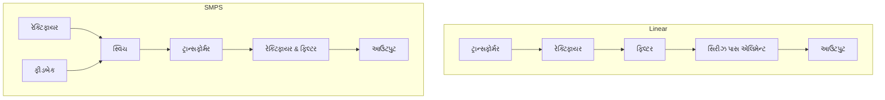

**એપ્લિકેશન્સ:**

- **લિનિયર**: ઓડિયો ઇક્વિપમેન્ટ, લેબોરેટરી ઇન્સ્ટ્રુમેન્ટ્સ, સંવેદનશીલ સર્કિટ્સ
- **SMPS**: કમ્પ્યુટર્સ, ટીવી, મોબાઇલ ચાર્જર્સ, ઔદ્યોગિક પાવર સપ્લાય

**મેમરી ટ્રીક:** "લિનિયર ઓછા નોઇઝને પસંદ કરે, સ્વિચિંગ કદ બચાવે"
