## Question 1(a) [3 marks]

**Explain thermal runaway in details.**

**Answer**:
Thermal runaway is a destructive mechanism in BJT transistors where increased temperature creates a self-reinforcing cycle leading to device failure.


- **Heat Generation**: Temperature rises from normal operation
- **Leakage Current**: Collector current Ic increases with temperature
- **Power Dissipation**: More power = Temperature rises further
- **Destructive Cycle**: Continuous cycle until transistor destroys itself

**Mnemonic:** "The Higher Temperature, The Higher Current"

## Question 1(b) [4 marks]

**Define amplifier with simple block diagram write down amplifier parameters.**

**Answer**:
An amplifier is an electronic device that increases the power, voltage or current of an input signal.

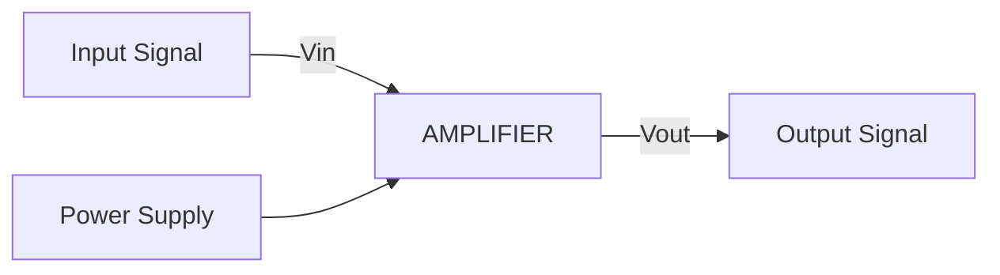

| Amplifier Parameter | Description |
|---------------------|-------------|
| **Voltage Gain (Av)** | Ratio of output voltage to input voltage |
| **Current Gain (Ai)** | Ratio of output current to input current |
| **Power Gain (Ap)** | Product of voltage gain and current gain |
| **Bandwidth** | Range of frequencies amplifier can handle |
| **Input Impedance** | Resistance seen by the input source |
| **Output Impedance** | Internal resistance of amplifier |

**Mnemonic:** "VIPS-BIO" (Voltage, Input impedance, Power, Supply, Bandwidth, Impedance Output)

## Question 1(c) [7 marks]

**Define Biasing in transistor? Write down types of biasing methods. Explain the voltage divider biasing method in details.**

**Answer**:
Biasing is the process of establishing a stable operating point (Q-point) for a transistor by applying DC voltages.

| Biasing Method | Key Features |
|----------------|-------------|
| **Fixed Bias** | Simple, poor stability |
| **Collector Feedback** | Self-adjusting, better stability |
| **Voltage Divider** | Best stability, widely used |
| **Emitter Bias** | Good stability, negative feedback |

**Voltage Divider Biasing:**

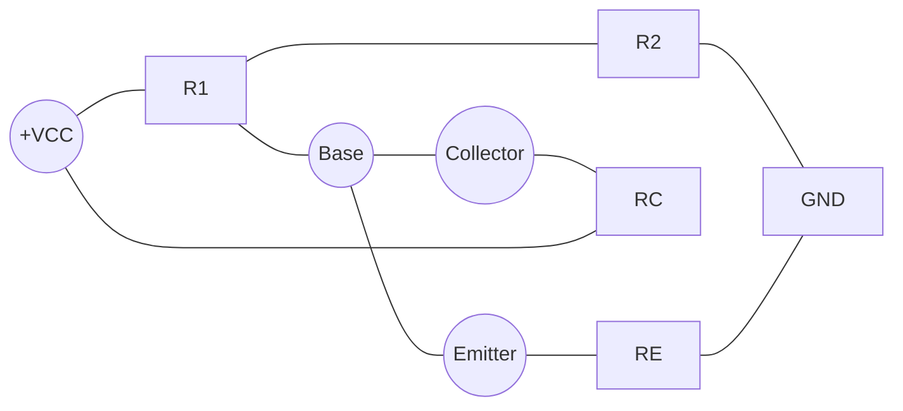

- **R1 & R2**: Form voltage divider to provide stable base voltage
- **RE**: Provides stabilization through negative feedback
- **RC**: Determines collector current and voltage gain
- **Stability**: Best stability against temperature variations

**Mnemonic:** "Divide Voltage Before Transistor Conducts"

## Question 1(c) OR [7 marks]

**Explain Heat sink.**

**Answer**:
A heat sink is a passive heat exchanger that transfers heat from electronic devices to the surrounding air.

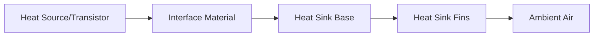

| Component | Function |
|-----------|----------|
| **Base** | Conducts heat from device |
| **Fins** | Increases surface area for heat dissipation |
| **Thermal Interface Material** | Improves contact between device and sink |
| **Types** | Extruded, Bonded, Folded, Die-cast |

- **Thermal Resistance**: Lower is better for heat dissipation
- **Material**: Usually aluminum or copper for good conductivity
- **Surface Area**: More fins means better cooling
- **Air Flow**: Critical for efficient heat removal

**Mnemonic:** "Heat Sinks Keep Transistors Running"

## Question 2(a) [3 marks]

**Describe the D.C. and A.C. Load Lines.**

**Answer**:
Load lines graphically represent possible operating points of a transistor on its characteristic curves.

```goat
                     Ic
                      ↑
                      |
                      |        DC Load Line
                      |       ╱
         Q-point      |      ╱
                      |     *
                      |    ╱  AC Load Line
                      |   ╱
                      |  ╱
                      | ╱
                      |╱
                      +----------------→ Vce
                     0                Vcc
```

- **DC Load Line**: Shows all possible operating points under DC conditions
  - **Equation**: Ic = (VCC - VCE)/RC
  - **Endpoints**: (0, VCC/RC) and (VCC, 0)

- **AC Load Line**: Shows operating points during AC signal handling
  - **Steeper Slope**: Due to AC resistance being less than DC
  - **Centered at Q-point**: The operating point established by biasing

**Mnemonic:** "DC Draws Completely, AC Alters Course"

## Question 2(b) [4 marks]

**Briefly explain bandwidth and gain-bandwidth product of an amplifier.**

**Answer**:
Bandwidth and gain-bandwidth product are key specifications for amplifier frequency performance.

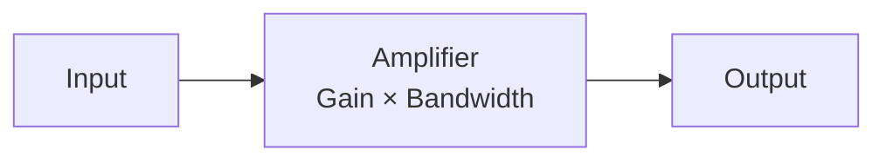

| Parameter | Description |
|-----------|-------------|
| **Bandwidth** | Frequency range where gain drops by less than 3dB |
| **Lower Cutoff (f₁)** | Frequency where gain drops by 3dB at low end |
| **Upper Cutoff (f₂)** | Frequency where gain drops by 3dB at high end |
| **Gain-Bandwidth Product** | Product of gain and bandwidth, remains constant |

- **Bandwidth Formula**: BW = f₂ - f₁
- **Gain-Bandwidth**: Remains constant when gain changes
- **Trade-off**: Higher gain means lower bandwidth

**Mnemonic:** "Better Bandwidth Gets Perfect Transmission"

## Question 2(c) [7 marks]

**Explain frequency response of two stage RC coupled amplifier.**

**Answer**:
The frequency response of a two-stage RC coupled amplifier shows how gain varies with frequency.

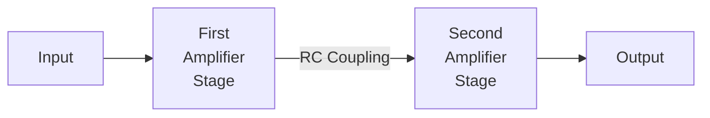

```goat
    Gain(dB)
       ↑
       |    Mid-frequency band
       |    ┌───────────────┐
       |    │               │
       |    │               │
       |   ╱│               │╲
       |  ╱ │               │ ╲
       | ╱  │               │  ╲
       |╱   │               │   ╲
       +────┴───────────────┴────→ Frequency(Hz)
          f₁                 f₂
       Low freq.         High freq.
```

- **Low Frequency Response**: Limited by coupling capacitors
  - **Roll-off Rate**: -20 dB/decade for each stage
  
- **Mid Frequency Response**: Maximum and flat gain region
  - **Total Gain**: Product of individual stage gains

- **High Frequency Response**: Limited by transistor capacitances
  - **Roll-off Rate**: -20 dB/decade for each stage

**Mnemonic:** "Low Couples Weakly, High Capacitance Blocks"

## Question 2(a) OR [3 marks]

**Explain fixed bias circuit for transistor biasing.**

**Answer**:
Fixed bias is the simplest biasing method for transistors, using a single resistor connected to the base.

```goat
        +Vcc
          |
          R
          |
          |   C
    ------+---o
    |     |
   Vin    |    RC
    |     |     |
    |     |    +Vcc
    |     |
    +-----+
      Base  Collector
          |
          E
          |
         GND
```

- **Circuit Elements**: Base resistor (RB) and collector resistor (RC)
- **Base Current**: IB = (VCC - VBE)/RB
- **Collector Current**: IC = β × IB
- **Drawbacks**: Poor stability, affected by temperature changes

**Mnemonic:** "Fix Bias, Face Burden" (of instability)

## Question 2(b) OR [4 marks]

**Explain frequency response of single stage amplifier.**

**Answer**:
The frequency response of a single-stage amplifier shows gain variation across different frequencies.

```goat
    Gain(dB)
       ↑
       |    Mid-frequency band
       |    ┌───────────────┐
       |    │               │
       |   ╱│               │╲
       |  ╱ │               │ ╲
       | ╱  │               │  ╲
       |╱   │               │   ╲
       +────┴───────────────┴────→ Frequency(Hz)
          f₁                 f₂
       Low freq.         High freq.
```

| Frequency Range | Characteristics |
|-----------------|-----------------|
| **Low frequency region** | Gain drops due to coupling capacitors |
| **Mid frequency region** | Maximum and constant gain |
| **High frequency region** | Gain decreases due to transistor capacitances |

- **Lower cutoff frequency**: Determined by coupling capacitors
- **Upper cutoff frequency**: Limited by internal transistor capacitances
- **Bandwidth**: Range between lower and upper cutoff frequencies

**Mnemonic:** "Low Middle High - Capacitors Matter Here"

## Question 2(c) OR [7 marks]

**Compare transformer coupled amplifier and RC coupled amplifier**

**Answer**:

| Parameter | RC Coupled Amplifier | Transformer Coupled Amplifier |
|-----------|----------------------|-------------------------------|
| **Coupling Element** | Resistor and capacitor | Transformer |
| **Frequency Response** | Wide bandwidth | Limited bandwidth |
| **Efficiency** | Lower (20-25%) | Higher (50-60%) |
| **Size & Weight** | Small and lightweight | Bulky and heavy |
| **Cost** | Inexpensive | Expensive |
| **Impedance Matching** | Poor matching | Excellent matching |
| **Distortion** | Low distortion | Higher due to core saturation |
| **DC Isolation** | Good isolation | Excellent isolation |
| **Applications** | General purpose | Audio power amplifiers |

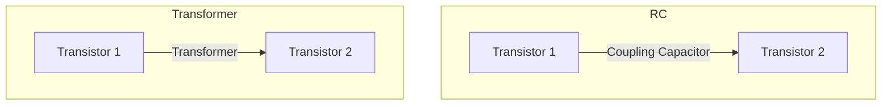

**Mnemonic:** "RC Takes Breadth, Transformer Takes Power"

## Question 3(a) [3 marks]

**Explain in brief Direct coupled amplifier.**

**Answer**:
A direct-coupled amplifier connects stages without coupling capacitors or transformers, allowing DC signal amplification.


- **DC Signal Handling**: Can amplify very low frequencies and DC
- **No Coupling Elements**: Output of first stage directly connects to input of next
- **Frequency Response**: Excellent low-frequency response
- **Drawbacks**: Thermal drift, bias stability issues

**Mnemonic:** "Directly Connected, Down to Complete zero frequency"

## Question 3(b) [4 marks]

**Explain effects of emitter bypass capacitor and coupling capacitor on frequency response of an amplifier.**

**Answer**:

| Capacitor | Function | Effect on Frequency Response |
|-----------|----------|------------------------------|
| **Emitter Bypass Capacitor** | Bypasses AC around RE | Increases gain at mid and high frequencies |
| **Coupling Capacitor** | Blocks DC, passes AC | Determines lower cutoff frequency |

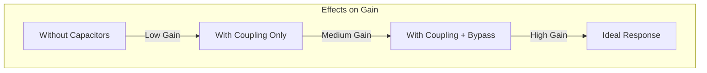

- **Emitter Bypass Capacitor**:
  - **Without**: Lower gain due to negative feedback
  - **With**: Higher gain as RE is bypassed for AC signals
  
- **Coupling Capacitor**:
  - **Too Small**: Poor low-frequency response
  - **Larger Value**: Better low-frequency response

**Mnemonic:** "Coupling Controls Lows, Bypass Boosts All"

## Question 3(c) [7 marks]

**Draw Transistor Two Port Network and describe h-parameters for it. Write down advantages of hybrid parameters.**

**Answer**:
A two-port network is a model to analyze transistor behavior using h-parameters (hybrid parameters).

```goat
                i₁                 i₂
                →                  ←
                |                  |
     +----------+------------------+---------+
     |          |                  |         |
     |          |                  |         |
 v₁  |    +-----+------+    +-----+------+   |
 ↓   |    |     |      |    |     |      |   |
     |    |  Two-Port  |    |     ↓      |   |
     +----+   Network  +----+     v₂     +---+
     |    |            |    |            |   |
     |    |            |    |            |   |
     |    +------------+    +------------+   |
     |                                       |
     +---------------------------------------+
```

| H-Parameter | Definition | Physical Meaning |
|-------------|------------|------------------|
| **h₁₁ (hᵢₑ)** | Input impedance with output short-circuited | Base-emitter resistance |
| **h₁₂ (hᵣₑ)** | Reverse voltage gain with input open-circuited | Feedback from output to input |
| **h₂₁ (hfₑ)** | Forward current gain with output short-circuited | Current gain (β) |
| **h₂₂ (hoₑ)** | Output admittance with input open-circuited | Output conductance |

**Advantages of H-Parameters:**

- **Easily Measured**: Direct measurement with simple circuits
- **Mixed Units**: Uses ratios of voltage and current
- **Model Accuracy**: Close approximation to transistor behavior
- **Mathematical Simplicity**: Linear equations for analysis

**Mnemonic:** "Input, Reverse, Forward, Output - IRFO Parameters"

## Question 3(a) OR [3 marks]

**Draw frequency response of an amplifier and indicate upper cut-off frequency, lower cut-off frequency, bandwidth, and mid frequency gain of the amplifier on the response.**

**Answer**:
The frequency response graph shows how gain varies with frequency for an amplifier.

```goat
    Gain(dB)
       ↑
       |                Mid-frequency gain
       |    ┌─────────────────────────────┐
       |    │                             │
  0.707×Av -+                             +-
       |   /│                             │\
       |  / │                             │ \
       | /  │                             │  \
       |/   │                             │   \
       +────┴─────────────────────────────┴────→ Frequency(log scale)
          f₁                              f₂
          │                               │
          │←───────── Bandwidth ─────────→│
          │                               │
     Lower cutoff                    Upper cutoff
     frequency                       frequency
```

- **Mid-frequency Gain (Av)**: Maximum gain in the flat region
- **Lower Cutoff Frequency (f₁)**: Frequency where gain drops to 0.707×Av (-3dB)
- **Upper Cutoff Frequency (f₂)**: Frequency where gain drops to 0.707×Av (-3dB)
- **Bandwidth**: The difference between upper and lower cutoff frequencies (f₂ - f₁)

**Mnemonic:** "Lower Bandwidth Upper Makes Amplifier Response"

## Question 3(b) OR [4 marks]

**Describe the transistor used as a tuned amplifier.**

**Answer**:
A tuned amplifier uses LC resonant circuits to amplify signals selectively at specific frequencies.

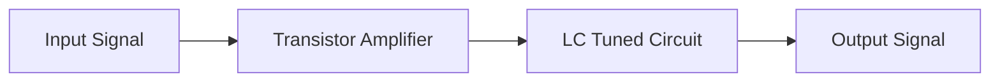

| Component | Function |
|-----------|----------|
| **LC Tank Circuit** | Resonates at specific frequency |
| **Transistor** | Provides amplification |
| **Resonance Frequency** | f = 1/(2π√LC) |
| **Quality Factor (Q)** | Determines bandwidth |

- **High Selectivity**: Amplifies signals at resonant frequency
- **Applications**: RF receivers, transmitters, communications
- **Types**: Single-tuned, double-tuned, stagger-tuned
- **Bandwidth**: Inversely proportional to Q factor

**Mnemonic:** "Tuning LC Selects Signals Precisely"

## Question 3(c) OR [7 marks]

**Describe the importance of h parameters in two port network. Draw h-parameters circuit for CE amplifier.**

**Answer**:
H-parameters provide a complete mathematical model for analyzing transistor circuits as two-port networks.

**Importance of h-parameters:**

| Aspect | Importance |
|--------|------------|
| **Circuit Analysis** | Simplified equations for complex circuits |
| **Design Calculations** | Predict gain, input/output impedance |
| **Manufacturer Specs** | Standard way to specify transistor characteristics |
| **Stability Analysis** | Determine stability conditions |
| **Frequency Dependence** | Model behavior across frequencies |

**CE Amplifier h-parameter equivalent circuit:**

```goat
        +-------+      RC
        |       |      ┌─┐
    ┌─┐ |       |   ┌──┘ └──┐
   IB─→ |       |   |       |
        |       |   |       +---o Vout
Vin o───┤   hie  hre×Vce    |
        |       |   |       |
        |       |   |   hoe |
        |  hfe×ib   |       |
        |       |   |       |
        +-------+   +-------+
            |           |
            └───────────┘
                 GND
```

- **hie**: Input impedance (base-emitter resistance)
- **hre**: Reverse voltage feedback ratio
- **hfe**: Forward current gain (β)
- **hoe**: Output admittance

**Mnemonic:** "Input Resistance, Feedback Ratio, Forward gain, Output conductance"

## Question 4(a) [3 marks]

**Describe the diode clipper circuit with necessary diagram.**

**Answer**:
A clipper circuit limits or clips off a portion of the input signal that exceeds a certain voltage level.

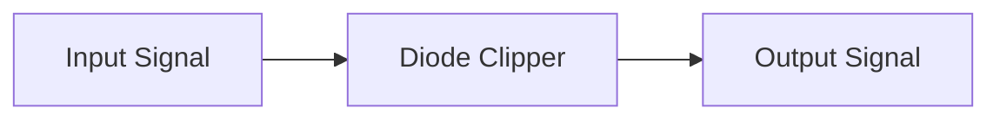

```goat
    Input                Output
     o─────┬───────────────o
           |
           |    D1
           ├────▶|─────┐
           |          ─┴─
           R           V
           |           │
           └───────────┘
              Ground
```

- **Operation**: Diode conducts when voltage exceeds threshold
- **Types**:
  - **Positive Clipper**: Clips positive half-cycles
  - **Negative Clipper**: Clips negative half-cycles
  - **Biased Clipper**: Clips at voltage level other than zero

**Mnemonic:** "Clip Portions Passing Preset Points"

## Question 4(b) [4 marks]

**Explain Short note on LDR.**

**Answer**:
LDR (Light Dependent Resistor) is a photoresistor whose resistance decreases with increasing light intensity.


| Property | Description |
|----------|-------------|
| **Composition** | Cadmium sulfide (CdS) or cadmium selenide (CdSe) |
| **Resistance Range** | 1MΩ (dark) to few KΩ (bright light) |
| **Response Time** | Typically 10-100ms |
| **Spectral Response** | Peak sensitivity in visible spectrum |

- **Light Absorption**: Generates free carriers
- **Resistance**: Inversely proportional to light intensity
- **Applications**: Light sensors, automatic lighting, camera exposure control
- **Symbol**: Variable resistor with arrow pointing inward

**Mnemonic:** "Light Decreases Resistance"

## Question 4(c) [7 marks]

**Explain Darlington pair and its applications.**

**Answer**:
A Darlington pair consists of two transistors connected so that the current amplified by the first is further amplified by the second.

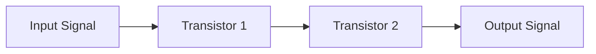

```goat
             +Vcc
               │
               │
               R
               │
               │
    Base o─────┴───┐
               |   |
               |   |  Collector
               |   +-------o
               |   |
               |   |
               └─┬─┘
                 │
                 └─┐
               |   |
               |   | 
               |   |
               └─┬─┘
                 │
                 │
                GND
```

| Characteristic | Description |
|----------------|-------------|
| **Current Gain** | β_total = β₁ × β₂ (very high) |
| **Input Impedance** | Very high (β₂ × R_e1) |
| **Output Impedance** | Low |
| **Switching Speed** | Slower than single transistor |

**Applications:**

- **Power Amplifiers**: High current gain applications
- **Audio Amplifiers**: High input impedance stages
- **Buffer Circuits**: Minimizing loading effects
- **Motor Control**: Driving high-current loads
- **Touch Sensitive Switches**: High sensitivity due to high gain

**Mnemonic:** "Double Transistors Amplify Really Greatly"

## Question 4(a) OR [3 marks]

**Describe the diode clamper circuit with necessary diagram.**

**Answer**:
A clamper circuit shifts the entire waveform up or down by adding a DC component without changing its shape.

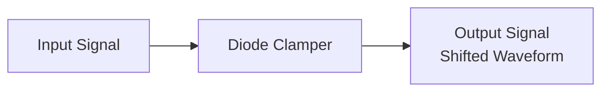

```goat
    Input         D           Output
     o─────┬─────|◄──────┬─────o
           |            ─┴─
           C             │
           |             R
           └─────────────┘
              Ground
```

- **Operation**: Capacitor charges during one half-cycle, maintaining DC level
- **Types**:
  - **Positive Clamper**: Shifts waveform upward
  - **Negative Clamper**: Shifts waveform downward
  - **Biased Clamper**: Shifts to specific DC level

**Mnemonic:** "Clamps Peaks Down Consistently"

## Question 4(b) OR [4 marks]

**Explain the working and applications of OLED.**

**Answer**:
OLED (Organic Light Emitting Diode) is a display technology using organic compounds that emit light when electric current passes through.


| Layer | Function |
|-------|----------|
| **Cathode** | Injects electrons |
| **Emissive Layer** | Organic material that emits light |
| **Conductive Layer** | Conducts holes from anode |
| **Anode** | Injects holes (usually transparent) |

- **Working Principle**: Electron-hole recombination creates photons
- **Self-illuminating**: No backlight required unlike LCD
- **Types**: PMOLED (Passive Matrix) and AMOLED (Active Matrix)
- **Advantages**: Thinner, lighter, wider viewing angles, better contrast

**Applications:**

- Smartphones and tablets
- Television screens
- Digital camera displays
- Wearable devices
- Lighting panels

**Mnemonic:** "Organic Layers Emit Diode-light"

## Question 4(c) OR [7 marks]

**Describe the transistor used as a relay driver.**

**Answer**:
A relay driver uses a transistor to control a relay, allowing a low-current control signal to switch a high-current load.


```goat
    +Vcc
     │
     ┌┐
    ┌┘└┐ Relay
    │  │ Coil
    └┐┌┘
     ││
     ││    Flyback
     ││    Diode
     ││    ┌─┐
     └┴────┤<├─┐
           └─┘ │
            ┌──┴─┐
            │    │
            │    │ Transistor
 Input ─────┤    │
            │    │
            └────┘
              │
             GND
```

| Component | Function |
|-----------|----------|
| **Transistor** | Amplifies control signal to drive relay |
| **Flyback Diode** | Protects transistor from back EMF |
| **Base Resistor** | Limits base current |
| **Relay Coil** | Electromagnetic switch |

**Applications:**

- Motor control circuits
- Industrial automation
- Automotive electronics
- Home appliance control
- Power distribution systems

**Mnemonic:** "Tiny Regulates Driving Relays"

## Question 5(a) [3 marks]

**Draw circuit diagram of a variable power supply using LM317 IC.**

**Answer**:
LM317 is an adjustable voltage regulator that can be used to create a variable power supply.

```goat
              LM317
    Input     ┌───┐
    o─────────┤IN │
              │   │
              │ADJ├─┬─────┬───o Output
              │   │ │     │
              └───┘ │     │
                │   │     │
                R1  R2    C2
                │   │     │
                └───┴─────┘
                    GND
```

- **Components**:
  - **LM317**: Adjustable voltage regulator IC
  - **R1**: Fixed 240Ω resistor
  - **R2**: Variable resistor (potentiometer)
  - **C1, C2**: Filter capacitors
  
- **Output Voltage**: VOUT = 1.25 × (1 + R2/R1)

**Mnemonic:** "LM317 Makes Voltage Adjustable"

## Question 5(b) [4 marks]

**Explain working of UPS.**

**Answer**:
UPS (Uninterruptible Power Supply) provides emergency power when main power fails.

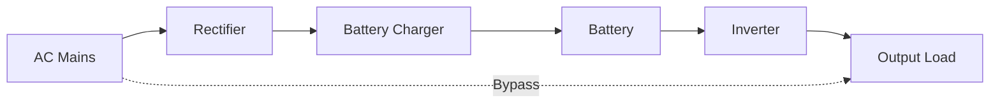

| UPS Type | Operation |
|----------|-----------|
| **Offline/Standby** | Switches to battery when power fails |
| **Line-Interactive** | Regulates voltage and switches to battery |
| **Online/Double-Conversion** | Always powers from battery, continuously charged |

- **Main Components**: Rectifier, battery, inverter, control circuit
- **Functions**:
  - Power conditioning
  - Voltage regulation
  - Surge protection
  - Battery backup

**Mnemonic:** "Uninterrupted Power Supplied During Blackouts"

## Question 5(c) [7 marks]

**Draw and explain SMPS block diagram.**

**Answer**:
SMPS (Switch Mode Power Supply) uses switching regulation to convert electrical power efficiently.

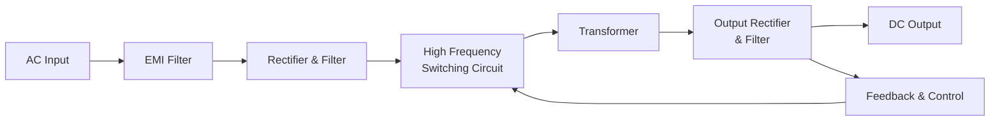

| Block | Function |
|-------|----------|
| **EMI Filter** | Reduces electromagnetic interference |
| **Rectifier & Filter** | Converts AC to DC and smooths it |
| **Switching Circuit** | Chops DC at high frequency |
| **Transformer** | Provides isolation and voltage conversion |
| **Output Rectifier** | Converts high-frequency AC back to DC |
| **Feedback Circuit** | Regulates output voltage |

- **Advantages**: High efficiency (70-90%), smaller size, lower weight
- **Operation**: Uses PWM (Pulse Width Modulation) at 20-200 kHz
- **Types**: Forward, Flyback, Push-pull, Half bridge, Full bridge
- **Applications**: Computers, TVs, mobile chargers, LED drivers

**Mnemonic:** "Switch Makes Power Stable"

## Question 5(a) OR [3 marks]

**Draw circuit diagram for +15 v Power Supply using its IC and explain in brief**

**Answer**:
A +15V power supply can be built using the 7815 voltage regulator IC.

```goat
    AC Input    Bridge     7815
      o         Rectifier   ┌───┐
    ~~~~~        ┌───┐      │   │
      o          │   ├──────┤IN │
                 │   │      │   │         +15V
                 │   │ C1   │OUT├─────────o
                 │   ├──┐   │   │    C2
                 └───┘  │   │   │    │
                        │   └───┘    │
                        │     │      │
                        └─────┴──────┘
                             GND
```

- **Components**:
  - **7815**: Fixed +15V voltage regulator IC
  - **Bridge Rectifier**: Converts AC to pulsating DC
  - **C1**: Input filter capacitor (1000-2200µF)
  - **C2**: Output filter capacitor (10-100µF)

- **Working**: Rectifies AC, filters it, then regulates to stable +15V DC

**Mnemonic:** "7815 Fixes Voltage To Fifteen"

## Question 5(b) OR [4 marks]

**Explain working of solar battery charger circuits.**

**Answer**:
Solar battery chargers convert sunlight into electrical energy to charge batteries.


| Component | Function |
|-----------|----------|
| **Solar Panel** | Converts sunlight to electricity |
| **Blocking Diode** | Prevents battery discharge through panel at night |
| **Charge Controller** | Regulates charging voltage and current |
| **Battery** | Stores electrical energy |

- **Operating Modes**:
  - **Bulk Charging**: Maximum current until ~80% charged
  - **Absorption**: Constant voltage, decreasing current
  - **Float/Trickle**: Maintains full charge
  
- **Protection Features**: Overcharge, over-discharge, reverse polarity

**Mnemonic:** "Sun Charges Batteries Safely"

## Question 5(c) OR [7 marks]

**Discuss comparison of linear regulated power supply with switch mode power supply.**

**Answer**:

| Parameter | Linear Power Supply | Switch Mode Power Supply |
|-----------|---------------------|--------------------------|
| **Operating Principle** | Continuous voltage regulation | High-frequency switching |
| **Efficiency** | Low (30-40%) | High (70-90%) |
| **Size & Weight** | Large and heavy | Compact and lightweight |
| **Heat Dissipation** | High | Low |
| **Output Noise** | Very low | Higher (switching noise) |
| **Response Time** | Fast | Slower |
| **Component Count** | Lower | Higher |
| **Cost** | Less for low power | Less for high power |
| **Complexity** | Simple design | Complex design |
| **EMI** | Low | Higher (requires filtering) |

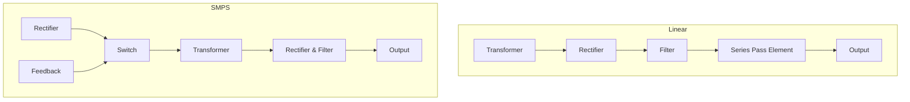

**Applications:**

- **Linear**: Audio equipment, laboratory instruments, sensitive circuits
- **SMPS**: Computers, TVs, mobile chargers, industrial power supplies

**Mnemonic:** "Linear Loves Low noise, Switching Saves Size"
