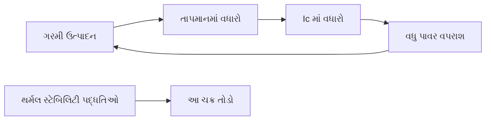
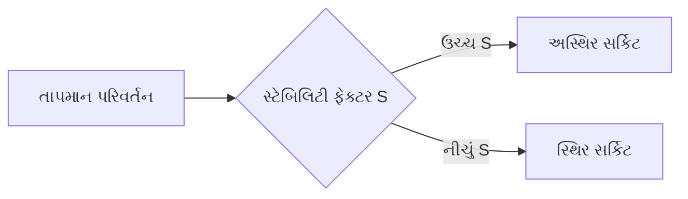
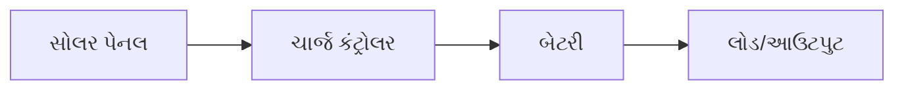
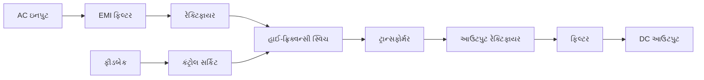

## પ્રશ્ન 1(અ) [3 માર્ક્સ]

**CE રૂપરેખાંકન માટે એમ્પ્લીફાયર પરિમાણો Ai, Ri અને Ro સમજાવો.**

**જવાબ**:
કોમન એમિટર (CE) રૂપરેખાંકનમાં, મુખ્ય પરિમાણો છે:

**આકૃતિ:**

```goat
   +Vcc
     |
     R
     |
     |C
B----|----+----Output
     |    |
     |   RC
  RB |    |
     |    |
  ---|    |---
 |   |    |   |
 |   |    |   |
 +---+----+---+
     |
     |
    GND
```

- **કરંટ ગેઇન (Ai)**: આઉટપુટ કરંટનો ઇનપુટ કરંટ સાથેનો ગુણોત્તર (Ic/Ib), સામાન્ય રીતે CE માં 50-200
- **ઇનપુટ રેઝિસ્ટન્સ (Ri)**: બેઝ ટર્મિનલ પર ઇનપુટ કરંટનો વિરોધ, CE માં 1-2kΩ
- **આઉટપુટ રેઝિસ્ટન્સ (Ro)**: કલેક્ટર ટર્મિનલ પર વિરોધ, સામાન્ય રીતે CE માં 50kΩ

**મેમરી ટ્રીક:** "CIR પરિમાણો - કરંટ ગેઇન, ઇનપુટ રેઝિસ્ટન્સ, અને આઉટપુટ રેઝિસ્ટન્સ એમ્પ્લીફાયરની કાર્યક્ષમતા નક્કી કરે છે"

## પ્રશ્ન 1(બ) [4 માર્ક્સ]

**હીટ સિંક પર ટૂંકી નોંધ લખો.**

**જવાબ**:

**આકૃતિ:**

```goat
                        Fins
            |‾‾‾|‾‾‾|‾‾‾|‾‾‾|‾‾‾|‾‾‾|‾‾‾|‾‾‾|
            |   |   |   |   |   |   |   |   |
+-----------+   |   |   |   |   |   |   |   |
| Transistor|___|___|___|___|___|___|___|___|
+-----------+
      Base
```

- **ઉદ્દેશ**: ઇલેક્ટ્રોનિક ઘટકોમાંથી થર્મલ નુકસાન રોકવા માટે વધારાની ગરમીનું વિસર્જન
- **પ્રકારો**: પેસિવ હીટ સિંક (એલ્યુમિનિયમ/કોપર ફિન્સ) અને એક્ટિવ હીટ સિંક (ફેન સાથે)
- **થર્મલ રેઝિસ્ટન્સ**: ઓછી થર્મલ રેઝિસ્ટન્સ (°C/W) વધુ સારી ગરમી વિસર્જન દર્શાવે છે
- **સામગ્રી**: કોપર (શ્રેષ્ઠ વાહકતા), એલ્યુમિનિયમ (હલકું, કિફાયતી), કમ્પોઝિટ

**મેમરી ટ્રીક:** "HARD સિંક - ગરમીને Heat Away using Radiation and Dissipation through metal sinks"

## પ્રશ્ન 1(ક) [7 માર્ક્સ]

**થર્મલ રનઅવે અને થર્મલ સ્ટેબિલિટીનું વર્ણન કરો. ટ્રાન્ઝિસ્ટરમાં થર્મલ રનઅવે કેવી રીતે દૂર કરી શકાય?**

**જવાબ**:

**આકૃતિ:**



**થર્મલ રનઅવે:**

- **વ્યાખ્યા**: સ્વ-ત્વરિત પ્રક્રિયા જ્યાં ટ્રાન્ઝિસ્ટર ગરમ થાય છે, જેનાથી વધુ કરંટ પ્રવાહ અને વધુ ગરમી થાય છે
- **કારણ**: તાપમાનમાં વધારો Ico (લીકેજ કરંટ)માં વધારો કરે છે જે Ic વધારે છે
- **પરિણામ**: જો નિયંત્રણ ન કરવામાં આવે તો ટ્રાન્ઝિસ્ટરનો અંતિમ વિનાશ

**થર્મલ સ્ટેબિલિટી:**

- **વ્યાખ્યા**: તાપમાન પરિવર્તન છતાં સ્થિર ઓપરેટિંગ પોઇન્ટ જાળવવાની ક્ષમતા
- **માપ**: સ્ટેબિલિટી ફેક્ટર (S) - ઓછા મૂલ્યો વધુ સારી સ્થિરતા દર્શાવે છે

**થર્મલ રનઅવે દૂર કરવાના ઉપાયો:**

- **હીટ સિંક્સ**: વધારાની ગરમી દૂર કરવા માટે જોડો
- **એમિટર રેઝિસ્ટર**: નકારાત્મક ફીડબેક આપવા માટે અનબાયપાસ્ડ RE શામેલ કરો
- **વોલ્ટેજ ડિવાઇડર બાયસ**: વધુ સારી સ્થિરતા માટે ફિક્સ્ડ બાયસ ને બદલે ઉપયોગ કરો
- **થર્મલ કમ્પેન્સેશન**: બાયસ સર્કિટમાં તાપમાન-સંવેદનશીલ ઘટકો ઉમેરો

**મેમરી ટ્રીક:** "SHEER સુરક્ષા - ગરમી માટે સિંક્સ, એમિટર રેઝિસ્ટર્સ, બાહ્ય કૂલિંગ, અને મજબૂત બાયસિંગ થર્મલ રનઅવે અટકાવે છે"

## પ્રશ્ન 1(ક) OR [7 માર્ક્સ]

**બાયસિંગ પદ્ધતિઓના પ્રકારો લખો. વોલ્ટેજ વિભાજક બાયસિંગ પદ્ધતિને વિગતમાં સમજાવો.**

**જવાબ**:

**બાયસિંગ પદ્ધતિઓના પ્રકારો:**

**કોષ્ટક: ટ્રાન્ઝિસ્ટર બાયસિંગ પદ્ધતિઓ**

| પદ્ધતિ | સ્થિરતા | જટિલતા |
|--------|-----------|------------|
| ફિક્સ્ડ બાયસ | નબળી | સરળ |
| કલેક્ટર ફીડબેક | મધ્યમ | મધ્યમ |
| એમિટર બાયસ | સારી | મધ્યમ |
| વોલ્ટેજ ડિવાઇડર | ઉત્તમ | જટિલ |

**વોલ્ટેજ ડિવાઇડર બાયસિંગ સર્કિટ:**

```goat
    +Vcc
      |
      R1
      |
      +----+
      |    |
      R2   C1
      |    |
      +----+---> Base
      |
      |    +----+
      |    |    |
      RE   RC   C2
      |    |    |
      +----+----+---> Output
      |
     GND
```

**વોલ્ટેજ ડિવાઇડર બાયસિંગ:**

- **સર્કિટ સ્ટ્રક્ચર**: બેઝ પર સ્થિર વોલ્ટેજ બનાવવા માટે શ્રેણીમાં બે રેઝિસ્ટર્સ (R1, R2) વાપરે છે
- **ઓપરેટિંગ સિદ્ધાંત**: R2 પર વોલ્ટેજ બેઝ બાયસ સેટ કરે છે, β વેરિએશન છતાં સ્થિર રહે છે
- **ફાયદા**: શ્રેષ્ઠ તાપમાન કોમ્પેન્સેશન સાથેની સૌથી સ્થિર બાયસિંગ તકનીક
- **સૂત્ર**: બેઝ વોલ્ટેજ VB = Vcc × (R2/(R1+R2))
- **સ્થિરતા**: કલેક્ટર કરંટથી લગભગ સ્વતંત્ર બેઝ વોલ્ટેજ સાથે ઉચ્ચ સ્થિરતા ફેક્ટર

**મેમરી ટ્રીક:** "DIVE સ્થિરતા માટે - ડિવાઇડર તાપમાન અને β વેરિએશન માટે ખૂબ અસરકારક છે"

## પ્રશ્ન 2(અ) [3 માર્ક્સ]

**સ્ટેબિલિટી ફેક્ટર અને તેની વિશેષતાઓ સમજાવો.**

**જવાબ**:

**આકૃતિ:**



- **વ્યાખ્યા**: સ્ટેબિલિટી ફેક્ટર (S) માપે છે કે લીકેજ કરંટથી કલેક્ટર કરંટ કેવી રીતે બદલાય છે
- **સૂત્ર**: S = ΔIC/ΔICBO
- **આદર્શ મૂલ્ય**: નીચું મૂલ્ય (S ≈ 1) વધુ સારી સ્થિરતા દર્શાવે છે
- **અસર કરતા પરિબળો**: બાયસિંગ સર્કિટ ડિઝાઇન, તાપમાન, અને ટ્રાન્ઝિસ્ટર પરિમાણો

**મેમરી ટ્રીક:** "LESS એટલે બેહતર - નીચા મૂલ્યો તાપમાન પરિવર્તન માટે સ્થિર સિસ્ટમ સુનિશ્ચિત કરે છે"

## પ્રશ્ન 2(બ) [4 માર્ક્સ]

**કાસ્કેડિંગની ડાયરેક્ટ કપલિંગ ટેકનિક વર્ણવો.**

**જવાબ**:

**આકૃતિ:**

```goat
     +Vcc
       |
       |
       RC1     RC2
       |       |
       +-----+ |
       |     | |
    +--+     +-+--+
    |  |     |    |
Q1  |C |    C|    | Q2
    |  |     |    |
    +--+     +-+--+
    |  |     | |
    E  |     E |
    |  |     | |
    +--+     +-+
       |       |
       RE1     RE2
       |       |
      GND     GND
```

- **વ્યાખ્યા**: પ્રથમ તબક્કાના કલેક્ટરથી બીજા તબક્કાના બેઝ સાથે સીધો જોડાણ
- **ફાયદા**: કપલિંગ ઘટકોની જરૂર નથી, ઉત્તમ નિમ્ન-આવર્તન પ્રતિસાદ
- **ગેરફાયદા**: DC લેવલ્સ મેચ કરવા જોઈએ, થર્મલ ડ્રિફ્ટ સ્ટેજ દીઠ વધે છે
- **ઉપયોગો**: DC એમ્પ્લીફાયર્સ, ઇન્ટિગ્રેટેડ સર્કિટ્સ, ઓપરેશનલ એમ્પ્લીફાયર્સ

**મેમરી ટ્રીક:** "DIAL DC માટે - કેપેસિટર વગર સીધા જોડાણ નિમ્ન આવર્તનોને એમ્પ્લિફાય કરે છે"

## પ્રશ્ન 2(ક) [7 માર્ક્સ]

**બે તબક્કાના RC કપલ્ડ એમ્પ્લીફાયરનો આવર્તન પ્રતિભાવ સમજાવો.**

**જવાબ**:

**ફ્રીક્વન્સી રિસ્પોન્સ કર્વ:**

```goat
    Gain (dB)
    ^
    |                 ___________
    |                /           \
    |               /             \
    |              /               \
    |             /                 \
    |------------/                   \---->Frequency
               f1                    f2
        Low frequency    Mid frequency    High frequency
          region           region          region
```

**બે-તબક્કાનો RC કપલ્ડ એમ્પ્લીફાયર:**

- **સર્કિટ સ્ટ્રક્ચર**: કપલિંગ કેપેસિટર્સ દ્વારા જોડાયેલ બે ટ્રાન્ઝિસ્ટર એમ્પ્લીફાયર્સ
- **નિમ્ન-આવર્તન પ્રતિસાદ (f < f1)**: કપલિંગ અને બાયપાસ કેપેસિટરની અસરોને કારણે ગેઇન ઘટે છે
- **મધ્ય-આવર્તન પ્રતિસાદ (f1 < f < f2)**: મહત્તમ ગેઇન ક્ષેત્ર, સપાટ પ્રતિસાદ
- **ઉચ્ચ-આવર્તન પ્રતિસાદ (f > f2)**: આંતરિક કેપેસિટન્સ અને મિલર ઇફેક્ટને કારણે ગેઇન ઘટે છે
- **બેન્ડવિડ્થ**: નીચલા કટઓફ (f1) અને ઉપલા કટઓફ (f2) આવર્તન વચ્ચેની રેન્જ
- **કુલ ગેઇન**: વ્યક્તિગત સ્ટેજ ગેઇનનો ગુણાકાર ઓછા કપલિંગ નુકસાન

**મેમરી ટ્રીક:** "LMH આવર્તન ક્ષેત્રો - નિમ્નમાં વધતો ગેઇન, મધ્યમાં સપાટ ગેઇન, ઉચ્ચમાં ઘટતો ગેઇન"

## પ્રશ્ન 2(અ) OR [3 માર્ક્સ]

**એમ્પ્લીફાયરની બેન્ડવિડ્થ અને ગેઇન-બેન્ડવિડ્થ ઉત્પાદનને સંક્ષિપ્તમાં સમજાવો.**

**જવાબ**:

**આકૃતિ:**

```goat
    Gain (dB)
    ^
    |     _______________
    |    /|              \
    |   / |               \
    |  /  |                \
    | /   |                 \
    |/    |                  \
    +-----|------------------|-----> Frequency
          f1                 f2
          |<---Bandwidth---->|
```

- **બેન્ડવિડ્થ**: નીચલા (f1) અને ઉપલા (f2) કટઓફ આવર્તનો વચ્ચેનો આવર્તન રેન્જ જ્યાં ગેઇન મહત્તમનો ઓછામાં ઓછો 70.7% હોય છે
- **સૂત્ર**: બેન્ડવિડ્થ = f2 - f1 (Hz માં માપવામાં આવે છે)
- **ગેઇન-બેન્ડવિડ્થ ઉત્પાદન**: આપેલા એમ્પ્લીફાયર માટે ગેઇન ગુણાકાર બેન્ડવિડ્થનું અચળ મૂલ્ય
- **મહત્વ**: એમ્પ્લીફાયર કાર્યક્ષમતાની મૂળભૂત મર્યાદાને દર્શાવે છે

**મેમરી ટ્રીક:** "BIG મૂલ્ય - બેન્ડવિડ્થ અને ગેઇન વચ્ચે વિપરીત સંબંધ અચળ છે"

## પ્રશ્ન 2(બ) OR [4 માર્ક્સ]

**એમ્પ્લીફાયરના ફ્રીક્વન્સી રિસ્પોન્સ પર એમિટર બાયપાસ કેપેસિટર અને કપલિંગ કેપેસિટરની અસરો સમજાવો.**

**જવાબ**:

**કોષ્ટક: કેપેસિટરની ફ્રીક્વન્સી રિસ્પોન્સ પર અસરો**

| Capacitor Type | Low Frequency | Mid Frequency | High Frequency |
|----------------|---------------|---------------|----------------|
| Emitter Bypass | Affects gain | Full bypass | No effect |
| Coupling | Blocks signal | Full coupling | No effect |

**કેપેસિટરની અસરો:**

**એમિટર બાયપાસ કેપેસિટર:**

- **હેતુ**: ગેઇન વધારવા માટે એમિટર રેઝિસ્ટરને બાયપાસ કરે છે
- **નિમ્ન આવર્તન**: ઉચ્ચ ઇમ્પિડન્સ તરીકે કાર્ય કરે છે, ગેઇન ઘટાડે છે
- **સૂત્ર**: Xc = 1/(2πfC) નિમ્ન આવર્તન પર વધે છે
- **કટઓફ અસર**: RE સાથે નીચલી કટઓફ આવર્તન સેટ કરે છે

**કપલિંગ કેપેસિટર:**

- **હેતુ**: DC બ્લોક કરે છે, તબક્કાઓ વચ્ચે AC સિગ્નલની મંજૂરી આપે છે
- **નિમ્ન આવર્તન**: ઉચ્ચ રિએક્ટન્સ સિગ્નલ ટ્રાન્સફર અવરોધે છે
- **પ્રતિસાદ અસર**: મોટી કેપેસિટન્સ નિમ્ન-આવર્તન પ્રતિસાદ સુધારે છે
- **ફેઝ શિફ્ટ**: નિમ્ન આવર્તનોએ ફેઝ શિફ્ટ ઉત્પન્ન કરે છે

**મેમરી ટ્રીક:** "CABLE અસર - કેપેસિટર્સ નિમ્ન આવર્તન પર અવરોધ તરીકે કાર્ય કરે છે, ઉચ્ચ આવર્તન પર સુધારો કરે છે"

## પ્રશ્ન 2(ક) OR [7 માર્ક્સ]

**ટ્રાન્સફોર્મર કપલ્ડ એમ્પ્લીફાયર અને RC કપલ્ડ એમ્પ્લીફાયરની સરખામણી કરો.**

**જવાબ**:

**કોષ્ટક: ટ્રાન્સફોર્મર કપલ્ડ અને RC કપલ્ડ એમ્પ્લીફાયર્સની સરખામણી**

| પરિમાણ | ટ્રાન્સફોર્મર કપલ્ડ | RC કપલ્ડ |
|-----------|---------------------|------------|
| કપલિંગ ઘટક | ટ્રાન્સફોર્મર | કેપેસિટર અને રેઝિસ્ટર |
| કાર્યક્ષમતા | ઉચ્ચ (90%) | નીચી (30-50%) |
| આવર્તન પ્રતિસાદ | મર્યાદિત, છેડાઓ પર નબળો | વિશાળ, નિમ્ન આવર્તન પર વધુ સારો |
| કદ અને વજન | મોટું, ભારે | કોમ્પેક્ટ, હલકું |
| ખર્ચ | ઊંચો | નીચો |
| ઇમ્પિડન્સ મેચિંગ | ઉત્તમ | નબળું |
| વિકૃતિ | નીચી | ઊંચી |
| DC આઇસોલેશન | સંપૂર્ણ | સારું |

**આકૃતિ સરખામણી:**

```
ટ્રાન્સફોર્મર કપલ્ડ             RC કપલ્ડ
    +Vcc                           +Vcc
      |                              |
      RC                             RC
      |                              |
      +-----|OOOO|-----+             +------||------+
      |     |OOOO|     |             |      CC      |
      C     |OOOO|     C             C              C
      |                |             |              |
      +                +             +              +
      |                |             |              |
     GND              GND           GND            GND
```

**મેમરી ટ્રીક:** "TREE પરિબળો - ટ્રાન્સફોર્મર્સ મજબૂત કાર્યક્ષમતા અને ઉત્તમ ઇમ્પિડન્સ મેચિંગ આપે છે, RC ખર્ચની બચત કરે છે"

## પ્રશ્ન 3(અ) [3 માર્ક્સ]

**ટ્રાન્ઝિસ્ટર ટ્યુન કરેલ એમ્પ્લીફાયરનું વર્ણન કરો.**

**જવાબ**:

**સર્કિટ આકૃતિ:**

```goat
    +Vcc
      |
      |
      +----+
      |    |
      L    C
      |    |
      +----+
      |
      C1
      |
      +----+---Output
      |    |
      Q    RC
      |    |
      +----+
      |
     GND
```

- **વ્યાખ્યા**: ચોક્કસ આવર્તન બેન્ડને એમ્પ્લિફાય કરવા માટે કલેક્ટરમાં LC ટેન્ક સર્કિટ સાથેનો એમ્પ્લીફાયર
- **સિદ્ધાંત**: LC સર્કિટ fr = 1/(2π√LC) પર રેઝોનેટ થાય છે, રેઝોનન્સ પર મહત્તમ ગેઇન આપે છે
- **બેન્ડવિડ્થ**: RC એમ્પ્લીફાયર્સ કરતાં સાંકડી, ટ્યુન્ડ સર્કિટના Q ફેક્ટર દ્વારા નિર્ધારિત
- **ઉપયોગો**: RF એમ્પ્લીફાયર્સ, રેડિયો રિસીવર્સ, વાયરલેસ કોમ્યુનિકેશન સર્કિટ્સ

**મેમરી ટ્રીક:** "TRIP રેઝોનન્સ માટે - ટ્યુન્ડ રેઝોનન્ટ સર્કિટ્સ ચોક્કસ આવર્તનો પર કાર્યક્ષમતા સુધારે છે"

## પ્રશ્ન 3(બ) [4 માર્ક્સ]

**ડાયરેક્ટ કપલ્ડ એમ્પ્લીફાયર સંક્ષિપ્તમાં સમજાવો.**

**જવાબ**:

**સર્કિટ આકૃતિ:**

```goat
    +Vcc
      |
      RC2
      |
      +------+---Output
      |      |
      C      RC1
      |      |
      +------+
      |
      E
      |
     GND
```

- **વ્યાખ્યા**: કપલિંગ ઘટકો વગર સીધા જોડાણવાળો મલ્ટી-સ્ટેજ એમ્પ્લીફાયર
- **કાર્યપદ્ધતિ**: પ્રથમ તબક્કાનો કલેક્ટર બીજા તબક્કાના બેઝ સાથે સીધો જોડાય છે
- **ફાયદા**: ઉત્તમ નિમ્ન-આવર્તન પ્રતિસાદ, ઓછા ઘટકો, કોમ્પેક્ટ ડિઝાઇન
- **ગેરફાયદા**: DC બાયસ સમસ્યાઓ, થર્મલ સ્ટેબિલિટી સમસ્યાઓ, તબક્કા દીઠ મર્યાદિત ગેઇન

**મેમરી ટ્રીક:** "COLD ફાયદા - કોમ્પેક્ટ ડિઝાઇન, ઉત્તમ નિમ્ન-આવર્તન પ્રતિસાદ, ઓછા ઘટકો, સીધું જોડાણ"

## પ્રશ્ન 3(ક) [7 માર્ક્સ]

**બે પોર્ટ નેટવર્કમાં h પરિમાણોનું મહત્વ વર્ણવો. CE એમ્પ્લીફાયર માટે h-પેરામીટર્સ સર્કિટ દોરો.**

**જવાબ**:

**CE માટે h-પેરામીટર સમકક્ષ સર્કિટ:**

```goat
                 RC
      +-----+    |
      |     |    |
Input |    +++   | Output
 o----+---|>|----o
      |    +++   |
      |     |    |
      +--+--+    |
         |       |
        +++      |
        GND      |
```

**h-પેરામીટર્સનું મહત્વ:**

- **સાર્વત્રિક ઉપયોગ**: બધા ટ્રાન્ઝિસ્ટર રૂપરેખાંકન (CE, CB, CC) માટે કામ કરે છે
- **સરળ માપન**: પેરામીટર્સ સરળ સર્કિટ્સનો ઉપયોગ કરીને સીધા માપી શકાય છે
- **સંપૂર્ણ લક્ષણો**: ચાર પેરામીટર્સ સાથે ટ્રાન્ઝિસ્ટર વર્તનનું સંપૂર્ણ વર્ણન કરે છે
- **સર્કિટ એનાલિસિસ**: જટિલ ટ્રાન્ઝિસ્ટર સર્કિટ એનાલિસિસ સરળ બનાવે છે
- **તાપમાન સ્વતંત્રતા**: સામાન્ય ઓપરેટિંગ તાપમાન પર પ્રમાણમાં સ્થિર

**CE માટે h-પેરામીટર્સ:**

- **h11 (hie)**: આઉટપુટ શોર્ટ-સર્કિટેડ સાથે ઇનપુટ ઇમ્પિડન્સ
- **h12 (hre)**: રિવર્સ વોલ્ટેજ ટ્રાન્સફર રેશિયો 
- **h21 (hfe)**: ફોરવર્ડ કરંટ ગેઇન (β)
- **h22 (hoe)**: ઇનપુટ ઓપન-સર્કિટેડ સાથે આઉટપુટ એડમિટન્સ

**મેમરી ટ્રીક:** "FINE પેરામીટર્સ - ચાર ઇન્ટરકનેક્ટેડ નેટવર્ક એલિમેન્ટ્સ ટ્રાન્ઝિસ્ટરને સંપૂર્ણપણે વ્યાખ્યાયિત કરે છે"

## પ્રશ્ન 3(અ) OR [3 માર્ક્સ]

**ટ્રાન્સફોર્મર કપલ્ડ એમ્પ્લીફાયર અને ડાયરેક્ટ કપલ્ડ એમ્પ્લીફાયરની સરખામણી કરો.**

**જવાબ**:

**કોષ્ટક: ટ્રાન્સફોર્મર vs ડાયરેક્ટ કપલ્ડ એમ્પ્લીફાયર્સ**

| પરિમાણ | ટ્રાન્સફોર્મર કપલ્ડ | ડાયરેક્ટ કપલ્ડ |
|-----------|---------------------|----------------|
| DC આઇસોલેશન | સંપૂર્ણ | નથી |
| નિમ્ન આવર્તન પ્રતિસાદ | નબળો | ઉત્તમ |
| કદ | મોટું | કોમ્પેક્ટ |
| ઇમ્પિડન્સ મેચિંગ | ઉત્તમ | નબળું |
| વિકૃતિ | નીચી | ઊંચી હોઈ શકે |
| ખર્ચ | ઊંચો | નીચો |
| જટિલતા | મધ્યમ | સરળ |

**મેમરી ટ્રીક:** "TIP પસંદગી માટે - ઇમ્પિડન્સ મેચિંગ અને પાવર ટ્રાન્સફર માટે ટ્રાન્સફોર્મર, નિમ્ન આવર્તન માટે ડાયરેક્ટ"

## પ્રશ્ન 3(બ) OR [4 માર્ક્સ]

**કોમન એમિટર એમ્પ્લીફાયરનું સર્કિટ ડાયાગ્રામ દોરો અને સમજાવો.**

**જવાબ**:

**CE એમ્પ્લીફાયર સર્કિટ:**

```goat
     +Vcc
       |
       RC
       |
       +----||---o Output
       |    CC
       |
    +--+
    |  |
    |  C
    |  |
 ---+--+---
 |  |  |  |
 |  |  |  |
 +--+--+--+
    |
    RE
    |
   GND
```

- **રૂપરેખાંકન**: બેઝ પર ઇનપુટ, કલેક્ટરથી આઉટપુટ, એમિટર બંનેમાં સામાન્ય છે
- **લક્ષણો**: વોલ્ટેજ ગેઇન ~50-500, કરંટ ગેઇન ~50-200, ફેઝ શિફ્ટ 180°
- **ફાયદા**: ઉચ્ચ વોલ્ટેજ ગેઇન, મધ્યમ ઇનપુટ ઇમ્પિડન્સ, સારું વોલ્ટેજ એમ્પ્લિફિકેશન
- **ઉપયોગો**: ઓડિયો એમ્પ્લીફાયર્સ, રેડિયો ફ્રીક્વન્સી એમ્પ્લીફાયર્સ, સ્વિચિંગ સર્કિટ્સ

**મેમરી ટ્રીક:** "GAIN લક્ષણો - ઉલટા આઉટપુટ અને નોંધપાત્ર કાર્યક્ષમતા સાથે સારું એમ્પ્લિફિકેશન"

## પ્રશ્ન 3(ક) OR [7 માર્ક્સ]

**ટ્રાન્ઝિસ્ટર ટુ પોર્ટ નેટવર્ક દોરો અને તેના માટે h-પેરામીટર્સનું વર્ણન કરો. હાઇબ્રિડ પેરામીટર્સના ફાયદા લખો.**

**જવાબ**:

**ટુ-પોર્ટ નેટવર્ક આકૃતિ:**

```goat
       +-------------+
       |             |
 I1 -->+             +---> I2
       |   Two-Port  |
 V1 -->+   Network   +---> V2
       |             |
       +-------------+
```

**h-પેરામીટર્સ સમીકરણો:**

- V1 = h11I1 + h12V2
- I2 = h21I1 + h22V2

**h-પેરામીટર્સનું વર્ણન:**

- **h11**: આઉટપુટ શોર્ટ-સર્કિટેડ સાથે ઇનપુટ ઇમ્પિડન્સ (Ω)
- **h12**: રિવર્સ વોલ્ટેજ ટ્રાન્સફર રેશિયો (અપરિમાણ)
- **h21**: ફોરવર્ડ કરંટ ગેઇન (અપરિમાણ)
- **h22**: ઇનપુટ ઓપન-સર્કિટેડ સાથે આઉટપુટ એડમિટન્સ (સીમેન્સ)

**હાઇબ્રિડ પેરામીટર્સના ફાયદા:**

- **સરળ માપન**: દરેક પેરામીટર વ્યક્તિગત રીતે માપી શકાય છે
- **માનક સંજ્ઞા**: ઉદ્યોગ અને શૈક્ષણિક ક્ષેત્રમાં સાર્વત્રિક સ્વીકૃતિ
- **સચોટ મોડેલ**: ટ્રાન્ઝિસ્ટર વર્તનનું સટીક મોડેલિંગ પ્રદાન કરે છે
- **રૂપરેખાંકન લવચીકતા**: બધા ટ્રાન્ઝિસ્ટર રૂપરેખાંકન માટે લાગુ
- **તાપમાન સ્થિરતા**: ઓપરેટિંગ તાપમાન શ્રેણી પર પ્રમાણમાં સ્થિર

**મેમરી ટ્રીક:** "SMART પેરામીટર્સ - સરળ માપન, સચોટ મોડેલિંગ, વિશ્વસનીય, તાપમાન-સ્થિર"

## પ્રશ્ન 4(અ) [3 માર્ક્સ]

**ડાર્લિંગ્ટન પેર અને તેની એપ્લિકેશનો સમજાવો.**

**જવાબ**:

**ડાર્લિંગ્ટન પેર સર્કિટ:**

```goat
    +--+
    |  |
    |  C1    +--+
 ---+--+-----|  |
 |  |  |     |  C2   Output
 |  |  +-----|  |-----o
 |  B1 |     |  |
 o-----+-----|  |
    |     B2 |  |
    E1-------|  |
             E2 |
              --|--
               GND
```

- **વ્યાખ્યા**: બે ટ્રાન્ઝિસ્ટરનું રૂપરેખાંકન જ્યાં પ્રથમનો એમિટર બીજાના બેઝને ડ્રાઇવ કરે છે
- **લક્ષણો**: ખૂબ ઉચ્ચ કરંટ ગેઇન (β1 × β2), ઉચ્ચ ઇનપુટ ઇમ્પિડન્સ
- **નુકસાન**: ઉચ્ચ સેચ્યુરેશન વોલ્ટેજ, ઓછી સ્વિચિંગ સ્પીડ
- **ઉપયોગો**: પાવર એમ્પ્લીફાયર્સ, મોટર ડ્રાઇવર્સ, ટચ-સેન્સિટિવ સ્વિચ, ડાર્લિંગ્ટન ICs

**મેમરી ટ્રીક:** "HIGH ગેઇન - બે ટ્રાન્ઝિસ્ટર્સનો ઉપયોગ કરીને ખૂબ જ વધારેલો ગેઇન"

## પ્રશ્ન 4(બ) [4 માર્ક્સ]

**જરૂરી ડાયાગ્રામ સાથે ડાયોડ ક્લેમ્પર સર્કિટનું વર્ણન કરો.**

**જવાબ**:

**પોઝિટિવ ક્લેમ્પર સર્કિટ:**

```goat
               D
    Input o---|>|---+---o Output
              |     |
              C     R
              |     |
              +-----+
              |
             GND
```

- **વ્યાખ્યા**: DC ઘટક ઉમેરીને વેવફોર્મને ઉપર/નીચે શિફ્ટ કરતી સર્કિટ
- **પ્રકારો**: પોઝિટિવ ક્લેમ્પર (ઉપર શિફ્ટ), નેગેટિવ ક્લેમ્પર (નીચે શિફ્ટ)
- **કાર્યપદ્ધતિ**: કેપેસિટર પ્રથમ અર્ધ-ચક્ર દરમિયાન ચાર્જ થાય છે, પછી DC લેવલ જાળવે છે
- **ઉપયોગો**: TV સિંક પલ્સ રિસ્ટોરેશન, પલ્સ મોડ્યુલેશન સર્કિટ્સ, વેવફોર્મ પ્રોસેસિંગ

**મેમરી ટ્રીક:** "CAPS અસર - કેપેસિટર અને ડાયોડ જોડી સિગ્નલને ચોક્કસ DC લેવલથી શિફ્ટ કરે છે"

## પ્રશ્ન 4(ક) [7 માર્ક્સ]

**OLED નું બાંધકામ, કાર્ય અને એપ્લિકેશન સમજાવો.**

**જવાબ**:

**OLED સ્ટ્રકચર:**

```goat
       +----------------+
       | Cathode (Metal)|
       +----------------+
       | Emissive Layer |
       +----------------+
       |Conductive Layer|
       +----------------+
       |   Anode (ITO)  |
       +----------------+
       |   Substrate    |
       +----------------+
```

**OLED બાંધકામ:**

- **લેયર્સ**: સબસ્ટ્રેટ, એનોડ (ITO), કન્ડક્ટિવ લેયર, એમિસિવ લેયર, કેથોડ
- **સામગ્રી**: ઇલેક્ટ્રોડ્સ વચ્ચે ઓર્ગેનિક સેમિકન્ડક્ટર સામગ્રી
- **પ્રકારો**: PMOLED (પેસિવ મેટ્રિક્સ) અને AMOLED (એક્ટિવ મેટ્રિક્સ)

**કાર્યપદ્ધતિ:**

- **મિકેનિઝમ**: ઇલેક્ટ્રિક કરંટ ઇલેક્ટ્રોલ્યુમિનિસન્સ દ્વારા ઓર્ગેનિક સામગ્રીને પ્રકાશ ઉત્સર્જિત કરવા કારણ બને છે
- **પ્રક્રિયા**: ઇલેક્ટ્રોન્સ અને હોલ્સ એમિસિવ લેયરમાં ફોટોન્સ ઉત્પન્ન કરવા માટે રીકોમ્બાઇન થાય છે
- **કાર્યક્ષમતા**: બેકલાઇટ વગર સીધો પ્રકાશ ઉત્સર્જન, ઉચ્ચ કાર્યક્ષમતા

**ઉપયોગો:**

- **ડિસ્પ્લે**: સ્માર્ટફોન્સ, ટીવી, વેરેબલ્સ, ડિજિટલ કેમેરા
- **લાઇટિંગ**: ફ્લેક્સિબલ અને પારદર્શક લાઇટિંગ પેનલ
- **સાઇનેજ**: ઉચ્ચ-કોન્ટ્રાસ્ટ ડિજિટલ સાઇન અને બિલબોર્ડ

**મેમરી ટ્રીક:** "OLED ફાયદા - ઓર્ગેનિક સામગ્રી, હલકું ડિઝાઇન, કાર્યક્ષમ ઓપરેશન, સીધું ઉત્સર્જન, સ્ટનિંગ કોન્ટ્રાસ્ટ"

## પ્રશ્ન 4(અ) OR [3 માર્ક્સ]

**LDR પર ટૂંકી નોંધ સમજાવો.**

**જવાબ**:

**LDR સિમ્બોલ અને સ્ટ્રક્ચર:**

```goat
    Symbol              Structure
      ⌒   ⌒             +-------+
     /     \            |///////|
    +       +           |///////|
    |       |           +-------+
    +       +
     \     /
      ⌒   ⌒
```

- **વ્યાખ્યા**: લાઇટ ડિપેન્ડન્ટ રેઝિસ્ટર, એક ફોટોરેઝિસ્ટર જેનો રેઝિસ્ટન્સ પ્રકાશ સાથે ઘટે છે
- **સામગ્રી**: કેડમિયમ સલ્ફાઇડ (CdS) અથવા કેડમિયમ સેલેનાઇડ (CdSe)
- **સિદ્ધાંત**: ફોટોકંડક્ટિવિટી - પ્રકાશ ઊર્જા ઇલેક્ટ્રોન્સ મુક્ત કરે છે, વાહકતા વધારે છે
- **ઉપયોગો**: લાઇટ સેન્સર્સ, ઓટોમેટિક લાઇટિંગ કંટ્રોલ, કેમેરા એક્સપોઝર સિસ્ટમ

**મેમરી ટ્રીક:** "DARK રેઝિસ્ટન્સ વધારે છે - ઘટતો પ્રકાશ અને વધતો અંધકાર રેઝિસ્ટન્સ ઊંચો રાખે છે"

## પ્રશ્ન 4(બ) OR [4 માર્ક્સ]

**જરૂરી ડાયાગ્રામ સાથે ડાયોડ ક્લિપર સર્કિટનું વર્ણન કરો.**

**જવાબ**:

**પોઝિટિવ ક્લિપર સર્કિટ:**

```goat
              R
    Input o---www---+---o Output
                    |
                    |
                  __|__
                  \   /
                   \ /
                    V
                    |
                   GND
```

- **વ્યાખ્યા**: થ્રેશોલ્ડ ઉપર/નીચેના ઇનપુટ વેવફોર્મના ભાગોને મર્યાદિત (ક્લિપ) કરતી સર્કિટ
- **પ્રકારો**: પોઝિટિવ ક્લિપર (પોઝિટિવ ક્લિપ), નેગેટિવ ક્લિપર (નેગેટિવ ક્લિપ), બાયસ્ડ ક્લિપર
- **કાર્યપદ્ધતિ**: જ્યારે સિગ્નલ થ્રેશોલ્ડને વટાવે છે ત્યારે ડાયોડ કન્ડક્ટ કરે છે, આઉટપુટને મર્યાદિત કરે છે
- **ઉપયોગો**: વેવફોર્મ શેપિંગ, પ્રોટેક્શન સર્કિટ્સ, સિગ્નલ કન્ડિશનિંગ

**મેમરી ટ્રીક:** "CLIP તરંગો - સર્કિટ ડાયોડ કન્ડક્શનનો ઉપયોગ કરીને ઇનપુટ પીક્સને મર્યાદિત કરે છે"

## પ્રશ્ન 4(ક) OR [7 માર્ક્સ]

**હાફ વેવ અને ફુલ વેવ વોલ્ટેજ ડબલર સમજાવો.**

**જવાબ**:

**હાફ-વેવ વોલ્ટેજ ડબલર:**

```goat
             D1
    AC o------|>|-------+----o Output
    Input               |    (+2Vp)
               |        |
               C1       C2
               |        |
              GND      GND
```

**ફુલ-વેવ વોલ્ટેજ ડબલર:**

```goat
             D1         
    AC o------|>|-------+----o Output
    Input     |         |    (+2Vp)
              |         |
              C1        C2
              |         |
              |    D2   |
              +---|<|---+
              |
             GND
```

**હાફ-વેવ વોલ્ટેજ ડબલર:**

- **ઓપરેશન**: નેગેટિવ હાફ સાયકલ દરમિયાન, C1 પીક વોલ્ટેજ સુધી ચાર્જ થાય છે; પોઝિટિવ સાયકલ દરમિયાન, આઉટપુટ 2Vp બને છે
- **આઉટપુટ**: પીક વેલ્યુ ઇનપુટ પીકના બમણા સાથે પલ્સેટિંગ DC
- **રિપલ**: ઉચ્ચ રિપલ સામગ્રી
- **કાર્યક્ષમતા**: ફુલ-વેવ કરતાં નીચી

**ફુલ-વેવ વોલ્ટેજ ડબલર:**

- **ઓપરેશન**: બંને હાફ સાયકલ્સ આઉટપુટમાં યોગદાન આપે છે, દરેક કેપેસિટર વૈકલ્પિક સાયકલ્સ દરમિયાન ચાર્જ થાય છે
- **આઉટપુટ**: પીક વેલ્યુ ઇનપુટ પીકના બમણા સાથે વધુ સ્મૂધ DC
- **રિપલ**: ઓછી રિપલ સામગ્રી
- **કાર્યક્ષમતા**: હાફ-વેવ કરતાં ઉચ્ચ

**ઉપયોગો:**

- **ઉચ્ચ વોલ્ટેજ જનરેશન**: CRT ડિસ્પ્લે, ફોટોમલ્ટિપ્લાયર્સ
- **પાવર સપ્લાય**: ઓછા કરંટ, ઉચ્ચ વોલ્ટેજ એપ્લિકેશન્સ
- **કેસ્કેડ કનેક્શન**: ડબલિંગ ઉપરાંત વોલ્ટેજ મલ્ટિપ્લિકેશન માટે

**મેમરી ટ્રીક:** "CHASE 2V - કેપેસિટર્સ 2× વોલ્ટેજ ઉત્પન્ન કરવા માટે ઓલ્ટરનેટિંગ સપ્લાય એનર્જી રાખે છે"

## પ્રશ્ન 5(અ) [3 માર્ક્સ]

**IC નો ઉપયોગ કરીને +5v પાવર સપ્લાય માટે સર્કિટ ડાયાગ્રામ દોરો અને ટૂંકમાં સમજાવો.**

**જવાબ**:

**7805 નો ઉપયોગ કરીને 5V પાવર સપ્લાય:**

```goat
        D1    D2
    o---|>|---|>|---+-----+--------o
AC       |         |     |        +5V
Input    +--|>|--+ |    7805      Output
         |  D3   | |     |
         +--|>|--+ |     |
         |  D4     C1    C2
         |         |     |
    o----+---------+-----+--------o
                  GND
```

- **ઘટકો**: બ્રિજ રેક્ટિફાયર (D1-D4), ફિલ્ટર કેપેસિટર (C1), 7805 રેગ્યુલેટર, આઉટપુટ કેપેસિટર (C2)
- **કાર્યપદ્ધતિ**: રેક્ટિફાયર દ્વારા AC ને DC માં રૂપાંતરિત, C1 દ્વારા ફિલ્ટર, 7805 દ્વારા ચોક્કસ 5V માં નિયમિત
- **વિશેષતાઓ**: શોર્ટ-સર્કિટ પ્રોટેક્શન, થર્મલ શટડાઉન, 1A સુધી કરંટ ક્ષમતા
- **ઉપયોગો**: ડિજિટલ સર્કિટ્સ, માઇક્રોકન્ટ્રોલર્સ, ઇલેક્ટ્રોનિક્સ પ્રોજેક્ટ્સ

**મેમરી ટ્રીક:** "FIRM વોલ્ટેજ - ફિલ્ટર્ડ ઇનપુટ, 7805 દ્વારા રેગ્યુલેટેડ સ્થિર વોલ્ટેજ બનાવે છે"

## પ્રશ્ન 5(બ) [4 માર્ક્સ]

**પાવર સપ્લાયના સંદર્ભમાં લોડ રેગ્યુલેશન અને લાઇન રેગ્યુલેશનની ચર્ચા કરો.**

**જવાબ**:

**રેગ્યુલેશન પરફોર્મન્સ કર્વ્સ:**

```goat
    Vout           Vout
     ^              ^
     |              |
     |--            |--
     |  \           |  \
     |   \ Load     |   \ Line
     |    \         |    \
     +------->      +------->
           Iload           Vin
```

**લોડ રેગ્યુલેશન:**

- **વ્યાખ્યા**: લોડ કરંટ પરિવર્તન છતાં સ્થિર આઉટપુટ વોલ્ટેજ જાળવવાની ક્ષમતા
- **સૂત્ર**: % લોડ રેગ્યુલેશન = ((VNL - VFL)/VFL) × 100
- **મહત્વ**: વિવિધ લોડ માંગ માટે સ્થિર વોલ્ટેજ સુનિશ્ચિત કરે છે
- **આદર્શ મૂલ્ય**: 0% (લોડ પરિવર્તન સાથે આઉટપુટ વોલ્ટેજમાં કોઈ ફેરફાર નહીં)

**લાઇન રેગ્યુલેશન:**

- **વ્યાખ્યા**: ઇનપુટ વોલ્ટેજમાં ફેરફાર છતાં સ્થિર આઉટપુટ જાળવવાની ક્ષમતા
- **સૂત્ર**: % લાઇન રેગ્યુલેશન = (ΔVout/ΔVin) × 100
- **મહત્વ**: મેઇન્સ વોલ્ટેજ ફ્લક્ચ્યુએશનથી સર્કિટ્સને બચાવે છે
- **આદર્શ મૂલ્ય**: 0% (ઇનપુટ પરિવર્તન સાથે આઉટપુટ વોલ્ટેજમાં કોઈ ફેરફાર નહીં)

**મેમરી ટ્રીક:** "LIVER સ્વાસ્થ્ય - ઇનપુટ વેરિએશન માટે લાઇન રેગ્યુલેશન, બાહ્ય રેઝિસ્ટન્સ ફેરફારો માટે લોડ રેગ્યુલેશન"

## પ્રશ્ન 5(ક) [7 માર્ક્સ]

**સર્કિટ ડાયાગ્રામ સાથે LM317 નો ઉપયોગ કરીને એડજસ્ટેબલ વોલ્ટેજ રેગ્યુલેટર સમજાવો.**

**જવાબ**:

**LM317 એડજસ્ટેબલ રેગ્યુલેટર સર્કિટ:**

```goat
                   R1
     +Vin o---+----www----+
              |           |
              |    ADJ    |
              |  +-----+  |
              +--| 317 |--+--o +Vout
                 |     |     |
                 +-----+     |
                             R2
                             |
                            GND
```

**કાર્યપદ્ધતિનો સિદ્ધાંત:**

- **મૂળભૂત ઓપરેશન**: LM317 આઉટપુટ અને એડજસ્ટમેન્ટ પિન વચ્ચે 1.25V જાળવે છે
- **આઉટપુટ વોલ્ટેજ**: Vout = 1.25V(1 + R2/R1) + IADJ(R2)
- **સરળીકૃત સૂત્ર**: Vout ≈ 1.25V(1 + R2/R1) (IADJ ખૂબ નાનો હોવાથી)
- **એડજસ્ટમેન્ટ રેન્જ**: ઇનપુટ વોલ્ટેજના આધારે 1.25V થી 37V

**વિશેષતાઓ:**

- **કરંટ ક્ષમતા**: 1.5A સુધીનો આઉટપુટ કરંટ
- **પ્રોટેક્શન**: આંતરિક થર્મલ ઓવરલોડ અને શોર્ટ સર્કિટ પ્રોટેક્શન
- **ફાયદા**: સરળ ડિઝાઇન, ન્યુનતમ બાહ્ય ઘટકો, સ્થિર આઉટપુટ
- **ઉપયોગો**: વેરિએબલ પાવર સપ્લાય, બેટરી ચાર્જર, કસ્ટમ વોલ્ટેજ રેગ્યુલેટર્સ

**મેમરી ટ્રીક:** "VAIR નિયંત્રણ - વેરિએબલ એડજસ્ટેબલ ઇન્ટિગ્રેટેડ રેગ્યુલેટર વોલ્ટેજને ચોક્કસપણે નિયંત્રિત કરે છે"

## પ્રશ્ન 5(અ) OR [3 માર્ક્સ]

**સૌર બેટરી ચાર્જર સર્કિટની કાર્યપદ્ધતિ સમજાવો.**

**જવાબ**:

**સૌર બેટરી ચાર્જર બ્લોક ડાયાગ્રામ:**



- **ઘટકો**: સોલર પેનલ, ચાર્જ કંટ્રોલર, બેટરી, પ્રોટેક્શન સર્કિટ્સ
- **કાર્યપદ્ધતિનો સિદ્ધાંત**: સોલર પેનલ DC જનરેટ કરે છે, કંટ્રોલર ચાર્જિંગ કરંટને નિયંત્રિત કરે છે
- **ચાર્જ ફેઝ**: બલ્ક ચાર્જિંગ (સ્થિર કરંટ), એબ્સોર્પ્શન (સ્થિર વોલ્ટેજ), ફ્લોટ (જાળવણી)
- **પ્રોટેક્શન વિશેષતાઓ**: ઓવરચાર્જ પ્રોટેક્શન, ડીપ ડિસ્ચાર્જ પ્રિવેન્શન, રિવર્સ પોલારિટી

**મેમરી ટ્રીક:** "SCBL સિસ્ટમ - સોલર પેનલ સૂર્યપ્રકાશને કન્વર્ટ કરે છે, બેટરી સંગ્રહ કરે છે, લોડ વપરાશ કરે છે"

## પ્રશ્ન 5(બ) OR [4 માર્ક્સ]

**UPS ની કાર્યપદ્ધતિ સમજાવો.**

**જવાબ**:

**UPS બ્લોક ડાયાગ્રામ:**

```goat
    +------+    +-------+    +--------+
    |      |    |       |    |        |
AC--+ Rect +----+ Batt. +----+ Invert +---AC
    |      |    |       |    |        |
    +------+    +-------+    +--------+
       |                         |
       +---------+---------------+
                 |
              Control
              Circuit
```

- **વ્યાખ્યા**: અનઇન્ટરપ્ટિબલ પાવર સપ્લાય મુખ્ય સપ્લાય નિષ્ફળતા દરમિયાન બેકઅપ પાવર પ્રદાન કરે છે
- **પ્રકારો**: ઓફલાઇન (સ્ટેન્ડબાય), લાઇન-ઇન્ટરેક્ટિવ, ઓનલાઇન (ડબલ કન્વર્ઝન)
- **ઘટકો**: રેક્ટિફાયર, બેટરી, ઇન્વર્ટર, કંટ્રોલ સર્કિટ્રી, ટ્રાન્સફર સ્વિચ
- **ઓપરેશન**: સામાન્ય રીતે ફિલ્ટર કરેલ મેઇન્સ પાવર પસાર કરે છે, આઉટેજ દરમિયાન બેટરી પર સ્વિચ કરે છે

**મેમરી ટ્રીક:** "PRIME પાવર - મેઇન્સ ઇલેક્ટ્રિસિટી સમસ્યાઓ દરમિયાન પાવર અખંડિત રહે છે"

## પ્રશ્ન 5(ક) OR [7 માર્ક્સ]

**SMPS બ્લોક ડાયાગ્રામ તેના ફાયદા અને ગેરફાયદા સાથે દોરો અને સમજાવો.**

**જવાબ**:

**SMPS બ્લોક ડાયાગ્રામ:**



**કાર્યપદ્ધતિનો સિદ્ધાંત:**

- **ઇનપુટ સ્ટેજ**: AC રેક્ટિફાયર દ્વારા અનરેગ્યુલેટેડ DC માં રૂપાંતરિત
- **સ્વિચિંગ સ્ટેજ**: હાઈ-ફ્રિક્વન્સી ટ્રાન્ઝિસ્ટર્સ DC ને પલ્સમાં કાપે છે
- **ટ્રાન્સફોર્મર**: ઉચ્ચ આવર્તન પર આઇસોલેટ અને વોલ્ટેજ ટ્રાન્સફોર્મ કરે છે
- **આઉટપુટ સ્ટેજ**: ક્લીન DC ઉત્પન્ન કરવા માટે રેક્ટિફાય અને ફિલ્ટર કરે છે
- **ફીડબેક લૂપ**: આઉટપુટને મોનિટર કરે છે અને નિયમન માટે સ્વિચિંગ એડજસ્ટ કરે છે

**ફાયદા:**

- **કાર્યક્ષમતા**: લિનિયર સપ્લાય માટે 30-60% ની સરખામણીએ 70-90%
- **કદ/વજન**: ઉચ્ચ-આવર્તન ઓપરેશનને કારણે નાના ટ્રાન્સફોર્મર
- **હીટ જનરેશન**: ઓછો પાવર ડિસિપેશન, ઘટાડેલી કૂલિંગ જરૂરિયાતો
- **વાઇડ ઇનપુટ રેન્જ**: વિશાળ ઇનપુટ વોલ્ટેજ વેરિએશન પર ઓપરેટ કરી શકે છે

**ગેરફાયદા:**

- **જટિલતા**: લિનિયર સપ્લાય કરતાં વધુ જટિલ ડિઝાઇન
- **EMI/RFI**: ઇલેક્ટ્રોમેગ્નેટિક ઇન્ટરફેરન્સ ઉત્પન્ન કરે છે
- **નોઇઝ**: સ્વિચિંગ ઓપરેશનને કારણે ઉચ્ચ આઉટપુટ નોઇઝ
- **ખર્ચ**: ઓછી-પાવર એપ્લિકેશન્સ માટે વધુ ખર્ચાળ

**મેમરી ટ્રીક:** "FISH ફેક્ટર્સ - ફ્રીક્વન્સી સ્વિચિંગ, આઇસોલેશન, નાનું કદ, ઉચ્ચ કાર્યક્ષમતા SMPS ના ફાયદા છે"

## મુખ્ય કોન્સેપ્ટ્સનો સારાંશ

### ટ્રાન્ઝિસ્ટર બાયસિંગ અને સ્ટેબિલિટી

- **બાયસિંગ પદ્ધતિઓ**: ફિક્સ્ડ બાયસ, કલેક્ટર ફીડબેક, એમિટર બાયસ, વોલ્ટેજ ડિવાઇડર (સૌથી સ્થિર)
- **થર્મલ સ્ટેબિલિટી**: થર્મલ રનઅવે અટકાવવા માટે એમિટર રેઝિસ્ટર્સ, વોલ્ટેજ ડિવાઇડર બાયસ, હીટ સિંક્સનો ઉપયોગ
- **સ્ટેબિલિટી ફેક્ટર (S)**: નીચું મૂલ્ય તાપમાન પરિવર્તન સામે વધુ સારી સ્થિરતા દર્શાવે છે

### એમ્પ્લીફાયર પેરામીટર્સ

- **CE એમ્પ્લીફાયર**: ઉચ્ચ વોલ્ટેજ ગેઇન (50-500), મધ્યમ ઇનપુટ ઇમ્પિડન્સ, 180° ફેઝ શિફ્ટ
- **h-પેરામીટર્સ**: h11 (ઇનપુટ ઇમ્પિડન્સ), h21 (કરંટ ગેઇન), h12 (રિવર્સ વોલ્ટેજ રેશિયો), h22 (આઉટપુટ એડમિટન્સ)
- **ફ્રીક્વન્સી રિસ્પોન્સ**: નિમ્

### ફ્રીક્વન્સી રિસ્પોન્સ

- **નિમ્ન આવર્તનો પર**: કપલિંગ કેપેસિટર્સની અસરોને કારણે ગેઇન ઘટે છે
- **મધ્ય આવર્તનો પર**: મહત્તમ ગેઇન ક્ષેત્ર, સમતલ પ્રતિસાદ
- **ઉચ્ચ આવર્તનો પર**: આંતરિક કેપેસિટન્સ અને મિલર ઇફેક્ટને કારણે ગેઇન ઘટે છે

### કપલિંગ પદ્ધતિઓ

- **RC કપલિંગ**: સરળ, ઓછી કિંમત, સારો આવર્તન પ્રતિસાદ (ખૂબ નિમ્ન આવર્તનો સિવાય)
- **ટ્રાન્સફોર્મર કપલિંગ**: સારું ઇમ્પિડન્સ મેચિંગ, ઉત્તમ કાર્યક્ષમતા, મોટું અને ખર્ચાળ
- **ડાયરેક્ટ કપલિંગ**: ઉત્તમ નિમ્ન-આવર્તન પ્રતિસાદ, DC બાયસ સમસ્યાઓ, ઇન્ટિગ્રેટેડ સર્કિટ્સમાં વપરાય છે

### પ્રેક્ટિકલ એપ્લિકેશન્સ

- **ક્લિપર & ક્લેમ્પર**: વેવફોર્મ શેપિંગ, મર્યાદિત, લેવલ શિફ્ટિંગ સર્કિટ્સ
- **વોલ્ટેજ મલ્ટિપ્લાયર્સ**: ઓછા AC ઇનપુટથી ઉચ્ચ DC વોલ્ટેજ જનરેટ કરે છે (ડબલર, ટ્રિપલર, વગેરે)
- **ડાર્લિંગ્ટન પેર**: પાવર એપ્લિકેશન્સ માટે સુપર-હાઈ કરંટ ગેઇન કોન્ફિગરેશન
- **OLED ડિસ્પ્લે**: ઉચ્ચ કોન્ટ્રાસ્ટ, ઊર્જા કાર્યક્ષમતા સાથે ઓર્ગેનિક લાઇટ-એમિટિંગ ડાયોડ

### પાવર સપ્લાય સર્કિટ્સ

- **વોલ્ટેજ રેગ્યુલેટર્સ**: 78xx સિરીઝ (પોઝિટિવ), 79xx સિરીઝ (નેગેટિવ), LM317 (એડજસ્ટેબલ)
- **SMPS**: નાના કદ પરંતુ વધુ જટિલતા સાથે ઉચ્ચ-કાર્યક્ષમતા સ્વિચ-મોડ પાવર સપ્લાય
- **UPS**: બેટરી-ઇન્વર્ટર સિસ્ટમનો ઉપયોગ કરીને આઉટેજ દરમિયાન બેકઅપ પાવર આપે છે
- **સોલર ચાર્જર્સ**: ઓવરચાર્જ પ્રોટેક્શન સાથે બેટરી ચાર્જ કરવા માટે સૌર ઊર્જાને રૂપાંતરિત કરે છે

## યાદ રાખવા માટે મહત્વપૂર્ણ સૂત્રો

| પેરામીટર | સૂત્ર | વર્ણન |
|-----------|---------|-------------|
| વોલ્ટેજ ગેઇન (Av) | Vout/Vin | આઉટપુટથી ઇનપુટ વોલ્ટેજનો ગુણોત્તર |
| કરંટ ગેઇન (Ai) | Ic/Ib | કલેક્ટરથી બેઝ કરંટનો ગુણોત્તર |
| બેન્ડવિડ્થ | f2 - f1 | કટઓફ પોઇન્ટ્સ વચ્ચેની આવર્તન રેન્જ |
| લોડ રેગ્યુલેશન | ((VNL-VFL)/VFL)×100% | લોડ ચેન્જ સાથે વોલ્ટેજ સ્થિરતા |
| લાઇન રેગ્યુલેશન | (ΔVout/ΔVin)×100% | ઇનપુટ ચેન્જ સાથે વોલ્ટેજ સ્થિરતા |
| સ્ટેબિલિટી ફેક્ટર (S) | ΔIC/ΔICBO | લીકેજ સામે કલેક્ટર કરંટમાં ફેરફાર |
| LM317 આઉટપુટ | 1.25V(1+R2/R1) | એડજસ્ટેબલ રેગ્યુલેટર આઉટપુટ વોલ્ટેજ |
| રેઝોનન્ટ ફ્રીક્વન્સી | 1/(2π√LC) | ટ્યુન્ડ એમ્પ્લીફાયર રેઝોનન્સ પોઇન્ટ |

## ઇલેક્ટ્રોનિક સર્કિટ્સ માટે પરીક્ષા ટિપ્સ

1. **પહેલા બેઝિક્સ દોરો**: વિગતો ઉમેરતા પહેલા હંમેશા બેઝિક સર્કિટ ડાયાગ્રામથી શરૂઆત કરો
2. **ધ્રુવીયતાઓ યાદ રાખો**: વોલ્ટેજ ધ્રુવીયતા અને કરંટ દિશાઓ પર ધ્યાન આપો
3. **તુલના કોષ્ટકમાં કરો**: માહિતીને વ્યવસ્થિત કરવા માટે તુલના પ્રશ્નો માટે કોષ્ટકનો ઉપયોગ કરો
4. **પ્રેક્ટિકલ ઉપયોગો પર ધ્યાન કેન્દ્રિત કરો**: સૈદ્ધાંતિક ખ્યાલોને વાસ્તવિક-વિશ્વ એપ્લિકેશન્સ સાથે જોડો
5. **નંબરો જાણો**: ટિપિકલ મૂલ્યો (ગેઇન્સ, ઇમ્પિડન્સ, વોલ્ટેજ) યાદ રાખો
6. **નેમોનિક્સનો ઉપયોગ કરો**: જટિલ સંકલ્પનાઓ અને સૂત્રો માટે મેમરી એઇડ્સ બનાવો

## સામાન્ય ભૂલો ટાળો

1. **બાયસિંગ મિક્સ અપ**: વિવિધ બાયસિંગ પદ્ધતિઓ અને તેમના સ્ટેબિલિટી ફેક્ટર્સને ભ્રમિત ન કરો
2. **પેરામીટર કન્ફ્યુઝન**: h-પેરામીટર્સની વ્યાખ્યાઓ સ્પષ્ટ અને અલગ રાખો
3. **સાઇન એરર્સ**: કોમન એમિટર કોન્ફિગરેશનમાં ફેઝ ઇન્વર્ઝન્સ (180° શિફ્ટ) યાદ રાખો
4. **રેગ્યુલેશન ફોર્મ્યુલા**: લોડ રેગ્યુલેશન અને લાઇન રેગ્યુલેશન સૂત્રો મિક્સ ન કરો
5. **ડાયાગ્રામ્સ ઓવરકોમ્પ્લિકેટિંગ**: સર્કિટ આરેખો સરળ અને મુખ્ય ઘટકો પર કેન્દ્રિત રાખો

## ક્વિક રેફરન્સ: કોમ્પોનન્ટ સિમ્બોલ

```
Transistor (NPN)    Transistor (PNP)    Diode        LED
    C                   C                 A            A
    |                   |                 |            |
    |                   |                 +-|>|-+      +-|>|-+
    B---|               B---|             K            K  \/
    |                   |
    E                   E

Resistor     Capacitor    Inductor    Transformer
  --www--     --||--      --OOOO--    --OOOO--
                                       --OOOO--
```
