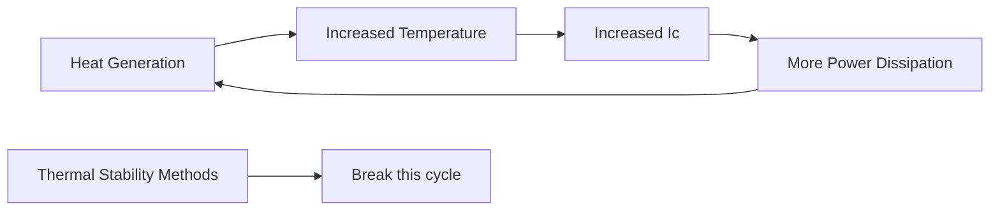
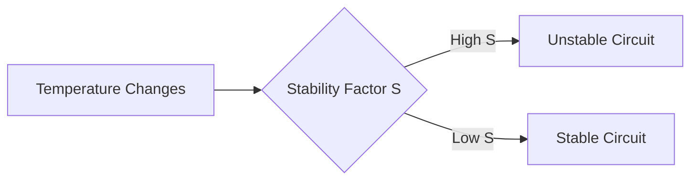
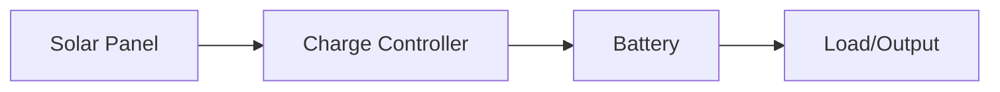
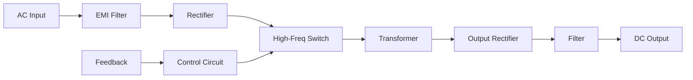

## Question 1(a) [3 marks]

**Explain amplifier parameters Ai, Ri and Ro for CE configuration.**

**Answer**:
In Common Emitter (CE) configuration, the key parameters are:

**Diagram:**

```goat
   +Vcc
     |
     R
     |
     |C
B----|----+----Output
     |    |
     |   RC
  RB |    |
     |    |
  ---|    |---
 |   |    |   |
 |   |    |   |
 +---+----+---+
     |
     |
    GND
```

- **Current Gain (Ai)**: Ratio of output current to input current (Ic/Ib), typically 50-200 in CE
- **Input Resistance (Ri)**: Opposition to input current at base terminal, ranges from 1-2kΩ in CE
- **Output Resistance (Ro)**: Opposition at collector terminal, typically 50kΩ in CE

**Mnemonic:** "CIR parameters - Current gain, Input resistance, and output Resistance determine amplifier performance"

## Question 1(b) [4 marks]

**Write short-note on heat sink.**

**Answer**:

**Diagram:**

```goat
                        Fins
            |‾‾‾|‾‾‾|‾‾‾|‾‾‾|‾‾‾|‾‾‾|‾‾‾|‾‾‾|
            |   |   |   |   |   |   |   |   |
+-----------+   |   |   |   |   |   |   |   |
| Transistor|___|___|___|___|___|___|___|___|
+-----------+
      Base
```

- **Purpose**: Dissipates excess heat from electronic components to prevent thermal damage
- **Types**: Passive heat sinks (aluminum/copper fins) and active heat sinks (with fans)
- **Thermal Resistance**: Lower thermal resistance (°C/W) indicates better heat dissipation
- **Materials**: Copper (best conductivity), aluminum (lightweight, cost-effective), composite

**Mnemonic:** "HARD sinks - Heat Away using Radiation and Dissipation through metal sinks"

## Question 1(c) [7 marks]

**Describe Thermal Runaway and Thermal Stability. How can overcome thermal run away in transistor?**

**Answer**:

**Diagram:**



**Thermal Runaway:**

- **Definition**: Self-accelerating process where transistor heats up, causing more current flow and further heating
- **Cause**: Increase in temperature increases Ico (leakage current) which increases Ic
- **Result**: Eventual destruction of transistor if unchecked

**Thermal Stability:**

- **Definition**: Ability to maintain stable operating point despite temperature changes
- **Measure**: Stability factor (S) - lower values indicate better stability

**Overcoming Thermal Runaway:**

- **Heat Sinks**: Attach to dissipate excess heat
- **Emitter Resistor**: Include unbypassed RE to provide negative feedback
- **Voltage Divider Bias**: Use instead of fixed bias for better stability
- **Thermal Compensation**: Add temperature-sensitive components in the bias circuit

**Mnemonic:** "SHEER protection - Sinks for Heat, Emitter resistors, External cooling, and Robust biasing prevent thermal runaway"

## Question 1(c) OR [7 marks]

**Write down types of biasing methods. Explain the voltage divider biasing method in details.**

**Answer**:

**Types of Biasing Methods:**

**Table: Transistor Biasing Methods**

| Method | Stability | Complexity |
|--------|-----------|------------|
| Fixed Bias | Poor | Simple |
| Collector Feedback | Medium | Medium |
| Emitter Bias | Good | Medium |
| Voltage Divider | Excellent | Complex |

**Voltage Divider Biasing Circuit:**

```goat
    +Vcc
      |
      R1
      |
      +----+
      |    |
      R2   C1
      |    |
      +----+---> Base
      |
      |    +----+
      |    |    |
      RE   RC   C2
      |    |    |
      +----+----+---> Output
      |
     GND
```

**Voltage Divider Biasing:**

- **Circuit Structure**: Uses two resistors (R1, R2) in series to create stable voltage at base
- **Operating Principle**: Voltage at R2 sets base bias, remains stable despite β variations
- **Advantage**: Most stable biasing technique with excellent temperature compensation
- **Formula**: Base voltage VB = Vcc × (R2/(R1+R2))
- **Stability**: High stability factor as base voltage is nearly independent of collector current

**Mnemonic:** "DIVE for stability - Divider Is Very Effective for temperature and β variations"

## Question 2(a) [3 marks]

**Explain Stability Factor with features.**

**Answer**:

**Diagram:**



- **Definition**: Stability factor (S) measures how collector current changes with leakage current
- **Formula**: S = ΔIC/ΔICBO
- **Ideal Value**: Lower value (S ≈ 1) indicates better stability
- **Factors Affecting**: Biasing circuit design, temperature, and transistor parameters

**Mnemonic:** "LESS is better - Lower values Ensure Stable System for temperature changes"

## Question 2(b) [4 marks]

**Describe direct coupling technique of cascading.**

**Answer**:

**Diagram:**

```goat
     +Vcc
       |
       |
       RC1     RC2
       |       |
       +-----+ |
       |     | |
    +--+     +-+--+
    |  |     |    |
Q1  |C |    C|    | Q2
    |  |     |    |
    +--+     +-+--+
    |  |     | |
    E  |     E |
    |  |     | |
    +--+     +-+
       |       |
       RE1     RE2
       |       |
      GND     GND
```

- **Definition**: Direct connection between collector of first stage to base of second stage
- **Advantages**: No coupling components needed, excellent low-frequency response
- **Disadvantages**: DC levels must be matched, thermal drift compounds across stages
- **Applications**: DC amplifiers, integrated circuits, operational amplifiers

**Mnemonic:** "DIAL for DC - Direct Interconnection Amplifies Low frequencies without capacitors"

## Question 2(c) [7 marks]

**Explain frequency response of two stages RC coupled amplifier.**

**Answer**:

**Frequency Response Curve:**

```goat
    Gain (dB)
    ^
    |                 ___________
    |                /           \
    |               /             \
    |              /               \
    |             /                 \
    |------------/                   \---->Frequency
               f1                    f2
        Low frequency    Mid frequency    High frequency
          region           region          region
```

**Two-Stage RC Coupled Amplifier:**

- **Circuit Structure**: Two transistor amplifiers connected via coupling capacitors
- **Low-Frequency Response (f < f1)**: Gain drops due to coupling and bypass capacitor effects
- **Mid-Frequency Response (f1 < f < f2)**: Maximum gain region, flat response
- **High-Frequency Response (f > f2)**: Gain drops due to internal capacitances and Miller effect
- **Bandwidth**: Range between lower cutoff (f1) and upper cutoff (f2) frequencies
- **Overall Gain**: Product of individual stage gains minus coupling losses

**Mnemonic:** "LMH frequency regions - Low has rising gain, Middle has flat gain, High has falling gain"

## Question 2(a) OR [3 marks]

**Briefly explain bandwidth and gain-bandwidth product of an amplifier.**

**Answer**:

**Diagram:**

```goat
    Gain (dB)
    ^
    |     _______________
    |    /|              \
    |   / |               \
    |  /  |                \
    | /   |                 \
    |/    |                  \
    +-----|------------------|-----> Frequency
          f1                 f2
          |<---Bandwidth---->|
```

- **Bandwidth**: Frequency range between lower (f1) and upper (f2) cutoff frequencies where gain is at least 70.7% of maximum
- **Formula**: Bandwidth = f2 - f1 (measured in Hz)
- **Gain-Bandwidth Product**: Constant value of gain multiplied by bandwidth for a given amplifier
- **Significance**: Represents fundamental limitation of amplifier performance

**Mnemonic:** "BIG value - Bandwidth and gain Inverse relationship is a Given constant"

## Question 2(b) OR [4 marks]

**Explain effects of emitter bypass capacitor and coupling capacitor on frequency response of an amplifier.**

**Answer**:

**Table: Capacitor Effects on Frequency Response**

| Capacitor Type | Low Frequency | Mid Frequency | High Frequency |
|----------------|---------------|---------------|----------------|
| Emitter Bypass | Affects gain | Full bypass | No effect |
| Coupling | Blocks signal | Full coupling | No effect |

**Effects of Capacitors:**

**Emitter Bypass Capacitor:**

- **Purpose**: Bypasses emitter resistor to increase gain
- **Low Frequency**: Acts as high impedance, reduces gain
- **Formula**: Xc = 1/(2πfC) increases at low frequencies
- **Cutoff Effect**: Sets lower cutoff frequency with RE

**Coupling Capacitor:**

- **Purpose**: Blocks DC, allows AC signal between stages
- **Low Frequency**: High reactance blocks signal transfer
- **Response Impact**: Larger capacitance improves low-frequency response
- **Phase Shift**: Creates phase shift at low frequencies

**Mnemonic:** "CABLE effect - Capacitors Act as Barriers at Low frequencies, improving at higher frequencies"

## Question 2(c) OR [7 marks]

**Compare transformer coupled amplifier and RC coupled amplifier.**

**Answer**:

**Table: Comparison of Transformer Coupled vs RC Coupled Amplifiers**

| Parameter | Transformer Coupled | RC Coupled |
|-----------|---------------------|------------|
| Coupling Element | Transformer | Capacitor & Resistor |
| Efficiency | Higher (90%) | Lower (30-50%) |
| Frequency Response | Limited, poor at extremes | Wide, better at low freq |
| Size & Weight | Bulky, heavy | Compact, lightweight |
| Cost | Higher | Lower |
| Impedance Matching | Excellent | Poor |
| Distortion | Lower | Higher |
| DC Isolation | Complete | Good |

**Diagram Comparison:**

```
Transformer Coupled             RC Coupled
    +Vcc                           +Vcc
      |                              |
      RC                             RC
      |                              |
      +-----|OOOO|-----+             +------||------+
      |     |OOOO|     |             |      CC      |
      C     |OOOO|     C             C              C
      |                |             |              |
      +                +             +              +
      |                |             |              |
     GND              GND           GND            GND
```

**Mnemonic:** "TREE factors - Transformers provide Robust Efficiency and Excellent impedance matching, RC provides Cost savings"

## Question 3(a) [3 marks]

**Describe the transistorized tuned amplifier.**

**Answer**:

**Circuit Diagram:**

```goat
    +Vcc
      |
      |
      +----+
      |    |
      L    C
      |    |
      +----+
      |
      C1
      |
      +----+---Output
      |    |
      Q    RC
      |    |
      +----+
      |
     GND
```

- **Definition**: Amplifier with LC tank circuit in collector to amplify specific frequency band
- **Principle**: LC circuit resonates at fr = 1/(2π√LC), providing maximum gain at resonance
- **Bandwidth**: Narrower than RC amplifiers, determined by Q factor of the tuned circuit
- **Applications**: RF amplifiers, radio receivers, wireless communication circuits

**Mnemonic:** "TRIP to resonance - Tuned Resonant circuits Improve Performance at specific frequencies"

## Question 3(b) [4 marks]

**Explain in brief Direct coupled amplifier.**

**Answer**:

**Circuit Diagram:**

```goat
    +Vcc
      |
      RC2
      |
      +------+---Output
      |      |
      C      RC1
      |      |
      +------+
      |
      E
      |
     GND
```

- **Definition**: Multi-stage amplifier where stages connect directly without coupling components
- **Working**: Collector of first stage directly connects to base of next stage
- **Advantages**: Excellent low-frequency response, fewer components, compact design
- **Disadvantages**: DC bias problems, thermal stability issues, limited gain per stage

**Mnemonic:** "COLD advantages - Compact design, Outstanding low-frequency response, Less components, Direct connection"

## Question 3(c) [7 marks]

**Describe the importance of h parameters in two port network. Draw h-parameters circuit for CE amplifier.**

**Answer**:

**h-parameter Equivalent Circuit for CE:**

```goat
                 RC
      +-----+    |
      |     |    |
Input |    +++   | Output
 o----+---|>|----o
      |    +++   |
      |     |    |
      +--+--+    |
         |       |
        +++      |
        GND      |
```

**Importance of h-parameters:**

- **Universal Application**: Works for all transistor configurations (CE, CB, CC)
- **Easy Measurement**: Parameters can be directly measured using simple circuits
- **Complete Characterization**: Fully describes transistor behavior with four parameters
- **Circuit Analysis**: Simplifies complex transistor circuit analysis
- **Temperature Independence**: Relatively stable over normal operating temperatures

**h-parameters for CE:**

- **h11 (hie)**: Input impedance with output short-circuited
- **h12 (hre)**: Reverse voltage transfer ratio 
- **h21 (hfe)**: Forward current gain (β)
- **h22 (hoe)**: Output admittance with input open-circuited

**Mnemonic:** "FINE parameters - Four Interconnected Network Elements define transistor completely"

## Question 3(a) OR [3 marks]

**Compare transformer coupled amplifier and direct coupled amplifier.**

**Answer**:

**Table: Transformer vs Direct Coupled Amplifiers**

| Parameter | Transformer Coupled | Direct Coupled |
|-----------|---------------------|----------------|
| DC Isolation | Complete | None |
| Low Freq Response | Poor | Excellent |
| Size | Bulky | Compact |
| Impedance Matching | Excellent | Poor |
| Distortion | Low | Can be high |
| Cost | High | Low |
| Complexity | Medium | Simple |

**Mnemonic:** "TIP for selection - Transformer for Impedance matching and Power transfer, Direct for low frequencies"

## Question 3(b) OR [4 marks]

**Draw and Explain circuit diagram of common emitter amplifier.**

**Answer**:

**CE Amplifier Circuit:**

```goat
     +Vcc
       |
       RC
       |
       +----||---o Output
       |    CC
       |
    +--+
    |  |
    |  C
    |  |
 ---+--+---
 |  |  |  |
 |  |  |  |
 +--+--+--+
    |
    RE
    |
   GND
```

- **Configuration**: Input at base, output from collector, emitter is common to both
- **Characteristics**: Voltage gain ~50-500, current gain ~50-200, phase shift 180°
- **Advantages**: High voltage gain, medium input impedance, good voltage amplification
- **Applications**: Audio amplifiers, radio frequency amplifiers, switching circuits

**Mnemonic:** "GAIN characteristics - Good Amplification with Inverted output and Notable efficiency"

## Question 3(c) OR [7 marks]

**Draw Transistor Two Port Network and describe h-parameters for it. Write down advantages of hybrid parameters.**

**Answer**:

**Two-Port Network Diagram:**

```goat
       +-------------+
       |             |
 I1 -->+             +---> I2
       |   Two-Port  |
 V1 -->+   Network   +---> V2
       |             |
       +-------------+
```

**h-parameters Equations:**

- V1 = h11I1 + h12V2
- I2 = h21I1 + h22V2

**h-parameters Description:**

- **h11**: Input impedance (Ω) with output short-circuited
- **h12**: Reverse voltage transfer ratio (dimensionless)
- **h21**: Forward current gain (dimensionless)
- **h22**: Output admittance (Siemens) with input open-circuited

**Advantages of Hybrid Parameters:**

- **Easy Measurement**: Each parameter can be measured individually
- **Standard Notation**: Universal acceptance in industry and academics
- **Accurate Model**: Provides precise modeling of transistor behavior
- **Configuration Flexibility**: Applicable to all transistor configurations
- **Temperature Stability**: Relatively stable over operating temperature range

**Mnemonic:** "SMART parameters - Simple Measurement, Accurate modeling, Reliable, Temperature-stable"

## Question 4(a) [3 marks]

**Explain Darlington pair and its applications.**

**Answer**:

**Darlington Pair Circuit:**

```goat
    +--+
    |  |
    |  C1    +--+
 ---+--+-----|  |
 |  |  |     |  C2   Output
 |  |  +-----|  |-----o
 |  B1 |     |  |
 o-----+-----|  |
    |     B2 |  |
    E1-------|  |
             E2 |
              --|--
               GND
```

- **Definition**: Configuration of two transistors where emitter of first drives base of second
- **Characteristics**: Very high current gain (β1 × β2), high input impedance
- **Drawbacks**: Higher saturation voltage, reduced switching speed
- **Applications**: Power amplifiers, motor drivers, touch-sensitive switches, Darlington ICs

**Mnemonic:** "HIGH gain - Hugely Increased Gain from Harnessing two transistors"

## Question 4(b) [4 marks]

**Describe the diode clamper circuit with necessary diagram.**

**Answer**:

**Positive Clamper Circuit:**

```goat
               D
    Input o---|>|---+---o Output
              |     |
              C     R
              |     |
              +-----+
              |
             GND
```

- **Definition**: Circuit that shifts waveform up/down by adding DC component
- **Types**: Positive clamper (shifts up), negative clamper (shifts down)
- **Working Principle**: Capacitor charges during first half-cycle, then maintains DC level
- **Applications**: TV sync pulse restoration, pulse modulation circuits, waveform processing

**Mnemonic:** "CAPS effect - Capacitor And diode Pair Shifts signal by exact DC level"

## Question 4(c) [7 marks]

**Explain the construction, working and applications of OLED.**

**Answer**:

**OLED Structure:**

```goat
       +----------------+
       | Cathode (Metal)|
       +----------------+
       | Emissive Layer |
       +----------------+
       |Conductive Layer|
       +----------------+
       |   Anode (ITO)  |
       +----------------+
       |   Substrate    |
       +----------------+
```

**OLED Construction:**

- **Layers**: Substrate, anode (ITO), conductive layer, emissive layer, cathode
- **Materials**: Organic semiconductor materials between electrodes
- **Types**: PMOLED (passive matrix) and AMOLED (active matrix)

**Working Principle:**

- **Mechanism**: Electric current causes organic material to emit light via electroluminescence
- **Process**: Electrons and holes recombine in emissive layer to produce photons
- **Efficiency**: Direct light emission without backlight, high efficiency

**Applications:**

- **Displays**: Smartphones, TVs, wearables, digital cameras
- **Lighting**: Flexible and transparent lighting panels
- **Signage**: High-contrast digital signs and billboards

**Mnemonic:** "OLED benefits - Organic materials, Lightweight design, Efficient operation, Direct emission, Stunning contrast"

## Question 4(a) OR [3 marks]

**Explain Short note on LDR.**

**Answer**:

**LDR Symbol and Structure:**

```goat
    Symbol              Structure
      ⌒   ⌒             +-------+
     /     \            |///////|
    +       +           |///////|
    |       |           +-------+
    +       +
     \     /
      ⌒   ⌒
```

- **Definition**: Light Dependent Resistor, a photoresistor whose resistance decreases with light
- **Material**: Cadmium sulfide (CdS) or cadmium selenide (CdSe)
- **Principle**: Photoconductivity - light energy releases electrons, increasing conductivity
- **Applications**: Light sensors, automatic lighting controls, camera exposure systems

**Mnemonic:** "DARK increases resistance - Decreasing light And Rising darkness Keep resistance high"

## Question 4(b) OR [4 marks]

**Describe the diode clipper circuit with necessary diagram.**

**Answer**:

**Positive Clipper Circuit:**

```goat
              R
    Input o---www---+---o Output
                    |
                    |
                  __|__
                  \   /
                   \ /
                    V
                    |
                   GND
```

- **Definition**: Circuit that limits (clips) portions of input waveform above/below threshold
- **Types**: Positive clipper (clips positive), negative clipper (clips negative), biased clipper
- **Working Principle**: Diode conducts when signal exceeds threshold, limiting output
- **Applications**: Waveform shaping, protection circuits, signal conditioning

**Mnemonic:** "CLIP waves - Circuit Limits Input Peaks by using diode conduction"

## Question 4(c) OR [7 marks]

**Explain Half Wave and Full wave Voltage Doubler.**

**Answer**:

**Half-Wave Voltage Doubler:**

```goat
             D1
    AC o------|>|-------+----o Output
    Input               |    (+2Vp)
               |        |
               C1       C2
               |        |
              GND      GND
```

**Full-Wave Voltage Doubler:**

```goat
             D1         
    AC o------|>|-------+----o Output
    Input     |         |    (+2Vp)
              |         |
              C1        C2
              |         |
              |    D2   |
              +---|<|---+
              |
             GND
```

**Half-Wave Voltage Doubler:**

- **Operation**: During negative half cycle, C1 charges to peak voltage; during positive cycle, output becomes 2Vp
- **Output**: Pulsating DC with peak value twice input peak
- **Ripple**: Higher ripple content
- **Efficiency**: Lower than full-wave

**Full-Wave Voltage Doubler:**

- **Operation**: Both half cycles contribute to output, with each capacitor charging during alternate cycles
- **Output**: Smoother DC with peak value twice input peak
- **Ripple**: Lower ripple content
- **Efficiency**: Higher than half-wave

**Applications:**

- **High voltage generation**: CRT displays, photomultipliers
- **Power supplies**: Low current, high voltage applications
- **Cascade connection**: For voltage multiplication beyond doubling

**Mnemonic:** "CHASE 2V - Capacitors Hold Alternating Supply Energy to produce 2× Voltage"

## Question 5(a) [3 marks]

**Draw circuit diagram for +5v Power Supply using its IC and explain in brief.**

**Answer**:

**5V Power Supply using 7805:**

```goat
        D1    D2
    o---|>|---|>|---+-----+--------o
AC       |         |     |        +5V
Input    +--|>|--+ |    7805      Output
         |  D3   | |     |
         +--|>|--+ |     |
         |  D4     C1    C2
         |         |     |
    o----+---------+-----+--------o
                  GND
```

- **Components**: Bridge rectifier (D1-D4), filter capacitor (C1), 7805 regulator, output capacitor (C2)
- **Working**: AC converted to DC by rectifier, filtered by C1, regulated to exact 5V by 7805
- **Features**: Short-circuit protection, thermal shutdown, up to 1A current capability
- **Applications**: Digital circuits, microcontrollers, electronics projects

**Mnemonic:** "FIRM voltage - Filtered Input, Regulated by 7805 Makes stable voltage"

## Question 5(b) [4 marks]

**Discuss load regulation and line regulation in reference to power supply.**

**Answer**:

**Regulation Performance Curves:**

```goat
    Vout           Vout
     ^              ^
     |              |
     |--            |--
     |  \           |  \
     |   \ Load     |   \ Line
     |    \         |    \
     +------->      +------->
           Iload           Vin
```

**Load Regulation:**

- **Definition**: Ability to maintain constant output voltage despite load current changes
- **Formula**: % Load Regulation = ((VNL - VFL)/VFL) × 100
- **Importance**: Ensures stable voltage for varying load demands
- **Ideal Value**: 0% (no change in output voltage with load changes)

**Line Regulation:**

- **Definition**: Ability to maintain constant output despite input voltage variations
- **Formula**: % Line Regulation = (ΔVout/ΔVin) × 100
- **Importance**: Protects circuits from mains voltage fluctuations
- **Ideal Value**: 0% (no change in output voltage with input changes)

**Mnemonic:** "LIVER health - Line regulation for Input Variations, load regulation for External Resistance changes"

## Question 5(c) [7 marks]

**Explain adjustable voltage regulator using LM317 with circuit diagram.**

**Answer**:

**LM317 Adjustable Regulator Circuit:**

```goat
                   R1
     +Vin o---+----www----+
              |           |
              |    ADJ    |
              |  +-----+  |
              +--| 317 |--+--o +Vout
                 |     |     |
                 +-----+     |
                             R2
                             |
                            GND
```

**Working Principle:**

- **Basic Operation**: LM317 maintains 1.25V between output and adjustment pin
- **Output Voltage**: Vout = 1.25V(1 + R2/R1) + IADJ(R2)
- **Simplified Formula**: Vout ≈ 1.25V(1 + R2/R1) (since IADJ is very small)
- **Adjustment Range**: 1.25V to 37V depending on input voltage

**Features:**

- **Current Capability**: Up to 1.5A output current
- **Protection**: Internal thermal overload and short circuit protection
- **Advantages**: Simple design, minimal external components, stable output
- **Applications**: Variable power supplies, battery chargers, custom voltage regulators

**Mnemonic:** "VAIR control - Variable Adjustable Integrated Regulator controls voltage precisely"

## Question 5(a) OR [3 marks]

**Explain working of solar battery charger circuits.**

**Answer**:

**Solar Battery Charger Block Diagram:**



- **Components**: Solar panel, charge controller, battery, protection circuits
- **Working Principle**: Solar panel generates DC, controller regulates charging current
- **Charge Phases**: Bulk charging (constant current), absorption (constant voltage), float (maintenance)
- **Protection Features**: Overcharge protection, deep discharge prevention, reverse polarity

**Mnemonic:** "SCBL system - Solar panel Converts sunlight, Battery stores, Load consumes"

## Question 5(b) OR [4 marks]

**Explain working of UPS.**

**Answer**:

**UPS Block Diagram:**

```goat
    +------+    +-------+    +--------+
    |      |    |       |    |        |
AC--+ Rect +----+ Batt. +----+ Invert +---AC
    |      |    |       |    |        |
    +------+    +-------+    +--------+
       |                         |
       +---------+---------------+
                 |
              Control
              Circuit
```

- **Definition**: Uninterruptible Power Supply provides backup power during main supply failure
- **Types**: Offline (standby), Line-interactive, Online (double conversion)
- **Components**: Rectifier, battery, inverter, control circuitry, transfer switch
- **Operation**: Normally passes filtered mains power, switches to battery during outage

**Mnemonic:** "PRIME power - Power Remains Intact during Mains Electricity problems"

## Question 5(c) OR [7 marks]

**Draw and explain SMPS block diagram with its advantages and disadvantages.**

**Answer**:

**SMPS Block Diagram:**



**Working Principle:**

- **Input Stage**: AC converted to unregulated DC by rectifier
- **Switching Stage**: High-frequency transistors chop DC into pulses
- **Transformer**: Isolates and transforms voltage at high frequency
- **Output Stage**: Rectifies and filters to produce clean DC
- **Feedback Loop**: Monitors output and adjusts switching for regulation

**Advantages:**

- **Efficiency**: 70-90% compared to 30-60% for linear supplies
- **Size/Weight**: Smaller transformers due to high-frequency operation
- **Heat Generation**: Less power dissipation, reduced cooling requirements
- **Wide Input Range**: Can operate over wide input voltage variations

**Disadvantages:**

- **Complexity**: More complex design than linear supplies
- **EMI/RFI**: Generates electromagnetic interference
- **Noise**: Higher output noise due to switching operation
- **Cost**: More expensive for low-power applications

**Mnemonic:** "FISH factors - Frequency switching, Isolation, Small size, High efficiency are SMPS benefits"

## Summary of Key Concepts

### Transistor Biasing and Stability

- **Biasing Methods**: Fixed bias, Collector feedback, Emitter bias, Voltage divider (most stable)
- **Thermal Stability**: Use emitter resistors, voltage divider bias, heat sinks to prevent thermal runaway
- **Stability Factor (S)**: Lower value indicates better stability against temperature changes

### Amplifier Parameters

- **CE Amplifier**: High voltage gain (50-500), medium input impedance, 180° phase shift
- **h-parameters**: h11 (input impedance), h21 (current gain), h12 (reverse voltage ratio), h22 (output admittance)
- **Frequency Response**: Affected by coupling capacitors at low frequencies, internal capacitances at high frequencies

### Coupling Methods

- **RC Coupling**: Simple, low cost, good frequency response (except very low frequencies)
- **Transformer Coupling**: Good impedance matching, excellent efficiency, bulky and expensive
- **Direct Coupling**: Excellent low-frequency response, DC bias issues, used in integrated circuits

### Practical Applications

- **Clippers & Clampers**: Waveform shaping, limiting, level shifting circuits
- **Voltage Multipliers**: Generate higher DC voltages from lower AC inputs (doubler, tripler, etc.)
- **Darlington Pair**: Super-high current gain configuration for power applications
- **OLED Displays**: Organic light-emitting diodes with high contrast, energy efficiency

### Power Supply Circuits

- **Voltage Regulators**: 78xx series (positive), 79xx series (negative), LM317 (adjustable)
- **SMPS**: High-efficiency switch-mode power supplies with smaller size but greater complexity
- **UPS**: Provides backup power during outages using battery-inverter systems
- **Solar Chargers**: Convert solar energy to charge batteries with overcharge protection

## Important Formulas to Remember

| Parameter | Formula | Description |
|-----------|---------|-------------|
| Voltage Gain (Av) | Vout/Vin | Ratio of output to input voltage |
| Current Gain (Ai) | Ic/Ib | Ratio of collector to base current |
| Bandwidth | f2 - f1 | Frequency range between cutoff points |
| Load Regulation | ((VNL-VFL)/VFL)×100% | Voltage stability with load change |
| Line Regulation | (ΔVout/ΔVin)×100% | Voltage stability with input change |
| Stability Factor (S) | ΔIC/ΔICBO | Change in collector current vs leakage |
| LM317 Output | 1.25V(1+R2/R1) | Adjustable regulator output voltage |
| Resonant Frequency | 1/(2π√LC) | Tuned amplifier resonance point |

## Exam Tips for Electronic Circuits

1. **Draw the Basics First**: Always begin with the basic circuit diagram before adding details
2. **Remember Polarities**: Pay attention to voltage polarities and current directions
3. **Compare in Tables**: Use tables for comparison questions to organize information
4. **Focus on Practical Uses**: Connect theoretical concepts to real-world applications
5. **Know the Numbers**: Memorize typical values (gains, impedances, voltages)
6. **Use Mnemonics**: Create memory aids for complex concepts and formulas

## Common Mistakes to Avoid

1. **Mixing Up Biasing**: Don't confuse the different biasing methods and their stability factors
2. **Parameter Confusion**: Keep h-parameters definitions clear and distinct
3. **Sign Errors**: Remember phase inversions (180° shift) in common emitter configurations
4. **Regulation Formulas**: Don't mix up load regulation and line regulation formulas
5. **Overcomplicating Diagrams**: Keep circuit diagrams simple and focused on key components

## Quick Reference: Component Symbols

```
Transistor (NPN)    Transistor (PNP)    Diode        LED
    C                   C                 A            A
    |                   |                 |            |
    |                   |                 +-|>|-+      +-|>|-+
    B---|               B---|             K            K  \/
    |                   |
    E                   E

Resistor     Capacitor    Inductor    Transformer
  --www--     --||--      --OOOO--    --OOOO--
                                       --OOOO--
```
