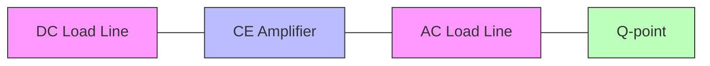
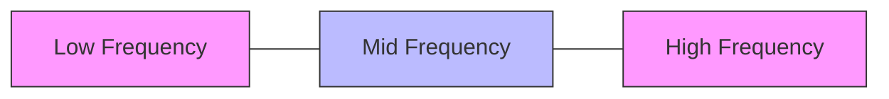
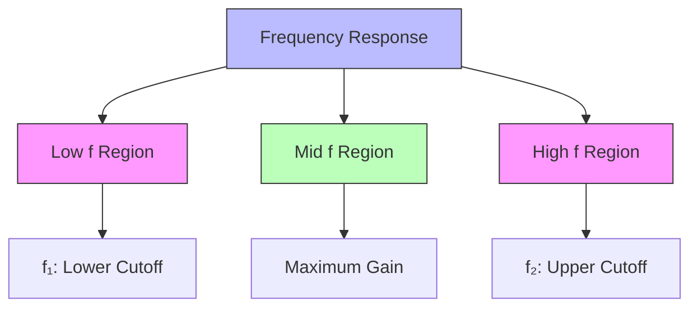
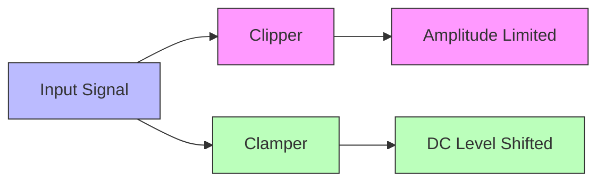
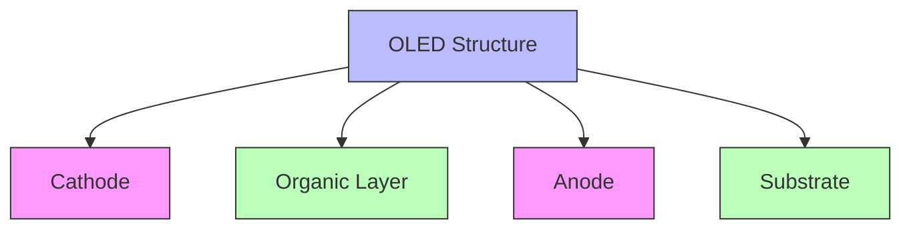
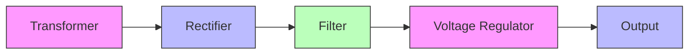
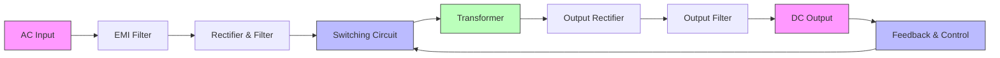
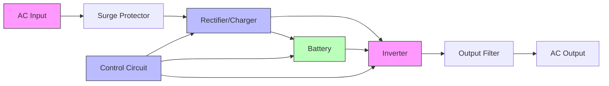

## પ્રશ્ન 1(અ) [3 ગુણ]

**ટ્રાન્ઝિસ્ટર બાયસિંગ શું છે? તેની શું જરૂર છે?**

**જવાબ**:
ટ્રાન્ઝિસ્ટર બાયસિંગ એ AC સિગ્નલના યોગ્ય એમ્પ્લિફિકેશન માટે સ્થિર DC ઓપરેટિંગ પોઈન્ટ (Q-પોઈન્ટ) સ્થાપિત કરવાની પ્રક્રિયા છે.

**કોષ્ટક: ટ્રાન્ઝિસ્ટર બાયસિંગની જરૂરિયાત**

| પાસું | મહત્વ |
|--------|------------|
| સ્થિરતા | તાપમાન વધઘટ છતાં સ્થિર Q-પોઈન્ટ જાળવે છે |
| લિનિયરતા | વિકૃતિ-મુક્ત એમ્પ્લિફિકેશન માટે લિનિયર રીજનમાં કાર્ય સુનિશ્ચિત કરે છે |
| કાર્યક્ષમતા | સિગ્નલ ક્લિપિંગ અટકાવે છે અને સિગ્નલ સ્વિંગને મહત્તમ કરે છે |
| વિશ્વસનીયતા | થર્મલ રનઅવે ટાળે છે અને ટ્રાન્ઝિસ્ટરને સુરક્ષિત રાખે છે |

**મેમરી ટ્રીક:** "SOLE ઓપરેશન" (Stability, Operating point, Linearity, Efficiency)

## પ્રશ્ન 1(બ) [4 ગુણ]

**CE એમ્પ્લિફાયર માટે લોડ લાઇન સમજાવો**

**જવાબ**:
લોડ લાઇન એ ટ્રાન્ઝિસ્ટર સર્કિટના બધા સંભવિત ઓપરેટિંગ પોઈન્ટનું ગ્રાફિકલ રેપ્રેઝન્ટેશન છે.

**આકૃતિ:**



- **DC લોડ લાઇન**: સેચુરેશન પોઈન્ટ (Ic=Vcc/Rc, Vce=0) અને કટઓફ પોઈન્ટ (Ic=0, Vce=Vcc) વચ્ચે દોરાય છે
- **AC લોડ લાઇન**: Q-પોઈન્ટમાંથી પસાર થાય છે, સ્લોપ = -1/rc (rc = AC કલેક્ટર રેસિસ્ટન્સ)
- **Q-પોઈન્ટ**: ઓપરેટિંગ પોઈન્ટ જ્યાં DC બાયસિંગ કન્ડિશન્સ સ્થાપિત થાય છે

**મેમરી ટ્રીક:** "SCQ પોઈન્ટ્સ" (Saturation, Cutoff, Q-point)

## પ્રશ્ન 1(ક) [7 ગુણ]

**ટ્રાન્ઝિસ્ટરની વિવિધ બાયસિંગ પધ્ધતિની યાદી બનાવો અને તેમાથી કોઈપણ એક સમજાવો.**

**જવાબ**:
ટ્રાન્ઝિસ્ટર માટેની વિવિધ બાયસિંગ પધ્ધતિઓ:

**કોષ્ટક: ટ્રાન્ઝિસ્ટર બાયસિંગ પધ્ધતિઓ**

| પધ્ધતિ | મુખ્ય લક્ષણ |
|--------|-------------|
| ફિક્સ્ડ બાયસ | બેઝ બાયસ માટે એક રેસિસ્ટર |
| કલેક્ટર-ટુ-બેઝ બાયસ | નેગેટિવ ફીડબેક દ્વારા સેલ્ફ-સ્ટેબિલાઈઝિંગ |
| વોલ્ટેજ ડિવાઈડર બાયસ | વોલ્ટેજ ડિવાઈડર નેટવર્ક દ્વારા સૌથી સ્થિર |
| એમિટર બાયસ | એમિટર રેસિસ્ટર સાથે ઉત્તમ સ્થિરતા |
| કોમ્બિનેશન બાયસ | ઓપ્ટિમલ સ્થિરતા માટે મલ્ટિપલ ફીડબેક પાથનો ઉપયોગ |

**વોલ્ટેજ ડિવાઈડર બાયસ સમજૂતી:**

**આકૃતિ:**

```goat
     +Vcc
       |
       R1
       |
       +------+
       |      |
       R2     Rc
       |      |
       |      C
  +----+      |
  |   B  +----+----+ Output
  +-----|    |     |
        |    |     |
  Input +--+ |     |
        | C  E     |
        |    |     |
        +----+     |
             |     |
             Re    |
             |     |
             +-----+
             |
            GND
```

- **ઓપરેશન**: R1 અને R2 બેઝ વોલ્ટેજ સેટ કરવા માટે વોલ્ટેજ ડિવાઈડર બનાવે છે
- **સ્થિરતા**: સ્ટિફ વોલ્ટેજ ડિવાઈડરને કારણે ઉત્તમ થર્મલ સ્થિરતા
- **કાર્યક્ષમતા**: β વેરિએશનથી સ્વતંત્ર હોવાથી સૌથી વધુ ઉપયોગમાં લેવાતી પધ્ધતિ
- **ગણતરી**: બેઝ વોલ્ટેજ = Vcc × R2/(R1+R2)

**મેમરી ટ્રીક:** "VISE ગ્રિપ" (Voltage divider, Independent of β, Stable, Efficient)

## પ્રશ્ન 1(ક) અથવા [7 ગુણ]

**સર્કિટ ડાયગ્રામની મદદથી વોલ્ટેજ ડિવાઈડર બાયસિંગ પધ્ધતિ સમજાવો**

**જવાબ**:
વોલ્ટેજ ડિવાઈડર બાયસિંગ એ ટ્રાન્ઝિસ્ટરને બાયસ કરવાની સૌથી સ્થિર પદ્ધતિ છે.

**આકૃતિ:**

```goat
     +Vcc
       |
       R1
       |
       +------+
       |      |
       R2     Rc
       |      |
       |      C
  +----+      |
  |   B  +----+----+ Output
  +-----|    |     |
        |    |     |
  Input +--+ |     |
        | C  E     |
        |    |     |
        +----+     |
             |     |
             Re    |
             |     |
             +-----+
             |
            GND
```

**કોષ્ટક: વોલ્ટેજ ડિવાઈડર બાયસિંગની વિશેષતાઓ**

| કોમ્પોનન્ટ | કાર્ય |
|-----------|----------|
| R1, R2 | β થી સ્વતંત્ર સ્થિર બેઝ વોલ્ટેજ બનાવે છે |
| Rc | કલેક્ટર કરંટને મર્યાદિત કરે છે અને આઉટપુટ વોલ્ટેજ વિકસિત કરે છે |
| Re | નેગેટિવ ફીડબેક દ્વારા સ્થિરતા પ્રદાન કરે છે |
| બાયપાસ કેપેસિટર | ગેઇન વધારવા માટે Re ની આસપાસ AC સિગ્નલને બાયપાસ કરે છે |

- **કાર્યરત સિદ્ધાંત**: R1 અને R2 બેઝ વોલ્ટેજ સેટ કરતા વોલ્ટેજ ડિવાઈડર બનાવે છે
- **થર્મલ સ્થિરતા**: Re નેગેટિવ ફીડબેક માટે ઉત્તમ થર્મલ સ્થિરતા પ્રદાન કરે છે
- **ફાયદો**: તાપમાન અને β માં ફેરફાર છતાં Q-પોઈન્ટ સ્થિર રહે છે

**મેમરી ટ્રીક:** "BEST બાયસ" (Base voltage, Emitter stability, Stiff divider, Temperature stable)

## પ્રશ્ન 2(અ) [3 ગુણ]

**કાસ્કેડિંગ એમ્પ્લિફાયરની પદ્ધતિઓ લખો**

**જવાબ**:
કાસ્કેડિંગ એમ્પ્લિફાયરનો અર્થ એકંદર ગેઈન વધારવા માટે એકાધિક એમ્પ્લિફાયર સ્ટેજને શ્રેણીમાં જોડવાનો છે.

**કોષ્ટક: કાસ્કેડિંગ એમ્પ્લિફાયરની પદ્ધતિઓ**

| પદ્ધતિ | મુખ્ય લક્ષણ |
|--------|-------------|
| RC કપલિંગ | ઇન્ટરસ્ટેજ કપલિંગ માટે કેપેસિટર અને રેસિસ્ટરનો ઉપયોગ |
| ટ્રાન્સફોર્મર કપલિંગ | ઇમ્પીડન્સ મેચિંગ અને આઇસોલેશન માટે ટ્રાન્સફોર્મરનો ઉપયોગ |
| ડાયરેક્ટ કપલિંગ | કોઈ કપલિંગ કોમ્પોનન્ટ નહીં, સ્ટેજ વચ્ચે સીધું કનેક્શન |
| LC કપલિંગ | હાઈ-ફ્રીક્વન્સી એપ્લિકેશન માટે ઇન્ડક્ટર-કેપેસિટરનો ઉપયોગ |

**મેમરી ટ્રીક:** "RTDL કનેક્શન" (RC, Transformer, Direct, LC)

## પ્રશ્ન 2(બ) [4 ગુણ]

**CE અને CB એમ્પ્લિફાયરની સરખામણી કરો**

**જવાબ**:

**કોષ્ટક: CE અને CB એમ્પ્લિફાયરની સરખામણી**

| પેરામીટર | કોમન એમિટર (CE) | કોમન બેઝ (CB) |
|-----------|---------------------|-----------------|
| ઇનપુટ ઇમ્પીડન્સ | મધ્યમ (≈1kΩ) | નીચું (≈50Ω) |
| આઉટપુટ ઇમ્પીડન્સ | ઊંચું (≈50kΩ) | ખૂબ ઊંચું (≈500kΩ) |
| વોલ્ટેજ ગેઇન | ઊંચું (≈500) | ઊંચું (≈500) |
| કરંટ ગેઇન | મધ્યમ (β) | 1 થી ઓછું (α) |
| ફેઝ શિફ્ટ | 180° | 0° |
| એપ્લિકેશન | વોલ્ટેજ એમ્પ્લિફિકેશન | હાઈ-ફ્રીક્વન્સી એમ્પ્લિફિકેશન |

**મેમરી ટ્રીક:** "PIVOT તફાવતો" (Phase shift, Impedance, Voltage gain, Output impedance, Throughput)

## પ્રશ્ન 2(ક) [7 ગુણ]

**RC કપલ્ડ એમ્પ્લિફાયરની સર્કિટ દોરો. આવૃત્તિ પ્રતિભાવ આપો અને સમજાવો**

**જવાબ**:
RC કપલ્ડ એમ્પ્લિફાયર ઇન્ટરસ્ટેજ કપલિંગ માટે રેસિસ્ટર-કેપેસિટર નેટવર્કનો ઉપયોગ કરે છે.

**આકૃતિ:**

```goat
     +Vcc
       |
       +---+--------+---+
       |   |        |   |
       Rc1 |        Rc2 |
       |   |        |   |
       +---+        +---+
       |            |
       C            +---+ Output
       |            |   |
   +---+---+    +---+---+
   |   |   |    |   |   |
   | B |   |    | B |   |
   | | C   |    | | C   |
   +-+ |   |    +-+ |   |
   |   |   |    |   |   |
Input  |   |    |   |   |
   +---+---+    +---+---+
       |            |
       Re1          Re2
       |            |
       +------------+
       |
      GND
```

**આવૃત્તિ પ્રતિભાવ:**



- **નીચી આવૃત્તિ વિસ્તાર**: કપલિંગ અને બાયપાસ કેપેસિટરને કારણે ગેઈન ઘટે છે
- **મધ્ય આવૃત્તિ વિસ્તાર**: મહત્તમ ગેઈન સાથે ફ્લેટ પ્રતિસાદ
- **ઊંચી આવૃત્તિ વિસ્તાર**: ટ્રાન્ઝિસ્ટરની આંતરિક કેપેસિટન્સને કારણે ગેઈન ઘટે છે
- **બેન્ડવિડ્થ**: નીચા અને ઊંચા કટઓફ આવૃત્તિઓ દ્વારા નક્કી થાય છે

**મેમરી ટ્રીક:** "LMH વિસ્તારો" (Low, Mid, High frequency regions)

## પ્રશ્ન 2(અ) અથવા [3 ગુણ]

**એમ્પ્લિફાયરના ગેઇન, બેંડવિથ અને ગેઇન-બેંડવિથ ગુણાકારની વ્યાખ્યા લખો.**

**જવાબ**:

**કોષ્ટક: મુખ્ય એમ્પ્લિફાયર પેરામીટર્સ**

| પેરામીટર | વ્યાખ્યા |
|-----------|------------|
| ગેઇન (A) | આઉટપુટ સિગ્નલનો ઇનપુટ સિગ્નલ સાથેનો ગુણોત્તર (વોલ્ટેજ, કરંટ, અથવા પાવર) |
| બેન્ડવિડ્થ (BW) | નીચા અને ઊંચા કટઓફ આવૃત્તિઓ વચ્ચેનો આવૃત્તિ રેન્જ (f₂-f₁) |
| ગેઇન-બેન્ડવિડ્થ ગુણાકાર (GBW) | ગેઇન અને બેન્ડવિડ્થનો ગુણાકાર, આપેલા એમ્પ્લિફાયર માટે સ્થિર રહે છે |

**મેમરી ટ્રીક:** "GBP સ્થિરાંકો" (Gain, Bandwidth, Product constants)

## પ્રશ્ન 2(બ) અથવા [4 ગુણ]

**સિંગલ સ્ટેજ એમ્પ્લિફાયરનો ફ્રિક્વન્સી રિસ્પોન્સ સમજાવો અને તેની કટઓફ ફ્રિક્વન્સીઓ દર્શાવો.**

**જવાબ**:
ફ્રિક્વન્સી રિસ્પોન્સ સિંગલ સ્ટેજ એમ્પ્લિફાયરમાં આવૃત્તિ સાથે ગેઇનના ફેરફાર દર્શાવે છે.

**આકૃતિ:**



- **કટઓફ આવૃત્તિઓ**: જ્યાં ગેઇન મહત્તમ ગેઇનના 0.707 ગણા સુધી ઘટે છે તે બિંદુઓ
- **નીચી કટઓફ આવૃત્તિ (f₁)**: કપલિંગ અને બાયપાસ કેપેસિટર દ્વારા નિર્ધારિત થાય છે
- **ઊંચી કટઓફ આવૃત્તિ (f₂)**: ટ્રાન્ઝિસ્ટર જંક્શન કેપેસિટન્સ દ્વારા મર્યાદિત થાય છે
- **બેન્ડવિડ્થ**: f₁ અને f₂ વચ્ચેનો આવૃત્તિ રેન્જ (BW = f₂ - f₁)

**મેમરી ટ્રીક:** "LUG પોઈન્ટ્સ" (Lower cutoff, Upper cutoff, Gain maximum)

## પ્રશ્ન 2(ક) અથવા [7 ગુણ]

**સામાન્ય કલેક્ટર એમ્પ્લિફાયરની સર્કિટ ડાયગ્રામ દોરો અને સમજાવો**

**જવાબ**:
સામાન્ય કલેક્ટર (CC) એમ્પ્લિફાયરને એમિટર ફોલોઅર તરીકે પણ ઓળખવામાં આવે છે.

**આકૃતિ:**

```goat
     +Vcc
       |
       Rc
       |
       +
       |
       |    C
       |    |
   +---+    |
   |   |    |
   | B |    |
Input-+|    |
   |   |    |
   |   |    |
   |   C    |
   |   |    |
   +---+----+--+ Output
       |    |
       Re   |
       |    |
       +----+
       |
      GND
```

**કોષ્ટક: સામાન્ય કલેક્ટર એમ્પ્લિફાયરની વિશેષતાઓ**

| પેરામીટર | લાક્ષણિકતા |
|-----------|---------------|
| વોલ્ટેજ ગેઇન | લગભગ 1 (1 કરતાં ઓછો) |
| કરંટ ગેઇન | ઊંચો (β) |
| ઇનપુટ ઇમ્પીડન્સ | ખૂબ ઊંચી (≈ β × Re) |
| આઉટપુટ ઇમ્પીડન્સ | ખૂબ નીચી (≈ 1/gm) |
| ફેઝ શિફ્ટ | 0° (કોઈ ફેઝ ઇન્વર્ઝન નહીં) |
| એપ્લિકેશન | ઇમ્પીડન્સ મેચિંગ, બફર સ્ટેજ |

- **કાર્યરત સિદ્ધાંત**: આઉટપુટ એમિટરથી લેવામાં આવે છે, કલેક્ટર ઇનપુટ અને આઉટપુટ માટે સામાન્ય છે
- **મુખ્ય લક્ષણ**: વોલ્ટેજ ફોલોઅર જેમાં આઉટપુટ વોલ્ટેજ ઇનપુટ વોલ્ટેજને અનુસરે છે
- **મુખ્ય ફાયદો**: ઊંચી ઇનપુટ ઇમ્પીડન્સ અને નીચી આઉટપુટ ઇમ્પીડન્સ

**મેમરી ટ્રીક:** "BIVOP લક્ષણો" (Buffer, Impedance matching, Voltage follower, One gain, Phase matched)

## પ્રશ્ન 3(અ) [3 ગુણ]

**ટ્રાન્ઝિસ્ટર ટુ પોર્ટ નેટવર્ક દોરો અને તેના માટે h-પેરામીટરનું વર્ણન કરો.**

**જવાબ**:
ટ્રાન્ઝિસ્ટરને h-પેરામીટર્સ સાથે ટુ-પોર્ટ નેટવર્ક તરીકે રજૂ કરી શકાય છે.

**આકૃતિ:**

```goat
     +---------------------+
     |                     |
     |    Two-Port         |
Input|    Network     +----+---> Output
   +>|                |    |
     |    Transistor  |    |
     |                v    |
     +---------------------+
```

**કોષ્ટક: h-પેરામીટર્સ**

| પેરામીટર | વર્ણન |
|-----------|------------|
| h₁₁ (h_i) | આઉટપુટ શોર્ટ-સર્કિટેડ હોય ત્યારે ઇનપુટ ઇમ્પીડન્સ |
| h₁₂ (h_r) | ઇનપુટ ઓપન-સર્કિટેડ હોય ત્યારે રિવર્સ વોલ્ટેજ ટ્રાન્સફર રેશિયો |
| h₂₁ (h_f) | આઉટપુટ શોર્ટ-સર્કિટેડ હોય ત્યારે ફોરવર્ડ કરંટ ટ્રાન્સફર રેશિયો |
| h₂₂ (h_o) | ઇનપુટ ઓપન-સર્કિટેડ હોય ત્યારે આઉટપુટ એડમિટન્સ |

**મેમરી ટ્રીક:** "IRFO પેરામીટર્સ" (Input impedance, Reverse transfer, Forward transfer, Output admittance)

## પ્રશ્ન 3(બ) [4 ગુણ]

**CE એમ્પ્લિફાયર માટે વોલ્ટેજ ગેઇન Av, કરંટ ગેઇન Ai અને પાવર ગેઇન Ap સમજાવો**

**જવાબ**:

**કોષ્ટક: CE એમ્પ્લિફાયર માટે ગેઇન એક્સપ્રેશન્સ**

| ગેઇન પ્રકાર | એક્સપ્રેશન | h-પેરામીટર્સ સાથે સંબંધ |
|-----------|------------|--------------------------|
| વોલ્ટેજ ગેઇન (Av) | Vₒ/Vᵢ | Av = -h_fe × R_L / h_ie |
| કરંટ ગેઇન (Ai) | Iₒ/Iᵢ | Ai = h_fe / (1 + h_oe × R_L) |
| પાવર ગેઇન (Ap) | Pₒ/Pᵢ | Ap = Av × Ai = (વોલ્ટેજ ગેઇન × કરંટ ગેઇન) |

- **વોલ્ટેજ ગેઇન**: CE એમ્પ્લિફાયર માટે સામાન્ય રીતે 500-1000
- **કરંટ ગેઇન**: ટ્રાન્ઝિસ્ટરના h_fe (β) જેટલું
- **પાવર ગેઇન**: વોલ્ટેજ ગેઇન અને કરંટ ગેઇનનો ગુણાકાર

**મેમરી ટ્રીક:** "VIP ગેઇન્સ" (Voltage, Input-output current, Power)

## પ્રશ્ન 3(ક) [7 ગુણ]

**ડાર્લિંગટન પેર, તેની વિશેષતાઓ અને ઉપયોગો સમજાવો**

**જવાબ**:
ડાર્લિંગટન પેરમાં બે ટ્રાન્ઝિસ્ટર હોય છે જે એક ઉચ્ચ-ગેઇન ટ્રાન્ઝિસ્ટર તરીકે કાર્ય કરે છે.

**આકૃતિ:**

```goat
     +Vcc
       |
       Rc
       |
       +--------+
       |        |
       |        | Output
       |        |
       | +------+
       | |
       | C
  +----+-+
  |    | |
  |  +-+ |
  |  |   |
  |  | C |
  |  | | |
Input  | | |
  +----+-+ |
       |   |
       +---+
       |
      GND
```

**કોષ્ટક: ડાર્લિંગટન પેરની વિશેષતાઓ**

| વિશેષતા | વર્ણન |
|---------|------------|
| કરંટ ગેઇન | ખૂબ ઊંચો (β₁ × β₂) |
| ઇનપુટ ઇમ્પીડન્સ | અત્યંત ઊંચી |
| વોલ્ટેજ ડ્રોપ | વધારે (≈1.4V) બે B-E જંક્શનને કારણે |
| સ્વિચિંગ સ્પીડ | સિંગલ ટ્રાન્ઝિસ્ટર કરતાં ધીમી |
| થર્મલ સ્ટેબિલિટી | સિંગલ ટ્રાન્ઝિસ્ટર કરતાં નબળી |

- **ઉપયોગો**: પાવર એમ્પ્લિફાયર, મોટર ડ્રાઈવર, ટચ સ્વિચ, સેન્સર
- **ફાયદા**: ખૂબ ઊંચો કરંટ ગેઇન, ઊંચી ઇનપુટ ઇમ્પીડન્સ
- **મર્યાદાઓ**: ઊંચો સેચુરેશન વોલ્ટેજ, ધીમું સ્વિચિંગ

**મેમરી ટ્રીક:** "CHIPS એપ્લિકેશન" (Current amplification, High impedance, Increased gain, Power handling, Slower switching)

## પ્રશ્ન 3(અ) અથવા [3 ગુણ]

**LDR ના ઉપયોગની ચર્ચા કરો.**

**જવાબ**:
Light Dependent Resistor (LDR) એક ફોટોરેસિસ્ટર છે જેનો રેસિસ્ટન્સ પ્રકાશની તીવ્રતા વધવાની સાથે ઘટે છે.

**કોષ્ટક: LDR ના ઉપયોગો**

| ઉપયોગ | કાર્ય સિદ્ધાંત |
|-------------|-------------------|
| ઓટોમેટિક સ્ટ્રીટ લાઈટ્સ | જ્યારે એમ્બિયન્ટ લાઈટ લેવલ ઘટે ત્યારે લાઈટ ચાલુ કરે છે |
| કેમેરા એક્સપોઝર કંટ્રોલ | પ્રકાશની તીવ્રતાના આધારે એપર્ચર/શટર એડજસ્ટ કરે છે |
| લાઈટ બીમ અલાર્મ | જ્યારે પ્રકાશનો બીમ અવરોધિત થાય ત્યારે અલાર્મ ટ્રિગર કરે છે |
| સોલર ટ્રેકર | સોલર પેનલને મહત્તમ સૂર્યપ્રકાશ તરફ ઓરિએન્ટ કરવામાં મદદ કરે છે |
| ઓટોમેટિક બ્રાઈટનેસ કંટ્રોલ | એમ્બિયન્ટ લાઈટના આધારે ડિસ્પ્લે બ્રાઈટનેસ એડજસ્ટ કરે છે |

**મેમરી ટ્રીક:** "CASAL ઉપયોગો" (Camera, Alarm, Street light, Automatic control, Light measurement)

## પ્રશ્ન 3(બ) અથવા [4 ગુણ]

**ક્લિપર અને ક્લેમ્પરની સરખામણી**

**જવાબ**:

**કોષ્ટક: ક્લિપર અને ક્લેમ્પર વચ્ચેની સરખામણી**

| પેરામીટર | ક્લિપર | ક્લેમ્પર |
|-----------|---------|---------|
| કાર્ય | સિગ્નલની એમ્પ્લિટ્યુડ મર્યાદિત/ક્લિપ કરે છે | સિગ્નલનું DC લેવલ શિફ્ટ કરે છે |
| આઉટપુટ | થ્રેશોલ્ડથી બહારના ભાગો દૂર કરે છે | DC કોમ્પોનન્ટ ઉમેરે છે |
| કોમ્પોનન્ટ | ડાયોડ + રેસિસ્ટર | ડાયોડ + કેપેસિટર + રેસિસ્ટર |
| વેવ શેપ | વેવ શેપ બદલે છે | વેવ શેપ જાળવે છે |
| ઉપયોગો | નોઈઝ રિમૂવલ, વેવ શેપિંગ | TV સિગ્નલ પ્રોસેસિંગ, DC રિસ્ટોરેશન |

**આકૃતિ:**



**મેમરી ટ્રીક:** "CLIPS vs CLAMPS" (Cut Levels In Peak Signal vs Change Level And Maintain Peak Shape)

## પ્રશ્ન 3(ક) અથવા [7 ગુણ]

**CE એમ્પ્લિફાયર માટે h-પેરામીટર સર્કિટનું વર્ણન કરો.**

**જવાબ**:
h-પેરામીટર્સ CE એમ્પ્લિફાયર પરફોર્મન્સ વિશ્લેષણની સરળ રીત પ્રદાન કરે છે.

**આકૃતિ:**

```goat
     +---------------------+
     |                     |
  Ii |    +----------+     | Io
   +>|    |          |     |>+
     |    |   h_ie   |     |
  Vi |    +----------+     | Vo
   +>|    |          |     |>+
     |    | h_re.Vi  |     |
     |    |          |     |
     |    |  h_fe.Ii |---->|
     |    |          |     |
     |    |   h_oe   |     |
     |    +----------+     |
     |                     |
     +---------------------+
```

**કોષ્ટક: CE કોન્ફિગરેશન માટે h-પેરામીટર્સ**

| પેરામીટર | સિમ્બોલ | ટિપિકલ વેલ્યુ | ફિઝિકલ સિગ્નિફિકન્સ |
|-----------|--------|---------------|----------------------|
| ઇનપુટ ઇમ્પીડન્સ | h_ie | 1-2 kΩ | બેઝ-એમિટર ઇનપુટ ઇમ્પીડન્સ |
| રિવર્સ વોલ્ટેજ રેશિયો | h_re | 10⁻⁴ | આઉટપુટથી ઇનપુટ તરફ ફીડબેક |
| ફોરવર્ડ કરંટ ગેઇન | h_fe | 50-300 | કરંટ ગેઇન (β) |
| આઉટપુટ એડમિટન્સ | h_oe | 10⁻⁶ S | આઉટપુટ કન્ડક્ટન્સ |

- **સર્કિટ એનાલિસિસ**: વોલ્ટેજ ગેઇન, કરંટ ગેઇન, ઇનપુટ/આઉટપુટ ઇમ્પીડન્સની ગણતરી માટે h-પેરામીટર્સનો ઉપયોગ
- **ઇક્વિવેલન્ટ સર્કિટ**: h-પેરામીટર્સને ટુ-પોર્ટ નેટવર્ક રેપ્રેઝન્ટેશનમાં સંયોજિત કરે છે
- **ફાયદો**: જટિલ ટ્રાન્ઝિસ્ટર વર્તનને લિનિયર પેરામીટર્સમાં સરળ બનાવે છે

**મેમરી ટ્રીક:** "FIRO પેરામીટર્સ" (Forward gain, Input impedance, Reverse feedback, Output admittance)

## પ્રશ્ન 4(અ) [3 ગુણ]

**ડાર્લિંગટન જોડી પર ટૂંકી નોંધ લખો.**

**જવાબ**:
ડાર્લિંગટન જોડી બે ટ્રાન્ઝિસ્ટરને સંયોજિત કરીને સુપર-હાઈ ગેઇન ટ્રાન્ઝિસ્ટર બનાવે છે.

**આકૃતિ:**

```goat
       +---+
       |   |
  +----+---+----+
  |    |        |
  |    +        |
  |  E/ \C      |
  |   /B \      |
Input + --+     |
  |    |        |
  |    +        |
  |  E/ \C      |
  |   /B \      |
  |    |        |
  +----+--------+
       |
     Output
```

- **કોન્ફિગરેશન**: બે ટ્રાન્ઝિસ્ટર જેમાં પ્રથમ ટ્રાન્ઝિસ્ટરનો એમિટર બીજા ટ્રાન્ઝિસ્ટરના બેઝને ડ્રાઇવ કરે છે
- **કુલ ગેઇન**: β₁ × β₂ (વ્યક્તિગત ટ્રાન્ઝિસ્ટર ગેઇનનો ગુણાકાર)
- **ઇનપુટ ઇમ્પીડન્સ**: અત્યંત ઊંચી (β₂ × R_e1)

**મેમરી ટ્રીક:** "HIS ગુણધર્મો" (High gain, Impedance boost, Sandwich configuration)

## પ્રશ્ન 4(બ) [4 ગુણ]

**ઝેનર ડાયોડને વોલ્ટેજ રેગ્યુલેટર તરીકે સમજાવો.**

**જવાબ**:
ઝેનર ડાયોડ રિવર્સ બ્રેકડાઉનમાં ઓપરેટ થાય ત્યારે સ્થિર વોલ્ટેજ રેફરન્સ પ્રદાન કરે છે.

**આકૃતિ:**

```goat
       Rs
    +--www--+
    |        |
 Vi |      | | Vz    RL   Vo
 +--+      | +---+---www--+
    |      |/|   |        |
    |      |\|   |        |
    |        |   |        |
    +--------+---+--------+
             |
            GND
```

**કોષ્ટક: ઝેનર વોલ્ટેજ રેગ્યુલેટર**

| પેરામીટર | વર્ણન |
|-----------|------------|
| સિદ્ધાંત | રિવર્સ બ્રેકડાઉન રીજિયનમાં સ્થિર વોલ્ટેજ જાળવે છે |
| સીરીઝ રેસિસ્ટર (Rs) | કરંટ મર્યાદિત કરે છે અને વધારાનો વોલ્ટેજ ડ્રોપ કરે છે |
| લોડ રેસિસ્ટર (RL) | પાવર લેતા સર્કિટનું પ્રતિનિધિત્વ કરે છે |
| રેગ્યુલેશન | ઇનપુટ વોલ્ટેજની વધઘટ છતાં આઉટપુટ વોલ્ટેજ સ્થિર રાખે છે |

- **કાર્યપદ્ધતિ**: ઝેનર બ્રેકડાઉન રીજિયનમાં કાર્ય કરે છે, સ્થિર વોલ્ટેજ જાળવે છે
- **મર્યાદા**: પાવર ડિસિપેશન ક્ષમતા મહત્તમ કરંટને મર્યાદિત કરે છે

**મેમરી ટ્રીક:** "ZEBRA" (Zener Effect Breakdown Regulates Accurately)

## પ્રશ્ન 4(ક) [7 ગુણ]

**ઓપ્ટોકપલર ને ફાયદા અને ગેરફાયદા સાથે સમજાવો.**

**જવાબ**:
ઓપ્ટોકપલર (ઓપ્ટોઆઇસોલેટર તરીકે પણ ઓળખાય છે) આઇસોલેટેડ સર્કિટ વચ્ચે સિગ્નલ ટ્રાન્સફર કરવા માટે પ્રકાશનો ઉપયોગ કરે છે.

**આકૃતિ:**

```goat
   +--------+-----------+
   |        |           |
   |    +---+---+       |
   |    |       |       |
   |    |  LED  |       |
   |    |       |       |
   |    +---+---+       |
Input   |   |           | Output
   |    |   |     +-----+----+
   |    |   |     |     |    |
   |    |   +---->|     |    |
   |    |         |Photo|    |
   |    |         |sensor|   |
   |    |         |     |    |
   |    |         +-----+----+
   |    |           |        |
   +----+-----------+--------+
```

**કોષ્ટક: ઓપ્ટોકપલરના ફાયદા અને ગેરફાયદા**

| ફાયદા | ગેરફાયદા |
|------------|---------------|
| સંપૂર્ણ ઇલેક્ટ્રિકલ આઇસોલેશન | અપેક્ષાકૃત ધીમો રિસ્પોન્સ ટાઇમ |
| ઉચ્ચ નોઇઝ ઇમ્યુનિટી | મર્યાદિત બેન્ડવિડ્થ |
| ગ્રાઉન્ડ લૂપ્સ નથી | તાપમાન સંવેદનશીલ |
| ઉચ્ચ વોલ્ટેજ આઇસોલેશન | એજિંગ ઇફેક્ટ્સ |
| ટ્રાન્ઝિઅન્ટ્સ સામે સુરક્ષા | LED ડ્રાઇવ કરવા માટે કરંટની જરૂર પડે છે |

- **કાર્યપદ્ધતિ**: ઇનપુટ સિગ્નલ LED ને ડ્રાઇવ કરે છે, જે પ્રકાશ ઉત્સર્જિત કરે છે અને ફોટોડિટેક્ટર દ્વારા શોધાય છે
- **ઉપયોગો**: મેડિકલ ઇક્વિપમેન્ટ, ઇન્ડસ્ટ્રિયલ કંટ્રોલ, પાવર સપ્લાય, સિગ્નલ આઇસોલેશન
- **પ્રકારો**: ફોટોરેસિસ્ટર, ફોટોડાયોડ, ફોટોટ્રાન્ઝિસ્ટર, ફોટો-SCR આધારિત

**મેમરી ટ્રીક:** "LIGHT ટ્રાન્સફર" (Linked Isolated Galvanic-free High-voltage Transfer)

## પ્રશ્ન 4(અ) અથવા [3 ગુણ]

**હાફ વેવ વોલ્ટેજ ડબલર દોરો.**

**જવાબ**:
હાફ-વેવ વોલ્ટેજ ડબલર ડાયોડ અને કેપેસિટરનો ઉપયોગ કરીને ઇનપુટ પીક વોલ્ટેજના લગભગ બમણા DC આઉટપુટ ઉત્પન્ન કરે છે.

**આકૃતિ:**

```goat
              D1
     +--------+--|>|----------+
     |                        |
     |                        |
     |                        |
    _|_                      _|_
    \ / D2                   --- C2
     |                        |
     |                        |
 Vin |        +---------------+--+ Vout(≈2Vin)
     |        |
     |        |
     |       _|_
     |       --- C1
     |        |
     +--------+----------------+
```

- **કોમ્પોનન્ટ્સ**: બે ડાયોડ અને બે કેપેસિટર
- **આઉટપુટ**: ઇનપુટ પીક વોલ્ટેજના લગભગ બમણા

**મેમરી ટ્રીક:** "DC2" (Doubles input using Capacitors and 2 Diodes)

## પ્રશ્ન 4(બ) અથવા [4 ગુણ]

**OLED નું કાર્ય અને ઉપયોગો સમજાવો.**

**જવાબ**:
ઓર્ગેનિક લાઇટ એમિટિંગ ડાયોડ (OLED) ઓર્ગેનિક કોમ્પાઉન્ડનો ઉપયોગ કરે છે જે તેમાંથી કરંટ પસાર થાય ત્યારે પ્રકાશ ઉત્સર્જિત કરે છે.

**આકૃતિ:**



**કોષ્ટક: OLED કાર્ય અને ઉપયોગો**

| પાસું | વર્ણન |
|--------|------------|
| કાર્યપદ્ધતિ | ઓર્ગેનિક લેયરમાં ઇલેક્ટ્રોન-હોલ રિકોમ્બિનેશન પ્રકાશ ઉત્પન્ન કરે છે |
| કાર્યક્ષમતા | ઉચ્ચ કાર્યક્ષમતા, ઓછા પાવરનો વપરાશ |
| વ્યૂઇંગ એન્ગલ | ઉત્તમ (લગભગ 180°) |
| ઉપયોગો | સ્માર્ટફોન, ટીવી, વેરેબલ ડિવાઇસ, લાઇટિંગ |
| ફાયદા | પાતળી, ફ્લેક્સિબલ, વધુ સારું કોન્ટ્રાસ્ટ, ઝડપી રિસ્પોન્સ |

**મેમરી ટ્રીક:** "VIEWS ટેકનોલોજી" (Vibrant colors, Incredible contrast, Excellent angle, Wide application, Self-emitting)

## પ્રશ્ન 4(ક) અથવા [7 ગુણ]

**સોલર બેટરી ચાર્જર સર્કિટનું કાર્ય સમજાવો.**

**જવાબ**:
સોલર બેટરી ચાર્જર સૌર ઊર્જાને બેટરી ચાર્જ કરવા માટે ઇલેક્ટ્રિકલ ઊર્જામાં રૂપાંતરિત કરે છે.

**આકૃતિ:**

```goat
   +--------+        +----------+        +---------+        +--------+
   |        |        |          |        |         |        |        |
   | Solar  |        | Charge   |        | Voltage |        | Battery|
   | Panel  |------->|Controller|------->|Regulator|------->|        |
   |        |        |          |        |         |        |        |
   +--------+        +----------+        +---------+        +--------+
                         |                                      |
                         |                                      |
                         v                                      v
                     +---------+                             +--------+
                     |Indicator|                             |  Load  |
                     | Circuit |                             |        |
                     +---------+                             +--------+
```

**કોષ્ટક: કોમ્પોનન્ટ્સ અને તેમના કાર્યો**

| કોમ્પોનન્ટ | કાર્ય |
|-----------|----------|
| સોલર પેનલ | સૂર્યપ્રકાશને DC ઇલેક્ટ્રિસિટીમાં રૂપાંતરિત કરે છે |
| ચાર્જ કંટ્રોલર | ઓવરચાર્જિંગ અને ડીપ ડિસ્ચાર્જ અટકાવે છે |
| વોલ્ટેજ રેગ્યુલેટર | યોગ્ય ચાર્જિંગ લેવલ પર વોલ્ટેજ સ્થિર કરે છે |
| બેટરી | ઇલેક્ટ્રિકલ ઊર્જા સંગ્રહિત કરે છે |
| ઇન્ડિકેટર સર્કિટ | ચાર્જિંગ સ્ટેટસ અને બેટરી લેવલ દર્શાવે છે |

- **કાર્ય સિદ્ધાંત**: ફોટોવોલ્ટેઇક ઇફેક્ટ સૂર્યપ્રકાશને ઇલેક્ટ્રિસિટીમાં રૂપાંતરિત કરે છે
- **રેગ્યુલેશન**: વોલ્ટેજ/કરંટ રેગ્યુલેશન દ્વારા ઓવરચાર્જિંગ અટકાવે છે
- **સુરક્ષા**: રાત્રે બેટરી ડિસ્ચાર્જ થતી અટકાવવા માટે રિવર્સ કરંટ પ્રોટેક્શન સામેલ છે
- **પ્રકારો**: PWM (પલ્સ વિડ્થ મોડ્યુલેશન) અને MPPT (મેક્સિમમ પાવર પોઇન્ટ ટ્રેકિંગ)

**મેમરી ટ્રીક:** "SCORE સિસ્ટમ" (Solar Conversion, Overcharge protection, Regulation, Energy storage)

## પ્રશ્ન 5(અ) [3 ગુણ]

**રેગ્યુલેટેડ પાવર સપ્લાયનો બ્લોક ડાયાગ્રામ દોરો.**

**જવાબ**:
રેગ્યુલેટેડ પાવર સપ્લાય ઇનપુટ અથવા લોડમાં ફેરફાર છતાં સ્થિર DC આઉટપુટ વોલ્ટેજ પ્રદાન કરે છે.

**આકૃતિ:**



- **કોમ્પોનન્ટ્સ**: ટ્રાન્સફોર્મર, રેક્ટિફાયર, ફિલ્ટર, વોલ્ટેજ રેગ્યુલેટર
- **કાર્ય**: લોડ ચેન્જ છતાં AC ને સ્થિર DC માં રૂપાંતરિત કરે છે

**મેમરી ટ્રીક:** "TRFO બ્લોક્સ" (Transformer, Rectifier, Filter, Output regulator)

## પ્રશ્ન 5(બ) [4 ગુણ]

**ટ્રાન્ઝિસ્ટર શંટ વોલ્ટેજ રેગ્યુલેટરનું વર્ણન કરો.**

**જવાબ**:
ટ્રાન્ઝિસ્ટર શંટ રેગ્યુલેટર લોડની સમાંતર ટ્રાન્ઝિસ્ટરમાંથી વધારાના કરંટને ડાઇવર્ટ કરીને સ્થિર આઉટપુટ વોલ્ટેજ જાળવે છે.

**આકૃતિ:**

```goat
     +-------+
     |       |
     |      _|_
     |      \ / Zener
     |       |
     |       |
     +---+---+
         |
         |   +-----------+
         +---| Base      |
             |           |
  Vin    Rs  | Transistor|  RL   Vout
  +---+--www-+           +---www---+
             | Collector |         |
             |           |         |
             +-----------+         |
                 |                 |
                 +-----------------+
                 |
                GND
```

**કોષ્ટક: ટ્રાન્ઝિસ્ટર શંટ રેગ્યુલેટર**

| કોમ્પોનન્ટ | કાર્ય |
|-----------|----------|
| ઝેનર | રેફરન્સ વોલ્ટેજ પ્રદાન કરે છે |
| ટ્રાન્ઝિસ્ટર | વધારાના કરંટને શંટ કરે છે |
| સીરીઝ રેસિસ્ટર (Rs) | વધારાનો વોલ્ટેજ ડ્રોપ કરે છે |
| લોડ રેસિસ્ટર (RL) | પાવર લેતા સર્કિટનું પ્રતિનિધિત્વ કરે છે |

- **કાર્યપદ્ધતિ**: જ્યારે આઉટપુટ વધવાનો પ્રયાસ કરે ત્યારે ટ્રાન્ઝિસ્ટર વધુ કન્ડક્ટ કરે છે
- **ફાયદો**: સારા રેગ્યુલેશન સાથે સરળ સર્કિટ

**મેમરી ટ્રીક:** "ZEST સર્કિટ" (Zener reference, Excess current, Shunt transistor, Tension-free output)

## પ્રશ્ન 5(ક) [7 ગુણ]

**SMPS બ્લોક ડાયાગ્રામ દોરો અને તેના ફાયદા ગેરફાયદા સાથે સમજાવો.**

**જવાબ**:
સ્વિચ્ડ મોડ પાવર સપ્લાય (SMPS) ઉચ્ચ કાર્યક્ષમતા માટે સ્વિચિંગ રેગ્યુલેશનનો ઉપયોગ કરે છે.

**આકૃતિ:**



**કોષ્ટક: SMPS ના ફાયદા અને ગેરફાયદા**

| ફાયદા | ગેરફાયદા |
|------------|---------------|
| ઉચ્ચ કાર્યક્ષમતા (80-95%) | જટિલ સર્કિટ ડિઝાઇન |
| નાનું કદ અને હળવા વજન | ઉચ્ચ-આવૃત્તિ નોઇઝ ઉત્પન્ન કરે છે |
| વિશાળ ઇનપુટ વોલ્ટેજ રેન્જ | EMI/RFI ઇન્ટરફેરન્સ |
| સારું રેગ્યુલેશન | ઓછા પાવર માટે ઊંચી કિંમત |
| ઓછી ગરમી ઉત્પાદન | મુશ્કેલ ટ્રબલશૂટિંગ |

- **કાર્ય સિદ્ધાંત**: ઉચ્ચ આવૃત્તિ પર પાવરને ઝડપથી ચાલુ/બંધ કરે છે
- **કદ ઘટાડો**: ઊંચી સ્વિચિંગ આવૃત્તિ નાના ટ્રાન્સફોર્મરની મંજૂરી આપે છે
- **ઉપયોગો**: કોમ્પ્યુટર, ટીવી, મોબાઇલ ચાર્જર, LED ડ્રાઇવર

**મેમરી ટ્રીક:** "SWEEP ફાયદા" (Small size, Widerange input, Efficient, Economical, Precise regulation)

## પ્રશ્ન 5(અ) અથવા [3 ગુણ]

**ત્રણ ટર્મિનલ IC 7812 નો ઉપયોગ કરીને વોલ્ટેજ રેગ્યુલેટર દોરો.**

**જવાબ**:
ત્રણ ટર્મિનલ IC 7812 ફિક્સ્ડ +12V રેગ્યુલેટેડ આઉટપુટ વોલ્ટેજ પ્રદાન કરે છે.

**આકૃતિ:**

```goat
        +-------+-------+
        |       |       |
   Vin  |       |       |  Vout
   +----|  IN   OUT  |----+ (+12V)
        |       |       |
   +----|  GND       |----+
   |    |       |       |
   |    +-------+-------+
   |        |
   |       _|_
   |       --- C1
   |        |
   +--------+
           GND
```

- **કોમ્પોનન્ટ્સ**: 7812 રેગ્યુલેટર IC અને ફિલ્ટર કેપેસિટર
- **પિન કોન્ફિગરેશન**: ઇનપુટ, ગ્રાઉન્ડ, આઉટપુટ
- **વિશેષતાઓ**: આંતરિક કરંટ લિમિટિંગ અને થર્મલ શટડાઉન

**મેમરી ટ્રીક:** "IGO પિન્સ" (Input, Ground, Output)

## પ્રશ્ન 5(બ) અથવા [4 ગુણ]

**ટ્રાન્ઝિસ્ટર સીરીઝ વોલ્ટેજ રેગ્યુલેટરનું વર્ણન કરો**

**જવાબ**:
ટ્રાન્ઝિસ્ટર સીરીઝ રેગ્યુલેટર સીરીઝ ટ્રાન્ઝિસ્ટરની કન્ડક્ટિવિટી બદલીને આઉટપુટ વોલ્ટેજને નિયંત્રિત કરે છે.

**આકૃતિ:**

```goat
   +----------+
   |          |
   |         _|_
   |         \ / Zener
   |          |
   |          |
   +-----+----+
         |
         |   +-----------+
         +---| Base      |
             |           |
  Vin        | Transistor|     Vout
  +----------| Collector |------+
             |           |      |
             | Emitter   |      |
             +-----------+      |
                 |              |
                 |             _|_
                 |             --- C
                 |              |
                 +--------------+
                             GND
```

**કોષ્ટક: સીરીઝ વોલ્ટેજ રેગ્યુલેટરની વિશેષતાઓ**

| વિશેષતા | વર્ણન |
|---------|------------|
| કંટ્રોલ એલિમેન્ટ | ટ્રાન્ઝિસ્ટર સીરીઝમાં વેરિએબલ રેસિસ્ટર તરીકે કાર્ય કરે છે |
| રેફરન્સ | ઝેનર ડાયોડ સ્થિર રેફરન્સ વોલ્ટેજ પ્રદાન કરે છે |
| રેગ્યુલેશન | ફીડબેક ટ્રાન્ઝિસ્ટર કન્ડક્ટિવિટી એડજસ્ટ કરે છે |
| કાર્યક્ષમતા | ઉચ્ચ કરંટ લોડ માટે શંટ રેગ્યુલેટર કરતાં વધુ સારી |

- **કાર્ય સિદ્ધાંત**: સ્થિર આઉટપુટ જાળવવા માટે ટ્રાન્ઝિસ્ટર કન્ડક્ટિવિટી બદલાય છે
- **ફાયદો**: ઉચ્ચ કરંટ માટે શંટ રેગ્યુલેટર કરતાં વધુ કાર્યક્ષમ

**મેમરી ટ્રીક:** "CERT સર્કિટ" (Control transistor, Efficient design, Reference voltage, Transistor in series)

## પ્રશ્ન 5(ક) અથવા [7 ગુણ]

**UPS બ્લોક ડાયાગ્રામ દોરો અને તેના ફાયદા ગેરફાયદા સાથે સમજાવો.**

**જવાબ**:
અનઇન્ટરપ્ટિબલ પાવર સપ્લાય (UPS) મુખ્ય પાવર સપ્લાય ફેઇલ થાય ત્યારે ઇમરજન્સી પાવર પ્રદાન કરે છે.

**આકૃતિ:**



**કોષ્ટક: UPS ના ફાયદા અને ગેરફાયદા**

| ફાયદા | ગેરફાયદા |
|------------|---------------|
| બેકઅપ પાવર પ્રદાન કરે છે | મર્યાદિત બેકઅપ સમય |
| વોલ્ટેજ ફ્લક્ચુએશનથી બચાવે છે | નિયમિત બેટરી મેઇન્ટેનન્સ |
| સર્જ પ્રોટેક્શન | પ્રારંભિક ઊંચી કિંમત |
| સરળ પાવર ટ્રાન્ઝિશન | ઓપરેશન દરમિયાન ઘોંઘાટ |
| પાવર કન્ડિશનિંગ | સ્ટેન્ડબાયમાં ઓછી કાર્યક્ષમતા |

- **પ્રકારો**: ઓફલાઇન/સ્ટેન્ડબાય, લાઇન-ઇન્ટરેક્ટિવ, ઓનલાઇન/ડબલ-કન્વર્ઝન
- **ઉપયોગો**: કોમ્પ્યુટર, મેડિકલ ઇક્વિપમેન્ટ, ડેટા સેન્ટર, ટેલિકોમ્યુનિકેશન્સ
- **કાર્યપદ્ધતિ**: સામાન્ય રીતે બેટરી ચાર્જ કરતી વખતે મુખ્ય પાવર પસાર કરે છે; પાવર જતા રહે ત્યારે બેટરી પાવર પર સ્વિચ કરે છે

**મેમરી ટ્રીક:** "POWER બેકઅપ" (Protection from Outages, Waveform conditioning, Emission-free, Reliability boost)
