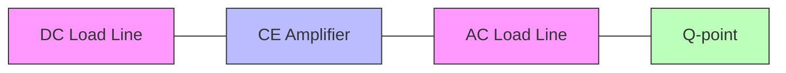
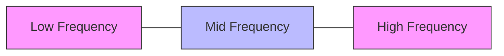
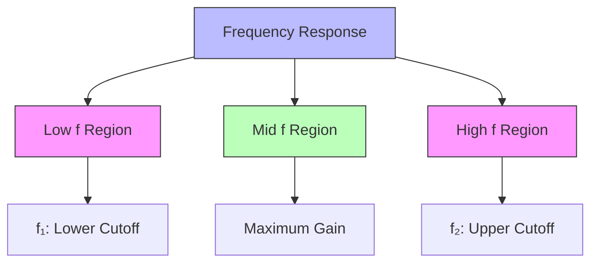
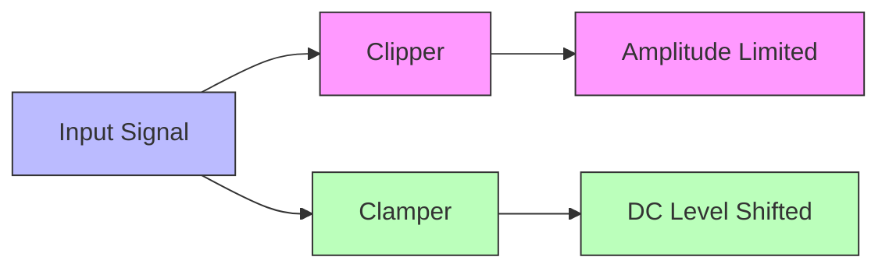
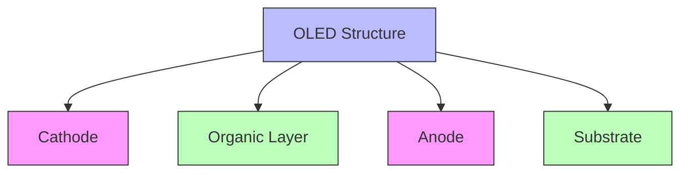
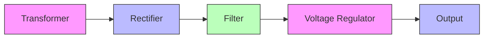
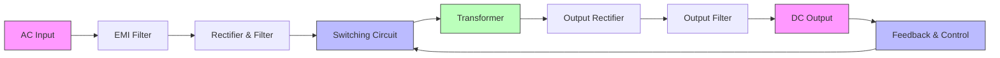
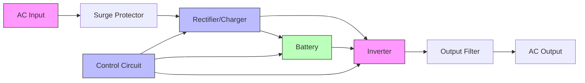

## Question 1(a) [3 marks]

**What is transistor biasing? What is its need?**

**Answer**:
Transistor biasing is the process of establishing a stable DC operating point (Q-point) for proper amplification of AC signals.

**Table: Need for Transistor Biasing**

| Aspect | Importance |
|--------|------------|
| Stability | Maintains stable Q-point despite temperature variations |
| Linearity | Ensures operation in linear region for distortion-free amplification |
| Efficiency | Prevents signal clipping and maximizes signal swing |
| Reliability | Avoids thermal runaway and protects the transistor |

**Mnemonic:** "SOLE operation" (Stability, Operating point, Linearity, Efficiency)

## Question 1(b) [4 marks]

**Explain load line for CE amplifier**

**Answer**:
Load line is a graphical representation of all possible operating points of a transistor circuit.

**Diagram:**



- **DC load line**: Drawn between saturation point (Ic=Vcc/Rc, Vce=0) and cutoff point (Ic=0, Vce=Vcc)
- **AC load line**: Passes through Q-point with slope = -1/rc (rc = AC collector resistance)
- **Q-point**: Operating point where DC biasing conditions are established

**Mnemonic:** "SCQ points" (Saturation, Cutoff, Q-point)

## Question 1(c) [7 marks]

**List various biasing method of transistor and explain any one of them.**

**Answer**:
Various biasing methods for transistors include:

**Table: Transistor Biasing Methods**

| Method | Key Feature |
|--------|-------------|
| Fixed bias | Single resistor for base bias |
| Collector-to-base bias | Self-stabilizing due to negative feedback |
| Voltage divider bias | Most stable due to voltage divider network |
| Emitter bias | Provides excellent stability with emitter resistor |
| Combination bias | Uses multiple feedback paths for optimal stability |

**Explanation of Voltage Divider Bias:**

**Diagram:**

```goat
     +Vcc
       |
       R1
       |
       +------+
       |      |
       R2     Rc
       |      |
       |      C
  +----+      |
  |   B  +----+----+ Output
  +-----|    |     |
        |    |     |
  Input +--+ |     |
        | C  E     |
        |    |     |
        +----+     |
             |     |
             Re    |
             |     |
             +-----+
             |
            GND
```

- **Operation**: R1 and R2 form a voltage divider to set base voltage
- **Stability**: Excellent thermal stability due to stiff voltage divider
- **Efficiency**: Most widely used due to independence from β variations
- **Calculation**: Base voltage = Vcc × R2/(R1+R2)

**Mnemonic:** "VISE grip" (Voltage divider, Independent of β, Stable, Efficient)

## Question 1(c) OR [7 marks]

**Explain voltage divider biasing method with help of circuit diagram**

**Answer**:
Voltage divider biasing is the most stable method to bias a transistor.

**Diagram:**

```goat
     +Vcc
       |
       R1
       |
       +------+
       |      |
       R2     Rc
       |      |
       |      C
  +----+      |
  |   B  +----+----+ Output
  +-----|    |     |
        |    |     |
  Input +--+ |     |
        | C  E     |
        |    |     |
        +----+     |
             |     |
             Re    |
             |     |
             +-----+
             |
            GND
```

**Table: Features of Voltage Divider Biasing**

| Component | Function |
|-----------|----------|
| R1, R2 | Creates stable base voltage independent of β |
| Rc | Limits collector current and develops output voltage |
| Re | Provides stability via negative feedback |
| Bypass capacitor | Bypasses AC signal around Re to increase gain |

- **Working principle**: R1 and R2 form a voltage divider that sets the base voltage
- **Thermal stability**: Re provides negative feedback for excellent thermal stability
- **Advantage**: Q-point remains stable despite variations in temperature and β

**Mnemonic:** "BEST bias" (Base voltage, Emitter stability, Stiff divider, Temperature stable)

## Question 2(a) [3 marks]

**Write methods of cascading amplifiers**

**Answer**:
Cascading amplifiers means connecting multiple amplifier stages in series to increase overall gain.

**Table: Methods of Cascading Amplifiers**

| Method | Key Feature |
|--------|-------------|
| RC Coupling | Uses capacitor and resistor for interstage coupling |
| Transformer Coupling | Uses transformer for impedance matching and isolation |
| Direct Coupling | No coupling components, direct connection between stages |
| LC Coupling | Uses inductor-capacitor for high-frequency applications |

**Mnemonic:** "RTDL connection" (RC, Transformer, Direct, LC)

## Question 2(b) [4 marks]

**Compare CE and CB amplifiers**

**Answer**:

**Table: Comparison of CE and CB Amplifiers**

| Parameter | Common Emitter (CE) | Common Base (CB) |
|-----------|---------------------|-----------------|
| Input Impedance | Medium (≈1kΩ) | Low (≈50Ω) |
| Output Impedance | High (≈50kΩ) | Very high (≈500kΩ) |
| Voltage Gain | High (≈500) | High (≈500) |
| Current Gain | Medium (β) | Less than 1 (α) |
| Phase Shift | 180° | 0° |
| Applications | Voltage amplification | High-frequency amplification |

**Mnemonic:** "PIVOT differences" (Phase shift, Impedance, Voltage gain, Output impedance, Throughput)

## Question 2(c) [7 marks]

**Draw the circuit of RC coupled amplifier. Give the frequency response and explain**

**Answer**:
RC coupled amplifier uses resistor-capacitor network for interstage coupling.

**Diagram:**

```goat
     +Vcc
       |
       +---+--------+---+
       |   |        |   |
       Rc1 |        Rc2 |
       |   |        |   |
       +---+        +---+
       |            |
       C            +---+ Output
       |            |   |
   +---+---+    +---+---+
   |   |   |    |   |   |
   | B |   |    | B |   |
   | | C   |    | | C   |
   +-+ |   |    +-+ |   |
   |   |   |    |   |   |
Input   |   |    |   |   |
   +---+---+    +---+---+
       |            |
       Re1          Re2
       |            |
       +------------+
       |
      GND
```

**Frequency Response:**



- **Low frequency region**: Gain drops due to coupling and bypass capacitors
- **Mid frequency region**: Flat response with maximum gain
- **High frequency region**: Gain falls due to transistor internal capacitances
- **Bandwidth**: Determined by the lower and upper cutoff frequencies

**Mnemonic:** "LMH regions" (Low, Mid, High frequency regions)

## Question 2(a) OR [3 marks]

**Write definition of gain, Bandwidth and Gain Bandwidth product of an amplifier.**

**Answer**:

**Table: Key Amplifier Parameters**

| Parameter | Definition |
|-----------|------------|
| Gain (A) | Ratio of output signal to input signal (voltage, current, or power) |
| Bandwidth (BW) | Frequency range between lower and upper cutoff frequencies (f₂-f₁) |
| Gain-Bandwidth Product (GBW) | Product of gain and bandwidth, remains constant for a given amplifier |

**Mnemonic:** "GBP constants" (Gain, Bandwidth, Product constants)

## Question 2(b) OR [4 marks]

**Explain frequency response of single stage amplifier and indicate its cutoff frequencies.**

**Answer**:
Frequency response shows variation of gain with frequency in a single stage amplifier.

**Diagram:**



- **Cutoff frequencies**: Points where gain drops to 0.707 times maximum gain
- **Lower cutoff frequency (f₁)**: Determined by coupling and bypass capacitors
- **Upper cutoff frequency (f₂)**: Limited by transistor junction capacitances
- **Bandwidth**: Frequency range between f₁ and f₂ (BW = f₂ - f₁)

**Mnemonic:** "LUG points" (Lower cutoff, Upper cutoff, Gain maximum)

## Question 2(c) OR [7 marks]

**Draw and Explain circuit diagram of common collector amplifier**

**Answer**:
Common collector (CC) amplifier is also known as emitter follower.

**Diagram:**

```goat
     +Vcc
       |
       Rc
       |
       +
       |
       |    C
       |    |
   +---+    |
   |   |    |
   | B |    |
Input-+ |    |
   |   |    |
   |   |    |
   |   C    |
   |   |    |
   +---+----+--+ Output
       |    |
       Re   |
       |    |
       +----+
       |
      GND
```

**Table: Features of Common Collector Amplifier**

| Parameter | Characteristic |
|-----------|---------------|
| Voltage Gain | Approximately 1 (less than 1) |
| Current Gain | High (β) |
| Input Impedance | Very high (≈ β × Re) |
| Output Impedance | Very low (≈ 1/gm) |
| Phase Shift | 0° (no phase inversion) |
| Applications | Impedance matching, buffer stages |

- **Working principle**: Output is taken from emitter, collector is common to input and output
- **Key feature**: Voltage follower with output voltage following input voltage
- **Main advantage**: High input impedance and low output impedance

**Mnemonic:** "BIVOP characters" (Buffer, Impedance matching, Voltage follower, One gain, Phase matched)

## Question 3(a) [3 marks]

**Draw transistor two port network and describe h-parameters for it.**

**Answer**:
Transistor can be represented as a two-port network with h-parameters.

**Diagram:**

```goat
     +---------------------+
     |                     |
     |    Two-Port         |
Input|    Network     +----+---> Output
   +>|                |    |
     |    Transistor  |    |
     |                v    |
     +---------------------+
```

**Table: h-parameters**

| Parameter | Description |
|-----------|------------|
| h₁₁ (h_i) | Input impedance with output short-circuited |
| h₁₂ (h_r) | Reverse voltage transfer ratio with input open-circuited |
| h₂₁ (h_f) | Forward current transfer ratio with output short-circuited |
| h₂₂ (h_o) | Output admittance with input open-circuited |

**Mnemonic:** "IRFO parameters" (Input impedance, Reverse transfer, Forward transfer, Output admittance)

## Question 3(b) [4 marks]

**Explain voltage gain Av, current gain Ai and Power gain Ap for CE amplifier**

**Answer**:

**Table: Gain Expressions for CE Amplifier**

| Gain Type | Expression | Relation to h-parameters |
|-----------|------------|--------------------------|
| Voltage Gain (Av) | Vₒ/Vᵢ | Av = -h_fe × R_L / h_ie |
| Current Gain (Ai) | Iₒ/Iᵢ | Ai = h_fe / (1 + h_oe × R_L) |
| Power Gain (Ap) | Pₒ/Pᵢ | Ap = Av × Ai = (voltage gain × current gain) |

- **Voltage gain**: Typically 500-1000 for CE amplifier
- **Current gain**: Approximately equal to h_fe (β) of transistor
- **Power gain**: Product of voltage gain and current gain

**Mnemonic:** "VIP gains" (Voltage, Input-output current, Power)

## Question 3(c) [7 marks]

**Explain Darlington pair, its features and applications**

**Answer**:
Darlington pair consists of two transistors connected to act as a single high-gain transistor.

**Diagram:**

```goat
     +Vcc
       |
       Rc
       |
       +--------+
       |        |
       |        | Output
       |        |
       | +------+
       | |
       | C
  +----+-+
  |    | |
  |  +-+ |
  |  |   |
  |  | C |
  |  | | |
Input  | | |
  +----+-+ |
       |   |
       +---+
       |
      GND
```

**Table: Features of Darlington Pair**

| Feature | Description |
|---------|------------|
| Current Gain | Very high (β₁ × β₂) |
| Input Impedance | Extremely high |
| Voltage Drop | Higher (≈1.4V) due to two B-E junctions |
| Switching Speed | Slower than single transistor |
| Thermal Stability | Poorer than single transistor |

- **Applications**: Power amplifiers, motor drivers, touch switches, sensors
- **Advantages**: Very high current gain, high input impedance
- **Limitations**: Higher saturation voltage, slower switching

**Mnemonic:** "CHIPS application" (Current amplification, High impedance, Increased gain, Power handling, Slower switching)

## Question 3(a) OR [3 marks]

**Discuss applications of LDR.**

**Answer**:
Light Dependent Resistor (LDR) is a photoresistor whose resistance decreases with increasing light intensity.

**Table: Applications of LDR**

| Application | Working Principle |
|-------------|-------------------|
| Automatic Street Lights | Turns on lights when ambient light level falls |
| Camera Exposure Control | Adjusts aperture/shutter based on light intensity |
| Light Beam Alarms | Triggers alarm when light beam is interrupted |
| Solar Trackers | Helps orient solar panels toward maximum sunlight |
| Automatic Brightness Control | Adjusts display brightness based on ambient light |

**Mnemonic:** "CASAL applications" (Camera, Alarm, Street light, Automatic control, Light measurement)

## Question 3(b) OR [4 marks]

**Comparison of clipper and clamper**

**Answer**:

**Table: Comparison between Clipper and Clamper**

| Parameter | Clipper | Clamper |
|-----------|---------|---------|
| Function | Limits/clips signal amplitude | Shifts DC level of signal |
| Output | Removes portions beyond threshold | Adds DC component |
| Components | Diode + Resistor | Diode + Capacitor + Resistor |
| Wave Shape | Changes wave shape | Preserves wave shape |
| Applications | Noise removal, wave shaping | TV signal processing, DC restoration |

**Diagram:**



**Mnemonic:** "CLIPS vs CLAMPS" (Cut Levels In Peak Signal vs Change Level And Maintain Peak Shape)

## Question 3(c) OR [7 marks]

**Describe h-parameters circuit for CE amplifier.**

**Answer**:
h-parameters provide a simple way to analyze CE amplifier performance.

**Diagram:**

```goat
     +---------------------+
     |                     |
  Ii |    +----------+     | Io
   +>|    |          |     |>+
     |    |   h_ie   |     |
  Vi |    +----------+     | Vo
   +>|    |          |     |>+
     |    | h_re.Vi  |     |
     |    |          |     |
     |    |  h_fe.Ii |---->|
     |    |          |     |
     |    |   h_oe   |     |
     |    +----------+     |
     |                     |
     +---------------------+
```

**Table: h-parameters for CE Configuration**

| Parameter | Symbol | Typical Value | Physical Significance |
|-----------|--------|---------------|----------------------|
| Input impedance | h_ie | 1-2 kΩ | Base-emitter input impedance |
| Reverse voltage ratio | h_re | 10⁻⁴ | Feedback from output to input |
| Forward current gain | h_fe | 50-300 | Current gain (β) |
| Output admittance | h_oe | 10⁻⁶ S | Output conductance |

- **Circuit analysis**: Uses h-parameters to calculate voltage gain, current gain, input/output impedance
- **Equivalent circuit**: Combines h-parameters in a two-port network representation
- **Advantage**: Simplifies complex transistor behavior into linear parameters

**Mnemonic:** "FIRO parameters" (Forward gain, Input impedance, Reverse feedback, Output admittance)

## Question 4(a) [3 marks]

**Write short note on Darlington pair.**

**Answer**:
Darlington pair combines two transistors to create a super-high gain transistor.

**Diagram:**

```goat
       +---+
       |   |
  +----+---+----+
  |    |        |
  |    +        |
  |  E/ \C      |
  |   /B \      |
Input + --+     |
  |    |        |
  |    +        |
  |  E/ \C      |
  |   /B \      |
  |    |        |
  +----+--------+
       |
     Output
```

- **Configuration**: Two transistors where first transistor's emitter drives second transistor's base
- **Total gain**: β₁ × β₂ (product of individual transistor gains)
- **Input impedance**: Extremely high (β₂ × R_e1)

**Mnemonic:** "HIS properties" (High gain, Impedance boost, Sandwich configuration)

## Question 4(b) [4 marks]

**Explain Zener diode as a voltage regulator.**

**Answer**:
Zener diode provides a constant voltage reference when operated in reverse breakdown.

**Diagram:**

```goat
       Rs
    +--www--+
    |        |
 Vi |      | | Vz    RL   Vo
 +--+      | +---+---www--+
    |      |/|   |        |
    |      |\|   |        |
    |        |   |        |
    +--------+---+--------+
             |
            GND
```

**Table: Zener Voltage Regulator**

| Parameter | Description |
|-----------|------------|
| Principle | Maintains constant voltage in reverse breakdown region |
| Series Resistor (Rs) | Limits current and drops excess voltage |
| Load Resistor (RL) | Represents the circuit being powered |
| Regulation | Maintains constant output despite input voltage fluctuations |

- **Working**: Zener operates in breakdown region, maintaining fixed voltage
- **Limitation**: Power dissipation capability limits maximum current

**Mnemonic:** "ZEBRA" (Zener Effect Breakdown Regulates Accurately)

## Question 4(c) [7 marks]

**Explain Optocoupler with advantages and disadvantages.**

**Answer**:
Optocoupler (also called optoisolator) uses light to transfer signals between isolated circuits.

**Diagram:**

```goat
   +--------+-----------+
   |        |           |
   |    +---+---+       |
   |    |       |       |
   |    |  LED  |       |
   |    |       |       |
   |    +---+---+       |
Input   |   |           | Output
   |    |   |     +-----+----+
   |    |   |     |     |    |
   |    |   +---->|     |    |
   |    |         |Photo|    |
   |    |         |sensor|   |
   |    |         |     |    |
   |    |         +-----+----+
   |    |           |        |
   +----+-----------+--------+
```

**Table: Advantages and Disadvantages of Optocoupler**

| Advantages | Disadvantages |
|------------|---------------|
| Complete electrical isolation | Relatively slow response time |
| High noise immunity | Limited bandwidth |
| No ground loops | Temperature sensitive |
| High voltage isolation | Aging effects |
| Protection against transients | Requires current to drive LED |

- **Working**: Input signal drives LED, which emits light detected by photodetector
- **Applications**: Medical equipment, industrial control, power supplies, signal isolation
- **Types**: Photoresistor, photodiode, phototransistor, photo-SCR based

**Mnemonic:** "LIGHT transfer" (Linked Isolated Galvanic-free High-voltage Transfer)

## Question 4(a) OR [3 marks]

**Draw Half Wave Voltage Doubler.**

**Answer**:
Half-wave voltage doubler uses diodes and capacitors to produce DC output approximately twice the peak input voltage.

**Diagram:**

```goat
              D1
     +--------+--|>|----------+
     |                        |
     |                        |
     |                        |
    _|_                      _|_
    \ / D2                   --- C2
     |                        |
     |                        |
 Vin |        +---------------+--+ Vout(≈2Vin)
     |        |
     |        |
     |       _|_
     |       --- C1
     |        |
     +--------+----------------+
```

- **Components**: Two diodes and two capacitors
- **Output**: Approximately twice the peak input voltage

**Mnemonic:** "DC2" (Doubles input using Capacitors and 2 Diodes)

## Question 4(b) OR [4 marks]

**Explain the working and applications of OLED.**

**Answer**:
Organic Light Emitting Diode (OLED) uses organic compounds that emit light when current flows through them.

**Diagram:**



**Table: Working and Applications of OLED**

| Aspect | Description |
|--------|------------|
| Working | Electron-hole recombination in organic layer produces light |
| Efficiency | High efficiency, low power consumption |
| Viewing Angle | Excellent (nearly 180°) |
| Applications | Smartphones, TVs, wearable devices, lighting |
| Advantages | Thin, flexible, better contrast, faster response |

**Mnemonic:** "VIEWS technology" (Vibrant colors, Incredible contrast, Excellent angle, Wide application, Self-emitting)

## Question 4(c) OR [7 marks]

**Explain working of solar battery charger circuits.**

**Answer**:
Solar battery charger converts solar energy to electrical energy to charge batteries.

**Diagram:**

```goat
   +--------+        +----------+        +---------+        +--------+
   |        |        |          |        |         |        |        |
   | Solar  |        | Charge   |        | Voltage |        | Battery|
   | Panel  |------->|Controller|------->|Regulator|------->|        |
   |        |        |          |        |         |        |        |
   +--------+        +----------+        +---------+        +--------+
                         |                                      |
                         |                                      |
                         v                                      v
                     +---------+                             +--------+
                     |Indicator|                             |  Load  |
                     | Circuit |                             |        |
                     +---------+                             +--------+
```

**Table: Components and Their Functions**

| Component | Function |
|-----------|----------|
| Solar Panel | Converts sunlight to DC electricity |
| Charge Controller | Prevents overcharging and deep discharge |
| Voltage Regulator | Stabilizes voltage to appropriate charging level |
| Battery | Stores electrical energy |
| Indicator Circuit | Shows charging status and battery level |

- **Working principle**: Photovoltaic effect converts sunlight to electricity
- **Regulation**: Prevents overcharging using voltage/current regulation
- **Protection**: Includes reverse current protection to prevent battery discharge at night
- **Types**: PWM (Pulse Width Modulation) and MPPT (Maximum Power Point Tracking)

**Mnemonic:** "SCORE system" (Solar Conversion, Overcharge protection, Regulation, Energy storage)

## Question 5(a) [3 marks]

**Draw a block diagram of regulated power supply.**

**Answer**:
Regulated power supply provides stable DC output voltage despite variations in input or load.

**Diagram:**



- **Components**: Transformer, rectifier, filter, voltage regulator
- **Function**: Converts AC to stable DC regardless of load changes

**Mnemonic:** "TRFO blocks" (Transformer, Rectifier, Filter, Output regulator)

## Question 5(b) [4 marks]

**Describe Transistor shunt Voltage Regulator.**

**Answer**:
Transistor shunt regulator maintains constant output voltage by diverting excess current through a transistor in parallel with the load.

**Diagram:**

```goat
     +-------+
     |       |
     |      _|_
     |      \ / Zener
     |       |
     |       |
     +---+---+
         |
         |   +-----------+
         +---| Base      |
             |           |
  Vin    Rs  | Transistor|  RL   Vout
  +---+--www-+           +---www---+
             | Collector |         |
             |           |         |
             +-----------+         |
                 |                 |
                 +-----------------+
                 |
                GND
```

**Table: Transistor Shunt Regulator**

| Component | Function |
|-----------|----------|
| Zener | Provides reference voltage |
| Transistor | Shunts excess current |
| Series Resistor (Rs) | Drops excess voltage |
| Load Resistor (RL) | Represents circuit being powered |

- **Working**: Transistor conducts more when output tries to increase
- **Advantage**: Simple circuit with good regulation

**Mnemonic:** "ZEST circuit" (Zener reference, Excess current, Shunt transistor, Tension-free output)

## Question 5(c) [7 marks]

**Draw and explain SMPS block diagram with its advantages and disadvantages.**

**Answer**:
Switched Mode Power Supply (SMPS) uses switching regulation for high efficiency.

**Diagram:**



**Table: Advantages and Disadvantages of SMPS**

| Advantages | Disadvantages |
|------------|---------------|
| High efficiency (80-95%) | Complex circuit design |
| Small size and lightweight | Generates high-frequency noise |
| Wide input voltage range | EMI/RFI interference |
| Good regulation | Higher cost for low power |
| Lower heat generation | Difficult troubleshooting |

- **Working principle**: Rapidly switches power on/off at high frequency
- **Size reduction**: Higher switching frequency allows smaller transformers
- **Applications**: Computers, TVs, mobile chargers, LED drivers

**Mnemonic:** "SWEEP advantages" (Small size, Widerange input, Efficient, Economical, Precise regulation)

## Question 5(a) OR [3 marks]

**Draw voltage regulator using three terminal IC 7812.**

**Answer**:
Three terminal IC 7812 provides fixed +12V regulated output voltage.

**Diagram:**

```goat
        +-------+-------+
        |       |       |
   Vin  |       |       |  Vout
   +----|  IN   OUT  |----+ (+12V)
        |       |       |
   +----|  GND       |----+
   |    |       |       |
   |    +-------+-------+
   |        |
   |       _|_
   |       --- C1
   |        |
   +--------+
           GND
```

- **Components**: 7812 regulator IC and filter capacitors
- **Pin configuration**: Input, Ground, Output
- **Features**: Internal current limiting and thermal shutdown

**Mnemonic:** "IGO pins" (Input, Ground, Output)

## Question 5(b) OR [4 marks]

**Describe Transistor series Voltage Regulator**

**Answer**:
Transistor series regulator controls output voltage by varying the conductivity of a series transistor.

**Diagram:**

```goat
   +----------+
   |          |
   |         _|_
   |         \ / Zener
   |          |
   |          |
   +-----+----+
         |
         |   +-----------+
         +---| Base      |
             |           |
  Vin        | Transistor|     Vout
  +----------| Collector |------+
             |           |      |
             | Emitter   |      |
             +-----------+      |
                 |              |
                 |             _|_
                 |             --- C
                 |              |
                 +--------------+
                             GND
```

**Table: Features of Series Voltage Regulator**

| Feature | Description |
|---------|------------|
| Control Element | Transistor acts as variable resistor in series |
| Reference | Zener diode provides stable reference voltage |
| Regulation | Feedback adjusts transistor conductivity |
| Efficiency | Better than shunt regulator for high current loads |

- **Working principle**: Transistor conductivity changes to maintain constant output
- **Advantage**: More efficient than shunt regulators for higher currents

**Mnemonic:** "CERT circuit" (Control transistor, Efficient design, Reference voltage, Transistor in series)

## Question 5(c) OR [7 marks]

**Draw and explain UPS block diagram with its advantages and disadvantages.**

**Answer**:
Uninterruptible Power Supply (UPS) provides emergency power when main supply fails.

**Diagram:**



**Table: Advantages and Disadvantages of UPS**

| Advantages | Disadvantages |
|------------|---------------|
| Provides backup power | Limited backup time |
| Protects from voltage fluctuations | Regular battery maintenance |
| Surge protection | Initial high cost |
| Smooth power transition | Noise during operation |
| Power conditioning | Lower efficiency in standby |

- **Types**: Offline/Standby, Line-interactive, Online/Double-conversion
- **Applications**: Computers, medical equipment, data centers, telecommunications
- **Working**: Normally passes main power while charging battery; switches to battery power during outage

**Mnemonic:** "POWER backup" (Protection from Outages, Waveform conditioning, Emission-free, Reliability boost)
