## પ્રશ્ન 1(અ) [3 ગુણ]

**CE રૂપરેખાંકન માટે એમ્પલીફાયર પરિમાણો Ai, Ri અને Ro સમજાવો.**

**જવાબ**:

Common Emitter (CE) એમ્પલીફાયર પરિમાણો:

**કોષ્ટક: CE એમ્પલીફાયર પરિમાણો**

| પરિમાણ | વ્યાખ્યા | CE રૂપરેખાંકન |
|-----------|------------|-----------------|
| **કરંટ ગેઇન (Ai)** | આઉટપુટ કરંટનો ઇનપુટ કરંટ સાથેનો ગુણોત્તર | ઊંચો (20-500) |
| **ઇનપુટ રેઝિસ્ટન્સ (Ri)** | ઇનપુટ પર કરંટ પ્રવાહનો વિરોધ | મધ્યમ (1-2 kΩ) |
| **આઉટપુટ રેઝિસ્ટન્સ (Ro)** | આઉટપુટ પર કરંટ પ્રવાહનો વિરોધ | ઊંચો (40-50 kΩ) |

**આકૃતિ:**

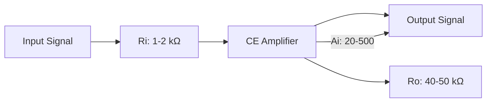

**યાદવાક્ય:** "CAR" - CE માં Current gain ઊંચો, Average input resistance, અને Robust output resistance.

## પ્રશ્ન 1(બ) [4 ગુણ]

**હીટ સિંક પર ટૂંકી નોંધ લખો.**

**જવાબ**:

**હીટ સિંક: એવું ઉપકરણ જે ઇલેક્ટ્રોનિક ઘટકોમાંથી ગરમી શોષે છે અને વિખેરે છે**

**આકૃતિ:**

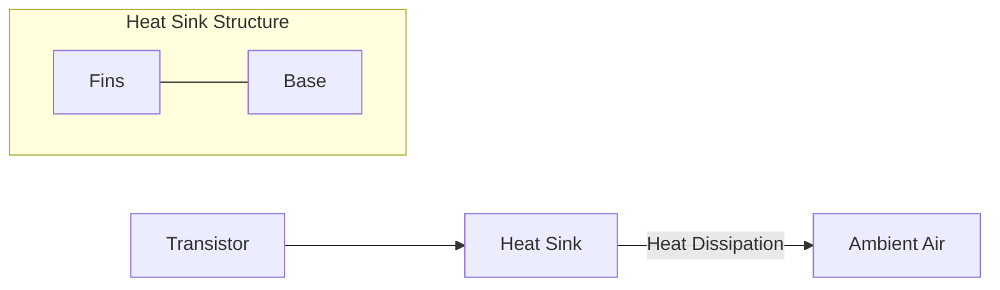

**હીટ સિંકના પ્રકારો:**

- **પેસિવ હીટ સિંક**: કુદરતી convection પર આધાર રાખે છે
- **એક્ટિવ હીટ સિંક**: ફોર્સ્ડ એર convection માટે ફેન વાપરે છે
- **લિક્વિડ-કૂલ્ડ હીટ સિંક**: વધુ સારા heat transfer માટે પ્રવાહી વાપરે છે

**મુખ્ય કાર્યો:**

- **થર્મલ કન્ડક્શન**: ઘટકોમાંથી ગરમી દૂર ખેંચે છે
- **થર્મલ કન્વેક્શન**: ગરમી આસપાસની હવામાં ટ્રાન્સફર કરે છે
- **સરફેસ એરિયા**: પાંખો વધુ સારા કૂલિંગ માટે સપાટી ક્ષેત્રફળ વધારે છે

**યાદવાક્ય:** "CRAFT" - Cooling through Radiation And Fins for Transistors.

## પ્રશ્ન 1(ક) [7 ગુણ]

**થર્મલ રનઅવે અને થર્મલ સ્ટેબિલિટીનું વર્ણન કરો. ટ્રાન્ઝિસ્ટરમાં થર્મલ રન અવે કેવી રીતે દૂર કરી શકાય?**

**જવાબ**:

**થર્મલ રનઅવે: સ્વ-મજબૂત કરતી પ્રક્રિયા જ્યાં વધતા તાપમાનને કારણે વધુ કરંટ પ્રવાહ થાય છે, જે આગળ તાપમાન વધારે છે**

**થર્મલ સ્ટેબિલિટી: તાપમાન ફેરફારો હોવા છતાં ટ્રાન્ઝિસ્ટર સર્કિટની સ્થિર કામગીરી જાળવવાની ક્ષમતા**

**આકૃતિ:**

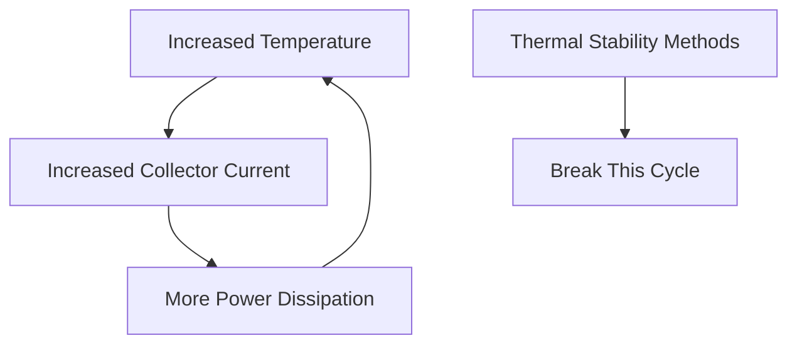

**થર્મલ રનઅવે દૂર કરવાની પદ્ધતિઓ:**

- **હીટ સિંક**: વધારાની ગરમીને શોષે અને વિખેરે છે
- **નેગેટિવ ફીડબેક**: સ્થિરતા માટે એમિટર રેઝિસ્ટર વાપરવો
- **બાયસ સ્ટેબિલાઇઝેશન**: વોલ્ટેજ ડિવાઇડર બાયસિંગ સર્કિટ
- **તાપમાન ક્ષતિપૂર્તિ**: ડાયોડ અથવા થર્મિસ્ટર્સનો ઉપયોગ કરવો

**મુખ્ય મુદ્દાઓ:**

- **IC = ICBO(1+β) + βIB**: કલેક્ટર કરંટ પરાધીનતા દર્શાવે છે
- **ICBO બમણો થાય છે**: દર 10°C તાપમાન વધારા માટે
- **સ્ટેબિલિટી ફેક્ટર S**: ઓછું S એટલે વધુ સારી સ્થિરતા

**યાદવાક્ય:** "RENT" - Reduce heat with sinks, Emitter resistors stabilize, Negative feedback helps, Temperature compensation.

## પ્રશ્ન 1(ક) OR [7 ગુણ]

**બાયસિંગ પદ્ધતિઓના પ્રકારો લખો. વોલ્ટેજ વિભાજક બાયસિંગ પદ્ધતિને વિગતોમાં સમજાવો.**

**જવાબ**:

**બાયસિંગ પદ્ધતિઓના પ્રકારો:**

- ફિક્સ્ડ બાયસ
- કલેક્ટર-ટુ-બેઝ બાયસ
- વોલ્ટેજ ડિવાઇડર બાયસ
- એમિટર બાયસ
- કલેક્ટર ફીડબેક બાયસ

**વોલ્ટેજ ડિવાઇડર બાયસ સર્કિટ:**

```goat
    +Vcc
     |
     R1
     |
     +----+
     |    |
     R2   |
     |    |
     +    |
     |    |
GND -+--+-+--+- B
         |    |
         |    C
         |    |
         +----+
         |    E
         RE   |
         |    |
        GND  GND
```

**કાર્યપ્રણાલી:**

- **R1 અને R2**: બેઝ વોલ્ટેજ પ્રદાન કરતા વોલ્ટેજ ડિવાઇડર બનાવે છે
- **RE**: સ્થિરતા અને નેગેટિવ ફીડબેક પ્રદાન કરે છે
- **સ્ટેબલ બાયસ પોઇન્ટ**: તાપમાન અને β ફેરફારોથી ઓછો પ્રભાવિત

**ફાયદાઓ:**

- **ઉત્તમ સ્થિરતા**: તાપમાન ફેરફારોથી ઓછો પ્રભાવિત
- **β થી સ્વતંત્ર**: બાયસ પોઇન્ટ ટ્રાન્ઝિસ્ટર ગેઇનથી ખૂબ પ્રભાવિત નથી
- **વ્યાપકપણે ઉપયોગમાં**: એમ્પ્લીફાયર માટે સૌથી સામાન્ય બાયસિંગ પદ્ધતિ

**યાદવાક્ય:** "DIVE" - Divider biasing Is Very Effective for stability.

## પ્રશ્ન 2(અ) [3 ગુણ]

**સ્ટેબિલિટી પરિબળનું લક્ષણો સમજાવો.**

**જવાબ**:

**સ્ટેબિલિટી ફેક્ટર (S): બાયસિંગ સર્કિટ તાપમાન ફેરફારો સાથે સ્થિર કામગીરી કેટલી સારી રીતે જાળવે છે તેનું માપ**

**ગાણિતિક વ્યાખ્યા:**
S = ΔIC/ΔICBO (કલેક્ટર કરંટમાં ફેરફાર / રિવર્સ સેચ્યુરેશન કરંટમાં ફેરફાર)

**કોષ્ટક: વિવિધ બાયસ સર્કિટ્સ માટે સ્ટેબિલિટી ફેક્ટર્સ**

| બાયસિંગ મેથડ | સ્ટેબિલિટી ફેક્ટર | સ્ટેબિલિટી લેવલ |
|----------------|------------------|-----------------|
| ફિક્સ્ડ બાયસ | S = 1+β | ખરાબ |
| કલેક્ટર-ટુ-બેઝ | S = β/(1+β) | બેહતર |
| વોલ્ટેજ ડિવાઇડર | S ≈ 1 | ઉત્તમ |

**મુખ્ય લક્ષણો:**

- **ઓછો S મૂલ્ય**: વધુ સારી સ્થિરતા દર્શાવે છે (આદર્શ S=1)
- **તાપમાન પ્રતિરોધ**: તાપમાન ફેરફારોથી રક્ષણની માત્રા માપે છે
- **સર્કિટ ડિઝાઇન ટૂલ**: બાયસિંગ પદ્ધતિઓની તુલના કરવામાં મદદ કરે છે

**યાદવાક્ય:** "SOS" - Stability Of circuit Shows in its S-factor.

## પ્રશ્ન 2(બ) [4 ગુણ]

**કાસ્કેડીંગની ડાયરેક્ટ કપ્લીંગ ટેકનિકનું વર્ણન કરો.**

**જવાબ**:

**ડાયરેક્ટ કપ્લીંગ: કપલિંગ કેપેસિટર્સ વિના સ્ટેજ જોડવું, એક સ્ટેજના કલેક્ટરને સીધો આગલા સ્ટેજના બેઝ સાથે જોડવો**

**આકૃતિ:**

```goat
      +Vcc                +Vcc
        |                   |
        |                   |
        Rc                  Rc
        |                   |
  +-----+                   +-----+
  |     |                   |     |
  |     C       B           |     C  Output
  |     |-------+           |     |-------+
  |     |       |           |     |
Input   |       |           |     |
  +-----|B      |           |     |
        |       |           |     |
        |       E           |     E
        |       |           |     |
       GND     GND         GND   GND
       
       First Stage          Second Stage
```

**મુખ્ય લક્ષણો:**

- **કોઈ કપલિંગ ઘટકો નહીં**: સીધો ઇલેક્ટ્રિકલ કનેક્શન
- **પૂર્ણ ફ્રીક્વન્સી રિસ્પોન્સ**: સારી લો-ફ્રીક્વન્સી પરફોર્મન્સ
- **DC લેવલ શિફ્ટિંગ**: સ્ટેજ વચ્ચે જરૂરી છે

**એપ્લિકેશન્સ:**

- **ઓપરેશનલ એમ્પ્લીફાયર્સ**: આંતરિક સ્ટેજ
- **DC એમ્પ્લીફાયર્સ**: જ્યાં લો-ફ્રીક્વન્સી રિસ્પોન્સ મહત્વપૂર્ણ છે

**યાદવાક્ય:** "DIRECT" - DC signals Immediately REach Connecting Transistors.

## પ્રશ્ન 2(ક) [7 ગુણ]

**બે તબક્કાનાં આર સી કપલ્ડ એમ્પલીફાયરનો આવર્તન પ્રતિભાવ સમજાવો.**

**જવાબ**:

**RC કપલ્ડ એમ્પ્લીફાયર: એમ્પલીફિકેશન સ્ટેજ વચ્ચે કપલિંગ માટે રેસિસ્ટર-કેપેસિટર નેટવર્ક વાપરે છે**

**ફ્રીક્વન્સી રિસ્પોન્સ આકૃતિ:**

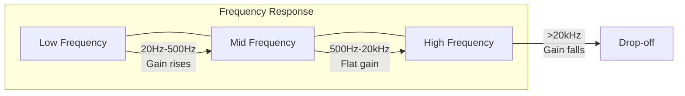

**કોષ્ટક: ફ્રીક્વન્સી રીજન**

| રીજન | ફ્રીક્વન્સી રેન્જ | લક્ષણો | મર્યાદિત ઘટકો |
|--------|-----------------|-----------------|---------------------|
| **લો** | 20Hz-500Hz | ફ્રીક્વન્સી સાથે ગેઇન વધે છે | કપલિંગ કેપેસિટર્સ |
| **મિડ** | 500Hz-20kHz | સ્થિર ગેઇન (મહત્તમ) | કોઈ નહીં |
| **હાઇ** | >20kHz | ફ્રીક્વન્સી સાથે ગેઇન ઘટે છે | ટ્રાન્ઝિસ્ટર કેપેસિટન્સ |

**બે-સ્ટેજની અસર:**

- **બેન્ડવિડ્થ**: સિંગલ સ્ટેજ કરતાં સાંકડી
- **ગેઇન**: સિંગલ સ્ટેજના લગભગ વર્ગ જેટલો (A₁ × A₂)
- **ફેઝ શિફ્ટ**: લો અને હાઇ ફ્રીક્વન્સી પર બમણી

**યાદવાક્ય:** "LMH" - Low frequencies by coupling caps, Mid frequencies flat, High frequencies by transistor caps.

## પ્રશ્ન 2(અ) OR [3 ગુણ]

**એમ્પ્લીફાયરની બેન્ડવિડ્થ અને ગેઇન-બેન્ડવિડ્થ ઉત્પાદનને સંક્ષિપ્તમાં સમજાવો.**

**જવાબ**:

**બેન્ડવિડ્થ (BW): ફ્રીક્વન્સીઓની રેન્જ જ્યાં એમ્પ્લીફાયર ગેઇન મહત્તમ ગેઇનના ઓછામાં ઓછા 70.7% છે**

**ગેઇન-બેન્ડવિડ્થ પ્રોડક્ટ (GBP): વોલ્ટેજ ગેઇન અને બેન્ડવિડ્થનો ગુણાકાર, આપેલા એમ્પલીફાયર માટે સ્થિર**

**આકૃતિ:**

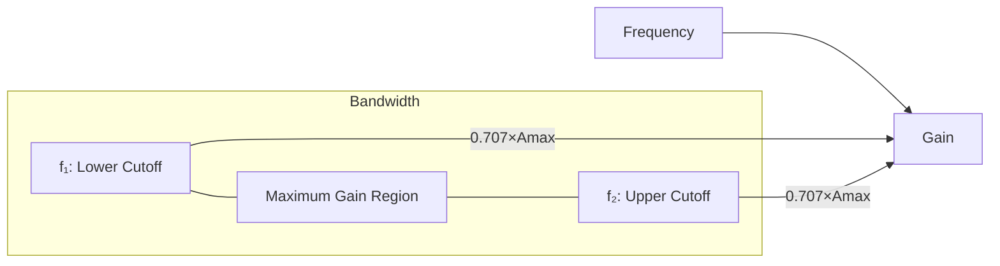

**મુખ્ય સૂત્રો:**

- **બેન્ડવિડ્થ**: BW = f₂ - f₁
- **ગેઇન-બેન્ડવિડ્થ પ્રોડક્ટ**: GBP = A₀ × BW (સ્થિર)

**યાદવાક્ય:** "BAND" - Bandwidth And gain Never Drop together (એક વધે ત્યારે બીજો ઘટે).

## પ્રશ્ન 2(બ) OR [4 ગુણ]

**એમ્પલીફાયરના ફ્રીક્વન્સી રિસ્પોન્સ પર એમિટર બાયપાસ કેપેસિટર અને કપલિંગ કેપેસિટરની અસરો સમજાવો.**

**જવાબ**:

**ફ્રીક્વન્સી રિસ્પોન્સ પર અસરો:**

**કોષ્ટક: કેપેસિટર અસરો**

| કેપેસિટર | કાર્ય | ફ્રીક્વન્સી રિસ્પોન્સ પર અસર |
|-----------|----------|------------------------------|
| **કપલિંગ કેપેસિટર (Cc)** | DC બ્લોક કરે, AC પસાર કરે | લો-ફ્રીક્વન્સી રિસ્પોન્સ મર્યાદિત કરે |
| **બાયપાસ કેપેસિટર (Ce)** | એમિટર રેઝિસ્ટરને બાયપાસ કરે | મિડ અને હાઇ ફ્રીક્વન્સી પર ગેઇન વધારે |

**આકૃતિ:**

```goat
    +Vcc
     |
     Rc
     |
     +-------+
     |       |
 Cc  |       |
 ||--+       C
 ||  |       |
Input  B     |
     |       |
     |       E
     |       |
     Re      |
     |       |
     +--||---+
     |   Ce
    GND
```

**મુખ્ય અસરો:**

- **Ce વગર**: ઓછો ગેઇન, વધુ સારી સ્થિરતા, વધુ સારો લો-ફ્રીક્વન્સી રિસ્પોન્સ
- **Cc વગર**: DC કપલિંગ, ઉત્તમ લો-ફ્રીક્વન્સી રિસ્પોન્સ
- **કેપેસિટર મૂલ્યો**: કટઓફ ફ્રીક્વન્સીઓ (f₁, f₂) નક્કી કરે છે

**યાદવાક્ય:** "CELL" - Coupling affects Extremely Low frequencies, bypass affects Low to high.

## પ્રશ્ન 2(ક) OR [7 ગુણ]

**ટ્રાન્સફોર્મર કપલ્ડ એમ્પલીફાયર અને આરસી કપલ્ડ એમ્પલીફાયરની સરખામણી કરો**

**જવાબ**:

**કોષ્ટક: ટ્રાન્સફોર્મર કપલ્ડ vs RC કપલ્ડ એમ્પલીફાયરની સરખામણી**

| લક્ષણ | ટ્રાન્સફોર્મર કપલ્ડ | RC કપલ્ડ |
|---------|---------------------|------------|
| **કપલિંગ ઘટક** | ટ્રાન્સફોર્મર | કેપેસિટર અને રેઝિસ્ટર |
| **કાર્યક્ષમતા** | ઊંચી (90%) | મધ્યમ (20-30%) |
| **કદ અને વજન** | મોટું અને ભારે | કોમ્પેક્ટ અને હલકું |
| **ખર્ચ** | મોંઘું | સસ્તું |
| **ફ્રીક્વન્સી રિસ્પોન્સ** | ખરાબ (મર્યાદિત બેન્ડવિડ્થ) | સારો (વિશાળ બેન્ડવિડ્થ) |
| **ઇમ્પીડન્સ મેચિંગ** | ઉત્તમ | ખરાબ |
| **DC આઇસોલેશન** | સંપૂર્ણ | માત્ર AC સિગ્નલ્સ |
| **ડિસ્ટોર્શન** | ઊંચું | નીચું |

**આકૃતિ:**

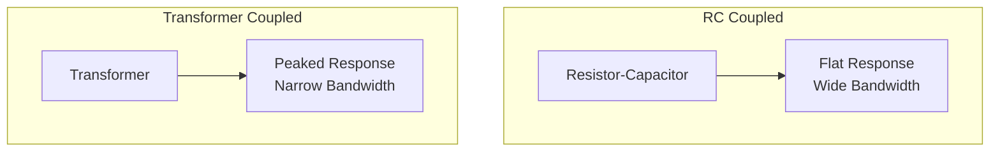

**એપ્લિકેશન્સ:**

- **RC કપલ્ડ**: ઓડિયો એમ્પલીફાયર્સ, જનરલ-પર્પઝ એમ્પલીફાયર્સ
- **ટ્રાન્સફોર્મર કપલ્ડ**: પાવર એમ્પલીફાયર્સ, રેડિયો ટ્રાન્સમિટર્સ

**યાદવાક્ય:** "TRIP" - Transformers are Robust for Impedance matching, Problematic for bandwidth.

## પ્રશ્ન 3(અ) [3 ગુણ]

**ટ્યુન કરેલ એમ્પલીફાયર તરીકે ઉપયોગમાં લેવાતા ટ્રાન્ઝિસ્ટરનું વર્ણન કરો.**

**જવાબ**:

**ટ્યુન્ડ એમ્પલીફાયર: એમ્પલીફાયર જે સાંકડા ફ્રીક્વન્સી બેન્ડમાં સિગ્નલ્સને પસંદગીપૂર્વક એમ્પલિફાય કરે છે**

**આકૃતિ:**

```goat
    +Vcc
     |
     |
     +---+
     |   |
     L   |
     |   |
 Cin |   |
 ||--+---+
 ||  |   |
Input  B |
     |   |
     |   C      Cout
     |   +------||----+ Output
     |   |             |
     |   E             |
     |   |             |
     |  Re             |
     |   |             |
    GND GND           GND
```

**મુખ્ય ઘટકો:**

- **LC ટેંક સર્કિટ**: રેઝોનન્ટ ફ્રીક્વન્સી નક્કી કરે છે
- **ટ્રાન્ઝિસ્ટર**: એમ્પલીફિકેશન પૂરું પાડે છે
- **રેઝોનન્ટ ફ્રીક્વન્સી**: f₀ = 1/(2π√LC)

**એપ્લિકેશન્સ:**

- **રેડિયો રિસીવર્સ**: ઇચ્છિત ફ્રીક્વન્સી પસંદ કરે છે
- **TV ટ્યુનર્સ**: ચેનલ પસંદગી
- **RF એમ્પલીફાયર્સ**: કમ્યુનિકેશન સિસ્ટમ્સ

**યાદવાક્ય:** "TUNE" - Transistors Using Narrowband Elements for frequency selection.

## પ્રશ્ન 3(બ) [4 ગુણ]

**ડાયરેક્ટ કપલ્ડ એમ્પલીફાયરને સંક્ષિપ્તમાં સમજાવો.**

**જવાબ**:

**ડાયરેક્ટ કપલ્ડ એમ્પલીફાયર: મલ્ટિપલ સ્ટેજ એમ્પલીફાયર જ્યાં કપલિંગ કેપેસિટર્સ અથવા ટ્રાન્સફોર્મર્સ વગર સ્ટેજ સીધા જોડાયેલા છે**

**આકૃતિ:**

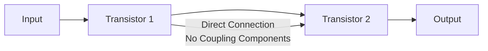

**મુખ્ય લક્ષણો:**

- **DC એમ્પલીફિકેશન**: DC થી ઊંચી ફ્રીક્વન્સી સુધી એમ્પલિફાય કરી શકે છે
- **કોઈ કપલિંગ ઘટકો નહીં**: કલેક્ટર આગલા બેઝ સાથે સીધો જોડાયેલો
- **લેવલ શિફ્ટિંગ**: સ્ટેજ વચ્ચે જરૂરી છે
- **થર્મલ ડ્રિફ્ટ**: સીધા DC કપલિંગને કારણે પડકાર

**એપ્લિકેશન્સ:**

- **ઓપરેશનલ એમ્પલીફાયર્સ**: આંતરિક સ્ટેજ
- **DC એમ્પલીફાયર્સ**: લેબોરેટરી ઇન્સ્ટ્રુમેન્ટ્સ
- **સેન્સિંગ સર્કિટ્સ**: તાપમાન અને દબાણ સેન્સર્સ

**યાદવાક્ય:** "DCAP" - Direct Coupled Amplifier Passes all frequencies including DC.

## પ્રશ્ન 3(ક) [7 ગુણ]

**બે પોર્ટ નેટવર્કમાં h પરિમાણોનું મહત્વ વર્ણવો. CE એમ્પલીફાયર માટે h-પેરામીટર્સ સર્કિટ દોરો.**

**જવાબ**:

**h-પેરામીટર્સ (હાઇબ્રિડ પેરામીટર્સ): ચાર પેરામીટર્સનો સેટ જે બે-પોર્ટ નેટવર્કનું વર્તન વ્યાખ્યાયિત કરે છે**

**મહત્વ:**

- **સંપૂર્ણ ચરિત્રીકરણ**: એમ્પલીફાયર વર્તનને સંપૂર્ણ રીતે વર્ણવે છે
- **સરળ માપન**: સરળ સ્થિતિઓ હેઠળ માપી શકાય છે
- **વિશ્લેષણ ટૂલ**: સર્કિટ વિશ્લેષણને સરળ બનાવે છે
- **માનકીકૃત અભિગમ**: ટ્રાન્ઝિસ્ટર્સની તુલના માટે સાર્વત્રિક પદ્ધતિ

**h-પેરામીટર સમીકરણો:**

- V₁ = h₁₁I₁ + h₁₂V₂
- I₂ = h₂₁I₁ + h₂₂V₂

**CE એમ્પલીફાયર માટે h-પેરામીટર સર્કિટ:**

```goat
                     +
                     |
                    Ic
               +-----+-----+
               |     |     |
         +     |     |     |
        Ii     |    hoe    |
     +-->--+   |     |     |
     |     |   |     |     |    +
  +  |    hie  |    hfe·Ii |   Vo
 Vi  |     |   |     |     |    -
  -  |     |   |     |     |
     +--+--+   |     |     |
        |      |     |     |
        +<-----+     |     |
        hre·Vo       |     |
               |     |     |
               +-----+-----+
                     |
                     +
```

**કોષ્ટક: CE કોન્ફિગરેશન માટે h-પેરામીટર્સ**

| પેરામીટર | સિમ્બોલ | સામાન્ય મૂલ્ય | ભૌતિક અર્થ |
|-----------|--------|---------------|------------------|
| **ઇનપુટ ઇમ્પીડન્સ** | h₁₁ (hie) | 1-2 kΩ | આઉટપુટ શોર્ટ સાથે ઇનપુટ રેઝિસ્ટન્સ |
| **રિવર્સ વોલ્ટેજ ટ્રાન્સફર** | h₁₂ (hre) | 1-4 × 10⁻⁴ | રિવર્સ ફીડબેક રેશિયો |
| **ફોરવર્ડ કરંટ ટ્રાન્સફર** | h₂₁ (hfe) | 20-500 | કરંટ ગેઇન (β) |
| **આઉટપુટ એડમિટન્સ** | h₂₂ (hoe) | 20-50 μS | આઉટપુટ કન્ડક્ટન્સ |

**યાદવાક્ય:** "HIRE" - h-parameters Include Resistance and current gain Effectively.

## પ્રશ્ન 3(અ) OR [3 ગુણ]

**ટ્રાન્સફોર્મર કપલ્ડ એમ્પલીફાયર અને ડાયરેક્ટ કપલ્ડ એમ્પલીફાયરની સરખામણી કરો.**

**જવાબ**:

**કોષ્ટક: ટ્રાન્સફોર્મર અને ડાયરેક્ટ કપલ્ડ એમ્પલીફાયર વચ્ચે સરખામણી**

| લક્ષણ | ટ્રાન્સફોર્મર કપલ્ડ | ડાયરેક્ટ કપલ્ડ |
|---------|---------------------|---------------|
| **કપલિંગ ઘટક** | ટ્રાન્સફોર્મર | કોઈ નહીં (સીધું કનેક્શન) |
| **ફ્રીક્વન્સી રિસ્પોન્સ** | લો ફ્રીક્વન્સી પર મર્યાદિત | ઉત્તમ (DC થી ઊંચી ફ્રીક્વન્સી) |
| **DC આઇસોલેશન** | સંપૂર્ણ | કોઈ નહીં |
| **કદ** | મોટું | કોમ્પેક્ટ |
| **ખર્ચ** | ઊંચો | નિમ્ન |
| **DC શિફ્ટ સમસ્યા** | ના | હા |

**આકૃતિ:**

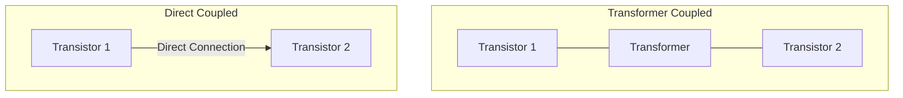

**યાદવાક્ય:** "TDC" - Transformers provide DC isolation, Direct provides Complete frequency range.

## પ્રશ્ન 3(બ) OR [4 ગુણ]

**કોમન એમિટર એમ્પલીફાયરનું સર્કિટ ડાયાગ્રામ દોરો અને સમજાવો.**

**જવાબ**:

**કોમન એમિટર એમ્પલીફાયર: એવી કોન્ફિગરેશન જ્યાં એમિટર ઇનપુટ અને આઉટપુટ બંને સર્કિટ્સ માટે કોમન છે**

**સર્કિટ ડાયાગ્રામ:**

```goat
                 +Vcc
                  |
                  |
                  Rc
                  |
                  +--------+ Output
                  |        |
             +----+        |
             |    |        |
     Input   |    C        |
     +-------|B   |        |
     |       |    |        |
     |       |    E        |
     |       |    |        |
     |       |    +        |
     |       |    |        |
     |       |   Re        |
     |       |    |        |
    GND     GND  GND      GND
```

**કાર્યપ્રણાલી:**

- **ઇનપુટ**: બેઝ અને એમિટર વચ્ચે લાગુ કરવામાં આવે છે
- **આઉટપુટ**: કલેક્ટર અને એમિટરથી લેવામાં આવે છે
- **ફેઝ શિફ્ટ**: ઇનપુટ અને આઉટપુટ વચ્ચે 180°
- **ગેઇન**: ઊંચો વોલ્ટેજ અને કરંટ ગેઇન

**મુખ્ય લક્ષણો:**

- **ઊંચો ગેઇન**: સામાન્ય વોલ્ટેજ ગેઇન 300-1000
- **મધ્યમ ઇનપુટ ઇમ્પીડન્સ**: 1-2 kΩ
- **ઊંચો આઉટપુટ ઇમ્પીડન્સ**: 40-50 kΩ
- **સિગ્નલ ઇન્વર્ઝન**: આઉટપુટ ઇન્વર્ટેડ છે

**યાદવાક્ય:** "CEA" - Common Emitter Amplifies with signal inversion.

## પ્રશ્ન 3(ક) OR [7 ગુણ]

**ટ્રાન્ઝિસ્ટર ટુ પોર્ટ નેટવર્ક દોરો અને તેના માટે h-પેરામીટર્સનું વર્ણન કરો. હાઇબ્રિડ પરિમાણોના ફાયદા લખો.**

**જવાબ**:

**ટ્રાન્ઝિસ્ટર ટુ-પોર્ટ નેટવર્ક:**

```goat
        I1             I2
        -->            -->
    +-------+      +-------+
    |       |      |       |
    |       |      |       |
  + |       |      |       | +
 V1 |  Two  |      |  Port | V2
  - |       |      |       | -
    |       |      |       |
    |       |      |       |
    +-------+      +-------+
```

**h-પેરામીટર સમીકરણો:**

- V₁ = h₁₁I₁ + h₁₂V₂
- I₂ = h₂₁I₁ + h₂₂V₂

**કોષ્ટક: h-પેરામીટર્સ વર્ણન**

| પેરામીટર | સિમ્બોલ | વર્ણન | માપન સ્થિતિ |
|-----------|--------|-------------|----------------------|
| **ઇનપુટ ઇમ્પીડન્સ** | h₁₁ | V₁/I₁ નો ગુણોત્તર | V₂ = 0 (આઉટપુટ શોર્ટ) |
| **રિવર્સ વોલ્ટેજ ટ્રાન્સફર** | h₁₂ | V₁/V₂ નો ગુણોત્તર | I₁ = 0 (ઇનપુટ ઓપન) |
| **ફોરવર્ડ કરંટ ટ્રાન્સફર** | h₂₁ | I₂/I₁ નો ગુણોત્તર | V₂ = 0 (આઉટપુટ શોર્ટ) |
| **આઉટપુટ એડમિટન્સ** | h₂₂ | I₂/V₂ નો ગુણોત્તર | I₁ = 0 (ઇનપુટ ઓપન) |

**હાઇબ્રિડ પેરામીટર્સના ફાયદા:**

- **સરળ માપન**: દરેક પેરામીટર માટે સરળ શરતો
- **સાર્વત્રિકતા**: બધા ટ્રાન્ઝિસ્ટર કોન્ફિગરેશન માટે કામ કરે છે
- **સંપૂર્ણ ચરિત્રીકરણ**: વર્તનનું સંપૂર્ણ વર્ણન કરે છે
- **ગાણિતિક સરળતા**: લીનિયર સમીકરણો
- **માનકીકૃત**: સ્પેસિફિકેશન માટે ઉદ્યોગ માનક

**યાદવાક્ય:** "HAEM" - Hybrid parameters Are Easily Measured and mathematically simple.

## પ્રશ્ન 4(અ) [3 ગુણ]

**ડાર્લિંગ્ટન જોડી અને તેની એપ્લિકેશનો સમજાવો.**

**જવાબ**:

**ડાર્લિંગ્ટન પેર: બે ટ્રાન્ઝિસ્ટર્સની કોન્ફિગરેશન જ્યાં પહેલાનો એમિટર બીજાના બેઝ સાથે જોડાયેલો છે**

**આકૃતિ:**

```goat
           +Vcc
            |
            |
            Rc
            |
            +------ Output
            |
            |
     +------+
     |      |
     |      C2
     |      |
Input|      |
+----+B1    |
     |      |
     |  E1  |
     |  |   |
     |  +B2 |
     |      |
     |      E2
     |      |
    GND    GND
```

**મુખ્ય લક્ષણો:**

- **ખૂબ ઊંચો કરંટ ગેઇન**: β₁ × β₂ (સામાન્ય 1000-30000)
- **ઊંચો ઇનપુટ ઇમ્પીડન્સ**: β₂ × Rin₁
- **નિમ્ન આઉટપુટ ઇમ્પીડન્સ**: સિંગલ ટ્રાન્ઝિસ્ટર જેવું

**એપ્લિકેશન્સ:**

- **પાવર એમ્પલીફાયર્સ**: ઓડિયો ઇક્વિપમેન્ટ
- **બફર સર્કિટ્સ**: ઊંચા ઇમ્પીડન્સથી નિમ્ન ઇમ્પીડન્સ
- **મોટર ડ્રાઇવર્સ**: ઊંચા-કરંટ લોડ્સ કંટ્રોલ
- **ટચ સેન્સર્સ**: ઊંચી સંવેદનશીલતા એપ્લિકેશન્સ

**યાદવાક્ય:** "DISH" - Darlington Integrates Stages for High current gain.

## પ્રશ્ન 4(બ) [4 ગુણ]

**જરૂરી ડાયાગ્રામ સાથે ડાયોડ ક્લેમ્પર સર્કિટનું વર્ણન કરો.**

**જવાબ**:

**ક્લેમ્પર સર્કિટ: વેવફોર્મના આકારને બદલ્યા વગર તેના DC લેવલને શિફ્ટ કરે છે**

**આકૃતિ:**

```goat
           C1
Input +----||----+----+ Output
                 |    |
                 |    |
                 R    D
                 |    |
                 |    |
                GND  GND
```

**કાર્યપ્રણાલી:**

- **પોઝિટિવ ક્લેમ્પર**: વેવફોર્મને નીચે શિફ્ટ કરે છે
- **નેગેટિવ ક્લેમ્પર**: વેવફોર્મને ઉપર શિફ્ટ કરે છે
- **કેપેસિટર**: DC બ્લોક કરે, AC પસાર કરે
- **ડાયોડ**: એક હાફ-સાયકલ દરમિયાન કન્ડક્ટ કરે છે
- **રેઝિસ્ટર**: કેપેસિટર માટે ડિસ્ચાર્જ પાથ

**ટાઇમ કોન્સ્ટન્ટ્સ:**

- **ચાર્જિંગ**: ખૂબ નાનું (ડાયોડ ફોરવર્ડ રેઝિસ્ટન્સ × C)
- **ડિસ્ચાર્જિંગ**: સિગ્નલ પીરિયડની સરખામણીમાં મોટું (R × C)

**એપ્લિકેશન્સ:**

- **TV સિગ્નલ પ્રોસેસિંગ**: DC ઘટક પુનઃસ્થાપિત કરે છે
- **પલ્સ સર્કિટ્સ**: લેવલ શિફ્ટિંગ
- **સિગ્નલ પ્રોસેસિંગ**: DC પુનઃસ્થાપના

**યાદવાક્ય:** "CLAMP" - Circuit Levels Are Modified Precisely.

## પ્રશ્ન 4(ક) [7 ગુણ]

**OLED નાં બાંધકામ, કાર્ય અને એપ્લિકેશન સમજાવો.**

**જવાબ**:

**OLED (ઓર્ગેનિક લાઇટ એમિટિંગ ડાયોડ): ઓર્ગેનિક કંપાઉન્ડ્સનો ઉપયોગ કરતું પ્રકાશ-ઉત્સર્જક ઉપકરણ**

**બાંધકામ:**

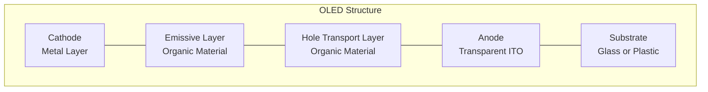

**કાર્ય સિદ્ધાંત:**

- **ઇલેક્ટ્રોન ઇન્જેક્શન**: કેથોડ ઇલેક્ટ્રોન્સ ઇન્જેક્ટ કરે છે
- **હોલ ઇન્જેક્શન**: એનોડ હોલ્સ ઇન્જેક્ટ કરે છે
- **રીકોમ્બિનેશન**: ઇલેક્ટ્રોન્સ અને હોલ્સ એમિસિવ લેયરમાં જોડાય છે
- **પ્રકાશ ઉત્સર્જન**: ઊર્જા ફોટોન્સ તરીકે મુક્ત થાય છે
- **રંગ નિયંત્રણ**: વિભિન્ન ઓર્ગેનિક સામગ્રી વિભિન્ન રંગો ઉત્સર્જિત કરે છે

**કોષ્ટક: OLED પ્રકારો**

| પ્રકાર | માળખું | મુખ્ય લક્ષણ |
|------|-----------|------------|
| **PMOLED** | પેસિવ મેટ્રિક્સ | સરળ ડિઝાઇન, ઓછી કિંમત |
| **AMOLED** | એક્ટિવ મેટ્રિક્સ | વધુ સારા રિફ્રેશ રેટ્સ, ઊંચી રેઝોલ્યુશન |
| **TOLED** | ટ્રાન્સપેરન્ટ | બંધ અથવા ચાલુ હોય ત્યારે પારદર્શક |
| **FOLED** | ફ્લેક્સિબલ | વાળી શકાય કે રોલ કરી શકાય |

**એપ્લિકેશન્સ:**

- **ડિસ્પ્લે**: સ્માર્ટફોન્સ, ટીવી, સ્માર્ટવોચ
- **લાઇટિંગ**: પાતળા, કાર્યક્ષમ લાઇટિંગ પેનલ્સ
- **સાઇનેજ**: ઊંચા-કોન્ટ્રાસ્ટ ડિજિટલ સાઇન્સ
- **વેરેબલ ટેક્નોલોજી**: ફ્લેક્સિબલ ડિસ્પ્લે

**યાદવાક્ય:** "OLED" - Organic Layers Emit Directly when electrically stimulated.

## પ્રશ્ન 4(અ) OR [3 ગુણ]

**LDR પર ટૂંકી નોંધ સમજાવો.**

**જવાબ**:

**LDR (લાઇટ ડિપેન્ડન્ટ રેઝિસ્ટર): ફોટોરેઝિસ્ટર જેનો રેઝિસ્ટન્સ વધતી પ્રકાશ તીવ્રતા સાથે ઘટે છે**

**સિમ્બોલ અને માળખું:**

```goat
    ┌─────┐
    │     │
────┤ /'\ ├────
    │     │
    └─────┘
     Symbol
     
      Light
       ↓↓↓
    ┌───────┐
    │┌─────┐│
────┤│CdS  ││────
    │└─────┘│
    └───────┘
     Structure
```

**મુખ્ય લક્ષણો:**

- **સામગ્રી**: સામાન્ય રીતે કેડમિયમ સલ્ફાઇડ (CdS)
- **અંધકાર રેઝિસ્ટન્સ**: ઊંચો (MΩ રેન્જ)
- **પ્રકાશ રેઝિસ્ટન્સ**: નિમ્ન (kΩ રેન્જ)
- **રિસ્પોન્સ ટાઇમ**: મિલિસેકન્ડથી સેકન્ડ્સ

**એપ્લિકેશન્સ:**

- **લાઇટ સેન્સર્સ**: ઓટોમેટિક લાઇટિંગ કંટ્રોલ
- **કેમેરા એક્સપોઝર કંટ્રોલ**: લાઇટ મીટરિંગ
- **સ્ટ્રીટ લાઇટ કંટ્રોલ**: સૂર્યોદય-થી-સૂર્યાસ્ત સક્રિયતા
- **અલાર્મ સિસ્ટમ્સ**: લાઇટ બીમ ડિટેક્શન

**યાદવાક્ય:** "LORD" - Light Oppositely Reduces the Device's resistance.

## પ્રશ્ન 4(બ) OR [4 ગુણ]

**જરૂરી ડાયાગ્રામ સાથે ડાયોડ ક્લિપર સર્કિટનું વર્ણન કરો.**

**જવાબ**:

**ક્લિપર સર્કિટ: ઇનપુટ સિગ્નલનો એવો ભાગ દૂર કરે છે (ક્લિપ) જે ચોક્કસ વોલ્ટેજ લેવલથી વધી જાય**

**આકૃતિ (પોઝિટિવ ક્લિપર):**

```goat
                R     D
Input +-----+---www---+---+--+ Output
            |         |   |
            |         |   |
            |         +   -
            |         |   |
            |         |   |
            |         V   |
            |         |   |
            +---------+---+
```

**ક્લિપર્સના પ્રકારો:**

- **પોઝિટિવ ક્લિપર**: પોઝિટિવ પીક્સ દૂર કરે છે
- **નેગેટિવ ક્લિપર**: નેગેટિવ પીક્સ દૂર કરે છે
- **બાયસ્ડ ક્લિપર**: નોન-ઝીરો રેફરન્સ પર ક્લિપ કરે છે
- **કોમ્બિનેશન ક્લિપર**: બંને પીક્સ ક્લિપ કરે છે

**કાર્યપ્રણાલી:**

- **ડાયોડ ON**: જ્યારે સિગ્નલ રેફરન્સ વોલ્ટેજથી વધે છે
- **ડાયોડ OFF**: જ્યારે સિગ્નલ રેફરન્સ વોલ્ટેજથી નીચે છે
- **ક્લિપિંગ લેવલ**: રેફરન્સ વોલ્ટેજ દ્વારા નિર્ધારિત

**એપ્લિકેશન્સ:**

- **વેવ શેપિંગ**: સ્ક્વેર વેવ્સ બનાવવા
- **સર્કિટ પ્રોટેક્શન**: વોલ્ટેજ લિમિટિંગ
- **નોઇઝ રિમૂવલ**: ઇમ્પલ્સ નોઇઝ મર્યાદિત કરવું

**યાદવાક્ય:** "CLIP" - Circuit Limits Input Peaks using diodes.

## પ્રશ્ન 4(ક) OR [7 ગુણ]

**હાફ વેવ અને ફુલ વેવ વોલ્ટેજ ડબલર સમજાવો.**

**જવાબ**:

**વોલ્ટેજ ડબલર: સર્કિટ જે DC આઉટપુટ વોલ્ટેજ આશરે ઇનપુટ વોલ્ટેજના પીક કરતાં બમણું ઉત્પન્ન કરે છે**

**હાફ-વેવ વોલ્ટેજ ડબલર:**

```goat
               D1
            +---->|---+
            |         |
            |         |
AC Input    |         | C1    + 2Vpeak
    +-------+         +-------+  Output
    |       |         |       |
    |       +---->|---+       |
    |          D2    |        |
    |               C2        |
    |                |        |
    +----------------+--------+
                     |
                    GND
```

**ફુલ-વેવ વોલ્ટેજ ડબલર:**

```goat
               D1
            +---->|---+
            |         |
            |         |
AC Input    |         | C1    + 2Vpeak
    +-------+         +-------+  Output
    |       |         |       |
    |       |         |       |
    |       |    C2   |       |
    |       |    |    |       |
    |       +----|<---+       |
    |          D2             |
    |                |        |
    +----------------+--------+
                     |
                    GND
```

**કોષ્ટક: સરખામણી**

| લક્ષણ | હાફ-વેવ | ફુલ-વેવ |
|---------|-----------|-----------|
| **રિપલ** | ઊંચો | નિમ્ન |
| **કાર્યક્ષમતા** | નિમ્ન | ઊંચી |
| **રિસ્પોન્સ ટાઇમ** | ધીમો | ઝડપી |
| **ઘટકો** | 2 ડાયોડ, 2 કેપેસિટર્સ | 2 ડાયોડ, 2 કેપેસિટર્સ |
| **રેગ્યુલેશન** | ખરાબ | વધુ સારું |

**કાર્યપ્રણાલી:**

- **હાફ-વેવ**: દરેક કેપેસિટરને વૈકલ્પિક હાફ-સાયકલ પર ચાર્જ કરે છે
- **ફુલ-વેવ**: દરેક સાયકલ પર બંને કેપેસિટર્સ ચાર્જ કરે છે
- **આઉટપુટ**: બંને કેપેસિટર્સ પરના વોલ્ટેજનો સરવાળો

**એપ્લિકેશન્સ:**

- **પાવર સપ્લાય**: ઓછા-કરંટ ઊંચા-વોલ્ટેજ જરૂરિયાતો
- **કેસ્કેડ કનેક્શન**: વોલ્ટેજ મલ્ટિપ્લિકેશન માટે
- **ઇલેક્ટ્રોનિક ફ્લેશ**: કેમેરા ઇક્વિપમેન્ટ
- **CRT ડિસ્પ્લે**: ઊંચા વોલ્ટેજ જનરેશન

**યાદવાક્ય:** "DOUBLE" - Diodes Organize Unidirectional Boost, Lifting Electricity to twice input.

## પ્રશ્ન 5(અ) [3 ગુણ]

**IC નો ઉપયોગ કરીને +5 v પાવર સપ્લાય માટે સર્કિટ ડાયાગ્રામ દોરો.**

**જવાબ**:

**7805 વોલ્ટેજ રેગ્યુલેટર IC વાપરીને +5V પાવર સપ્લાય:**

```goat
   AC Input    Bridge     7805
    +--+       Rect.    +-----+
       |     +------+   |     |
       +-----+      +---+ IN  |
       |     |      |   |     |   +5V
       |     +------+   |     +---+--- Output
       +--+--+          | OUT |   |
          |             |     |   |
         GND            +--+--+   |
                           |      |
                          GND    GND
                           
                  C1 |     C2 |
                 === |    === |
                  |  |     |  |
                 GND       GND
```

**મુખ્ય ઘટકો:**

- **7805 IC**: થ્રી-ટર્મિનલ ફિક્સ્ડ વોલ્ટેજ રેગ્યુલેટર
- **ઇનપુટ કેપેસિટર (C1)**: ઇનપુટ રિપલ ફિલ્ટર કરે છે
- **આઉટપુટ કેપેસિટર (C2)**: ટ્રાન્ઝિયન્ટ રિસ્પોન્સ સુધારે છે
- **બ્રિજ રેક્ટિફાયર**: AC ને પલ્સેટિંગ DC માં રૂપાંતર કરે છે

**યાદવાક્ય:** "FIVE" - Fixed IC Voltage Efficiently provided.

## પ્રશ્ન 5(બ) [4 ગુણ]

**પાવર સપ્લાયના સંદર્ભમાં લોડ રેગ્યુલેશન અને લાઇન રેગ્યુલેશનની ચર્ચા કરો.**

**જવાબ**:

**લોડ રેગ્યુલેશન: લોડ કરંટ ફેરફારો હોવા છતાં પાવર સપ્લાયની સ્થિર આઉટપુટ વોલ્ટેજ જાળવવાની ક્ષમતા**

**લાઇન રેગ્યુલેશન: ઇનપુટ વોલ્ટેજ ફેરફારો હોવા છતાં પાવર સપ્લાયની સ્થિર આઉટપુટ વોલ્ટેજ જાળવવાની ક્ષમતા**

**આકૃતિ:**

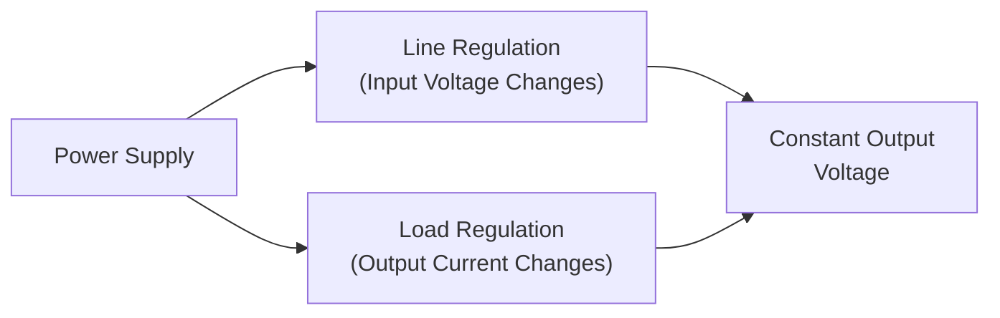

**સૂત્રો:**

- **લોડ રેગ્યુલેશન**: (V₁ - V₂)/V₂ × 100%
  - V₁ = નો-લોડ વોલ્ટેજ
  - V₂ = ફુલ-લોડ વોલ્ટેજ

- **લાઇન રેગ્યુલેશન**: (V₁ - V₂)/V₂ × 100%
  - V₁ = મહત્તમ ઇનપુટ પર આઉટપુટ વોલ્ટેજ
  - V₂ = લઘુત્તમ ઇનપુટ પર આઉટપુટ વોલ્ટેજ

**મુખ્ય મુદ્દાઓ:**

- **નિમ્ન ટકાવારી**: વધુ સારી રેગ્યુલેશન
- **ફીડબેક સર્કિટ**: રેગ્યુલેશન પરફોર્મન્સ સુધારે છે
- **IC રેગ્યુલેટર્સ**: સામાન્ય રીતે સારી રેગ્યુલેશન ઓફર કરે છે (0.01-0.1%)

**યાદવાક્ય:** "LINE LOAD" - Line Is Normal-input Efficiency, LOAD is Output Adjustment Defense.

## પ્રશ્ન 5(ક) [7 ગુણ]

**સર્કિટ ડાયાગ્રામ સાથે LM317 નો ઉપયોગ કરીને એડજસ્ટેબલ વોલ્ટેજ રેગ્યુલેટર સમજાવો.**

**જવાબ**:

**LM317 એડજસ્ટેબલ વોલ્ટેજ રેગ્યુલેટર: થ્રી-ટર્મિનલ ડિવાઇસ જે ચલ રેગ્યુલેટેડ આઉટપુટ વોલ્ટેજ પ્રદાન કરે છે**

**સર્કિટ ડાયાગ્રામ:**

```goat
               LM317
              +------+
              |      |
   Input -----+ IN   |
              |      |    R1
              | ADJ  +----www----+
              |      |           |
              | OUT  |           |
              +--+---+           |
                 |               |
                 +-------www-----+
                 |       R2      |
                 |               |
                 +      C1       +------ Output
                 |      ===      |
                 |       |       |
                GND     GND     GND
```

**કાર્યપ્રણાલી:**

- **રેફરન્સ વોલ્ટેજ**: OUT અને ADJ ટર્મિનલ્સ વચ્ચે 1.25V
- **આઉટપુટ વોલ્ટેજ**: VOUT = 1.25V × (1 + R2/R1)
- **એડજસ્ટમેન્ટ રેન્જ**: 1.25V થી 37V
- **મહત્તમ કરંટ**: 1.5A (યોગ્ય હીટ સિંક સાથે)

**ઘટક પસંદગી:**

- **R1**: સામાન્ય રીતે 240Ω
- **R2**: આઉટપુટ એડજસ્ટ કરવા માટે વેરિયેબલ રેઝિસ્ટર
- **C1**: સ્થિરતા માટે આઉટપુટ કેપેસિટર (1-10μF)

**મુખ્ય લક્ષણો:**

- **કરંટ લિમિટિંગ**: બિલ્ટ-ઇન પ્રોટેક્શન
- **થર્મલ શટડાઉન**: અતિશય ગરમી સામે રક્ષણ
- **સેફ એરિયા પ્રોટેક્શન**: આઉટપુટ ટ્રાન્ઝિસ્ટર્સ માટે
- **રિપલ રિજેક્શન**: સામાન્ય રીતે 80dB

**યાદવાક્ય:** "VARY" - Voltage Adjustable Regulator Yields custom outputs.

## પ્રશ્ન 5(અ) OR [3 ગુણ]

**IC નો ઉપયોગ કરીને -15 v પાવર સપ્લાય માટે સર્કિટ ડાયાગ્રામ દોરો.**

**જવાબ**:

**7915 વોલ્ટેજ રેગ્યુલેટર IC વાપરીને -15V પાવર સપ્લાય:**

```goat
   AC Input    Bridge     7915
    +--+       Rect.    +-----+
       |     +------+   |     |
       +-----+      +---+ IN  |
       |     |      |   |     |   -15V
       |     +------+   |     +---+--- Output
       +--+--+          | OUT |   |
          |             |     |   |
         GND            +--+--+   |
                           |      |
                          GND    GND
                           
                  C1 |     C2 |
                 === |    === |
                  |  |     |  |
                 GND       GND
```

**મુખ્ય ઘટકો:**

- **7915 IC**: થ્રી-ટર્મિનલ નેગેટિવ વોલ્ટેજ રેગ્યુલેટર
- **ઇનપુટ કેપેસિટર (C1)**: ઇનપુટ રિપલ ફિલ્ટર કરે છે
- **આઉટપુટ કેપેસિટર (C2)**: ટ્રાન્ઝિયન્ટ રિસ્પોન્સ સુધારે છે
- **બ્રિજ રેક્ટિફાયર**: AC ને પલ્સેટિંગ DC માં રૂપાંતર કરે છે

**યાદવાક્ય:** "NINE" - Negative IC Needs Efficient filtering.

## પ્રશ્ન 5(બ) OR [4 ગુણ]

**યુપીએસની કામગીરી સમજાવો.**

**જવાબ**:

**UPS (અનઇન્ટરપ્ટિબલ પાવર સપ્લાય): ડિવાઇસ જે મુખ્ય પાવર ફેઇલ થાય ત્યારે ઇમરજન્સી પાવર પ્રદાન કરે છે**

**બ્લોક ડાયાગ્રામ:**

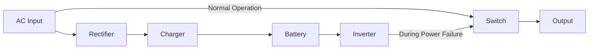

**UPS ના પ્રકારો:**

- **ઓફલાઇન/સ્ટેન્ડબાય UPS**: પાવર ફેઇલ થાય ત્યારે બેટરી પર સ્વિચ કરે છે
- **લાઇન-ઇન્ટરએક્ટિવ UPS**: વોલ્ટેજ રેગ્યુલેશન ધરાવે છે
- **ઓનલાઇન/ડબલ-કન્વર્ઝન UPS**: હંમેશા બેટરી પાવર વાપરે છે

**મુખ્ય ઘટકો:**

- **રેક્ટિફાયર**: AC ને DC માં રૂપાંતર કરે છે
- **બેટરી**: ઊર્જા સંગ્રહ કરે છે
- **ઇન્વર્ટર**: DC ને પાછું AC માં રૂપાંતર કરે છે
- **કંટ્રોલ સર્કિટ**: પાવર મોનિટર કરે છે અને સ્ત્રોત સ્વિચ કરે છે

**એપ્લિકેશન્સ:**

- **કમ્પ્યુટર્સ**: ડેટા નુકસાન અટકાવે છે
- **મેડિકલ ઇક્વિપમેન્ટ**: ક્રિટિકલ ઓપરેશન્સ
- **ઇન્ડસ્ટ્રિયલ કંટ્રોલ્સ**: ખર્ચાળ અવરોધ અટકાવે છે
- **ટેલિકોમ્યુનિકેશન્સ**: કનેક્શન્સ જાળવે છે

**યાદવાક્ય:** "UPBEAT" - Uninterruptible Power Backup Ensures Available Technology.

## પ્રશ્ન 5(ક) OR [7 ગુણ]

**SMPS બ્લોક ડાયાગ્રામ તેના ફાયદા અને ગેરફાયદા સાથે દોરો અને સમજાવો.**

**જવાબ**:

**SMPS (સ્વિચ મોડ પાવર સપ્લાય): કાર્યક્ષમતા માટે સ્વિચિંગ રેગ્યુલેશનનો ઉપયોગ કરતો પાવર સપ્લાય**

**બ્લોક ડાયાગ્રામ:**

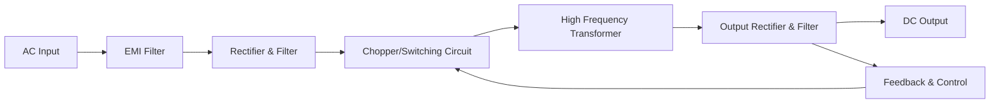

**કાર્યપ્રણાલી:**

- **EMI ફિલ્ટર**: ઇલેક્ટ્રોમેગ્નેટિક ઇન્ટરફેરન્સ ઘટાડે છે
- **રેક્ટિફાયર**: AC ને અનરેગ્યુલેટેડ DC માં રૂપાંતર કરે છે
- **સ્વિચિંગ સર્કિટ**: DC ને ઊંચી ફ્રીક્વન્સી પર ચોપ કરે છે (20-100 kHz)
- **ટ્રાન્સફોર્મર**: આઇસોલેશન અને વોલ્ટેજ રૂપાંતર પ્રદાન કરે છે
- **આઉટપુટ સ્ટેજ**: ક્લીન DC માટે રેક્ટિફાય અને ફિલ્ટર કરે છે
- **ફીડબેક લૂપ**: રેગ્યુલેશન માટે સ્વિચિંગ નિયંત્રિત કરે છે

**ફાયદા:**

- **ઊંચી કાર્યક્ષમતા**: 70-90% (vs. 30-60% લિનિયર સપ્લાય)
- **નાનું કદ**: ઊંચી ઓપરેટિંગ ફ્રીક્વન્સીને કારણે નાના ઘટકો
- **હલકું વજન**: નાના ટ્રાન્સફોર્મર અને હીટ સિંક્સ
- **વિશાળ ઇનપુટ રેન્જ**: વિવિધ ઇનપુટ વોલ્ટેજ પર કામ કરી શકે છે
- **ઓછી ગરમી ઉત્પાદન**: ઓછી ઊર્જા ગરમી તરીકે બરબાદ થાય છે

**ગેરફાયદા:**

- **જટિલ ડિઝાઇન**: વધુ સુધારેલ સર્કિટરી
- **EMI જનરેશન**: સ્વિચિંગ ઇન્ટરફેરન્સ પેદા કરે છે
- **ઊંચી કિંમત**: લો-પાવર એપ્લિકેશન્સ માટે
- **નોઇઝ**: લિનિયર સપ્લાય કરતાં ઊંચો આઉટપુટ નોઇઝ
- **ધીમો રિસ્પોન્સ**: અચાનક લોડ ફેરફારો સામે

**એપ્લિકેશન્સ:**

- **કમ્પ્યુટર્સ**: ડેસ્કટોપ અને લેપટોપ પાવર સપ્લાય
- **ટીવી અને મોનિટર્સ**: કોમ્પેક્ટ પાવર સ્ત્રોત
- **મોબાઇલ ચાર્જર્સ**: નાના, કાર્યક્ષમ એડેપ્ટર્સ
- **ઇન્ડસ્ટ્રિયલ પાવર**: ઊંચી-કાર્યક્ષમતા જરૂરિયાતો

**યાદવાક્ય:** "SWITCH" - Smaller Weight, Improved Thermal efficiency, Complex Hardware.
