## Question 1(a) [3 marks]

**Explain amplifier parameters Ai, Ri and Ro for CE configuration.**

**Answer**:

Common Emitter (CE) amplifier parameters:

**Table: CE Amplifier Parameters**

| Parameter | Definition | CE Configuration |
|-----------|------------|-----------------|
| **Current Gain (Ai)** | Ratio of output current to input current | High (20-500) |
| **Input Resistance (Ri)** | Opposition to current flow at input | Medium (1-2 kΩ) |
| **Output Resistance (Ro)** | Opposition to current flow at output | High (40-50 kΩ) |

**Diagram:**

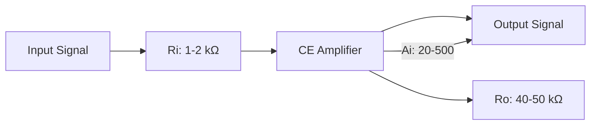

**Mnemonic:** "CAR" - CE has Current gain high, Average input resistance, and Robust output resistance.

## Question 1(b) [4 marks]

**Write short-note on heat sink.**

**Answer**:

**Heat Sink: Device that absorbs and dissipates heat from electronic components**

**Diagram:**

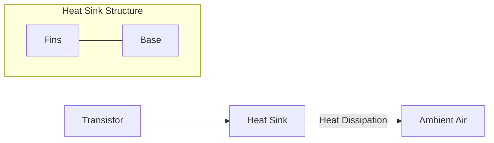

**Types of Heat Sinks:**

- **Passive Heat Sinks**: Rely on natural convection
- **Active Heat Sinks**: Use fans for forced air convection
- **Liquid-cooled Heat Sinks**: Use liquid for better heat transfer

**Key Functions:**

- **Thermal Conduction**: Draws heat away from components
- **Thermal Convection**: Transfers heat to surrounding air
- **Surface Area**: Fins increase surface area for better cooling

**Mnemonic:** "CRAFT" - Cooling through Radiation And Fins for Transistors.

## Question 1(c) [7 marks]

**Describe Thermal Runaway and Thermal Stability. How can overcome thermal run away in transistor?**

**Answer**:

**Thermal Runaway:** Self-reinforcing process where increased temperature causes more current flow, which further increases temperature

**Thermal Stability:** Ability of a transistor circuit to maintain stable operation despite temperature changes

**Diagram:**

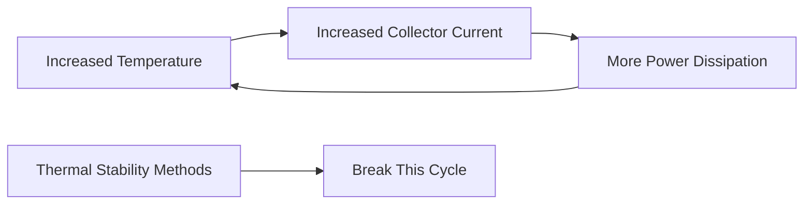

**Methods to Overcome Thermal Runaway:**

- **Heat Sink**: Absorbs and dissipates excess heat
- **Negative Feedback**: Using emitter resistor for stabilization
- **Bias Stabilization**: Voltage divider biasing circuit
- **Temperature Compensation**: Using diodes or thermistors

**Key Points:**

- **IC = ICBO(1+β) + βIB**: Shows collector current dependence
- **ICBO doubles**: For every 10°C temperature rise
- **Stability Factor S**: Lower S means better stability

**Mnemonic:** "RENT" - Reduce heat with sinks, Emitter resistors stabilize, Negative feedback helps, Temperature compensation.

## Question 1(c) OR [7 marks]

**Write down types of biasing methods. Explain the voltage divider biasing method in details.**

**Answer**:

**Types of Biasing Methods:**

- Fixed Bias
- Collector-to-Base Bias
- Voltage Divider Bias
- Emitter Bias
- Collector Feedback Bias

**Voltage Divider Bias Circuit:**

```goat
    +Vcc
     |
     R1
     |
     +----+
     |    |
     R2   |
     |    |
     +    |
     |    |
GND -+--+-+--+- B
         |    |
         |    C
         |    |
         +----+
         |    E
         RE   |
         |    |
        GND  GND
```

**Operation:**

- **R1 and R2**: Form voltage divider providing base voltage
- **RE**: Provides stability and negative feedback
- **Stable Bias Point**: Less affected by temperature and β variations

**Advantages:**

- **Excellent Stability**: Less affected by temperature variations
- **Independent of β**: Bias point not greatly affected by transistor gain
- **Widely Used**: Most common biasing method for amplifiers

**Mnemonic:** "DIVE" - Divider biasing Is Very Effective for stability.

## Question 2(a) [3 marks]

**Explain Stability Factor with features.**

**Answer**:

**Stability Factor (S): Measure of how well a biasing circuit maintains stable operation with temperature changes**

**Mathematical Definition:**
S = ΔIC/ΔICBO (Change in collector current / Change in reverse saturation current)

**Table: Stability Factors for Different Bias Circuits**

| Biasing Method | Stability Factor | Stability Level |
|----------------|------------------|-----------------|
| Fixed Bias | S = 1+β | Poor |
| Collector-to-Base | S = β/(1+β) | Better |
| Voltage Divider | S ≈ 1 | Excellent |

**Key Features:**

- **Lower S Value**: Indicates better stability (ideal S=1)
- **Temperature Resistance**: Measures immunity to temperature changes
- **Circuit Design Tool**: Helps compare biasing methods

**Mnemonic:** "SOS" - Stability Of circuit Shows in its S-factor.

## Question 2(b) [4 marks]

**Describe direct coupling technique of cascading.**

**Answer**:

**Direct Coupling: Connecting stages without coupling capacitors, directly connecting collector of one stage to base of next**

**Diagram:**

```goat
      +Vcc                +Vcc
        |                   |
        |                   |
        Rc                  Rc
        |                   |
  +-----+                   +-----+
  |     |                   |     |
  |     C       B           |     C  Output
  |     |-------+           |     |-------+
  |     |       |           |     |
Input   |       |           |     |
  +-----|B      |           |     |
        |       |           |     |
        |       E           |     E
        |       |           |     |
       GND     GND         GND   GND
       
       First Stage          Second Stage
```

**Key Characteristics:**

- **No Coupling Components**: Direct electrical connection
- **Full Frequency Response**: Good low-frequency performance
- **DC Level Shifting**: Required between stages

**Applications:**

- **Operational Amplifiers**: Internal stages
- **DC Amplifiers**: Where low-frequency response is critical

**Mnemonic:** "DIRECT" - DC signals Immediately REach Connecting Transistors.

## Question 2(c) [7 marks]

**Explain frequency response of two stage RC coupled amplifier.**

**Answer**:

**RC Coupled Amplifier: Uses resistor-capacitor networks to couple between amplification stages**

**Frequency Response Diagram:**

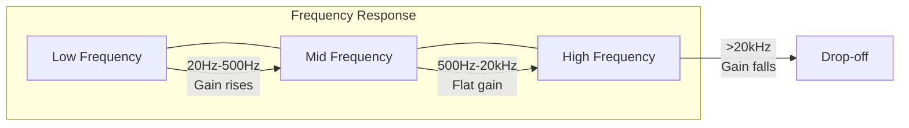

**Table: Frequency Regions**

| Region | Frequency Range | Characteristics | Limiting Components |
|--------|-----------------|-----------------|---------------------|
| **Low** | 20Hz-500Hz | Gain rises with frequency | Coupling capacitors |
| **Mid** | 500Hz-20kHz | Constant gain (maximum) | None |
| **High** | >20kHz | Gain falls with frequency | Transistor capacitance |

**Two-Stage Effect:**

- **Bandwidth**: Narrower than single stage
- **Gain**: Approximately square of single stage (A₁ × A₂)
- **Phase Shift**: Doubled at low and high frequencies

**Mnemonic:** "LMH" - Low frequencies by coupling caps, Mid frequencies flat, High frequencies by transistor caps.

## Question 2(a) OR [3 marks]

**Briefly explain bandwidth and gain-bandwidth product of an amplifier.**

**Answer**:

**Bandwidth (BW): Range of frequencies where amplifier gain is at least 70.7% of maximum gain**

**Gain-Bandwidth Product (GBP): Product of voltage gain and bandwidth, constant for a given amplifier**

**Diagram:**

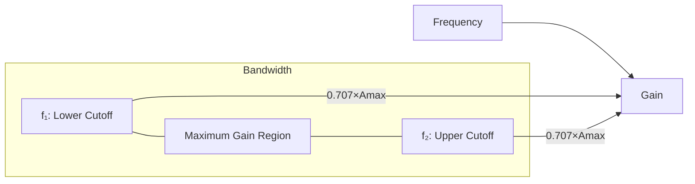

**Key Formulas:**

- **Bandwidth**: BW = f₂ - f₁
- **Gain-Bandwidth Product**: GBP = A₀ × BW (constant)

**Mnemonic:** "BAND" - Bandwidth And gain Never Drop together (one increases when other decreases).

## Question 2(b) OR [4 marks]

**Explain effects of emitter bypass capacitor and coupling capacitor on frequency response of an amplifier.**

**Answer**:

**Effects on Frequency Response:**

**Table: Capacitor Effects**

| Capacitor | Function | Effect on Frequency Response |
|-----------|----------|------------------------------|
| **Coupling Capacitor (Cc)** | Blocks DC, passes AC | Limits low-frequency response |
| **Bypass Capacitor (Ce)** | Bypasses emitter resistor | Increases gain at mid and high frequencies |

**Diagram:**

```goat
    +Vcc
     |
     Rc
     |
     +-------+
     |       |
 Cc  |       |
 ||--+       C
 ||  |       |
Input  B     |
     |       |
     |       E
     |       |
     Re      |
     |       |
     +--||---+
     |   Ce
    GND
```

**Key Effects:**

- **Without Ce**: Lower gain, better stability, better low-frequency response
- **Without Cc**: DC coupling, excellent low-frequency response
- **Capacitor Values**: Determine cutoff frequencies (f₁, f₂)

**Mnemonic:** "CELL" - Coupling affects Extremely Low frequencies, bypass affects Low to high.

## Question 2(c) OR [7 marks]

**Compare transformer coupled amplifier and RC coupled amplifier**

**Answer**:

**Table: Comparison of Transformer Coupled vs RC Coupled Amplifier**

| Feature | Transformer Coupled | RC Coupled |
|---------|---------------------|------------|
| **Coupling Element** | Transformer | Capacitor and Resistor |
| **Efficiency** | High (90%) | Moderate (20-30%) |
| **Size and Weight** | Bulky and Heavy | Compact and Light |
| **Cost** | Expensive | Inexpensive |
| **Frequency Response** | Poor (limited bandwidth) | Good (wide bandwidth) |
| **Impedance Matching** | Excellent | Poor |
| **DC Isolation** | Complete | Only AC signals |
| **Distortion** | Higher | Lower |

**Diagram:**

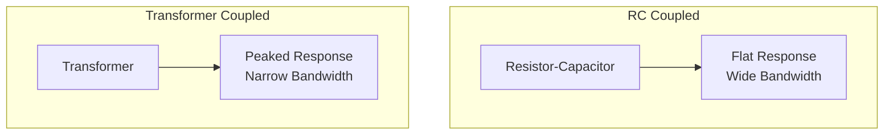

**Applications:**

- **RC Coupled**: Audio amplifiers, general-purpose amplifiers
- **Transformer Coupled**: Power amplifiers, radio transmitters

**Mnemonic:** "TRIP" - Transformers are Robust for Impedance matching, Problematic for bandwidth.

## Question 3(a) [3 marks]

**Describe the transistor used as a tuned amplifier.**

**Answer**:

**Tuned Amplifier: Amplifier that selectively amplifies signals within a narrow frequency band**

**Diagram:**

```goat
    +Vcc
     |
     |
     +---+
     |   |
     L   |
     |   |
 Cin |   |
 ||--+---+
 ||  |   |
Input   B |
     |   |
     |   C      Cout
     |   +------||----+ Output
     |   |             |
     |   E             |
     |   |             |
     |  Re             |
     |   |             |
    GND GND           GND
```

**Key Components:**

- **LC Tank Circuit**: Determines resonant frequency
- **Transistor**: Provides amplification
- **Resonant Frequency**: f₀ = 1/(2π√LC)

**Applications:**

- **Radio Receivers**: Selects desired frequency
- **TV Tuners**: Channel selection
- **RF Amplifiers**: Communication systems

**Mnemonic:** "TUNE" - Transistors Using Narrowband Elements for frequency selection.

## Question 3(b) [4 marks]

**Explain in brief Direct coupled amplifier.**

**Answer**:

**Direct Coupled Amplifier: Multiple stage amplifier where stages are connected directly without coupling capacitors or transformers**

**Diagram:**

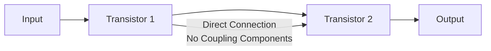

**Key Characteristics:**

- **DC Amplification**: Can amplify from DC to high frequencies
- **No Coupling Elements**: Collector directly connected to next base
- **Level Shifting**: Required between stages
- **Thermal Drift**: Challenge due to direct DC coupling

**Applications:**

- **Operational Amplifiers**: Internal stages
- **DC Amplifiers**: Laboratory instruments
- **Sensing Circuits**: Temperature and pressure sensors

**Mnemonic:** "DCAP" - Direct Coupled Amplifier Passes all frequencies including DC.

## Question 3(c) [7 marks]

**Describe the importance of h parameters in two port networks. Draw h-parameters circuit for CE amplifier.**

**Answer**:

**h-parameters (hybrid parameters): Set of four parameters that define behavior of two-port network**

**Importance:**

- **Complete Characterization**: Fully describes amplifier behavior
- **Easy Measurement**: Can be measured under simple conditions
- **Analysis Tool**: Simplifies circuit analysis
- **Standardized Approach**: Universal method for comparing transistors

**h-parameter Equations:**

- V₁ = h₁₁I₁ + h₁₂V₂
- I₂ = h₂₁I₁ + h₂₂V₂

**h-parameter Circuit for CE Amplifier:**

```goat
                     +
                     |
                    Ic
               +-----+-----+
               |     |     |
         +     |     |     |
        Ii     |    hoe    |
     +-->--+   |     |     |
     |     |   |     |     |    +
  +  |    hie  |    hfe·Ii |   Vo
 Vi  |     |   |     |     |    -
  -  |     |   |     |     |
     +--+--+   |     |     |
        |      |     |     |
        +<-----+     |     |
        hre·Vo       |     |
               |     |     |
               +-----+-----+
                     |
                     +
```

**Table: h-parameters for CE Configuration**

| Parameter | Symbol | Typical Value | Physical Meaning |
|-----------|--------|---------------|------------------|
| **Input impedance** | h₁₁ (hie) | 1-2 kΩ | Input resistance with output shorted |
| **Reverse voltage transfer** | h₁₂ (hre) | 1-4 × 10⁻⁴ | Reverse feedback ratio |
| **Forward current transfer** | h₂₁ (hfe) | 20-500 | Current gain (β) |
| **Output admittance** | h₂₂ (hoe) | 20-50 μS | Output conductance |

**Mnemonic:** "HIRE" - h-parameters Include Resistance and current gain Effectively.

## Question 3(a) OR [3 marks]

**Compare transformer coupled amplifier and direct coupled amplifier.**

**Answer**:

**Table: Comparison between Transformer and Direct Coupled Amplifiers**

| Feature | Transformer Coupled | Direct Coupled |
|---------|---------------------|---------------|
| **Coupling Element** | Transformer | None (direct connection) |
| **Frequency Response** | Limited at low frequencies | Excellent (DC to high freq) |
| **DC Isolation** | Complete | None |
| **Size** | Bulky | Compact |
| **Cost** | Higher | Lower |
| **DC Shift Problem** | No | Yes |

**Diagram:**

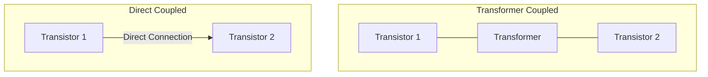

**Mnemonic:** "TDC" - Transformers provide DC isolation, Direct provides Complete frequency range.

## Question 3(b) OR [4 marks]

**Draw and Explain circuit diagram of common emitter amplifier.**

**Answer**:

**Common Emitter Amplifier: Configuration where emitter is common to both input and output circuits**

**Circuit Diagram:**

```goat
                 +Vcc
                  |
                  |
                  Rc
                  |
                  +--------+ Output
                  |        |
             +----+        |
             |    |        |
     Input   |    C        |
     +-------|B   |        |
     |       |    |        |
     |       |    E        |
     |       |    |        |
     |       |    +        |
     |       |    |        |
     |       |   Re        |
     |       |    |        |
    GND     GND  GND      GND
```

**Operation:**

- **Input**: Applied between base and emitter
- **Output**: Taken from collector and emitter
- **Phase Shift**: 180° between input and output
- **Gain**: High voltage and current gain

**Key Features:**

- **High Gain**: Typical voltage gain 300-1000
- **Medium Input Impedance**: 1-2 kΩ
- **High Output Impedance**: 40-50 kΩ
- **Signal Inversion**: Output is inverted

**Mnemonic:** "CEA" - Common Emitter Amplifies with signal inversion.

## Question 3(c) OR [7 marks]

**Draw Transistor Two Port Network and describe h-parameters for it. Write down advantages of hybrid parameters.**

**Answer**:

**Transistor Two-Port Network:**

```goat
        I1             I2
        -->            -->
    +-------+      +-------+
    |       |      |       |
    |       |      |       |
  + |       |      |       | +
 V1 |  Two  |      |  Port | V2
  - |       |      |       | -
    |       |      |       |
    |       |      |       |
    +-------+      +-------+
```

**h-parameter Equations:**

- V₁ = h₁₁I₁ + h₁₂V₂
- I₂ = h₂₁I₁ + h₂₂V₂

**Table: h-parameters Description**

| Parameter | Symbol | Description | Measurement Condition |
|-----------|--------|-------------|----------------------|
| **Input impedance** | h₁₁ | Ratio of V₁/I₁ | V₂ = 0 (Output shorted) |
| **Reverse voltage transfer** | h₁₂ | Ratio of V₁/V₂ | I₁ = 0 (Input open) |
| **Forward current transfer** | h₂₁ | Ratio of I₂/I₁ | V₂ = 0 (Output shorted) |
| **Output admittance** | h₂₂ | Ratio of I₂/V₂ | I₁ = 0 (Input open) |

**Advantages of Hybrid Parameters:**

- **Easy Measurement**: Simple conditions for each parameter
- **Universality**: Works for all transistor configurations
- **Complete Characterization**: Fully describes behavior
- **Mathematical Simplicity**: Linear equations
- **Standardized**: Industry standard for specification

**Mnemonic:** "HAEM" - Hybrid parameters Are Easily Measured and mathematically simple.

## Question 4(a) [3 marks]

**Explain Darlington pair and its applications.**

**Answer**:

**Darlington Pair: Configuration of two transistors where emitter of first is connected to base of second**

**Diagram:**

```goat
           +Vcc
            |
            |
            Rc
            |
            +------ Output
            |
            |
     +------+
     |      |
     |      C2
     |      |
Input|      |
+----+B1    |
     |      |
     |  E1  |
     |  |   |
     |  +B2 |
     |      |
     |      E2
     |      |
    GND    GND
```

**Key Features:**

- **Very High Current Gain**: β₁ × β₂ (typical 1000-30000)
- **High Input Impedance**: β₂ × Rin₁
- **Low Output Impedance**: Similar to single transistor

**Applications:**

- **Power Amplifiers**: Audio equipment
- **Buffer Circuits**: High impedance to low impedance
- **Motor Drivers**: Control high-current loads
- **Touch Sensors**: High sensitivity applications

**Mnemonic:** "DISH" - Darlington Integrates Stages for High current gain.

## Question 4(b) [4 marks]

**Describe the diode clamper circuit with necessary diagram.**

**Answer**:

**Clamper Circuit: Shifts the DC level of a waveform without changing its shape**

**Diagram:**

```goat
           C1
Input +----||----+----+ Output
                 |    |
                 |    |
                 R    D
                 |    |
                 |    |
                GND  GND
```

**Operation:**

- **Positive Clamper**: Shifts waveform downward
- **Negative Clamper**: Shifts waveform upward
- **Capacitor**: Blocks DC, passes AC
- **Diode**: Conducts during one half-cycle
- **Resistor**: Discharge path for capacitor

**Time Constants:**

- **Charging**: Very small (diode forward resistance × C)
- **Discharging**: Large (R × C) compared to signal period

**Applications:**

- **TV Signal Processing**: Restores DC component
- **Pulse Circuits**: Level shifting
- **Signal Processing**: DC restoration

**Mnemonic:** "CLAMP" - Circuit Levels Are Modified Precisely.

## Question 4(c) [7 marks]

**Explain the construction, working and applications of OLED.**

**Answer**:

**OLED (Organic Light Emitting Diode): Light-emitting device using organic compounds**

**Construction:**

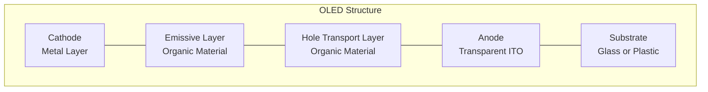

**Working Principle:**

- **Electron Injection**: Cathode injects electrons
- **Hole Injection**: Anode injects holes
- **Recombination**: Electrons and holes combine in emissive layer
- **Light Emission**: Energy released as photons
- **Color Control**: Different organic materials emit different colors

**Table: OLED Types**

| Type | Structure | Key Feature |
|------|-----------|------------|
| **PMOLED** | Passive Matrix | Simpler design, lower cost |
| **AMOLED** | Active Matrix | Better refresh rates, higher resolution |
| **TOLED** | Transparent | See-through when off or on |
| **FOLED** | Flexible | Can be bent or rolled |

**Applications:**

- **Displays**: Smartphones, TVs, smartwatches
- **Lighting**: Thin, efficient lighting panels
- **Signage**: High-contrast digital signs
- **Wearable Technology**: Flexible displays

**Mnemonic:** "OLED" - Organic Layers Emit Directly when electrically stimulated.

## Question 4(a) OR [3 marks]

**Explain Short note on LDR.**

**Answer**:

**LDR (Light Dependent Resistor): Photoresistor whose resistance decreases with increasing light intensity**

**Symbol and Structure:**

```goat
    ┌─────┐
    │     │
────┤ /'\ ├────
    │     │
    └─────┘
     Symbol
     
      Light
       ↓↓↓
    ┌───────┐
    │┌─────┐│
────┤│CdS  ││────
    │└─────┘│
    └───────┘
     Structure
```

**Key Characteristics:**

- **Material**: Usually Cadmium Sulfide (CdS)
- **Dark Resistance**: High (MΩ range)
- **Light Resistance**: Low (kΩ range)
- **Response Time**: Milliseconds to seconds

**Applications:**

- **Light Sensors**: Automatic lighting control
- **Camera Exposure Control**: Light metering
- **Street Light Control**: Dawn-to-dusk activation
- **Alarm Systems**: Light beam detection

**Mnemonic:** "LORD" - Light Oppositely Reduces the Device's resistance.

## Question 4(b) OR [4 marks]

**Describe the diode clipper circuit with necessary diagram.**

**Answer**:

**Clipper Circuit: Removes (clips) portion of input signal that exceeds certain voltage level**

**Diagram (Positive Clipper):**

```goat
                R     D
Input +-----+---www---+---+--+ Output
            |         |   |
            |         |   |
            |         +   -
            |         |   |
            |         |   |
            |         V   |
            |         |   |
            +---------+---+
```

**Types of Clippers:**

- **Positive Clipper**: Removes positive peaks
- **Negative Clipper**: Removes negative peaks
- **Biased Clipper**: Clips at non-zero reference
- **Combination Clipper**: Clips both peaks

**Operation:**

- **Diode ON**: When signal exceeds reference voltage
- **Diode OFF**: When signal is below reference voltage
- **Clipping Level**: Determined by reference voltage

**Applications:**

- **Wave Shaping**: Creating square waves
- **Circuit Protection**: Voltage limiting
- **Noise Removal**: Limiting impulse noise

**Mnemonic:** "CLIP" - Circuit Limits Input Peaks using diodes.

## Question 4(c) OR [7 marks]

**Explain Half Wave and Full wave Voltage Doubler.**

**Answer**:

**Voltage Doubler: Circuit that produces DC output voltage approximately twice the peak input voltage**

**Half-Wave Voltage Doubler:**

```goat
               D1
            +---->|---+
            |         |
            |         |
AC Input    |         | C1    + 2Vpeak
    +-------+         +-------+  Output
    |       |         |       |
    |       +---->|---+       |
    |          D2    |        |
    |               C2        |
    |                |        |
    +----------------+--------+
                     |
                    GND
```

**Full-Wave Voltage Doubler:**

```goat
               D1
            +---->|---+
            |         |
            |         |
AC Input    |         | C1    + 2Vpeak
    +-------+         +-------+  Output
    |       |         |       |
    |       |         |       |
    |       |    C2   |       |
    |       |    |    |       |
    |       +----|<---+       |
    |          D2             |
    |                |        |
    +----------------+--------+
                     |
                    GND
```

**Table: Comparison**

| Feature | Half-Wave | Full-Wave |
|---------|-----------|-----------|
| **Ripple** | Higher | Lower |
| **Efficiency** | Lower | Higher |
| **Response Time** | Slower | Faster |
| **Components** | 2 diodes, 2 capacitors | 2 diodes, 2 capacitors |
| **Regulation** | Poor | Better |

**Operation:**

- **Half-Wave**: Charges each capacitor on alternate half-cycles
- **Full-Wave**: Charges both capacitors on every cycle
- **Output**: Sum of voltages across both capacitors

**Applications:**

- **Power Supplies**: Low-current high-voltage needs
- **Cascade Connection**: For voltage multiplication
- **Electronic Flash**: Camera equipment
- **CRT Displays**: High voltage generation

**Mnemonic:** "DOUBLE" - Diodes Organize Unidirectional Boost, Lifting Electricity to twice input.

## Question 5(a) [3 marks]

**Draw circuit diagram for +5 v Power Supply using its IC**

**Answer**:

**+5V Power Supply Using 7805 Voltage Regulator IC (continued):**

```goat
   AC Input    Bridge     7805
    +--+       Rect.    +-----+
       |     +------+   |     |
       +-----+      +---+ IN  |
       |     |      |   |     |   +5V
       |     +------+   |     +---+--- Output
       +--+--+          | OUT |   |
          |             |     |   |
         GND            +--+--+   |
                           |      |
                          GND    GND
                           
                  C1 |    C2 |
                 === |    === |
                  |  |     |  |
                 GND       GND
```

**Key Components:**

- **7805 IC**: Three-terminal fixed voltage regulator
- **Input Capacitor (C1)**: Filters input ripple
- **Output Capacitor (C2)**: Improves transient response
- **Bridge Rectifier**: Converts AC to pulsating DC

**Mnemonic:** "FIVE" - Fixed IC Voltage Efficiently provided.

## Question 5(b) [4 marks]

**Discuss load regulation and line regulation in reference to power supply.**

**Answer**:

**Load Regulation: Ability of power supply to maintain constant output voltage despite load current changes**

**Diagram:**

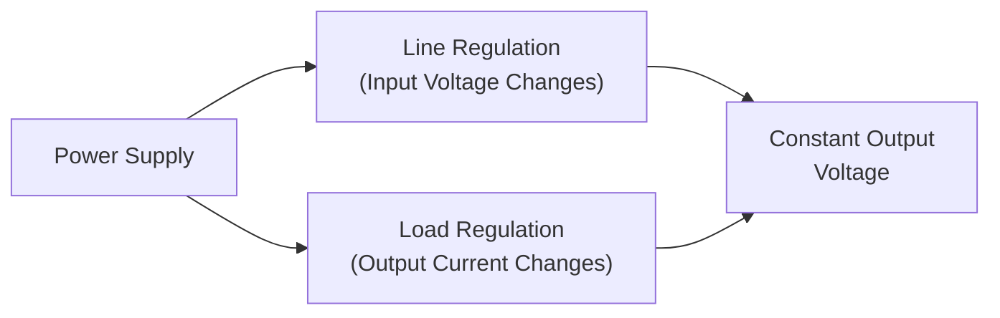

**Formulas:**

- **Load Regulation**: (V₁ - V₂)/V₂ × 100%
  - V₁ = No-load voltage
  - V₂ = Full-load voltage

- **Line Regulation**: (V₁ - V₂)/V₂ × 100%
  - V₁ = Output voltage at maximum input
  - V₂ = Output voltage at minimum input

**Key Points:**

- **Lower Percentage**: Better regulation
- **Feedback Circuit**: Improves regulation performance
- **IC Regulators**: Typically offer good regulation (0.01-0.1%)

**Mnemonic:** "LINE LOAD" - Line Is Normal-input Efficiency, LOAD is Output Adjustment Defense.

## Question 5(c) [7 marks]

**Explain adjustable voltage regulator using LM317 with circuit diagram.**

**Answer**:

**LM317 Adjustable Voltage Regulator: Three-terminal device that provides variable regulated output voltage**

**Circuit Diagram:**

```goat
               LM317
              +------+
              |      |
   Input -----+ IN   |
              |      |    R1
              | ADJ  +----www----+
              |      |           |
              | OUT  |           |
              +--+---+           |
                 |               |
                 +-------www-----+
                 |       R2      |
                 |               |
                 +      C1       +------ Output
                 |      ===      |
                 |       |       |
                GND     GND     GND
```

**Operation:**

- **Reference Voltage**: 1.25V between OUT and ADJ terminals
- **Output Voltage**: VOUT = 1.25V × (1 + R2/R1)
- **Adjustment Range**: 1.25V to 37V
- **Maximum Current**: 1.5A (with proper heat sink)

**Component Selection:**

- **R1**: Typically 240Ω
- **R2**: Variable resistor to adjust output
- **C1**: Output capacitor for stability (1-10μF)

**Key Features:**

- **Current Limiting**: Built-in protection
- **Thermal Shutdown**: Protection against overheating
- **Safe Area Protection**: For output transistors
- **Ripple Rejection**: 80dB typically

**Mnemonic:** "VARY" - Voltage Adjustable Regulator Yields custom outputs.

## Question 5(a) OR [3 marks]

**Draw circuit diagram for -15 v Power Supply using its IC**

**Answer**:

**-15V Power Supply Using 7915 Voltage Regulator IC:**

```goat
   AC Input    Bridge     7915
    +--+       Rect.    +-----+
       |     +------+   |     |
       +-----+      +---+ IN  |
       |     |      |   |     |   -15V
       |     +------+   |     +---+--- Output
       +--+--+          | OUT |   |
          |             |     |   |
         GND            +--+--+   |
                           |      |
                          GND    GND
                           
                 C1 |    C2 |
                 === |    === |
                  |  |     |  |
                 GND       GND
```

**Key Components:**

- **7915 IC**: Three-terminal negative voltage regulator
- **Input Capacitor (C1)**: Filters input ripple
- **Output Capacitor (C2)**: Improves transient response
- **Bridge Rectifier**: Converts AC to pulsating DC

**Mnemonic:** "NINE" - Negative IC Needs Efficient filtering.

## Question 5(b) OR [4 marks]

**Explain working of UPS.**

**Answer**:

**UPS (Uninterruptible Power Supply): Device providing emergency power when main power fails**

**Block Diagram:**

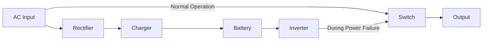

**Types of UPS:**

- **Offline/Standby UPS**: Switches to battery when power fails
- **Line-Interactive UPS**: Has voltage regulation
- **Online/Double-Conversion UPS**: Always uses battery power

**Key Components:**

- **Rectifier**: Converts AC to DC
- **Battery**: Stores energy
- **Inverter**: Converts DC back to AC
- **Control Circuit**: Monitors power and switches source

**Applications:**

- **Computers**: Prevents data loss
- **Medical Equipment**: Critical operations
- **Industrial Controls**: Prevents costly interruptions
- **Telecommunications**: Maintains connections

**Mnemonic:** "UPBEAT" - Uninterruptible Power Backup Ensures Available Technology.

## Question 5(c) OR [7 marks]

**Draw and explain SMPS block diagram with its advantages and disadvantages.**

**Answer**:

**SMPS (Switch Mode Power Supply): Power supply that uses switching regulation for efficiency**

**Block Diagram:**

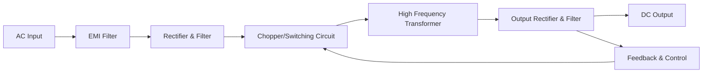

**Operation:**

- **EMI Filter**: Reduces electromagnetic interference
- **Rectifier**: Converts AC to unregulated DC
- **Switching Circuit**: Chops DC at high frequency (20-100 kHz)
- **Transformer**: Provides isolation and voltage conversion
- **Output Stage**: Rectifies and filters to clean DC
- **Feedback Loop**: Controls switching for regulation

**Advantages:**

- **High Efficiency**: 70-90% (vs. 30-60% for linear)
- **Small Size**: Higher operating frequency means smaller components
- **Light Weight**: Smaller transformer and heat sinks
- **Wide Input Range**: Can operate on various input voltages
- **Low Heat Generation**: Less power wasted as heat

**Disadvantages:**

- **Complex Design**: More sophisticated circuitry
- **EMI Generation**: Switching creates interference
- **Higher Cost**: For low-power applications
- **Noise**: Higher output noise than linear supplies
- **Slower Response**: To sudden load changes

**Applications:**

- **Computers**: Desktop and laptop power supplies
- **TVs and Monitors**: Compact power source
- **Mobile Chargers**: Small, efficient adapters
- **Industrial Power**: High-efficiency needs

**Mnemonic:** "SWITCH" - Smaller Weight, Improved Thermal efficiency, Complex Hardware.
