## પ્રશ્ન 1(a) [3 marks]

**ઇલેક્ટ્રોનિક નેટવર્ક માટે વ્યાખ્યા આપો. (i) નોડ (ii) બ્રાંચ (iii) લૂપ**

**જવાબ**:

| શબ્દ | વ્યાખ્યા |
|------|------------|
| **નોડ** | એક બિંદુ જ્યાં બે કે વધુ તત્વો એકબીજા સાથે જોડાયેલા હોય |
| **બ્રાંચ** | બે નોડ વચ્ચેનો એક તત્વ અથવા પાથ |
| **લૂપ** | નેટવર્કમાં બંધ પાથ જ્યાં કોઈ નોડને એક કરતાં વધુ વખત ક્રોસ ન કરાય |

**આકૃતિ:**

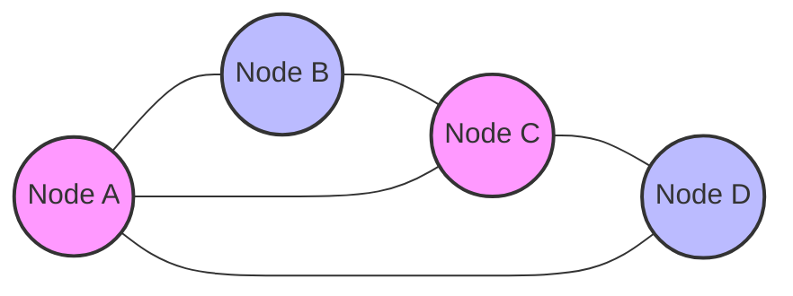

**સરળ રીત:** "NBL: નેટવર્ક્સ બિગિન વિથ લૂપ્સ"

## પ્રશ્ન 1(b) [4 marks]

**20 Ω, 30 Ω અને 50 Ω નાં રેઝીસ્ટર 60 V નાં સપ્લાય સાથે પેરેલલમાં જોડાયેલા છે. તો (i) દરેક રેઝીસ્ટરમાંથી પસાર થતો કરંટ તથા કુલ કરંટ (ii) ઇક્વીવેલન્ટ રેઝીસ્ટર શોધો.**

**જવાબ**:

**આકૃતિ:**

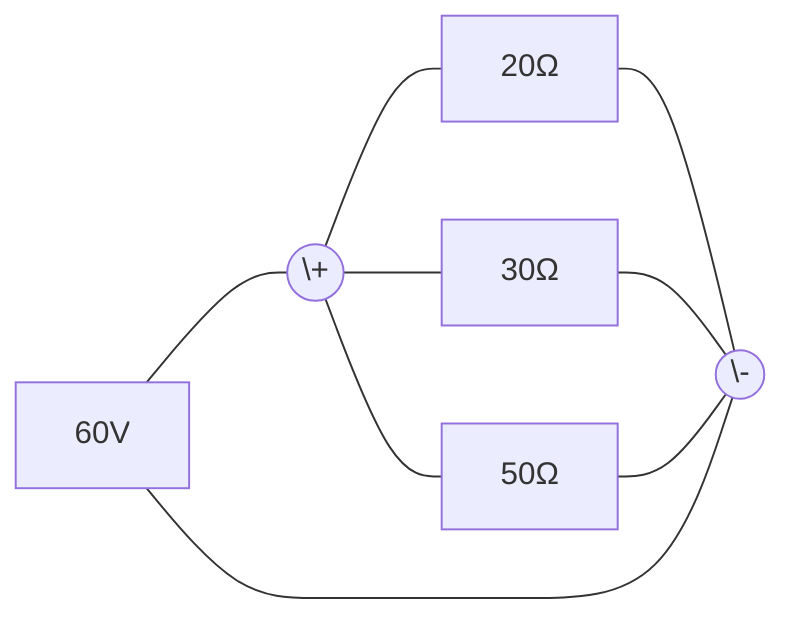

| ગણતરી | મૂલ્ય |
|-------------|-------|
| **20 Ω રેઝીસ્ટરમાંથી પસાર થતો કરંટ**: I₁ = V/R₁ = 60/20 | 3 A |
| **30 Ω રેઝીસ્ટરમાંથી પસાર થતો કરંટ**: I₂ = V/R₂ = 60/30 | 2 A |
| **50 Ω રેઝીસ્ટરમાંથી પસાર થતો કરંટ**: I₃ = V/R₃ = 60/50 | 1.2 A |
| **કુલ કરંટ**: I = I₁ + I₂ + I₃ = 3 + 2 + 1.2 | 6.2 A |
| **ઇક્વીવેલન્ટ રેઝીસ્ટન્સ**: Req = V/I = 60/6.2 | 9.68 Ω |

**સરળ રીત:** "PIV: પેરેલલ ઇન્ક્રીઝીસ ધ કરંટ, વોલ્ટેજ રીમેઇન્સ ધ સેમ"

## પ્રશ્ન 1(c) [7 marks]

**કેપેસીટર માટે સિરિઝ અને પેરેલલ જોડાણ સમજાવો.**

**જવાબ**:

| જોડાણ | સૂત્ર | લક્ષણો |
|------------|---------|-----------------|
| **સિરિઝ જોડાણ** | 1/C_eq = 1/C₁ + 1/C₂ + 1/C₃ + ... | - ઇક્વીવેલન્ટ કેપેસિટન્સ સૌથી નાના કેપેસિટરથી ઓછું<br>- દરેક કેપેસિટરમાં સમાન કરંટ<br>- કુલ વોલ્ટેજ કેપેસિટરો વચ્ચે વહેંચાય છે<br>- ડાયલેક્ટ્રીક સ્ટ્રેન્થ વધારે છે |
| **પેરેલલ જોડાણ** | C_eq = C₁ + C₂ + C₃ + ... | - ઇક્વીવેલન્ટ કેપેસિટન્સ બધા કેપેસિટરોનો સરવાળો<br>- દરેક કેપેસિટર પર સમાન વોલ્ટેજ<br>- કુલ ચાર્જ વ્યક્તિગત ચાર્જનો સરવાળો<br>- પ્લેટનું ક્ષેત્રફળ વધારે છે |

**આકૃતિ:**

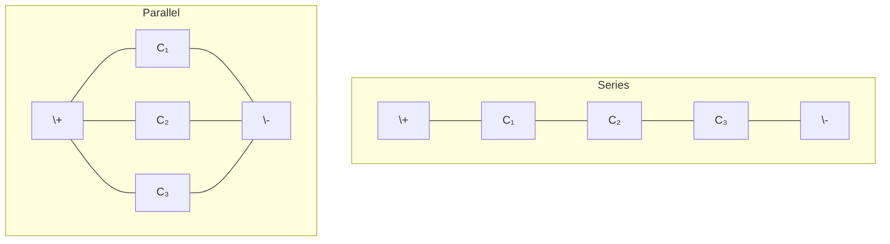

**સરળ રીત:** "CAPE: કેપેસિટર્સ એડ ઇન પેરેલલ, એલિમિનેટ ઇન સિરિઝ"

## પ્રશ્ન 1(c) OR [7 marks]

**ઇન્ડક્ટર માટે સિરિઝ અને પેરેલલ જોડાણ સમજાવો.**

**જવાબ**:

| જોડાણ | સૂત્ર | લક્ષણો |
|------------|---------|-----------------|
| **સિરિઝ જોડાણ** | L_eq = L₁ + L₂ + L₃ + ... | - ઇક્વીવેલન્ટ ઇન્ડક્ટન્સ બધા ઇન્ડક્ટરોનો સરવાળો<br>- દરેક ઇન્ડક્ટરમાં સમાન કરંટ<br>- કુલ વોલ્ટેજ વ્યક્તિગત વોલ્ટેજનો સરવાળો<br>- ફ્લક્સ લિંકેજ વધે છે |
| **પેરેલલ જોડાણ** | 1/L_eq = 1/L₁ + 1/L₂ + 1/L₃ + ... | - ઇક્વીવેલન્ટ ઇન્ડક્ટન્સ સૌથી નાના ઇન્ડક્ટરથી ઓછું<br>- દરેક ઇન્ડક્ટર પર સમાન વોલ્ટેજ<br>- કુલ કરંટ ઇન્ડક્ટરો વચ્ચે વહેંચાય છે<br>- મેગ્નેટિક કપલિંગ વાસ્તવિક મૂલ્યને અસર કરે છે |

**આકૃતિ:**

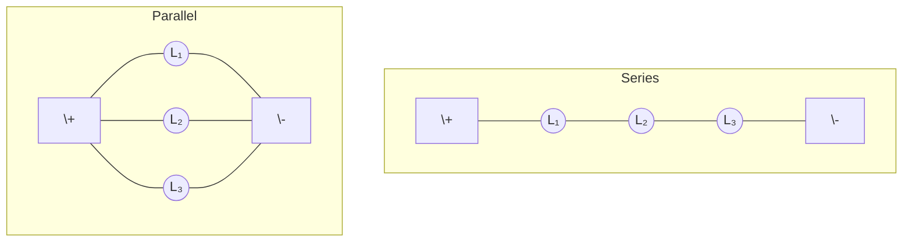

**સરળ રીત:** "LIPS: ઇન્ડક્ટર્સ લિંક ઇન સિરિઝ, પાર્ટિશન ઇન પેરેલલ"

## પ્રશ્ન 2(a) [3 marks]

**વ્યાખ્યા આપો. (i) ટ્રાન્સફોર્મઇમ્પીડન્સ, (ii) ડ્રાઇવિંગ પોઇન્ટ ઇમ્પીડન્સ, (iii) ટ્રાન્સફર ઇમ્પીડન્સ.**

**જવાબ**:

| શબ્દ | વ્યાખ્યા |
|------|------------|
| **ટ્રાન્સફોર્મઇમ્પીડન્સ** | ટ્રાન્સફોર્મરમાં પ્રાથમિકથી ગૌણ તરફ જતા સિગ્નલ દ્વારા જોવામાં આવતા ઇમ્પીડન્સ |
| **ડ્રાઇવિંગ પોઇન્ટ ઇમ્પીડન્સ** | એક જ પોર્ટ પર વોલ્ટેજનો કરંટ સાથેનો ગુણોત્તર |
| **ટ્રાન્સફર ઇમ્પીડન્સ** | એક પોર્ટ પર વોલ્ટેજનો બીજા પોર્ટના કરંટ સાથેનો ગુણોત્તર |

**આકૃતિ:**

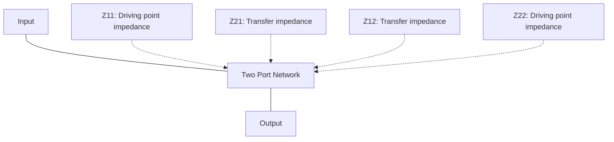

**સરળ રીત:** "TDT: ટ્રાન્સફોર્મર્સ ડ્રાઇવ ટ્રાન્સફર્સ"

## પ્રશ્ન 2(b) [4 marks]

**30, 50 અને 90 ohms ના રેઝીસ્ટર સ્ટારમાં કનેક્ટ કરેલા છે. ડેલ્ટા કનેક્શનનાં ઇક્વીવેલન્ટ રેઝીસ્ટર શોધો.**

**જવાબ**:

**આકૃતિ:**

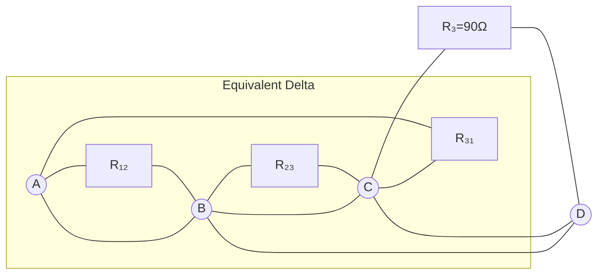

| સ્ટાર થી ડેલ્ટા કન્વર્ઝન ફોર્મ્યુલા | ગણતરી | પરિણામ |
|----------------------------------|-------------|--------|
| R₁₂ = (R₁×R₂ + R₂×R₃ + R₃×R₁)/R₃ | (30×50 + 50×90 + 90×30)/90 | 105 Ω |
| R₂₃ = (R₁×R₂ + R₂×R₃ + R₃×R₁)/R₁ | (30×50 + 50×90 + 90×30)/30 | 315 Ω |
| R₃₁ = (R₁×R₂ + R₂×R₃ + R₃×R₁)/R₂ | (30×50 + 50×90 + 90×30)/50 | 189 Ω |

**સરળ રીત:** "PSR: પ્રોડક્ટ ઓવર સમ ઓફ રેસિસ્ટર્સ"

## પ્રશ્ન 2(c) [7 marks]

**Π નેટવર્ક સમજાવો.**

**જવાબ**:

| વિભાવના | વર્ણન |
|---------|-------------|
| **વ્યાખ્યા** | ત્રણ-ટર્મિનલ નેટવર્ક જે ત્રણ ઇમ્પીડન્સથી બનેલું હોય - એક સિરીઝમાં અને બે પેરેલલમાં |
| **સ્ટ્રક્ચર** | બે ઇમ્પીડન્સ ઇનપુટ અને આઉટપુટથી કોમન બિંદુ સુધી જોડાયેલા, એક ઇનપુટ અને આઉટપુટ વચ્ચે |
| **પેરામીટર્સ** | Z, Y, h, અથવા ABCD પેરામીટર્સનો ઉપયોગ કરીને વ્યાખ્યાયિત કરી શકાય છે |
| **એપ્લિકેશન્સ** | મેચિંગ નેટવર્ક્સ, ફિલ્ટર્સ, એટેન્યુએટર્સ, ફેઝ શિફ્ટર્સ |

**આકૃતિ:**

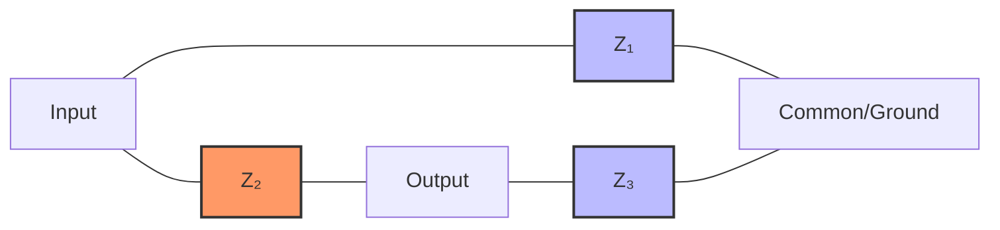

**સરળ રીત:** "PIE: પાઈ ઇમ્પીડન્સીસ કનેક્ટેડ એટ એન્ડ્સ"

## પ્રશ્ન 2(a) OR [3 marks]

**નેટવર્કનાં પ્રકારો જણાવો.**

**જવાબ**:

| નેટવર્ક પ્રકારો | ઉદાહરણો |
|--------------|----------|
| **લિનિયરતા આધારિત** | લિનિયર નેટવર્ક્સ, નોન-લિનિયર નેટવર્ક્સ |
| **ઘટકો આધારિત** | પેસિવ નેટવર્ક્સ, એક્ટિવ નેટવર્ક્સ |
| **સ્ટ્રક્ચર આધારિત** | લમ્પ્ડ નેટવર્ક્સ, ડિસ્ટ્રિબ્યુટેડ નેટવર્ક્સ |
| **વર્તણૂક આધારિત** | બાઇલેટરલ નેટવર્ક્સ, યુનિલેટરલ નેટવર્ક્સ |
| **ટોપોલોજી આધારિત** | T-નેટવર્ક્સ, π-નેટવર્ક્સ, લેટિસ નેટવર્ક્સ |
| **પોર્ટ્સ આધારિત** | વન-પોર્ટ નેટવર્ક્સ, ટુ-પોર્ટ નેટવર્ક્સ, મલ્ટિ-પોર્ટ નેટવર્ક્સ |

**આકૃતિ:**

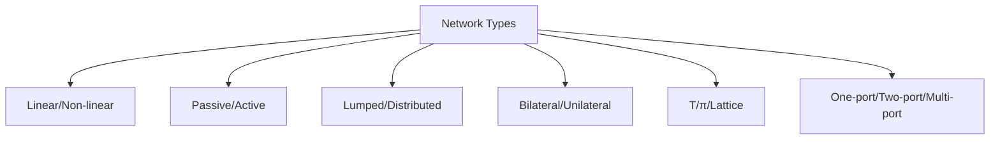

**સરળ રીત:** "PLAN-TB: પેસિવ-લિનિયર-એક્ટિવ-નેટવર્ક-ટોપોલોજી-બાઇલેટરલ"

## પ્રશ્ન 2(b) OR [4 marks]

**40, 60 અને 80 ohms ના રેઝીસ્ટર ડેલ્ટામાં કનેક્ટ કરેલા છે. સ્ટાર કનેક્શનનાં ઇક્વીવેલન્ટ રેઝીસ્ટર શોધો.**

**જવાબ**:

**આકૃતિ:**

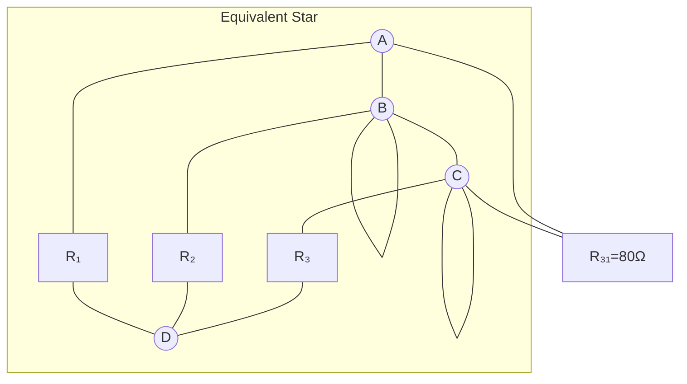

| ડેલ્ટા થી સ્ટાર કન્વર્ઝન ફોર્મ્યુલા | ગણતરી | પરિણામ |
|----------------------------------|-------------|--------|
| R₁ = (R₁₂×R₃₁)/(R₁₂+R₂₃+R₃₁) | (40×80)/(40+60+80) | 17.78 Ω |
| R₂ = (R₁₂×R₂₃)/(R₁₂+R₂₃+R₃₁) | (40×60)/(40+60+80) | 13.33 Ω |
| R₃ = (R₂₃×R₃₁)/(R₁₂+R₂₃+R₃₁) | (60×80)/(40+60+80) | 26.67 Ω |

**સરળ રીત:** "DPS: ડેલ્ટા પ્રોડક્ટ ઓવર સમ"

## પ્રશ્ન 2(c) OR [7 marks]

**symmetrical T – network માટે કેરેક્ટરાસ્ટીક ઇમ્પીડન્સ સમજાવો. ZOT નું સૂત્ર ZOC and ZSC ના રૂપમાં તારવો.**

**જવાબ**:

| વિભાવના | વર્ણન |
|---------|-------------|
| **કેરેક્ટરાસ્ટીક ઇમ્પીડન્સ (Z₀)** | આઉટપુટ પોર્ટ પર જોડાયેલું ઇમ્પીડન્સ જેના કારણે ઇનપુટ ઇમ્પીડન્સ Z₀ ની બરાબર થાય |
| **સિમેટ્રિકલ T-નેટવર્ક** | T-નેટવર્ક જેમાં બંને બાજુના સિરીઝ ઇમ્પીડન્સ સમાન હોય |
| **ZOC અને ZSC** | નેટવર્કના ઓપન-સર્કિટ અને શોર્ટ-સર્કિટ ઇમ્પીડન્સીસ |

**આકૃતિ:**

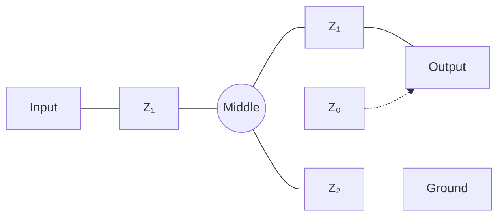

સિમેટ્રિકલ T-નેટવર્ક માટે:

- સિરીઝ ઇમ્પીડન્સીસ (Z₁) સમાન હોય છે
- Z₂ એ શન્ટ ઇમ્પીડન્સ છે

કેરેક્ટરાસ્ટીક ઇમ્પીડન્સ (Z₀ᵀ) આ રીતે આપવામાં આવે છે:
Z₀ᵀ = √(Z₀ᶜ × Z₀ˢᶜ)

જ્યાં:

- Z₀ᶜ = ઓપન સર્કિટ ઇમ્પીડન્સ = Z₁ + Z₂ + (Z₁×Z₂)/Z₁ = Z₁ + Z₂
- Z₀ˢᶜ = શોર્ટ સર્કિટ ઇમ્પીડન્સ = Z₁²/Z₂

તેથી:
Z₀ᵀ = √[(Z₁ + Z₂) × Z₁²/Z₂] = √[Z₁² + Z₁×Z₂]

**સરળ રીત:** "TOSS: T-નેટવર્ક્સ ઓપન એન્ડ શોર્ટ સર્કિટ સ્ક્વેર-રૂટ"

## પ્રશ્ન 3(a) [3 marks]

**Kirchhoff's law સમજાવો.**

**જવાબ**:

| નિયમ | વિધાન | ઉપયોગ |
|-----|-----------|-------------|
| **Kirchhoff's Current Law (KCL)** | નોડમાં પ્રવેશતા કરંટનો સરવાળો નોડમાંથી નીકળતા કરંટના સરવાળા બરાબર હોય | નોડલ એનાલિસિસ માટે ઉપયોગી |
| **Kirchhoff's Voltage Law (KVL)** | કોઈપણ બંધ લૂપની આસપાસ વોલ્ટેજનો સરવાળો શૂન્ય હોય | મેશ એનાલિસિસ માટે ઉપયોગી |

**આકૃતિ:**

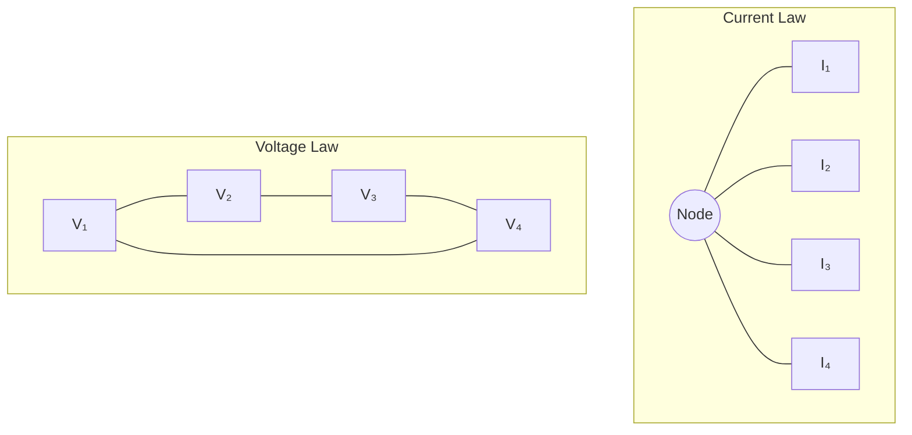

**સરળ રીત:** "KVC: કિરચોફ વેરિફાઈસ કરંટ એન્ડ વોલ્ટેજ લોઝ"

## પ્રશ્ન 3(b) [4 marks]

**Mesh analysis સમજાવો.**

**જવાબ**:

| વિભાવના | વર્ણન |
|---------|-------------|
| **વ્યાખ્યા** | દરેક સ્વતંત્ર બંધ લૂપ (મેશ) માટે KVL લાગુ પાડીને સર્કિટ સમસ્યાઓ ઉકેલવાની પદ્ધતિ |
| **પ્રક્રિયા** | 1. દરેક લૂપને મેશ કરંટ આપો<br>2. દરેક મેશ માટે KVL સમીકરણો લખો<br>3. પરિણામી સમીકરણોની સિસ્ટમ ઉકેલો |
| **ફાયદાઓ** | - સમીકરણોની સંખ્યા ઘટાડે છે<br>- ઘણી શાખાઓ વાળા સર્કિટ્સ માટે સારું કામ કરે છે<br>- વોલ્ટેજ સ્ત્રોતો વાળી સમસ્યાઓ માટે યોગ્ય |

**આકૃતિ:**

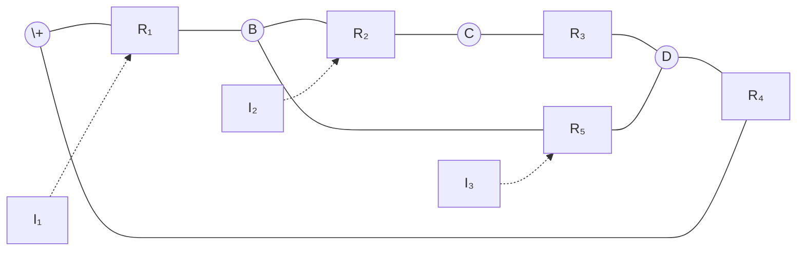

**સરળ રીત:** "MAIL: મેશ એનાલિસિસ યુઝિસ ઇન્ડિપેન્ડન્ટ લૂપ્સ"

## પ્રશ્ન 3(c) [7 marks]

**Thevenin's theorem નો ઉપયોગ કરીને ઉપર દશાર્વેલ સર્કિટ માટે 5 Ω રેઝીસ્ટર માંથી પસાર થતો કરંટ શોધો.**

**જવાબ**:

**આકૃતિ:**

```goat
          10Ω        15Ω
          ----      ----
         /    \    /    \
        /      \  /      \
  100V +        A        B
        \       |        /
         \     ---      /
          \   | 5Ω|    /
           \  |   |   /
            \ ---   /
             \|   |/
              6Ω  8Ω
```

**સ્ટેપ 1:** 5Ω રેઝીસ્ટર દૂર કરીને ઓપન સર્કિટ વોલ્ટેજ (Vₜₕ) શોધો
**સ્ટેપ 2:** થેવેનિનનું ઇક્વિવેલન્ટ રેઝિસ્ટન્સ (Rₜₕ) શોધો
**સ્ટેપ 3:** 5Ω રેઝીસ્ટરમાંથી પસાર થતો કરંટ ગણો

| સ્ટેપ | ગણતરી | પરિણામ |
|------|-------------|--------|
| **Vₜₕ** | A અને B વચ્ચેનું વોલ્ટેજ જ્યારે 5Ω દૂર કરવામાં આવે | 38.46 V |
| **Rₜₕ** | A અને B થી જોવાતું ઇક્વિવેલન્ટ રેઝિસ્ટન્સ જ્યારે 100V સ્ત્રોત શોર્ટ કરવામાં આવે | 3.6 Ω |
| **કરંટ** | I = Vₜₕ/(Rₜₕ + 5) = 38.46/(3.6 + 5) | 4.47 A |

**સરળ રીત:** "TVR: થેવેનિન રિપ્લેસીસ વોલ્ટેજ એન્ડ રેઝીસ્ટન્સ"

## પ્રશ્ન 3(a) OR [3 marks]

**Superposition Theorem જણાવો અને સમજાવો.**

**જવાબ**:

| વિભાવના | વર્ણન |
|---------|-------------|
| **વિધાન** | લિનિયર સર્કિટમાં બહુવિધ સ્ત્રોતો સાથે, કોઈપણ બિંદુ પર પ્રતિભાવ દરેક સ્ત્રોત એકલા કાર્ય કરતા હોય ત્યારે થતા પ્રતિભાવોના સરવાળા બરાબર હોય છે |
| **પ્રક્રિયા** | 1. એક સમયે એક સ્ત્રોત ધ્યાનમાં લો<br>2. અન્ય વોલ્ટેજ સ્ત્રોતોને શોર્ટ સર્કિટથી બદલો<br>3. અન્ય કરંટ સ્ત્રોતોને ઓપન સર્કિટથી બદલો<br>4. વ્યક્તિગત પ્રતિભાવો શોધો<br>5. બધા પ્રતિભાવોને બીજગણિતીય રીતે ઉમેરો |
| **મર્યાદા** | માત્ર લિનિયર સર્કિટ્સ અને વોલ્ટેજ/કરંટ પ્રતિભાવો માટે જ લાગુ |

**આકૃતિ:**

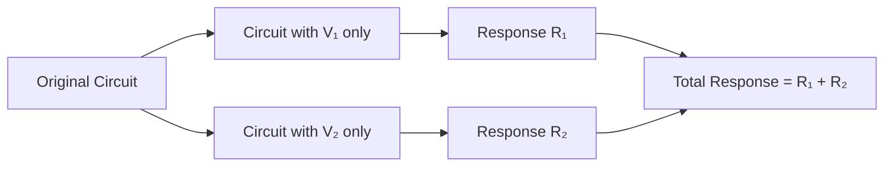

**સરળ રીત:** "SUPER: સોર્સિસ યુઝ્ડ પ્રોગ્રેસિવલી ઈક્વલ્સ રિસ્પોન્સ"

## પ્રશ્ન 3(b) OR [4 marks]

**કોઈપણ સર્કિટનો ઉપયોગ કરીને ડ્યુઅલ નેટવર્ક દોરવાની પદ્ધતિ સમજાવો.**

**જવાબ**:

| સ્ટેપ | વર્ણન |
|------|------------|
| **ગ્રાફમાં રૂપાંતરણ** | સર્કિટને પ્લેનર ગ્રાફ તરીકે દોરો |
| **ડ્યુઅલ ગ્રાફ દોરો** | મૂળ ગ્રાફના દરેક ક્ષેત્રમાં એક નોડ મૂકો |
| **નોડ્સ જોડો** | મૂળ ગ્રાફની દરેક એજને ક્રોસ કરતી એજ દોરો |
| **ઘટકોને બદલો** | - રેઝિસ્ટન્સ R કન્ડક્ટન્સ 1/R બને<br>- વોલ્ટેજ સોર્સ કરંટ સોર્સ બને<br>- સિરીઝ પેરેલલ બને<br>- ઇમ્પીડન્સ Z એડમિટન્સ 1/Z બને |

**આકૃતિ:**

```goat
Original Circuit     Dual Circuit
   +---R1---+         +---G1---+
   |        |         |        |
  V1       R2        I1       G2
   |        |         |        |
   +---R3---+         +---G3---+
```

**સરળ રીત:** "DVSG: ડ્યુઅલ ટ્રાન્સફોર્મ્સ વોલ્ટેજ ટુ સિરીઝ ટુ ગ્રાફ્સ"

## પ્રશ્ન 3(c) OR [7 marks]

**ઉપર આપેલ નેટવર્ક માટે નોર્ટનની ઇક્વીવેલન્ટ સર્કિટ શોધો. લોડ કરંટ શોધો જો (i) RL=3 KΩ (ii) RL=1.5 Ω**

**જવાબ**:

**આકૃતિ:**

```goat
        2kΩ          2kΩ          2kΩ
       -----        -----        -----
      /     \      /     \      /     \
     /       \    /       \    /       \
  C +         D  +         E  +         A
     \         \  \         \  \         \
      \         \  \         \  \         \
       \         \ |         | |         |
       |         | |         | |         |
      10V         2kΩ         2kΩ         RL
       |         | |         | |         |
       |         | |         | |         |
       +         + +         + +         +
       B         B B         B B         B
```

**સ્ટેપ 1:** નોર્ટનનો કરંટ (IN) શોધો
**સ્ટેપ 2:** નોર્ટનનું રેઝિસ્ટન્સ (RN) શોધો
**સ્ટેપ 3:** લોડ કરંટ્સ ગણો

| સ્ટેપ | ગણતરી | પરિણામ |
|------|-------------|--------|
| **IN** | A થી B સુધીનો શોર્ટ સર્કિટ કરંટ | 1.25 mA |
| **RN** | A થી B સુધી જોવાતું ઇક્વિવેલન્ટ રેઝિસ્ટન્સ જ્યારે 10V સ્ત્રોત શોર્ટ કરવામાં આવે | 1 kΩ |
| **IL (RL = 3 KΩ)** | IL = IN × RN/(RN + RL) = 1.25 × 1/(1 + 3) | 0.31 mA |
| **IL (RL = 1.5 Ω)** | IL = IN × RN/(RN + RL) = 1.25 × 1000/(1000 + 1.5) | 1.25 mA |

**સરળ રીત:** "NICE: નોર્ટન્સ સર્કિટ ઈઝ કરંટ ઈક્વિવેલન્ટ"

## પ્રશ્ન 4(a) [3 marks]

**કોઇલ માટે ક્વોલિટી ફેક્ટર Q નું સમીકરણ મેળવો.**

**જવાબ**:

| પેરામીટર | સંબંધ |
|-----------|--------------|
| **Q ફેક્ટર વ્યાખ્યા** | સંગ્રહિત ઊર્જા અને પ્રતિ ચક્ર વેડફાતી ઊર્જાનો ગુણોત્તર |
| **કોઇલ ઇમ્પીડન્સ** | Z = R + jωL |
| **રિએક્ટન્સ** | XL = ωL |
| **ક્વોલિટી ફેક્ટર** | Q = XL/R = ωL/R |

**આકૃતિ:**

```goat
    +---R---+
    |       |
    +--L----+
```

કોઇલ માટે, સંગ્રહિત ઊર્જા ચુંબકીય ક્ષેત્રમાં (ઇન્ડક્ટરમાં) હોય છે, જ્યારે વેડફાતી ઊર્જા રેઝિસ્ટન્સમાં હોય છે. આમાંથી:

Q = 2π × (સંગ્રહિત ઊર્જા)/(પ્રતિ ચક્ર વેડફાતી ઊર્જા)
Q = ωL/R

**સરળ રીત:** "QREL: ક્વોલિટી રિલેટ્સ એનર્જી ટુ લોસ"

## પ્રશ્ન 4(b) [4 marks]

**શ્રેણી RLC સર્કિટમાં R=30 Ω, L=0.5 H અને C=5 µF છે. (i)Q પરિબળ, (ii) BW, (iii) અપર કટ ઓફ અને લોઅર કટ ઓફ ફ્રીક્વન્સીઝની ગણતરી કરો.**

**જવાબ**:

**આકૃતિ:**


| પેરામીટર | સૂત્ર | ગણતરી | પરિણામ |
|-----------|---------|-------------|--------|
| **રેઝોનન્ટ ફ્રીક્વન્સી (f₀)** | f₀ = 1/(2π√LC) | 1/(2π√(0.5×5×10⁻⁶)) | 100.53 Hz |
| **Q ફેક્ટર** | Q = (1/R)√(L/C) | (1/30)√(0.5/(5×10⁻⁶)) | 105.57 |
| **બેન્ડવિડ્થ (BW)** | BW = f₀/Q | 100.53/105.57 | 0.952 Hz |
| **લોઅર કટઓફ (f₁)** | f₁ = f₀ - BW/2 | 100.53 - 0.952/2 | 100.05 Hz |
| **અપર કટઓફ (f₂)** | f₂ = f₀ + BW/2 | 100.53 + 0.952/2 | 101.01 Hz |

**સરળ રીત:** "QBCUT: ક્વોલિટી બેન્ડવિડ્થ કટઓફ યુનિકલી રિલેટેડ"

## પ્રશ્ન 4(c) [7 marks]

**મ્યુચ્યુઅલ ઇન્ડક્ટન્સના કો-એફીસીએન્ટ સાથે મ્યુચ્યુઅલ ઇન્ડક્ટન્સ સમજાવો. K નું સમીકરણ પણ મેળવો.**

**જવાબ**:

| વિભાવના | વર્ણન |
|---------|-------------|
| **મ્યુચ્યુઅલ ઇન્ડક્ટન્સ (M)** | ગુણધર્મ જ્યાં એક કોઇલમાં કરંટ બદલાવથી પાસેની કોઇલમાં વોલ્ટેજ ઉત્પન્ન થાય છે |
| **વ્યાખ્યા** | પ્રાથમિક કોઇલમાં કરંટના બદલાવના દરના સાપેક્ષ ગૌણ કોઇલમાં પ્રેરિત વોલ્ટેજનો ગુણોત્તર |
| **સૂત્ર** | M = k√(L₁L₂) |
| **કપલિંગ ગુણાંક (k)** | કોઇલ્સ વચ્ચે ચુંબકીય કપલિંગનું માપ (0 ≤ k ≤ 1) |

**આકૃતિ:**

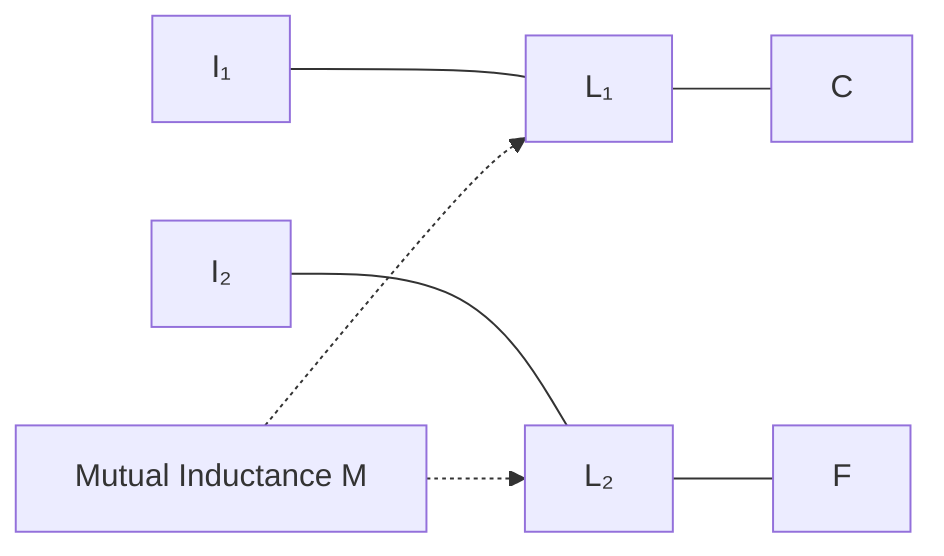

બે ઇન્ડક્ટર્સ L₁ અને L₂ માટે, મ્યુચ્યુઅલ ઇન્ડક્ટન્સ M છે:
M = k√(L₁L₂)

જ્યાં કપલિંગ ગુણાંક k છે:
k = M/√(L₁L₂)

k એક કોઇલથી બીજી કોઇલ સાથે જોડાતા ચુંબકીય ફ્લક્સના અંશનું પ્રતિનિધિત્વ કરે છે.
સંપૂર્ણ કપલ કોઇલ્સ માટે, k = 1
કોઈ કપલિંગ નથી ત્યારે, k = 0

**સરળ રીત:** "MKL: મ્યુચ્યુઅલ કપલિંગ K લિંક્સ ઇન્ડક્ટર્સ"

## પ્રશ્ન 4(a) OR [3 marks]

**કપલ સર્કિટ માટેકપ્લીંગના પ્રકારો સમજાવો.**

**જવાબ**:

| કપલિંગના પ્રકાર | લક્ષણો | ઉપયોગો |
|------------------|-----------------|--------------|
| **ટાઇટ/ક્લોઝ કપલિંગ (k≈1)** | - લગભગ બધો ફ્લક્સ બંને કોઇલ્સને જોડે છે<br>- ઉચ્ચ ટ્રાન્સફર ક્ષમતા<br>- k મૂલ્ય 1 ની નજીક | ટ્રાન્સફોર્મર્સ, પાવર ટ્રાન્સફર |
| **લૂઝ કપલિંગ (k≪1)** | - ફ્લક્સનો નાનો અંશ બીજી કોઇલને જોડે છે<br>- ઓછી ટ્રાન્સફર ક્ષમતા<br>- k મૂલ્ય 1 કરતા ઘણું ઓછું | RF સર્કિટ્સ, ટ્યુન્ડ ફિલ્ટર્સ |
| **ક્રિટિકલ કપલિંગ (k=kc)** | - બેન્ડપાસ પ્રતિભાવ માટે શ્રેષ્ઠ કપલિંગ<br>- રેઝોનન્સ પર મહત્તમ પાવર ટ્રાન્સફર | બેન્ડપાસ ફિલ્ટર્સ, IF ટ્રાન્સફોર્મર્સ |
| **ઇન્ડક્ટિવ કપલિંગ** | - ચુંબકીય ક્ષેત્ર દ્વારા કપલિંગ | ટ્રાન્સફોર્મર્સ, વાયરલેસ ચાર્જિંગ |
| **કેપેસિટિવ કપલિંગ** | - વિદ્યુત ક્ષેત્ર દ્વારા કપલિંગ | સિગ્નલ કપલિંગ, કેપેસિટિવ સેન્સર્સ |

**આકૃતિ:**

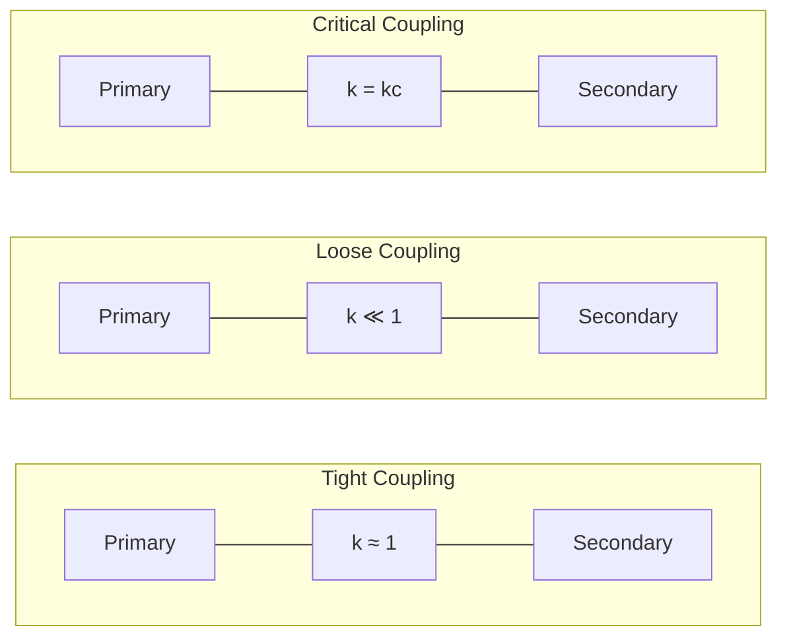

**સરળ રીત:** "TLC: ટાઇટ, લૂઝ, ક્રિટિકલ કપલિંગ્સ"

## પ્રશ્ન 4(b) OR [4 marks]

**ગુણવત્તા પરિબળ Q = 100, રેઝોનન્ટ ફ્રિકવન્સી Fr = 100 KHz સાથે 1 mH નું ઇન્ડક્ટન્સ ધરાવતું સમાંતર રેઝોનન્ટ સર્કિટ. શોધો (i) જરૂરી કેપેસીટન્સ C, (ii) કોઇલનો પ્રતિકાર R, (iii) BW.**

**જવાબ**:

**આકૃતિ:**

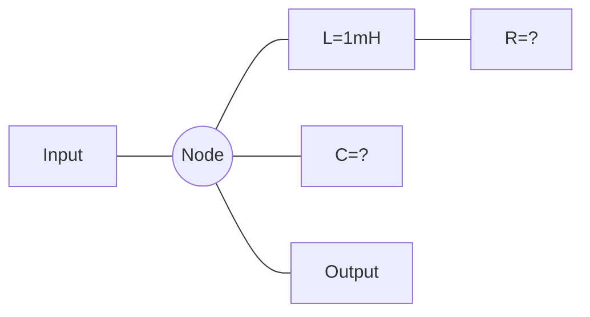

| પેરામીટર | સૂત્ર | ગણતરી | પરિણામ |
|-----------|---------|-------------|--------|
| **કેપેસિટન્સ (C)** | C = 1/(4π²f²L) | 1/(4π²×(100×10³)²×1×10⁻³) | 2.533 nF |
| **કોઇલ રેઝિસ્ટન્સ (R)** | R = ωL/Q | 2π×100×10³×1×10⁻³/100 | 6.28 Ω |
| **બેન્ડવિડ્થ (BW)** | BW = fr/Q | 100×10³/100 | 1 kHz |

**સરળ રીત:** "RCB: રેઝોનન્સ નીડ્સ કેપેસિટન્સ એન્ડ બેન્ડવિડ્થ"

## પ્રશ્ન 4(c) OR [7 marks]

**series RLC સર્કિટની Band width અને Selectivity સમજાવો. શ્રેણી રેઝોનન્સ સર્કિટ માટે Q પરિબળ અને BW વચ્ચેનો સંબંધ પણ સ્થાપિત કરો.**

**જવાબ**:

| પેરામીટર | વ્યાખ્યા | સંબંધ |
|-----------|------------|--------------|
| **બેન્ડવિડ્થ (BW)** | હાફ-પાવર પોઇન્ટ્સ વચ્ચેનો ફ્રીક્વન્સી રેન્જ | BW = f₂ - f₁ = ω₂ - ω₁ = R/L |
| **સિલેક્ટિવિટી** | વિવિધ ફ્રીક્વન્સીઓના સિગ્નલ્સને અલગ કરવાની ક્ષમતા | BW સાથે વ્યસ્ત પ્રમાણમાં |
| **Q ફેક્ટર** | રેઝોનન્ટ ફ્રીક્વન્સીનો બેન્ડવિડ્થ સાથેનો ગુણોત્તર | Q = ω₀/BW = ω₀L/R |

**આકૃતિ:**

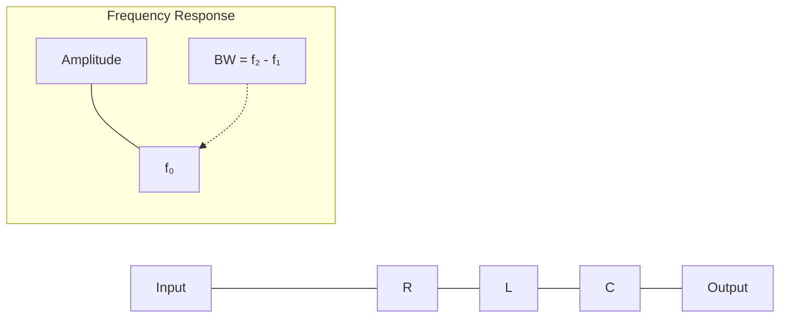

સિરીઝ RLC સર્કિટ માટે:

- રેઝોનન્સ (f₀) પર, ઇમ્પીડન્સ ન્યૂનતમ છે (= R)
- હાફ-પાવર પોઇન્ટ્સ ત્યારે આવે છે જ્યારે ઇમ્પીડન્સ = √2×R
- આ બિંદુઓ પર, પાવર મહત્તમ પાવરનો અડધો હોય છે

બેન્ડવિડ્થ (BW) = ω₂ - ω₁ = R/L
Q ફેક્ટર = ω₀L/R = ω₀/BW

તેથી, BW = ω₀/Q = 2πf₀/Q

આ દર્શાવે છે કે Q ફેક્ટર અને બેન્ડવિડ્થ વ્યસ્ત રીતે સંબંધિત છે:
ઉચ્ચ Q → સાંકડી બેન્ડવિડ્થ → વધુ સારી સિલેક્ટિવિટી

**સરળ રીત:** "BQS: બેન્ડવિડ્થ અને Q નક્કી કરે છે સિલેક્ટિવિટી"

## પ્રશ્ન 5(a) [3 marks]

**40 ડીબીનું એટેન્યુએશન આપવા અને 300 Ω પ્રતિકારના લોડમાં કામ કરવા માટે સપ્રમાણ T પ્રકારના એટેન્યુએટરને ડિઝાઇન કરો.**

**જવાબ**:

**આકૃતિ:**

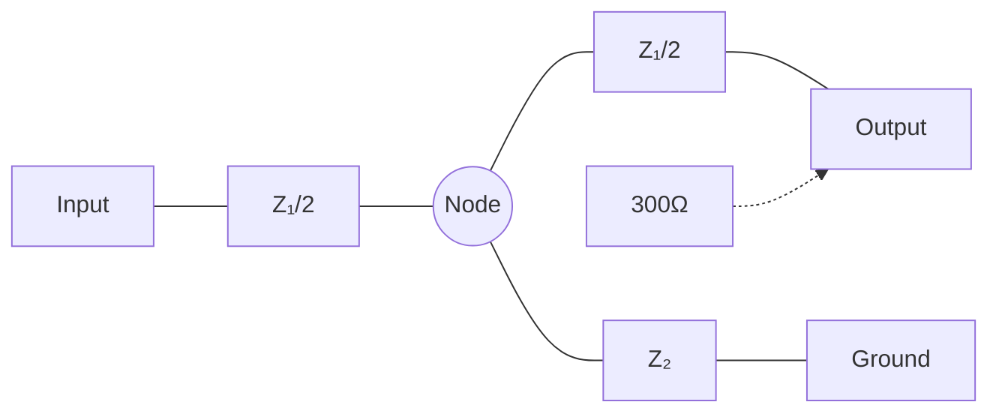

| પેરામીટર | સૂત્ર | ગણતરી | પરિણામ |
|-----------|---------|-------------|--------|
| **એટેન્યુએશન (N)** | N = 10^(dB/20) | 10^(40/20) | 100 |
| **ઇમ્પીડન્સ રેશિયો (K)** | K = (N+1)/(N-1) | (100+1)/(100-1) | 1.02 |
| **Z₁** | Z₁ = R₀[(K-1)/K] | 300[(1.02-1)/1.02] | 5.88 Ω |
| **Z₂** | Z₂ = R₀[2K/(K²-1)] | 300[2×1.02/(1.02²-1)] | 594.12 Ω |

**સરળ રીત:** "TANZ: T-એટેન્યુએટર નીડ્સ Z-પેરામીટર્સ"

## પ્રશ્ન 5(b) [4 marks]

**ફિલ્ટર્સનું વર્ગીકરણ આપો.**

**જવાબ**:

| વર્ગીકરણ | પ્રકારો | લક્ષણો |
|----------------|-------|-----------------|
| **ફ્રીક્વન્સી રિસ્પોન્સ આધારિત** | - લો પાસ<br>- હાઇ પાસ<br>- બેન્ડ પાસ<br>- બેન્ડ સ્ટોપ | - કટઓફ નીચેની ફ્રીક્વન્સી પસાર કરે<br>- કટઓફ ઉપરની ફ્રીક્વન્સી પસાર કરે<br>- બેન્ડની અંદરની ફ્રીક્વન્સી પસાર કરે<br>- બેન્ડની અંદરની ફ્રીક્વન્સી અવરોધે |
| **ઘટકો આધારિત** | - પેસિવ ફિલ્ટર્સ<br>- એક્ટિવ ફિલ્ટર્સ | - R, L, C ઘટકોનો ઉપયોગ<br>- RC સાથે એક્ટિવ ડિવાઇસનો ઉપયોગ |
| **ડિઝાઇન અભિગમ આધારિત** | - કન્સ્ટન્ટ-k ફિલ્ટર્સ<br>- m-ડેરાઇવ્ડ ફિલ્ટર્સ<br>- કમ્પોઝિટ ફિલ્ટર્સ | - સરળતમ ડિઝાઇન<br>- વધુ સારા કટઓફ લક્ષણો<br>- ફાયદાઓનું સંયોજન |
| **ટેકનોલોજી આધારિત** | - LC ફિલ્ટર્સ<br>- ક્રિસ્ટલ ફિલ્ટર્સ<br>- સેરામિક ફિલ્ટર્સ<br>- ડિજિટલ ફિલ્ટર્સ | - ઇન્ડક્ટર અને કેપેસિટરનો ઉપયોગ<br>- પિઝોઇલેક્ટ્રિક ક્રિસ્ટલનો ઉપયોગ<br>- પિઝોઇલેક્ટ્રિક સેરામિકનો ઉપયોગ<br>- સોફ્ટવેરમાં અમલીકરણ |

**આકૃતિ:**

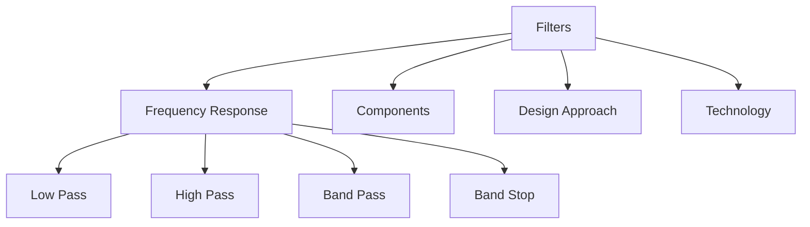

**સરળ રીત:** "FLAC: ફિલ્ટર્સ: લો-પાસ, એક્ટિવ, કન્સ્ટન્ટ-k"

## પ્રશ્ન 5(c) [7 marks]

**constant K લો પાસ ફિલ્ટર સમજાવો.**

**જવાબ**:

| વિભાવના | વર્ણન |
|---------|-------------|
| **વ્યાખ્યા** | ફિલ્ટર જેમાં ઇમ્પીડન્સ પ્રોડક્ટ Z₁Z₂ = k² (અચળ) દરેક ફ્રીક્વન્સી પર |
| **સર્કિટ પ્રકાર** | T-સેક્શન અને π-સેક્શન |
| **T-સેક્શન ઘટકો** | સિરીઝ ઇન્ડક્ટર્સ (L/2) અને શન્ટ કેપેસિટર (C) |
| **π-સેક્શન ઘટકો** | સિરીઝ ઇન્ડક્ટર (L) અને શન્ટ કેપેસિટર્સ (C/2) |
| **કટઓફ ફ્રીક્વન્સી** | fc = 1/π√(LC) |
| **કેરેક્ટરિસ્ટિક ઇમ્પીડન્સ** | R₀ = √(L/C) |

**આકૃતિ:**

```mermaid
graph TD
    subgraph "T-section"
        A1[Input] --- B1[L/2] --- C1((Node)) --- D1[L/2] --- E1[Output]
        C1 --- F1[C] --- G1[Ground]
    end

    subgraph "π-section"
        A2[Input] --- B2((Node))
        B2 --- C2[C/2] --- G2[Ground]
        B2 --- D2[L] --- E2((Node)) --- F2[Output]
        E2 --- H2[C/2] --- G2
    end
```

કન્સ્ટન્ટ-k લો પાસ ફિલ્ટરના લક્ષણો:

- કટઓફ ફ્રીક્વન્સી: fc = 1/π√(LC)
- ડિઝાઇન ઇમ્પીડન્સ: R₀ = √(L/C)
- પાસ બેન્ડ: 0 થી fc
- એટેન્યુએશન બેન્ડ: fc ઉપર
- પાસ બેન્ડથી સ્ટોપ બેન્ડ સુધી ક્રમશઃ સંક્રમણ

**સરળ રીત:** "CLPT: કન્સ્ટન્ટ-k લો પાસ નીડ્સ T-સેક્શન"

## પ્રશ્ન 5(a) OR [3 marks]

**400 Ω ના લોડ પ્રતિકાર સાથે 1.5 KHz ની કટ-ઓફ આવર્તન ધરાવતા T વિભાગ સાથે ઉચ્ચ પાસ ફિલ્ટર ડિઝાઇન કરો.**

**જવાબ**:

**આકૃતિ:**

```mermaid
graph LR
    A[Input] --- B[C/2] --- C((Node)) --- D[C/2] --- E[Output]
    C --- F[L] --- G[Ground]
    H[400Ω] -.-> E
```

| પેરામીટર | સૂત્ર | ગણતરી | પરિણામ |
|-----------|---------|-------------|--------|
| **ડિઝાઇન ઇમ્પીડન્સ (R₀)** | R₀ = લોડ રેઝિસ્ટન્સ | આપેલ | 400 Ω |
| **કટઓફ ફ્રીક્વન્સી (fc)** | fc = આપેલ | આપેલ | 1.5 kHz |
| **ઇન્ડક્ટર (L)** | L = R₀/2πfc | 400/(2π×1500) | 42.44 mH |
| **કેપેસિટર (C)** | C = 1/(2πfcR₀) | 1/(2π×1500×400) | 0.265 µF |

**સરળ રીત:** "HCL: હાઇ-પાસ નીડ્સ કેપેસિટર એન્ડ ઇન્ડક્ટર"

## પ્રશ્ન 5(b) OR [4 marks]

**એટેન્યુએટરનું વર્ગીકરણ આપો.**

**જવાબ**:

| વર્ગીકરણ | પ્રકારો | લક્ષણો |
|----------------|-------|-----------------|
| **કન્ફિગરેશન આધારિત** | - T-એટેન્યુએટર<br>- π-એટેન્યુએટર<br>- બ્રિજ્ડ-T<br>- લેટિસ | - સિરીઝ-શન્ટ-સિરીઝ<br>- શન્ટ-સિરીઝ-શન્ટ<br>- બેલેન્સ્ડ બ્રિજ<br>- બેલેન્સ્ડ નેટવર્ક |
| **સિમેટ્રી આધારિત** | - સિમેટ્રિકલ<br>- એસિમેટ્રિકલ | - સમાન ઇમ્પીડન્સ<br>- અસમાન ઇમ્પીડન્સ |
| **નિયંત્રણ આધારિત** | - ફિક્સ્ડ<br>- વેરિએબલ<br>- પ્રોગ્રામેબલ | - અચળ એટેન્યુએશન<br>- સમાયોજ્ય એટેન્યુએશન<br>- ડિજિટલી નિયંત્રિત |
| **ટેકનોલોજી આધારિત** | - રેઝિસ્ટિવ<br>- રિએક્ટિવ<br>- એક્ટિવ | - રેઝિસ્ટરનો ઉપયોગ<br>- રિએક્ટન્સનો ઉપયોગ<br>- એક્ટિવ ડિવાઇસનો ઉપયોગ |

**આકૃતિ:**

```mermaid
graph TD
    A[Attenuators] --> B[Configuration]
    A --> C[Symmetry]
    A --> D[Control]
    A --> E[Technology]

    B --> F[T-type]
    B --> G[π-type]
    B --> H[Bridged-T]
    B --> I[Lattice]
```

**સરળ રીત:** "CAST: કન્ફિગરેશન, એડજસ્ટેબલ, સિમેટ્રી, ટેકનોલોજી"

## પ્રશ્ન 5(c) OR [7 marks]

**constant K હાઇ પાસ ફિલ્ટર સમજાવો.**

**જવાબ**:

| વિભાવના | વર્ણન |
|---------|-------------|
| **વ્યાખ્યા** | કટઓફ ઉપરની ફ્રીક્વન્સી પસાર કરતું ફિલ્ટર, જેમાં Z₁Z₂ = k² (અચળ) |
| **સર્કિટ પ્રકાર** | T-સેક્શન અને π-સેક્શન |
| **T-સેક્શન ઘટકો** | સિરીઝ કેપેસિટર્સ (C/2) અને શન્ટ ઇન્ડક્ટર (L) |
| **π-સેક્શન ઘટકો** | સિરીઝ કેપેસિટર (C) અને શન્ટ ઇન્ડક્ટર્સ (L/2) |
| **કટઓફ ફ્રીક્વન્સી** | fc = 1/π√(LC) |
| **કેરેક્ટરિસ્ટિક ઇમ્પીડન્સ** | R₀ = √(L/C) |

**આકૃતિ:**

```mermaid
graph TD
    subgraph "T-section"
        A1[Input] --- B1[C/2] --- C1((Node)) --- D1[C/2] --- E1[Output]
        C1 --- F1[L] --- G1[Ground]
    end

    subgraph "π-section"
        A2[Input] --- B2((Node))
        B2 --- C2[L/2] --- G2[Ground]
        B2 --- D2[C] --- E2((Node)) --- F2[Output]
        E2 --- H2[L/2] --- G2
    end
```

કન્સ્ટન્ટ-k હાઇ પાસ ફિલ્ટરના લક્ષણો:

- કટઓફ ફ્રીક્વન્સી: fc = 1/π√(LC)
- ડિઝાઇન ઇમ્પીડન્સ: R₀ = √(L/C)
- પાસ બેન્ડ: fc ઉપર
- એટેન્યુએશન બેન્ડ: 0 થી fc
- પાસ બેન્ડથી સ્ટોપ બેન્ડ સુધી ક્રમશઃ સંક્રમણ
- ઘટક મૂલ્યો લો પાસ ફિલ્ટરના ડ્યુઅલ છે (L અને C જગ્યા બદલે છે)

**સરળ રીત:** "CHTS: કન્સ્ટન્ટ-k હાઇ-પાસ યુઝિસ T-સેક્શન"
