## Question 1(a) [3 marks]

**Define (i) Node (ii) Branch and (iii) Loop for electronic network.**

**Answer**:

| Term | Definition |
|------|------------|
| **Node** | A point where two or more elements are connected together |
| **Branch** | A single element or path between two nodes |
| **Loop** | A closed path in a network where no node is traversed more than once |

**Diagram:**

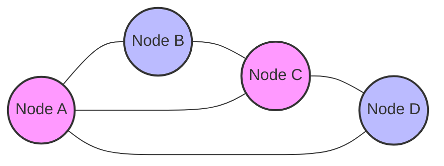

**Mnemonic:** "NBL: Networks Begin with Loops"

## Question 1(b) [4 marks]

**Three resistors of 20 Ω, 30 Ω and 50 Ω are connected in parallel across 60 V supply. Find (i) Current flowing through each resistor and Total current (ii) Equivalent Resistance.**

**Answer**:

**Diagram:**

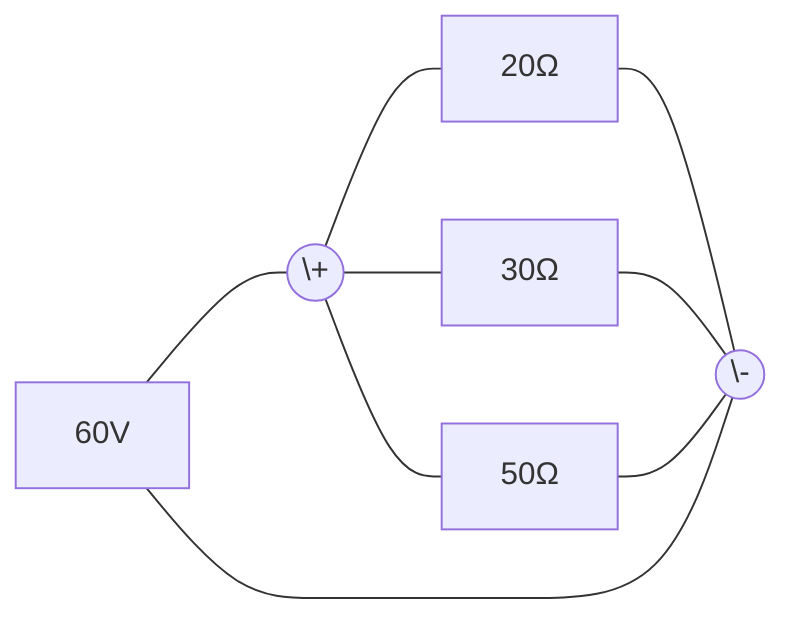

| Calculation | Value |
|-------------|-------|
| **Current through 20 Ω resistor**: I₁ = V/R₁ = 60/20 | 3 A |
| **Current through 30 Ω resistor**: I₂ = V/R₂ = 60/30 | 2 A |
| **Current through 50 Ω resistor**: I₃ = V/R₃ = 60/50 | 1.2 A |
| **Total current**: I = I₁ + I₂ + I₃ = 3 + 2 + 1.2 | 6.2 A |
| **Equivalent resistance**: Req = V/I = 60/6.2 | 9.68 Ω |

**Mnemonic:** "PIV: Parallel Increases the current, Voltage remains the same"

## Question 1(c) [7 marks]

**Explain Series and Parallel connection for Capacitors.**

**Answer**:

| Connection | Formula | Characteristics |
|------------|---------|-----------------|
| **Series Connection** | 1/C_eq = 1/C₁ + 1/C₂ + 1/C₃ + ... | - Equivalent capacitance is less than smallest capacitor<br>- Same current in each capacitor<br>- Total voltage divides across capacitors<br>- Increases effective dielectric strength |
| **Parallel Connection** | C_eq = C₁ + C₂ + C₃ + ... | - Equivalent capacitance is sum of all capacitors<br>- Same voltage across each capacitor<br>- Total charge is sum of individual charges<br>- Increases effective plate area |

**Diagram:**

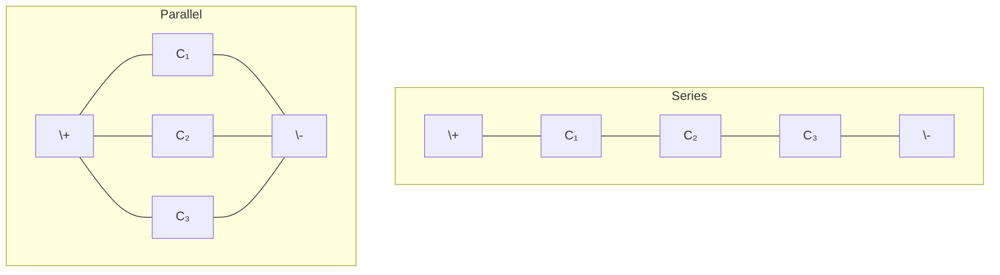

**Mnemonic:** "CAPE: Capacitors Add in Parallel, Eliminate in Series"

## Question 1(c) OR [7 marks]

**Explain Series and Parallel connection for Inductors.**

**Answer**:

| Connection | Formula | Characteristics |
|------------|---------|-----------------|
| **Series Connection** | L_eq = L₁ + L₂ + L₃ + ... | - Equivalent inductance is sum of all inductors<br>- Same current flows through each inductor<br>- Total voltage is sum of individual voltages<br>- Flux linkage adds |
| **Parallel Connection** | 1/L_eq = 1/L₁ + 1/L₂ + 1/L₃ + ... | - Equivalent inductance is less than smallest inductor<br>- Same voltage across each inductor<br>- Total current divides among inductors<br>- Magnetic coupling affects actual value |

**Diagram:**

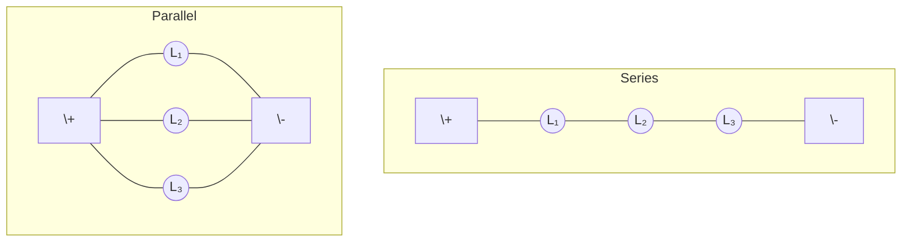

**Mnemonic:** "LIPS: inductors Link in Series, Partition in Parallel"

## Question 2(a) [3 marks]

**Define (i) Transform impedance, (ii) Driving point impedance, (iii) Transfer impedance.**

**Answer**:

| Term | Definition |
|------|------------|
| **Transform impedance** | Impedance seen by signal passing from primary to secondary of a transformer |
| **Driving point impedance** | Ratio of voltage to current at the same pair of terminals or port |
| **Transfer impedance** | Ratio of voltage at one port to the current at another port |

**Diagram:**

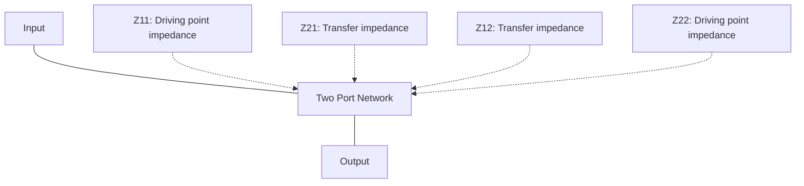

**Mnemonic:** "TDT: Transformers Drive Transfers"

## Question 2(b) [4 marks]

**Three resistances of 30, 50 and 90 ohms are connected in star. Find equivalent resistances in delta connection.**

**Answer**:

**Diagram:**

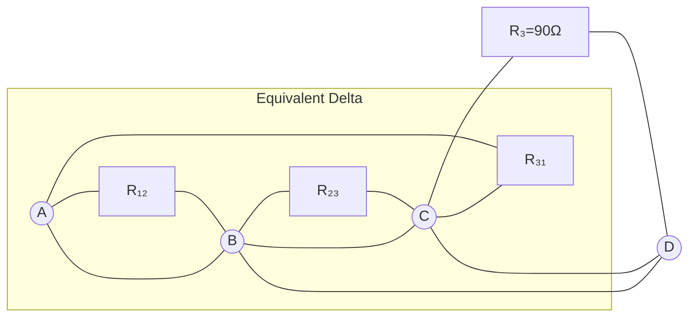

| Star to Delta Conversion Formula | Calculation | Result |
|----------------------------------|-------------|--------|
| R₁₂ = (R₁×R₂ + R₂×R₃ + R₃×R₁)/R₃ | (30×50 + 50×90 + 90×30)/90 | 105 Ω |
| R₂₃ = (R₁×R₂ + R₂×R₃ + R₃×R₁)/R₁ | (30×50 + 50×90 + 90×30)/30 | 315 Ω |
| R₃₁ = (R₁×R₂ + R₂×R₃ + R₃×R₁)/R₂ | (30×50 + 50×90 + 90×30)/50 | 189 Ω |

**Mnemonic:** "PSR: Product over Sum of Resistors"

## Question 2(c) [7 marks]

**Explain π network.**

**Answer**:

| Concept | Description |
|---------|-------------|
| **Definition** | A three-terminal network formed by three impedances - one in series and two in parallel |
| **Structure** | Two impedances connected from input and output to common point, one between input and output |
| **Parameters** | Can be defined using Z, Y, h, or ABCD parameters |
| **Applications** | Matching networks, filters, attenuators, phase shifters |

**Diagram:**

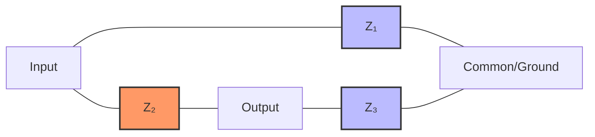

**Mnemonic:** "PIE: Pi Impedances connected at Ends"

## Question 2(a) OR [3 marks]

**List the types of network.**

**Answer**:

| Network Types | Examples |
|--------------|----------|
| **Based on Linearity** | Linear networks, Non-linear networks |
| **Based on Components** | Passive networks, Active networks |
| **Based on Structure** | Lumped networks, Distributed networks |
| **Based on Behavior** | Bilateral networks, Unilateral networks |
| **Based on Topology** | T-networks, π-networks, Lattice networks |
| **Based on Ports** | One-port networks, Two-port networks, Multi-port networks |

**Diagram:**

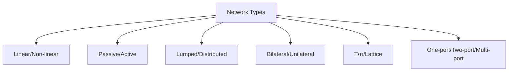

**Mnemonic:** "PLAN-TB: Passive-Linear-Active-Network-Topology-Bilateral"

## Question 2(b) OR [4 marks]

**Three resistances of 40, 60 and 80 ohms are connected in delta. Find equivalent resistances in star connection.**

**Answer**:

**Diagram:**

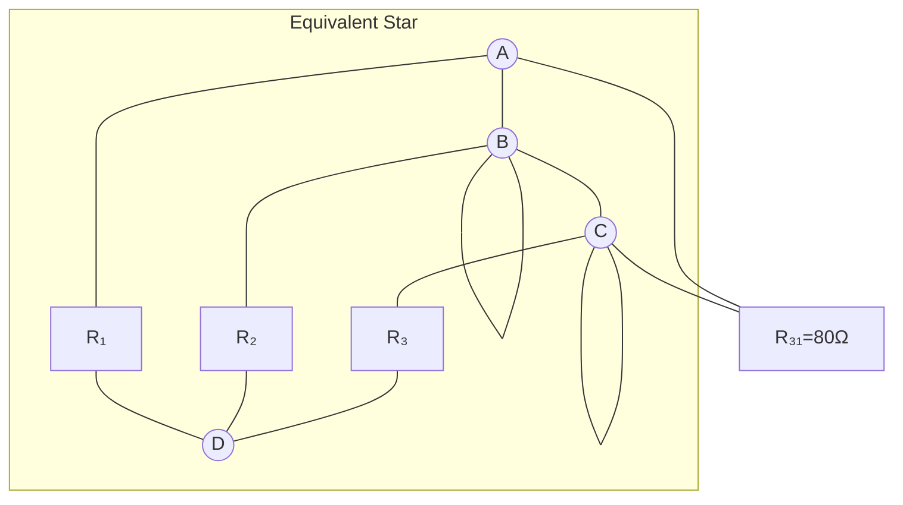

| Delta to Star Conversion Formula | Calculation | Result |
|----------------------------------|-------------|--------|
| R₁ = (R₁₂×R₃₁)/(R₁₂+R₂₃+R₃₁) | (40×80)/(40+60+80) | 17.78 Ω |
| R₂ = (R₁₂×R₂₃)/(R₁₂+R₂₃+R₃₁) | (40×60)/(40+60+80) | 13.33 Ω |
| R₃ = (R₂₃×R₃₁)/(R₁₂+R₂₃+R₃₁) | (60×80)/(40+60+80) | 26.67 Ω |

**Mnemonic:** "DPS: Delta Product over Sum"

## Question 2(c) OR [7 marks]

**Explain characteristic impedance of symmetrical T – network. Also derive the equation of ZOT in terms of ZOC and ZSC.**

**Answer**:

| Concept | Description |
|---------|-------------|
| **Characteristic impedance (Z₀)** | Impedance that when connected at output port causes input impedance to equal Z₀ |
| **Symmetrical T-network** | T-network where the series impedances on both sides are equal |
| **ZOC and ZSC** | Open-circuit and short-circuit impedances of the network |

**Diagram:**

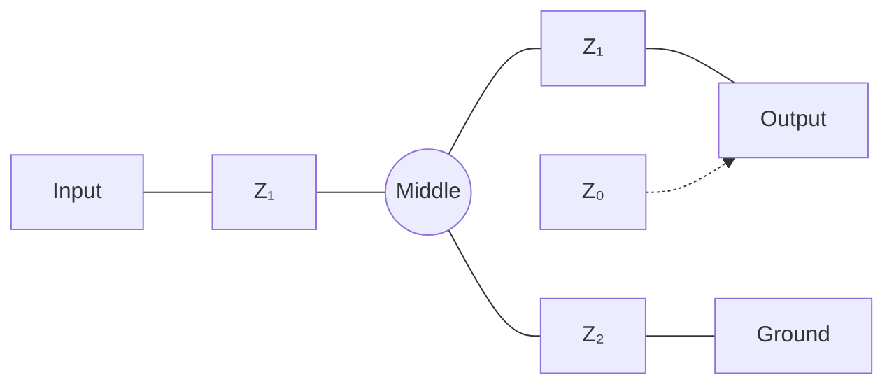

For a symmetrical T-network:

- Series impedances (Z₁) are equal
- Z₂ is the shunt impedance

The characteristic impedance (Z₀ᵀ) is given by:
Z₀ᵀ = √(Z₀ᶜ × Z₀ˢᶜ)

Where:

- Z₀ᶜ = Open circuit impedance = Z₁ + Z₂ + (Z₁×Z₂)/Z₁ = Z₁ + Z₂
- Z₀ˢᶜ = Short circuit impedance = Z₁²/Z₂

Therefore:
Z₀ᵀ = √[(Z₁ + Z₂) × Z₁²/Z₂] = √[Z₁² + Z₁×Z₂]

**Mnemonic:** "TOSS: T-network's Open and Short circuit Square-root"

## Question 3(a) [3 marks]

**Explain Kirchhoff's law.**

**Answer**:

| Law | Statement | Application |
|-----|-----------|-------------|
| **Kirchhoff's Current Law (KCL)** | Sum of currents entering a node equals sum of currents leaving it | Used for nodal analysis |
| **Kirchhoff's Voltage Law (KVL)** | Sum of voltages around any closed loop equals zero | Used for mesh analysis |

**Diagram:**

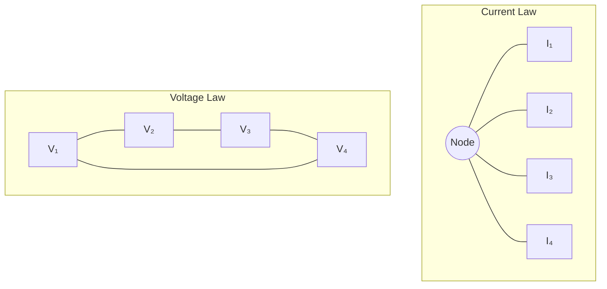

**Mnemonic:** "KVC: Kirchhoff Verifies Current and Voltage laws"

## Question 3(b) [4 marks]

**Explain Mesh analysis.**

**Answer**:

| Concept | Description |
|---------|-------------|
| **Definition** | Method to solve circuit problems by applying KVL to each independent closed loop (mesh) |
| **Procedure** | 1. Assign mesh currents to each loop<br>2. Write KVL equations for each mesh<br>3. Solve the resulting system of equations |
| **Advantages** | - Reduces number of equations<br>- Works well with circuits having many branches<br>- Suitable for problems with voltage sources |

**Diagram:**

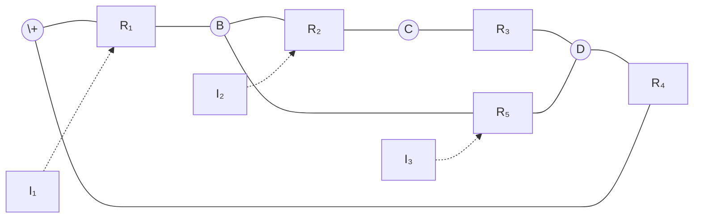

**Mnemonic:** "MAIL: Mesh Analysis uses Independent Loops"

## Question 3(c) [7 marks]

**Use Thevenin's theorem to find current through the 5 Ω resistor for given circuit.**

**Answer**:

**Diagram:**

```goat
          10Ω        15Ω
          ----      ----
         /    \    /    \
        /      \  /      \
  100V +        A        B
        \       |        /
         \     ---      /
          \   | 5Ω|    /
           \  |   |   /
            \ ---   /
             \|   |/
              6Ω  8Ω
```

**Step 1:** Remove 5Ω resistor and find open circuit voltage (Vₜₕ)
**Step 2:** Find Thevenin's equivalent resistance (Rₜₕ)
**Step 3:** Calculate current through 5Ω resistor

| Step | Calculation | Result |
|------|-------------|--------|
| **Vₜₕ** | Voltage between A and B with 5Ω removed | 38.46 V |
| **Rₜₕ** | Equivalent resistance seen from A and B with 100V source shorted | 3.6 Ω |
| **Current** | I = Vₜₕ/(Rₜₕ + 5) = 38.46/(3.6 + 5) | 4.47 A |

**Mnemonic:** "TVR: Thevenin replaces Voltage and Resistance"

## Question 3(a) OR [3 marks]

**State and explain Superposition Theorem.**

**Answer**:

| Concept | Description |
|---------|-------------|
| **Statement** | In a linear circuit with multiple sources, the response at any point equals the sum of responses caused by each source acting alone |
| **Procedure** | 1. Consider one source at a time<br>2. Replace other voltage sources with short circuits<br>3. Replace other current sources with open circuits<br>4. Find individual responses<br>5. Add all responses algebraically |
| **Limitation** | Only applicable to linear circuits and for voltage/current responses |

**Diagram:**

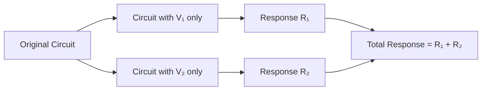

**Mnemonic:** "SUPER: Sources Used Progressively Equals Response"

## Question 3(b) OR [4 marks]

**Explain method of drawing dual network using any circuit.**

**Answer**:

| Step | Description |
|------|-------------|
| **Convert to graph** | Draw the circuit as a planar graph |
| **Draw dual graph** | Place a node in each region of original graph |
| **Connect nodes** | Draw edges crossing each edge of original graph |
| **Replace elements** | - Resistance R becomes conductance 1/R<br>- Voltage source becomes current source<br>- Series becomes parallel<br>- Impedance Z becomes admittance 1/Z |

**Diagram:**

```goat
Original Circuit     Dual Circuit
   +---R1---+         +---G1---+
   |        |         |        |
  V1       R2        I1       G2
   |        |         |        |
   +---R3---+         +---G3---+
```

**Mnemonic:** "DVSG: Dual transforms Voltage to Series to Graphs"

## Question 3(c) OR [7 marks]

**Find out Norton's equivalent circuit for the given network. Find out load current if (i) RL = 3 KΩ (ii) RL = 1.5 Ω**

**Answer**:

**Diagram:**

```goat
        2kΩ          2kΩ          2kΩ
       -----        -----        -----
      /     \      /     \      /     \
     /       \    /       \    /       \
  C +         D  +         E  +         A
     \         \  \         \  \         \
      \         \  \         \  \         \
       \         \ |         | |         |
       |         | |         | |         |
      10V         2kΩ         2kΩ         RL
       |         | |         | |         |
       |         | |         | |         |
       +         + +         + +         +
       B         B B         B B         B
```

**Step 1:** Find Norton's current (IN)
**Step 2:** Find Norton's resistance (RN)
**Step 3:** Calculate load currents

| Step | Calculation | Result |
|------|-------------|--------|
| **IN** | Short circuit current from A to B | 1.25 mA |
| **RN** | Equivalent resistance seen from A to B with 10V source shorted | 1 kΩ |
| **IL (RL = 3 KΩ)** | IL = IN × RN/(RN + RL) = 1.25 × 1/(1 + 3) | 0.31 mA |
| **IL (RL = 1.5 Ω)** | IL = IN × RN/(RN + RL) = 1.25 × 1000/(1000 + 1.5) | 1.25 mA |

**Mnemonic:** "NICE: Norton's circuit Is Current Equivalent"

## Question 4(a) [3 marks]

**Derive the equation of Quality factor Q for a coil.**

**Answer**:

| Parameter | Relationship |
|-----------|--------------|
| **Q factor definition** | Ratio of energy stored to energy dissipated per cycle |
| **Coil impedance** | Z = R + jωL |
| **Reactance** | XL = ωL |
| **Quality factor** | Q = XL/R = ωL/R |

**Diagram:**

```goat
    +---R---+
    |       |
    +--L----+
```

For a coil, the energy stored is in the magnetic field (in the inductor), while energy dissipated is in the resistance. From this:

Q = 2π × (Energy stored)/(Energy dissipated per cycle)
Q = ωL/R

**Mnemonic:** "QREL: Quality Relates Energy to Loss"

## Question 4(b) [4 marks]

**A series RLC circuit has R = 30 Ω, L = 0.5 H and C = 5 µF. Calculate (i) Q factor, (ii) BW, (iii) Upper cut off and lower cut off frequencies.**

**Answer**:

**Diagram:**


| Parameter | Formula | Calculation | Result |
|-----------|---------|-------------|--------|
| **Resonant frequency (f₀)** | f₀ = 1/(2π√LC) | 1/(2π√(0.5×5×10⁻⁶)) | 100.53 Hz |
| **Q factor** | Q = (1/R)√(L/C) | (1/30)√(0.5/(5×10⁻⁶)) | 105.57 |
| **Bandwidth (BW)** | BW = f₀/Q | 100.53/105.57 | 0.952 Hz |
| **Lower cutoff (f₁)** | f₁ = f₀ - BW/2 | 100.53 - 0.952/2 | 100.05 Hz |
| **Upper cutoff (f₂)** | f₂ = f₀ + BW/2 | 100.53 + 0.952/2 | 101.01 Hz |

**Mnemonic:** "QBCUT: Quality Bandwidth Cutoff Uniquely Related"

## Question 4(c) [7 marks]

**Explain Mutual Inductance along with Co-efficient of mutual inductance. Also derive the equation of K.**

**Answer**:

| Concept | Description |
|---------|-------------|
| **Mutual Inductance (M)** | Property where current change in one coil induces voltage in adjacent coil |
| **Definition** | Ratio of induced voltage in secondary to rate of change of current in primary |
| **Formula** | M = k√(L₁L₂) |
| **Coefficient of coupling (k)** | Measure of magnetic coupling between coils (0 ≤ k ≤ 1) |

**Diagram:**

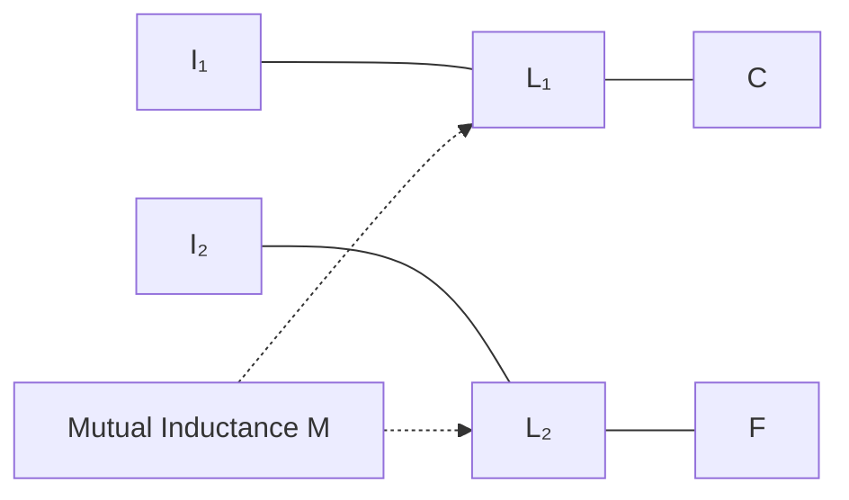

For two inductors L₁ and L₂, mutual inductance M is:
M = k√(L₁L₂)

Where coefficient of coupling k is:
k = M/√(L₁L₂)

k represents fraction of magnetic flux from one coil linking with another coil.
For perfectly coupled coils, k = 1
For no coupling, k = 0

**Mnemonic:** "MKL: Mutual coupling K Links inductors"

## Question 4(a) OR [3 marks]

**Explain the types of coupling for coupled circuit.**

**Answer**:

| Type of Coupling | Characteristics | Applications |
|------------------|-----------------|--------------|
| **Tight/Close Coupling (k≈1)** | - Nearly all flux links both coils<br>- High transfer efficiency<br>- k value close to 1 | Transformers, Power transfer |
| **Loose Coupling (k≪1)** | - Small fraction of flux links second coil<br>- Lower transfer efficiency<br>- k value much less than 1 | RF circuits, Tuned filters |
| **Critical Coupling (k=kc)** | - Optimum coupling for bandpass response<br>- Maximum power transfer at resonance | Bandpass filters, IF transformers |
| **Inductive Coupling** | - Coupling via magnetic field | Transformers, Wireless charging |
| **Capacitive Coupling** | - Coupling via electric field | Signal coupling, Capacitive sensors |

**Diagram:**

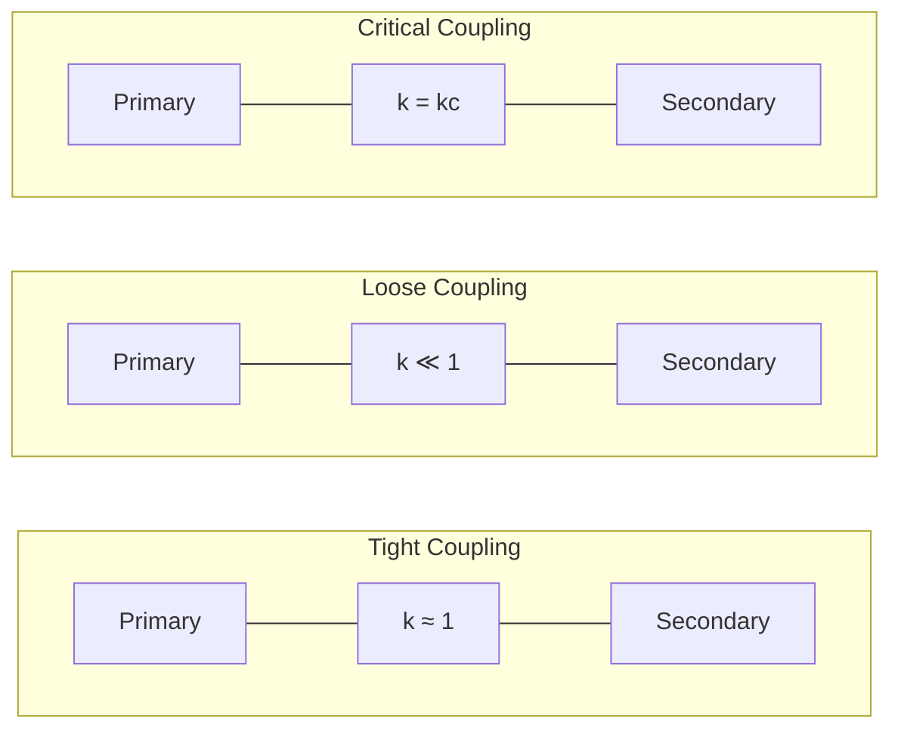

**Mnemonic:** "TLC: Tight, Loose, Critical couplings"

## Question 4(b) OR [4 marks]

**A parallel resonant circuit having inductance of 1 mH with quality factor Q = 100, resonant frequency Fr = 100 KHz. Find out (i) Required capacitance C, (ii) Resistance R of the coil, (iii) BW.**

**Answer**:

**Diagram:**

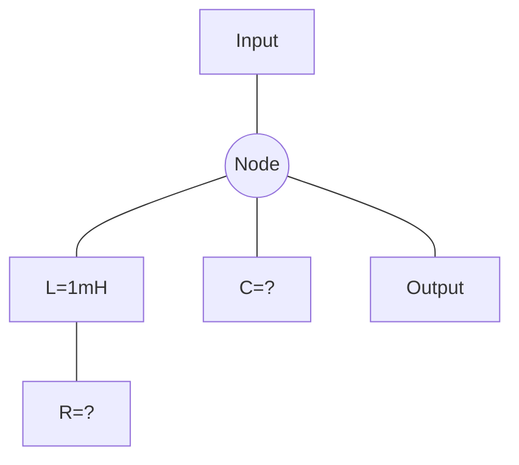

| Parameter | Formula | Calculation | Result |
|-----------|---------|-------------|--------|
| **Capacitance (C)** | C = 1/(4π²f²L) | 1/(4π²×(100×10³)²×1×10⁻³) | 2.533 nF |
| **Coil Resistance (R)** | R = ωL/Q | 2π×100×10³×1×10⁻³/100 | 6.28 Ω |
| **Bandwidth (BW)** | BW = fr/Q | 100×10³/100 | 1 kHz |

**Mnemonic:** "RCB: Resonance needs Capacitance and Bandwidth"

## Question 4(c) OR [7 marks]

**Explain Band width and Selectivity of a series RLC circuit. Also establish the relation between Q factor and BW for series resonance circuit.**

**Answer**:

| Parameter | Definition | Relationship |
|-----------|------------|--------------|
| **Bandwidth (BW)** | Frequency range between half-power points | BW = f₂ - f₁ = ω₂ - ω₁ = R/L |
| **Selectivity** | Ability to differentiate between signals of different frequencies | Inversely proportional to BW |
| **Q factor** | Ratio of resonant frequency to bandwidth | Q = ω₀/BW = ω₀L/R |

**Diagram:**

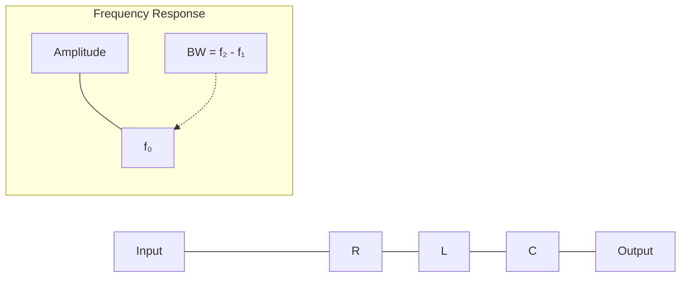

For a series RLC circuit:

- At resonance (f₀), impedance is minimum (= R)
- Half-power points occur when impedance = √2×R
- At these points, power is half of maximum power

Bandwidth (BW) = ω₂ - ω₁ = R/L
Q factor = ω₀L/R = ω₀/BW

Therefore, BW = ω₀/Q = 2πf₀/Q

This shows Q factor and bandwidth are inversely related:
Higher Q → Narrower bandwidth → Better selectivity

**Mnemonic:** "BQS: Bandwidth and Q determine Selectivity"

## Question 5(a) [3 marks]

**Design a symmetrical T type attenuator to give attenuation of 40 dB and work in to the load of 300 Ω resistance.**

**Answer**:

**Diagram:**

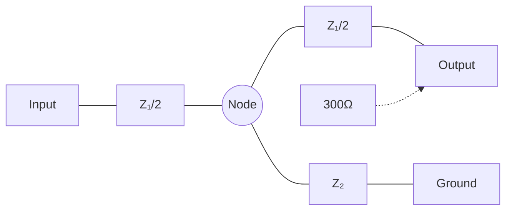

| Parameter | Formula | Calculation | Result |
|-----------|---------|-------------|--------|
| **Attenuation (N)** | N = 10^(dB/20) | 10^(40/20) | 100 |
| **Impedance ratio (K)** | K = (N+1)/(N-1) | (100+1)/(100-1) | 1.02 |
| **Z₁** | Z₁ = R₀[(K-1)/K] | 300[(1.02-1)/1.02] | 5.88 Ω |
| **Z₂** | Z₂ = R₀[2K/(K²-1)] | 300[2×1.02/(1.02²-1)] | 594.12 Ω |

**Mnemonic:** "TANZ: T-Attenuator Needs Z-parameters"

## Question 5(b) [4 marks]

**Give classification of filters.**

**Answer**:

| Classification | Types | Characteristics |
|----------------|-------|-----------------|
| **Based on Frequency Response** | - Low Pass<br>- High Pass<br>- Band Pass<br>- Band Stop | - Passes frequencies below cutoff<br>- Passes frequencies above cutoff<br>- Passes frequencies within a band<br>- Blocks frequencies within a band |
| **Based on Components** | - Passive Filters<br>- Active Filters | - Uses R, L, C elements<br>- Uses active devices with RC |
| **Based on Design Approach** | - Constant-k Filters<br>- m-derived Filters<br>- Composite Filters | - Simplest design<br>- Better cutoff characteristics<br>- Combines advantages |
| **Based on Technology** | - LC Filters<br>- Crystal Filters<br>- Ceramic Filters<br>- Digital Filters | - Uses inductors and capacitors<br>- Uses piezoelectric crystals<br>- Uses piezoelectric ceramics<br>- Implemented in software |

**Diagram:**

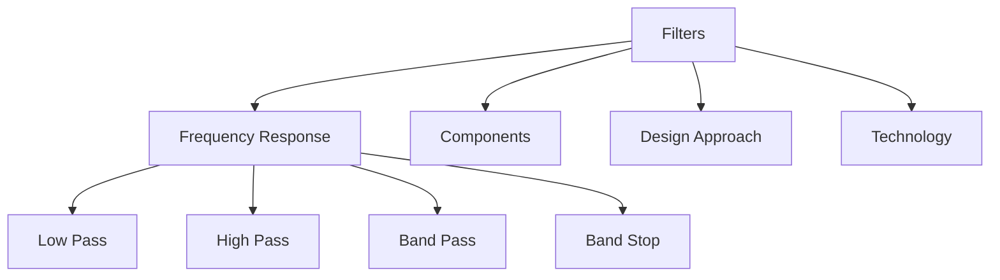

**Mnemonic:** "FLAC: Filters: Low-pass, Active, Constant-k"

## Question 5(c) [7 marks]

**Explain constant K Low Pass Filter.**

**Answer**:

| Concept | Description |
|---------|-------------|
| **Definition** | Filter where impedance product Z₁Z₂ = k² (constant) at all frequencies |
| **Circuit Types** | T-section and π-section |
| **T-section components** | Series inductors (L/2) and shunt capacitor (C) |
| **π-section components** | Series inductor (L) and shunt capacitors (C/2) |
| **Cutoff frequency** | fc = 1/π√(LC) |
| **Characteristic impedance** | R₀ = √(L/C) |

**Diagram:**

```mermaid
graph TD
    subgraph "T-section"
        A1[Input] --- B1[L/2] --- C1((Node)) --- D1[L/2] --- E1[Output]
        C1 --- F1[C] --- G1[Ground]
    end

    subgraph "π-section"
        A2[Input] --- B2((Node))
        B2 --- C2[C/2] --- G2[Ground]
        B2 --- D2[L] --- E2((Node)) --- F2[Output]
        E2 --- H2[C/2] --- G2
    end
```

The constant-k low pass filter has:

- Cutoff frequency: fc = 1/π√(LC)
- Design impedance: R₀ = √(L/C)
- Pass band: 0 to fc
- Attenuation band: Above fc
- Gradual transition from pass band to stop band

**Mnemonic:** "CLPT: Constant-k Low Pass needs T-section"

## Question 5(a) OR [3 marks]

**Design a high pass filter with T section having a cut-off frequency of 1.5 KHz with a load resistance of 400 Ω.**

**Answer**:

**Diagram:**

```mermaid
graph LR
    A[Input] --- B[C/2] --- C((Node)) --- D[C/2] --- E[Output]
    C --- F[L] --- G[Ground]
    H[400Ω] -.-> E
```

| Parameter | Formula | Calculation | Result |
|-----------|---------|-------------|--------|
| **Design impedance (R₀)** | R₀ = Load resistance | Given | 400 Ω |
| **Cutoff frequency (fc)** | fc = Given | Given | 1.5 kHz |
| **Inductor (L)** | L = R₀/2πfc | 400/(2π×1500) | 42.44 mH |
| **Capacitor (C)** | C = 1/(2πfcR₀) | 1/(2π×1500×400) | 0.265 µF |

**Mnemonic:** "HCL: High-pass needs Capacitor and inductor"

## Question 5(b) OR [4 marks]

**Give classification of attenuators.**

**Answer**:

| Classification | Types | Characteristics |
|----------------|-------|-----------------|
| **Based on Configuration** | - T-attenuator<br>- π-attenuator<br>- Bridged-T<br>- Lattice | - Series-shunt-series<br>- Shunt-series-shunt<br>- Balanced bridge<br>- Balanced network |
| **Based on Symmetry** | - Symmetrical<br>- Asymmetrical | - Equal impedance<br>- Unequal impedance |
| **Based on Control** | - Fixed<br>- Variable<br>- Programmable | - Constant attenuation<br>- Adjustable attenuation<br>- Digitally controlled |
| **Based on Technology** | - Resistive<br>- Reactive<br>- Active | - Uses resistors<br>- Uses reactances<br>- Uses active devices |

**Diagram:**

```mermaid
graph TD
    A[Attenuators] --> B[Configuration]
    A --> C[Symmetry]
    A --> D[Control]
    A --> E[Technology]

    B --> F[T-type]
    B --> G[π-type]
    B --> H[Bridged-T]
    B --> I[Lattice]
```

**Mnemonic:** "CAST: Configuration, Adjustable, Symmetry, Technology"

## Question 5(c) OR [7 marks]

**Explain constant K High Pass Filter.**

**Answer**:

| Concept | Description |
|---------|-------------|
| **Definition** | Filter passing frequencies above cutoff, with Z₁Z₂ = k² (constant) |
| **Circuit Types** | T-section and π-section |
| **T-section components** | Series capacitors (C/2) and shunt inductor (L) |
| **π-section components** | Series capacitor (C) and shunt inductors (L/2) |
| **Cutoff frequency** | fc = 1/π√(LC) |
| **Characteristic impedance** | R₀ = √(L/C) |

**Diagram:**

```mermaid
graph TD
    subgraph "T-section"
        A1[Input] --- B1[C/2] --- C1((Node)) --- D1[C/2] --- E1[Output]
        C1 --- F1[L] --- G1[Ground]
    end

    subgraph "π-section"
        A2[Input] --- B2((Node))
        B2 --- C2[L/2] --- G2[Ground]
        B2 --- D2[C] --- E2((Node)) --- F2[Output]
        E2 --- H2[L/2] --- G2
    end
```

The constant-k high pass filter has:

- Cutoff frequency: fc = 1/π√(LC)
- Design impedance: R₀ = √(L/C)
- Pass band: Above fc
- Attenuation band: 0 to fc
- Gradual transition from pass band to stop band
- Component values are dual of low pass filter (L and C swap places)

**Mnemonic:** "CHTS: Constant-k High-pass uses T-Section"
