## પ્રશ્ન 1(અ) [3 માર્ક્સ]

**યોગ્ય આકૃતિ સાથે નોડ, બ્રાન્ચ અને લૂપ વ્યાખ્યાયિત કરો.**

**જવાબ**:

**આકૃતિ:**

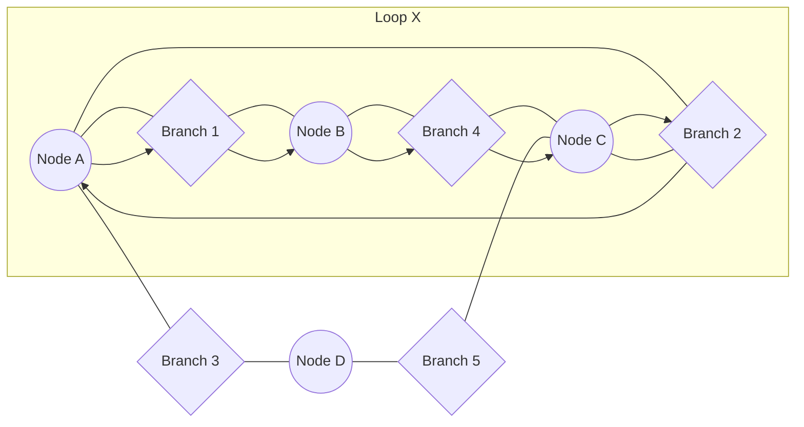

- **નોડ**: એક બિંદુ જ્યાં બે કે વધુ સર્કિટ તત્વો એકબીજા સાથે જોડાય છે
- **બ્રાન્ચ**: બે નોડ્સને જોડતું એક સિંગલ એલિમેન્ટ
- **લૂપ**: સર્કિટમાં કોઈપણ બંધ પાથ જ્યાં કોઈ નોડ એક કરતાં વધુ વખત આવતો નથી

**મેમરી ટ્રીક:** "NBA સર્કિટ" - Nodes જંક્શનો છે, Branches રસ્તાઓ છે, Loops વૈકલ્પિક માર્ગો છે

## પ્રશ્ન 1(બ) [4 માર્ક્સ]

**નેટવર્ક માટે "ટ્રી" અને "ગ્રાફ" સમજાવો.**

**જવાબ**:

**આકૃતિ:**

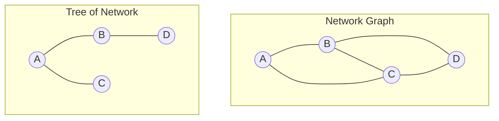

| લક્ષણ | ગ્રાફ | ટ્રી |
|---------|-------|------|
| **વ્યાખ્યા** | નેટવર્કનું સંપૂર્ણ ટોપોલોજિકલ રજૂઆત | કનેક્ટેડ સબગ્રાફ જેમાં બધા નોડ્સ હોય પણ લૂપ ન હોય |
| **તત્વો** | બધી બ્રાન્ચ અને નોડ્સ ધરાવે છે | N-1 બ્રાન્ચ ધરાવે છે જ્યાં N નોડ્સની સંખ્યા છે |
| **લૂપ્સ** | લૂપ્સ ધરાવે છે | કોઈ લૂપ્સ નથી |
| **ઉપયોગ** | સંપૂર્ણ સર્કિટ એનાલિસિસ માટે વપરાય છે | નેટવર્ક ગણતરીઓને સરળ બનાવવા માટે વપરાય છે |

**મેમરી ટ્રીક:** "GRAND Tree" - Graph માં Routes And Nodes with Detours છે, Tree માં ફક્ત સિંગલ Routes છે

## પ્રશ્ન 1(ક) [7 માર્ક્સ]

**યોગ્ય આકૃતિનો ઉપયોગ કરી "મેષ કરંટ મેથડ" સમજાવો.**

**જવાબ**:

**આકૃતિ:**

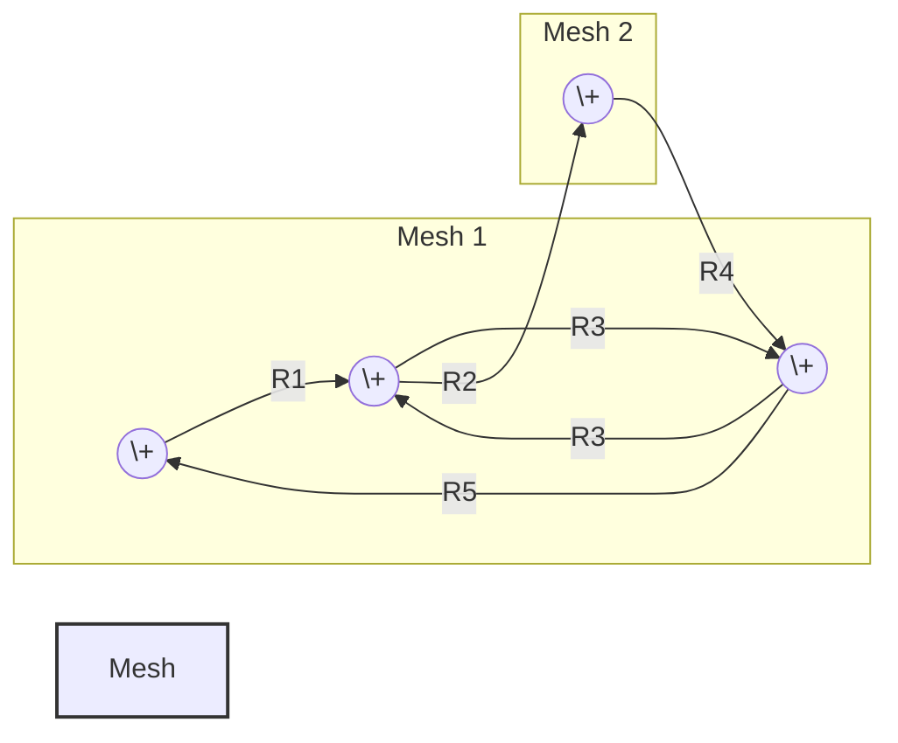

| પગલું | વર્ણન |
|------|-------------|
| 1 | સર્કિટમાં સ્વતંત્ર મેશ ઓળખો |
| 2 | મેશ કરંટ્સ (I₁, I₂, વગેરે) ઘડિયાળના કાંટાની દિશામાં અસાઇન કરો |
| 3 | દરેક મેશ માટે KVL લાગુ કરો |
| 4 | ઇક્વેશન્સ બનાવો: ΣR·I(સ્વયં) - ΣR·I(અડીને) = ΣV |
| 5 | સિમલ્ટેનિયસ ઇક્વેશન્સ ઉકેલો |

- **ફાયદો**: બ્રાન્ચ કરંટ મેથડ કરતાં ઓછા ઇક્વેશન્સ
- **ઉપયોગ**: પ્લેનર નેટવર્ક્સ માટે શ્રેષ્ઠ
- **મર્યાદા**: નોન-પ્લેનર નેટવર્ક્સ માટે ઓછું કાર્યક્ષમ

**મેમરી ટ્રીક:** "MIAMI" - Meshes Identified, Assign currents, Make equations, Intersection currents calculated, Solve કરો

## પ્રશ્ન 1(ક) [7 માર્ક્સ (વિકલ્પ)]

**યોગ્ય રેખાકૃતિનો ઉપયોગ કરીને "નોડ પેર વોલ્ટેજ પદ્ધતિ" સમજાવો.**

**જવાબ**:

**આકૃતિ:**

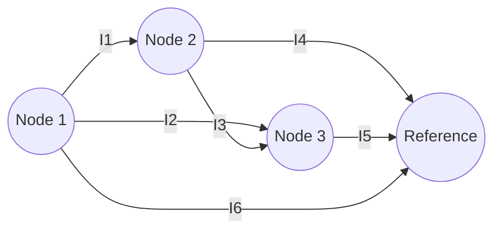

| પગલું | વર્ણન |
|------|-------------|
| 1 | રેફરન્સ નોડ (ગ્રાઉન્ડ) પસંદ કરો |
| 2 | બાકીના નોડ્સને નોડ વોલ્ટેજ (V₁, V₂, વગેરે) અસાઇન કરો |
| 3 | દરેક નોડ પર KCL લાગુ કરો (રેફરન્સ સિવાય) |
| 4 | ઓહ્મના નિયમનો ઉપયોગ કરીને કરંટ્સને નોડ વોલ્ટેજમાં વ્યક્ત કરો |
| 5 | સિમલ્ટેનિયસ ઇક્વેશન્સ ઉકેલો |

- **ફાયદો**: ઘણા મેશવાળા સર્કિટ્સ માટે મેશ મેથડ કરતાં ઓછા ઇક્વેશન્સ
- **ઉપયોગ**: નોન-પ્લેનર સર્કિટ્સ માટે કાર્યક્ષમ
- **મુખ્ય ઇક્વેશન**: ΣG·V(સ્વયં) - ΣG·V(અડીને) = ΣI

**મેમરી ટ્રીક:** "GRAND" - Ground node fixed, Remaining nodes numbered, Apply KCL, Note voltage differences, Derive solutions

## પ્રશ્ન 2(અ) [3 માર્ક્સ]

**KCL ઉદાહરણ સાથે સમજાવો.**

**જવાબ**:

**આકૃતિ:**

```goat
    I1 →   
  +-----+
  |     |
  |     I3 ↓  
I2 ↓    |
  |     |
  +-----+
    I4 ↑
```

**કિરચોફનો કરંટ લૉ (KCL)**: કોઈપણ નોડ પર પ્રવેશતા અને છોડતા તમામ કરંટ્સનો અલજેબ્રાઇક સરવાળો શૂન્ય હોય છે.

| ગાણિતિક સ્વરૂપ | ઉદાહરણ ઉપયોગ |
|-------------------|---------------------|
| ΣI = 0 | નોડ પર: I₁ - I₂ - I₃ + I₄ = 0 |
| ΣIin = ΣIout | પ્રવેશતા કરંટ્સ = બહાર નીકળતા કરંટ્સ |

**મેમરી ટ્રીક:** "ZINC" - Zero Is Net Current at a node

## પ્રશ્ન 2(બ) [4 માર્ક્સ]

**યોગ્ય આકૃતિનો ઉપયોગ કરી Z-પેરામીટર, Y-પેરામીટર h-પેરામીટર અને ABCD-પેરામીટર સમજાવો.**

**જવાબ**:

**આકૃતિ:**

```goat
        +-----+
   V1   |     |   V2
   →    |  2  |   →
+------+|  P  |+-----+
   I1   |  O  |   I2
   →    |  R  |   ←
        |  T  |
        +-----+
```

| પેરામીટર | વ્યાખ્યા | સમીકરણો | ઉપયોગ |
|-----------|------------|-----------|-------|
| **Z** | ઇમ્પિડન્સ પેરામીટર્સ | V₁ = Z₁₁I₁ + Z₁₂I₂, V₂ = Z₂₁I₁ + Z₂₂I₂ | હાઇ ઇમ્પિડન્સ સર્કિટ્સ |
| **Y** | એડમિટન્સ પેરામીટર્સ | I₁ = Y₁₁V₁ + Y₁₂V₂, I₂ = Y₂₁V₁ + Y₂₂V₂ | લો ઇમ્પિડન્સ સર્કિટ્સ |
| **h** | હાઇબ્રિડ પેરામીટર્સ | V₁ = h₁₁I₁ + h₁₂V₂, I₂ = h₂₁I₁ + h₂₂V₂ | ટ્રાન્ઝિસ્ટર સર્કિટ્સ |
| **ABCD** | ટ્રાન્સમિશન પેરામીટર્સ | V₁ = AV₂ - BI₂, I₁ = CV₂ - DI₂ | કેસ્કેડેડ નેટવર્ક્સ |

**મેમરી ટ્રીક:** "ZANY HAB" - Z for high impedance, A for low, hy-brid for transistors, ABCD for Cascades

## પ્રશ્ન 2(ક) [7 માર્ક્સ]

**π-ટાઈપ નેટવર્કને T-ટાઈપ નેટવર્ક અને T-ટાઈપ નેટવર્કને π-ટાઈપ નેટવર્કમાં રૂપાંતરિત કરવા માટેના સમીકરણો મેળવો.**

**જવાબ**:

**આકૃતિ:**

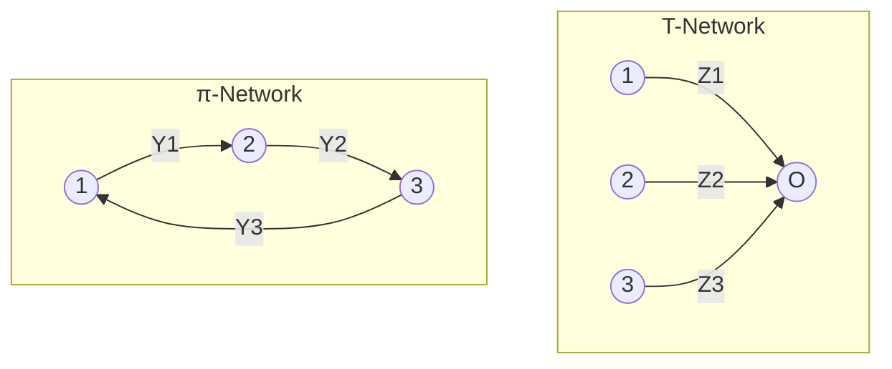

| રૂપાંતરણ | ફોર્મ્યુલા |
|------------|----------|
| **π થી T** | Z₁ = (Z₁₂·Z₃₁)/(Z₁₂+Z₂₃+Z₃₁) <br> Z₂ = (Z₁₂·Z₂₃)/(Z₁₂+Z₂₃+Z₃₁) <br> Z₃ = (Z₂₃·Z₃₁)/(Z₁₂+Z₂₃+Z₃₁) |
| **T થી π** | Z₁₂ = (Z₁·Z₂+Z₂·Z₃+Z₃·Z₁)/Z₃ <br>Z₂₃ = (Z₁·Z₂+Z₂·Z₃+Z₃·Z₁)/Z₁ <br>Z₃₁ = (Z₁·Z₂+Z₂·Z₃+Z₃·Z₁)/Z₂ |

- **ઉપયોગ**: નેટવર્ક સરળીકરણ અને વિશ્લેષણ
- **શરત**: બંને નેટવર્ક્સ ટર્મિનલ્સ પર સમાન હોવા જોઈએ
- **મર્યાદા**: ફક્ત લીનિયર નેટવર્ક્સ માટે લાગુ પડે છે

**મેમરી ટ્રીક:** "TRIP" - T and π networks Relate Impedances through Products and sums

## પ્રશ્ન 2(અ OR) [3 માર્ક્સ]

**KVL ઉદાહરણ સાથે સમજાવો.**

**જવાબ**:

**આકૃતિ:**

```goat
    +--R1--+
    |      |
   V1     R2
    |      |
    +--R3--+
```

**કિરચોફનો વોલ્ટેજ લૉ (KVL)**: કોઈપણ બંધ લૂપમાં તમામ વોલ્ટેજનો અલજેબ્રાઇક સરવાળો શૂન્ય હોય છે.

| ગાણિતિક સ્વરૂપ | ઉદાહરણ ઉપયોગ |
|-------------------|---------------------|
| ΣV = 0 | લૂપમાં: V₁ - IR₁ - IR₂ - IR₃ = 0 |
| ΣVrises = ΣVdrops | વોલ્ટેજ વધારા = વોલ્ટેજ ઘટાડા |

**મેમરી ટ્રીક:** "ZERO" - Zero is Every voltage Round a loop's Output

## પ્રશ્ન 2(બ OR) [4 માર્ક્સ]

**વિવિધ ઈલેક્ટ્રોનિક્સ નેટવર્કનું વર્ગીકરણ કરો અને સમજાવો.**

**જવાબ**:

| નેટવર્ક પ્રકાર | વર્ણન | ઉદાહરણ |
|--------------|-------------|---------|
| **લીનિયર vs નોન-લીનિયર** | સમાનુપાતિકતાના સિદ્ધાંતનું પાલન કરે/ન કરે | રેઝિસ્ટર્સ vs ડાયોડ્સ |
| **પેસિવ vs એક્ટિવ** | ઊર્જા પ્રદાન કરતા નથી/કરે છે | RC સર્કિટ vs એમ્પ્લિફાયર |
| **બાયલેટરલ vs યુનિલેટરલ** | બંને દિશામાં સમાન/અલગ ગુણધર્મો | રેઝિસ્ટર્સ vs ડાયોડ્સ |
| **લમ્પ્ડ vs ડિસ્ટ્રિબ્યુટેડ** | પેરામીટર્સ કેન્દ્રિત/ફેલાયેલા છે | RC સર્કિટ vs ટ્રાન્સમિશન લાઇન |
| **ટાઇમ વેરિઅન્ટ vs ઇન્વેરિઅન્ટ** | પેરામીટર્સ સમય સાથે બદલાય/ન બદલાય | ઇલેક્ટ્રોનિક સ્વિચ vs ફિક્સ્ડ રેઝિસ્ટર |

**આકૃતિ:**

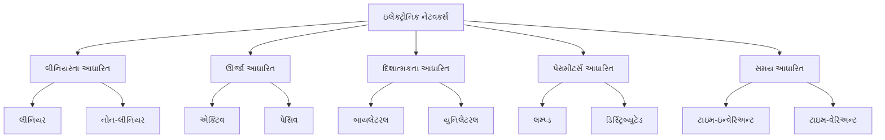

**મેમરી ટ્રીક:** "PLANT" - Proportionality for Linear, Lively for Active, All directions for bilateral, Near for lumped, Time-fixed for invariant

## પ્રશ્ન 2(ક OR) [7 માર્ક્સ]

**T-નેટવર્ક અને π-નેટવર્ક માટે કૅરૅક્ટરીસટીક્સ ઇમપીડંસનું સમીકરણ મેળવો.**

**જવાબ**:

**આકૃતિ:**

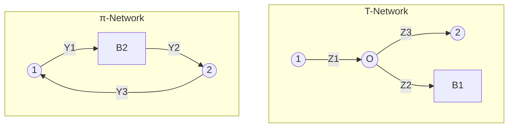

| નેટવર્ક | કૅરૅક્ટરીસટીક્સ ઇમપીડંસ સમીકરણ | મેળવવાના પગલાં |
|---------|----------------------------------|------------------|
| **T-નેટવર્ક** | Z₀T = √[(Z₁+Z₂)(Z₂+Z₃)] | 1. સિમેટ્રિકલ લોડ Z₀ લાગુ કરો <br> 2. ઇનપુટ ઇમ્પીડન્સ શોધો <br> 3. ઇમ્પીડન્સ મેચિંગ માટે, Zin = Z₀ <br> 4. Z₀ માટે ઉકેલો |
| **π-નેટવર્ક** | Z₀π = 1/√[(Y₁+Y₃)(Y₂+Y₃)] | 1. સિમેટ્રિકલ લોડ Z₀ લાગુ કરો <br> 2. ઇનપુટ ઇમ્પીડન્સ શોધો <br> 3. ઇમ્પીડન્સ મેચિંગ માટે, Zin = Z₀ <br> 4. Z₀ માટે ઉકેલો |

- **સંબંધ**: Z₀T × Z₀π = Z₁·Z₃
- **ઉપયોગ**: ઇમ્પીડન્સ મેચિંગ અને ફિલ્ટર્સ
- **મર્યાદા**: ફક્ત સિમેટ્રિકલ નેટવર્ક્સ માટે માન્ય

**મેમરી ટ્રીક:** "TIPSZ" - T-networks and π-networks Impedances are Products and Square roots of Z values

## પ્રશ્ન 3(અ) [3 માર્ક્સ]

**ડ્યુઆલિટી ના સિદ્ધાંતને ઉદાહરણ સાથે સમજાવો.**

**જવાબ**:

**આકૃતિ:**

```goat
Original Circuit          Dual Circuit
   +---R1---+               +---G1---+
   |        |               |        |
  V1       R2        =>    I1       G2
   |        |               |        |
   +---R3---+               +---G3---+
```

**ડ્યુઆલિટીનો સિદ્ધાંત**: દરેક ઇલેક્ટ્રિકલ નેટવર્ક માટે, એક ડ્યુઅલ નેટવર્ક અસ્તિત્વમાં છે જ્યાં:

| ઓરિજિનલ | ડ્યુઅલ | ઉદાહરણ |
|----------|------|---------|
| વોલ્ટેજ (V) | કરંટ (I) | 10V સોર્સ → 10A સોર્સ |
| કરંટ (I) | વોલ્ટેજ (V) | 5A → 5V |
| રેઝિસ્ટન્સ (R) | કન્ડક્ટન્સ (G) | 100Ω → 100S |
| સીરીઝ કનેક્શન | પેરેલલ કનેક્શન | સીરીઝ રેઝિસ્ટર્સ → પેરેલલ કન્ડક્ટર્સ |
| KVL | KCL | ΣV = 0 → ΣI = 0 |

**મેમરી ટ્રીક:** "VIGOR" - Voltage to current, Impedance to admittance, Graph remains, Open to closed, Resistors to conductors

## પ્રશ્ન 3(બ) [4 માર્ક્સ]

**થેવેનિનના થિયરમનો ઉપયોગ કરીને સર્કિટમાં લોડ પ્રવાહની ગણતરી કરવાનાં પગલાં સમજાવો.**

**જવાબ**:

**આકૃતિ:**

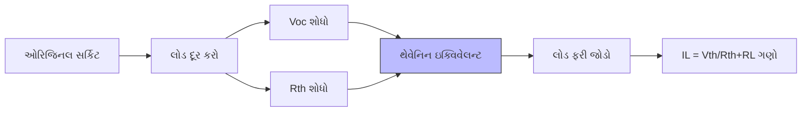

| પગલું | વર્ણન |
|------|-------------|
| 1 | સર્કિટમાંથી લોડ રેઝિસ્ટરને દૂર કરો |
| 2 | લોડ ટર્મિનલ વચ્ચે ઓપન-સર્કિટ વોલ્ટેજ (Vth) શોધો |
| 3 | સર્કિટમાં પાછા જોતા થેવેનિન રેઝિસ્ટન્સ (Rth) ગણો |
| 4 | થેવેનિન ઇક્વિવેલન્ટ સર્કિટ (Rth સાથે સીરીઝમાં Vth) દોરો |
| 5 | થેવેનિન સર્કિટ પર લોડ રેઝિસ્ટર (RL) ફરીથી જોડો |
| 6 | લોડ કરંટ ગણો: IL = Vth/(Rth+RL) |

**મેમરી ટ્રીક:** "REVOLT" - Remove load, Evaluate Voc, Obtain Rth, Look at Thevenin circuit, Use I = V/R formula

## પ્રશ્ન 3(ક) [7 માર્ક્સ]

**સુપરપોઝિશન થિયરમનો ઉપયોગ કરીને લોડ રેઝિસ્ટરમાંથી પસાર થતો વિદ્યુતપ્રવાહ શોધો.**

**જવાબ**:

**આકૃતિ:**

```goat
    4Ω         10Ω
    ┌──────┬───────┐
    │      │       │
 12V┘     6Ω      ┌12A
    │    IL↓       │
    │      │       │
    └──────┴───────┘
```

**કોષ્ટક: પગલા-દર-પગલા ઉકેલ:**

| પગલું | વર્ણન | ગણતરી |
|------|-------------|-------------|
| 1 | ફક્ત 12V સોર્સ ધ્યાનમાં લો (12A ને ઓપન સાથે બદલો) | I₁ = 12/(4+6+10) = 0.6A <br> 6Ω માંથી I₁ = 0.6A |
| 2 | ફક્ત 12A સોર્સ ધ્યાનમાં લો (12V ને શોર્ટ સાથે બદલો) | I₂ = -12×10/(4+10+6) = -6A <br> 6Ω માંથી I₂ = -12×4/(4+10+6) = -2.4A |
| 3 | સુપરપોઝિશન લાગુ કરો | IL = I₁ + I₂ = 0.6 + (-2.4) = -1.8A |

**જવાબ**: IL = -1.8A (6Ω લોડ રેઝિસ્ટરમાં ઉપર તરફ વહેતો કરંટ)

**મેમરી ટ્રીક:** "SONAR" - Sources Only one at a time, Neutralize others, Add Results

## પ્રશ્ન 3(અ OR) [3 માર્ક્સ]

**મહત્તમ પાવર ટ્રાન્સફર થિયરમનું નિવેદન લખો. એસી અને ડીસી નેટવર્ક માટે મહત્તમ પાવર ટ્રાન્સફર માટેની શરતો શું છે?**

**જવાબ**:

**મહત્તમ પાવર ટ્રાન્સફર થિયરમ**: જ્યારે લોડ ઇમ્પીડન્સ સોર્સ આંતરિક ઇમ્પીડન્સના કોમ્પ્લેક્સ કોન્જુગેટ જેટલી હોય ત્યારે સોર્સથી લોડમાં મહત્તમ પાવર ટ્રાન્સફર થાય છે.

| નેટવર્ક પ્રકાર | મહત્તમ પાવર ટ્રાન્સફર માટેની શરત |
|--------------|-------------------------------------|
| **ડીસી નેટવર્ક્સ** | RL = Rth (લોડ રેઝિસ્ટન્સ થેવેનિન રેઝિસ્ટન્સ જેટલી હોય) |
| **એસી નેટવર્ક્સ** | ZL = Zth* (લોડ ઇમ્પીડન્સ થેવેનિન ઇમ્પીડન્સના કોમ્પ્લેક્સ કોન્જુગેટ જેટલી હોય) <br> RL = Rth અને XL = -Xth |

**આકૃતિ:**

```goat
   Rth     
    ┌─/\/\/\─┐
    │        │
 Vth┘       RL
    │        │
    └────────┘
   DC Network

   Rth     Xth
    ┌─/\/\/\─┬─XX─┐
    │        │    │
 Vth┘       RL   XL
    │        │    │
    └────────┴────┘
    AC Network
```

**મેમરી ટ્રીક:** "MATCH" - Maximum power At Terminals when Conjugate impedances are Honored

## પ્રશ્ન 3(બ OR) [4 માર્ક્સ]

**નોટોનના થિયરમનો ઉપયોગ કરીને સર્કિટમાં લોડ પ્રવાહની ગણતરી કરવાનાં પગલાં સમજાવો.**

**જવાબ**:

**આકૃતિ:**

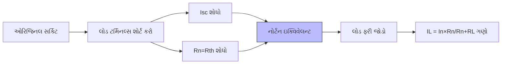

| પગલું | વર્ણન |
|------|-------------|
| 1 | સર્કિટમાંથી લોડ રેઝિસ્ટરને દૂર કરો |
| 2 | લોડ ટર્મિનલ્સ વચ્ચે શોર્ટ-સર્કિટ કરંટ (In) શોધો |
| 3 | સર્કિટમાં પાછા જોતા નોર્ટન રેઝિસ્ટન્સ (Rn) ગણો |
| 4 | નોર્ટન ઇક્વિવેલન્ટ સર્કિટ (Rn સાથે પેરેલલમાં In) દોરો |
| 5 | નોર્ટન સર્કિટ પર લોડ રેઝિસ્ટર (RL) ફરીથી જોડો |
| 6 | લોડ કરંટ ગણો: IL = In×Rn/(Rn+RL) |

**મેમરી ટ્રીક:** "SENIOR" - Short terminals, Evaluate Isc, Notice Rn value, Implement Norton circuit, Obtain result

## પ્રશ્ન 3(ક OR) [7 માર્ક્સ]

**આપેલ નેટવર્ક પર રેસીપ્રોસીટી થિયરમ કેવી રીતે લાગુ થાય છે તે દર્શાવો.**

**જવાબ**:

**આકૃતિ:**

```goat
    2Ω         2Ω
    ┌──────┬───────┐
    │      │       │
 10V┘     4Ω      2Ω
    │      │       │
    └──────┴───────┘
```

**કોષ્ટક: રેસીપ્રોસીટી થિયરમ લાગુ કરવું:**

| પગલું | સર્કિટ 1 | સર્કિટ 2 | ચકાસણી |
|------|-----------|-----------|--------------|
| 1 | ડાબી બાજુ 10V સોર્સ, જમણી બાજુ I₁ શોધો | જમણી બાજુ 10V સોર્સ, ડાબી બાજુ I₂ શોધો | I₁ = I₂ રેસીપ્રોસીટી પુષ્ટિ કરે છે |
| 2 | KVL વાપરીને મેશ ઇક્વેશન્સ બનાવો | બદલાયેલ સોર્સ માટે નવા મેશ ઇક્વેશન્સ બનાવો | બંને સિસ્ટમ ઉકેલો |
| 3 | I₁ = 10×2/(2×4 + 2×2 + 4×2) = 0.625A | I₂ = 10×2/(2×4 + 2×2 + 4×2) = 0.625A | I₁ = I₂ = 0.625A ✓ |

**સિદ્ધાંત**: બાયલેટરલ તત્વો ધરાવતા પેસિવ નેટવર્કમાં, જો બ્રાન્ચ 1માં વોલ્ટેજ સોર્સ E બ્રાન્ચ 2માં કરંટ I ઉત્પન્ન કરે, તો બ્રાન્ચ 2માં મૂકેલો તે જ વોલ્ટેજ સોર્સ E બ્રાન્ચ 1માં તે જ કરંટ I ઉત્પન્ન કરશે.

**મેમરી ટ્રીક:** "RESPECT" - Rewire sources, Exchange positions, See if currents Preserve Equality when Circuit Transformed

## પ્રશ્ન 4(અ) [3 માર્ક્સ]

**કપલ્ડ સર્કિટ સમજાવો.**

**જવાબ**:

**આકૃતિ:**

```goat
    L1         L2
    ┌─OOOO─┐   ┌─OOOO─┐
    │      │   │      │
 V1 ┘      │   │     RL
    │   M  │   │      │
    └──────┘   └──────┘
    Primary    Secondary
```

**કપલ્ડ સર્કિટ**: એક સર્કિટ જ્યાં મ્યુચ્યુઅલ ઇન્ડક્ટન્સ દ્વારા ઇન્ડક્ટર્સ વચ્ચે ઊર્જા ટ્રાન્સફર થાય છે.

| પેરામીટર | વર્ણન |
|-----------|-------------|
| **મ્યુચ્યુઅલ ઇન્ડક્ટન્સ (M)** | કોઇલ્સ વચ્ચે મેગ્નેટિક કપલિંગનું માપ |
| **કપલિંગ કોઇફિશિયન્ટ (k)** | k = M/√(L₁L₂), 0 (કોઈ કપલિંગ નહીં) થી 1 (પરફેક્ટ કપલિંગ) સુધી |
| **ઉપયોગો** | ટ્રાન્સફોર્મર, ફિલ્ટર્સ, ટ્યુન્ડ સર્કિટ્સ |

**મેમરી ટ્રીક:** "MICE" - Mutual Inductance Creates Energy transfer

## પ્રશ્ન 4(બ) [4 માર્ક્સ]

**કપલ્ડ સર્કિટ માટે co-efficient of coupling નું સમીકરણ મેળવો.**

**જવાબ**:

**આકૃતિ:**

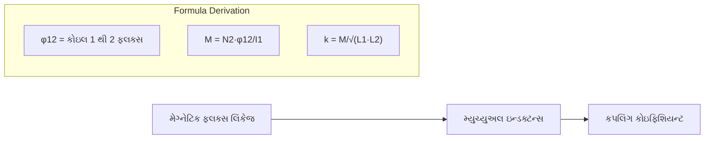

| પગલું | વર્ણન | સમીકરણ |
|------|-------------|----------|
| 1 | મ્યુચ્યુઅલ ઇન્ડક્ટન્સ વ્યાખ્યાયિત કરો | M = N₂·φ₁₂/I₁ |
| 2 | સેલ્ફ-ઇન્ડક્ટન્સ વ્યાખ્યાયિત કરો | L₁ = N₁·φ₁₁/I₁, L₂ = N₂·φ₂₂/I₂ |
| 3 | મહત્તમ શક્ય M | Mmax = √(L₁·L₂) |
| 4 | કપલિંગ કોઇફિશિયન્ટ વ્યાખ્યાયિત કરો | k = M/√(L₁·L₂) |

- **રેન્જ**: 0 ≤ k ≤ 1
- **ભૌતિક અર્થ**: એક કોઇલનો કેટલો ફ્લક્સ બીજી કોઇલ સાથે લિંક થાય છે તેનું પ્રમાણ
- **પરફેક્ટ કપલિંગ**: k = 1, જ્યારે બધો ફ્લક્સ બંને કોઇલ્સને લિંક કરે છે

**મેમરી ટ્રીક:** "MASK" - Mutual inductance And Self inductances create K

## પ્રશ્ન 4(ક) [7 માર્ક્સ]

**સિરીઝ રેઝોનન્સ સર્કિટની રેઝોનન્સ ફ્રિક્વન્સીનું સમીકરણ તારવો. R=20Ω, L=1H, C=1μF સાથે સિરીઝ RLC સર્કિટની રેઝોનન્ટ ફ્રિક્વન્સી, Q ફેક્ટર અને બેન્ડવિડ્થની ગણતરી કરો.**

**જવાબ**:

**આકૃતિ:**

```goat
     R       L
    ┌─/\/\/\─┬─OOOO─┐
    │        │      │
  V ┘        │      │
    │        │      │
    └────────┴──||──┘
                C
```

**મેળવણી:**

| પગલું | વર્ણન | સમીકરણ |
|------|-------------|----------|
| 1 | સિરીઝ RLC ની ઇમ્પીડન્સ | Z = R + j(ωL - 1/ωC) |
| 2 | રેઝોનન્સ પર, Im(Z) = 0 | ωL - 1/ωC = 0 |
| 3 | રેઝોનન્ટ ફ્રિક્વન્સી માટે ઉકેલો | ω₀ = 1/√(LC) અથવા f₀ = 1/(2π√(LC)) |

**ગણતરીઓ:**

| પેરામીટર | ફોર્મ્યુલા | ગણતરી | પરિણામ |
|-----------|---------|-------------|--------|
| રેઝોનન્ટ ફ્રિક્વન્સી | f₀ = 1/(2π√(LC)) | f₀ = 1/(2π√(1×10⁻⁶)) | 159.15 Hz |
| Q ફેક્ટર | Q = ω₀L/R | Q = 2π×159.15×1/20 | 50 |
| બેન્ડવિડ્થ | BW = f₀/Q | BW = 159.15/50 | 3.18 Hz |

**મેમરી ટ્રીક:** "FQBR" - Frequency from reactances, Q from resistance ratio, Bandwidth from Resonance divided by Q

## પ્રશ્ન 4(અ OR) [3 માર્ક્સ]

**Quality factor સમજાઓ.**

**જવાબ**:

**આકૃતિ:**

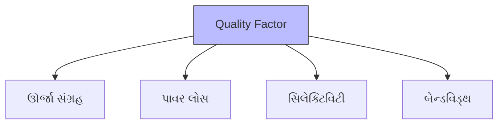

**ક્વોલિટી ફેક્ટર (Q)**: એક ડાયમેન્શનલેસ પેરામીટર જે બતાવે છે કે રેઝોનેટર કેટલો અન્ડર-ડેમ્પ્ડ છે, અથવા વૈકલ્પિક રીતે, રેઝોનેટરની બેન્ડવિડ્થ તેની કેન્દ્ર ફ્રિક્વન્સી સાપેક્ષે કેટલી છે.

| વ્યાખ્યા | ગાણિતિક અભિવ્યક્તિ |
|------------|-------------------------|
| **ઊર્જા પરિપ્રેક્ષ્ય** | Q = 2π × સંગ્રહિત ઊર્જા / સાયકલ દીઠ વેડફાતી ઊર્જા |
| **સર્કિટ પરિપ્રેક્ષ્ય** | Q = X/R (જ્યાં X રિએક્ટન્સ છે, R રેઝિસ્ટન્સ છે) |
| **ફ્રિક્વન્સી પરિપ્રેક્ષ્ય** | Q = f₀/BW (જ્યાં f₀ રેઝોનન્ટ ફ્રિક્વન્સી છે, BW બેન્ડવિડ્થ છે) |

**મેમરી ટ્રીક:** "QSEL" - Quality shows Energy vs. Loss and Selectivity

## પ્રશ્ન 4(બ OR) [4 માર્ક્સ]

**કેપેસીટર માટે Quality factor નું સમીકરણ તારવો.**

**જવાબ**:

**આકૃતિ:**

```goat
    Ideal C    ESR
      ||      /\/\/\
      ||        R
     ┌||┐      ┌─┐
     │  │      │ │
     │  │      │ │
     └──┘      └─┘
    Real capacitor model
```

**મેળવણી:**

| પગલું | વર્ણન | સમીકરણ |
|------|-------------|----------|
| 1 | સંગ્રહિત ઊર્જા વ્યાખ્યાયિત કરો | Estored = CV²/2 |
| 2 | સાયકલ દીઠ ઊર્જા લોસ વ્યાખ્યાયિત કરો | Eloss = πCV²/ωCR = πV²/ωR |
| 3 | Q ફેક્ટર વ્યાખ્યાયિત કરો | Q = 2π × Estored / Eloss |
| 4 | સબસ્ટિટ્યૂટ કરો અને સિમ્પ્લિફાય કરો | Q = 2π × (CV²/2) ÷ (πV²/ωR) = ωCR |

**ફાઈનલ ઈક્વેશન:** Q = ωCR = 1/(ωRC) = 1/tanδ

જ્યાં:

- ω = એન્ગ્યુલર ફ્રિક્વન્સી (2πf)
- R = ઇક્વિવેલન્ટ સિરીઝ રેઝિસ્ટન્સ (ESR)
- C = કેપેસિટન્સ
- tanδ = ડિસિપેશન ફેક્ટર

**મેમરી ટ્રીક:** "CORE" - Capacitors' Quality equals One over Resistance times Capacitance

## પ્રશ્ન 4(ક OR) [7 માર્ક્સ]

**પેરેલલ રેઝોનન્સ સર્કિટની રેઝોનન્સ ફ્રિક્વન્સીનું સમીકરણ તારવો. R=30Ω, L=1H, C=1μF સાથે પેરેલલ RLC સર્કિટની રેઝોનન્ટ ફ્રિક્વન્સી, Q ફેક્ટર અને બેન્ડવિડ્થની ગણતરી કરો.**

**જવાબ**:

**આકૃતિ:**

```goat
             L
    ┌────┬─OOOO─┬────┐
    │    │      │    │
 V ┘   R │      │ C  │
    │    │      │    │
    └────┴──────┴────┘
```

**મેળવણી:**

| પગલું | વર્ણન | સમીકરણ |
|------|-------------|----------|
| 1 | પેરેલલ RLC ની એડમિટન્સ | Y = 1/R + 1/jωL + jωC |
| 2 | રેઝોનન્સ પર, Im(Y) = 0 | 1/jωL + jωC = 0 |
| 3 | રેઝોનન્ટ ફ્રિક્વન્સી માટે ઉકેલો | ω₀ = 1/√(LC) અથવા f₀ = 1/(2π√(LC)) |

**ગણતરીઓ:**

| પેરામીટર | ફોર્મ્યુલા | ગણતરી | પરિણામ |
|-----------|---------|-------------|--------|
| રેઝોનન્ટ ફ્રિક્વન્સી | f₀ = 1/(2π√(LC)) | f₀ = 1/(2π√(1×10⁻⁶)) | 159.15 Hz |
| Q ફેક્ટર | Q = R/ω₀L | Q = 30/(2π×159.15×1) | 0.03 |
| બેન્ડવિડ્થ | BW = f₀/Q | BW = 159.15/0.03 | 5305 Hz |

**મેમરી ટ્રીક:** "FPQB" - Frequency from Parallel elements, Q from Resistance divided by reactance, Bandwidth from division

## પ્રશ્ન 5(અ) [3 માર્ક્સ]

**T પ્રકાર એટેન્યુએટર સમજાવો.**

**જવાબ**:

**આકૃતિ:**

```goat
    Z1
    ┌─/\/\/\─┐
    │        │
 In ┘    Z3  │      Out
    │   /\/\/│       │
    └─/\/\/\─┘       │
        Z2
```

**T-પ્રકાર એટેન્યુએટર**: T કોન્ફિગરેશનમાં સિગ્નલની એમ્પ્લિટ્યુડ ઘટાડવા માટે વપરાતું પેસિવ નેટવર્ક.

| કમ્પોનન્ટ | વર્ણન | ફોર્મ્યુલા |
|-----------|-------------|---------|
| **Z1, Z2** | સિરીઝ આર્મ્સ | Z1 = Z2 = Z₀(N-1)/(N+1) |
| **Z3** | શન્ટ આર્મ | Z3 = 2Z₀/(N²-1) |
| **N** | એટેન્યુએશન રેશિયો | N = 10^(dB/20) |

- **લક્ષણ**: મેચ્ડ સોર્સ અને લોડ માટે સિમેટ્રિકલ
- **ઉપયોગો**: સિગ્નલ લેવલ કંટ્રોલ, ઇમ્પિડન્સ મેચિંગ
- **ફાયદો**: યોગ્ય ડિઝાઇન સાથે ઇમ્પિડન્સ મેચિંગ જાળવે છે

**મેમરી ટ્રીક:** "TSAR" - T-shape with Series Arms and Resistance in middle

## પ્રશ્ન 5(બ) [4 માર્ક્સ]

**વિવિધ પેસિવ ફિલ્ટર સર્કિટસનું વર્ગીકરણ કરો.**

**જવાબ**:

**આકૃતિ:**

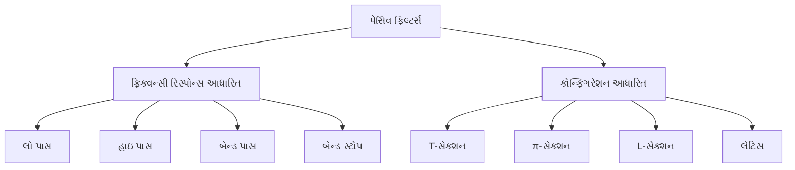

| ફિલ્ટર પ્રકાર | કાર્ય | ટિપિકલ સર્કિટ | ઉપયોગો |
|-------------|----------|----------------|--------------|
| **લો પાસ** | નીચી ફ્રિક્વન્સી પસાર કરે | RC, RL સર્કિટ્સ | ઓડિયો ફિલ્ટર્સ, પાવર સપ્લાય |
| **હાઇ પાસ** | ઊંચી ફ્રિક્વન્સી પસાર કરે | CR, LR સર્કિટ્સ | નોઇઝ ફિલ્ટરિંગ, સિગ્નલ કન્ડિશનિંગ |
| **બેન્ડ પાસ** | ફ્રિક્વન્સીનો બેન્ડ પસાર કરે | RLC સર્કિટ્સ | રેડિયો ટ્યુનિંગ, સિગ્નલ સિલેક્શન |
| **બેન્ડ સ્ટોપ** | ફ્રિક્વન્સીનો બેન્ડ બ્લોક કરે | પેરેલલ RLC | ઇન્ટરફેરન્સ રિજેક્શન |

**મેમરી ટ્રીક:** "LHBB" - Low High Band Band filters for Pass and Block

## પ્રશ્ન 5(ક) [7 માર્ક્સ]

**કટ ઓફ ફ્રિક્વન્સી=1000Hz અને 500Ω લોડ ધરાવતા T-section સાથે કોન્સ્ટન્ટ-k ટાઈપ લો પાસ અને હાઇ પાસ ફિલ્ટર ડિઝાઈન કરો.**

**જવાબ**:

**આકૃતિ:**

```goat
Low Pass T-Filter          High Pass T-Filter
     L/2       L/2              C/2       C/2
   --OOOO------OOOO--        ---||--------||---
   |                |        |                |
   |                |        |                |
   |       C        |        |       L        |
   |       ||       |        |      OOOO      |
   |                |        |                |
 ----------------------    ----------------------
```

**ડિઝાઇન ગણતરીઓ:**

કોન્સ્ટન્ટ-k T-ટાઇપ લો પાસ ફિલ્ટર માટે:

| પેરામીટર | ફોર્મ્યુલા | ગણતરી | મૂલ્ય |
|-----------|---------|-------------|-------|
| કટ-ઓફ ફ્રિક્વન્સી | fc = 1000 Hz | આપેલ | 1000 Hz |
| લોડ ઇમ્પિડન્સ | R₀ = 500 Ω | આપેલ | 500 Ω |
| સિરીઝ ઇન્ડક્ટર | L = R₀/πfc | L = 500/(π×1000) | 159.15 mH |
| હાલ્ફ સેક્શન્સ | L/2 | 159.15/2 | 79.58 mH |
| શન્ટ કેપેસિટર | C = 1/(πfcR₀) | C = 1/(π×1000×500) | 0.636 μF |

કોન્સ્ટન્ટ-k T-ટાઇપ હાઇ પાસ ફિલ્ટર માટે:

| પેરામીટર | ફોર્મ્યુલા | ગણતરી | મૂલ્ય |
|-----------|---------|-------------|-------|
| સિરીઝ કેપેસિટર | C = 1/(4πfcR₀) | C = 1/(4π×1000×500) | 0.159 μF |
| હાલ્ફ સેક્શન્સ | C/2 | 0.159/2 | 0.0795 μF |
| શન્ટ ઇન્ડક્ટર | L = R₀/(4πfc) | L = 500/(4π×1000) | 39.79 mH |

**મેમરી ટ્રીક:** "FRED" - Frequency Ratio determines Element Dimensions

## પ્રશ્ન 5(અ OR) [3 માર્ક્સ]

**π પ્રકાર એટેન્યુએટર સમજાઓ.**

**જવાબ**:

**આકૃતિ:**

```goat
          Z2
          │
    ┌────┐│┌────┐
    │    ││     │
 In ┘  Z1│││Z3  │      Out
    │    ││     │
    └────┘│└────┘
          │
```

**π-પ્રકાર એટેન્યુએટર**: π કોન્ફિગરેશનમાં સિગ્નલની એમ્પ્લિટ્યુડ ઘટાડવા માટે વપરાતું પેસિવ નેટવર્ક.

| કમ્પોનન્ટ | વર્ણન | ફોર્મ્યુલા |
|-----------|-------------|---------|
| **Z2** | સિરીઝ આર્મ | Z2 = 2Z₀/(N²-1) |
| **Z1, Z3** | શન્ટ આર્મ્સ | Z1 = Z3 = Z₀(N+1)/(N-1) |
| **N** | એટેન્યુએશન રેશિયો | N = 10^(dB/20) |

- **લક્ષણ**: મેચ્ડ સોર્સ અને લોડ માટે સિમેટ્રિકલ
- **ઉપયોગો**: સિગ્નલ લેવલ કંટ્રોલ, ઇમ્પિડન્સ મેચિંગ
- **ફાયદો**: ઇનપુટ અને આઉટપુટ વચ્ચે સારું આઇસોલેશન

**મેમરી ટ્રીક:** "PASS" - Pi-Attenuator has Series in middle and Shunt arms outside

## પ્રશ્ન 5(બ OR) [4 માર્ક્સ]

**વિવિધ પ્રકારના એટેન્યુએટરનું વર્ગીકરણ કરો.**

**જવાબ**:

**આકૃતિ:**

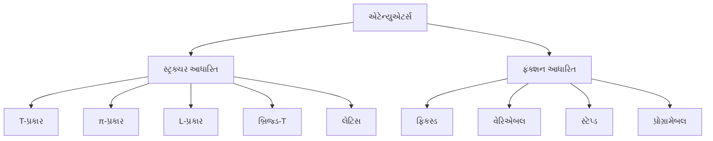

| એટેન્યુએટર પ્રકાર | લક્ષણો | ઉપયોગો | ફાયદા |
|-----------------|-----------------|--------------|------------|
| **T-પ્રકાર** | સિરીઝ-શન્ટ-સિરીઝ | ઓડિયો સિસ્ટમ્સ | સરળ ડિઝાઇન |
| **π-પ્રકાર** | શન્ટ-સિરીઝ-શન્ટ | RF સર્કિટ્સ | વધુ સારું આઇસોલેશન |
| **L-પ્રકાર** | સિરીઝ-શન્ટ | સરળ મેચિંગ | ઇમ્પિડન્સ ટ્રાન્સફોર્મેશન |
| **બ્રિજ્ડ-T** | બેલેન્સ્ડ સ્ટ્રક્ચર | ટેસ્ટ ઇક્વિપમેન્ટ | મિનિમલ ડિસ્ટોર્શન |
| **બેલેન્સ્ડ** | સિમેટ્રિક ડ્યુઅલ પાથ | ડિફરેન્શિયલ સિગ્નલ્સ | કોમન મોડ રિજેક્શન |

**મેમરી ટ્રીક:** "TPLBV" - T, Pi, L, Bridged-T, and Variable attenuators

## પ્રશ્ન 5(ક OR) [7 માર્ક્સ]

**40dBનું એટેન્યુએશન આપવા અને 500Ω ના લોડમાં કામ કરવા માટે સપ્રમાણ T પ્રકારના એટેન્યુએટર અને π પ્રકારનું એટેન્યુએટર ડિઝાઇન કરો.**

**જવાબ**:

**આકૃતિ:**

```goat
T-type Attenuator           π-type Attenuator
     R1       R1                     R2
   --/\/\----/\/\--              --/\/\--
   |               |            |        |
   |               |            |        |
   |       R2      |            R1      R1
   |      /\/\     |           /\/\    /\/\
   |               |            |        |
   -----------------            ----------
```

**ડિઝાઇન ગણતરીઓ:**

| પગલું | ફોર્મ્યુલા | ગણતરી | મૂલ્ય |
|------|---------|-------------|-------|
| આપેલ | એટેન્યુએશન = 40 dB | - | 40 dB |
| પગલું 1 | N = 10^(dB/20) | 10^(40/20) | 100 |
| પગલું 2 | K = (N-1)/(N+1) | (100-1)/(100+1) | 0.98 |

T-પ્રકાર એટેન્યુએટર માટે:

| કમ્પોનન્ટ | ફોર્મ્યુલા | ગણતરી | મૂલ્ય |
|-----------|---------|-------------|-------|
| R₁ (સિરીઝ) | Z₀·K | 500 × 0.98 | 490 Ω |
| R₂ (શન્ટ) | Z₀/(K·(N-K)) | 500/(0.98×(100-0.98)) | 5.15 Ω |

π-પ્રકાર એટેન્યુએટર માટે:

| કમ્પોનન્ટ | ફોર્મ્યુલા | ગણતરી | મૂલ્ય |
|-----------|---------|-------------|-------|
| R₁ (શન્ટ) | Z₀/K | 500/0.98 | 510.2 Ω |
| R₂ (સિરીઝ) | Z₀·K·(N-K) | 500 × 0.98 × (100-0.98) | 48,541 Ω |

**મેમરી ટ્રીક:** "DANK" - dB Attenuation is Number K, which determines resistor values
