## Question 1(a) [3 marks]

**Define node, branch and loop with suitable diagram.**

**Answer**:

**Diagram:**

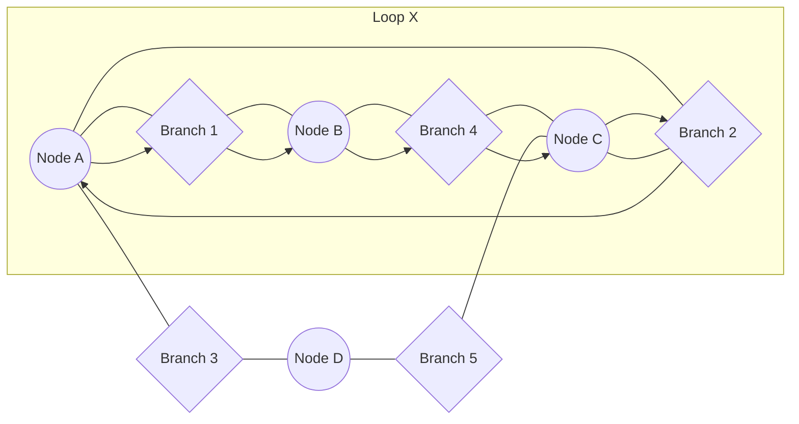

- **Node**: A point where two or more circuit elements join together
- **Branch**: A single element connecting two nodes
- **Loop**: Any closed path in a circuit where no node is encountered more than once

**Mnemonic:** "NBA circuit" - Nodes are junctions, Branches are roads, Loops are Alternate paths

## Question 1(b) [4 marks]

**Explain "Tree" and "Graph" of a network.**

**Answer**:

**Diagram:**

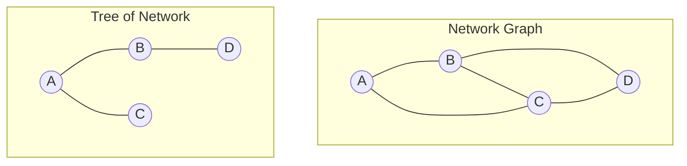

| Feature | Graph | Tree |
|---------|-------|------|
| **Definition** | Complete topological representation of network | Connected subgraph containing all nodes but no loops |
| **Elements** | Contains all branches and nodes | Contains N-1 branches where N is number of nodes |
| **Loops** | Contains loops | No loops |
| **Application** | Used for complete circuit analysis | Used for simplifying network calculations |

**Mnemonic:** "GRAND Tree" - Graph has Routes And Nodes with Detours, Tree has only single Routes

## Question 1(c) [7 marks]

**Explain "Mesh current Method" using suitable diagram.**

**Answer**:

**Diagram:**

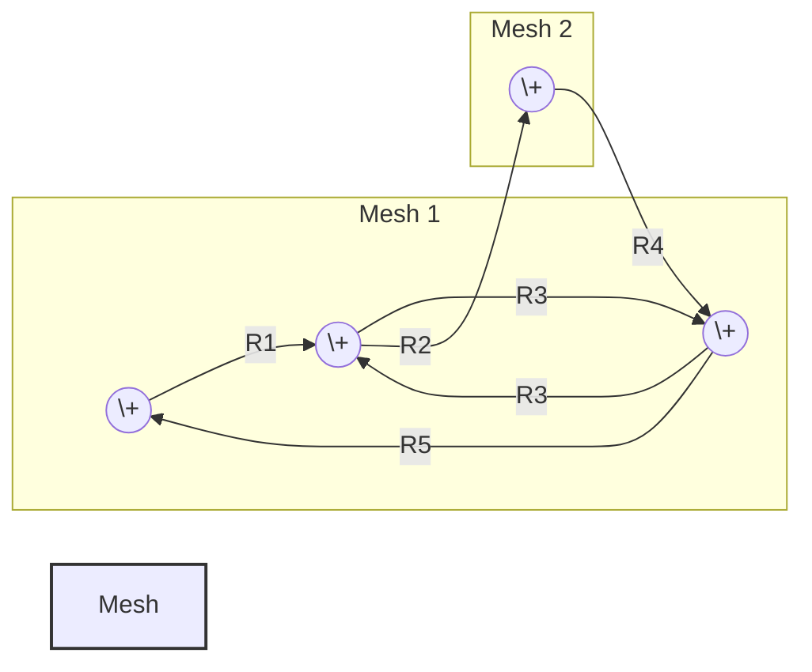

| Step | Description |
|------|-------------|
| 1 | Identify independent meshes in the circuit |
| 2 | Assign mesh currents (I₁, I₂, etc.) in clockwise direction |
| 3 | Apply KVL to each mesh |
| 4 | Form equations using: ΣR·I(own) - ΣR·I(adjacent) = ΣV |
| 5 | Solve the simultaneous equations |

- **Advantage**: Fewer equations than branch current method
- **Application**: Best for planar networks
- **Limitation**: Less efficient for non-planar networks

**Mnemonic:** "MIAMI" - Meshes Identified, Assign currents, Make equations, Intersection currents calculated, Solve

## Question 1(c OR) [7 marks]

**Explain "Node pair voltage Method" using suitable diagram.**

**Answer**:

**Diagram:**

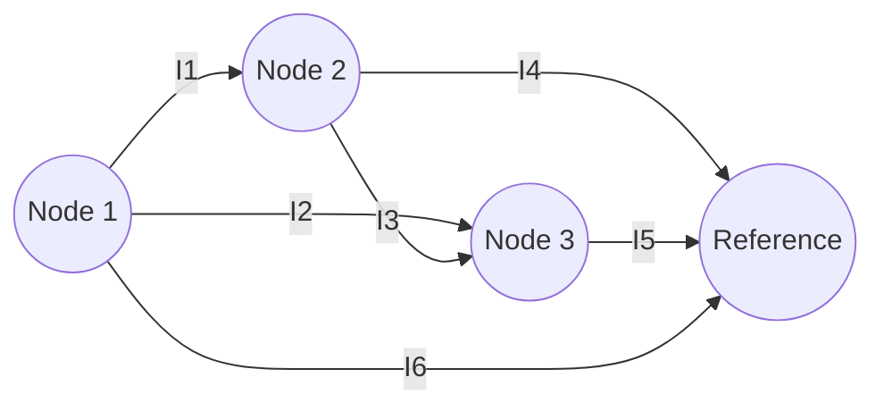

| Step | Description |
|------|-------------|
| 1 | Select a reference node (ground) |
| 2 | Assign node voltages (V₁, V₂, etc.) to remaining nodes |
| 3 | Apply KCL at each node (except reference) |
| 4 | Express currents in terms of node voltages using Ohm's Law |
| 5 | Solve the simultaneous equations |

- **Advantage**: Fewer equations than mesh method for circuits with many meshes
- **Application**: Efficient for non-planar circuits
- **Key equation**: ΣG·V(own) - ΣG·V(adjacent) = ΣI

**Mnemonic:** "GRAND" - Ground node fixed, Remaining nodes numbered, Apply KCL, Note voltage differences, Derive solutions

## Question 2(a) [3 marks]

**Explain KCL with example.**

**Answer**:

**Diagram:**

```goat
    I1 →   
  +-----+
  |     |
  |     I3 ↓  
I2 ↓    |
  |     |
  +-----+
    I4 ↑
```

**Kirchhoff's Current Law (KCL)**: The algebraic sum of all currents entering and leaving a node is zero.

| Mathematical Form | Example Application |
|-------------------|---------------------|
| ΣI = 0 | At node: I₁ - I₂ - I₃ + I₄ = 0 |
| ΣIin = ΣIout | Currents entering = Currents leaving |

**Mnemonic:** "ZINC" - Zero Is Net Current at a node

## Question 2(b) [4 marks]

**Explain Z-parameter, Y-parameter, h-parameter and ABCD-parameter using suitable network.**

**Answer**:

**Diagram:**

```goat
        +-----+
   V1   |     |   V2
   →    |  2  |   →
+------+|  P  |+-----+
   I1   |  O  |   I2
   →    |  R  |   ←
        |  T  |
        +-----+
```

| Parameter | Definition | Equations | Usage |
|-----------|------------|-----------|-------|
| **Z** | Impedance parameters | V₁ = Z₁₁I₁ + Z₁₂I₂, V₂ = Z₂₁I₁ + Z₂₂I₂ | High impedance circuits |
| **Y** | Admittance parameters | I₁ = Y₁₁V₁ + Y₁₂V₂, I₂ = Y₂₁V₁ + Y₂₂V₂ | Low impedance circuits |
| **h** | Hybrid parameters | V₁ = h₁₁I₁ + h₁₂V₂, I₂ = h₂₁I₁ + h₂₂V₂ | Transistor circuits |
| **ABCD** | Transmission parameters | V₁ = AV₂ - BI₂, I₁ = CV₂ - DI₂ | Cascaded networks |

**Mnemonic:** "ZANY HAB" - Z for high impedance, A for low, hy-brid for transistors, ABCD for Cascades

## Question 2(c) [7 marks]

**Derive the equations to convert π-type network into T-type network and T-type network into π-type network.**

**Answer**:

**Diagram:**

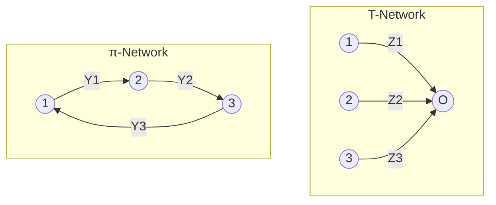

| Conversion | Formulas |
|------------|----------|
| **π to T** | Z₁ = (Z₁₂·Z₃₁)/(Z₁₂+Z₂₃+Z₃₁) <br> Z₂ = (Z₁₂·Z₂₃)/(Z₁₂+Z₂₃+Z₃₁) <br> Z₃ = (Z₂₃·Z₃₁)/(Z₁₂+Z₂₃+Z₃₁) |
| **T to π** | Z₁₂ = (Z₁·Z₂+Z₂·Z₃+Z₃·Z₁)/Z₃ <br> Z₂₃ = (Z₁·Z₂+Z₂·Z₃+Z₃·Z₁)/Z₁ <br> Z₃₁ = (Z₁·Z₂+Z₂·Z₃+Z₃·Z₁)/Z₂ |

- **Application**: Network simplification and analysis
- **Condition**: Both networks must be equivalent at terminals
- **Limitation**: Only applies for linear networks

**Mnemonic:** "TRIP" - T and π networks Relate Impedances through Products and sums

## Question 2(a OR) [3 marks]

**Explain KVL with example.**

**Answer**:

**Diagram:**

```goat
    +--R1--+
    |      |
   V1     R2
    |      |
    +--R3--+
```

**Kirchhoff's Voltage Law (KVL)**: The algebraic sum of all voltages around any closed loop is zero.

| Mathematical Form | Example Application |
|-------------------|---------------------|
| ΣV = 0 | In loop: V₁ - IR₁ - IR₂ - IR₃ = 0 |
| ΣVrises = ΣVdrops | Voltage rises = Voltage drops |

**Mnemonic:** "ZERO" - Zero is Every voltage Round a loop's Output

## Question 2(b OR) [4 marks]

**Classify and explain various Electronics network.**

**Answer**:

| Network Type | Description | Example |
|--------------|-------------|---------|
| **Linear vs Non-linear** | Follows/doesn't follow proportionality principle | Resistors vs Diodes |
| **Passive vs Active** | Don't/do supply energy | RC circuit vs Amplifier |
| **Bilateral vs Unilateral** | Same/different properties in either direction | Resistors vs Diodes |
| **Lumped vs Distributed** | Parameters concentrated/spread | RC circuit vs Transmission line |
| **Time variant vs Invariant** | Parameters change/don't change with time | Electronic switch vs Fixed resistor |

**Diagram:**

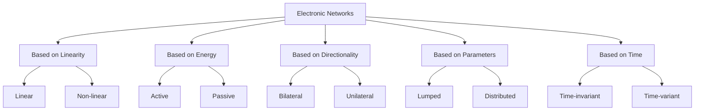

**Mnemonic:** "PLANT" - Proportionality for Linear, Lively for Active, All directions for bilateral, Near for lumped, Time-fixed for invariant

## Question 2(c OR) [7 marks]

**Derive the equation of characteristic impedance for T-network and π-network.**

**Answer**:

**Diagram:**

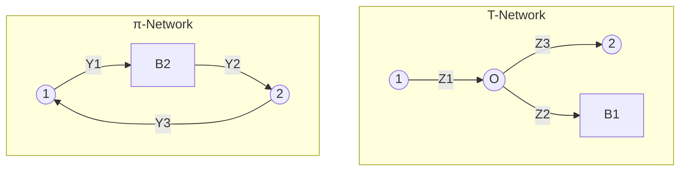

| Network | Characteristic Impedance Equation | Derivation Steps |
|---------|----------------------------------|------------------|
| **T-Network** | Z₀T = √[(Z₁+Z₂)(Z₂+Z₃)] | 1. Apply symmetrical load Z₀ <br> 2. Find input impedance <br> 3. For impedance matching, Zin = Z₀ <br> 4. Solve for Z₀ |
| **π-Network** | Z₀π = 1/√[(Y₁+Y₃)(Y₂+Y₃)] | 1. Apply symmetrical load Z₀ <br> 2. Find input impedance <br> 3. For impedance matching, Zin = Z₀ <br> 4. Solve for Z₀ |

- **Relation**: Z₀T × Z₀π = Z₁·Z₃
- **Application**: Impedance matching and filters
- **Limitation**: Valid only for symmetrical networks

**Mnemonic:** "TIPSZ" - T-networks and π-networks Impedances are Products and Square roots of Z values

## Question 3(a) [3 marks]

**Explain the principle of duality with example.**

**Answer**:

**Diagram:**

```goat
Original Circuit          Dual Circuit
   +---R1---+               +---G1---+
   |        |               |        |
  V1       R2        =>    I1       G2
   |        |               |        |
   +---R3---+               +---G3---+
```

**Principle of Duality**: For every electrical network, there exists a dual network where:

| Original | Dual | Example |
|----------|------|---------|
| Voltage (V) | Current (I) | 10V source → 10A source |
| Current (I) | Voltage (V) | 5A → 5V |
| Resistance (R) | Conductance (G) | 100Ω → 100S |
| Series connection | Parallel connection | Series resistors → Parallel conductors |
| KVL | KCL | ΣV = 0 → ΣI = 0 |

**Mnemonic:** "VIGOR" - Voltage to current, Impedance to admittance, Graph remains, Open to closed, Resistors to conductors

## Question 3(b) [4 marks]

**Explain the steps to calculate the load current in the circuit using Thevenin's Theorem.**

**Answer**:

**Diagram:**

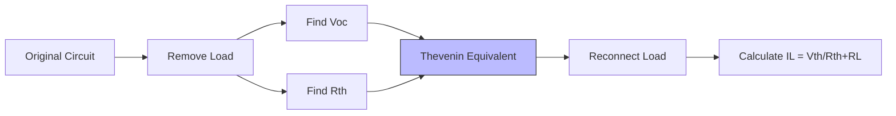

| Step | Description |
|------|-------------|
| 1 | Remove the load resistor from the circuit |
| 2 | Find open-circuit voltage (Vth) across load terminals |
| 3 | Calculate Thevenin resistance (Rth) looking back into circuit |
| 4 | Draw Thevenin equivalent circuit (Vth in series with Rth) |
| 5 | Reconnect load resistor (RL) to Thevenin circuit |
| 6 | Calculate load current: IL = Vth/(Rth+RL) |

**Mnemonic:** "REVOLT" - Remove load, Evaluate Voc, Obtain Rth, Look at Thevenin circuit, Use I = V/R formula

## Question 3(c) [7 marks]

**Find the current through load resistor using superposition theorem.**

**Answer**:

**Diagram:**

```goat
    4Ω         10Ω
    ┌──────┬───────┐
    │      │       │
 12V┘     6Ω      ┌12A
    │    IL↓       │
    │      │       │
    └──────┴───────┘
```

**Table: Step-by-Step Solution:**

| Step | Description | Calculation |
|------|-------------|-------------|
| 1 | Consider 12V source only (replace 12A with open) | I₁ = 12/(4+6+10) = 0.6A <br> I₁ through 6Ω = 0.6A |
| 2 | Consider 12A source only (replace 12V with short) | I₂ = -12×10/(4+10+6) = -6A <br> I₂ through 6Ω = -12×4/(4+10+6) = -2.4A |
| 3 | Apply superposition | IL = I₁ + I₂ = 0.6 + (-2.4) = -1.8A |

**Answer**: IL = -1.8A (current flowing upward through 6Ω load resistor)

**Mnemonic:** "SONAR" - Sources Only one at a time, Neutralize others, Add Results

## Question 3(a OR) [3 marks]

**Write Maximum Power Transfer Theorem statement. What are the conditions for maximum power transfer for AC and DC networks?**

**Answer**:

**Maximum Power Transfer Theorem**: Maximum power is transferred from source to load when the load impedance is equal to the complex conjugate of the source internal impedance.

| Network Type | Condition for Maximum Power Transfer |
|--------------|-------------------------------------|
| **DC Networks** | RL = Rth (Load resistance equals Thevenin resistance) |
| **AC Networks** | ZL = Zth* (Load impedance equals complex conjugate of Thevenin impedance) <br> RL = Rth and XL = -Xth |

**Diagram:**

```goat
   Rth     
    ┌─/\/\/\─┐
    │        │
 Vth┘       RL
    │        │
    └────────┘
   DC Network

   Rth     Xth
    ┌─/\/\/\─┬─XX─┐
    │        │    │
 Vth┘       RL   XL
    │        │    │
    └────────┴────┘
    AC Network
```

**Mnemonic:** "MATCH" - Maximum power At Terminals when Conjugate impedances are Honored

## Question 3(b OR) [4 marks]

**Explain the steps to calculate the load current in the circuit using Norton's Theorem.**

**Answer**:

**Diagram:**

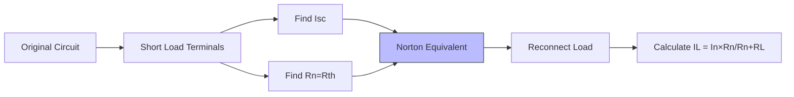

| Step | Description |
|------|-------------|
| 1 | Remove the load resistor from the circuit |
| 2 | Find short-circuit current (In) across load terminals |
| 3 | Calculate Norton resistance (Rn) looking back into circuit |
| 4 | Draw Norton equivalent circuit (In in parallel with Rn) |
| 5 | Reconnect load resistor (RL) to Norton circuit |
| 6 | Calculate load current: IL = In×Rn/(Rn+RL) |

**Mnemonic:** "SENIOR" - Short terminals, Evaluate Isc, Notice Rn value, Implement Norton circuit, Obtain result

## Question 3(c OR) [7 marks]

**Demonstrate how the reciprocity theorem is applied to a given network.**

**Answer**:

**Diagram:**

```goat
    2Ω         2Ω
    ┌──────┬───────┐
    │      │       │
 10V┘     4Ω      2Ω
    │      │       │
    └──────┴───────┘
```

**Table: Applying Reciprocity Theorem:**

| Step | Circuit 1 | Circuit 2 | Verification |
|------|-----------|-----------|--------------|
| 1 | 10V source at left, Find I₁ at right | 10V source at right, Find I₂ at left | I₁ = I₂ confirms reciprocity |
| 2 | Create mesh equations using KVL | Create new mesh equations for swapped source | Solve both systems |
| 3 | I₁ = 10×2/(2×4 + 2×2 + 4×2) = 0.625A | I₂ = 10×2/(2×4 + 2×2 + 4×2) = 0.625A | I₁ = I₂ = 0.625A ✓ |

**Principle**: In a passive network containing only bilateral elements, if voltage source E in branch 1 produces current I in branch 2, then the same voltage source E placed in branch 2 will produce the same current I in branch 1.

**Mnemonic:** "RESPECT" - Rewire sources, Exchange positions, See if currents Preserve Equality when Circuit Transformed

## Question 4(a) [3 marks]

**Explain coupled circuit.**

**Answer**:

**Diagram:**

```goat
    L1         L2
    ┌─OOOO─┐   ┌─OOOO─┐
    │      │   │      │
 V1 ┘      │   │     RL
    │   M  │   │      │
    └──────┘   └──────┘
    Primary    Secondary
```

**Coupled Circuit**: A circuit where energy is transferred between inductors through mutual inductance.

| Parameter | Description |
|-----------|-------------|
| **Mutual Inductance (M)** | Measure of magnetic coupling between coils |
| **Coupling Coefficient (k)** | k = M/√(L₁L₂), ranges from 0 (no coupling) to 1 (perfect coupling) |
| **Applications** | Transformers, filters, tuned circuits |

**Mnemonic:** "MICE" - Mutual Inductance Creates Energy transfer

## Question 4(b) [4 marks]

**Derive the equation of co-efficient of coupling for coupled circuit.**

**Answer**:

**Diagram:**

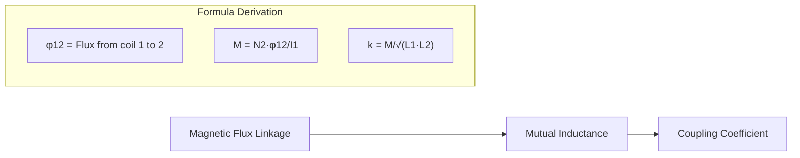

| Step | Description | Equation |
|------|-------------|----------|
| 1 | Define mutual inductance | M = N₂·φ₁₂/I₁ |
| 2 | Define self-inductances | L₁ = N₁·φ₁₁/I₁, L₂ = N₂·φ₂₂/I₂ |
| 3 | Maximum possible M | Mmax = √(L₁·L₂) |
| 4 | Define coupling coefficient | k = M/√(L₁·L₂) |

- **Range**: 0 ≤ k ≤ 1
- **Physical meaning**: Fraction of flux from one coil linking with the other coil
- **Perfect coupling**: k = 1, when all flux links both coils

**Mnemonic:** "MASK" - Mutual inductance And Self inductances create K

## Question 4(c) [7 marks]

**Derive equation of resonance frequency for series resonance. Calculate resonant frequency, Q factor and bandwidth of series RLC circuit with R=20Ω, L=1H, C=1μF.**

**Answer**:

**Diagram:**

```goat
     R       L
    ┌─/\/\/\─┬─OOOO─┐
    │        │      │
  V ┘        │      │
    │        │      │
    └────────┴──||──┘
                C
```

**Derivation:**

| Step | Description | Equation |
|------|-------------|----------|
| 1 | Impedance of series RLC | Z = R + j(ωL - 1/ωC) |
| 2 | At resonance, Im(Z) = 0 | ωL - 1/ωC = 0 |
| 3 | Solve for resonant frequency | ω₀ = 1/√(LC) or f₀ = 1/(2π√(LC)) |

**Calculations:**

| Parameter | Formula | Calculation | Result |
|-----------|---------|-------------|--------|
| Resonant frequency | f₀ = 1/(2π√(LC)) | f₀ = 1/(2π√(1×10⁻⁶)) | 159.15 Hz |
| Q factor | Q = ω₀L/R | Q = 2π×159.15×1/20 | 50 |
| Bandwidth | BW = f₀/Q | BW = 159.15/50 | 3.18 Hz |

**Mnemonic:** "FQBR" - Frequency from reactances, Q from resistance ratio, Bandwidth from Resonance divided by Q

## Question 4(a OR) [3 marks]

**Explain Quality factor.**

**Answer**:

**Diagram:**

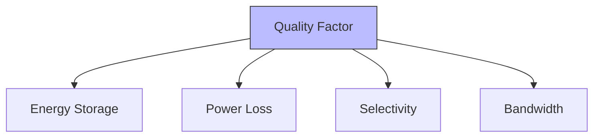

**Quality Factor (Q)**: A dimensionless parameter that indicates how under-damped a resonator is, or alternatively, characterizes a resonator's bandwidth relative to its center frequency.

| Definition | Mathematical Expression |
|------------|-------------------------|
| Energy perspective | Q = 2π × Energy stored / Energy dissipated per cycle |
| Circuit perspective | Q = X/R (where X is reactance, R is resistance) |
| Frequency perspective | Q = f₀/BW (where f₀ is resonant frequency, BW is bandwidth) |

**Mnemonic:** "QSEL" - Quality shows Energy vs. Loss and Selectivity

## Question 4(b OR) [4 marks]

**Derive the equation of quality factor for a capacitor.**

**Answer**:

**Diagram:**

```goat
    Ideal C    ESR
      ||      /\/\/\
      ||        R
     ┌||┐      ┌─┐
     │  │      │ │
     │  │      │ │
     └──┘      └─┘
    Real capacitor model
```

**Derivation:**

| Step | Description | Equation |
|------|-------------|----------|
| 1 | Define energy stored | Estored = CV²/2 |
| 2 | Define energy loss per cycle | Eloss = πCV²/ωCR = πV²/ωR |
| 3 | Define Q factor | Q = 2π × Estored / Eloss |
| 4 | Substitute and simplify | Q = 2π × (CV²/2) ÷ (πV²/ωR) = ωCR |

**Final equation:** Q = ωCR = 1/(ωRC) = 1/tanδ

Where:

- ω = Angular frequency (2πf)
- R = Equivalent series resistance (ESR)
- C = Capacitance
- tanδ = Dissipation factor

**Mnemonic:** "CORE" - Capacitors' Quality equals One over Resistance times Capacitance

## Question 4(c OR) [7 marks]

**Derive equation of resonance frequency for parallel resonance. Calculate resonant frequency, Q factor and bandwidth of parallel RLC circuit with R=30Ω, L=1H, C=1μF.**

**Answer**:

**Diagram:**

```goat
             L
    ┌────┬─OOOO─┬────┐
    │    │      │    │
  V ┘  R │      │ C  │
    │    │      │    │
    └────┴──────┴────┘
```

**Derivation:**

| Step | Description | Equation |
|------|-------------|----------|
| 1 | Admittance of parallel RLC | Y = 1/R + 1/jωL + jωC |
| 2 | At resonance, Im(Y) = 0 | 1/jωL + jωC = 0 |
| 3 | Solve for resonant frequency | ω₀ = 1/√(LC) or f₀ = 1/(2π√(LC)) |

**Calculations:**

| Parameter | Formula | Calculation | Result |
|-----------|---------|-------------|--------|
| Resonant frequency | f₀ = 1/(2π√(LC)) | f₀ = 1/(2π√(1×10⁻⁶)) | 159.15 Hz |
| Q factor | Q = R/ω₀L | Q = 30/(2π×159.15×1) | 0.03 |
| Bandwidth | BW = f₀/Q | BW = 159.15/0.03 | 5305 Hz |

**Mnemonic:** "FPQB" - Frequency from Parallel elements, Q from Resistance divided by reactance, Bandwidth from division

## Question 5(a) [3 marks]

**Explain the T type attenuator.**

**Answer**:

**Diagram:**

```goat
    Z1
    ┌─/\/\/\─┐
    │        │
 In ┘    Z3  │      Out
    │   /\/\/│       │
    └─/\/\/\─┘       │
        Z2
```

**T-type Attenuator**: A passive network in T configuration used to reduce signal amplitude.

| Component | Description | Formula |
|-----------|-------------|---------|
| **Z1, Z2** | Series arms | Z1 = Z2 = Z₀(N-1)/(N+1) |
| **Z3** | Shunt arm | Z3 = 2Z₀/(N²-1) |
| **N** | Attenuation ratio | N = 10^(dB/20) |

- **Characteristic**: Symmetrical for matched source and load
- **Applications**: Signal level control, impedance matching
- **Advantage**: Maintains impedance matching with proper design

**Mnemonic:** "TSAR" - T-shape with Series Arms and Resistance in middle

## Question 5(b) [4 marks]

**Classify the various passive filter circuits.**

**Answer**:

**Diagram:**

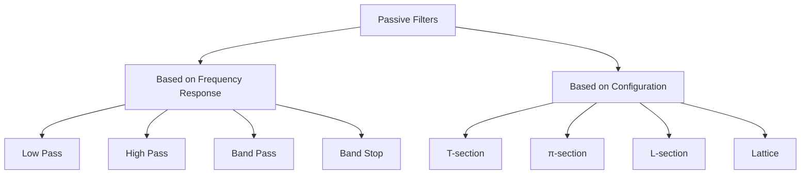

| Filter Type | Function | Typical Circuit | Applications |
|-------------|----------|----------------|--------------|
| **Low Pass** | Passes low frequencies | RC, RL circuits | Audio filters, Power supplies |
| **High Pass** | Passes high frequencies | CR, LR circuits | Noise filtering, Signal conditioning |
| **Band Pass** | Passes a band of frequencies | RLC circuits | Radio tuning, Signal selection |
| **Band Stop** | Blocks a band of frequencies | Parallel RLC | Interference rejection |

**Mnemonic:** "LHBB" - Low High Band Band filters for Pass and Block

## Question 5(c) [7 marks]

**Design constant-k type low pass and High pass filter with T-section having cutoff frequency= 1000Hz & load of 500Ω.**

**Answer**:

**Diagram:**

```goat
Low Pass T-Filter          High Pass T-Filter
     L/2       L/2              C/2       C/2
   --OOOO------OOOO--        ---||--------||---
   |                |        |                |
   |                |        |                |
   |       C        |        |       L        |
   |       ||       |        |      OOOO      |
   |                |        |                |
 ----------------------    ----------------------
```

**Design Calculations:**

For Constant-k T-type low pass filter:

| Parameter | Formula | Calculation | Value |
|-----------|---------|-------------|-------|
| Cut-off frequency | fc = 1000 Hz | Given | 1000 Hz |
| Load impedance | R₀ = 500 Ω | Given | 500 Ω |
| Series inductor | L = R₀/πfc | L = 500/(π×1000) | 159.15 mH |
| Half sections | L/2 | 159.15/2 | 79.58 mH |
| Shunt capacitor | C = 1/(πfcR₀) | C = 1/(π×1000×500) | 0.636 μF |

For Constant-k T-type high pass filter:

| Parameter | Formula | Calculation | Value |
|-----------|---------|-------------|-------|
| Series capacitor | C = 1/(4πfcR₀) | C = 1/(4π×1000×500) | 0.159 μF |
| Half sections | C/2 | 0.159/2 | 0.0795 μF |
| Shunt inductor | L = R₀/(4πfc) | L = 500/(4π×1000) | 39.79 mH |

**Mnemonic:** "FRED" - Frequency Ratio determines Element Dimensions

## Question 5(a OR) [3 marks]

**Explain the π type attenuator.**

**Answer**:

**Diagram:**

```goat
          Z2
          │
    ┌────┐│┌────┐
    │    ││     │
 In ┘  Z1│││Z3  │  Out
    │    ││     │
    └────┘│└────┘
          │
```

**π-type Attenuator**: A passive network in π configuration used to reduce signal amplitude.

| Component | Description | Formula |
|-----------|-------------|---------|
| **Z2** | Series arm | Z2 = 2Z₀/(N²-1) |
| **Z1, Z3** | Shunt arms | Z1 = Z3 = Z₀(N+1)/(N-1) |
| **N** | Attenuation ratio | N = 10^(dB/20) |

- **Characteristic**: Symmetrical for matched source and load
- **Applications**: Signal level control, impedance matching
- **Advantage**: Good isolation between input and output

**Mnemonic:** "PASS" - Pi-Attenuator has Series in middle and Shunt arms outside

## Question 5(b OR) [4 marks]

**Classify various types of attenuators.**

**Answer**:

**Diagram:**

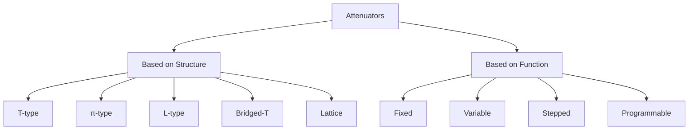

| Attenuator Type | Characteristics | Applications | Advantages |
|-----------------|-----------------|--------------|------------|
| **T-type** | Series-Shunt-Series | Audio systems | Simple design |
| **π-type** | Shunt-Series-Shunt | RF circuits | Better isolation |
| **L-type** | Series-Shunt | Simple matching | Impedance transformation |
| **Bridged-T** | Balanced structure | Test equipment | Minimal distortion |
| **Balanced** | Symmetric dual paths | Differential signals | Common mode rejection |

**Mnemonic:** "TPLBV" - T, Pi, L, Bridged-T, and Variable attenuators

## Question 5(c OR) [7 marks]

**Design a symmetrical T type attenuator and π type attenuator to give attenuation of 40dB and to work into the load of 500Ω.**

**Answer**:

**Diagram:**

```goat
T-type Attenuator           π-type Attenuator
     R1       R1                     R2
   --/\/\----/\/\--              --/\/\--
   |               |            |        |
   |               |            |        |
   |       R2      |            R1      R1
   |      /\/\     |           /\/\    /\/\
   |               |            |        |
   -----------------            ----------
```

**Design Calculations:**

| Step | Formula | Calculation | Value |
|------|---------|-------------|-------|
| Given | Attenuation = 40 dB | - | 40 dB |
| Step 1 | N = 10^(dB/20) | 10^(40/20) | 100 |
| Step 2 | K = (N-1)/(N+1) | (100-1)/(100+1) | 0.98 |

For T-type attenuator:

| Component | Formula | Calculation | Value |
|-----------|---------|-------------|-------|
| R₁ (series) | Z₀·K | 500 × 0.98 | 490 Ω |
| R₂ (shunt) | Z₀/(K·(N-K)) | 500/(0.98×(100-0.98)) | 5.15 Ω |

For π-type attenuator:

| Component | Formula | Calculation | Value |
|-----------|---------|-------------|-------|
| R₁ (shunt) | Z₀/K | 500/0.98 | 510.2 Ω |
| R₂ (series) | Z₀·K·(N-K) | 500 × 0.98 × (100-0.98) | 48,541 Ω |

**Mnemonic:** "DANK" - dB Attenuation is Number K, which determines resistor values
