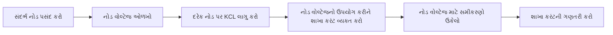
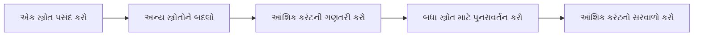
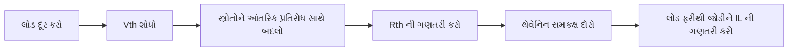

## પ્રશ્ન 1(a) [3 ગુણ]

**નીચેના શબ્દો વ્યાખ્યાયિત કરો. (i) એકટીવ એલિમેન્ટસ (ii) બાયલેટરલ એલિમેન્ટસ (iii) લિનિયર એલિમેંટ્સ**

**જવાબ**:

| શબ્દ | વ્યાખ્યા |
|------|------------|
| **એકટીવ એલિમેન્ટસ** | એલેક્ટ્રોનિક ઘટકો જે સર્કિટમાં ઊર્જા અથવા પાવર આપી શકે છે (જેમ કે બેટરી, જનરેટર, ઓપ-એમ્પ) |
| **બાયલેટરલ એલિમેન્ટસ** | ઘટકો જે બંને દિશામાં સમાન લાક્ષણિકતાઓ સાથે કરંટને સરખી રીતે વહેવા દે છે (જેમ કે રેસિસ્ટર, કેપેસિટર, ઇન્ડક્ટર) |
| **લિનિયર એલિમેંટ્સ** | ઘટકો જેમનો કરંટ-વોલ્ટેજ સંબંધ સીધી લાઇનનું અનુસરણ કરે છે અને સુપરપોઝિશનના સિદ્ધાંતનું પાલન કરે છે (જેમ કે ઓહ્મના નિયમનું અનુસરણ કરતા રેસિસ્ટર) |

**મેમરી ટ્રીક:** "ABL: Active powers Batteries, Bilateral flows Both ways, Linear stays Lawful"

## પ્રશ્ન 1(b) [4 ગુણ]

**10µf, 20 µf અને 30µf ના કેપેસિટર શ્રેણીમાં જોડાયેલા છે અને 200 V DCનો પુરવઠો આપવામાં આવે છે. દરેક કેપેસિટરમાં વોલ્ટેજ શોધો.**

**જવાબ**:

શ્રેણીમાં જોડાયેલા કેપેસિટર માટે:

1. સમતુલ્ય કેપેસિટન્સ શોધો: 1/Ceq = 1/C₁ + 1/C₂ + 1/C₃
2. વોલ્ટેજ વિભાજન: VC = (C₁/C) × V

**ગણતરી:**
1/Ceq = 1/10 + 1/20 + 1/30 = 0.1 + 0.05 + 0.033 = 0.183
Ceq = 5.46 μF

| કેપેસિટર | સૂત્ર | ગણતરી | વોલ્ટેજ |
|-----------|---------|-------------|---------|
| C₁ = 10μF | V₁ = (Ceq/C₁) × V | (5.46/10) × 200 = 109.2V | 109.2V |
| C₂ = 20μF | V₂ = (Ceq/C₂) × V | (5.46/20) × 200 = 54.6V | 54.6V |
| C₃ = 30μF | V₃ = (Ceq/C₃) × V | (5.46/30) × 200 = 36.4V | 36.4V |

**મેમરી ટ્રીક:** "નાના કેપેસિટરમાં મોટો વોલ્ટેજ મળે"

## પ્રશ્ન 1(c) [7 ગુણ]

**ગ્રાફ થિયરી માટે નોડ પેર વોલ્ટેજ પદ્ધતિ સમજાવો.**

**જવાબ**:

નોડ પેર વોલ્ટેજ પદ્ધતિ એ ઇલેક્ટ્રિકલ નેટવર્ક્સનું વિશ્લેષણ કરવા માટેની પદ્ધતિસરની પદ્ધતિ છે.

**પ્રક્રિયા:**

1. સંદર્ભ નોડ પસંદ કરો (ગ્રાઉન્ડ)
2. નોડ વોલ્ટેજને ઓળખો (N નોડ માટે N-1 અજ્ઞાત)
3. દરેક બિન-સંદર્ભ નોડ પર KCL લાગુ કરો
4. નોડ વોલ્ટેજના સંદર્ભમાં શાખા કરંટ વ્યક્ત કરો
5. નોડ વોલ્ટેજ માટે સમીકરણોનો ઉકેલ કરો

**આકૃતિ:**



**મુખ્ય ફાયદા:**

- **ઓછા સમીકરણો**: n નોડ માટે ફક્ત (n-1) સમીકરણો
- **કમ્પ્યુટેશનલ કાર્યક્ષમતા**: સિસ્ટમની જટિલતા ઘટાડે છે
- **સીધા વોલ્ટેજ ઉકેલ**: સીધા નોડ વોલ્ટેજ પ્રદાન કરે છે
- **પદ્ધતિસરનો અભિગમ**: કોઈપણ નેટવર્ક ટોપોલોજી માટે કામ કરે છે

**મેમરી ટ્રીક:** "GARCS: Ground, Assign voltages, Relate with KCL, Calculate currents, Solve equations"

## પ્રશ્ન 1(c) OR [7 ગુણ]

**જરૂરી સમીકરણો સાથે વોલ્ટેજ વિભાજન પદ્ધતિ સમજાવો.**

**જવાબ**:

વોલ્ટેજ વિભાજન એ શ્રેણી ઘટકોમાં વોલ્ટેજ કેવી રીતે વિતરિત થાય છે તે ગણવાની એક પદ્ધતિ છે.

**સિદ્ધાંત:**
શ્રેણી સર્કિટમાં, વોલ્ટેજ ઘટક પ્રતિરોધ/ઇમ્પીડન્સના પ્રમાણમાં વિભાજિત થાય છે.

**સૂત્ર:**
કુલ પ્રતિરોધ RT સાથે શ્રેણી સર્કિટમાં એક પ્રતિરોધ R₁ માટે:
V₁ = (R₁/RT) × VS

**આકૃતિ:**

```goat
      +---+
VS ---|   |-- R1 --|
      +---+        |
                   |  V1
                   |
                   |
      +---+        |
      |   |-- R2 --|
      +---+
        |
        |
      -----
       ---
        -
```

**ગાણિતિક સમજૂતી:**

- પ્રતિરોધક માટે: V₁ = (R₁/RT) × VS
- કેપેસિટર માટે: V₁ = (1/C₁)/(1/CT) × VS = (CT/C₁) × VS
- ઇન્ડક્ટર માટે: V₁ = (L₁/LT) × VS
- જટિલ ઇમ્પીડન્સ માટે: V₁ = (Z₁/ZT) × VS

**ઉદાહરણો:**

1. 5V સ્ત્રોત સાથે 4kΩ ની શ્રેણીમાં 1kΩ પ્રતિરોધક પર વોલ્ટેજ = (1/5)×5V = 1V
2. 10V સ્ત્રોત સાથે 40μF ની શ્રેણીમાં 10μF કેપેસિટર પર વોલ્ટેજ = (1/10)/(1/8)×10V = 8V

**મેમરી ટ્રીક:** "જેટલો મોટો પ્રતિરોધ, તેટલો મોટો વોલ્ટેજ ડ્રોપ"

## પ્રશ્ન 2(a) [3 ગુણ]

**ટુ પોર્ટ નેટવર્કના ઓપન સર્કિટ ઈમ્પીડેન્સ પેરામીટર્સ લખો.**

**જવાબ**:

**ઓપન સર્કિટ ઈમ્પીડેન્સ પેરામીટર્સ:**

| પેરામીટર | સમીકરણ | ભૌતિક અર્થ |
|-----------|----------|-------------|
| **Z₁₁** | Z₁₁ = V₁/I₁ (જ્યારે I₂=0) | આઉટપુટ ઓપન-સર્કિટેડ હોય ત્યારે ઇનપુટ ઇમ્પીડન્સ |
| **Z₁₂** | Z₁₂ = V₁/I₂ (જ્યારે I₁=0) | પોર્ટ 2 થી પોર્ટ 1 સુધી ટ્રાન્સફર ઇમ્પીડન્સ |
| **Z₂₁** | Z₂₁ = V₂/I₁ (જ્યારે I₂=0) | પોર્ટ 1 થી પોર્ટ 2 સુધી ટ્રાન્સફર ઇમ્પીડન્સ |
| **Z₂₂** | Z₂₂ = V₂/I₂ (જ્યારે I₁=0) | ઇનપુટ ઓપન-સર્કિટેડ હોય ત્યારે આઉટપુટ ઇમ્પીડન્સ |

**મેમરી ટ્રીક:** "ZIPO: Z-parameters with Inputs and outputs, Ports Open where needed"

## પ્રશ્ન 2(b) [4 ગુણ]

**ટી-ટાઈપ નેટવર્કમાંથી ∏-પ્રકાર નેટવર્કમાં રૂપાંતરણ મેળવો.**

**જવાબ**:

**T થી ∏ નેટવર્ક રૂપાંતરણ:**

**આકૃતિ:**

```goat
   T-Network           ∏-Network
      Z1                   Y1
  o---/\/\/---o       o---/\/\/---o
  |           |       |           |
  |           |       |           |
 Z3          Z2      Y3          Y2
  |           |       |           |
  |           |       |           |
  o-----------o       o-----------o
```

**રૂપાંતરણ સમીકરણો:**

| ∏-પેરામીટર | સૂત્ર | T-પેરામીટર્સ પર આધારિત |
|-------------|---------|----------------------|
| Y₁ = 1/Z₁ | Y₁ = Z₂/(Z₁Z₂+Z₂Z₃+Z₃Z₁) | નેટવર્ક દ્વારા સંશોધિત Z₁નો રેસિપ્રોકલ |
| Y₂ = 1/Z₂ | Y₂ = Z₁/(Z₁Z₂+Z₂Z₃+Z₃Z₁) | નેટવર્ક દ્વારા સંશોધિત Z₂નો રેસિપ્રોકલ |
| Y₃ = 1/Z₃ | Y₃ = Z₃/(Z₁Z₂+Z₂Z₃+Z₃Z₁) | નેટવર્ક દ્વારા સંશોધિત Z₃નો રેસિપ્રોકલ |

**ડેરિવેશન સ્ટેપ્સ:**

1. ડિટર્મિનન્ટ Δ = Z₁Z₂+Z₂Z₃+Z₃Z₁ વ્યાખ્યાયિત કરો
2. નેટવર્ક થિયરી વાપરીને Y₁ = Z₂/Δ તારવો
3. તે જ રીતે, Y₂ = Z₁/Δ
4. અને Y₃ = Z₃/Δ

**મેમરી ટ્રીક:** "ડેલ્ટા ડિવાઇડ: Y₁ને Z₂ મળે, Y₂ને Z₁ મળે, Y₃ને Z₃ મળે"

## પ્રશ્ન 2(c) [7 ગુણ]

**ડેલ્ટામાં 1, 1 અને 1 ઓહ્મના ત્રણ રેસીસ્ટર જોડાયેલા છે. સમકક્ષ સ્ટાર નેટવર્ક શોધો.**

**જવાબ**:

**ડેલ્ટા થી સ્ટાર રૂપાંતરણ:**

**આકૃતિ:**

```goat
   Delta Network           Star Network
       R1                      ra
   o---/\/\/--o           o---/\/\/---o
   |          |           |           |
   |          |           |           |
   |          |           |           |
   |          |          rb           rc
   |          |           |           |
  R3         R2           |           |
   |          |           |           |
   |          |           o-----------o
   o----------o
```

**રૂપાંતરણ સૂત્રો:**

- ra = (R₁×R₃)/(R₁+R₂+R₃)
- rb = (R₁×R₂)/(R₁+R₂+R₃)
- rc = (R₂×R₃)/(R₁+R₂+R₃)

**ગણતરી:**
આપેલું: R₁ = R₂ = R₃ = 1Ω
પ્રતિરોધનો સરવાળો: R₁+R₂+R₃ = 3Ω

| સ્ટાર પ્રતિરોધક | સૂત્ર | ગણતરી | પરિણામ |
|---------------|---------|-------------|--------|
| ra | (R₁×R₃)/(R₁+R₂+R₃) | (1×1)/3 | 0.333Ω |
| rb | (R₁×R₂)/(R₁+R₂+R₃) | (1×1)/3 | 0.333Ω |
| rc | (R₂×R₃)/(R₁+R₂+R₃) | (1×1)/3 | 0.333Ω |

**મેમરી ટ્રીક:** "પ્રોડક્ટ ઓવર સમ: દરેક સ્ટાર આર્મને નજીકના ડેલ્ટા બાજુઓના ગુણાકારને બધાના સરવાળા વડે ભાગવાથી મળે છે"

## પ્રશ્ન 2(a) OR [3 ગુણ]

**વ્યાખ્યાયિત કરો. (i) ટ્રાન્સફર ઇમ્પીડન્સ (ii) ઇમેજ ઇમ્પીડન્સ (iii) ડ્રાઇવિંગ પોઈન્ટ ઇમ્પીડન્સ**

**જવાબ**:

| શબ્દ | વ્યાખ્યા |
|------|------------|
| **ટ્રાન્સફર ઇમ્પીડન્સ** | એક પોર્ટ પર આઉટપુટ વોલ્ટેજનો બીજા પોર્ટ પર ઈનપુટ કરંટના ગુણોત્તર જ્યારે અન્ય બધા પોર્ટ ઓપન-સર્કિટેડ હોય (Z₂₁ = V₂/I₁ જ્યારે I₂=0) |
| **ઇમેજ ઇમ્પીડન્સ** | જ્યારે આઉટપુટ પોર્ટ તેના પોતાના ઇમેજ ઇમ્પીડન્સ સાથે ટર્મિનેટ કરવામાં આવે ત્યારે પોર્ટ પર ઇનપુટ ઇમ્પીડન્સ, જે તમામ પોઇન્ટ્સ પર સમાન ઇમ્પીડન્સ સાથે અનંત ચેઇન બનાવે છે |
| **ડ્રાઇવિંગ પોઈન્ટ ઇમ્પીડન્સ** | જ્યારે નિર્દિષ્ટ પોર્ટ અથવા ટર્મિનલ જોડીમાં જોતા હોઈએ ત્યારે દેખાતી ઇનપુટ ઇમ્પીડન્સ (Z₁₁ = V₁/I₁ પોર્ટ 1 માટે) |

**મેમરી ટ્રીક:** "TID: Transfer relates ports, Image creates reflections, Driving point looks inward"

## પ્રશ્ન 2(b) OR [4 ગુણ]

**સ્ટાન્ડર્ડ 'T' નેટવર્ક માટે કેરેક્ટરીસ્ટીક ઇમ્પીડન્સ Z માટે સમીકરણ મેળવો.**

**જવાબ**:

**'T' નેટવર્કની કેરેક્ટરીસ્ટીક ઇમ્પીડન્સ:**

**આકૃતિ:**

```goat
        Z1/2         Z1/2
    o---/\/\/---o----/\/\/---o
    |            |           |
    |            |           |
    A           Z2           B
    |            |           |
    |            |           |
    o------------o-----------o
```

**ડેરિવેશન:**
સિમેટ્રિકલ T-નેટવર્ક માટે સીરીઝ ઇમ્પીડન્સ Z₁ (દરેક બાજુ પર Z₁/2 તરીકે વિભાજિત) અને શંટ ઇમ્પીડન્સ Z₂ સાથે:

Z₀ = √(Z₁Z₂ + Z₁²/4)

**સ્ટેપ્સ:**

1. T-નેટવર્ક માટે ABCD પેરામીટર્સ:
   - A = 1 + Z₁/2Z₂
   - B = Z₁ + Z₁²/4Z₂
   - C = 1/Z₂
   - D = 1 + Z₁/2Z₂
2. ટ્રાન્સમિશન લાઇન થિયરી માંથી, Z₀ = √(B/C)
3. સબસ્ટિટ્યુટિંગ: Z₀ = √((Z₁ + Z₁²/4Z₂)/(1/Z₂))
4. સરળીકરણ: Z₀ = √(Z₁Z₂ + Z₁²/4)

**મેમરી ટ્રીક:** "Z-પ્રોડક્ટ પ્લસ ક્વાર્ટર-સ્ક્વેરનું વર્ગમૂળ"

## પ્રશ્ન 2(c) OR [7 ગુણ]

**6, 15 અને 10 ઓહ્મના ત્રણ રેસીસ્ટર સ્ટાર માં જોડાયેલા છે. સમકક્ષ ડેલ્ટા નેટવર્ક શોધો.**

**જવાબ**:

**સ્ટાર થી ડેલ્ટા રૂપાંતરણ:**

**આકૃતિ:**

```goat
   Star Network           Delta Network
       ra                      R1
   o---/\/\/--o           o---/\/\/---o
   |          |           |           |
   |          |           |           |
   |          |           |           |
   |          |          R3          R2
  rb         rc           |           |
   |          |           |           |
   |          |           |           |
   o----------o           o-----------o
```

**રૂપાંતરણ સૂત્રો:**

- R₁ = (ra×rb + rb×rc + rc×ra)/ra
- R₂ = (ra×rb + rb×rc + rc×ra)/rb
- R₃ = (ra×rb + rb×rc + rc×ra)/rc

**ગણતરી:**
આપેલું: ra = 6Ω, rb = 15Ω, rc = 10Ω
પ્રોડક્ટનો સરવાળો = (6×15) + (15×10) + (10×6) = 90 + 150 + 60 = 300

| ડેલ્ટા પ્રતિરોધક | સૂત્ર | ગણતરી | પરિણામ |
|----------------|---------|-------------|--------|
| R₁ | (ra×rb + rb×rc + rc×ra)/ra | 300/6 | 50Ω |
| R₂ | (ra×rb + rb×rc + rc×ra)/rb | 300/15 | 20Ω |
| R₃ | (ra×rb + rb×rc + rc×ra)/rc | 300/10 | 30Ω |

**મેમરી ટ્રીક:** "પ્રોડક્ટ્સ સમ ઓવર ઓપોઝિટ: ડેલ્ટા બાજુને સામેના સ્ટાર આર્મ વડે ભાગેલા બધા પ્રોડક્ટ્સ મળે છે"

## પ્રશ્ન 3(a) [3 ગુણ]

**KVL નો ઉપયોગ કરીને લૂપ કરંટની ગણતરી કરવા માટે સર્કિટ (R1, R2 અને R3 dc સપ્લાય સાથે શ્રેણીમાં જોડાયેલા) નું વિશ્લેષણ કરો**

**જવાબ**:

**શ્રેણી સર્કિટ માટે KVL:**

**આકૃતિ:**

```goat
      +---+
VS ---|   |-- R1 --+-- R2 --+-- R3 --+
      +---+        |        |        |
                   |        |        |
                   |        |        |
                  I|       I|       I|
                   |        |        |
                   |        |        |
                   +--------+--------+
                          -----
                           ---
                            -
```

**KVL સમીકરણ:** VS - IR₁ - IR₂ - IR₃ = 0
**લૂપ કરંટ:** I = VS/(R₁ + R₂ + R₃)

**સ્ટેપ્સ:**

1. લૂપમાં બધા ઘટકોને ઓળખો: VS, R₁, R₂, R₃
2. KVL લાગુ કરો: વોલ્ટેજ વૃદ્ધિનો સરવાળો = વોલ્ટેજ ડ્રોપનો સરવાળો
3. I માટે ઉકેલ: I = VS/RT જ્યાં RT = R₁ + R₂ + R₃

**મેમરી ટ્રીક:** "KVL: કિરચોફનો વોલ્ટેજ લૂપ કુલ પ્રતિરોધની જરૂર પડે છે"

## પ્રશ્ન 3(b) [4 ગુણ]

**નોર્ટનનું થીયરમ લખો.**

**જવાબ**:

**નોર્ટનનું થીયરમ:**

વોલ્ટેજ સ્ત્રોત, કરંટ સ્ત્રોત અને પ્રતિરોધ વાળા કોઈપણ લિનિયર ઇલેક્ટ્રિકલ નેટવર્કને IN કરંટ સ્ત્રોત અને RN પ્રતિરોધ સમાંતર જોડાયેલા સમકક્ષ સર્કિટ દ્વારા બદલી શકાય છે.

**આકૃતિ:**

```goat
    Original Network          Norton Equivalent
         +-----+                    +-----+
         |     |                    |     |
         |  A  |                    | IN  |
         |     |                    |     |
         +--+--+                    +--+--+
            |                          |
      +-----+-----+              +-----+-----+
      |     |     |              |     |     |
      |     Z     |       =>     |    RN     |
      |     |     |              |     |     |
      +-----+-----+              +-----+-----+
            |                          |
         +--+--+                    +--+--+
         |     |                    |     |
         |  B  |                    |     |
         |     |                    |     |
         +-----+                    +-----+
```

**નોર્ટન સમકક્ષ કેવી રીતે શોધવું:**

1. **નોર્ટન કરંટ (IN)**: લોડ ટર્મિનલ્સ વચ્ચે શોર્ટ-સર્કિટ કરંટ
2. **નોર્ટન રેસિસ્ટન્સ (RN)**: બધા સ્ત્રોતોને તેમના આંતરિક પ્રતિરોધ સાથે બદલીને ટર્મિનલ્સથી જોતા ઈનપુટ રેસિસ્ટન્સ

**મેમરી ટ્રીક:** "SCIP: Short-Circuit current In Parallel with equivalent resistance"

## પ્રશ્ન 3(c) [7 ગુણ]

**સુપરપોઝિશન પ્રમેયનો ઉપયોગ કરીને ckt ની કોઈપણ શાખામાં કરંટની ગણતરી કરવાનાં પગલાં સમજાવો**

**જવાબ**:

**સુપરપોઝિશન થીયરમનો ઉપયોગ:**

**સિદ્ધાંત:**
એક લિનિયર સર્કિટમાં બહુવિધ સ્ત્રોત સાથે, કોઈપણ તત્વમાં પ્રતિભાવ દરેક સ્ત્રોત એકલા કાર્ય કરતા હોય ત્યારે થતા પ્રતિભાવોના સરવાળા બરાબર હોય છે.

**સ્ટેપ્સ:**

1. એક સમયે એક જ સ્ત્રોત ધ્યાનમાં લો
2. અન્ય વોલ્ટેજ સ્ત્રોતને શોર્ટ સર્કિટ સાથે બદલો
3. અન્ય કરંટ સ્ત્રોતને ઓપન સર્કિટ સાથે બદલો
4. દરેક સ્ત્રોત માટે આંશિક કરંટની ગણતરી કરો
5. તમામ આંશિક કરંટને (બીજગણિતીય રીતે) એકસાથે ઉમેરો

**આકૃતિ:**



**ગાણિતિક અભિવ્યક્તિ:**
I = I₁ + I₂ + I₃ + ... + In
જ્યાં I₁, I₂, વગેરે વ્યક્તિગત સ્ત્રોતોના કારણે આંશિક કરંટ છે

**ઉદાહરણ ગણતરી:**
કરંટ યોગદાન સાથે શાખા માટે:
I₁ = 2A (સ્ત્રોત 1 થી)
I₂ = -1A (સ્ત્રોત 2 થી)
I₃ = 0.5A (સ્ત્રોત 3 થી)
કુલ કરંટ = 2A + (-1A) + 0.5A = 1.5A

**મેમરી ટ્રીક:** "OSACI: One Source Active, Calculate and Integrate"

## પ્રશ્ન 3(a) OR [3 ગુણ]

**KCL નો ઉપયોગ કરીને નોડ વોલ્ટેજની ગણતરી કરવા માટે સર્કિટ (R1, R2 અને R3 ડીસી સપ્લાય સાથે સમાંતર જોડાયેલ) નું વિશ્લેષણ કરો**

**જવાબ**:

**સમાંતર સર્કિટ માટે KCL:**

**આકૃતિ:**

```goat
                 I1
      +---+    +---+
VS ---|   |----| R1|----+
      +---+    +---+    |
                        |
                 I2     |
                +---+   |
                | R2|---+--- V (Node)
                +---+   |
                        |
                 I3     |
                +---+   |
                | R3|---+
                +---+   |
                        |
                       ---
                        -
```

**KCL સમીકરણ:** I₁ + I₂ + I₃ = 0
**નોડ વોલ્ટેજ:** V = VS (કારણ કે સમાંતર ઘટકોમાં સમાન વોલ્ટેજ હોય છે)

**સ્ટેપ્સ:**

1. નોડ વોલ્ટેજ V ને ઓળખો
2. શાખા કરંટને વ્યક્ત કરો: I₁ = V/R₁, I₂ = V/R₂, I₃ = V/R₃
3. KCL લાગુ કરો: V/R₁ + V/R₂ + V/R₃ = VS/RT જ્યાં 1/RT = 1/R₁ + 1/R₂ + 1/R₃

**મેમરી ટ્રીક:** "KCL: કિરચોફનો કરંટ નિયમ સમાંતર વોલ્ટેજ સ્ત્રોત જેટલો જ બતાવે છે"

## પ્રશ્ન 3(b) OR [4 ગુણ]

**મહત્તમ પાવર ટ્રાન્સફર થીયરમ લખો.**

**જવાબ**:

**મહત્તમ પાવર ટ્રાન્સફર થીયરમ:**

આંતરિક પ્રતિરોધ ધરાવતા સ્ત્રોત માટે, જ્યારે લોડ પ્રતિરોધ સ્ત્રોતના આંતરિક પ્રતિરોધ બરાબર હોય ત્યારે લોડમાં મહત્તમ પાવર ટ્રાન્સફર થાય છે.

**આકૃતિ:**

```goat
    +---+     Rsource      +---+
    |   |----/\/\/\/\------|   |
    | V |                  | RL|
    |   |                  |   |
    +---+                  +---+
     ---                    ---
      -                      -
```

**ગાણિતિક અભિવ્યક્તિ:**

- મહત્તમ પાવર ટ્રાન્સફર થાય ત્યારે RL = Rsource
- મહત્તમ પાવર: Pmax = V²/(4×Rsource)

**મુખ્ય મુદ્દાઓ:**

- **કાર્યક્ષમતા**: મહત્તમ પાવર ટ્રાન્સફર પર માત્ર 50%
- **AC સર્કિટ્સ**: લોડ ઇમ્પીડન્સ સ્ત્રોત ઇમ્પીડન્સનો કોમ્પ્લેક્સ કોન્જુગેટ હોવો જોઈએ
- **ઉપયોગો**: સિગ્નલ ટ્રાન્સમિશન, ઓડિયો સિસ્ટમ્સ, RF સર્કિટ્સ

**મેમરી ટ્રીક:** "MEET: Maximum Efficiency Equals when Thevenin-matched"

## પ્રશ્ન 3(c) OR [7 ગુણ]

**થેવેનિનના પ્રમેયનો ઉપયોગ કરીને ckt માં Vth, Rth અને લોડ કરંટની ગણતરી કરવાનાં પગલાં સમજાવો.**

**જવાબ**:

**થેવેનિનના થીયરમનો ઉપયોગ:**

**સિદ્ધાંત:**
વોલ્ટેજ અને કરંટ સ્ત્રોત ધરાવતા કોઈપણ લિનિયર ઇલેક્ટ્રિકલ નેટવર્કને એક સિંગલ વોલ્ટેજ સ્ત્રોત Vth અને શ્રેણી પ્રતિરોધ Rth વાળા સમકક્ષ સર્કિટ દ્વારા બદલી શકાય છે.

**સ્ટેપ્સ:**

1. સર્કિટમાંથી લોડ પ્રતિરોધ દૂર કરો
2. લોડ ટર્મિનલ્સ વચ્ચે ઓપન-સર્કિટ વોલ્ટેજ (Vth) ની ગણતરી કરો
3. બધા સ્ત્રોતોને તેમના આંતરિક પ્રતિરોધ સાથે બદલો (વોલ્ટેજ સ્ત્રોતને શોર્ટ સર્કિટ તરીકે, કરંટ સ્ત્રોતને ઓપન સર્કિટ તરીકે)
4. લોડ ટર્મિનલ્સથી જોતા સમકક્ષ પ્રતિરોધ (Rth) ની ગણતરી કરો
5. Vth અને Rth સાથે થેવેનિન સમકક્ષ સર્કિટ દોરો
6. લોડને ફરીથી જોડો અને લોડ કરંટની ગણતરી કરો: IL = Vth/(Rth + RL)

**આકૃતિ:**



**ઉદાહરણ ગણતરી:**

- જો Vth = 12V
- Rth = 3Ω
- RL = 6Ω
- પછી IL = 12V/(3Ω + 6Ω) = 12V/9Ω = 1.33A

**મેમરી ટ્રીક:** "VORTE: Voltage Open, Resistance with sources Transformed, Equivalent circuit"

## પ્રશ્ન 4(a) [3 ગુણ]

**રેઝોનન્સ વ્યાખ્યાયિત કરો.**

**જવાબ**:

**રેઝોનન્સ:**

રેઝોનન્સ એ એક ઘટના છે જેમાં સર્કિટ ચોક્કસ ફ્રિક્વન્સી પર, જેને રેઝોનન્ટ ફ્રિક્વન્સી કહેવામાં આવે છે, એપ્લાઈડ સિગ્નલનો મહત્તમ એમ્પ્લિટ્યુડ સાથે પ્રતિસાદ આપે છે.

**મુખ્ય લાક્ષણિકતાઓ:**

- ઇમ્પીડન્સ માત્ર રેઝિસ્ટિવ બને છે
- ઇન્ડક્ટિવ રિએક્ટન્સ કેપેસિટિવ રિએક્ટન્સ બરાબર થાય છે (XL = XC)
- વોલ્ટેજ અને કરંટ એક જ ફેઝમાં હોય છે
- સર્કિટ L અને C ઘટકો વચ્ચે ઊર્જા સંગ્રહિત કરે છે અને છોડે છે

**ઉપયોગો:**

- ટ્યુનિંગ સર્કિટ્સ
- ફિલ્ટર્સ
- ઓસીલેટર્સ
- વાયરલેસ કોમ્યુનિકેશન

**મેમરી ટ્રીક:** "MAX-IN-PHASE: Maximum response when Inductive and capacitive reactances are equal and PHASEs cancel"

## પ્રશ્ન 4(b) [4 ગુણ]

**કોઇલના ક્વાલિટી ફેક્ટર માટે સમીકરણ મેળવો.**

**જવાબ**:

**કોઇલનો ક્વાલિટી ફેક્ટર (Q):**

**વ્યાખ્યા:**
Q-ફેક્ટર એ રેઝોનન્ટ સર્કિટમાં સંગ્રહિત ઊર્જાનું એક ચક્ર દીઠ વેડફાતી ઊર્જા સાથેનો ગુણોત્તર છે.

**ડેરિવેશન:**
ઇન્ડક્ટન્સ L અને રેઝિસ્ટન્સ R વાળી કોઇલ માટે:

1. ઇન્ડક્ટરમાં સંગ્રહિત ઊર્જા: WL = ½LI²
2. રેઝિસ્ટન્સમાં વેડફાતી પાવર: P = I²R
3. સમય અવધિ: T = 1/f = 2π/ω
4. એક ચક્ર દીઠ વેડફાતી ઊર્જા: Wd = P×T = I²R×(2π/ω)
5. Q = 2π(સંગ્રહિત ઊર્જા/એક ચક્ર દીઠ વેડફાતી ઊર્જા)
6. Q = 2π(½LI²)/(I²R×2π/ω) = ωL/R

**અંતિમ સમીકરણ:**
Q = ωL/R = 2πfL/R

**મહત્વ:**

- ઉચ્ચ Q ઓછી ઊર્જા ખોટ સૂચવે છે
- Q ફ્રિક્વન્સી સાથે વધે છે
- Q રેઝિસ્ટન્સ સાથે ઘટે છે

**મેમરી ટ્રીક:** "ઓમેગા-L ડિવાઇડેડ બાય R ગિવ્સ ક્વાલિટી"

## પ્રશ્ન 4(c) [7 ગુણ]

**RLC શ્રેણીના સર્કિટમાં R=1 KΩ, L=100 mH અને C=10µF છે. જો શ્રેણીના સંયોજનમાં 100 V નો વોલ્ટેજ લાગુ કરવામાં આવે તો, નક્કી કરો: (i) રેઝોનન્સ ફ્રીક્વન્સી (ii) 'Q' પરિબળ**

**જવાબ**:

**RLC શ્રેણી સર્કિટ વિશ્લેષણ:**

**આકૃતિ:**

```goat
         L=100mH
      +---uuuu----+
      |           |
      |           |
100V  R=1kΩ       C=10µF
      |           |
      |           |
      +-----------+
```

**ગણતરી:**

(i) **રેઝોનન્સ ફ્રીક્વન્સી:**

- સૂત્ર: fr = 1/(2π√(LC))
- fr = 1/(2π√(100×10⁻³ × 10×10⁻⁶))
- fr = 1/(2π√(1×10⁻⁶))
- fr = 1/(2π × 1×10⁻³)
- fr = 159.15 Hz

(ii) **ક્વોલિટી ફેક્ટર (Q):**

- સૂત્ર: Q = (1/R)√(L/C)
- Q = (1/1000)√(100×10⁻³/10×10⁻⁶)
- Q = (1/1000)√(10⁴)
- Q = (1/1000) × 100
- Q = 0.1

| પેરામીટર | સૂત્ર | ગણતરી | પરિણામ |
|-----------|---------|-------------|--------|
| રેઝોનન્ટ ફ્રિક્વન્સી (fr) | 1/(2π√(LC)) | 1/(2π√(1×10⁻⁶)) | 159.15 Hz |
| ક્વોલિટી ફેક્ટર (Q) | (1/R)√(L/C) | (1/1000)√(10⁴) | 0.1 |

**મેમરી ટ્રીક:** "ફ્રિક્વન્સી LC માંથી, ક્વોલિટી LCR માંથી"

## પ્રશ્ન 4(a) OR [3 ગુણ]

**મ્યુચ્યુઅલ ઇન્ડક્ટન્સ વ્યાખ્યાયિત કરો.**

**જવાબ**:

**મ્યુચ્યુઅલ ઇન્ડક્ટન્સ:**

મ્યુચ્યુઅલ ઇન્ડક્ટન્સ એ સર્કિટનો એવો ગુણધર્મ છે જેના કારણે એક કોઇલમાં કરંટમાં ફેરફાર થવાથી તેમની વચ્ચેના મેગ્નેટિક કપલીંગને કારણે બીજી કોઇલમાં વોલ્ટેજ પ્રેરિત થાય છે.

**ગાણિતિક અભિવ્યક્તિ:**

- કોઇલ 2 માં પ્રેરિત વોલ્ટેજ: V₂ = -M(dI₁/dt)
- M = k√(L₁L₂) જ્યાં k કપલિંગ કોએફિશિયન્ટ છે (0≤k≤1)
- એકમ: હેનરી (H)

**મુખ્ય ગુણધર્મો:**

- કોઇલ જ્યોમેટ્રી, અંતર અને ઓરિએન્ટેશન પર આધાર રાખે છે
- બંને ઇન્ડક્ટન્સના પ્રમાણમાં હોય છે
- ટ્રાન્સફોર્મર અને કપલ્ડ સર્કિટ્સનો આધાર છે
- મ્યુચ્યુઅલ ફ્લક્સની દિશાના આધારે પોઝિટિવ અથવા નેગેટિવ હોઈ શકે છે

**મેમરી ટ્રીક:** "MICK: Mutual Inductance links Coils through K-coupling"

## પ્રશ્ન 4(b) OR [4 ગુણ]

**કોએફીશિયન્ટ ઓફ કપલિંગનું સમીકરણ મેળવો**

**જવાબ**:

**કોએફિશિયન્ટ ઓફ કપલિંગ (k):**

**વ્યાખ્યા:**
કોએફિશિયન્ટ ઓફ કપલિંગ (k) એ બે કોઇલ્સ વચ્ચેના મેગ્નેટિક કપલિંગનું માપ છે, જે 0 (કોઈ કપલિંગ નહીં) થી 1 (પૂર્ણ કપલિંગ) સુધી હોય છે.

**ડેરિવેશન:**

1. મ્યુચ્યુઅલ ઇન્ડક્ટન્સ વ્યાખ્યાયિત કરો: M = મેગ્નેટિક ફ્લક્સ લિંકેજ / કરંટ
2. સેલ્ફ-ઇન્ડક્ટન્સ L₁ અને L₂ વાળી બે કોઇલ્સ માટે:
   - કોઇલ 1 માં કરંટ 1 ના કારણે કોઇલ 1 માં ફ્લક્સ લિંકેજ: λ₁₁ = L₁I₁
   - કોઇલ 2 માં કરંટ 2 ના કારણે કોઇલ 2 માં ફ્લક્સ લિંકેજ: λ₂₂ = L₂I₂
   - કોઇલ 1 માં કરંટ ના કારણે કોઇલ 2 માં ફ્લક્સ લિંકેજ: λ₂₁ = MI₁
3. કપલિંગ કોએફિશિયન્ટ k એ કોઇલ 1 માંથી ફ્લક્સનો અંશ જે કોઇલ 2 સાથે જોડાય છે તેનું પ્રતિનિધિત્વ કરે છે
4. ઇલેક્ટ્રોમેગ્નેટિક થિયરી માંથી: M = k√(L₁L₂)
5. ફરીથી ગોઠવણ: k = M/√(L₁L₂)

**અંતિમ સમીકરણ:**
k = M/√(L₁L₂)

**મુખ્ય મુદ્દાઓ:**

- k = 0: કોઈ મેગ્નેટિક કપલિંગ નહીં
- 0 < k < 1: આંશિક કપલિંગ
- k = 1: પૂર્ણ કપલિંગ (બધો ફ્લક્સ બંને કોઇલ્સને જોડે છે)

**મેમરી ટ્રીક:** "M ડિવાઇડેડ બાય જીઓમેટ્રિક મીન ઓફ Ls"

## પ્રશ્ન 4(c) OR [7 ગુણ]

**સમાંતર રેઝોનન્સ સર્કિટની રેઝોનન્સ ફ્રીક્વન્સી મેળવો.**

**જવાબ**:

**સમાંતર રેઝોનન્સ ફ્રીક્વન્સી ડેરિવેશન:**

**આકૃતિ:**

```goat
              +---+
              |   |
           +--+---+--+
           |          |
           |          |
      L    |          |   C
    uuuuu  |          |  ||| 
           |          |  |||
           |          |  |||
           |          |  |||
           +----------+---+
              |   |
              +---+
               R
```

**ડેરિવેશન સ્ટેપ્સ:**

1. સમાંતર RLC સર્કિટ માટે, એડમિટન્સ છે:
   Y = 1/Z = 1/R + 1/jωL + jωC

2. રેઝોનન્સ પર, કાલ્પનિક ભાગ શૂન્ય થાય છે:
   Im(Y) = 0
   1/jωL + jωC = 0
   -j/ωL + jωC = 0
   1/ωL = ωC
   ω²LC = 1

3. આદર્શ કિસ્સા માટે (અનંત પ્રતિરોધ સાથે):
   ω₀ = 1/√(LC)
   f₀ = 1/(2π√(LC))

4. વાસ્તવિક કિસ્સા માટે (પ્રતિરોધ R સાથે):
   જો R, L ની શ્રેણીમાં હોય, તો રેઝોનન્ટ ફ્રિક્વન્સી થાય છે:
   f₀ = (1/2π)√(1/LC - R²/L²)

**અંતિમ સમીકરણ:**

- આદર્શ કિસ્સા: f₀ = 1/(2π√(LC))
- વાસ્તવિક કિસ્સા (R, L ની શ્રેણીમાં): f₀ = (1/2π)√(1/LC - R²/L²)

**સમાંતર રેઝોનન્સની મુખ્ય લાક્ષણિકતાઓ:**

- રેઝોનન્સ પર મહત્તમ ઇમ્પીડન્સ
- સ્ત્રોતમાંથી લેવાતો ન્યૂનતમ કરંટ
- L અને C વચ્ચે કરંટ પરિભ્રમણ કરે છે
- "એન્ટી-રેઝોનન્સ" અથવા "રિજેક્ટર સર્કિટ" તરીકે પણ ઓળખાય છે

**મેમરી ટ્રીક:** "ONE over LC SQRT: The frequency where parallel paths balance"

## પ્રશ્ન 5(a) [3 ગુણ]

**વિવિધ પ્રકારના એટેન્યુએટરનું વર્ગીકરણ કરો.**

**જવાબ**:

**એટેન્યુએટરના પ્રકારો:**

| પ્રકાર | સંરચના | લાક્ષણિકતાઓ |
|------|-----------|----------------|
| **T-પ્રકાર** | શ્રેણી-શંટ-શ્રેણી | સિમેટ્રિક, મેચિંગ માટે સારું, વ્યાપકપણે વપરાતું |
| **∏-પ્રકાર** | શંટ-શ્રેણી-શંટ | સિમેટ્રિક, T-પ્રકારનો વિકલ્પ |
| **લેટિસ** | બેલેન્સ્ડ બ્રિજ | સિમેટ્રિકલ, બેલેન્સ્ડ લાઇન્સમાં વપરાય છે |
| **L-પ્રકાર** | શ્રેણી-શંટ | એસિમેટ્રિક, સરળ ડિઝાઈન |
| **બ્રિજ્ડ-T** | બ્રિજ્ડ શંટ સાથે T | સારો ફ્રિક્વન્સી રિસ્પોન્સ, જટિલ |
| **O-પ્રકાર** | શ્રેણી-શંટ-શ્રેણી-શંટ | સુધારેલા રિજેક્શન લક્ષણો |

**મેમરી ટ્રીક:** "TL∏BO: Top attenuators Let ∏ signals Balance Output"

## પ્રશ્ન 5(b) [4 ગુણ]

**ડેસિબલ અને નેપર વચ્ચેનો સંબંધ મેળવો**

**જવાબ**:

**ડેસિબલ થી નેપર રૂપાંતરણ:**

**વ્યાખ્યાઓ:**

- **ડેસિબલ (dB)**: બેઝ 10 (કોમન લોગેરિધમ) વાપરીને પાવર રેશિયો લોગેરિધમ
- **નેપર (Np)**: બેઝ e (નેચરલ લોગેરિધમ) વાપરીને વોલ્ટેજ/કરંટ રેશિયો લોગેરિધમ

**ડેરિવેશન:**

1. dB માં પાવર રેશિયો: Loss(dB) = 10 log₁₀(P₁/P₂)
2. dB માં વોલ્ટેજ રેશિયો: Loss(dB) = 20 log₁₀(V₁/V₂)
3. નેપર માં વોલ્ટેજ રેશિયો: Loss(Np) = ln(V₁/V₂)
4. લોગેરિધમ બેઝ વચ્ચે રૂપાંતરણ: log₁₀(x) = ln(x)/ln(10)
5. સબસ્ટિટ્યુટ: Loss(dB) = 20 ln(V₁/V₂)/ln(10) = 20 Loss(Np)/ln(10)

**અંતિમ સંબંધ:**

- 1 નેપર = ln(10)/20 × 10 dB = 8.686 dB
- 1 dB = 0.115 નેપર

**કોષ્ટક:**

| રૂપાંતરણ | સૂત્ર | મૂલ્ય |
|------------|---------|-------|
| નેપર થી dB | 1 Np = (20/ln10) dB | 1 Np = 8.686 dB |
| dB થી નેપર | 1 dB = (ln10/20) Np | 1 dB = 0.115 Np |

**મેમરી ટ્રીક:** "8.686: Eight Point Six Nepers Buy Ten decibels"

## પ્રશ્ન 5(c) [7 ગુણ]

**ડિઝાઇન T પ્રકારનું એટેન્યુએટર જેનો 20 ડીબી એટેન્યુએશન અને કેરેક્ટરીસ્ટીક ઇમ્પીડન્સ 600 ઓહ્મ છે.**

**જવાબ**:

**T-પ્રકારના એટેન્યુએટર ડિઝાઇન:**

**આકૃતિ:**

```goat
       Z1/2         Z1/2
    o---/\/\/----o---/\/\/---o
    |            |           |
    |            |           |
   R0           Z2          R0
    |            |           |
    |            |           |
    o------------o-----------o
```

**ડિઝાઇન સ્ટેપ્સ:**

1. dB માંથી એટેન્યુએશન રેશિયો N ની ગણતરી કરો:
   N = 10^(dB/20) = 10^(20/20) = 10

2. સૂત્રો વાપરીને R₁ અને R₂ ની ગણતરી કરો:
   - R₁ = R₀ × [(N² - 1)/(N² + 1)]
   - R₂ = R₀ × [2N/(N² - 1)]

**ગણતરી:**

આપેલું:

- એટેન્યુએશન = 20 dB
- કેરેક્ટરીસ્ટીક ઇમ્પીડન્સ = 600 Ω

| પેરામીટર | સૂત્ર | ગણતરી | પરિણામ |
|-----------|---------|-------------|--------|
| N | 10^(dB/20) | 10^(20/20) | 10 |
| R₁ | R₀[(N² - 1)/(N² + 1)] | 600[(10² - 1)/(10² + 1)] | 588.2 Ω |
| Z₁/2 | R₁/2 | 588.2/2 | 294.1 Ω |
| R₂ | R₀[2N/(N² - 1)] | 600[2×10/(10² - 1)] | 121.2 Ω |

**અંતિમ T-નેટવર્ક મૂલ્યો:**

- દરેક શ્રેણી આર્મ (Z₁/2): 294.1 Ω
- શંટ આર્મ (Z₂): 121.2 Ω

**મેમરી ટ્રીક:** "N-squared minus ONE over N-squared plus ONE for series resistance"

## પ્રશ્ન 5(a) OR [3 ગુણ]

**કોંસ્ટંટ K લો પાસ ફિલ્ટર્સની મર્યાદાઓ લખો.**

**જવાબ**:

**કોન્સ્ટન્ટ-K લો પાસ ફિલ્ટર્સની મર્યાદાઓ:**

| મર્યાદા | વર્ણન |
|------------|-------------|
| **ખરાબ કટઓફ ટ્રાન્ઝિશન** | તીક્ષ્ણ કટઓફને બદલે પાસ બેન્ડથી સ્ટોપ બેન્ડમાં ક્રમિક પરિવર્તન |
| **અસમાન ઇમ્પીડન્સ** | ઇમ્પીડન્સ ફ્રિક્વન્સી સાથે બદલાય છે, જેના કારણે મેચિંગ સમસ્યાઓ ઉદ્ભવે છે |
| **એટેન્યુએશન રિપલ** | પાસ બેન્ડ અને સ્ટોપ બેન્ડ બંનેમાં બિન-સમાન એટેન્યુએશન |
| **ફેઝ ડિસ્ટોર્શન** | નોન-લિનિયર ફેઝ રિસ્પોન્સ જે સિગ્નલ ડિસ્ટોર્શન ઉત્પન્ન કરે છે |
| **ફિક્સ્ડ ટર્મિનેશન** | વિશિષ્ટ લોડ ઇમ્પીડન્સ માટે ડિઝાઇન; અન્ય લોડ સાથે પ્રદર્શન બગડે છે |
| **સીમિત સિલેક્ટિવિટી** | આધુનિક ફિલ્ટર ડિઝાઇનની તુલનામાં ખરાબ સિલેક્ટિવિટી |

**મેમરી ટ્રીક:** "PUAPFL: Poor transition, Uneven impedance, Attenuation ripple, Phase distortion, Fixed termination, Limited selectivity"

## પ્રશ્ન 5(b) OR [4 ગુણ]

**ફ્રીક્વન્સી રિસ્પોન્સ વક્ર દશાર્વીને ફિલ્ટર્સનું વર્ગીકરણ આપો.**

**જવાબ**:

**ફિલ્ટર્સનું વર્ગીકરણ:**

| ફિલ્ટર પ્રકાર | ફ્રિક્વન્સી રિસ્પોન્સ વક્ર | લાક્ષણિકતાઓ |
|-------------|--------------------------|-----------------|
| **લો પાસ** | ```goat

        |\\
        |  \\
        |    \\________
        |
        +---------------
           fc
    ``` | કટઓફ fc નીચેની ફ્રિક્વન્સી પસાર કરે છે, ઉચ્ચ ફ્રિક્વન્સી અવરોધે છે |
| **હાઇ પાસ** | ```goat
        |        _______
        |      /
        |    /
        |  /
        |/
        +---------------
           fc
    ``` | કટઓફ fc નીચેની ફ્રિક્વન્સી અવરોધે છે, ઉચ્ચ ફ્રિક્વન્સી પસાર કરે છે |
| **બેન્ડ પાસ** | ```goat
        |      /\
        |     /  \
        |    /    \
        |   /      \
        |__/        \___
        +---------------
           f1    f2
    ``` | f1 અને f2 વચ્ચેની ફ્રિક્વન્સી પસાર કરે છે, અન્યને અવરોધે છે |
| **બેન્ડ સ્ટોપ** | ```goat
        |___        ___
        |   \      /
        |    \    /
        |     \  /
        |      \/
        +---------------
           f1    f2
    ``` | f1 અને f2 વચ્ચેની ફ્રિક્વન્સી અવરોધે છે, અન્યને પસાર કરે છે |

**મેમરી ટ્રીક:** "LHBS: Low lets low tones, High lets high tones, Band-pass selects middle, Band-Stop rejects middle"

## પ્રશ્ન 5(c) OR [7 ગુણ]

**કોંસ્ટંટ K લો પાસ ફિલ્ટર્સ ડિઝાઇન કરવા માટે સમીકરણ મેળવો.**

**જવાબ**:

**કોન્સ્ટન્ટ-K લો પાસ ફિલ્ટર ડિઝાઇન:**

**આકૃતિ:**

```goat
    T-section:              π-section:
    
       L/2         L/2
    o---uuu----o---uuu---o      o-----------o
    |          |          |     |           |
    |          |          |     |           |
    |          C          |     C/2        C/2
    |          |          |     |           |
    |          |          |     |           |
    o----------o----------o     o-----uuu---o
                                      L
```

**ડિઝાઇન થિયરી:**
કોન્સ્ટન્ટ-K ફિલ્ટરમાં ઇમ્પીડન્સ પ્રોડક્ટ Z₁Z₂ = k² (અચળ) બધી ફ્રિક્વન્સી પર રહે છે.

**ડેરિવેશન સ્ટેપ્સ:**

1. T-સેક્શન લો-પાસ ફિલ્ટર માટે:
   - સીરીઝ ઇમ્પીડન્સ Z₁ = jωL
   - શંટ ઇમ્પીડન્સ Z₂ = 1/jωC

2. Z₁Z₂ પ્રોડક્ટ અચળ હોવું જોઈએ:
   - Z₁Z₂ = jωL × 1/jωC = L/C = k²

3. ઝીરો ફ્રિક્વન્સી પર કેરેક્ટરીસ્ટીક ઇમ્પીડન્સ:
   - R₀ = √(L/C)

4. કટ-ઓફ ફ્રિક્વન્સી ત્યારે આવે છે જ્યારે:
   - Z₁ = 2Z₀ at ω = ωc
   - jωcL = 2R₀ = 2√(L/C)
   - ωc² = 4/LC
   - ωc = 2/√(LC)
   - fc = 1/π√(LC)

5. ડિઝાઇન સમીકરણો:
   - L = R₀/πfc
   - C = 1/(πfcR₀)

**અંતિમ સમીકરણો:**

- કટ-ઓફ ફ્રિક્વન્સી: fc = 1/π√(LC)
- ઇન્ડક્ટન્સ: L = R₀/πfc
- કેપેસિટન્સ: C = 1/(πfcR₀)

**T-સેક્શન મૂલ્યો:**

- સીરીઝ ઇન્ડક્ટન્સ: દરેક આર્મ માં L/2
- શંટ કેપેસિટન્સ: C

**π-સેક્શન મૂલ્યો:**

- સીરીઝ ઇન્ડક્ટન્સ: L
- શંટ કેપેસિટન્સ: દરેક આર્મ માં C/2

**મેમરી ટ્રીક:** "One over Pi-Root-LC: The frequency where we Cut"
