## પ્રશ્ન 1(અ) [3 ગુણ]

**વ્યાખ્યા આપો. : ૧) બ્રાંચ ૨) જંક્શન ૩) મેશ**

**ઉત્તર**:

- **બ્રાંચ**: બ્રાંચ એટલે એક અથવા વધારે સર્કિટ તત્વો જે નેટવર્કના બે નોડ્સ વચ્ચે જોડાયેલા હોય.
- **જંક્શન**: જંક્શન (અથવા નોડ) એટલે એવું બિંદુ જ્યાં બે અથવા વધારે સર્કિટ તત્વો એકબીજા સાથે જોડાયેલા હોય.
- **મેશ**: મેશ એટલે નેટવર્કમાં એક બંધ પથ જેમાં અન્ય કોઈ બંધ પથ તેની અંદર ન હોય.

**મેમરી ટ્રીક:** "BJM: Branches Join at junctions to Make meshes"

## પ્રશ્ન 1(બ) [4 ગુણ]

**જરુરી સર્કિટ સાથે વોલ્ટેજ અને કરંટ ડિવિઝન નો નિયમ લખો.**

**ઉત્તર**:

**વોલ્ટેજ ડિવિઝન નિયમ**: સિરીઝ સર્કિટમાં, કોઈપણ ઘટક પરનો વોલ્ટેજ તેના રેઝિસ્ટન્સના પ્રમાણમાં હોય છે.

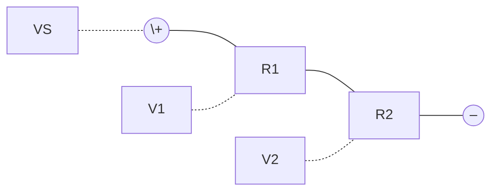

- **સૂત્ર**: V₁ = VS × (R₁/(R₁+R₂))
- **ઉપયોગ**: સિરીઝ ઘટકો પરના વ્યક્તિગત વોલ્ટેજ ડ્રોપ્સ શોધવા માટે વપરાય છે

**કરંટ ડિવિઝન નિયમ**: પેરેલલ સર્કિટમાં, કોઈપણ શાખામાંથી પસાર થતો કરંટ તેના રેઝિસ્ટન્સના વ્યસ્ત પ્રમાણમાં હોય છે.

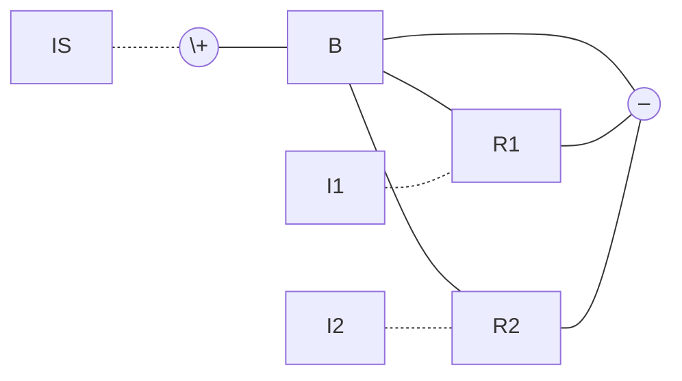

- **સૂત્ર**: I₁ = IS × (R₂/(R₁+R₂))
- **મુખ્ય સિદ્ધાંત**: કરંટ ઓછા રેઝિસ્ટન્સનો માર્ગ પસંદ કરે છે

**મેમરી ટ્રીક:** "VoSe CuPa: Voltage divides in Series, Current divides in Parallel"

## પ્રશ્ન 1(ક) [7 ગુણ]

**Fig. (૧) માં બતાવેલ નેટવર્ક માટે ગ્રાફ અને ટ્રી દોરો. ગ્રાફ પર લિંક કરંટ બતાવો. સાથે ટ્રી માટે ટાઇ-સેટ સેડ્યુલ લખો.**

**ઉત્તર**:

**નેટવર્કનો ગ્રાફ**:

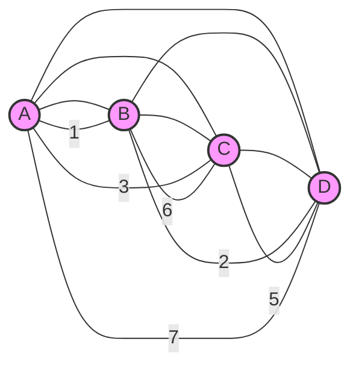

**નેટવર્કનું ટ્રી** (બોલ્ડ એજ સાથે બતાવેલ):

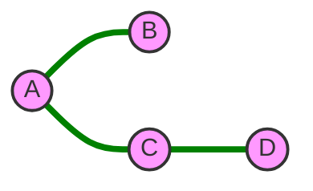

**લિંક કરંટ** (બાકીની શાખાઓ પર બતાવેલ જે ટ્રીનો ભાગ નથી):

- લિંક 1: શાખા 2 (BD)
- લિંક 2: શાખા 6 (BC)
- લિંક 3: શાખા 7 (AD)
- લિંક 4: શાખા 5 (CD)

**ટાઇ-સેટ સેડ્યુલ**:

| લિંક/ટ્રી શાખા | શાખા 1 (AB) | શાખા 3 (AC) | શાખા 4 (CD) | શાખા 2 (BD) | શાખા 6 (BC) | શાખા 7 (AD) | શાખા 5 (CD) |
|------------------|---------------|---------------|---------------|---------------|---------------|---------------|---------------|
| લિંક 1 (BD)      | 1            | 0             | 0             | 1             | 0             | 0             | 0             |
| લિંક 2 (BC)      | 1            | 1             | 0             | 0             | 1             | 0             | 0             |
| લિંક 3 (AD)      | 0            | 0             | 1             | 0             | 0             | 1             | 0             |
| લિંક 4 (CD)      | 0            | 0             | 1             | 0             | 0             | 0             | 1             |

**મેમરી ટ્રીક:** "TGLT: Trees Generate Link-current Tie-sets"

## પ્રશ્ન 1(ક) OR [7 ગુણ]

**Fig. (૧) માં બતાવેલ નેટવર્ક માટે ગ્રાફ અને ટ્રી દોરો. ટ્રી પર બ્રાંચ વોલ્ટેજ બતાવો. સાથે ટ્રી માટે કટ-સેટ સેડ્યુલ લખો.**

**ઉત્તર**:

**નેટવર્કનો ગ્રાફ**:


**નેટવર્કનું ટ્રી** (બોલ્ડ એજ સાથે બતાવેલ અને બ્રાંચ વોલ્ટેજ સાથે):

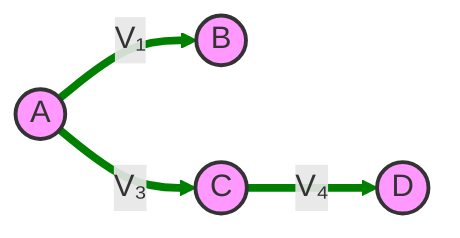

**કટ-સેટ સેડ્યુલ**:

| કટ-સેટ/શાખા | શાખા 1 (AB) | શાખા 3 (AC) | શાખા 4 (CD) | શાખા 2 (BD) | શાખા 6 (BC) | શાખા 7 (AD) | શાખા 5 (CD) |
|----------------|---------------|---------------|---------------|---------------|---------------|---------------|---------------|
| કટ-સેટ 1 (AB) | 1            | 0             | 0             | -1            | -1            | 0             | 0             |
| કટ-સેટ 2 (AC) | 0            | 1             | 0             | 0             | 1             | -1            | 0             |
| કટ-સેટ 3 (CD) | 0            | 0             | 1             | 1             | 0             | 1             | 1             |

**મેમરી ટ્રીક:** "CGVS: Cut-sets Generate Voltage Sources"

## પ્રશ્ન 2(અ) [3 ગુણ]

**વ્યાખ્યા આપો: ૧) એક્ટિવ અને પેસિવ નેટ્વર્ક ૨) યુનિલેટરલ અને બાઇ-લેટરલ નેટવર્ક.**

**ઉત્તર**:

- **એક્ટિવ નેટવર્ક**: એવું નેટવર્ક જેમાં એક કે વધારે EMF સ્રોત (વોલ્ટેજ/કરંટ સ્રોત) હોય જે સર્કિટને ઊર્જા પૂરી પાડે છે.
- **પેસિવ નેટવર્ક**: એવું નેટવર્ક જેમાં માત્ર પેસિવ તત્વો જેવા કે રેઝિસ્ટર, કેપેસિટર અને ઇન્ડક્ટર હોય, કોઈ ઊર્જા સ્રોત ન હોય.

- **યુનિલેટરલ નેટવર્ક**: એવું નેટવર્ક જેમાં ઇનપુટ અને આઉટપુટ ટર્મિનલ્સ બદલવાથી તેની પ્રોપર્ટી અને પરફોર્મન્સ બદલાય છે.
- **બાઇલેટરલ નેટવર્ક**: એવું નેટવર્ક જેમાં ઇનપુટ અને આઉટપુટ ટર્મિનલ્સ બદલવાથી તેની પ્રોપર્ટી અને પરફોર્મન્સ સમાન રહે છે.

**આકૃતિ**:
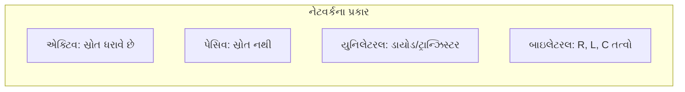

**મેમરી ટ્રીક:** "APUB: Active Provides energy, Unilateral Blocks reversal"

## પ્રશ્ન 2(બ) [4 ગુણ]

**Z પેરામિટર માટે સમીકરણ લખો અને Z11, Z12, Z21, Z22 એ સમીકરણો પરથી તારવો.**

**ઉત્તર**:

Z-પેરામિટર્સ બે-પોર્ટ નેટવર્કમાં પોર્ટ વોલ્ટેજ અને કરંટ વચ્ચેનો સંબંધ વ્યાખ્યાયિત કરે છે:

**સમીકરણો**:

- V₁ = Z₁₁I₁ + Z₁₂I₂
- V₂ = Z₂₁I₁ + Z₂₂I₂

**તારણ**:

- **Z₁₁ = V₁/I₁** (I₂ = 0 સાથે): આઉટપુટ પોર્ટ ઓપન-સર્કિટ હોય ત્યારે ઇનપુટ ઇમ્પીડન્સ
- **Z₁₂ = V₁/I₂** (I₁ = 0 સાથે): ઇનપુટ પોર્ટ ઓપન-સર્કિટ હોય ત્યારે રિવર્સ ટ્રાન્સફર ઇમ્પીડન્સ
- **Z₂₁ = V₂/I₁** (I₂ = 0 સાથે): આઉટપુટ પોર્ટ ઓપન-સર્કિટ હોય ત્યારે ફોરવર્ડ ટ્રાન્સફર ઇમ્પીડન્સ
- **Z₂₂ = V₂/I₂** (I₁ = 0 સાથે): ઇનપુટ પોર્ટ ઓપન-સર્કિટ હોય ત્યારે આઉટપુટ ઇમ્પીડન્સ

**મેમરી ટ્રીક:** "Z Impedance: Open circuit gives correct Parameters"

## પ્રશ્ન 2(ક) [7 ગુણ]

**સ્ટાન્ડર્ડ T નેટવર્ક માટે કેરક્ટરિસ્ટિક ઇમ્પિડન્સ (ZOT) નુ સમીકરણ તારવો.**

**ઉત્તર**:

સ્ટાન્ડર્ડ T-નેટવર્ક માટે:

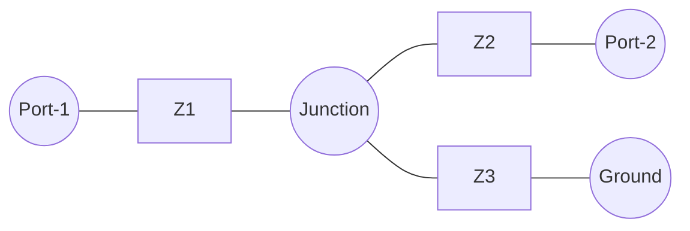

**તારણના પગલાં**:

1. સિમેટ્રિક T-નેટવર્ક માટે, Z₁ = Z₂
2. મેચ્ડ કન્ડિશન હેઠળ, ઇનપુટ ઇમ્પિડન્સ કેરેક્ટરિસ્ટિક ઇમ્પિડન્સ બરાબર હોય
3. Z₀ₜ = Z₁ + (Z₁×Z₃)/(Z₁ + Z₃)
4. બેલેન્સ્ડ T-નેટવર્ક જ્યાં Z₁ = Z₂ = Z/2 અને Z₃ = Z માટે:
5. Z₀ₜ = Z/2 + (Z/2×Z)/(Z/2 + Z)
6. Z₀ₜ = Z/2 + (Z²/2)/(Z + Z/2)
7. Z₀ₜ = Z/2 + (Z²/2)/(3Z/2)
8. Z₀ₜ = Z/2 + Z²/3Z
9. Z₀ₜ = Z/2 + Z/3
10. Z₀ₜ = (3Z + 2Z)/6
11. Z₀ₜ = √(Z₁(Z₁ + 2Z₃))

**અંતિમ સમીકરણ**: Z₀ₜ = √(Z₁(Z₁ + 2Z₃))

**મેમરી ટ્રીક:** "TO Impedance: Two arms Over middle branch"

## પ્રશ્ન 2(અ) OR [3 ગુણ]

**વ્યાખ્યા આપો. ૧) ડ્રાઇવીંગ પોઇંટ ઇમ્પીડન્સ ૨) ટ્રાન્સફર ઇમ્પીડન્સ**

**ઉત્તર**:

- **ડ્રાઇવિંગ પોઇંટ ઇમ્પીડન્સ**: જ્યારે અન્ય બધા સ્વતંત્ર સ્રોત શૂન્ય પર સેટ હોય ત્યારે સમાન પોર્ટ/ટર્મિનલના જોડા પર વોલ્ટેજ અને કરંટનો ગુણોત્તર.

- **ટ્રાન્સફર ઇમ્પીડન્સ**: જ્યારે અન્ય બધા સ્વતંત્ર સ્રોત શૂન્ય પર સેટ હોય ત્યારે એક પોર્ટ પર વોલ્ટેજ અને બીજા પોર્ટ પર કરંટનો ગુણોત્તર.

**આકૃતિ**:
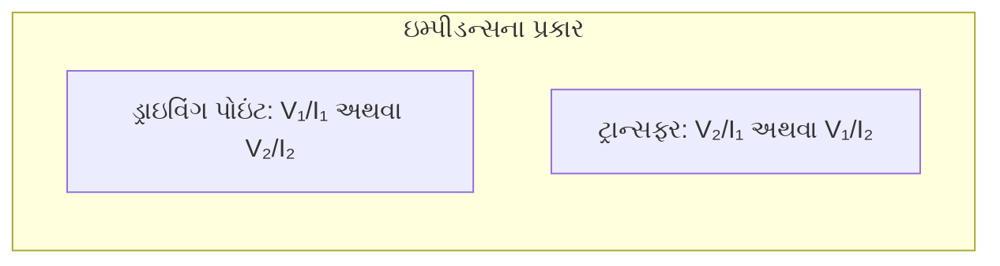

**મેમરી ટ્રીક:** "DTSS: Driving at Terminal Same, Transfer at Separate"

## પ્રશ્ન 2(બ) OR [4 ગુણ]

**કિર્ચોફનો વોલ્ટેજ લો ઉદાહરણ સાથે સમજાવો.**

**ઉત્તર**:

**કિર્ચોફનો વોલ્ટેજ લો (KVL)**: સર્કિટમાં કોઈપણ બંધ લૂપની આસપાસના તમામ વોલ્ટેજનો અલજેબ્રાઇક સરવાળો શૂન્ય હોય છે.

**ગણિતમાં**: ∑V = 0 (બંધ લૂપ આસપાસ)

**સર્કિટ ઉદાહરણ**:

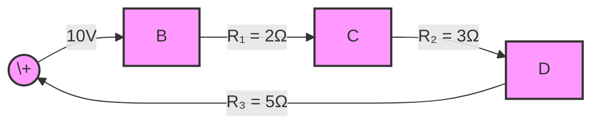

જો I = 1A, તો:

- V₁ = 1A × 2Ω = 2V
- V₂ = 1A × 3Ω = 3V
- V₃ = 1A × 5Ω = 5V

KVL લાગુ કરતાં: 10V - 2V - 3V - 5V = 0 ✓

**મેમરી ટ્રીક:** "VACZ: Voltages Around Closed loop are Zero"

## પ્રશ્ન 2(ક) OR [7 ગુણ]

**Π નેટવર્ક માથી T નેટવર્ક મા બદલવાના સમીકણ તારવો.**

**ઉત્તર**:

**π નેટવર્કને T નેટવર્કમાં રૂપાંતરણ**:

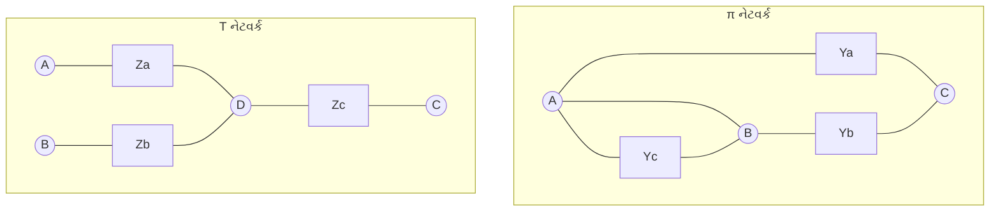

**રૂપાંતરણ સમીકરણો**:

1. Za = (Ya × Yc) / Y∆
2. Zb = (Yb × Yc) / Y∆
3. Zc = (Ya × Yb) / Y∆

જ્યાં Y∆ = Ya + Yb + Yc

**તારણ**:

1. π-નેટવર્કના Y-પેરામિટર્સથી શરૂઆત કરો
2. શાખા એડમિટન્સના સંદર્ભમાં Y-પેરામિટર્સને વ્યક્ત કરો
3. મેટ્રિક્સ ઇન્વર્ઝનનો ઉપયોગ કરીને Z-પેરામિટર્સમાં રૂપાંતરિત કરો
4. Z-પેરામિટર્સના સંદર્ભમાં T-નેટવર્ક ઇમ્પિડન્સને વ્યક્ત કરો
5. સરળ બનાવીને ઉપરના રૂપાંતરણ સૂત્રો મેળવો

**મેમરી ટ્રીક:** "PIE to TEA: Product over sum for opposite branch"

## પ્રશ્ન 3(અ) [3 ગુણ]

**કિર્ચોફનો કરંટ લો ઉદાહરણ સાથે સમજાવો.**

**ઉત્તર**:

**કિર્ચોફનો કરંટ લો (KCL)**: કોઈપણ નોડમાં પ્રવેશતા અને છોડતા તમામ કરંટનો અલજેબ્રાઇક સરવાળો શૂન્ય હોવો જોઈએ.

**ગણિતમાં**: ∑I = 0 (કોઈપણ નોડ પર)

**સર્કિટ ઉદાહરણ**:

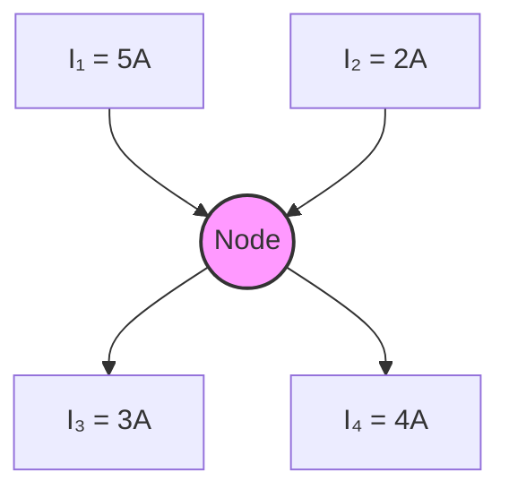

નોડ B પર KCL લાગુ કરતાં:

- પ્રવેશતા કરંટ: I₁ + I₂ = 5A + 2A = 7A
- છોડતા કરંટ: I₃ + I₄ = 3A + 4A = 7A
- તેથી: I₁ + I₂ - I₃ - I₄ = 5 + 2 - 3 - 4 = 0 ✓

**મેમરી ટ્રીક:** "CuNoZ: Currents at Node are Zero"

## પ્રશ્ન 3(બ) [4 ગુણ]

**જરુરી સમીકરણો સાથે મેશ એનાલિસિસ સમજાવો.**

**ઉત્તર**:

**મેશ એનાલિસિસ**: એક સર્કિટ એનાલિસિસ તકનીક જે મલ્ટિપલ લૂપ્સ વાળી સર્કિટને ઉકેલવા માટે મેશ કરંટ્સનો ઉપયોગ કરે છે.

**પગલાં**:

1. સર્કિટમાં બધા મેશ (બંધ લૂપ) ઓળખો
2. દરેક મેશને મેશ કરંટ સોંપો
3. દરેક મેશ પર KVL લાગુ કરો
4. પરિણામી સમીકરણ સિસ્ટમને ઉકેલો

**ઉદાહરણ સર્કિટ**:

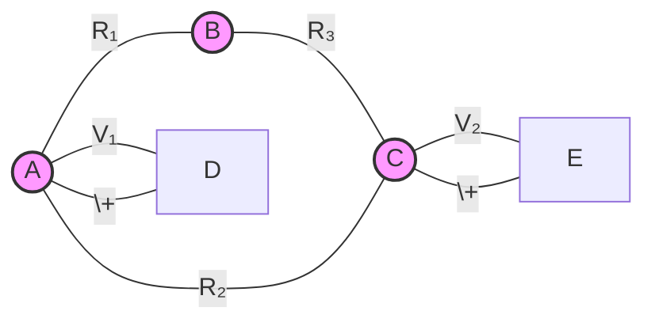

**સમીકરણો**:

- મેશ 1: V₁ = I₁R₁ + I₁R₂ - I₂R₂
- મેશ 2: V₂ = I₂R₂ + I₂R₃ - I₁R₂

**મેમરી ટ્રીક:** "MILK: Mesh Is Loop with KVL"

## પ્રશ્ન 3(ક) [7 ગુણ]

**થીવીનીન નો થીયરમ લખો અને સમજાવો.**

**ઉત્તર**:

**થીવીનીનનો સિદ્ધાંત**: કોઈપણ લીનીયર નેટવર્ક જેમાં વોલ્ટેજ અને કરંટ સ્રોત હોય તેને એક વોલ્ટેજ સ્રોત (VTH) અને એક રેઝિસ્ટન્સ (RTH) સીરીઝમાં ધરાવતા તુલ્ય સર્કિટ દ્વારા બદલી શકાય છે.

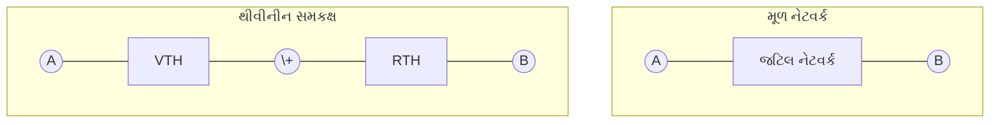

**થીવીનીન સમકક્ષ શોધવાના પગલાં**:

1. જે ટર્મિનલ માટે સમકક્ષ શોધવાની છે તેમાંથી લોડ દૂર કરો
2. આ ટર્મિનલ્સ વચ્ચે ઓપન-સર્કિટ વોલ્ટેજ (VOC) ગણો (= VTH)
3. તમામ સ્રોતોને તેમના આંતરિક રેઝિસ્ટન્સ દ્વારા બદલીને સર્કિટમાં પાછા જોતા રેઝિસ્ટન્સ ગણો (= RTH)
4. થીવીનીન સમકક્ષ VTH અને RTH સીરીઝમાં ધરાવે છે

**ઉદાહરણ ઍપ્લિકેશન**:

- લોડ RL સાથે મૂળ જટિલ સર્કિટ
- RL દૂર કરો અને VOC = VTH શોધો
- સ્રોતોને નિષ્ક્રિય કરો અને RTH શોધો
- સરળીકૃત થીવીનીન સમકક્ષ સાથે RL ફરીથી જોડો

**મેમરી ટ્રીક:** "TORV: Thevenin's Open-circuit Resistance and Voltage"

## પ્રશ્ન 3(અ) OR [3 ગુણ]

**રેસિપ્રોસિટી થીયરમ લખો અને સમજાવો.**

**ઉત્તર**:

**રેસિપ્રોસિટી સિદ્ધાંત**: એક લીનિયર, બાઇલેટરલ નેટવર્કમાં, જો એક શાખામાં વોલ્ટેજ સ્રોત બીજી શાખામાં કરંટ ઉત્પન્ન કરે છે, તો તે જ વોલ્ટેજ સ્રોત, જો બીજી શાખામાં મૂકવામાં આવે, તો તે પ્રથમ શાખામાં સમાન કરંટ ઉત્પન્ન કરશે.

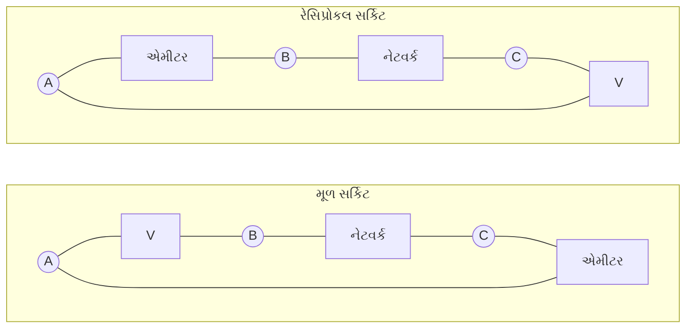

**ગણિતમાં**: જો શાખા 1માં વોલ્ટેજ V₁ શાખા 2માં કરંટ I₂ ઉત્પન્ન કરે છે, તો શાખા 2માં વોલ્ટેજ V₁ શાખા 1માં કરંટ I₂ ઉત્પન્ન કરશે.

**મર્યાદાઓ**: ફક્ત નીચેના લક્ષણો ધરાવતા નેટવર્ક માટે લાગુ પડે છે:

- લીનિયર તત્વો
- બાઇલેટરલ તત્વો (ડાયોડ, ટ્રાન્ઝિસ્ટર નહીં)
- એક સ્વતંત્ર સ્રોત

**મેમરી ટ્રીક:** "RESWAP: REciprocity SWAPs Position with identical results"

## પ્રશ્ન 3(બ) OR [4 ગુણ]

**જરુરી સમિકરણો સાથે નોડલ એનાલિસિસ સમજાવો.**

**ઉત્તર**:

**નોડલ એનાલિસિસ**: એક સર્કિટ એનાલિસિસ તકનીક જે સર્કિટ ઉકેલવા માટે નોડ વોલ્ટેજનો ઉપયોગ કરે છે.

**પગલાં**:

1. રેફરન્સ નોડ (ગ્રાઉન્ડ) પસંદ કરો
2. બાકીના નોડ્સને વોલ્ટેજ વેરિયેબલ સોંપો
3. દરેક નોન-રેફરન્સ નોડ પર KCL લાગુ કરો
4. પરિણામી સમીકરણ સિસ્ટમને ઉકેલો

**ઉદાહરણ સર્કિટ**:

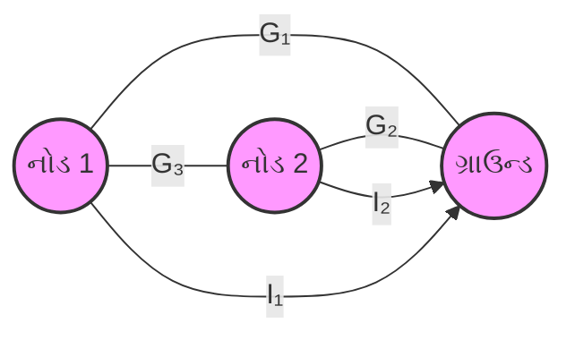

**સમીકરણો**:

- નોડ 1: I₁ = V₁G₁ + (V₁-V₂)G₃
- નોડ 2: I₂ = V₂G₂ + (V₂-V₁)G₃

**મેમરી ટ્રીક:** "NKCV: Nodal uses KCL with Voltage variables"

## પ્રશ્ન 3(ક) OR [7 ગુણ]

**મેક્સિમમ પાવર ટ્રાન્સફર થીયરમ લખો અને સમજાવો.**

**ઉત્તર**:

**મહત્તમ પાવર ટ્રાન્સફર સિદ્ધાંત**: એક સ્રોત સાથે જોડાયેલ લોડ મહત્તમ પાવર ત્યારે મેળવશે જ્યારે તેનો રેઝિસ્ટન્સ સ્રોતના આંતરિક રેઝિસ્ટન્સ બરાબર હોય.

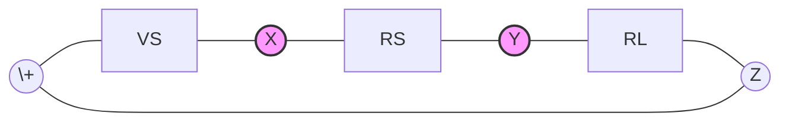

**પ્રમાણ**:

1. સર્કિટમાં કરંટ: I = VS/(RS + RL)
2. લોડમાં પહોંચતો પાવર: P = I²RL = (VS²RL)/(RS + RL)²
3. મહત્તમ પાવર માટે, dP/dRL = 0
4. ઉકેલતાં: (VS²(RS + RL)² - VS²RL·2(RS + RL))/(RS + RL)⁴ = 0
5. સરળ કરતાં: (RS + RL)² = 2RL(RS + RL)
6. વધુ સરળ કરતાં: RS + RL = 2RL
7. તેથી: RS = RL

**મહત્તમ પાવર**: Pmax = VS²/(4RS)

**મેમરી ટ્રીક:** "MaRLRS: Maximum power when load Resistance equals Source Resistance"

## પ્રશ્ન 4(અ) [3 ગુણ]

**શા માટે સિરિઝ રેઝોનંસ સર્કિટ વોલ્ટેજ એમ્પ્લિફાયર અને પેરેલલ રેઝોનંસ સર્કિટ કરંટ એમ્પ્લિફાયર તરીકે વર્તે છે?**

**ઉત્તર**:

**સિરીઝ રેઝોનન્સ વોલ્ટેજ એમ્પ્લિફાયર તરીકે**:

- રેઝોનન્સ પર, સિરીઝ સર્કિટ ઇમ્પીડન્સ ન્યૂનતમ (માત્ર R) હોય છે
- L અથવા C પરનો વોલ્ટેજ સ્રોત વોલ્ટેજ કરતાં ઘણો વધારે હોઈ શકે
- વોલ્ટેજ મેગ્નિફિકેશન ફેક્ટર = Q = XL/R = 1/R√(L/C)
- L અથવા C પરનો વોલ્ટેજ = Q × સ્રોત વોલ્ટેજ

**પેરેલલ રેઝોનન્સ કરંટ એમ્પ્લિફાયર તરીકે**:

- રેઝોનન્સ પર, પેરેલલ સર્કિટ ઇમ્પીડન્સ મહત્તમ હોય છે
- L અથવા C માંથી પસાર થતો કરંટ સ્રોત કરંટ કરતાં ઘણો વધારે હોઈ શકે
- કરંટ મેગ્નિફિકેશન ફેક્ટર = Q = R/XL = R√(C/L)
- L અથવા C માંથી પસાર થતો કરંટ = Q × સ્રોત કરંટ

**કોષ્ટક**:

| સર્કિટ પ્રકાર | રેઝોનન્સ પર ઇમ્પીડન્સ | એમ્પ્લિફિકેશન |
|--------------|------------------------|---------------|
| સિરીઝ         | ન્યૂનતમ (માત્ર R)     | વોલ્ટેજ (VL અથવા VC = Q×VS) |
| પેરેલલ       | મહત્તમ (R²/r)        | કરંટ (IL અથવા IC = Q×IS) |

**મેમરી ટ્રીક:** "SeVoPa: Series Voltage, Parallel current amplification"

## પ્રશ્ન 4(બ) [4 ગુણ]

**કોઇલ ના Q નુ સમીકરણ તારવો.**

**ઉત્તર**:

**કોઇલનો Q-ફેક્ટર**:

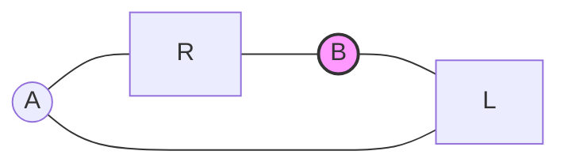

**તારણ**:

1. Q-ફેક્ટર વ્યાખ્યાયિત: Q = સ્ટોર થયેલી ઊર્જા / પ્રતિ સાયકલ વેડફાયેલી ઊર્જા
2. ઇન્ડક્ટરમાં સંગ્રહિત ઊર્જા = (1/2)LI²
3. રેઝિસ્ટરમાં વેડફાયેલી પાવર = I²R
4. પ્રતિ સાયકલ વેડફાયેલી ઊર્જા = પાવર × સમય અવધિ = I²R × (1/f)
5. તેથી: Q = ((1/2)LI²) / (I²R × (1/f))
6. સરળ કરતાં: Q = 2π × (1/2)LI² × f / (I²R)
7. Q = 2πf × L / R = ωL / R

**અંતિમ સમીકરણ**: Q = ωL / R = 2πfL / R = XL / R

**મેમરી ટ્રીક:** "QualityEDR: Quality equals Energy stored Divided by energy lost per Radian"

## પ્રશ્ન 4(ક) [7 ગુણ]

**સિરિઝ R-L-C સર્કિટ માટે સિરિઝ રેઝોનંસ ફ્રિક્વંસી નુ સમીકરણ તારવો.**

**ઉત્તર**:

**સિરીઝ R-L-C સર્કિટ**:

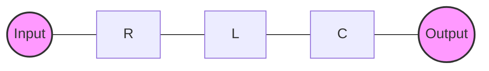

**તારણ**:

1. સિરીઝ RLC સર્કિટની ઇમ્પીડન્સ: Z = R + j(XL - XC)
2. જ્યાં: XL = ωL અને XC = 1/ωC
3. રેઝોનન્સ પર, XL = XC (ઇન્ડક્ટિવ અને કેપેસિટિવ રિએક્ટન્સ સમાન હોય છે)
4. તેથી: ωL = 1/ωC
5. ω માટે ઉકેલતાં: ω² = 1/LC
6. રેઝોનન્ટ ફ્રિક્વન્સી: ω₀ = 1/√(LC)
7. ફ્રિક્વન્સી f ના સંદર્ભમાં: f₀ = 1/(2π√(LC))

**રેઝોનન્સ પર લક્ષણો**:

- ઇમ્પીડન્સ ન્યૂનતમ (સંપૂર્ણ રેઝિસ્ટિવ: Z = R)
- કરંટ મહત્તમ (I = V/R)
- પાવર ફેક્ટર એકમ (સર્કિટ રેઝિસ્ટિવ લાગે છે)
- L અને C પરના વોલ્ટેજ સમાન અને વિપરીત હોય છે

**મેમરી ટ્રીક:** "RES: Reactances Equal at Series resonance"

## પ્રશ્ન 4(અ) OR [3 ગુણ]

**કપલ્ડ સર્કિટ શુ છે? સેલ્ફ ઇંડક્ટંસ અને મ્યુચ્યુઅલ ઇંદક્ટંસ ની વ્યાખ્યા આપો.**

**ઉત્તર**:

**કપલ્ડ સર્કિટ્સ**: બે અથવા વધુ સર્કિટ્સ જે મેગ્નેટિક રીતે જોડાયેલી હોય, જેથી તેમની પરસ્પર મેગ્નેટિક ફીલ્ડ દ્વારા ઊર્જા એકમાંથી બીજામાં ટ્રાન્સફર થઈ શકે.

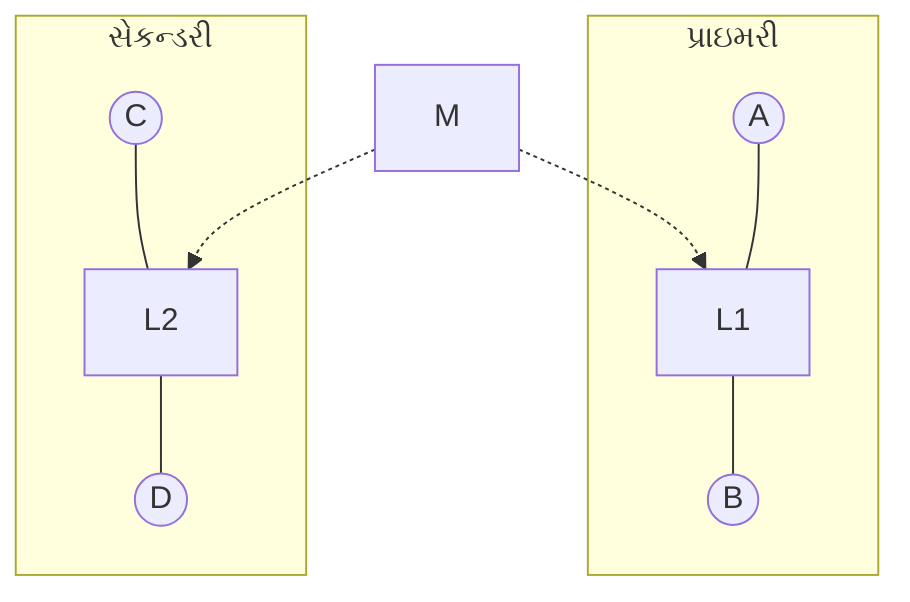

**સેલ્ફ-ઇન્ડક્ટન્સ (L)**: એક સર્કિટનો ગુણધર્મ જેના દ્વારા કરંટમાં ફેરફારથી તે જ સર્કિટમાં સેલ્ફ-ઇન્ડ્યુસ્ડ EMF ઉત્પન્ન થાય છે.
L = Φ/I (મેગ્નેટિક ફ્લક્સનો તેને ઉત્પન્ન કરતા કરંટ સાથેનો ગુણોત્તર)

**મ્યુચ્યુઅલ ઇન્ડક્ટન્સ (M)**: એક સર્કિટનો ગુણધર્મ જેના દ્વારા એક સર્કિટમાં કરંટમાં ફેરફારથી બીજી સર્કિટમાં EMF ઇન્ડ્યુસ કરે છે.
M = Φ₂₁/I₁ (સર્કિટ 1 માં કરંટને કારણે સર્કિટ 2 માં ફ્લક્સનો ગુણોત્તર)

**મેમરી ટ્રીક:** "SiMu: Self in Mine, Mutual in Yours"

## પ્રશ્ન 4(બ) OR [4 ગુણ]

**કો-એફિસિઅંટ ઓફ કપલિંગ(K) નુ સમીકરણ તારવો.**

**ઉત્તર**:

**કપલિંગનો ગુણાંક (k)**:

```mermaid
graph LR
    subgraph "કપલ્ડ કોઇલ્સ"
    A((A)) --- B[L1] --- C((B))
    D((C)) --- E[L2] --- F((D))
    G[M] -.-> B
    G -.-> E
    end
```

**તારણ**:

1. બે કોઇલ્સ વચ્ચેનો મ્યુચ્યુઅલ ઇન્ડક્ટન્સ (M) આના પર આધારિત છે:
   - કોઇલ્સનો સેલ્ફ-ઇન્ડક્ટન્સ (L₁ અને L₂)
   - ભૌતિક ગોઠવણ (નજીકતા અને દિશા)
2. મહત્તમ શક્ય મ્યુચ્યુઅલ ઇન્ડક્ટન્સ: Mₘₐₓ = √(L₁L₂)
3. કપલિંગનો ગુણાંક વ્યાખ્યાયિત: k = M/Mₘₐₓ
4. તેથી: k = M/√(L₁L₂)

**લક્ષણો**:

- k ની રેન્જ 0 (કોઈ કપલિંગ નહીં) થી 1 (પૂર્ણ કપલિંગ) સુધી
- k ભૂમિતિ, દિશાનિર્દેશન અને માધ્યમ પર આધારિત છે
- સામાન્ય ટ્રાન્સફોર્મર: k = 0.95 થી 0.99
- એર-કોર કોઇલ્સ: k = 0.01 થી 0.5

**મેમરી ટ્રીક:** "KMutual: K Measures Mutual linkage proportion"

## પ્રશ્ન 4(ક) OR [7 ગુણ]

**સિરિઝા RLC સર્કિટ મા R=30Ω, L=0.5H, અને C=5µF છે. (૧) સિરિઝ રેઝોનંસ ફ્રિલક્વંસિ (૨) Q ફેક્ટર (૩)BW ની ગણતરી કરો.**

**ઉત્તર**:

**આપેલ**:

- રેઝિસ્ટન્સ, R = 30Ω
- ઇન્ડક્ટન્સ, L = 0.5H
- કેપેસિટન્સ, C = 5µF = 5×10⁻⁶F

**ગણતરી**:

**(૧) સિરીઝ રેઝોનન્સ ફ્રિક્વન્સી**:

- f₀ = 1/(2π√(LC))
- f₀ = 1/(2π√(0.5 × 5×10⁻⁶))
- f₀ = 1/(2π√(2.5×10⁻⁶))
- f₀ = 1/(2π × 1.58×10⁻³)
- f₀ = 1/(9.9×10⁻³)
- f₀ = 100.76 Hz
- f₀ ≈ 100 Hz

**(૨) Q ફેક્ટર**:

- Q = (1/R)√(L/C)
- Q = (1/30)√(0.5/(5×10⁻⁶))
- Q = (1/30)√(100,000)
- Q = (1/30) × 316.23
- Q = 10.54

**(૩) બેન્ડવિડ્થ (BW)**:

- BW = f₀/Q
- BW = 100.76/10.54
- BW = 9.56 Hz

**કોષ્ટક**:

| પેરામીટર | સૂત્ર | મૂલ્ય |
|-----------|---------|-------|
| રેઝોનન્ટ ફ્રિક્વન્સી (f₀) | 1/(2π√(LC)) | 100 Hz |
| ક્વોલિટી ફેક્ટર (Q) | (1/R)√(L/C) | 10.54 |
| બેન્ડવિડ્થ (BW) | f₀/Q | 9.56 Hz |

**મેમરી ટ્રીક:** "RQB: Resonance Quality determines Bandwidth"

## પ્રશ્ન 5(અ) [3 ગુણ]

**એટેન્યુટર નુ વર્ગીકરણ કરો.**

**ઉત્તર**:

**એટેન્યુએટર્સ**: રેઝિસ્ટર્સનું નેટવર્ક જે વિકૃતિ વિના સિગ્નલ લેવલને ઘટાડવા (એટેન્યુએટ) માટે ડિઝાઇન કરવામાં આવે છે.

**એટેન્યુએટર્સના પ્રકાર**:

```mermaid
graph TD
    A[એટેન્યુએટર્સ] --> B[ફિક્સ્ડ એટેન્યુએટર્સ]
    A --> C[વેરિએબલ એટેન્યુએટર્સ]
    B --> D[T-પ્રકાર]
    B --> E[π-પ્રકાર]
    B --> F[બ્રિજ્ડ-T]
    B --> G[લેટિસ]
    C --> H[સ્ટેપ એટેન્યુએટર્સ]
    C --> I[કન્ટિન્યુઅસલી વેરિએબલ]
```

કોન્ફિગરેશન આધારિત:

- **T-પ્રકાર**: ત્રણ રેઝિસ્ટર T-આકારની કોન્ફિગરેશન
- **π-પ્રકાર**: ત્રણ રેઝિસ્ટર π-આકારની કોન્ફિગરેશન
- **બ્રિજ્ડ-T**: T-પ્રકાર સાથે એક રેઝિસ્ટર આરપાર જોડાય
- **લેટિસ**: ચાર રેઝિસ્ટર્સ સાથે બેલેન્સ્ડ કોન્ફિગરેશન

સિમેટ્રી આધારિત:

- **સિમેટ્રિકલ**: સમાન ઈનપુટ અને આઉટપુટ ઇમ્પીડન્સ
- **અસિમેટ્રિકલ**: અલગ ઈનપુટ અને આઉટપુટ ઇમ્પીડન્સ

**મેમરી ટ્રીક:** "ATP Fixed: Attenuator Types include Pad, Tee, Lattice"

## પ્રશ્ન 5(બ) [4 ગુણ]

**એટેન્યુએશન અને નેપર વચ્ચેનો સંબંધ તારવો.**

**ઉત્તર**:

**એટેન્યુએશન અને નેપર વચ્ચેનો સંબંધ**:

- **એટેન્યુએશન (α)**: ઇનપુટ વોલ્ટેજ (અથવા કરંટ)નો આઉટપુટ વોલ્ટેજ (અથવા કરંટ) સાથેનો ગુણોત્તર, વિવિધ એકમોમાં વ્યક્ત.

- **નેપર (Np)**: ગુણોત્તરનો નેચરલ લોગેરિધમિક એકમ, મુખ્યત્વે ટ્રાન્સમિશન લાઇન થિયરીમાં વપરાય છે.

**તારણ**:

1. વોલ્ટેજ ગુણોત્તર V₁/V₂ માટે:
   - નેપરમાં એટેન્યુએશન = ln(V₁/V₂)
   - ડેસિબલમાં એટેન્યુએશન = 20log₁₀(V₁/V₂)

2. પાવર ગુણોત્તર P₁/P₂ માટે:
   - નેપરમાં એટેન્યુએશન = (1/2)ln(P₁/P₂)
   - ડેસિબલમાં એટેન્યુએશન = 10log₁₀(P₁/P₂)

3. dB અને નેપર વચ્ચેનો સંબંધ:
   - 1 નેપર = 8.686 dB
   - 1 dB = 0.115 નેપર

**કોષ્ટક**:

| એકમ | વોલ્ટેજ ગુણોત્તર | પાવર ગુણોત્તર |
|------|---------------|-------------|
| નેપર (Np) | ln(V₁/V₂) | (1/2)ln(P₁/P₂) |
| ડેસિબલ (dB) | 20log₁₀(V₁/V₂) | 10log₁₀(P₁/P₂) |

**મેમરી ટ્રીક:** "NED: Neper Equals Decibel divided by 8.686"

## પ્રશ્ન 5(ક) [7 ગુણ]

**સિમેટ્રિકલ T એટેન્યુએટર માટે R1 અને R2 ના સમીકરણો તારવો.**

**ઉત્તર**:

**સિમેટ્રિકલ T એટેન્યુએટર**:

```mermaid
graph LR
    A((Input)) --- B[R1] --- C((Junction))
    C --- D[R1] --- E((Output))
    C --- F[R2] --- G((Ground))
    style A fill:#f9f,stroke:#333,stroke-width:2px
    style E fill:#f9f,stroke:#333,stroke-width:2px
    style C fill:#f9f,stroke:#333,stroke-width:2px
```

**તારણ**:

1. કેરેક્ટરિસ્ટિક ઇમ્પીડન્સ Z₀ સાથેના સિમેટ્રિકલ T-એટેન્યુએટર માટે:
   - ઇનપુટ અને આઉટપુટ ઇમ્પીડન્સ બંને Z₀ બરાબર હોવા જોઈએ
   - એટેન્યુએશન રેશિયો N = V₁/V₂ = I₂/I₁

2. સર્કિટ એનાલિસિસથી:
   - Z₀ = R₁ + (R₂(R₁))/(R₂+R₁)
   - N = (R₁ + R₂ + R₁)/R₂ = (2R₁+R₂)/R₂

3. R₁ અને R₂ માટે ઉકેલ:
   - R₁ = Z₀(N-1)/(N+1)
   - R₂ = 2Z₀N/(N²-1)

4. dB (α) માં એટેન્યુએશન માટે:
   - N = 10^(α/20)
   - R₁ = Z₀·tanh(α/2)
   - R₂ = Z₀/sinh(α)

**અંતિમ સમીકરણો**:

- R₁ = Z₀(N-1)/(N+1)
- R₂ = 2Z₀N/(N²-1)

**મેમરી ટ્રીક:** "TSR: T-attenuator Symmetry Requires equal R1 values"

## પ્રશ્ન 5(અ) OR [3 ગુણ]

**સિમેટ્રિકલ બિ્રજ T અને સિમેટ્રિકલ લેટિસ એટેન્યુએટર ની સર્કિટ દોરો.**

**ઉત્તર**:

**સિમેટ્રિકલ બ્રિજ-T એટેન્યુએટર**:

```goat
                R1
   A o--------/\/\/\--------o B
              |      |
              |      |
              \      /
              /  R3  \
       R2     \      /
   o---/\/\/\--+     +----o
   |                      |
   o----------------------o
   C                      D
```

**સિમેટ્રિકલ લેટિસ એટેન્યુએટર**:

```goat
           R1
   A o----/\/\/\----o B
      \            /
       \          /
        \        /
     R2  \      / R2
          \    /
           \  /
            \/
            /\
           /  \
          /    \
         /      \
    R1  /        \
     C o--\/\/\/--o D
```

**લક્ષણો**:

1. **બ્રિજ-T**: T અને π એટેન્યુએટર્સની વિશેષતાઓ સંયોજિત કરે છે, ઉચ્ચ-ફ્રિક્વન્સી એપ્લિકેશન માટે યોગ્ય
2. **લેટિસ**: ઉત્તમ ફેઝ અને ફ્રિક્વન્સી રિસ્પોન્સ સાથેની બેલેન્સ્ડ કોન્ફિગરેશન, સામાન્ય રીતે બેલેન્સ્ડ લાઇન્સમાં વપરાય છે

**મેમરી ટ્રીક:** "BL-BA: Bridge Ladder, Balanced Attenuators"

## પ્રશ્ન 5(બ) OR [4 ગુણ]

**ફ્રિક્વંસી ને આધારે ફિલ્ટર નુ વર્ગીકરણ કરો અને સાથે પાસ બેંડ અને સ્ટોપ બેંડ દર્શાવતા ફ્રિક્વંસી રિસ્પોંસ દોરો.**

**ઉત્તર**:

**ફ્રિક્વન્સી આધારિત ફિલ્ટરનું વર્ગીકરણ**:

```mermaid
graph TD
    A[પેસિવ ફિલ્ટર્સ] --> B[લો પાસ ફિલ્ટર]
    A --> C[હાઇ પાસ ફિલ્ટર]
    A --> D[બેન્ડ પાસ ફિલ્ટર]
    A --> E[બેન્ડ સ્ટોપ ફિલ્ટર]
    A --> F[ઓલ પાસ ફિલ્ટર]
```

**ફ્રિક્વન્સી રિસ્પોન્સ**:

1. **લો પાસ ફિલ્ટર**: કટઓફ નીચેની ફ્રિક્વન્સી પસાર કરે, ઉપરની એટેન્યુએટ કરે

   ```
   Gain |
      1 |****
        |    ****
        |        ****
      0 |------------****----
        |
        +----------------------
           0     fc        f →
   ```

2. **હાઇ પાસ ફિલ્ટર**: કટઓફ ઉપરની ફ્રિક્વન્સી પસાર કરે, નીચેની એટેન્યુએટ કરે

   ```
   Gain |
      1 |            ****
        |        ****
        |    ****
      0 |****-----------------
        |
        +----------------------
           0     fc        f →
   ```

3. **બેન્ડ પાસ ફિલ્ટર**: ચોક્કસ બેન્ડની અંદરની ફ્રિક્વન્સી પસાર કરે

   ```
   Gain |
      1 |        ****
        |    ****    ****
        |   *          *
      0 |***-------------***--
        |
        +----------------------
           0   f1   f2     f →
   ```

4. **બેન્ડ સ્ટોપ ફિલ્ટર**: ચોક્કસ બેન્ડની અંદરની ફ્રિક્વન્સી રિજેક્ટ કરે

   ```
   Gain |
      1 |***             ***
        |   *           *
        |    ***     ***
      0 |        *****
        |
        +----------------------
           0   f1   f2     f →
   ```

**મેમરી ટ્રીક:** "LHBBA: Low High Band-pass Band-stop All-pass"

## પ્રશ્ન 5(ક) OR [7 ગુણ]

**Constant-k લો પાસ ફિલ્ટર ના T સેક્શન અને Π સેક્શન દોરો અને કટ ઓફ ફ્રિક્વંસીનુ સમીકરણ તારવો.**

**ઉત્તર**:

**T-સેક્શન Constant-K લો પાસ ફિલ્ટર**:

```goat
           L/2            L/2
   o------UUUUUU------UUUUUU-------o
   |                               |
   |                               |
   |                               |
   |              C                |
   |              |                |
   o--------------+----------------o
   Input                        Output
```

**π-સેક્શન Constant-K લો પાસ ફિલ્ટર**:

```goat
          L
   o------UUUUUU---------o
   |                     |
   |                     |
   |                     |
   |                     |
  ---                   ---
  --- C/2               --- C/2
   |                     |
   |                     |
   o---------------------o
   Input              Output
```

**કટઓફ ફ્રિક્વન્સીનું તારણ**:

1. Constant-K ફિલ્ટર માટે:
   - Z₁ × Z₂ = R₀² (કેરેક્ટરિસ્ટિક ઇમ્પીડન્સ વર્ગ)
   - Z₁ = jωL (સિરીઝ ઇમ્પીડન્સ)
   - Z₂ = 1/jωC (શન્ટ ઇમ્પીડન્સ)

2. તેથી:
   - R₀² = Z₁ × Z₂ = jωL × 1/jωC = L/C
   - R₀ = √(L/C)

3. પાસ બેન્ડ કન્ડિશન:
   - -1 < Z₁/4Z₂ < 0
   - -1 < jωL/(4 × 1/jωC) < 0
   - -1 < -ω²LC/4 < 0

4. કટઓફ ફ્રિક્વન્સી પર:
   - ω²LC/4 = 1
   - ωc² = 4/LC
   - ωc = 2/√(LC)
   - fc = ωc/2π = 1/π√(LC)

**અંતિમ સમીકરણ**:

- કટઓફ ફ્રિક્વન્સી fc = 1/π√(LC)

**મેમરી ટ્રીક:** "KCLP: Konstant-k Cutoff in Low Pass depends on L and C product"
