## Question 1(a) [3 marks]

**Define: 1) Branch 2) Junction 3) Mesh**

**Answer**:

- **Branch**: A branch is a single circuit element or a combination of elements connected between two nodes of a network.
- **Junction**: A junction (or node) is a point in a circuit where two or more circuit elements are connected together.
- **Mesh**: A mesh is a closed path in a network where no other closed path exists inside it.

**Mnemonic**: "BJM: Branches Join at junctions to Make meshes"

## Question 1(b) [4 marks]

**Write voltage division and current division rule with necessary circuit diagram**

**Answer**:

**Voltage Division Rule**: In a series circuit, voltage across any component is proportional to its resistance.

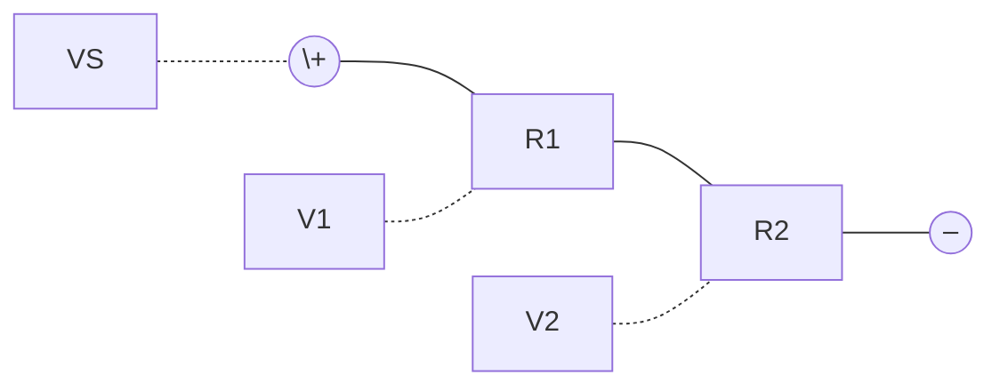

- **Formula**: V₁ = VS × (R₁/(R₁+R₂))
- **Application**: Used to find individual voltage drops across series components

**Current Division Rule**: In a parallel circuit, current through any branch is inversely proportional to its resistance.

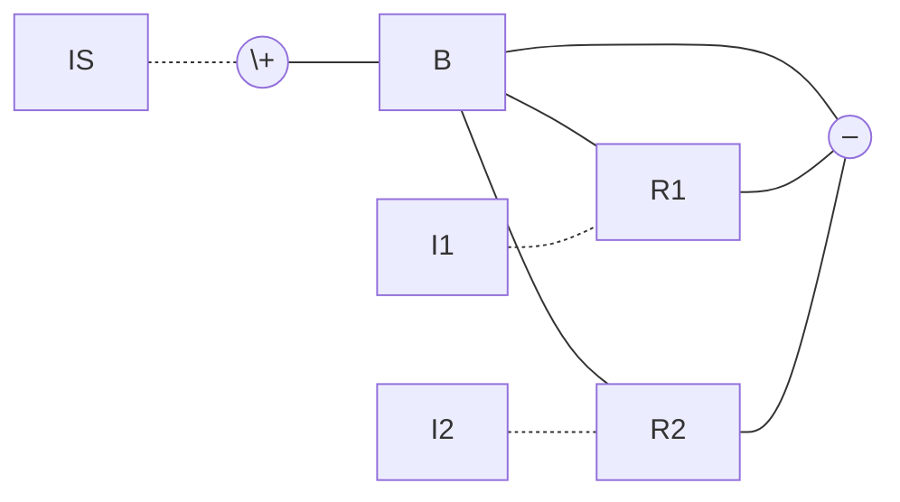

- **Formula**: I₁ = IS × (R₂/(R₁+R₂))
- **Key concept**: Current takes path of least resistance

**Mnemonic**: "VoSe CuPa: Voltage divides in Series, Current divides in Parallel"

## Question 1(c) [7 marks]

**Draw Graph and Tree for a network shown in fig(1). Show link currents on a graph. Also write Tie-set schedule for a tree of network shown in fig. (1)**

**Answer**:

**Graph of the Network**:

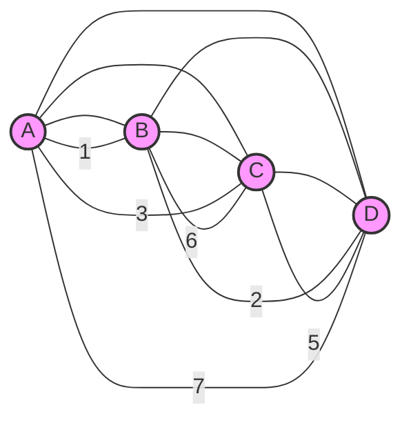

**Tree of the Network** (shown with bold edges):

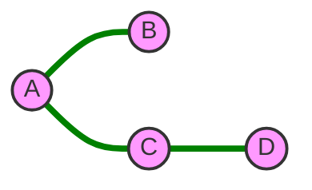

**Link Currents** (shown on remaining branches that are not part of the tree):

- Link 1: Branch 2 (BD)
- Link 2: Branch 6 (BC)
- Link 3: Branch 7 (AD)
- Link 4: Branch 5 (CD)

**Tie-set Schedule**:

| Link/Tree Branch | Branch 1 (AB) | Branch 3 (AC) | Branch 4 (CD) | Branch 2 (BD) | Branch 6 (BC) | Branch 7 (AD) | Branch 5 (CD) |
|------------------|---------------|---------------|---------------|---------------|---------------|---------------|---------------|
| Link 1 (BD)      | 1            | 0             | 0             | 1             | 0             | 0             | 0             |
| Link 2 (BC)      | 1            | 1             | 0             | 0             | 1             | 0             | 0             |
| Link 3 (AD)      | 0            | 0             | 1             | 0             | 0             | 1             | 0             |
| Link 4 (CD)      | 0            | 0             | 1             | 0             | 0             | 0             | 1             |

**Mnemonic**: "TGLT: Trees Generate Link-current Tie-sets"

## Question 1(c) OR [7 marks]

**Draw Graph and Tree for a network shown in fig(1). Show branch voltages on tree. Also write cut-set schedule for a tree of network shown on fig.(1)**

**Answer**:

**Graph of the Network**:


**Tree of the Network** (shown with bold edges and branch voltages):

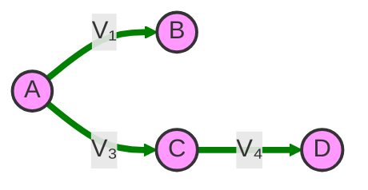

**Cut-set Schedule**:

| Cut-set/Branch | Branch 1 (AB) | Branch 3 (AC) | Branch 4 (CD) | Branch 2 (BD) | Branch 6 (BC) | Branch 7 (AD) | Branch 5 (CD) |
|----------------|---------------|---------------|---------------|---------------|---------------|---------------|---------------|
| Cut-set 1 (AB) | 1            | 0             | 0             | -1            | -1            | 0             | 0             |
| Cut-set 2 (AC) | 0            | 1             | 0             | 0             | 1             | -1            | 0             |
| Cut-set 3 (CD) | 0            | 0             | 1             | 1             | 0             | 1             | 1             |

**Mnemonic**: "CGVS: Cut-sets Generate Voltage Sources"

## Question 2(a) [3 marks]

**Define: 1) Active and passive network 2)Unilateral and Bilateral network.**

**Answer**:

- **Active Network**: A network containing one or more sources of EMF (voltage/current sources) that supply energy to the circuit.
- **Passive Network**: A network containing only passive elements like resistors, capacitors, and inductors with no energy sources.

- **Unilateral Network**: A network in which the properties and performance change when input and output terminals are interchanged.
- **Bilateral Network**: A network in which the properties and performance remain unchanged when input and output terminals are interchanged.

**Diagram**:
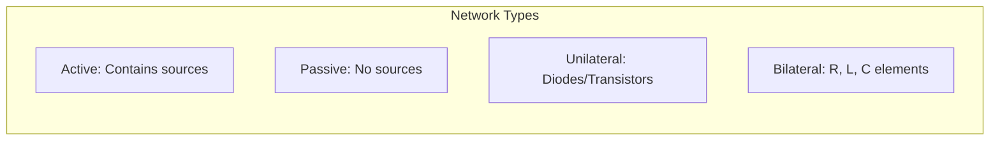

**Mnemonic**: "APUB: Active Provides energy, Unilateral Blocks reversal"

## Question 2(b) [4 marks]

**Write equation for Z parameter and derive Z11, Z12, Z21, Z22 from that equation.**

**Answer**:

Z-parameters define the relationship between port voltages and currents in a two-port network:

**Equations**:

- V₁ = Z₁₁I₁ + Z₁₂I₂
- V₂ = Z₂₁I₁ + Z₂₂I₂

**Derivation**:

- **Z₁₁ = V₁/I₁** (with I₂ = 0): Input impedance with output port open-circuited
- **Z₁₂ = V₁/I₂** (with I₁ = 0): Reverse transfer impedance with input port open-circuited
- **Z₂₁ = V₂/I₁** (with I₂ = 0): Forward transfer impedance with output port open-circuited
- **Z₂₂ = V₂/I₂** (with I₁ = 0): Output impedance with input port open-circuited

**Mnemonic**: "Z Impedance: Open circuit gives correct Parameters"

## Question 2(c) [7 marks]

**Derive equation of characteristic impedance(ZOT) for a standard T network.**

**Answer**:

For a standard T-network:

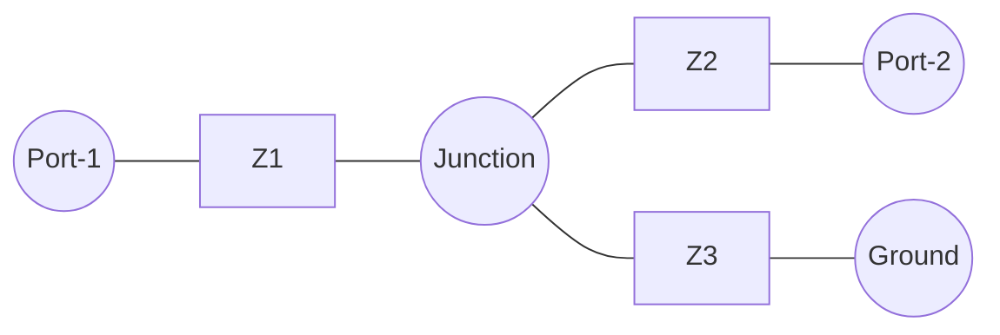

**Derivation Steps**:

1. For a symmetric T-network, Z₁ = Z₂
2. Under matched condition, input impedance equals characteristic impedance
3. Z₀ₜ = Z₁ + (Z₁×Z₃)/(Z₁ + Z₃)
4. For balanced T-network where Z₁ = Z₂ = Z/2 and Z₃ = Z:
5. Z₀ₜ = Z/2 + (Z/2×Z)/(Z/2 + Z)
6. Z₀ₜ = Z/2 + (Z²/2)/(Z + Z/2)
7. Z₀ₜ = Z/2 + (Z²/2)/(3Z/2)
8. Z₀ₜ = Z/2 + Z²/3Z
9. Z₀ₜ = Z/2 + Z/3
10. Z₀ₜ = (3Z + 2Z)/6
11. Z₀ₜ = √(Z₁(Z₁ + 2Z₃))

**Final Equation**: Z₀ₜ = √(Z₁(Z₁ + 2Z₃))

**Mnemonic**: "TO Impedance: Two arms Over middle branch"

## Question 2(a) OR [3 marks]

**Define: 1)Driving point impedance 2) Transfer impedance**

**Answer**:

- **Driving Point Impedance**: The ratio of voltage to current at the same port/pair of terminals when all other independent sources are set to zero.

- **Transfer Impedance**: The ratio of voltage at one port to the current at another port when all other independent sources are set to zero.

**Diagram**:
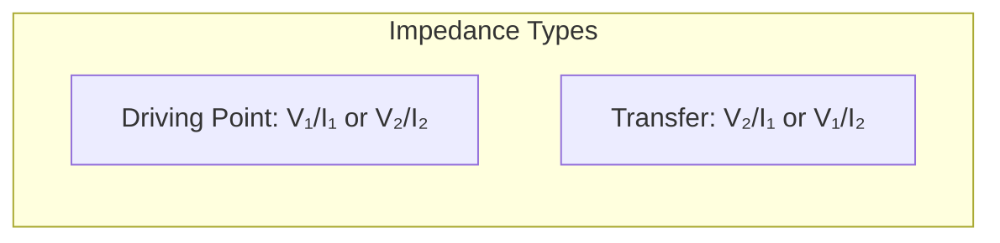

**Mnemonic**: "DTSS: Driving at Terminal Same, Transfer at Separate"

## Question 2(b) OR [4 marks]

**Explain Kirchhoff's voltage law with example.**

**Answer**:

**Kirchhoff's Voltage Law (KVL)**: The algebraic sum of all voltages around any closed loop in a circuit is zero.

**Mathematically**: ∑V = 0 (around a closed loop)

**Circuit Example**:

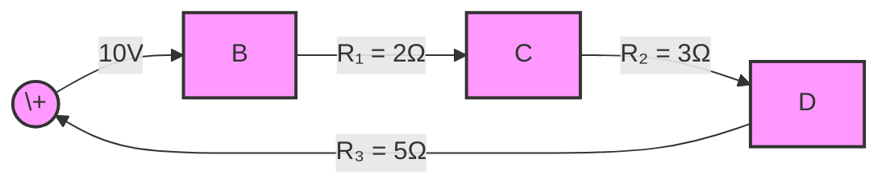

If I = 1A, then:

- V₁ = 1A × 2Ω = 2V
- V₂ = 1A × 3Ω = 3V
- V₃ = 1A × 5Ω = 5V

Applying KVL: 10V - 2V - 3V - 5V = 0 ✓

**Mnemonic**: "VACZ: Voltages Around Closed loop are Zero"

## Question 2(c) OR [7 marks]

**Derive equation to convert π network into T network.**

**Answer**:

**π Network to T Network Conversion**:

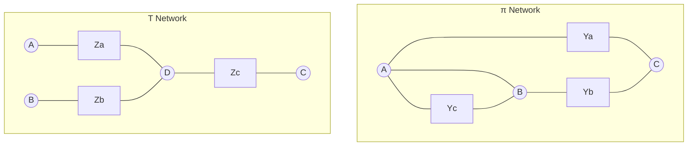

**Conversion Equations**:

1. Za = (Ya × Yc) / Y∆
2. Zb = (Yb × Yc) / Y∆
3. Zc = (Ya × Yb) / Y∆

Where Y∆ = Ya + Yb + Yc

**Derivation**:

1. Start with Y-parameters of π-network
2. Express Y-parameters in terms of branch admittances
3. Convert to Z-parameters using matrix inversion
4. Express T-network impedances in terms of Z-parameters
5. Simplify to get the conversion formulas above

**Mnemonic**: "PIE to TEA: Product over sum for opposite branch"

## Question 3(a) [3 marks]

**Explain Kirchhoff's current law with example.**

**Answer**:

**Kirchhoff's Current Law (KCL)**: The algebraic sum of all currents entering and leaving a node must equal zero.

**Mathematically**: ∑I = 0 (at any node)

**Circuit Example**:

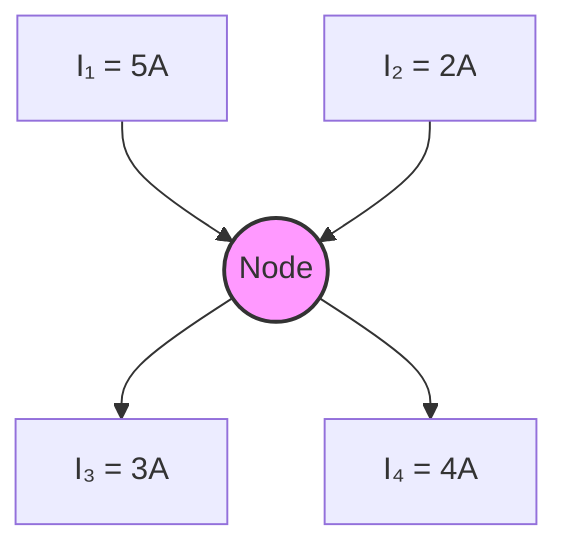

Applying KCL at node B:

- Currents entering: I₁ + I₂ = 5A + 2A = 7A
- Currents leaving: I₃ + I₄ = 3A + 4A = 7A
- Therefore: I₁ + I₂ - I₃ - I₄ = 5 + 2 - 3 - 4 = 0 ✓

**Mnemonic**: "CuNoZ: Currents at Node are Zero"

## Question 3(b) [4 marks]

**Explain mesh analysis with required equations.**

**Answer**:

**Mesh Analysis**: A circuit analysis technique that uses mesh currents as variables to solve a circuit with multiple loops.

**Steps**:

1. Identify all meshes (closed loops) in the circuit
2. Assign a mesh current to each mesh
3. Apply KVL to each mesh
4. Solve the resulting system of equations

**Example Circuit**:

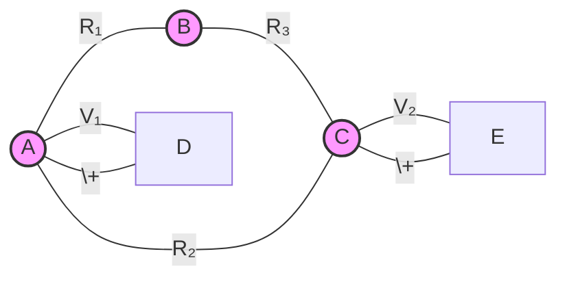

**Equations**:

- Mesh 1: V₁ = I₁R₁ + I₁R₂ - I₂R₂
- Mesh 2: V₂ = I₂R₂ + I₂R₃ - I₁R₂

**Mnemonic**: "MILK: Mesh Is Loop with KVL"

## Question 3(c) [7 marks]

**State and explain Thevenin's theorem.**

**Answer**:

**Thevenin's Theorem**: Any linear network with voltage and current sources can be replaced by an equivalent circuit consisting of a voltage source (VTH) in series with a resistance (RTH).

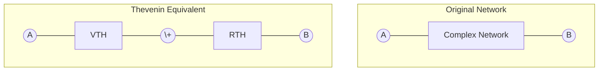

**Steps to Find Thevenin Equivalent**:

1. Remove the load from the terminals of interest
2. Calculate the open-circuit voltage (VOC) across these terminals (= VTH)
3. Calculate the resistance looking back into the circuit with all sources replaced by their internal resistances (= RTH)
4. The Thevenin equivalent consists of VTH in series with RTH

**Example Application**:

- Original complex circuit with load RL
- Remove RL and find VOC = VTH
- Deactivate sources and find RTH
- Reconnect RL to simplified Thevenin equivalent

**Mnemonic**: "TORV: Thevenin's Open-circuit Resistance and Voltage"

## Question 3(a) OR [3 marks]

**State and explain reciprocity theorem.**

**Answer**:

**Reciprocity Theorem**: In a linear, bilateral network, if a voltage source in one branch produces a current in another branch, then the same voltage source, if placed in the second branch, will produce the same current in the first branch.

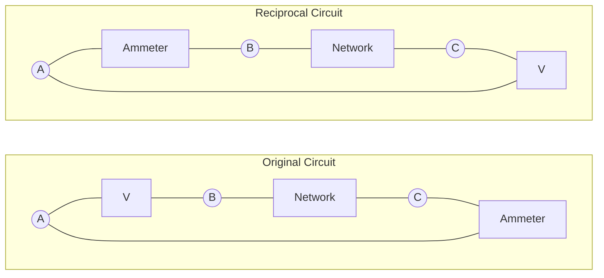

**Mathematically**: If a voltage V₁ in branch 1 produces current I₂ in branch 2, then voltage V₁ in branch 2 will produce current I₂ in branch 1.

**Limitations**: Applies only to networks with:

- Linear elements
- Bilateral elements (no diodes, transistors)
- Single independent source

**Mnemonic**: "RESWAP: REciprocity SWAPs Position with identical results"

## Question 3(b) OR [4 marks]

**Explain nodal analysis with required equations.**

**Answer**:

**Nodal Analysis**: A circuit analysis technique that uses node voltages as variables to solve a circuit.

**Steps**:

1. Choose a reference node (ground)
2. Assign voltage variables to remaining nodes
3. Apply KCL at each non-reference node
4. Solve the resulting system of equations

**Example Circuit**:

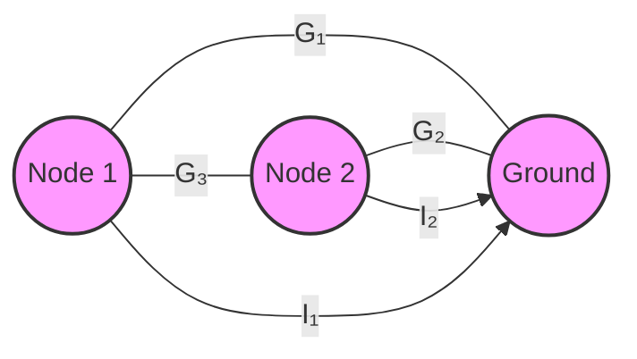

**Equations**:

- Node 1: I₁ = V₁G₁ + (V₁-V₂)G₃
- Node 2: I₂ = V₂G₂ + (V₂-V₁)G₃

**Mnemonic**: "NKCV: Nodal uses KCL with Voltage variables"

## Question 3(c) OR [7 marks]

**State and prove maximum power transfer theorem.**

**Answer**:

**Maximum Power Transfer Theorem**: A load connected to a source will extract maximum power when its resistance equals the internal resistance of the source.

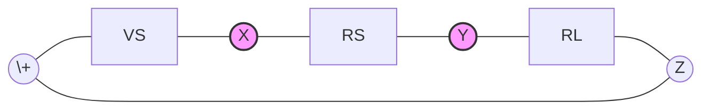

**Proof**:

1. Current in the circuit: I = VS/(RS + RL)
2. Power delivered to load: P = I²RL = (VS²RL)/(RS + RL)²
3. For maximum power, dP/dRL = 0
4. Solving: (VS²(RS + RL)² - VS²RL·2(RS + RL))/(RS + RL)⁴ = 0
5. Simplifying: (RS + RL)² = 2RL(RS + RL)
6. Further simplifying: RS + RL = 2RL
7. Therefore: RS = RL

**Maximum Power**: Pmax = VS²/(4RS)

**Mnemonic**: "MaRLRS: Maximum power when load Resistance equals Source Resistance"

## Question 4(a) [3 marks]

**Why series resonance circuit act as voltage amplifier and parallel resonance circuit act as current amplifier?**

**Answer**:

**Series Resonance as Voltage Amplifier**:

- At resonance, series circuit impedance is minimum (just R)
- Voltage across L or C can be much larger than source voltage
- Voltage magnification factor = Q = XL/R = 1/R√(L/C)
- Voltage across L or C = Q × Source voltage

**Parallel Resonance as Current Amplifier**:

- At resonance, parallel circuit impedance is maximum
- Current in L or C can be much larger than source current
- Current magnification factor = Q = R/XL = R√(C/L)
- Current through L or C = Q × Source current

**Table**:

| Circuit Type | Impedance at Resonance | Amplification |
|--------------|------------------------|---------------|
| Series       | Minimum (R only)       | Voltage (VL or VC = Q×VS) |
| Parallel     | Maximum (R²/r)         | Current (IL or IC = Q×IS) |

**Mnemonic**: "SeVoPa: Series Voltage, Parallel current amplification"

## Question 4(b) [4 marks]

**Derive equation of Q of coil.**

**Answer**:

**Q-factor of a Coil**:

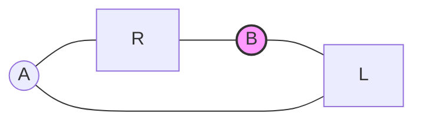

**Derivation**:

1. Q-factor is defined as: Q = Energy stored / Energy dissipated per cycle
2. Energy stored in inductor = (1/2)LI²
3. Power dissipated in resistor = I²R
4. Energy dissipated per cycle = Power × Time period = I²R × (1/f)
5. Therefore: Q = ((1/2)LI²) / (I²R × (1/f))
6. Simplifying: Q = 2π × (1/2)LI² × f / (I²R)
7. Q = 2πf × L / R = ωL / R

**Final Equation**: Q = ωL / R = 2πfL / R = XL / R

**Mnemonic**: "QualityEDR: Quality equals Energy stored Divided by energy lost per Radian"

## Question 4(c) [7 marks]

**Derive equation of series resonance frequency for series R-L-C circuit.**

**Answer**:

**Series R-L-C Circuit**:

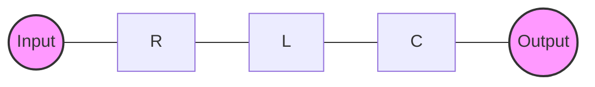

**Derivation**:

1. Impedance of series RLC circuit: Z = R + j(XL - XC)
2. Where: XL = ωL and XC = 1/ωC
3. At resonance, XL = XC (inductive and capacitive reactances are equal)
4. Therefore: ωL = 1/ωC
5. Solving for ω: ω² = 1/LC
6. Resonant frequency: ω₀ = 1/√(LC)
7. In terms of frequency f: f₀ = 1/(2π√(LC))

**Characteristics at Resonance**:

- Impedance is minimum (purely resistive: Z = R)
- Current is maximum (I = V/R)
- Power factor is unity (circuit appears resistive)
- Voltages across L and C are equal and opposite

**Mnemonic**: "RES: Reactances Equal at Series resonance"

## Question 4(a) OR [3 marks]

**What is coupled circuits? Define self-inductance and mutual inductance.**

**Answer**:

**Coupled Circuits**: Two or more circuits that are magnetically linked such that energy can be transferred between them through their mutual magnetic field.

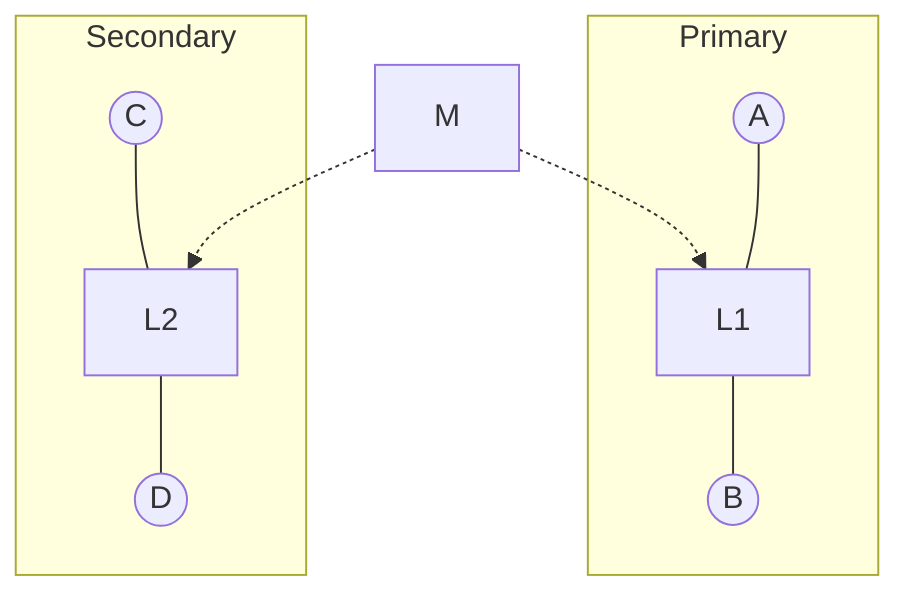

**Self-inductance (L)**: The property of a circuit whereby a change in current produces a self-induced EMF in the same circuit.
L = Φ/I (ratio of magnetic flux to the current producing it)

**Mutual inductance (M)**: The property of a circuit whereby a change in current in one circuit induces an EMF in another circuit.
M = Φ₂₁/I₁ (ratio of flux in circuit 2 due to current in circuit 1)

**Mnemonic**: "SiMu: Self in Mine, Mutual in Yours"

## Question 4(b) OR [4 marks]

**Derive equation for co-efficient of coupling (K).**

**Answer**:

**Coefficient of Coupling (k)**:

```mermaid
graph LR
    subgraph "Coupled Coils"
    A((A)) --- B[L1] --- C((B))
    D((C)) --- E[L2] --- F((D))
    G[M] -.-> B
    G -.-> E
    end
```

**Derivation**:

1. The mutual inductance (M) between two coils depends on:
   - Self-inductances of the coils (L₁ and L₂)
   - Physical arrangement (proximity and orientation)
2. Maximum possible mutual inductance: Mₘₐₓ = √(L₁L₂)
3. Coefficient of coupling is defined as: k = M/Mₘₐₓ
4. Therefore: k = M/√(L₁L₂)

**Characteristics**:

- k ranges from 0 (no coupling) to 1 (perfect coupling)
- k depends on geometry, orientation, and medium
- Typical transformers: k = 0.95 to 0.99
- Air-core coils: k = 0.01 to 0.5

**Mnemonic**: "KMutual: K Measures Mutual linkage proportion"

## Question 4(c) OR [7 marks]

**A series RLC circuit has R=30Ω, L=0.5H, and C=5µF. Calculate (i) series resonance frequency (2) Q Factor (3)BW**

**Answer**:

**Given**:

- Resistance, R = 30Ω
- Inductance, L = 0.5H
- Capacitance, C = 5µF = 5×10⁻⁶F

**Calculations**:

**(i) Series Resonance Frequency**:

- f₀ = 1/(2π√(LC))
- f₀ = 1/(2π√(0.5 × 5×10⁻⁶))
- f₀ = 1/(2π√(2.5×10⁻⁶))
- f₀ = 1/(2π × 1.58×10⁻³)
- f₀ = 1/(9.9×10⁻³)
- f₀ = 100.76 Hz
- f₀ ≈ 100 Hz

**(ii) Q Factor**:

- Q = (1/R)√(L/C)
- Q = (1/30)√(0.5/(5×10⁻⁶))
- Q = (1/30)√(100,000)
- Q = (1/30) × 316.23
- Q = 10.54

**(iii) Bandwidth (BW)**:

- BW = f₀/Q
- BW = 100.76/10.54
- BW = 9.56 Hz

**Table**:

| Parameter | Formula | Value |
|-----------|---------|-------|
| Resonant Frequency (f₀) | 1/(2π√(LC)) | 100 Hz |
| Quality Factor (Q) | (1/R)√(L/C) | 10.54 |
| Bandwidth (BW) | f₀/Q | 9.56 Hz |

**Mnemonic**: "RQB: Resonance Quality determines Bandwidth"

## Question 5(a) [3 marks]

**Classify various types of attenuators.**

**Answer**:

**Attenuators**: Network of resistors designed to reduce (attenuate) signal level without distortion.

**Types of Attenuators**:

```mermaid
graph TD
    A[Attenuators] --> B[Fixed Attenuators]
    A --> C[Variable Attenuators]
    B --> D[T-type]
    B --> E[π-type]
    B --> F[Bridged-T]
    B --> G[Lattice]
    C --> H[Step Attenuators]
    C --> I[Continuously Variable]
```

Based on configuration:

- **T-type**: Three resistor T-shaped configuration
- **π-type**: Three resistor π-shaped configuration
- **Bridged-T**: T-type with a resistor bridging across
- **Lattice**: Balanced configuration with four resistors

Based on symmetry:

- **Symmetrical**: Equal input and output impedance
- **Asymmetrical**: Different input and output impedance

**Mnemonic**: "ATP Fixed: Attenuator Types include Pad, Tee, Lattice"

## Question 5(b) [4 marks]

**Derive relation between attenuator and neper.**

**Answer**:

**Relationship between Attenuation and Neper**:

- **Attenuation (α)**: Ratio of input voltage (or current) to output voltage (or current), expressed in different units.

- **Neper (Np)**: Natural logarithmic unit of ratios, used mainly in transmission line theory.

**Derivation**:

1. For a voltage ratio V₁/V₂:
   - Attenuation in Nepers = ln(V₁/V₂)
   - Attenuation in Decibels = 20log₁₀(V₁/V₂)

2. For a power ratio P₁/P₂:
   - Attenuation in Nepers = (1/2)ln(P₁/P₂)
   - Attenuation in Decibels = 10log₁₀(P₁/P₂)

3. Relationship between dB and Neper:
   - 1 Neper = 8.686 dB
   - 1 dB = 0.115 Neper

**Table**:

| Unit | Voltage Ratio | Power Ratio |
|------|---------------|-------------|
| Neper (Np) | ln(V₁/V₂) | (1/2)ln(P₁/P₂) |
| Decibel (dB) | 20log₁₀(V₁/V₂) | 10log₁₀(P₁/P₂) |

**Mnemonic**: "NED: Neper Equals Decibel divided by 8.686"

## Question 5(c) [7 marks]

**Derive equations of R1 and R2 for symmetrical T attenuator.**

**Answer**:

**Symmetrical T Attenuator**:

```mermaid
graph LR
    A((Input)) --- B[R1] --- C((Junction))
    C --- D[R1] --- E((Output))
    C --- F[R2] --- G((Ground))
    style A fill:#f9f,stroke:#333,stroke-width:2px
    style E fill:#f9f,stroke:#333,stroke-width:2px
    style C fill:#f9f,stroke:#333,stroke-width:2px
```

**Derivation**:

1. For a symmetrical T-attenuator with characteristic impedance Z₀:
   - Input and output impedance must both equal Z₀
   - Attenuation ratio N = V₁/V₂ = I₂/I₁

2. From circuit analysis:
   - Z₀ = R₁ + (R₂(R₁))/(R₂+R₁)
   - N = (R₁ + R₂ + R₁)/R₂ = (2R₁+R₂)/R₂

3. Solving for R₁ and R₂:
   - R₁ = Z₀(N-1)/(N+1)
   - R₂ = 2Z₀N/(N²-1)

4. For attenuation in dB (α):
   - N = 10^(α/20)
   - R₁ = Z₀·tanh(α/2)
   - R₂ = Z₀/sinh(α)

**Final Equations**:

- R₁ = Z₀(N-1)/(N+1)
- R₂ = 2Z₀N/(N²-1)

**Mnemonic**: "TSR: T-attenuator Symmetry Requires equal R1 values"

## Question 5(a) OR [3 marks]

**Draw circuit diagram of symmetrical Bridge T and symmetrical Lattice attenuator.**

**Answer**:

**Symmetrical Bridge-T Attenuator**:

```goat
                R1
   A o--------/\/\/\--------o B
              |      |
              |      |
              \      /
              /  R3  \
       R2     \      /
   o---/\/\/\--+     +----o
   |                      |
   o----------------------o
   C                      D
```

**Symmetrical Lattice Attenuator**:

```goat
           R1
   A o----/\/\/\----o B
      \            /
       \          /
        \        /
     R2  \      / R2
          \    /
           \  /
            \/
            /\
           /  \
          /    \
         /      \
    R1  /        \
     C o--\/\/\/--o D
```

**Characteristics**:

1. **Bridge-T**: Combines features of T and π attenuators, suitable for high-frequency applications
2. **Lattice**: Balanced configuration with excellent phase and frequency response, commonly used in balanced lines

**Mnemonic**: "BL-BA: Bridge Ladder, Balanced Attenuators"

## Question 5(b) OR [4 marks]

**Write classification of filter based on frequency with their frequency responses showing pass band and stop band.**

**Answer**:

**Classification of Filters Based on Frequency**:

```mermaid
graph TD
    A[Passive Filters] --> B[Low Pass Filter]
    A --> C[High Pass Filter]
    A --> D[Band Pass Filter]
    A --> E[Band Stop Filter]
    A --> F[All Pass Filter]
```

**Frequency Responses**:

1. **Low Pass Filter**: Passes frequencies below cutoff, attenuates above
   ```
   Gain |
      1 |****
        |    ****
        |        ****
      0 |------------****----
        |
        +----------------------
           0     fc        f →
   ```

2. **High Pass Filter**: Passes frequencies above cutoff, attenuates below
   
   ```
   Gain |
      1 |            ****
        |        ****
        |    ****
      0 |****-----------------
        |
        +----------------------
           0     fc        f →
   ```
   
3. **Band Pass Filter**: Passes frequencies within a specific band
   
   ```
   Gain |
      1 |        ****
        |    ****    ****
        |   *          *
      0 |***-------------***--
        |
        +----------------------
           0   f1   f2     f →
   ```
   
4. **Band Stop Filter**: Rejects frequencies within a specific band
   ```
   Gain |
     1 |***             ***
        |   *           *
        |    ***     ***
     0 |        *****
        |
        +----------------------
           0   f1   f2     f →
   ```

**Mnemonic**: "LHBBA: Low High Band-pass Band-stop All-pass"

## Question 5(c) OR [7 marks]

**Draw the circuit for T-section and π-section constant-K low pass filter and Derive equation of cut-off frequency.**

**Answer**:

**T-section Constant-K Low Pass Filter**:

```goat
           L/2            L/2
   o------UUUUUU------UUUUUU-------o
   |                               |
   |                               |
   |                               |
   |              C                |
   |              |                |
   o--------------+----------------o
   Input                        Output
```

**π-section Constant-K Low Pass Filter**:

```goat
          L
   o------UUUUUU---------o
   |                     |
   |                     |
   |                     |
   |                     |
  ---                   ---
  --- C/2               --- C/2
   |                     |
   |                     |
   o---------------------o
   Input              Output
```

**Derivation of Cutoff Frequency**:

1. For a constant-K filter:
   - Z₁ × Z₂ = R₀² (characteristic impedance squared)
   - Z₁ = jωL (series impedance)
   - Z₂ = 1/jωC (shunt impedance)

2. Therefore:
   - R₀² = Z₁ × Z₂ = jωL × 1/jωC = L/C
   - R₀ = √(L/C)

3. Pass band condition:
   - -1 < Z₁/4Z₂ < 0
   - -1 < jωL/(4 × 1/jωC) < 0
   - -1 < -ω²LC/4 < 0

4. At cutoff frequency:
   - ω²LC/4 = 1
   - ωc² = 4/LC
   - ωc = 2/√(LC)
   - fc = ωc/2π = 1/π√(LC)

**Final Equation**:

- Cutoff frequency fc = 1/π√(LC)

**Mnemonic**: "KCLP: Konstant-k Cutoff in Low Pass depends on L and C product"
