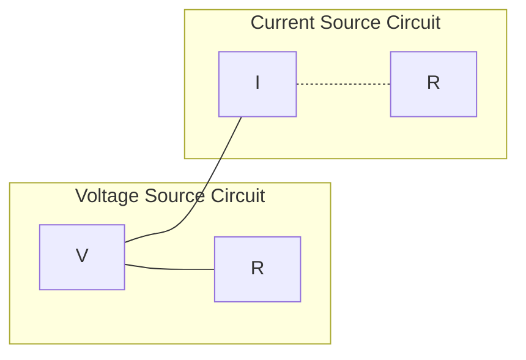
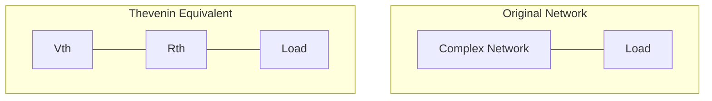
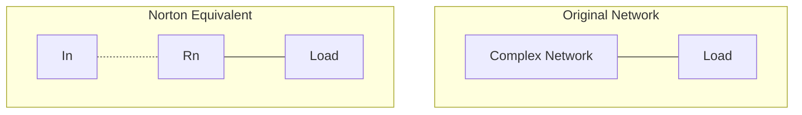
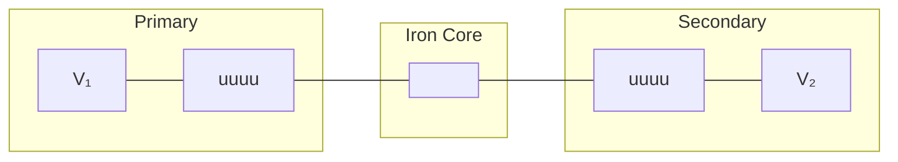
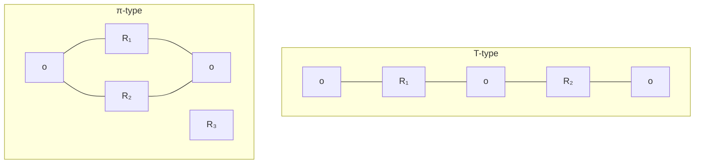
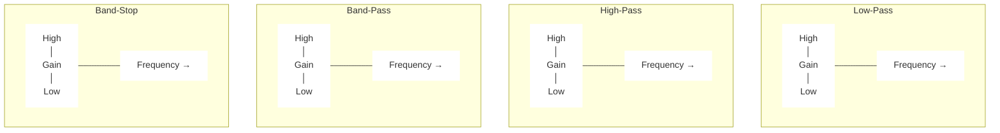

## પ્રશ્ન 1(a) [3 ગુણ]

**યોગ્ય રેખાકૃતિ સાથે સ્ત્રોત પરિવર્તન સમજાવો.**

**ઉત્તર**:
સ્ત્રોત પરિવર્તન એ વોલ્ટેજ સ્ત્રોતને કરંટ સ્ત્રોતમાં અથવા તેનાથી વિપરીત રૂપાંતરિત કરવાની પદ્ધતિ છે જેમાં બાહ્ય સર્કિટનું વર્તન બદલાતું નથી.

**આકૃતિ:**



- **વોલ્ટેજથી કરંટ સ્ત્રોત**: I = V/R, સમાન R સમાંતરમાં
- **કરંટથી વોલ્ટેજ સ્ત્રોત**: V = I×R, સમાન R શ્રેણીમાં

**મેમરી ટ્રીક:** "મૂલ્ય રહે છે, રેસિસ્ટન્સ બદલાય છે" (V=IR હંમેશા લાગુ પડે છે)

## પ્રશ્ન 1(b) [4 ગુણ]

**શ્રેણીમાં જોડાયેલા બે કેપેસિટર માટે વોલ્ટેજ, કરંટ અને પાવર સંબંધ મેળવો.**

**ઉત્તર**:

**કોષ્ટક: શ્રેણીમાં કેપેસિટર્સ**

| પરિમાણ | સૂત્ર | સમજૂતી |
|-----------|---------|-------------|
| કુલ કેપેસિટન્સ | 1/C<sub>T</sub> = 1/C₁ + 1/C₂ | પ્રતિરોધી યોગ |
| વોલ્ટેજ વિતરણ | V₁/V₂ = C₂/C₁ | કેપેસિટન્સ રેશિયોના વ્યસ્ત |
| કરંટ | I = I₁ = I₂ | બધા દ્વારા સમાન કરંટ વહે છે |
| ચાર્જ | Q = Q₁ = Q₂ | દરેક કેપેસિટર પર સમાન ચાર્જ |
| પાવર | P = VI = V²/X<sub>c</sub> | જ્યાં X<sub>c</sub> = 1/2πfC |

- **વોલ્ટેજ વિભાજન**: V₁ = V × C₂/(C₁+C₂)
- **ચાર્જ સંગ્રહ**: Q = C₁C₂V/(C₁+C₂)

**મેમરી ટ્રીક:** "શ્રેણીમાં કેપેસિટર્સ: કરંટ સમાન, કેપેસિટન્સ ઘટે"

## પ્રશ્ન 1(c) [7 ગુણ]

**રેસિસ્ટરના શ્રેણી અને સમાંતર જોડાણ વચ્ચેનો તફાવત આપો અને સમાંતર જોડાણના કુલ રેસિસ્ટન્સનું સમીકરણ મેળવો.**

**ઉત્તર**:

**કોષ્ટક: શ્રેણી વિરુદ્ધ સમાંતર રેસિસ્ટર્સ**

| પરિમાણ | શ્રેણી જોડાણ | સમાંતર જોડાણ |
|-----------|------------------|---------------------|
| કુલ રેસિસ્ટન્સ | વધે છે (R<sub>T</sub> = R₁ + R₂ + ...) | ઘટે છે (R<sub>T</sub> < સૌથી નાના R) |
| કરંટ | બધામાં સમાન (I) | વિભાજન થાય (I<sub>T</sub> = I₁ + I₂ + ...) |
| વોલ્ટેજ | વિભાજન થાય (V<sub>T</sub> = V₁ + V₂ + ...) | બધા પર સમાન (V) |
| પાવર | P<sub>T</sub> = P₁ + P₂ + ... | P<sub>T</sub> = P₁ + P₂ + ... |

**સમાંતર રેસિસ્ટન્સ માટેનું વ્યુત્પત્તિ:**

કિરચોફના કરંટ નિયમ અનુસાર:
I<sub>T</sub> = I₁ + I₂ + ... + I<sub>n</sub>

I = V/R બદલતાં:
V/R<sub>T</sub> = V/R₁ + V/R₂ + ... + V/R<sub>n</sub>

V થી ભાગીને:
1/R<sub>T</sub> = 1/R₁ + 1/R₂ + ... + 1/R<sub>n</sub>

બે રેસિસ્ટર્સ માટે:
1/R<sub>T</sub> = 1/R₁ + 1/R₂, જે આપે છે R<sub>T</sub> = R₁R₂/(R₁+R₂)

**મેમરી ટ્રીક:** "સમાંતરમાં, વ્યસ્ત મૂલ્યો ઉમેરાય છે"

## પ્રશ્ન 1(c) OR [7 ગુણ]

**1) યુનિલેટરલ, બાયલેટરલ નેટવર્ક, મેશ અને લૂપ વ્યાખ્યાયિત કરો.**
**2) વોલ્ટેજ ડિવિઝન સર્કિટ દોરો અને સમીકરણ લખો.**

**ઉત્તર**:

**કોષ્ટક: નેટવર્ક વ્યાખ્યાઓ**

| પદ | વ્યાખ્યા | ઉદાહરણ |
|------|------------|---------|
| યુનિલેટરલ નેટવર્ક | માત્ર એક દિશામાં કરંટ પસાર થવા દે છે | ડાયોડ સર્કિટ |
| બાયલેટરલ નેટવર્ક | બંને દિશામાં કરંટ પસાર થવા દે છે | RLC સર્કિટ |
| મેશ | સપાટ નેટવર્ક પાથ જેમાં કોઈ બીજો પાથ નથી | એક બંધ પાથ |
| લૂપ | નેટવર્કમાં કોઈપણ બંધ પાથ | અન્ય તત્વો શામેલ કરી શકે |

**વોલ્ટેજ ડિવિઝન સર્કિટ:**


**વોલ્ટેજ ડિવિઝન સમીકરણ:**
V<sub>o</sub> = V<sub>in</sub> × R₂/(R₁+R₂)

- **સમાનુપાતિક**: રેસિસ્ટન્સ જેના પર વોલ્ટેજ માપવામાં આવે છે
- **વ્યસ્ત સમાનુપાતિક**: કુલ રેસિસ્ટન્સ

**મેમરી ટ્રીક:** "આઉટપુટ વોલ્ટેજ ઈનપુટ ગુણ્યા રેસિસ્ટન્સના ગુણોત્તર"

## પ્રશ્ન 2(a) [3 ગુણ]

**T-type નેટવર્કને π-type નેટવર્કમાં કન્વર્ટ કરવા માટે સમીકરણો મેળવો.**

**ઉત્તર**:

**આકૃતિ: T થી π રૂપાંતરણ**

```goat
    A    Z₁    B         A            B
     o---\/\/--o          o         o
     |          |          \       /
     |          |    =>     \     /
     Z₃         Z₂           \   /
     |          |            Z₁₂ Z₂₃
     o----------o             \ /
     C                         o
                               C
```

**રૂપાંતરણ સમીકરણો:**

- Z₁₂ = (Z₁Z₂ + Z₂Z₃ + Z₃Z₁)/Z₃
- Z₂₃ = (Z₁Z₂ + Z₂Z₃ + Z₃Z₁)/Z₁
- Z₃₁ = (Z₁Z₂ + Z₂Z₃ + Z₃Z₁)/Z₂

જ્યાં Z₁, Z₂, Z₃ એ T-નેટવર્કના ઇમ્પીડન્સ છે અને Z₁₂, Z₂₃, Z₃₁ એ π-નેટવર્કના ઇમ્પીડન્સ છે.

**મેમરી ટ્રીક:** "બધા ગુણનનો સરવાળો વિભાજિત સામેના દ્વારા"

## પ્રશ્ન 2(b) [4 ગુણ]

**ઓપન સર્કિટ ઇમ્પીડન્સ પેરામીટર (Z પેરામીટર) સમજાવો.**

**ઉત્તર**:

**Z-પેરામીટર્સ**: આને ઓપન-સર્કિટ ઇમ્પીડન્સ પેરામીટર્સ પણ કહેવામાં આવે છે કારણ કે તેઓ આઉટપુટ પોર્ટ્સને ખુલ્લા રાખીને માપવામાં આવે છે.

**કોષ્ટક: Z-પેરામીટર સમીકરણો**

| પેરામીટર | વ્યાખ્યા | ગણતરી |
|-----------|------------|-------------|
| Z₁₁ | આઉટપુટ ખુલ્લું હોય ત્યારે ઇનપુટ ઇમ્પીડન્સ | Z₁₁ = V₁/I₁ (જ્યારે I₂=0) |
| Z₁₂ | પોર્ટ 2 થી પોર્ટ 1 સુધીનો ટ્રાન્સફર ઇમ્પીડન્સ | Z₁₂ = V₁/I₂ (જ્યારે I₁=0) |
| Z₂₁ | પોર્ટ 1 થી પોર્ટ 2 સુધીનો ટ્રાન્સફર ઇમ્પીડન્સ | Z₂₁ = V₂/I₁ (જ્યારે I₂=0) |
| Z₂₂ | ઇનપુટ ખુલ્લું હોય ત્યારે આઉટપુટ ઇમ્પીડન્સ | Z₂₂ = V₂/I₂ (જ્યારે I₁=0) |

**મેટ્રિક્સ ફોર્મ:**
[V₁] = [Z₁₁ Z₁₂] × [I₁]
[V₂]   [Z₂₁ Z₂₂]   [I₂]

- **સિમેટ્રિકલ નેટવર્ક**: Z₁₂ = Z₂₁
- **એકમો**: ઓહ્મ (Ω)

**મેમરી ટ્રીક:** "Vs તે Zs ગુણ્યા Is"

## પ્રશ્ન 2(c) [7 ગુણ]

**સિમેટ્રિકલ T-type નેટવર્ક માટે કેરેક્ટેરિસ્ટિક ઇમ્પીડન્સ (Z₀ₜ) નું સૂત્ર મેળવો.**

**ઉત્તર**:

**આકૃતિ: સિમેટ્રિકલ T-નેટવર્ક**

```goat
         Z₁/2        Z₁/2
     o----\/\/----o---\/\/----o
     |            |           |
     |            |           |
    Z₀ₜ          Z₂          Z₀ₜ
     |            |           |
     |            |           |
     o------------o-----------o
```

**વ્યુત્પત્તિ:**

1. સિમેટ્રિકલ T-નેટવર્ક માટે, Z₁ બે ભાગમાં સરખે ભાગે વિભાજિત થાય છે (દરેક Z₁/2)
2. ઇમેજ ઇમ્પીડન્સ મેચિંગ માટે: Z₀ₜ = Z₀ₜ′

વોલ્ટેજ ડિવિઝન દ્વારા:
V₂/V₁ = Z₀ₜ/(Z₁/2 + Z₀ₜ + Z₂||Z₀ₜ)

મેચ્ડ કન્ડિશન માટે:
Z₀ₜ² = (Z₁/2)(Z₁/2 + Z₂)

તેથી:
Z₀ₜ = √[(Z₁/2)(Z₁/2 + Z₂)]
Z₀ₜ = √[Z₁²/4 + Z₁Z₂/2]
Z₀ₜ = √[Z₁(Z₁+2Z₂)/4]

**મેમરી ટ્રીક:** "Z₁ અને તેની સાથે જોડાયેલા Z₁ના વર્ગમૂળ"

## પ્રશ્ન 2(a) OR [3 ગુણ]

**π-type નેટવર્કને T-type નેટવર્કમાં કન્વર્ટ કરવા માટે સમીકરણો મેળવો.**

**ઉત્તર**:

**આકૃતિ: π થી T રૂપાંતરણ**

```goat
    A            B         A    Z₁    B
    o          o           o---\/\/---o
     \        /            |          |
      \      /             |          |
      Z₁₂    Z₂₃     =>    Z₃         Z₂
       \    /              |          |
        \  /               o----------o
         o                  C
         C
```

**રૂપાંતરણ સમીકરણો:**

- Z₁ = (Z₁₂Z₃₁)/(Z₁₂ + Z₂₃ + Z₃₁)
- Z₂ = (Z₂₃Z₁₂)/(Z₁₂ + Z₂₃ + Z₃₁)
- Z₃ = (Z₃₁Z₂₃)/(Z₁₂ + Z₂₃ + Z₃₁)

જ્યાં Z₁₂, Z₂₃, Z₃₁ એ π-નેટવર્કના ઇમ્પીડન્સ છે અને Z₁, Z₂, Z₃ એ T-નેટવર્કના ઇમ્પીડન્સ છે.

**મેમરી ટ્રીક:** "આસન્ન જોડીઓના ગુણાકાર વિભાજિત બધાના સરવાળા દ્વારા"

## પ્રશ્ન 2(b) OR [4 ગુણ]

**એડમિટન્સ પેરામીટર (Y પેરામીટર) સમજાવો.**

**ઉત્તર**:

**Y-પેરામીટર્સ**: આને શોર્ટ-સર્કિટ એડમિટન્સ પેરામીટર્સ પણ કહેવામાં આવે છે કારણ કે તેઓ આઉટપુટ પોર્ટ્સને શોર્ટ રાખીને માપવામાં આવે છે.

**કોષ્ટક: Y-પેરામીટર સમીકરણો**

| પેરામીટર | વ્યાખ્યા | ગણતરી |
|-----------|------------|-------------|
| Y₁₁ | આઉટપુટ શોર્ટેડ હોય ત્યારે ઇનપુટ એડમિટન્સ | Y₁₁ = I₁/V₁ (જ્યારે V₂=0) |
| Y₁₂ | પોર્ટ 2 થી પોર્ટ 1 સુધીનો ટ્રાન્સફર એડમિટન્સ | Y₁₂ = I₁/V₂ (જ્યારે V₁=0) |
| Y₂₁ | પોર્ટ 1 થી પોર્ટ 2 સુધીનો ટ્રાન્સફર એડમિટન્સ | Y₂₁ = I₂/V₁ (જ્યારે V₂=0) |
| Y₂₂ | ઇનપુટ શોર્ટેડ હોય ત્યારે આઉટપુટ એડમિટન્સ | Y₂₂ = I₂/V₂ (જ્યારે V₁=0) |

**મેટ્રિક્સ ફોર્મ:**
[I₁] = [Y₁₁ Y₁₂] × [V₁]
[I₂]   [Y₂₁ Y₂₂]   [V₂]

- **સિમેટ્રિકલ નેટવર્ક**: Y₁₂ = Y₂₁
- **એકમો**: સીમેન્સ (S)

**મેમરી ટ્રીક:** "Is તે Ys ગુણ્યા Vs"

## પ્રશ્ન 2(c) OR [7 ગુણ]

**સિમેટ્રિકલ π-type નેટવર્ક માટે કેરેક્ટેરિસ્ટિક ઇમ્પીડન્સ (Z₀π) નું સૂત્ર મેળવો.**

**ઉત્તર**:

**આકૃતિ: સિમેટ્રિકલ π-નેટવર્ક**

```goat
     o-----------o----------o
     |           |          |
     |           |          |
    2Z₃         Z₁         2Z₃
     |           |          |
     |           |          |
     o----Z₀π----o----Z₀π---o
```

**વ્યુત્પત્તિ:**

1. સિમેટ્રિકલ π-નેટવર્ક માટે, શંટ આર્મ્સમાં એડમિટન્સ Y₁ બે સરખા ભાગમાં વહેંચાય છે (Y₃ = Y₁/2)
2. ઇમેજ ઇમ્પીડન્સ મેચિંગ માટે: Z₀π = Z₀π′

કરંટ ડિવિઝન દ્વારા:
I₂/I₁ = Z₀π/(Z₀π + Z₁ + Z₀π||2Z₃)

મેચ્ડ કન્ડિશન માટે:
Z₀π² = Z₁(2Z₃)/(Z₁ + 2Z₃)

સરળીકરણ:
Z₀π = √[Z₁(2Z₃)/(Z₁ + 2Z₃)]
Z₀π = √[2Z₁Z₃/(Z₁ + 2Z₃)]

**મેમરી ટ્રીક:** "પાઈનો ઇમ્પીડન્સ તે જુએ છે તેનો જ્યામિતીય મધ્યવર્તી"

## પ્રશ્ન 3(a) [3 ગુણ]

**ડ્યુઆલિટીનો સિદ્ધાંત સમજાવો.**

**ઉત્તર**:

**ડ્યુઆલિટીનો સિદ્ધાંત**: દરેક ઇલેક્ટ્રીકલ નેટવર્ક માટે, એક ડ્યુઅલ નેટવર્ક અસ્તિત્વમાં છે જેનું વર્તન સમાન છે પરંતુ તત્વો બદલાયેલા છે.

**કોષ્ટક: ડ્યુઅલ તત્વ જોડીઓ**

| મૂળ સર્કિટ | ડ્યુઅલ સર્કિટ |
|-----------------|--------------|
| વોલ્ટેજ (V) | કરંટ (I) |
| કરંટ (I) | વોલ્ટેજ (V) |
| રેસિસ્ટન્સ (R) | કંડક્ટન્સ (G) |
| ઇન્ડક્ટન્સ (L) | કેપેસિટન્સ (C) |
| શ્રેણી જોડાણ | સમાંતર જોડાણ |
| KVL | KCL |
| મેશ એનાલિસિસ | નોડલ એનાલિસિસ |

- **નેટવર્ક ટ્રાન્સફોર્મેશન**: દરેક તત્વને તેના ડ્યુઅલથી બદલો
- **ટોપોલોજી ટ્રાન્સફોર્મેશન**: દરેક નોડને લૂપથી અને દરેક લૂપને નોડથી બદલો

**મેમરી ટ્રીક:** "શ્રેણીથી સમાંતર, સ્ત્રોત બદલે ડ્યુઅલ, V બને I અને I બને V"

## પ્રશ્ન 3(b) [4 ગુણ]

**થેવેનિનનો પ્રમેય જણાવો અને સમજાવો.**

**ઉત્તર**:

**થેવેનિનનો પ્રમેય**: કોઈપણ લીનીયર બે-ટર્મિનલ નેટવર્કને શ્રેણીમાં વોલ્ટેજ સ્ત્રોત (V<sub>th</sub>) અને રેસિસ્ટન્સ (R<sub>th</sub>) ધરાવતા સમકક્ષ સર્કિટથી બદલી શકાય છે.

**આકૃતિ:**



**થેવેનિન સમકક્ષ શોધવું:**

1. લોડ રેસિસ્ટન્સ દૂર કરો
2. ઓપન-સર્કિટ વોલ્ટેજ (V<sub>th</sub>) ગણો
3. R<sub>th</sub> શોધવા માટે:
   - બધા સ્ત્રોતોને નિષ્ક્રિય કરો (V=0, I=0)
   - ટર્મિનલ્સ વચ્ચેનો રેસિસ્ટન્સ ગણો

**મેમરી ટ્રીક:** "વોલ્ટેજ માટે ખુલ્લું, રેસિસ્ટન્સ માટે મૃત"

## પ્રશ્ન 3(c) [7 ગુણ]

**ઉદાહરણ સાથે KCL અને KVL જણાવો અને સમજાવો.**

**ઉત્તર**:

**કોષ્ટક: કિરચોફના નિયમો**

| નિયમ | અભિધાન | ગાણિતિક રૂપ | અમલીકરણ |
|-----|-----------|-------------------|-------------|
| KCL | નોડમાં પ્રવેશતા કરંટનો સરવાળો નોડથી બહાર નીકળતા કરંટના સરવાળા બરાબર છે | ∑I<sub>in</sub> = ∑I<sub>out</sub> | નોડલ એનાલિસિસ |
| KVL | કોઈપણ બંધ લૂપ ફરતે વોલ્ટેજ ડ્રોપનો સરવાળો શૂન્ય છે | ∑V = 0 | મેશ એનાલિસિસ |

**KCL ઉદાહરણ:**

```goat
        I₁
        ↓
        o
       / \
      /   \
     I₂    I₃
    /       \
   o         o

નોડ પર: I₁ = I₂ + I₃
```

**KVL ઉદાહરણ:**

```goat
    +    R₁     +
    o---\/\/\/--o
    |           |
   V₁           R₂
    |           |
    o-----------o
    -           -

લૂપની આસપાસ: V₁ - I×R₁ - I×R₂ = 0
```

**મેમરી ટ્રીક:** "નોડ પર કરંટનો સરવાળો શૂન્ય, લૂપ આસપાસ વોલ્ટેજના પણ"

## પ્રશ્ન 3(a) OR [3 ગુણ]

**મેશ એનાલિસિસ દ્વારા નેટવર્કનું સોલ્યુશન સમજાવો.**

**ઉત્તર**:

**મેશ એનાલિસિસ**: એક સર્કિટ એનાલિસિસ પદ્ધતિ જે અજાણી કરંટ અને વોલ્ટેજને શોધવા માટે મેશ કરંટનો ચલ તરીકે ઉપયોગ કરે છે.

**આકૃતિ: સિમ્પલ ટુ-મેશ સર્કિટ**

```goat
    +   R₁    +   R₃   +
    o--\/\/\--o--\/\/\--o
    |         |         |
   V₁        R₂        V₂
    |         |         |
    o---------o---------o
    -         -         -
     Mesh 1     Mesh 2
```

**પગલાં:**

1. મેશ (બંધ લૂપ) ઓળખો
2. ઘડિયાળના કાંટાની દિશામાં મેશ કરંટ (I₁, I₂) આપો
3. દરેક મેશ પર KVL લાગુ કરો
4. પરિણામી સમકાલીન સમીકરણોનો ઉકેલ મેળવો

**ઉદાહરણ સમીકરણો:**

- મેશ 1: V₁ = I₁(R₁+R₂) - I₂R₂
- મેશ 2: -V₂ = -I₁R₂ + I₂(R₂+R₃)

**મેમરી ટ્રીક:** "આપો, KVL લાગુ કરો, ગોઠવો, અને ઉકેલો"

## પ્રશ્ન 3(b) OR [4 ગુણ]

**નોર્ટનનો પ્રમેય જણાવો અને સમજાવો.**

**ઉત્તર**:

**નોર્ટનનો પ્રમેય**: કોઈપણ લીનીયર બે-ટર્મિનલ નેટવર્કને સમાંતરમાં કરંટ સ્ત્રોત (I<sub>N</sub>) અને રેસિસ્ટન્સ (R<sub>N</sub>) ધરાવતા સમકક્ષ સર્કિટથી બદલી શકાય છે.

**આકૃતિ:**



**નોર્ટન સમકક્ષ શોધવું:**

1. લોડ રેસિસ્ટન્સ દૂર કરો
2. શોર્ટ-સર્કિટ કરંટ (I<sub>N</sub>) ગણો
3. R<sub>N</sub> શોધવા માટે:
   - બધા સ્ત્રોતોને નિષ્ક્રિય કરો (V=0, I=0)
   - ટર્મિનલ્સ વચ્ચેનો રેસિસ્ટન્સ ગણો (R<sub>N</sub> = R<sub>th</sub>)

**મેમરી ટ્રીક:** "કરંટ માટે શોર્ટ, રેસિસ્ટન્સ માટે મૃત"

## પ્રશ્ન 3(c) OR [7 ગુણ]

**મહત્તમ પાવર ટ્રાન્સફર પ્રમેય જણાવો અને સમજાવો. મહત્તમ પાવર ટ્રાન્સફર માટેની સ્થિતિ મેળવો.**

**ઉત્તર**:

**મહત્તમ પાવર ટ્રાન્સફર પ્રમેય**: જ્યારે લોડનો રેસિસ્ટન્સ નેટવર્કના થેવેનિન સમકક્ષ રેસિસ્ટન્સ બરાબર હોય ત્યારે લોડને મહત્તમ પાવર મળે છે.

**આકૃતિ:**


**વ્યુત્પત્તિ:**

1. લોડને મળતો પાવર: P = I²R<sub>L</sub>
2. સર્કિટમાં કરંટ: I = V<sub>th</sub>/(R<sub>th</sub> + R<sub>L</sub>)
3. બદલતાં: P = V<sub>th</sub>²R<sub>L</sub>/(R<sub>th</sub> + R<sub>L</sub>)²
4. R<sub>L</sub> ના સંદર્ભમાં ડિફરેન્શિએટ કરીને શૂન્ય સુયોજિત કરતાં:
   dP/dR<sub>L</sub> = 0

5. આ આપે છે: R<sub>L</sub> = R<sub>th</sub>

6. મહત્તમ પાવર: P<sub>max</sub> = V<sub>th</sub>²/(4R<sub>th</sub>)

**મેમરી ટ્રીક:** "મેચ કરો, મહત્તમ બનાવો"

## પ્રશ્ન 4(a) [3 ગુણ]

**કોઇલ માટે Q પરિબળનું સમીકરણ મેળવો.**

**ઉત્તર**:

**Q ફેક્ટર (ક્વોલિટી ફેક્ટર)** કોઇલ માટે ઇન્ડક્ટિવ રિએક્ટન્સનો રેસિસ્ટન્સ સાથેનો ગુણોત્તર દર્શાવે છે.

**આકૃતિ: રેસિસ્ટન્સ સાથેની કોઇલ**

```goat
    o----\/\/\/----uuuu----o
         R          L
```

**વ્યુત્પત્તિ:**

1. રેસિસ્ટન્સ સાથેની ઇન્ડક્ટર માટે, ઇમ્પીડન્સ Z = R + jωL
2. Q ફેક્ટર વ્યાખ્યા: Q = રિએક્ટિવ પાવર / એક્ટિવ પાવર
3. Q = ωL/R

જ્યાં:

- L = ઇન્ડક્ટન્સ હેનરીમાં
- R = શ્રેણી રેસિસ્ટન્સ ઓહ્મમાં
- ω = 2πf, એન્ગ્યુલર ફ્રીક્વન્સી

**મેમરી ટ્રીક:** "ક્વોલિટી તે રિએક્ટન્સ ભાગે રેસિસ્ટન્સ"

## પ્રશ્ન 4(b) [4 ગુણ]

**સમાંતર RLC સર્કિટ માટે રેઝોનન્ટ ફ્રીક્વન્સીનું સમીકરણ મેળવો.**

**ઉત્તર**:

**આકૃતિ: સમાંતર RLC સર્કિટ**

```goat
        o-----o
        |     |
        R     |
        |     |
        o     |
        |     |
        C     L
        |     |
        o-----o
```

**વ્યુત્પત્તિ:**

1. સમાંતર RLC નો એડમિટન્સ: Y = 1/R + jωC + 1/jωL = 1/R + j(ωC - 1/ωL)
2. રેઝોનન્સ પર, કાલ્પનિક ભાગ શૂન્ય છે: ωC - 1/ωL = 0
3. ω માટે ઉકેલતાં: ω² = 1/LC
4. તેથી: ω = 1/√(LC)
5. રેઝોનન્સ ફ્રીક્વન્સી: f<sub>r</sub> = 1/(2π√(LC))

**નોંધ:** R બેન્ડવિડ્થને અસર કરે છે પરંતુ રેઝોનન્સ ફ્રીક્વન્સીને નહીં.

**મેમરી ટ્રીક:** "એક ભાગે બે પાઈ ગુણ્યા LC ના વર્ગમૂળ"

## પ્રશ્ન 4(c) [7 ગુણ]

**જરૂરી ડાયાગ્રામ સાથે કપલ્ડ સર્કિટના પ્રકારો લખો અને આયર્ન કોર ટ્રાન્સફોર્મર સમજાવો.**

**ઉત્તર**:

**કોષ્ટક: કપલ્ડ સર્કિટના પ્રકાર**

| પ્રકાર | કપલિંગ માધ્યમ | અમલીકરણ |
|------|----------------|-------------|
| ડાયરેક્ટ કપલિંગ | વાહકથી જોડાયેલ | DC એમ્પ્લિફાયર્સ |
| કેપેસિટિવ કપલિંગ | કેપેસિટર | AC સિગ્નલ કપલિંગ |
| ઇન્ડક્ટિવ કપલિંગ | ચુંબકીય ક્ષેત્ર | ટ્રાન્સફોર્મર્સ |
| રેસિસ્ટિવ કપલિંગ | રેસિસ્ટર | ઓછી આવૃત્તિના સિગ્નલ |

**આકૃતિ: આયર્ન કોર ટ્રાન્સફોર્મર**



**આયર્ન કોર ટ્રાન્સફોર્મર:**

- **સિદ્ધાંત**: આયર્ન કોર દ્વારા મ્યુચ્યુઅલ ઇન્ડક્ટન્સ
- **કાર્ય**: ઇલેક્ટ્રોમેગ્નેટિક ઇન્ડક્શન દ્વારા સર્કિટ્સ વચ્ચે ઊર્જા ટ્રાન્સફર કરે છે
- **કપલિંગ કોઇફિશિયન્ટ**: k ≈ 1 (લગભગ પરફેક્ટ કપલિંગ)
- **ટર્ન્સ રેશિયો**: V₂/V₁ = N₂/N₁
- **ફાયદા**: ઉચ્ચ કાર્યક્ષમતા, સારું કપલિંગ

**મેમરી ટ્રીક:** "પ્રાથમિક ઉત્તેજિત કરે, કોર વહન કરે, સેકન્ડરી પહોંચાડે"

## પ્રશ્ન 4(a) OR [3 ગુણ]

**કેપેસિટર માટે Q પરિબળનું સમીકરણ મેળવો.**

**ઉત્તર**:

**Q ફેક્ટર (ક્વોલિટી ફેક્ટર)** કેપેસિટર માટે કેપેસિટિવ રિએક્ટન્સનો રેસિસ્ટન્સ સાથેનો ગુણોત્તર દર્શાવે છે.

**આકૃતિ: રેસિસ્ટન્સ સાથેની કેપેસિટર**

```goat
    o----\/\/\/----||----o
         R          C
```

**વ્યુત્પત્તિ:**

1. સીરીઝ રેસિસ્ટન્સ સાથેની કેપેસિટર માટે, ઇમ્પીડન્સ Z = R - j/(ωC)
2. Q ફેક્ટર વ્યાખ્યા: Q = રિએક્ટિવ પાવર / એક્ટિવ પાવર
3. Q = 1/(ωCR)

જ્યાં:

- C = કેપેસિટન્સ ફેરડમાં
- R = સીરીઝ રેસિસ્ટન્સ ઓહ્મમાં
- ω = 2πf, એન્ગ્યુલર ફ્રીક્વન્સી

**મેમરી ટ્રીક:** "ક્વોલિટી તે એક ભાગે રેસિસ્ટન્સ ગુણ્યા રિએક્ટન્સ"

## પ્રશ્ન 4(b) OR [4 ગુણ]

**શ્રેણી રેઝોનન્સ સર્કિટ માટે રેઝોનન્સ ફ્રીક્વન્સીનું સમીકરણ મેળવો.**

**ઉત્તર**:

**આકૃતિ: શ્રેણી RLC સર્કિટ**

```goat
    o----\/\/\/----uuuu----||----o
         R          L       C
```

**વ્યુત્પત્તિ:**

1. શ્રેણી RLC નો ઇમ્પીડન્સ: Z = R + jωL - j/(ωC) = R + j(ωL - 1/ωC)
2. રેઝોનન્સ પર, કાલ્પનિક ભાગ શૂન્ય છે: ωL - 1/ωC = 0
3. ω માટે ઉકેલતાં: ω² = 1/LC
4. તેથી: ω = 1/√(LC)
5. રેઝોનન્સ ફ્રીક્વન્સી: f<sub>r</sub> = 1/(2π√(LC))

**મુખ્ય મુદ્દાઓ:**

- રેઝોનન્સ પર, ઇમ્પીડન્સ માત્ર રેસિસ્ટિવ છે: Z = R
- સર્કિટ રેસિસ્ટર જેવું દેખાય છે
- રેઝોનન્સ પર કરંટ મહત્તમ છે

**મેમરી ટ્રીક:** "એક ભાગે બે પાઈ ગુણ્યા LC ના વર્ગમૂળ"

## પ્રશ્ન 4(c) OR [7 ગુણ]

**ચુંબકીય રીતે જોડાયેલા કોઇલની પેર વચ્ચે કોએફિસિયન્ટ ઓફ કપલિંગનું સમીકરણ મેળવો.**

**ઉત્તર**:

**આકૃતિ: ચુંબકીય રીતે જોડાયેલા કોઇલ્સ**

```goat
       uuuu   k   uuuu
    o--WWWW-------WWWW--o
       L₁          L₂    
```

**વ્યુત્પત્તિ:**

1. મ્યુચ્યુઅલ ઇન્ડક્ટન્સ (M) વ્યક્તિગત ઇન્ડક્ટન્સથી સંબંધિત છે: M = k√(L₁L₂)
2. k માટે ઉકેલીને: k = M/√(L₁L₂)

જ્યાં:

- k = કોએફિસિયન્ટ ઓફ કપલિંગ (0 ≤ k ≤ 1)
- M = મ્યુચ્યુઅલ ઇન્ડક્ટન્સ હેનરીમાં
- L₁, L₂ = કોઇલ્સના સેલ્ફ-ઇન્ડક્ટન્સ હેનરીમાં

**કોષ્ટક: કપલિંગ કોએફિસિયન્ટના મૂલ્યો**

| k નું મૂલ્ય | કપલિંગનો પ્રકાર | અમલીકરણ |
|------------|---------------|-------------|
| k = 0 | કોઈ કપલિંગ નહીં | અલગ સર્કિટ્સ |
| 0 < k < 0.5 | લૂઝ કપલિંગ | RF ટ્રાન્સફોર્મર્સ |
| 0.5 < k < 1 | ટાઇટ કપલિંગ | પાવર ટ્રાન્સફોર્મર્સ |
| k = 1 | પરફેક્ટ કપલિંગ | આદર્શ ટ્રાન્સફોર્મર |

**મેમરી ટ્રીક:** "મ્યુચ્યુઅલ ભાગે ગુણાકારના વર્ગમૂળ"

## પ્રશ્ન 5(a) [3 ગુણ]

**Neper અને dB ને વ્યાખ્યાયિત કરો. નેપર અને ડીબી વચ્ચે સંબંધ સ્થાપિત કરો.**

**ઉત્તર**:

**કોષ્ટક: Neper અને dB વ્યાખ્યાઓ**

| એકમ | વ્યાખ્યા | સૂત્ર | ઉપયોગ |
|------|------------|---------|-------|
| Neper (Np) | કુદરતી લોગેરિધમિક ગુણોત્તર | N = ln(V₁/V₂) અથવા ln(I₁/I₂) | પાવર સિસ્ટમ એનાલિસિસ |
| Decibel (dB) | સામાન્ય લોગેરિધમિક ગુણોત્તર | dB = 20log₁₀(V₁/V₂) અથવા 10log₁₀(P₁/P₂) | સિગ્નલ લેવલ માપન |

**સંબંધ:**

1. N = ln(V₁/V₂)
2. dB = 20log₁₀(V₁/V₂)
3. જેમ ln(x) = 2.303 × log₁₀(x)
4. તેથી: N = 2.303 × dB/20 = 0.1152 × dB
5. વિપરીતરીતે: dB = 8.686 × N

**મેમરી ટ્રીક:** "એક Neper એ 8.686 dB છે"

## પ્રશ્ન 5(b) [4 ગુણ]

**વિવિધ પ્રકારના એટેન્યુએટરનું વર્ગીકરણ કરો.**

**ઉત્તર**:

**કોષ્ટક: એટેન્યુએટરના પ્રકાર**

| પ્રકાર | રચના | લાક્ષણિકતાઓ | ઉપયોગો |
|------|-----------|----------------|-------------|
| T-type | T આકારમાં ત્રણ રેસિસ્ટર | ફિક્સ્ડ ઇમ્પીડન્સ, સારું બેલેન્સ | સિગ્નલ લેવલ કંટ્રોલ |
| π-type (Pi) | π આકારમાં ત્રણ રેસિસ્ટર | બેહતર આઇસોલેશન, વધુ સામાન્ય | RF સિગ્નલ એટેન્યુએશન |
| L-type | L આકારમાં બે રેસિસ્ટર | સરળ, અસંતુલિત | બેસિક લેવલ એડજસ્ટમેન્ટ |
| Bridged T | બ્રિજિંગ રેસિસ્ટર સાથે T | સતત ઇમ્પીડન્સ | ઓડિયો એપ્લિકેશન્સ |
| Balanced | સિમેટ્રિકલ ડિઝાઇન | સારો CMRR | બેલેન્સ્ડ ટ્રાન્સમિશન |
| Lattice | હીરા આકારનું | બેલેન્સ્ડ, સિમેટ્રિકલ | ટેલીફોન સિસ્ટમ્સ |

**આકૃતિ: મૂળભૂત એટેન્યુએટર પ્રકાર**



**મેમરી ટ્રીક:** "Tees, Pies અને Ells સિગ્નલને સારી રીતે એટેન્યુએટ કરે છે"

## પ્રશ્ન 5(c) [7 ગુણ]

**નીચે બતાવેલ લો-પાસ ફિલ્ટરની કટ-ઓફ આવૃત્તિ અને નોમિનલ ઈંપીડન્સ નક્કી કરો.**

**ઉત્તર**:

**આકૃતિ: લો-પાસ ફિલ્ટર સેક્શન્સ**

```goat
    T-section:                   π-section:
    o---L/2--o---L/2----o       o------------o-----------o
             |                   |           |           |
             C                   C/2         |          C/2
             |                   |           |           |
    o--------o-----------o      o-----L------o-----------o
```

**T-સેક્શન માટે:**

- કટ-ઓફ ફ્રીક્વન્સી: f<sub>c</sub> = 1/(π√(LC))
- નોમિનલ ઇમ્પીડન્સ: R₀ = √(L/C)
- જ્યાં L = 10 mH, C = 0.1 μF

ગણતરી:
f<sub>c</sub> = 1/(π√(10×10⁻³ × 0.1×10⁻⁶)) = 1/(π√(10⁻⁹)) = 1/(π×10⁻⁴·⁵) = 3.18 kHz
R₀ = √(10×10⁻³/0.1×10⁻⁶) = √(10⁵) = 316.23 Ω

**π-સેક્શન માટે:**

- કટ-ઓફ ફ્રીક્વન્સી: f<sub>c</sub> = 1/(π√(LC))
- નોમિનલ ઇમ્પીડન્સ: R₀ = √(L/C)
- T-સેક્શન જેવા જ મૂલ્યો

**મેમરી ટ્રીક:** "કટ-ઓફ ફ્રીક્વન્સી એ LC ના વર્ગમૂળના વ્યસ્ત છે"

## પ્રશ્ન 5(a) OR [3 ગુણ]

**કોન્સ્ટન્ટ-કે પ્રકારના ફિલ્ટર્સની મર્યાદા સમજાવો.**

**ઉત્તર**:

**કોષ્ટક: કોન્સ્ટન્ટ-k ફિલ્ટર્સની મર્યાદાઓ**

| મર્યાદા | વિવરણ | અસર |
|------------|-------------|--------|
| ઇમ્પીડન્સ મેચિંગ | ઇમ્પીડન્સ ફ્રીક્વન્સી સાથે બદલાય છે | સિગ્નલ પરાવર્તન, પાવર નુકસાન |
| એટેન્યુએશન બેન્ડ | કટ-ઓફ પર ધીમું પરિવર્તન | નબળી ફ્રીક્વન્સી સિલેક્ટિવિટી |
| ફેઝ રિસ્પોન્સ | નોન-લિનિયર ફેઝ લાક્ષણિકતા | સિગ્નલ ડિસ્ટોર્શન |
| પાસબેન્ડ રિપલ | પાસબેન્ડમાં અસમાન રિસ્પોન્સ | સિગ્નલ એમ્પ્લિટ્યુડ વેરિએશન |
| રોલ-ઓફ રેટ | ધીમો રોલ-ઓફ (20 dB/decade) | નબળું સ્ટોપ-બેન્ડ રિજેક્શન |

- **મુખ્ય સમસ્યા**: પાસ બેન્ડથી સ્ટોપ બેન્ડમાં નબળું પરિવર્તન
- **સુધારો**: m-derived ફિલ્ટર્સનો ઉપયોગ

**મેમરી ટ્રીક:** "નબળું મેચિંગ અને ટ્રાન્ઝિશન ડિસ્ટોર્શનમાં પરિણમે"

## પ્રશ્ન 5(b) OR [4 ગુણ]

**T-પ્રકાર કોન્સ્ટન્ટ-કે હાઇ પાસ ફિલ્ટર માટે કટ-ઓફ આવૃત્તિનું સમીકરણ મેળવો.**

**ઉત્તર**:

**આકૃતિ: T-પ્રકાર કોન્સ્ટન્ટ-k હાઇ પાસ ફિલ્ટર**

```goat
    o----C/2----o----C/2----o
                |               
                L
                |
    o-----------o-----------o
```

**વ્યુત્પત્તિ:**

1. હાઇ-પાસ ફિલ્ટર માટે, સીરીઝ એલિમેન્ટ્સ કેપેસિટર છે અને શંટ એલિમેન્ટ્સ ઇન્ડક્ટર છે
2. ટ્રાન્સફર ફંક્શન: H(jω) = Z₂/(Z₁ + Z₂)
3. જ્યાં Z₁ = 1/(jωC) અને Z₂ = jωL
4. કટ-ઓફ માટે ઇમ્પીડન્સ કન્ડિશન: Z₁/Z₂ = 4 અથવા Z₁/4Z₂ = 1
5. બદલવાથી: 1/(jωC) = 4jωL
6. ω માટે ઉકેલવાથી: ω² = 1/(4LC)
7. કટ-ઓફ ફ્રીક્વન્સી: f<sub>c</sub> = 1/(4π√(LC))

**મેમરી ટ્રીક:** "હાઇ પાસ એક ભાગે ચાર પાઈ એલ-સી નીચેની ફ્રીક્વન્સી કાપે"

## પ્રશ્ન 5(c) OR [7 ગુણ]

**વ્યાખ્યાઓ અને લાક્ષણિકતાઓના ગ્રાફનો ઉપયોગ કરીને ફિલ્ટર્સનું વર્ગીકરણ આપો.**

**ઉત્તર**:

**કોષ્ટક: ફિલ્ટર વર્ગીકરણ**

| ફિલ્ટર પ્રકાર | પસાર કરે છે | અટકાવે છે | અમલીકરણો |
|-------------|--------|--------|--------------|
| લો-પાસ | f<sub>c</sub> નીચેની ફ્રીક્વન્સીઓ | f<sub>c</sub> ઉપરની ફ્રીક્વન્સીઓ | ઓડિયો એમ્પ્લિફાયર્સ, પાવર સપ્લાઈ |
| હાઇ-પાસ | f<sub>c</sub> ઉપરની ફ્રીક્વન્સીઓ | f<sub>c</sub> નીચેની ફ્રીક્વન્સીઓ | નોઈઝ એલિમિનેશન, ટ્રેબલ કંટ્રોલ |
| બેન્ડ-પાસ | f<sub>L</sub> અને f<sub>H</sub> વચ્ચેની રેન્જ | રેન્જની બહારની ફ્રીક્વન્સીઓ | રેડિયો ટ્યુનિંગ, ઇક્વલાઇઝર્સ |
| બેન્ડ-સ્ટોપ | રેન્જની બહારની ફ્રીક્વન્સીઓ | f<sub>L</sub> અને f<sub>H</sub> વચ્ચેની રેન્જ | નોઈઝ એલિમિનેશન, નોચ ફિલ્ટર્સ |
| ઓલ-પાસ | યુનિટી ગેઇન સાથે બધી ફ્રીક્વન્સીઓ | કોઈ નહીં (માત્ર ફેઝ બદલે છે) | ફેઝ કરેક્શન, ટાઇમ ડિલે |

**લાક્ષણિક રિસ્પોન્સ ગ્રાફ:**



**ફિલ્ટર અમલીકરણો:**

- **પેસિવ**: R, L, C ઘટકોનો ઉપયોગ કરે છે
- **એક્ટિવ**: RC નેટવર્ક સાથે ઓપ-એમ્પ્સનો ઉપયોગ કરે છે
- **ડિજિટલ**: DSP એલ્ગોરિધમનો ઉપયોગ કરે છે

**મેમરી ટ્રીક:** "લો-હાઇ-બેન્ડ-સ્ટોપ સિગ્નલને પરફેક્ટ બનાવે છે"
