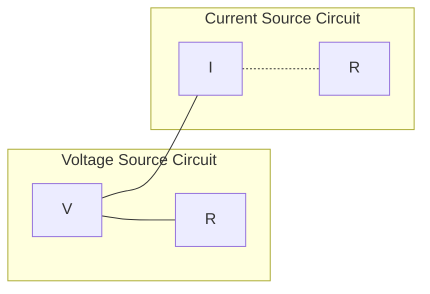
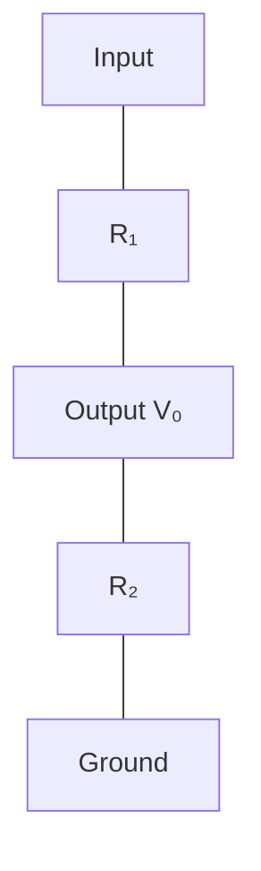
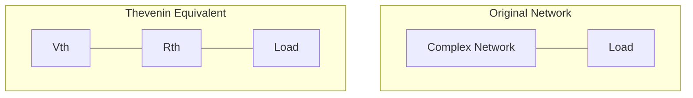
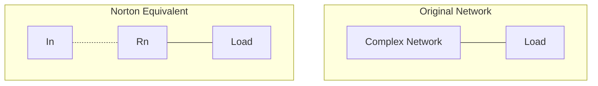
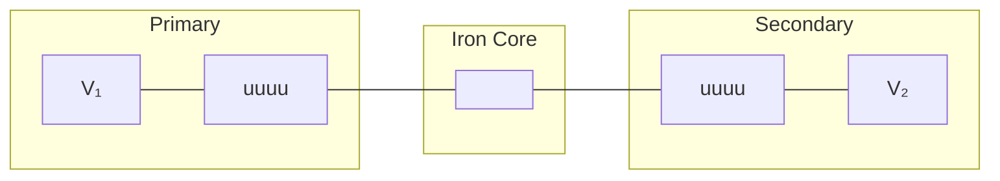
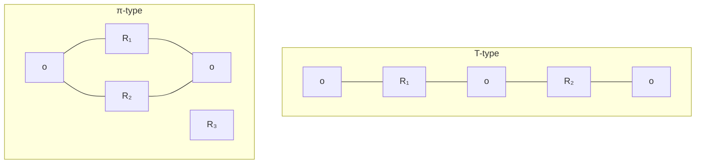
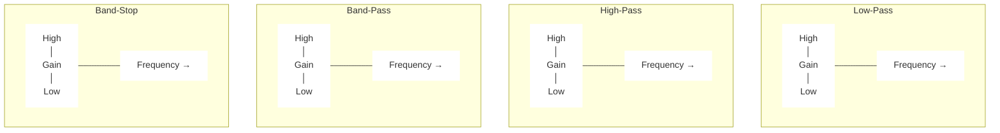

## Question 1(a) [3 marks]

**Explain Source transformation with appropriate diagram.**

**Answer**:
Source transformation is a technique to convert voltage source to current source or vice-versa without changing the external circuit behavior.

**Diagram:**



- **Voltage to Current Source**: I = V/R, same R in parallel
- **Current to Voltage Source**: V = I×R, same R in series

**Mnemonic:** "Value Stays, Resistance Shifts" (V=IR always applies)

## Question 1(b) [4 marks]

**Determine voltage, current and power relationship for two capacitor connected in series.**

**Answer**:

**Table: Capacitors in Series**

| Parameter | Formula | Explanation |
|-----------|---------|-------------|
| Total Capacitance | 1/C<sub>T</sub> = 1/C₁ + 1/C₂ | Reciprocal sum |
| Voltage Distribution | V₁/V₂ = C₂/C₁ | Inverse to capacitance ratio |
| Current | I = I₁ = I₂ | Same current flows through all |
| Charge | Q = Q₁ = Q₂ | Same charge on each capacitor |
| Power | P = VI = V²/X<sub>c</sub> | Where X<sub>c</sub> = 1/2πfC |

- **Voltage division**: V₁ = V × C₂/(C₁+C₂)
- **Charge storage**: Q = C₁C₂V/(C₁+C₂)

**Mnemonic:** "Capacitors in Series: Currents Same, Capacitance Shrinks"

## Question 1(c) [7 marks]

**State difference between Series and parallel connection of resistor and derive the equation of total resistance of parallel connection.**

**Answer**:

**Table: Series vs Parallel Resistors**

| Parameter | Series Connection | Parallel Connection |
|-----------|------------------|---------------------|
| Total Resistance | Increases (R<sub>T</sub> = R₁ + R₂ + ...) | Decreases (R<sub>T</sub> < smallest R) |
| Current | Same through all (I) | Divides (I<sub>T</sub> = I₁ + I₂ + ...) |
| Voltage | Divides (V<sub>T</sub> = V₁ + V₂ + ...) | Same across all (V) |
| Power | P<sub>T</sub> = P₁ + P₂ + ... | P<sub>T</sub> = P₁ + P₂ + ... |

**Derivation for Parallel Resistance:**

By Kirchhoff's Current Law:
I<sub>T</sub> = I₁ + I₂ + ... + I<sub>n</sub>

Substituting I = V/R:
V/R<sub>T</sub> = V/R₁ + V/R₂ + ... + V/R<sub>n</sub>

Dividing by V:
1/R<sub>T</sub> = 1/R₁ + 1/R₂ + ... + 1/R<sub>n</sub>

For two resistors:
1/R<sub>T</sub> = 1/R₁ + 1/R₂, which gives R<sub>T</sub> = R₁R₂/(R₁+R₂)

**Mnemonic:** "In Parallel, Reciprocals Add"

## Question 1(c) OR [7 marks]

**1) Define unilateral, bilateral network, Mesh and Loop.**
**2) Draw voltage division circuit and write equation.**

**Answer**:

**Table: Network Definitions**

| Term | Definition | Example |
|------|------------|---------|
| Unilateral Network | Allows current in one direction only | Diode circuit |
| Bilateral Network | Allows current in both directions | RLC circuit |
| Mesh | Planar network path with no other path inside it | Single closed path |
| Loop | Any closed path in a network | Can contain other elements |

**Voltage Division Circuit:**



**Voltage Division Equation:**
V<sub>o</sub> = V<sub>in</sub> × R₂/(R₁+R₂)

- **Proportional to**: Resistance across which voltage is measured
- **Inversely proportional to**: Total resistance

**Mnemonic:** "Voltage Output equals Input times Resistance Ratio"

## Question 2(a) [3 marks]

**Derive equations to convert T-type network into π-type network**

**Answer**:

**Diagram: T to π Conversion**

```goat
    A    Z₁    B         A            B
     o---\/\/--o          o         o
     |          |          \       /
     |          |    =>     \     /
     Z₃         Z₂           \   /
     |          |            Z₁₂ Z₂₃
     o----------o             \ /
     C                         o
                               C
```

**Conversion Equations:**

- Z₁₂ = (Z₁Z₂ + Z₂Z₃ + Z₃Z₁)/Z₃
- Z₂₃ = (Z₁Z₂ + Z₂Z₃ + Z₃Z₁)/Z₁
- Z₃₁ = (Z₁Z₂ + Z₂Z₃ + Z₃Z₁)/Z₂

Where Z₁, Z₂, Z₃ are T-network impedances and Z₁₂, Z₂₃, Z₃₁ are π-network impedances.

**Mnemonic:** "Sum of all products divided by the opposite"

## Question 2(b) [4 marks]

**Explain Open circuit Impedance Parameter (Z Parameter)**

**Answer**:

**Z-Parameters**: Also called open-circuit impedance parameters because they're measured with output ports open.

**Table: Z-Parameter Equations**

| Parameter | Definition | Calculation |
|-----------|------------|-------------|
| Z₁₁ | Input impedance with output open | Z₁₁ = V₁/I₁ (when I₂=0) |
| Z₁₂ | Transfer impedance from port 2 to port 1 | Z₁₂ = V₁/I₂ (when I₁=0) |
| Z₂₁ | Transfer impedance from port 1 to port 2 | Z₂₁ = V₂/I₁ (when I₂=0) |
| Z₂₂ | Output impedance with input open | Z₂₂ = V₂/I₂ (when I₁=0) |

**Matrix Form:**
[V₁] = [Z₁₁ Z₁₂] × [I₁]
[V₂]   [Z₂₁ Z₂₂]   [I₂]

- **Symmetrical Network**: Z₁₂ = Z₂₁
- **Units**: Ohms (Ω)

**Mnemonic:** "Vs equal Zs times Is"

## Question 2(c) [7 marks]

**Derive the expressions for the characteristic impedance (Z₀ₜ) for Symmetrical T Network.**

**Answer**:

**Diagram: Symmetrical T-Network**

```goat
         Z₁/2        Z₁/2
     o----\/\/----o---\/\/----o
     |            |           |
     |            |           |
    Z₀ₜ          Z₂          Z₀ₜ
     |            |           |
     |            |           |
     o------------o-----------o
```

**Derivation:**

1. For symmetrical T-network, Z₁ is split equally across two arms (Z₁/2 each)
2. For image impedance matching: Z₀ₜ = Z₀ₜ′

By voltage division:
V₂/V₁ = Z₀ₜ/(Z₁/2 + Z₀ₜ + Z₂||Z₀ₜ)

For matched condition:
Z₀ₜ² = (Z₁/2)(Z₁/2 + Z₂)

Therefore:
Z₀ₜ = √[(Z₁/2)(Z₁/2 + Z₂)]
Z₀ₜ = √[Z₁²/4 + Z₁Z₂/2]
Z₀ₜ = √[Z₁(Z₁+2Z₂)/4]

**Mnemonic:** "The square root of Z₁ times what Z₁ meets"

## Question 2(a) OR [3 marks]

**Derive equations to convert π-type network into T-type network.**

**Answer**:

**Diagram: π to T Conversion**

```goat
    A            B         A    Z₁    B
    o          o           o---\/\/---o
     \        /            |          |
      \      /             |          |
      Z₁₂    Z₂₃     =>    Z₃         Z₂
       \    /              |          |
        \  /               o----------o
         o                  C
         C
```

**Conversion Equations:**

- Z₁ = (Z₁₂Z₃₁)/(Z₁₂ + Z₂₃ + Z₃₁)
- Z₂ = (Z₂₃Z₁₂)/(Z₁₂ + Z₂₃ + Z₃₁)
- Z₃ = (Z₃₁Z₂₃)/(Z₁₂ + Z₂₃ + Z₃₁)

Where Z₁₂, Z₂₃, Z₃₁ are π-network impedances and Z₁, Z₂, Z₃ are T-network impedances.

**Mnemonic:** "Product of adjacent pairs divided by sum of all"

## Question 2(b) OR [4 marks]

**Explain Admittance Parameter (Y Parameter).**

**Answer**:

**Y-Parameters**: Also called short-circuit admittance parameters because they're measured with output ports shorted.

**Table: Y-Parameter Equations**

| Parameter | Definition | Calculation |
|-----------|------------|-------------|
| Y₁₁ | Input admittance with output shorted | Y₁₁ = I₁/V₁ (when V₂=0) |
| Y₁₂ | Transfer admittance from port 2 to port 1 | Y₁₂ = I₁/V₂ (when V₁=0) |
| Y₂₁ | Transfer admittance from port 1 to port 2 | Y₂₁ = I₂/V₁ (when V₂=0) |
| Y₂₂ | Output admittance with input shorted | Y₂₂ = I₂/V₂ (when V₁=0) |

**Matrix Form:**
[I₁] = [Y₁₁ Y₁₂] × [V₁]
[I₂]   [Y₂₁ Y₂₂]   [V₂]

- **Symmetrical Network**: Y₁₂ = Y₂₁
- **Units**: Siemens (S)

**Mnemonic:** "Is equal Ys times Vs"

## Question 2(c) OR [7 marks]

**Derive the expressions for the characteristic impedance (Z₀π) for Symmetrical π Network.**

**Answer**:

**Diagram: Symmetrical π-Network**

```goat
     o-----------o----------o
     |           |          |
     |           |          |
    2Z₃         Z₁         2Z₃
     |           |          |
     |           |          |
     o----Z₀π----o----Z₀π---o
```

**Derivation:**

1. For symmetrical π-network, admittance Y₁ in shunt arms is split into 2 equal parts (Y₃ = Y₁/2)
2. For image impedance matching: Z₀π = Z₀π′

By current division:
I₂/I₁ = Z₀π/(Z₀π + Z₁ + Z₀π||2Z₃)

For matched condition:
Z₀π² = Z₁(2Z₃)/(Z₁ + 2Z₃)

Simplifying:
Z₀π = √[Z₁(2Z₃)/(Z₁ + 2Z₃)]
Z₀π = √[2Z₁Z₃/(Z₁ + 2Z₃)]

**Mnemonic:** "Pi's impedance equals the geometric mean of what it sees"

## Question 3(a) [3 marks]

**Explain principal of duality.**

**Answer**:

**Principle of Duality**: For every electrical network, there exists a dual network with similar behavior but with interchanged elements.

**Table: Dual Element Pairs**

| Original Circuit | Dual Circuit |
|-----------------|--------------|
| Voltage (V) | Current (I) |
| Current (I) | Voltage (V) |
| Resistance (R) | Conductance (G) |
| Inductance (L) | Capacitance (C) |
| Series Connection | Parallel Connection |
| KVL | KCL |
| Mesh Analysis | Nodal Analysis |

- **Network Transformation**: Replace each element with its dual
- **Topology Transformation**: Replace each node with a loop and each loop with a node

**Mnemonic:** "Series to Parallel, Source turns dual, V becomes I and I becomes V"

## Question 3(b) [4 marks]

**State and Explain Thevenin's Theorem.**

**Answer**:

**Thevenin's Theorem**: Any linear two-terminal network can be replaced by an equivalent circuit consisting of a voltage source (V<sub>th</sub>) in series with a resistance (R<sub>th</sub>).

**Diagram:**



**Finding Thevenin Equivalent:**

1. Remove the load resistance
2. Calculate open-circuit voltage (V<sub>th</sub>)
3. Find R<sub>th</sub> by:
   - Deactivating all sources (V=0, I=0)
   - Calculate resistance between terminals

**Mnemonic:** "Open for Voltage, Dead for Resistance"

## Question 3(c) [7 marks]

**State and explain KCL and KVL with example.**

**Answer**:

**Table: Kirchhoff's Laws**

| Law | Statement | Mathematical Form | Application |
|-----|-----------|-------------------|-------------|
| KCL | Sum of currents entering a node equals sum of currents leaving it | ∑I<sub>in</sub> = ∑I<sub>out</sub> | Node Analysis |
| KVL | Sum of voltage drops around any closed loop equals zero | ∑V = 0 | Mesh Analysis |

**KCL Example:**

```goat
        I₁
        ↓
        o
       / \
      /   \
     I₂    I₃
    /       \
   o         o

At node: I₁ = I₂ + I₃
```

**KVL Example:**

```goat
    +    R₁     +
    o---\/\/\/--o
    |           |
   V₁           R₂
    |           |
    o-----------o
    -           -

Around loop: V₁ - I×R₁ - I×R₂ = 0
```

**Mnemonic:** "Currents at nodes sum to zero, Voltages round loops also do"

## Question 3(a) OR [3 marks]

**Explain the solution of a network by Mesh Analysis.**

**Answer**:

**Mesh Analysis**: A circuit analysis method that uses mesh currents as variables to solve for unknown currents and voltages.

**Diagram: Simple Two-Mesh Circuit**

```goat
    +   R₁    +   R₃   +
    o--\/\/\--o--\/\/\--o
    |         |         |
   V₁        R₂        V₂
    |         |         |
    o---------o---------o
    -         -         -
     Mesh 1     Mesh 2
```

**Steps:**

1. Identify meshes (closed loops)
2. Assign clockwise mesh currents (I₁, I₂)
3. Apply KVL to each mesh
4. Solve the resulting simultaneous equations

**Example Equations:**

- Mesh 1: V₁ = I₁(R₁+R₂) - I₂R₂
- Mesh 2: -V₂ = -I₁R₂ + I₂(R₂+R₃)

**Mnemonic:** "Assign, Apply KVL, Arrange, and Solve"

## Question 3(b) OR [4 marks]

**State and Explain Norton's Theorem.**

**Answer**:

**Norton's Theorem**: Any linear two-terminal network can be replaced by an equivalent circuit consisting of a current source (I<sub>N</sub>) in parallel with a resistance (R<sub>N</sub>).

**Diagram:**



**Finding Norton Equivalent:**

1. Remove the load resistance
2. Calculate short-circuit current (I<sub>N</sub>)
3. Find R<sub>N</sub> by:
   - Deactivating all sources (V=0, I=0)
   - Calculate resistance between terminals (R<sub>N</sub> = R<sub>th</sub>)

**Mnemonic:** "Short for Current, Dead for Resistance"

## Question 3(c) OR [7 marks]

**State and explain Maximum power transfer theorem. Derive condition for maximum power transfer.**

**Answer**:

**Maximum Power Transfer Theorem**: A load receives maximum power when its resistance equals the Thevenin equivalent resistance of the network.

**Diagram:**


**Derivation:**

1. Power delivered to load: P = I²R<sub>L</sub>
2. Current through circuit: I = V<sub>th</sub>/(R<sub>th</sub> + R<sub>L</sub>)
3. Substituting: P = V<sub>th</sub>²R<sub>L</sub>/(R<sub>th</sub> + R<sub>L</sub>)²
4. Differentiating with respect to R<sub>L</sub> and setting to zero:
   dP/dR<sub>L</sub> = 0

5. This gives: R<sub>L</sub> = R<sub>th</sub>

6. Maximum power: P<sub>max</sub> = V<sub>th</sub>²/(4R<sub>th</sub>)

**Mnemonic:** "Match to maximize"

## Question 4(a) [3 marks]

**Derive equation of Q factor for coil.**

**Answer**:

**Q Factor (Quality Factor)** for a coil represents the ratio of inductive reactance to resistance.

**Diagram: Coil with Resistance**

```goat
    o----\/\/\/----uuuu----o
         R          L
```

**Derivation:**

1. For an inductor with resistance, impedance Z = R + jωL
2. Q factor is defined as: Q = Reactive Power / Active Power
3. Q = ωL/R

Where:

- L = Inductance in Henries
- R = Series resistance in Ohms
- ω = 2πf, Angular frequency

**Mnemonic:** "Quality equals Reactance over Resistance"

## Question 4(b) [4 marks]

**Derive the formula for resonant frequency for a parallel RLC circuit.**

**Answer**:

**Diagram: Parallel RLC Circuit**

```goat
        o-----o
        |     |
        R     |
        |     |
        o     |
        |     |
        C     L
        |     |
        o-----o
```

**Derivation:**

1. Admittance of parallel RLC: Y = 1/R + jωC + 1/jωL = 1/R + j(ωC - 1/ωL)
2. At resonance, imaginary part is zero: ωC - 1/ωL = 0
3. Solving for ω: ω² = 1/LC
4. Therefore: ω = 1/√(LC)
5. Resonance frequency: f<sub>r</sub> = 1/(2π√(LC))

**Note:** R affects bandwidth but not resonance frequency.

**Mnemonic:** "One over Two Pi times Square Root of LC"

## Question 4(c) [7 marks]

**Write types of coupled circuits with necessary diagram and explain iron core transformer.**

**Answer**:

**Table: Types of Coupled Circuits**

| Type | Coupling Medium | Application |
|------|----------------|-------------|
| Direct Coupling | Conductively connected | DC amplifiers |
| Capacitive Coupling | Capacitor | AC signal coupling |
| Inductive Coupling | Magnetic field | Transformers |
| Resistive Coupling | Resistor | Low-frequency signals |

**Diagram: Iron Core Transformer**



**Iron Core Transformer:**

- **Principle**: Mutual inductance through iron core
- **Function**: Transfers energy between circuits by electromagnetic induction
- **Coupling Coefficient**: k ≈ 1 (near perfect coupling)
- **Turns Ratio**: V₂/V₁ = N₂/N₁
- **Advantages**: High efficiency, good coupling

**Mnemonic:** "Primary excites, Core conducts, Secondary delivers"

## Question 4(a) OR [3 marks]

**Derive equation of Q factor for capacitor.**

**Answer**:

**Q Factor (Quality Factor)** for a capacitor represents the ratio of capacitive reactance to resistance.

**Diagram: Capacitor with Resistance**

```goat
    o----\/\/\/----||----o
         R          C
```

**Derivation:**

1. For a capacitor with series resistance, impedance Z = R - j/(ωC)
2. Q factor is defined as: Q = Reactive Power / Active Power
3. Q = 1/(ωCR)

Where:

- C = Capacitance in Farads
- R = Series resistance in Ohms
- ω = 2πf, Angular frequency

**Mnemonic:** "Quality equals One over Resistance times Reactance"

## Question 4(b) OR [4 marks]

**Derive the equation of resonance frequency for a series resonance circuit.**

**Answer**:

**Diagram: Series RLC Circuit**

```goat
    o----\/\/\/----uuuu----||----o
         R          L       C
```

**Derivation:**

1. Impedance of series RLC: Z = R + jωL - j/(ωC) = R + j(ωL - 1/ωC)
2. At resonance, imaginary part is zero: ωL - 1/ωC = 0
3. Solving for ω: ω² = 1/LC
4. Therefore: ω = 1/√(LC)
5. Resonance frequency: f<sub>r</sub> = 1/(2π√(LC))

**Key Points:**

- At resonance, impedance is purely resistive: Z = R
- Circuit appears as a resistor
- Current is maximum at resonance

**Mnemonic:** "One over Two Pi times Square Root of LC"

## Question 4(c) OR [7 marks]

**Derive the Expression for coefficient coupling between pair of magnetically coupled coils.**

**Answer**:

**Diagram: Magnetically Coupled Coils**

```goat
       uuuu   k   uuuu
    o--WWWW-------WWWW--o
       L₁          L₂    
```

**Derivation:**

1. Mutual inductance (M) relates to individual inductances by: M = k√(L₁L₂)
2. Solving for k: k = M/√(L₁L₂)

Where:

- k = Coefficient of coupling (0 ≤ k ≤ 1)
- M = Mutual inductance in Henries
- L₁, L₂ = Self-inductances of coils in Henries

**Table: Coupling Coefficient Values**

| Value of k | Coupling Type | Application |
|------------|---------------|-------------|
| k = 0 | No coupling | Separate circuits |
| 0 < k < 0.5 | Loose coupling | RF transformers |
| 0.5 < k < 1 | Tight coupling | Power transformers |
| k = 1 | Perfect coupling | Ideal transformer |

**Mnemonic:** "Mutual over square root of product"

## Question 5(a) [3 marks]

**Define Neper and dB. Establish relationship between Neper and dB.**

**Answer**:

**Table: Neper and dB Definitions**

| Unit | Definition | Formula | Usage |
|------|------------|---------|-------|
| Neper (Np) | Natural logarithmic ratio | N = ln(V₁/V₂) or ln(I₁/I₂) | Power system analysis |
| Decibel (dB) | Common logarithmic ratio | dB = 20log₁₀(V₁/V₂) or 10log₁₀(P₁/P₂) | Signal level measurement |

**Relationship:**

1. N = ln(V₁/V₂)
2. dB = 20log₁₀(V₁/V₂)
3. Since ln(x) = 2.303 × log₁₀(x)
4. Therefore: N = 2.303 × dB/20 = 0.1152 × dB
5. Conversely: dB = 8.686 × N

**Mnemonic:** "A Neper is 8.686 dB"

## Question 5(b) [4 marks]

**Classify various types of Attenuators.**

**Answer**:

**Table: Types of Attenuators**

| Type | Structure | Characteristics | Applications |
|------|-----------|----------------|-------------|
| T-type | Three resistors in T formation | Fixed impedance, good balance | Signal level control |
| π-type (Pi) | Three resistors in π formation | Better isolation, more common | RF signal attenuation |
| L-type | Two resistors in L formation | Simple, unbalanced | Basic level adjustment |
| Bridged T | T with bridging resistor | Constant impedance | Audio applications |
| Balanced | Symmetrical design | Good CMRR | Balanced transmission |
| Lattice | Diamond-shaped | Balanced, symmetrical | Telephone systems |

**Diagram: Basic Attenuator Types**



**Mnemonic:** "Tees, Pies and Ells attenuate the signals well"

## Question 5(c) [7 marks]

**Determine the cut-off frequency and the nominal impedance of each of the low-pass filter sections shown below.**

**Answer**:

**Diagram: Low-Pass Filter Sections**

```goat
    T-section:                   π-section:
    o---L/2---o---L/2---o       o------------o-----------o
             |                   |           |           |
             C                   C/2         |          C/2
             |                   |           |           |
    o--------o-----------o      o-----L------o-----------o
```

**For T-section:**

- Cut-off frequency: f<sub>c</sub> = 1/(π√(LC))
- Nominal impedance: R₀ = √(L/C)
- Where L = 10 mH, C = 0.1 μF

Calculation:
f<sub>c</sub> = 1/(π√(10×10⁻³ × 0.1×10⁻⁶)) = 1/(π√(10⁻⁹)) = 1/(π×10⁻⁴·⁵) = 3.18 kHz
R₀ = √(10×10⁻³/0.1×10⁻⁶) = √(10⁵) = 316.23 Ω

**For π-section:**

- Cut-off frequency: f<sub>c</sub> = 1/(π√(LC))
- Nominal impedance: R₀ = √(L/C)
- Same values as T-section

**Mnemonic:** "Cut-off frequency is inverse to the square root of LC"

## Question 5(a) OR [3 marks]

**Explain the limitation of constant k type filters.**

**Answer**:

**Table: Limitations of Constant-k Filters**

| Limitation | Description | Effect |
|------------|-------------|--------|
| Impedance Matching | Impedance varies with frequency | Signal reflection, power loss |
| Attenuation Band | Gradual transition at cut-off | Poor frequency selectivity |
| Phase Response | Non-linear phase characteristic | Signal distortion |
| Passband Ripple | Non-uniform response in passband | Signal amplitude variation |
| Roll-off Rate | Slow roll-off (20 dB/decade) | Poor stop-band rejection |

- **Main issue**: Poor transition from pass to stop band
- **Improvement**: Using m-derived filters

**Mnemonic:** "Poor Matching And Transition Results In Distortion"

## Question 5(b) OR [4 marks]

**Derive equation of cut-off frequency for T-type Constant-k high Pass filter.**

**Answer**:

**Diagram: T-type Constant-k High Pass Filter**

```goat
    o---C/2---o----C/2------o
              |               
              L
              |
    o---------o-------------o
```

**Derivation:**

1. For high-pass filter, series elements are capacitors and shunt elements are inductors
2. Transfer function: H(jω) = Z₂/(Z₁ + Z₂)
3. Where Z₁ = 1/(jωC) and Z₂ = jωL
4. Impedance condition for cut-off: Z₁/Z₂ = 4 or Z₁/4Z₂ = 1
5. Substituting: 1/(jωC) = 4jωL
6. Solving for ω: ω² = 1/(4LC)
7. Cut-off frequency: f<sub>c</sub> = 1/(4π√(LC))

**Mnemonic:** "High Pass cuts frequencies below one over four pi L-C"

## Question 5(c) OR [7 marks]

**Give classification of filters using definitions and characteristics graphs for each.**

**Answer**:

**Table: Filter Classification**

| Filter Type | Passes | Blocks | Applications |
|-------------|--------|--------|--------------|
| Low-Pass | Frequencies below f<sub>c</sub> | Frequencies above f<sub>c</sub> | Audio amplifiers, power supplies |
| High-Pass | Frequencies above f<sub>c</sub> | Frequencies below f<sub>c</sub> | Noise elimination, treble control |
| Band-Pass | Range between f<sub>L</sub> and f<sub>H</sub> | Frequencies outside range | Radio tuning, equalizers |
| Band-Stop | Frequencies outside range | Range between f<sub>L</sub> and f<sub>H</sub> | Noise elimination, notch filters |
| All-Pass | All frequencies with unity gain | None (changes only phase) | Phase correction, time delay |

**Characteristic Response Graphs:**



**Filter Implementations:**

- **Passive**: Uses R, L, C components
- **Active**: Uses op-amps with RC networks
- **Digital**: Uses DSP algorithms

**Mnemonic:** "Low-High-Band-Stop makes Signals Perfect"
