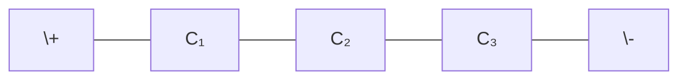
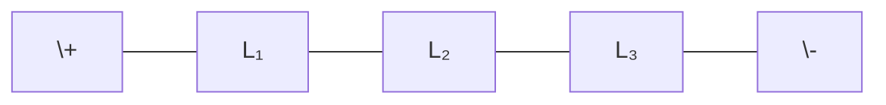
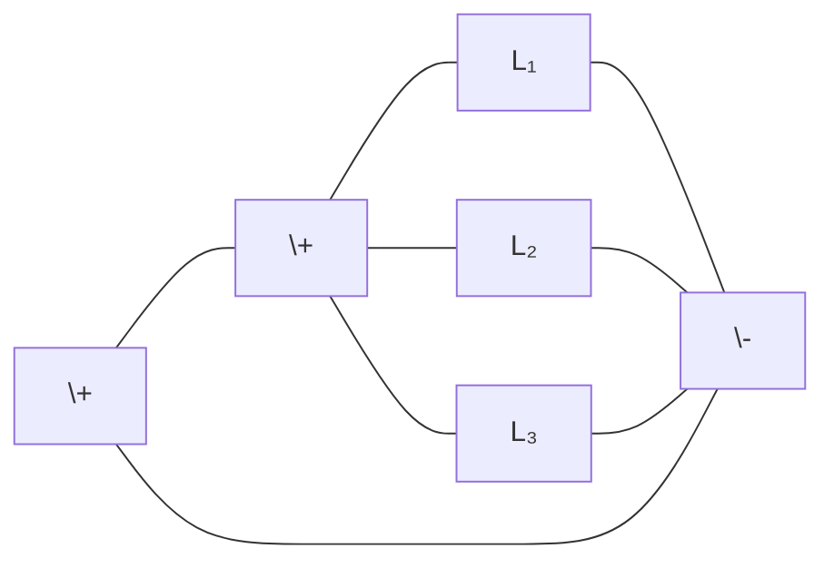
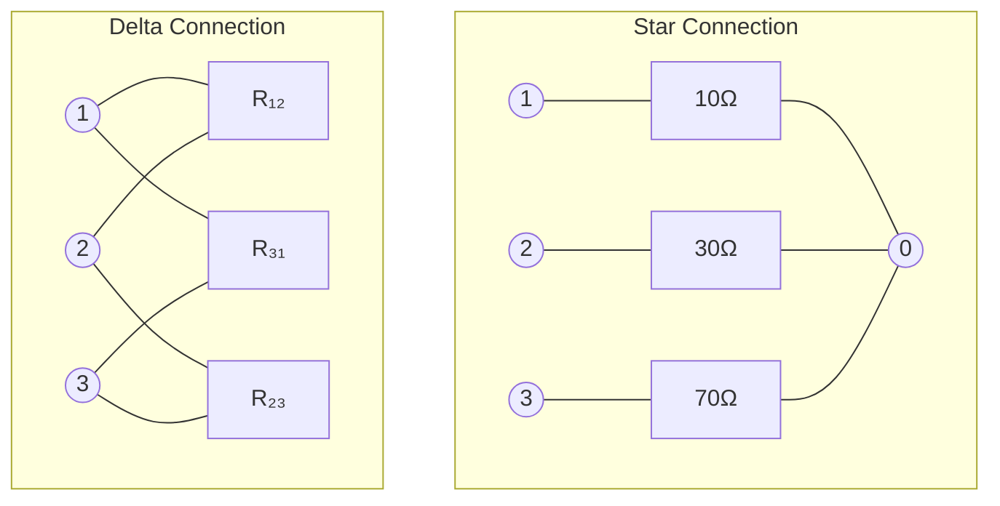

## પ્રશ્ન 1(a) [3 ગુણ]

**ઇલેક્ટ્રોનીક નેટવર્ક માટે (i) નોડ (ii) બ્રાંચ અને (iii) લૂપ ની વ્યાખ્યા આપો.**

**જવાબ**:

**નોડ**: 

- **જંક્શન પોઈન્ટ** જ્યાં બે અથવા વધુ બ્રાંચ નેટવર્કમાં મળે છે
- એવા બિંદુઓ જ્યાં ઘટકો જોડાયેલા હોય છે
- નોડ પર બધી બ્રાંચોનો કરંટ સરવાળો શૂન્ય થાય છે

**બ્રાંચ**: 

- **સિંગલ ઘટક** (R, L, અથવા C) અથવા બે નોડ્સને જોડતો પાથ
- દરેક બ્રાંચમાં એક ચોક્કસ કરંટ વહે છે
- એક્ટીવ બ્રાંચમાં સોર્સ હોય છે; પેસિવ બ્રાંચમાં R, L, C હોય છે

**લૂપ**: 

- નેટવર્કમાં જોડાયેલા બ્રાંચોથી બનતો **બંધ પાથ**
- કોઈ નોડ એક કરતાં વધુ વખત આવતું નથી
- નેટવર્ક ઉકેલવા માટે લૂપ એનાલિસિસમાં વપરાય છે

**મેમરી ટ્રીક:** "NBL: નોડ્સ જોડાય, બ્રાંચેસ કનેક્ટ, લૂપ્સ સર્કલ"

## પ્રશ્ન 1(b) [4 ગુણ]

**200 Ω, 300 Ω અને 500 Ω ના રેઝીસ્ટર 100 V ના સપ્લાય સાથે પેરેલલમાં જોડાયેલા છે. તો (i) દરેક રેઝીસ્ટરમાંથી પસાર થતો કરંટ તથા કુલ કરંટ (ii) ઇક્વીવેલન્ટ રેઝીસ્ટર શોધો.**

**જવાબ**:

**ગણતરીઓનું કોષ્ટક:**

| પેરામીટર | ફોર્મ્યુલા | ગણતરી | પરિણામ |
|-----------|---------|-------------|--------|
| I₁ (200Ω) | I = V/R | 100V/200Ω | 0.5A |
| I₂ (300Ω) | I = V/R | 100V/300Ω | 0.333A |
| I₃ (500Ω) | I = V/R | 100V/500Ω | 0.2A |
| I₍ₜₒₜₐₗ₎ | I₁+I₂+I₃ | 0.5+0.333+0.2 | 1.033A |
| R₍ₑq₎ | 1/R₍ₑq₎ = 1/R₁+1/R₂+1/R₃ | 1/200+1/300+1/500 | 96.77Ω |

**મેમરી ટ્રીક:** "પેરેલલ પાથ કરંટને અવરોધના વ્યસ્ત પ્રમાણમાં વહેંચે છે"

## પ્રશ્ન 1(c) [7 ગુણ]

**કેપેસીટર માટે સિરીઝ અને પેરેલલ જોડાણ સમજાવો.**

**જવાબ**:

**સિરીઝમાં કેપેસીટર:**



**કોષ્ટક: સિરીઝ કેપેસીટરોની વિશેષતાઓ**

| વિશેષતા | ફોર્મ્યુલા | વર્ણન |
|----------|---------|-------------|
| ઇક્વિવેલન્ટ કેપેસિટન્સ | 1/C₍ₑq₎ = 1/C₁ + 1/C₂ + 1/C₃ | હંમેશા નાનામાં નાના કેપેસિટર કરતાં નાનું |
| ચાર્જ | Q = Q₁ = Q₂ = Q₃ | બધા કેપેસિટર પર સરખો |
| વોલ્ટેજ | V = V₁ + V₂ + V₃ | 1/C ના રેશિયો પ્રમાણે વહેંચાય છે |
| ઊર્જા | E = CV²/2 | કેપેસિટર્સમાં વહેંચાયેલી |

**પેરેલલમાં કેપેસીટર:**


**કોષ્ટક: પેરેલલ કેપેસીટરોની વિશેષતાઓ**

| વિશેષતા | ફોર્મ્યુલા | વર્ણન |
|----------|---------|-------------|
| ઇક્વિવેલન્ટ કેપેસિટન્સ | C₍ₑq₎ = C₁ + C₂ + C₃ | વ્યક્તિગત કેપેસિટન્સનો સરવાળો |
| ચાર્જ | Q = Q₁ + Q₂ + Q₃ | C ની કિંમત અનુસાર વહેંચાય છે |
| વોલ્ટેજ | V = V₁ = V₂ = V₃ | બધા કેપેસિટર પર સરખો |
| ઊર્જા | E = CV²/2 | વ્યક્તિગત ઊર્જાનો સરવાળો |

**મેમરી ટ્રીક:** "સિરીઝ કેપ્સમાં વ્યસ્ત સરવાળો, પેરેલલ કેપ્સમાં સીધો સરવાળો"

## પ્રશ્ન 1(c) OR [7 ગુણ]

**ઇન્ડક્ટર માટે સિરીઝ અને પેરેલલ જોડાણ સમજાવો.**

**જવાબ**:

**સિરીઝમાં ઇન્ડક્ટર:**



**કોષ્ટક: સિરીઝ ઇન્ડક્ટરોની વિશેષતાઓ**

| વિશેષતા | ફોર્મ્યુલા | વર્ણન |
|----------|---------|-------------|
| ઇક્વિવેલન્ટ ઇન્ડક્ટન્સ | L₍ₑq₎ = L₁ + L₂ + L₃ | વ્યક્તિગત ઇન્ડક્ટન્સનો સરવાળો |
| કરંટ | I = I₁ = I₂ = I₃ | બધા ઇન્ડક્ટર પર સરખો |
| વોલ્ટેજ | V = V₁ + V₂ + V₃ | L ના રેશિયો અનુસાર વહેંચાય છે |
| ઊર્જા | E = LI²/2 | વ્યક્તિગત ઊર્જાનો સરવાળો |

**પેરેલલમાં ઇન્ડક્ટર:**



**કોષ્ટક: પેરેલલ ઇન્ડક્ટરોની વિશેષતાઓ**

| વિશેષતા | ફોર્મ્યુલા | વર્ણન |
|----------|---------|-------------|
| ઇક્વિવેલન્ટ ઇન્ડક્ટન્સ | 1/L₍ₑq₎ = 1/L₁ + 1/L₂ + 1/L₃ | હંમેશા નાનામાં નાના ઇન્ડક્ટર કરતાં નાનું |
| કરંટ | I = I₁ + I₂ + I₃ | 1/L ના રેશિયો અનુસાર વહેંચાય છે |
| વોલ્ટેજ | V = V₁ = V₂ = V₃ | બધા ઇન્ડક્ટર પર સરખો |
| ઊર્જા | E = LI²/2 | ઇન્ડક્ટરોમાં વહેંચાયેલી |

**મેમરી ટ્રીક:** "સિરીઝ ઇન્ડક્ટરોમાં સીધો સરવાળો, પેરેલલ ઇન્ડક્ટરોમાં વ્યસ્ત સરવાળો"

## પ્રશ્ન 2(a) [3 ગુણ]

**નેટવર્ક એલીમેન્ટને વર્ગીકૃત કરો.**

**જવાબ**:

**કોષ્ટક: નેટવર્ક એલીમેન્ટનું વર્ગીકરણ**

| શ્રેણી | પ્રકારો | ઉદાહરણો |
|----------|-------|----------|
| **એક્ટિવ vs પેસિવ** | એક્ટિવ | વોલ્ટેજ/કરંટ સોર્સ, ટ્રાન્ઝિસ્ટર |
|  | પેસિવ | રેઝિસ્ટર, કેપેસિટર, ઇન્ડક્ટર |
| **લિનિયર vs નોન-લિનિયર** | લિનિયર | રેઝિસ્ટર, આદર્શ સોર્સ |
|  | નોન-લિનિયર | ડાયોડ, ટ્રાન્ઝિસ્ટર |
| **બાઇલેટરલ vs યુનિલેટરલ** | બાઇલેટરલ | રેઝિસ્ટર, કેપેસિટર, ઇન્ડક્ટર |
|  | યુનિલેટરલ | ડાયોડ, ટ્રાન્ઝિસ્ટર |
| **લમ્પ્ડ vs ડિસ્ટ્રિબ્યુટેડ** | લમ્પ્ડ | ડિસક્રીટ R, L, C ઘટકો |
|  | ડિસ્ટ્રિબ્યુટેડ | ટ્રાન્સમિશન લાઇન |

**મેમરી ટ્રીક:** "ALBU: એક્ટિવ/પેસિવ, લિનિયર/નોન-લિનિયર, બાઇલેટરલ/યુનિલેટરલ, લમ્પ્ડ/ડિસ્ટ્રિબ્યુટેડ"

## પ્રશ્ન 2(b) [4 ગુણ]

**10, 30 અને 70 ohms ના રેઝીસ્ટર સ્ટારમાં કનેક્ટ કરેલા છે. ડેલ્ટા કનેક્શનનાં ઇક્વીવેલન્ટ રેઝીસ્ટર શોધો.**

**જવાબ**:

**આકૃતિ: સ્ટાર થી ડેલ્ટા રૂપાંતરણ**



**કોષ્ટક: સ્ટાર-ડેલ્ટા રૂપાંતરણ ફોર્મ્યુલા અને ગણતરીઓ**

| ડેલ્ટા રેઝીસ્ટન્સ | ફોર્મ્યુલા | ગણતરી | પરિણામ |
|------------------|---------|-------------|--------|
| R₁₂ | (R₁×R₂+R₂×R₃+R₃×R₁)/R₃ | (10×30+30×70+70×10)/70 | 47.14Ω |
| R₂₃ | (R₁×R₂+R₂×R₃+R₃×R₁)/R₁ | (10×30+30×70+70×10)/10 | 330Ω |
| R₃₁ | (R₁×R₂+R₂×R₃+R₃×R₁)/R₂ | (10×30+30×70+70×10)/30 | 110Ω |

**મેમરી ટ્રીક:** "સ્ટાર-ડેલ્ટા: ગુણાકારનો સરવાળો વિરુદ્ધ રેઝ

## પ્રશ્ન 2(c) [7 ગુણ]

**π નેટવર્ક સમજાવો.**

**જવાબ**:

**આકૃતિ: π (પાઈ) નેટવર્ક**

```goat
       Z1
   o----www----o
   |           |
   |           |
   |           |
  Z3          Z2
   |           |
   |           |
   o-----o-----o
      Ground
```

**કોષ્ટક: π નેટવર્ક વિશેષતાઓ**

| પેરામીટર | વર્ણન |
|-----------|-------------|
| **સ્ટ્રક્ચર** | બે શન્ટ ઇમ્પિડન્સ (Z₃, Z₂) અને એક સિરીઝ ઇમ્પિડન્સ (Z₁) |
| **ટ્રાન્સમિશન પેરામીટર્સ** | A = 1 + Z₁/Z₂, B = Z₁, C = 1/Z₂ + 1/Z₃ + Z₁/(Z₂×Z₃), D = 1 + Z₁/Z₃ |
| **ઇમ્પિડન્સ પેરામીટર્સ** | Z₁₁ = Z₁ + Z₃, Z₁₂ = Z₁, Z₂₁ = Z₁, Z₂₂ = Z₁ + Z₂ |
| **ઇમેજ ઇમ્પિડન્સ** | Z₀π = √(Z₁Z₂Z₃/(Z₂+Z₃)) |
| **એપ્લિકેશન** | મેચિંગ નેટવર્ક, ફિલ્ટર, એટેન્યુએટર |
| **રૂપાંતરણ** | T-નેટવર્કમાં રૂપાંતરિત કરી શકાય છે |

**મેમરી ટ્રીક:** "π ના બે પગ નીચે, એક શાખા આડી"

## પ્રશ્ન 2(a) OR [3 ગુણ]

**નેટવર્કનાં પ્રકારો જણાવો.**

**જવાબ**:

**કોષ્ટક: નેટવર્કના પ્રકારો**

| શ્રેણી | પ્રકારો | 
|----------|-------|
| **લિનિયારિટી આધારિત** | લિનિયર નેટવર્ક, નોન-લિનિયર નેટવર્ક |
| **ઘટકો આધારિત** | પેસિવ નેટવર્ક, એક્ટિવ નેટવર્ક |
| **પેરામીટર આધારિત** | ટાઇમ-વેરિયન્ટ, ટાઇમ-ઇન્વેરિયન્ટ નેટવર્ક |
| **કોન્ફિગરેશન આધારિત** | T-નેટવર્ક, π-નેટવર્ક, લેટિસ નેટવર્ક |
| **પોર્ટ આધારિત** | વન-પોર્ટ, ટુ-પોર્ટ, મલ્ટિ-પોર્ટ નેટવર્ક |
| **સિમેટ્રી આધારિત** | સિમેટ્રિકલ, એસિમેટ્રિકલ નેટવર્ક |
| **રેસિપ્રોસિટી આધારિત** | રેસિપ્રોકલ, નોન-રેસિપ્રોકલ નેટવર્ક |

**મેમરી ટ્રીક:** "LEPCPS: લિનિયારિટી, એલિમેન્ટ્સ, પેરામીટર્સ, કોન્ફિગરેશન, પોર્ટ્સ, સિમેટ્રી"

## પ્રશ્ન 2(b) OR [4 ગુણ]

**20, 50 અને 100 ohms ના રેઝીસ્ટર ડેલ્ટામાં કનેક્ટ કરેલા છે. સ્ટાર કનેક્શનનાં ઇક્વીવેલન્ટ રેઝીસ્ટર શોધો.**

**જવાબ**:

**આકૃતિ: ડેલ્ટા થી સ્ટાર રૂપાંતરણ**

```goat
     Delta Connection          Star Connection
        1                         1
        o                         o
       / \                       /
      /   \                     /
R12=20Ω   R31=100Ω          R1=?
    /       \                 /
   /         \               /
  o-----------o             o-----------o
  2    R23=50Ω 3             2    R2=?  0
                                     \
                                      \
                                       \
                                        \
                                         \
                                          o
                                          3
                                         /
                                        /
                                       /
                                    R3=?
```

**કોષ્ટક: ડેલ્ટા-સ્ટાર રૂપાંતરણ ફોર્મ્યુલા અને ગણતરીઓ**

| સ્ટાર રેઝીસ્ટન્સ | ફોર્મ્યુલા | ગણતરી | પરિણામ |
|-----------------|---------|-------------|--------|
| R₁ | (R₁₂×R₃₁)/(R₁₂+R₂₃+R₃₁) | (20×100)/(20+50+100) | 11.76Ω |
| R₂ | (R₁₂×R₂₃)/(R₁₂+R₂₃+R₃₁) | (20×50)/(20+50+100) | 5.88Ω |
| R₃ | (R₂₃×R₃₁)/(R₁₂+R₂₃+R₃₁) | (50×100)/(20+50+100) | 29.41Ω |

**મેમરી ટ્રીક:** "ડેલ્ટા-સ્ટાર: આજુબાજુના જોડાનો ગુણાકાર બધાના સરવાળા ઉપર"

## પ્રશ્ન 2(c) OR [7 ગુણ]

**T નેટવર્ક સમજાવો.**

**જવાબ**:

**આકૃતિ: T નેટવર્ક**

```goat
         Z1        Z2
     o---www---o---www---o
               |
               |
               Z3
               |
               |
               o
             Ground
```

**કોષ્ટક: T નેટવર્ક વિશેષતાઓ**

| પેરામીટર | વર્ણન |
|-----------|-------------|
| **સ્ટ્રક્ચર** | બે સિરીઝ ઇમ્પિડન્સ (Z₁, Z₂) અને એક શન્ટ ઇમ્પિડન્સ (Z₃) |
| **ટ્રાન્સમિશન પેરામીટર્સ** | A = 1 + Z₁/Z₃, B = Z₁ + Z₂ + Z₁Z₂/Z₃, C = 1/Z₃, D = 1 + Z₂/Z₃ |
| **ઇમ્પિડન્સ પેરામીટર્સ** | Z₁₁ = Z₁ + Z₃, Z₁₂ = Z₃, Z₂₁ = Z₃, Z₂₂ = Z₂ + Z₃ |
| **ઇમેજ ઇમ્પિડન્સ** | Z₀T = √(Z₁Z₂ + Z₁Z₃ + Z₂Z₃) |
| **એપ્લિકેશન** | મેચિંગ નેટવર્ક, ફિલ્ટર, એટેન્યુએટર |
| **રૂપાંતરણ** | π-નેટવર્કમાં રૂપાંતરિત કરી શકાય છે |

**મેમરી ટ્રીક:** "T ની બે બાહુ આડી, એક પગ નીચે"

## પ્રશ્ન 3(a) [3 ગુણ]

**Kirchhoff's law સમજાવો.**

**જવાબ**:

**Kirchhoff's Current Law (KCL):**

- નોડમાં **પ્રવેશતા કરંટનો સરવાળો** તે નોડમાંથી નીકળતા કરંટના સરવાળા બરાબર હોય છે
- કોઈપણ નોડ પર કરંટનો બીજગણિતીય સરવાળો શૂન્ય હોય છે
- ∑I = 0 (પ્રવેશતા કરંટ પોઝિટિવ, નીકળતા નેગેટિવ)

**Kirchhoff's Voltage Law (KVL):**

- કોઈપણ બંધ લૂપમાં **વોલ્ટેજ ડ્રોપનો સરવાળો** શૂન્ય થાય છે
- ∑V = 0 (વોલ્ટેજ વૃદ્ધિ પોઝિટિવ, ડ્રોપ નેગેટિવ)
- ઊર્જાના સંરક્ષણ પર આધારિત છે

**આકૃતિ: Kirchhoff's Laws**

```goat
      KCL:                  KVL:
      I1                    V1
      →                     ↑
      o                     o
     ↑↓                    ↗ ↘
    I4 I2                 V4   V2
     ↑↓                    ↖ ↙
      o                     o
      ←                     ↓
      I3                    V3
```

**મેમરી ટ્રીક:** "કરંટ કન્વર્જ, વોલ્ટેજ વોયેજ ઈન અ લૂપ"

## પ્રશ્ન 3(b) [4 ગુણ]

**Nodal analysis સમજાવો.**

**જવાબ**:

**આકૃતિ: નોડલ એનાલિસિસ કોન્સેપ્ટ**

```goat
   Step 1: Identify nodes
           ↓
   Step 2: Select reference node
           ↓
   Step 3: Assign node voltages
           ↓
   Step 4: Apply KCL at each node
           ↓
   Step 5: Solve equations
```

**કોષ્ટક: નોડલ એનાલિસિસ મેથડ**

| સ્ટેપ | વર્ણન |
|------|-------------|
| 1. રેફરન્સ નોડ પસંદ કરો | સામાન્ય રીતે ગ્રાઉન્ડ (0V) |
| 2. વોલ્ટેજ અસાઇન કરો | બાકીના નોડ વોલ્ટેજને લેબલ કરો (V₁, V₂, વગેરે) |
| 3. KCL લાગુ કરો | દરેક નોન-રેફરન્સ નોડ પર KCL સમીકરણ લખો |
| 4. કરંટને એક્સપ્રેસ કરો | ઓહ્મના નિયમનો ઉપયોગ કરીને બ્રાન્ચ કરંટ એક્સપ્રેસ કરો |
| 5. સમીકરણો ઉકેલો | સિમલ્ટેનિયસ ઇક્વેશન વડે નોડ વોલ્ટેજ શોધો |

**ઉદાહરણ: V₁ અને V₂ વોલ્ટેજવાળા નોડ્સ માટે:**

- નોડ 1 પર KCL: (V₁-0)/R₁ + (V₁-V₂)/R₂ + I₁ = 0
- નોડ 2 પર KCL: (V₂-V₁)/R₂ + (V₂-0)/R₃ + I₂ = 0

**મેમરી ટ્રીક:** "નોડલ વોલ્ટેજ એનાલિસિસ માટે KCL જરૂરી છે"

## પ્રશ્ન 3(c) [7 ગુણ]

**Thevenin's theorem નો ઉપયોગ કરીને ઉપર દશાર્વેલ સર્કિટ માટે 5 Ω રેઝીસ્ટર માંથી પસાર થતો કરંટ શોધો.**

**જવાબ**:

**આકૃતિ: મૂળ સર્કિટ અને થેવેનિન ઇક્વિવેલન્ટ**

```goat
+--+     +--+
|  |     |  |
12V 20Ω  8V 10Ω
|  |     |  |
+--+--+--+--+
    |      |
    +--+---+
       |
       5Ω
       |
      ---
       -
```

**થેવેનિન ઇક્વિવેલન્ટ શોધવા માટેના સ્ટેપ્સ:**

**કોષ્ટક: થેવેનિનના સિદ્ધાંતની પ્રક્રિયા અને ગણતરીઓ**

| સ્ટેપ | પ્રક્રિયા | ગણતરી | પરિણામ |
|------|---------|-------------|--------|
| 1. લોડ (5Ω) દૂર કરો | ઓપન-સર્કિટ વોલ્ટેજ (Voc) ગણો | Voc = વોલ્ટેજ ડિવાઇડર ફોર્મ્યુલા | Vth = 9.33V |
| 2. વોલ્ટેજ સોર્સને શોર્ટ કરો | ઇક્વિવેલન્ટ રેઝિસ્ટન્સ (Req) ગણો | Req = 20Ω || 10Ω | Rth = 6.67Ω |
| 3. થેવેનિન ઇક્વિવેલન્ટ દોરો | Vth અને Rth ને લોડ સાથે સિરીઝમાં જોડો | | |
| 4. લોડ કરંટ ગણો | I = Vth/(Rth+RL) | I = 9.33/(6.67+5) | I = 0.8A |

**મેમરી ટ્રીક:** "થેવેનિન ટ્રાન્સફોર્મ: Voc અને Req શોધી, પછી I ગણો"

## પ્રશ્ન 3(a) OR [3 ગુણ]

**Maximum Power Transfer Theorem જણાવો અને સમજાવો.**

**જવાબ**:

**Maximum Power Transfer Theorem:**

- મહત્તમ પાવર સોર્સથી લોડમાં ત્યારે ટ્રાન્સફર થાય છે જ્યારે **લોડ રેઝીસ્ટન્સ સોર્સના આંતરિક રેઝીસ્ટન્સ સમાન હોય** (RL = Rth)
- મહત્તમ પાવર ટ્રાન્સફર પર માત્ર 50% કાર્યક્ષમતા પ્રાપ્ત થાય છે
- DC અને AC સર્કિટ બંને માટે લાગુ પડે છે (કોમ્પ્લેક્સ ઇમ્પિડન્સ સાથે)

**આકૃતિ: મહત્તમ પાવર ટ્રાન્સફર**

```goat
   Source        Load
  +-----+      +-----+
  |     |      |     |
  | Vth |------|     |
  |     |  Rth |     | RL
  |     |------|     |
  |     |      |     |
  +-----+      +-----+

  Power Transfer Curve:
       ^
       |       *
  Power|      / \
       |     /   \
       |    /     \
       |   /       \
       |  /         \
       | /           \
       |/             \
       +---------------->
           RL = Rth       RL
```

**ફોર્મ્યુલા: P = (Vth²×RL)/(Rth+RL)²**

**મેમરી ટ્રીક:** "મહત્તમ પાવર ટ્રાન્સફર માટે લોડને સોર્સ સાથે મેચ કરો"

## પ્રશ્ન 3(b) OR [4 ગુણ]

**કોઈપણ સર્કિટનો ઉપયોગ કરીને ડ્યુઅલ નેટવર્ક દોરવાની પદ્ધતિ સમજાવો.**

**જવાબ**:

**આકૃતિ: મૂળ અને ડ્યુઅલ નેટવર્ક ઉદાહરણ**

```goat
Original:       Dual:
R1              C1
o---www---o     o---||---o
|         |     |        |
C1        R2    L1       L2
|         |     |        |
o---||----o     o---www--o
    L1               R1
```

**કોષ્ટક: ડ્યુઅલ નેટવર્ક રૂપાંતરણ નિયમો**

| મૂળ ઘટક | ડ્યુઅલ ઘટક | ઉદાહરણ |
|------------------|--------------|---------|
| સિરીઝ કનેક્શન | પેરેલલ કનેક્શન | સિરીઝ R → પેરેલલ C |
| પેરેલલ કનેક્શન | સિરીઝ કનેક્શન | પેરેલલ C → સિરીઝ L |
| વોલ્ટેજ સોર્સ | કરંટ સોર્સ | V સોર્સ → I સોર્સ |
| કરંટ સોર્સ | વોલ્ટેજ સોર્સ | I સોર્સ → V સોર્સ |
| રેઝીસ્ટર (R) | કંડક્ટન્સ (1/R) | R → G (1/R) |
| ઇન્ડક્ટર (L) | કેપેસિટર (1/L) | L → C (1/L) |
| કેપેસિટર (C) | ઇન્ડક્ટર (1/C) | C → L (1/C) |

**ડ્યુઅલિટી પ્રક્રિયા:**

1. મેશ્સને નોડ્સ તરીકે અને નોડ્સને મેશ્સ તરીકે રિડ્રો કરો
2. ઘટકોને તેમના ડ્યુઅલ સાથે બદલો
3. સિરીઝ અને પેરેલલ કનેક્શન્સને અદલાબદલી કરો

**મેમરી ટ્રીક:** "ડ્યુઅલિટી સ્વેપ્સ: સિરીઝ↔પેરેલલ, V↔I, R↔G, L↔C"

## પ્રશ્ન 3(c) OR [7 ગુણ]

**ઉપર આપેલ નેટવર્ક માટે નોર્ટનની ઇક્વીવેલન્ટ સર્કિટ શોધો. લોડ કરંટ શોધો જો (i) RL=3 KΩ (ii) RL=1.5 Ω**

**જવાબ**:

**આકૃતિ: મૂળ સર્કિટ અને નોર્ટન ઇક્વિવેલન્ટ**

```goat
    +--+
    |  |
    6V 9KΩ
    |  |
+---+--+-----+
|            |
3KΩ         6KΩ
|            |
+-----+------+
      |
      RL
      |
     ---
      -
```

**કોષ્ટક: નોર્ટનના સિદ્ધાંતની પ્રક્રિયા અને ગણતરીઓ**

| સ્ટેપ | પ્રક્રિયા | ગણતરી | પરિણામ |
|------|---------|-------------|--------|
| 1. શોર્ટ-સર્કિટ કરંટ (Isc) ગણો | લોડ ટર્મિનલ્સને શોર્ટ કરો અને કરંટ શોધો | Isc = શોર્ટ મારફતે સોર્સ કરંટ | In = 0.5mA |
| 2. નોર્ટન રેઝીસ્ટન્સ (Rn) ગણો | સોર્સને આંતરિક રેઝીસ્ટન્સ સાથે બદલો | Rn = 9KΩ || (3KΩ + 6KΩ) | Rn = 3KΩ |
| 3. નોર્ટન ઇક્વિવેલન્ટ દોરો | In અને Rn ને પેરેલલમાં જોડો | | |
| 4. લોડ કરંટ (RL = 3KΩ) ગણો | I = In × Rn/(Rn + RL) | I = 0.5mA × 3KΩ/(3KΩ + 3KΩ) | I = 0.25mA |
| 5. લોડ કરંટ (RL = 1.5Ω) ગણો | I = In × Rn/(Rn + RL) | I = 0.5mA × 3KΩ/(3KΩ + 1.5Ω) | I = 0.33mA |

**મેમરી ટ્રીક:** "નોર્ટનને કરંટ સોર્સ બનાવવા Isc અને Req જોઈએ"

## પ્રશ્ન 4(a) [3 ગુણ]

**કોઇલ માટે ક્વોલિટી ફેક્ટર Q નું સમીકરણ મેળવો.**

**જવાબ**:

**આકૃતિ: કોઇલ ઇક્વિવેલન્ટ સર્કિટ**

```goat
     R       L
o---www---OOOOOO---o
```

**કોઇલ માટે Q ફેક્ટરની ડેરિવેશન:**

**કોષ્ટક: કોઇલ માટે Q ફેક્ટર ડેરિવેશન**

| સ્ટેપ | અભિવ્યક્તિ | સમજૂતી |
|------|------------|-------------|
| 1. ઇમ્પિડન્સ | Z = R + jωL | કોઇલનું કોમ્પ્લેક્સ ઇમ્પિડન્સ |
| 2. રિએક્ટિવ પાવર | PX = (ωL)I² | ઇન્ડક્ટરમાં સંગ્રહિત પાવર |
| 3. રીઅલ પાવર | PR = RI² | રેઝીસ્ટન્સમાં વેડફાતો પાવર |
| 4. ક્વોલિટી ફેક્ટર | Q = PX/PR | સંગ્રહિત અને વેડફાતા પાવરનો રેશિયો |
| 5. સબ્સ્ટિટ્યુશન | Q = (ωL)I²/RI² | અભિવ્યક્તિઓ સબ્સ્ટિટ્યુટ કરો |
| 6. ફાઇનલ ઇક્વેશન | Q = ωL/R | Q ફેક્ટર મેળવવા સરળ કરો |

**મેમરી ટ્રીક:** "ક્વોલિટી કોઇલ્સ: ωL/R ઊર્જા બચાવવાની ક્ષમતા દર્શાવે છે"

## પ્રશ્ન 4(b) [4 ગુણ]

**શ્રેણી RLC સર્કિટમાં R=50 Ω, L=0.2 H અને C=10 μF છે. (i)Q પરિબળ, (ii) BW, (iii) અપર કટ ઓફ અને લોઅર કટ ઓફ ફ્રીક્વન્સીઝની ગણતરી કરો.**

**જવાબ**:

**આકૃતિ: સિરીઝ RLC સર્કિટ**

```goat
     R=50Ω      L=0.2H
o----www-----OOOOOO-----+
                        |
                        |
                       ---
                       --- C=10μF
                        |
                        |
o-----------------------+
```

**કોષ્ટક: સિરીઝ RLC સર્કિટ માટે ગણતરીઓ**

| પેરામીટર | ફોર્મ્યુલા | ગણતરી | પરિણામ |
|-----------|---------|-------------|--------|
| રેઝોનન્ટ ફ્રીક્વન્સી (fr) | fr = 1/(2π√LC) | 1/(2π√(0.2×10×10⁻⁶)) | 112.5 Hz |
| ક્વોલિટી ફેક્ટર (Q) | Q = (1/R)√(L/C) | (1/50)√(0.2/10×10⁻⁶) | 28.28 |
| બેન્ડવિડ્થ (BW) | BW = fr/Q | 112.5/28.28 | 3.98 Hz |
| લોઅર કટઓફ (f₁) | f₁ = fr - BW/2 | 112.5 - 3.98/2 | 110.51 Hz |
| અપર કટઓફ (f₂) | f₂ = fr + BW/2 | 112.5 + 3.98/2 | 114.49 Hz |

**મેમરી ટ્રીક:** "Q કટઓફ ફ્રીક્વન્સી માટે BW નિર્ધારિત કરે છે"

## પ્રશ્ન 4(c) [7 ગુણ]

**મ્યુચ્યુઅલ ઇન્ડક્ટન્સના કો-એફીસીએન્ટ સાથે મ્યુચ્યુઅલ ઇન્ડક્ટન્સ સમજાવો. K નું સમીકરણ પણ મેળવો.**

**જવાબ**:

**આકૃતિ: બે કોઇલ વચ્ચે મ્યુચ્યુઅલ ઇન્ડક્ટન્સ**

```goat
   Coil 1          Coil 2
    OOOO            OOOO
   O    O          O    O
Input O    O        O    O Output
   O    O ~ ~ ~ ~ ~O    O
    OOOO            OOOO
```

**મ્યુચ્યુઅલ ઇન્ડક્ટન્સ (M):**

- જ્યારે એક કોઇલમાં કરંટ નજીકની કોઇલમાં વોલ્ટેજ પ્રેરિત કરે છે
- કોઇલ્સ વચ્ચેની કપલિંગ તેમની સ્થિતિ, ઓરિયેન્ટેશન અને માધ્યમ પર નિર્ભર કરે છે
- મ્યુચ્યુઅલ ઇન્ડક્ટન્સ M હેનરી (H)માં

**કોષ્ટક: મ્યુચ્યુઅલ ઇન્ડક્ટન્સ સમીકરણો**

| પેરામીટર | ફોર્મ્યુલા | વર્ણન |
|-----------|---------|-------------|
| પ્રેરિત વોલ્ટેજ | v₂ = M(di₁/dt) | કોઇલ 1માં કરંટને લીધે કોઇલ 2માં પ્રેરિત વોલ્ટેજ |
| મ્યુચ્યુઅલ ઇન્ડક્ટન્સ | M = k√(L₁L₂) | સેલ્ફ-ઇન્ડક્ટન્સ સાથે સંબંધિત મ્યુચ્યુઅલ ઇન્ડક્ટન્સ |
| કપલિંગ કોઇફિશિયન્ટ (k) | k = M/√(L₁L₂) | કોઇલ્સ વચ્ચેની કપલિંગનું માપ (0 ≤ k ≤ 1) |
| કુલ ઇન્ડક્ટન્સ | Lt = L₁ + L₂ ± 2M | કુલ ઇન્ડક્ટન્સ કપલિંગની દિશા પર નિર્ભર |

**કપલિંગ કોઇફિશિયન્ટ (k)ની ડેરિવેશન:**

- M = k√(L₁L₂) માંથી
- ફરી ગોઠવતા: k = M/√(L₁L₂)
- k = 1 પરફેક્ટ કપલિંગ માટે
- k = 0 નો કપલિંગ માટે
- વાસ્તવિક સર્કિટ માટે સામાન્ય રીતે 0.1 થી 0.9

**મેમરી ટ્રીક:** "M મેગ્નેટિક લિંકેજ માપે, k કપલિંગની ક્વોલિટી દર્શાવે"

## પ્રશ્ન 4(a) OR [3 ગુણ]

**કપલ સર્કિટ માટે કપ્લીંગના પ્રકારો સમજાવો.**

**જવાબ**:

**આકૃતિ: કપલિંગના પ્રકારો**

```goat
   Types of Coupling
          |
  +-------+----------+-------+---------+--------+
  |       |          |       |         |        |
Tight     Loose   Critical Direct Inductive Capacitive
Coupling Coupling Coupling Coupling Coupling Coupling
```

**કોષ્ટક: કપલિંગના પ્રકારો**

| કપલિંગનો પ્રકાર | લક્ષણો | એપ્લિકેશન |
|---------------|-----------------|--------------|
| **ટાઇટ કપલિંગ** | k > 0.5, ઉચ્ચ ઊર્જા ટ્રાન્સફર | ટ્રાન્સફોર્મર |
| **લૂઝ કપલિંગ** | k < 0.5, સિલેક્ટિવ ફ્રીક્વન્સી રિસ્પોન્સ | RF ટ્યુનિંગ સર્કિટ |
| **ક્રિટિકલ કપલિંગ** | k ઓપ્ટિમલ બેન્ડવિડ્થ માટે એડજસ્ટ કરેલું | RF ફિલ્ટર |
| **ડાયરેક્ટ કપલિંગ** | ઘટકો સીધા જોડાયેલા | ઓડિયો એમ્પ્લિફાયર |
| **ઇન્ડક્ટિવ કપલિંગ** | મેગ્નેટિક ફિલ્ડ ઊર્જા ટ્રાન્સફર કરે છે | ટ્રાન્સફોર્મર, વાયરલેસ ચાર્જિંગ |
| **કેપેસિટિવ કપલિંગ** | ઇલેક્ટ્રિક ફિલ્ડ ઊર્જા ટ્રાન્સફર કરે છે | સ્ટેજ વચ્ચે સિગ્નલ કપલિંગ |

**મેમરી ટ્રીક:** "TLCLIC: ટાઇટ, લૂઝ, ક્રિટિકલ, ડાયરેક્ટ, ઇન્ડક્ટિવ, કેપેસિટિવ"

## પ્રશ્ન 4(b) OR [4 ગુણ]

**ગુણવત્તા પરિબળ Q = 100, રેઝોનન્ટ ફ્રિકવન્સી Fr = 50 KHz સાથે 10 mH નું ઇન્ડક્ટન્સ ધરાવતું સમાંતર રેઝોનન્ટ સર્કિટ. શોધો (i) જરૂરી કેપેસીટન્સ C, (ii) કોઇલનો પ્રતિકાર R, (iii) BW.**

**જવાબ**:

**આકૃતિ: પેરેલલ રેઝોનન્ટ સર્કિટ**

```goat
        L=10mH  
o-------OOOOOO--------+
|                     |
|        R            |
|       www           |
|                     |
|                    ---
|                    --- C=?
|                     |
o---------------------+
```

**કોષ્ટક: પેરેલલ રેઝોનન્ટ સર્કિટ માટે ગણતરીઓ**

| પેરામીટર | ફોર્મ્યુલા | ગણતરી | પરિણામ |
|-----------|---------|-------------|--------|
| રેઝોનન્ટ ફ્રીક્વન્સી | fr = 1/(2π√LC) | 50 kHz = 1/(2π√(10×10⁻³×C)) | |
| કેપેસિટન્સ (C) | C = 1/(4π²fr²L) | C = 1/(4π²×(50×10³)²×10×10⁻³) | C = 1.01 nF |
| રેઝિસ્ટન્સ (R) | Q = ωL/R | 100 = 2π×50×10³×10×10⁻³/R | R = 31.4 Ω |
| બેન્ડવિડ્થ (BW) | BW = fr/Q | BW = 50×10³/100 | BW = 500 Hz |

**મેમરી ટ્રીક:** "પેરેલલ રેઝોનન્સ પેરામીટર્સ: C fr માંથી, R Q માંથી, BW fr/Q માંથી"

## પ્રશ્ન 4(c) OR [7 ગુણ]

**સીરીઝ RLC સર્કિટની Band width અને Selectivity સમજાવો. શ્રેણી રેઝોનન્સ સર્કિટ માટે Q પરિબળ અને BW વચ્ચેનો સંબંધ પણ સ્થાપિત કરો.**

**જવાબ**:

**આકૃતિ: સિરીઝ RLC સર્કિટનો ફ્રીક્વન્સી રિસ્પોન્સ**

```goat
   Impedance
       ^
       |       
       |       
       |       
       |      /|\
       |     / | \
       |    /  |  \
       |   /   |   \
       |  /    |    \
       | /     |     \
       |/      |      \
       +-------+-------+-->
              fr        Frequency
             f1  f2
             <---->
               BW
```

**બેન્ડવિડ્થ (BW):**

- હાફ-પાવર પોઇન્ટ વચ્ચેની **ફ્રીક્વન્સી રેન્જ**
- હાફ-પાવર પોઇન્ટ પર ઇમ્પિડન્સ લઘુતમ મૂલ્યના √2 ગણું હોય છે
- BW = f₂ - f₁, જ્યાં f₁ અને f₂ લોઅર અને અપર કટઓફ ફ્રીક્વન્સી છે

**સિલેક્ટિવિટી:**

- બેન્ડવિડ્થ બહારની ફ્રીક્વન્સીઓને **નકારવાની ક્ષમતા**
- ઉચ્ચ Q એટલે વધુ સિલેક્ટિવિટી અને સાંકડી બેન્ડવિડ્થ
- રિસ્પોન્સ કર્વની તીવ્રતા દ્વારા માપવામાં આવે છે

**કોષ્ટક: સિરીઝ RLC બેન્ડવિડ્થ પેરામીટર્સ**

| પેરામીટર | ફોર્મ્યુલા | વર્ણન |
|-----------|---------|-------------|
| બેન્ડવિડ્થ (BW) | BW = f₂ - f₁ | અપર અને લોઅર કટઓફ પોઇન્ટ વચ્ચેનો તફાવત |
| હાફ-પાવર પોઇન્ટ | Z = √2 × Zₘᵢₙ | જ્યાં પાવર મહત્તમના અર્ધા જેટલો થાય છે |
| રેઝોનન્ટ ફ્રીક્વન્સી | fr = 1/(2π√LC) | સેન્ટર ફ્રીક્વન્સી |
| ક્વોલિટી ફેક્ટર | Q = ωₒL/R | ઊર્જા સંગ્રહ vs. વેડફાટ રેશિયો |

**Q-BW સંબંધની ડેરિવેશન:**

- રેઝોનન્સ પર ઇમ્પિડન્સ Z = R
- કટઓફ ફ્રીક્વન્સી પર Z = √2R
- આ ત્યારે થાય છે જ્યારે રિએક્ટન્સ XL - XC = ±R
- f₁ પર: ωL - 1/ωC = -R
- f₂ પર: ωL - 1/ωC = +R
- આ સમીકરણો ઉકેલતા: BW = R/2πL = fr/Q
- આથી, Q = fr/BW

**મેમરી ટ્રીક:** "ક્વોલિટી બેન્ડવિડ્થના વ્યસ્ત પ્રમાણમાં"

## પ્રશ્ન 5(a) [3 ગુણ]

**60 ડીબીનું એટેન્યુએશન આપવા અને 500 Ω પ્રતિકારના લોડમાં કામ કરવા માટે સપ્રમાણ T પ્રકારના એટેન્યુએટરને ડિઝાઇન કરો.**

**જવાબ**:

**આકૃતિ: સપ્રમાણ T-ટાઇપ એટેન્યુએટર**

```goat
        R1/2          R1/2
   o----www-----o----www----o
   |            |           |
   |            |           |
   |           R2           |
   |            |           |
   |            |           |
  IN           ---         OUT
                -
```

**કોષ્ટક: એટેન્યુએટર ડિઝાઇન**

| પેરામીટર | ફોર્મ્યુલા | ગણતરી | પરિણામ |
|-----------|---------|-------------|--------|
| એટેન્યુએશન (N) | N = 10^(dB/20) | 10^(60/20) | N = 1000 |
| Z₀ | આપેલ | 500 Ω | 500 Ω |
| R₁ | R₁ = 2Z₀(N-1)/(N+1) | 2×500×(1000-1)/(1000+1) | R₁ = 998 Ω |
| R₂ | R₂ = Z₀(N+1)/(N-1) | 500×(1000+1)/(1000-1) | R₂ = 0.5 Ω |

**મેમરી ટ્રીક:** "T એટેન્યુએટર: R₁ સિરીઝ ડિવાઇડ કરે, R₂ શન્ટ કરે"

## પ્રશ્ન 5(b) [4 ગુણ]

**બેન્ડ પાસ અને બેન્ડ સ્ટોપ ફિલ્ટર્સને સરખાવો.**

**જવાબ**:

**આકૃતિ: બેન્ડ પાસ vs બેન્ડ સ્ટોપ રિસ્પોન્સ**

```goat
           f1    f2
            v    v
  Gain     Band Pass         Band Stop
   ^          ___              _   _
   |         /   \            | \_/ |
   |        /     \           |     |
   |       /       \          |     |
   |      /         \         |     |
   |     /           \        |     |
   |    /             \       |     |
   |___/               \______|     |______
   +---------------------------------->
              Frequency
```

**કોષ્ટક: બેન્ડ પાસ અને બેન્ડ સ્ટોપ ફિલ્ટર્સની તુલના**

| પેરામીટર | બેન્ડ પાસ ફિલ્ટર | બેન્ડ સ્ટોપ ફિલ્ટર |
|-----------|-------------------|-------------------|
| **ફ્રીક્વન્સી રિસ્પોન્સ** | ચોક્કસ બેન્ડમાંની ફ્રીક્વન્સીઓ પસાર કરે છે | ચોક્કસ બેન્ડમાંની ફ્રીક્વન્સીઓ નકારે છે |
| **સર્કિટ સ્ટ્રક્ચર** | સિરીઝ & પેરેલલ રેઝોનન્ટ સર્કિટ | સિરીઝ & પેરેલલ રેઝોનન્ટ સર્કિટ |
| **કટ-ઓફ ફ્રીક્વન્સી** | લોઅર (f₁) અને અપર (f₂) કટ-ઓફ છે | લોઅર (f₁) અને અપર (f₂) કટ-ઓફ છે |
| **બેન્ડવિડ્થ** | BW = f₂ - f₁ | BW = f₂ - f₁ |
| **એપ્લિકેશન** | રેડિયો ટ્યુનિંગ, ઓડિયો ઇક્વલાઇઝેશન | નોઇઝ એલિમિનેશન, હાર્મોનિક સપ્રેશન |
| **ઇમ્પ્લિમેન્ટેશન** | HPF & LPF ની સિરીઝ/પેરેલલ કોમ્બિનેશન | HPF & LPF ની પેરેલલ/સિરીઝ કોમ્બિનેશન |
| **ફેઝ રિસ્પોન્સ** | રેઝોનન્સ પર 0° | રેઝોનન્સ પર 180° |

**મેમરી ટ્રીક:** "મધ્યમાં પાસ કરો અથવા મધ્યમાં સ્ટોપ કરો"

## પ્રશ્ન 5(c) [7 ગુણ]

**Constant K લો પાસ ફિલ્ટર સમજાવો.**

**જવાબ**:

**આકૃતિ: Constant K લો પાસ ફિલ્ટર T અને π સેક્શન**

```goat
T-section:                    π-section:
    L/2         L/2               L
o---OOOO----o---OOOO------o  o---OOOO---o
            |                  |      |
            C                  C/2    C/2
            |                  |      |
            |                  |      |
o-----------o-------------o  o----------o
```

**Constant K લો પાસ ફિલ્ટર:**

- કટઓફ ફ્રીક્વન્સી (fc) **નીચેની ફ્રીક્વન્સીઓ** પસાર કરે છે
- fc ઉપરની ફ્રીક્વન્સીઓ ઘટાડે છે
- "Constant K" નો અર્થ છે કે સિરીઝ અને શન્ટ ઈમ્પિડન્સના ગુણાકારો બધી ફ્રીક્વન્સી પર સ્થિર રહે છે (Z₁Z₂ = K²)

**કોષ્ટક: T અને π સેક્શન પેરામીટર્સ**

| પેરામીટર | T-સેક્શન | π-સેક્શન |
|-----------|-----------|-----------|
| સિરીઝ આર્મ | દરેક છેડે L/2 | મધ્યમાં L |
| શન્ટ આર્મ | મધ્યમાં C | દરેક છેડે C/2 |
| કટઓફ ફ્રીક્વન્સી | fc = 1/(π√LC) | fc = 1/(π√LC) |
| કેરેક્ટરિસ્ટિક ઇમ્પિડન્સ | Z₀ = √(L/C) | Z₀ = √(L/C) |
| L માટે ડિઝાઇન ઇક્વેશન | L = Z₀/πfc | L = Z₀/πfc |
| C માટે ડિઝાઇન ઇક્વેશન | C = 1/(πfcZ₀) | C = 1/(πfcZ₀) |

**ફ્રીક્વન્સી રિસ્પોન્સ:**

- DC અને લો ફ્રીક્વન્સીઓ ન્યૂનતમ એટેન્યુએશન સાથે પસાર કરે છે
- કટઓફ ફ્રીક્વન્સી ઉપર એટેન્યુએશન ઝડપથી વધે છે
- ફેઝ શિફ્ટ ફ્રીક્વન્સી સાથે વધે છે

**મેમરી ટ્રીક:** "Constant K LPF: L સિરીઝ હાઈ બ્લોક, C શન્ટ હાઈ શોર્ટ"

## પ્રશ્ન 5(a) OR [3 ગુણ]

**500 Ω ના લોડ પ્રતિકાર સાથે 2 KHz ની કટ-ઓફ આવતર્ન ધરાવતા T સવિભાગ સાથે ઉચ્ચ પાસ ફિલ્ટર ડિઝાઇન કરો.**

**જવાબ**:

**આકૃતિ: હાઇ પાસ T-સેક્શન ફિલ્ટર**

```goat
      C/2          C/2
   o---||----o---||---o
   |         |        |
   |         L        |
   |        OOO       |
   |         |        |
  IN        ---      OUT
             -
```

**કોષ્ટક: હાઇ પાસ ફિલ્ટર ડિઝાઇન**

| પેરામીટર | ફોર્મ્યુલા | ગણતરી | પરિણામ |
|-----------|---------|-------------|--------|
| કટઓફ ફ્રીક્વન્સી (fc) | આપેલ | 2 kHz | 2 kHz |
| લોડ રેઝીસ્ટન્સ (R₀) | આપેલ | 500 Ω | 500 Ω |
| સિરીઝ કેપેસિટન્સ (C/2) | C = 1/(πfcR₀) | C = 1/(π×2×10³×500) | C = 0.318 μF |
| કુલ કેપેસિટન્સ (C) | 2 × (C/2) | 2 × 0.159 μF | C = 0.318 μF |
| શન્ટ ઇન્ડક્ટન્સ (L) | L = R₀/(πfc) | L = 500/(π×2×10³) | L = 79.6 mH |

**મેમરી ટ્રીક:** "હાઇ પાસ T: C સિરીઝમાં DC બ્લોક, L શન્ટમાં હાઇ પાસ"

## પ્રશ્ન 5(b) OR [4 ગુણ]

**ફિલ્ટર્સનું વર્ગીકરણ આપો.**

**જવાબ**:

**આકૃતિ: ફિલ્ટર વર્ગીકરણ**

```goat
                     Filters
                        |
     +----------+-------+----------+
     |          |                  |
  By Function By Design      By Implementation
     |          |                  |
+----+----+     |              +---+---+
|         |     |              |       |
Low Pass  High Pass...     Analog    Digital
          |     |              |       |
   Band Pass    +-----+--------+
       |              |        |
   Band Stop      Passive    Active
```

**કોષ્ટક: ફિલ્ટર્સનું વર્ગીકરણ**

| વર્ગીકરણ દ્વારા | પ્રકારો | વિશેષતાઓ |
|------------------|-------|-----------------|
| **ફંક્શન** | લો પાસ | કટઓફની નીચેની ફ્રીક્વન્સીઓ પસાર કરે |
|  | હાઇ પાસ | કટઓફની ઉપરની ફ્રીક્વન્સીઓ પસાર કરે |
|  | બેન્ડ પાસ | બેન્ડની અંદરની ફ્રીક્વન્સીઓ પસાર કરે |
|  | બેન્ડ સ્ટોપ | બેન્ડની અંદરની ફ્રીક્વન્સીઓ નકારે |
|  | ઓલ પાસ | બધી ફ્રીક્વન્સીઓ પસાર કરે પણ ફેઝ સુધારે |
| **ડિઝાઇન** | પેસિવ | પેસિવ ઘટકો (R, L, C) વાપરે |
|  | એક્ટિવ | એક્ટિવ ઘટકો (ઓપ-એમ્પ્સ) વાપરે |
| **રિસ્પોન્સ** | બટરવર્થ | મેક્સિમલી ફલેટ રિસ્પોન્સ |
|  | ચેબિશેવ | પાસબેન્ડમાં રિપલ, સ્ટીપર રોલઓફ |
|  | બેસેલ | લિનિયર ફેઝ રિસ્પોન્સ |
|  | એલિપ્ટિક | પાસબેન્ડ અને સ્ટોપબેન્ડ બંનેમાં રિપલ |
| **ઇમ્પ્લિમેન્ટેશન** | પેસિવ ફિલ્ટર પ્રકારો | Constant-k, m-derived, composite |

**મેમરી ટ્રીક:** "FLHBA: ફંક્શન (લો/હાઇ/બેન્ડ/ઓલ-પાસ), ડિઝાઇન, રિસ્પોન્સ, ઇમ્પ્લિમેન્ટેશન"

## પ્રશ્ન 5(c) OR [7 ગુણ]

**Constant K હાઇ પાસ ફિલ્ટર સમજાવો.**

**જવાબ**:

**આકૃતિ: Constant K હાઇ પાસ ફિલ્ટર T અને π સેક્શન**

```goat
T-section:                     π-section:
     C/2          C/2               C
o----||------o----||-------o   o----||----o
             |                   |      |
             L                   L/2    L/2
             |                   |      |
             |                   |      |
o------------o--------------o  o----------o
```

**Constant K હાઇ પાસ ફિલ્ટર:**

- કટઓફ ફ્રીક્વન્સી (fc) **ઉપરની ફ્રીક્વન્સીઓ** પસાર કરે છે
- fc નીચેની ફ્રીક્વન્સીઓ ઘટાડે છે
- "Constant K" નો અર્થ છે કે સિરીઝ અને શન્ટ ઈમ્પિડન્સના ગુણાકારો બધી ફ્રીક્વન્સી પર સ્થિર રહે છે (Z₁Z₂ = K²)

**કોષ્ટક: T અને π સેક્શન પેરામીટર્સ**

| પેરામીટર | T-સેક્શન | π-સેક્શન |
|-----------|-----------|-----------|
| સિરીઝ આર્મ | દરેક છેડે C/2 | મધ્યમાં C |
| શન્ટ આર્મ | મધ્યમાં L | દરેક છેડે L/2 |
| કટઓફ ફ્રીક્વન્સી | fc = 1/(π√LC) | fc = 1/(π√LC) |
| કેરેક્ટરિસ્ટિક ઇમ્પિડન્સ | Z₀ = √(L/C) | Z₀ = √(L/C) |
| L માટે ડિઝાઇન ઇક્વેશન | L = Z₀/(πfc) | L = Z₀/(πfc) |
| C માટે ડિઝાઇન ઇક્વેશન | C = 1/(πfcZ₀) | C = 1/(πfcZ₀) |

**ફ્રીક્વન્સી રિસ્પોન્સ:**

- DC અને લો ફ્રીક્વન્સીઓ બ્લોક કરે છે
- હાઇ ફ્રીક્વન્સીઓ ન્યૂનતમ એટેન્યુએશન સાથે પસાર કરે છે
- કટઓફ ફ્રીક્વન્સી નીચે જતાં એટેન્યુએશન વધે છે
- ખૂબ ઊંચી ફ્રીક્વન્સીઓ પર ફેઝ શિફ્ટ 0° તરફ જાય છે

**મેમરી ટ્રીક:** "Constant K HPF: C સિરીઝ લો બ્લોક, L શન્ટ હાઇ પાસ"
