## Question 1(a) [3 marks]

**Define (i) Node (ii) Branch and (iii) Loop for electronic network.**

**Answer**:

**Node**:

- **Junction point** where two or more branches meet in a network
- Points where elements are connected together
- Current sum of all branches at a node equals zero

**Branch**:

- **Single element** (R, L, or C) or path connecting two nodes
- Each branch has a specific current flowing through it
- Active branches contain sources; passive branches contain R, L, C

**Loop**:

- **Closed path** in a network formed by connected branches
- No node is encountered more than once
- Used in loop analysis for solving networks

**Mnemonic:** "NBL: Nodes join, Branches connect, Loops circle"

## Question 1(b) [4 marks]

**Three resistors of 200 Ω, 300 Ω and 500 Ω are connected in parallel across 100 V supply. Find (i) Current flowing through each resistor and Total current (ii) Equivalent Resistance**

**Answer**:

**Table of Calculations:**

| Parameter | Formula | Calculation | Result |
|-----------|---------|-------------|--------|
| I₁ (200Ω) | I = V/R | 100V/200Ω | 0.5A |
| I₂ (300Ω) | I = V/R | 100V/300Ω | 0.333A |
| I₃ (500Ω) | I = V/R | 100V/500Ω | 0.2A |
| I₍ₜₒₜₐₗ₎ | I₁+I₂+I₃ | 0.5+0.333+0.2 | 1.033A |
| R₍ₑq₎ | 1/R₍ₑq₎ = 1/R₁+1/R₂+1/R₃ | 1/200+1/300+1/500 | 96.77Ω |

**Mnemonic:** "Parallel paths divide current inversely with resistance"

## Question 1(c) [7 marks]

**Explain Series and Parallel connection for Capacitors**

**Answer**:

**Capacitors in Series:**


**Table: Series Capacitors Properties**

| Property | Formula | Description |
|----------|---------|-------------|
| Equivalent Capacitance | 1/C₍ₑq₎ = 1/C₁ + 1/C₂ + 1/C₃ | Always smaller than smallest capacitor |
| Charge | Q = Q₁ = Q₂ = Q₃ | Same on all capacitors |
| Voltage | V = V₁ + V₂ + V₃ | Divides according to 1/C ratio |
| Energy | E = CV²/2 | Distributed across capacitors |

**Capacitors in Parallel:**


**Table: Parallel Capacitors Properties**

| Property | Formula | Description |
|----------|---------|-------------|
| Equivalent Capacitance | C₍ₑq₎ = C₁ + C₂ + C₃ | Sum of individual capacitances |
| Charge | Q = Q₁ + Q₂ + Q₃ | Distributes according to C value |
| Voltage | V = V₁ = V₂ = V₃ | Same across all capacitors |
| Energy | E = CV²/2 | Sum of individual energies |

**Mnemonic:** "Series caps add reciprocally, parallel caps add directly"

## Question 1(c) OR [7 marks]

**Explain Series and Parallel connection for Inductors.**

**Answer**:

**Inductors in Series:**


**Table: Series Inductors Properties**

| Property | Formula | Description |
|----------|---------|-------------|
| Equivalent Inductance | L₍ₑq₎ = L₁ + L₂ + L₃ | Sum of individual inductances |
| Current | I = I₁ = I₂ = I₃ | Same through all inductors |
| Voltage | V = V₁ + V₂ + V₃ | Divides according to L ratio |
| Energy | E = LI²/2 | Sum of individual energies |

**Inductors in Parallel:**

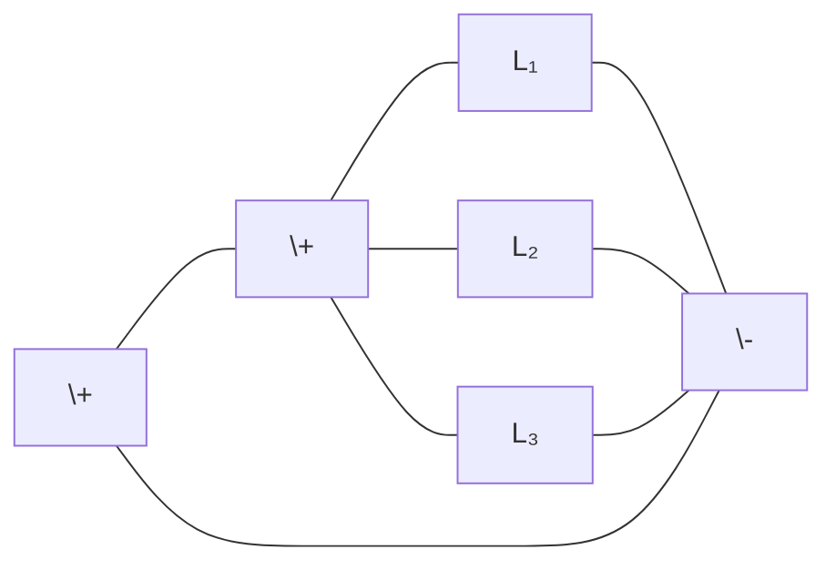

**Table: Parallel Inductors Properties**

| Property | Formula | Description |
|----------|---------|-------------|
| Equivalent Inductance | 1/L₍ₑq₎ = 1/L₁ + 1/L₂ + 1/L₃ | Always smaller than smallest inductor |
| Current | I = I₁ + I₂ + I₃ | Divides according to 1/L ratio |
| Voltage | V = V₁ = V₂ = V₃ | Same across all inductors |
| Energy | E = LI²/2 | Distributed across inductors |

**Mnemonic:** "Series inductors add directly, parallel inductors add reciprocally"

## Question 2(a) [3 marks]

**Classify network elements.**

**Answer**:

**Table: Classification of Network Elements**

| Category | Types | Examples |
|----------|-------|----------|
| **Active vs Passive** | Active | Voltage/current sources, transistors |
|  | Passive | Resistors, capacitors, inductors |
| **Linear vs Non-linear** | Linear | Resistors, ideal sources |
|  | Non-linear | Diodes, transistors |
| **Bilateral vs Unilateral** | Bilateral | Resistors, capacitors, inductors |
|  | Unilateral | Diodes, transistors |
| **Lumped vs Distributed** | Lumped | Discrete R, L, C components |
|  | Distributed | Transmission lines |

**Mnemonic:** "ALBU: Active/passive, Linear/non-linear, Bilateral/unilateral, lumped/distributed"

## Question 2(b) [4 marks]

**Three resistances of 10, 30 and 70 ohms are connected in star. Find equivalent resistances in delta connection.**

**Answer**:

**Diagram: Star to Delta Conversion**

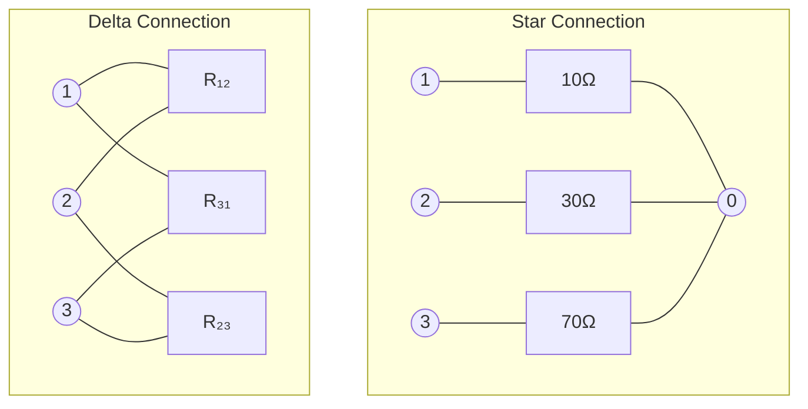

**Table: Star-Delta Conversion Formulas and Calculations**

| Delta Resistance | Formula | Calculation | Result |
|------------------|---------|-------------|--------|
| R₁₂ | (R₁×R₂+R₂×R₃+R₃×R₁)/R₃ | (10×30+30×70+70×10)/70 | 47.14Ω |
| R₂₃ | (R₁×R₂+R₂×R₃+R₃×R₁)/R₁ | (10×30+30×70+70×10)/10 | 330Ω |
| R₃₁ | (R₁×R₂+R₂×R₃+R₃×R₁)/R₂ | (10×30+30×70+70×10)/30 | 110Ω |

**Mnemonic:** "Star-Delta: Product sum over opposite resistor"

## Question 2(c) [7 marks]

**Explain π network.**

**Answer**:

**Diagram: π (Pi) Network**

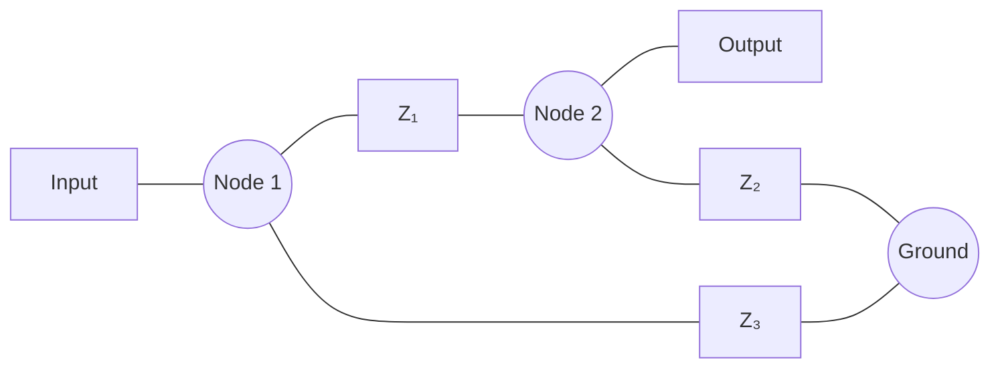

**Table: π Network Characteristics**

| Parameter | Description |
|-----------|-------------|
| **Structure** | Two shunt impedances (Z₃, Z₂) and one series impedance (Z₁) |
| **Transmission Parameters** | A = 1 + Z₁/Z₂, B = Z₁, C = 1/Z₂ + 1/Z₃ + Z₁/(Z₂×Z₃), D = 1 + Z₁/Z₃ |
| **Impedance Parameters** | Z₁₁ = Z₁ + Z₃, Z₁₂ = Z₁, Z₂₁ = Z₁, Z₂₂ = Z₁ + Z₂ |
| **Image Impedance** | Z₀π = √(Z₁Z₂Z₃/(Z₂+Z₃)) |
| **Applications** | Matching networks, filters, attenuators |
| **Conversion** | Can be converted to T-network |

**Mnemonic:** "π has two legs down, one branch across"

## Question 2(a) OR [3 marks]

**List the types of network.**

**Answer**:

**Table: Types of Networks**

| Category | Types |
|----------|-------|
| **Based on Linearity** | Linear Networks, Non-linear Networks |
| **Based on Elements** | Passive Networks, Active Networks |
| **Based on Parameters** | Time-variant, Time-invariant Networks |
| **Based on Configuration** | T-Network, π-Network, Lattice Network |
| **Based on Ports** | One-port, Two-port, Multi-port Networks |
| **Based on Symmetry** | Symmetrical, Asymmetrical Networks |
| **Based on Reciprocity** | Reciprocal, Non-reciprocal Networks |

**Mnemonic:** "LEPCPS: Linearity, Elements, Parameters, Configuration, Ports, Symmetry"

## Question 2(b) OR [4 marks]

**Three resistances of 20, 50 and 100 ohms are connected in delta. Find equivalent resistances in star connection.**

**Answer**:

**Diagram: Delta to Star Conversion**

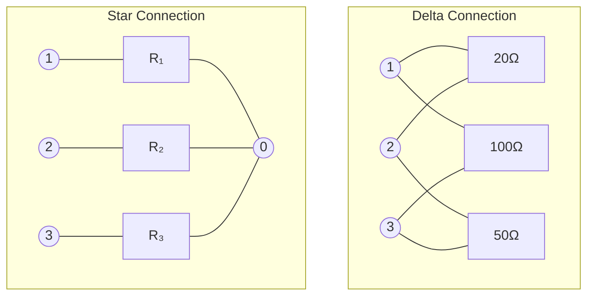

**Table: Delta-Star Conversion Formulas and Calculations**

| Star Resistance | Formula | Calculation | Result |
|-----------------|---------|-------------|--------|
| R₁ | (R₁₂×R₃₁)/(R₁₂+R₂₃+R₃₁) | (20×100)/(20+50+100) | 11.76Ω |
| R₂ | (R₁₂×R₂₃)/(R₁₂+R₂₃+R₃₁) | (20×50)/(20+50+100) | 5.88Ω |
| R₃ | (R₂₃×R₃₁)/(R₁₂+R₂₃+R₃₁) | (50×100)/(20+50+100) | 29.41Ω |

**Mnemonic:** "Delta-Star: Product of adjacent pairs over sum of all"

## Question 2(c) OR [7 marks]

**Explain T network.**

**Answer**:

**Diagram: T Network**

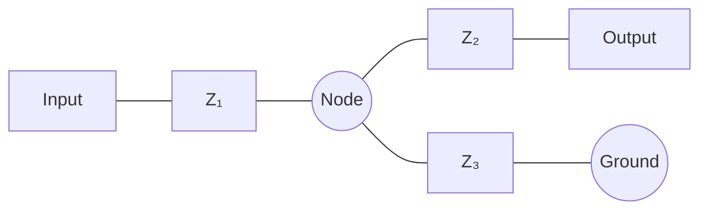

**Table: T Network Characteristics**

| Parameter | Description |
|-----------|-------------|
| **Structure** | Two series impedances (Z₁, Z₂) and one shunt impedance (Z₃) |
| **Transmission Parameters** | A = 1 + Z₁/Z₃, B = Z₁ + Z₂ + Z₁Z₂/Z₃, C = 1/Z₃, D = 1 + Z₂/Z₃ |
| **Impedance Parameters** | Z₁₁ = Z₁ + Z₃, Z₁₂ = Z₃, Z₂₁ = Z₃, Z₂₂ = Z₂ + Z₃ |
| **Image Impedance** | Z₀T = √(Z₁Z₂ + Z₁Z₃ + Z₂Z₃) |
| **Applications** | Matching networks, filters, attenuators |
| **Conversion** | Can be converted to π-network |

**Mnemonic:** "T has two arms across, one leg down"

## Question 3(a) [3 marks]

**Explain Kirchhoff's law.**

**Answer**:

**Kirchhoff's Current Law (KCL):**

- **Sum of currents** entering a node equals sum of currents leaving it
- Algebraic sum of currents at any node is zero
- ∑I = 0 (currents entering positive, leaving negative)

**Kirchhoff's Voltage Law (KVL):**

- **Sum of voltage drops** around any closed loop equals zero
- ∑V = 0 (voltage rises positive, drops negative)
- Based on conservation of energy

**Diagram of Kirchhoff's Laws:**

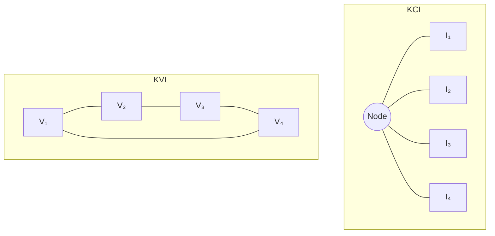

**Mnemonic:** "Current converges, Voltage voyages in a loop"

## Question 3(b) [4 marks]

**Explain Nodal analysis.**

**Answer**:

**Diagram: Nodal Analysis Concept**


**Table: Nodal Analysis Method**

| Step | Description |
|------|-------------|
| 1. Select reference node | Usually ground (0V) |
| 2. Assign voltages | Label remaining node voltages (V₁, V₂, etc.) |
| 3. Apply KCL | Write KCL equation at each non-reference node |
| 4. Express currents | Use Ohm's Law to express branch currents |
| 5. Solve equations | Find node voltages using simultaneous equations |

**Example: For nodes with voltages V₁ and V₂:**

- KCL at node 1: (V₁-0)/R₁ + (V₁-V₂)/R₂ + I₁ = 0
- KCL at node 2: (V₂-V₁)/R₂ + (V₂-0)/R₃ + I₂ = 0

**Mnemonic:** "Nodal needs KCL to analyze voltage"

## Question 3(c) [7 marks]

**Use Thevenin's theorem to find current through the 5 Ω resistor for given circuit.**

**Answer**:

**Diagram: Original Circuit and Thevenin Equivalent**

```goat
+--+     +--+
|  |     |  |
12V 20Ω  8V 10Ω
|  |     |  |
+--+--+--+--+
    |      |
    +--+---+
       |
       5Ω
       |
      ---
       -
```

**Steps to Find Thevenin Equivalent:**

**Table: Thevenin's Theorem Process and Calculations**

| Step | Process | Calculation | Result |
|------|---------|-------------|--------|
| 1. Remove load (5Ω) | Calculate open-circuit voltage (Voc) | Voc = Voltage divider formula | Vth = 9.33V |
| 2. Replace voltage sources with shorts | Calculate equivalent resistance (Req) | Req = 20Ω || 10Ω | Rth = 6.67Ω |
| 3. Draw Thevenin equivalent | Connect Vth and Rth in series with load | | |
| 4. Calculate load current | I = Vth/(Rth+RL) | I = 9.33/(6.67+5) | I = 0.8A |

**Mnemonic:** "Thevenin transforms: Find Voc and Req, then calculate I"

## Question 3(a) OR [3 marks]

**State and explain Maximum Power Transfer Theorem.**

**Answer**:

**Maximum Power Transfer Theorem:**

- Maximum power is transferred from source to load when **load resistance equals source internal resistance** (RL = Rth)
- Only 50% efficiency is achieved at maximum power transfer
- Applies to DC and AC circuits (with complex impedances)

**Diagram: Maximum Power Transfer**

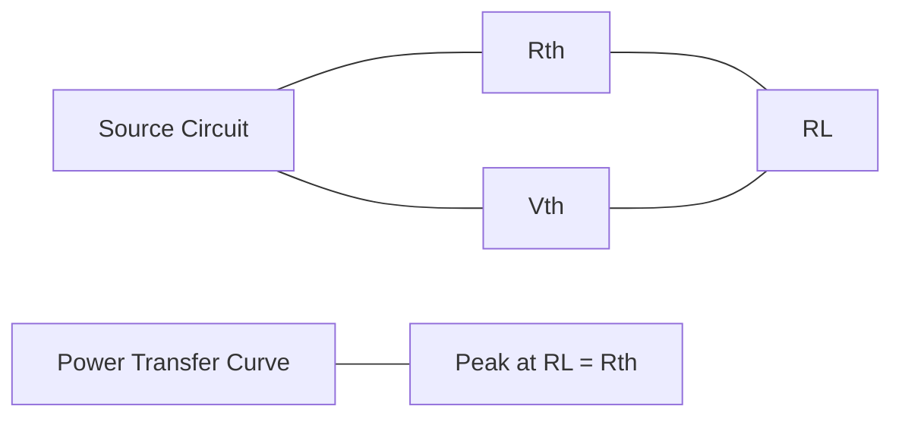

**Formula: P = (Vth²×RL)/(Rth+RL)²**

**Mnemonic:** "Match the load to the source for maximum power transfer"

## Question 3(b) OR [4 marks]

**Explain method of drawing dual network using any circuit.**

**Answer**:

**Diagram: Original and Dual Network Example**

```goat
Original:       Dual:
R1              C1
o---www---o     o---||---o
|         |     |        |
C1        R2    L1       L2
|         |     |        |
o---||---o      o---www--o
    L1               R1
```

**Table: Dual Network Conversion Rules**

| Original Element | Dual Element | Example |
|------------------|--------------|---------|
| Series connection | Parallel connection | Series R → Parallel C |
| Parallel connection | Series connection | Parallel C → Series L |
| Voltage source | Current source | V source → I source |
| Current source | Voltage source | I source → V source |
| Resistor (R) | Conductance (1/R) | R → G (1/R) |
| Inductor (L) | Capacitor (1/L) | L → C (1/L) |
| Capacitor (C) | Inductor (1/C) | C → L (1/C) |

**Duality Process:**

1. Redraw network with meshes as nodes and nodes as meshes
2. Replace elements with their duals
3. Interchange series and parallel connections

**Mnemonic:** "Duality swaps: Series↔Parallel, V↔I, R↔G, L↔C"

## Question 3(c) OR [7 marks]

**Find out Norton's equivalent circuit for the given network. Find out load current if (i) R₍L₎ = 3 KΩ (ii) R₍L₎ = 1.5 Ω**

**Answer**:

**Diagram: Original Circuit and Norton Equivalent**

```goat
    +--+
    |  |
    6V 9KΩ
    |  |
+---+--+-----+
|            |
3KΩ         6KΩ
|            |
+-----+------+
      |
      RL
      |
     ---
      -
```

**Table: Norton's Theorem Process and Calculations**

| Step | Process | Calculation | Result |
|------|---------|-------------|--------|
| 1. Calculate short-circuit current (Isc) | Short load terminals and find current | Isc = Source current through short | In = 0.5mA |
| 2. Calculate Norton resistance (Rn) | Replace sources with internal resistance | Rn = 9KΩ || (3KΩ + 6KΩ) | Rn = 3KΩ |
| 3. Draw Norton equivalent | Connect In and Rn in parallel | | |
| 4. Calculate load current (RL = 3KΩ) | I = In × Rn/(Rn + RL) | I = 0.5mA × 3KΩ/(3KΩ + 3KΩ) | I = 0.25mA |
| 5. Calculate load current (RL = 1.5Ω) | I = In × Rn/(Rn + RL) | I = 0.5mA × 3KΩ/(3KΩ + 1.5Ω) | I = 0.33mA |

**Mnemonic:** "Norton needs Isc and Req to make a current source"

## Question 4(a) [3 marks]

**Derive the equation of Quality factor Q for a coil.**

**Answer**:

**Diagram: Coil Equivalent Circuit**

```goat
     R       L
o---www---OOOOOO---o
```

**Derivation of Q factor for a coil:**

**Table: Q Factor Derivation for Coil**

| Step | Expression | Explanation |
|------|------------|-------------|
| 1. Impedance | Z = R + jωL | Complex impedance of coil |
| 2. Reactive power | PX = (ωL)I² | Power stored in inductor |
| 3. Real power | PR = RI² | Power dissipated in resistance |
| 4. Quality factor | Q = PX/PR | Ratio of stored to dissipated power |
| 5. Substitution | Q = (ωL)I²/RI² | Substitute expressions |
| 6. Final equation | Q = ωL/R | Simplify to get Q factor |

**Mnemonic:** "Quality coils: ωL/R shows energy saving ability"

## Question 4(b) [4 marks]

**A series RLC circuit has R = 50 Ω, L = 0.2 H and C = 10 μF. Calculate (i) Q factor, (ii) BW, (iii) Upper cut off and lower cut off frequencies.**

**Answer**:

**Diagram: Series RLC Circuit**

```goat
     R=50Ω    L=0.2H
o----www------OOOOOO----+
                        |
                        |
                       ---
                       --- C=10μF
                        |
                        |
o-----------------------+
```

**Table: Calculations for Series RLC Circuit**

| Parameter | Formula | Calculation | Result |
|-----------|---------|-------------|--------|
| Resonant frequency (fr) | fr = 1/(2π√LC) | 1/(2π√(0.2×10×10⁻⁶)) | 112.5 Hz |
| Quality factor (Q) | Q = (1/R)√(L/C) | (1/50)√(0.2/10×10⁻⁶) | 28.28 |
| Bandwidth (BW) | BW = fr/Q | 112.5/28.28 | 3.98 Hz |
| Lower cutoff (f₁) | f₁ = fr - BW/2 | 112.5 - 3.98/2 | 110.51 Hz |
| Upper cutoff (f₂) | f₂ = fr + BW/2 | 112.5 + 3.98/2 | 114.49 Hz |

**Mnemonic:** "Q defines BW, which sets cutoff frequencies"

## Question 4(c) [7 marks]

**Explain Mutual Inductance along with Co-efficient of mutual inductance. Also derive the equation of K.**

**Answer**:

**Diagram: Mutual Inductance Between Two Coils**

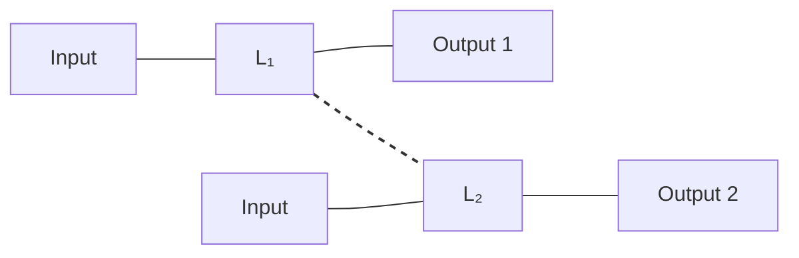

**Mutual Inductance (M):**

- When current in one coil induces voltage in nearby coil
- Coupling between coils depends on position, orientation, and medium
- Mutual inductance M in henries (H)

**Table: Mutual Inductance Equations**

| Parameter | Formula | Description |
|-----------|---------|-------------|
| Induced voltage | v₂ = M(di₁/dt) | Voltage induced in coil 2 due to current in coil 1 |
| Mutual inductance | M = k√(L₁L₂) | Mutual inductance related to self-inductances |
| Coupling coefficient (k) | k = M/√(L₁L₂) | Measure of coupling between coils (0 ≤ k ≤ 1) |
| Total inductance | Lt = L₁ + L₂ ± 2M | Total inductance depends on direction of coupling |

**Derivation of Coupling Coefficient (k):**

- From M = k√(L₁L₂)
- Rearranging: k = M/√(L₁L₂)
- k = 1 for perfect coupling
- k = 0 for no coupling
- Typically 0.1 to 0.9 for real circuits

**Mnemonic:** "M measures magnetic linkage, k shows coupling quality"

## Question 4(a) OR [3 marks]

**Explain the types of coupling for coupled circuit.**

**Answer**:

**Diagram: Types of Coupling**

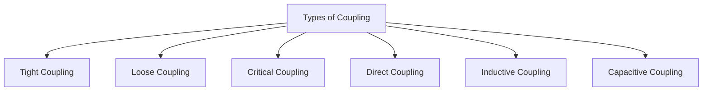

**Table: Types of Coupling**

| Coupling Type | Characteristics | Applications |
|---------------|-----------------|--------------|
| **Tight Coupling** | k > 0.5, high energy transfer | Transformers |
| **Loose Coupling** | k < 0.5, selective frequency response | RF tuning circuits |
| **Critical Coupling** | k adjusted for optimal bandwidth | RF filters |
| **Direct Coupling** | Components directly connected | Audio amplifiers |
| **Inductive Coupling** | Magnetic field transfers energy | Transformers, wireless charging |
| **Capacitive Coupling** | Electric field transfers energy | Signal coupling between stages |

**Mnemonic:** "TLCLIC: Tight, Loose, Critical, Direct, Inductive, Capacitive"

## Question 4(b) OR [4 marks]

**A parallel resonant circuit having inductance of 10 mH with quality factor Q = 100, resonant frequency Fr = 50 KHz. Find out (i) Required capacitance C, (ii) Resistance R of the coil, (iii) BW.**

**Answer**:

**Diagram: Parallel Resonant Circuit**

```goat
        L=10mH  
o-------OOOOOO--------+
|                     |
|        R            |
|       www           |
|                     |
|                    ---
|                    --- C=?
|                     |
o---------------------+
```

**Table: Calculations for Parallel Resonant Circuit**

| Parameter | Formula | Calculation | Result |
|-----------|---------|-------------|--------|
| Resonant frequency | fr = 1/(2π√LC) | 50 kHz = 1/(2π√(10×10⁻³×C)) | |
| Capacitance (C) | C = 1/(4π²fr²L) | C = 1/(4π²×(50×10³)²×10×10⁻³) | C = 1.01 nF |
| Resistance (R) | Q = ωL/R | 100 = 2π×50×10³×10×10⁻³/R | R = 31.4 Ω |
| Bandwidth (BW) | BW = fr/Q | BW = 50×10³/100 | BW = 500 Hz |

**Mnemonic:** "Parallel resonance parameters: C from fr, R from Q, BW from fr/Q"

## Question 4(c) OR [7 marks]

**Explain Band width and Selectivity of a series RLC circuit. Also establish the relation between Q factor and BW for series resonance circuit.**

**Answer**:

**Diagram: Frequency Response of Series RLC Circuit**

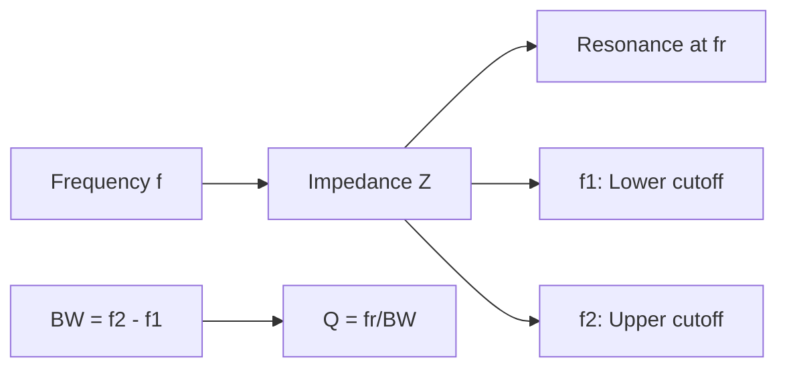

**Bandwidth (BW):**

- **Frequency range** between half-power points
- At half-power points, impedance is √2 times minimum value
- BW = f₂ - f₁, where f₁ and f₂ are lower and upper cutoff frequencies

**Selectivity:**

- **Ability to reject** frequencies outside the bandwidth
- Higher Q means higher selectivity and narrower bandwidth
- Measured by steepness of response curve

**Table: Series RLC Bandwidth Parameters**

| Parameter | Formula | Description |
|-----------|---------|-------------|
| Bandwidth (BW) | BW = f₂ - f₁ | Difference between upper and lower cutoff points |
| Half-power points | Z = √2 × Zₘᵢₙ | Points where power drops to half of maximum |
| Resonant frequency | fr = 1/(2π√LC) | Center frequency |
| Quality factor | Q = ωₒL/R | Energy storage vs. dissipation ratio |

**Derivation of Q-BW Relationship:**

- At resonance, impedance Z = R
- At cutoff frequencies, Z = √2R
- This occurs when reactance XL - XC = ±R
- At f₁: ωL - 1/ωC = -R
- At f₂: ωL - 1/ωC = +R
- Solving these equations: BW = R/2πL = fr/Q
- Therefore, Q = fr/BW

**Mnemonic:** "Quality inversely proportional to bandwidth"

## Question 5(a) [3 marks]

**Design a symmetrical T type attenuator to give attenuation of 60 dB and work in to the load of 500 Ω resistance.**

**Answer**:

**Diagram: Symmetrical T-type Attenuator**

```goat
        R1/2          R1/2
   o----www-----o----www----o
   |            |           |
   |            |           |
   |           R2           |
   |            |           |
   |            |           |
  IN           ---         OUT
                -
```

**Table: Attenuator Design**

| Parameter | Formula | Calculation | Result |
|-----------|---------|-------------|--------|
| Attenuation (N) | N = 10^(dB/20) | 10^(60/20) | N = 1000 |
| Z₀ | Given | 500 Ω | 500 Ω |
| R₁ | R₁ = 2Z₀(N-1)/(N+1) | 2×500×(1000-1)/(1000+1) | R₁ = 998 Ω |
| R₂ | R₂ = Z₀(N+1)/(N-1) | 500×(1000+1)/(1000-1) | R₂ = 0.5 Ω |

**Mnemonic:** "T attenuator: R₁ series divides, R₂ shunts"

## Question 5(b) [4 marks]

**Compare Band pass and Band stop filters.**

**Answer**:

**Diagram: Band Pass vs Band Stop Response**

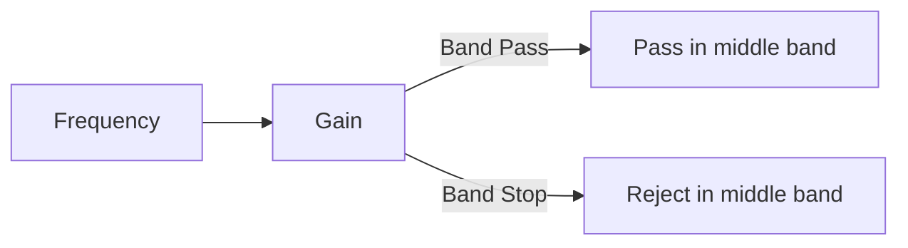

**Table: Comparison of Band Pass and Band Stop Filters**

| Parameter | Band Pass Filter | Band Stop Filter |
|-----------|-------------------|-------------------|
| **Frequency Response** | Passes frequencies within specific band | Rejects frequencies within specific band |
| **Circuit Structure** | Series & parallel resonant circuits | Series & parallel resonant circuits |
| **Cut-off Frequencies** | Has lower (f₁) and upper (f₂) cut-offs | Has lower (f₁) and upper (f₂) cut-offs |
| **Bandwidth** | BW = f₂ - f₁ | BW = f₂ - f₁ |
| **Applications** | Radio tuning, audio equalization | Noise elimination, harmonic suppression |
| **Implementation** | Series/parallel combination of HPF & LPF | Parallel/series combination of HPF & LPF |
| **Phase Response** | 0° at resonance | 180° at resonance |

**Mnemonic:** "Pass the middle or Stop the middle"

## Question 5(c) [7 marks]

**Explain constant K Low Pass Filter.**

**Answer**:

**Diagram: Constant K Low Pass Filter T and π Sections**

```goat
T-section:                    π-section:
    L/2         L/2               L
o---OOOO----o---OOOO------o  o---OOOO---o
            |                  |      |
            C                  C/2    C/2
            |                  |      |
            |                  |      |
o-----------o-------------o  o----------o
```

**Constant K Low Pass Filter:**

- **Passes frequencies** below cutoff frequency (fc)
- Attenuates frequencies above fc
- "Constant K" means product of series and shunt impedances is constant at all frequencies (Z₁Z₂ = K²)

**Table: T and π Section Parameters**

| Parameter | T-section | π-section |
|-----------|-----------|-----------|
| Series arm | L/2 at each end | L in center |
| Shunt arm | C in center | C/2 at each end |
| Cutoff frequency | fc = 1/(π√LC) | fc = 1/(π√LC) |
| Characteristic impedance | Z₀ = √(L/C) | Z₀ = √(L/C) |
| Design equation for L | L = Z₀/πfc | L = Z₀/πfc |
| Design equation for C | C = 1/(πfcZ₀) | C = 1/(πfcZ₀) |

**Frequency Response:**

- Passes DC and low frequencies with minimal attenuation
- Attenuation increases rapidly above cutoff frequency
- Phase shift increases with frequency

**Mnemonic:** "Constant K LPF: L series blocks high, C shunt shorts high"

## Question 5(a) OR [3 marks]

**Design a high pass filter with T section having a cut-off frequency of 2 KHz with a load resistance of 500 Ω.**

**Answer**:

**Diagram: High Pass T-section Filter**

```goat
      C/2          C/2
   o---||----o---||---o
   |         |        |
   |         L        |
   |        OOO       |
   |         |        |
  IN        ---      OUT
             -
```

**Table: High Pass Filter Design**

| Parameter | Formula | Calculation | Result |
|-----------|---------|-------------|--------|
| Cutoff frequency (fc) | Given | 2 kHz | 2 kHz |
| Load resistance (R₀) | Given | 500 Ω | 500 Ω |
| Series capacitance (C/2) | C = 1/(πfcR₀) | C = 1/(π×2×10³×500) | C = 0.318 μF |
| Total capacitance (C) | 2 × (C/2) | 2 × 0.159 μF | C = 0.318 μF |
| Shunt inductance (L) | L = R₀/(πfc) | L = 500/(π×2×10³) | L = 79.6 mH |

**Mnemonic:** "High pass T: C blocks DC in series, L passes high in shunt"

## Question 5(b) OR [4 marks]

**Give classification of filters.**

**Answer**:

**Diagram: Filter Classification**

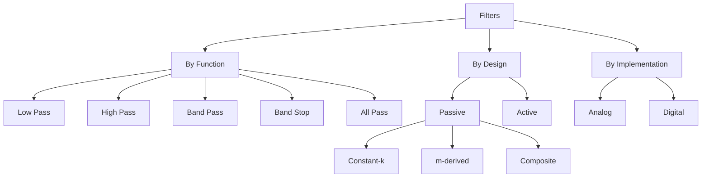

**Table: Classification of Filters**

| Classification By | Types | Characteristics |
|------------------|-------|-----------------|
| **Function** | Low Pass | Passes frequencies below cutoff |
|  | High Pass | Passes frequencies above cutoff |
|  | Band Pass | Passes frequencies within a band |
|  | Band Stop | Rejects frequencies within a band |
|  | All Pass | Passes all frequencies but modifies phase |
| **Design** | Passive | Uses passive elements (R, L, C) |
|  | Active | Uses active components (op-amps) |
| **Response** | Butterworth | Maximally flat response |
|  | Chebyshev | Ripple in passband, steeper rolloff |
|  | Bessel | Linear phase response |
|  | Elliptic | Ripple in both passband and stopband |
| **Implementation** | Passive Filter Types | Constant-k, m-derived, composite |

**Mnemonic:** "FLHBA: Function (Low/High/Band/All-pass), Design, Response, Implementation"

## Question 5(c) OR [7 marks]

**Explain constant K High Pass Filter.**

**Answer**:

**Diagram: Constant K High Pass Filter T and π Sections**

```goat
T-section:                     π-section:
     C/2          C/2               C
o----||------o----||-------o   o----||----o
             |                   |      |
             L                   L/2    L/2
             |                   |      |
             |                   |      |
o------------o--------------o  o----------o
```

**Constant K High Pass Filter:**

- **Passes frequencies** above cutoff frequency (fc)
- Attenuates frequencies below fc
- "Constant K" means product of series and shunt impedances is constant at all frequencies (Z₁Z₂ = K²)

**Table: T and π Section Parameters**

| Parameter | T-section | π-section |
|-----------|-----------|-----------|
| Series arm | C/2 at each end | C in center |
| Shunt arm | L in center | L/2 at each end |
| Cutoff frequency | fc = 1/(π√LC) | fc = 1/(π√LC) |
| Characteristic impedance | Z₀ = √(L/C) | Z₀ = √(L/C) |
| Design equation for L | L = Z₀/(πfc) | L = Z₀/(πfc) |
| Design equation for C | C = 1/(πfcZ₀) | C = 1/(πfcZ₀) |

**Frequency Response:**

- Blocks DC and low frequencies
- Passes high frequencies with minimal attenuation
- Attenuation increases as frequency decreases below cutoff
- Phase shift approaches 0° at very high frequencies

**Mnemonic:** "Constant K HPF: C series blocks low, L shunt passes high"
