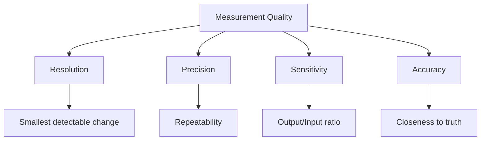

## પ્રશ્ન 1(a) [3 ગુણ]

**તમામ પ્રકારની સિસ્ટેમેટીક ભૂલને ઘટાડવા માટેના પગલાંઓનું વર્ણન કરો.**

**ઉત્તર**:

સિસ્ટેમેટીક ભૂલ ઘટાડવાના પગલાં:

| પગલું | વર્ણન |
|------|-------------|
| 1. કેલિબ્રેશન | પ્રમાણભૂત સંદર્ભ સાથે સાધનોનું સમયાંતરે કેલિબ્રેશન કરવું |
| 2. સુધારણા | સુધારણા ફેક્ટર અથવા ઓફસેટ વેલ્યુ લાગુ કરવું |
| 3. નિયંત્રણ | સ્થિર પર્યાવરણીય પરિસ્થિતિઓ (તાપમાન, ભેજ) જાળવવી |
| 4. તકનીક | યોગ્ય માપન તકનીકો અને પ્રક્રિયાઓનો ઉપયોગ કરવો |
| 5. સાધન | જરૂરી ચોકસાઈ સાથે યોગ્ય સાધનોની પસંદગી કરવી |

**નોંધવાક્ય:** "CCCTS: Calibrate, Correct, Control, Technique, Select"

## પ્રશ્ન 1(b) [4 ગુણ]

**વ્યાખ્યાયિત કરો: રીઝોલ્યુશન, પ્રિસિજન, સેન્સીટિવિટી અને એક્યુરસી.**

**ઉત્તર**:

| પરિભાષા | વ્યાખ્યા |
|------|------------|
| **રીઝોલ્યુશન** | સાધન દ્વારા શોધી શકાય તેવો ઇનપુટમાં સૌથી નાનો ફેરફાર |
| **પ્રિસિજન** | ન્યૂનતમ રેન્ડમ ભૂલ સાથે માપનની સુસંગતતા અથવા પુનરાવર્તનીયતા |
| **સેન્સીટિવિટી** | ઇનપુટના ફેરફાર માટે આઉટપુટમાં ફેરફારનું પ્રમાણ (ΔO/ΔI) |
| **એક્યુરસી** | માપેલા મૂલ્યનો સાચા અથવા સ્વીકૃત માનક મૂલ્ય સાથે નજીકપણું |

**આકૃતિ:**



**નોંધવાક્ય:** "RSPA: Resolve Signals Precisely and Accurately"

## પ્રશ્ન 1(c) [7 ગુણ]

**Q મીટરનો સિદ્ધાંત અને પ્રેક્ટીકલ Q મીટરની કામગીરી સમજાવો.**

**ઉત્તર**:

Q મીટર કોઇલ્સ અને કેપેસિટર્સના ક્વોલિટી ફેક્ટર (Q) માપવા માટે રેઝોનન્સ સિદ્ધાંત પર કામ કરે છે.

**સિદ્ધાંત:** 

- સીરીઝ રેઝોનન્સ પર આધારિત જ્યાં Q = XL/R અથવા XC/R રેઝોનન્સ સ્થિતિએ
- રેઝોનન્સ સ્થિતિએ વોલ્ટેજ મેગ્નિફિકેશન માપે છે

**પ્રેક્ટીકલ Q મીટરની કામગીરી:**

| ઘટક | કાર્ય |
|-----------|----------|
| ઓસિલેટર | વેરીએબલ ફ્રીકવન્સી સિગ્નલ (50kHz થી 50MHz) જનરેટ કરે છે |
| વર્ક કોઇલ | ટેસ્ટ હેઠળની ઇન્ડક્ટર (કેલિબ્રેટેડ કેપેસિટર સાથે સીરીઝમાં જોડાયેલ) |
| કેપેસિટર | રેઝોનન્સ ટ્યુનિંગ માટે વેરીએબલ કેલિબ્રેટેડ કેપેસિટર |
| VTVM | કેપેસિટર પર રેઝોનન્ટ વોલ્ટેજ માપે છે |
| શન્ટ રેઝિસ્ટર | સર્કિટમાં કરંટનું મોનિટરિંગ કરે છે |

**આકૃતિ:**

```goat
+---------------+       +---------------+
|  RF           |       |               |
|  OSCILLATOR   +------->  WORK COIL    |
|               |       |   (Lx)        |
+---------------+       +-------+-------+
                                |
+---------------+       +-------v-------+
|               |       |               |
|    VTVM       <-------+  CAPACITOR    |
|  (Q READING)  |       |   (C)         |
+---------------+       +---------------+
```

- **Q ફેક્ટર ગણતરી**: Q = V₂/V₁ જ્યાં V₂ કેપેસિટર પરનું વોલ્ટેજ અને V₁ એપ્લાઈડ વોલ્ટેજ છે
- **એપ્લિકેશન**: RF કમ્પોનન્ટ્સ ટેસ્ટિંગ, કોઇલ ક્વોલિટી મેઝરમેન્ટ
- **રેઝોનન્સ ઇન્ડિકેશન**: કેપેસિટર પર મહત્તમ વોલ્ટેજ રેઝોનન્સ દર્શાવે છે

**નોંધવાક્ય:** "VOCAL: Voltage ratio at resonance Oscillator Creates Amplification to measure coiL quality"

## પ્રશ્ન 1(c OR) [7 ગુણ]

**વ્હીટસ્ટોન બ્રિજ સમજાવો અને બેલેન્સ કંડીશન માટે સમીકરણ મેળવો. વ્હીટસ્ટોન બ્રિજની એપ્લિકેશન અને મર્યાદા લખો.**

**ઉત્તર**:

વ્હીટસ્ટોન બ્રિજ એ ઉચ્ચ સચોટતા સાથે અજ્ઞાત પ્રતિરોધ માપવા માટે વપરાતું નેટવર્ક છે.

**સર્કિટ આકૃતિ:**

```goat
       A
       o
       |
      +-+
      |R1|
      +-+
       |
R      o---------o D
       |         |
      +-+       +-+
      |R2|      |Rx|
      +-+       +-+
       |         |
       o---------o
       B         C
     
    G = Galvanometer
    Rx = Unknown resistance
```

**બેલેન્સ કંડીશન સમીકરણની તારણ:**

- બેલેન્સ સ્થિતિએ, ગેલ્વેનોમીટરમાંથી કરંટ પસાર થતો નથી
- પોઇન્ટ D પરનું પોટેન્શિયલ = પોઇન્ટ B પરનું પોટેન્શિયલ
- R₁ પરનું વોલ્ટેજ = Rx પરનું વોલ્ટેજ
- R₂ પરનું વોલ્ટેજ = R₃ પરનું વોલ્ટેજ

આથી:

- (R₁/R₂) = (Rx/R₃)
- Rx = R₃(R₁/R₂)

**એપ્લિકેશન:**

| એપ્લિકેશન | વર્ણન |
|-------------|-------------|
| પ્રિસીઝન રેઝિસ્ટન્સ મેઝરમેન્ટ | અજ્ઞાત રેઝિસ્ટર્સની ચોક્સાઈપૂર્ણ માપણી |
| તાપમાન સેન્સિંગ | RTD અથવા થર્મિસ્ટર સાથે ઉપયોગ કરતી વખતે |
| સ્ટ્રેન મેઝરમેન્ટ | સ્ટ્રેસ એનાલિસિસ માટે સ્ટ્રેન ગેજ સાથે |
| ટ્રાન્સડ્યુસર ઇન્ટરફેસ | ભૌતિક જથ્થાઓને ઇલેક્ટ્રિકલ સિગ્નલમાં રૂપાંતરિત કરવા |

**મર્યાદાઓ:**

| મર્યાદા | વર્ણન |
|------------|-------------|
| લો રેઝિસ્ટન્સ મેઝરમેન્ટ | ખૂબ ઓછા રેઝિસ્ટન્સ (<1Ω) માટે નબળી ચોકસાઈ |
| સેન્સિટિવિટી | ગેલ્વેનોમીટરની સેન્સિટિવિટી દ્વારા મર્યાદિત |
| રેન્જ | માપનની મર્યાદિત રેન્જ (સામાન્ય રીતે 1Ω થી 100kΩ) |
| સંપર્ક પ્રતિરોધ | ઓછા પ્રતિરોધ માપમાં ચોકસાઈને અસર કરે છે |

**નોંધવાક્ય:** "BEAR: Balance Equation at Arms Ratio"

## પ્રશ્ન 2(a) [3 ગુણ]

**મૂવિંગ આયર્ન અને મૂવિંગ કોઇલ પ્રકારના સાધનો વચ્ચે તફાવત કરો.**

**ઉત્તર**:

| પેરામીટર | મૂવિંગ આયર્ન ઇન્સ્ટ્રુમેન્ટ | મૂવિંગ કોઇલ ઇન્સ્ટ્રુમેન્ટ |
|-----------|------------------------|------------------------|
| ઓપરેટિંગ પ્રિન્સિપલ | મેગ્નેટિક એટ્રેક્શન અથવા રિપલ્શન | કરંટ-કેરીંગ કન્ડક્ટર પર ઇલેક્ટ્રોમેગ્નેટિક ફોર્સ |
| સ્કેલ | નોન-યુનિફોર્મ સ્કેલ | યુનિફોર્મ સ્કેલ |
| ચોકસાઈ | ઓછી (1-2.5%) | વધારે (0.1-1%) |
| ફ્રીકવન્સી રેન્જ | AC અને DC બંને માટે કામ કરે છે | માત્ર DC (રેક્ટિફાઈ કર્યા સિવાય) |
| ડેમ્પિંગ | એર ફ્રિક્શન ડેમ્પિંગ | એડી કરંટ ડેમ્પિંગ |
| પાવર વપરાશ | વધારે | ઓછી |

**નોંધવાક્ય:** "IRON-COIL: Iron uses Repulsion with Non-uniform scale; COIL uses Current with Organized, Improved, Linear scale"

## પ્રશ્ન 2(b) [4 ગુણ]

**ક્લેમ્પ ઓન એમીટરનું કન્સ્ટ્રક્શન દોરો અને વિગતવાર સમજાવો.**

**ઉત્તર**:

**ક્લેમ્પ-ઓન એમીટરનો કન્સ્ટ્રક્શન આકૃતિ:**

```goat
                  +------------+
     +----+       |   Display  |
     |    |       +------------+
     |    |       +------------+
     | C  |       |    CT      |
     | L  |       |            |
     | A  +-------+    |       |
     | M  +-------+    |       |
     | P  |       | Circuit    |
     |    |       |            |
     |    |       +------------+
     +----+       +------------+
                  |  Controls  |
                  +------------+
```

**ઘટકો અને કાર્ય:**

- **કોર**: સ્પ્લિટ લેમિનેટેડ ફેરોમેગ્નેટિક કોર જે ખોલી/બંધ કરી શકાય છે
- **કોઇલ**: કોર પર વીંટાળેલા સેકન્ડરી વાઇન્ડીંગ
- **કન્ડક્ટર**: પ્રાઈમરી કન્ડક્ટર (માપવાના કરંટ) કોરમાંથી પસાર થાય છે
- **મેઝરમેન્ટ સર્કિટ**: ઇન્ડ્યુસ્ડ કરંટ પ્રોસેસ કરે છે અને રીડિંગ દર્શાવે છે
- **સ્પ્રિંગ મેકેનિઝમ**: જો સરળતાથી ખોલવા અને બંધ કરવા માટે

**વર્કિંગ પ્રિન્સિપલ**: ટ્રાન્સફોર્મર પ્રિન્સિપલ પર આધારિત જ્યાં કન્ડક્ટર સિંગલ-ટર્ન પ્રાઈમરી વાઇન્ડિંગ તરીકે કામ કરે છે, જે કરંટના પ્રમાણમાં મેગ્નેટિક ફ્લક્સ બનાવે છે.

**નોંધવાક્ય:** "CLASP: Conductor-Loop Amperes Sensed by Primary-secondary relationship"

## પ્રશ્ન 2(c) [7 ગુણ]

**યોગ્ય ડાયાગ્રામ સાથે ઇન્ટીગ્રેટીંગ પ્રકારના DVMનું કાર્ય અને ફાયદાઓનું વર્ણન કરો.**

**ઉત્તર**:

ઇન્ટિગ્રેટિંગ-ટાઇપ ડિજિટલ વોલ્ટમીટર ડ્યુઅલ-સ્લોપ ઇન્ટિગ્રેશન વડે એનાલોગ વોલ્ટેજને ડિજિટલ વેલ્યુમાં રૂપાંતરિત કરે છે.

**બ્લોક ડાયાગ્રામ:**

```goat
+-------------+     +------------+     +-------------+     +----------+
| Input       |     | Integrator |     | Comparator  |     | Counter  |
| Circuit     +---->+            +---->+             +---->+          |
| Buffer      |     |            |     |             |     |          |
+-------------+     +------------+     +-------------+     +----------+
       ^                                      ^                 |
       |                                      |                 v
+-------------+                        +-------------+    +----------+
| Reference   |                        | Control     |    | Display  |
| Voltage     |<-----------------------+ Logic       |<---+          |
| Source      |                        | & Clock     |    |          |
+-------------+                        +-------------+    +----------+
```

**વર્કિંગ પ્રિન્સિપલ:**

| ફેઝ | વર્ણન |
|-------|-------------|
| 1. રન-અપ | અજ્ઞાત ઇનપુટ વોલ્ટેજનું ફિક્સ્ડ સમય T₁ માટે ઇન્ટિગ્રેશન થાય છે |
| 2. રન-ડાઉન | રેફરન્સ વોલ્ટેજ (વિપરીત પોલારિટી) નું આઉટપુટ શૂન્ય થાય ત્યાં સુધી ઇન્ટિગ્રેશન થાય છે |
| 3. મેઝરમેન્ટ | રન-ડાઉનનો સમય T₂ ઇનપુટ વોલ્ટેજના પ્રમાણમાં હોય છે |
| 4. ડિસ્પ્લે | T₂/T₁ × Vref પર આધારિત ડિજિટલ વેલ્યુ પ્રદર્શિત થાય છે |

**ફાયદાઓ:**

- **નોઇઝ રિજેક્શન**: પાવર લાઇન નોઇઝ (50/60Hz) માટે ઉત્તમ રિજેક્શન
- **ચોકસાઈ**: અત્યંત ચોકસાઈ (0.005% થી 0.05%)
- **રીઝોલ્યુશન**: ઉચ્ચ રીઝોલ્યુશન (6½ ડિજિટ સુધી)
- **સ્થિરતા**: ઘટક સહનશીલતાથી ઓછી અસર પામે છે
- **કોમન મોડ રિજેક્શન**: ઉચ્ચ CMRR

**નોંધવાક્ય:** "RISES: Ramp Integration Samples and Eliminates Spikes"

## પ્રશ્ન 2(a OR) [3 ગુણ]

**એનાલોગ વોલ્ટમીટર અને ડિજિટલ વોલ્ટમીટર વચ્ચે તફાવત કરો.**

**ઉત્તર**:

| પેરામીટર | ડિજિટલ વોલ્ટમીટર | એનાલોગ વોલ્ટમીટર |
|-----------|-------------------|------------------|
| ડિસ્પ્લે | ન્યુમેરિક ડિસ્પ્લે (અંકો) | સ્કેલ પર પોઇન્ટર મૂવમેન્ટ |
| રીડિંગ એરર | કોઈ પેરેલેક્સ એરર નહીં | પેરેલેક્સ એરર ને આધિન |
| રીઝોલ્યુશન | ઉચ્ચ (ડિજિટ્સની સંખ્યા દ્વારા સીમિત) | સ્કેલ ડિવિઝન દ્વારા મર્યાદિત |
| ચોકસાઈ | વધુ સારી (સામાન્ય રીતે 0.05% થી 0.5%) | ઓછી (સામાન્ય રીતે 1% થી 3%) |
| આઉટપુટ | ઇન્ટરફેસિંગ માટે ડિજિટલ આઉટપુટ આપી શકે છે | સીધું ડિજિટલ આઉટપુટ નથી |
| પાવર જરૂરિયાત | પાવર સપ્લાયની જરૂર પડે છે | નિષ્ક્રિય (PMMC પ્રકાર) હોઈ શકે છે |

**નોંધવાક્ય:** "DAPPER: Digital Accuracy and Precise readings; Parallax Error in Reading analog"

## પ્રશ્ન 2(b OR) [4 ગુણ]

**મૂવિંગ આયર્ન ટાઇપ મીટરનું કન્સ્ટ્રક્શન ડાયાગ્રામ દોરો અને વિગતવાર સમજાવો.**

**ઉત્તર**:

**મૂવિંગ આયર્ન મીટરનો કન્સ્ટ્રક્શન ડાયાગ્રામ:**

```goat
                 +----+ Pointer
                /
         +-----+  
         |     |
         | +-+ | 
Scale    | |^| | Moving iron
+--------+ +-+ |
|        |     |
|        |  #  | Fixed iron
|        |  #  |
|        +-----+
|          | |
|          | | Coil
+----------+ +------+
             Spring
```

**વર્કિંગ પ્રિન્સિપલ અને ઘટકો:**

- **કોઇલ**: કરંટના પ્રમાણમાં મેગ્નેટિક ફિલ્ડ ઉત્પન્ન કરે છે
- **આયર્ન વેન્સ**: બે સોફ્ટ આયર્ન પીસ (એક ફિક્સ્ડ, એક હલનચલન કરી શકે તેવું)
- **મૂવમેન્ટ**: સમાન રીતે મેગ્નેટાઇઝ્ડ આયર્ન પીસ વચ્ચે મેગ્નેટિક રિપલ્શન
- **કંટ્રોલ**: સ્પ્રિંગ દ્વારા વિરોધી ટોર્ક પ્રદાન કરે છે
- **ડેમ્પિંગ**: એર ફ્રિક્શન ડેમ્પિંગ મેકેનિઝમ
- **સ્કેલ**: નોન-લિનિયર મેગ્નેટિક ફોર્સને કારણે નોન-યુનિફોર્મ સ્કેલ

**પ્રકારો:**

- એટ્રેક્શન ટાઇપ: મેગ્નેટિક આકર્ષણ સિદ્ધાંત પર કામ કરે છે
- રિપલ્શન ટાઇપ: મેગ્નેટિક રિપલ્શન સિદ્ધાંત પર કામ કરે છે

**નોંધવાક્ય:** "MIRROR: Magnetic Interaction Requires Repulsion/attraction Of Related iron pieces"

## પ્રશ્ન 2(c OR) [7 ગુણ]

**એનર્જી મીટરના કન્સ્ટ્રક્શન ડાયાગ્રામનું વર્ણન કરો અને વિગતવાર સમજાવો.**

**ઉત્તર**:

ઇલેક્ટ્રોનિક એનર્જી મીટર કિલોવોટ-અવરમાં વીજળી ઊર્જાની ખપત માપે છે.

**કન્સ્ટ્રક્શન ડાયાગ્રામ:**

```goat
+---------------------------+
|        Display            |
|    +---+---+---+---+---+  |
|    | 0 | 0 | 0 | 0 | 0 |  |
|    +---+---+---+---+---+  |
|                           |
|  +---------------------+  |
|  |    Microcontroller  |  |
|  +----------+----------+  |
|             ^             |
|             |             |
|  +----------+---------+   |
|  | Signal Conditioning|   |
|  +----------+---------+   |
|             ^             |
|             |             |
|  +----------+----------+  |
|  | Voltage & Current   |  |
|  | Sensing Circuits    |  |
|  +----------+----------+  |
|             ^             |
|      Input Terminals      |
+---------------------------+
```

**ઘટકો અને કાર્ય:**

| ઘટક | કાર્ય |
|-----------|----------|
| વોલ્ટેજ સેન્સર | વોલ્ટેજ માપવા માટે પોટેન્શિયલ ટ્રાન્સફોર્મર અથવા રેઝિસ્ટિવ ડિવાઇડર |
| કરંટ સેન્સર | કરંટ માપવા માટે કરંટ ટ્રાન્સફોર્મર અથવા શન્ટ રેઝિસ્ટર |
| મલ્ટિપ્લાયર | ઇન્સ્ટન્ટેનિયસ વોલ્ટેજ અને કરંટ વેલ્યુને ગુણાકાર કરે છે |
| ઇન્ટિગ્રેટર | ઊર્જાની ગણતરી માટે સમય પર પાવરનું ઇન્ટિગ્રેશન કરે છે |
| માઇક્રોકંટ્રોલર | સિગ્નલ પ્રોસેસ કરે છે અને ઊર્જા વપરાશની ગણતરી કરે છે |
| ડિસ્પ્લે | kWh માં વપરાશ બતાવવા માટે LCD અથવા LED |
| પલ્સ LED | પાવર વપરાશના પ્રમાણમાં બ્લિંક થાય છે |

**વર્કિંગ પ્રિન્સિપલ:**

1. વોલ્ટેજ અને કરંટ સંબંધિત સેન્સર દ્વારા સેન્સ થાય છે
2. સિગ્નલ્સનો ગુણાકાર ઇન્સ્ટન્ટેનિયસ પાવર મેળવવા માટે થાય છે
3. ઊર્જાની ગણતરી માટે સમય પર પાવરનું ઇન્ટિગ્રેશન થાય છે
4. ઊર્જા કિલોવોટ-અવર (kWh) તરીકે પ્રદર્શિત થાય છે

**નોંધવાક્ય:** "WATTAGE: Work And Time Tracked As Generated Electrical energy"

## પ્રશ્ન 3(a) [3 ગુણ]

**ફ્રીકવંસી માપન અને ફેઝ એંગલ માપન માટે લિસાજસ પેટર્ન લાગુ કરો.**

**ઉત્તર**:

ઓસિલોસ્કોપ સ્ક્રીન પર લિસાજસ પેટર્ન ફ્રીકવન્સી રેશિયો અને ફેઝ ડિફરન્સ માપવામાં મદદ કરે છે.

**ફ્રીકવન્સી મેઝરમેન્ટ:**

- X-એક્સિસ પર રેફરન્સ સિગ્નલ અને Y-એક્સિસ પર અજ્ઞાત સિગ્નલ આપો
- ફ્રીકવન્સી રેશિયો = Y-એક્સિસ પર ટેન્જન્ટ પોઇન્ટ્સની સંખ્યા / X-એક્સિસ પર ટેન્જન્ટ પોઇન્ટ્સની સંખ્યા
- અજ્ઞાત ફ્રીકવન્સી = રેફરન્સની ફ્રીકવન્સી × ફ્રીકવન્સી રેશિયો

| પેટર્ન | ફ્રીકવન્સી રેશિયો (Y:X) |
|---------|----------------------|
|  | 1:1 |
|  | 2:1 |
|  | n:m |

**ફેઝ એંગલ મેઝરમેન્ટ:**

- જો બંને ફ્રીકવન્સી સમાન હોય, તો ફેઝ એંગલ (φ) માપી શકાય છે
- φ = sin⁻¹(A/B) જ્યાં A = માઈનોર એક્સિસ અને B = મેજર એક્સિસ ઓફ ઇલિપ્સ

**નોંધવાક્ય:** "LIPS: Lissajous Indicates Phase and Signal frequency"

## પ્રશ્ન 3(b) [4 ગુણ]

**CRO માં ગ્રેટીક્યુલ્સ અને તેના પ્રકારોના પણ સમજાવો.**

**ઉત્તર**:

ગ્રેટીક્યુલ્સ એ CRO સ્ક્રીન પર માપન માટેના રેફરન્સ માર્કિંગ્સ છે.

| ગ્રેટીક્યુલ પ્રકાર | વર્ણન | એપ્લિકેશન |
|----------------|-------------|-------------|
| **ઇન્ટરનલ ગ્રેટીક્યુલ** | CRT ગ્લાસની અંદર માર્કિંગ્સ | પેરેલેક્સ એરર દૂર કરે છે |
| **એક્સટર્નલ ગ્રેટીક્યુલ** | સ્ક્રીન પર પ્લાસ્ટિક ઓવરલે | બદલી શકાય તેવું, અર્થવ્યવસ્થિત |
| **ઇલેક્ટ્રોનિક ગ્રેટીક્યુલ** | ઇલેક્ટ્રોનિક રીતે જનરેટ થયેલું | ડિજિટલ સ્ટોરેજ ઓસિલોસ્કોપ્સ |

**સ્ટાન્ડર્ડ ગ્રેટીક્યુલની વિશેષતાઓ:**

- સામાન્ય રીતે 10 × 8 ડિવિઝન્સ
- રેફરન્સ માટે સેન્ટર લાઇન્સ વધુ ગાઢ
- સબડિવિઝન્સ માટે નાના હેશ માર્ક્સ
- પર્સન્ટેજ માર્કિંગ્સ (રાઇઝ ટાઇમ)

**આકૃતિ:**

```goat
+-------------------------------------+
|                                     |
|                                     |
|     |           |           |       |
|-----+-----------+-----------+-------|
|     |           |           |       |
|     |           |           |       |
|     |           |           |       |
|-----+-----------+-----------+-------|
|     |           |           |       |
|     |           |           |       |
|                                     |
+-------------------------------------+
```

**નોંધવાક્ય:** "GRID: Graticule References for Intensity and Distance"

## પ્રશ્ન 3(c) [7 ગુણ]

**ડિજિટલ સ્ટોરેજ ઓસિલોસ્કોપ (DSO) ના બાંધકામ, બ્લોક ડાયાગ્રામ, કાર્ય અને ફાયદાનું વર્ણન કરો.**

**ઉત્તર**:

ડિજિટલ સ્ટોરેજ ઓસિલોસ્કોપ (DSO) એનાલોગ સિગ્નલ્સને સ્ટોરેજ અને પ્રોસેસિંગ માટે ડિજિટલમાં રૂપાંતરિત કરે છે.

**બ્લોક ડાયાગ્રામ:**

```goat
+----------+     +-------+     +------+     +-------+     +-------+
| Vertical |     | ADC   |     | RAM  |     | DAC   |     | CRT/  |
| Amplifier+---->+       +---->+      +---->+       +---->+ LCD   |
+----------+     +-------+     +------+     +-------+     +-------+
      ^                           ^                          ^
      |                           |                          |
+----------+                  +-------+                  +--------+
| Input    |                  | CPU   |                  | Display|
|Attenuator|<-----------------+       +----------------->+ Control|
+----------+                  +-------+                  +--------+
                                 ^
                                 |
                              +-------+
                              | Timing|
                              |Circuit|
                              +-------+
```

**વર્કિંગ પ્રિન્સિપલ:**

1. **સિગ્નલ એક્વિઝિશન**: એનાલોગ સિગ્નલ ઉચ્ચ ગતિએ સેમ્પલ કરવામાં આવે છે
2. **A/D કન્વર્ઝન**: કન્ટિન્યુઅસ સિગ્નલ ડિસ્ક્રીટ ડિજિટલ વેલ્યુમાં કન્વર્ટ થાય છે
3. **સ્ટોરેજ**: ડિજિટલ વેલ્યુ મેમરીમાં સ્ટોર થાય છે
4. **પ્રોસેસિંગ**: માઇક્રોપ્રોસેસર સ્ટોર્ડ ડેટાનું એનાલિસિસ કરે છે
5. **ડિસ્પ્લે**: ડેટા ડિસ્પ્લે માટે પાછો એનાલોગમાં કન્વર્ટ થાય છે અથવા સીધો LCD પર બતાવાય છે

**DSOના ફાયદાઓ:**

| ફાયદો | વર્ણન |
|-----------|-------------|
| પ્રી-ટ્રિગર વ્યુઇંગ | ટ્રિગર ઇવેન્ટ પહેલાનો સિગ્નલ જોઈ શકાય છે |
| સિંગલ-શોટ કેપ્ચર | ટ્રાન્ઝિઅન્ટ ઇવેન્ટ્સ કેપ્ચર કરી શકાય છે |
| વેવફોર્મ સ્ટોરેજ | પછીના એનાલિસિસ માટે વેવફોર્મ સેવ કરી શકાય છે |
| સિગ્નલ પ્રોસેસિંગ | સિગ્નલ્સ પર એડવાન્સ્ડ મેથેમેટિકલ ઓપરેશન્સ |
| ઓટોમેટેડ મેઝરમેન્ટ્સ | ઓટોમેટિક પેરામીટર મેઝરમેન્ટ્સ |
| ડિજિટલ ઇન્ટરફેસિસ | કમ્પ્યુટર પર ડેટા ટ્રાન્સફર કરી શકાય છે |

**નોંધવાક્ય:** "SAMPLE: Storage And Memory Processes Live Events"

## પ્રશ્ન 3(a OR) [3 ગુણ]

**CRO અને DSO વચ્ચે તફાવત કરો.**

**ઉત્તર**:

| પેરામીટર | એનાલોગ CRO | ડિજિટલ સ્ટોરેજ ઓસિલોસ્કોપ |
|-----------|------------|------------------------------|
| સિગ્નલ પ્રોસેસિંગ | રીયલ-ટાઇમ એનાલોગ | ડિજિટાઇઝ્ડ અને સ્ટોર્ડ |
| સ્ટોરેજ કેપેબિલિટી | કોઈ નહીં (ફક્ત ફોસ્ફર પર્સિસ્ટન્સ) | મેમરીમાં વેવફોર્મ સ્ટોર કરી શકે છે |
| બેન્ડવિડ્થ | સામાન્ય રીતે સરખી કિંમત રેન્જમાં ઉચ્ચ | સેમ્પલિંગ રેટ દ્વારા મર્યાદિત |
| પ્રી-ટ્રિગર વ્યુ | શક્ય નથી | ઉપલબ્ધ છે |
| સિંગલ-શોટ ઇવેન્ટ્સ | કેપ્ચર કરવા મુશ્કેલ | સરળતાથી કેપ્ચર થાય છે |
| સિગ્નલ એનાલિસિસ | ફક્ત બેઝિક મેઝરમેન્ટ્સ | એડવાન્સ્ડ મેથેમેટિકલ એનાલિસિસ |

**નોંધવાક્ય:** "ASPAD: Analog Shows Present; Digital Archives Data"

## પ્રશ્ન 3(b OR) [4 ગુણ]

**10:1 પ્રોબનું માળખું વિગતવાર સમજાવો.**

**ઉત્તર**:

10:1 પ્રોબ ઓસિલોસ્કોપની રેન્જ વધારવા માટે સિગ્નલ એમ્પ્લિટ્યુડને 10 ગણું ઘટાડે છે.

**માળખું:**

```goat
    Probe tip       Cable           Compensation
      ^              ^                  ^
+-----+-----+   +----+----+   +--------+--------+
|     |     |   |         |   |        |        |
+--+--+-----+---+---------+---+--------+--------+
   |                                    |
   |                                    |
   |  Rm=9MΩ                           |
   +--/\/\/\--+                        |
   |          |                        |
   |      Cm=12pF                      |
   |         ||                        |
   |         ||                        |
   +---------++------------------------+
              |
              v
            Ground
```

**ઘટકો:**

| ઘટક | વર્ણન |
|-----------|-------------|
| પ્રોબ ટિપ | મેટલ કોન્ટેક્ટ પોઇન્ટ જે સર્કિટને સ્પર્શ કરે છે |
| ગ્રાઉન્ડ ક્લિપ | સર્કિટ ગ્રાઉન્ડ સાથે રેફરન્સ કનેક્શન |
| કૉમ્પેન્સેશન નેટવર્ક | ફ્રીકવન્સી કૉમ્પેન્સેશન માટે RC સર્કિટ |
| પ્રોબ બોડી | ઘટકો માટે ઇન્સ્યુલેટેડ હાઉસિંગ |
| કેબલ | લો-કેપેસિટન્સ કોએક્સિયલ કેબલ |
| કનેક્ટર | ઓસિલોસ્કોપ ઇનપુટ માટે BNC કનેક્ટર |

**વર્કિંગ પ્રિન્સિપલ:**

- ઓસિલોસ્કોપ ઇનપુટ સાથે વોલ્ટેજ ડિવાઇડર બનાવે છે (9MΩ પ્રોબ + 1MΩ સ્કોપ = 10:1 ડિવિઝન)
- કૉમ્પેન્સેટિંગ કેપેસિટર ફ્લેટ ફ્રીકવન્સી રિસપોન્સ સુનિશ્ચિત કરે છે
- સર્કિટ લોડિંગ ઇફેક્ટ ઘટાડે છે કારણ કે ઇફેક્ટિવ ઇનપુટ ઇમ્પિડન્સ વધે છે

**નોંધવાક્ય:** "TAPER: Ten-to-one Attenuation Preserves and Extends Range"

## પ્રશ્ન 3(c OR) [7 ગુણ]

**CROનું બ્લોક ડાયાગ્રામ, કાર્ય અને એપ્લિકેશનનું વર્ણન કરો.**

**ઉત્તર**:

CRO (કેથોડ રે ઓસિલોસ્કોપ) ઇલેક્ટ્રિકલ સિગ્નલ્સને પ્રદર્શિત કરે છે અને માપે છે.

**બ્લોક ડાયાગ્રામ:**

```goat
                +-------------+
                | Cathode Ray |
                |    Tube     |
                +------+------+
                       ^
         +------+      |      +------+
         |      |      |      |      |
+---------+     +------+------+      +----------+
|Vertical |     |             |      |Horizontal|
|Amplifier|     |  Deflection |      |Amplifier |
+---+-----+     |   System    |      +----+-----+
    ^           |             |           ^
    |           +------+------+           |
+---+------+           |             +----+-----+
|Vertical  |           |             |Horizontal|
|Attenuator|           |             |Time Base |
+---+------+           |             +----+-----+
    ^                  |                  ^
    |                  v                  |
+---+----+      +------+------+      +----+----+
| Signal |      |   Power     |      | Trigger |
| Input  |      |   Supply    |      | Circuit |
+--------+      +-------------+      +---------+
```

**વર્કિંગ પ્રિન્સિપલ:**

1. **ઇલેક્ટ્રોન બીમ જનરેશન**: CRT ફોકસ્ડ ઇલેક્ટ્રોન બીમ ઉત્પન્ન કરે છે
2. **વર્ટિકલ ડિફ્લેક્શન**: Y-પ્લેટ્સ ઇનપુટ સિગ્નલના પ્રમાણમાં બીમને ડિફ્લેક્ટ કરે છે
3. **હોરિઝોન્ટલ ડિફ્લેક્શન**: X-પ્લેટ્સ બીમને સ્ક્રીન પર સ્વીપ કરે છે
4. **ટ્રિગરિંગ**: ઇનપુટ સિગ્નલ સાથે સ્વીપને સિંક્રનાઇઝ કરે છે
5. **ડિસ્પ્લે**: બીમ ફોસ્ફર સ્ક્રીનને અસર કરે છે જેથી દ્રશ્યમાન ટ્રેસ બને છે

**CROની એપ્લિકેશન:**

| એપ્લિકેશન | વર્ણન |
|-------------|-------------|
| વેવફોર્મ એનાલિસિસ | સિગ્નલ શેપ અને લક્ષણો વિઝ્યુઅલાઇઝ કરવા |
| ફ્રીકવન્સી મેઝરમેન્ટ | ટાઇમ પીરિયડ માપી ફ્રીકવન્સી ગણવા |
| ફેઝ મેઝરમેન્ટ | સિગ્નલ્સ વચ્ચે ફેઝ રિલેશનશિપ સરખાવવા |
| વોલ્ટેજ મેઝરમેન્ટ | સિગ્નલ એમ્પ્લિટ્યુડ માપવા |
| કૉમ્પોનન્ટ ટેસ્ટિંગ | ઇલેક્ટ્રોનિક કમ્પોનન્ટ્સનું વર્તન ચકાસવા |
| ટ્રાન્ઝિએન્ટ એનાલિસિસ | ઝડપથી બદલાતી ઘટનાઓ જોવા |

**નોંધવાક્ય:** "VIEW: Voltage Inspection and Electrical Waveform observation"

## પ્રશ્ન 4(a) [3 ગુણ]

**RTD અને થર્મિસ્ટરનો તફાવત.**

**ઉત્તર**:

| પેરામીટર | RTD (રેઝિસ્ટન્સ ટેમ્પરેચર ડિટેક્ટર) | થર્મિસ્ટર |
|-----------|--------------------------------------|------------|
| મટીરિયલ | શુદ્ધ ધાતુઓ (Pt, Ni, Cu) | સેમિકન્ડક્ટર મટીરિયલ્સ |
| રેઝિસ્ટન્સ-ટેમ્પ સંબંધ | લિનિયર (પોઝિટિવ) | હાઇલી નોન-લિનિયર (સામાન્ય રીતે નેગેટિવ) |
| ટેમ્પરેચર રેન્જ | -200°C થી 850°C | -50°C થી 300°C |
| સેન્સિટિવિટી | ઓછી (0.4%/°C) | વધારે (4%/°C) |
| ચોકસાઈ | વધારે | ઓછી |
| કિંમત | વધારે | ઓછી |
| રિસ્પોન્સ ટાઇમ | ધીમું | ઝડપી |

**નોંધવાક્ય:** "METAL-SEMI: Metal Elements Temperature-Linear vs. SEMIconductor Exponential Measurement Instrument"

## પ્રશ્ન 4(b) [4 ગુણ]

**પ્રાયમરી અને સેકંડરી ટ્રાન્સડ્યુસરના બે ઉદાહરણ આપો અને સમજાવો.**

**ઉત્તર**:

| પ્રકાર | ઉદાહરણો | સમજૂતી |
|------|----------|-------------|
| **પ્રાયમરી ટ્રાન્સડ્યુસર્સ** |  |  |
| 1. થર્મોકપલ | સીબેક ઇફેક્ટનો ઉપયોગ કરીને સીધા જ તાપમાન તફાવતને વોલ્ટેજમાં રૂપાંતરિત કરે છે | બે અસમાન ધાતુઓ તાપમાન તફાવતના પ્રમાણમાં વોલ્ટેજ ઉત્પન્ન કરે છે |
| 2. પિઝોઇલેક્ટ્રિક ક્રિસ્ટલ | સીધા જ મિકેનિકલ ફોર્સને ઇલેક્ટ્રિકલ ચાર્જમાં રૂપાંતરિત કરે છે | ક્વાર્ટ્ઝ ક્રિસ્ટલ લાગુ પડતા દબાણના પ્રમાણમાં ચાર્જ વિકસાવે છે |
| **સેકંડરી ટ્રાન્સડ્યુસર્સ** |  |  |
| 1. સ્ટ્રેન ગેજ | ઇન્ટરમીડિયેટ કન્વર્ઝન જરૂરી; ડાયમેન્શનમાં ફેરફાર રેઝિસ્ટન્સને બદલે છે | મિકેનિકલ સ્ટ્રેન → રેઝિસ્ટન્સ ચેન્જ → ઇલેક્ટ્રિકલ સિગ્નલ |
| 2. LVDT | ઇન્ટરમીડિયેટ કન્વર્ઝન જરૂરી; ડિસ્પ્લેસમેન્ટ મેગ્નેટિક કપલિંગને બદલે છે | મિકેનિકલ ડિસ્પ્લેસમેન્ટ → મેગ્નેટિક કપલિંગ → ઇલેક્ટ્રિકલ સિગ્નલ |

**આકૃતિ:**

```goat
graph TD
    A[Transducers] --> B[Primary]
    A --> C[Secondary]
    B --> D[Direct conversion]
    C --> E[Uses intermediate steps]
    D --> F[Thermocouple: Temperature → Voltage]
    D --> G[Piezoelectric: Force → Charge]
    E --> H[Strain Gauge: Force → Resistance → Voltage]
    E --> I[LVDT: Displacement → Magnetic coupling → Voltage]
```

**નોંધવાક્ય:** "PIDS: Primary Is Direct; Secondary is Stepwise"

## પ્રશ્ન 4(c) [7 ગુણ]

**કાર્યકારી સિદ્ધાંત, પ્રકારો અને એપ્લિકેશન સાથે થર્મોકપલનું વર્ણન કરો.**

**ઉત્તર**:

થર્મોકપલ એ સીબેક ઇફેક્ટ પર આધારિત તાપમાન સેન્સર છે.

**વર્કિંગ પ્રિન્સિપલ:**

- જ્યારે બે અસમાન ધાતુઓ જોડાયેલી હોય, તાપમાન તફાવતના પ્રમાણમાં વોલ્ટેજ ઉત્પન્ન થાય છે
- સીબેક ઇફેક્ટ: તાપમાન ગ્રેડિયન્ટ ઇલેક્ટ્રોમોટિવ ફોર્સ ઉત્પન્ન કરે છે

**આકૃતિ:**

```goat
                   Hot Junction
                        V
  Metal A ---+        / \        +--- Metal A
             |       /   \       |
             +------+     +------+
             |      |     |      |
  Metal B ---+      +-----+      +--- Metal B
                        ^
                   Cold Junction
                        |
                        v
                    Voltmeter
```

**થર્મોકપલના પ્રકારો:**

| પ્રકાર | મટીરિયલ | તાપમાન રેન્જ | એપ્લિકેશન |
|------|-----------|-------------------|-------------|
| Type J | આયર્ન-કોન્સ્ટન્ટન | -40°C થી 750°C | જનરલ પર્પઝ, રિડ્યુસિંગ એટમોસ્ફિયર |
| Type K | ક્રોમેલ-એલ્યુમેલ | -200°C થી 1350°C | ઓક્સિડાઇઝિંગ એટમોસ્ફિયર, હાઇ ટેમ્પરેચર |
| Type T | કોપર-કોન્સ્ટન્ટન | -200°C થી 350°C | લો ટેમ્પરેચર, ફૂડ ઇન્ડસ્ટ્રી |
| Type E | ક્રોમેલ-કોન્સ્ટન્ટન | -200°C થી 900°C | હાઇએસ્ટ સેન્સિટિવિટી, ક્રાયોજેનિક્સ |
| Type R/S | પ્લેટિનમ-રોડિયમ | 0°C થી 1600°C | હાઇ ટેમ્પરેચર, લેબોરેટરી સ્ટાન્ડર્ડ્સ |

**એપ્લિકેશન:**

- ઇન્ડસ્ટ્રિયલ તાપમાન માપન
- ફર્નેસ અને કિલ્ન તાપમાન કંટ્રોલ
- કેમિકલ પ્રોસેસિંગ
- ફૂડ પ્રોસેસિંગ
- ઓટોમોટિવ એન્જિન સેન્સર્સ
- મેડિકલ ઇક્વિપમેન્ટ

**નોંધવાક્ય:** "STEVE: Seebeck Thermoelectric Effect Verifies Elevated temperatures"

## પ્રશ્ન 4(a OR) [3 ગુણ]

**સેમિકન્ડક્ટર ટેમ્પરેચર સેન્સર LM35ના કાર્ય અને સિદ્ધાંત દર્શાવો.**

**ઉત્તર**:

LM35 એક પ્રિસિઝન ઇન્ટિગ્રેટેડ-સર્કિટ ટેમ્પરેચર સેન્સર છે જે તાપમાનના પ્રમાણમાં આઉટપુટ વોલ્ટેજ પ્રદાન કરે છે.

**સિદ્ધાંત:**

- ટ્રાન્ઝિસ્ટરના બેઝ-એમિટર વોલ્ટેજ (VBE)માં તાપમાન સાથે થતા અનુમાનિત ફેરફાર પર આધારિત
- આઉટપુટ વોલ્ટેજ સેલ્સિયસ તાપમાન સાથે લિનિયર પ્રમાણમાં (10mV/°C)

**સર્કિટ ડાયાગ્રામ:**

```goat
    +------+
    |      |
 +--+ Vs   |
 |  |      |
 |  | LM35 +---+ Vout (10mV/°C)
 |  |      |
 |  | GND  +---+
 |  |      |   |
 |  +------+   |
 |              |
 +--------------+
       GND
```

**વર્કિંગ કેરેક્ટરિસ્ટિક્સ:**

- લિનિયર આઉટપુટ: 10mV/°C (0.01V/°C) સ્કેલ ફેક્ટર
- રેન્જ: -55°C થી +150°C
- ચોકસાઈ: ±0.5°C (ટિપિકલ)
- લો સેલ્ફ-હીટિંગ: સ્ટિલ એરમાં 0.08°C
- લો ઇમ્પિડન્સ આઉટપુટ: 1mA લોડ માટે 0.1Ω

**નોંધવાક્ય:** "LOTUS: Linear Output Temperature Units from Semiconductor"

## પ્રશ્ન 4(b OR) [4 ગુણ]

**ઇન્ક્રીમેંટલ પ્રકારના ઓપ્ટિકલ એન્કોડર નું તેના આઉટપુટ વેવફોર્મ સાથે વર્ણન કરો.**

**ઉત્તર**:

ઇન્ક્રિમેન્ટલ ઓપ્ટિકલ એન્કોડર શાફ્ટ ફરે તેમ પલ્સેસ જનરેટ કરે છે જેથી પોઝિશન, સ્પીડ અને દિશા માપી શકાય.

**કન્સ્ટ્રક્શન:**

```goat
           +---------+
           | LED     |
           |    \    |
           |     \   |
           |      \  |
           |       \ |
           |        \|
+----------+         |
| Rotating |         |
| Disk     |         |
| with     |         |
| slots    |         |
+----------+         |
           |        /|
           |       / |
           |      /  |
           |     /   |
           | Photo   |
           | detector|
           +---------+
```

**આઉટપુટ વેવફોર્મ:**

```goat
Channel A: _____          _____          _____
                |________|     |________|     |________

Channel B: ___      _____      _____      _____
             |_____|     |_____|     |_____|     |_____

          <---------- One Rotation ---------->
```

**વર્કિંગ પ્રિન્સિપલ:**

- લાઇટ સોર્સ (LED) સ્લોટેડ ડિસ્ક મારફતે પ્રકાશ પસાર કરે છે
- ડિસ્ક ફરે તેમ ફોટોડિટેક્ટર્સ લાઇટ પલ્સેસ પ્રાપ્ત કરે છે 
- બે આઉટપુટ ચેનલ્સ (A અને B) 90° આઉટ ઓફ ફેઝ હોય છે
- દિશાનું નિર્ધારણ કયો ચેનલ લીડ કરે છે તેના પરથી થાય છે
- રિઝોલ્યુશન ડિસ્ક પરના સ્લોટ્સની સંખ્યા પર આધાર રાખે છે

**નોંધવાક્ય:** "PADS: Pulses from A and Determine Speed"

## પ્રશ્ન 4(c OR) [7 ગુણ]

**LVDT ની કામગીરીનું ફાયદા, ગેરફાયદા અને ઉપયોગ સાથે વર્ણન કરો.**

**ઉત્તર**:

LVDT (લિનિયર વેરિએબલ ડિફરેન્શિયલ ટ્રાન્સફોર્મર) એ લિનિયર ડિસ્પ્લેસમેન્ટને ઇલેક્ટ્રિકલ સિગ્નલમાં રૂપાંતરિત કરતું ઇલેક્ટ્રોમિકેનિકલ ટ્રાન્સડ્યુસર છે.

**કન્સ્ટ્રક્શન:**

```goat
                   Core
              +----+----+
              |    |    |
              v    v    v
      +------+++++++++++++------+
      |      |    |    |        |
+-----+------+----+----+--------+-----+
|     |Primary|    |    |Secondary    |
|     |  Coil |    |    |   Coil      |
+-----+------+----+----+--------+-----+
      |      |    |    |        |
      +------+++++++++++++------+
                   ^
                   |
              Moving Core
```

**ઓપરેશન:**

1. પ્રાયમરી કોઇલમાં AC એક્સાઇટેશન આપવામાં આવે છે
2. મેગ્નેટિક ફ્લક્સ સેકન્ડરી કોઇલ્સમાં કપલ્ડ થાય છે
3. કોરની પોઝિશન ડિફરેન્શિયલ વોલ્ટેજ આઉટપુટ નક્કી કરે છે
4. નલ પોઝિશન: બંને સેકન્ડરીમાં સમાન વોલ્ટેજ
5. મૂવમેન્ટ: એક સેકન્ડરીમાં વોલ્ટેજ વધે છે, બીજામાં ઘટે છે

**ફાયદાઓ:**

| ફાયદો | વર્ણન |
|-----------|-------------|
| ફ્રિક્શનલેસ | કોર અને કોઇલ્સ વચ્ચે કોઈ મિકેનિકલ સંપર્ક નથી |
| ઇનફિનિટ રિઝોલ્યુશન | ક્વોન્ટાઇઝેશન વિના એનાલોગ આઉટપુટ |
| મજબૂતાઈ | લાંબી ઓપરેશનલ લાઇફ, ઉચ્ચ વિશ્વસનીયતા |
| નલ પોઝિશન સ્ટેબિલિટી | અત્યંત સ્થિર રેફરન્સ પોઝિશન |
| ઉચ્ચ સેન્સિટિવિટી | નાના ડિસ્પ્લેસમેન્ટ માપી શકાય છે |

**ગેરફાયદાઓ:**

| ગેરફાયદો | વર્ણન |
|--------------|-------------|
| AC એક્સાઇટેશન જરૂરી | AC પાવર સોર્સની જરૂર પડે છે |
| તાપમાન સેન્સિટિવ | આઉટપુટ તાપમાન સાથે બદલાય છે |
| પોઝિશન લિમિટેડ | મેઝરમેન્ટ રેન્જ મર્યાદિત છે |
| બલ્કી | અન્ય સેન્સર્સની તુલનામાં મોટું કદ |

**એપ્લિકેશન:**

- મશીન ટૂલ પોઝિશનિંગ
- હાઇડ્રોલિક અને ન્યુમેટિક સિસ્ટમ્સ
- એરક્રાફ્ટ અને મિસાઇલ સિસ્ટમ્સ
- ઓટોમેટેડ મેન્યુફેક્ચરિંગ
- સ્ટ્રક્ચરલ ટેસ્ટિંગ

**નોંધવાક્ય:** "MOVE-AC: Magnetic Output Varies with Exact Armature Core position"

## પ્રશ્ન 5(a) [3 ગુણ]

**કેપેસિટીવ ટ્રાન્સડ્યુસરનો ઉપયોગ કરીને દબાણ માપનની કામગીરીનું વર્ણન કરો.**

**ઉત્તર**:

કેપેસિટિવ પ્રેશર ટ્રાન્સડ્યુસર દબાણ માપવા માટે કેપેસિટન્સમાં ફેરફારનો ઉપયોગ કરે છે.

**વર્કિંગ પ્રિન્સિપલ:**

- દબાણ ડાયાફ્રામને ડિફોર્મ કરે છે, જેથી કેપેસિટર પ્લેટ્સ વચ્ચેના અંતરમાં ફેરફાર થાય છે
- કેપેસિટન્સ અંતરના વ્યસ્ત પ્રમાણમાં (C = ε₀εₐA/d)
- કેપેસિટન્સમાં ફેરફાર માપવામાં આવે છે અને દબાણ રીડિંગમાં રૂપાંતરિત કરવામાં આવે છે

**આકૃતિ:**

```goat
     Pressure
        ↓
    +---+---+
    |       | Metal housing
+---+-------+---+
|   |       |   |
|   |       |   |
|   |  ≈≈≈≈≈≈   | Diaphragm (movable plate)
|   |       |   |
+---+---+---+---+
|   |   |   |   |
|   |   |   |   | Air gap
|   |   |   |   |
+---+---+---+---+ Fixed plate
|               |
+---------------+
    Insulator
```

**એપ્લિકેશન:** ઇન્ડસ્ટ્રિયલ પ્રોસેસ મોનિટરિંગ, એટમોસ્ફેરિક પ્રેશર મેઝરમેન્ટ, લિક્વિડ લેવલ સેન્સિંગ

**નોંધવાક્ય:** "CAPS: Capacitance Alters as Pressure Shifts"

## પ્રશ્ન 5(b) [4 ગુણ]

**રાઇઝ ટાઇમ, ફોલ ટાઇમ, પલ્સ વિડ્થ અને ડ્યુટી સાઇકલ વ્યાખ્યાયિત કરો.**

**ઉત્તર**:

| પેરામીટર | વ્યાખ્યા |
|-----------|------------|
| **રાઇઝ ટાઇમ** | પલ્સને તેની મહત્તમ એમ્પ્લિટ્યુડના 10% થી 90% સુધી પહોંચવામાં લાગતો સમય |
| **ફોલ ટાઇમ** | પલ્સને તેની મહત્તમ એમ્પ્લિટ્યુડના 90% થી 10% સુધી પહોંચવામાં લાગતો સમય |
| **પલ્સ વિડ્થ** | રાઇઝિંગ અને ફોલિંગએજ પર 50% એમ્પ્લિટ્યુડ પોઇન્ટ્સ વચ્ચેનો સમય અંતરાલ |
| **ડ્યુટી સાઇકલ** | પલ્સ વિડ્થનો કુલ પીરિયડ સાથેનો ગુણોત્તર, ટકાવારી તરીકે વ્યક્ત કરાય છે |

**આકૃતિ:**

```goat
     ^ Amplitude
     |
     |    +---------+
     |    |         |
90%  |----+         +----
     |   /|         |\
     |  / |         | \
     | /  |         |  \
50%  |/   |         |   \
     +----+---------+----+---> Time
     |    |         |    |
10%  |    |         |    |
     |    |<-Pulse->|    |
     |    | Width   |    |
     |    |         |    |
     |<-->|         |<-->|
     Rise |         |Fall
     Time |         |Time
     |    |<---Period--->|
```

**નોંધવાક્ય:** "RPFD: Rise Pulses, Fall Determines"

## પ્રશ્ન 5(c) [7 ગુણ]

**ફંક્શન જનરેટર બ્લોક ડાયાગ્રામની ચર્ચા કરો.**

**ઉત્તર**:

ફંક્શન જનરેટર વિવિધ ફ્રીકવન્સી રેન્જમાં વિવિધ વેવફોર્મ્સ ઉત્પન્ન કરે છે.

**બ્લોક ડાયાગ્રામ:**

```goat
+----------+     +----------+     +----------+     +----------+     +----------+
| Frequency|     | Waveform |     | Amplitude|     | Output   |     | Output   |
| Control  +---->+ Generator+---->+ Control  +---->+ Buffer   +---->+          |
| Circuit  |     | (VCO)    |     | Circuit  |     | Amplifier|     |          |
+----------+     +----------+     +----------+     +----------+     +----------+
      ^               |                                                  ^
      |               v                                                  |
      |          +----------+     +----------+                     +-----------+
      |          | Waveshape|     | DC Offset|                     | Attenuator|
      |          | Circuit  |     | Circuit  |                     | Circuit   |
      |          +----------+     +----------+                     +-----------+
      |               |                |                                 ^
      |               v                v                                 |
      |          +----------+     +----------+     +----------+    +-----------+
      +----------+ Sync     |     | Duty     |     | Trigger  |    | Protection|
                 | Output   |     | Cycle    |     | Circuit  |    | Circuit   |
                 +----------+     +----------+     +----------+    +-----------+
```

**દરેક બ્લોકનું કાર્ય અને ઓપરેશન:**

| બ્લોક | કાર્ય |
|-------|----------|
| **ફ્રીકવન્સી કંટ્રોલ** | વેરિએબલ કેપેસિટર/રેઝિસ્ટર નેટવર્ક ઉપયોગ કરીને ઓપરેટિંગ ફ્રીકવન્સી સેટ કરે છે |
| **વેવફોર્મ જનરેટર** | વોલ્ટેજ-કંટ્રોલ્ડ ઓસિલેટર જે બેઝિક વેવફોર્મ (સામાન્ય રીતે ટ્રાયએંગલ) ઉત્પન્ન કરે છે |
| **વેવશેપ સર્કિટ** | શેપિંગ સર્કિટ દ્વારા ટ્રાયએંગલ વેવને સાઇન/સ્ક્વેર વેવમાં રૂપાંતરિત કરે છે |
| **એમ્પ્લિટ્યુડ કંટ્રોલ** | જનરેટ થયેલા વેવફોર્મની આઉટપુટ એમ્પ્લિટ્યુડ એડજસ્ટ કરે છે |
| **DC ઓફસેટ** | વેવફોર્મને ઝીરો રેફરન્સથી ઉપર અથવા નીચે શિફ્ટ કરવા DC બાયસ ઉમેરે છે |
| **આઉટપુટ બફર** | યોગ્ય લોડિંગ માટે લો આઉટપુટ ઇમ્પિડન્સ પ્રદાન કરે છે |
| **એટેન્યુએટર** | કેલિબ્રેટેડ સ્ટેપ્સ સાથે ફાઇનલ આઉટપુટ લેવલ કંટ્રોલ કરે છે |
| **પ્રોટેક્શન સર્કિટ** | શોર્ટ સર્કિટ અથવા ઓવરલોડથી આઉટપુટને પ્રોટેક્ટ કરે છે |

**આઉટપુટ વેવફોર્મ્સ:**

| વેવફોર્મ | જનરેશન મેથડ |
|----------|-------------------|
| સાઇન | નોન-લિનિયર શેપિંગ સર્કિટ ઉપયોગ કરીને ટ્રાયએંગલ વેવમાંથી આકાર આપવામાં આવે છે |
| સ્ક્વેર | કમ્પેરેટર ઉપયોગ કરીને ટ્રાયએંગલ વેવમાંથી ડેરાઇવ કરાય છે |
| ટ્રાયએંગલ | ઇન્ટિગ્રેટર સર્કિટમાંથી બેઝિક આઉટપુટ |
| રેમ્પ | અલગ રાઇઝ/ફોલ ટાઇમ સાથે મોડિફાઇડ ટ્રાયએંગલ વેવ |
| પલ્સ | વેરિએબલ ડ્યુટી સાઇકલ સાથે સ્ક્વેર વેવ |

**નોંધવાક્ય:** "FASTEST: Frequency Amplitude Shaping Together Ensures Signal Types"

## પ્રશ્ન 5(a OR) [3 ગુણ]

**સ્ટ્રેન ગેજની કામગીરી, બાંધકામની ચર્ચા યોગ્ય આકૃતિઓ સાથે કરો.**

**ઉત્તર**:

સ્ટ્રેન ગેજ મિકેનિકલ ડિફોર્મેશનને ઇલેક્ટ્રિકલ રેઝિસ્ટન્સ ચેન્જમાં રૂપાંતરિત કરે છે.

**કન્સ્ટ્રક્શન:**

```goat
            Terminals
               ||
    +----------++----------+
    |                      |
    | +-----------------+  |
    | |  /\/\/\/\/\/\/\ |  |
    | | /\/\/\/\/\/\/\/ |  | Resistive
    | |/\/\/\/\/\/\/\/\ |  | Grid
    | |\/ \/\/\/\/\/\/\ |  |
    | | \/\/\/\/\/\/\/\ |  |
    | +-----------------+  |
    |                      |
    +----------------------+
           Backing material
```

**વર્કિંગ પ્રિન્સિપલ:**

- પિઝોરેઝિસ્ટિવ ઇફેક્ટ પર આધારિત: મિકેનિકલ ડિફોર્મેશન સાથે રેઝિસ્ટન્સ બદલાય છે
- જ્યારે ઓબ્જેક્ટ સાથે બોન્ડેડ હોય, ત્યારે સ્ટ્રેન ગેજ તેની સાથે ડિફોર્મ થાય છે
- ટેન્શન (એલોંગેશન) સાથે રેઝિસ્ટન્સ વધે છે
- કમ્પ્રેશન (શોર્ટનિંગ) સાથે રેઝિસ્ટન્સ ઘટે છે
- રેઝિસ્ટન્સ ચેન્જ બ્રિજ સર્કિટ ઉપયોગ કરીને માપવામાં આવે છે

**રેઝિસ્ટન્સ ચેન્જ સંબંધ:**

- ΔR/R = GF × ε
- જ્યાં: ΔR = રેઝિસ્ટન્સ ચેન્જ, R = ઇનિશિયલ રેઝિસ્ટન્સ
- GF = ગેજ ફેક્ટર (સેન્સિટિવિટી), ε = સ્ટ્રેન

**ઉપયોગમાં લેવાતા મટીરિયલ્સ:**

- ફોઇલ: કોન્સ્ટન્ટન, કર્મા, નિક્રોમ એલોય્સ
- સેમિકન્ડક્ટર: ઉચ્ચ સેન્સિટિવિટી માટે સિલિકોન, જર્મેનિયમ

**નોંધવાક્ય:** "SERB: Strain Effects Resistance by Bonding"

## પ્રશ્ન 5(b OR) [4 ગુણ]

**ડિજિટલ IC ટેસ્ટરની કામગીરીનું વર્ણન યોગ્ય આકૃતિઓ સાથે કરો.**

**ઉત્તર**:

ડિજિટલ IC ટેસ્ટર ટેસ્ટ પેટર્ન્સ અપ્લાય કરીને ઇન્ટિગ્રેટેડ સર્કિટ્સની કાર્યક્ષમતા ચકાસે છે.

**બ્લોક ડાયાગ્રામ:**

```goat
    +-------------+      +-------------+
    | Keypad/     |      | Display     |
    | Interface   |      | LCD/LED     |
    +------+------+      +------+------+
           |                    ^
           v                    |
    +------+--------------------+------+
    |                                  |
    |         Microcontroller          |
    |                                  |
    +---+------------+-------------+---+
        |            |             |
        v            v             v
+-------+------+ +----+------+ +----+-------+
| Test Pattern | | IC Socket | | Result     |
| Generator    | | Interface | | Comparator |
+--------------+ +----+------+ +------------+
                      |               ^
                      v               |
                +-----+---------------+---+
                |                         |
                |     IC Under Test       |
                |                         |
                +-------------------------+
```

**વર્કિંગ પ્રિન્સિપલ:**

1. IC ટેસ્ટ સોકેટમાં ઇન્સર્ટ કરવામાં આવે છે
2. યુઝર કીપેડનો ઉપયોગ કરીને IC ટાઇપ/નંબર પસંદ કરે છે
3. માઇક્રોકંટ્રોલર યોગ્ય ટેસ્ટ પેટર્ન લોડ કરે છે
4. ટેસ્ટ પેટર્ન્સ IC ઇનપુટ્સને અપ્લાય કરવામાં આવે છે
5. આઉટપુટ રિસ્પોન્સની અપેક્ષિત વેલ્યુ સાથે સરખામણી કરવામાં આવે છે
6. પાસ/ફેલ રિઝલ્ટ ડિસ્પ્લે થાય છે

**ડિજિટલ IC ટેસ્ટરની વિશેષતાઓ:**

- TTL, CMOS, HCMOS લોજિક ફેમિલી ટેસ્ટ કરે છે
- પિન ફંક્શન્સનું એનાલિસિસ કરીને અજ્ઞાત ICને ઓળખી શકે છે
- ફંક્શનલ અને પેરામેટ્રિક ટેસ્ટ કરે છે
- સ્ટેટિક અને ડાયનેમિક કેરેક્ટરિસ્ટિક્સ ચેક કરે છે

**નોંધવાક્ય:** "PIPE: Pattern Input, Pin Examination"

## પ્રશ્ન 5(c OR) [7 ગુણ]

**સ્પેક્ટ્રમ એનાલાઇઝરના કાર્યની ચર્ચા યોગ્ય આકૃતિઓ સાથે કરો.**

**ઉત્તર**:

સ્પેક્ટ્રમ એનાલાઇઝર ફ્રીકવન્સી કોમ્પોનન્ટ્સ દર્શાવતા સિગ્નલ એમ્પ્લિટ્યુડ વિરુદ્ધ ફ્રીકવન્સી ડિસ્પ્લે કરે છે.

**બ્લોક ડાયાગ્રામ:**

```goat
+-----------+    +------------+    +----------+    +-----------+    +----------+
| RF Input  |    | Attenuator |    | Mixer    |    | IF        |    | Detector |
| Circuit   +--->+ & Filters  +--->+ Circuit  +--->+ Filter    +--->+ Circuit  |
+-----------+    +------------+    +----+-----+    +-----------+    +-----+----+
                                        ^                                  |
                                        |                                  v
                                   +----+-----+                       +----+-----+
                                   | Local    |                       | Video    |
                                   | Oscillator|                      | Filter   |
                                   +----+-----+                       +-----+----+
                                        ^                                   |
                                        |                                   v
+-----------+    +------------+    +----+-----+                       +-----+----+
| Control   |    | CPU &      |    | Sweep    |    +------------+     | Display  |
| Panel     +--->+ Processor  +--->+ Generator+--->+ Horizontal |---->+ Circuit  |
+-----------+    +------------+    +----------+    | Deflection |     +----------+
                                                   +------------+
```

**વર્કિંગ પ્રિન્સિપલ:**

1. **સુપરહેટરોડાઇન કન્વર્ઝન**: ઇનપુટ સિગ્નલને લોકલ ઓસિલેટર સાથે મિક્સ કરાય છે
2. **ફ્રીકવન્સી સ્વીપ**: લોકલ ઓસિલેટર ફ્રીકવન્સી રેન્જમાં સ્વીપ કરે છે
3. **IF ફિલ્ટરિંગ**: નેરો બેન્ડપાસ ફિલ્ટર ફ્રીકવન્સી કોમ્પોનન્ટ્સ પસંદ કરે છે
4. **ડિટેક્શન**: દરેક ફ્રીકવન્સી કોમ્પોનન્ટની એમ્પ્લિટ્યુડ માપવામાં આવે છે
5. **ડિસ્પ્લે**: એમ્પ્લિટ્યુડ vs. ફ્રીકવન્સી પ્લોટ સ્ક્રીન પર બતાવાય છે

**સ્પેક્ટ્રમ એનાલાઇઝરના પ્રકારો:**

| પ્રકાર | સિદ્ધાંત | એપ્લિકેશન |
|------|-----------|-------------|
| સ્વેપ્ટ-ટ્યુન્ડ | સ્વેપ્ટ LO સાથે સુપરહેટરોડાઇન | RF અને માઇક્રોવેવ સિગ્નલ્સ |
| FFT (ફાસ્ટ ફોરિયર ટ્રાન્સફોર્મ) | ડિજિટલ કન્વર્ઝન અને FFT એલ્ગોરિધમ | ઓડિયો અને લો-ફ્રીકવન્સી સિગ્નલ્સ |
| રિયલ-ટાઇમ | હાઇ-સ્પીડ પ્રોસેસિંગ સાથે FFTનું કોમ્બિનેશન | ટ્રાન્ઝિઅન્ટ અને ડાયનેમિક સિગ્નલ્સ |

**એપ્લિકેશન:**

- EMI/EMC ટેસ્ટિંગ
- સિગ્નલ પ્યુરિટી મેઝરમેન્ટ
- હાર્મોનિક ડિસ્ટોર્શન એનાલિસિસ
- કોમ્યુનિકેશન સિસ્ટમ ટેસ્ટિંગ
- મોડ્યુલેશન એનાલિસિસ

**નોંધવાક્ય:** "SHAFT: Sweep, Heterodyne, Analyze Frequency and Time"
