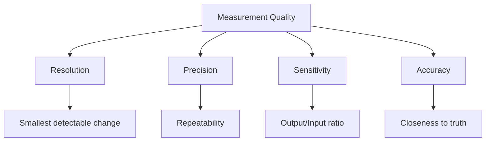
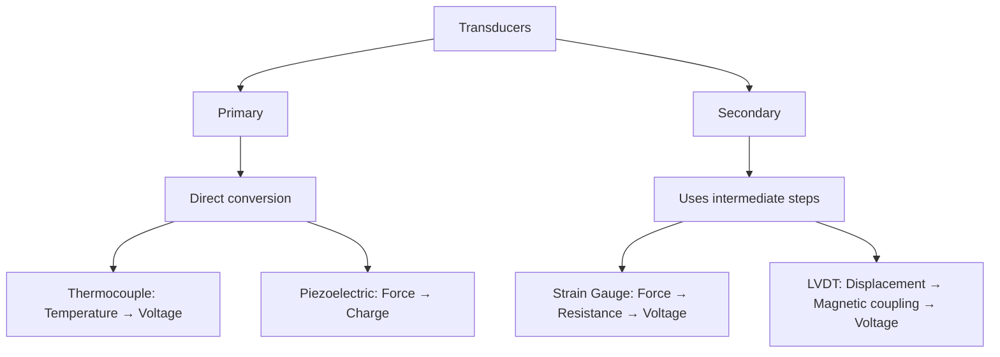

## Question 1(a) [3 marks]

**Illustrate steps to minimize that all type of systematic error.**

**Answer**:

Steps to minimize systematic errors:

| Step | Description |
|------|-------------|
| 1. Calibration | Periodically calibrate instruments against standard references |
| 2. Correction | Apply correction factors or offset values |
| 3. Control | Maintain constant environmental conditions (temperature, humidity) |
| 4. Technique | Use proper measurement techniques and procedures |
| 5. Equipment | Select appropriate instruments with required accuracy |

**Mnemonic:** "CCCTS: Calibrate, Correct, Control, Technique, Select"

## Question 1(b) [4 marks]

**Define: Resolution, Precision, Sensitivity and Accuracy.**

**Answer**:

| Term | Definition |
|------|------------|
| **Resolution** | The smallest change in input that can be detected by the instrument |
| **Precision** | Consistency or repeatability of measurements with minimal random error |
| **Sensitivity** | The ratio of change in output to the change in input (ΔO/ΔI) |
| **Accuracy** | Closeness of measured value to the true or accepted standard value |

**Diagram:**



**Mnemonic:** "RSPA: Resolve Signals Precisely and Accurately"

## Question 1(c) [7 marks]

**Explain a principle of Q Meter and Working of practical Q Meter.**

**Answer**:

Q Meter operates on the resonance principle to measure quality factor (Q) of coils and capacitors.

**Principle:** 

- Based on series resonance where Q = XL/R or XC/R at resonance
- Measures voltage magnification at resonance condition

**Working of practical Q meter:**

| Component | Function |
|-----------|----------|
| Oscillator | Generates variable frequency signal (50kHz to 50MHz) |
| Work coil | Inductor under test (connected in series with calibrated capacitor) |
| Capacitor | Variable calibrated capacitor for resonance tuning |
| VTVM | Measures resonant voltage across capacitor |
| Shunt resistor | Monitors current through the circuit |

**Diagram:**

```goat
+---------------+       +---------------+
|  RF           |       |               |
|  OSCILLATOR   +------->  WORK COIL    |
|               |       |   (Lx)        |
+---------------+       +-------+-------+
                                |
+---------------+       +-------v-------+
|               |       |               |
|    VTVM       <-------+  CAPACITOR    |
|  (Q READING)  |       |   (C)         |
+---------------+       +---------------+
```

- **Q factor calculation**: Q = V₂/V₁ where V₂ is voltage across capacitor and V₁ is the applied voltage
- **Applications**: Testing RF components, coil quality measurement
- **Resonance indication**: Maximum voltage across capacitor indicates resonance

**Mnemonic:** "VOCAL: Voltage ratio at resonance Oscillator Creates Amplification to measure coiL quality"

## Question 1(c OR) [7 marks]

**Explain Wheatstone bridge and derive equation for balanced condition. State application and limitation of Wheatstone bridge.**

**Answer**:

Wheatstone bridge is a network used to measure unknown resistance with high precision.

**Circuit diagram:**

```goat
       A
       o
       |
      +-+
      |R1|
      +-+
       |
R      o---------o D
       |         |
      +-+       +-+
      |R2|      |Rx|
      +-+       +-+
       |         |
       o---------o
       B         C
     
    G = Galvanometer
    Rx = Unknown resistance
```

**Balanced condition equation derivation:**

- At balance, no current flows through galvanometer
- Potential at point D = Potential at point B
- Voltage across R₁ = Voltage across Rx
- Voltage across R₂ = Voltage across R₃

Therefore:

- (R₁/R₂) = (Rx/R₃)
- Rx = R₃(R₁/R₂)

**Applications:**

| Application | Description |
|-------------|-------------|
| Precision resistance measurement | Accurate measurement of unknown resistors |
| Temperature sensing | When used with RTD or thermistor |
| Strain measurement | With strain gauges for stress analysis |
| Transducer interface | Converting physical quantities to electrical signals |

**Limitations:**

| Limitation | Description |
|------------|-------------|
| Low resistance measurement | Poor accuracy for very low resistances (<1Ω) |
| Sensitivity | Limited by galvanometer sensitivity |
| Range | Limited range of measurement (typically 1Ω to 100kΩ) |
| Contact resistance | Affects accuracy in low resistance measurements |

**Mnemonic:** "BEAR: Balance Equation at Arms Ratio"

## Question 2(a) [3 marks]

**Differentiate between moving iron and moving coil type instruments.**

**Answer**:

| Parameter | Moving Iron Instrument | Moving Coil Instrument |
|-----------|------------------------|------------------------|
| Operating principle | Magnetic attraction or repulsion | Electromagnetic force on current-carrying conductor |
| Scales | Non-uniform scale | Uniform scale |
| Accuracy | Lower (1-2.5%) | Higher (0.1-1%) |
| Frequency range | Works for both AC and DC | Only DC (unless rectified) |
| Damping | Air friction damping | Eddy current damping |
| Power consumption | Higher | Lower |

**Mnemonic:** "IRON-COIL: Iron uses Repulsion with Non-uniform scale; COIL uses Current with Organized, Improved, Linear scale"

## Question 2(b) [4 marks]

**Draw the construction diagram of clamp on Ammeter and explain in detail.**

**Answer**:

**Construction diagram of clamp-on ammeter:**

```goat
                  +------------+
     +----+       |   Display  |
     |    |       +------------+
     |    |       +------------+
     | C  |       |    CT      |
     | L  |       |            |
     | A  +-------+    |       |
     | M  +-------+    |       |
     | P  |       | Circuit    |
     |    |       |            |
     |    |       +------------+
     +----+       +------------+
                  |  Controls  |
                  +------------+
```

**Components and working:**

- **Core**: Split laminated ferromagnetic core that can be opened/closed
- **Coil**: Secondary winding wrapped around the core
- **Conductor**: Primary conductor (current to be measured) passes through the core
- **Measurement circuit**: Processes induced current and displays reading
- **Spring mechanism**: For easy opening and closing of the jaw

**Working principle**: Based on transformer principle where conductor acts as single-turn primary winding, creating magnetic flux proportional to current.

**Mnemonic:** "CLASP: Conductor-Loop Amperes Sensed by Primary-secondary relationship"

## Question 2(c) [7 marks]

**Describe working and advantages of Integrating type DVM with suitable diagram.**

**Answer**:

Integrating-type Digital Voltmeter converts analog voltage to digital value using dual-slope integration.

**Block diagram:**

```goat
+-------------+     +------------+     +-------------+     +----------+
| Input       |     | Integrator |     | Comparator  |     | Counter  |
| Circuit     +---->+            +---->+             +---->+          |
| Buffer      |     |            |     |             |     |          |
+-------------+     +------------+     +-------------+     +----------+
       ^                                      ^                 |
       |                                      |                 v
+-------------+                        +-------------+    +----------+
| Reference   |                        | Control     |    | Display  |
| Voltage     |<-----------------------+ Logic       |<---+          |
| Source      |                        | & Clock     |    |          |
+-------------+                        +-------------+    +----------+
```

**Working principle:**

| Phase | Description |
|-------|-------------|
| 1. Run-up | Unknown input voltage is integrated for fixed time T₁ |
| 2. Run-down | Reference voltage (opposite polarity) is integrated until output returns to zero |
| 3. Measurement | Time T₂ of run-down is proportional to input voltage |
| 4. Display | Digital value based on T₂/T₁ × Vref is displayed |

**Advantages:**

- **Noise rejection**: Excellent rejection of power line noise (50/60Hz)
- **Accuracy**: Highly accurate (0.005% to 0.05%)
- **Resolution**: High resolution (up to 6½ digits)
- **Stability**: Less affected by component tolerances
- **Common mode rejection**: High CMRR

**Mnemonic:** "RISES: Ramp Integration Samples and Eliminates Spikes"

## Question 2(a OR) [3 marks]

**Differentiate between Digital Voltmeter over Analog Voltmeter.**

**Answer**:

| Parameter | Digital Voltmeter | Analog Voltmeter |
|-----------|-------------------|------------------|
| Display | Numeric display (digits) | Pointer movement on scale |
| Reading error | No parallax error | Subject to parallax error |
| Resolution | Higher (limited by number of digits) | Limited by scale divisions |
| Accuracy | Better (typically 0.05% to 0.5%) | Lower (typically 1% to 3%) |
| Output | Can provide digital output for interfacing | No direct digital output |
| Power requirement | Requires power supply | Can be passive (PMMC type) |

**Mnemonic:** "DAPPER: Digital Accuracy and Precise readings; Parallax Error in Reading analog"

## Question 2(b OR) [4 marks]

**Draw the construction diagram of Moving iron type Meter and explain in detail.**

**Answer**:

**Construction diagram of moving iron meter:**

```goat
                 +----+ Pointer
                /
         +-----+  
         |     |
         | +-+ | 
Scale    | |^| | Moving iron
+--------+ +-+ |
|        |     |
|        |  #  | Fixed iron
|        |  #  |
|        +-----+
|          | |
|          | | Coil
+----------+ +------+
             Spring
```

**Working principle and components:**

- **Coil**: Creates magnetic field proportional to current
- **Iron vanes**: Two soft iron pieces (one fixed, one movable)
- **Movement**: Magnetic repulsion between similarly magnetized iron pieces
- **Control**: Spring provides opposing torque
- **Damping**: Air friction damping mechanism
- **Scale**: Non-uniform scale due to non-linear magnetic force

**Types:**

- Attraction type: Works on magnetic attraction principle
- Repulsion type: Works on magnetic repulsion principle

**Mnemonic:** "MIRROR: Magnetic Interaction Requires Repulsion/attraction Of Related iron pieces"

## Question 2(c OR) [7 marks]

**Describe construction diagram of Energy meter and explain in detail.**

**Answer**:

Electronic energy meter measures electrical energy consumption in kilowatt-hours.

**Construction diagram:**

```goat
+---------------------------+
|        Display            |
|    +---+---+---+---+---+  |
|    | 0 | 0 | 0 | 0 | 0 |  |
|    +---+---+---+---+---+  |
|                           |
|  +---------------------+  |
|  |    Microcontroller  |  |
|  +----------+----------+  |
|             ^             |
|             |             |
|  +----------+---------+   |
|  | Signal Conditioning|   |
|  +----------+---------+   |
|             ^             |
|             |             |
|  +----------+----------+  |
|  | Voltage & Current   |  |
|  | Sensing Circuits    |  |
|  +----------+----------+  |
|             ^             |
|      Input Terminals      |
+---------------------------+
```

**Components and working:**

| Component | Function |
|-----------|----------|
| Voltage sensor | Potential transformer or resistive divider to measure voltage |
| Current sensor | Current transformer or shunt resistor to measure current |
| Multiplier | Multiplies instantaneous voltage and current values |
| Integrator | Integrates power over time to calculate energy |
| Microcontroller | Processes signals and calculates energy consumption |
| Display | LCD or LED to show consumption in kWh |
| Pulse LED | Blinks at a rate proportional to power consumption |

**Working principle:**

1. Voltage and current are sensed by respective sensors
2. Signals are multiplied to obtain instantaneous power
3. Power is integrated over time to calculate energy
4. Energy is displayed as kilowatt-hours (kWh)

**Mnemonic:** "WATTAGE: Work And Time Tracked As Generated Electrical energy"

## Question 3(a) [3 marks]

**Apply Lissajous pattern for frequency measurement and Phase angle measurement.**

**Answer**:

Lissajous patterns on oscilloscope screen help measure frequency ratio and phase difference.

**Frequency measurement:**

- Apply reference signal to X-axis and unknown signal to Y-axis
- Frequency ratio = Number of tangent points on Y-axis / Number of tangent points on X-axis
- Frequency of unknown = Frequency of reference × Frequency ratio

| Pattern | Frequency Ratio (Y:X) |
|---------|----------------------|
|  | 1:1 |
|  | 2:1 |
|  | n:m |

**Phase angle measurement:**

- If both frequencies are equal, phase angle (φ) can be measured
- φ = sin⁻¹(A/B) where A = minor axis and B = major axis of ellipse

**Mnemonic:** "LIPS: Lissajous Indicates Phase and Signal frequency"

## Question 3(b) [4 marks]

**Explain Graticules in CRO also Explain its types.**

**Answer**:

Graticules are reference markings on CRO screen for measurements.

| Graticule Type | Description | Application |
|----------------|-------------|-------------|
| **Internal graticule** | Markings inside CRT glass | Eliminates parallax error |
| **External graticule** | Plastic overlay on screen | Replaceable, economical |
| **Electronic graticule** | Generated electronically | Digital storage oscilloscopes |

**Standard graticule features:**

- 10 × 8 divisions typically
- Center lines darker for reference
- Small hash marks for subdivisions
- Percentage markings (rise time)

**Diagram:**

```goat
+-------------------------------------+
|                                     |
|                                     |
|     |           |           |       |
|-----+-----------+-----------+-------|
|     |           |           |       |
|     |           |           |       |
|     |           |           |       |
|-----+-----------+-----------+-------|
|     |           |           |       |
|     |           |           |       |
|                                     |
+-------------------------------------+
```

**Mnemonic:** "GRID: Graticule References for Intensity and Distance"

## Question 3(c) [7 marks]

**Describe Construction, Block diagram, working and advantage of Digital storage oscilloscope (DSO).**

**Answer**:

Digital Storage Oscilloscope (DSO) converts analog signals to digital for storage and processing.

**Block diagram:**

```goat
+----------+     +-------+     +------+     +-------+     +-------+
| Vertical |     | ADC   |     | RAM  |     | DAC   |     | CRT/  |
| Amplifier+---->+       +---->+      +---->+       +---->+ LCD   |
+----------+     +-------+     +------+     +-------+     +-------+
      ^                           ^                          ^
      |                           |                          |
+----------+                  +-------+                  +--------+
| Input    |                  | CPU   |                  | Display|
|Attenuator|<-----------------+       +----------------->+ Control|
+----------+                  +-------+                  +--------+
                                 ^
                                 |
                              +-------+
                              | Timing|
                              |Circuit|
                              +-------+
```

**Working principle:**

1. **Signal acquisition**: Analog signal is sampled at high speed
2. **A/D conversion**: Continuous signal converted to discrete digital values
3. **Storage**: Digital values stored in memory
4. **Processing**: Microprocessor analyzes stored data
5. **Display**: Data converted back to analog for display or shown directly on LCD

**Advantages of DSO:**

| Advantage | Description |
|-----------|-------------|
| Pre-trigger viewing | Can see signal before trigger event |
| Single-shot capture | Can capture transient events |
| Waveform storage | Can save waveforms for later analysis |
| Signal processing | Advanced mathematical operations on signals |
| Automated measurements | Automatic parameter measurements |
| Digital interfaces | Can transfer data to computers |

**Mnemonic:** "SAMPLE: Storage And Memory Processes Live Events"

## Question 3(a OR) [3 marks]

**Differentiate between CRO and DSO.**

**Answer**:

| Parameter | Analog CRO | Digital Storage Oscilloscope |
|-----------|------------|------------------------------|
| Signal processing | Real-time analog | Digitized and stored |
| Storage capability | None (phosphor persistence only) | Can store waveforms in memory |
| Bandwidth | Typically higher for same price range | Limited by sampling rate |
| Pre-trigger view | Not possible | Available |
| Single-shot events | Difficult to capture | Easily captured |
| Signal analysis | Basic measurements only | Advanced mathematical analysis |

**Mnemonic:** "ASPAD: Analog Shows Present; Digital Archives Data"

## Question 3(b OR) [4 marks]

**Explain structure of 10:1 Probes in detail.**

**Answer**:

10:1 probe reduces signal amplitude by 10 times to extend oscilloscope range.

**Structure:**

```goat
    Probe tip       Cable           Compensation
      ^              ^                  ^
+-----+-----+   +----+----+   +--------+--------+
|     |     |   |         |   |        |        |
+--+--+-----+---+---------+---+--------+--------+
   |                                    |
   |                                    |
   |  Rm=9MΩ                           |
   +--/\/\/\--+                        |
   |          |                        |
   |      Cm=12pF                      |
   |         ||                        |
   |         ||                        |
   +---------++------------------------+
              |
              v
            Ground
```

**Components:**

| Component | Description |
|-----------|-------------|
| Probe tip | Metal contact point that touches circuit |
| Ground clip | Reference connection to circuit ground |
| Compensation network | RC circuit for frequency compensation |
| Probe body | Insulated housing for components |
| Cable | Low-capacitance coaxial cable |
| Connector | BNC connector for oscilloscope input |

**Working principle:**

- Forms voltage divider with oscilloscope input (9MΩ probe + 1MΩ scope = 10:1 division)
- Compensating capacitor ensures flat frequency response
- Reduces circuit loading effect by increasing effective input impedance

**Mnemonic:** "TAPER: Ten-to-one Attenuation Preserves and Extends Range"

## Question 3(c OR) [7 marks]

**Describe Block diagram, working and application of CRO.**

**Answer**:

CRO (Cathode Ray Oscilloscope) displays and measures electrical signals.

**Block diagram:**

```goat
                +-------------+
                | Cathode Ray |
                |    Tube     |
                +------+------+
                       ^
         +------+      |      +------+
         |      |      |      |      |
+---------+     +------+------+      +----------+
|Vertical |     |             |      |Horizontal|
|Amplifier|     |  Deflection |      |Amplifier |
+---+-----+     |   System    |      +----+-----+
    ^           |             |           ^
    |           +------+------+           |
+---+------+           |             +----+-----+
|Vertical  |           |             |Horizontal|
|Attenuator|           |             |Time Base |
+---+------+           |             +----+-----+
    ^                  |                  ^
    |                  v                  |
+---+----+      +------+------+      +----+----+
| Signal |      |   Power     |      | Trigger |
| Input  |      |   Supply    |      | Circuit |
+--------+      +-------------+      +---------+
```

**Working principle:**

1. **Electron beam generation**: CRT produces focused electron beam
2. **Vertical deflection**: Y-plates deflect beam proportional to input signal
3. **Horizontal deflection**: X-plates sweep beam across screen
4. **Triggering**: Synchronizes sweep with input signal
5. **Display**: Beam strikes phosphor screen creating visible trace

**Applications of CRO:**

| Application | Description |
|-------------|-------------|
| Waveform analysis | Visualize signal shape and characteristics |
| Frequency measurement | Measure time period and calculate frequency |
| Phase measurement | Compare phase relationship between signals |
| Voltage measurement | Measure signal amplitude |
| Component testing | Check behavior of electronic components |
| Transient analysis | Observe fast-changing events |

**Mnemonic:** "VIEW: Voltage Inspection and Electrical Waveform observation"

## Question 4(a) [3 marks]

**Differentiate RTD and Thermistor.**

**Answer**:

| Parameter | RTD (Resistance Temperature Detector) | Thermistor |
|-----------|--------------------------------------|------------|
| Material | Pure metals (Pt, Ni, Cu) | Semiconductor materials |
| Resistance-temp relation | Linear (positive) | Highly non-linear (usually negative) |
| Temperature range | -200°C to 850°C | -50°C to 300°C |
| Sensitivity | Lower (0.4%/°C) | Higher (4%/°C) |
| Accuracy | Higher | Lower |
| Cost | Higher | Lower |
| Response time | Slower | Faster |

**Mnemonic:** "METAL-SEMI: Metal Elements Temperature-Linear vs. SEMIconductor Exponential Measurement Instrument"

## Question 4(b) [4 marks]

**Give and explain two example of primary and Secondary transducer.**

**Answer**:

| Type | Examples | Explanation |
|------|----------|-------------|
| **Primary Transducers** |  |  |
| 1. Thermocouple | Directly converts temperature difference to voltage using Seebeck effect | Two dissimilar metals generate voltage proportional to temperature difference |
| 2. Piezoelectric crystal | Directly converts mechanical force to electrical charge | Quartz crystal develops charge proportional to applied pressure |
| **Secondary Transducers** |  |  |
| 1. Strain gauge | Requires intermediate conversion; change in dimension alters resistance | Mechanical strain → resistance change → electrical signal |
| 2. LVDT | Requires intermediate conversion; displacement changes magnetic coupling | Mechanical displacement → magnetic coupling → electrical signal |

**Diagram:**



**Mnemonic:** "PIDS: Primary Is Direct; Secondary is Stepwise"

## Question 4(c) [7 marks]

**Describe Thermocouple with working principle, types and application.**

**Answer**:

Thermocouple is a temperature sensor based on the Seebeck effect.

**Working principle:**

- When two dissimilar metals are joined, a voltage is generated proportional to temperature difference
- Seebeck effect: Temperature gradient creates electromotive force

**Diagram:**

```goat
                   Hot Junction
                        V
  Metal A ---+        / \        +--- Metal A
             |       /   \       |
             +------+     +------+
             |      |     |      |
  Metal B ---+      +-----+      +--- Metal B
                        ^
                   Cold Junction
                        |
                        v
                    Voltmeter
```

**Types of thermocouples:**

| Type | Materials | Temperature Range | Application |
|------|-----------|-------------------|-------------|
| Type J | Iron-Constantan | -40°C to 750°C | General purpose, reducing atmosphere |
| Type K | Chromel-Alumel | -200°C to 1350°C | Oxidizing atmosphere, high temperatures |
| Type T | Copper-Constantan | -200°C to 350°C | Low temperature, food industry |
| Type E | Chromel-Constantan | -200°C to 900°C | Highest sensitivity, cryogenics |
| Type R/S | Platinum-Rhodium | 0°C to 1600°C | High temperature, laboratory standards |

**Applications:**

- Industrial temperature measurement
- Furnace and kiln temperature control
- Chemical processing
- Food processing
- Automotive engine sensors
- Medical equipment

**Mnemonic:** "STEVE: Seebeck Thermoelectric Effect Verifies Elevated temperatures"

## Question 4(a OR) [3 marks]

**Demonstrate working and principle Semiconductor Temperature Sensor LM35.**

**Answer**:

LM35 is a precision integrated-circuit temperature sensor that provides output voltage proportional to temperature.

**Principle:**

- Based on the predictable change in base-emitter voltage (VBE) of a transistor with temperature
- Output voltage linearly proportional to Celsius temperature (10mV/°C)

**Circuit diagram:**

```goat
    +------+
    |      |
 +--+ Vs   |
 |  |      |
 |  | LM35 +---+ Vout (10mV/°C)
 |  |      |
 |  | GND  +---+
 |  |      |   |
 |  +------+   |
 |             |
 +-------------+
       GND
```

**Working characteristics:**

- Linear output: 10mV/°C (0.01V/°C) scale factor
- Range: -55°C to +150°C
- Accuracy: ±0.5°C (typical)
- Low self-heating: 0.08°C in still air
- Low impedance output: 0.1Ω for 1mA load

**Mnemonic:** "LOTUS: Linear Output Temperature Units from Semiconductor"

## Question 4(b OR) [4 marks]

**Describe incremental type of Optical encoder with it's output waveform.**

**Answer**:

Incremental optical encoder generates pulses as shaft rotates to measure position, speed, and direction.

**Construction:**

```goat
           +---------+
           | LED     |
           |    \    |
           |     \   |
           |      \  |
           |       \ |
           |        \|
+----------+         |
| Rotating |         |
| Disk     |         |
| with     |         |
| slots    |         |
+----------+         |
           |        /|
           |       / |
           |      /  |
           |     /   |
           | Photo   |
           | detector|
           +---------+
```

**Output waveform:**

```goat
Channel A: _____          _____          _____
                |________|     |________|     |________

Channel B: ___      _____       _____       _____
             |_____|     |_____|     |_____|     |_____

          <---------- One Rotation ---------->
```

**Working principle:**

- Light source (LED) shines through slotted disk
- Photodetectors receive light pulses as disk rotates
- Two output channels (A and B) are 90° out of phase
- Direction determined by which channel leads
- Resolution depends on number of slots on disk

**Mnemonic:** "PADS: Pulses from A and Determine Speed"

## Question 4(c OR) [7 marks]

**Describe construction, operation of LVDT with advantages, disadvantages and application.**

**Answer**:

LVDT (Linear Variable Differential Transformer) is an electromechanical transducer that converts linear displacement into electrical signal.

**Construction:**

```goat
                   Core
              +----+----+
              |    |    |
              v    v    v
      +------+++++++++++++------+
      |      |    |    |        |
+-----+------+----+----+--------+-----+
|     |Primary|    |    |Secondary    |
|     |  Coil |    |    |   Coil      |
+-----+------+----+----+--------+-----+
      |      |    |    |        |
      +------+++++++++++++------+
                   ^
                   |
              Moving Core
```

**Operation:**

1. AC excitation applied to primary coil
2. Magnetic flux couples to secondary coils
3. Core position determines differential voltage output
4. Null position: Equal voltage in both secondaries
5. Movement: Voltage increases in one secondary, decreases in other

**Advantages:**

| Advantage | Description |
|-----------|-------------|
| Frictionless | No mechanical contact between core and coils |
| Infinite resolution | Analog output with no quantization |
| Robustness | Long operational life, high reliability |
| Null position stability | Highly stable reference position |
| High sensitivity | Small displacements can be measured |

**Disadvantages:**

| Disadvantage | Description |
|--------------|-------------|
| AC excitation required | Needs AC power source |
| Temperature sensitive | Output varies with temperature |
| Position limited | Measurement range is limited |
| Bulky | Larger size compared to other sensors |

**Applications:**

- Machine tool positioning
- Hydraulic and pneumatic systems
- Aircraft and missile systems
- Automated manufacturing
- Structural testing

**Mnemonic:** "MOVE-AC: Magnetic Output Varies with Exact Armature Core position"

## Question 5(a) [3 marks]

**Describe working of Pressure measurement using Capacitive transducer.**

**Answer**:

Capacitive pressure transducer uses changes in capacitance to measure pressure.

**Working principle:**

- Pressure deforms diaphragm, changing distance between capacitor plates
- Capacitance inversely proportional to distance (C = ε₀εₐA/d)
- Change in capacitance is measured and converted to pressure reading

**Diagram:**

```goat
     Pressure
        ↓
    +---+---+
    |       | Metal housing
+---+-------+---+
|   |       |   |
|   |       |   |
|   | ≈≈≈≈   | Diaphragm (movable plate)
|   |       |   |
+---+---+---+---+
|   |   |   |   |
|   |   |   |   | Air gap
|   |   |   |   |
+---+---+---+---+ Fixed plate
|               |
+---------------+
    Insulator
```

**Application:** Industrial process monitoring, atmospheric pressure measurement, liquid level sensing

**Mnemonic:** "CAPS: Capacitance Alters as Pressure Shifts"

## Question 5(b) [4 marks]

**Define rise time, fall time, Pulse width and duty cycle.**

**Answer**:

| Parameter | Definition |
|-----------|------------|
| **Rise Time** | Time taken for pulse to rise from 10% to 90% of its maximum amplitude |
| **Fall Time** | Time taken for pulse to fall from 90% to 10% of its maximum amplitude |
| **Pulse Width** | Time interval between 50% amplitude points on rising and falling edges |
| **Duty Cycle** | Ratio of pulse width to total period, expressed as percentage |

**Diagram:**

```goat
     ^ Amplitude
     |
     |    +---------+
     |    |         |
90%  |----+         +----
     |   /|         |\
     |  / |         | \
     | /  |         |  \
50%  |/   |         |   \
     +----+---------+----+---> Time
     |    |         |    |
10%  |    |         |    |
     |    |<-Pulse->|    |
     |    | Width   |    |
     |    |         |    |
     |<-->|         |<-->|
     Rise |         |Fall
     Time |         |Time
     |    |<---Period--->|
```

**Mnemonic:** "RPFD: Rise Pulses, Fall Determines"

## Question 5(c) [7 marks]

**Discuss Function generator block diagram.**

**Answer**:

Function generator produces various waveforms over a range of frequencies.

**Block diagram:**

```goat
+----------+     +----------+     +----------+     +----------+     +----------+
| Frequency|     | Waveform |     | Amplitude|     | Output   |     | Output   |
| Control  +---->+ Generator+---->+ Control  +---->+ Buffer   +---->+          |
| Circuit  |     | (VCO)    |     | Circuit  |     | Amplifier|     |          |
+----------+     +----------+     +----------+     +----------+     +----------+
      ^               |                                                  ^
      |               v                                                  |
      |          +----------+     +----------+                     +-----------+
      |          | Waveshape|     | DC Offset|                     | Attenuator|
      |          | Circuit  |     | Circuit  |                     | Circuit   |
      |          +----------+     +----------+                     +-----------+
      |               |                |                                 ^
      |               v                v                                 |
      |          +----------+     +----------+     +----------+    +-----------+
      +----------+ Sync     |     | Duty     |     | Trigger  |    | Protection|
                 | Output   |     | Cycle    |     | Circuit  |    | Circuit   |
                 +----------+     +----------+     +----------+    +-----------+
```

**Function and operation of each block:**

| Block | Function |
|-------|----------|
| **Frequency Control** | Sets the operating frequency using variable capacitor/resistor network |
| **Waveform Generator** | Voltage-controlled oscillator producing basic waveform (usually triangle) |
| **Waveshape Circuit** | Converts triangle wave to sine/square waves through shaping circuits |
| **Amplitude Control** | Adjusts output amplitude of the generated waveform |
| **DC Offset** | Adds DC bias to shift the waveform up or down from zero reference |
| **Output Buffer** | Provides low output impedance for proper loading |
| **Attenuator** | Controls final output level with calibrated steps |
| **Protection Circuit** | Protects output from short circuits or overload |

**Output waveforms:**

| Waveform | Generation Method |
|----------|-------------------|
| Sine | Shaped from triangle wave using non-linear shaping circuit |
| Square | Derived from triangle wave using comparator |
| Triangle | Basic output from integrator circuit |
| Ramp | Modified triangle wave with different rise/fall times |
| Pulse | Square wave with variable duty cycle |

**Mnemonic:** "FASTEST: Frequency Amplitude Shaping Together Ensures Signal Types"

## Question 5(a OR) [3 marks]

**Discuss Working, construction of strain gauge.**

**Answer**:

Strain gauge converts mechanical deformation to electrical resistance change.

**Construction:**

```goat
            Terminals
               ||
    +----------++----------+
    |                      |
    | +-----------------+  |
    | |  /\/\/\/\/\/\/\ |  |
    | | /\/\/\/\/\/\/\/ |  | Resistive
    | |/\/\/\/\/\/\/\/\ |  | Grid
    | |\/ \/\/\/\/\/\/\ |  |
    | | \/\/\/\/\/\/\/\ |  |
    | +-----------------+  |
    |                      |
    +----------------------+
           Backing material
```

**Working principle:**

- Based on piezoresistive effect: resistance changes with mechanical deformation
- When bonded to object, strain gauge deforms along with it
- Resistance increases with tension (elongation)
- Resistance decreases with compression (shortening)
- Resistance change is measured using bridge circuit

**Resistance change relation:**

- ΔR/R = GF × ε
- Where: ΔR = resistance change, R = initial resistance
- GF = gauge factor (sensitivity), ε = strain

**Materials used:**

- Foil: Constantan, Karma, Nichrome alloys
- Semiconductor: Silicon, Germanium for higher sensitivity

**Mnemonic:** "SERB: Strain Effects Resistance by Bonding"

## Question 5(b OR) [4 marks]

**Describe working of Digital IC tester with suitable diagrams.**

**Answer**:

Digital IC tester verifies functionality of integrated circuits by applying test patterns.

**Block diagram:**

```goat
    +-------------+      +-------------+
    | Keypad/     |      | Display     |
    | Interface   |      | LCD/LED     |
    +------+------+      +------+------+
           |                    ^
           v                    |
    +------+--------------------+------+
    |                                  |
    |         Microcontroller          |
    |                                  |
    +---+------------+-------------+---+
        |            |             |
        v            v             v
+-------+------+ +----+------+ +----+-------+
| Test Pattern | | IC Socket | | Result     |
| Generator    | | Interface | | Comparator |
+--------------+ +----+------+ +------------+
                      |               ^
                      v               |
                +-----+---------------+---+
                |                         |
                |     IC Under Test       |
                |                         |
                +-------------------------+
```

**Working principle:**

1. IC is inserted into test socket
2. User selects IC type/number using keypad
3. Microcontroller loads appropriate test pattern
4. Test patterns applied to IC inputs
5. Output responses compared with expected values
6. Pass/Fail result displayed

**Features of digital IC tester:**

- Tests TTL, CMOS, HCMOS logic families
- Can identify unknown ICs by analyzing pin functions
- Performs functional and parametric tests
- Checks for static and dynamic characteristics

**Mnemonic:** "PIPE: Pattern Input, Pin Examination"

## Question 5(c OR) [7 marks]

**Discuss working of Spectrum Analyzer with suitable diagrams.**

**Answer**:

Spectrum analyzer displays signal amplitude versus frequency, showing frequency components.

**Block diagram:**

```goat
+-----------+    +------------+    +----------+    +-----------+    +----------+
| RF Input  |    | Attenuator |    | Mixer    |    | IF        |    | Detector |
| Circuit   +--->+ & Filters  +--->+ Circuit  +--->+ Filter    +--->+ Circuit  |
+-----------+    +------------+    +----+-----+    +-----------+    +-----+----+
                                        ^                                  |
                                        |                                  v
                                   +----+-----+                       +----+-----+
                                   | Local    |                       | Video    |
                                   | Oscillator|                      | Filter   |
                                   +----+-----+                       +-----+----+
                                        ^                                   |
                                        |                                   v
+-----------+    +------------+    +----+-----+                       +-----+----+
| Control   |    | CPU &      |    | Sweep    |    +------------+     | Display  |
| Panel     +--->+ Processor  +--->+ Generator+--->+ Horizontal |---->+ Circuit  |
+-----------+    +------------+    +----------+    | Deflection |     +----------+
                                                   +------------+
```

**Working principle:**

1. **Superheterodyne conversion**: Input signal mixed with local oscillator
2. **Frequency sweep**: Local oscillator sweeps across frequency range
3. **IF filtering**: Narrow bandpass filter selects frequency components
4. **Detection**: Amplitude of each frequency component is measured
5. **Display**: Amplitude vs. frequency plot shown on screen

**Types of spectrum analyzers:**

| Type | Principle | Application |
|------|-----------|-------------|
| Swept-tuned | Superheterodyne with swept LO | RF and microwave signals |
| FFT (Fast Fourier Transform) | Digital conversion and FFT algorithm | Audio and low-frequency signals |
| Real-time | Combination of FFT with high-speed processing | Transient and dynamic signals |

**Applications:**

- EMI/EMC testing
- Signal purity measurement
- Harmonic distortion analysis
- Communication system testing
- Modulation analysis

**Mnemonic:** "SHAFT: Sweep, Heterodyne, Analyze Frequency and Time"
