## પ્રશ્ન 1(અ) [3 ગુણ]

**નીચેના શબ્દને વ્યાખ્યાયિત કરો: (1) Accuracy (2) precision (3) Reproducibility**

**જવાબ**:

- **Accuracy**: માપવામાં આવેલા મૂલ્યની વાસ્તવિક મૂલ્યની નજીકતા
- **Precision**: એક જ ઇનપુટને વારંવાર લાગુ કરવા પર સમાન આઉટપુટ પુનઃઉત્પન્ન કરવાની સાધનની ક્ષમતા
- **Reproducibility**: બદલાયેલી પરિસ્થિતિઓ (અલગ પદ્ધતિ, નિરીક્ષક, અથવા સમય) હેઠળ માપવામાં આવે ત્યારે સમાન જથ્થાનાં માપનના પરિણામો વચ્ચે સંમતિની ડિગ્રી

**સંગ્રહવાક્ય:** "APR: ચોક્કસતા-સત્ય માટે, ચોકસાઈ-પુનરાવર્તન, પુન:ઉત્પાદન-ફેરફાર હેઠળ"

## પ્રશ્ન 1(બ) [4 ગુણ]

**RTD ટ્રાન્સડ્યુસરનું બાંધકામ જરૂરી આકૃતિ સાથે વિગતવાર સમજાવો. તેની એપ્લિકેશનની યાદી બનાવો.**

**જવાબ**:

RTD (Resistance Temperature Detector) એ તાપમાન સેન્સર છે જે ધાતુઓના ઇલેક્ટ્રિકલ રેસિસ્ટન્સ તાપમાન સાથે બદલાય છે તે સિદ્ધાંત પર કાર્ય કરે છે.

**આકૃતિ:**

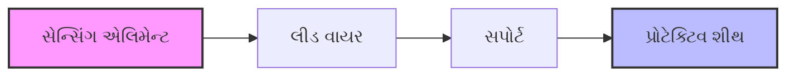

- **સેન્સિંગ એલિમેન્ટ**: સિરામિક કોર પર વીંટળાયેલા શુદ્ધ પ્લેટિનમ, નિકલ, અથવા કોપર વાયર
- **લીડ વાયર**: RTDને માપન સર્કિટ સાથે જોડે છે
- **સપોર્ટ**: સેન્સિંગ એલિમેન્ટને યાંત્રિક સ્થિરતા પ્રદાન કરે છે
- **પ્રોટેક્ટિવ શીથ**: સેન્સિંગ એલિમેન્ટને બાહ્ય વાતાવરણથી રક્ષણ આપે છે

**RTDના ઉપયોગો:**

- પ્રોસેસ ઉદ્યોગોમાં તાપમાન માપન
- ફૂડ પ્રોસેસિંગ તાપમાન મોનિટરિંગ
- HVAC સિસ્ટમ્સ
- મેડિકલ ઉપકરણો

**સંગ્રહવાક્ય:** "RTD: Resistance Temperature Detector - ચોક્કસ તાપમાન માપન"

## પ્રશ્ન 1(ક) [7 ગુણ]

**સર્કિટ ડાયાગ્રામ સાથે મેક્સવેલના બ્રિજનું કાર્ય સમજાવો. તેના ફાયદા, ગેરફાયદા અને એપ્લિકેશનોની યાદી બનાવો.**

**જવાબ**:

મેક્સવેલ બ્રિજનો ઉપયોગ જાણીતા કેપેસિટન્સ અને રેસિસ્ટન્સની સંદર્ભમાં અજ્ઞાત ઇન્ડક્ટન્સ માપવા માટે થાય છે.

**સર્કિટ આકૃતિ:**

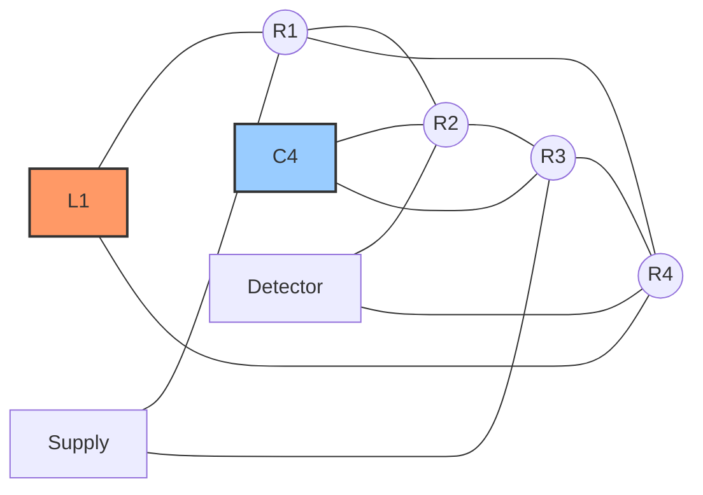

**કાર્યપ્રણાલી:**
સંતુલન શરત પર: L1 = C4 × R2 × R3

જ્યારે બ્રિજ સંતુલિત હોય, ત્યારે ડિટેક્ટર શૂન્ય કરંટ દર્શાવે છે. અજ્ઞાત ઇન્ડક્ટન્સ L1 ઉપરોક્ત સમીકરણનો ઉપયોગ કરીને ગણવામાં આવે છે, જ્યાં C4 જાણીતા કેપેસિટન્સ અને R2, R3 જાણીતા રેસિસ્ટન્સ છે.

| પરિમાણ | મૂલ્ય |
|-----------|-------|
| સંતુલન સમીકરણ | L1 = C4 × R2 × R3 |
| ક્વોલિટી ફેક્ટર | Q = ωL1/R1 = ωC4R3 |

**ફાયદાઓ:**

- મધ્યમ Q ઇન્ડક્ટર્સ માટે ઉચ્ચ ચોકસાઈ
- સંતુલન સમીકરણો ફ્રીક્વન્સીથી સ્વતંત્ર છે
- ઇન્ડક્ટન્સ માટે સરળ ગણતરી

**ગેરફાયદાઓ:**

- ઓછા Q ઇન્ડક્ટર માપન માટે યોગ્ય નથી
- પરિવર્તનશીલ સ્ટાન્ડર્ડ કેપેસિટરની જરૂર પડે છે
- સ્ટ્રે કેપેસિટન્સથી પ્રભાવિત થાય છે

**એપ્લિકેશન્સ:**

- પ્રયોગશાળાઓમાં ઇન્ડક્ટન્સ માપવા
- ઇન્ડક્ટન્સ માનકોનું કેલિબ્રેશન
- ઇન્ડક્ટિવ ઘટકોનું પરીક્ષણ

**સંગ્રહવાક્ય:** "મેક્સવેલની જાદુ: ઇન્ડક્ટન્સ = કેપેસિટન્સ × રેસિસ્ટન્સ વર્ગ"

## પ્રશ્ન 1(ક) OR [7 ગુણ]

**સંતુલન સ્થિતિ માટે સર્કિટ ડાયાગ્રામ સાથે વ્હીટસ્ટોન બ્રિજનું કાર્ય સમજાવો. તેના ફાયદા, ગેરફાયદા અને એપ્લિકેશનોની યાદી બનાવો.**

**જવાબ**:

વ્હીટસ્ટોન બ્રિજનો ઉપયોગ જાણીતા રેસિસ્ટન્સ મૂલ્યો સાથે તેની તુલના કરીને અજ્ઞાત રેસિસ્ટન્સ માપવા માટે થાય છે.

**સર્કિટ આકૃતિ:**

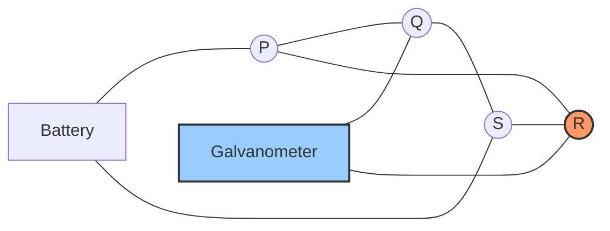

**કાર્યપ્રણાલી:**
સંતુલન સ્થિતિ પર: P/Q = R/S અથવા R = S × (P/Q)

જ્યારે બ્રિજ સંતુલિત હોય, ત્યારે ગેલ્વેનોમીટર શૂન્ય વિક્ષેપ બતાવે છે. અજ્ઞાત રેસિસ્ટન્સ R અન્ય રેસિસ્ટન્સના ગુણોત્તરનો ઉપયોગ કરીને ગણવામાં આવે છે.

| ઘટક | કાર્ય |
|-----------|----------|
| P, Q, S | જાણીતા રેસિસ્ટન્સ |
| R | અજ્ઞાત રેસિસ્ટન્સ |
| G | ગેલ્વેનોમીટર (ડિટેક્ટર) |
| E | DC વોલ્ટેજ સ્ત્રોત |

**ફાયદાઓ:**

- રેસિસ્ટન્સ માપનમાં ઉચ્ચ ચોકસાઈ
- સરળ બાંધકામ અને સંચાલન
- રેસિસ્ટન્સ માપનની વિશાળ શ્રેણી

**ગેરફાયદાઓ:**

- ખૂબ ઓછા અથવા ખૂબ ઊંચા રેસિસ્ટન્સ માપી શકતા નથી
- પાવર સોર્સ તરીકે બેટરીની જરૂર પડે છે
- રેસિસ્ટર્સ પર તાપમાનની અસરો ભૂલો પેદા કરે છે

**એપ્લિકેશન્સ:**

- ચોક્સાઈપૂર્ણ રેસિસ્ટન્સ માપન
- સ્ટ્રેન ગેજ માપન
- RTDsનો ઉપયોગ કરીને તાપમાન સંવેદન
- ટ્રાન્સડ્યુસર એપ્લિકેશન્સ

**સંગ્રહવાક્ય:** "જ્યારે વ્હીટસ્ટોન સંતુલિત થાય: વિરોધાભાસી પાસાઓનું ગુણનફળ સમાન હોય છે (P×S = Q×R)"

## પ્રશ્ન 2(અ) [3 ગુણ]

**મૂવિંગ આયર્ન અને મૂવિંગ કોઇલ પ્રકારના સાધનોની સરખામણી કરો.**

**જવાબ**:

| વિશેષતા | મૂવિંગ આયર્ન ટાઇપ | મૂવિંગ કોઇલ ટાઇપ |
|----------------|------------------|------------------|
| સિદ્ધાંત | ચુંબકીય આકર્ષણ/અપકર્ષણ | ઇલેક્ટ્રોમેગ્નેટિક બળ |
| સ્કેલ | બિન-એકસરખી | એકસરખી |
| ડેમ્પિંગ | નબળી | સારી |
| ચોકસાઈ | ઓછી ચોકસાઈ (2-5%) | ઉચ્ચ ચોકસાઈ (0.1-2%) |
| આવૃત્તિ શ્રેણી | DC અને AC | DC ફક્ત (રેક્ટિફાયર વિના) |
| પાવર વપરાશ | ઉચ્ચ | નીચો |
| કિંમત | ઓછી ખર્ચાળ | વધુ ખર્ચાળ |

**સંગ્રહવાક્ય:** "IMAP-CAD: આયર્ન-ચુંબકીય-AC-નબળી ડેમ્પિંગ, કોઇલ-ચોક્કસ-DC-સારી ડેમ્પિંગ"

## પ્રશ્ન 2(બ) [4 ગુણ]

**Successive approximation પ્રકાર DVM નું કાર્ય અને બાંધકામ જરૂરી ડાયાગ્રામ સાથે સમજાવો.**

**જવાબ**:

Successive Approximation પ્રકારનું Digital Voltmeter (DVM) દ્વિઅંકી શોધ તકનીકનો ઉપયોગ કરીને એનાલોગ વોલ્ટેજને ડિજિટલ મૂલ્યમાં રૂપાંતરિત કરે છે.

**બ્લોક ડાયાગ્રામ:**

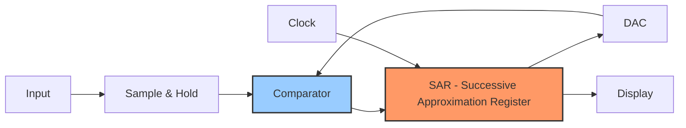

**કાર્યપ્રણાલી:**

1. Sample & Hold સર્કિટ ઇનપુટ વોલ્ટેજને પકડે છે
2. SAR MSBને 1, અન્ય બિટ્સને 0 પર સેટ કરે છે
3. DAC ડિજિટલ શબ્દને એનાલોગ વોલ્ટેજમાં રૂપાંતરિત કરે છે
4. કમ્પેરેટર DAC આઉટપુટની ઇનપુટ વોલ્ટેજ સાથે તુલના કરે છે
5. જો DAC આઉટપુટ > ઇનપુટ, બિટ 0 પર રીસેટ થાય છે; અન્યથા 1 રાખે છે
6. બધા બિટ્સનું પરીક્ષણ થાય ત્યાં સુધી પ્રક્રિયા આગલા બિટ માટે પુનરાવર્તિત થાય છે
7. અંતિમ ડિજિટલ શબ્દ ઇનપુટ વોલ્ટેજનું પ્રતિનિધિત્વ કરે છે

**ફાયદાઓ:**

- મધ્યમ રૂપાંતર ગતિ (10-100 μs)
- સારા રિઝોલ્યુશન અને ચોકસાઈ
- મધ્યમ કિંમત

**સંગ્રહવાક્ય:** "SAR DVM: Sample-And-Register દ્વારા Digital-Voltage-Matching"

## પ્રશ્ન 2(ક) [7 ગુણ]

**1- 10 એમ્પીયર સુધી રીડિંગ કરતી મૂવિંગ કોઇલ એમીટર 0.02 ઓહ્મનો પ્રતિકાર ધરાવે છે. 1000 એમ્પીયર સુધીનો વર્તમાન વાંચવા માટે આ સાધન કેવી રીતે અપનાવી શકાય?**
**2- મૂવિંગ કોઇલ વોલ્ટમીટર 200 mV સુધીનું રીડિંગ 5 ઓહ્મનું પ્રતિકાર ધરાવે છે. 300 વોલ્ટ સુધીના વોલ્ટેજને વાંચવા માટે આ સાધનને કેવી રીતે અપનાવી શકાય?**

**જવાબ**:

**ભાગ 1: એમીટર રેન્જ એક્સટેન્શન**

એમીટરની રેન્જ 10A થી 1000A સુધી વધારવા માટે, મીટરની સમાંતર શંટ રેસિસ્ટર જોડવામાં આવે છે.

**આકૃતિ:**

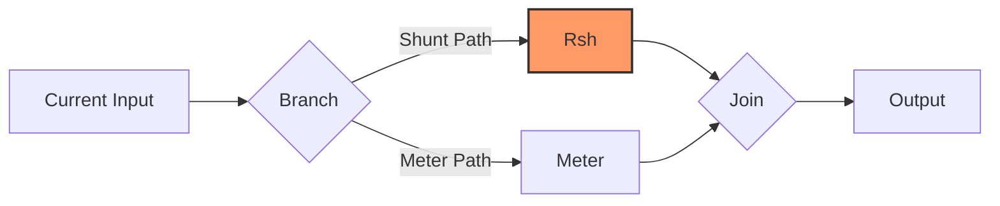

**ગણતરી:**

- મૂળ મીટર રેસિસ્ટન્સ (Rm) = 0.02 Ω
- મૂળ પૂર્ણ-સ્કેલ કરંટ (Im) = 10 A
- ઇચ્છિત પૂર્ણ-સ્કેલ કરંટ (I) = 1000 A
- શંટ દ્વારા કરંટ (Ish) = I - Im = 1000 - 10 = 990 A
- મીટર પરનું વોલ્ટેજ = શંટ પરનું વોલ્ટેજ
- Im × Rm = Ish × Rsh
- Rsh = (Im × Rm) ÷ Ish = (10 × 0.02) ÷ 990 = 0.0002 Ω

**ભાગ 2: વોલ્ટમીટર રેન્જ એક્સટેન્શન**

વોલ્ટમીટરની રેન્જ 200mV થી 300V સુધી વધારવા માટે, મીટર સાથે શ્રેણીમાં મલ્ટિપ્લાયર રેસિસ્ટર જોડવામાં આવે છે.

**આકૃતિ:**


**ગણતરી:**

- મૂળ મીટર રેસિસ્ટન્સ (Rm) = 5 Ω
- મૂળ પૂર્ણ-સ્કેલ વોલ્ટેજ (Vm) = 200 mV = 0.2 V
- ઇચ્છિત પૂર્ણ-સ્કેલ વોલ્ટેજ (V) = 300 V
- શ્રેણી રેસિસ્ટન્સ (Rs) = [(V ÷ Vm) - 1] × Rm
- Rs = [(300 ÷ 0.2) - 1] × 5 = (1500 - 1) × 5 = 1499 × 5 = 7495 Ω

**સંગ્રહવાક્ય:** "શંટ-શ્રેણી: શંટ-કરંટ-માટે, શ્રેણી-વોલ્ટેજ-માટે"

## પ્રશ્ન 2(અ) OR [3 ગુણ]

**ક્લેમ્પનું મીટર કાર્ય અને બાંધકામ જરૂરી ડાયાગ્રામ સાથે સમજાવો.**

**જવાબ**:

ક્લેમ્પ ઓન મીટર (કરંટ ક્લેમ્પ) ઇલેક્ટ્રોમેગ્નેટિક ઇન્ડક્શનનો ઉપયોગ કરીને સર્કિટને તોડ્યા વિના કરંટ માપે છે.

**આકૃતિ:**


**બાંધકામ અને કાર્યપ્રણાલી:**

- **ક્લેમ્પ જો**: સ્પ્લિટ કોર ટ્રાન્સફોર્મર જે વાહકને ફરતે રાખવા માટે ખોલી શકાય છે
- **કરંટ ટ્રાન્સફોર્મર**: પ્રાથમિક કરંટને પ્રમાણસર ગૌણ કરંટમાં રૂપાંતરિત કરે છે
- **રેક્ટિફાયર**: ACને માપન સર્કિટ માટે DCમાં રૂપાંતરિત કરે છે
- **માપન સર્કિટ**: સિગ્નલ પર પ્રક્રિયા કરે છે અને કરંટ મૂલ્યની ગણતરી કરે છે
- **ડિસ્પ્લે**: માપવામાં આવેલા કરંટ મૂલ્યને બતાવે છે

જ્યારે કરંટ-વહન કરતો વાહક ક્લેમ્પ જો મારફતે પસાર થાય છે, ત્યારે તે ગૌણ વાઇન્ડિંગમાં પ્રાથમિક કરંટના પ્રમાણમાં કરંટ પ્રેરિત કરે છે, જેનું પછી માપન કરવામાં આવે છે.

**સંગ્રહવાક્ય:** "CLAMP: Current-Loop Amplifies Magnetic Proportionally"

## પ્રશ્ન 2(બ) OR [4 ગુણ]

**PMMC સાધનોની કામગીરી જરૂરી ડાયાગ્રામ સાથે સમજાવો.**

**જવાબ**:

PMMC (પર્મેનન્ટ મેગ્નેટ મૂવિંગ કોઇલ) સાધનો ચુંબકીય ક્ષેત્રમાં કરંટ-વહન કરતા વાહક પર ઇલેક્ટ્રોમેગ્નેટિક બળના સિદ્ધાંત પર કાર્ય કરે છે.

**આકૃતિ:**

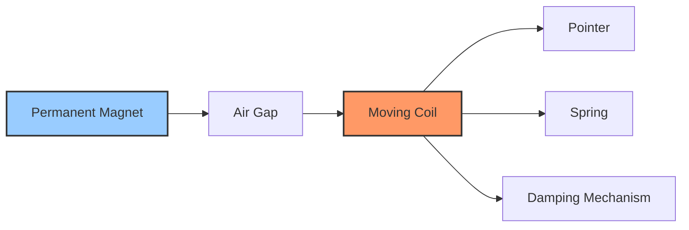

**કાર્યપ્રણાલી:**

1. ચુંબકીય ક્ષેત્રમાં મૂકેલી લંબચોરસ કોઇલ મારફતે કરંટ વહે છે
2. ઇલેક્ટ્રોમેગ્નેટિક બળ કરંટના પ્રમાણમાં ટોર્ક પેદા કરે છે
3. સ્પ્રિંગ નિયંત્રિત ટોર્ક પ્રદાન કરે છે
4. પોઇન્ટર કરંટના પ્રમાણમાં વિક્ષેપિત થાય છે
5. ડેમ્પિંગ સિસ્ટમ દોલનોને અટકાવે છે

**ઘટકો:**

- કાયમી ચુંબક મજબૂત ચુંબકીય ક્ષેત્ર બનાવે છે
- સોફ્ટ આયર્ન કોર ચુંબકીય ફ્લક્સને કેન્દ્રિત કરે છે
- મૂવિંગ કોઇલ માપવામાં આવતા કરંટને વહન કરે છે
- કંટ્રોલ સ્પ્રિંગ્સ પુનઃપ્રાપ્તિ બળ પૂરું પાડે છે
- ડેમ્પિંગ સિસ્ટમ (હવા અથવા એડી કરંટ) દોલનોને ઘટાડે છે

**સંગ્રહવાક્ય:** "PMMC: Permanent Magnet Makes Current-proportional movement"

## પ્રશ્ન 2(ક) OR [7 ગુણ]

**જરૂરી ડાયાગ્રામ અને વેવફોર્મ સાથે ઇન્ટિગ્રેટિંગ ટાઇપ DVM નું બ્લોક ડાયાગ્રામ, કામગીરી અને બાંધકામ દોરો.**

**જવાબ**:

ઇન્ટિગ્રેટિંગ ટાઇપ DVM (ડિજિટલ વોલ્ટમીટર) નિશ્ચિત સમય દરમિયાન ઇનપુટનું એકીકરણ કરીને એનાલોગ વોલ્ટેજને ડિજિટલ મૂલ્યમાં રૂપાંતરિત કરે છે.

**બ્લોક ડાયાગ્રામ:**

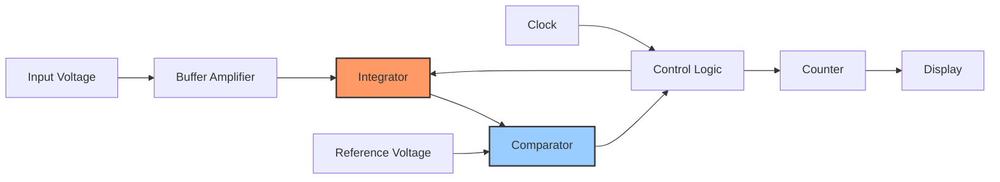

**વેવફોર્મ્સ:**

```goat
    ^
    |    ______ Time T1 ______
 Vi |   /|                    |\
    |  / |                    | \
    | /  |                    |  \
    |/   |                    |   \
    +----+--------------------+----+---> t
         |                    |
         | Integration period |
         |<----------------->|
```

**કાર્યપ્રણાલી:**

1. **ડ્યુઅલ-સ્લોપ પદ્ધતિ:**
   - ઇનપુટ વોલ્ટેજને નિશ્ચિત સમય T1 માટે એકીકૃત કરવામાં આવે છે
   - ઇન્ટિગ્રેટર નકારાત્મક સંદર્ભ વોલ્ટેજ સાથે જોડાયેલ છે
   - શૂન્ય પર પાછા ફરવા માટે જરૂરી સમય T2 ઇનપુટ વોલ્ટેજના પ્રમાણમાં હોય છે
   - ડિજિટલ ડિસ્પ્લે T2 ના પ્રમાણમાં ગણતરી બતાવે છે

| ફેઝ | ક્રિયા |
|-------|--------|
| ફેઝ 1 | નિશ્ચિત સમય T1 માટે અજ્ઞાત વોલ્ટેજને એકીકૃત કરો |
| ફેઝ 2 | શૂન્ય સુધી જાણીતા સંદર્ભ વોલ્ટેજને એકીકૃત કરો |
| ફેઝ 3 | ફેઝ 2 (T2) દરમિયાન ક્લોક પલ્સની ગણતરી કરો |

**ફાયદાઓ:**

- ઉચ્ચ નોઇઝ રિજેક્શન (ખાસ કરીને 50/60 Hz)
- સારી ચોકસાઈ
- ઓટોમેટિક ઝીરો એડજસ્ટમેન્ટ

**સંગ્રહવાક્ય:** "બે વાર એકીકૃત કરો: અજ્ઞાત સાથે ઉપર, સંદર્ભ સાથે નીચે"

## પ્રશ્ન 3(અ) [3 ગુણ]

**CRO માં અજાણ્યા ડીસી વોલ્ટેજનું મૂલ્ય શું છે, જો x-અક્ષની નીચે એક સીધી રેખા 4cm અને વોલ્ટ/ડીવ નોબ = 3V ના વિસ્થાપન સાથે મેળવવામાં આવે છે. અજ્ઞાત વોલ્ટેજ Vdc ની ગણતરી કરો.**

**જવાબ**:

**ગણતરી:**
વિસ્થાપન = 4 cm (x-અક્ષની નીચે)
વોલ્ટ/ડીવ સેટિંગ = 3 V/ડીવ
દિશા = x-અક્ષની નીચે (નકારાત્મક વોલ્ટેજ)

Vdc = -(વિસ્થાપન × વોલ્ટ/ડીવ)
Vdc = -(4 cm × 3 V/ડીવ)
Vdc = -12 V

તેથી, અજ્ઞાત DC વોલ્ટેજ -12 V છે.

**સંગ્રહવાક્ય:** "વોલ્ટેજ = વિક્ષેપણ × સ્કેલ"

## પ્રશ્ન 3(બ) [4 ગુણ]

**CRT ની આંતરિક રચના દોરો. ટૂંકમાં સમજાવો.**

**જવાબ**:

CRT (કેથોડ રે ટ્યુબ) એ એનાલોગ ઓસિલોસ્કોપમાં વપરાતું ડિસ્પ્લે ઉપકરણ છે.

**આકૃતિ:**

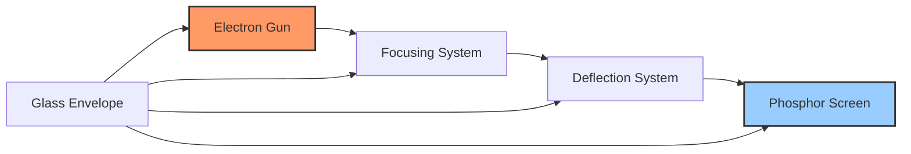

**ઘટકો:**

- **ઇલેક્ટ્રોન ગન**: હીટર, કેથોડ, કંટ્રોલ ગ્રિડ, અને એનોડ્સ સમાવે છે; ઇલેક્ટ્રોન બીમ ઉત્પન્ન કરે છે
- **ફોકસિંગ સિસ્ટમ**: ઇલેક્ટ્રોસ્ટેટિક લેન્સનો ઉપયોગ કરીને ઇલેક્ટ્રોન બીમને તીક્ષ્ણ બિંદુમાં કેન્દ્રિત કરે છે
- **ડિફ્લેક્શન સિસ્ટમ**: ડિફ્લેક્શન પ્લેટ્સનો ઉપયોગ કરીને ઇલેક્ટ્રોન બીમને આડી અને ઊભી રીતે વિક્ષેપિત કરે છે
- **ફોસ્ફર સ્ક્રીન**: ઇલેક્ટ્રોન ઊર્જાને દૃશ્યમાન પ્રકાશમાં રૂપાંતરિત કરે છે
- **ગ્લાસ એનવેલોપ**: તમામ ઘટકોને સમાવતું વેક્યુમ-સીલ કન્ટેનર

**કાર્યપ્રણાલી:**

1. ઇલેક્ટ્રોન ગન ઇલેક્ટ્રોન્સ ઉત્સર્જિત કરે છે
2. ફોકસિંગ સિસ્ટમ ઇલેક્ટ્રોન બીમને સાંકડી બનાવે છે
3. ડિફ્લેક્શન પ્લેટ્સ બીમને સ્ક્રીન પર ફેરવે છે
4. બીમ ફોસ્ફર સ્ક્રીન પર અથડાય છે જેથી દૃશ્યમાન ટ્રેસ બને છે

**સંગ્રહવાક્ય:** "GFDS: ગન-ફોકસ-ડિફ્લેક્ટ-સ્ક્રીન"

## પ્રશ્ન 3(ક) [7 ગુણ]

**કન્સ્ટ્રક્શન, બ્લોક ડાયાગ્રામ, કામગીરી અને DSO ના ફાયદા જરૂરી ડાયાગ્રામ સાથે સમજાવો.**

**જવાબ**:

ડિજિટલ સ્ટોરેજ ઓસિલોસ્કોપ (DSO) એનાલોગ સિગ્નલને ડિજિટલ ફોર્મમાં રૂપાંતરિત કરે છે અને તેને ડિસ્પ્લે અને વિશ્લેષણ માટે સંગ્રહિત કરે છે.

**બ્લોક ડાયાગ્રામ:**

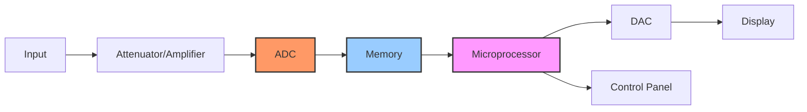

**બાંધકામ અને કાર્યપ્રણાલી:**

1. **ઇનપુટ સ્ટેજ**: એટેન્યુએટર/એમ્પ્લિફાયર સિગ્નલને કન્ડિશન કરે છે
2. **ADC**: એનાલોગ સિગ્નલને સેમ્પલિંગ રેટ પર ડિજિટલમાં રૂપાંતરિત કરે છે
3. **મેમરી**: ડિજિટલ સેમ્પલ્સને સંગ્રહિત કરે છે
4. **માઇક્રોપ્રોસેસર**: ઓપરેશન નિયંત્રિત કરે છે અને ડેટા પર પ્રક્રિયા કરે છે
5. **DAC**: ડિસ્પ્લે માટે ડિજિટલ ડેટાને પાછો એનાલોગમાં રૂપાંતરિત કરે છે
6. **ડિસ્પ્લે**: વેવફોર્મ બતાવે છે

**DSO ના ફાયદાઓ:**

- પછીના વિશ્લેષણ માટે સિગ્નલ સ્ટોરેજ ક્ષમતા
- પ્રી-ટ્રિગર સિગ્નલ જોવાની ક્ષમતા
- સિંગલ-શોટ સિગ્નલ કેપ્ચર
- ઓટોમેટિક માપન અને ગણતરીઓ
- વેવફોર્મ પ્રોસેસિંગ (FFT, એવરેજિંગ, વગેરે)
- ડિજિટલ ઇન્ટરફેસિંગ (USB, ઇથરનેટ)
- ઉચ્ચ બેન્ડવિડ્થ અને સેમ્પલિંગ દર

**સંગ્રહવાક્ય:** "SAMPLE: સ્ટોર-એનાલાઇઝ-મેઝર-પ્રોસેસ-લિંક-એક્ઝામિન"

## પ્રશ્ન 3(અ) OR [3 ગુણ]

**CRO માં peak માટે વર્ટિકલ ડિસ્પ્લેસમેન્ટ = 1cm અને વોલ્ટ/div knob = 10mV છે. વોલ્ટેજનું ટોચનું મૂલ્ય અને RMS મૂલ્ય શોધો.**

**જવાબ**:

**ગણતરી:**
વર્ટિકલ ડિસ્પ્લેસમેન્ટ (પીક) = 1 cm
વોલ્ટ/ડીવ સેટિંગ = 10 mV/ડીવ

પીક મૂલ્ય (Vp) = ડિસ્પ્લેસમેન્ટ × વોલ્ટ/ડીવ
Vp = 1 cm × 10 mV/ડીવ = 10 mV

સાઇનોસોઇડલ વેવફોર્મ માટે:
RMS મૂલ્ય (Vrms) = Vp ÷ √2
Vrms = 10 mV ÷ 1.414 = 7.07 mV

તેથી, પીક મૂલ્ય = 10 mV અને RMS મૂલ્ય = 7.07 mV.

**સંગ્રહવાક્ય:** "પીક-થી-RMS: √2 થી ભાગો"

## પ્રશ્ન 3(બ) OR [4 ગુણ]

**CRO સ્ક્રીનને વિગતવાર સમજાવો.**

**જવાબ**:

CRO (કેથોડ રે ઓસિલોસ્કોપ) સ્ક્રીન વેવફોર્મ્સ પ્રદર્શિત કરે છે અને માપન સંદર્ભ પ્રદાન કરે છે.

**આકૃતિ:**

```goat
+-------------------------------+
|                               |
|       GRATICULE LINES         |
|   +---+---+---+---+---+---+   |
|   |   |   |   |   |   |   |   |
| --+---+---+---+---+---+---+-- |
|   |   |   |   |   |   |   |   |
|   +---+---+---+---+---+---+   |
|   |   |   |   |   |   |   |   |
| --+---+---+---+---+---+---+-- |
|   |   |   |   |   |   |   |   |
|   +---+---+---+---+---+---+   |
|                               |
+-------------------------------+
```

**ઘટકો:**

- **ફોસ્ફર કોટિંગ**: ઇલેક્ટ્રોન ઊર્જાને દૃશ્યમાન પ્રકાશમાં રૂપાંતરિત કરે છે
- **ગ્રેટિક્યુલ**: માપન માટે ગ્રિડ પેટર્ન
- **X-અક્ષ**: સમય (આડો) દર્શાવે છે
- **Y-અક્ષ**: વોલ્ટેજ (ઊભો) દર્શાવે છે
- **સેન્ટર પોઇન્ટ**: માપન માટે સંદર્ભ (0,0)

**સ્ક્રીન વિશેષતાઓ:**

- **ડિવિઝન્સ**: સામાન્ય રીતે માપન માટે 8×10 ડિવિઝન્સ
- **ઇન્ટેન્સિટી કંટ્રોલ**: ડિસ્પ્લેની ચમક એડજસ્ટ કરે છે
- **ફોકસ કંટ્રોલ**: ડિસ્પ્લે થયેલા ટ્રેસને તીક્ષ્ણ બનાવે છે
- **સ્કેલ ઇલ્યુમિનેશન**: ગ્રેટિક્યુલને પ્રકાશિત કરે છે

**સંગ્રહવાક્ય:** "PAXED: ફોસ્ફર-અક્ષો-X-સમય-Y-એમ્પ્લિટ્યુડ-સમાન-ડિવિઝન્સ"

## પ્રશ્ન 3(ક) OR [7 ગુણ]

**CRO નો ઉપયોગ કરીને વોલ્ટેજ, ફ્રીક્વન્સી, સમય વિલંબ અને તબક્કા કોણનું(Phase angle) માપન જરૂરી ડાયાગ્રામ સાથે સમજાવો.**

**જવાબ**:

CRO (કેથોડ રે ઓસિલોસ્કોપ) વિવિધ ઇલેક્ટ્રિકલ પરિમાણોને ચોકસાઈથી માપી શકે છે.

**1. વોલ્ટેજ માપન:**

```goat
    ^
    |
    |   /\      /\
    |  /  \    /  \
    | /    \  /    \
 ---+-------\/------\/--> t
    |
    |
```

**પદ્ધતિ:**

- વર્ટિકલ પોઝિશનને સેન્ટર લાઇન પર સેટ કરો
- વેવફોર્મના વર્ટિકલ ડિવિઝન્સની ગણતરી કરો
- V/div સેટિંગથી ગુણો
- એમ્પ્લિટ્યુડ = વર્ટિકલ ડિવિઝન્સ × V/div

**2. ફ્રીક્વન્સી માપન:**

```goat
    ^
    |
    |   /\      /\      /\
    |  /  \    /  \    /  \
    | /    \  /    \  /    \
 ---+-------\/------\/------\/--> t
    |        <-T->
    |
```

**પદ્ધતિ:**

- સમાન બિંદુઓ વચ્ચે સમય અવધિ (T) માપો
- ફ્રીક્વન્સી = 1/T
- T = હોરિઝોન્ટલ ડિવિઝન્સ × Time/div સેટિંગ
- ફ્રીક્વન્સી = 1/(હોરિઝોન્ટલ ડિવિઝન્સ × Time/div)

**3. સમય વિલંબ માપન:**

```goat
    ^
    |      Signal 1    Signal 2
    |        /\          /\
    |       /  \        /  \
    |      /    \      /    \
 ---+-----/------\----/------\----> t
    |    /        \  /        \
    |   /          \/          \
    |  /                        \
    | /                          \
    |<-----Delay Time (Td)------>|
```

**પદ્ધતિ:**

- પહેલા સિગ્નલ પર ટ્રિગર કરો
- બીજા સિગ્નલ સુધીનું ક્ષૈતિજ અંતર માપો
- સમય વિલંબ = હોરિઝોન્ટલ ડિવિઝન્સ × Time/div સેટિંગ

**4. ફેઝ એંગલ માપન:**

```goat
    ^
    |      Signal 1    Signal 2
    |        /\          /\
    |       /  \        /  \
    |      /    \      /    \
 ---+-----/------\----/------\----> t
    |    /        \  /        \
    |   /          \/          \
    |  /                        \
    | /                          \
    |<-----------T-------------->|
    |<----Td---->|
```

**પદ્ધતિ:**

- એક સંપૂર્ણ સાયકલની સમય અવધિ (T) માપો
- અનુરૂપ બિંદુઓ વચ્ચેનો સમય વિલંબ (Td) માપો
- ફેઝ એંગલ = (Td/T) × 360°

**સંગ્રહવાક્ય:** "VFTP: વર્ટિકલ-ફ્રીક્વન્સી-ટાઇમ-ફેઝ"

## પ્રશ્ન 4(અ) [3 ગુણ]

**Active અને passive ટ્રાન્સડ્યુસરની સરખામણી કરો.**

**જવાબ**:

| વિશેષતા | Active ટ્રાન્સડ્યુસર | Passive ટ્રાન્સડ્યુસર |
|----------------|-------------------|---------------------|
| પાવર સ્ત્રોત | સ્વ-જનરેટિંગ (બાહ્ય પાવરની જરૂર નથી) | બાહ્ય પાવરની જરૂર પડે છે |
| આઉટપુટ | ઇનપુટથી ઊર્જા ઉત્પન્ન કરે છે | બાહ્ય ઊર્જાને સંશોધિત કરે છે |
| ઉદાહરણો | થર્મોકપલ, ફોટોવોલ્ટેઇક સેલ | સ્ટ્રેન ગેજ, RTD, LVDT |
| સંવેદનશીલતા | સામાન્ય રીતે ઓછી | સામાન્ય રીતે ઉચ્ચ |
| પ્રતિક્રિયા સમય | ઝડપી | ધીમું |
| કિંમત | સામાન્ય રીતે ઓછી ખર્ચાળ | સામાન્ય રીતે વધુ ખર્ચાળ |
| જટિલતા | સરળ | વધુ જટિલ |

**સંગ્રહવાક્ય:** "APE-GSR: Active-Produces-Energy, Gets-Signal-Requiring-power"

## પ્રશ્ન 4(બ) [4 ગુણ]

**સ્ટ્રેઈન ગેજની કામગીરીને જરૂરી ડાયાગ્રામ સાથે વિગતવાર સમજાવો. તેની એપ્લિકેશનની યાદી પણ.**

**જવાબ**:

સ્ટ્રેઇન ગેજ યાંત્રિક વિરૂપણને ઇલેક્ટ્રિકલ રેસિસ્ટન્સ પરિવર્તનમાં રૂપાંતરિત કરે છે.

**આકૃતિ:**

```goat
    +----------------------------+
    |                            |
    |  /\/\/\/\/\/\/\/\/\/\/\    |
    | /                      \   |
    |/                        \  |
    |\                        /  |
    | \                      /   |
    |  \/\/\/\/\/\/\/\/\/\/\/    |
    |                            |
    +----------------------------+
```

**કાર્યપ્રણાલી:**

1. જ્યારે વાહક ખેંચાય છે, ત્યારે તેની લંબાઈ વધે છે અને આડછેદ વિસ્તાર ઘટે છે
2. આના કારણે ઇલેક્ટ્રિકલ રેસિસ્ટન્સમાં વધારો થાય છે: ΔR/R = GF × ε
   - જ્યાં ΔR/R રેસિસ્ટન્સમાં અંશ પરિવર્તન છે
   - GF એ ગેજ ફેક્ટર (સંવેદનશીલતા) છે
   - ε એ સ્ટ્રેઇન છે

**પ્રકારો:**

- મેટલ ફોઇલ સ્ટ્રેઇન ગેજ
- સેમિકન્ડક્ટર સ્ટ્રેઇન ગેજ
- વાયર સ્ટ્રેઇન ગેજ

**એપ્લિકેશન્સ:**

- વજન પ્રણાલી માટે લોડ સેલ
- સ્ટ્રક્ચરલ હેલ્થ મોનિટરિંગ
- પ્રેશર સેન્સર્સ
- ટોર્ક માપન
- યાંત્રિક સ્ટ્રેસ એનાલિસિસ

**સંગ્રહવાક્ય:** "STRAIN: Stretch-To-Resistance-Alteration-In-Narrow-conductor"

## પ્રશ્ન 4(ક) [7 ગુણ]

**ગેસ સેન્સર MQ2 ને જરૂરી ડાયાગ્રામ સાથે વિગતવાર સમજાવો.**

**જવાબ**:

MQ2 એ સેમિકન્ડક્ટર ગેસ સેન્સર છે જે કોમ્બસ્ટિબલ ગેસ, ધુમાડો અને LPG શોધે છે.

**આકૃતિ:**

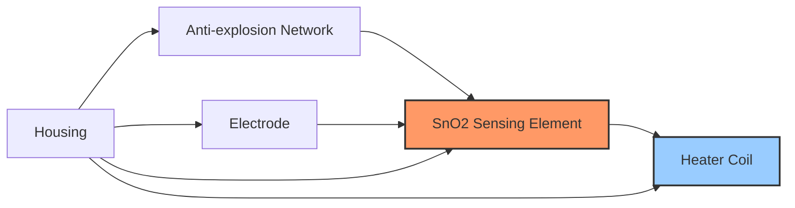

**બાંધકામ:**

- **સેન્સિંગ એલિમેન્ટ**: ટિન ડાયોક્સાઇડ (SnO2) સેમિકન્ડક્ટર
- **હીટર**: ઓપરેટિંગ તાપમાન જાળવે છે (આશરે 200-400°C)
- **ઇલેક્ટ્રોડ્સ**: રેસિસ્ટન્સ ફેરફારો માપે છે
- **હાઉસિંગ**: ઘટકોને સુરક્ષિત રાખે છે અને ગેસ પ્રવાહની મંજૂરી આપે છે

**કાર્યપ્રણાલી:**

1. સ્વચ્છ હવામાં, સેન્સરનો રેસિસ્ટન્સ ઊંચો હોય છે
2. જ્યારે કોમ્બસ્ટિબલ ગેસ હાજર હોય, ત્યારે સપાટી પ્રતિક્રિયાઓ થાય છે
3. ઇલેક્ટ્રોન્સ છોડવામાં આવે છે, જેના કારણે રેસિસ્ટન્સ ઘટે છે
4. રેસિસ્ટન્સ ગેસ કન્સન્ટ્રેશનના પ્રમાણમાં ઘટે છે

**સર્કિટ કનેક્શન:**

```goat
    Vcc +5V
      |
      |
    +-+-+     +-------+
    |   |-----|       |
    | R |     |  MQ2  |
    |   |-----|       |
    +-+-+     +-------+
      |           |
      |           |
    Vout         GND
```

**એપ્લિકેશન્સ:**

- ઘરેલુ ગેસ લીકેજ ડિટેક્ટર્સ
- ઔદ્યોગિક કોમ્બસ્ટિબલ ગેસ અલાર્મ
- પોર્ટેબલ ગેસ ડિટેક્ટર્સ
- એર ક્વોલિટી મોનિટરિંગ
- ફાયર અલાર્મ

**સંગ્રહવાક્ય:** "MQ2: Measures Quick-leaks of 2+ gases (LPG, Propane)"

## પ્રશ્ન 4(અ) OR [3 ગુણ]

**પ્રાથમિક અને ગૌણ ટ્રાન્સડ્યુસરની સરખામણી કરો.**

**જવાબ**:

| વિશેષતા | પ્રાથમિક ટ્રાન્સડ્યુસર | ગૌણ ટ્રાન્સડ્યુસર |
|----------------|---------------------|----------------------|
| વ્યાખ્યા | સીધા જ ભૌતિક જથ્થાને ઇલેક્ટ્રિકલ સિગ્નલમાં રૂપાંતરિત કરે છે | પ્રાથમિક ટ્રાન્સડ્યુસરના આઉટપુટને વાપરવા યોગ્ય સ્વરૂપમાં રૂપાંતરિત કરે છે |
| કાર્ય | રૂપાંતરણનો પ્રથમ તબક્કો | રૂપાંતરણનો બીજો તબક્કો |
| ઉદાહરણો | થર્મોકપલ, ફોટોસેલ, પીઝોઇલેક્ટ્રિક | એમ્પ્લિફાયર્સ, ADCs, સિગ્નલ કંડિશનર્સ |
| ઇનપુટ | ભૌતિક પરિમાણ | પ્રાથમિક ટ્રાન્સડ્યુસરમાંથી આઉટપુટ |
| આઉટપુટ | ઇલેક્ટ્રિકલ સિગ્નલ | સુધારેલ ઇલેક્ટ્રિકલ સિગ્નલ |
| સ્થાન | સેન્સિંગ પોઇન્ટ પર | પ્રાથમિક ટ્રાન્સડ્યુસરથી દૂર હોઈ શકે છે |
| ચોકસાઈ | સમગ્ર સિસ્ટમની ચોકસાઈને અસર કરે છે | પહેલેથી જ રૂપાંતરિત સિગ્નલ પર વધુ પ્રક્રિયા કરે છે |

**સંગ્રહવાક્ય:** "PS-FLIP: Primary-Senses, Secondary-Further-Level-Improves-Processing"

## પ્રશ્ન 4(બ) OR [4 ગુણ]

**કેપેસિટિવ ટ્રાન્સડ્યુસરને જરૂરી ડાયાગ્રામ સાથે વિગતવાર સમજાવો. તેની એપ્લિકેશનની યાદી બનાવો.**

**જવાબ**:

કેપેસિટિવ ટ્રાન્સડ્યુસર ભૌતિક વિસ્થાપનને કેપેસિટન્સ પરિવર્તનમાં રૂપાંતરિત કરે છે જે પછી ઇલેક્ટ્રિકલ સિગ્નલમાં રૂપાંતરિત થાય છે.

**આકૃતિ:**

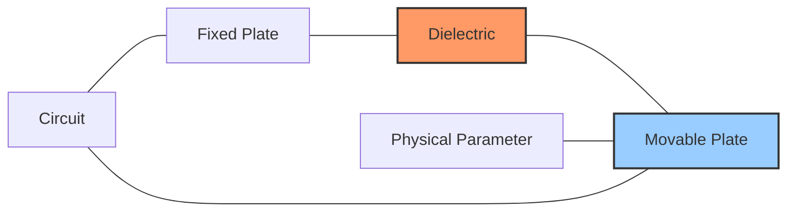

**કાર્યપ્રણાલી:**
કેપેસિટન્સ C = ε₀εᵣA/d
જ્યાં:

- ε₀ = ફ્રી સ્પેસની પરમિટિવિટી
- εᵣ = ડાયઇલેક્ટ્રિકની રિલેટિવ પરમિટિવિટી
- A = પ્લેટ્સનો વિસ્તાર
- d = પ્લેટ્સ વચ્ચેનું અંતર

કેપેસિટન્સ આમાં ફેરફાર કરીને બદલાય છે:

1. પ્લેટ્સ વચ્ચેનું અંતર બદલવું
2. પ્લેટ્સના ઓવરલેપ વિસ્તારમાં ફેરફાર કરવો
3. ડાયઇલેક્ટ્રિક કોન્સ્ટન્ટમાં ફેરફાર કરવો

**એપ્લિકેશન્સ:**

- પ્રેશર સેન્સર્સ
- ડિસ્પ્લેસમેન્ટ માપન
- લેવલ ઇન્ડિકેટર્સ
- હ્યુમિડિટી સેન્સર્સ
- થિકનેસ માપન
- ટચ સ્ક્રીન

**સંગ્રહવાક્ય:** "CAPACITIVE: Change-Area-Plates-And-Change-In-Thickness-Impacts-Value-Electrically"

## પ્રશ્ન 4(ક) OR [7 ગુણ]

**LVDT ટ્રાન્સડ્યુસર ઓપરેશન, બાંધકામને જરૂરી આકૃતિ સાથે વિગતવાર સમજાવો. એલવીડીટીના લાભ, ગેરલાભ અને એપ્લિકેશનની પણ યાદી બનાવો.**

**જવાબ**:

LVDT (લિનિયર વેરિએબલ ડિફરન્શિયલ ટ્રાન્સફોર્મર) એ ઇલેક્ટ્રોમેગ્નેટિક ટ્રાન્સડ્યુસર છે જે લીનિયર ડિસ્પ્લેસમેન્ટને ઇલેક્ટ્રિકલ સિગ્નલમાં રૂપાંતરિત કરે છે.

**આકૃતિ:**

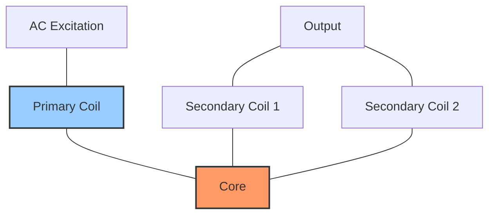

**બાંધકામ:**

- **પ્રાઇમરી કોઇલ**: સેન્ટર કોઇલ જે AC સ્ત્રોત દ્વારા ઉત્તેજિત થાય છે
- **સેકન્ડરી કોઇલ્સ**: સીરીઝ વિરોધમાં જોડાયેલી બે કોઇલ
- **કોર**: ફેરોમેગ્નેટિક મટીરિયલ જે માપવામાં આવતા ડિસ્પ્લેસમેન્ટ સાથે ખસે છે
- **હાઉસિંગ**: કોઇલ એસેમ્બ્લીને સુરક્ષિત રાખે છે

**કાર્યપ્રણાલી:**

1. પ્રાઇમરી કોઇલને AC ઉત્તેજના આપવામાં આવે છે
2. નલ પોઝિશન (સેન્ટર) પર, સેકન્ડરી કોઇલ્સમાં સમાન વોલ્ટેજ પ્રેરિત થાય છે
3. કોરને ખસેડવાથી ચુંબકીય કપલિંગ બદલાય છે
4. ડિફરન્શિયલ વોલ્ટેજ ડિસ્પ્લેસમેન્ટના પ્રમાણમાં હોય છે
5. ફેઝ ખસેડવાની દિશા દર્શાવે છે

**ફાયદાઓ:**

- નોન-કોન્ટેક્ટ ઓપરેશન (ઘર્ષણ વિનાનું)
- ઉચ્ચ રિઝોલ્યુશન અને સંવેદનશીલતા
- અનંત રિઝોલ્યુશન
- સારી લિનિયરિટી
- મજબૂત બાંધકામ
- લાંબું ઓપરેશનલ જીવન

**ગેરફાયદાઓ:**

- AC ઉત્તેજના સ્ત્રોતની જરૂર પડે છે
- બાહ્ય ચુંબકીય ક્ષેત્રો પ્રત્યે સંવેદનશીલ
- અન્ય ટ્રાન્સડ્યુસર્સની તુલનામાં મોટું કદ
- ઊંચી કિંમત
- સિગ્નલ કંડિશનિંગ સર્કિટની જરૂર પડે છે

**એપ્લિકેશન્સ:**

- મશીન ટૂલ પોઝિશનિંગ
- હાઇડ્રોલિક/ન્યુમેટિક સિલિન્ડર પોઝિશન ફીડબેક
- રોબોટિક્સ અને ઓટોમેશન
- એરક્રાફ્ટ કંટ્રોલ સિસ્ટમ્સ
- સ્ટ્રક્ચરલ ટેસ્ટિંગ
- પ્રોસેસ કંટ્રોલ સિસ્ટમ્સ

**સંગ્રહવાક્ય:** "LVDT: Linear-Variation-Detected-Through electromagnetic induction"

## પ્રશ્ન 5(અ) [3 ગુણ]

**થર્મોકપલ સેન્સરનું કાર્ય જરૂરી ડાયાગ્રામ સાથે વિગતવાર સમજાવો.**

**જવાબ**:

થર્મોકપલ એ સીબેક ઇફેક્ટ પર આધારિત તાપમાન સેન્સર છે, જ્યાં બે અસમાન ધાતુઓના જંક્શન તાપમાનના તફાવતના પ્રમાણમાં વોલ્ટેજ ઉત્પન્ન કરે છે.

**આકૃતિ:**

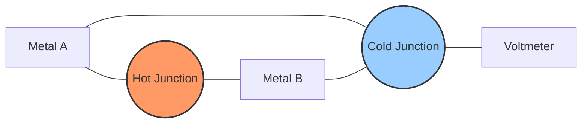

**કાર્યપ્રણાલી:**

1. બે અસમાન ધાતુઓ બે બિંદુઓ (હોટ અને કોલ્ડ જંક્શન) પર જોડાયેલા છે
2. જંક્શન વચ્ચેના તાપમાનના તફાવતથી સીબેક વોલ્ટેજ ઉત્પન્ન થાય છે
3. ઉત્પન્ન થયેલ EMF તાપમાનના તફાવતના પ્રમાણમાં હોય છે
4. માપવામાં આવેલું વોલ્ટેજ તાપમાન માટે કેલિબ્રેટ કરવામાં આવે છે

**પ્રકારો:**

- ટાઇપ K (ક્રોમેલ-એલુમેલ): સામાન્ય હેતુ, -200°C થી 1260°C
- ટાઇપ J (આયર્ન-કોન્સ્ટન્ટન): -40°C થી 750°C
- ટાઇપ T (કોપર-કોન્સ્ટન્ટન): -250°C થી 350°C

**સંગ્રહવાક્ય:** "THC: Temperature-produces Hot-junction Current"

## પ્રશ્ન 5(બ) [4 ગુણ]

**ડીજીટલ આઈસી ટેસ્ટરનું કાર્ય જરૂરી ડાયાગ્રામ સાથે વિગતવાર સમજાવો.**

**જવાબ**:

ડિજિટલ IC ટેસ્ટર ટેસ્ટ વેક્ટર્સ લાગુ કરીને અને પ્રતિસાદોનું વિશ્લેષણ કરીને ડિજિટલ ઇન્ટિગ્રેટેડ સર્કિટની કાર્યક્ષમતાનું પરીક્ષણ કરવા માટે વપરાય છે.

**બ્લોક ડાયાગ્રામ:**

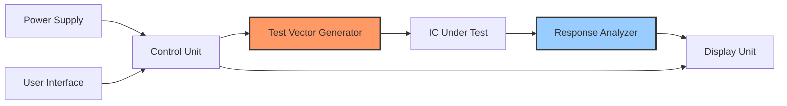

**કાર્યપ્રણાલી:**

1. IC યોગ્ય ઓરિએન્ટેશન સાથે ટેસ્ટ સોકેટમાં મૂકવામાં આવે છે
2. ટેસ્ટ મોડ પસંદ કરવામાં આવે છે (ટેસ્ટ, મલ્ટિપલ ટેસ્ટ, અથવા અજ્ઞાત IC)
3. ટેસ્ટ વેક્ટર્સ IC પિન્સ પર લાગુ થાય છે
4. આઉટપુટ રિસ્પોન્સની અપેક્ષિત પરિણામો સાથે તુલના કરવામાં આવે છે
5. પાસ/ફેલ સૂચન પ્રદર્શિત થાય છે

**વિશેષતાઓ:**

- વિવિધ IC ફેમિલી (TTL, CMOS, HCMOS) પરીક્ષણ કરે છે
- અજ્ઞાત ICs ઓટો-ડિટેક્શન
- સ્ટક-એટ ફોલ્ટ્સ, ઓપન સર્કિટ્સ માટે પરીક્ષણ કરે છે
- સંપૂર્ણ ચકાસણી માટે મલ્ટિપલ ટેસ્ટ પેટર્ન

**સંગ્રહવાક્ય:** "VECTOR: Verify-Each-Circuit-Through-Output-Response"

## પ્રશ્ન 5(ક) [7 ગુણ]

**ફંક્શન જનરેટરનું કાર્ય જરૂરી ડાયાગ્રામ સાથે વિગતવાર સમજાવો.**

**જવાબ**:

ફંક્શન જનરેટર વિવિધ વેવફોર્મ્સ (સાઇન, સ્ક્વેર, ટ્રાયએંગલ) એડજસ્ટેબલ ફ્રીક્વન્સી અને એમ્પ્લિટ્યુડ સાથે ઉત્પન્ન કરે છે.

**બ્લોક ડાયાગ્રામ:**

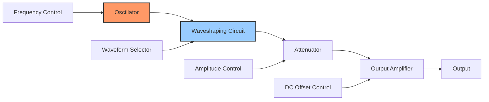

**કાર્યપ્રણાલી:**

1. **ઓસિલેટર**: મૂળભૂત વેવફોર્મ (સામાન્ય રીતે ટ્રાયએંગલ) ઉત્પન્ન કરે છે
2. **વેવશેપિંગ સર્કિટ**: સાઇન, સ્ક્વેર, અથવા ટ્રાયએંગલ વેવફોર્મમાં રૂપાંતરિત કરે છે
3. **એટેન્યુએટર**: સિગ્નલની એમ્પ્લિટ્યુડ નિયંત્રિત કરે છે
4. **આઉટપુટ એમ્પ્લિફાયર**: ઓછા આઉટપુટ ઇમ્પીડન્સ અને DC ઓફસેટ પ્રદાન કરે છે
5. **કંટ્રોલ્સ**: ફ્રીક્વન્સી, એમ્પ્લિટ્યુડ, DC ઓફસેટ, ડ્યુટી સાયકલ એડજસ્ટ કરે છે

**વેવફોર્મ જનરેશન:**

- ટ્રાયએંગલ વેવ: ઓસિલેટર સર્કિટનો મૂળભૂત આઉટપુટ
- સ્ક્વેર વેવ: કમ્પેરેટર દ્વારા ટ્રાયએંગલ વેવમાંથી ઉત્પન્ન થાય છે
- સાઇન વેવ: વેવશેપિંગ દ્વારા ટ્રાયએંગલ વેવમાંથી ઉત્પન્ન થાય છે

**એપ્લિકેશન્સ:**

- ઇલેક્ટ્રોનિક સર્કિટનું પરીક્ષણ
- પ્રયોગો માટે સિગ્નલ સ્ત્રોત
- ઇન્સ્ટ્રુમેન્ટ્સનું કેલિબ્રેશન
- શૈક્ષણિક નિદર્શન
- ફ્રીક્વન્સી રિસ્પોન્સ ટેસ્ટિંગ

**સંગ્રહવાક્ય:** "FAST: Frequency-Amplitude-Signal-Type control"

## પ્રશ્ન 5(અ) OR [3 ગુણ]

**PH સેન્સરનું કાર્ય જરૂરી ડાયાગ્રામ સાથે વિગતવાર સમજાવો.**

**જવાબ**:

pH સેન્સર દ્રાવણમાં હાઇડ્રોજન આયન કન્સન્ટ્રેશન માપે છે, જે એસિડિટી અથવા અલ્કલિનિટી દર્શાવે છે.

**આકૃતિ:**

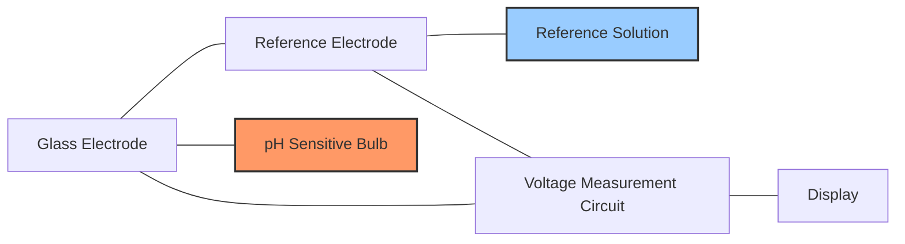

**કાર્યપ્રણાલી:**

1. ગ્લાસ ઇલેક્ટ્રોડમાં જાણીતા pH સાથે બફર સોલ્યુશન હોય છે
2. ટેસ્ટ સોલ્યુશનમાં H⁺ આયન ગ્લાસ મેમ્બ્રેન સાથે ઇન્ટરેક્ટ કરે છે
3. pH તફાવતના પ્રમાણમાં પોટેન્શિયલ ડિફરન્સ વિકસે છે
4. રેફરન્સ ઇલેક્ટ્રોડ સ્થિર તુલના વોલ્ટેજ પ્રદાન કરે છે
5. વોલ્ટેજ તફાવત = 25°C પર પ્રતિ pH એકમ 59.16 mV

**ઘટકો:**

- pH-સંવેદનશીલ મેમ્બ્રેન સાથે ગ્લાસ ઇલેક્ટ્રોડ
- રેફરન્સ ઇલેક્ટ્રોડ (ઘણીવાર સિલ્વર/સિલ્વર ક્લોરાઇડ)
- તાપમાન કમ્પેન્સેશન સર્કિટ
- સિગ્નલ કંડિશનિંગ ઇલેક્ટ્રોનિક્સ

**સંગ્રહવાક્ય:** "pH-MVH: Potential-of-Hydrogen Measured by Voltage per Hydrogen-ion concentration"

## પ્રશ્ન 5(બ) OR [4 ગુણ]

**Spectrum Analyzerનું કાર્ય જરૂરી ડાયાગ્રામ સાથે વિગતવાર સમજાવો.**

**જવાબ**:

સ્પેક્ટ્રમ એનાલાઇઝર સિગ્નલના ફ્રીક્વન્સી ઘટકો બતાવતું સિગ્નલ એમ્પ્લિટ્યુડ વિ. ફ્રીક્વન્સી પ્રદર્શિત કરે છે.

**બ્લોક ડાયાગ્રામ:**

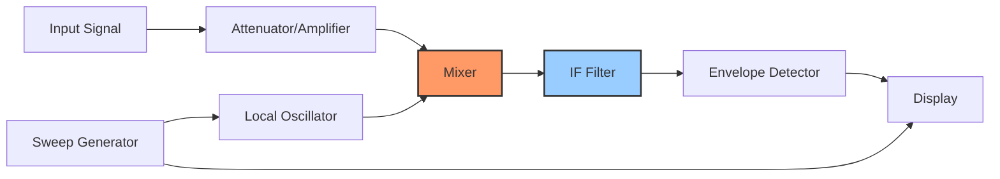

**કાર્યપ્રણાલી:**

1. **ઇનપુટ સ્ટેજ**: ઓપ્ટિમમ લેવલ પર સિગ્નલને એટેન્યુએટ અથવા એમ્પ્લિફાય કરે છે
2. **મિક્સર**: ઇનપુટને લોકલ ઓસિલેટર સિગ્નલ સાથે જોડે છે
3. **IF ફિલ્ટર**: ફક્ત ઇચ્છિત ફ્રીક્વન્સી ઘટકોને પસાર કરે છે
4. **ડિટેક્ટર**: IF સિગ્નલની એમ્પ્લિટ્યુડ માપે છે
5. **ડિસ્પ્લે**: એમ્પ્લિટ્યુડ વિ. ફ્રીક્વન્સી બતાવે છે

**પ્રકારો:**

- સ્વેપ્ટ-ટ્યુન્ડ સ્પેક્ટ્રમ એનાલાઇઝર
- FFT (ફાસ્ટ ફોરિયર ટ્રાન્સફોર્મ) સ્પેક્ટ્રમ એનાલાઇઝર
- રીયલ-ટાઇમ સ્પેક્ટ્રમ એનાલાઇઝર

**એપ્લિકેશન્સ:**

- સિગ્નલ શુદ્ધતા માપન
- EMI/EMC ટેસ્ટિંગ
- મોડ્યુલેશન એનાલિસિસ
- કમ્યુનિકેશન સિસ્ટમ ટેસ્ટિંગ

**સંગ્રહવાક્ય:** "SAFE-D: Signal-Amplitude-Frequency-Evaluation-Display"

## પ્રશ્ન 5(ક) OR [7 ગુણ]

**મૂળભૂત ફ્રિકવન્સી કાઉન્ટરનું કાર્ય જરૂરી ડાયાગ્રામ સાથે વિગતવાર સમજાવો.**

**જવાબ**:

ફ્રીક્વન્સી કાઉન્ટર ચોક્કસ સમય અંતરાલમાં સાયકલ્સ ગણીને ઇનપુટ સિગ્નલની ફ્રીક્વન્સી માપે છે.

**બ્લોક ડાયાગ્રામ:**

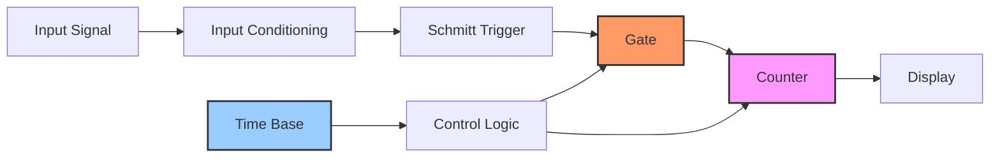

**કાર્યપ્રણાલી:**

1. **ઇનપુટ કંડિશનિંગ**: ઇનપુટ સિગ્નલને એમ્પ્લિફાય અને શેપ કરે છે
2. **શ્મિટ ટ્રિગર**: સ્ક્વેર વેવમાં રૂપાંતરિત કરે છે
3. **ટાઇમ બેઝ**: ક્રિસ્ટલ ઓસિલેટર ચોક્કસ સંદર્ભ પ્રદાન કરે છે
4. **ગેટ કંટ્રોલ**: ચોક્કસ માપન અંતરાલ માટે ગેટ ખોલે છે
5. **કાઉન્ટર**: ગેટ ખુલ્લા સમય દરમિયાન ઇનપુટ સાયકલ્સ ગણે છે
6. **ડિસ્પ્લે**: ગણતરી કરેલી ફ્રીક્વન્સી બતાવે છે

**માપન પ્રક્રિયા:**

- ચોક્કસ ગેટ સમય દરમિયાન સિગ્નલ સાયકલ્સની ગણતરી કરવામાં આવે છે
- ગેટ સમય ટાઇમ બેઝ ઓસિલેટર દ્વારા નિર્ધારિત થાય છે
- ફ્રીક્વન્સી = ગણતરી / ગેટ સમય

**ચોકસાઈ પરિબળો:**

- ટાઇમ બેઝ સ્ટેબિલિટી (ક્રિસ્ટલ ઓસિલેટર ક્વોલિટી)
- ગેટ સમય (લાંબો સમય રિઝોલ્યુશન સુધારે છે)
- ટ્રિગર એરર (±1 કાઉન્ટ અનિશ્ચિતતા)
- ઇનપુટ સિગ્નલ કંડિશનિંગ ક્વોલિટી

**એપ્લિકેશન્સ:**

- પ્રયોગશાળાઓમાં ફ્રીક્વન્સી માપન
- રેડિયો ટ્રાન્સમિટર કેલિબ્રેશન
- ક્રિસ્ટલ ઓસિલેટર ટેસ્ટિંગ
- ડિજિટલ સિસ્ટમ ક્લોક વેરિફિકેશન

**સંગ્રહવાક્ય:** "COUNT: Cycles-Over-Unit-time-Numerically-Tallied"
