## Question 1(a) [3 marks]

**Define following term: (1) Accuracy (2) precision (3) Reproducibility**

**Answer**:

- **Accuracy**: Closeness of measured value to the true value of measured quantity
- **Precision**: Ability of an instrument to reproduce the same output for repeated applications of same input under identical conditions
- **Reproducibility**: Degree of agreement between results of measurements of same quantity when measured under changed conditions (different method, observer, or time)

**Mnemonic:** "APR: Accurate-to-truth, Precise-repeats, Reproduce-under-change"

## Question 1(b) [4 marks]

**Explain construction of RTD Transducer with necessary diagram in detail. Also list application of it.**

**Answer**:

RTD (Resistance Temperature Detector) is a temperature sensor that operates on the principle that electrical resistance of metals changes with temperature.

**Diagram:**

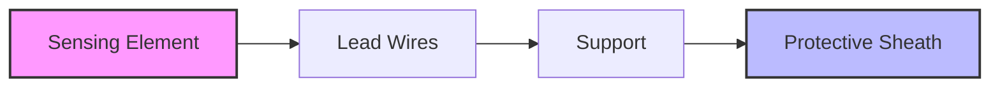

- **Sensing Element**: Pure platinum, nickel, or copper wire wound around ceramic core
- **Lead Wires**: Connect RTD to measuring circuit
- **Support**: Provides mechanical stability to sensing element
- **Protective Sheath**: Protects sensing element from external environment

**Applications of RTD:**

- Temperature measurement in process industries
- Food processing temperature monitoring
- HVAC systems
- Medical equipment

**Mnemonic:** "RTD: Resistance Temperature Detector - Precise Temperature Measurement"

## Question 1(c) [7 marks]

**Explain working of Maxwell's Bridge with circuit diagram. List its advantages, disadvantages and applications.**

**Answer**:

Maxwell's Bridge is used to measure unknown inductance in terms of known capacitance and resistance.

**Circuit Diagram:**

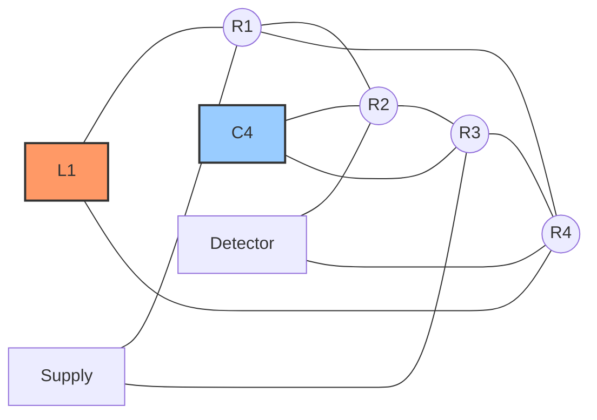

**Working:**
At balance condition: L1 = C4 × R2 × R3

When the bridge is balanced, the detector shows zero current. The unknown inductance L1 is calculated using above equation, where C4 is known capacitance and R2, R3 are known resistances.

| Parameter | Value |
|-----------|-------|
| Balance Equation | L1 = C4 × R2 × R3 |
| Quality Factor | Q = ωL1/R1 = ωC4R3 |

**Advantages:**

- High accuracy for medium Q inductors
- Balance equations are independent of frequency
- Simple calculation for inductance

**Disadvantages:**

- Not suitable for low Q inductor measurement
- Requires variable standard capacitor
- Affected by stray capacitance

**Applications:**

- Measuring inductance in laboratories
- Calibration of inductance standards
- Testing of inductive components

**Mnemonic:** "Maxwell's Magic: Inductance equals Capacitance times Resistance squared"

## Question 1(c) OR [7 marks]

**Explain working of Wheatstone bridge with circuit diagram for balance condition. List its advantages, disadvantages, and applications.**

**Answer**:

Wheatstone bridge is used to measure unknown resistance by comparing it with known resistance values.

**Circuit Diagram:**

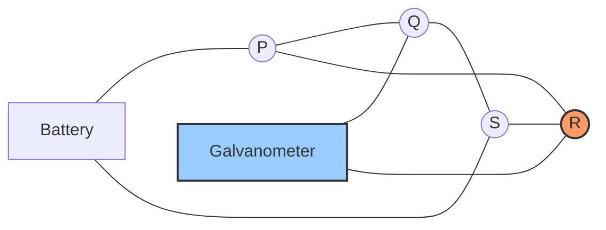

**Working:**
At balance condition: P/Q = R/S or R = S × (P/Q)

When bridge is balanced, galvanometer shows zero deflection. Unknown resistance R is calculated using the ratio of other resistances.

| Component | Function |
|-----------|----------|
| P, Q, S | Known resistances |
| R | Unknown resistance |
| G | Galvanometer (detector) |
| E | DC voltage source |

**Advantages:**

- High accuracy in resistance measurement
- Simple construction and operation
- Wide range of resistance measurement

**Disadvantages:**

- Cannot measure very low or very high resistances
- Requires battery as power source
- Temperature effects on resistors cause errors

**Applications:**

- Precise resistance measurement
- Strain gauge measurements
- Temperature sensing using RTDs
- Transducer applications

**Mnemonic:** "When WheatStone Balances: Product of opposites are equal (P×S = Q×R)"

## Question 2(a) [3 marks]

**Compare moving iron and moving coil type instruments.**

**Answer**:

| Characteristic | Moving Iron Type | Moving Coil Type |
|----------------|------------------|------------------|
| Principle | Magnetic attraction/repulsion | Electromagnetic force |
| Scale | Non-uniform | Uniform |
| Damping | Poor | Good |
| Accuracy | Less accurate (2-5%) | High accuracy (0.1-2%) |
| Frequency range | DC and AC | DC only (without rectifier) |
| Power consumption | High | Low |
| Cost | Less expensive | More expensive |

**Mnemonic:** "IMAP-CAD: Iron-Magnetic-AC-Poor damping, Coil-Accurate-DC-Damped well"

## Question 2(b) [4 marks]

**Explain working and construction of successive approximation type DVM with necessary diagram.**

**Answer**:

Successive Approximation type Digital Voltmeter (DVM) converts analog voltage to digital value using binary search technique.

**Block Diagram:**

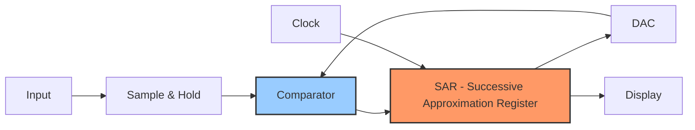

**Working:**

1. Sample & Hold circuit captures input voltage
2. SAR sets MSB to 1, other bits to 0
3. DAC converts digital word to analog voltage
4. Comparator compares DAC output with input voltage
5. If DAC output > input, bit is reset to 0; otherwise kept 1
6. Process repeats for next bit until all bits are tested
7. Final digital word represents input voltage

**Advantages:**

- Medium conversion speed (10-100 μs)
- Good resolution and accuracy
- Moderate cost

**Mnemonic:** "SAR DVM: Sample-And-Register by Digital-Voltage-Matching"

## Question 2(c) [7 marks]

**1- A moving coil ammeter reading up to 10 amperes has a resistance of 0.02 ohm. How this instrument could be adopted to read current up to 1000 amperes?**
**2- A moving coil voltmeter reading up to 200 mV has a resistance of 5 ohms. How this instrument can be adopted to read voltage up to 300 volts?**

**Answer**:

**Part 1: Ammeter Range Extension**

To extend ammeter range from 10A to 1000A, a shunt resistor is connected in parallel with the meter.

**Diagram:**

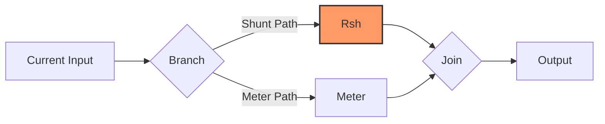

**Calculation:**

- Original meter resistance (Rm) = 0.02 Ω
- Original full-scale current (Im) = 10 A
- Desired full-scale current (I) = 1000 A
- Current through shunt (Ish) = I - Im = 1000 - 10 = 990 A
- Voltage across meter = Voltage across shunt
- Im × Rm = Ish × Rsh
- Rsh = (Im × Rm) ÷ Ish = (10 × 0.02) ÷ 990 = 0.0002 Ω

**Part 2: Voltmeter Range Extension**

To extend voltmeter range from 200mV to 300V, a multiplier resistor is connected in series with the meter.

**Diagram:**

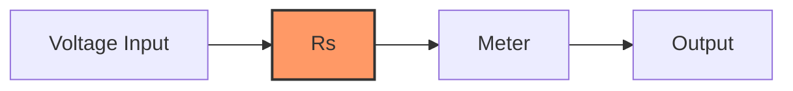

**Calculation:**

- Original meter resistance (Rm) = 5 Ω
- Original full-scale voltage (Vm) = 200 mV = 0.2 V
- Desired full-scale voltage (V) = 300 V
- Series resistance (Rs) = [(V ÷ Vm) - 1] × Rm
- Rs = [(300 ÷ 0.2) - 1] × 5 = (1500 - 1) × 5 = 1499 × 5 = 7495 Ω

**Mnemonic:** "ShuntSeries: Shunt-for-Current, Series-for-Voltage"

## Question 2(a) OR [3 marks]

**Explain working and construction of Clamp on Meter with necessary diagram.**

**Answer**:

Clamp on Meter (Current Clamp) measures current without breaking the circuit by using electromagnetic induction.

**Diagram:**


**Construction & Working:**

- **Clamp Jaw**: Split core transformer that can be opened to encircle conductor
- **Current Transformer**: Converts primary current to proportional secondary current
- **Rectifier**: Converts AC to DC for measurement circuit
- **Measuring Circuit**: Processes signal and calculates current value
- **Display**: Shows measured current value

When a current-carrying conductor passes through the clamp jaw, it induces current in the secondary winding proportional to primary current, which is then measured.

**Mnemonic:** "CLAMP: Current-Loop Amplifies Magnetic Proportionally"

## Question 2(b) OR [4 marks]

**Explain working of PMMC instruments with necessary diagram.**

**Answer**:

PMMC (Permanent Magnet Moving Coil) instruments operate on the principle of electromagnetic force on current-carrying conductor in magnetic field.

**Diagram:**

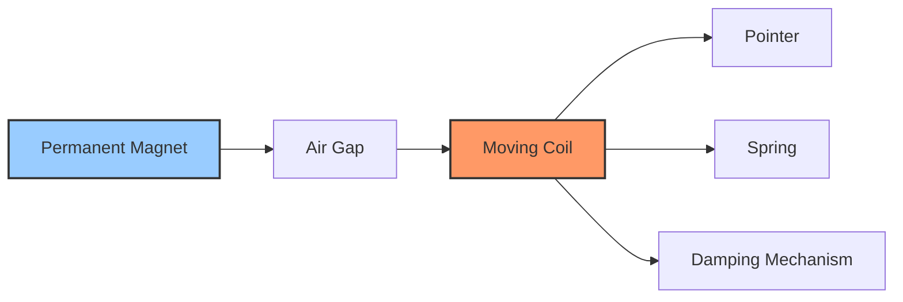

**Working:**

1. Current flows through rectangular coil placed in magnetic field
2. Electromagnetic force produces torque proportional to current
3. Spring provides controlling torque
4. Pointer deflects proportionally to current
5. Damping system prevents oscillations

**Components:**

- Permanent magnet creates strong magnetic field
- Soft iron core concentrates magnetic flux
- Moving coil carries current to be measured
- Control springs provide restoring force
- Damping system (air or eddy current) reduces oscillations

**Mnemonic:** "PMMC: Permanent Magnet Makes Current-proportional movement"

## Question 2(c) OR [7 marks]

**Draw the block diagram, working and construction of Integrating type DVM with necessary diagram and waveform.**

**Answer**:

Integrating type DVM (Digital Voltmeter) converts analog voltage to digital value by integrating the input over a fixed time.

**Block Diagram:**

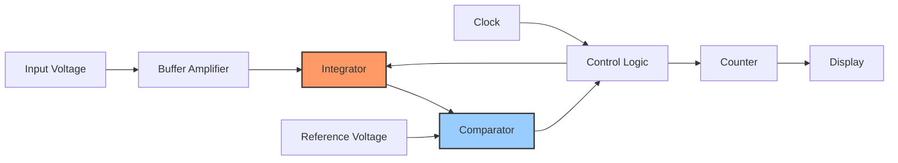

**Waveforms:**

```goat
    ^
    |    ______ Time T1 ______
 Vi |   /|                    |\
    |  / |                    | \
    | /  |                    |  \
    |/   |                    |   \
    +----+--------------------+----+---> t
         |                    |
         | Integration period |
         |<----------------->|
```

**Working:**

1. **Dual-Slope Method:**
   - Input voltage is integrated for fixed time T1
   - Integrator is connected to negative reference voltage
   - Time T2 required to return to zero is proportional to input voltage
   - Digital display shows count proportional to T2

| Phase | Action |
|-------|--------|
| Phase 1 | Integrate unknown voltage for fixed time T1 |
| Phase 2 | Integrate known reference voltage until zero |
| Phase 3 | Count clock pulses during phase 2 (T2) |

**Advantages:**

- High noise rejection (especially 50/60 Hz)
- Good accuracy
- Automatic zero adjustment

**Mnemonic:** "Integrate-twice: Up with unknown, Down with reference"

## Question 3(a) [3 marks]

**In CRO What is the value of unknown DC voltage, if a straight line below x-axis is obtained with a displacement of 4cm and volt/div knob = 3V. calculate the unknown voltage Vdc.**

**Answer**:

**Calculation:**
Displacement = 4 cm (below x-axis)
Volt/div setting = 3 V/div
Direction = Below x-axis (negative voltage)

Vdc = -(Displacement × Volt/div)
Vdc = -(4 cm × 3 V/div)
Vdc = -12 V

Therefore, the unknown DC voltage is -12 V.

**Mnemonic:** "Voltage = Deflection × Scale"

## Question 3(b) [4 marks]

**Draw internal structure of CRT. Explain in short.**

**Answer**:

CRT (Cathode Ray Tube) is the display device used in analog oscilloscopes.

**Diagram:**

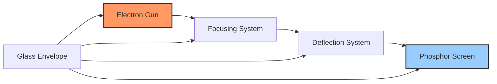

**Components:**

- **Electron Gun**: Consists of heater, cathode, control grid, and anodes; produces electron beam
- **Focusing System**: Focuses electron beam into sharp point using electrostatic lenses
- **Deflection System**: Deflects electron beam horizontally and vertically using deflection plates
- **Phosphor Screen**: Converts electron energy to visible light
- **Glass Envelope**: Vacuum-sealed container housing all components

**Working:**

1. Electron gun emits electrons
2. Focusing system narrows electron beam
3. Deflection plates move beam across screen
4. Beam strikes phosphor screen creating visible trace

**Mnemonic:** "GFDS: Gun-Focus-Deflect-Screen"

## Question 3(c) [7 marks]

**Explain Construction, Block diagram, working and advantage of DSO with necessary diagram.**

**Answer**:

Digital Storage Oscilloscope (DSO) converts analog signals to digital form and stores them for display and analysis.

**Block Diagram:**

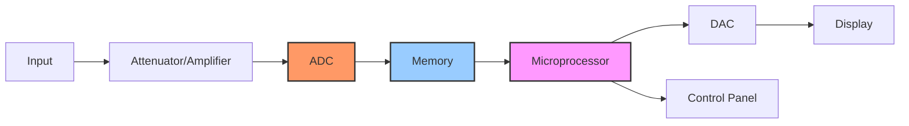

**Construction and Working:**

1. **Input Stage**: Attenuator/amplifier conditions signal
2. **ADC**: Converts analog signal to digital at sampling rate
3. **Memory**: Stores digital samples
4. **Microprocessor**: Controls operation and processes data
5. **DAC**: Converts digital data back to analog for display
6. **Display**: Shows waveform

**Advantages of DSO:**

- Signal storage capability for later analysis
- Pre-trigger viewing of signal
- Single-shot signal capture
- Automatic measurements and calculations
- Waveform processing (FFT, averaging, etc.)
- Digital interfacing (USB, Ethernet)
- Higher bandwidth and sampling rates

**Mnemonic:** "SAMPLE: Store-Analyze-Measure-Process-Link-Examine"

## Question 3(a) OR [3 marks]

**In CRO vertical displacement for peak is = 1cm and volt/div knob = 10mV. Find peak value and RMS value of voltage.**

**Answer**:

**Calculation:**
Vertical displacement (peak) = 1 cm
Volt/div setting = 10 mV/div

Peak value (Vp) = Displacement × Volt/div
Vp = 1 cm × 10 mV/div = 10 mV

For sinusoidal waveform:
RMS value (Vrms) = Vp ÷ √2
Vrms = 10 mV ÷ 1.414 = 7.07 mV

Therefore, peak value = 10 mV and RMS value = 7.07 mV.

**Mnemonic:** "Peak-to-RMS: Divide by root-2"

## Question 3(b) OR [4 marks]

**Explain CRO Screen in detail.**

**Answer**:

CRO (Cathode Ray Oscilloscope) screen displays waveforms and provides measurement references.

**Diagram:**

```goat
+-------------------------------+
|                               |
|       GRATICULE LINES         |
|   +---+---+---+---+---+---+   |
|   |   |   |   |   |   |   |   |
| --+---+---+---+---+---+---+-- |
|   |   |   |   |   |   |   |   |
|   +---+---+---+---+---+---+   |
|   |   |   |   |   |   |   |   |
| --+---+---+---+---+---+---+-- |
|   |   |   |   |   |   |   |   |
|   +---+---+---+---+---+---+   |
|                               |
+-------------------------------+
```

**Components:**

- **Phosphor Coating**: Converts electron energy to visible light
- **Graticule**: Grid pattern for measurements
- **X-Axis**: Represents time (horizontal)
- **Y-Axis**: Represents voltage (vertical)
- **Center Point**: Reference for measurements (0,0)

**Screen Features:**

- **Divisions**: Typically 8×10 divisions for measurement
- **Intensity Control**: Adjusts brightness of display
- **Focus Control**: Sharpens displayed trace
- **Scale Illumination**: Illuminates graticule

**Mnemonic:** "PAXED: Phosphor-Axes-X-time-Y-amplitude-Equal-Divisions"

## Question 3(c) OR [7 marks]

**Explain Measurement of Voltage, Frequency, Time delay and Phase angle using CRO with necessary diagram.**

**Answer**:

CRO (Cathode Ray Oscilloscope) can measure various electrical parameters accurately.

**1. Voltage Measurement:**

```goat
    ^
    |
    |   /\      /\
    |  /  \    /  \
    | /    \  /    \
 ---+-------\/------\/--> t
    |
    |
```

**Method:**

- Set vertical position to center line
- Count vertical divisions of waveform
- Multiply by V/div setting
- Amplitude = Vertical divisions × V/div

**2. Frequency Measurement:**

```goat
    ^
    |
    |   /\      /\      /\
    |  /  \    /  \    /  \
    | /    \  /    \  /    \
 ---+-------\/------\/------\/--> t
    |        <-T->
    |
```

**Method:**

- Measure time period (T) between similar points
- Frequency = 1/T
- T = Horizontal divisions × Time/div setting
- Frequency = 1/(Horizontal divisions × Time/div)

**3. Time Delay Measurement:**

```goat
    ^
    |      Signal 1    Signal 2
    |        /\          /\
    |       /  \        /  \
    |      /    \      /    \
 ---+-----/------\----/------\----> t
    |    /        \  /        \
    |   /          \/          \
    |  /                        \
    | /                          \
    |<-----Delay Time (Td)------>|
```

**Method:**

- Trigger on first signal
- Measure horizontal distance to second signal
- Time delay = Horizontal divisions × Time/div setting

**4. Phase Angle Measurement:**

```goat
    ^
    |      Signal 1    Signal 2
    |        /\          /\
    |       /  \        /  \
    |      /    \      /    \
 ---+-----/------\----/------\----> t
    |    /        \  /        \
    |   /          \/          \
    |  /                        \
    | /                          \
    |<-----------T-------------->|
    |<----Td---->|
```

**Method:**

- Measure time period (T) of one complete cycle
- Measure time delay (Td) between corresponding points
- Phase angle = (Td/T) × 360°

**Mnemonic:** "VFTP: Vertical-Frequency-Time-Phase"

## Question 4(a) [3 marks]

**Compare active and passive transducers.**

**Answer**:

| Characteristic | Active Transducers | Passive Transducers |
|----------------|-------------------|---------------------|
| Power source | Self-generating (no external power) | Requires external power |
| Output | Generates energy from input | Modifies external energy |
| Examples | Thermocouple, Photovoltaic cell | Strain gauge, RTD, LVDT |
| Sensitivity | Generally lower | Generally higher |
| Response time | Faster | Slower |
| Cost | Usually less expensive | Usually more expensive |
| Complexity | Simpler | More complex |

**Mnemonic:** "APE-GSR: Active-Produces-Energy, Gets-Signal-Requiring-power"

## Question 4(b) [4 marks]

**Explain Working of strain Gauge with necessary diagram in detail. Also list application of it.**

**Answer**:

Strain gauge converts mechanical deformation to electrical resistance change.

**Diagram:**

```goat
    +----------------------------+
    |                            |
    |  /\/\/\/\/\/\/\/\/\/\/\    |
    | /                      \   |
    |/                        \  |
    |\                        /  |
    | \                      /   |
    |  \/\/\/\/\/\/\/\/\/\/\/    |
    |                            |
    +----------------------------+
```

**Working:**

1. When a conductor is stretched, its length increases and cross-sectional area decreases
2. This causes an increase in electrical resistance: ΔR/R = GF × ε
   - Where ΔR/R is fractional change in resistance
   - GF is gauge factor (sensitivity)
   - ε is strain

**Types:**

- Metal foil strain gauges
- Semiconductor strain gauges
- Wire strain gauges

**Applications:**

- Load cells for weighing systems
- Structural health monitoring
- Pressure sensors
- Torque measurement
- Mechanical stress analysis

**Mnemonic:** "STRAIN: Stretch-To-Resistance-Alteration-In-Narrow-conductor"

## Question 4(c) [7 marks]

**Explain Gas Sensor MQ2 with necessary diagram in detail.**

**Answer**:

MQ2 is a semiconductor gas sensor that detects combustible gases, smoke, and LPG.

**Diagram:**

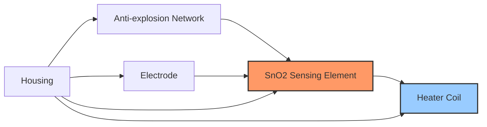

**Construction:**

- **Sensing Element**: Tin dioxide (SnO2) semiconductor
- **Heater**: Maintains operating temperature (around 200-400°C)
- **Electrodes**: Measure resistance changes
- **Housing**: Protects components and allows gas flow

**Working Principle:**

1. In clean air, sensor has high resistance
2. When combustible gases present, surface reactions occur
3. Electrons are released, decreasing resistance
4. Resistance decreases proportionally to gas concentration

**Circuit Connection:**

```goat
    Vcc +5V
      |
      |
    +-+-+     +-------+
    |   |-----|       |
    | R |     |  MQ2  |
    |   |-----|       |
    +-+-+     +-------+
      |           |
      |           |
    Vout         GND
```

**Applications:**

- Domestic gas leakage detectors
- Industrial combustible gas alarms
- Portable gas detectors
- Air quality monitoring
- Fire alarms

**Mnemonic:** "MQ2: Measures Quick-leaks of 2+ gases (LPG, Propane)"

## Question 4(a) OR [3 marks]

**Compare primary and secondary transducers**

**Answer**:

| Characteristic | Primary Transducers | Secondary Transducers |
|----------------|---------------------|----------------------|
| Definition | Directly convert physical quantity to electrical signal | Convert output of primary transducer to usable form |
| Function | First stage of conversion | Second stage of conversion |
| Examples | Thermocouple, Photocell, Piezoelectric | Amplifiers, ADCs, Signal conditioners |
| Input | Physical parameter | Output from primary transducer |
| Output | Electrical signal | Modified electrical signal |
| Location | At sensing point | May be remote from primary transducer |
| Accuracy | Affects overall system accuracy | Further processes already converted signal |

**Mnemonic:** "PS-FLIP: Primary-Senses, Secondary-Further-Level-Improves-Processing"

## Question 4(b) OR [4 marks]

**Explain Capacitive Transducer with necessary diagram in detail. Also list application of it.**

**Answer**:

Capacitive transducer converts physical displacement into capacitance change which is then converted to electrical signal.

**Diagram:**

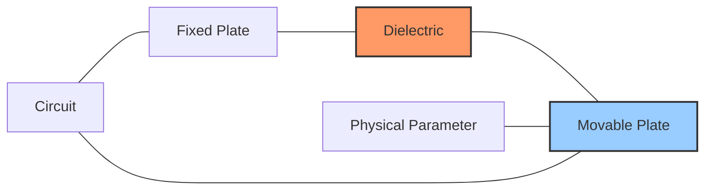

**Working:**
Capacitance C = ε₀εᵣA/d
Where:

- ε₀ = Permittivity of free space
- εᵣ = Relative permittivity of dielectric
- A = Area of plates
- d = Distance between plates

Capacitance changes by:

1. Varying distance between plates
2. Varying overlap area of plates
3. Varying dielectric constant

**Applications:**

- Pressure sensors
- Displacement measurements
- Level indicators
- Humidity sensors
- Thickness measurement
- Touch screens

**Mnemonic:** "CAPACITIVE: Change-Area-Plates-And-Change-In-Thickness-Impacts-Value-Electrically"

## Question 4(c) OR [7 marks]

**Explain LVDT Transducer operation, construction with necessary diagram in detail. Also list advantage, disadvantage and application of LVDT.**

**Answer**:

LVDT (Linear Variable Differential Transformer) is an electromagnetic transducer that converts linear displacement to electrical signal.

**Diagram:**

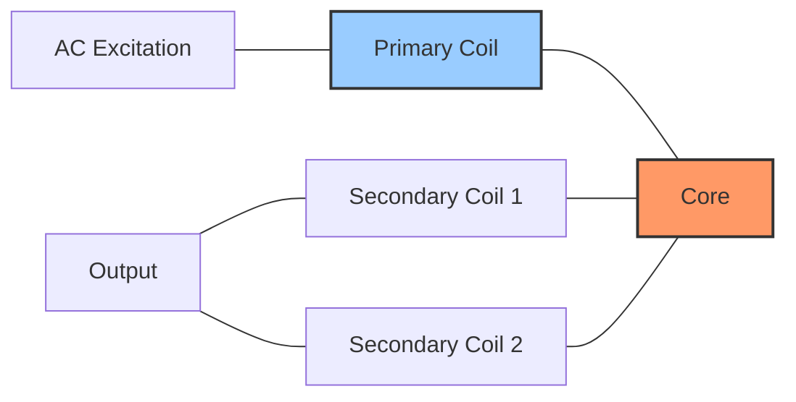

**Construction:**

- **Primary Coil**: Center coil excited by AC source
- **Secondary Coils**: Two coils connected in series opposition
- **Core**: Ferromagnetic material that moves with measured displacement
- **Housing**: Protects the coil assembly

**Working:**

1. AC excitation applied to primary coil
2. At null position (center), equal voltages induced in secondary coils
3. Moving core changes magnetic coupling
4. Differential voltage proportional to displacement
5. Phase indicates direction of movement

**Advantages:**

- Non-contact operation (frictionless)
- High resolution and sensitivity
- Infinite resolution
- Good linearity
- Robust construction
- Long operational life

**Disadvantages:**

- Requires AC excitation source
- Sensitive to external magnetic fields
- Larger size compared to other transducers
- Higher cost
- Requires signal conditioning circuit

**Applications:**

- Machine tool positioning
- Hydraulic/pneumatic cylinder position feedback
- Robotics and automation
- Aircraft control systems
- Structural testing
- Process control systems

**Mnemonic:** "LVDT: Linear-Variation-Detected-Through electromagnetic induction"

## Question 5(a) [3 marks]

**Explain working of Thermocouple sensor with necessary diagram in detail.**

**Answer**:

Thermocouple is a temperature sensor based on the Seebeck effect, where junction of two dissimilar metals generates voltage proportional to temperature difference.

**Diagram:**

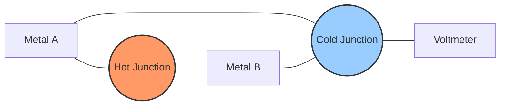

**Working:**

1. Two dissimilar metals joined at two points (hot and cold junctions)
2. Temperature difference between junctions creates Seebeck voltage
3. EMF generated is proportional to temperature difference
4. Voltage measured is calibrated to temperature

**Types:**

- Type K (Chromel-Alumel): General purpose, -200°C to 1260°C
- Type J (Iron-Constantan): -40°C to 750°C
- Type T (Copper-Constantan): -250°C to 350°C

**Mnemonic:** "THC: Temperature-produces Hot-junction Current"

## Question 5(b) [4 marks]

**Explain working of Digital IC tester with necessary diagram in detail.**

**Answer**:

Digital IC Tester is used to test functionality of digital integrated circuits by applying test vectors and analyzing responses.

**Block Diagram:**

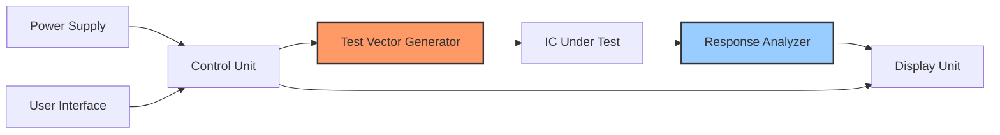

**Working:**

1. IC placed in test socket with proper orientation
2. Test mode selected (test, multiple test, or unknown IC)
3. Test vectors applied to IC pins
4. Output responses compared with expected results
5. Pass/Fail indication displayed

**Features:**

- Tests various IC families (TTL, CMOS, HCMOS)
- Auto-detection of unknown ICs
- Tests for stuck-at faults, open circuits
- Multiple test patterns for thorough verification

**Mnemonic:** "VECTOR: Verify-Each-Circuit-Through-Output-Response"

## Question 5(c) [7 marks]

**Explain working of function generator with necessary diagram in detail.**

**Answer**:

Function generator produces different waveforms (sine, square, triangle) with adjustable frequency and amplitude.

**Block Diagram:**

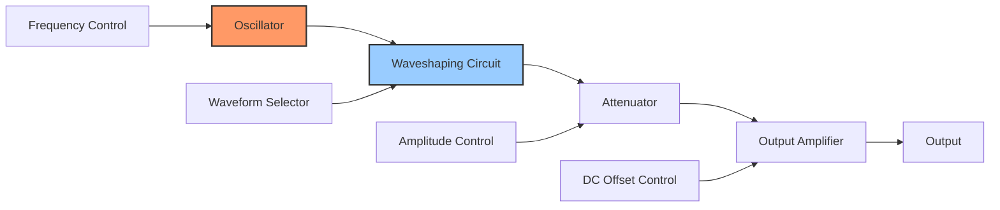

**Working:**

1. **Oscillator**: Generates basic waveform (typically triangle)
2. **Waveshaping Circuit**: Converts to sine, square, or triangle waveforms
3. **Attenuator**: Controls amplitude of signal
4. **Output Amplifier**: Provides low output impedance and DC offset
5. **Controls**: Adjust frequency, amplitude, DC offset, duty cycle

**Waveform Generation:**

- Triangle wave: Basic output of oscillator circuit
- Square wave: Generated by comparator from triangle wave
- Sine wave: Generated by waveshaping from triangle wave

**Applications:**

- Testing electronic circuits
- Signal source for experiments
- Calibration of instruments
- Educational demonstrations
- Frequency response testing

**Mnemonic:** "FAST: Frequency-Amplitude-Signal-Type control"

## Question 5(a) OR [3 marks]

**Explain working of PH sensor with necessary diagram in detail.**

**Answer**:

PH sensor measures hydrogen ion concentration in a solution, indicating acidity or alkalinity.

**Diagram:**

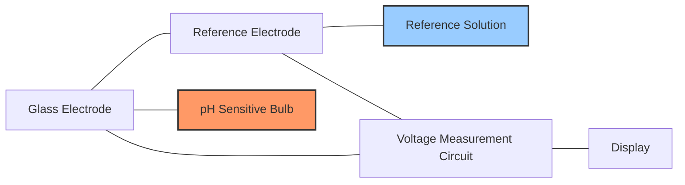

**Working:**

1. Glass electrode contains buffer solution with known pH
2. H⁺ ions in test solution interact with glass membrane
3. Potential difference develops proportional to pH difference
4. Reference electrode provides stable comparison voltage
5. Voltage difference = 59.16 mV per pH unit at 25°C

**Components:**

- Glass electrode with pH-sensitive membrane
- Reference electrode (often silver/silver chloride)
- Temperature compensation circuit
- Signal conditioning electronics

**Mnemonic:** "pH-MVH: Potential-of-Hydrogen Measured by Voltage per Hydrogen-ion concentration"

## Question 5(b) OR [4 marks]

**Describe working of Spectrum Analyzer with necessary diagram in detail**

**Answer**:

Spectrum Analyzer displays signal amplitude vs. frequency, showing frequency components of signals.

**Block Diagram:**

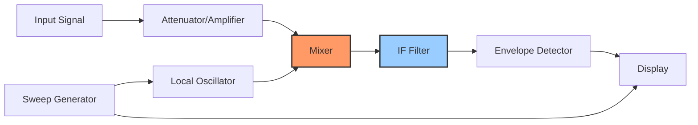

**Working:**

1. **Input Stage**: Attenuates or amplifies signal to optimum level
2. **Mixer**: Combines input with local oscillator signal
3. **IF Filter**: Passes only desired frequency components
4. **Detector**: Measures amplitude of IF signal
5. **Display**: Shows amplitude vs. frequency

**Types:**

- Swept-tuned spectrum analyzer
- FFT (Fast Fourier Transform) spectrum analyzer
- Real-time spectrum analyzer

**Applications:**

- Signal purity measurement
- EMI/EMC testing
- Modulation analysis
- Communication system testing

**Mnemonic:** "SAFE-D: Signal-Amplitude-Frequency-Evaluation-Display"

## Question 5(c) OR [7 marks]

**Explain working of basic frequency counter with necessary diagram in detail**

**Answer**:

Frequency counter measures frequency of input signal by counting cycles in a precise time interval.

**Block Diagram:**

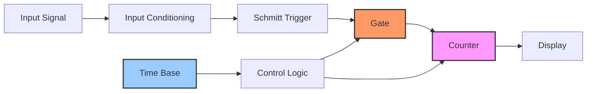

**Working:**

1. **Input Conditioning**: Amplifies and shapes input signal
2. **Schmitt Trigger**: Converts to square wave
3. **Time Base**: Crystal oscillator provides accurate reference
4. **Gate Control**: Opens gate for precise measurement interval
5. **Counter**: Counts input cycles during gate open time
6. **Display**: Shows counted frequency

**Measurement Process:**

- Signal cycles are counted during precise gate time
- Gate time determined by time base oscillator
- Frequency = Count / Gate time

**Accuracy Factors:**

- Time base stability (crystal oscillator quality)
- Gate time (longer time improves resolution)
- Trigger error (±1 count uncertainty)
- Input signal conditioning quality

**Applications:**

- Frequency measurement in laboratories
- Radio transmitter calibration
- Crystal oscillator testing
- Digital system clock verification

**Mnemonic:** "COUNT: Cycles-Over-Unit-time-Numerically-Tallied"
