## પ્રશ્ન 1(અ) [3 ગુણ]

**Accuracy, Precision, અને Sensitivity ની વ્યાખ્યા આપો.**

**જવાબ**:

- **Accuracy**: માપેલા મૂલ્યની વાસ્તવિક મૂલ્યની નજીકતા.
- **Precision**: એક જ ઈનપુટ વારંવાર આપવામાં આવે ત્યારે સાધનની એક સરખા આઉટપુટ રીડિંગ ફરીથી ઉત્પન્ન કરવાની ક્ષમતા.
- **Sensitivity**: સાધનના આઉટપુટમાં થતા ફેરફારનો ઈનપુટમાં થતા ફેરફાર સાથેનો ગુણોત્તર, જે દર્શાવે છે કે નાના ફેરફાર માટે આઉટપુટમાં કેટલો ફેરફાર થાય છે.

**કોષ્ટક: Accuracy અને Precision વચ્ચેના તફાવત**

| પેરામીટર | Accuracy | Precision |
|-----------|----------|-----------|
| વ્યાખ્યા | સાચા મૂલ્યની નજીકતા | માપની પુનરાવર્તિતા |
| ફોકસ | સચોટતા | સુસંગતતા |
| પ્રતિનિધિત્વ | બુલ્સ-આઇના સેન્ટરના હિટ્સ | ક્લસ્ટર્ડ હિટ્સ |

**મેમરી ટ્રીક:** "APS - Accuracy સત્યતા દર્શાવે છે, Precision પુનરાવર્તિતા બતાવે છે, Sensitivity નાના ફેરફારો સંકેત આપે છે"

## પ્રશ્ન 1(બ) [4 ગુણ]

**વ્હીટસ્ટોન બ્રિજના કાર્ય અને મર્યાદાઓ તેના સર્કિટ ડાયાગ્રામ દોરી સમજાવો.**

**જવાબ**:

**કાર્ય**: વ્હીટસ્ટોન બ્રિજ બ્રિજ સર્કિટની બે ભુજાઓને સંતુલિત કરીને અજ્ઞાત અવરોધ માપે છે.

**સર્કિટ ડાયાગ્રામ**:

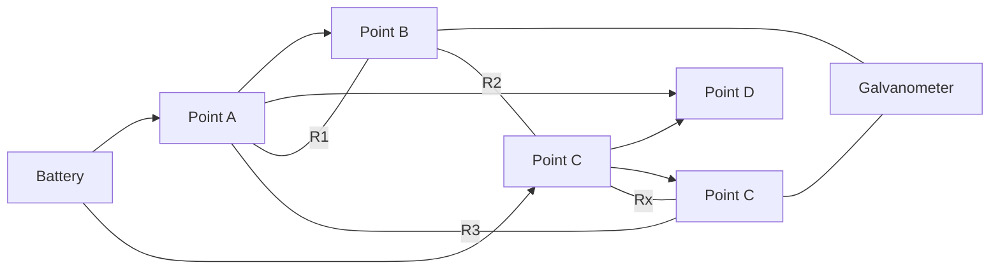

જ્યારે બ્રિજ સંતુલિત હોય છે: R1/R2 = R3/Rx, તેથી Rx = R3×(R2/R1)

**મર્યાદાઓ**:

- **મર્યાદિત રેન્જ**: ખૂબ ઓછા કે ખૂબ વધારે અવરોધ માટે યોગ્ય નથી
- **તાપમાન અસરો**: તાપમાન સાથે અવરોધ બદલાય છે
- **બેટરી ભૂલો**: આઉટપુટ વોલ્ટેજ સ્થિર રહેવું જોઈએ
- **ગેલ્વેનોમીટર સંવેદનશીલતા**: ડિટેક્ટરની સંવેદનશીલતાથી મર્યાદિત

**મેમરી ટ્રીક:** "BALR - Balance મહત્વનું છે, Adjust શૂન્ય સુધી, Low/high અવરોધો સમસ્યારૂપ, Range મર્યાદિત છે"

## પ્રશ્ન 1(ક) [7 ગુણ]

**તાપમાન માપવા માટે ઉપયોગમાં લેવાતા વિવિધ પ્રકારના ટ્રાન્સડ્યુસર સમજાવો. નીચેના માટે બાંધકામ અને કાર્ય વિગતવાર સમજાવો: (i) થર્મોકપલ (ii) થર્મિસ્ટર.**

**જવાબ**:

**તાપમાન ટ્રાન્સડ્યુસર પ્રકારો**:

| પ્રકાર | કાર્ય સિદ્ધાંત | રેન્જ | ફાયદા | ગેરફાયદા |
|------|-------------------|-------|------------|---------------|
| થર્મોકપલ | સીબેક ઇફેક્ટ | -270°C થી 2300°C | વિશાળ રેન્જ, મજબૂત | નોન-લિનિયર, સંદર્ભની જરૂર |
| થર્મિસ્ટર | અવરોધ પરિવર્તન | -50°C થી 300°C | ઉચ્ચ સંવેદનશીલતા | નોન-લિનિયર, મર્યાદિત રેન્જ |
| RTD | અવરોધ પરિવર્તન | -200°C થી 850°C | ઉચ્ચ ચોકસાઈ, લિનિયર | મોંઘું, સેલ્ફ-હીટિંગ |
| IC સેન્સર | સેમિકન્ડક્ટર | -55°C થી 150°C | લિનિયર આઉટપુટ, સરળ | મર્યાદિત રેન્જ |

**(i) થર્મોકપલ**:

**બાંધકામ**: બે અલગ-અલગ ધાતુના તાર (જેમ કે કોપર-કોન્સ્ટંટન અથવા આયર્ન-કોન્સ્ટંટન) એક છેડે જોડાયેલા હોય છે જે માપન જંક્શન બનાવે છે અને બીજા છેડે માપન ઉપકરણ સાથે જોડાયેલા હોય છે.

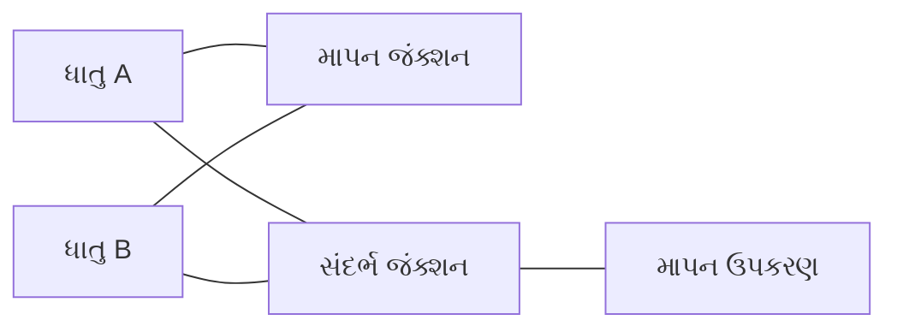

**કાર્ય**: જ્યારે જંક્શનો અલગ-અલગ તાપમાને હોય છે, ત્યારે તાપમાન તફાવતના પ્રમાણમાં નાનું વોલ્ટેજ ઉત્પન્ન થાય છે (સીબેક ઇફેક્ટ).

**મુખ્ય બિંદુઓ**:

- **સીબેક ઇફેક્ટ**: તાપમાન તફાવત વોલ્ટેજ ઉત્પન્ન કરે છે
- **કોલ્ડ જંક્શન કોમ્પેન્સેશન**: ચોકસાઈ માટે જરૂરી
- **પ્રકારો**: J, K, T, E ધાતુના સંયોજનના આધારે

**(ii) થર્મિસ્ટર**:

**બાંધકામ**: અર્ધવાહક સામગ્રી (મેંગેનીઝ, નિકલ, કોબાલ્ટ જેવા ધાતુ ઓક્સાઇડ્સ) બીડ, ડિસ્ક અથવા રોડના આકારમાં બે લીડ વાયર સાથે બનાવવામાં આવે છે.

```goat
  Lead Wire        Lead Wire
      |               |
      v               v
    +-----------------+
    |   Ceramic or    |
    | Semiconductor   |
    |     Body        |
    +-----------------+
```

**કાર્ય**: તાપમાન વધવાની સાથે અવરોધ ઘટે છે (NTC પ્રકાર) અથવા તાપમાન સાથે વધે છે (PTC પ્રકાર).

**મુખ્ય બિંદુઓ**:

- **NTC (નેગેટિવ ટેમ્પરેચર કોઇફિશિયન્ટ)**: સૌથી સામાન્ય પ્રકાર
- **ઉચ્ચ સંવેદનશીલતા**: નાના તાપમાન ફેરફાર માટે મોટો અવરોધ ફેરફાર
- **નોન-લિનિયર રિસ્પોન્સ**: લિનિયરાઇઝેશન સર્કિટની જરૂર પડે છે
- **સેલ્ફ-હીટિંગ**: તેમાંથી પસાર થતો પ્રવાહ ગરમી ઉત્પન્ન કરે છે

**મેમરી ટ્રીક:** "TRIP - થર્મોકપલ જંક્શન તફાવતોને પ્રતિક્રિયા આપે છે, થર્મિસ્ટર અવરોધમાં તીવ્ર ફેરફાર કરે છે, સેન્સર જે માપવું છે તેના પર લક્ષ્ય કરો"

## પ્રશ્ન 1(ક) OR [7 ગુણ]

**નીચેના sensor ના કાર્યસિદ્ધાંત સમજાવો: Temperature sensor, Gas sensor, Humidity sensor અને Proximity sensor.**

**જવાબ**:

**સેન્સરની તુલના**:

| સેન્સરનો પ્રકાર | કાર્ય સિદ્ધાંત | આઉટપુટ | ઉપયોગો |
|-------------|-------------------|--------|--------------|
| તાપમાન | અવરોધ/વોલ્ટેજ પરિવર્તન | એનાલોગ/ડિજિટલ | HVAC, મેડિકલ ડિવાઇસ |
| ગેસ | રાસાયણિક પ્રતિક્રિયા | અવરોધમાં ફેરફાર | સલામતી સિસ્ટમ, હવા ગુણવત્તા |
| ભેજ | કેપેસિટન્સ/અવરોધ ફેરફાર | એનાલોગ | વેધર સ્ટેશન, HVAC |
| પ્રોક્સિમિટી | ઇલેક્ટ્રોમેગ્નેટિક ફિલ્ડ ડિસરપ્શન | ડિજિટલ | ઓટોમેશન, સુરક્ષા |

**1. તાપમાન સેન્સર (LM35)**:

- **સિદ્ધાંત**: સેમિકન્ડક્ટર જંક્શન વોલ્ટેજ તાપમાન સાથે બદલાય છે
- **કાર્ય**: ઇન્ટિગ્રેટેડ સર્કિટ તાપમાનના પ્રમાણમાં આઉટપુટ વોલ્ટેજ આપે છે (10mV/°C)
- **લક્ષણો**: લિનિયર આઉટપુટ, બાહ્ય કેલિબ્રેશનની જરૂર નથી

**2. ગેસ સેન્સર (MQ-2)**:

- **સિદ્ધાંત**: ગેસ અને સેન્સિંગ મટિરિયલ વચ્ચે રાસાયણિક પ્રતિક્રિયા
- **કાર્ય**: ગેસ અણુઓ અર્ધવાહક ધાતુ ઓક્સાઇડ સાથે ક્રિયા કરે છે, જેનાથી તેનો અવરોધ બદલાય છે
- **ડિટેક્શન**: જ્યારે ગેસનું સાંદ્રતા થ્રેશોલ્ડથી વધે છે, તો આઉટપુટ વોલ્ટેજ બદલાય છે


**3. ભેજ સેન્સર (હાઇગ્રોમીટર)**:

- **સિદ્ધાંત**: ભેજ શોષણ સાથે કેપેસિટન્સ અથવા અવરોધમાં ફેરફાર
- **કાર્ય**: ડાયલેકટ્રિક મટિરિયલ ભેજ શોષે છે, જેથી ઇલેક્ટ્રિકલ ગુણધર્મો બદલાય છે
- **પ્રકારો**: કેપેસિટિવ (વધુ ચોક્કસ) અને રેઝિસ્ટિવ (સરળ)

**4. પ્રોક્સિમિટી સેન્સર**:

- **સિદ્ધાંત**: ભૌતિક સંપર્ક વિના વસ્તુઓનું શોધન
- **કાર્ય**: ઇલેક્ટ્રોમેગ્નેટિક ફિલ્ડ/બીમ ઉત્સર્જિત કરે છે; જ્યારે વસ્તુ ફિલ્ડમાં પ્રવેશે ત્યારે ફેરફારોનું શોધન
- **પ્રકારો**: ઇન્ડક્ટિવ (ધાતુઓ), કેપેસિટિવ (કોઈપણ સામગ્રી), અલ્ટ્રાસોનિક (અંતર)

**મેમરી ટ્રીક:** "TGHP - તાપમાન વોલ્ટેજ પેદા કરે છે, ગેસ અર્ધવાહકો પર અસર કરે છે, ભેજ જાળવે છે, પ્રોક્સિમિટી વસ્તુઓને શોધે છે"

## પ્રશ્ન 2(અ) [3 ગુણ]

**ડીવીએમ(DVM) ના પ્રકારો આપો અને દરેકના ફાયદા જણાવો.**

**જવાબ**:

**ડિજિટલ વોલ્ટમીટર (DVM) પ્રકારો**:

| DVM પ્રકાર | કાર્ય સિદ્ધાંત | ફાયદા |
|----------|-------------------|-----------|
| રેમ્પ ટાઇપ | ઇનપુટને રેફરન્સ રેમ્પ સાથે સરખાવે છે | સરળ ડિઝાઇન, ઓછી કિંમત |
| ઇન્ટિગ્રેટિંગ ટાઇપ | સમય દરમિયાન સરેરાશ માપે છે | સારો નોઈઝ રિજેક્શન |
| સક્સેસિવ એપ્રોક્સિમેશન | બાઇનરી સર્ચ એલ્ગોરિધમ | ઝડપી રૂપાંતરણ |
| ડ્યુઅલ સ્લોપ | ફિક્સ્ડ સમય સાથે ઇન્ટિગ્રેશન | ઉત્કૃષ્ટ નોઈઝ રિજેક્શન |

**મુખ્ય બિંદુઓ**:

- **રેમ્પ ટાઇપ**: સરળ પરંતુ નોઈઝથી પ્રભાવિત
- **ઇન્ટિગ્રેટિંગ ટાઇપ**: સામયિક નોઈઝની અસર ઘટાડે છે
- **સક્સેસિવ એપ્રોક્સિમેશન**: ઝડપી વાંચન, બદલાતા સિગ્નલ માટે સારું
- **ડ્યુઅલ સ્લોપ**: શ્રેષ્ઠ ચોકસાઈ, મોટાભાગના નોઈઝથી અસર રહિત

**મેમરી ટ્રીક:** "RISD - રેમ્પ સરળ ડિઝાઇન છે, ઇન્ટિગ્રેટિંગ નોઈઝને અવગણે છે, સક્સેસિવ ઝડપ સુનિશ્ચિત કરે છે, ડ્યુઅલ હસ્તક્ષેપ સાથે વ્યવહાર કરે છે"

## પ્રશ્ન 2(બ) [4 ગુણ]

**મેક્સવેલ બ્રીજ દોરો અને સમજાવો.**

**જવાબ**:

**મેક્સવેલ બ્રીજ** સ્ટાન્ડર્ડ કેપેસિટન્સ સાથે સરખામણી કરીને અજ્ઞાત ઇન્ડક્ટન્સને માપે છે.

**સર્કિટ ડાયાગ્રામ**:

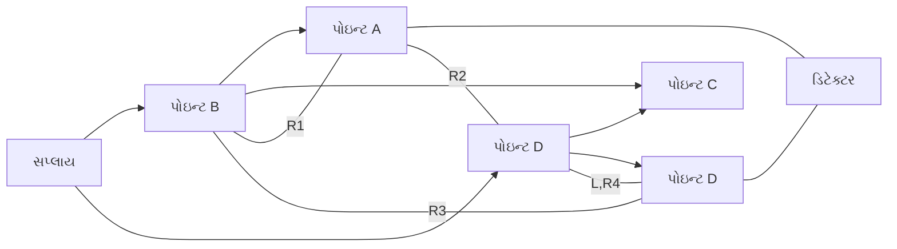

**બેલેન્સ ઇક્વેશન્સ**:

- અજ્ઞાત ઇન્ડક્ટન્સ L = R2 × R3 × C
- અવરોધ R4 = R1 × (R3/R2)

**કાર્ય**:

- બ્રિજમાં R1, R2, R3, અને L,R4 સાથે ચાર ભુજાઓ હોય છે
- જ્યારે બ્રિજ સંતુલિત હોય છે, ત્યારે ડિટેક્ટરમાંથી પ્રવાહ વહેતો નથી
- L અને R4 ના મૂલ્ય બેલેન્સ ઇક્વેશન્સ વડે ગણવામાં આવે છે

**ફાયદાઓ**:

- **ઉચ્ચ ચોકસાઈ**: મધ્યમ મૂલ્યના ઇન્ડક્ટર્સ માટે સારું
- **સ્વતંત્ર બેલેન્સ**: અવરોધ અને ઇન્ડક્ટન્સ અલગથી સંતુલિત થાય છે

**મેમરી ટ્રીક:** "MILL - મેક્સવેલ્સ ઇન્ડક્ટન્સ L = R2R3C જેવું છે, જ્યારે ડિટેક્ટર ઓછો પ્રવાહ બતાવે છે"

## પ્રશ્ન 2(ક) [7 ગુણ]

**સક્સેસિવ એપ્રોક્સિમેશન પ્રકારના ડિજિટલ વોલ્ટમીટર (DVM)નો બ્લોક ડાયાગ્રામ દોરીને તેનું કાર્ય સમજાવો.**

**જવાબ**:

**સક્સેસિવ એપ્રોક્સિમેશન DVM** બાઇનરી સર્ચ એલ્ગોરિધમનો ઉપયોગ કરીને એનાલોગ ઇનપુટને ડિજિટલ આઉટપુટમાં રૂપાંતરિત કરે છે.

**બ્લોક ડાયાગ્રામ**:

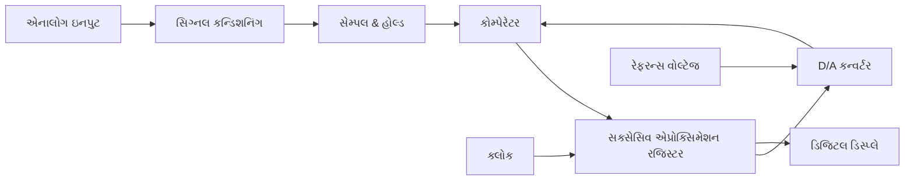

**કાર્ય**:

1. **સિગ્નલ કન્ડિશનિંગ**: ઇનપુટ વોલ્ટેજને માપન રેન્જમાં સ્કેલ કરે છે
2. **સેમ્પલ & હોલ્ડ**: ક્ષણિક ઇનપુટ મૂલ્યને પકડે છે
3. **SAR (સક્સેસિવ એપ્રોક્સિમેશન રજિસ્ટર)**: બાઇનરી સર્ચ કરે છે
4. **DAC (ડિજિટલ-ટુ-એનાલોગ કન્વર્ટર)**: ડિજિટલ મૂલ્યને એનાલોગમાં રૂપાંતરિત કરે છે
5. **કોમ્પેરેટર**: ઇનપુટને DAC આઉટપુટ સાથે સરખાવે છે
6. **ડિજિટલ ડિસ્પ્લે**: અંતિમ ડિજિટલ મૂલ્ય બતાવે છે

**રૂપાંતરણ પ્રક્રિયા ઉદાહરણ**:

- 9V ના 4-બિટ રૂપાંતરણ માટે (0-15V રેન્જ):
  - 8V (1000) પ્રયાસ કરો → ઇનપુટ > 8V → 1 રાખો
  - 12V (1100) પ્રયાસ કરો → ઇનપુટ < 12V → 0 માં બદલો
  - 10V (1010) પ્રયાસ કરો → ઇનપુટ < 10V → 0 માં બદલો
  - 9V (1001) પ્રયાસ કરો → ઇનપુટ = 9V → 1 રાખો
  - પરિણામ: 1001 (9V)

**ફાયદાઓ**:

- **ઝડપી રૂપાંતરણ**: ઇનપુટને ધ્યાનમાં લીધા વગર ફિક્સ્ડ રૂપાંતરણ સમય
- **સારી ચોકસાઈ**: મોટાભાગના ઉપયોગો માટે યોગ્ય
- **મધ્યમ જટિલતા**: પ્રદર્શન અને કિંમતનું સંતુલન

**મેમરી ટ્રીક:** "SHARP - સેમ્પલ, હોલ્ડ, એપ્રોક્સિમેટ, રજિસ્ટર સંગ્રહ કરે છે, પરિણામ રજૂ કરે છે"

## પ્રશ્ન 2(અ) OR [3 ગુણ]

**PMMC સાધનનો કાર્ય સિદ્ધાંત જણાવો અને તેના વિષે સમજાવો.**

**જવાબ**:

**PMMC (પર્મેનન્ટ મેગ્નેટ મૂવિંગ કોઇલ)** સાધનો ઇલેક્ટ્રોમેગ્નેટિક સિદ્ધાંતો પર આધારિત કાર્ય કરે છે.

**કાર્ય સિદ્ધાંત**: જ્યારે ચુંબકીય ક્ષેત્રમાં મૂકેલા કોઇલમાંથી પ્રવાહ વહે છે, ત્યારે એક ટોર્ક ઉત્પન્ન થાય છે જે પ્રવાહના પ્રમાણમાં કોઇલને ફેરવે છે.

**મુખ્ય ઘટકો**:

- **કાયમી ચુંબક**: મજબૂત ચુંબકીય ક્ષેત્ર બનાવે છે
- **મૂવિંગ કોઇલ**: એલ્યુમિનિયમ ફ્રેમ પર વીંટળાયેલી
- **કંટ્રોલ સ્પ્રિંગ્સ**: પુનઃસ્થાપિત ટોર્ક પ્રદાન કરે છે
- **પોઇન્ટર**: સ્કેલ પર વાંચન દર્શાવે છે

**આકૃતિ**:

```goat
                  N
    Spring       | |      Spring
      ↓          | |        ↓
    +=================+
    |      |=====|    |
    |      | Coil|    |
    |      |=====|    |
    |               .-|-.
    |              /     \
    |              |     |  Pointer
    |              \     /
    |               `-|-'
    +=================+
                  | |
                  S
```

**મેમરી ટ્રીક:** "PMMC - કાયમી ચુંબક પ્રવાહ પસાર થાય ત્યારે કોઇલ ફેરવે છે"

## પ્રશ્ન 2(બ) OR [4 ગુણ]

**Schering બ્રીજ દોરો અને સમજાવો.**

**જવાબ**:

**Schering બ્રીજ** કેપેસિટરના કેપેસિટન્સ અને ડિસિપેશન ફેક્ટર માપવા માટે વપરાય છે.

**સર્કિટ ડાયાગ્રામ**:

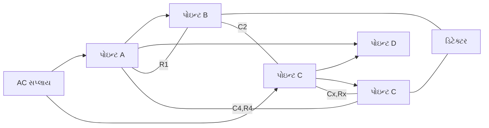

**બેલેન્સ ઇક્વેશન્સ**:

- અજ્ઞાત કેપેસિટન્સ Cx = C2 × (R1/R4)
- અજ્ઞાત અવરોધ Rx = R4 × (C4/C2)
- ડિસિપેશન ફેક્ટર D = ωCxRx = ωC4R4

**કાર્ય**:

- ચાર ભુજાઓમાં R1, C2, Cx-Rx, અને C4-R4 હોય છે
- જ્યારે બ્રિજ સંતુલિત હોય છે, ત્યારે ડિટેક્ટરમાંથી પ્રવાહ વહેતો નથી
- Cx અને Rx ના મૂલ્ય બેલેન્સ ઇક્વેશન્સ વડે ગણવામાં આવે છે

**ઉપયોગો**:

- **કેપેસિટર પરીક્ષણ**: કેપેસિટન્સ અને નુકસાન માપે છે
- **ઇન્સુલેશન પરીક્ષણ**: ડાયલેક્ટ્રિક ગુણધર્મોનું મૂલ્યાંકન કરે છે

**મેમરી ટ્રીક:** "SCAN - Schering કેપેસિટન્સ અને ટેન ડેલ્ટા એક સાથે માપે છે"

## પ્રશ્ન 2(ક) OR [7 ગુણ]

**ડ્યુઅલ સ્લોપ ઇન્ટિગ્રેટિંગ પ્રકારના ડિજિટલ વોલ્ટમીટર (DVM) ની આકૃતિ દોરો અને સમજાવો.**

**જવાબ**:

**ડ્યુઅલ સ્લોપ ઇન્ટિગ્રેટિંગ DVM** એક પ્રકારનું ડિજિટલ વોલ્ટમીટર છે જે ઇન્ટિગ્રેશન પદ્ધતિનો ઉપયોગ કરીને એનાલોગ ઇનપુટને ડિજિટલ સ્વરૂપમાં રૂપાંતરિત કરે છે.

**બ્લોક ડાયાગ્રામ**:

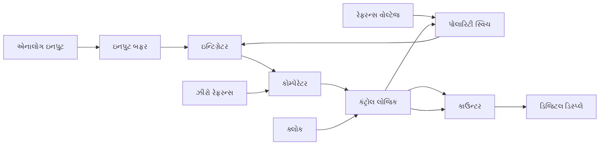

**કાર્ય સિદ્ધાંત**:

1. **પ્રથમ તબક્કો** (ફિક્સ્ડ સમય T1):
   - ઇનપુટ વોલ્ટેજ ફિક્સ્ડ સમય T1 માટે ઇન્ટિગ્રેટ થાય છે
   - ઇન્ટિગ્રેટરનું આઉટપુટ = -(1/RC)∫V(in)dt
   - કાઉન્ટર ક્લોક પલ્સ ગણે છે

2. **બીજો તબક્કો** (પરિવર્તનશીલ સમય T2):
   - વિરુદ્ધ ધ્રુવતાનું રેફરન્સ વોલ્ટેજ લાગુ કરવામાં આવે છે
   - ઇન્ટિગ્રેટર આઉટપુટ શૂન્ય પર પાછું ફરે છે
   - સમય T2 ઇનપુટ વોલ્ટેજના પ્રમાણમાં હોય છે
   - T2 = T1 × (Vin/Vref)

**ફાયદાઓ**:

- **ઉત્કૃષ્ટ નોઈઝ રિજેક્શન**: ખાસ કરીને પાવર લાઇન ફ્રિક્વન્સી (50/60 Hz)
- **ઉચ્ચ ચોકસાઈ**: માત્ર રેફરન્સ વોલ્ટેજ અને ક્લોક સ્થિરતા પર આધારિત
- **ઓટોમેટિક ઝીરો સુધારણા**: સેલ્ફ-કેલિબ્રેટિંગ સુવિધા

**મુખ્ય બિંદુઓ**:

- **ઇન્ટિગ્રેશન સમય**: સામાન્ય રીતે પાવર લાઇન પીરિયડના ગુણાંક (20ms અથવા 16.67ms)
- **રિઝોલ્યુશન**: ક્લોક ફ્રિક્વન્સી અને કાઉન્ટર ક્ષમતા દ્વારા નક્કી થાય છે

**મેમરી ટ્રીક:** "FIRE - પ્રથમ ઇનપુટ ઇન્ટિગ્રેટ કરો, પછી રેફરન્સ ઇન્ટિગ્રેટ કરો, જ્યાં સુધી શૂન્ય ન થાય"

## પ્રશ્ન 3(અ) [3 ગુણ]

**CRO માં ડિલે લાઇન અને ટ્રિગર સર્કિટનું મહત્વ શું છે?**

**જવાબ**:

**ડિલે લાઇન મહત્વ**:

- **હેતુ**: સ્વીપને ટ્રિગર કરતી ઘટનાઓને પ્રદર્શિત કરવા માટે સિગ્નલમાં વિલંબ
- **કાર્ય**: ટ્રિગરનું કારણ બનેલા સિગ્નલના અગ્ર કિનારાને જોવાની મંજૂરી આપે છે
- **અમલીકરણ**: LC નેટવર્ક અથવા માઇક્રોસ્ટ્રિપ સાથે કૃત્રિમ ટ્રાન્સમિશન લાઇન

**ટ્રિગર સર્કિટ મહત્વ**:

- **હેતુ**: ઇનપુટ સિગ્નલના ચોક્કસ બિંદુએ સ્વીપ શરૂ કરે છે
- **કાર્ય**: પુનરાવર્તિત તરંગ માટે સ્થિર, સ્થિર ડિસ્પ્લે સુનિશ્ચિત કરે છે
- **નિયંત્રણો**: લેવલ, સ્લોપ, સોર્સ અને કપલિંગ

**કોષ્ટક: ડિલે લાઇન વિરુદ્ધ ટ્રિગર સર્કિટ**:

| ઘટક | હેતુ | લાભ |
|-----------|---------|---------|
| ડિલે લાઇન | સિગ્નલ પાથમાં વિલંબ | ટ્રિગર પોઇન્ટ સહિત સંપૂર્ણ તરંગ બતાવે છે |
| ટ્રિગર સર્કિટ | સ્વીપ શરૂ કરે છે | સિન્ક્રોનાઇઝ્ડ ટાઇમિંગ સાથે સ્થિર ડિસ્પ્લે બનાવે છે |

**મેમરી ટ્રીક:** "DT-SS - ડિલે ટુ સી સિગ્નલ, ટ્રિગર સ્ટોપ્સ સ્ક્રીન ડ્રિફ્ટ"

## પ્રશ્ન 3(બ) [4 ગુણ]

**કેથોડ રે ટ્યુબ (CRT) ની આંતરિક રચના અને કાર્ય સ્વચ્છ આકૃતી સાથે સમજાવો.**

**જવાબ**:

**કેથોડ રે ટ્યુબ (CRT)** ઓસિલોસ્કોપનું હૃદય છે જે વિદ્યુત સિગ્નલોને દૃશ્ય પ્રદર્શનમાં રૂપાંતરિત કરે છે.

**રચના આકૃતિ**:

```goat
       Electron Gun                Deflection System               Screen
      |------------|            |----------------|              |-------|
 +----|------------|------------|----------------|--------------|-------|----+
 |    |            |            |                |              |       |    |
 |    V            V            V                V              V       |    |
 |  +----+      +---+        +----+          +----+          +----+     |    |
 |  |Cath|      |   |        |    |          |    |          |    |     |    |
 |  |ode |----->| F |------->| VA |--------->| H  |--------->| P  |     |    |
 |  |    |      |   |        |    |    |     |Def.|    |     |Scr.|     |    |
 |  +----+      +---+        +----+    |     +----+    |     +----+     |    |
 |                                     |               |                |    |
 |                                   +----+         +----+              |    |
 |                                   |    |         |    |              |    |
 |                                   | V  |         |Flu.|              |    |
 |                                   |Def.|-------->|Scr.|              |    |
 |                                   |    |         |    |              |    |
 |                                   +----+         +----+              |    |
 |                                                                      |    |
 +----------------------------------------------------------------------+    |
      |                                                                      |
    Glass                                                               Vacuum
   Envelope
```

**મુખ્ય ઘટકો**:

1. **ઇલેક્ટ્રોન ગન**:
   - **કેથોડ**: ગરમ ફિલામેન્ટ જે ઇલેક્ટ્રોન્સ છોડે છે
   - **કંટ્રોલ ગ્રિડ**: ઇલેક્ટ્રોન બીમની તીવ્રતા નિયંત્રિત કરે છે
   - **ફોકસિંગ એનોડ્સ**: ઇલેક્ટ્રોન્સને બીમમાં કેન્દ્રિત કરે છે
   - **એક્સિલરેટિંગ એનોડ્સ**: ઇલેક્ટ્રોન વેગ વધારે છે

2. **ડિફ્લેક્શન સિસ્ટમ**:
   - **હોરિઝોન્ટલ ડિફ્લેક્શન પ્લેટ્સ**: X-અક્ષ હલનચલન નિયંત્રિત કરે છે
   - **વર્ટિકલ ડિફ્લેક્શન પ્લેટ્સ**: Y-અક્ષ હલનચલન નિયંત્રિત કરે છે

3. **સ્ક્રીન**:
   - **ફોસ્ફર કોટિંગ**: ઇલેક્ટ્રોન્સથી અથડાતાં ચમકે છે
   - **ગ્લાસ એન્વેલોપ**: વેક્યુમ જાળવે છે અને સ્ટ્રક્ચર પ્રદાન કરે છે

**કાર્ય**:

- ગરમ કેથોડ ઇલેક્ટ્રોન્સ છોડે છે
- કંટ્રોલ ગ્રિડ બીમ તીવ્રતા (બ્રાઇટનેસ) નિયંત્રિત કરે છે
- ફોકસિંગ એનોડ્સ સાંકડો બીમ બનાવે છે
- એક્સિલરેટિંગ એનોડ્સ ઇલેક્ટ્રોન્સને ઝડપી બનાવે છે
- ડિફ્લેક્શન પ્લેટ્સ બીમને ક્ષૈતિજ અને ઊભી રીતે વાળે છે
- ઇલેક્ટ્રોન બીમ ફોસ્ફર સ્ક્રીન પર અથડાય છે, જે દૃશ્યમાન સ્પોટ બનાવે છે

**મેમરી ટ્રીક:** "EFADS - ઇલેક્ટ્રોન્સ ફ્લાય, એનોડ્સ ડાયરેક્ટ, સ્ક્રીન સિગ્નલ્સ બતાવે છે"

## પ્રશ્ન 3(ક) [7 ગુણ]

**બ્લોક ડાયાગ્રામની મદદથી કેથોડ રે ઓસિલોસ્કોપ (CRO) નું કાર્ય સમજાવો અને દરેક બ્લોકના કાર્યનું વર્ણન કરો.**

**જવાબ**:

**કેથોડ રે ઓસિલોસ્કોપ (CRO)** એક ઇલેક્ટ્રોનિક ઉપકરણ છે જે વિદ્યુત સિગ્નલને દૃશ્યમાન કરવા અને વિશ્લેષણ કરવા માટે વપરાય છે.

**બ્લોક ડાયાગ્રામ**:

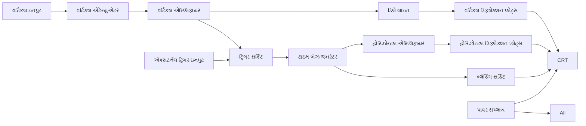

**દરેક બ્લોકનું કાર્ય**:

| બ્લોક | કાર્ય |
|-------|----------|
| વર્ટિકલ એટેન્યુએટર | ઇનપુટ સિગ્નલને યોગ્ય સ્તરે સ્કેલ કરે છે |
| વર્ટિકલ એમ્પ્લિફાયર | ડિફ્લેક્શન પ્લેટ્સ માટે સિગ્નલને એમ્પ્લિફાય કરે છે |
| ડિલે લાઇન | ટ્રિગરિંગ ઘટના જોવા માટે સિગ્નલમાં વિલંબ કરે છે |
| ટ્રિગર સર્કિટ | ચોક્કસ બિંદુએ સ્વીપ શરૂ કરે છે |
| ટાઇમ બેઝ જનરેટર | ક્ષૈતિજ સ્વીપ માટે સોટૂથ વેવ બનાવે છે |
| હોરિઝોન્ટલ એમ્પ્લિફાયર | સ્વીપ સિગ્નલને એમ્પ્લિફાય કરે છે |
| બ્લેંકિંગ સર્કિટ | રીટ્રેસ દરમિયાન બીમ કાપે છે |
| CRT | વિદ્યુત સિગ્નલને દૃશ્ય પ્રદર્શનમાં રૂપાંતરિત કરે છે |
| પાવર સપ્લાય | વિવિધ DC વોલ્ટેજ પ્રદાન કરે છે |

**કાર્ય પ્રક્રિયા**:

1. **સિગ્નલ ઇનપુટ**: વર્ટિકલ એટેન્યુએટર સાથે જોડાયેલ છે
2. **વર્ટિકલ પ્રોસેસિંગ**: સિગ્નલ સ્કેલ, એમ્પ્લિફાય, ડિલે થયેલ
3. **ટ્રિગરિંગ**: ટ્રિગર સર્કિટ ચોક્કસ બિંદુએ ટાઇમ બેઝ શરૂ કરે છે
4. **હોરિઝોન્ટલ સ્વીપ**: ટાઇમ બેઝ ક્ષૈતિજ હલનચલન બનાવે છે
5. **ડિસ્પ્લે**: ઇલેક્ટ્રોન બીમ સ્ક્રીન પર સિગ્નલ ટ્રેસ કરે છે
6. **રીટ્રેસ**: બીમ ઝડપથી પાછો ફરે છે (બ્લેંક) આગલા સ્વીપ માટે

**નિયંત્રણો**:

- **વર્ટિકલ**: વોલ્ટ્સ/div, પોઝિશન, કપલિંગ
- **હોરિઝોન્ટલ**: ટાઇમ/div, પોઝિશન
- **ટ્રિગર**: લેવલ, સ્લોપ, સોર્સ, મોડ

**મેમરી ટ્રીક:** "VATH-CDS - વર્ટિકલ એટેન્યુએટ્સ થેન એમ્પ્લિફાઇઝ, હોરિઝોન્ટલ ક્રિએટ્સ ડિફ્લેક્શન સ્વીપ"

## પ્રશ્ન 3(અ) OR [3 ગુણ]

**કેથોડ રે ઓસિલોસ્કોપ (CRO) અને ડિજિટલ સ્ટોરેજ ઓસિલોસ્કોપ (DSO) વચ્ચેનો તફાવત આપો.**

**જવાબ**:

**CRO અને DSO વચ્ચેની તુલના**:

| પેરામીટર | કેથોડ રે ઓસિલોસ્કોપ (CRO) | ડિજિટલ સ્ટોરેજ ઓસિલોસ્કોપ (DSO) |
|-----------|--------------------------------|-----------------------------------|
| સિગ્નલ પ્રોસેસિંગ | એનાલોગ | ડિજિટલ (ADC રૂપાંતરણ) |
| સ્ટોરેજ ક્ષમતા | કોઈ નહીં (માત્ર રીયલ-ટાઇમ) | મેમરીમાં તરંગો સંગ્રહ કરી શકે છે |
| બેન્ડવિડ્થ | CRT ટેકનોલોજી દ્વારા મર્યાદિત | ઉચ્ચ બેન્ડવિડ્થ શક્ય છે |
| ડિસ્પ્લે | ફોસ્ફર સ્ક્રીન | LCD/LED સ્ક્રીન |
| વધારાની સુવિધાઓ | મૂળભૂત માપન | અદ્યતન વિશ્લેષણ, FFT, મેથ ફંક્શન્સ |

**મુખ્ય તફાવતો**:

- **વેવફોર્મ સ્ટોરેજ**: DSO તરંગો સાચવી શકે છે, CRO નહીં
- **સિગ્નલ પ્રોસેસિંગ**: DSO એનાલોગને ડિજિટલમાં રૂપાંતરિત કરે છે, CRO સંપૂર્ણપણે એનાલોગ છે
- **પ્રી-ટ્રિગર ડિસ્પ્લે**: DSO ટ્રિગર પહેલાંની ઘટનાઓ બતાવી શકે છે
- **એનાલિસિસ ફીચર્સ**: DSO માપન, મેથ ફંક્શન્સ, FFT પ્રદાન કરે છે

**મેમરી ટ્રીક:** "DSO-MAPS - ડિજિટલ સ્ટોરેજ ઓસિલોસ્કોપ માપે, એનાલાઇઝ, પ્રોસેસ, સિગ્નલ્સ સંગ્રહે છે"

## પ્રશ્ન 3(બ) OR [4 ગુણ]

**ફ્રીકવન્સી અને ફેઝ એંગલ CRO (Cathode Ray Oscilloscope)ની મદદથી કેવી રીતે નિર્ધારિત કરી શકાય છે તે સમજાવો.**

**જવાબ**:

**CRO પર ફ્રીકવન્સી માપન**:

**પદ્ધતિ**:

1. સિગ્નલને સ્ક્રીન પર દર્શાવો
2. હોરિઝોન્ટલ ટાઇમ/div સેટિંગનો ઉપયોગ કરીને સમય પીરિયડ (T) માપો
3. ફ્રીકવન્સી ગણો: f = 1/T

**ગણતરી ઉદાહરણ**:

- જો 3 સાયકલ 6 ડિવિઝન પર 0.5ms/div પર ફેલાય છે
- 3 સાયકલનો સમય = 6 div × 0.5ms/div = 3ms
- 1 સાયકલનો સમય (T) = 3ms ÷ 3 = 1ms
- ફ્રીકવન્સી (f) = 1/T = 1/1ms = 1kHz

**ફેઝ એંગલ માપન**:

**પદ્ધતિ**:

1. ડ્યુઅલ ચેનલ પર બંને સિગ્નલ દર્શાવો
2. સંબંધિત બિંદુઓ વચ્ચેનો સમય તફાવત (Δt) માપો
3. સંપૂર્ણ સાયકલનો સમય પીરિયડ (T) માપો
4. ફેઝ તફાવત ગણો: φ = (Δt/T) × 360°

**આકૃતિ**:

```goat
    Voltage
       ^
       |
       |    Signal 1      Signal 2
       |       /\           /\
       |      /  \         /  \
       |     /    \       /    \
       |----/------\-----/------\-----> Time
       |   /        \   /        \
       |  /          \ /          \
       | /            V            \
       |/                           \
       +----------------------------->
           |<--Δt-->|
           |<-------T-------->|
```

**ગણતરી**:

- જો Δt = 1 div અને 0.2ms/div, અને T = 5 div અને 0.2ms/div
- Δt = 0.2ms અને T = 1ms
- ફેઝ તફાવત: φ = (0.2ms/1ms) × 360° = 72°

**મેમરી ટ્રીક:** "FPL - ફ્રીકવન્સી = પિરિયડની લંબાઈનો વ્યસ્ત, ફેઝ = (લેગ/પિરિયડ) × 360"

## પ્રશ્ન 3(ક) OR [7 ગુણ]

**ડિજિટલ સ્ટોરેજ ઓસિલોસ્કોપ (DSO) નો બ્લોક ડાયાગ્રામ દોરો અને દરેક બ્લોકનું કાર્ય સમજાવો.**

**જવાબ**:

**ડિજિટલ સ્ટોરેજ ઓસિલોસ્કોપ (DSO)** એનાલોગ સિગ્નલને સ્ટોરેજ અને વિશ્લેષણ માટે ડિજિટલ સ્વરૂપમાં રૂપાંતરિત કરે છે.

**બ્લોક ડાયાગ્રામ**:

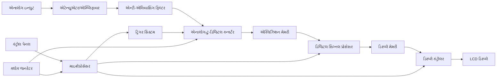

**દરેક બ્લોકનું કાર્ય**:

| બ્લોક | કાર્ય |
|-------|----------|
| એટેન્યુએટર/એમ્પ્લિફાયર | ઇનપુટ સિગ્નલને ADC રેન્જમાં કન્ડિશન કરે છે |
| એન્ટી-એલિયાસિંગ ફિલ્ટર | એલિયાસિંગને રોકવા ઉચ્ચ ફ્રીકવન્સીને દૂર કરે છે |
| ADC | એનાલોગ સિગ્નલને ડિજિટલ સેમ્પલ્સમાં રૂપાંતરિત કરે છે |
| એક્વિઝિશન મેમરી | ડિજિટાઇઝ્ડ વેવફોર્મ ડેટા સ્ટોર કરે છે |
| ડિજિટલ સિગ્નલ પ્રોસેસર | સિગ્નલ્સ પર ગાણિતિક ઓપરેશન કરે છે |
| ડિસ્પ્લે મેમરી | ડિસ્પ્લે માટે પ્રોસેસ કરેલ ડેટા સ્ટોર કરે છે |
| ડિસ્પ્લે કંટ્રોલર | સ્ક્રીન અપડેટ અને ફોર્મેટ નિયંત્રિત કરે છે |
| માઇક્રોપ્રોસેસર | સમગ્ર ઓપરેશન અને યુઝર ઇન્ટરફેસ નિયંત્રિત કરે છે |
| ટ્રિગર સિસ્ટમ | ડેટા એક્વિઝિશન ક્યારે શરૂ કરવું તે નક્કી કરે છે |
| ક્લોક જનરેટર | સેમ્પલિંગ અને પ્રોસેસિંગ માટે ટાઇમિંગ પ્રદાન કરે છે |

**DSO ના ફાયદા**:

- **સિંગલ-શોટ કેપ્ચર**: ક્ષણિક ઘટનાઓ કેપ્ચર કરી શકે છે
- **પ્રી-ટ્રિગર વ્યુઇંગ**: ટ્રિગર પોઇન્ટ પહેલાના સિગ્નલને બતાવે છે
- **વેવફોર્મ સ્ટોરેજ**: પછીના વિશ્લેષણ માટે સિગ્નલ્સ સાચવે છે
- **અદ્યતન માપન**: ઓટોમેટેડ એમ્પ્લિટ્યુડ, ટાઇમિંગ, વગેરે
- **ગાણિતિક ફંક્શન્સ**: સરવાળા, FFT, ઇન્ટિગ્રેશન, વગેરે

**કાર્ય પ્રક્રિયા**:

1. એટેન્યુએટર/એમ્પ્લિફાયર દ્વારા ઇનપુટ સિગ્નલ કન્ડિશન થાય છે
2. એલિયાસિંગ રોકવા માટે સિગ્નલ ફિલ્ટર થાય છે
3. ADC નિયમિત અંતરાલે સિગ્નલનું સેમ્પલિંગ કરે છે
4. ડિજિટલ ડેટા એક્વિઝિશન મેમરીમાં સ્ટોર થાય છે
5. પ્રોસેસર ડેટાનું વિશ્લેષણ કરે છે અને ડિસ્પ્લે માટે તૈયાર કરે છે
6. ડિસ્પ્લે વેવફોર્મ અને માપન બતાવે છે

**મેમરી ટ્રીક:** "AADPD - એટેન્યુએટ એનાલોગ, ડિજિટાઇઝ, પ્રોસેસ, ડિસ્પ્લે સિગ્નલ"

## પ્રશ્ન 4(અ) [3 ગુણ]

**વિવિધ પ્રકારના ટ્રાન્સડ્યૂસરનું વર્ગીકરણ કરો.**

**જવાબ**:

**ટ્રાન્સડ્યૂસરનું વર્ગીકરણ**:

| વર્ગીકરણ આધાર | પ્રકારો |
|----------------------|-------|
| ઓપરેશનનો સિદ્ધાંત | મિકેનિકલ, ઇલેક્ટ્રિકલ, થર્મલ, ઓપ્ટિકલ, કેમિકલ |
| ઇનપુટ/આઉટપુટ સંબંધ | પ્રાઇમરી, સેકન્ડરી |
| સિગ્નલ જનરેશન | એક્ટિવ, પેસિવ |
| ઇલેક્ટ્રિકલ પેરામીટર્સ | રેઝિસ્ટિવ, કેપેસિટિવ, ઇન્ડક્ટિવ |
| ટ્રાન્સડક્શન | ફોટોઇલેક્ટ્રિક, ઇલેક્ટ્રોકેમિકલ, થર્મોઇલેક્ટ્રિક |

**મુખ્ય વર્ગીકરણ**:

1. **ઊર્જા રૂપાંતરણ પર આધારિત**:
   - **એક્ટિવ ટ્રાન્સડ્યૂસર**: બાહ્ય પાવર વિના ઇલેક્ટ્રિકલ આઉટપુટ જનરેટ કરે છે (દા.ત., થર્મોકપલ)
   - **પેસિવ ટ્રાન્સડ્યૂસર**: બાહ્ય પાવરની જરૂર પડે છે (દા.ત., થર્મિસ્ટર)

2. **કાર્ય સિદ્ધાંત પર આધારિત**:
   - **પ્રાઇમરી ટ્રાન્સડ્યૂસર**: ભૌતિક ફેરફારને સીધા ઇલેક્ટ્રિકલ સિગ્નલમાં રૂપાંતરિત કરે છે
   - **સેકન્ડરી ટ્રાન્સડ્યૂસર**: મધ્યવર્તી રૂપાંતરણની જરૂર પડે છે

**મેમરી ટ્રીક:** "APRCI - એક્ટિવ/પેસિવ, રેઝિસ્ટિવ/કેપેસિટિવ/ઇન્ડક્ટિવ મુખ્ય કેટેગરી છે"

## પ્રશ્ન 4(બ) [4 ગુણ]

**સ્ટ્રેઇન ગેજનું બંધારણ અને કાર્ય સમજાવો.**

**જવાબ**:

**સ્ટ્રેઇન ગેજ** યાંત્રિક સ્ટ્રેઇન (વિરૂપણ)ને વિદ્યુત અવરોધ પરિવર્તનમાં રૂપાંતરિત કરે છે.

**બંધારણ**:

- **ગ્રીડ પેટર્ન**: ઝિગઝેગ પેટર્નમાં પાતળી ફોઇલ અથવા વાયર
- **બેકિંગ મટીરિયલ**: પોલિમાઇડ અથવા એપોક્સી કેરિયર
- **લીડ વાયર**: માપન સર્કિટ સાથે જોડાયેલ
- **એડહેસિવ**: ગેજને ટેસ્ટ સરફેસ સાથે જોડે છે

**આકૃતિ**:

```goat
   Lead Wire                Lead Wire
      |                        |
      v                        v
    +----------------------------+
    |                            |  Backing
    |   +--------------------+   |  Material
    |   | /\/\/\/\/\/\/\/\/\ |   |
    |   | \                / |   |
    |   |  \    Grid     /   |   |
    |   |   \   Pattern /    |   |
    |   |    \/\/\/\/\/      |   |
    |   +--------------------+   |
    |                            |
    +----------------------------+
```

**કાર્ય સિદ્ધાંત**:

- પિઝોરેઝિસ્ટિવ ઇફેક્ટ પર આધારિત
- જ્યારે ઓબ્જેક્ટ વિરૂપિત થાય છે, ત્યારે ગેજ વિરૂપિત થાય છે
- વિરૂપણ સૂત્ર અનુસાર અવરોધ બદલે છે:
  - ΔR/R = GF × ε
  - જ્યાં GF = ગેજ ફેક્ટર, ε = સ્ટ્રેઇન

**માપન સર્કિટ**:

- સામાન્ય રીતે વ્હીટસ્ટોન બ્રિજમાં જોડાયેલ
- નાના અવરોધ ફેરફારને વોલ્ટેજમાં રૂપાંતરિત કરે છે
- આઉટપુટ વોલ્ટેજ સ્ટ્રેઇનના પ્રમાણમાં હોય છે

**ઉપયોગો**:

- લોડ સેલ, પ્રેશર સેન્સર
- સ્ટ્રક્ચરલ ટેસ્ટિંગ
- મિકેનિકલ સ્ટ્રેસ એનાલિસિસ

**મેમરી ટ્રીક:** "GRID - ગેજ રેઝિસ્ટન્સ ઇન્ક્રીઝ વિથ ડિફોર્મેશન"

## પ્રશ્ન 4(ક) [7 ગુણ]

**લિનિયર વેરિએબલ ડિફરન્શિયલ ટ્રાન્સડ્યુસર (LVDT) ને તેના બંધારણ, કાર્યપદ્ધતિ, ફાયદા અને ઉપયોગો સાથે સમજાવો.**

**જવાબ**:

**લિનિયર વેરિએબલ ડિફરન્શિયલ ટ્રાન્સફોર્મર (LVDT)** એક ઇલેક્ટ્રોમિકેનિકલ સેન્સર છે જે લિનિયર ડિસ્પ્લેસમેન્ટને ઇલેક્ટ્રિકલ સિગ્નલમાં રૂપાંતરિત કરે છે.

**બંધારણ**:

- **પ્રાઇમરી કોઇલ**: કેન્દ્રીય વાઇન્ડિંગ AC સ્ત્રોતથી એક્સાઇટ થાય છે
- **સેકન્ડરી કોઇલ્સ**: બંને બાજુએ બે સરખા કોઇલ્સ
- **કોર**: ડિસ્પ્લેસમેન્ટ સાથે હલનચલન કરતી ફેરોમેગ્નેટિક સામગ્રી
- **હાઉસિંગ**: ટર્મિનલ્સ સહિત સિલિન્ડ્રિકલ શેલ

**આકૃતિ**:

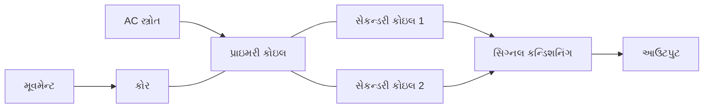

**કાર્ય સિદ્ધાંત**:

- પ્રાઇમરી કોઇલને AC વોલ્ટેજ અપાય છે
- ચુંબકીય ફ્લક્સ સેકન્ડરી કોઇલ્સમાં કપલ થાય છે
- કોરની સ્થિતિ કપલિંગ કાર્યક્ષમતા નક્કી કરે છે
- સેકન્ડરીઓ વચ્ચેનું વોલ્ટેજ તફાવત ∝ ડિસ્પ્લેસમેન્ટ
- નલ પોઝિશન (સેન્ટર) પર, સેકન્ડરી વોલ્ટેજ સરખા અને વિરુદ્ધ હોય છે

**ચારિત્ર્યિક વક્ર**:

```goat
     Output
       ^
       |                Secondary Voltages
       |                     /
       |                    /
       |                   /
       |                  /
       |                 /
       |----------------/-----------------> Displacement
       |               /
       |              /
       |             /
     --|------------/----
       |           /
  Null Position
```

**ફાયદાઓ**:

- **ઘર્ષણ વિનાનું કાર્ય**: કોઈ યાંત્રિક સંપર્ક નહીં
- **અનંત રિઝોલ્યુશન**: એનાલોગ આઉટપુટ
- **ઉચ્ચ લિનિયરિટી**: સીધું પ્રમાણસર આઉટપુટ
- **મજબૂતાઈ**: આઘાત અને કંપનને પ્રતિરોધક
- **લાંબો જીવનકાળ**: ઘસાતા ભાગો નથી

**ઉપયોગો**:

- **ઔદ્યોગિક**: ઓટોમેટેડ મશીન ટૂલ્સ, રોબોટિક્સ
- **એરોસ્પેસ**: ફ્લાઇટ કંટ્રોલ સિસ્ટમ્સ
- **સિવિલ એન્જિનિયરિંગ**: સ્ટ્રક્ચરલ ટેસ્ટિંગ
- **મેટ્રોલોજી**: પ્રિસિઝન મેઝરમેન્ટ ઇન્સ્ટ્રુમેન્ટ્સ

**મેમરી ટ્રીક:** "LVDT-MAPS - લિનિયર વેરિએબલ ડિફરન્શિયલ ટ્રાન્સફોર્મર સેકન્ડરી વોલ્ટેજ તફાવત દ્વારા પોઝિશન ચોકસાઇથી માપે છે"

## પ્રશ્ન 4(અ) OR [3 ગુણ]

**પીએચ સેન્સરના ત્રણ ઉપયોગો જણાવો.**

**જવાબ**:

**PH સેન્સરના ઉપયોગો**:

| ઉપયોગ | હેતુ | મહત્વ |
|-------------|---------|------------|
| વોટર ટ્રીટમેન્ટ | પાણીની ગુણવત્તા મોનિટર અને નિયંત્રિત કરવા | સુરક્ષિત પીવાનું પાણી સુનિશ્ચિત કરે છે |
| કૃષિ | શ્રેષ્ઠ વનસ્પતિ વૃદ્ધિ માટે જમીન મોનિટરિંગ | પાક ઉપજ વધારે છે |
| મેડિકલ ડાયગ્નોસ્ટિક્સ | શરીરના પ્રવાહની એસિડિટી માપન | દર્દીના સ્વાસ્થ્ય માટે મહત્વપૂર્ણ |

**વધારાના ઉપયોગો**:

- **ફૂડ પ્રોસેસિંગ**: ઉત્પાદન દરમિયાન ગુણવત્તા નિયંત્રણ
- **એક્વાકલ્ચર**: પાણીની ઓપ્ટિમલ સ્થિતિ જાળવવી
- **કેમિકલ મેન્યુફેક્ચરિંગ**: પ્રક્રિયા નિયંત્રણ

**મેમરી ટ્રીક:** "WAM - વોટર ક્વાલિટી કંટ્રોલ, એગ્રિકલ્ચર સોઇલ ટેસ્ટિંગ, મેડિકલ ડાયગ્નોસ્ટિક્સ મુખ્ય PH સેન્સર ઉપયોગો છે"

## પ્રશ્ન 4(બ) OR [4 ગુણ]

**કેપેસિટિવ ટ્રાન્સડ્યૂસરનું બંધારણ અને કાર્ય સમજાવો.**

**જવાબ**:

**કેપેસિટિવ ટ્રાન્સડ્યૂસર** ભૌતિક ફેરફારને કેપેસિટન્સ પરિવર્તનમાં રૂપાંતરિત કરે છે જે વિદ્યુત રીતે માપવામાં આવે છે.

**બંધારણ**:

- **સમાંતર પ્લેટ્સ**: બે વાહક પ્લેટ્સ
- **ડાઇલેક્ટ્રિક મિડિયમ**: હવા, સિરામિક, અથવા અન્ય સામગ્રી
- **હાઉસિંગ**: સુરક્ષાત્મક આવરણ
- **ટર્મિનલ્સ**: વિદ્યુત જોડાણો

**આકૃતિ**:

```goat
    Terminal A             Terminal B
        |                     |
        v                     v
    +----------+         +----------+
    |          |         |          |
    |  Plate A |         |  Plate B |
    |          |<------->|          |
    |          |    d    |          |
    +----------+         +----------+
           |                 |
           |    Dielectric   |
           |     Material    |
           |                 |
    +--------------------------+
    |        Housing           |
    +--------------------------+
```

**કાર્ય સિદ્ધાંત**:

- કેપેસિટન્સ C = ε₀εᵣA/d
  - ε₀ = મુક્ત અવકાશની પર્મિટિવિટી
  - εᵣ = ડાઇલેક્ટ્રિકની સાપેક્ષ પર્મિટિવિટી
  - A = પ્લેટ્સનું ક્ષેત્રફળ
  - d = પ્લેટ્સ વચ્ચેનું અંતર

**પરિવર્તનના પ્રકારો**:

1. **ક્ષેત્રફળ પરિવર્તન**: પ્લેટ્સનું ઓવરલેપ બદલવું
2. **અંતર પરિવર્તન**: પ્લેટ્સ વચ્ચેનું અંતર બદલવું
3. **ડાઇલેક્ટ્રિક પરિવર્તન**: ડાઇલેક્ટ્રિક સામગ્રી બદલવી

**ઉપયોગો**:

- **પ્રેશર સેન્સર**: ડાયાફ્રામ પ્લેટ અંતર બદલે છે
- **લેવલ સેન્સર**: પ્રવાહી સ્તર સાથે ડાઇલેક્ટ્રિક બદલાય છે
- **હ્યુમિડિટી સેન્સર**: ભેજ સાથે ડાઇલેક્ટ્રિક બદલાય છે
- **પ્રોક્સિમિટી સેન્સર**: ઓબ્જેક્ટની હાજરી સાથે અંતર બદલાય છે

**મેમરી ટ્રીક:** "CAD - કેપેસિટન્સ એરિયા, ડિસ્ટન્સ, અથવા ડાઇલેક્ટ્રિક પરિવર્તન સાથે બદલાય છે"

## પ્રશ્ન 4(ક) OR [7 ગુણ]

**એબ્સોલ્યુટ ઑપ્ટિકલ એન્કોડર શું છે? એના A, B અને C આઉટપુટ વેવફોર્મ વિશે સમજાવો અને યોગ્ય આકૃતિ આપો. તેની વિગતવાર સમજૂતી આપો.**

**જવાબ**:

**એબ્સોલ્યુટ ઑપ્ટિકલ એન્કોડર** દરેક પોઝિશન માટે અનન્ય ડિજિટલ કોડ જનરેટ કરીને સીધું એન્ગ્યુલર પોઝિશન માપે છે.

**બંધારણ**:

- **કોડ ડિસ્ક**: પારદર્શક/અપારદર્શક સેક્ટર સાથે કૉન્સેન્ટ્રિક ટ્રેક્સ ધરાવે છે
- **લાઇટ સોર્સ**: ડિસ્કને પ્રકાશિત કરતા LED એરે
- **ફોટો ડિટેક્ટર્સ**: ડિસ્ક પેટર્ન દ્વારા પ્રકાશને શોધતા સેન્સર્સ
- **સિગ્નલ કન્ડિશનિંગ**: ફોટોડિટેક્ટર સિગ્નલ્સને ડિજિટલ આઉટપુટમાં રૂપાંતરિત કરે છે

**આકૃતિ**:

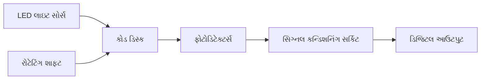

**કોડ ડિસ્ક પેટર્ન**:

```goat
          Track C (Index)
            |
     -------|-----------------
            |
          --+--  --+--  --+--
           Track B
     -------|-----------------
            |
          -++--  -++--  -++--
           Track A
     -------|-----------------
            |
          -+++- -+++- -+++- -
     -------|-----------------
            |
            V
          Rotation
```

**વેવફોર્મ આઉટપુટ્સ**:

| સિગ્નલ | હેતુ | ચારિત્ર્યિક લક્ષણો |
|--------|---------|-----------------|
| A સિગ્નલ | પોઝિશન માહિતી | સ્ક્વેર વેવ, 50% ડ્યુટી સાયકલ |
| B સિગ્નલ | દિશા માહિતી | A થી 90° ફેઝ શિફ્ટેડ |
| C સિગ્નલ | રેફરન્સ/ઇન્ડેક્સ | પ્રતિ રિવોલ્યુશન એક પલ્સ |

**આઉટપુટ વેવફોર્મ્સ**:

```goat
    A Signal  _____|‾‾‾‾‾|_____|‾‾‾‾‾|_____|‾‾‾‾‾|_____|‾‾‾‾‾|_____
    
    B Signal  __|‾‾‾‾‾|_____|‾‾‾‾‾|_____|‾‾‾‾‾|_____|‾‾‾‾‾|_____|‾‾
    
    C Signal  _____|‾|_________________________________________________
              
              0°    90°   180°   270°   360°   450°   540°   630°   720°
```

**કાર્ય સિદ્ધાંત**:

- A & B આઉટપુટ ક્વોડ્રેચર સિગ્નલ્સ (90° ફેઝ શિફ્ટ) પ્રદાન કરે છે
- કયો સિગ્નલ આગળ છે તે દ્વારા દિશા નક્કી થાય છે:
  - જો A, B થી આગળ હોય: ક્લોકવાઇઝ રોટેશન
  - જો B, A થી આગળ હોય: કાઉન્ટર-ક્લોકવાઇઝ રોટેશન
- પલ્સ ગણીને પોઝિશન નક્કી થાય છે
- C સિગ્નલ રેફરન્સ/હોમ પોઝિશન પ્રદાન કરે છે

**ઉપયોગો**:

- **CNC મશીન**: ચોક્સાઈવાળું પોઝિશન કંટ્રોલ
- **રોબોટિક્સ**: જોઇન્ટ એંગલ મેઝરમેન્ટ
- **કેમેરા સિસ્ટમ્સ**: લેન્સ પોઝિશનિંગ
- **ઔદ્યોગિક ઓટોમેશન**: મોટર કંટ્રોલ

**મેમરી ટ્રીક:** "ABC-PDP - એબ્સોલ્યુટ એન્કોડર ટ્રેક્સ A, B, C દિશા, પોઝિશન, અને રેફરન્સ પલ્સ પ્રદાન કરે છે"

## પ્રશ્ન 5(અ) [3 ગુણ]

**બેસિક ફ્રિકવન્સી કાઉન્ટરનો કાર્યસિદ્ધાંત સમજાવો.**

**જવાબ**:

**ફ્રિકવન્સી કાઉન્ટર** ચોક્કસ સમય અંતરાલ ઉપર ઘટનાઓ ગણીને ઇનપુટ સિગ્નલની ફ્રિકવન્સી માપે છે.

**કાર્ય સિદ્ધાંત**:

- ઇનપુટ સિગ્નલના સાયકલ્સ/પલ્સની સંખ્યા ગણો
- ચોક્કસ ગેટ સમયથી ભાગાકાર કરો
- પરિણામી ફ્રિકવન્સી દર્શાવો

**મૂળભૂત બ્લોક્સ**:

- **ઇનપુટ કન્ડિશનિંગ**: સિગ્નલને ડિજિટલ લેવલમાં આકાર આપે છે
- **ગેટ કંટ્રોલ**: ચોક્કસ સમય માટે ગેટ ખોલે છે
- **કાઉન્ટર**: ગેટ ખુલ્લા સમય દરમિયાન પલ્સ ગણે છે
- **ટાઇમ બેઝ**: ચોક્કસ ગેટ ટાઇમિંગ ઉત્પન્ન કરે છે
- **ડિસ્પ્લે**: ફ્રિકવન્સી મૂલ્ય બતાવે છે

**સરળીકૃત આકૃતિ**:

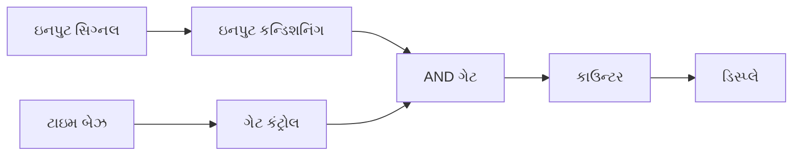

**મેમરી ટ્રીક:** "CTPG - કાઉન્ટ ધ પલ્સીસ, ગેટ ધ ટાઇમ"

## પ્રશ્ન 5(બ) [4 ગુણ]

**એનર્જી મીટરનો ડાયાગ્રામ દોરો અને તેનો કાર્યસિદ્ધાંત સમજાવો.**

**જવાબ**:

**ઇલેક્ટ્રોનિક એનર્જી મીટર** કિલોવોટ-અવર (kWh)માં વિદ્યુત ઊર્જા વપરાશ માપે છે.

**બ્લોક ડાયાગ્રામ**:

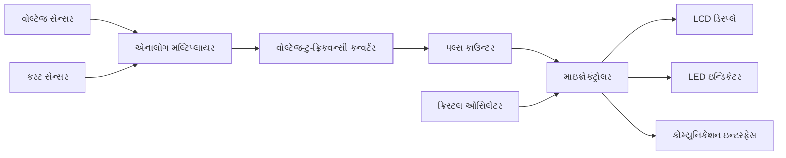

**કાર્ય સિદ્ધાંત**:

- ઊર્જા = પાવર × સમય
- પાવર = વોલ્ટેજ × કરંટ
- વોલ્ટેજ અને કરંટ અલગથી સેન્સ થાય છે
- ક્ષણિક પાવર મેળવવા ગુણાકાર કરાય છે
- ઊર્જા મેળવવા સમય પર ઇન્ટિગ્રેટ કરાય છે
- ઊર્જાના પ્રમાણમાં પલ્સ ઉત્પન્ન થાય છે
- દરેક પલ્સ ફિક્સ્ડ ઊર્જા યુનિટ દર્શાવે છે
- કાઉન્ટર પલ્સ એકત્રિત કરે છે
- ડિસ્પ્લે એકત્રિત ઊર્જા બતાવે છે

**લક્ષણો**:

- **ટેમ્પર ડિટેક્શન**: વિજળી ચોરી રોકે છે
- **મલ્ટિપલ ટેરિફ**: વિવિધ સમય માટે અલગ દરો
- **કોમ્યુનિકેશન**: રિમોટ રીડિંગ ક્ષમતા

**મેમરી ટ્રીક:** "VCPI - વોલ્ટેજ અને કરંટ ગુણાકાર થાય છે, પલ્સ ઊર્જા વપરાશ દર્શાવે છે"

## પ્રશ્ન 5(ક) [7 ગુણ]

**ફંક્શન જનરેટરનો કાર્યસિદ્ધાંત અને કાર્યવિધી સંક્ષિપ્તમાં સમજાવો. તેના ફ્રન્ટ પેનલ કંટ્રોલ્સનું વર્ણન કરો અને તે કેવી રીતે ઇલેક્ટ્રોનિક પરિપથોની તપાસ માટે ઉપયોગી છે તે ઉદાહરણ સાથે સમજાવો.**

**જવાબ**:

**ફંક્શન જનરેટર** એક ઇલેક્ટ્રોનિક ટેસ્ટ ઇન્સ્ટ્રુમેન્ટ છે જે એડજસ્ટેબલ ફ્રિકવન્સી અને એમ્પ્લિટ્યુડ સાથે વિવિધ વેવફોર્મ્સ ઉત્પન્ન કરે છે.

**કાર્ય સિદ્ધાંત**:

- ઓસિલેટર સર્કિટનો ઉપયોગ કરીને બેઝ સિગ્નલ ઉત્પન્ન કરે છે
- વેવ-શેપિંગ સર્કિટનો ઉપયોગ કરીને વેવફોર્મ આકાર આપે છે
- એમ્પ્લિટ્યુડ, ફ્રિકવન્સી અને ઓફસેટ પેરામીટર્સ એડજસ્ટ કરે છે
- બફર એમ્પ્લિફાયર મારફતે વેવફોર્મ આઉટપુટ કરે છે

**બ્લોક ડાયાગ્રામ**:

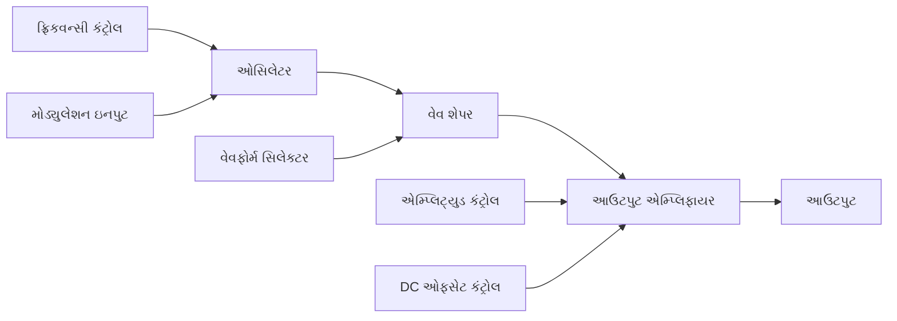

**ફ્રન્ટ પેનલ કંટ્રોલ્સ**:

| કંટ્રોલ | કાર્ય | ટિપિકલ રેન્જ |
|---------|----------|---------------|
| ફ્રિકવન્સી | સિગ્નલ ફ્રિકવન્સી સેટ કરે છે | 0.1 Hz - 20 MHz |
| એમ્પ્લિટ્યુડ | સિગ્નલ એમ્પ્લિટ્યુડ સેટ કરે છે | 0 - 20 Vpp |
| DC ઓફસેટ | DC વોલ્ટેજ ઉમેરે છે | ±10V |
| વેવફોર્મ સિલેક્ટ | વેવફોર્મ પ્રકાર પસંદ કરે છે | સાઇન, ટ્રાયેંગલ, સ્ક્વેર, પલ્સ |
| ડ્યુટી સાયકલ | પલ્સ વિડ્થ એડજસ્ટ કરે છે | 10% - 90% |
| મોડ્યુલેશન | AM/FM મોડ્યુલેશન | ઇન્ટર્નલ/એક્સટર્નલ |

**આઉટપુટ વેવફોર્મ્સ**:

```goat
    Sine      /\      /\      /\
             /  \    /  \    /  \
    _______ /    \__/    \__/    \__
    
    Square   ______      ______
            |      |    |      |
    ________|      |____|      |____
    
    Triangle  /\      /\      /\
             /  \    /  \    /  \
    ________/    \__/    \__/    \__
    
    Pulse     __        __        __
             |  |      |  |      |  |
    _________|  |______|  |______|  |_
```

**સર્કિટ ટેસ્ટિંગ ઉપયોગો**:

| ઉપયોગ | વપરાતો વેવફોર્મ | હેતુ |
|-------------|---------------|---------|
| એમ્પ્લિફાયર ટેસ્ટિંગ | સાઇન વેવ | ગેઇન, ફ્રિકવન્સી રિસ્પોન્સ |
| ડિજિટલ સર્કિટ ટેસ્ટિંગ | સ્ક્વેર વેવ | લોજિક ટાઇમિંગ, થ્રેશોલ્ડ |
| ફિલ્ટર ટેસ્ટિંગ | સાઇન સ્વીપ | કટઓફ ફ્રિકવન્સી, રિસ્પોન્સ |
| ટ્રિગરિંગ સર્કિટ્સ | પલ્સ | થ્રેશોલ્ડ ટેસ્ટિંગ |

**ઉદાહરણ: એમ્પ્લિફાયર ટેસ્ટિંગ**

1. ફંક્શન જનરેટરને એમ્પ્લિફાયર ઇનપુટ સાથે કનેક્ટ કરો
2. યોગ્ય એમ્પ્લિટ્યુડનો સાઇન વેવ સેટ કરો
3. ફ્રિકવન્સી રિસ્પોન્સ ટેસ્ટ કરવા ફ્રિકવન્સી બદલો
4. ઓસિલોસ્કોપ પર આઉટપુટ મોનિટર કરો
5. ગેઇન ગણો = આઉટપુટ એમ્પ્લિટ્યુડ / ઇનપુટ એમ્પ્લિટ્યુડ

**મેમરી ટ્રીક:** "FAWOD - ફ્રિકવન્સી, એમ્પ્લિટ્યુડ, વેવફોર્મ, ઓફસેટ, ડ્યુટી સાયકલ મુખ્ય કંટ્રોલ્સ છે"

## પ્રશ્ન 5(અ) OR [3 ગુણ]

**સ્પેક્ટ્રમ એનાલાઈઝરનું કાર્ય સમજાવો.**

**જવાબ**:

**સ્પેક્ટ્રમ એનાલાઇઝર** સિગ્નલની ફ્રિકવન્સી વિરુદ્ધ એમ્પ્લિટ્યુડ માપે છે, સિગ્નલના ફ્રિકવન્સી ઘટકો બતાવે છે.

**કાર્ય સિદ્ધાંત**:

- ટાઇમ-ડોમેન સિગ્નલને ફ્રિકવન્સી-ડોમેનમાં રૂપાંતરિત કરે છે
- સ્પેક્ટ્રલ ઘટકો અને તેમની એમ્પ્લિટ્યુડ બતાવે છે
- સુપરહેટેરોડાઇન રિસીવર આર્કિટેક્ચરનો ઉપયોગ કરે છે
- ફ્રિકવન્સી રેન્જનું વિશ્લેષણ કરવા લોકલ ઓસિલેટર સ્વીપ કરે છે

**બ્લોક ડાયાગ્રામ**:

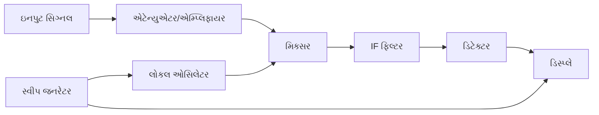

**ઉપયોગો**:

- **સિગ્નલ એનાલિસિસ**: હાર્મોનિક્સ, ડિસ્ટોર્શન માપન
- **EMI ટેસ્ટિંગ**: ઇન્ટરફેરન્સ સ્ત્રોતો શોધવા
- **કોમ્યુનિકેશન્સ**: ચેનલ એનાલિસિસ, મોડ્યુલેશન ક્વોલિટી

**મેમરી ટ્રીક:** "SAME - સ્પેક્ટ્રમ એનાલાઇઝર ફ્રિકવન્સી પર સિગ્નલ એનર્જી મેપ કરે છે"

## પ્રશ્ન 5(બ) OR [4 ગુણ]

**ક્લેમ્પ ઓન મીટરનો ડાયાગ્રામ દોરો અને તેનું કાર્ય સમજાવો.**

**જવાબ**:

**ક્લેમ્પ-ઓન મીટર** (કરંટ ક્લેમ્પ) AC/DC કરંટ માપવા માટેનું નોન-કોન્ટેક્ટ ડિવાઇસ છે.

**બંધારણ આકૃતિ**:

```goat
         Display
         .------.
        /        \
       /  120.5A  \    Function
      /            \    Selector
     |   O |--|     |  .----.
     |     |  |     |  |    |
     |     |  |     |--'    |
     |     |  |     |       |
     |     |  |     |       |
     |     '--'     |       |
      \   Trigger   /       |
       \           /        |
        |         |        /
        |         |       /
        |         |      /
        `---------´     /
             |         /
           Clamp      /
             |       /
            /       /
           /       /
          /       /
         `-______´
         Test Leads
```

**કાર્ય સિદ્ધાંત**:

- ઇલેક્ટ્રોમેગ્નેટિક ઇન્ડક્શન (ફેરાડેના નિયમ) પર આધારિત
- કરંટ-વહન કરતો વાહક ચુંબકીય ક્ષેત્ર ઉત્પન્ન કરે છે
- ક્લેમ્પનો ફેરોમેગ્નેટિક કોર ફિલ્ડને કેન્દ્રિત કરે છે
- ક્લેમ્પમાં સેકન્ડરી કોઇલ પ્રમાણસર વોલ્ટેજ પ્રેરિત કરે છે
- સર્કિટ પ્રેરિત વોલ્ટેજને કરંટ રીડિંગમાં રૂપાંતરિત કરે છે

**ફાયદાઓ**:

- **નોન-કોન્ટેક્ટ**: સર્કિટ ડિસકનેક્ટ કરવાની જરૂર નથી
- **સલામતી**: ઉચ્ચ વોલ્ટેજથી આઇસોલેશન
- **સુવિધા**: સીમિત જગ્યામાં વાપરવામાં સરળ

**ઉપયોગો**:

- **ઇલેક્ટ્રિકલ મેઇન્ટેનન્સ**: મોટર કરંટ, લોડ ટેસ્ટિંગ
- **પાવર ક્વોલિટી**: પાવર ફેક્ટર, હાર્મોનિક્સ માપન
- **ટ્રબલશૂટિંગ**: અનબેલેન્સ્ડ લોડ શોધવા

**મેમરી ટ્રીક:** "CLIP - ક્લેમ્પ કરંટ માપે છે, મેગ્નેટિક ઇન્ડક્શન વોલ્ટેજ પેદા કરે છે"

## પ્રશ્ન 5(ક) OR [7 ગુણ]

**ડિજિટલ IC ટેસ્ટરનું કાર્યસિદ્ધાંત સમજાવો. તેનો બ્લોક ડાયાગ્રામ સમજાવો અને તે ડિજિટલ IC ની કાર્યક્ષમતા કઈ રીતે ચકાસે છે તે ઉદાહરણ સાથે સમજાવો.**

**જવાબ**:

**ડિજિટલ IC ટેસ્ટર** ટેસ્ટ પેટર્ન લાગુ કરીને અને પ્રતિક્રિયાઓની સરખામણી કરીને ડિજિટલ ઇન્ટિગ્રેટેડ સર્કિટની કાર્યક્ષમતા ચકાસે છે.

**કાર્યસિદ્ધાંત**:

- IC પીન્સને પૂર્વનિર્ધારિત ટેસ્ટ વેક્ટર્સ લાગુ કરે છે
- વાસ્તવિક આઉટપુટની અપેક્ષિત આઉટપુટ સાથે સરખામણી કરે છે
- ખામીયુક્ત IC અથવા ખોટા કાર્યોની ઓળખ કરે છે
- સંગ્રહિત ટેસ્ટ પેટર્નનો ઉપયોગ કરીને બહુવિધ IC પ્રકારો ટેસ્ટ કરે છે

**બ્લોક ડાયાગ્રામ**:

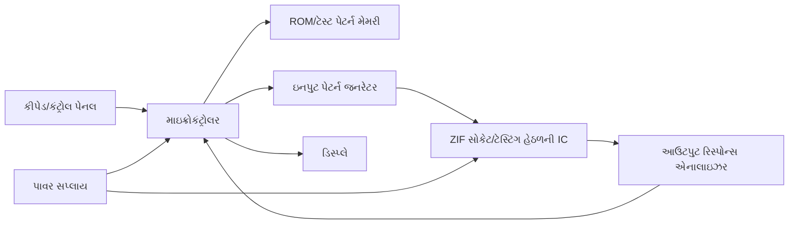

**મુખ્ય ઘટકો**:

- **ZIF સોકેટ**: ઝીરો ઇન્સર્શન ફોર્સ સોકેટ સરળ IC પ્લેસમેન્ટ માટે
- **ટેસ્ટ પેટર્ન મેમરી**: વિવિધ IC માટે ટેસ્ટ વેક્ટર્સ સંગ્રહે છે
- **આઉટપુટ રિસ્પોન્સ એનાલાઇઝર**: વાસ્તવિક વિરુદ્ધ અપેક્ષિત આઉટપુટની સરખામણી કરે છે
- **માઇક્રોકંટ્રોલર**: ટેસ્ટિંગ સિક્વન્સ અને મૂલ્યાંકન નિયંત્રિત કરે છે
- **ડિસ્પ્લે**: ટેસ્ટ પરિણામો અને સ્થિતિ બતાવે છે

**ટેસ્ટિંગ પદ્ધતિ**:

| સ્ટેપ | ક્રિયા | હેતુ |
|------|--------|---------|
| 1 | IC પ્રકાર પસંદ કરો | સાચા ટેસ્ટ પેરામીટર્સ લોડ કરો |
| 2 | ZIF સોકેટમાં IC ઇન્સર્ટ કરો | ટેસ્ટિંગ માટે તૈયાર કરો |
| 3 | ટેસ્ટ શરૂ કરો | ટેસ્ટ સિક્વન્સ શરૂ કરો |
| 4 | ટેસ્ટ વેક્ટર્સ લાગુ કરો | IC ફંક્શન્સનો અભ્યાસ કરો |
| 5 | પ્રતિક્રિયાઓની સરખામણી કરો | ભૂલો ઓળખો |
| 6 | પરિણામો દર્શાવો | પાસ/ફેલ સ્થિતિ બતાવો |

**ઉદાહરણ: 7400 NAND ગેટ IC ટેસ્ટિંગ**:

1. IC લિસ્ટમાંથી "7400" પસંદ કરો
2. ZIF સોકેટમાં IC ઇન્સર્ટ કરો
3. ટેસ્ટર બધા ઇનપુટ કોમ્બિનેશન્સ લાગુ કરે છે:
   - ઇનપુટ 1A=0, 1B=0 → અપેક્ષિત આઉટપુટ 1Y=1
   - ઇનપુટ 1A=0, 1B=1 → અપેક્ષિત આઉટપુટ 1Y=1
   - ઇનપુટ 1A=1, 1B=0 → અપેક્ષિત આઉટપુટ 1Y=1
   - ઇનપુટ 1A=1, 1B=1 → અપેક્ષિત આઉટપુટ 1Y=0
4. પેકેજમાં બધા ગેટ્સ માટે પુનરાવર્તન કરો (7400માં 4 NAND ગેટ્સ છે)
5. વાસ્તવિક આઉટપુટની અપેક્ષિત ટ્રુથ ટેબલ સાથે સરખામણી કરો
6. જો બધા ટેસ્ટ સફળ થાય, તો "PASS" ડિસ્પ્લે કરો, અથવા નિષ્ફળતા હોય તો એરર કોડ ડિસ્પ્લે કરો

**મોડર્ન IC ટેસ્ટર્સની વિશેષતાઓ**:

- **ઓટો-આઇડેન્ટિફિકેશન**: અજ્ઞાત IC શોધે છે
- **લર્નિંગ મોડ**: નવા IC માટે ટેસ્ટ પેટર્ન બનાવે છે
- **ફંક્શનલ ટેસ્ટિંગ**: ઇન-સર્કિટ ઓપરેશન ટેસ્ટ કરે છે
- **પેરામીટર ટેસ્ટિંગ**: ટાઇમિંગ, વોલ્ટેજ માર્જિન ચેક કરે છે

**મેમરી ટ્રીક:** "TEST - ટેસ્ટ પેટર્ન બધી સ્ટેટ્સનો અભ્યાસ કરે છે, પછી આઉટપુટ ચકાસે છે"
