## Question 1(a) [3 marks]

**Define Accuracy, Precision, and Sensitivity.**

**Answer**:

- **Accuracy**: The closeness of a measured value to the actual or true value of a quantity.
- **Precision**: The ability of an instrument to reproduce the same output reading when the same input is applied repeatedly under the same conditions.
- **Sensitivity**: The ratio of change in output of an instrument to the change in input, indicating how much output changes for a small change in input.

**Table: Differences between Accuracy and Precision**

| Parameter | Accuracy | Precision |
|-----------|----------|-----------|
| Definition | Closeness to true value | Repeatability of measurement |
| Focus on | Correctness | Consistency |
| Representation | Bulls-eye center hits | Clustered hits |

**Mnemonic:** "APS - Accuracy Pinpoints truth, Precision Shows repeatability, Sensitivity Signals small changes"

## Question 1(b) [4 marks]

**Describe the working and limitations of the Wheatstone bridge with circuit diagram.**

**Answer**:

**Working**: The Wheatstone bridge measures unknown resistance by balancing two legs of a bridge circuit.

**Circuit Diagram**:

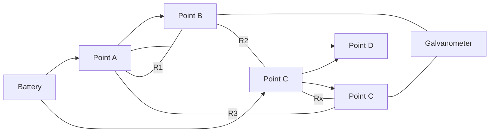

When bridge is balanced: R1/R2 = R3/Rx, so Rx = R3×(R2/R1)

**Limitations**:

- **Limited range**: Not suitable for very low or very high resistances
- **Temperature effects**: Resistance changes with temperature
- **Battery errors**: Output voltage must remain stable
- **Galvanometer sensitivity**: Limited by detector sensitivity

**Mnemonic:** "BALR - Balance is key, Adjust until null, Low/high resistances problematic, Range is limited"

## Question 1(c) [7 marks]

**Explain various transducers used for temperature measurement. Explain the construction and working of the following in detail: (i) Thermocouple (ii) Thermistor.**

**Answer**:

**Temperature Transducers Types**:

| Type | Working Principle | Range | Advantages | Disadvantages |
|------|-------------------|-------|------------|---------------|
| Thermocouple | Seebeck effect | -270°C to 2300°C | Wide range, robust | Nonlinear, reference needed |
| Thermistor | Resistance change | -50°C to 300°C | High sensitivity | Nonlinear, limited range |
| RTD | Resistance change | -200°C to 850°C | High accuracy, linear | Expensive, self-heating |
| IC Sensors | Semiconductor | -55°C to 150°C | Linear output, easy interface | Limited range |

**(i) Thermocouple**:

**Construction**: Two dissimilar metal wires (like copper-constantan or iron-constantan) joined at one end to form measuring junction and other ends connected to measuring instrument.

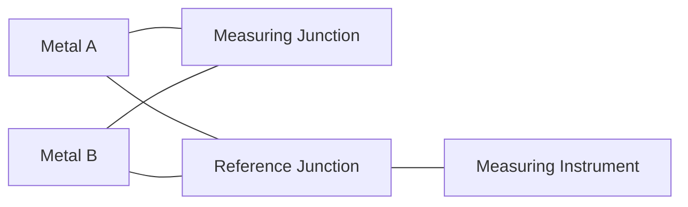

**Working**: When junctions are at different temperatures, a small voltage proportional to temperature difference is generated (Seebeck effect).

**Key Points**:

- **Seebeck effect**: Temperature difference creates voltage
- **Cold junction compensation**: Required for accuracy
- **Types**: J, K, T, E based on metal combinations

**(ii) Thermistor**:

**Construction**: A semiconductor material (metal oxides like manganese, nickel, cobalt) shaped into a bead, disk, or rod with two lead wires.

```goat
  Lead Wire        Lead Wire
      |               |
      v               v
    +-----------------+
    |   Ceramic or    |
    | Semiconductor   |
    |     Body        |
    +-----------------+
```

**Working**: Resistance decreases as temperature increases (NTC type) or increases with temperature (PTC type).

**Key Points**:

- **NTC (Negative Temperature Coefficient)**: Most common type
- **High sensitivity**: Large resistance change for small temperature change
- **Nonlinear response**: Requires linearization circuits
- **Self-heating**: Current passing through it causes heating

**Mnemonic:** "TRIP - Thermocouples React to junction differences, Thermistors Intensely change resistance, Point sensors at what you measure"

## Question 1(c) OR [7 marks]

**Explain the working principles of the following sensors: Temperature sensor, Gas sensor, Humidity sensor and Proximity sensor.**

**Answer**:

**Comparison of Sensors**:

| Sensor Type | Working Principle | Output | Applications |
|-------------|-------------------|--------|--------------|
| Temperature | Resistance/voltage change | Analog/Digital | HVAC, Medical devices |
| Gas | Chemical reaction | Resistance change | Safety systems, Air quality |
| Humidity | Capacitance/resistance change | Analog | Weather stations, HVAC |
| Proximity | Electromagnetic field disruption | Digital | Automation, Security |

**1. Temperature Sensor (LM35)**:

- **Principle**: Semiconductor junction voltage varies with temperature
- **Working**: Integrated circuit provides output voltage proportional to temperature (10mV/°C)
- **Features**: Linear output, no external calibration needed

**2. Gas Sensor (MQ-2)**:

- **Principle**: Chemical reaction between gas and sensing material
- **Working**: Gas molecules interact with metal oxide semiconductor, changing its resistance
- **Detection**: When gas concentration exceeds threshold, output voltage changes


**3. Humidity Sensor (Hygrometer)**:

- **Principle**: Capacitance or resistance varies with moisture absorption
- **Working**: Dielectric material absorbs moisture, changing electrical properties
- **Types**: Capacitive (more accurate) and resistive (simpler)

**4. Proximity Sensor**:

- **Principle**: Detects objects without physical contact
- **Working**: Emits electromagnetic field/beam; detects changes when object enters field
- **Types**: Inductive (metals), capacitive (any material), ultrasonic (distance)

**Mnemonic:** "TGHP - Temperature Generates voltage, Gas Hits semiconductors, Humidity Holds moisture, Proximity Perceives objects"

## Question 2(a) [3 marks]

**List types of DVM and mention one advantage of each.**

**Answer**:

**Types of Digital Voltmeters (DVM)**:

| DVM Type | Working Principle | Advantage |
|----------|-------------------|-----------|
| Ramp Type | Compares input with reference ramp | Simple design, low cost |
| Integrating Type | Measures average over time | Good noise rejection |
| Successive Approximation | Binary search algorithm | Fast conversion speed |
| Dual Slope | Integration with fixed time | Excellent noise rejection |

**Key Points**:

- **Ramp type**: Simple but affected by noise
- **Integrating type**: Reduces effect of periodic noise
- **Successive approximation**: Quick readings, good for changing signals
- **Dual slope**: Best accuracy, immune to most noise

**Mnemonic:** "RISD - Ramp Is Simple Design, Integrating Ignores noise, Successive Secures speed, Dual Deals with interference"

## Question 2(b) [4 marks]

**Draw and explain Maxwells's bridge.**

**Answer**:

**Maxwell's Bridge** is used to measure unknown inductance by comparing it with a standard capacitance.

**Circuit Diagram**:

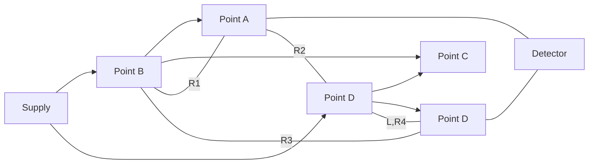

**Balance Equations**:

- Unknown inductance L = R2 × R3 × C
- Resistance R4 = R1 × (R3/R2)

**Working**:

- Bridge contains four arms with R1, R2, R3, and L,R4
- When bridge is balanced, no current flows through detector
- Values of L and R4 calculated using balance equations

**Advantages**:

- **High accuracy**: Good for medium value inductors
- **Independent balance**: Resistance and inductance balanced separately

**Mnemonic:** "MILL - Maxwell's Inductance is Like L = R2R3C, when the detector shows Lowered current"

## Question 2(c) [7 marks]

**Draw the block diagram of a Successive Approximation type Digital Voltmeter (DVM) and explain its working.**

**Answer**:

**Successive Approximation DVM** converts analog input to digital output using binary search algorithm.

**Block Diagram**:

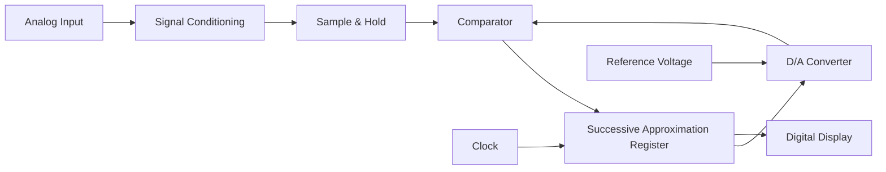

**Working**:

1. **Signal conditioning**: Scales input voltage to measurement range
2. **Sample & Hold**: Captures instantaneous input value
3. **SAR (Successive Approximation Register)**: Performs binary search
4. **DAC (Digital-to-Analog Converter)**: Converts digital value to analog
5. **Comparator**: Compares input with DAC output
6. **Digital Display**: Shows final digital value

**Example Conversion Process**:

- For 4-bit conversion of 9V (range 0-15V):
  - Try 8V (1000) → Input > 8V → Keep 1
  - Try 12V (1100) → Input < 12V → Change to 0
  - Try 10V (1010) → Input < 10V → Change to 0
  - Try 9V (1001) → Input = 9V → Keep 1
  - Result: 1001 (9V)

**Advantages**:

- **Fast conversion**: Fixed conversion time regardless of input
- **Good accuracy**: Suitable for most applications
- **Medium complexity**: Balance of performance and cost

**Mnemonic:** "SHARP - Sample, Hold, Approximate, Register stores, Present result"

## Question 2(a) OR [3 marks]

**State and explain the working principle of PMMC instruments.**

**Answer**:

**PMMC (Permanent Magnet Moving Coil)** instruments operate based on electromagnetic principles.

**Working Principle**: When current flows through a coil placed in a magnetic field, a torque is produced causing the coil to rotate proportionally to the current.

**Key Components**:

- **Permanent magnet**: Creates strong magnetic field
- **Moving coil**: Wound on aluminum frame
- **Control springs**: Provide restoring torque
- **Pointer**: Indicates reading on scale

**Diagram**:

```goat
                  N
    Spring       | |      Spring
      ↓          | |        ↓
    +=================+
    |      |=====|    |
    |      | Coil|    |
    |      |=====|    |
    |               .-|-.
    |              /     \
    |              |     |  Pointer
    |              \     /
    |               `-|-'
    +=================+
                  | |
                  S
```

**Mnemonic:** "PMMC - Permanent Magnet Makes Coil turn when Current flows"

## Question 2(b) OR [4 marks]

**Draw and explain Schering bridge.**

**Answer**:

**Schering Bridge** is used to measure capacitance and dissipation factor of a capacitor.

**Circuit Diagram**:

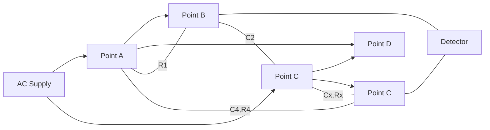

**Balance Equations**:

- Unknown capacitance Cx = C2 × (R1/R4)
- Unknown resistance Rx = R4 × (C4/C2)
- Dissipation factor D = ωCxRx = ωC4R4

**Working**:

- Contains four arms with R1, C2, Cx-Rx, and C4-R4
- When bridge is balanced, no current flows through detector
- Values of Cx and Rx calculated using balance equations

**Applications**:

- **Capacitor testing**: Measures capacitance and losses
- **Insulation testing**: Evaluates dielectric properties

**Mnemonic:** "SCAN - Schering Capacitance And taN delta measured together"

## Question 2(c) OR [7 marks]

**Draw and explain Dual slope integrating type DVM.**

**Answer**:

**Dual Slope Integrating DVM** is a type of digital voltmeter that converts analog input to digital form using integration method.

**Block Diagram**:

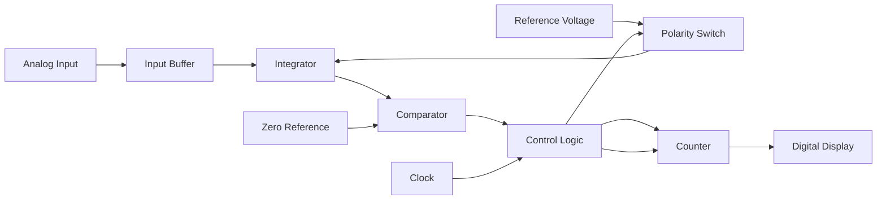

**Working Principle**:

1. **First phase** (Fixed time T1):
   - Input voltage integrated for fixed time T1
   - Output of integrator = -(1/RC)∫V(in)dt
   - Counter counts clock pulses

2. **Second phase** (Variable time T2):
   - Reference voltage of opposite polarity applied
   - Integrator output returns to zero
   - Time T2 proportional to input voltage
   - T2 = T1 × (Vin/Vref)

**Advantages**:

- **Excellent noise rejection**: Especially power line frequency (50/60 Hz)
- **High accuracy**: Depends only on reference voltage and clock stability
- **Automatic zero correction**: Self-calibrating feature

**Key Points**:

- **Integration time**: Usually multiple of power line period (20ms or 16.67ms)
- **Resolution**: Determined by clock frequency and counter capacity

**Mnemonic:** "FIRE - First Integrate input, then Integrate Reference, until Equal to zero"

## Question 3(a) [3 marks]

**What is the importance of delay line and trigger circuit in a CRO?**

**Answer**:

**Delay Line Importance**:

- **Purpose**: Delays the signal to display events that trigger the sweep
- **Function**: Allows viewing of leading edge of signal that caused trigger
- **Implementation**: Artificial transmission line with LC network or microstrip

**Trigger Circuit Importance**:

- **Purpose**: Initiates sweep at specific point on input signal
- **Function**: Ensures stable, stationary display of repetitive waveforms
- **Controls**: Level, slope, source, and coupling

**Table: Delay Line vs Trigger Circuit**:

| Component | Purpose | Benefit |
|-----------|---------|---------|
| Delay Line | Delays signal path | Shows complete waveform including trigger point |
| Trigger Circuit | Initiates sweep | Creates stable display with synchronized timing |

**Mnemonic:** "DT-SS - Delay To See Signal, Trigger Stops Screen drift"

## Question 3(b) [4 marks]

**Explain the internal structure and working of a Cathode Ray Tube (CRT) with a neat diagram.**

**Answer**:

**Cathode Ray Tube (CRT)** is the heart of an oscilloscope that converts electrical signals into visual display.

**Structure Diagram**:

```goat
       Electron Gun                Deflection System               Screen
      |------------|            |----------------|              |-------|
 +----|------------|------------|----------------|--------------|-------|----+
 |    |            |            |                |              |       |    |
 |    V            V            V                V              V       |    |
 |  +----+      +---+        +----+          +----+          +----+     |    |
 |  |Cath|      |   |        |    |          |    |          |    |     |    |
 |  |ode |----->| F |------->| VA |--------->| H  |--------->| P  |     |    |
 |  |    |      |   |        |    |    |     |Def.|    |     |Scr.|     |    |
 |  +----+      +---+        +----+    |     +----+    |     +----+     |    |
 |                                     |               |                |    |
 |                                   +----+         +----+              |    |
 |                                   |    |         |    |              |    |
 |                                   | V  |         |Flu.|              |    |
 |                                   |Def.|-------->|Scr.|              |    |
 |                                   |    |         |    |              |    |
 |                                   +----+         +----+              |    |
 |                                                                      |    |
 +----------------------------------------------------------------------+    |
      |                                                                      |
    Glass                                                               Vacuum
   Envelope
```

**Key Components**:

1. **Electron Gun**:
   - **Cathode**: Heated filament that emits electrons
   - **Control Grid**: Regulates electron beam intensity
   - **Focusing Anodes**: Concentrate electrons into beam
   - **Accelerating Anodes**: Increase electron velocity

2. **Deflection System**:
   - **Horizontal Deflection Plates**: Control X-axis movement
   - **Vertical Deflection Plates**: Control Y-axis movement

3. **Screen**:
   - **Phosphor Coating**: Glows when struck by electrons
   - **Glass Envelope**: Maintains vacuum and provides structure

**Working**:

- Heated cathode emits electrons
- Control grid regulates beam intensity (brightness)
- Focusing anodes form narrow beam
- Accelerating anodes speed up electrons
- Deflection plates bend beam horizontally and vertically
- Electron beam strikes phosphor screen, creating visible spot

**Mnemonic:** "EFADS - Electrons Fly, Anodes Direct, Screen shows signals"

## Question 3(c) [7 marks]

**Explain the working of a Cathode Ray Oscilloscope (CRO) with the help of a block diagram and describe the function of each block.**

**Answer**:

**Cathode Ray Oscilloscope (CRO)** is an electronic instrument used to visualize and analyze electrical signals.

**Block Diagram**:

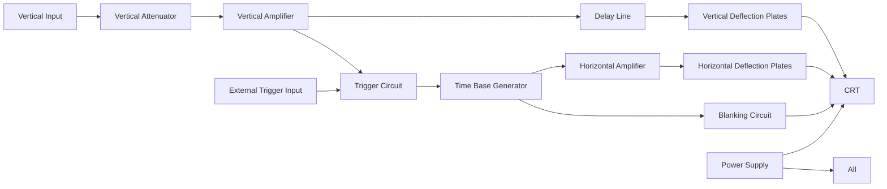

**Functions of Each Block**:

| Block | Function |
|-------|----------|
| Vertical Attenuator | Scales input signal to suitable level |
| Vertical Amplifier | Amplifies signal for deflection plates |
| Delay Line | Delays signal to see triggering event |
| Trigger Circuit | Initiates sweep at specific point |
| Time Base Generator | Creates sawtooth wave for horizontal sweep |
| Horizontal Amplifier | Amplifies sweep signal |
| Blanking Circuit | Cuts beam during retrace |
| CRT | Converts electrical signals to visual display |
| Power Supply | Provides various DC voltages |

**Working Process**:

1. **Signal Input**: Connected to vertical attenuator
2. **Vertical Processing**: Signal scaled, amplified, delayed
3. **Triggering**: Trigger circuit starts time base at specific point
4. **Horizontal Sweep**: Time base creates horizontal movement
5. **Display**: Electron beam traces signal on screen
6. **Retrace**: Beam returns quickly (blanked) for next sweep

**Controls**:

- **Vertical**: Volts/div, position, coupling
- **Horizontal**: Time/div, position
- **Trigger**: Level, slope, source, mode

**Mnemonic:** "VATH-CDS - Vertical Attenuates Then amplifies, Horizontal Creates Deflection Sweep"

## Question 3(a) OR [3 marks]

**Give the differences between Cathode Ray Oscilloscope (CRO) and Digital Storage Oscilloscope (DSO).**

**Answer**:

**Comparison between CRO and DSO**:

| Parameter | Cathode Ray Oscilloscope (CRO) | Digital Storage Oscilloscope (DSO) |
|-----------|--------------------------------|-----------------------------------|
| Signal Processing | Analog | Digital (ADC conversion) |
| Storage Capability | None (real-time only) | Can store waveforms in memory |
| Bandwidth | Limited by CRT technology | Higher bandwidth possible |
| Display | Phosphor screen | LCD/LED screen |
| Additional Features | Basic measurements | Advanced analysis, FFT, math functions |

**Key Differences**:

- **Waveform Storage**: DSO can save waveforms, CRO cannot
- **Signal Processing**: DSO converts analog to digital, CRO is purely analog
- **Pre-trigger Display**: DSO can show events before trigger
- **Analysis Features**: DSO offers measurements, math functions, FFT

**Mnemonic:** "DSO-MAPS - Digital Storage Oscilloscope Measures, Analyzes, Processes, Stores signals"

## Question 3(b) OR [4 marks]

**Explain how frequency and phase angle can be determined with the help of CRO.**

**Answer**:

**Frequency Measurement on CRO**:

**Method**:

1. Display signal on screen
2. Measure time period (T) using horizontal time/div setting
3. Calculate frequency: f = 1/T

**Example Calculation**:

- If 3 cycles span 6 divisions at 0.5ms/div
- Time for 3 cycles = 6 div × 0.5ms/div = 3ms
- Time for 1 cycle (T) = 3ms ÷ 3 = 1ms
- Frequency (f) = 1/T = 1/1ms = 1kHz

**Phase Angle Measurement**:

**Method**:

1. Display both signals on dual channel
2. Measure time difference (Δt) between corresponding points
3. Measure time period (T) of complete cycle
4. Calculate phase difference: φ = (Δt/T) × 360°

**Diagram**:

```goat
    Voltage
       ^
       |
       |    Signal 1      Signal 2
       |       /\           /\
       |      /  \         /  \
       |     /    \       /    \
       |----/------\-----/------\-----> Time
       |   /        \   /        \
       |  /          \ /          \
       | /            V            \
       |/                           \
       +----------------------------->
           |<--Δt-->|
           |<-------T-------->|
```

**Calculation**:

- If Δt = 1 div at 0.2ms/div, and T = 5 div at 0.2ms/div
- Δt = 0.2ms and T = 1ms
- Phase difference: φ = (0.2ms/1ms) × 360° = 72°

**Mnemonic:** "FPL - Frequency = Period's Length reciprocal, Phase = (Lag/Period) × 360"

## Question 3(c) OR [7 marks]

**Draw the block diagram of a Digital Storage Oscilloscope (DSO) and explain the function of each block.**

**Answer**:

**Digital Storage Oscilloscope (DSO)** converts analog signals to digital form for storage and analysis.

**Block Diagram**:

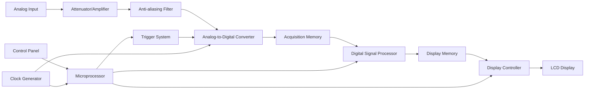

**Functions of Each Block**:

| Block | Function |
|-------|----------|
| Attenuator/Amplifier | Conditions input signal to ADC range |
| Anti-aliasing Filter | Removes high frequencies to prevent aliasing |
| ADC | Converts analog signal to digital samples |
| Acquisition Memory | Stores digitized waveform data |
| Digital Signal Processor | Performs mathematical operations on signals |
| Display Memory | Stores processed data for display |
| Display Controller | Controls screen update and format |
| Microprocessor | Controls overall operation and user interface |
| Trigger System | Determines when to start data acquisition |
| Clock Generator | Provides timing for sampling and processing |

**Advantages of DSO**:

- **Single-shot capture**: Can capture transient events
- **Pre-trigger viewing**: Shows signal before trigger point
- **Waveform storage**: Saves signals for later analysis
- **Advanced measurements**: Automated amplitude, timing, etc.
- **Mathematical functions**: Addition, FFT, integration, etc.

**Working Process**:

1. Input signal conditioned by attenuator/amplifier
2. Signal filtered to prevent aliasing
3. ADC samples signal at regular intervals
4. Digital data stored in acquisition memory
5. Processor analyzes and prepares data for display
6. Display shows waveform and measurements

**Mnemonic:** "AADPD - Attenuate Analog, Digitize, Process, Display the signal"

## Question 4(a) [3 marks]

**Give the classification of different types of transducers.**

**Answer**:

**Classification of Transducers**:

| Classification Basis | Types |
|----------------------|-------|
| Principle of Operation | Mechanical, Electrical, Thermal, Optical, Chemical |
| Input/Output Relationship | Primary, Secondary |
| Signal Generation | Active, Passive |
| Electrical Parameters | Resistive, Capacitive, Inductive |
| Transduction | Photoelectric, Electrochemical, Thermoelectric |

**Primary Classification**:

1. **Based on Energy Conversion**:
   - **Active Transducers**: Generate electrical output without external power (e.g., thermocouple)
   - **Passive Transducers**: Require external power (e.g., thermistor)

2. **Based on Principle of Operation**:
   - **Primary Transducers**: Convert physical change directly to electrical signal
   - **Secondary Transducers**: Require intermediate conversion

**Mnemonic:** "APRCI - Active/Passive, Resistive/Capacitive/Inductive are key categories"

## Question 4(b) [4 marks]

**Explain the construction and working of a strain gauge.**

**Answer**:

**Strain Gauge** converts mechanical strain (deformation) into electrical resistance change.

**Construction**:

- **Grid Pattern**: Thin foil or wire in zigzag pattern
- **Backing Material**: Polyimide or epoxy carrier
- **Lead Wires**: Connected to measurement circuit
- **Adhesive**: Bonds gauge to test surface

**Diagram**:

```goat
   Lead Wire                Lead Wire
      |                        |
      v                        v
    +----------------------------+
    |                            |  Backing
    |   +--------------------+   |  Material
    |   | /\/\/\/\/\/\/\/\/\ |   |
    |   | \                / |   |
    |   |  \    Grid     /   |   |
    |   |   \   Pattern /    |   |
    |   |    \/\/\/\/\/      |   |
    |   +--------------------+   |
    |                            |
    +----------------------------+
```

**Working Principle**:

- Based on piezoresistive effect
- When object deforms, gauge deforms
- Deformation changes resistance per formula:
  - ΔR/R = GF × ε
  - Where GF = Gauge Factor, ε = Strain

**Measurement Circuit**:

- Usually connected in Wheatstone bridge
- Converts small resistance change to voltage
- Output voltage proportional to strain

**Applications**:

- Load cells, pressure sensors
- Structural testing
- Mechanical stress analysis

**Mnemonic:** "GRID - Gauge Resistance Increases with Deformation"

## Question 4(c) [7 marks]

**Explain the Linear Variable Differential Transducer (LVDT) with its construction, working, advantages, and applications.**

**Answer**:

**Linear Variable Differential Transformer (LVDT)** is an electromechanical sensor that converts linear displacement into electrical signal.

**Construction**:

- **Primary Coil**: Central winding excited by AC source
- **Secondary Coils**: Two identical coils on either side
- **Core**: Ferromagnetic material that moves with displacement
- **Housing**: Cylindrical shell with terminals

**Diagram**:

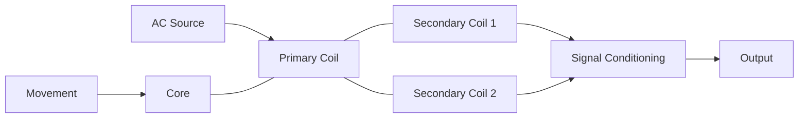

**Working Principle**:

- AC voltage applied to primary coil
- Magnetic flux couples to secondary coils
- Core position determines coupling efficiency
- Voltage differential between secondaries ∝ displacement
- At null position (center), secondary voltages are equal and opposite


**Characteristic Curve**:

```goat
     Output
       ^
       |                Secondary Voltages
       |                     /
       |                    /
       |                   /
       |                  /
       |                 /
       |----------------/-----------------> Displacement
       |               /
       |              /
       |             /
     --|------------/----
       |           /
  Null Position
```

**Advantages**:

- **Frictionless operation**: No mechanical contact
- **Infinite resolution**: Analog output
- **High linearity**: Direct proportional output
- **Ruggedness**: Resistant to shock and vibration
- **Long life**: No wearing parts

**Applications**:

- **Industrial**: Automated machine tools, robotics
- **Aerospace**: Flight control systems
- **Civil Engineering**: Structural testing
- **Metrology**: Precision measurement instruments

**Mnemonic:** "LVDT-MAPS - Linear Variable Differential Transformer Measures Accurately Position by Secondary voltage differences"

## Question 4(a) OR [3 marks]

**State any three uses of PH sensors.**

**Answer**:

**Uses of PH Sensors**:

| Application | Purpose | Importance |
|-------------|---------|------------|
| Water Treatment | Monitor and control water quality | Ensures safe drinking water |
| Agriculture | Soil monitoring for optimal plant growth | Increases crop yield |
| Medical Diagnostics | Measuring body fluid acidity | Critical for patient health |

**Additional Applications**:

- **Food Processing**: Quality control during production
- **Aquaculture**: Maintaining optimal water conditions
- **Chemical Manufacturing**: Process control

**Mnemonic:** "WAM - Water quality control, Agriculture soil testing, Medical diagnostics are key PH sensor applications"

## Question 4(b) OR [4 marks]

**Explain the construction and working of a capacitive transducer.**

**Answer**:

**Capacitive Transducer** converts physical change into capacitance variation which is measured electrically.

**Construction**:

- **Parallel Plates**: Two conductive plates
- **Dielectric Medium**: Air, ceramic, or other material
- **Housing**: Protective enclosure
- **Terminals**: Electrical connections

**Diagram**:

```goat
    Terminal A             Terminal B
        |                     |
        v                     v
    +----------+         +----------+
    |          |         |          |
    |  Plate A |         |  Plate B |
    |          |<------->|          |
    |          |    d    |          |
    +----------+         +----------+
           |                 |
           |    Dielectric   |
           |     Material    |
           |                 |
    +--------------------------+
    |        Housing           |
    +--------------------------+
```

**Working Principle**:

- Capacitance C = ε₀εᵣA/d
  - ε₀ = Permittivity of free space
  - εᵣ = Relative permittivity of dielectric
  - A = Area of plates
  - d = Distance between plates

**Types of Variation**:

1. **Area variation**: Changing overlap of plates
2. **Distance variation**: Changing separation between plates
3. **Dielectric variation**: Changing dielectric material

**Applications**:

- **Pressure sensors**: Diaphragm changes plate distance
- **Level sensors**: Dielectric changes with fluid level
- **Humidity sensors**: Dielectric changes with moisture
- **Proximity sensors**: Distance changes with object presence

**Mnemonic:** "CAD - Capacitance changes with Area, Distance, or Dielectric variations"

## Question 4(c) OR [7 marks]

**Describe absolute optical encoder and its A, B, C waveform outputs with proper illustration.**

**Answer**:

**Absolute Optical Encoder** directly measures angular position by generating a unique digital code for each position.

**Construction**:

- **Code Disc**: Contains concentric tracks with transparent/opaque sectors
- **Light Source**: LED array illuminating the disc
- **Photo Detectors**: Sensors detecting light through disc patterns
- **Signal Conditioning**: Converts photodetector signals to digital outputs

**Diagram**:

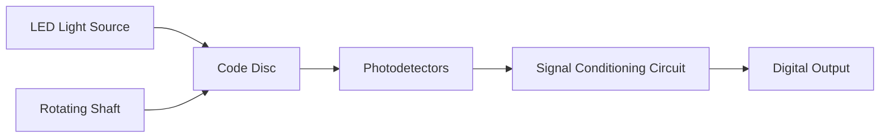

**Code Disc Pattern**:

```goat
          Track C (Index)
            |
     -------|-----------------
            |
          --+--  --+--  --+--
           Track B
     -------|-----------------
            |
          -++--  -++--  -++--
           Track A
     -------|-----------------
            |
          -+++- -+++- -+++- -
     -------|-----------------
            |
            V
          Rotation
```

**Waveform Outputs**:

| Signal | Purpose | Characteristics |
|--------|---------|-----------------|
| A Signal | Position information | Square wave, 50% duty cycle |
| B Signal | Direction information | 90° phase shifted from A |
| C Signal | Reference/index | Single pulse per revolution |

**Output Waveforms**:

```goat
    A Signal  _____|‾‾‾‾‾|_____|‾‾‾‾‾|_____|‾‾‾‾‾|_____|‾‾‾‾‾|_____
    
    B Signal  __|‾‾‾‾‾|_____|‾‾‾‾‾|_____|‾‾‾‾‾|_____|‾‾‾‾‾|_____|‾‾
    
    C Signal  _____|‾|_________________________________________________
              
              0°    90°   180°   270°   360°   450°   540°   630°   720°
```

**Working principle**:

- A & B output provides quadrature signals (90° out of phase)
- Direction determined by which signal leads:
  - If A leads B: Clockwise rotation
  - If B leads A: Counter-clockwise rotation
- Position determined by counting pulses
- C signal provides reference/home position

**Applications**:

- **CNC machines**: Precise position control
- **Robotics**: Joint angle measurement
- **Camera systems**: Lens positioning
- **Industrial automation**: Motor control

**Mnemonic:** "ABC-PDP - Absolute encoder tracks A, B, C Provide Direction, Position, and reference pulse"

## Question 5(a) [3 marks]

**Describe the working principle of a basic frequency counter.**

**Answer**:

**Frequency Counter** measures frequency of an input signal by counting events over a precise time interval.

**Working Principle**:

- Count number of cycles/pulses of input signal
- Divide by the precise gate time
- Display resulting frequency

**Basic Blocks**:

- **Input Conditioning**: Shapes signal to digital levels
- **Gate Control**: Opens gate for precise time
- **Counter**: Counts pulses during gate open time
- **Time Base**: Generates precise gate timing
- **Display**: Shows frequency value

**Simplified Diagram**:

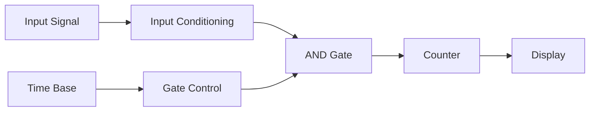

**Mnemonic:** "CTPG - Count The Pulses, Gate the time"

## Question 5(b) [4 marks]

**Draw the diagram of an energy meter and explain its working principle.**

**Answer**:

**Electronic Energy Meter** measures electrical energy consumption in kilowatt-hours (kWh).

**Block Diagram**:

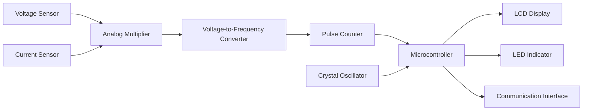

**Working Principle**:

- Energy = Power × Time
- Power = Voltage × Current
- Voltage and current sensed separately
- Multiplied to get instantaneous power
- Integrated over time to get energy
- Pulses generated proportional to energy
- Each pulse represents fixed energy unit
- Counter accumulates pulses
- Display shows accumulated energy

**Features**:

- **Tamper detection**: Prevents electricity theft
- **Multiple tariffs**: Different rates for different times
- **Communication**: Remote reading capability

**Mnemonic:** "VCPI - Voltage and Current are multiplied, Pulses Indicate energy used"

## Question 5(c) [7 marks]

**Briefly explain the working principle and functions of a function generator. Describe its front panel controls and explain how it is used to test electronic circuits with suitable examples.**

**Answer**:

**Function Generator** is an electronic test instrument that generates different waveforms with adjustable frequency and amplitude.

**Working Principle**:

- Generates base signal using oscillator circuit
- Shapes waveform using wave-shaping circuits
- Adjusts amplitude, frequency, and offset parameters
- Outputs waveform through buffer amplifier

**Block Diagram**:

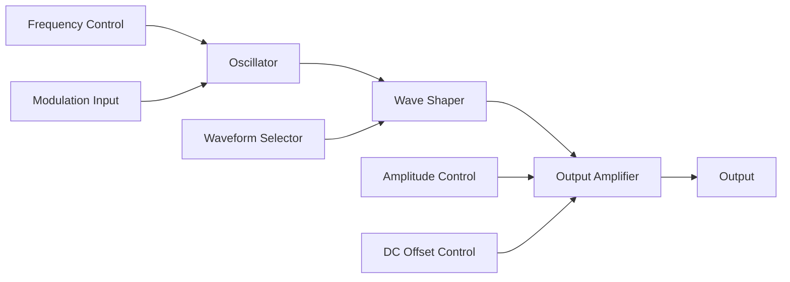

**Front Panel Controls**:

| Control | Function | Typical Range |
|---------|----------|---------------|
| Frequency | Sets signal frequency | 0.1 Hz - 20 MHz |
| Amplitude | Sets signal amplitude | 0 - 20 Vpp |
| DC Offset | Adds DC voltage | ±10V |
| Waveform Select | Chooses waveform type | Sine, Triangle, Square, Pulse |
| Duty Cycle | Adjusts pulse width | 10% - 90% |
| Modulation | AM/FM modulation | Internal/External |

**Output Waveforms**:

```goat
    Sine      /\      /\      /\
             /  \    /  \    /  \
    _______ /    \__/    \__/    \__
    
    Square   ______      ______
            |      |    |      |
    ________|      |____|      |____
    
    Triangle  /\      /\      /\
             /  \    /  \    /  \
    ________/    \__/    \__/    \__
    
    Pulse     __        __        __
             |  |      |  |      |  |
    _________|  |______|  |______|  |_
```

**Circuit Testing Applications**:

| Application | Waveform Used | Purpose |
|-------------|---------------|---------|
| Amplifier Testing | Sine wave | Gain, frequency response |
| Digital Circuit Testing | Square wave | Logic timing, thresholds |
| Filter Testing | Sine sweep | Cutoff frequency, response |
| Triggering Circuits | Pulse | Threshold testing |

**Example: Testing Amplifier**

1. Connect function generator to amplifier input
2. Set sine wave of appropriate amplitude
3. Vary frequency to test frequency response
4. Monitor output on oscilloscope
5. Calculate gain = Output amplitude / Input amplitude

**Mnemonic:** "FAWOD - Frequency, Amplitude, Waveform, Offset, Duty cycle are key controls"

## Question 5(a) OR [3 marks]

**Describe the working of a spectrum analyzer.**

**Answer**:

**Spectrum Analyzer** measures signal amplitude versus frequency, showing frequency components of signals.

**Working Principle**:

- Converts time-domain signals to frequency-domain
- Shows spectral components and their amplitudes
- Uses superheterodyne receiver architecture
- Sweeps local oscillator to analyze frequency range

**Block Diagram**:

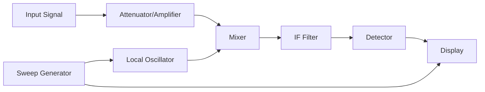

**Applications**:

- **Signal analysis**: Measuring harmonics, distortion
- **EMI testing**: Finding interference sources
- **Communications**: Channel analysis, modulation quality

**Mnemonic:** "SAME - Spectrum Analyzer Maps signal Energy across frequencies"

## Question 5(b) OR [4 marks]

**Draw a neat diagram of a clamp-on meter and explain its working.**

**Answer**:

**Clamp-on Meter** (Current Clamp) is a non-contact device for measuring AC/DC current.

**Construction Diagram**:

```goat
         Display
         .------.
        /        \
       /  120.5A  \    Function
      /            \    Selector
     |   O |--|     |  .----.
     |     |  |     |  |    |
     |     |  |     |--'    |
     |     |  |     |       |
     |     |  |     |       |
     |     '--'     |       |
      \   Trigger   /       |
       \           /        |
        |         |        /
        |         |       /
        |         |      /
        `---------´     /
             |         /
           Clamp      /
             |       /
            /       /
           /       /
          /       /
         `-______´
         Test Leads
```

**Working Principle**:

- Based on electromagnetic induction (Faraday's Law)
- Current-carrying conductor creates magnetic field
- Clamp's ferromagnetic core concentrates field
- Secondary coil in the clamp induces proportional voltage
- Circuit converts induced voltage to current reading

**Advantages**:

- **Non-contact**: No need to disconnect circuit
- **Safety**: Isolation from high voltages
- **Convenience**: Easy to use in confined spaces

**Applications**:

- **Electrical maintenance**: Motor current, load testing
- **Power quality**: Measuring power factor, harmonics
- **Troubleshooting**: Finding unbalanced loads

**Mnemonic:** "CLIP - Clamp measures current, Lets magnetic Induction Produce voltage"

## Question 5(c) OR [7 marks]

**Explain the working principle of a digital IC tester. Describe its block diagram and explain how it is used to test the functionality of digital ICs with a suitable example.**

**Answer**:

**Digital IC Tester** verifies functionality of digital integrated circuits by applying test patterns and comparing responses.

**Working Principle**:

- Applies predefined test vectors to IC pins
- Compares actual outputs with expected outputs
- Identifies faulty ICs or incorrect functions
- Tests multiple IC types using stored test patterns

**Block Diagram**:

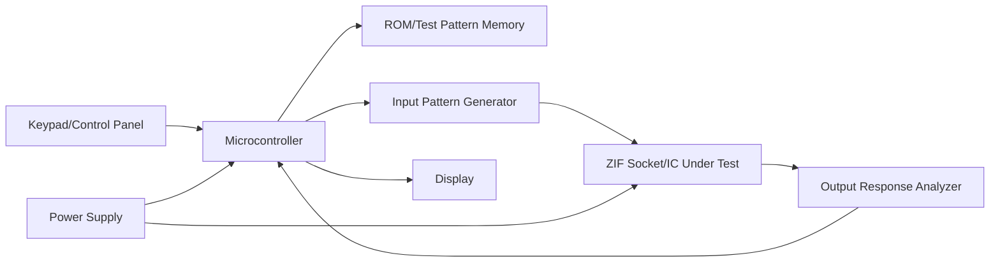

**Major Components**:

- **ZIF Socket**: Zero Insertion Force socket for easy IC placement
- **Test Pattern Memory**: Stores test vectors for various ICs
- **Output Response Analyzer**: Compares actual vs. expected outputs
- **Microcontroller**: Controls testing sequence and evaluation
- **Display**: Shows test results and status

**Testing Method**:

| Step | Action | Purpose |
|------|--------|---------|
| 1 | Select IC type | Load correct test parameters |
| 2 | Insert IC in ZIF socket | Prepare for testing |
| 3 | Start test | Begin test sequence |
| 4 | Apply test vectors | Exercise IC functions |
| 5 | Compare responses | Identify errors |
| 6 | Display results | Show pass/fail status |

**Example: Testing 7400 NAND Gate IC**:

1. Select "7400" from IC list
2. Insert IC in ZIF socket
3. Tester applies all input combinations:
   - Input 1A=0, 1B=0 → Expected output 1Y=1
   - Input 1A=0, 1B=1 → Expected output 1Y=1
   - Input 1A=1, 1B=0 → Expected output 1Y=1
   - Input 1A=1, 1B=1 → Expected output 1Y=0
4. Repeat for all gates in package (7400 has 4 NAND gates)
5. Compare actual outputs to expected truth table
6. Display "PASS" if all tests succeed, or error code if failure

**Features of Modern IC Testers**:

- **Auto-identification**: Detects unknown ICs
- **Learning mode**: Creates test patterns for new ICs
- **Functional testing**: Tests in-circuit operation
- **Parameter testing**: Checks timing, voltage margins

**Mnemonic:** "TEST - Test patterns Exercise all States, Then verify outputs"

```goat
  Lead Wire        Lead Wire
      |               |
      v               v
    +-----------------+
    |   Ceramic or    |
    | Semiconductor   |
    |     Body        |
    +-----------------+
```

**Working**: Resistance decreases as temperature increases (NTC type) or increases with temperature (PTC type).

**Key Points**:

- **NTC (Negative Temperature Coefficient)**: Most common type
- **High sensitivity**: Large resistance change for small temperature change
- **Nonlinear response**: Requires linearization circuits
- **Self-heating**: Current passing through it causes heating

**Mnemonic:** "TRIP - Thermocouples React to junction differences, Thermistors Intensely change resistance, Point sensors at what you measure"
