## પ્રશ્ન 1(a) [3 ગુણ]

**મૂળભૂત Q-મીટરની કામગીરી દોરો અને સમજાવો.**

**જવાબ**:
Q-મીટર એ સાધન છે જે ઇન્ડક્ટર અથવા કેપેસિટરના ક્વોલિટી ફેક્ટર (Q)ને માપે છે.

**આકૃતિ:**

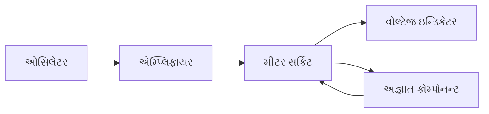

- **ઓસિલેટર**: ચલિત આવૃત્તિનું સિગ્નલ ઉત્પન્ન કરે છે
- **એમ્પ્લિફાયર**: સિગ્નલને જરૂરી સ્તર સુધી વધારે છે
- **રેઝોનન્સ સર્કિટ**: પરીક્ષણ હેઠળના ઘટકને ધરાવે છે
- **વોલ્ટેજ ઇન્ડિકેટર**: ઘટક પર વોલ્ટેજ માપે છે

**મેમરી ટ્રીક:** "OARV - ઓસિલેટ, એમ્પ્લિફાય, રેઝોનેટ, વ્યુ"

## પ્રશ્ન 1(b) [4 ગુણ]

**સ્પેક્ટ્રમ એનાલાઇઝર ટૂંકમાં સમજાવો.**

**જવાબ**:
સ્પેક્ટ્રમ એનાલાઇઝર એ સાધનની સંપૂર્ણ આવૃત્તિ શ્રેણીની અંદર ઇનપુટ સિગ્નલના મેગ્નિટ્યુડને આવૃત્તિની સામે માપે છે.

**આકૃતિ:**

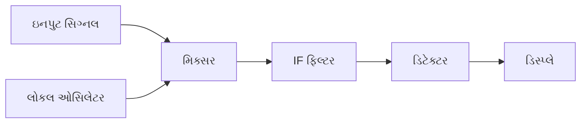

- **ઇનપુટ સિગ્નલ પ્રોસેસિંગ**: સિગ્નલ એટેન્યુએટર અને ફિલ્ટર દ્વારા પ્રવેશે છે
- **ફ્રિક્વન્સી ડોમેન કન્વર્ઝન**: ટાઇમ ડોમેનને ફ્રિક્વન્સી ડોમેનમાં રૂપાંતરિત કરે છે
- **ડિસ્પ્લે સિસ્ટમ**: એમ્પ્લિટ્યુડ vિરુદ્ધ આવૃત્તિ પ્લોટ બતાવે છે
- **એપ્લિકેશન**: સિગ્નલ એનાલિસિસ, ડિસ્ટોર્શન મેઝરમેન્ટ, EMI ટેસ્ટિંગ

**મેમરી ટ્રીક:** "SAME-FD: સિગ્નલ એનાલિસિસ મેઝર્સ એવરીથિંગ ઇન ફ્રિક્વન્સી ડોમેન"

## પ્રશ્ન 1(c) [7 ગુણ]

**સર્કિટ ડાયાગ્રામ વડે વ્હીટસ્ટોન બ્રિજ સમજાવો. તેના ફાયદા અને ગેરફાયદાની યાદી આપો.**

**જવાબ**:
વ્હીટસ્ટોન બ્રિજ એ અજ્ઞાત રેસિસ્ટન્સને ઉચ્ચ ચોકસાઈથી માપવા માટે વપરાય છે.

**આકૃતિ:**

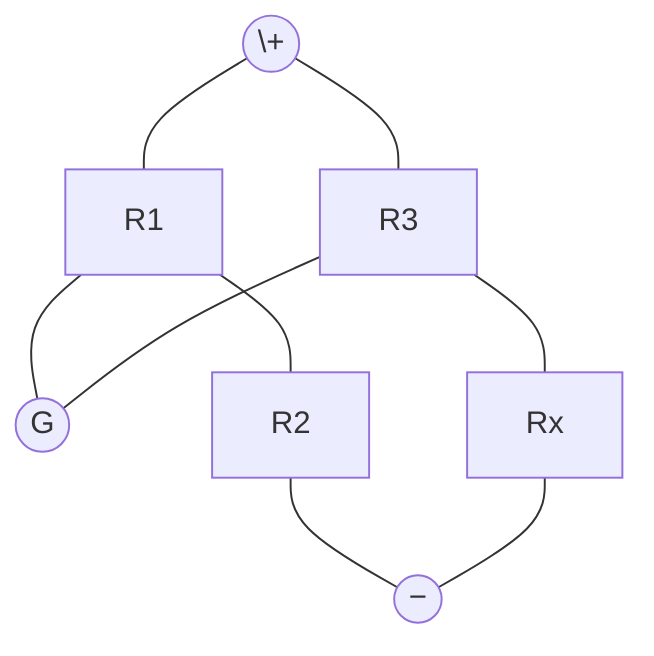

જ્યાં:

- R1, R2, R3 એ જાણીતા રેસિસ્ટન્સ છે
- Rx અજ્ઞાત રેસિસ્ટન્સ છે
- G ગેલ્વેનોમીટર છે

**કાર્ય સિદ્ધાંત**: 

- બ્રિજ સંતુલિત થાય છે જ્યારે R1/R2 = R3/Rx
- સંતુલન પર, ગેલ્વેનોમીટર મારફતે કોઈ વિદ્યુત પ્રવાહ વહેતો નથી
- અજ્ઞાત રેસિસ્ટન્સ Rx = R3(R2/R1)

| ફાયદા | ગેરફાયદા |
|------------|---------------|
| ઉચ્ચ ચોકસાઈ | મર્યાદિત શ્રેણી |
| સારી સંવેદનશીલતા | તાપમાન અસરો |
| નલ પ્રકારનું માપન | સંતુલન સમાયોજન જરૂરી |
| કેલિબ્રેટેડ મીટરની જરૂર નથી | ખૂબ ઓછા/ઉચ્ચ રેસિસ્ટન્સ માટે યોગ્ય નથી |

**મેમરી ટ્રીક:** "BARN - બેલેન્સ અચીવ્ડ વ્હેન રેશિયોઝ આર નલ"

## પ્રશ્ન 1(c) OR [7 ગુણ]

**સાધનને વ્યાખ્યાયિત કરો અને તેની લાક્ષણિકતાઓ સમજાવો.**

**જવાબ**:
સાધન એ એક ઉપકરણ છે જે ભૌતિક જથ્થાઓને માપવા, પ્રદર્શિત કરવા અથવા રેકોર્ડ કરવા માટે વપરાય છે.

| લાક્ષણિકતાઓ | વર્ણન |
|----------------|-------------|
| **ચોકસાઈ** | માપનની સાચા મૂલ્ય સાથેની નિકટતા |
| **પ્રિસિઝન** | માપણીની પુનરાવર્તિતા |
| **રિઝોલ્યુશન** | નાનામાં નાનો ફેરફાર જે શોધી શકાય છે |
| **સંવેદનશીલતા** | ઇનપુટ સિગ્નલ ફેરફારમાં આઉટપુટ સિગ્નલનો ગુણોત્તર |
| **લિનિયરતા** | ઇનપુટ અને આઉટપુટ વચ્ચે પ્રમાણસર સંબંધ |
| **રેન્જ** | લઘુત્તમથી મહત્તમ માપી શકાય તેવા મૂલ્યો |
| **પ્રતિસાદ સમય** | સાચું વાચન બતાવવા માટે જરૂરી સમય |

**આકૃતિ:**

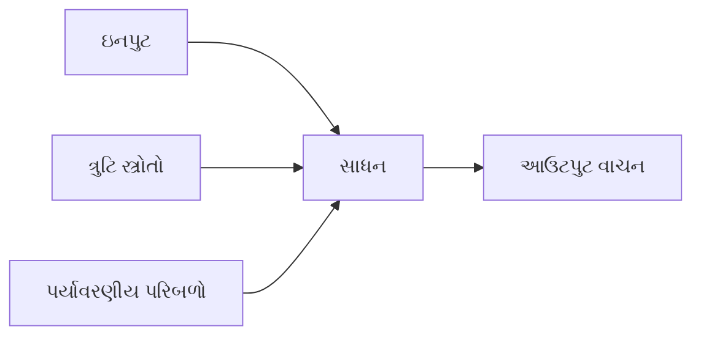

- **સ્થિર લાક્ષણિકતાઓ**: ગુણધર્મો જે સમય સાથે બદલાતા નથી
- **ગતિશીલ લાક્ષણિકતાઓ**: ગુણધર્મો જે સમય સાથે બદલાય છે

**મેમરી ટ્રીક:** "APRS-LRR: એક્યુરસી એન્ડ પ્રિસિઝન, રિઝોલ્યુશન એન્ડ સેન્સિટિવિટી, લિનિયારિટી, રેન્જ, રિસ્પોન્સ ટાઇમ"

## પ્રશ્ન 2(a) [3 ગુણ]

**એનર્જી મીટરનું બાંધકામ ડાયાગ્રામ દોરો.**

**જવાબ**:
એનર્જી મીટર કિલોવોટ-કલાકમાં વીજળી ઊર્જાનો વપરાશ માપે છે.

**આકૃતિ:**

```goat
                   +-------+
                   | Meter |
                   | Dial  |
                   +-------+
                       |
                    +-----+
                    |Brake|
                    |Disc |
                    +-----+
                    /     \
                   /       \
           +-------+         +-------+
           |Current|         |Voltage|
           |Coil   |         |Coil   |
           +-------+         +-------+
           
```

- **ફરતી એલ્યુમિનિયમ ડિસ્ક**: પાવરના પ્રમાણમાં ખસે છે
- **કરંટ કોઇલ**: કરંટના પ્રમાણમાં ચુંબકીય પ્રવાહ બનાવે છે
- **વોલ્ટેજ કોઇલ**: વોલ્ટેજના પ્રમાણમાં ચુંબકીય પ્રવાહ બનાવે છે
- **કાયમી ચુંબક**: બ્રેકિંગ ટોર્ક પૂરો પાડે છે

**મેમરી ટ્રીક:** "DVCP: ડિસ્ક વેલોસિટી મેઝર્સ કન્ઝ્યુમ્ડ પાવર"

## પ્રશ્ન 2(b) [4 ગુણ]

**ટૂંકમાં PMMC ની કામગીરી સમજાવો.**

**જવાબ**:
PMMC (પર્મેનન્ટ મેગ્નેટ મૂવિંગ કોઇલ) એ વિવિધ મીટરોમાં વપરાતી મૂળભૂત પદ્ધતિ છે.

**આકૃતિ:**

```goat
      +-------+
      |       |
    S |  Coil | N
      |       |
      +-------+
      |Spring |
      +-------+
        Pointer
```

| ઘટક | કાર્ય |
|-----------|----------|
| કાયમી ચુંબક | મજબૂત ચુંબકીય ક્ષેત્ર બનાવે છે |
| ફરતી કોઇલ | માપવાના કરંટને વહન કરે છે |
| સ્પ્રિંગ | નિયંત્રિત ટોર્ક પૂરો પાડે છે |
| પોઇન્ટર | સ્કેલ પર વાચન દર્શાવે છે |

- **વિક્ષેપણ સિદ્ધાંત**: જ્યારે કોઇલમાંથી વિદ્યુત પ્રવાહ વહે છે, ત્યારે તે કરંટના પ્રમાણમાં ટોર્ક ઉત્પન્ન કરે છે
- **ફાયદા**: લીનિયર સ્કેલ, ઉચ્ચ ચોકસાઈ, ઓછો વીજળી વપરાશ

**મેમરી ટ્રીક:** "CODA: કરંટ થ્રુ કોઇલ કોઝિસ ડિફ્લેક્શન બાય એટ્રેક્શન"

## પ્રશ્ન 2(c) [7 ગુણ]

**1- 1 એમ્પીયર સુધીની મૂવિંગ કોઇલ એમીટર રીડિંગ 0.02 ઓહ્મનો પ્રતિકાર ધરાવે છે. 100 એમ્પીયર સુધીનો કરંટ વાંચવા માટે આ સાધન કેવી રીતે અપનાવી શકાય?**

**2- મૂવિંગ કોઇલ વોલ્ટમીટર 20 mV સુધીનું રીડિંગ 2 ઓહ્મનું પ્રતિકાર ધરાવે છે. 300 વોલ્ટ સુધીના વોલ્ટેજને વાંચવા માટે આ સાધનને કેવી રીતે અપનાવી શકાય?**

**જવાબ**:

**1. એમીટર રેન્જ એક્સટેન્શન:**

**આકૃતિ:**

```goat
    I = 100A
    +-----------+
    |           |
    +--+     +--+
       |     |
       |     |
     +-+-+ +-+-+
     |Rm | |Rs |
     +-+-+ +-+-+
       |     |
       |     |
    +--+     +--+
    |           |
    +-----------+
```

- **શન્ટ રેસિસ્ટન્સ ગણતરી**: Rs = Rm × Im/(I - Im)
- **આપેલ છે**: Rm = 0.02Ω, Im = 1A, I = 100A
- **ઉકેલ**: Rs = 0.02 × 1/(100 - 1) = 0.02/99 = 0.000202Ω

**2. વોલ્ટમીટર રેન્જ એક્સટેન્શન:**

**આકૃતિ:**

```goat
    +----Rs----+
    |          |
    |    +--+  |
    +----+Rm+--+
         +--+
          V
```

- **સીરીઝ રેસિસ્ટન્સ ગણતરી**: Rs = Rm × (V/Vm - 1)
- **આપેલ છે**: Rm = 2Ω, Vm = 20mV, V = 300V
- **ઉકેલ**: Rs = 2 × (300/0.02 - 1) = 2 × (15000 - 1) = 2 × 14999 = 29,998Ω

**મેમરી ટ્રીક:** "SHIP: શન્ટ હેઝ ઇન્વર્સ પ્રોપોર્શન ફોર કરંટ; સીરીઝ ફોર વોલ્ટેજ"

## પ્રશ્ન 2(a) OR [3 ગુણ]

**ઇલેક્ટ્રોનિક મલ્ટિમીટરની કામગીરી સમજાવો.**

**જવાબ**:
ઇલેક્ટ્રોનિક મલ્ટિમીટર ઇલેક્ટ્રોનિક ઘટકોનો ઉપયોગ કરીને અનેક ઇલેક્ટ્રિકલ પેરામીટર્સ માપે છે.

**આકૃતિ:**

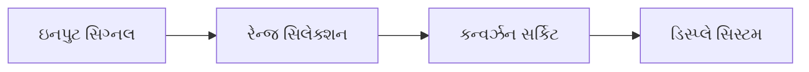

- **રેન્જ સિલેક્શન**: યોગ્ય માપન શ્રેણી પસંદ કરે છે
- **સિગ્નલ કન્ડિશનિંગ**: ઇનપુટને પ્રમાણસર વોલ્ટેજમાં રૂપાંતરિત કરે છે
- **ADC**: એનાલોગને પ્રદર્શન માટે ડિજિટલમાં રૂપાંતરિત કરે છે
- **ડિજિટલ ડિસ્પ્લે**: માપેલું મૂલ્ય બતાવે છે

**મેમરી ટ્રીક:** "RSAD: રેન્જ સિલેક્ટ, એમ્પ્લિફાય, ડિજિટાઇઝ"

## પ્રશ્ન 2(b) OR [4 ગુણ]

**મૂવિંગ આયર્ન પ્રકારના સાધનોની કામગીરી સમજાવો.**

**જવાબ**:
મૂવિંગ આયર્ન ઇન્સ્ટ્રુમેન્ટ્સ ચુંબકીય આકર્ષણ/પ્રતિકર્ષણના આધારે AC/DC કરંટ અને વોલ્ટેજ માપે છે.

| પ્રકાર | કાર્ય સિદ્ધાંત |
|-------|-------------------|
| એટ્રેક્શન ટાઇપ | લોખંડનો ટુકડો ઇલેક્ટ્રોમેગ્નેટ તરફ આકર્ષાય છે |
| રીપલ્શન ટાઇપ | બે લોખંડના ટુકડા એકબીજાને પ્રતિકર્ષિત કરે છે |

**આકૃતિ:**

```goat
    +--------+
    | Spring |
    +----+---+
         |
    +----+---+
    |Iron Vane|--------+ Pointer
    +----+---+
         |
    +----+---+
    |  Coil   |
    +--------+
```

- **કાર્ય સિદ્ધાંત**: કોઇલમાંથી વિદ્યુત પ્રવાહ ચુંબકીય ક્ષેત્ર બનાવે છે
- **સ્કેલ**: નોન-લીનિયર (નીચલા છેડે ભીડભાડવાળી)
- **એપ્લિકેશન**: AC અને DC માપન, એમીટર, વોલ્ટમીટર

**મેમરી ટ્રીક:** "CADS: કરંટ એક્ટિવેટ્સ, ડિફ્લેક્શન શોઝ"

## પ્રશ્ન 2(c) OR [7 ગુણ]

**રેમ્પ પ્રકાર DVM નો બ્લોક ડાયાગ્રામ દોરો. સર્કિટ ડાયાગ્રામ સાથે મલ્ટિરેન્જ DC વોલ્ટમીટર મેળવવાની પ્રક્રિયાને સમજાવો.**

**જવાબ**:
રેમ્પ પ્રકાર DVM રેમ્પ તુલના દ્વારા વોલ્ટેજને સમય અંતરાલમાં રૂપાંતરિત કરે છે.

**રેમ્પ ટાઇપ DVM માટે આકૃતિ:**

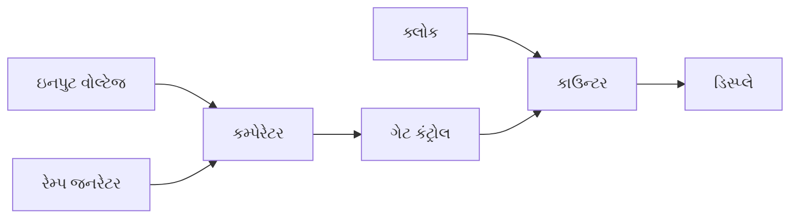

- **કાર્ય સિદ્ધાંત**: રેમ્પને ઇનપુટ વોલ્ટેજ સમાન થવામાં લાગતો સમય માપે છે
- **કમ્પેરેટર**: ઇનપુટની તુલના રેમ્પ વોલ્ટેજ સાથે કરે છે
- **કાઉન્ટર**: તુલના દરમિયાન ક્લોક પલ્સની ગણતરી કરે છે
- **ડિસ્પ્લે**: ડિજિટલ વાચન બતાવે છે

**મલ્ટિરેન્જ DC વોલ્ટમીટર સર્કિટ:**

```goat
       +--R1--+
       |      |
    Input     +--R2--+
       |      |      |
    +--+      +--R3--+
    |            |   |
    +--Switch----+   |
                     |
                   +-+-+
                   |DVM|
                   +-+-+
```

**રેન્જ સ્વિચિંગ પ્રક્રિયા:**

- દરેક રેસિસ્ટર અલગ અલગ વોલ્ટેજ વિભાજન ગુણોત્તર પ્રદાન કરે છે
- સ્વિચ યોગ્ય વોલ્ટેજ ડિવાઇડર નેટવર્ક પસંદ કરે છે
- વોલ્ટેજ ડિવાઇડર ઇનપુટને DVM રેન્જ ફિટ કરવા માટે ઘટાડે છે

**મેમરી ટ્રીક:** "CRCD: કમ્પેર રેમ્પ, કાઉન્ટ ડ્યુરેશન"

## પ્રશ્ન 3(a) [3 ગુણ]

**ડિજિટલ સ્ટોરેજ ઓસિલોસ્કોપ (DSO)ની વિશેષતાઓનું વર્ણન કરો.**

**જવાબ**:
ડિજિટલ સ્ટોરેજ ઓસિલોસ્કોપ એનાલોગ સિગ્નલ્સને સંગ્રહ અને વિશ્લેષણ માટે ડિજિટલમાં રૂપાંતરિત કરે છે.

| વિશેષતાઓ | વર્ણન |
|----------|-------------|
| **ડિજિટલ સ્ટોરેજ** | પછીના વિશ્લેષણ માટે વેવફોર્મ સંગ્રહિત કરે છે |
| **ટ્રિગરિંગ** | અનેક ટ્રિગર મોડ અને સ્ત્રોતો |
| **વેવફોર્મ પ્રોસેસિંગ** | વેવફોર્મ પર ગણિતિક ક્રિયાઓ |
| **FFT એનાલિસિસ** | સિગ્નલ્સનો ફ્રિક્વન્સી ડોમેન વ્યૂ |
| **મલ્ટિપલ ચેનલ્સ** | સિગ્નલ્સનું એક સાથે દર્શન |
| **USB/LAN કનેક્ટિવિટી** | ડેટા ટ્રાન્સફર ક્ષમતાઓ |

- **સેમ્પલિંગ રેટ**: સામાન્ય રીતે 1 GS/s અથવા વધુ
- **મેમરી ડેપ્થ**: મહત્તમ કેપ્ચર સમય નક્કી કરે છે

**મેમરી ટ્રીક:** "SACRED: સ્ટોરેજ, એનાલિસિસ, કનેક્ટિવિટી, રિઝોલ્યુશન, એક્સટેન્ડેડ ફંક્શન્સ, ડિજિટલ પ્રોસેસિંગ"

## પ્રશ્ન 3(b) [4 ગુણ]

**લિસાજસ પેટર્નનો ઉપયોગ કરીને આવર્તન માપન પદ્ધતિ સમજાવો.**

**જવાબ**:
લિસાજસ પેટર્ન બે સિગ્નલ્સની આવૃત્તિઓની તુલના કરવા માટે વપરાય છે.

**આકૃતિ:**

```goat
    +-------+     +-------+
    |       |     |       |
    |   o   |     |   8   |
    |       |     |       |
    +-------+     +-------+
    1:1 ratio     2:1 ratio
    
    +-------+     +-------+
    |       |     |       |
    |   ∞   |     |  ⋮⋮⋮   |
    |       |     |       |
    +-------+     +-------+
    3:1 ratio     4:1 ratio
```

**પદ્ધતિ:**

1. અજ્ઞાત આવૃત્તિને X-ઇનપુટ પર લાગુ કરો
2. સંદર્ભ આવૃત્તિને Y-ઇનપુટ પર લાગુ કરો
3. સ્ક્રીન પર લિસાજસ પેટર્ન નિરીક્ષણ કરો
4. ગુણોત્તર નક્કી કરવા માટે સ્પર્શ બિંદુઓની ગણતરી કરો

**સૂત્ર:** fx/fy = Ny/Nx

- જ્યાં Nx = આડા સ્પર્શ બિંદુઓ
- Ny = ઊભા સ્પર્શ બિંદુઓ

**મેમરી ટ્રીક:** "XTYN: X-ટેન્જન્ટ્સ ટુ Y-ટેન્જન્ટ્સ ગિવ્સ ધ નંબર રેશિયો"

## પ્રશ્ન 3(c) [7 ગુણ]

**બ્લોક ડાયાગ્રામની મદદથી CRO સમજાવો.**

**જવાબ**:
કેથોડ રે ઓસિલોસ્કોપ (CRO) વેવફોર્મ્સ પ્રદર્શિત કરવા અને વિશ્લેષણ કરવા માટે વપરાય છે.

**બ્લોક ડાયાગ્રામ:**

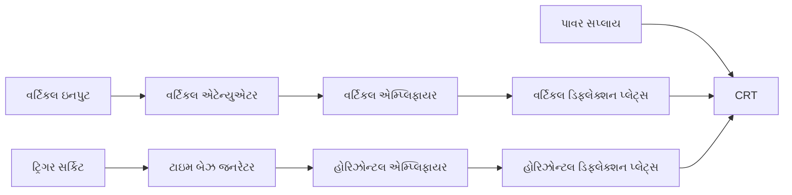

| બ્લોક | કાર્ય |
|-------|----------|
| વર્ટિકલ સેક્શન | Y-ડિફ્લેક્શન માટે ઇનપુટ સિગ્નલ પ્રોસેસ કરે છે |
| હોરિઝોન્ટલ સેક્શન | X-ડિફ્લેક્શન માટે સ્વીપ સિગ્નલ ઉત્પન્ન કરે છે |
| ટ્રિગર સર્કિટ | ઇનપુટ સિગ્નલ સાથે સ્વીપને સિન્ક્રોનાઇઝ કરે છે |
| CRT | વેવફોર્મ પેટર્ન પ્રદર્શિત કરે છે |
| પાવર સપ્લાય | જરૂરી વોલ્ટેજ પ્રદાન કરે છે |

- **ઇલેક્ટ્રોન ગન**: ઇલેક્ટ્રોન બીમ ઉત્પન્ન કરે છે
- **ડિફ્લેક્શન સિસ્ટમ**: બીમને X અને Y દિશામાં ખસેડે છે
- **સ્ક્રીન**: ફોસ્ફર કોટિંગ ઇલેક્ટ્રોન્સને દૃશ્યમાન પ્રકાશમાં રૂપાંતરિત કરે છે

**મેમરી ટ્રીક:** "VCTHP: વર્ટિકલ ઇનપુટ, કન્ડિશન્ડ સિગ્નલ, ટ્રિગર્ડ સ્વીપ, હોરિઝોન્ટલ ડિફ્લેક્શન, ફોસ્ફર ડિસ્પ્લે"

## પ્રશ્ન 3(a) OR [3 ગુણ]

**વિવિધ પ્રકારના CRO પ્રોબ સમજાવો.**

**જવાબ**:
CRO પ્રોબ પરીક્ષણ હેઠળના સર્કિટને ઓસિલોસ્કોપ ઇનપુટ સાથે જોડે છે.

| પ્રોબ પ્રકાર | લાક્ષણિકતાઓ | એપ્લિકેશન |
|------------|----------------|--------------|
| **પેસિવ પ્રોબ્સ** | સરળ, કરકસરયુક્ત, ઉચ્ચ ઇમ્પિડન્સ | સામાન્ય-હેતુના માપો |
| **એક્ટિવ પ્રોબ્સ** | બિલ્ટ-ઇન એમ્પ્લિફાયર, લો લોડિંગ | ઉચ્ચ આવૃત્તિ સર્કિટ્સ |
| **કરંટ પ્રોબ્સ** | સર્કિટ તોડ્યા વિના કરંટ માપે છે | કરંટ વેવફોર્મ માપન |
| **ડિફરેન્શિયલ પ્રોબ્સ** | બે પોઇન્ટ વચ્ચે માપે છે | ફ્લોટિંગ માપન |

**આકૃતિ:**

```goat
    +-------+      +-------+
    | Scope |<-----| Probe |
    +-------+      +-------+
                       |
                   +---+---+
                   |Circuit|
                   +-------+
```

- **એટેન્યુએશન રેશિયો**: સામાન્ય રીતે 1:1 અથવા 10:1
- **કોમ્પેન્સેશન**: ઓસિલોસ્કોપ ઇનપુટ સાથે મેળ ખાય તે માટે સમાયોજિત કરી શકાય

**મેમરી ટ્રીક:** "PACD: પેસિવ, એક્ટિવ, કરંટ, ડિફરેન્શિયલ"

## પ્રશ્ન 3(b) OR [4 ગુણ]

**CRT ની આંતરિક રચના દોરો. ટૂંકમાં સમજાવો.**

**જવાબ**:
કેથોડ રે ટ્યૂબ (CRT) એક ઓસિલોસ્કોપમાં ડિસ્પ્લે ડિવાઇસ છે.

**આકૃતિ:**

```goat
    Electron Gun                Deflection Plates         Screen
    +-----------+                  +--+     +---+            +-----+
    |           |                  |  |     |   |            |     |
    | C G A1 A2 |------------------|Y |-----| X |------------| P   |
    |           |                  |  |     |   |            |     |
    +-----------+                  +--+     +---+            +-----+
    
    C: Cathode, G: Grid, A1, A2: Anodes, Y,X: Deflection Plates, P: Phosphor
```

| ઘટક | કાર્ય |
|-----------|----------|
| ઇલેક્ટ્રોન ગન | ઇલેક્ટ્રોન બીમ ઉત્પન્ન કરે છે |
| કંટ્રોલ ગ્રિડ | બીમ તીવ્રતા નિયંત્રિત કરે છે |
| ફોકસિંગ એનોડ્સ | ઇલેક્ટ્રોન બીમને કેન્દ્રિત કરે છે |
| ડિફ્લેક્શન પ્લેટ્સ | બીમ પોઝિશન નિયંત્રિત કરે છે |
| ફોસ્ફર સ્ક્રીન | ઇલેક્ટ્રોન્સને પ્રકાશમાં રૂપાંતરિત કરે છે |

- **ઇલેક્ટ્રોન બીમ**: કેથોડ દ્વારા ઉત્સર્જિત ઉચ્ચ-વેગના ઇલેક્ટ્રોન્સ
- **ફોકસિંગ સિસ્ટમ**: એનોડ્સ ઇલેક્ટ્રોન લેન્સ બનાવે છે
- **ડિફ્લેક્શન સિસ્ટમ**: X-Y પ્લેટ્સ બીમ પોઝિશન ખસેડે છે
- **ફોસ્ફર સ્ક્રીન**: બીમ જ્યાં પડે ત્યાં પ્રકાશે છે

**મેમરી ટ્રીક:** "GAFDS: ગન એઈમ્સ, ફોકસિંગ ડાયરેક્ટ્સ, સ્ક્રીન શોઝ"

## પ્રશ્ન 3(c) OR [7 ગુણ]

**DSO નો બ્લોક ડાયાગ્રામ વિગતવાર દોરો અને સમજાવો.**

**જવાબ**:
ડિજિટલ સ્ટોરેજ ઓસિલોસ્કોપ (DSO) સિગ્નલ્સને ડિજિટલ સ્વરૂપમાં કેપ્ચર, સ્ટોર અને એનાલાઇઝ કરે છે.

**બ્લોક ડાયાગ્રામ:**

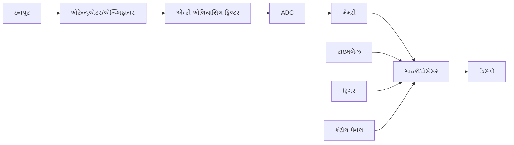

| બ્લોક | કાર્ય |
|-------|----------|
| ઇનપુટ સેક્શન | સિગ્નલ કન્ડિશનિંગ અને સ્કેલિંગ |
| ADC | એનાલોગને ડિજિટલ સિગ્નલ્સમાં રૂપાંતરિત કરે છે |
| મેમરી | ડિજિટાઇઝ્ડ વેવફોર્મ ડેટા સંગ્રહિત કરે છે |
| માઇક્રોપ્રોસેસર | એક્વિઝિશન અને પ્રોસેસિંગ નિયંત્રિત કરે છે |
| ડિસ્પ્લે સિસ્ટમ | વેવફોર્મ અને માપણીઓ બતાવે છે |
| ટ્રિગર સિસ્ટમ | ક્યારે એક્વિઝિશન શરૂ કરવું તે નક્કી કરે છે |

- **સેમ્પલિંગ રેટ**: દર સેકન્ડે સેમ્પલ્સની સંખ્યા
- **રિઝોલ્યુશન**: ADCમાં બિટ્સની સંખ્યા (સામાન્ય રીતે 8-12 બિટ્સ)
- **મેમરી ડેપ્થ**: સંગ્રહિત કરી શકાય તેવા સેમ્પલ્સની સંખ્યા
- **પ્રોસેસિંગ**: વેવફોર્મ ગણિત, માપણીઓ, વિશ્લેષણ

**મેમરી ટ્રીક:** "SAMPLE-D: સિગ્નલ એક્વિઝિશન, મેમરી પ્રોસેસિંગ, લોકિંગ ટ્રિગર, ડિસ્પ્લે"

## પ્રશ્ન 4(a) [3 ગુણ]

**NTC અને PTC થર્મિસ્ટરની સરખામણી આપો.**

**જવાબ**:

| પેરામીટર | NTC થર્મિસ્ટર | PTC થર્મિસ્ટર |
|-----------|----------------|----------------|
| **રેસિસ્ટન્સ ફેરફાર** | તાપમાન સાથે ઘટે છે | તાપમાન સાથે વધે છે |
| **મટીરિયલ** | મેટલ ઓક્સાઇડ્સ (Mn, Ni, Co, Cu) | બેરિયમ ટાઇટાનેટ, પોલિમર્સ |
| **પ્રતિસાદ** | ઘટતો ઘટાડો | થ્રેશોલ્ડથી ઉપર તીવ્ર વધારો |
| **એપ્લિકેશન** | તાપમાન માપન, કોમ્પેન્સેશન | ઓવરકરંટ પ્રોટેક્શન, હીટિંગ |
| **તાપમાન શ્રેણી** | -50°C થી 300°C | 0°C થી 200°C |

**આકૃતિ:**

```goat
    R |      /
      |     /
      |    /   PTC
      |   /
      |  /
      | /
      |/
      |\
      | \
      |  \
      |   \    NTC
      |    \
      |     \
      +------+---
             T
```

**મેમરી ટ્રીક:** "IN-DP: ઇન્ક્રીઝ નેગેટિવ, ડિક્રીઝ પોઝિટિવ"

## પ્રશ્ન 4(b) [4 ગુણ]

**થર્મોકપલના કાર્યકારી સિદ્ધાંત અને બાંધકામ સમજાવો.**

**જવાબ**:
થર્મોકપલ એ તાપમાન સેન્સર છે જે સીબેક ઇફેક્ટના સિદ્ધાંત પર કામ કરે છે.

**આકૃતિ:**

```goat
    Metal A   +--------+
    --------->|        |
              | V-meter|
    Metal B   |        |
    --------->+--------+
        |
        |
    +---+---+
    |Hot End|
    +-------+
```

**બાંધકામ:**

- એક છેડે જોડાયેલ બે અસમાન ધાતુઓ (માપન જંક્શન)
- અન્ય છેડા માપન સર્કિટ સાથે જોડાયેલા (સંદર્ભ જંક્શન)
- ઔદ્યોગિક એપ્લિકેશન માટે સુરક્ષાત્મક આવરણ

**કાર્ય સિદ્ધાંત:**

- જંક્શન વચ્ચે તાપમાન તફાવત EMF બનાવે છે
- EMF તાપમાન તફાવતના પ્રમાણમાં હોય છે
- આઉટપુટ વોલ્ટેજ સામાન્ય રીતે મિલિવોલ્ટ્સ રેન્જમાં
- વિવિધ ધાતુ જોડાણો વિવિધ શ્રેણી માટે

**મેમરી ટ્રીક:** "STEM: સીબેક-ઇફેક્ટ ટ્રાન્સફોર્મ્સ ટેમ્પરેચર ટુ EMF ઇન મેટલ્સ"

## પ્રશ્ન 4(c) [7 ગુણ]

**સ્ટ્રેઇન ગેજ અને લોડ સેલની કામગીરી સમજાવો. RTD ના ફાયદા અને ગેરફાયદા આપો.**

**જવાબ**:

**સ્ટ્રેઇન ગેજ કાર્ય:**

- **સિદ્ધાંત**: યાંત્રિક વિકૃતિ સાથે પ્રતિરોધ બદલાય છે
- **બાંધકામ**: બેકિંગ મટીરિયલ પર માઉન્ટ કરેલ પાતળી વાયર અથવા ફોઇલ ગ્રિડ
- **ઓપરેશન**: જ્યારે ખેંચાય છે, ત્યારે પ્રતિરોધ પ્રમાણસર બદલાય છે
- **ગેજ ફેક્ટર**: પ્રતિરોધમાં સાપેક્ષ ફેરફારનો સ્ટ્રેઇન માટેનો ગુણોત્તર

**સ્ટ્રેઇન ગેજ માટે આકૃતિ:**

```goat
    +----------------------+
    |  ┌─┐┌─┐┌─┐┌─┐┌─┐┌─┐  |
    |  │ ││ ││ ││ ││ ││ │  |
    |  └─┘└─┘└─┘└─┘└─┘└─┘  |
    +----------------------+
           Backing
```

**લોડ સેલ કાર્ય:**

- **બાંધકામ**: ધાતુના બોડી (બીમ/રિંગ) પર માઉન્ટ કરેલા સ્ટ્રેઇન ગેજ
- **ઓપરેશન**: વજન કારણે થતી વિકૃતિને સ્ટ્રેઇન ગેજ દ્વારા માપવામાં આવે છે
- **સર્કિટ**: સામાન્ય રીતે વ્હીટસ્ટોન બ્રિજ કન્ફિગરેશન
- **આઉટપુટ**: સામાન્ય રીતે એક્સાઇટેશનના પ્રતિ વોલ્ટ દીઠ થોડા મિલિવોલ્ટ્સ

**લોડ સેલ માટે આકૃતિ:**

```goat
    +-------+    Force   +-------+
    |       |----------->|       |
    |Fixed  |            |Strain |
    |Support|            |Gauges |
    +-------+            +-------+
```

**RTD (રેસિસ્ટન્સ ટેમ્પરેચર ડિટેક્ટર):**

| ફાયદા | ગેરફાયદા |
|------------|---------------|
| ઉચ્ચ ચોકસાઈ | મોંઘું |
| સારી સ્થિરતા | એક્સાઇટેશન કરંટની જરૂર પડે છે |
| વિશાળ તાપમાન શ્રેણી | સેલ્ફ-હીટિંગ અસરો |
| લીનિયર રિસ્પોન્સ | થર્મિસ્ટર કરતાં ઓછી સંવેદનશીલતા |
| સારી પુનરાવર્તિતા | ધીમો પ્રતિસાદ સમય |

**મેમરી ટ્રીક:** "SPANNER: સ્ટ્રેઇન પ્રોપોર્શનલી ઓલ્ટર્સ નોમિનલ નોમિનલ ઇલેક્ટ્રિકલ રેસિસ્ટન્સ"

## પ્રશ્ન 4(a) OR [3 ગુણ]

**ભેજ સેન્સર હાઇગ્રોમીટર સમજાવો.**

**જવાબ**:
ભેજ સેન્સર હાઇગ્રોમીટર હવામાં સાપેક્ષ ભેજ માપે છે.

**આકૃતિ:**

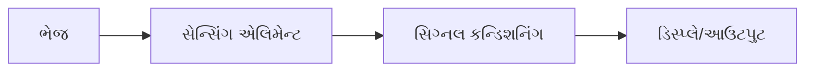

| પ્રકાર | સેન્સિંગ સિદ્ધાંત |
|------|-------------------|
| કેપેસિટિવ | ભેજ ડાઇલેક્ટ્રિક કોન્સ્ટન્ટ બદલે છે |
| રેસિસ્ટિવ | ભેજ રેસિસ્ટન્સ બદલે છે |
| થર્મલ | ભેજ થર્મલ કન્ડક્ટિવિટીને અસર કરે છે |

- **સાપેક્ષ ભેજ**: વાસ્તવિક થી મહત્તમ વરાળનો ગુણોત્તર
- **માપન શ્રેણી**: સામાન્ય રીતે 0-100% RH
- **એપ્લિકેશન**: વેધર સ્ટેશન, HVAC સિસ્ટમ, ઔદ્યોગિક પ્રક્રિયાઓ

**મેમરી ટ્રીક:** "CRT-H: કેપેસિટન્સ/રેસિસ્ટન્સ/થર્મલ ચેન્જીસ વિથ હ્યુમિડિટી"

## પ્રશ્ન 4(b) OR [4 ગુણ]

**પીઝોઇલેક્ટ્રિક ટ્રાન્સડ્યુસર દોરો અને સમજાવો.**

**જવાબ**:
પીઝોઇલેક્ટ્રિક ટ્રાન્સડ્યુસર યાંત્રિક સ્ટ્રેસને ઇલેક્ટ્રિકલ સિગ્નલમાં અને તેનાથી ઉલટું રૂપાંતરિત કરે છે.

**આકૃતિ:**

```goat
    +---------------+
    |    Electrodes |
    |  +---------+  |
    |  |         |  |
    |  | Crystal |  |
    |  |         |  |
    |  +---------+  |
    |    Electrodes |
    +---------------+
       |         |
       + Output  +
```

**કાર્ય સિદ્ધાંત:**

- **ડાયરેક્ટ ઇફેક્ટ**: દબાણ ઇલેક્ટ્રિકલ ચાર્જ ઉત્પન્ન કરે છે
- **ઇન્વર્સ ઇફેક્ટ**: વોલ્ટેજ યાંત્રિક વિકૃતિ ઉત્પન્ન કરે છે
- **મટીરિયલ**: ક્વાર્ટ્ઝ, PZT, બેરિયમ ટાઇટાનેટ

**એપ્લિકેશન:**

- પ્રેશર સેન્સર
- એક્સેલેરોમીટર
- અલ્ટ્રાસોનિક ટ્રાન્સડ્યુસર
- વાઇબ્રેશન સેન્સર

**મેમરી ટ્રીક:** "PEMS: પ્રેશર એન્શ્યોર્સ મેઝરેબલ સિગ્નલ"

## પ્રશ્ન 4(c) OR [7 ગુણ]

**ટ્રાન્સડ્યુસરનું વર્ગીકરણ વિગતવાર આપો.**

**જવાબ**:
ટ્રાન્સડ્યુસર એક પ્રકારની ઊર્જાને બીજા પ્રકારમાં રૂપાંતરિત કરે છે, અનેક રીતે વર્ગીકૃત થયેલા:

| વર્ગીકરણ | પ્રકાર | ઉદાહરણો |
|----------------|-------|----------|
| **ઊર્જા રૂપાંતરણના આધારે** | **યાંત્રિકથી ઇલેક્ટ્રિકલ** | સ્ટ્રેઇન ગેજ, LVDT |
| | **થર્મલથી ઇલેક્ટ્રિકલ** | થર્મોકપલ, RTD |
| | **ઓપ્ટિકલથી ઇલેક્ટ્રિકલ** | ફોટોડાયોડ, LDR |
| | **કેમિકલથી ઇલેક્ટ્રિકલ** | pH સેન્સર, ગેસ સેન્સર |
| **ઓપરેટિંગ સિદ્ધાંતના આધારે** | **રેસિસ્ટિવ** | સ્ટ્રેઇન ગેજ, થર્મિસ્ટર |
| | **ઇન્ડક્ટિવ** | LVDT, પ્રોક્સિમિટી સેન્સર |
| | **કેપેસિટિવ** | ભેજ સેન્સર, પ્રેશર સેન્સર |
| | **પીઝોઇલેક્ટ્રિક** | એક્સેલેરોમીટર, ફોર્સ સેન્સર |
| **એપ્લિકેશનના આધારે** | **તાપમાન** | થર્મોકપલ, RTD, થર્મિસ્ટર |
| | **પ્રેશર** | ડાયાફ્રામ, સ્ટ્રેઇન ગેજ આધારિત |
| | **ફ્લો** | અલ્ટ્રાસોનિક, ટર્બાઇન, વેન્ચુરી |
| | **લેવલ** | ફ્લોટ, અલ્ટ્રાસોનિક, કેપેસિટિવ |

**આકૃતિ:**

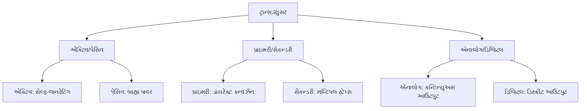

**મેમરી ટ્રીક:** "APAD RICE: એક્ટિવ/પેસિવ, એનાલોગ/ડિજિટલ વિથ રેસિસ્ટિવ, ઇન્ડક્ટિવ, કેપેસિટિવ, ઇલેક્ટ્રોમેગ્નેટિક"

## પ્રશ્ન 5(a) [3 ગુણ]

**વિવિધ કેપેસિટિવ ટ્રાન્સડ્યુસર પર ટૂંક નોંધ લખો.**

**જવાબ**:
કેપેસિટિવ ટ્રાન્સડ્યુસર એ સિદ્ધાંત પર કામ કરે છે કે કેપેસિટન્સ ભૌતિક પેરામીટર સાથે બદલાય છે.

| પ્રકાર | કાર્ય સિદ્ધાંત | એપ્લિકેશન |
|------|-------------------|--------------|
| **ડિસ્પ્લેસમેન્ટ** | પ્લેટ વચ્ચેનું અંતર બદલાય છે | પ્રિસિઝન મેઝરમેન્ટ |
| **પ્રેશર** | ડાયાફ્રામ ડિફ્લેક્શન અંતર બદલે છે | પ્રેશર સેન્સર |
| **લેવલ** | માધ્યમ સાથે ડાઇલેક્ટ્રિક બદલાય છે | લિક્વિડ લેવલ મેઝરમેન્ટ |
| **ભેજ** | ભેજ સાથે ડાઇલેક્ટ્રિક બદલાય છે | ભેજ સેન્સર |

**આકૃતિ:**

```goat
    +------------+
    |   Fixed    |
    |   Plate    |
    +------------+
           ^
           | Gap (d)
           v
    +------------+
    |  Movable   |
    |   Plate    |
    +------------+
```

- **કેપેસિટન્સ**: C = εA/d (ε: પરમિટિવિટી, A: એરિયા, d: અંતર)
- **ફાયદા**: ઉચ્ચ સંવેદનશીલતા, શારીરિક સંપર્કની જરૂર નથી
- **મર્યાદાઓ**: સ્ટ્રે કેપેસિટન્સથી પ્રભાવિત

**મેમરી ટ્રીક:** "PALD: પેરામીટર ઓલ્ટર્સ ધ લીડિંગ ડાઇલેક્ટ્રિક"

## પ્રશ્ન 5(b) [4 ગુણ]

**LVDT ટ્રાન્સડ્યુસર સમજાવો.**

**જવાબ**:
LVDT (લીનિયર વેરિએબલ ડિફરેન્શિયલ ટ્રાન્સફોર્મર) લીનિયર ડિસ્પ્લેસમેન્ટ માપે છે.

**આકૃતિ:**

```goat
    Primary   Secondary 1   Secondary 2
      Coil        Coil         Coil
     +---+        +---+       +---+
     |   |        |   |       |   |
     |   |        |   |       |   |
     +---+        +---+       +---+
       |            |           |
       |            |           |
    +--+------------+-----------+--+
    |     Ferromagnetic Core       |
    +------------------------------+
```

**કાર્ય સિદ્ધાંત:**

- પ્રાઇમરી કોઇલ AC વોલ્ટેજથી ઉત્તેજિત
- કોરની સ્થિતિ સેકન્ડરી સાથેના કપલિંગ નક્કી કરે છે
- આઉટપુટ વોલ્ટેજ કોર ડિસ્પ્લેસમેન્ટના પ્રમાણમાં
- જ્યારે કોર કેન્દ્રિત હોય ત્યારે નલ પોઝિશન (આઉટપુટ = 0)

**લાક્ષણિકતાઓ:**

- **રેન્જ**: સામાન્ય રીતે ±0.5mm થી ±25cm
- **લિનિયરતા**: નલ પોઝિશનની આસપાસ શ્રેષ્ઠ
- **સંવેદનશીલતા**: ઉચ્ચ, સામાન્ય રીતે mV/mm
- **રિઝોલ્યુશન**: લગભગ અનંત (એનાલોગ ડિવાઇસ)

**મેમરી ટ્રીક:** "MDVN: મૂવમેન્ટ ડિટર્મિન્સ વોલ્ટેજ ફ્રોમ નલ"

## પ્રશ્ન 5(c) [7 ગુણ]

**હાર્મોનિક્સ ડિસ્ટોર્શન એનાલાઇઝર દોરો અને સમજાવો.**

**જવાબ**:
હાર્મોનિક ડિસ્ટોર્શન એનાલાઇઝર ઓડિયો અને ઇલેક્ટ્રોનિક સિગ્નલમાં ડિસ્ટોર્શન માપે છે.

**બ્લોક ડાયાગ્રામ:**

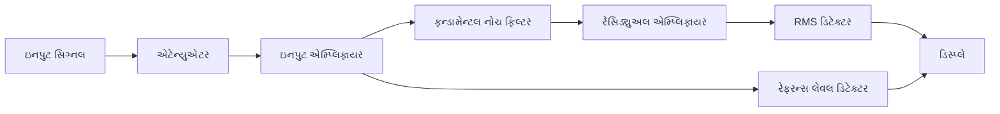

**કાર્ય સિદ્ધાંત:**

1. ઇનપુટ સિગ્નલ કન્ડિશન થાય છે અને એમ્પ્લિફાય થાય છે
2. મૂળભૂત આવૃત્તિ નોચ ફિલ્ટર દ્વારા દૂર કરવામાં આવે છે
3. બાકીની હાર્મોનિક સામગ્રી માપવામાં આવે છે
4. ડિસ્ટોર્શનની ગણતરી હાર્મોનિક્સનો કુલ સિગ્નલ સાથેના ગુણોત્તર તરીકે થાય છે

**લાક્ષણિકતાઓ:**

- **માપન શ્રેણી**: સામાન્ય રીતે 0.001% થી 100%
- **આવૃત્તિ શ્રેણી**: 20Hz થી 100kHz
- **એપ્લિકેશન**: ઓડિયો ઇક્વિપમેન્ટ ટેસ્ટિંગ, પાવર ક્વોલિટી એનાલિસિસ
- **માપણી**: THD (ટોટલ હાર્મોનિક ડિસ્ટોર્શન), THD+N (THD પ્લસ નોઇઝ)

**ગણતરી**: THD = √(V₂² + V₃² + V₄² + ...)/(V₁ + V₂ + V₃ + ...)

- જ્યાં V₁ મૂળભૂત છે, V₂, V₃, વગેરે હાર્મોનિક્સ છે

**મેમરી ટ્રીક:** "FAIR-D: ફિલ્ટર એન્ડ આઇસોલેટ રેસિડ્યુઅલ્સ ફોર ડિસ્ટોર્શન"

## પ્રશ્ન 5(a) OR [3 ગુણ]

**પ્રોક્સિમિટી સેન્સરના કાર્યકારી સિદ્ધાંતને સમજાવો.**

**જવાબ**:
પ્રોક્સિમિટી સેન્સર શારીરિક સંપર્ક વિના ઓબ્જેક્ટ્સને શોધે છે.

| પ્રકાર | કાર્ય સિદ્ધાંત | શોધ શ્રેણી |
|------|-------------------|-----------------|
| **ઇન્ડક્ટિવ** | ઇલેક્ટ્રોમેગ્નેટિક ફિલ્ડનો ઉપયોગ કરીને મેટલ શોધે છે | 0.5-60mm |
| **કેપેસિટિવ** | કેપેસિટન્સ ફેરફાર દ્વારા કોઈપણ મટીરિયલ શોધે છે | 3-60mm |
| **અલ્ટ્રાસોનિક** | ધ્વનિ તરંગ રિફ્લેક્શનનો ઉપયોગ કરે છે | 1cm-10m |
| **ફોટોઇલેક્ટ્રિક** | પ્રકાશ કિરણ અવરોધનો ઉપયોગ કરે છે | 50m સુધી |

**આકૃતિ:**

```goat
    +--------+         +--------+
    | Sensor |  Field  | Object |
    +--------+ ------> +--------+
       |  ^
       |  |
    +--+--+----+
    |Controller|
    +----------+
```

- **ઓપરેટિંગ મોડ**: સામાન્ય રીતે ઓપન અથવા સામાન્ય રીતે ક્લોઝ્ડ
- **આઉટપુટ પ્રકાર**: ડિજિટલ (ઓન/ઓફ) અથવા એનાલોગ (પ્રમાણસર)
- **એપ્લિકેશન**: મેન્યુફેક્ચરિંગ, ઓટોમેશન, સિક્યુરિટી સિસ્ટમ

**મેમરી ટ્રીક:** "CUPS: કેપેસિટિવ, અલ્ટ્રાસોનિક, ફોટોઇલેક્ટ્રિક, સેન્સ"

## પ્રશ્ન 5(b) OR [4 ગુણ]

**એબ્સોલ્યુટ અને ઇન્ક્રીમેન્ટલ પ્રકારના ઓપ્ટિકલ એન્કોડર સમજાવો.**

**જવાબ**:
ઓપ્ટિકલ એન્કોડર પ્રકાશ શોધનો ઉપયોગ કરીને યાંત્રિક સ્થિતિને ડિજિટલ સિગ્નલમાં રૂપાંતરિત કરે છે.

| પેરામીટર | એબ્સોલ્યુટ એન્કોડર | ઇન્ક્રીમેન્ટલ એન્કોડર |
|-----------|------------------|---------------------|
| **આઉટપુટ ફોર્મેટ** | સંપૂર્ણ પોઝિશન કોડ | પલ્સ ટ્રેન |
| **રિઝોલ્યુશન** | ટ્રેક્સની સંખ્યા દ્વારા નિશ્ચિત | ડિસ્ક ડિવિઝનથી નક્કી |
| **પોઝિશન નોલેજ** | પાવર લોસ પછી જાળવી રાખે છે | પાવર લોસ પછી ખોવાય છે |
| **જટિલતા** | ઉચ્ચ (મલ્ટિપલ ટ્રેક્સ) | નીચી (સિંગલ ટ્રેક) |
| **કિંમત** | ઉચ્ચ | નીચી |

**એબ્સોલ્યુટ એન્કોડરની આકૃતિ:**

```goat
    +-------------+
    |  1 0 1 0 1  | <- Code Tracks
    |  1 1 0 0 1  |
    |  0 0 1 1 1  |
    +-------------+
           |
    +------+-------+
    | Light Source |
    +------+-------+
           |
    +------+-------+
    |   Detectors  |
    +--------------+
```

**ઇન્ક્રીમેન્ટલ એન્કોડરની આકૃતિ:**

```goat
    +-----------+
    |           |
    |  //////   | <- Single Track with slots
    |           |
    +-----------+
           |
    +------+-------+
    | Light Source |
    +------+-------+
           |
    +------+-------+
    |   Detectors  |
    +--------------+
```

- **A, B, Z આઉટપુટ**: 
  - A અને B આઉટપુટ દિશા શોધવા માટે 90° ખસેડાયેલા હોય છે
  - Z (ઇન્ડેક્સ) પલ્સ સંદર્ભ માટે દર આવર્તન દીઠ એકવાર

**મેમરી ટ્રીક:** "APIR-CD: એબ્સોલ્યુટ પ્રોવાઇડ્સ ઇમીડિએટ રીડિંગ, કાઉન્ટર ડિટર્મિન્સ ઇન્ક્રીમેન્ટલ"

## પ્રશ્ન 5(c) OR [7 ગુણ]

**ડિજિટલ IC ટેસ્ટર પર ટૂંકી નોંધ લખો.**

**જવાબ**:
ડિજિટલ IC ટેસ્ટર ડિજિટલ ઇન્ટિગ્રેટેડ સર્કિટની કાર્યક્ષમતા ચકાસવા અને ખામીઓ શોધવા માટે વપરાય છે.

**બ્લોક ડાયાગ્રામ:**

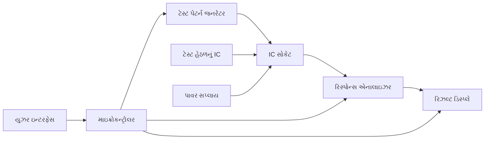

| ઘટક | કાર્ય |
|-----------|----------|
| **ટેસ્ટ પેટર્ન જનરેટર** | ઇનપુટ ટેસ્ટ સિગ્નલ બનાવે છે |
| **IC સોકેટ** | ટેસ્ટ હેઠળના ICને પકડે છે |
| **રિસ્પોન્સ એનાલાઇઝર** | વાસ્તવિક વિરુદ્ધ અપેક્ષિત આઉટપુટની તુલના કરે છે |
| **ડિસ્પ્લે** | ટેસ્ટ પરિણામો અને IC સ્થિતિ બતાવે છે |
| **માઇક્રોકન્ટ્રોલર** | ટેસ્ટ અનુક્રમ નિયંત્રિત કરે છે |

**ટેસ્ટિંગ પદ્ધતિઓ:**

1. **ફંક્શનલ ટેસ્ટિંગ**: લૉજિક કાર્યક્ષમતા ચકાસે છે
2. **પેરામેટ્રિક ટેસ્ટિંગ**: ઇલેક્ટ્રિકલ પેરામીટર્સ માપે છે
3. **ફોલ્ટ ડિટેક્શન**: શોર્ટ્સ, ઓપન્સ, સ્ટક બિટ્સ ઓળખે છે

**IC ટેસ્ટર્સના પ્રકાર:**

- **યુનિવર્સલ ટેસ્ટર્સ**: મલ્ટિપલ IC ફેમિલી (TTL, CMOS) ટેસ્ટ કરે છે
- **ડેડિકેટેડ ટેસ્ટર્સ**: ચોક્કસ IC પ્રકારો માટે ડિઝાઇન કરાયેલા
- **ઇન-સર્કિટ ટેસ્ટર્સ**: સર્કિટમાં હોય ત્યારે IC ટેસ્ટ કરે છે

**ક્ષમતાઓ:**

- **IC ઓળખ**: અજ્ઞાત ICને ઓળખે છે
- **ફોલ્ટ ડાયગ્નોસિસ**: ચોક્કસ ખામીઓ ઓળખે છે
- **ઓટો ટેસ્ટ**: વ્યાપક ટેસ્ટિંગ અનુક્રમ કરે છે

**મેમરી ટ્રીક:** "GATES: જનરેટ એન્ડ ટેસ્ટ એવરી સિગ્નલ"

## પ્રશ્ન 5(c) (વધારાના) [7 ગુણ]

**પ્રશ્નપત્રમાં હાજર બાકીના પ્રશ્નોના ઉકેલ નીચે આપેલા છે:**

**ઇલેક્ટ્રોનિક મલ્ટિમીટરની કામગીરી સમજાવો.**

**જવાબ**:
ઇલેક્ટ્રોનિક મલ્ટિમીટર વિવિધ ઇલેક્ટ્રિકલ પેરામીટર્સ માપવા માટે ઇલેક્ટ્રોનિક ઘટકોનો ઉપયોગ કરે છે.

**બ્લોક ડાયાગ્રામ:**

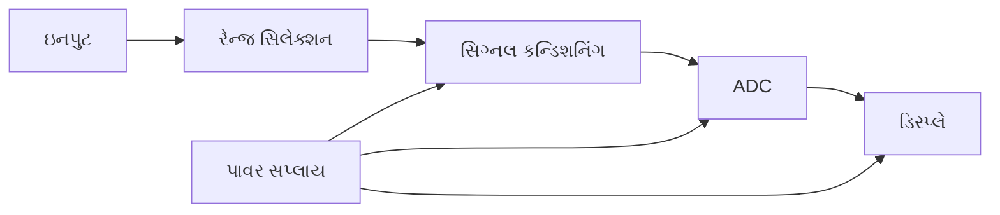

| ફંક્શન | સર્કિટ ઘટકો | વિશેષતાઓ |
|----------|-------------------|----------|
| **વોલ્ટેજ મેઝરમેન્ટ** | ઇનપુટ એટેન્યુએટર, એમ્પ્લિફાયર | ઉચ્ચ ઇમ્પિડન્સ ઇનપુટ |
| **કરંટ મેઝરમેન્ટ** | શન્ટ રેસિસ્ટર, એમ્પ્લિફાયર | લો ઇન્સર્શન લોસ |
| **રેસિસ્ટન્સ મેઝરમેન્ટ** | કોન્સ્ટન્ટ કરંટ સોર્સ | ઓટો-રેન્જિંગ ક્ષમતા |
| **ડિસ્પ્લે** | ડ્રાઇવર્સ સાથે LCD અથવા LED | ડિજિટલ રીડઆઉટ |

- **ફાયદા**: ઉચ્ચ ઇનપુટ ઇમ્પિડન્સ, ઓટો-રેન્જિંગ, ડિજિટલ ચોકસાઈ
- **એપ્લિકેશન**: ઇલેક્ટ્રોનિક્સ ટ્રબલશૂટિંગ, સર્કિટ ટેસ્ટિંગ, ડિવાઇસ કેલિબ્રેશન

**મેમરી ટ્રીક:** "MAAD: મેઝર, એમ્પ્લિફાય, એનાલાઇઝ, ડિસ્પ્લે"

**મૂવિંગ આયર્ન પ્રકારના સાધનોની કામગીરી સમજાવો.**

**જવાબ**:
મૂવિંગ આયર્ન ઇન્સ્ટ્રુમેન્ટ્સ વિદ્યુત-ધારક કોઇલ અને લોખંડના ટુકડા વચ્ચે ચુંબકીય બળના આધારે કામ કરે છે.

| પ્રકાર | ઓપરેશન | લાક્ષણિકતાઓ |
|------|-----------|-----------------|
| **એટ્રેક્શન ટાઇપ** | લોખંડનો ટુકડો કોઇલ તરફ આકર્ષાય છે | સરળ બાંધકામ |
| **રીપલ્શન ટાઇપ** | બે લોખંડના ટુકડા એકબીજાને પ્રતિકર્ષિત કરે છે | વધુ સારી ચોકસાઈ |

**આકૃતિ:**

```goat
                  Pivot
                    |
    +-----+       +-+-+
    |     |       | ^ |
    |Coil |       | | | Iron
    |     |       | | | Vane
    +-----+       +-+-+
                    |
                    v
                  Pointer
```

**લાક્ષણિકતાઓ:**

- **સ્કેલ**: નોન-લીનિયર, નીચલા છેડે સંકુચિત
- **પ્રતિસાદ**: AC અને DC બંને માપે છે (RMS મૂલ્યના પ્રતિસાદ આપે છે)
- **ચોકસાઈ**: PMMC પ્રકાર કરતાં ઓછી
- **પાવર વપરાશ**: પ્રમાણમાં ઉચ્ચ

**મેમરી ટ્રીક:** "AMIR: એટ્રેક્શન મૂવ્સ આયર્ન વિથ રિલક્ટન્સ"

**ભેજ સેન્સર હાઇગ્રોમીટર સમજાવો.**

**જવાબ**:
ભેજ સેન્સર હવા અથવા અન્ય વાયુઓમાં પાણીની વરાળનું પ્રમાણ માપે છે.

**ભેજ સેન્સરના પ્રકાર:**

| પ્રકાર | કાર્ય સિદ્ધાંત | લાક્ષણિકતાઓ |
|------|-------------------|-----------------|
| **કેપેસિટિવ** | ભેજ ડાઇલેક્ટ્રિક કોન્સ્ટન્ટ બદલે છે | વિશાળ શ્રેણી, સારી ચોકસાઈ |
| **રેસિસ્ટિવ** | ભેજ રેસિસ્ટન્સ બદલે છે | સરળ, કિફાયતી |
| **થર્મલ** | ભેજ થર્મલ કન્ડક્ટિવિટીને અસર કરે છે | ઉચ્ચ તાપમાન માટે સારું |

**આકૃતિ:**

```goat
    +----------+
    | Humidity | 
    | Sensing  |--+
    | Element  |  |
    +----------+  |
                  |
    +----------+  |
    | Signal   |<-+
    | Circuit  |--+
    +----------+  |
                  |
    +----------+  |
    | Display/ |<-+
    | Output   |
    +----------+
```

**માપણીઓ:**

- **સાપેક્ષ ભેજ (RH)**: વાસ્તવિકનો મહત્તમ ભેજનો ટકાવારી
- **ડ્યુ પોઇન્ટ**: જે તાપમાને ઝાકળ બને તે તાપમાન
- **એબ્સોલ્યુટ ભેજ**: વોલ્યુમ દીઠ પાણીની વરાળનો દ્રવ્યમાન

**એપ્લિકેશન:**

- વેધર સ્ટેશન
- HVAC સિસ્ટમ
- ઔદ્યોગિક પ્રક્રિયા નિયંત્રણ
- મેડિકલ ઇક્વિપમેન્ટ

**મેમરી ટ્રીક:** "CRAP-H: કેપેસિટન્સ ઓર રેસિસ્ટન્સ ઓલ્ટર્સ વિથ પ્રેઝન્સ ઓફ હ્યુમિડિટી"

**પીઝોઇલેક્ટ્રિક ટ્રાન્સડ્યુસર દોરો અને સમજાવો.**

**જવાબ**:
પીઝોઇલેક્ટ્રિક ટ્રાન્સડ્યુસર યાંત્રિક બળને ઇલેક્ટ્રિકલ સિગ્નલમાં અને તેનાથી ઉલટું રૂપાંતરિત કરે છે.

**આકૃતિ:**

```goat
           Force
             |
             v
    +--------------------+
    |      Metal         |
    |    Electrodes      |
    | +----------------+ |
    | |                | |
    | | Piezoelectric  | |
    | |   Crystal      | |
    | |                | |
    | +----------------+ |
    |      Metal         |
    |    Electrodes      |
    +--------------------+
          |      |
          +      -
       Electrical Output
```

**કાર્ય સિદ્ધાંત:**

- **ડાયરેક્ટ ઇફેક્ટ**: દબાણ ઇલેક્ટ્રિક ચાર્જ ઉત્પન્ન કરે છે
- **રિવર્સ ઇફેક્ટ**: ઇલેક્ટ્રિક ફિલ્ડ યાંત્રિક વિકૃતિ ઉત્પન્ન કરે છે
- **મટીરિયલ**: ક્વાર્ટ્ઝ, PZT, બેરિયમ ટાઇટાનેટ, લિથિયમ નાયોબેટ

**લાક્ષણિકતાઓ:**

- **ઉચ્ચ આવૃત્તિ પ્રતિસાદ**: MHz શ્રેણી સુધી
- **ઉચ્ચ આઉટપુટ ઇમ્પિડન્સ**: ચાર્જ એમ્પ્લિફાયરની જરૂર પડે છે
- **સેલ્ફ-જનરેટિંગ**: સેન્સિંગ માટે બાહ્ય પાવરની જરૂર નથી
- **ડાયનેમિક પ્રતિસાદ**: સ્થિર માપન માટે યોગ્ય નથી

**એપ્લિકેશન:**

- એક્સેલેરોમીટર
- પ્રેશર સેન્સર
- અલ્ટ્રાસોનિક ટ્રાન્સડ્યુસર
- માઇક્રોફોન
- ઇગ્નિશન સિસ્ટમ

**મેમરી ટ્રીક:** "PEMS: પ્રેશર ઇક્વલ્સ મેઝરેબલ સિગ્નલ"
