## Question 1(a) [3 marks]

**Draw and explain working of Basic Q-Meter.**

**Answer**:
Q-meter is an instrument used to measure the quality factor (Q) of an inductor or capacitor.

**Diagram:**

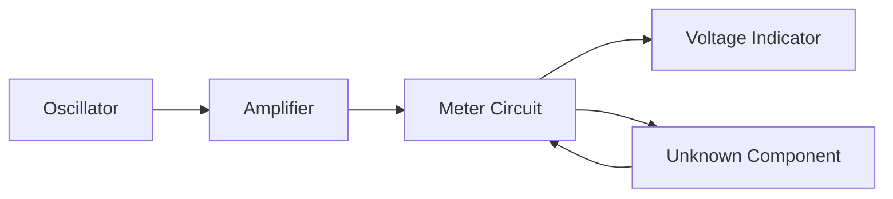

- **Oscillator**: Generates variable frequency signal
- **Amplifier**: Amplifies the signal to required level
- **Resonance Circuit**: Contains the component under test
- **Voltage Indicator**: Measures the voltage across component

**Mnemonic:** "OARV - Oscillate, Amplify, Resonate, View"

## Question 1(b) [4 marks]

**Explain Spectrum Analyzer in brief.**

**Answer**:
A spectrum analyzer measures the magnitude of an input signal versus frequency within the full frequency range of the instrument.

**Diagram:**

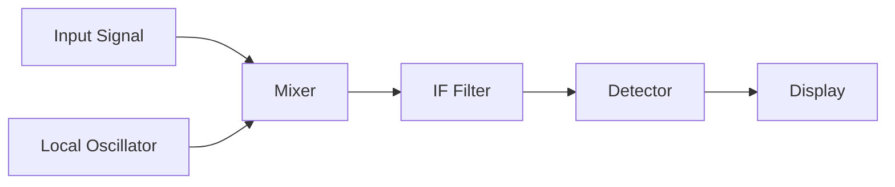

- **Input Signal Processing**: Signals enter through attenuator and filters
- **Frequency Domain Conversion**: Converts time domain to frequency domain
- **Display System**: Shows amplitude vs. frequency plot
- **Applications**: Signal analysis, distortion measurement, EMI testing

**Mnemonic:** "SAME-FD: Signal Analysis Measures Everything in Frequency Domain"

## Question 1(c) [7 marks]

**Explain Wheatstone bridge with circuit diagram. List its advantages and disadvantages.**

**Answer**:
Wheatstone bridge is a circuit used to measure unknown resistance with high accuracy.

**Diagram:**

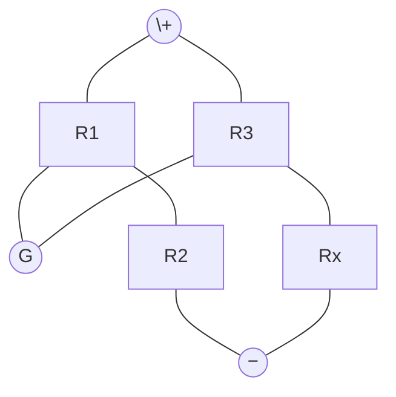

Where:

- R1, R2, R3 are known resistances
- Rx is unknown resistance
- G is galvanometer

**Working Principle**: 

- Bridge is balanced when R1/R2 = R3/Rx
- At balance, no current flows through galvanometer
- Unknown resistance Rx = R3(R2/R1)

| Advantages | Disadvantages |
|------------|---------------|
| High accuracy | Limited range |
| Good sensitivity | Temperature effects |
| Null type measurement | Requires balance adjustment |
| No need for calibrated meter | Not suitable for very low/high resistances |

**Mnemonic:** "BARN - Balance Achieved when Ratios are Null"

## Question 1(c) OR [7 marks]

**Define Instrument and explain its characteristics.**

**Answer**:
An instrument is a device used for measuring, displaying or recording physical quantities.

| Characteristics | Description |
|----------------|-------------|
| **Accuracy** | Closeness of measurement to true value |
| **Precision** | Repeatability of measurements |
| **Resolution** | Smallest change that can be detected |
| **Sensitivity** | Ratio of output signal to input signal change |
| **Linearity** | Proportional relationship between input and output |
| **Range** | Minimum to maximum measurable values |
| **Response time** | Time required to show true reading |

**Diagram:**

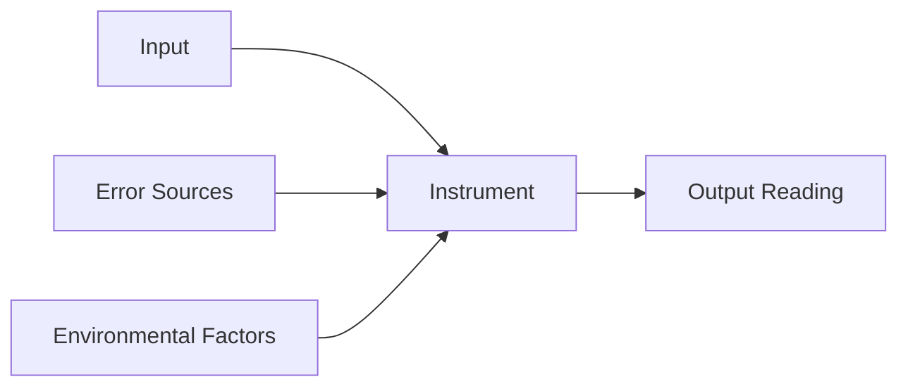

- **Static Characteristics**: Properties that don't vary with time
- **Dynamic Characteristics**: Properties that vary with time 

**Mnemonic:** "APRS-LRR: Accuracy and Precision, Resolution and Sensitivity, Linearity, Range, Response time"

## Question 2(a) [3 marks]

**Draw the construction diagram of Energy meter.**

**Answer**:
Energy meter measures electrical energy consumption in kilowatt-hours.

**Diagram:**

```goat
                   +-------+
                   | Meter |
                   | Dial  |
                   +-------+
                       |
                    +-----+
                    |Brake|
                    |Disc |
                    +-----+
                    /     \
                   /       \
           +-------+         +-------+
           |Current|         |Voltage|
           |Coil   |         |Coil   |
           +-------+         +-------+
           
```

- **Rotating Aluminum Disc**: Moves proportional to power
- **Current Coil**: Creates flux proportional to current
- **Voltage Coil**: Creates flux proportional to voltage
- **Permanent Magnet**: Provides braking torque

**Mnemonic:** "DVCP: Disc Velocity measures Consumed Power"

## Question 2(b) [4 marks]

**Explain working of PMMC in short.**

**Answer**:
PMMC (Permanent Magnet Moving Coil) is a basic mechanism used in various meters.

**Diagram:**

```goat
      +-------+
      |       |
    S |  Coil | N
      |       |
      +-------+
      |Spring |
      +-------+
        Pointer
```

| Component | Function |
|-----------|----------|
| Permanent Magnet | Creates strong magnetic field |
| Moving Coil | Carries current to be measured |
| Spring | Provides controlling torque |
| Pointer | Indicates reading on scale |

- **Deflection Principle**: When current flows through coil, it produces torque proportional to current
- **Advantages**: Linear scale, high accuracy, low power consumption

**Mnemonic:** "CODA: Current through cOil causes Deflection by Attraction"

## Question 2(c) [7 marks]

**1- A moving coil ammeter reading up to 1 ampere has a resistance of 0.02 ohm. How this instrument could be adopted to read current up to 100 amperes?**

**2- A moving coil voltmeter reading up to 20 mV has a resistance of 2 ohms. How this instrument can be adopted to read voltage up to 300 volts?**

**Answer**:

**1. Ammeter Range Extension:**

**Diagram:**

```goat
    I = 100A
    +-----------+
    |           |
    +--+     +--+
       |     |
       |     |
     +-+-+ +-+-+
     |Rm | |Rs |
     +-+-+ +-+-+
       |     |
       |     |
    +--+     +--+
    |           |
    +-----------+
```

- **Shunt Resistance Calculation**: Rs = Rm × Im/(I - Im)
- **Given**: Rm = 0.02Ω, Im = 1A, I = 100A
- **Solution**: Rs = 0.02 × 1/(100 - 1) = 0.02/99 = 0.000202Ω

**2. Voltmeter Range Extension:**

**Diagram:**

```goat
    +----Rs----+
    |          |
    |    +--+  |
    +----+Rm+--+
         +--+
          V
```

- **Series Resistance Calculation**: Rs = Rm × (V/Vm - 1)
- **Given**: Rm = 2Ω, Vm = 20mV, V = 300V
- **Solution**: Rs = 2 × (300/0.02 - 1) = 2 × (15000 - 1) = 2 × 14999 = 29,998Ω

**Mnemonic:** "SHIP: Shunt Has Inverse Proportion for current; Series for voltage"

## Question 2(a) OR [3 marks]

**Explain working of electronic multimeter.**

**Answer**:
Electronic multimeter measures multiple electrical parameters using electronic components.

**Diagram:**


- **Range Selection**: Selects appropriate measurement range
- **Signal Conditioning**: Converts input to proportional voltage
- **ADC**: Converts analog to digital for display
- **Digital Display**: Shows measured value

**Mnemonic:** "RSAD: Range Select, Amplify, Digitize"

## Question 2(b) OR [4 marks]

**Explain working of Moving Iron type instruments.**

**Answer**:
Moving Iron instruments measure AC/DC current and voltage based on magnetic attraction/repulsion.

| Types | Working Principle |
|-------|-------------------|
| Attraction Type | Iron piece is attracted toward electromagnet |
| Repulsion Type | Two iron pieces repel each other |

**Diagram:**

```goat
    +--------+
    | Spring |
    +----+---+
         |
    +----+----+
    |Iron Vane|--------+ Pointer
    +----+----+
         |
    +----+---+
    |  Coil  |
    +--------+
```

- **Operating Principle**: Current through coil creates magnetic field
- **Scale**: Non-linear (crowded at lower end)
- **Applications**: AC and DC measurements, ammeters, voltmeters

**Mnemonic:** "CADS: Current Activates, Deflection Shows"

## Question 2(c) OR [7 marks]

**Draw the block diagram of Ramp type DVM. Illustrate process of obtaining Multirange DC voltmeter with circuit diagram.**

**Answer**:
Ramp type DVM converts voltage to time interval using ramp comparison.

**Diagram for Ramp Type DVM:**

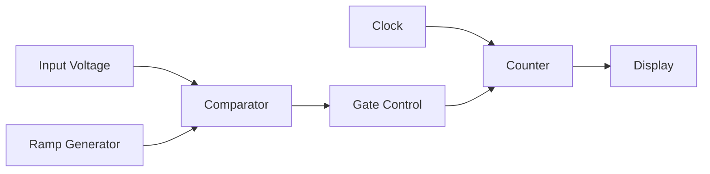

- **Working Principle**: Measures time taken for ramp to equal input voltage
- **Comparator**: Compares input with ramp voltage
- **Counter**: Counts clock pulses during comparison
- **Display**: Shows digital reading

**Multirange DC Voltmeter Circuit:**

```goat
       +--R1--+
       |      |
    Input     +--R2--+
       |      |      |
    +--+      +--R3--+
    |            |   |
    +--Switch----+   |
                     |
                   +-+-+
                   |DVM|
                   +-+-+
```

**Range Switching Process:**

- Each resistor provides different voltage division ratio
- Switch selects appropriate voltage divider network
- Voltage divider reduces input to fit DVM range

**Mnemonic:** "CRCD: Compare Ramp, Count Duration"

## Question 3(a) [3 marks]

**Describe features of Digital storage oscilloscope (DSO).**

**Answer**:
Digital Storage Oscilloscope converts analog signals to digital for storage and analysis.

| Features | Description |
|----------|-------------|
| **Digital Storage** | Stores waveforms for later analysis |
| **Triggering** | Multiple trigger modes and sources |
| **Waveform Processing** | Math operations on waveforms |
| **FFT Analysis** | Frequency domain view of signals |
| **Multiple Channels** | Simultaneous viewing of signals |
| **USB/LAN Connectivity** | Data transfer capabilities |

- **Sampling Rate**: Typically 1 GS/s or higher
- **Memory Depth**: Determines maximum capture time

**Mnemonic:** "SACRED: Storage, Analysis, Connectivity, Resolution, Extended functions, Digital processing"

## Question 3(b) [4 marks]

**Explain frequency measurement method using Lissajous pattern.**

**Answer**:
Lissajous patterns are used to compare frequencies of two signals.

**Diagram:**

```goat
    +-------+     +-------+
    |       |     |       |
    |   o   |     |   8   |
    |       |     |       |
    +-------+     +-------+
    1:1 ratio     2:1 ratio
    
    +-------+     +-------+
    |       |     |       |
    |   ∞   |     |   ⋮⋮⋮  |
    |       |     |       |
    +-------+     +-------+
    3:1 ratio     4:1 ratio
```

**Method:**

1. Apply unknown frequency to X-input
2. Apply reference frequency to Y-input
3. Observe Lissajous pattern on screen
4. Count tangent points to determine ratio

**Formula:** fx/fy = Ny/Nx

- Where Nx = horizontal tangent points
- Ny = vertical tangent points

**Mnemonic:** "XTYN: X-Tangents to Y-tangents gives the Number ratio"

## Question 3(c) [7 marks]

**Explain CRO with help of Block diagram.**

**Answer**:
Cathode Ray Oscilloscope (CRO) is used to display and analyze waveforms.

**Block Diagram:**

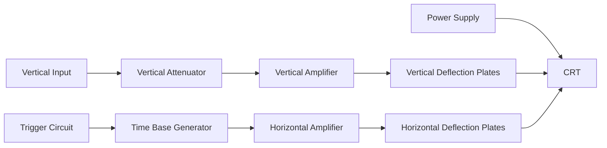

| Block | Function |
|-------|----------|
| Vertical Section | Processes input signal for Y-deflection |
| Horizontal Section | Generates sweep signal for X-deflection |
| Trigger Circuit | Synchronizes sweep with input signal |
| CRT | Displays the waveform pattern |
| Power Supply | Provides required voltages |

- **Electron Gun**: Produces electron beam
- **Deflection System**: Moves beam in X and Y directions
- **Screen**: Phosphor coating converts electrons to visible light

**Mnemonic:** "VCTHP: Vertical input, Conditioned signal, Triggered sweep, Horizontal deflection, Phosphor display"

## Question 3(a) OR [3 marks]

**Explain different types of CRO probes.**

**Answer**:
CRO probes connect the circuit under test to the oscilloscope input.

| Probe Type | Characteristics | Applications |
|------------|----------------|--------------|
| **Passive Probes** | Simple, economical, high impedance | General-purpose measurements |
| **Active Probes** | Built-in amplifier, low loading | High-frequency circuits |
| **Current Probes** | Measures current without circuit breaking | Current waveform measurements |
| **Differential Probes** | Measures between two points | Floating measurements |

**Diagram:**

```goat
    +-------+      +-------+
    | Scope |<-----| Probe |
    +-------+      +-------+
                       |
                   +---+---+
                   |Circuit|
                   +-------+
```

- **Attenuation Ratio**: Typically 1:1 or 10:1
- **Compensation**: Adjustable to match oscilloscope input

**Mnemonic:** "PACD: Passive, Active, Current, Differential"

## Question 3(b) OR [4 marks]

**Draw internal structure of CRT. Explain in brief.**

**Answer**:
Cathode Ray Tube (CRT) is the display device in an oscilloscope.

**Diagram:**

```goat
    Electron Gun                Deflection Plates         Screen
    +-----------+                  +--+     +---+            +-----+
    |           |                  |  |     |   |            |     |
    | C G A1 A2 |------------------|Y |-----| X |------------| P   |
    |           |                  |  |     |   |            |     |
    +-----------+                  +--+     +---+            +-----+
    
    C: Cathode, G: Grid, A1, A2: Anodes, Y,X: Deflection Plates, P: Phosphor
```

| Component | Function |
|-----------|----------|
| Electron Gun | Produces electron beam |
| Control Grid | Regulates beam intensity |
| Focusing Anodes | Concentrates electron beam |
| Deflection Plates | Control beam position |
| Phosphor Screen | Converts electrons to light |

- **Electron Beam**: High-velocity electrons emitted by cathode
- **Focusing System**: Anodes form electron lens
- **Deflection System**: X-Y plates move beam position
- **Phosphor Screen**: Glows where beam hits

**Mnemonic:** "GAFDS: Gun Aims, Focusing Directs, Screen shows"

## Question 3(c) OR [7 marks]

**Draw and explain block diagram of DSO in detail.**

**Answer**:
Digital Storage Oscilloscope (DSO) captures, stores and analyzes signals in digital form.

**Block Diagram:**

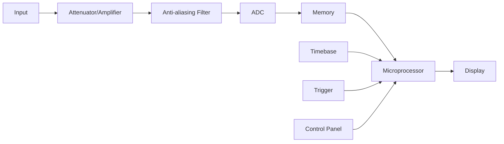

| Block | Function |
|-------|----------|
| Input Section | Signal conditioning and scaling |
| ADC | Converts analog to digital signals |
| Memory | Stores digitized waveform data |
| Microprocessor | Controls acquisition and processing |
| Display System | Shows waveforms and measurements |
| Trigger System | Determines when to start acquisition |

- **Sampling Rate**: Number of samples per second
- **Resolution**: Number of bits in ADC (typically 8-12 bits)
- **Memory Depth**: Number of samples that can be stored
- **Processing**: Waveform math, measurements, analysis

**Mnemonic:** "SAMPLE-D: Signal Acquisition, Memory Processing, Locking trigger, Display"

## Question 4(a) [3 marks]

**Give the comparison of NTC and PTC thermistor.**

**Answer**:

| Parameter | NTC Thermistor | PTC Thermistor |
|-----------|----------------|----------------|
| **Resistance Change** | Decreases with temperature | Increases with temperature |
| **Material** | Metal oxides (Mn, Ni, Co, Cu) | Barium titanate, polymers |
| **Response** | Exponential decrease | Sharp increase above threshold |
| **Applications** | Temperature measurement, compensation | Overcurrent protection, heating |
| **Temperature Range** | -50°C to 300°C | 0°C to 200°C |

**Diagram:**

```goat
    R |      /
      |     /
      |    /   PTC
      |   /
      |  /
      | /
      |/
      |\
      | \
      |  \
      |   \    NTC
      |    \
      |     \
      +------+---
             T
```

**Mnemonic:** "IN-DP: Increase Negative, Decrease Positive"

## Question 4(b) [4 marks]

**Explain working principle and construction of Thermocouple.**

**Answer**:
Thermocouple is a temperature sensor that works on the principle of Seebeck effect.

**Diagram:**

```goat
    Metal A   +--------+
    --------->|        |
              | V-meter|
    Metal B   |        |
    --------->+--------+
        |
        |
    +---+---+
    |Hot End|
    +-------+
```

**Construction:**

- Two dissimilar metals joined at one end (measuring junction)
- Other ends connected to measuring circuit (reference junction)
- Protective sheath for industrial applications

**Working Principle:**

- Temperature difference between junctions creates EMF
- EMF is proportional to temperature difference
- Output voltage typically in millivolts range
- Different metal combinations for different ranges

**Mnemonic:** "STEM: Seebeck-effect Transforms temperature to EMF in Metals"

## Question 4(c) [7 marks]

**Explain Working of strain Gauge and Load cell. Give advantages and disadvantages of RTD.**

**Answer**:

**Strain Gauge Working:**

- **Principle**: Resistance changes with mechanical deformation
- **Construction**: Thin wire or foil grid mounted on backing material
- **Operation**: When strained, resistance changes proportionally
- **Gauge Factor**: Ratio of relative change in resistance to strain

**Diagram for Strain Gauge:**

```goat
    +----------------------+
    |  ┌─┐┌─┐┌─┐┌─┐┌─┐┌─┐  |
    |  │ ││ ││ ││ ││ ││ │  |
    |  └─┘└─┘└─┘└─┘└─┘└─┘  |
    +----------------------+
           Backing
```

**Load Cell Working:**

- **Construction**: Strain gauges mounted on metal body (beam/ring)
- **Operation**: Weight causes deformation measured by strain gauges
- **Circuit**: Typically Wheatstone bridge configuration
- **Output**: Usually few millivolts per volt of excitation

**Diagram for Load Cell:**

```goat
    +-------+    Force   +-------+
    |       |----------->|       |
    |Fixed  |            |Strain |
    |Support|            |Gauges |
    +-------+            +-------+
```

**RTD (Resistance Temperature Detector):**

| Advantages | Disadvantages |
|------------|---------------|
| High accuracy | Expensive |
| Good stability | Requires excitation current |
| Wide temperature range | Self-heating effects |
| Linear response | Lower sensitivity than thermistor |
| Good repeatability | Slower response time |

**Mnemonic:** "SPANNER: Strain Proportionally Alters Nominal Nominal Electrical Resistance"

## Question 4(a) OR [3 marks]

**Explain Humidity Sensor Hygrometer.**

**Answer**:
Humidity sensor hygrometer measures relative humidity in air.

**Diagram:**


| Type | Sensing Principle |
|------|-------------------|
| Capacitive | Humidity changes dielectric constant |
| Resistive | Humidity changes resistance |
| Thermal | Humidity affects thermal conductivity |

- **Relative Humidity**: Ratio of actual to maximum water vapor
- **Measurement Range**: Typically 0-100% RH
- **Applications**: Weather stations, HVAC systems, industrial processes

**Mnemonic:** "CRT-H: Capacitance/Resistance/Thermal changes with Humidity"

## Question 4(b) OR [4 marks]

**Draw and explain Piezoelectric transducer.**

**Answer**:
Piezoelectric transducer converts mechanical stress to electrical signals and vice versa.

**Diagram:**

```goat
    +---------------+
    |    Electrodes |
    |  +---------+  |
    |  |         |  |
    |  | Crystal |  |
    |  |         |  |
    |  +---------+  |
    |    Electrodes |
    +---------------+
       |         |
       + Output  +
```

**Working Principle:**

- **Direct Effect**: Pressure produces electrical charge
- **Inverse Effect**: Voltage produces mechanical deformation
- **Materials**: Quartz, PZT, barium titanate

**Applications:**

- Pressure sensors
- Accelerometers
- Ultrasonic transducers
- Vibration sensors

**Mnemonic:** "PEMS: Pressure Ensures Measurable Signal"

## Question 4(c) OR [7 marks]

**Give the classification of transducers in detail.**

**Answer**:
Transducers convert one form of energy to another, classified in several ways:

| Classification | Types | Examples |
|----------------|-------|----------|
| **Based on Energy Conversion** | **Mechanical to Electrical** | Strain gauge, LVDT |
| | **Thermal to Electrical** | Thermocouple, RTD |
| | **Optical to Electrical** | Photodiode, LDR |
| | **Chemical to Electrical** | pH sensor, gas sensor |
| **Based on Operating Principle** | **Resistive** | Strain gauge, thermistor |
| | **Inductive** | LVDT, proximity sensor |
| | **Capacitive** | Humidity sensor, pressure sensor |
| | **Piezoelectric** | Accelerometer, force sensor |
| **Based on Application** | **Temperature** | Thermocouple, RTD, thermistor |
| | **Pressure** | Diaphragm, strain gauge based |
| | **Flow** | Ultrasonic, turbine, venturi |
| | **Level** | Float, ultrasonic, capacitive |

**Diagram:**

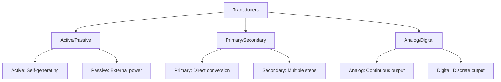

**Mnemonic:** "APAD RICE: Active/Passive, Analog/Digital with Resistive, Inductive, Capacitive, Electromagnetic"

## Question 5(a) [3 marks]

**Write short note on various Capacitive transducer.**

**Answer**:
Capacitive transducers operate on the principle that capacitance changes with physical parameters.

| Type | Working Principle | Applications |
|------|-------------------|--------------|
| **Displacement** | Gap between plates changes | Precision measurement |
| **Pressure** | Diaphragm deflection changes gap | Pressure sensors |
| **Level** | Dielectric changes with medium | Liquid level measurement |
| **Humidity** | Dielectric changes with moisture | Humidity sensors |

**Diagram:**

```goat
    +------------+
    |   Fixed    |
    |   Plate    |
    +------------+
           ^
           | Gap (d)
           v
    +------------+
    |  Movable   |
    |   Plate    |
    +------------+
```

- **Capacitance**: C = εA/d (ε: permittivity, A: area, d: distance)
- **Advantages**: High sensitivity, no physical contact needed
- **Limitations**: Affected by stray capacitance

**Mnemonic:** "PALD: Parameter Alters the Leading Dielectric"

## Question 5(b) [4 marks]

**Explain LVDT Transducer.**

**Answer**:
LVDT (Linear Variable Differential Transformer) measures linear displacement.

**Diagram:**

```goat
    Primary   Secondary 1   Secondary 2
      Coil        Coil         Coil
     +---+        +---+       +---+
     |   |        |   |       |   |
     |   |        |   |       |   |
     +---+        +---+       +---+
       |            |           |
       |            |           |
    +--+------------+-----------+--+
    |     Ferromagnetic Core       |
    +------------------------------+
```

**Working Principle:**

- Primary coil excited by AC voltage
- Core position determines coupling to secondaries
- Output voltage proportional to core displacement
- Null position when core centered (output = 0)

**Characteristics:**

- **Range**: Typically ±0.5mm to ±25cm
- **Linearity**: Excellent around null position
- **Sensitivity**: High, typically mV/mm
- **Resolution**: Nearly infinite (analog device)

**Mnemonic:** "MDVN: Movement Determines Voltage from Null"

## Question 5(c) [7 marks]

**Draw and explain Harmonics Distortion Analyzer.**

**Answer**:
Harmonic Distortion Analyzer measures distortion in audio and electronic signals.

**Block Diagram:**

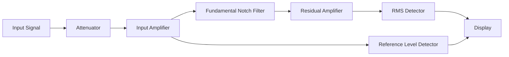

**Working Principle:**

1. Input signal is conditioned and amplified
2. Fundamental frequency is removed using notch filter
3. Remaining harmonic content is measured
4. Distortion calculated as ratio of harmonics to total signal

**Characteristics:**

- **Measurement Range**: Typically 0.001% to 100%
- **Frequency Range**: 20Hz to 100kHz
- **Applications**: Audio equipment testing, power quality analysis
- **Measurements**: THD (Total Harmonic Distortion), THD+N (THD plus Noise)

**Calculation**: THD = √(V₂² + V₃² + V₄² + ...)/(V₁ + V₂ + V₃ + ...)

- Where V₁ is fundamental, V₂, V₃, etc. are harmonics

**Mnemonic:** "FAIR-D: Filter And Isolate Residuals for Distortion"

## Question 5(a) OR [3 marks]

**Explain the working principle of Proximity sensors.**

**Answer**:
Proximity sensors detect objects without physical contact.

| Type | Working Principle | Detection Range |
|------|-------------------|-----------------|
| **Inductive** | Detects metal using electromagnetic field | 0.5-60mm |
| **Capacitive** | Detects any material by capacitance change | 3-60mm |
| **Ultrasonic** | Uses sound wave reflection | 1cm-10m |
| **Photoelectric** | Uses light beam interruption | Up to 50m |

**Diagram:**

```goat
    +--------+         +--------+
    | Sensor |  Field  | Object |
    +--------+ ------> +--------+
       |  ^
       |  |
    +--+--+--+
    |Controller|
    +----------+
```

- **Operating Modes**: Normally open or normally closed
- **Output Types**: Digital (on/off) or analog (proportional)
- **Applications**: Manufacturing, automation, security systems

**Mnemonic:** "CUPS: Capacitive, Ultrasonic, Photoelectric, Sense"

## Question 5(b) OR [4 marks]

**Explain absolute and incremental type of Optical encoder.**

**Answer**:
Optical encoders convert mechanical position to digital signals using light detection.

| Parameter | Absolute Encoder | Incremental Encoder |
|-----------|------------------|---------------------|
| **Output Format** | Complete position code | Pulse train |
| **Resolution** | Fixed by number of tracks | Determined by disk divisions |
| **Position Knowledge** | Maintained after power loss | Lost after power loss |
| **Complexity** | Higher (multiple tracks) | Lower (single track) |
| **Cost** | Higher | Lower |

**Diagram of Absolute Encoder:**

```goat
    +-------------+
    |  1 0 1 0 1  | <- Code Tracks
    |  1 1 0 0 1  |
    |  0 0 1 1 1  |
    +-------------+
           |
    +------+-------+
    | Light Source |
    +------+-------+
           |
    +------+-------+
    |   Detectors  |
    +--------------+
```

**Diagram of Incremental Encoder:**

```goat
    +-----------+
    |           |
    |  //////   | <- Single Track with slots
    |           |
    +-----------+
           |
    +------+-------+
    | Light Source |
    +------+-------+
           |
    +------+-------+
    |   Detectors  |
    +--------------+
```

- **A, B, Z Outputs**: 
  - A and B outputs are 90° out of phase for direction detection
  - Z (index) pulse once per revolution for reference

**Mnemonic:** "APIR-CD: Absolute Provides Immediate Reading, Counter Determines incremental"

## Question 5(c) OR [7 marks]

**Write short note on Digital IC Tester.**

**Answer**:
Digital IC Tester is used to verify functionality and detect faults in digital integrated circuits.

**Block Diagram:**

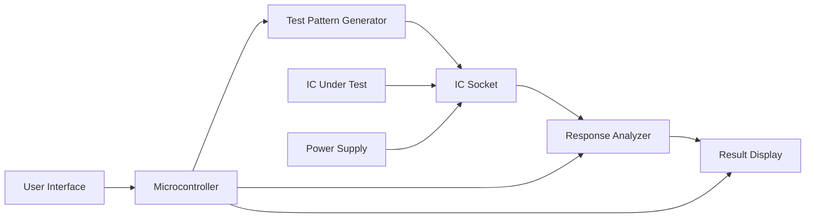

| Component | Function |
|-----------|----------|
| **Test Pattern Generator** | Creates input test signals |
| **IC Socket** | Holds the IC under test |
| **Response Analyzer** | Compares actual vs. expected outputs |
| **Display** | Shows test results and IC status |
| **Microcontroller** | Controls test sequence |

**Testing Methods:**

1. **Functional Testing**: Verifies logic functionality
2. **Parametric Testing**: Measures electrical parameters
3. **Fault Detection**: Identifies shorts, opens, stuck bits

**Types of IC Testers:**

- **Universal Testers**: Test multiple IC families (TTL, CMOS)
- **Dedicated Testers**: Designed for specific IC types
- **In-Circuit Testers**: Test ICs while in the circuit

**Capabilities:**

- **IC Identification**: Recognizes unknown ICs
- **Fault Diagnosis**: Identifies specific faults
- **Auto Test**: Performs comprehensive testing sequence

**Mnemonic:** "GATES: Generate And Test Every Signal"

## Question 5(c) (Additional) [7 marks]

**Below are the solved solutions for remaining questions present in the question paper:**

**Explain working of electronic multimeter.**

**Answer**:
Electronic multimeter uses electronic components to measure various electrical parameters.

**Block Diagram:**

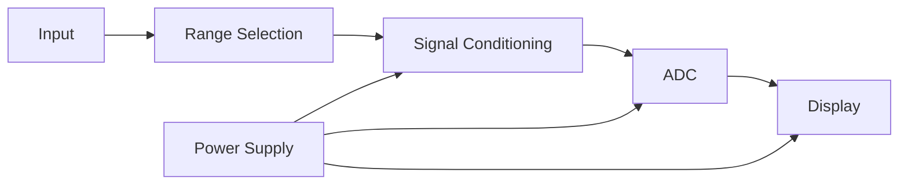

| Function | Circuit Components | Features |
|----------|-------------------|----------|
| **Voltage Measurement** | Input attenuator, amplifier | High impedance input |
| **Current Measurement** | Shunt resistor, amplifier | Low insertion loss |
| **Resistance Measurement** | Constant current source | Auto-ranging capability |
| **Display** | LCD or LED with drivers | Digital readout |

- **Advantages**: High input impedance, auto-ranging, digital accuracy
- **Applications**: Electronics troubleshooting, circuit testing, device calibration

**Mnemonic:** "MAAD: Measure, Amplify, Analyze, Display"

**Explain working of Moving Iron type instruments.**

**Answer**:
Moving Iron instruments operate based on magnetic force between current-carrying coil and iron piece.

| Type | Operation | Characteristics |
|------|-----------|-----------------|
| **Attraction Type** | Iron piece attracted to coil | Simple construction |
| **Repulsion Type** | Two iron pieces repel | Better accuracy |

**Diagram:**

```goat
                  Pivot
                    |
    +-----+       +-+-+
    |     |       | ^ |
    |Coil |       | | | Iron
    |     |       | | | Vane
    +-----+       +-+-+
                    |
                    v
                  Pointer
```

**Characteristics:**

- **Scale**: Non-linear, compressed at lower end
- **Response**: Measures both AC and DC (responds to RMS value)
- **Accuracy**: Lower than PMMC type
- **Power Consumption**: Relatively high

**Mnemonic:** "AMIR: Attraction Moves Iron with Reluctance"

**Explain Humidity Sensor Hygrometer.**

**Answer**:
Humidity sensors measure the amount of water vapor in air or other gases.

**Types of Humidity Sensors:**

| Type | Working Principle | Characteristics |
|------|-------------------|-----------------|
| **Capacitive** | Humidity changes dielectric constant | Wide range, good accuracy |
| **Resistive** | Humidity changes resistance | Simple, cost-effective |
| **Thermal** | Humidity affects thermal conductivity | Good for high temperatures |

**Diagram:**

```goat
    +----------+
    | Humidity | 
    | Sensing  |--+
    | Element  |  |
    +----------+  |
                  |
    +----------+  |
    | Signal   |<-+
    | Circuit  |--+
    +----------+  |
                  |
    +----------+  |
    | Display/ |<-+
    | Output   |
    +----------+
```

**Measurements:**

- **Relative Humidity (RH)**: Percentage of actual to maximum moisture
- **Dew Point**: Temperature at which condensation occurs
- **Absolute Humidity**: Mass of water vapor per volume

**Applications:**

- Weather stations
- HVAC systems
- Industrial process control
- Medical equipment

**Mnemonic:** "CRAP-H: Capacitance or Resistance Alters with Presence of Humidity"

**Draw and explain Piezoelectric transducer.**

**Answer**:
Piezoelectric transducers convert mechanical force to electrical signal and vice versa.

**Diagram:**

```goat
           Force
             |
             v
    +--------------------+
    |      Metal         |
    |    Electrodes      |
    | +----------------+ |
    | |                | |
    | | Piezoelectric  | |
    | |   Crystal      | |
    | |                | |
    | +----------------+ |
    |      Metal         |
    |    Electrodes      |
    +--------------------+
          |      |
          +      -
       Electrical Output
```

**Working Principle:**

- **Direct Effect**: Pressure generates electric charge
- **Reverse Effect**: Electric field causes mechanical deformation
- **Materials**: Quartz, PZT, barium titanate, lithium niobate

**Characteristics:**

- **High Frequency Response**: Up to MHz range
- **High Output Impedance**: Requires charge amplifier
- **Self-Generating**: No external power for sensing
- **Dynamic Response**: Not suitable for static measurements

**Applications:**

- Accelerometers
- Pressure sensors
- Ultrasonic transducers
- Microphones
- Ignition systems

**Mnemonic:** "PEMS: Pressure Equals Measurable Signal"
