## પ્રશ્ન 1(અ) [3 ગુણ]

**એક્યુરેસી, રીપ્રોડ્યુસીબિબિટી અને રિપીટેબિલિટી ની વ્યાખ્યા આપો.**

**જવાબ**:

| પદ | વ્યાખ્યા |
|------|------------|
| **એક્યુરેસી** | માપવામાં આવતા પરિમાણની વાસ્તવિક કિંમત સાથે માપેલી કિંમતની નજીકતા |
| **રીપ્રોડ્યુસીબિલિટી** | અલગ-અલગ પરિસ્થિતિઓમાં (અલગ ઓપરેટર, સ્થાન, સમય) એક જ ઇનપુટ માટે એકસમાન માપ આપવાની ઉપકરણની ક્ષમતા |
| **રિપીટેબિલિટી** | એક જ પરિસ્થિતિઓમાં વારંવાર માપ લેવામાં આવે ત્યારે એક જ ઇનપુટ માટે એકસમાન માપ આપવાની ઉપકરણની ક્ષમતા |

**મેમરી ટ્રીક:** "ARR - સચોટ પરિણામો વારંવાર"

## પ્રશ્ન 1(બ) [4 ગુણ]

**વ્હીટસ્ટોન બ્રિજની આકૃતિ દોરી અને સમજાવો.**

**જવાબ**:

**આકૃતિ:**

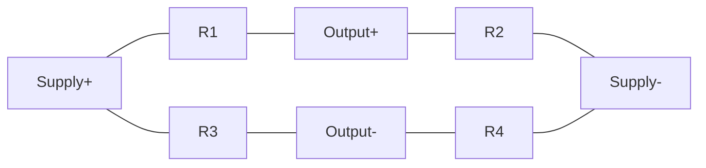

| લક્ષણ | વિગત |
|---------|-------------|
| **રચના** | હીરા આકારમાં જોડાયેલા ચાર અવરોધકો |
| **સંતુલન શરત** | R1/R2 = R3/R4 (જ્યારે આઉટપુટ વોલ્ટેજ શૂન્ય હોય) |
| **ઉપયોગ** | અજ્ઞાત અવરોધનું ચોક્કસ માપન |
| **કાર્યપદ્ધતિ** | એક બાજુમાં અજ્ઞાત અવરોધક મૂકવામાં આવે છે, બ્રિજ સંતુલિત થાય ત્યાં સુધી બાકીના અવરોધકો સમાયોજિત કરવામાં આવે છે |

**મેમરી ટ્રીક:** "WBMP - સંતુલિત થઈને ચોક્કસ માપો"

## પ્રશ્ન 1(ક) [7 ગુણ]

**Q મીટરનો સિદ્ધાંત સમજાવો. અને સાથે સાથે પ્રેક્ટીકલ Q મીટરની આકૃતિ દોરી અને સમજાવો.**

**જવાબ**:

**Q મીટરનો સિદ્ધાંત:**

Q-મીટર શ્રેણી અનુનાદના સિદ્ધાંત પર કાર્ય કરે છે, જ્યાં Q ફેક્ટર અનુનાદ સમયે લાગુ વોલ્ટેજની તુલનામાં કેપેસિટર પરના વોલ્ટેજના ગુણોત્તર તરીકે માપવામાં આવે છે.

**પ્રેક્ટીકલ Q મીટરની આકૃતિ:**


| ઘટક | કાર્ય |
|-----------|----------|
| **RF ઓસિલેટર** | ચલ આવૃત્તિ સિગ્નલ પૂરા પાડે છે |
| **વર્ક કોઇલ** | ટેસ્ટ સર્કિટમાં ઇન્ડક્ટિવલી સિગ્નલ જોડે છે |
| **અનુનાદ સર્કિટ** | ચલ કેપેસિટર C સાથે ટેસ્ટ ઇન્ડક્ટર L શ્રેણીમાં |
| **VTVM** | કેપેસિટર પરના વોલ્ટેજને માપે છે |
| **Q-સ્કેલ** | સીધો Q મૂલ્ય વાંચવા માટે અંશાંકિત |

- **અનુનાદ સૂત્ર**: f = 1/(2π√LC)
- **Q ગણતરી**: Q = Vc/Vs (કેપેસિટર પરનું વોલ્ટેજ / સ્રોત વોલ્ટેજ)

**મેમરી ટ્રીક:** "RIVQ - અનુનાદ મૂલ્યવાન ગુણવત્તા દર્શાવે છે"

## પ્રશ્ન 1(ક OR) [7 ગુણ]

**મુવિંગ કોઈલ ટાઈપ ઇન્સ્ટ્રુમેન્ટની રચના દોરો અનેસમજાવો.**

**જવાબ**:

**આકૃતિ:**

```goat
            +---------+
            |    N    |
            |         |
            |         |
   +--------+-+     +-+--------+
   |    |     |     |     |    |
   |    |     |     |     |    |
   |    |  S  |     |  S  |    |
   |    |     |     |     |    |
   +----+     |     |     +----+
        |     +-----+     |
        |      Coil       |
        |                 |
        +-----------------+
```

| ઘટક | વિગત |
|-----------|-------------|
| **કાયમી ચુંબક** | મજબૂત ચુંબકીય ક્ષેત્ર બનાવે છે |
| **મુવિંગ કોઇલ** | એલ્યુમિનિયમ ફ્રેમ પર વીંટળાયેલી હળવી કોઇલ |
| **સ્પ્રિંગ્સ** | નિયંત્રિત બળ પૂરું પાડે છે અને વીજળીક જોડાણો બનાવે છે |
| **પોઇન્ટર** | કોઇલ સાથે જોડાયેલ, અંશાંકિત સ્કેલ પર ગતિ કરે છે |
| **કોર** | ચુંબકીય પ્રવાહને કેન્દ્રિત કરવા માટે નરમ લોખંડનો નળાકાર કોર |

- **કાર્ય સિદ્ધાંત**: વળાંક બળ = BIlN (B-ક્ષેત્ર તીવ્રતા, I-વીજપ્રવાહ, l-લંબાઈ, N-આંટા)
- **નિયંત્રિત બળ**: વળાંક ખૂણા પ્રમાણે સ્પ્રિંગ્સ દ્વારા પ્રદાન કરાયેલ

**મેમરી ટ્રીક:** "MAPS-C: ચુંબક ક્રિયા કરે છે, પોઇન્ટર વીજપ્રવાહ બતાવે છે"

## પ્રશ્ન 2(અ) [3 ગુણ]

**અલગ અલગ પ્રકારની એરરની યાદી બનાવો અને કોઈપણ બે સમજાવો.**

**જવાબ**:

| એરર ના પ્રકાર |
|----------------|
| **ગ્રોસ એરર (મોટી ભૂલો)** |
| **સિસ્ટેમેટિક એરર (પદ્ધતિસરની ભૂલો)** |
| **રેન્ડમ એરર (અનિયમિત ભૂલો)** |
| **પર્યાવરણીય એરર** |
| **લોડિંગ એરર** |

**બે એરર ની સમજૂતી:**

1. **સિસ્ટેમેટિક એરર**: 
   - વાસ્તવિક મૂલ્યથી સાતત્યપૂર્ણ અને અનુમાનિત વિચલન
   - ઉપકરણ અંશાંકન, ડિઝાઇન, અથવા પદ્ધતિને કારણે થાય છે

2. **રેન્ડમ એરર**: 
   - માપનમાં અણધારી વિવિધતાઓ
   - નોઇઝ, પર્યાવરણીય ફેરફારો, અથવા નિરીક્ષકની મર્યાદાઓને કારણે થાય છે

**મેમરી ટ્રીક:** "GSREL - સારી પદ્ધતિઓ ભૂલ સ્તર ઘટાડે છે"

## પ્રશ્ન 2(બ) [4 ગુણ]

**મેક્સવેલ બ્રિજ દોરો અને સમજાવો.**

**જવાબ**:

**આકૃતિ:**

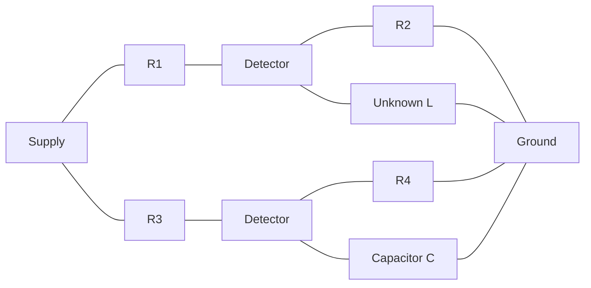

| ઘટક | કાર્ય |
|-----------|----------|
| **R1, R2, R3, R4** | બ્રિજના બાહુઓમાં ચોકસાઈપૂર્ણ અવરોધકો |
| **અજ્ઞાત L** | માપવાના અવરોધ સાથેનો ઇન્ડક્ટર |
| **કેપેસિટર C** | સામેની બાજુમાં પ્રમાણભૂત કેપેસિટર |
| **ડિટેક્ટર** | નલ ડિટેક્ટર (ગેલ્વેનોમીટર) |

- **સંતુલન સમીકરણ**: L = CR2R3
- **અવરોધ સમીકરણ**: RL = R2R3/R4
- **ઉપયોગ**: નોંધપાત્ર અવરોધ સાથેના ઇન્ડક્ટન્સનું માપન

**મેમરી ટ્રીક:** "MBLR - મેક્સવેલ બ્રિજ અવરોધને જોડે છે"

## પ્રશ્ન 2(ક) [7 ગુણ]

**મુવિંગ આયર્ન ટાઈપ ઇન્સ્ટ્રુમેન્ટની રચના દોરો અનેસમજાવો.**

**જવાબ**:

**આકૃતિ:**

```goat
     +---------------------+
     |                     |
     |     +----------+    |
     |     |          |    |
     |     |   Coil   |    |
     |     |          |    |
     |     +----------+    |
     |          ||         |
     |    +-----++------+  |
     |    |     ||      |  |
     |    |  Iron Vanes |  |
     |    |             |  |
     |    +-------------+  |
     |                     |
     +---------------------+
```

| ઘટક | વિગત |
|-----------|-------------|
| **કોઇલ** | માપન કરવાના વીજપ્રવાહને વહન કરતી સ્થિર કોઇલ |
| **આયર્ન વેન્સ** | બે નરમ લોખંડના ટુકડા (એક સ્થિર, એક ગતિશીલ) |
| **પોઇન્ટર** | ગતિશીલ વેન સાથે જોડાયેલ |
| **કંટ્રોલ સ્પ્રિંગ** | અવરોધિત બળ પૂરું પાડે છે |
| **ડેમ્પિંગ મિકેનિઝમ** | હલકા એલ્યુમિનિયમ પિસ્ટનનો ઉપયોગ કરીને હવાના ઘર્ષણ દ્વારા ડેમ્પિંગ |

- **કાર્ય સિદ્ધાંત**: જ્યારે કોઇલમાંથી વીજપ્રવાહ પસાર થાય છે, ત્યારે બંને લોખંડના ટુકડા સમાન ધ્રુવતા સાથે ચુંબકિત થાય છે જેના કારણે વિકર્ષણ થાય છે
- **ફાયદા**: AC અને DC બંને માટે યોગ્ય, મજબૂત બાંધકામ
- **ગેરફાયદા**: બિન-સમાન સ્કેલ, PMMC કરતાં વધુ વીજ વપરાશ

**મેમરી ટ્રીક:** "IRAM - આયર્ન વિકર્ષણ ગતિ સક્રિય કરે છે"

## પ્રશ્ન 2(અ OR) [3 ગુણ]

**બેસિક ડીસી વોલ્ટમીટર સમજાવો.**

**જવાબ**:

**આકૃતિ:**

```goat
  +-------+    +---------+    +-----------+
  | PMMC  |--->| Series  |--->| Scale     |
  | Meter |    | Resistor|    | Calibrated|
  +-------+    +---------+    +-----------+
```

| ઘટક | કાર્ય |
|-----------|----------|
| **PMMC મૂવમેન્ટ** | મૂળભૂત વીજપ્રવાહ-સંવેદનશીલ મૂવમેન્ટ |
| **મલ્ટિપ્લાયર રેઝિસ્ટર** | ઉચ્ચ-મૂલ્યનો શ્રેણી અવરોધક |
| **સ્કેલ** | સીધા વોલ્ટેજ વાંચવા માટે અંશાંકિત |

- **કાર્ય સિદ્ધાંત**: વોલ્ટમીટર શ્રેણી અવરોધક સાથેનું PMMC મીટર છે
- **ગણતરી**: Rs = (V/Im) - Rm (Rs=શ્રેણી અવરોધક, V=વોલ્ટેજ, Im=પૂર્ણ સ્કેલ વીજપ્રવાહ, Rm=મીટર અવરોધ)

**મેમરી ટ્રીક:** "SVM - શ્રેણી વોલ્ટેજ માપન"

## પ્રશ્ન 2(બ OR) [4 ગુણ]

**શેરિંગ બ્રિજ દોરો અને સમજાવો.**

**જવાબ**:

**આકૃતિ:**

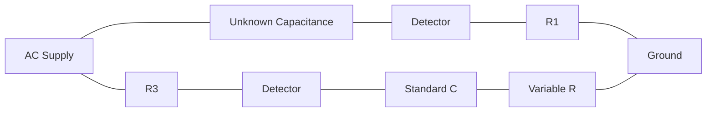

| ઘટક | કાર્ય |
|-----------|----------|
| **C1** | અજ્ઞાત કેપેસિટર (લોસ સાથે) |
| **R1** | C1 માં લોસનું પ્રતિનિધિત્વ કરતો અવરોધ |
| **R3, R4** | ચોકસાઈપૂર્ણ અવરોધકો |
| **C4** | પ્રમાણભૂત લોસ-ફ્રી કેપેસિટર |
| **ડિટેક્ટર** | નલ સૂચક |

- **સંતુલન સમીકરણ**: C1 = C4(R3/R1)
- **વિસર્જન ફેક્ટર**: D = ωC1R1 = ωC4R4
- **ઉપયોગ**: કેપેસિટન્સ અને ડાયલેક્ટ્રિક લોસનું માપન

**મેમરી ટ્રીક:** "SCDR - શેરિંગ કેપેસિટન્સ અવરોધ નક્કી કરે છે"

## પ્રશ્ન 2(ક OR) [7 ગુણ]

**ઇલેક્ટ્રોનિક મલ્ટીમીટર ઉપર ટૂંકનોંધ લખો.**

**જવાબ**:

**આકૃતિ:**


| લક્ષણ | વિગત |
|---------|-------------|
| **કાર્યો** | વોલ્ટેજ (AC/DC), વીજપ્રવાહ (AC/DC), અવરોધ, અને અન્ય પરિમાણોનું માપન કરે છે |
| **સંવેદનશીલતા** | એનાલોગ મીટર કરતાં વધુ સંવેદનશીલતા (સામાન્ય રીતે 10MΩ ઇનપુટ ઇમ્પીડન્સ) |
| **રેન્જ** | ઘણી પસંદ કરી શકાય તેવી માપન રેન્જ |
| **ચોકસાઈ** | ગુણવત્તા અને પરિમાણ પર આધારિત 0.1% થી 3% |
| **ડિસ્પ્લે** | ડિજિટલ રીડઆઉટ અથવા એનાલોગ પોઇન્ટર |

- **પ્રકાર**: એનાલોગ ઇલેક્ટ્રોનિક મલ્ટીમીટર, ડિજિટલ મલ્ટીમીટર (DMM)
- **ફાયદા**: ઉચ્ચ ઇનપુટ ઇમ્પીડન્સ, ન્યૂનતમ લોડિંગ અસર, ઘણા કાર્યો
- **મુખ્ય સર્કિટ**: ઇનપુટ એટેન્યુએટર, સિગ્નલ કન્વર્ટર, એમ્પ્લિફાયર, રેક્ટિફાયર, ડિસ્પ્લે ડ્રાઇવર

**મેમરી ટ્રીક:** "VCAR-D: વોલ્ટેજ, વીજપ્રવાહ અને અવરોધ - પ્રદર્શિત"

## પ્રશ્ન 3(અ) [3 ગુણ]

**CRO ના અલગ અલગ પ્રોબ્સ સમજાવો.**

**જવાબ**:

| પ્રોબના પ્રકાર | વિગત |
|--------------|-------------|
| **પેસિવ પ્રોબ (1X)** | સીધા જોડાણ પ્રોબ, કોઈ ઘટાડો નહીં |
| **પેસિવ પ્રોબ (10X)** | સિગ્નલને 10 ગણો ઘટાડે છે, સર્કિટ લોડિંગ ઘટાડે છે |
| **એક્ટિવ પ્રોબ** | ઉચ્ચ ઇમ્પીડન્સ અને ઓછા કેપેસિટન્સ માટે એક્ટિવ ઘટકો ધરાવે છે |
| **કરંટ પ્રોબ** | ચુંબકીય ક્ષેત્ર દ્વારા વીજપ્રવાહ માપે છે |

- **પસંદગીના માપદંડ**: બેન્ડવિડ્થ, લોડિંગ ઇફેક્ટ, માપન રેન્જ
- **કોમ્પેન્સેશન**: સચોટ વેવફોર્મ માટે 10X પ્રોબ્સને કોમ્પેન્સેશન એડજસ્ટમેન્ટની જરૂર પડે છે

**મેમરી ટ્રીક:** "PAC-S: પ્રોબ્સ સર્કિટ સેન્સિંગની મંજૂરી આપે છે"

## પ્રશ્ન 3(બ) [4 ગુણ]

**ક્લેમ્પોન મીટરની રચના દોરો અને સમજાવો.**

**જવાબ**:

**આકૃતિ:**

```goat
       +---------------+
       |    Display    |
       +---------------+
       |               |
       |    Circuit    |
       |               |
    +--+               +--+
    |  |               |  |
    |  +---------------+  |
    |                     |
    |      +-------+      |
    |      |       |      |
    +------+       +------+
           | Wire  |
           +-------+
```

| ઘટક | કાર્ય |
|-----------|----------|
| **સ્પ્લિટ કોર CT** | વાહક ચારે બાજુ ક્લેમ્પ કરતું ફેરાઇટ કોર |
| **કોઇલ વાઇન્ડિંગ** | પ્રેરિત વીજપ્રવાહ ઉત્પન્ન કરતી સેકન્ડરી વાઇન્ડિંગ |
| **સિગ્નલ સર્કિટરી** | વીજપ્રવાહને માપી શકાય તેવા સિગ્નલમાં રૂપાંતરિત કરે છે |
| **ડિસ્પ્લે યુનિટ** | એમ્પ્સમાં અંશાંકિત ડિજિટલ/એનાલોગ ડિસ્પ્લે |
| **ટ્રિગર મિકેનિઝમ** | વાહક આસપાસ કોર ખોલે/બંધ કરે છે |

- **કાર્ય સિદ્ધાંત**: કરંટ ટ્રાન્સફોર્મર પર આધારિત, સર્કિટ તોડ્યા વિના વીજપ્રવાહ માપે છે
- **ઉપયોગો**: લાઇવ વાહકોમાં AC વીજપ્રવાહને સુરક્ષિત રીતે માપવો

**મેમરી ટ્રીક:** "CAMP - ચુંબકીય સિદ્ધાંત દ્વારા વીજપ્રવાહનું વિશ્લેષણ"

## પ્રશ્ન 3(ક) [7 ગુણ]

**સક્સેસિવ એપ્રોક્સિમેશન ટાઈપ DVM ઉપર ટૂંક નોંધ લખો.**

**જવાબ**:

**બ્લોક ડાયાગ્રામ:**

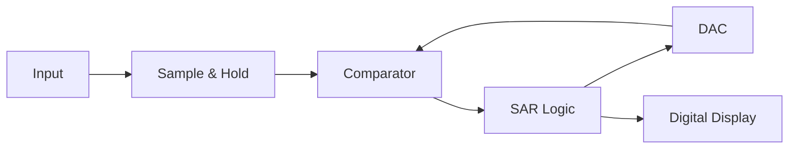

| ઘટક | કાર્ય |
|-----------|----------|
| **સેમ્પલ એન્ડ હોલ્ડ** | ઇનપુટ વોલ્ટેજને પકડે અને જાળવે છે |
| **કમ્પેરેટર** | ઇનપુટને DAC આઉટપુટ સાથે સરખાવે છે |
| **સક્સેસિવ એપ્રોક્સિમેશન રજિસ્ટર** | બાઇનરી સર્ચ એલ્ગોરિધમને નિયંત્રિત કરે છે |
| **D/A કન્વર્ટર** | તુલના માટે એનાલોગ વોલ્ટેજ ઉત્પન્ન કરે છે |
| **ડિજિટલ ડિસ્પ્લે** | માપેલી કિંમત બતાવે છે |

- **કાર્ય સિદ્ધાંત**: એનાલોગ ઇનપુટને મેળ ખાતી ડિજિટલ કિંમત શોધવા બાઇનરી સર્ચ એલ્ગોરિધમનો ઉપયોગ કરે છે
- **રૂપાંતરનો સમય**: ઇનપુટના કદની પરવા કર્યા વિના નિશ્ચિત (8-16 બિટ માટે 8-16 ક્લોક સાયકલ)
- **ફાયદા**: મધ્યમ ગતિ, સારી રિઝોલ્યુશન, સાતત્યપૂર્ણ રૂપાંતરનો સમય
- **ઉપયોગો**: સામાન્ય હેતુના માપન જ્યાં મધ્યમ ગતિ પૂરતી છે

**મેમરી ટ્રીક:** "SACD - સેમ્પલ, એપ્રોક્સિમેટ, કમ્પેર, ડિસ્પ્લે"

## પ્રશ્ન 3(અ OR) [3 ગુણ]

**PH સેન્સર સમજાવો.**

**જવાબ**:

**આકૃતિ:**

```goat
    +-----------------+
    | Glass Electrode |---+
    +-----------------+   |
                          |
    +-----------------+   |
    | Reference       |---+-----> Output
    | Electrode       |   |
    +-----------------+   |
                          |
    +-----------------+   |
    | Temperature     |---+
    | Compensation    |
    +-----------------+
```

| ઘટક | કાર્ય |
|-----------|----------|
| **ગ્લાસ ઇલેક્ટ્રોડ** | હાઇડ્રોજન આયન સાંદ્રતા પ્રત્યે સંવેદનશીલ |
| **રેફરન્સ ઇલેક્ટ્રોડ** | સ્થિર સંદર્ભ પોટેન્શિયલ પ્રદાન કરે છે |
| **તાપમાન સેન્સર** | તાપમાનની અસરો માટે વળતર આપે છે |
| **સિગ્નલ કન્ડિશનર** | મિલિવોલ્ટ સિગ્નલને એમ્પ્લિફાય અને પ્રોસેસ કરે છે |

- **કાર્ય સિદ્ધાંત**: હાઇડ્રોજન આયન સાંદ્રતાના પ્રમાણમાં વોલ્ટેજ ઉત્પન્ન કરે છે
- **આઉટપુટ**: 25°C પર દર pH એકમ દીઠ ~59 mV
- **રેન્જ**: 0-14 pH સ્કેલ (એસિડિક થી આલ્કલાઇન)

**મેમરી ટ્રીક:** "PHRV - pH વોલ્ટેજ સાથે સંબંધિત છે"

## પ્રશ્ન 3(બ OR) [4 ગુણ]

**ઇલેક્ટ્રોનિક વોટ મીટરની રચના દોરો અને સમજાવો.**

**જવાબ**:

**બ્લોક ડાયાગ્રામ:**

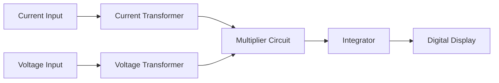

| ઘટક | કાર્ય |
|-----------|----------|
| **કરંટ સેન્સર** | CT અથવા શન્ટ દ્વારા લોડ કરંટ માપે છે |
| **વોલ્ટેજ સેન્સર** | પોટેન્શિયલ ડિવાઇડર દ્વારા વોલ્ટેજ માપે છે |
| **મલ્ટિપ્લાયર** | ક્ષણિક વોલ્ટેજ અને વીજપ્રવાહને ગુણાકાર કરે છે |
| **ઇન્ટિગ્રેટર** | સમય પર પાવરની સરેરાશ લે છે |
| **ડિસ્પ્લે** | વોટ્સમાં ડિજિટલ રીડઆઉટ |

- **કાર્ય સિદ્ધાંત**: પાવર = V × I × cosθ (cosθ એ પાવર ફેક્ટર છે)
- **ફાયદા**: ઉચ્ચ ચોકસાઈ, વિશાળ શ્રેણી, ડિજિટલ ડિસ્પ્લે
- **પ્રકાર**: ટ્રુ RMS, એવરેજ સેન્સિંગ

**મેમરી ટ્રીક:** "VIMP - વોલ્ટેજ અને તીવ્રતા પાવર બનાવે છે"

## પ્રશ્ન 3(ક OR) [7 ગુણ]

**ઇન્ટીગ્રેટિંગ ટાઈપ DVM ઉપર ટૂંક નોંધ લખો.**

**જવાબ**:

**બ્લોક ડાયાગ્રામ:**

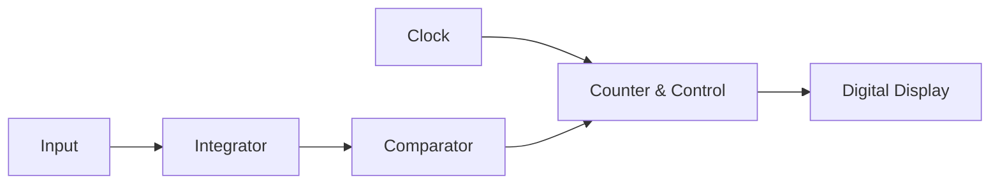

| પ્રકાર | કાર્ય સિદ્ધાંત |
|------|-------------------|
| **ડ્યુઅલ-સ્લોપ** | નિશ્ચિત સમય માટે ઇનપુટને ઇન્ટિગ્રેટ કરે છે, પછી સંદર્ભ સાથે ડિસ્ચાર્જ સમય માપે છે |
| **વોલ્ટેજ-ટુ-ફ્રિક્વન્સી** | વોલ્ટેજને આવૃત્તિમાં રૂપાંતરિત કરે છે, નિશ્ચિત સમય પર પલ્સની ગણતરી કરે છે |
| **ચાર્જ-બેલેન્સ** | ઇનપુટ ચાર્જને સંદર્ભ ચાર્જ સાથે સંતુલિત કરે છે |

**મુખ્ય લક્ષણો:**

- **નોઇઝ રિજેક્શન**: પાવર લાઇન નોઇઝ (50/60Hz) નું ઉત્કૃષ્ટ રિજેક્શન
- **ચોકસાઈ**: સમય સરેરાશને કારણે ઉચ્ચ ચોકસાઈ
- **રૂપાંતરની ગતિ**: સક્સેસિવ એપ્રોક્સિમેશન પ્રકાર કરતાં ધીમી
- **રિઝોલ્યુશન**: સામાન્ય રીતે 4½ થી 6½ અંક

**ઉપયોગો**: ચોકસાઈપૂર્ણ માપ, ધોંધાટિયા વાતાવરણ, બેન્ચ ઇન્સ્ટ્રુમેન્ટ્સ

**મેમરી ટ્રીક:** "TINA - સમય ઇન્ટિગ્રેશન સરેરાશને શૂન્ય કરે છે"

## પ્રશ્ન 4(અ) [3 ગુણ]

**ડિજિટલ સ્ટોરેજ ઓસીલોસ્કોપના ફાયદા અને ઉપયોગો લખો.**

**જવાબ**:

| ફાયદા | ઉપયોગો |
|------------|--------------|
| **પ્રી-ટ્રિગર વ્યુઇંગ** | ક્ષણિક ઘટનાઓને કેપ્ચર કરવી |
| **સિગ્નલ સ્ટોરેજ** | અનિયમિત ખામીઓનું વિશ્લેષણ |
| **વેવફોર્મ પ્રોસેસિંગ** | જટિલ સિગ્નલ વિશ્લેષણ |
| **ઉચ્ચ બેન્ડવિડ્થ** | ઉચ્ચ-ગતિ ડિજિટલ સર્કિટ ટેસ્ટિંગ |
| **મલ્ટિપલ ચેનલ ડિસ્પ્લે** | ઘણા સિગ્નલોની તુલના |

- **મુખ્ય લાભ**: એક-વખતની ઘટનાઓને કેપ્ચર કરી શકે છે, પછીના વિશ્લેષણ માટે વેવફોર્મ સંગ્રહિત કરી શકે છે
- **ડિજિટલ સુવિધાઓ**: ઓટોમેટેડ માપ, FFT વિશ્લેષણ, PC કનેક્ટિવિટી

**મેમરી ટ્રીક:** "SPADE - સંગ્રહ, પ્રોસેસિંગ, વિશ્લેષણ, ડિસ્પ્લે, ઘટનાઓ"

## પ્રશ્ન 4(બ) [4 ગુણ]

**ઇલેક્ટ્રોનિક એનર્જી મીટર ઉપર ટૂંકનોંધ લખો.**

**જવાબ**:

**બ્લોક ડાયાગ્રામ:**

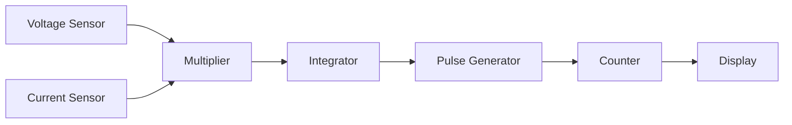

| ઘટક | કાર્ય |
|-----------|----------|
| **વોલ્ટેજ અને કરંટ સેન્સર** | લાઇન વોલ્ટેજ અને લોડ કરંટ માપે છે |
| **મલ્ટિપ્લાયર સર્કિટ** | ક્ષણિક પાવરની ગણતરી કરે છે |
| **ઇન્ટિગ્રેટર** | સમય પર પાવરને ઊર્જામાં રૂપાંતરિત કરે છે |
| **માઇક્રોકંટ્રોલર** | સિગ્નલ પ્રોસેસ કરે છે અને ડિસ્પ્લેને નિયંત્રિત કરે છે |
| **LCD ડિસ્પ્લે** | kWh માં ઊર્જા વપરાશ બતાવે છે |

- **કાર્ય સિદ્ધાંત**: ઊર્જા = ∫P.dt (સમય પર પાવરનું ઇન્ટિગ્રલ)
- **ફાયદા**: કોઈ ગતિશીલ ભાગો નહીં, ઉચ્ચ ચોકસાઈ, છેડછાડ શોધન
- **સુવિધાઓ**: મલ્ટિપલ ટેરિફ સપોર્ટ, બે-દિશા માપન, રિમોટ રીડિંગ

**મેમરી ટ્રીક:** "VICES - વોલ્ટેજ અને કરંટ ઊર્જા સરવાળો"

## પ્રશ્ન 4(ક) [7 ગુણ]

**એનાલોગ C.R.O. નો બ્લોક ડાયાગ્રામ દોરો અને સમજાવો, અને દરેક બ્લોકનું વર્કિંગ લખો.**

**જવાબ**:

**બ્લોક ડાયાગ્રામ:**

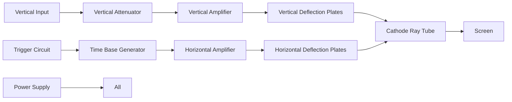

| બ્લોક | કાર્ય |
|-------|----------|
| **વર્ટિકલ સિસ્ટમ** | એમ્પ્લિટ્યુડ ડિસ્પ્લેને નિયંત્રિત કરે છે (સિગ્નલ અટેન્યુએશન, એમ્પ્લિફિકેશન) |
| **હોરિઝોન્ટલ સિસ્ટમ** | ટાઇમ બેઝને નિયંત્રિત કરે છે (સ્વીપ જનરેશન) |
| **ટ્રિગર સિસ્ટમ** | ઇનપુટ સિગ્નલ સાથે હોરિઝોન્ટલ સ્વીપને સિંક્રનાઇઝ કરે છે |
| **CRT** | સિગ્નલને પ્રદર્શિત કરે છે (ઇલેક્ટ્રોન ગન, ડિફ્લેક્શન પ્લેટ્સ, ફોસ્ફર સ્ક્રીન) |
| **પાવર સપ્લાય** | બધા સર્કિટને જરૂરી વોલ્ટેજ પ્રદાન કરે છે |

- **વર્ટિકલ સિસ્ટમ**: ઇનપુટ સિગ્નલને પ્રોસેસ કરે છે, Y-એક્સિસ ડિફ્લેક્શનને નિયંત્રિત કરે છે
- **હોરિઝોન્ટલ સિસ્ટમ**: X-એક્સિસ ડિફ્લેક્શનને નિયંત્રિત કરે છે (ટાઇમ બેઝ)
- **ટ્રિગરિંગ**: એક જ બિંદુ પર સ્વીપ શરૂ કરીને વેવફોર્મ ડિસ્પ્લેને સ્થિર કરે છે
- **CRT ડિસ્પ્લે**: ઇલેક્ટ્રિકલ સિગ્નલને દેખાતી ટ્રેસમાં રૂપાંતરિત કરે છે

**મેમરી ટ્રીક:** "VTHCP - વર્ટિકલ, ટાઇમ, હોરિઝોન્ટલ, CRT, પાવર"

## પ્રશ્ન 4(અ OR) [3 ગુણ]

**પીજો ઈલેક્ટ્રીક ટ્રાન્સડ્યુસર દોરો અને સમજાવો.**

**જવાબ**:

**આકૃતિ:**

```goat
      Force
        ↓
    +--------+
    |        |
    | Quartz |---→ Output Voltage
    | Crystal|
    |        |
    +--------+
```

| લક્ષણ | વિગત |
|----------|-------------|
| **સિદ્ધાંત** | યાંત્રિક રીતે દબાણ કરવામાં આવે ત્યારે વિદ્યુત ચાર્જ ઉત્પન્ન કરે છે |
| **સામગ્રી** | ક્વાર્ટ્ઝ, રોશેલ સોલ્ટ, PZT સિરામિક્સ |
| **કાર્યપદ્ધતિ** | સીધી અસર: બળ → વોલ્ટેજ, વિપરીત અસર: વોલ્ટેજ → વિસ્થાપન |
| **આઉટપુટ** | લાગુ કરેલા બળના પ્રમાણમાં ઉચ્ચ ઇમ્પીડન્સ વોલ્ટેજ |

- **ઉપયોગો**: પ્રેશર સેન્સર, એક્સેલેરોમીટર, અલ્ટ્રાસોનિક ઉપકરણો
- **ફાયદા**: ઉચ્ચ સંવેદનશીલતા, ઝડપી પ્રતિસાદ, વિશાળ આવૃત્તિ શ્રેણી
- **મર્યાદાઓ**: ઉચ્ચ આઉટપુટ ઇમ્પીડન્સ, તાપમાન સંવેદનશીલ

**મેમરી ટ્રીક:** "PFVD - દબાણ વિસ્થાપન દ્વારા વોલ્ટેજ બનાવે છે"

## પ્રશ્ન 4(બ OR) [4 ગુણ]

**CRO ની મદદથી ફ્રિકવન્સી મેઝરમેન્ટ માટેની આકૃતિ દોરો અને સમજાવો.**

**જવાબ**:

**પદ્ધતિ 1: લિસાજોસ પેટર્ન નો ઉપયોગ**

```goat
    +-------------+
    |             |
    |    o o o    |
    |   o     o   |
    |  o       o  |
    |   o     o   |
    |    o o o    |
    |             |
    +-------------+
```

**પદ્ધતિ 2: ટાઇમ બેઝનો ઉપયોગ**

```goat
    +-------------+
    |        /\   |
    |       /  \  |
    |      /    \ |
    |     /      \|
    |    /        |
    |   /         |
    +-------------+
```

| પદ્ધતિ | ગણતરી |
|--------|-------------|
| **લિસાજોસ પેટર્ન** | Fx = Fy × (Nx/Ny) |
| **સમય માપન** | f = 1/T (T એ ટાઇમ બેઝનો ઉપયોગ કરીને માપવામાં આવેલો સમયગાળો છે) |
| **XY મોડ** | જાણીતા સંદર્ભ સાથે અજ્ઞાત આવૃત્તિની તુલના |

- **ટાઇમ બેઝ પદ્ધતિ**: વેવફોર્મનો સમયગાળો માપો, આવૃત્તિની ગણતરી 1/T તરીકે કરો
- **લિસાજોસ પદ્ધતિ**: સંદર્ભને X ઇનપુટ સાથે જોડો, અજ્ઞાતને Y ઇનપુટ સાથે જોડો
- **ડિજિટલ CRO**: આંતરિક કાઉન્ટરનો ઉપયોગ કરીને સીધો આવૃત્તિ રીડઆઉટ

**મેમરી ટ્રીક:** "LTX - X-અક્ષ માટે લિસાજોસ અથવા સમય"

## પ્રશ્ન 4(ક OR) [7 ગુણ]

**થર્મિસ્ટર અને થર્મોકપલ દોરો અને સમજાવો.**

**જવાબ**:

**થર્મિસ્ટર આકૃતિ:**

```goat
    +-----------+
    |           |
    | Thermistor|---+
    |           |   |
    +-----------+   |
                    |
    +----------+    |
    |          |    |
    | Resistor |----+----> Output
    |          |
    +----------+
```

**થર્મોકપલ આકૃતિ:**

```goat
     Metal A
    +--------+
              \
               +---> Output
              /
    +--------+
     Metal B
```

| ટ્રાન્સડ્યુસર | સિદ્ધાંત | લક્ષણો |
|------------|-----------|-----------------|
| **થર્મિસ્ટર** | તાપમાન સાથે અવરોધમાં ફેરફાર | ઉચ્ચ સંવેદનશીલતા, બિન-રેખીય, મર્યાદિત શ્રેણી |
| **થર્મોકપલ** | અસમાન ધાતુઓના સંયોજનથી વોલ્ટેજ ઉત્પન્ન થાય છે | વિશાળ શ્રેણી, રેખીય, ઓછી સંવેદનશીલતા |

**થર્મિસ્ટર પ્રકાર:**

- **NTC**: નેગેટિવ તાપમાન ગુણાંક (તાપમાન વધવાથી અવરોધ ઘટે છે)
- **PTC**: પોઝિટિવ તાપમાન ગુણાંક (તાપમાન વધવાથી અવરોધ વધે છે)

**થર્મોકપલ પ્રકાર:**

- **ટાઇપ K**: ક્રોમેલ-એલ્યુમેલ (-200°C થી 1350°C)
- **ટાઇપ J**: આયર્ન-કોન્સ્ટન્ટન (-40°C થી 750°C)
- **ટાઇપ T**: કોપર-કોન્સ્ટન્ટન (-200°C થી 350°C)

**મેમરી ટ્રીક:** "TRT/TVJ - તાપમાન અવરોધ/વોલ્ટેજ જંક્શન"

## પ્રશ્ન 5(અ) [3 ગુણ]

**વેલોસિટી ટ્રાન્સડ્યુસર દોરો અને સમજાવો.**

**જવાબ**:

**આકૃતિ:**

```goat
    +------------------+
    |                  |
    |  N     S    N    |
    |  |     |    |    |
    +--+-----+----+----+
       |     |    |
       |  Magnet  |
       |     |    |
    +--+-----+----+----+
    |                  |
    |      Coil        |----> Output
    |                  |
    +------------------+
```

| ઘટક | કાર્ય |
|-----------|----------|
| **કાયમી ચુંબક** | ચુંબકીય ક્ષેત્ર બનાવે છે |
| **મુવિંગ કોઇલ** | વેગના પ્રમાણમાં વોલ્ટેજ ઉત્પન્ન કરે છે |
| **હાઉસિંગ** | માળખાને અને ચુંબકીય સર્કિટને સમર્થન આપે છે |
| **આઉટપુટ સર્કિટ** | માપન માટે સિગ્નલને કન્ડિશન કરે છે |

- **કાર્ય સિદ્ધાંત**: ફેરાડેના ઇલેક્ટ્રોમેગ્નેટિક ઇન્ડક્શનના નિયમ પર આધારિત
- **આઉટપુટ**: વેગના પ્રમાણમાં વોલ્ટેજ (V = Blv)
- **ઉપયોગો**: વાયબ્રેશન માપન, ભૂકંપીય મોનિટરિંગ, મોશન નિયંત્રણ

**મેમરી ટ્રીક:** "VMMF - વેગ ચુંબકીય પ્રવાહ બનાવે છે"

## પ્રશ્ન 5(બ) [4 ગુણ]

**ટ્રાન્સડ્યુસર નું વર્ગીકરણ કરો અને સમજાવો.**

**જવાબ**:

| વર્ગીકરણ | પ્રકાર |
|----------------|-------|
| **ઊર્જા રૂપાંતરણ દ્વારા** | એક્ટિવ (સ્વ-જનરેટિંગ) vs. પેસિવ (બાહ્ય પાવરની જરૂર) |
| **માપન પદ્ધતિ દ્વારા** | પ્રાથમિક vs. ગૌણ |
| **ભૌતિક સિદ્ધાંત દ્વારા** | રેઝિસ્ટિવ, કેપેસિટિવ, ઇન્ડક્ટિવ, ફોટોઇલેક્ટ્રિક, વગેરે |
| **ઉપયોગ દ્વારા** | તાપમાન, દબાણ, પ્રવાહ, સ્તર, વગેરે |

**સમજૂતી:**

| પ્રકાર | ઉદાહરણો | લક્ષણો |
|------|----------|-----------------|
| **એક્ટિવ** | થર્મોકપલ, પિઝોઇલેક્ટ્રિક | બાહ્ય પાવર વિના આઉટપુટ ઉત્પન્ન કરે છે |
| **પેસિવ** | RTD, સ્ટ્રેન ગેજ | બાહ્ય ઉત્તેજનાની જરૂર પડે છે |
| **રેઝિસ્ટિવ** | થર્મિસ્ટર, પોટેન્શિયોમીટર | ઇનપુટ સાથે અવરોધ બદલે છે |
| **કેપેસિટિવ** | પ્રેશર સેન્સર, પ્રોક્સિમિટી | ઇનપુટ સાથે કેપેસિટન્સ બદલે છે |
| **ઇન્ડક્ટિવ** | LVDT, પ્રોક્સિમિટી | ઇનપુટ સાથે ઇન્ડક્ટન્સ બદલે છે |

**મેમરી ટ્રીક:** "APRCI - એક્ટિવ પેસિવ રેઝિસ્ટિવ કેપેસિટિવ ઇન્ડક્ટિવ"

## પ્રશ્ન 5(ક) [7 ગુણ]

**LVDT ઉપર ટૂંકનોંધ લખો.**

**જવાબ**:

**આકૃતિ:**

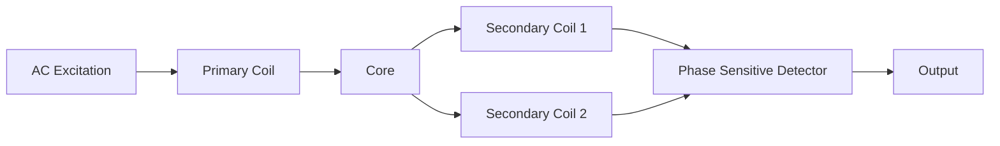

| ઘટક | કાર્ય |
|-----------|----------|
| **પ્રાથમિક કોઇલ** | AC સોર્સ સાથે જોડાયેલ ઉત્તેજના કોઇલ |
| **સેકન્ડરી કોઇલ** | શ્રેણી વિરોધી જોડાણમાં બે સમાન કોઇલ |
| **ફેરોમેગ્નેટિક કોર** | પારસ્પરિક ઇન્ડક્ટન્સ બદલતો ગતિશીલ કોર |
| **સિગ્નલ કન્ડિશનર** | ડિફરેન્શિયલ આઉટપુટને વિસ્થાપન માપનમાં રૂપાંતરિત કરે છે |

**કાર્ય સિદ્ધાંત:**

- શૂન્ય સ્થિતિએ: બંને સેકન્ડરીમાં સમાન વોલ્ટેજ પ્રેરિત થાય છે, નેટ આઉટપુટ શૂન્ય
- કોર મૂવમેન્ટ: સેકન્ડરી વોલ્ટેજમાં અસંતુલન બનાવે છે
- આઉટપુટ વોલ્ટેજ: વિસ્થાપનના પ્રમાણમાં, ફેઝ દિશા દર્શાવે છે

**લક્ષણો:**

- **રેન્જ**: સામાન્ય રીતે ±0.5mm થી ±25cm
- **રેખિયતા**: નિર્ધારિત રેન્જમાં ઉત્કૃષ્ટ
- **રિઝોલ્યુશન**: લગભગ અનંત (રીડઆઉટ સર્કિટ દ્વારા મર્યાદિત)
- **ફાયદા**: ઘર્ષણ વિનાનું, મજબૂત, વિશ્વસનીય, ઉચ્ચ રિઝોલ્યુશન

**મેમરી ટ્રીક:** "CPSO: કોર પોઝિશન આઉટપુટ બદલે છે"

## પ્રશ્ન 5(અ OR) [3 ગુણ]

**સાદા ફ્રિક્વન્સી કાઉન્ટરનો બ્લોક ડાયાગ્રામ દોરો અને સમજાવો.**

**જવાબ**:

**બ્લોક ડાયાગ્રામ:**

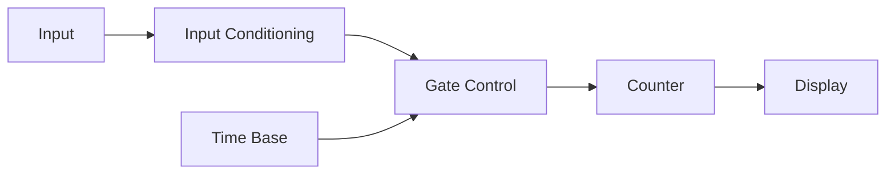

| બ્લોક | કાર્ય |
|-------|----------|
| **ઇનપુટ કન્ડિશનિંગ** | સિગ્નલને પલ્સમાં રૂપાંતરિત કરે છે |
| **ગેટ કંટ્રોલ** | ટાઇમ બેઝના આધારે ગણતરી અવધિને નિયંત્રિત કરે છે |
| **ટાઇમ બેઝ** | ચોક્કસ સંદર્ભ સમય અંતરાલ પ્રદાન કરે છે |
| **કાઉન્ટર** | ગેટ અવધિ દરમિયાન ઇનપુટ પલ્સની ગણતરી કરે છે |
| **ડિસ્પ્લે** | ગણતરી પરિણામ (આવૃત્તિ) બતાવે છે |

- **કાર્ય સિદ્ધાંત**: ચોક્કસ સમય અંતરાલ (સામાન્ય રીતે 1 સેકન્ડ) પર પલ્સની ગણતરી કરે છે
- **આવૃત્તિ ગણતરી**: f = ગણતરી/સમય અંતરાલ
- **રિઝોલ્યુશન**: ટાઇમ બેઝ ચોકસાઈ અને ગેટ સમય દ્વારા નિર્ધારિત

**મેમરી ટ્રીક:** "IGTCD - ઇનપુટ ગેટેડ ટાઇમ કાઉન્ટ્સ ડિસ્પ્લે"

## પ્રશ્ન 5(બ OR) [4 ગુણ]

**કેપેસિટીવ ટ્રાન્સડ્યુસર દોરો અને સમજાવો.**

**જવાબ**:

**આકૃતિ:**

```goat
    +-------------+
    |    Fixed    |
    |   Plate 1   |
    +-------------+
           ↑
           d      ↓ Force
    +-------------+
    |   Movable   |
    |   Plate 2   |-----> Output
    +-------------+
```

| કોન્ફિગરેશન | સિદ્ધાંત | ઉપયોગ |
|---------------|-----------|-------------|
| **વેરિએબલ ગેપ** | C = ε₀εᵣA/d (અંતર સાથે વ્યસ્ત રીતે બદલાય છે) | દબાણ, વિસ્થાપન |
| **વેરિએબલ એરિયા** | C = ε₀εᵣA/d (ઓવરલેપ એરિયા સાથે સીધો બદલાવ) | ખૂણીય સ્થિતિ, સ્તર |
| **વેરિએબલ ડાયલેક્ટ્રિક** | C = ε₀εᵣA/d (ડાયલેક્ટ્રિક કોન્સ્ટન્ટ સાથે બદલાય છે) | ભેજ, સામગ્રી વિશ્લેષણ |

**કાર્ય સિદ્ધાંત:**

- ભૌતિક પરિમાણ સાથે કેપેસિટન્સ બદલાય છે
- સિગ્નલ કન્ડિશનિંગ કેપેસિટન્સને વોલ્ટેજ/વીજપ્રવાહમાં રૂપાંતરિત કરે છે
- ઉચ્ચ ઇમ્પીડન્સ આઉટપુટને યોગ્ય શીલ્ડિંગની જરૂર પડે છે

**ફાયદા**: ઉચ્ચ સંવેદનશીલતા, કોઈ ગતિશીલ સંપર્ક નહીં, ઓછું દળ

**મેમરી ટ્રીક:** "CGAD - કેપેસિટન્સ ગેપ એરિયા ડાયલેક્ટ્રિક"

## પ્રશ્ન 5(ક OR) [7 ગુણ]

**ફંકશન જનરેટરનો બ્લોક ડાયાગ્રામ દોરો અને સમજાવો.**

**જવાબ**:

**બ્લોક ડાયાગ્રામ:**

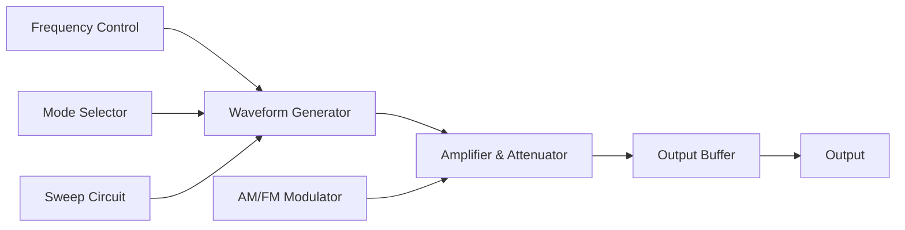

| બ્લોક | કાર્ય |
|-------|----------|
| **ફ્રિક્વન્સી કંટ્રોલ** | ઓસિલેટરની આવૃત્તિ સેટ કરે છે (સામાન્ય રીતે 0.1Hz થી 20MHz) |
| **વેવફોર્મ જનરેટર** | મૂળભૂત વેવફોર્મ ઉત્પન્ન કરે છે (સાઇન, સ્ક્વેર, ટ્રાયએંગલ) |
| **મોડ સિલેક્ટર** | આઉટપુટ વેવફોર્મના પ્રકારની પસંદગી કરે છે |
| **એમ્પ્લિફાયર અને એટેન્યુએટર** | આઉટપુટ એમ્પ્લિટ્યુડને નિયંત્રિત કરે છે |
| **આઉટપુટ બફર** | ઓછી આઉટપુટ ઇમ્પીડન્સ પ્રદાન કરે છે |
| **સ્વીપ સર્કિટ** | રેન્જ પર આવૃત્તિને આપોઆપ બદલે છે |
| **AM/FM મોડ્યુલેટર** | મોડ્યુલેશન કાર્યો માટે સિગ્નલ બદલે છે |

**કાર્ય સિદ્ધાંત:**

- RC ઓસિલેટર અથવા DDS નો ઉપયોગ કરીને સાઇન વેવ ઉત્પન્ન કરે છે
- શેપ કન્વર્ટર્સ સાઇનને સ્ક્વેર અને ટ્રાયએંગલમાં રૂપાંતરિત કરે છે
- આઉટપુટ એમ્પ્લિટ્યુડ એટેન્યુએટર સર્કિટ દ્વારા નિયંત્રિત
- આધુનિક જનરેટર ડિજિટલ સિન્થેસિસ તકનીકોનો ઉપયોગ કરે છે

**ઉપયોગો**: સર્કિટ ટેસ્ટિંગ, સિગ્નલ ઇન્જેક્શન, ફિલ્ટર કેરેક્ટરાઇઝેશન

**મેમરી ટ્રીક:** "FWMASO - ફ્રિક્વન્સી વેવફોર્મ મોડ એમ્પ્લિટ્યુડ સ્વીપ આઉટપુટ"
