## Question 1(a) [3 marks]

**Give Definition of Accuracy, Reproducibility and Repeatability.**

**Answer**:

| Term | Definition |
|------|------------|
| **Accuracy** | Closeness of measured value to the true or actual value of the quantity being measured |
| **Reproducibility** | Ability of an instrument to give identical measurements for the same input when measured under different conditions (different operators, locations, times) |
| **Repeatability** | Ability of an instrument to give identical measurements for the same input when measured repeatedly under the same conditions |

**Mnemonic:** "ARR - Accurate Results Repeatedly"

## Question 1(b) [4 marks]

**Draw and Explain Wheatstone bridge.**

**Answer**:

**Diagram:**

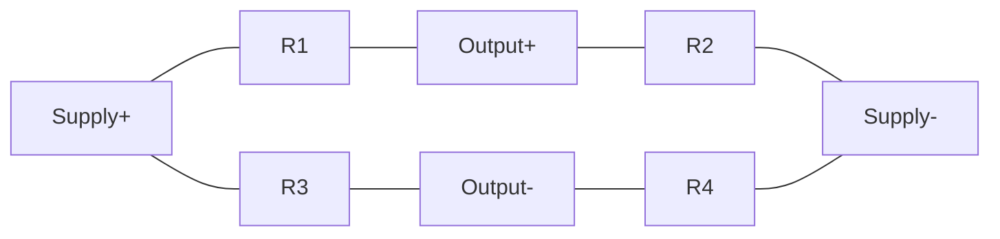

| Feature | Description |
|---------|-------------|
| **Configuration** | Four resistors connected in diamond pattern |
| **Balance Condition** | R1/R2 = R3/R4 (when output voltage is zero) |
| **Application** | Precise measurement of unknown resistance |
| **Operation** | Unknown resistor placed in one arm, remaining resistors adjusted until bridge is balanced |

**Mnemonic:** "WBMP - When Balanced, Measure Precisely"

## Question 1(c) [7 marks]

**Explain Principle of Q meter. Also draw and explain Practical Q Meter.**

**Answer**:

**Principle of Q Meter:**

The Q-meter operates on the principle of series resonance, where Q factor is measured as the ratio of voltage across the capacitor to the applied voltage at resonance.

**Diagram of Practical Q Meter:**


| Component | Function |
|-----------|----------|
| **RF Oscillator** | Provides variable frequency signals |
| **Work Coil** | Inductively couples signal to test circuit |
| **Resonant Circuit** | Test inductor L in series with variable capacitor C |
| **VTVM** | Measures voltage across capacitor |
| **Q-Scale** | Calibrated to read Q value directly |

- **Resonant Formula**: f = 1/(2π√LC)
- **Q Calculation**: Q = Vc/Vs (voltage across capacitor / source voltage)

**Mnemonic:** "RIVQ - Resonance Indicates Valuable Quality"

## Question 1(c OR) [7 marks]

**Draw and explain construction of Moving coil type instruments.**

**Answer**:

**Diagram:**

```goat
            +---------+
            |    N    |
            |         |
            |         |
   +--------+-+     +-+--------+
   |    |     |     |     |    |
   |    |     |     |     |    |
   |    |  S  |     |  S  |    |
   |    |     |     |     |    |
   +----+     |     |     +----+
        |     +-----+     |
        |      Coil       |
        |                 |
        +-----------------+
```

| Component | Description |
|-----------|-------------|
| **Permanent Magnet** | Creates strong magnetic field |
| **Moving Coil** | Lightweight coil wound on aluminum frame |
| **Springs** | Provide controlling torque and electrical connections |
| **Pointer** | Attached to coil, moves over calibrated scale |
| **Core** | Soft iron cylindrical core to concentrate magnetic flux |

- **Operating Principle**: Deflecting torque = BIlN (B-field strength, I-current, l-length, N-turns)
- **Controlling Torque**: Provided by springs proportional to deflection angle

**Mnemonic:** "MAPS-C: Magnet Acts, Pointer Shows Current"

## Question 2(a) [3 marks]

**List out different Types of errors. Explain any Two.**

**Answer**:

| Types of Errors |
|----------------|
| **Gross Errors** |
| **Systematic Errors** |
| **Random Errors** |
| **Environmental Errors** |
| **Loading Errors** |

**Explanation of Two Errors:**

1. **Systematic Errors**: 
   - Consistent and predictable deviations from actual value
   - Caused by instrument calibration, design, or method

2. **Random Errors**: 
   - Unpredictable variations in measurements
   - Caused by noise, environmental fluctuations, or observer limitations

**Mnemonic:** "GSREL - Good Systems Reduce Error Levels"

## Question 2(b) [4 marks]

**Draw and Explain Maxwell's bridge.**

**Answer**:

**Diagram:**

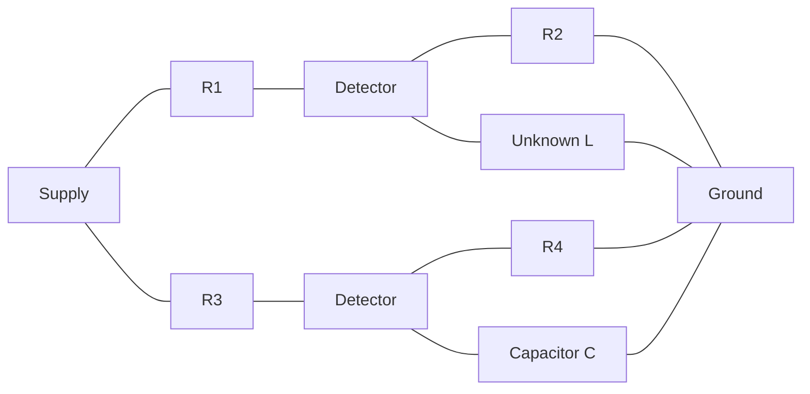

| Component | Function |
|-----------|----------|
| **R1, R2, R3, R4** | Precision resistors in bridge arms |
| **Unknown L** | Inductor with resistance to be measured |
| **Capacitor C** | Standard capacitor in opposite arm |
| **Detector** | Null detector (galvanometer) |

- **Balance Equation**: L = CR2R3
- **Resistance Equation**: RL = R2R3/R4
- **Application**: Measures inductance with significant resistance

**Mnemonic:** "MBLR - Maxwell Bridge Links Resistance"

## Question 2(c) [7 marks]

**Draw and explain construction of moving iron type instruments.**

**Answer**:

**Diagram:**

```goat
     +---------------------+
     |                     |
     |     +----------+    |
     |     |          |    |
     |     |   Coil   |    |
     |     |          |    |
     |     +----------+    |
     |          ||         |
     |    +-----++------+  |
     |    |     ||      |  |
     |    |  Iron Vanes |  |
     |    |             |  |
     |    +-------------+  |
     |                     |
     +---------------------+
```

| Component | Description |
|-----------|-------------|
| **Coil** | Fixed coil that carries measuring current |
| **Iron Vanes** | Two soft iron pieces (one fixed, one movable) |
| **Pointer** | Attached to movable vane |
| **Control Spring** | Provides restraining torque |
| **Damping Mechanism** | Air friction damping using light aluminum piston |

- **Working Principle**: When current flows through coil, both iron pieces get magnetized with same polarity causing repulsion
- **Advantages**: Suitable for both AC and DC, robust construction
- **Disadvantages**: Non-uniform scale, higher power consumption than PMMC

**Mnemonic:** "IRAM - Iron Repulsion Activates Movement"

## Question 2(a OR) [3 marks]

**Explain basic DC voltmeter.**

**Answer**:

**Diagram:**

```goat
  +-------+    +---------+    +-----------+
  | PMMC  |--->| Series  |--->| Scale     |
  | Meter |    | Resistor|    | Calibrated|
  +-------+    +---------+    +-----------+
```

| Component | Function |
|-----------|----------|
| **PMMC Movement** | Basic current-sensitive movement |
| **Multiplier Resistor** | High-value series resistor |
| **Scale** | Calibrated to read voltage directly |

- **Working Principle**: Voltmeter is PMMC meter with series resistor
- **Calculation**: Rs = (V/Im) - Rm (Rs=series resistor, V=voltage, Im=full scale current, Rm=meter resistance)

**Mnemonic:** "SVM - Series Voltage Measurement"

## Question 2(b OR) [4 marks]

**Draw and Explain Schering bridge.**

**Answer**:

**Diagram:**

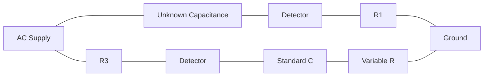

| Component | Function |
|-----------|----------|
| **C1** | Unknown capacitor (with loss) |
| **R1** | Resistance representing loss in C1 |
| **R3, R4** | Precision resistors |
| **C4** | Standard loss-free capacitor |
| **Detector** | Null indicator |

- **Balance Equations**: C1 = C4(R3/R1)
- **Dissipation Factor**: D = ωC1R1 = ωC4R4
- **Application**: Measurement of capacitance and dielectric loss

**Mnemonic:** "SCDR - Schering Capacitance Determines Resistance"

## Question 2(c OR) [7 marks]

**Write shortnote on Electronic Multimeter.**

**Answer**:

**Diagram:**


| Feature | Description |
|---------|-------------|
| **Functions** | Measures voltage (AC/DC), current (AC/DC), resistance, and other parameters |
| **Sensitivity** | Higher sensitivity than analog meters (10MΩ input impedance typical) |
| **Ranges** | Multiple selectable measurement ranges |
| **Accuracy** | 0.1% to 3% depending on quality and parameter |
| **Display** | Digital readout or analog pointer |

- **Types**: Analog electronic multimeter, Digital multimeter (DMM)
- **Advantages**: High input impedance, minimal loading effect, multiple functions
- **Key Circuit**: Input attenuator, signal converter, amplifier, rectifier, display driver

**Mnemonic:** "VCAR-D: Voltage, Current And Resistance - Displayed"

## Question 3(a) [3 marks]

**Explain Various probes for CRO.**

**Answer**:

| Type of Probe | Description |
|--------------|-------------|
| **Passive Probe (1X)** | Direct connection probe with no attenuation |
| **Passive Probe (10X)** | Attenuates signal by factor of 10, reduces circuit loading |
| **Active Probe** | Contains active components for high impedance, low capacitance |
| **Current Probe** | Measures current by sensing magnetic field |

- **Selection Criteria**: Bandwidth, loading effect, measurement range
- **Compensation**: 10X probes require compensation adjustment for accurate waveforms

**Mnemonic:** "PAC-S: Probes Allow Circuit Sensing"

## Question 3(b) [4 marks]

**Draw and explain construction of Clamp on Meter.**

**Answer**:

**Diagram:**

```goat
       +---------------+
       |    Display    |
       +---------------+
       |               |
       |    Circuit    |
       |               |
    +--+               +--+
    |  |               |  |
    |  +---------------+  |
    |                     |
    |      +-------+      |
    |      |       |      |
    +------+       +------+
           | Wire  |
           +-------+
```

| Component | Function |
|-----------|----------|
| **Split Core CT** | Ferrite core that clamps around conductor |
| **Coil Winding** | Secondary winding that generates induced current |
| **Signal Circuitry** | Converts current to measurable signal |
| **Display Unit** | Digital/analog display calibrated in amps |
| **Trigger Mechanism** | Opens/closes core around conductor |

- **Working Principle**: Based on current transformer, measures current without breaking circuit
- **Applications**: Measuring AC current in live conductors safely

**Mnemonic:** "CAMP - Current Analyzed by Magnetic Principle"

## Question 3(c) [7 marks]

**Write shortnote on successive approximation type DVM.**

**Answer**:

**Block Diagram:**

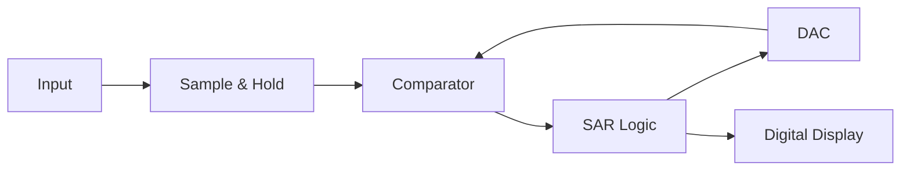

| Component | Function |
|-----------|----------|
| **Sample & Hold** | Captures and holds input voltage |
| **Comparator** | Compares input with DAC output |
| **Successive Approximation Register** | Controls binary search algorithm |
| **D/A Converter** | Generates analog voltage for comparison |
| **Digital Display** | Shows measured value |

- **Working Principle**: Uses binary search algorithm to find digital value matching analog input
- **Conversion Time**: Fixed regardless of input magnitude (8-16 clock cycles for 8-16 bit)
- **Advantages**: Medium speed, good resolution, consistent conversion time
- **Applications**: General purpose measurements where medium speed is sufficient

**Mnemonic:** "SACD - Sample, Approximate, Compare, Display"

## Question 3(a OR) [3 marks]

**Explain PH Sensor.**

**Answer**:

**Diagram:**

```goat
    +-----------------+
    | Glass Electrode |---+
    +-----------------+   |
                          |
    +-----------------+   |
    | Reference       |---+-----> Output
    | Electrode       |   |
    +-----------------+   |
                          |
    +-----------------+   |
    | Temperature     |---+
    | Compensation    |
    +-----------------+
```

| Component | Function |
|-----------|----------|
| **Glass Electrode** | Sensitive to hydrogen ion concentration |
| **Reference Electrode** | Provides stable reference potential |
| **Temperature Sensor** | Compensates for temperature effects |
| **Signal Conditioner** | Amplifies and processes the millivolt signal |

- **Working Principle**: Generates voltage proportional to hydrogen ion concentration
- **Output**: ~59 mV per pH unit at 25°C
- **Range**: 0-14 pH scale (acidic to alkaline)

**Mnemonic:** "PHRV - PH Related to Voltage"

## Question 3(b OR) [4 marks]

**Draw and explain construction of Electronic Watt Meter.**

**Answer**:

**Block Diagram:**

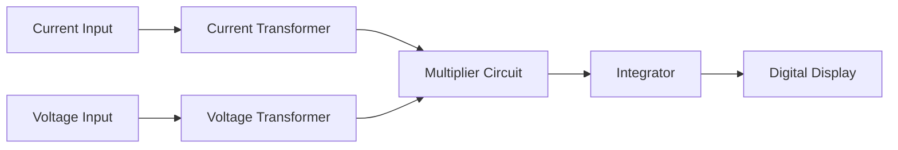

| Component | Function |
|-----------|----------|
| **Current Sensor** | Measures load current via CT or shunt |
| **Voltage Sensor** | Measures voltage via potential divider |
| **Multiplier** | Multiplies instantaneous voltage and current |
| **Integrator** | Averages power over time |
| **Display** | Digital readout in watts |

- **Working Principle**: Power = V × I × cosθ (cosθ is power factor)
- **Advantages**: High accuracy, wide range, digital display
- **Types**: True RMS, average sensing

**Mnemonic:** "VIMP - Voltage & Intensity Make Power"

## Question 3(c OR) [7 marks]

**Write shortnote on Integrating type DVM.**

**Answer**:

**Block Diagram:**

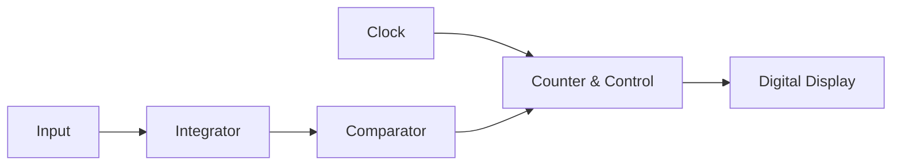

| Type | Working Principle |
|------|-------------------|
| **Dual-Slope** | Integrates input for fixed time, then measures discharge time with reference |
| **Voltage-to-Frequency** | Converts voltage to frequency, counts pulses over fixed time |
| **Charge-Balance** | Balances input charge with reference charge |

**Key Features:**

- **Noise Rejection**: Excellent rejection of power line noise (50/60Hz)
- **Accuracy**: High accuracy due to time averaging
- **Conversion Speed**: Slower than successive approximation type
- **Resolution**: Typically 4½ to 6½ digits

**Applications**: Precision measurements, noisy environments, bench instruments

**Mnemonic:** "TINA - Time Integration Nullifies Average"

## Question 4(a) [3 marks]

**Write advantages and applications of Digital storage oscilloscope.**

**Answer**:

| Advantages | Applications |
|------------|--------------|
| **Pre-trigger Viewing** | Capturing transient events |
| **Signal Storage** | Analyzing intermittent faults |
| **Waveform Processing** | Complex signal analysis |
| **Higher Bandwidth** | High-speed digital circuit testing |
| **Multiple Channel Display** | Comparing multiple signals |

- **Key Benefits**: Can capture one-time events, store waveforms for later analysis
- **Digital Features**: Automated measurements, FFT analysis, PC connectivity

**Mnemonic:** "SPADE - Storage, Processing, Analysis, Display, Events"

## Question 4(b) [4 marks]

**Write shortnote on Electronic Energy Meter.**

**Answer**:

**Block Diagram:**

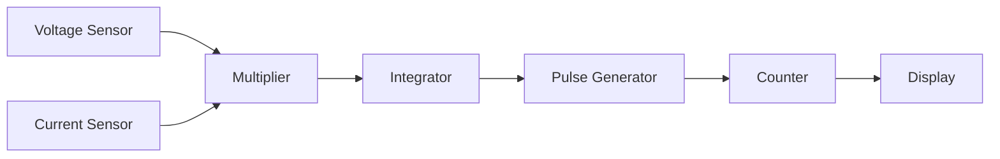

| Component | Function |
|-----------|----------|
| **Voltage & Current Sensors** | Measure line voltage and load current |
| **Multiplier Circuit** | Calculates instantaneous power |
| **Integrator** | Converts power to energy over time |
| **Microcontroller** | Processes signals and controls display |
| **LCD Display** | Shows energy consumption in kWh |

- **Working Principle**: Energy = ∫P.dt (integral of power over time)
- **Advantages**: No moving parts, high accuracy, tamper detection
- **Features**: Multiple tariff support, bi-directional measurement, remote reading

**Mnemonic:** "VICES - Voltage & Current Energy Summation"

## Question 4(c) [7 marks]

**Draw and explain Block diagram of Analog C.R.O. and working of each block in brief.**

**Answer**:

**Block Diagram:**

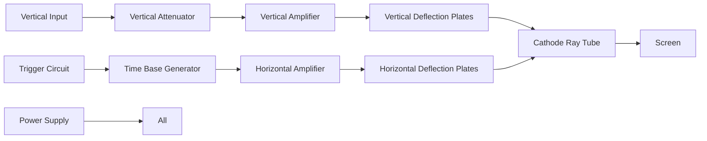

| Block | Function |
|-------|----------|
| **Vertical System** | Controls amplitude display (signal attenuation, amplification) |
| **Horizontal System** | Controls time base (sweep generation) |
| **Trigger System** | Synchronizes horizontal sweep with input signal |
| **CRT** | Displays signal (electron gun, deflection plates, phosphor screen) |
| **Power Supply** | Provides required voltages to all circuits |

- **Vertical System**: Processes input signal, controls Y-axis deflection
- **Horizontal System**: Controls X-axis deflection (time base)
- **Triggering**: Stabilizes waveform display by starting sweep at same point
- **CRT Display**: Converts electrical signals to visible trace

**Mnemonic:** "VTHCP - Vertical, Time, Horizontal, CRT, Power"

## Question 4(a OR) [3 marks]

**Draw and explain PIEZO-ELECTRIC transducer.**

**Answer**:

**Diagram:**

```goat
      Force
        ↓
    +--------+
    |        |
    | Quartz |---→ Output Voltage
    | Crystal|
    |        |
    +--------+
```

| Property | Description |
|----------|-------------|
| **Principle** | Generates electric charge when mechanically stressed |
| **Materials** | Quartz, Rochelle salt, PZT ceramics |
| **Operation** | Direct effect: force → voltage, Inverse effect: voltage → displacement |
| **Output** | High impedance voltage proportional to applied force |

- **Applications**: Pressure sensors, accelerometers, ultrasonic devices
- **Advantages**: High sensitivity, fast response, wide frequency range
- **Limitations**: High output impedance, temperature sensitive

**Mnemonic:** "PFVD - Pressure Forms Voltage via Displacement"

## Question 4(b OR) [4 marks]

**Draw and explain Measurement of Frequency by using CRO.**

**Answer**:

**Method 1: Using Lissajous Patterns**

```goat
    +-------------+
    |             |
    |    o o o    |
    |   o     o   |
    |  o       o  |
    |   o     o   |
    |    o o o    |
    |             |
    +-------------+
```

**Method 2: Using Time Base**

```goat
    +-------------+
    |        /\   |
    |       /  \  |
    |      /    \ |
    |     /      \|
    |    /        |
    |   /         |
    +-------------+
```

| Method | Calculation |
|--------|-------------|
| **Lissajous Pattern** | Fx = Fy × (Nx/Ny) |
| **Time Measurement** | f = 1/T (T is period measured using time base) |
| **XY Mode** | Comparing unknown frequency with known reference |

- **Time Base Method**: Measure period of waveform, calculate frequency as 1/T
- **Lissajous Method**: Connect reference to X input, unknown to Y input
- **Digital CRO**: Direct frequency readout using internal counter

**Mnemonic:** "LTX - Lissajous or Time for X-axis"

## Question 4(c OR) [7 marks]

**Draw and explain Thermistor and Thermocouple.**

**Answer**:

**Thermistor Diagram:**

```goat
    +-----------+
    |           |
    | Thermistor|---+
    |           |   |
    +-----------+   |
                    |
    +----------+    |
    |          |    |
    | Resistor |----+----> Output
    |          |
    +----------+
```

**Thermocouple Diagram:**

```goat
     Metal A
    +--------+
              \
               +---> Output
              /
    +--------+
     Metal B
```

| Transducer | Principle | Characteristics |
|------------|-----------|-----------------|
| **Thermistor** | Resistance changes with temperature | High sensitivity, non-linear, limited range |
| **Thermocouple** | Junction of dissimilar metals generates voltage | Wide range, linear, low sensitivity |

**Thermistor Types:**

- **NTC**: Negative Temperature Coefficient (resistance decreases with temperature)
- **PTC**: Positive Temperature Coefficient (resistance increases with temperature)

**Thermocouple Types:**

- **Type K**: Chromel-Alumel (-200°C to 1350°C)
- **Type J**: Iron-Constantan (-40°C to 750°C)
- **Type T**: Copper-Constantan (-200°C to 350°C)

**Mnemonic:** "TRT/TVJ - Temperature Resistance/Voltage Junction"

## Question 5(a) [3 marks]

**Draw and Explain Velocity transducer.**

**Answer**:

**Diagram:**

```goat
    +------------------+
    |                  |
    |  N     S    N    |
    |  |     |    |    |
    +--+-----+----+----+
       |     |    |
       |  Magnet  |
       |     |    |
    +--+-----+----+----+
    |                  |
    |      Coil        |----> Output
    |                  |
    +------------------+
```

| Component | Function |
|-----------|----------|
| **Permanent Magnet** | Creates magnetic field |
| **Moving Coil** | Generates voltage proportional to velocity |
| **Housing** | Supports structure and magnetic circuit |
| **Output Circuit** | Conditions signal for measurement |

- **Working Principle**: Based on Faraday's law of electromagnetic induction
- **Output**: Voltage proportional to velocity (V = Blv)
- **Applications**: Vibration measurement, seismic monitoring, motion control

**Mnemonic:** "VMMF - Velocity Makes Magnetic Flux"

## Question 5(b) [4 marks]

**Give Classification of transducers and explain it.**

**Answer**:

| Classification | Types |
|----------------|-------|
| **By Energy Conversion** | Active (self-generating) vs. Passive (requiring external power) |
| **By Measurement Method** | Primary vs. Secondary |
| **By Physical Principle** | Resistive, Capacitive, Inductive, Photoelectric, etc. |
| **By Application** | Temperature, Pressure, Flow, Level, etc. |

**Explanation:**

| Type | Examples | Characteristics |
|------|----------|-----------------|
| **Active** | Thermocouple, Piezoelectric | Generate output without external power |
| **Passive** | RTD, Strain gauge | Require external excitation |
| **Resistive** | Thermistor, Potentiometer | Change resistance with input |
| **Capacitive** | Pressure sensors, Proximity | Change capacitance with input |
| **Inductive** | LVDT, Proximity | Change inductance with input |

**Mnemonic:** "APRCI - Active Passive Resistive Capacitive Inductive"

## Question 5(c) [7 marks]

**Write shortnote on LVDT.**

**Answer**:

**Diagram:**

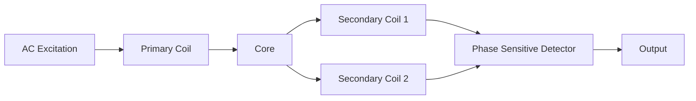

| Component | Function |
|-----------|----------|
| **Primary Coil** | Excitation coil connected to AC source |
| **Secondary Coils** | Two identical coils connected in series opposition |
| **Ferromagnetic Core** | Movable core that varies mutual inductance |
| **Signal Conditioner** | Converts differential output to displacement measurement |

**Working Principle:**

- At null position: Equal voltage induced in both secondaries, net output zero
- Core movement: Creates imbalance in secondary voltages
- Output voltage: Proportional to displacement, phase indicates direction

**Characteristics:**

- **Range**: Typically ±0.5mm to ±25cm
- **Linearity**: Excellent within rated range
- **Resolution**: Virtually infinite (limited by readout circuit)
- **Advantages**: Frictionless, robust, reliable, high resolution

**Mnemonic:** "CPSO: Core Position Shifts Output"

## Question 5(a OR) [3 marks]

**Draw and Explain block diagram of simple frequency Counter.**

**Answer**:

**Block Diagram:**

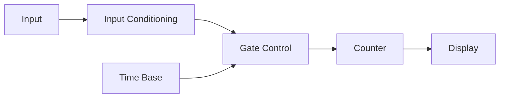

| Block | Function |
|-------|----------|
| **Input Conditioning** | Amplifies, shapes input signal into pulses |
| **Gate Control** | Controls counting period based on time base |
| **Time Base** | Provides accurate reference time interval |
| **Counter** | Counts input pulses during gate period |
| **Display** | Shows count result (frequency) |

- **Working Principle**: Counts pulses over precise time interval (typically 1 second)
- **Frequency Calculation**: f = counts/time interval
- **Resolution**: Determined by time base accuracy and gate time

**Mnemonic:** "IGTCD - Input Gated Time Counts Display"

## Question 5(b OR) [4 marks]

**Draw and Explain Capacitive Transducer.**

**Answer**:

**Diagram:**

```goat
    +-------------+
    |    Fixed    |
    |   Plate 1   |
    +-------------+
           ↑
           d      ↓ Force
    +-------------+
    |   Movable   |
    |   Plate 2   |-----> Output
    +-------------+
```

| Configuration | Principle | Application |
|---------------|-----------|-------------|
| **Variable Gap** | C = ε₀εᵣA/d (varies inversely with distance) | Pressure, displacement |
| **Variable Area** | C = ε₀εᵣA/d (varies directly with overlap area) | Angular position, level |
| **Variable Dielectric** | C = ε₀εᵣA/d (varies with dielectric constant) | Humidity, material analysis |

**Working Principle:**

- Capacitance changes with physical parameter
- Signal conditioning converts capacitance to voltage/current
- High impedance output requires proper shielding

**Advantages**: High sensitivity, no moving contacts, low mass

**Mnemonic:** "CGAD - Capacitance Gap Area Dielectric"

## Question 5(c OR) [7 marks]

**Draw and Explain block diagram of Function generator.**

**Answer**:

**Block Diagram:**

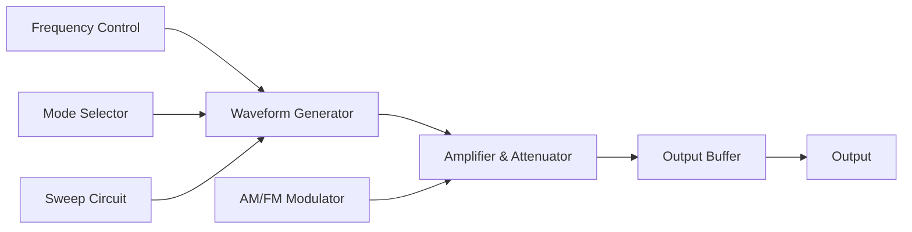

| Block | Function |
|-------|----------|
| **Frequency Control** | Sets oscillator frequency (typically 0.1Hz to 20MHz) |
| **Waveform Generator** | Produces basic waveforms (sine, square, triangle) |
| **Mode Selector** | Selects output waveform type |
| **Amplifier & Attenuator** | Controls output amplitude |
| **Output Buffer** | Provides low output impedance |
| **Sweep Circuit** | Automatically varies frequency over range |
| **AM/FM Modulator** | Modifies signal for modulation functions |

**Working Principle:**

- Generates sine wave using RC oscillator or DDS
- Shape converters transform sine into square and triangle
- Output amplitude controlled by attenuator circuit
- Modern generators use digital synthesis techniques

**Applications**: Circuit testing, signal injection, filter characterization

**Mnemonic:** "FWMASO - Frequency Waveform Mode Amplitude Sweep Output"
