## પ્રશ્ન 1(અ) [3 ગુણ]

**નીચેના શબ્દને વ્યાખ્યાયિત કરો: (1) Accuracy (2) Resolution (3) Error**

**જવાબ**:

| શબ્દ | વ્યાખ્યા |
|------|----------|
| **Accuracy** | માપન અને વાસ્તવિક મૂલ્ય વચ્ચેની નજીકતા |
| **Resolution** | નાનામાં નાના ફેરફાર કે જે એક ઉપકરણ દ્વારા માપી શકાય છે |
| **Error** | માપેલા મૂલ્ય અને વાસ્તવિક મૂલ્ય વચ્ચેનો તફાવત |

**મેમરી ટ્રીક:** "ARE સચોટ: Accuracy વાસ્તવિકતા દર્શાવે છે, Error વિચલન બતાવે છે, Resolution વિગત દર્શાવે છે."

## પ્રશ્ન 1(બ) [4 ગુણ]

**અનબાઉન્ડેડ સ્ટ્રેઈન ગેજ ટ્રાન્સડ્યુસરનું બાંધકામ જરૂરી આકૃતિ સાથે વિગતવાર સમજાવો. તેની એપ્લિકેશનની યાદી બનાવો.**

**જવાબ**:

અનબાઉન્ડેડ સ્ટ્રેઈન ગેજમાં પાતળા તારની ગ્રીડ પેટર્ન હોય છે જે એક બેકિંગ મટીરિયલ પર લગાવેલી હોય છે.


- **બાંધકામના ઘટકો**: પાતળા રેસિસ્ટન્સ તારને ઇન્સ્યુલેટિંગ બેઝ મટીરિયલ પર આગળ-પાછળ લૂપ્સમાં ગોઠવેલ હોય છે
- **કાર્યસિદ્ધાંત**: જ્યારે સ્ટ્રેઈન (તણાવ) લાગે ત્યારે પ્રતિરોધમાં ફેરફાર થાય છે
- **એપ્લિકેશન**: વજન માપન, પ્રેશર સેન્સર, ફોર્સ સેન્સર, સ્ટ્રક્ચરલ હેલ્થ મોનિટરિંગ

**મેમરી ટ્રીક:** "WIRE Flexes: તાર ગ્રીડ બાહ્ય તણાવથી પ્રતિરોધ બદલાવ દર્શાવે છે."

## પ્રશ્ન 1(ક) [7 ગુણ]

**સંતુલન સ્થિતિ માટે સર્કિટ ડાયાગ્રામ સાથે Schering બ્રિજનું કાર્ય સમજાવો. તેના ફાયદા, ગેરફાયદા અને એપ્લિકેશનોની યાદી બનાવો.**

**જવાબ**:

Schering બ્રિજ એ AC બ્રિજ છે જે અજ્ઞાત કેપેસિટન્સ અને તેના ડિસિપેશન ફેક્ટરને માપવા માટે વપરાય છે.

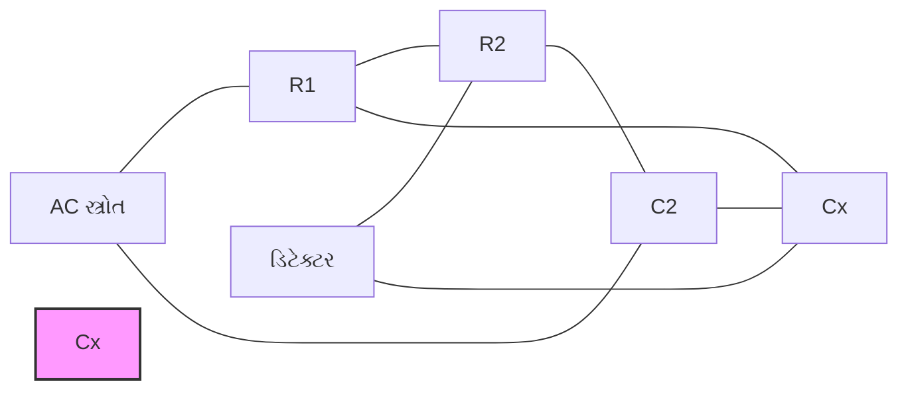

**સંતુલન શરત:**

| સમીકરણ | વર્ણન |
|---------|--------|
| Cx = C2(R2/R1) | કેપેસિટન્સ ગણતરી માટે |
| Dx = R2(C2/Cx) | ડિસિપેશન ફેક્ટર માટે |

**ફાયદા:**

- ઉચ્ચ ચોકસાઈ
- કેપેસિટન્સનું સીધું રીડિંગ
- વ્યાપક માપન શ્રેણી

**ગેરફાયદા:**

- સાવચેત શીલ્ડિંગની જરૂર પડે છે
- આવૃત્તિ આધારિત ભૂલો
- સંતુલન સાધવામાં જટિલ

**એપ્લિકેશન:**

- કેપેસિટર ટેસ્ટિંગ
- ઇન્સ્યુલેશન ટેસ્ટિંગ
- ડાઇલેક્ટ્રિક મટીરિયલ મૂલ્યાંકન

**મેમરી ટ્રીક:** "SCUBA ડાઇવ: Schering અજ્ઞાત કેપેસિટન્સને એડવાન્સ્ડ સર્કિટ ડિઝાઇન દ્વારા વિવિધ ઉપકરણોમાં ગણે છે."

## પ્રશ્ન 1(ક OR) [7 ગુણ]

**સંતુલન સ્થિતિ માટે સર્કિટ ડાયાગ્રામ સાથે Maxwell's બ્રિજનું કાર્ય સમજાવો. તેના ફાયદા, ગેરફાયદા અને એપ્લિકેશનોની યાદી બનાવો.**

**જવાબ**:

Maxwell's બ્રિજ અજ્ઞાત ઇન્ડક્ટન્સને જાણીતા કેપેસિટન્સના સંદર્ભમાં માપવા માટે વપરાય છે.

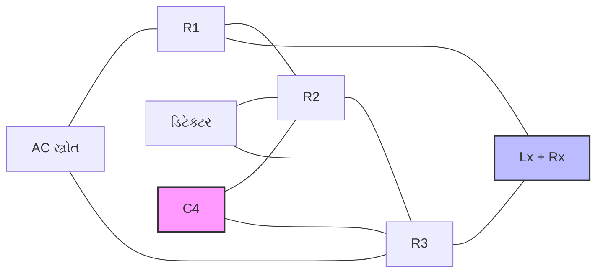

**સંતુલન શરત:**

| સમીકરણ | વર્ણન |
|---------|--------|
| Lx = C4·R2·R3 | ઇન્ડક્ટન્સ ગણતરી માટે |
| Rx = R1·(R3/R2) | રેસિસ્ટન્સ ગણતરી માટે |

**ફાયદા:**

- આવૃત્તિથી સ્વતંત્ર
- મધ્યમ Q કોઈલ્સ માટે ઉચ્ચ ચોકસાઈ
- સંતુલન સાધવામાં સરળ

**ગેરફાયદા:**

- ઓછા Q કોઈલ્સ માટે યોગ્ય નથી
- સ્ટાન્ડર્ડ કેપેસિટરની જરૂર પડે છે
- મર્યાદિત રેન્જ

**એપ્લિકેશન:**

- ઇન્ડક્ટર્સનું માપન
- ઓડિયો ફ્રિક્વન્સી માપન
- ટ્રાન્સફોર્મર ટેસ્ટિંગ

**મેમરી ટ્રીક:** "MAGIC બ્રિજ: Maxwell મહાન ઇન્ડક્ટર્સનું બ્રિજ તત્વોની તુલના દ્વારા વિશ્લેષણ કરે છે."

## પ્રશ્ન 2(અ) [3 ગુણ]

**જરૂરી ડાયાગ્રામ સાથે ઇલેક્ટ્રોનિક મલ્ટિમીટરની કામગીરી સમજાવો.**

**જવાબ**:

ઇલેક્ટ્રોનિક મલ્ટિમીટર વિવિધ ઇલેક્ટ્રિકલ પેરામીટર્સને સમપ્રમાણિત DC વોલ્ટેજમાં રૂપાંતરિત કરે છે.

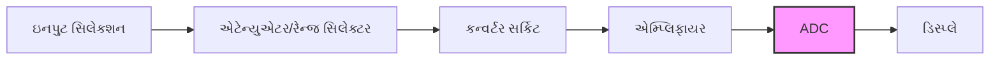

- **સર્કિટ ઘટકો**: ઇનપુટ સિલેક્ટર → એટેન્યુએટર → કન્વર્ટર → એમ્પ્લિફાયર → ADC → ડિસ્પ્લે
- **માપન પ્રકારો**: DC વોલ્ટેજ, AC વોલ્ટેજ, કરંટ, રેસિસ્ટન્સ
- **પાવર સ્ત્રોત**: પોર્ટેબિલિટી અને સુરક્ષા માટે બેટરી પાવર

**મેમરી ટ્રીક:** "SACRED ઉપકરણ: સિગ્નલ એટેન્યુએટ, કન્વર્ટ અને રેક્ટિફાઈ થઈને ઇલેક્ટ્રોનિક ડિસ્પ્લે પર દર્શાવાય છે."

## પ્રશ્ન 2(બ) [4 ગુણ]

**એનાલોગ વોલ્ટમીટર અને ડિજિટલ વોલ્ટમીટર વચ્ચે તફાવત લખો.**

**જવાબ**:

| પેરામીટર | ડિજિટલ વોલ્ટમીટર | એનાલોગ વોલ્ટમીટર |
|-----------|-------------------|------------------|
| **ડિસ્પ્લે પ્રકાર** | ન્યુમેરિક LCD/LED ડિસ્પ્લે | સ્કેલ પર ફરતો પોઈન્ટર |
| **ચોકસાઈ** | ઉચ્ચ (±0.1% સામાન્ય) | નિમ્ન (±2-5% સામાન્ય) |
| **રીડિંગ ભૂલો** | પેરેલેક્સ ભૂલ નથી | પેરેલેક્સ ભૂલ થઈ શકે |
| **રિઝોલ્યૂશન** | ઉચ્ચ (3-6 અંકો દર્શાવી શકે) | સ્કેલ ડિવિઝન દ્વારા મર્યાદિત |
| **ઇનપુટ ઇમ્પિડન્સ** | ખૂબ ઉચ્ચ (>10MΩ) | નિમ્ન (20-200kΩ/V) |
| **પ્રતિક્રિયા સમય** | ધીમો સેમ્પલિંગ રેટ | તાત્કાલિક પ્રતિસાદ |

**મેમરી ટ્રીક:** "PARIOS: પેરેલેક્સ-ફ્રી, ચોકસાઈ ઉચ્ચ, રિઝોલ્યૂશન ઉચ્ચ, ઇમ્પિડન્સ ઉચ્ચ, અવલોકન ડિજિટલ, સેમ્પલિંગ રેટ."

## પ્રશ્ન 2(ક) [7 ગુણ]

**એનર્જીમીટરના બાંધકામ ડાયાગ્રામનું વર્ણન લખો અને વિગતવાર સમજાવો.**

**જવાબ**:

એનર્જી મીટર સમય સાથે કિલોવોટ-અવર્સ (kWh) માં વીજળી ઊર્જાની ખપતને માપે છે.

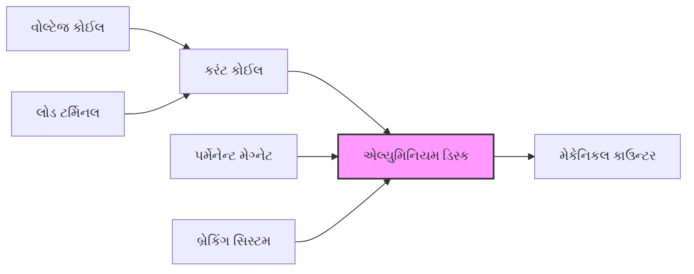

**ઘટકો:**

- **વોલ્ટેજ કોઈલ**: વોલ્ટેજના સમપ્રમાણમાં ફ્લક્સ ઉત્પન્ન કરે છે
- **કરંટ કોઈલ**: કરંટના સમપ્રમાણમાં ફ્લક્સ ઉત્પન્ન કરે છે
- **એલ્યુમિનિયમ ડિસ્ક**: એડી કરંટને કારણે ફરે છે
- **કાઉન્ટિંગ મેકેનિઝમ**: ડિસ્કના ફરવાની ગણતરી કરે છે
- **પર્મેનેન્ટ મેગ્નેટ**: ડિસ્કની ગતિ નિયંત્રિત કરવા બ્રેક તરીકે કાર્ય કરે છે
- **એડજસ્ટમેન્ટ સિસ્ટમ**: કેલિબ્રેશન અને ચોકસાઈ માટે

**કાર્યસિદ્ધાંત**: ડિસ્કની ફરવાની ગતિ પાવર વપરાશ (V×I×cosΦ) ના સમપ્રમાણમાં હોય છે

**મેમરી ટ્રીક:** "VADCR મીટર: વોલ્ટેજ અને કરંટ ફરવા દ્વારા કાઉન્ટરને ચલાવે છે."

## પ્રશ્ન 2(અ OR) [3 ગુણ]

**ક્લેમ્પ ઓન એમીટરનું કામ જરૂરી ડાયાગ્રામ સાથે સમજાવો.**

**જવાબ**:

ક્લેમ્પ-ઓન એમીટર ઇલેક્ટ્રોમેગ્નેટિક ઇન્ડક્શનનો ઉપયોગ કરીને સર્કિટને તોડ્યા વિના કરંટ માપે છે.

```goat
            ╭─────────╮
            │ Display │
            ╰─────────╯
                 │
     ╭───────────────────╮
     │ Signal Processing │
     ╰───────────────────╯
                 │
          ╭────────────╮
          │  CT Core   │───┐
          ╰────────────╯   │
              │    │       │
              │    │       │
              │    │       │
          ╭───┴────┴───╮   │
          │ Clamp Jaws │   │
          ╰────────────╯   │
                 │         │
             Current       │
             Carrying      │
              Wire         │
                           │
                          ─┴─
                          GND
```

- **બાંધકામ**: સેન્સિંગ કોઈલ સાથે સ્પ્લિટ ફેરાઈટ કોર
- **કાર્યસિદ્ધાંત**: કરંટ-વાહક તાર ચુંબકીય ક્ષેત્ર ઉત્પન્ન કરે છે → સેન્સિંગ કોઈલમાં વોલ્ટેજ પ્રેરિત કરે છે
- **ફાયદા**: નોન-કોન્ટેક્ટ માપન, ઝડપી, સુરક્ષિત

**મેમરી ટ્રીક:** "CICS: ક્લેમ્પિંગ દ્વારા કરંટ સિગ્નલ પ્રેરિત થાય છે."

## પ્રશ્ન 2(બ OR) [4 ગુણ]

**PMMC પ્રકાર મીટર અને મૂવિંગ આયર્ન પ્રકાર મીટર વચ્ચે તફાવત લખો.**

**જવાબ**:

| પેરામીટર | PMMC પ્રકાર મીટર | મૂવિંગ આયર્ન પ્રકાર મીટર |
|-----------|-----------------|------------------------|
| **કાર્યસિદ્ધાંત** | ચુંબકીય ક્ષેત્ર આંતરક્રિયા | ચુંબકીય આકર્ષણ/વિકર્ષણ |
| **કરંટ પ્રકાર** | માત્ર DC | AC અને DC બંને |
| **સ્કેલ** | સમાન | અસમાન (છેડે ગીચ) |
| **ચોકસાઈ** | ઉચ્ચ (±0.5% સામાન્ય) | નિમ્ન (±1-5% સામાન્ય) |
| **ડેમ્પિંગ** | એડી કરંટ ડેમ્પિંગ | હવા ઘર્ષણ ડેમ્પિંગ |
| **પાવર વપરાશ** | ઓછો | વધારે |
| **આવૃત્તિ ભૂલો** | લાગુ પડતું નથી | આવૃત્તિ પરિવર્તનથી અસર પામે છે |

**મેમરી ટ્રીક:** "PMMC એ DAUPHIN છે: ફક્ત DC, ચોકસાઈ ઉચ્ચ, સમાન સ્કેલ, પાવર કાર્યક્ષમ, ઉચ્ચ સંવેદનશીલતા, આવૃત્તિથી સ્વતંત્ર, ધ્રુવીયતા જરૂરી."

## પ્રશ્ન 2(ક OR) [7 ગુણ]

**જરૂરી ડાયાગ્રામ અને વેવફોર્મ સાથે ઇન્ટિગ્રેટિંગ ટાઇપ DVM નું બ્લોક ડાયાગ્રામ અને કામગીરી સમજાવો.**

**જવાબ**:

ઇન્ટિગ્રેટિંગ ટાઇપ DVM ઉચ્ચ ચોકસાઈના માપન માટે ઇનપુટ વોલ્ટેજને ઇન્ટિગ્રેશન દ્વારા સમય સાથે રૂપાંતરિત કરે છે.

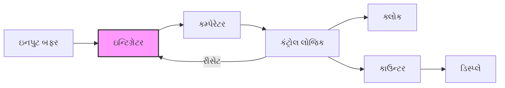

**કાર્યસિદ્ધાંત:**

- ઇનપુટ વોલ્ટેજને નિશ્ચિત સમય માટે ઇન્ટિગ્રેટ કરવામાં આવે છે
- ઇન્ટિગ્રેટર આઉટપુટ ઇનપુટના પ્રમાણમાં ઉપર તરફ જાય છે
- વિરુદ્ધ ધ્રુવીયતા સાથે રેફરન્સ વોલ્ટેજ ઇન્ટિગ્રેટરને ડિસ્ચાર્જ કરે છે
- ડિસ્ચાર્જ માટે લાગતો સમય ક્લોક પલ્સ દ્વારા માપવામાં આવે છે
- કાઉન્ટ ઇનપુટ વોલ્ટેજના પ્રમાણમાં હોય છે

**વેવફોર્મ:**

```goat
Input      ────────────────────────────────
                                           
Integrator      /\                /\       
output         /  \              /  \      
              /    \            /    \     
             /      \          /      \    
            /        \        /        \   
           /          \      /          \  
          /            \    /            \ 

Control    ────┐      ┌─────────┐      ┌──
signals        │      │         │      │  
               └──────┘         └──────┘  

Clock      ┌┐┌┐┌┐┌┐┌┐┌┐┌┐┌┐┌┐┌┐┌┐┌┐┌┐┌┐┌┐┌┐
pulses     └┘└┘└┘└┘└┘└┘└┘└┘└┘└┘└┘└┘└┘└┘└┘└┘
```

**ફાયદા:**

- ઉચ્ચ નોઈઝ રિજેક્શન
- સારી ચોકસાઈ
- ઉત્તમ રિઝોલ્યુશન
- કોમન-મોડ નોઈઝને નકારે છે

**મેમરી ટ્રીક:** "DIRT મીટર: ડાયરેક્ટ ઇન્ટિગ્રેશન વોલ્ટેજ માપવા માટે સમયને સંબંધિત કરે છે."

## પ્રશ્ન 3(અ) [3 ગુણ]

**CRO અને DSO વચ્ચે તફાવત લખો.**

**જવાબ**:

| પેરામીટર | CRO (એનાલોગ ઓસિલોસ્કોપ) | DSO (ડિજિટલ સ્ટોરેજ ઓસિલોસ્કોપ) |
|-----------|---------------------------|-----------------------------------|
| **સિગ્નલ પ્રોસેસિંગ** | સંપૂર્ણ એનાલોગ | ADC રૂપાંતર પછી ડિજિટલ |
| **સ્ટોરેજ ક્ષમતા** | વેવફોર્મ સંગ્રહ કરી શકતું નથી | અનેક વેવફોર્મ સંગ્રહ કરી શકે છે |
| **બેન્ડવિડ્થ** | સામાન્ય રીતે ઓછી | ઉચ્ચ (GHz સુધી) |
| **ટ્રિગરિંગ** | મૂળભૂત ટ્રિગર વિકલ્પો | અદ્યતન ટ્રિગર ક્ષમતાઓ |
| **એનાલિસિસ ફીચર્સ** | મર્યાદિત | વિસ્તૃત (FFT, માપન) |
| **ડિસ્પ્લે પર્સિસ્ટન્સ** | ફોસ્ફર પર્સિસ્ટન્સ | એડજસ્ટેબલ ડિજિટલ પર્સિસ્ટન્સ |

**મેમરી ટ્રીક:** "PASSED: પ્રોસેસિંગ-એનાલોગ/ડિજિટલ, સ્ટોરેજ-નહીં/હા, સિગ્નલ-કાચો/પ્રોસેસ્ડ, સરળ-મૂળભૂત/અદ્યતન, ડિસ્પ્લે-ફોસ્ફર/ડિજિટલ."

## પ્રશ્ન 3(બ) [4 ગુણ]

**CRO સ્ક્રીન સમજાવો.**

**જવાબ**:

CRO સ્ક્રીન ઇલેક્ટ્રિકલ સિગ્નલ્સને દર્શાવે છે અને તેમાં કેટલાક મહત્વપૂર્ણ ઘટકો હોય છે.

```goat
┌───────────────────────────────────────┐
│                                       │
│             PHOSPHOR SCREEN           │
│                                       │
│     │         │         │         │   │
│  ───┼─────────┼─────────┼─────────┼── │
│     │         │         │         │   │
│     │         │         │         │   │
│  ───┼─────────┼─────────┼─────────┼── │
│     │         │         │         │   │
│     │         │         │         │   │
│  ───┼─────────┼─────────┼─────────┼── │
│     │         │         │         │   │
│     │         │         │         │   │
│  ───┼─────────┼─────────┼─────────┼── │
│     │         │         │         │   │
│                                       │
└───────────────────────────────────────┘
```

**ઘટકો:**

- **ફોસ્ફર કોટિંગ**: ઇલેક્ટ્રોન દ્વારા અથડાવા પર પ્રકાશ આપે છે
- **ગ્રેટિક્યુલ**: માપન સંદર્ભ માટે ગ્રિડ લાઈન્સ
- **સ્કેલ**: વોલ્ટેજ/સમય માટે કેલિબ્રેટેડ માર્કિંગ્સ
- **સેન્ટર રેફરન્સ પોઈન્ટ**: (0,0) કોઓર્ડિનેટ
- **ઇન્ટેન્સિટી કંટ્રોલ**: ડિસ્પ્લેની બ્રાઇટનેસ એડજસ્ટ કરે છે

**મેમરી ટ્રીક:** "PGSCR: ફોસ્ફર ઇલેક્ટ્રોન અથડાવાથી પ્રકાશે છે, પ્રતિનિધિત્વ બનાવે છે."

## પ્રશ્ન 3(ક) [7 ગુણ]

**CRO નો બ્લોક ડાયાગ્રામ, કામગીરી અને ફાયદા જરૂરી ડાયાગ્રામ સાથે સમજાવો.**

**જવાબ**:

CRO (કેથોડ રે ઓસિલોસ્કોપ) ઇલેક્ટ્રિકલ સિગ્નલને વેવફોર્મ તરીકે વિઝ્યુઅલાઈઝ કરે છે.

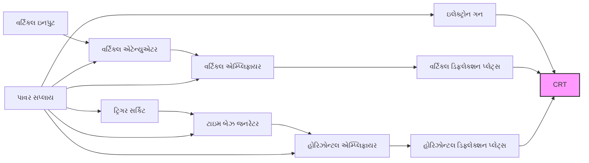

**કાર્યસિદ્ધાંત:**

- **ઇલેક્ટ્રોન ગન**: ઇલેક્ટ્રોન બીમ ઉત્પન્ન કરે છે
- **વર્ટિકલ સિસ્ટમ**: ઇનપુટ સિગ્નલના પ્રમાણમાં Y-એક્સિસ ડિફ્લેક્શન નિયંત્રિત કરે છે
- **હોરિઝોન્ટલ સિસ્ટમ**: સ્થિર દરે સ્ક્રીન પર બીમને સ્વીપ કરે છે
- **ટ્રિગર સર્કિટ**: ઇનપુટ સિગ્નલ સાથે હોરિઝોન્ટલ સ્વીપ સિન્ક્રોનાઈઝ કરે છે
- **CRT**: ફોસ્ફર સ્ક્રીન પર ઇલેક્ટ્રોન બીમની ગતિ દર્શાવે છે

**ફાયદા:**

- રીઅલ-ટાઇમ સિગ્નલ ડિસ્પ્લે
- વિશાળ બેન્ડવિડ્થ
- ઉચ્ચ ઇનપુટ ઇમ્પિડન્સ
- બહુવિધ ટ્રિગરિંગ વિકલ્પો
- એકાધિક સિગ્નલ એનાલિસિસ

**મેમરી ટ્રીક:** "EARTH વ્યૂ: ઇલેક્ટ્રોન બીમ એમ્પ્લિફિકેશન સમય-આધારિત હોરિઝોન્ટલ વ્યૂને પ્રગટ કરે છે."

## પ્રશ્ન 3(અ OR) [3 ગુણ]

**(frequency) આવર્તન માપન અને ફેઝ એંગલ માપન માટે લિસાજસ પેટર્ન લાગુ કરો.**

**જવાબ**:

લિસાજસ પેટર્ન ત્યારે બને છે જ્યારે બે સાઇન વેવ્સ CROના X અને Y ઇનપુટ પર લાગુ કરવામાં આવે છે.

| પેટર્ન પ્રકાર | ઉદાહરણ | માપન સૂત્ર |
|--------------|---------|------------|
| **આવૃત્તિ માપન** |  | fx/fy = ny/nx |
| **ફેઝ એંગલ માપન** |  | sin(φ) = A/B |

```goat
    Frequency                 Phase
      B B                     B  
    A     A                A     A
    │     │                │  │  │
    └─────┘                └──┘──┘
      
    fx/fy = 2/1          sin(φ) = sin/sin
```

- **આવૃત્તિ ગુણોત્તર**: ઊભા ટેન્જન્ટ પોઈન્ટ્સ / આડા ટેન્જન્ટ પોઈન્ટ્સની ગણતરી
- **ફેઝ માપન**: sin(φ) = sin/sinmax જ્યાં sin એ ઝીરો ક્રોસિંગ પર પેટર્નની ઊંચાઈ છે
- **એપ્લિકેશન**: સિગ્નલ તુલના, આવૃત્તિ કેલિબ્રેશન

**મેમરી ટ્રીક:** "LIPS પેટર્ન: લિસાજસ ફેઝ અને સાઇન આવૃત્તિ દર્શાવે છે."

## પ્રશ્ન 3(બ OR) [4 ગુણ]

**CRO માં Graticules સમજાવો. તેના પ્રકારો પણ સમજાવો.**

**જવાબ**:

ગ્રેટિક્યુલ્સ એ CRO સ્ક્રીન પર રેફરન્સ ગ્રિડ છે જે વેવફોર્મ પેરામીટર્સના માપનમાં મદદ કરે છે.

```goat
┌───────────────────────────────────┐
│                                   │
│  │    │    │    │    │    │    │  │
│──┼────┼────┼────┼────┼────┼────┼──│
│  │    │    │    │    │    │    │  │
│  │    │    │    │    │    │    │  │
│──┼────┼────┼────┼────┼────┼────┼──│
│  │    │    │    │    │    │    │  │
│  │    │    │    │    │    │    │  │
│──┼────┼────┼────┼────┼────┼────┼──│
│  │    │    │    │    │    │    │  │
│                                   │
└───────────────────────────────────┘
```

**ગ્રેટિક્યુલ્સના પ્રકારો:**

| પ્રકાર | વર્ણન | એપ્લિકેશન |
|-------|-------|------------|
| **આંતરિક ગ્રેટિક્યુલ** | CRTની અંદર ખોદાયેલ | પેરેલેક્સ ભૂલને દૂર કરે છે |
| **બાહ્ય ગ્રેટિક્યુલ** | અલગ પારદર્શક પ્લેટ | સરળતાથી બદલી શકાય છે |
| **ઇલેક્ટ્રોનિક ગ્રેટિક્યુલ** | ઇલેક્ટ્રોનિક રીતે ઉત્પન્ન થાય છે | ડિજિટલ ઓસિલોસ્કોપ્સ |
| **સ્પેશિયલ પરપઝ** | ચોક્કસ માપન માટે કસ્ટમ માર્કિંગ્સ | વિશિષ્ટ પરીક્ષણ |

**મેમરી ટ્રીક:** "GRIT: ગ્રેટિક્યુલ્સ સમય-વોલ્ટેજ માપન માટે મહત્વપૂર્ણ રેન્ડરિંગ કરે છે."

## પ્રશ્ન 3(ક OR) [7 ગુણ]

**ડિજિટલ સ્ટોરેજ ઓસિલોસ્કોપ (DSO)નો બ્લોક ડાયાગ્રામ, કામગીરી અને ફાયદા જરૂરી ડાયાગ્રામ સાથે સમજાવો.**

**જવાબ**:

ડિજિટલ સ્ટોરેજ ઓસિલોસ્કોપ (DSO) સિગ્નલને સ્ટોરેજ, પ્રોસેસિંગ અને ડિસ્પ્લે માટે ડિજિટાઇઝ કરે છે.

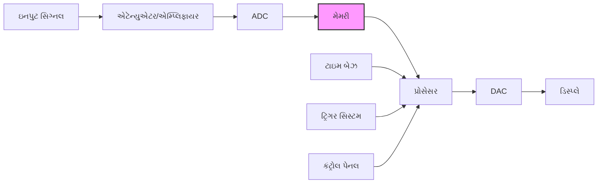

**કાર્યસિદ્ધાંત:**

- **એક્વિઝિશન**: ADC દ્વારા ઉચ્ચ દરે સિગ્નલ સેમ્પલ કરવામાં આવે છે
- **સ્ટોરેજ**: ડિજિટલ વેલ્યૂ મેમરીમાં સંગ્રહિત કરવામાં આવે છે
- **પ્રોસેસિંગ**: ડિજિટલ સિગ્નલ પ્રોસેસિંગ એનાલિસિસને વધારે છે
- **ડિસ્પ્લે**: પુનર્નિર્મિત સિગ્નલ સ્ક્રીન પર દર્શાવવામાં આવે છે
- **ટ્રિગરિંગ**: અદ્યતન ડિજિટલ ટ્રિગરિંગ વિકલ્પો

**ફાયદા:**

- સિગ્નલ સંગ્રહ ક્ષમતા
- પ્રી-ટ્રિગર વ્યૂઇંગ
- વન-શોટ સિગ્નલ કેપ્ચર
- અદ્યતન માપન
- લાંબા કેપ્ચર માટે ડીપ મેમરી
- ડિજિટલ ફિલ્ટરિંગ અને એનાલિસિસ
- નેટવર્ક કનેક્ટિવિટી

**મેમરી ટ્રીક:** "SAMPLE: સ્ટોરેજ અને મેમરી લાંબા સમયના ઇવેન્ટ્સને સાચવે છે."

## પ્રશ્ન 4(અ) [3 ગુણ]

**RTD અને થર્મિસ્ટરનો તફાવત લખો.**

**જવાબ**:

| પેરામીટર | RTD (રેસિસ્ટન્સ ટેમ્પરેચર ડિટેક્ટર) | થર્મિસ્ટર |
|-----------|--------------------------------------|------------|
| **મટીરિયલ** | પ્લેટિનમ, નિકલ, કોપર | મેટલ ઓક્સાઇડ્સ, સેમિકન્ડક્ટર્સ |
| **રેસિસ્ટન્સ-તાપમાન સંબંધ** | રેખીય, પોઝિટિવ કોએફિશિયન્ટ | નોન-લિનિયર, સામાન્ય રીતે નેગેટિવ કોએફિશિયન્ટ |
| **તાપમાન શ્રેણી** | -200°C થી +850°C | -50°C થી +300°C |
| **સંવેદનશીલતા** | ઓછી (0.00385 Ω/Ω/°C સામાન્ય) | ઉચ્ચ (3-5% પ્રતિ °C સામાન્ય) |
| **ચોકસાઈ** | ઉચ્ચ | નિમ્ન |
| **પ્રતિક્રિયા સમય** | ધીમો | ઝડપી |

**મેમરી ટ્રીક:** "RTD એ PLAINS છે: પ્લેટિનમ, લિનિયર, ચોક્કસ, ઔદ્યોગિક શ્રેણી, સાંકડી સંવેદનશીલતા, સ્થિર."

## પ્રશ્ન 4(બ) [4 ગુણ]

**ઓપ્ટિકલ એનકોડરનું તેના આઉટપુટ વેવફોર્મ સાથે સમજાવો.**

**જવાબ**:

ઓપ્ટિકલ એનકોડર, પ્રકાશનું કોડેડ ડિસ્ક મારફતે અવરોધન થવાથી યાંત્રિક ગતિને ડિજિટલ પલ્સમાં રૂપાંતરિત કરે છે.

```goat
    ┌─────────────┐
    │  Light      │
    │  Source     │
    └─────┬───────┘
          │
          v
    ┌─────────────┐
    │  Code       │
    │  Disc       │◄────Motion
    └─────┬───────┘
          │
          v
    ┌─────────────┐
    │  Photo-     │
    │  detector   │
    └─────┬───────┘
          │
          v
     Output Signal
```

**આઉટપુટ વેવફોર્મ:**

```goat
Channel A: ┌──┐  ┌──┐  ┌──┐  ┌──┐
           │  │  │  │  │  │  │  │
           └──┘  └──┘  └──┘  └──┘

Channel B: ┌──┐  ┌──┐  ┌──┐  ┌──┐
         ┌─┘  └──┘  └──┘  └──┘  └─
         │
90° phase│
   shift └─────────────────────────
```

- **ઘટકો**: પ્રકાશ સ્ત્રોત, કોડેડ ડિસ્ક, ફોટોડિટેક્ટર
- **પ્રકારો**: ઇન્ક્રિમેન્ટલ (પલ્સ) અથવા એબ્સોલ્યુટ (યુનિક પોઝિશન કોડ)
- **એપ્લિકેશન**: પોઝિશન માપન, સ્પીડ ડિટેક્શન, મોશન કંટ્રોલ

**મેમરી ટ્રીક:** "DROPS: ડિસ્ક રોટેશન પલ્સ સિગ્નલ આઉટપુટ કરે છે."

## પ્રશ્ન 4(ક) [7 ગુણ]

**થર્મોકપલનું કાર્યકારી સિદ્ધાંત, પ્રકારો અને એપ્લિકેશન સાથે વર્ણન કરો.**

**જવાબ**:

થર્મોકપલ એ તાપમાન સેન્સર છે જે સીબેક ઇફેક્ટ પર કાર્ય કરે છે અને તાપમાનના તફાવતના પ્રમાણમાં વોલ્ટેજ ઉત્પન્ન કરે છે.

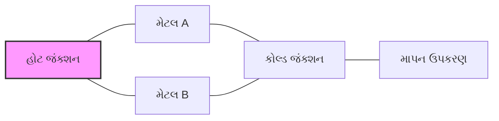

**કાર્યસિદ્ધાંત:** 

- બે અલગ-અલગ મેટલ એક છેડે (હોટ જંક્શન) જોડાયેલા હોય છે
- હોટ અને કોલ્ડ જંક્શન વચ્ચેના તાપમાનના તફાવતથી વોલ્ટેજ ઉત્પન્ન થાય છે
- વોલ્ટેજ તાપમાન તફાવતના પ્રમાણમાં હોય છે

**થર્મોકપલના પ્રકારો:**

| પ્રકાર | મટીરિયલ | તાપમાન શ્રેણી | એપ્લિકેશન |
|------|-----------|-------------------|-------------|
| **ટાઇપ K** | ક્રોમેલ-એલુમેલ | -200°C થી +1350°C | જનરલ પરપઝ, ઓક્સિડાઇઝિંગ એટમોસ્ફિયર |
| **ટાઇપ J** | આયર્ન-કોન્સ્ટન્ટન | -40°C થી +750°C | રિડ્યુસિંગ એટમોસ્ફિયર, વેક્યુમ |
| **ટાઇપ E** | ક્રોમેલ-કોન્સ્ટન્ટન | -200°C થી +900°C | ક્રાયોજેનિક, ઉચ્ચ આઉટપુટ |
| **ટાઇપ T** | કોપર-કોન્સ્ટન્ટન | -250°C થી +350°C | લો ટેમ્પરેચર, ફૂડ ઇન્ડસ્ટ્રી |
| **ટાઇપ R/S** | પ્લેટિનમ-રોડિયમ | 0°C થી +1700°C | હાઇ ટેમ્પરેચર, લેબોરેટરી |

**એપ્લિકેશન:** ઔદ્યોગિક ફર્નેસ, એન્જિન, કેમિકલ પ્રોસેસિંગ, ફૂડ પ્રોસેસિંગ, રિસર્ચ

**મેમરી ટ્રીક:** "SHOVE સિદ્ધાંત: સીબેક હોટ-કોલ્ડ આઉટપુટ વોલ્ટેજ તાપમાનની બરાબર."

## પ્રશ્ન 4(અ OR) [3 ગુણ]

**એક્ટીવ અને પેસિવ ટ્રાન્સડ્યુસરનો તફાવત લખો.**

**જવાબ**:

| પેરામીટર | એક્ટીવ ટ્રાન્સડ્યુસર | પેસિવ ટ્રાન્સડ્યુસર |
|-----------|-------------------|---------------------|
| **ઊર્જા રૂપાંતરણ** | ભૌતિક જથ્થાને સીધા જ ઇલેક્ટ્રિકલ આઉટપુટમાં રૂપાંતરિત કરે છે | બાહ્ય ઊર્જા સ્ત્રોતની જરૂર પડે છે |
| **આઉટપુટ સિગ્નલ** | સેલ્ફ-જનરેટિંગ | બાહ્ય ઊર્જાને મોડ્યુલેટ કરે છે |
| **ઉદાહરણો** | થર્મોકપલ, પિઝોઇલેક્ટ્રિક, ફોટોવોલ્ટેઇક | RTD, સ્ટ્રેઇન ગેજ, LVDT |
| **સંવેદનશીલતા** | સામાન્ય રીતે ઓછી | સામાન્ય રીતે ઉચ્ચ |
| **સર્કિટ જટિલતા** | સરળ | વધુ જટિલ |
| **પાવર જરૂરિયાત** | બાહ્ય પાવરની જરૂર નથી | બાહ્ય પાવર જરૂરી |

**મેમરી ટ્રીક:** "SIMPLE તફાવત: સેલ્ફ-પાવર્ડ આગળ પડતા ઊર્જા ટ્રાન્સડ્યુસરનો મુખ્ય સિદ્ધાંત છે."

## પ્રશ્ન 4(બ OR) [4 ગુણ]

**કેપેસિટીવ ટ્રાન્સડ્યુસરને જરૂરી ડાયાગ્રામ સાથે વિગતવાર સમજાવો. તેની એપ્લિકેશનની યાદી બનાવો.**

**જવાબ**:

કેપેસિટીવ ટ્રાન્સડ્યુસર ભૌતિક ડિસ્પ્લેસમેન્ટને કારણે કેપેસિટન્સમાં થતા ફેરફારના સિદ્ધાંત પર કાર્ય કરે છે.

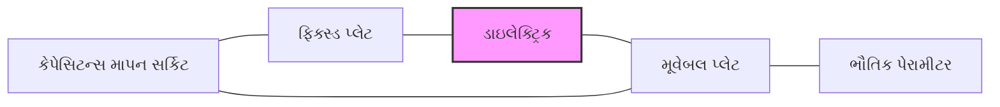

**કાર્યસિદ્ધાંત:**

- કેપેસિટન્સ C = ε₀εᵣA/d
- આમાં ફેરફાર થાય છે: ક્ષેત્રફળ (A), અંતર (d), અથવા ડાઇલેક્ટ્રિક સ્થિરાંક (εᵣ) માં ફેરફારથી
- ડિસ્પ્લેસમેન્ટ કેપેસિટન્સને બદલે છે
- બ્રિજ સર્કિટ અથવા ઓસિલેટર દ્વારા માપવામાં આવે છે

**એપ્લિકેશન:**

- પ્રેશર માપન
- લિક્વિડ લેવલ સેન્સિંગ
- હ્યુમિડિટી સેન્સર
- ડિસ્પ્લેસમેન્ટ માપન
- એક્સેલેરોમીટર

**મેમરી ટ્રીક:** "CADAP: કેપેસિટન્સ અંતર, ક્ષેત્રફળ, અથવા પર્મિટિવિટી સાથે બદલાય છે."

## પ્રશ્ન 4(ક OR) [7 ગુણ]

**LVDT ટ્રાન્સડ્યુસર ઓપરેશન, બાંધકામને જરૂરી આકૃતિ સાથે વિગતવાર સમજાવો. એલવીડીટીના લાભ, ગેરલાભ અને એપ્લિકેશનની પણ યાદી બનાવો.**

**જવાબ**:

LVDT (લિનિયર વેરિએબલ ડિફરેન્શિયલ ટ્રાન્સફોર્મર) એ ઇલેક્ટ્રોમેકેનિકલ ટ્રાન્સડ્યુસર છે જે લિનિયર ડિસ્પ્લેસમેન્ટને ઇલેક્ટ્રિકલ આઉટપુટમાં રૂપાંતરિત કરે છે.

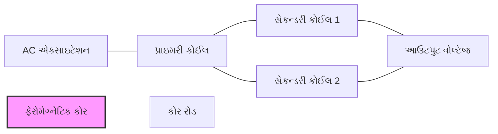

**બાંધકામ:**

- મધ્યમાં પ્રાઇમરી કોઈલ
- સમમિત રીતે વીંટળાયેલી બે સેકન્ડરી કોઈલ
- હલનચલન કરી શકે તેવો ફેરોમેગ્નેટિક કોર
- સિગ્નલ કન્ડિશનિંગ સર્કિટરી

**ઓપરેશન:**

- AC એક્સાઇટેશન પ્રાઇમરી કોઈલને ઊર્જાવાન કરે છે
- કોરની સ્થિતિ સેકન્ડરીમાં મેગ્નેટિક કપલિંગ નક્કી કરે છે
- ડિસ્પ્લેસમેન્ટના પ્રમાણમાં ડિફરેન્શિયલ વોલ્ટેજ આઉટપુટ મળે છે
- ફેઝ ડિસ્પ્લેસમેન્ટની દિશા દર્શાવે છે

**લાભ:**

- નોન-કોન્ટેક્ટ ઓપરેશન
- અનંત રિઝોલ્યૂશન
- ઉચ્ચ લિનિયરિટી
- મજબૂત બાંધકામ
- લાંબું ઓપરેશનલ જીવન
- ખરાબ પરિસ્થિતિમાં પણ ઇમ્યુનિટી

**ગેરલાભ:**

- AC એક્સાઇટેશનની જરૂર પડે છે
- અન્ય સેન્સર્સની તુલનામાં મોટું
- બાહ્ય ચુંબકીય ક્ષેત્રોથી અસર પામે છે
- મર્યાદિત ડાયનેમિક પ્રતિસાદ

**એપ્લિકેશન:**

- પ્રિસિઝન માપન
- હાઇડ્રોલિક સિસ્ટમ
- એરક્રાફ્ટ કંટ્રોલ
- પાવર પ્લાન્ટ કંટ્રોલ
- ઓટોમેટેડ મેન્યુફેક્ચરિંગ

**મેમરી ટ્રીક:** "CDPOS સેન્સર: કોર ડિસ્પ્લેસમેન્ટ આઉટપુટ સિગ્નલ ઉત્પન્ન કરે છે."

## પ્રશ્ન 5(અ) [3 ગુણ]

**સેમિકન્ડક્ટર ટેમ્પરેચર સેન્સર LM35નો સિદ્ધાંત અને કાર્ય દર્શાવો.**

**જવાબ**:

LM35 એક ઇન્ટિગ્રેટેડ સર્કિટ ટેમ્પરેચર સેન્સર છે જે સેલ્સિયસમાં તાપમાનના પ્રમાણમાં રેખીય વોલ્ટેજ આઉટપુટ આપે છે.

```goat
     ┌───┬───┬───┐
     │   │   │   │
     │ 1 │ 2 │ 3 │
     │   │   │   │
     └───┴───┴───┘
       │   │   │
       │   │   │
       │   │   └── GND
       │   └────── આઉટપુટ (10mV/°C)
       └────────── VCC (+4V થી +30V)
```

**કાર્યસિદ્ધાંત:**

- બિલ્ટ-ઇન તાપમાન-સેન્સિંગ એલિમેન્ટ સાથે ઇન્ટિગ્રેટેડ સર્કિટ
- લિનિયર આઉટપુટ વોલ્ટેજ: +10mV/°C
- સીધા સેલ્સિયસમાં કેલિબ્રેટેડ
- ઓપરેટિંગ રેન્જ: -55°C થી +150°C

**સર્કિટ:**

- ફક્ત પાવર સપ્લાય કનેક્શનની જરૂર
- આઉટપુટ વોલ્ટમીટર સાથે સીધું વાંચી શકાય
- બાહ્ય કેલિબ્રેશનની જરૂર નથી

**મેમરી ટ્રીક:** "TEN mV TRICK: તાપમાન વધારો મિલિવોલ્ટ્સમાં નોંધાય છે: દસ વધારો સેલ્સિયસ કેલ્વિન સૂચવે છે."

## પ્રશ્ન 5(બ) [4 ગુણ]

**હાર્મોનિક ડિસ્ટોરશન એનાલાઇઝરની કામગીરીનું વર્ણન જરૂરી આકૃતિ સાથે કરો.**

**જવાબ**:

હાર્મોનિક ડિસ્ટોરશન એનાલાઇઝર સિગ્નલ ક્વોલિટી નક્કી કરવા માટે સિગ્નલમાં હાર્મોનિક કન્ટેન્ટનું માપન કરે છે.

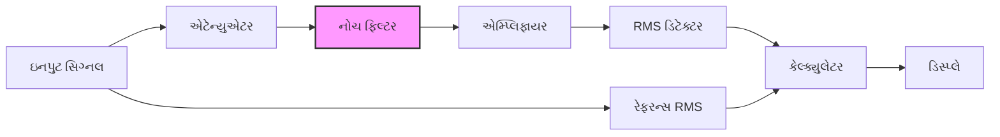

**કાર્યસિદ્ધાંત:**

- નોચ ફિલ્ટર દ્વારા મૂળભૂત આવૃત્તિ ફિલ્ટર કરવામાં આવે છે
- બાકીના હાર્મોનિક્સ માપવામાં આવે છે
- THD = (હાર્મોનિક્સનો VRMS)/(મૂળભૂત આવૃત્તિનો VRMS)
- ટકાવારી અથવા dB માં વ્યક્ત કરવામાં આવે છે

**ઓપરેશન સ્ટેપ્સ:**

1. કુલ સિગ્નલ RMS માપો
2. મૂળભૂત આવૃત્તિ ફિલ્ટર કરો
3. બાકીના હાર્મોનિક્સ માપો
4. THD રેશિઓની ગણતરી કરો

**મેમરી ટ્રીક:** "FRONT એનાલિસિસ: ફિલ્ટર મૂળ નોટને સંપૂર્ણપણે દૂર કરે છે બાકીના સિગ્નલના એનાલિસિસ માટે."

## પ્રશ્ન 5(ક) [7 ગુણ]

**સ્પેક્ટ્રમ એનાલાયઝરનું કાર્ય જરૂરી ડાયાગ્રામ સાથે વિગતવાર વર્ણન કરો.**

**જવાબ**:

સ્પેક્ટ્રમ એનાલાઇઝર સિગ્નલના સ્પેક્ટ્રલ રચનાને દર્શાવતા આવૃત્તિ સામે સિગ્નલ એમ્પ્લિટ્યુડને દર્શાવે છે.

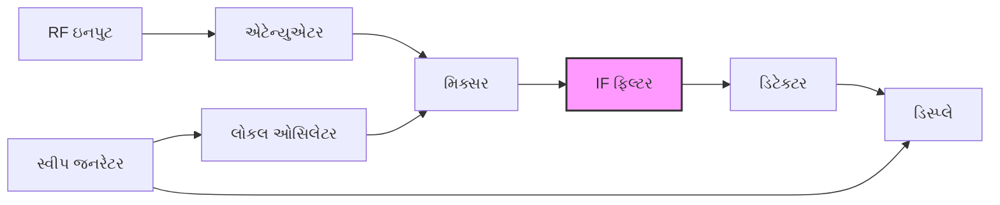

**કાર્યસિદ્ધાંત:**

- **સુપરહેટેરોડાઇન સિદ્ધાંત**: ઇનપુટ સિગ્નલ લોકલ ઓસિલેટર સાથે મિક્સ કરવામાં આવે છે
- **સ્વીપ ટેકનિક**: LO આવૃત્તિ રસપ્રદ શ્રેણી પર સ્વીપ કરવામાં આવે છે
- **રિઝોલ્યૂશન બેન્ડવિડ્થ**: IF ફિલ્ટર બેન્ડવિડ્થ દ્વારા નિયંત્રિત
- **ડિટેક્શન**: IF સિગ્નલને એમ્પ્લિટ્યુડ માહિતીમાં રૂપાંતરિત કરે છે
- **ડિસ્પ્લે**: ફ્રિક્વન્સી ડોમેઇન રજૂઆત બતાવે છે

**પ્રકારો:**

- સ્વેપ્ટ-ટ્યુન્ડ સ્પેક્ટ્રમ એનાલાઇઝર
- FFT-આધારિત સ્પેક્ટ્રમ એનાલાઇઝર
- રીયલ-ટાઇમ સ્પેક્ટ્રમ એનાલાઇઝર

**એપ્લિકેશન:**

- સિગ્નલ એનાલિસિસ
- EMI/EMC ટેસ્ટિંગ
- કોમ્યુનિકેશન સિસ્ટમ ટેસ્ટિંગ
- હાર્મોનિક એનાલિસિસ
- મોડ્યુલેશન એનાલિસિસ

**મેમરી ટ્રીક:** "SAFER વ્યૂ: સ્વીપ RF તપાસવા માટે આવૃત્તિઓનું એનાલિસિસ કરે છે."

## પ્રશ્ન 5(અ OR) [3 ગુણ]

**એનાલોગ ટ્રાન્સડ્યુસર અને ડીજીટલ ટ્રાન્સડ્યુસર સમજાવો. પ્રાથમિક ટ્રાન્સડ્યુસર અને સેકન્ડરી ટ્રાન્સડ્યુસર પણ સમજાવો.**

**જવાબ**:

| ટ્રાન્સડ્યુસર પ્રકાર | વર્ણન |
|----------------|-------------|
| **એનાલોગ ટ્રાન્સડ્યુસર** | ઇનપુટ ભૌતિક જથ્થાના પ્રમાણમાં સતત આઉટપુટ સિગ્નલ ઉત્પન્ન કરે છે |
| **ડિજિટલ ટ્રાન્સડ્યુસર** | ઇનપુટ જથ્થાનું પ્રતિનિધિત્વ કરતા ડિસ્ક્રીટ/બાઇનરી આઉટપુટ સિગ્નલ ઉત્પન્ન કરે છે |
| **પ્રાથમિક ટ્રાન્સડ્યુસર** | ભૌતિક જથ્થાને સીધા જ ઇલેક્ટ્રિકલ સિગ્નલમાં રૂપાંતરિત કરે છે |
| **સેકન્ડરી ટ્રાન્સડ્યુસર** | પ્રાથમિક ટ્રાન્સડ્યુસરના આઉટપુટને બીજા સ્વરૂપમાં રૂપાંતરિત કરે છે |

```goat
Analog vs Digital Output:

Analog:   ────────────────
             /\      /\
            /  \    /  \
           /    \  /    \

Digital:  ┌───┐    ┌───┐
          │   │    │   │
          │   │    │   │
          └───┘    └───┘
```

**મેમરી ટ્રીક:** "PADS: પ્રાથમિક અને ડિજિટલ/એનાલોગ સેકન્ડરી."

## પ્રશ્ન 5(બ OR) [4 ગુણ]

**ડીજીટલ આઈસી ટેસ્ટરનું કાર્ય જરૂરી ડાયાગ્રામ સાથે વિગતવાર સમજાવો.**

**જવાબ**:

ડિજિટલ IC ટેસ્ટર ટેસ્ટ પેટર્ન લાગુ કરીને અને પ્રતિસાદનું વિશ્લેષણ કરીને ઇન્ટિગ્રેટેડ સર્કિટની કાર્યક્ષમતા ચકાસે છે.

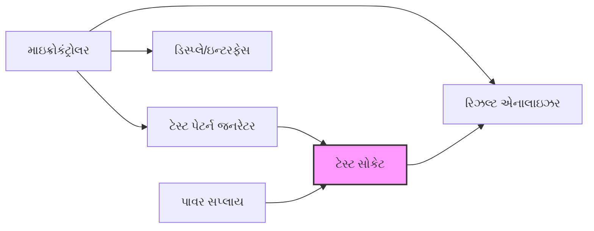

**કાર્યસિદ્ધાંત:**

- IC ને ZIF (ઝીરો ઇન્સર્શન ફોર્સ) સોકેટમાં દાખલ કરવામાં આવે છે
- IC પ્રકાર માટે ટેસ્ટ પેરામીટર્સ પસંદ કરવામાં આવે છે
- પેટર્ન જનરેટર ચોક્કસ ઇનપુટ સિગ્નલ લાગુ કરે છે
- આઉટપુટની અપેક્ષિત પરિણામો સાથે તુલના કરવામાં આવે છે
- પાસ/ફેલ સૂચના પ્રદર્શિત થાય છે

**ફીચર્સ:**

- TTL, CMOS, મેમરી ICs ટેસ્ટ કરે છે
- અજ્ઞાત ICs ઓળખે છે
- ઓપન/શોર્ટ સર્કિટ શોધે છે
- ફંક્શન વેરિફિકેશન

**મેમરી ટ્રીક:** "TRIG ટેસ્ટ: ટેસ્ટ, પેટર્ન ચલાવો, ખામીઓ ઓળખો, રિપોર્ટ જનરેટ કરો."

## પ્રશ્ન 5(ક OR) [7 ગુણ]

**ફંક્શન જનરેટરનું કાર્ય જરૂરી ડાયાગ્રામ સાથે વિગતવાર સમજાવો.**

**જવાબ**:

ફંક્શન જનરેટર ઇલેક્ટ્રોનિક સર્કિટના પરીક્ષણ માટે વિવિધ આવૃત્તિઓ પર વિવિધ વેવફોર્મ ઉત્પન્ન કરે છે.

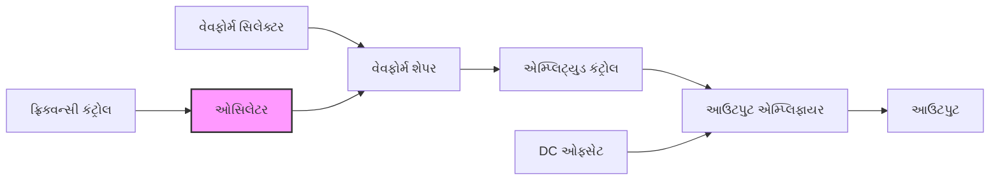

**કાર્યસિદ્ધાંત:**

- **ઓસિલેટર**: મૂળભૂત વેવફોર્મ (સામાન્ય રીતે ત્રિકોણાકાર) ઉત્પન્ન કરે છે
- **વેવફોર્મ શેપર**: સાઇન, સ્ક્વેર, ત્રિકોણાકાર, રેમ્પમાં રૂપાંતરિત કરે છે
- **ફ્રિક્વન્સી કંટ્રોલ**: ઓસિલેશનનો દર સેટ કરે છે
- **એમ્પ્લિટ્યુડ કંટ્રોલ**: આઉટપુટ વોલ્ટેજ લેવલ એડજસ્ટ કરે છે
- **DC ઓફસેટ**: આઉટપુટ સિગ્નલમાં બાયસ ઉમેરે છે
- **આઉટપુટ એમ્પ્લિફાયર**: લો ઇમ્પિડન્સ આઉટપુટ પ્રદાન કરે છે

**આઉટપુટ વેવફોર્મ:**

```goat
Sine:       ────────────
               /\    /\
              /  \  /  \
             /    \/    \

Square:     ┌───┐  ┌───┐
            │   │  │   │
            │   │  │   │
            └───┘  └───┘

Triangle:   ────────────
                /\    /\
               /  \  /  \
              /    \/    \

Ramp:       ────────────
                /|   /|
               / |  / |
              /  | /  |
```

**એપ્લિકેશન:**

- એમ્પ્લિફાયર ટેસ્ટિંગ
- ફિલ્ટર કેરેક્ટરાઇઝેશન
- સિગ્નલ એનાલિસિસ
- શૈક્ષણિક પ્રદર્શન
- કેલિબ્રેશન રેફરન્સ

**મેમરી ટ્રીક:** "SWATOR: સાઇન વેવ અને ત્રિકોણાકાર ઓસિલેટર સિગ્નલ્સ ઉત્પન્ન કરે છે."
