## Question 1(a) [3 marks]

**Define following term: (1) Accuracy (2) Resolution (3) Error**

**Answer**:

| Term | Definition |
|------|------------|
| **Accuracy** | The closeness of a measurement to the true value |
| **Resolution** | The smallest change in input that can be detected by an instrument |
| **Error** | The difference between measured value and true value |

**Mnemonic:** "ARE precise: Accuracy shows Reality, Error shows deviation, Resolution shows detail."

## Question 1(b) [4 marks]

**Explain construction of unbounded strain gauge transducer with necessary diagram in detail. Also list application of it.**

**Answer**:

An unbounded strain gauge consists of a fine wire wound in a grid pattern attached to a backing material.


- **Construction elements**: Fine resistance wire is looped back and forth on an insulating base material
- **Working principle**: Changes resistance when subjected to strain
- **Applications**: Weight measurement, pressure sensors, force sensors, structural health monitoring

**Mnemonic:** "WIRE Flexes: Wire grids Indicate Resistance changes from External stress."

## Question 1(c) [7 marks]

**Explain working of Schering Bridge with circuit diagram for balance condition. List its advantages, disadvantages and applications.**

**Answer**:

Schering Bridge is an AC bridge used to measure unknown capacitance and its dissipation factor.

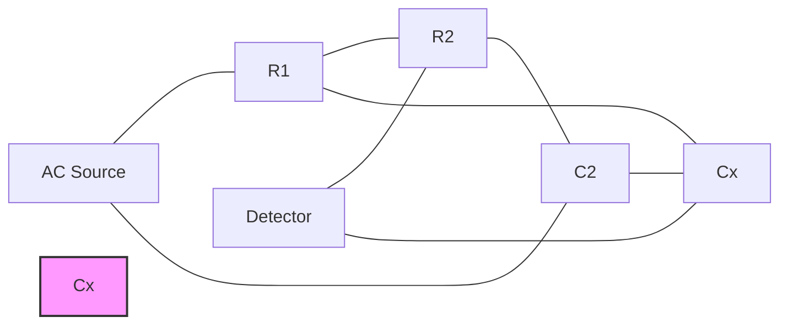

**Balance condition:**

| Equation | Description |
|----------|-------------|
| Cx = C2(R2/R1) | For capacitance calculation |
| Dx = R2(C2/Cx) | For dissipation factor |

**Advantages:**

- High accuracy
- Direct reading of capacitance
- Wide measurement range

**Disadvantages:**

- Requires careful shielding
- Frequency dependent errors
- Complex to balance

**Applications:**

- Capacitor testing
- Insulation testing
- Dielectric material evaluation

**Mnemonic:** "SCUBA dive: Schering Calculates Unknown capacitance By Advanced circuit Designs In Various Equipment."

## Question 1(c OR) [7 marks]

**Explain working of Maxwell's bridge with circuit diagram for balance condition. List its advantages, disadvantages, and applications.**

**Answer**:

Maxwell's bridge is used to measure unknown inductance in terms of known capacitance.

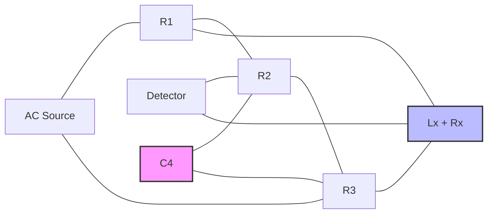

**Balance condition:**

| Equation | Description |
|----------|-------------|
| Lx = C4·R2·R3 | For inductance calculation |
| Rx = R1·(R3/R2) | For resistance calculation |

**Advantages:**

- Independent of frequency
- High accuracy for medium Q coils
- Easy to balance

**Disadvantages:**

- Not suitable for low Q coils
- Requires standard capacitor
- Limited range

**Applications:**

- Measuring inductors
- Audio frequency measurements
- Transformer testing

**Mnemonic:** "MAGIC bridge: Maxwell Analyses Great Inductors by Comparing bridge Elements."

## Question 2(a) [3 marks]

**Explain working of electronic multimeter with necessary diagram.**

**Answer**:

Electronic multimeter converts various electrical parameters into proportional DC voltage for measurement.


- **Circuit elements**: Input selector → Attenuator → Converter → Amplifier → ADC → Display
- **Measurement types**: DC voltage, AC voltage, Current, Resistance
- **Power source**: Battery powered for portability and safety

**Mnemonic:** "SACRED device: Signal Attenuated, Converted And Rectified for Electronic Display."

## Question 2(b) [4 marks]

**Differentiate between Digital Voltmeter over Analog Voltmeter.**

**Answer**:

| Parameter | Digital Voltmeter | Analog Voltmeter |
|-----------|-------------------|------------------|
| **Display type** | Numeric LCD/LED display | Moving pointer on scale |
| **Accuracy** | Higher (±0.1% typical) | Lower (±2-5% typical) |
| **Reading errors** | No parallax error | Prone to parallax error |
| **Resolution** | Higher (can display 3-6 digits) | Limited by scale divisions |
| **Input impedance** | Very high (>10MΩ) | Lower (20-200kΩ/V) |
| **Response time** | Slower sampling rate | Instant response |

**Mnemonic:** "PARIOS: Parallax-free, Accurate, Resolution high, Impedance high, Observation digital, Sampling rate."

## Question 2(c) [7 marks]

**Describe construction diagram of Energy meter and explain in detail.**

**Answer**:

Energy meter measures electrical energy consumption over time in kilowatt-hours (kWh).

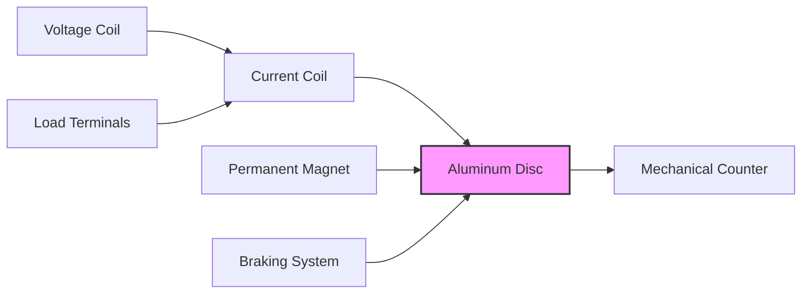

**Components:**

- **Voltage coil**: Creates flux proportional to voltage
- **Current coil**: Creates flux proportional to current
- **Aluminum disc**: Rotates due to eddy currents
- **Counting mechanism**: Registers disc rotations
- **Permanent magnet**: Acts as brake to control disc speed
- **Adjustment systems**: For calibration and accuracy

**Working principle**: Disc rotation speed is proportional to power consumption (V×I×cosΦ)

**Mnemonic:** "VADCR meter: Voltage And current Drive Counter through Rotations."

## Question 2(a OR) [3 marks]

**Explain working of clamp on Ammeter with necessary diagram.**

**Answer**:

Clamp-on ammeter measures current without breaking the circuit by using electromagnetic induction.

```goat
            ╭─────────╮
            │ Display │
            ╰─────────╯
                 │
     ╭───────────────────╮
     │ Signal Processing │
     ╰───────────────────╯
                 │
          ╭────────────╮
          │  CT Core   │───┐
          ╰────────────╯   │
              │    │       │
              │    │       │
              │    │       │
          ╭───┴────┴───╮   │
          │ Clamp Jaws │   │
          ╰────────────╯   │
                 │         │
             Current       │
             Carrying      │
              Wire         │
                           │
                          ─┴─
                          GND
```

- **Construction**: Split ferrite core with sensing coil
- **Working principle**: Current-carrying wire creates magnetic field → induces voltage in sensing coil
- **Advantages**: Non-contact measurement, quick, safe

**Mnemonic:** "CICS: Clamping Induces Current Signal."

## Question 2(b OR) [4 marks]

**Differentiate between PMMC type Meter over Moving iron type Meter.**

**Answer**:

| Parameter | PMMC Type Meter | Moving Iron Type Meter |
|-----------|-----------------|------------------------|
| **Operating principle** | Magnetic field interaction | Magnetic attraction/repulsion |
| **Current type** | DC only | Both AC and DC |
| **Scale** | Uniform | Non-uniform (crowded at ends) |
| **Accuracy** | Higher (±0.5% typical) | Lower (±1-5% typical) |
| **Damping** | Eddy current damping | Air friction damping |
| **Power consumption** | Low | High |
| **Frequency errors** | Not applicable | Affected by frequency changes |

**Mnemonic:** "PMMC is DAUPHIN: DC only, Accurate, Uniform scale, Power efficient, High sensitivity, Independent of frequency, Needs polarity."

## Question 2(c OR) [7 marks]

**Draw the block diagram and Explain working of Integrating type DVM with necessary diagram and waveform.**

**Answer**:

Integrating type DVM converts input voltage to time through integration for high accuracy measurements.

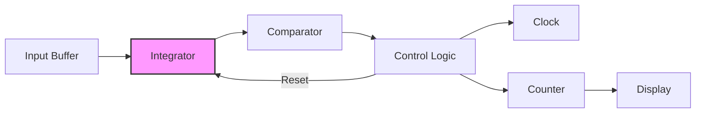

**Working principle:**

- Input voltage is integrated for fixed time period
- Integrator output ramps up proportionally to input
- Reference voltage with opposite polarity discharges integrator
- Time taken for discharge is measured by counting clock pulses
- Count is proportional to input voltage

**Waveforms:**

```goat
Input      ────────────────────────────────
                                           
Integrator      /\                /\       
output         /  \              /  \      
              /    \            /    \     
             /      \          /      \    
            /        \        /        \   
           /          \      /          \  
          /            \    /            \ 

Control    ────┐      ┌─────────┐      ┌──
signals        │      │         │      │  
               └──────┘         └──────┘  

Clock      ┌┐┌┐┌┐┌┐┌┐┌┐┌┐┌┐┌┐┌┐┌┐┌┐┌┐┌┐┌┐┌┐
pulses     └┘└┘└┘└┘└┘└┘└┘└┘└┘└┘└┘└┘└┘└┘└┘└┘
```

**Advantages:**

- High noise rejection
- Good accuracy
- Excellent resolution
- Rejects common-mode noise

**Mnemonic:** "DIRT meter: Direct Integration Relates Time to measure voltage."

## Question 3(a) [3 marks]

**Differentiate between CRO over DSO.**

**Answer**:

| Parameter | CRO (Analog Oscilloscope) | DSO (Digital Storage Oscilloscope) |
|-----------|---------------------------|-----------------------------------|
| **Signal processing** | Analog throughout | Digital after ADC conversion |
| **Storage capability** | Cannot store waveforms | Can store multiple waveforms |
| **Bandwidth** | Typically lower | Higher (can exceed GHz) |
| **Triggering** | Basic trigger options | Advanced trigger capabilities |
| **Analysis features** | Limited | Extensive (FFT, measurements) |
| **Display persistence** | Phosphor persistence | Adjustable digital persistence |

**Mnemonic:** "PASSED: Processing-Analog/digital, Storage-none/yes, Signal-raw/processed, Easy-basic/advanced, Display-phosphor/digital."

## Question 3(b) [4 marks]

**Explain CRO Screen.**

**Answer**:

CRO screen displays electrical signals and consists of several important elements.

```goat
┌───────────────────────────────────────┐
│                                       │
│             PHOSPHOR SCREEN           │
│                                       │
│     │         │         │         │   │
│  ───┼─────────┼─────────┼─────────┼── │
│     │         │         │         │   │
│     │         │         │         │   │
│  ───┼─────────┼─────────┼─────────┼── │
│     │         │         │         │   │
│     │         │         │         │   │
│  ───┼─────────┼─────────┼─────────┼── │
│     │         │         │         │   │
│     │         │         │         │   │
│  ───┼─────────┼─────────┼─────────┼── │
│     │         │         │         │   │
│                                       │
└───────────────────────────────────────┘
```

**Components:**

- **Phosphor coating**: Emits light when struck by electrons
- **Graticule**: Grid lines for measurement reference
- **Scales**: Calibrated markings for voltage/time
- **Center reference point**: (0,0) coordinate
- **Intensity control**: Adjusts brightness of display

**Mnemonic:** "PGSCR: Phosphor Glows when Struck, Creating Representation."

## Question 3(c) [7 marks]

**Explain Block diagram, working and advantage of CRO with necessary diagram.**

**Answer**:

CRO (Cathode Ray Oscilloscope) visualizes electrical signals as waveforms.

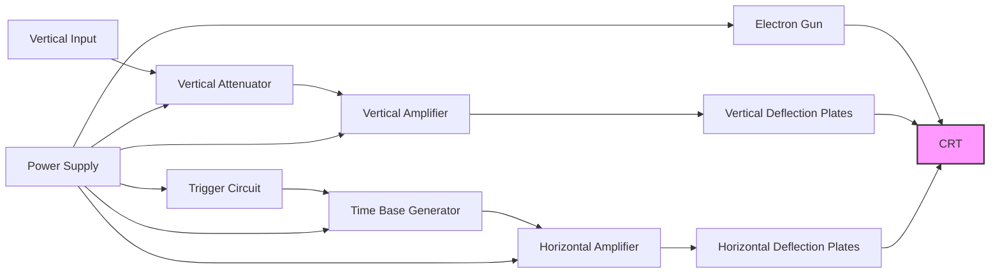

**Working principle:**

- **Electron gun**: Generates electron beam
- **Vertical system**: Controls Y-axis deflection proportional to input signal
- **Horizontal system**: Sweeps beam across screen at constant rate
- **Trigger circuit**: Synchronizes horizontal sweep with input signal
- **CRT**: Displays electron beam movement on phosphor screen

**Advantages:**

- Real-time signal display
- Wide bandwidth
- High input impedance
- Versatile triggering options
- Multiple signal analysis

**Mnemonic:** "EARTH view: Electron beam Amplification Reveals Time-based Horizontal view."

## Question 3(a OR) [3 marks]

**Apply Lissajous pattern for frequency measurement and Phase angle measurement.**

**Answer**:

Lissajous patterns are created when two sine waves are applied to X and Y inputs of CRO.

| Pattern Type | Example | Measurement Formula |
|--------------|---------|---------------------|
| **Frequency Measurement** |  | fx/fy = ny/nx |
| **Phase Angle Measurement** |  | sin(φ) = A/B |

```goat
    Frequency                 Phase
      B B                     B  
    A     A                A     A
    │     │                │  │  │
    └─────┘                └──┘──┘
      
    fx/fy = 2/1          sin(φ) = sin/sin
```

- **Frequency ratio**: Count vertical tangent points / horizontal tangent points
- **Phase measurement**: sin(φ) = sin/sinmax where sin is pattern height at zero crossing
- **Applications**: Signal comparison, frequency calibration

**Mnemonic:** "LIPS patterns: Lissajous Indicates Phase and Sine frequency."

## Question 3(b OR) [4 marks]

**Explain Graticules in CRO. Also Explain its types.**

**Answer**:

Graticules are reference grids on a CRO screen that help in measurement of waveform parameters.

```goat
┌───────────────────────────────────┐
│                                   │
│  │    │    │    │    │    │    │  │
│──┼────┼────┼────┼────┼────┼────┼──│
│  │    │    │    │    │    │    │  │
│  │    │    │    │    │    │    │  │
│──┼────┼────┼────┼────┼────┼────┼──│
│  │    │    │    │    │    │    │  │
│  │    │    │    │    │    │    │  │
│──┼────┼────┼────┼────┼────┼────┼──│
│  │    │    │    │    │    │    │  │
│                                   │
└───────────────────────────────────┘
```

**Types of graticules:**

| Type | Description | Application |
|------|-------------|-------------|
| **Internal graticule** | Etched on inside of CRT | Eliminates parallax error |
| **External graticule** | Separate transparent plate | Easy replacement |
| **Electronic graticule** | Generated electronically | Digital oscilloscopes |
| **Special purpose** | Custom markings for specific measurements | Specialized testing |

**Mnemonic:** "GRIT: Graticules Render Important Time-voltage measurements."

## Question 3(c OR) [7 marks]

**Describe Block diagram, working and advantage of Digital storage oscilloscope (DSO).**

**Answer**:

Digital Storage Oscilloscope (DSO) digitizes signals for storage, processing, and display.

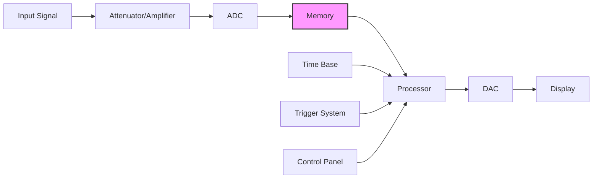

**Working principle:**

- **Acquisition**: Signal is sampled at high rate by ADC
- **Storage**: Digital values stored in memory
- **Processing**: Digital signal processing enhances analysis
- **Display**: Reconstructed signal shown on screen
- **Triggering**: Advanced digital triggering options

**Advantages:**

- Signal storage capability
- Pre-trigger viewing
- One-shot signal capture
- Advanced measurements
- Deep memory for long captures
- Digital filtering and analysis
- Network connectivity

**Mnemonic:** "SAMPLE: Storage And Memory Preserves Long-term Events."

## Question 4(a) [3 marks]

**Differentiate RTD and Thermistor.**

**Answer**:

| Parameter | RTD (Resistance Temperature Detector) | Thermistor |
|-----------|--------------------------------------|------------|
| **Material** | Platinum, Nickel, Copper | Metal oxides, semiconductors |
| **Resistance-temperature relation** | Linear, positive coefficient | Non-linear, usually negative coefficient |
| **Temperature range** | -200°C to +850°C | -50°C to +300°C |
| **Sensitivity** | Lower (0.00385 Ω/Ω/°C typical) | Higher (3-5% per °C typical) |
| **Accuracy** | Higher | Lower |
| **Response time** | Slower | Faster |

**Mnemonic:** "RTD is PLAINS: Platinum, Linear, Accurate, Industrial range, Narrow sensitivity, Stable."

## Question 4(b) [4 marks]

**Explain Optical encoder with its output waveform.**

**Answer**:

Optical encoder converts mechanical motion to digital pulses using light interruption through a coded disc.

```goat
    ┌─────────────┐
    │  Light      │
    │  Source     │
    └─────┬───────┘
          │
          v
    ┌─────────────┐
    │  Code       │
    │  Disc       │◄────Motion
    └─────┬───────┘
          │
          v
    ┌─────────────┐
    │  Photo-     │
    │  detector   │
    └─────┬───────┘
          │
          v
     Output Signal
```

**Output waveforms:**

```goat
Channel A: ┌──┐  ┌──┐  ┌──┐  ┌──┐
           │  │  │  │  │  │  │  │
           └──┘  └──┘  └──┘  └──┘

Channel B: ┌──┐  ┌──┐  ┌──┐  ┌──┐
         ┌─┘  └──┘  └──┘  └──┘  └─
         │
90° phase│
   shift └─────────────────────────
```

- **Components**: Light source, coded disc, photodetector
- **Types**: Incremental (pulses) or absolute (unique position code)
- **Applications**: Position measurement, speed detection, motion control

**Mnemonic:** "DROPS: Disc Rotation Outputs Pulse Signals."

## Question 4(c) [7 marks]

**Describe Thermocouple with working principle, types and application.**

**Answer**:

Thermocouple is a temperature sensor that operates on the Seebeck effect, generating voltage proportional to temperature difference.

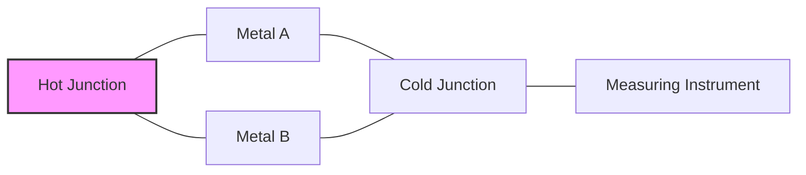

**Working principle:** 

- Two dissimilar metals joined at one end (hot junction)
- Temperature difference between hot and cold junctions generates voltage
- Voltage is proportional to temperature difference

**Types of thermocouples:**

| Type | Materials | Temperature Range | Application |
|------|-----------|-------------------|-------------|
| **Type K** | Chromel-Alumel | -200°C to +1350°C | General purpose, oxidizing atmosphere |
| **Type J** | Iron-Constantan | -40°C to +750°C | Reducing atmosphere, vacuum |
| **Type E** | Chromel-Constantan | -200°C to +900°C | Cryogenic, higher output |
| **Type T** | Copper-Constantan | -250°C to +350°C | Low temperatures, food industry |
| **Type R/S** | Platinum-Rhodium | 0°C to +1700°C | High temperature, laboratory |

**Applications:** Industrial furnaces, engines, chemical processing, food processing, research

**Mnemonic:** "SHOVE theory: Seebeck Hot-cold Output Voltage Equals Temperature."

## Question 4(a OR) [3 marks]

**Differentiate active and passive transducers.**

**Answer**:

| Parameter | Active Transducers | Passive Transducers |
|-----------|-------------------|---------------------|
| **Energy conversion** | Convert physical quantity directly to electrical output | Require external power source |
| **Output signal** | Self-generating | Modulate external energy |
| **Examples** | Thermocouple, Piezoelectric, Photovoltaic | RTD, Strain gauge, LVDT |
| **Sensitivity** | Generally lower | Generally higher |
| **Circuit complexity** | Simpler | More complex |
| **Power requirement** | No external power needed | External power required |

**Mnemonic:** "SIMPLE difference: Self-powered Is Main Principle of Leading Energy transducers."

## Question 4(b OR) [4 marks]

**Explain Capacitive Transducer with necessary diagram in detail. Also list application of it.**

**Answer**:

Capacitive transducer works on the principle of change in capacitance due to physical displacement.

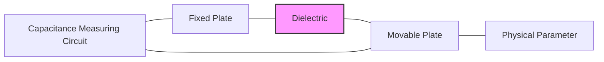

**Working principle:**

- Capacitance C = ε₀εᵣA/d
- Varies with change in: area (A), distance (d), or dielectric constant (εᵣ)
- Displacement changes the capacitance
- Measured using bridge circuit or oscillator

**Applications:**

- Pressure measurement
- Liquid level sensing
- Humidity sensors
- Displacement measurement
- Accelerometers

**Mnemonic:** "CADAP: Capacitance Alters with Distance, Area, or Permittivity."

## Question 4(c OR) [7 marks]

**Explain LVDT Transducer operation, construction with necessary diagram in detail. Also list advantage, disadvantage and application of LVDT.**

**Answer**:

LVDT (Linear Variable Differential Transformer) is an electromechanical transducer that converts linear displacement into electrical output.

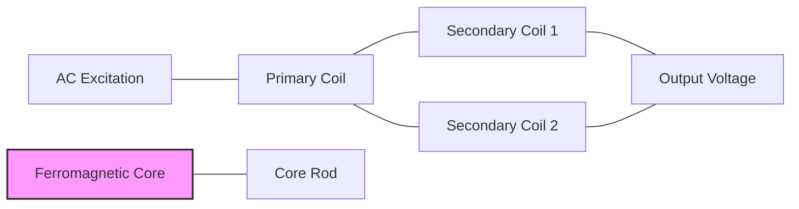

**Construction:**

- Primary coil in center
- Two secondary coils wound symmetrically
- Movable ferromagnetic core
- Signal conditioning circuitry

**Operation:**

- AC excitation energizes primary coil
- Core position determines magnetic coupling to secondaries
- Differential voltage output proportional to displacement
- Phase indicates direction of displacement

**Advantages:**

- Non-contact operation
- Infinite resolution
- High linearity
- Robust construction
- Long operational life
- Immunity to harsh environments

**Disadvantages:**

- Requires AC excitation
- Bulky compared to other sensors
- Affected by external magnetic fields
- Limited dynamic response

**Applications:**

- Precision measurement
- Hydraulic systems
- Aircraft controls
- Power plant controls
- Automated manufacturing

**Mnemonic:** "CDPOS sensor: Core Displacement Produces Output Signal."

## Question 5(a) [3 marks]

**Demonstrate working and principle of Semiconductor Temperature Sensor LM35.**

**Answer**:

LM35 is an integrated circuit temperature sensor that outputs voltage linearly proportional to temperature in Celsius.

```goat
     ┌───┬───┬───┐
     │   │   │   │
     │ 1 │ 2 │ 3 │
     │   │   │   │
     └───┴───┴───┘
       │   │   │
       │   │   │
       │   │   └── GND
       │   └────── Output (10mV/°C)
       └────────── VCC (+4V to +30V)
```

**Working principle:**

- Integrated circuit with built-in temperature-sensing element
- Linear output voltage: +10mV/°C
- Calibrated directly in Celsius
- Operating range: -55°C to +150°C

**Circuit:**

- Requires only power supply connection
- Output directly readable with voltmeter
- No external calibration needed

**Mnemonic:** "TEN mV TRICK: Temperature Escalation Noted in milliVolts: Ten Rise Indicates Celsius Kelvin."

## Question 5(b) [4 marks]

**Describe working of Harmonic distortion analyzer with necessary diagram.**

**Answer**:

Harmonic distortion analyzer measures the harmonic content in signals to determine signal quality.

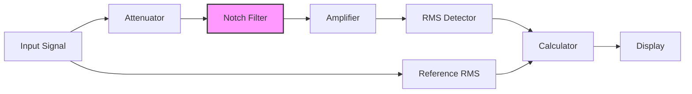

**Working principle:**

- Fundamental frequency is filtered out using notch filter
- Remaining harmonics are measured
- THD = (VRMS of harmonics)/(VRMS of fundamental)
- Expressed as percentage or dB

**Operation steps:**

1. Measure total signal RMS
2. Filter out fundamental
3. Measure remaining harmonics
4. Calculate THD ratio

**Mnemonic:** "FRONT analysis: Filter Removes Original Note Totally for Analyzing Leftover Signals."

## Question 5(c) [7 marks]

**Describe working of Spectrum Analyzer with necessary diagram in detail.**

**Answer**:

Spectrum Analyzer displays signal amplitude versus frequency, showing the spectral composition of signals.

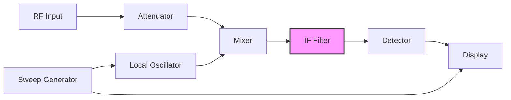

**Working principle:**

- **Superheterodyne principle**: Input signal mixed with local oscillator
- **Sweep technique**: LO frequency swept across range of interest
- **Resolution bandwidth**: Controlled by IF filter bandwidth
- **Detection**: Converts IF signal to amplitude information
- **Display**: Shows frequency domain representation

**Types:**

- Swept-tuned spectrum analyzer
- FFT-based spectrum analyzer
- Real-time spectrum analyzer

**Applications:**

- Signal analysis
- EMI/EMC testing
- Communication systems testing
- Harmonic analysis
- Modulation analysis

**Mnemonic:** "SAFER view: Sweep Analyzes Frequencies for Examining RF."

## Question 5(a OR) [3 marks]

**Explain analog transducer and digital transducer. Also explain primary transducer and secondary transducer.**

**Answer**:

| Transducer Type | Description |
|----------------|-------------|
| **Analog Transducer** | Produces continuous output signal proportional to input physical quantity |
| **Digital Transducer** | Produces discrete/binary output signal that represents input quantity |
| **Primary Transducer** | Directly converts physical quantity into electrical signal |
| **Secondary Transducer** | Converts output of primary transducer into another form |

```goat
Analog vs Digital Output:

Analog:   ────────────────
             /\      /\
            /  \    /  \
           /    \  /    \

Digital:  ┌───┐    ┌───┐
          │   │    │   │
          │   │    │   │
          └───┘    └───┘
```

**Mnemonic:** "PADS: Primary And Digital/analog Secondary."

## Question 5(b OR) [4 marks]

**Explain working of Digital IC tester with necessary diagram in detail.**

**Answer**:

Digital IC tester verifies functionality of integrated circuits by applying test patterns and analyzing responses.

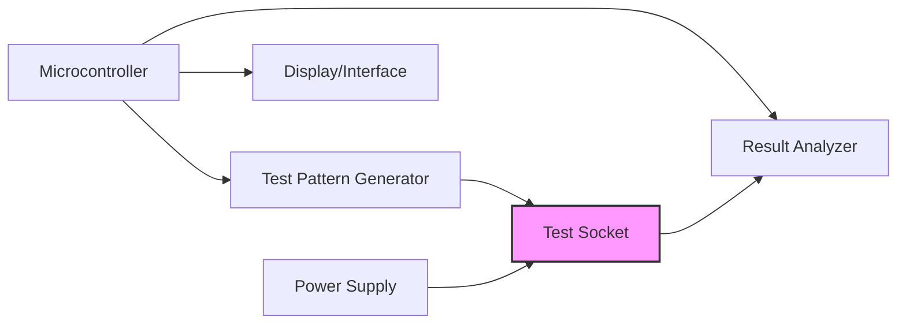

**Working principle:**

- IC inserted in ZIF (Zero Insertion Force) socket
- Test parameters selected for IC type
- Pattern generator applies specific input signals
- Outputs compared with expected results
- Pass/fail indication displayed

**Features:**

- Tests TTL, CMOS, memory ICs
- Identifies unknown ICs
- Detects open/short circuits
- Function verification

**Mnemonic:** "TRIG test: Test, Run patterns, Identify faults, Generate report."

## Question 5(c OR) [7 marks]

**Explain working of function generator with necessary diagram in detail.**

**Answer**:

Function generator produces various waveforms at different frequencies for testing electronic circuits.

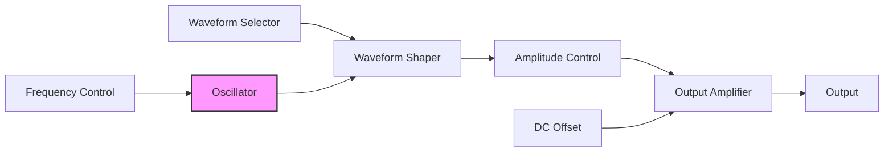

**Working principle:**

- **Oscillator**: Generates basic waveform (usually triangle)
- **Waveform shaper**: Converts to sine, square, triangle, ramp
- **Frequency control**: Sets oscillation rate
- **Amplitude control**: Adjusts output voltage level
- **DC offset**: Adds bias to output signal
- **Output amplifier**: Provides low impedance output

**Output waveforms:**

```goat
Sine:       ────────────
               /\    /\
              /  \  /  \
             /    \/    \

Square:     ┌───┐  ┌───┐
            │   │  │   │
            │   │  │   │
            └───┘  └───┘

Triangle:   ────────────
                /\    /\
               /  \  /  \
              /    \/    \

Ramp:       ────────────
                /|   /|
               / |  / |
              /  | /  |
```

**Applications:**

- Testing amplifiers
- Filter characterization
- Signal analysis
- Educational demonstrations
- Calibration reference

**Mnemonic:** "SWATOR: Sine Wave And Triangle OSCillator Renders signals."
