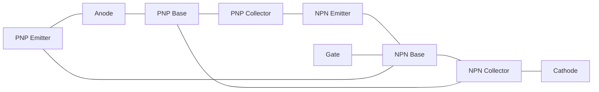
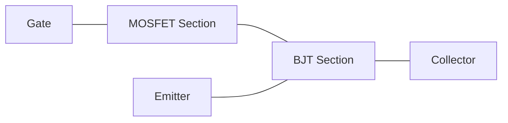
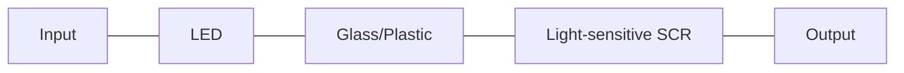
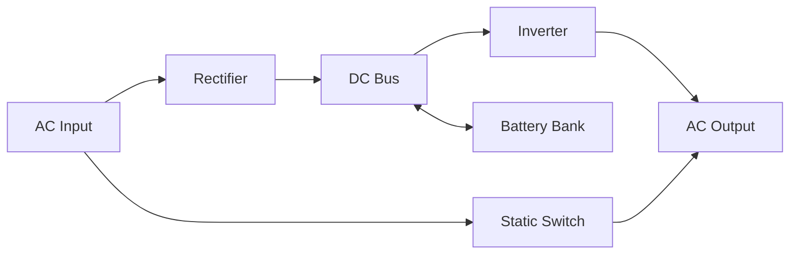
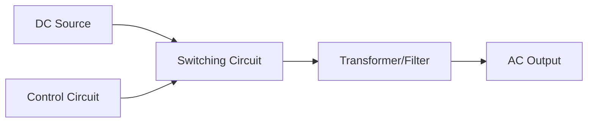
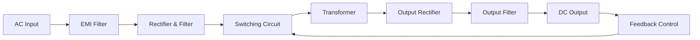
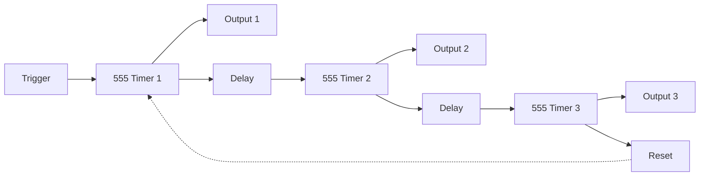
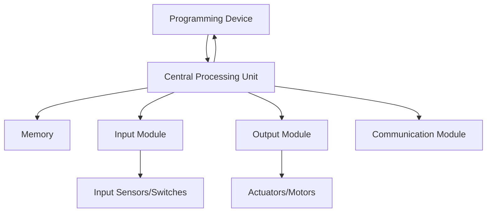
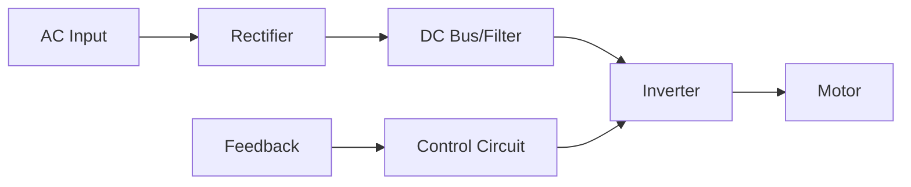

## પ્રશ્ન 1(a) [3 ગુણ]

**SCR ની બે ટ્રાન્ઝિસ્ટર સામ્યતા સમજાવો.**

**જવાબ**:
SCR એ પરસ્પર જોડાયેલા PNP અને NPN ટ્રાન્ઝિસ્ટર તરીકે રજૂ કરી શકાય છે.

**આકૃતિ:**



- **પુનઃઉત્પાદક ક્રિયા**: જ્યારે ગેટ પ્રવાહ NPN ને ટ્રિગર કરે છે, તે PNP ને વહન કરવા માટે કારણભૂત બને છે, જે સ્વ-ટકાઉ પ્રવાહ બનાવે છે
- **લેચિંગ મિકેનિઝમ**: એકવાર બંને ટ્રાન્ઝિસ્ટર ચાલુ થઈ જાય, ગેટ નિયંત્રણ ગુમાવે છે કારણ કે ફીડબેક પાથ વહન જાળવી રાખે છે

**યાદ રાખવા માટે સૂત્ર:** "પુશ-પુલ નેટવર્ક સતત વહન ટ્રિગર કરે છે"

## પ્રશ્ન 1(b) [4 ગુણ]

**IGBT ની કામગીરી અને લાક્ષણિકતા સમજાવો.**

**જવાબ**:
IGBT (ઇન્સુલેટેડ ગેટ બાયપોલર ટ્રાન્ઝિસ્ટર) MOSFET ઇનપુટ લાક્ષણિકતાઓને BJT આઉટપુટ ક્ષમતાઓ સાથે જોડે છે.

**આકૃતિ:**



**લાક્ષણિકતા કોષ્ટક:**

| વિશેષતા | લાક્ષણિકતા |
|---------|----------------|
| સ્વિચિંગ | ઝડપી ચાલુ થવું, મધ્યમ બંધ થવું |
| નિયંત્રણ | MOSFET જેવું વોલ્ટેજ-નિયંત્રિત |
| વહન | BJT જેવું ઓછું ફોરવર્ડ વોલ્ટેજ ડ્રોપ |
| ઉપયોગો | ઉચ્ચ વોલ્ટેજ, મધ્યમ આવૃત્તિ સ્વિચિંગ |

- **ઇનપુટ ફાયદો**: ઉચ્ચ અવરોધ સાથે વોલ્ટેજ-નિયંત્રિત ગેટ જેને લઘુત્તમ ડ્રાઇવ પાવરની જરૂર છે
- **આઉટપુટ ફાયદો**: ઉચ્ચ વિદ્યુત ઘનતા પર પણ ઓછો ઓન-સ્ટેટ વોલ્ટેજ ડ્રોપ

**યાદ રાખવા માટે સૂત્ર:** "MOSFET ઇનપુટ, BJT આઉટપુટ, સંપૂર્ણ પાવર સ્વિચ બનાવે છે"

## પ્રશ્ન 1(c) [7 ગુણ]

**DIAC નું બાંધકામ, કાર્ય અને લાક્ષણિકતા સમજાવો.**

**જવાબ**:
DIAC (ડાયોડ ફોર ઓલ્ટરનેટિંગ કરંટ) એ દ્વિદિશ ટ્રિગરિંગ ઉપકરણ છે જે થાઇરિસ્ટર નિયંત્રણ સર્કિટોમાં વપરાય છે.

**આકૃતિ:**


**લાક્ષણિકતા વક્ર:**

```goat
                    I
                    ^
                    |      /
                    |     /
                    |    /
            --------+---/---------> V
                   /|
                  / |
                 /  |
                /   |
               Break-over voltage
```

**બાંધકામ અને કાર્ય કોષ્ટક:**

| વિશેષતા | વર્ણન |
|---------|-------------|
| સ્ટ્રક્ચર | ગેટ ટર્મિનલ વગરનું પાંચ સ્તરીય P-N-P-N |
| કાર્ય | બ્રેક-ઓવર વોલ્ટેજ પહોંચતા સુધી પ્રવાહને અવરોધે છે |
| બ્રેકઓવર | સામાન્ય રીતે બંને દિશામાં 30-40V |
| સમમિતિ | બંને દિશાઓમાં સમાન પ્રતિક્રિયા |
| ઉપયોગ | AC સર્કિટમાં TRIAC માટે ટ્રિગર ઉપકરણ |

- **અવરોધ અવસ્થા**: બ્રેકઓવર વોલ્ટેજથી નીચે, ઉચ્ચ અવરોધ પ્રવાહને રોકે છે
- **વહન અવસ્થા**: બ્રેકઓવર વોલ્ટેજથી ઉપર, નકારાત્મક અવરોધ વિસ્તાર અચાનક વહન સક્ષમ કરે છે
- **દ્વિદિશીય**: હકારાત્મક અને નકારાત્મક વોલ્ટેજ માટે સમાન રીતે કાર્ય કરે છે

**યાદ રાખવા માટે સૂત્ર:** "બંને દિશામાં બ્રેક વોલ્ટેજ, પછી પ્રવાહ વહે છે"

## પ્રશ્ન 1(c) OR [7 ગુણ]

**ઓપ્ટો-આઇસોલેટર અને ઓપ્ટો-એસસીઆરનું બાંધકામ અને કાર્ય સમજાવો.**

**જવાબ**:
ઓપ્ટો-ઉપકરણો સર્કિટો વચ્ચે વિદ્યુત અલગાવ જાળવતા સિગ્નલો ટ્રાન્સફર કરવા માટે પ્રકાશનો ઉપયોગ કરે છે.

**ઓપ્ટો-આઇસોલેટર આકૃતિ:**


**ઓપ્ટો-SCR આકૃતિ:**



**તુલના કોષ્ટક:**

| વિશેષતા | ઓપ્ટો-આઇસોલેટર | ઓપ્ટો-SCR |
|---------|--------------|----------|
| ઇનપુટ | LED | LED |
| આઉટપુટ ઉપકરણ | ફોટોટ્રાન્ઝિસ્ટર/ફોટોડાયોડ | પ્રકાશ-સંવેદનશીલ SCR |
| અલગાવ | 2-5 kV | 2-5 kV |
| વિદ્યુત પ્રવાહ | ઓછો-મધ્યમ (100mA) | ઉચ્ચ (ઘણા એમ્પિયર) |
| ઉપયોગો | ડિજિટલ સિગ્નલ આઇસોલેશન | પાવર નિયંત્રણ, AC સ્વિચિંગ |

- **વિદ્યુત આઇસોલેશન**: સંપૂર્ણ વિદ્યુત અલગતા અવાજ પ્રતિરક્ષા અને સુરક્ષા પ્રદાન કરે છે
- **સિગ્નલ ટ્રાન્સફર**: પ્રકાશ કપલિંગ ગ્રાઉન્ડ લૂપ્સ અને વોલ્ટેજ સ્તરના મુદ્દાઓને દૂર કરે છે
- **ટ્રિગરિંગ**: ઓપ્ટો-SCRમાં પ્રકાશ ગેટ વિદ્યુત પ્રવાહને SCR સક્રિયકરણ માટે બદલે છે

**યાદ રાખવા માટે સૂત્ર:** "પ્રકાશ અંતર કૂદે છે જ્યારે વિદ્યુત ઘરે રહે છે"

## પ્રશ્ન 2(a) [3 ગુણ]

**1) UJT 2) SCS 3) MCT નું પ્રતીક દોરો અને ઉપયોગ આપો.**

**જવાબ**:

**UJT (યુનિજંક્શન ટ્રાન્ઝિસ્ટર):**

```goat
    B2
     |
     |
     Z
    /|
   / |
B1---+---E
```

**SCS (સિલિકોન કંટ્રોલ્ડ સ્વિચ):**

```goat
      A
      |
      |
  G2--+
      |
      |
  G1--+
      |
      |
      C
```

**MCT (MOS-કંટ્રોલ્ડ થાઇરિસ્ટર):**

```goat
      A
      |
     _|_
 G--|___|
     _|_
     \_/
      |
      |
      C
```

**ઉપયોગ કોષ્ટક:**

| ઉપકરણ | ઉપયોગો |
|--------|--------------|
| UJT | રિલેક્સેશન ઓસિલેટર, ટાઇમિંગ સર્કિટ, SCR ટ્રિગરિંગ |
| SCS | ઓછી પાવર સ્વિચિંગ, લેવલ ડિટેક્શન, પલ્સ જનરેશન |
| MCT | ઉચ્ચ પાવર સ્વિચિંગ, મોટર નિયંત્રણ, ઇન્વર્ટર |

**યાદ રાખવા માટે સૂત્ર:** "અનોખી ટાઇમિંગ, નિયંત્રિત સ્વિચિંગ, મુખ્ય પાવર"

## પ્રશ્ન 2(b) [4 ગુણ]

**SCR માટે ગેટ પ્રોટેક્શનનું મહત્વ સમજાવો.**

**જવાબ**:
ગેટ પ્રોટેક્શન સર્કિટ SCRને નકલી ટ્રિગરિંગ અને વોલ્ટેજ સ્પાઇક્સથી સુરક્ષિત રાખે છે.

**ગેટ પ્રોટેક્શન સર્કિટ:**

```goat
        R
    .----www----.
    |           |
    |     D     |
 ---+----->|----+--- To SCR Gate
    |           |
    '-----------'
```

**સુરક્ષા કોષ્ટક:**

| સમસ્યા | સુરક્ષા પદ્ધતિ | હેતુ |
|---------|-------------------|---------|
| રિવર્સ વોલ્ટેજ | ગેટમાં ડાયોડ | ગેટ-કેથોડ જંક્શન નુકસાન અટકાવે છે |
| નોઇઝ | RC ફિલ્ટર | ઉચ્ચ-આવૃત્તિ ક્ષણિક અવરોધે છે |
| dV/dt ટ્રિગરિંગ | RC સ્નબર | વોલ્ટેજ વધારાનો દર નિયંત્રિત કરે છે |
| ખોટું ટ્રિગરિંગ | ગેટ રેસિસ્ટર | ગેટ કરંટને મર્યાદિત કરે છે અને નોઇઝ ટ્રિગરિંગ ટાળે છે |

- **જંક્શન સુરક્ષા**: ગેટ-કેથોડ જંક્શનને રિવર્સ વોલ્ટેજ નુકસાનથી બચાવે છે
- **નોઇઝ પ્રતિરક્ષા**: વિદ્યુત ઘોંઘાટને ફિલ્ટર કરે છે જે અનિચ્છનીય ટ્રિગરિંગનું કારણ બની શકે છે

**યાદ રાખવા માટે સૂત્ર:** "ગેટની રક્ષા કરો સમસ્યાઓ અટકાવવા માટે"

## પ્રશ્ન 2(c) [7 ગુણ]

**SCR ને ટ્રિગર કરવાની વિવિધ પદ્ધતિઓની યાદી બનાવો અને તેમાંથી કોઈપણ ત્રણ સમજાવો.**

**જવાબ**:
SCR ટ્રિગરિંગ પદ્ધતિઓ ગેટ સક્રિયકરણ દ્વારા ઉપકરણને અવરોધનથી વહન અવસ્થામાં રૂપાંતરિત કરે છે.

**ટ્રિગરિંગ પદ્ધતિઓ કોષ્ટક:**

| પદ્ધતિ | સિદ્ધાંત | ઉપયોગો |
|--------|-----------|--------------|
| ગેટ ટ્રિગરિંગ | ગેટમાં સીધો પ્રવાહ | સૌથી સામાન્ય પદ્ધતિ |
| થર્મલ ટ્રિગરિંગ | તાપમાન વધારો | થર્મલ પ્રોટેક્શન |
| પ્રકાશ ટ્રિગરિંગ | જંક્શન પર ફોટોન | રિમોટ સક્રિયકરણ |
| dV/dt ટ્રિગરિંગ | ઝડપી વોલ્ટેજ વધારો | ઘણીવાર અનિચ્છનીય ટ્રિગરિંગ |
| વોલ્ટેજ ટ્રિગરિંગ | બ્રેકઓવર વોલ્ટેજ ઓળંગવું | પ્રોટેક્શન સર્કિટ |
| RF ટ્રિગરિંગ | રેડિયો ફ્રિક્વન્સી સિગ્નલ | વાયરલેસ કંટ્રોલ |

**1. ગેટ કરંટ ટ્રિગરિંગ:**

```goat
          A
          |
       ___|___
      |   |   |
      |   R   |
G-----+---|<--+
      |___|___|
          |
          K
```

- **સીધું નિયંત્રણ**: નાનો ગેટ પ્રવાહ મોટા એનોડ પ્રવાહને શરૂ કરે છે
- **પ્રવાહ રેન્જ**: SCR રેટિંગ પર આધાર રાખીને સામાન્ય રીતે 10-100mA જરૂરી

**2. પ્રકાશ ટ્રિગરિંગ (LASCR):**

```goat
          A
          |
       ___|___
      |  ~~~  |
      |  ~~~  | <-- Light
G-----+---|<--+
      |___|___|
          |
          K
```

- **ઓપ્ટિકલ કંટ્રોલ**: ફોટોન્સ જંક્શન પર કેરિયર્સ ઉત્પન્ન કરે છે
- **અલગાવ**: કંટ્રોલ અને પાવર સર્કિટ વચ્ચે વિદ્યુત અલગાવ પ્રદાન કરે છે

**3. dV/dt ટ્રિગરિંગ:**

```goat
         dV
         -- = high
         dt
          A
          |
       ___|___
      |   |   |
      |       |
G-----+---|<--+
      |___|___|
          |
          K
```

- **રેટ સંવેદનશીલતા**: ઝડપી વોલ્ટેજ વધારો જંક્શન કેપેસિટન્સ ચાર્જિંગનું કારણ બને છે
- **નિવારણ**: સ્નબર સર્કિટ (RC નેટવર્ક) વોલ્ટેજ વધારાના દરને નિયંત્રિત કરે છે

**યાદ રાખવા માટે સૂત્ર:** "ગેટ, પ્રકાશ, અને વોલ્ટેજ પરિવર્તન SCRને ચાલુ કરે છે"

## પ્રશ્ન 2(a) OR [3 ગુણ]

**ઓપ્ટો-એસસીઆરનો ઉપયોગ કરીને સોલિડ સ્ટેટ રિલેનું કાર્ય સમજાવો.**

**જવાબ**:
સોલિડ સ્ટેટ રિલે (SSRs) વિદ્યુત અલગાવ સાથે સંપર્ક વગરના સ્વિચિંગ માટે ઓપ્ટો-SCRનો ઉપયોગ કરે છે.

**SSR બ્લોક ડાયાગ્રામ:**


**ઓપરેશન કોષ્ટક:**

| સ્ટેજ | કાર્ય | લાભ |
|-------|----------|---------|
| ઇનપુટ સ્ટેજ | કંટ્રોલ સિગ્નલનો ઉપયોગ કરીને LED ચલાવે છે | ઓછી શક્તિ નિયંત્રણ |
| અલગાવ | પ્રકાશ વિદ્યુત અંતર પુલ કરે છે | સુરક્ષા અને અવાજ પ્રતિરક્ષા |
| ટ્રિગરિંગ | પ્રકાશ SCRને સક્રિય કરે છે | યાંત્રિક સંપર્કો નથી |
| સ્વિચિંગ | થાઇરિસ્ટર લોડ કરંટનું વહન કરે છે | આર્કિંગ કે સંપર્ક ઘસારો નથી |

- **મૌન ઓપરેશન**: સ્વિચિંગ દરમિયાન કોઈ યાંત્રિક અવાજ નથી
- **લાંબુ આયુષ્ય**: ઇલેક્ટ્રોમેકેનિકલ રિલેની જેમ સંપર્ક અવનતિ નથી

**યાદ રાખવા માટે સૂત્ર:** "પ્રકાશ લોજિકને લોડ સાથે જોડે છે"

## પ્રશ્ન 2(b) OR [4 ગુણ]

**સ્નબર સર્કિટ વ્યાખ્યાયિત કરો અને સ્નબર સર્કિટનું મહત્વ સમજાવો.**

**જવાબ**:
સ્નબર સર્કિટ એ સુરક્ષાત્મક નેટવર્ક છે જે સ્વિચિંગ ઉપકરણોમાં વોલ્ટેજ અને કરંટ ક્ષણિકોને દબાવે છે.

**બેઝિક RC સ્નબર:**

```goat
          A
          |
     C    |
    |-----|
    |     |
    |     Z SCR
    |     Z
    |     |
   ---    |
   --- R  |
    |     |
    |-----|
          |
          K
```

**મહત્વ કોષ્ટક:**

| કાર્ય | લાભ | અમલીકરણ |
|----------|---------|----------------|
| dV/dt દમન | ખોટા ટ્રિગરિંગને રોકે છે | SCR આસપાસ RC સર્કિટ |
| વોલ્ટેજ સ્પાઇક ઘટાડો | ઓવરવોલ્ટેજથી રક્ષણ | કેપેસિટર ઊર્જા શોષે છે |
| ઓસીલેશન ડેમ્પિંગ | EMI ઘટાડે છે | રેસિસ્ટર ડેમ્પિંગ પ્રદાન કરે છે |
| ટર્ન-ઓફ સહાય | કોમ્યુટેશન સુધારે છે | ટર્ન-ઓફ દરમિયાન પ્રવાહ વાળે છે |

- **સર્કિટ સુરક્ષા**: ઉપકરણ પર તણાવને મર્યાદિત કરીને થાઇરિસ્ટરનું આયુષ્ય વધારે છે
- **અવાજ ઘટાડો**: આસપાસની સર્કિટોમાં ઇલેક્ટ્રોમેગ્નેટિક ઇન્ટરફેરન્સ ઘટાડે છે

**યાદ રાખવા માટે સૂત્ર:** "અવાજ દબાવો, સંતુલિત વર્તન સરળતાથી પુનઃસ્થાપિત થાય"

## પ્રશ્ન 2(c) OR [7 ગુણ]

**SCR ની વિવિધ કોમ્યુટેશન પદ્ધતિઓની યાદી બનાવો અને તેમાંથી કોઈપણ બે સમજાવો**

**જવાબ**:
કોમ્યુટેશન એ એનોડ પ્રવાહને હોલ્ડિંગ વેલ્યુ નીચે ઘટાડીને SCRને બંધ કરવાની પ્રક્રિયા છે.

**કોમ્યુટેશન પદ્ધતિઓ કોષ્ટક:**

| પદ્ધતિ | સિદ્ધાંત | ઉપયોગો |
|--------|-----------|--------------|
| નૈસર્ગિક | AC શૂન્ય ક્રોસિંગ | AC પાવર કંટ્રોલ |
| ફોર્સ્ડ | બાહ્ય સર્કિટ | DC એપ્લિકેશન |
| વર્ગ A | LC રેઝોનન્સ | ઇન્વર્ટર |
| વર્ગ B | ઓક્ઝિલરી SCR | DC ચોપર |
| વર્ગ C | લોડ સાથે LC | વેરિએબલ ફ્રિક્વન્સી |
| વર્ગ D | ઓક્ઝિલરી સ્ત્રોત | મોટર કંટ્રોલ |
| વર્ગ E | બાહ્ય પલ્સ | ઇલેક્ટ્રોનિક સર્કિટ |

**1. નૈસર્ગિક કોમ્યુટેશન:**

```goat
        AC
        ~
        |
        Z SCR
        Z
        |
        R Load
        |
       ---
       GND
```

- **શૂન્ય ક્રોસિંગ**: જ્યારે AC શૂન્ય પાર કરે છે અને એનોડ કરંટ હોલ્ડિંગથી નીચે પડે છે ત્યારે SCR બંધ થાય છે
- **સરળતા**: કોમ્યુટેશન માટે કોઈ વધારાના ઘટકોની જરૂર નથી
- **મર્યાદા**: ફક્ત AC સર્કિટમાં નિશ્ચિત આવૃત્તિ પર કામ કરે છે

**2. ફોર્સ્ડ કોમ્યુટેશન (વર્ગ B):**

```goat
    +Vdc
      |
      |    C
      Z    |
 SCR1 Z    |
      |----+----,
      |    |    |
      R    Z SCR2
 Load |    Z    |
      |    |    |
     ---  ---  ---
     GND  GND  GND
```

- **ઓક્ઝિલરી SCR**: બીજું SCR (SCR2) મુખ્ય SCRને રિવર્સ બાયસ કરવા કેપેસિટર ડિસ્ચાર્જ કરે છે
- **ટાઇમિંગ કંટ્રોલ**: SCR ક્યારે બંધ થાય તેના પર ચોક્કસ નિયંત્રણ
- **એપ્લિકેશન**: DC સર્કિટમાં વપરાય છે જ્યાં નૈસર્ગિક કોમ્યુટેશન શક્ય નથી

**યાદ રાખવા માટે સૂત્ર:** "પ્રકૃતિ પ્રવાહને અનુસરે છે, ફોર્સ્ડ પ્રવાહ કોલેપ્સ બનાવે છે"

## પ્રશ્ન 3(a) [3 ગુણ]

**સિંગલ ફેઝ રેક્ટિફાયર કરતાં પોલિફેસ રેક્ટિફાયરના ફાયદા સમજાવો.**

**જવાબ**:
પોલિફેઝ રેક્ટિફાયર પાવર એપ્લિકેશનમાં સિંગલ-ફેઝ ડિઝાઇન કરતાં નોંધપાત્ર સુધારા આપે છે.

**ફાયદા કોષ્ટક:**

| પેરામીટર | સિંગલ ફેઝ | પોલિફેઝ |
|-----------|--------------|-----------|
| રિપલ ફેક્ટર | ઊંચો (FW માટે 0.482) | નીચો (3-ફેઝ માટે 0.042) |
| ફોર્મ ફેક્ટર | ઊંચો | નીચો |
| કાર્યક્ષમતા | ઓછી | ઊંચી (ટ્રાન્સફોર્મર વધુ સારી રીતે વપરાય છે) |
| પાવર રેટિંગ | મર્યાદિત | ઊંચું પાવર હેન્ડલિંગ |
| હાર્મોનિક કન્ટેન્ટ | વધુ | ઓછું (વધુ સરળ DC) |

- **આઉટપુટ સ્મૂધનેસ**: નોંધપાત્ર રીતે ઓછો રિપલ જેને નાના ફિલ્ટરિંગ ઘટકોની જરૂર પડે છે
- **ટ્રાન્સફોર્મર ઉપયોગ**: વધુ સારો ઉપયોગ ફેક્ટર (0.955 vs 0.812) ટ્રાન્સફોર્મર કદ ઘટાડે છે

**યાદ રાખવા માટે સૂત્ર:** "વધુ ફેઝ એટલે વધુ સરળ પાવર"

## પ્રશ્ન 3(b) [4 ગુણ]

**UPS પર ટૂંકી નોંધ લખો.**

**જવાબ**:
UPS (અનઇન્ટરપ્ટિબલ પાવર સપ્લાય) મુખ્ય પાવર સપ્લાય નિષ્ફળ થાય ત્યારે સતત પાવર પ્રદાન કરે છે.

**UPS બ્લોક ડાયાગ્રામ:**



**UPS પ્રકાર કોષ્ટક:**

| પ્રકાર | ઓપરેશન | એપ્લિકેશન |
|------|-----------|--------------|
| ઓનલાઇન | હંમેશા બેટરી/ઇન્વર્ટર દ્વારા | ક્રિટિકલ સિસ્ટમ, મેડિકલ |
| ઓફલાઇન | નિષ્ફળતા પર બેટરી પર સ્વિચ | પર્સનલ કમ્પ્યુટર, નાના ઓફિસ |
| લાઇન-ઇન્ટરેક્ટિવ | વોલ્ટેજ રેગ્યુલેશન + બેકઅપ | સર્વર, નેટવર્ક ઇક્વિપમેન્ટ |

- **બેકઅપ સમય**: બેટરી ક્ષમતા પર આધાર રાખીને સામાન્ય રીતે 5-30 મિનિટ
- **સુરક્ષા**: સર્જ પ્રોટેક્શન, વોલ્ટેજ રેગ્યુલેશન, અને ફ્રિક્વન્સી સ્ટેબિલાઇઝેશન

**યાદ રાખવા માટે સૂત્ર:** "પાવર સતત સ્વિચ હેઠળ સુરક્ષિત"

## પ્રશ્ન 3(c) [7 ગુણ]

**ઇન્વર્ટરનું કાર્ય આપો અને ઇન્વર્ટરના મૂળભૂત સિદ્ધાંતને સમજાવો પણ સુઘડ ડાયાગ્રામ અને વેવફોર્મ સાથે શ્રેણી ઇન્વર્ટર સમજાવો.**

**જવાબ**:
ઇન્વર્ટર ડીસી પાવરને એસી પાવરમાં રૂપાંતરિત કરે છે, ડીસીને ટ્રાન્સફોર્મર દ્વારા કે સીધા જ સ્વિચ કરીને વૈકલ્પિક તરંગ બનાવે છે.

**કાર્ય કોષ્ટક:**

| કાર્ય | વર્ણન |
|----------|-------------|
| DC થી AC રૂપાંતરણ | સ્થિર DC ને વૈકલ્પિક AC માં રૂપાંતરિત કરે છે |
| આવૃત્તિ નિયંત્રણ | ચલિત આવૃત્તિ આઉટપુટ ઉત્પન્ન કરે છે |
| વોલ્ટેજ નિયંત્રણ | લોડ વેરિએશન છતાં સ્થિર આઉટપુટ જાળવે છે |
| વેવ શેપિંગ | સાઇન, સ્ક્વેર, કે મોડિફાઇડ સાઇન વેવ્સ ઉત્પન્ન કરે છે |

**બેઝિક સિદ્ધાંત ડાયાગ્રામ:**



**શ્રેણી ઇન્વર્ટર સર્કિટ:**

```goat
    +Vdc
      |
      |
    __|__
   |     |
   C     L
   |     |
   |     |
   |     |
   |    _|_
   |    \ /
   |    SCR
   |    _|_
   |     |
   |     |
   |     |
  ---   ---
  GND   GND
```

**વેવફોર્મ:**

```goat
Voltage
   ^
   |     ____
   |    /    \
   |___/      \____
   |
   |           ____
   |          /    \
   |_________/      \____
   +----------------------> Time
   
Current
   ^
   |    /\
   |   /  \
   |__/    \__/\__
   |           \  \
   |            \  \
   |             \  \
   |              \/
   +----------------------> Time
```

- **ઓસીલેશન**: SCR ટ્રિગર થતાં શ્રેણી LC સર્કિટ રેઝોનન્ટ ઓસીલેશન બનાવે છે
- **કોમ્યુટેશન**: રેઝોનન્સ દ્વારા કરંટ રિવર્સ થાય ત્યારે SCR આપમેળે બંધ થાય છે
- **આવૃત્તિ**: LC વેલ્યુ દ્વારા નક્કી થાય છે: f = 1/(2π√LC)

**યાદ રાખવા માટે સૂત્ર:** "ડાયરેક્ટ કરંટ સ્વિચ થઈને રેઝોનન્ટ સર્કિટ દ્વારા ઓલ્ટરનેટિંગ કરંટ બને છે"

## પ્રશ્ન 3(a) OR [3 ગુણ]

**ચોપરના મૂળ સિદ્ધાંતને સમજાવો.**

**જવાબ**:
ચોપર એ DC-થી-DC કન્વર્ટર છે જે નિયંત્રિત સરેરાશ DC આઉટપુટ ઉત્પન્ન કરવા માટે DC ઇનપુટને ચાલુ/બંધ કરે છે.

**બેઝિક ચોપર સર્કિટ:**

```goat
    +Vdc
      |
      |
     _|_
     \ /
      S Switch
     _|_
      |
      |
      R Load
      |
      |
     ---
     GND
```

**સિદ્ધાંત કોષ્ટક:**

| પેરામીટર | સંબંધ | નિયંત્રણ |
|-----------|----------|---------|
| આઉટપુટ વોલ્ટેજ | Vo = Vdc × (Ton/T) | ડ્યુટી સાયકલ એડજસ્ટમેન્ટ |
| ડ્યુટી સાયકલ | k = Ton/T | આઉટપુટ વોલ્ટેજ નિયંત્રિત કરે છે |
| આવૃત્તિ | f = 1/T | રિપલ પર અસર કરે છે |
| વોલ્ટેજ રેગ્યુલેશન | લોડ સાથે બદલાય છે | ફીડબેક કંટ્રોલ ડ્યુટી સાયકલ એડજસ્ટ કરે છે |

- **સ્વિચિંગ એક્શન**: DC ઇનપુટને ચોપ કરવા માટે ઝડપથી ON/OFF થાય છે
- **પલ્સ વિડ્થ મોડ્યુલેશન**: ON-ટાઇમ રેશિઓને બદલીને વોલ્ટેજ નિયંત્રિત કરે છે

**યાદ રાખવા માટે સૂત્ર:** "ચોપિંગ નિયંત્રિત DC બનાવે છે"

## પ્રશ્ન 3(b) OR [4 ગુણ]

**SMPS ના બ્લોક ડાયાગ્રામ દોરો અને દરેક બ્લોકનું કાર્ય સમજાવો.**

**જવાબ**:
SMPS (સ્વિચ્ડ મોડ પાવર સપ્લાય) ઉચ્ચ-આવૃત્તિ સ્વિચિંગનો ઉપયોગ કરીને ઇનપુટ પાવરને નિયંત્રિત આઉટપુટમાં રૂપાંતરિત કરે છે.

**SMPS બ્લોક ડાયાગ્રામ:**



**બ્લોક્સ કાર્ય કોષ્ટક:**

| બ્લોક | કાર્ય |
|-------|----------|
| EMI ફિલ્ટર | SMPSમાં પ્રવેશતા/છોડતા અવાજને દબાવે છે |
| રેક્ટિફાયર અને ફિલ્ટર | ACને અનિયમિત DCમાં રૂપાંતરિત કરે છે |
| સ્વિચિંગ સર્કિટ | ઉચ્ચ આવૃત્તિ (20-200kHz) પર DC ચોપ કરે છે |
| ટ્રાન્સફોર્મર | અલગાવ અને વોલ્ટેજ ટ્રાન્સફોર્મેશન પ્રદાન કરે છે |
| આઉટપુટ રેક્ટિફાયર | ઉચ્ચ-આવૃત્તિ ACને પાછો DCમાં રૂપાંતરિત કરે છે |
| આઉટપુટ ફિલ્ટર | DC આઉટપુટને સ્મૂધ કરે છે અને રિપલ દૂર કરે છે |
| ફીડબેક કંટ્રોલ | ડ્યુટી સાયકલ એડજસ્ટ કરીને આઉટપુટ નિયંત્રિત કરે છે |

- **ઉચ્ચ કાર્યક્ષમતા**: લિનિયર સપ્લાય માટે 30-60% ની સરખામણીએ 70-90%
- **નાનું કદ**: ઉચ્ચ આવૃત્તિ નાના ટ્રાન્સફોર્મર અને ઘટકોની મંજૂરી આપે છે

**યાદ રાખવા માટે સૂત્ર:** "ફિલ્ટર, રેક્ટિફાય, ટ્રાન્સફોર્મર મારફતે સ્વિચ, રેક્ટિફાય, ફિલ્ટર"

## પ્રશ્ન 3(c) OR [7 ગુણ]

**વેવફોર્મ સાથે 1 ફેઝ હાફ વેવ રેક્ટિફાયર સમજાવો પણ વેવફોર્મ સાથે 3 ફેઝ ફુલ વેવ રેક્ટિફાયર સમજાવો.**

**જવાબ**:
રેક્ટિફાયર એક દિશામાં પ્રવાહની મંજૂરી આપીને અને રિવર્સ ફ્લોને અવરોધીને AC થી DC માં રૂપાંતરિત કરે છે.

**1-ફેઝ હાફ વેવ રેક્ટિફાયર:**

```goat
      AC
      ~
      |
     _|_
     \ /
      D
     _|_
      |
      R Load
      |
     ---
     GND
```

**1-ફેઝ હાફ વેવ વેવફોર્મ:**

```goat
Input AC
   ^
   |    /\         /\
   |   /  \       /  \
   |__/    \_____/    \____
   |
   |        /\         /\
   |       /  \       /  \
   |\     /    \     /    \
   +-----------------------> Time
   
Output DC
   ^
   |    /\         /\
   |   /  \       /  \
   |__/    \_____/    \____
   |
   |                      
   |                      
   |
   +-----------------------> Time
```

**3-ફેઝ ફુલ વેવ રેક્ટિફાયર:**

```goat
    A o---D1---.
               |
               |
    B o---D3---+---o +Vdc
               |
               |
    C o---D5---.
               
    A o---D2---.
               |
               |
    B o---D4---+---o -Vdc
               |
               |
    C o---D6---.
```

**3-ફેઝ ફુલ વેવ વેવફોર્મ:**

```goat
3-Phase Input
   ^
   |    /\    /\    /\    /\
   |   /  \  /  \  /  \  /  \
   |__/____\/____\/____\/____
   |  \ /\ /\ /\ /\ /\ /\ /\
   |   \/  \/  \/  \/  \/  \/
   |
   +-----------------------> Time
   
Rectified Output
   ^
   |   nnnnnnnnnnnnnnnnnnnnnn
   |  n  n  n  n  n  n  n  n
   |_n____n____n____n____n___
   |
   |
   |
   |
   +-----------------------> Time
```

**તુલના કોષ્ટક:**

| પેરામીટર | 1-ફેઝ હાફ વેવ | 3-ફેઝ ફુલ વેવ |
|-----------|-------------------|-------------------|
| રિપલ ફેક્ટર | 1.21 | 0.042 |
| રેક્ટિફિકેશન કાર્યક્ષમતા | 40.6% | 95.5% |
| TUF | 0.287 | 0.955 |
| પીક ઇન્વર્સ વોલ્ટેજ | Vm | 2.09Vm |
| ફોર્મ ફેક્ટર | 1.57 | 1.0007 |

- **1-ફેઝ હાફ વેવ**: સૌથી સરળ ડિઝાઇન પરંતુ ઉચ્ચ રિપલ અને ઓછી કાર્યક્ષમતા સાથે
- **3-ફેઝ ફુલ વેવ**: એક ચક્ર દીઠ 6 પલ્સ સાથે ઘણો સરળ આઉટપુટ

**યાદ રાખવા માટે સૂત્ર:** "અર્ધ માત્ર શિખરો પસાર કરે છે, ત્રણ ફેઝ ખીણો ભરે છે"

## પ્રશ્ન 4(a) [3 ગુણ]

**બ્લોક ડાયાગ્રામ સાથે સૌર ફોટોવોલ્ટેઇક આધારિત પાવર જનરેશનની કામગીરીનું વર્ણન કરો.**

**જવાબ**:
સોલર PV પાવર જનરેશન ફોટોવોલ્ટાઇક ઇફેક્ટ દ્વારા સૂર્યપ્રકાશને સીધો વિદ્યુતમાં રૂપાંતરિત કરે છે.

**સોલર PV સિસ્ટમ બ્લોક ડાયાગ્રામ:**

```goat
graph LR
    S[Solar Panel Array] --> C[Charge Controller]
    C --> B[Battery Bank]
    B --> I[Inverter]
    I --> L[AC Loads]
    C --> D[DC Loads]
```

**ઘટક કોષ્ટક:**

| ઘટક | કાર્ય |
|-----------|----------|
| સોલર પેનલ | સૂર્યપ્રકાશને DC વિદ્યુતમાં રૂપાંતરિત કરે છે |
| ચાર્જ કંટ્રોલર | ચાર્જિંગને નિયંત્રિત કરે છે, ઓવરચાર્જ અટકાવે છે |
| બેટરી બેંક | પછીના ઉપયોગ માટે ઊર્જા સંગ્રહિત કરે છે |
| ઇન્વર્ટર | ઘરેલું ઉપકરણો માટે DC ને AC માં રૂપાંતરિત કરે છે |
| ડિસ્ટ્રિબ્યુશન પેનલ | વિદ્યુતને લોડ તરફ રૂટ કરે છે |

- **ઊર્જા રૂપાંતરણ**: ફોટોન્સ અર્ધવાહક સામગ્રીમાં ઇલેક્ટ્રોનને ઉત્તેજિત કરીને પ્રવાહ બનાવે છે
- **સ્કેલેબિલિટી**: પાવર જરૂરિયાતો અનુસાર સિસ્ટમનું કદ સમાયોજિત કરી શકાય છે

**યાદ રાખવા માટે સૂત્ર:** "સૂર્યપ્રકાશ વોલ્ટેજ ઉત્પન્ન કરે છે, બેટરી લોડને મદદ કરે છે"

## પ્રશ્ન 4(b) [4 ગુણ]

**સ્ટેટિક સ્વીચ તરીકે SCR નો ઉપયોગ સમજાવો.**

**જવાબ**:
SCR વિશ્વસનીય અને ઝડપી સ્વિચિંગ માટે કોઈ હલનચલન ભાગો વગરના સોલિડ-સ્ટેટ સ્વિચ તરીકે કાર્ય કરે છે.

**SCR સ્ટેટિક સ્વિચ સર્કિટ:**

```goat
    +Vdc
      |
      |
     _|_
     \ /
     SCR
     _|_
      |
     ---  Trigger
      |   Circuit
      R   |
 Load |   |
      |---|
      |
     ---
     GND
```

**એપ્લિકેશન કોષ્ટક:**

| એપ્લિકેશન | ફાયદો | અમલીકરણ |
|-------------|-----------|----------------|
| પાવર કંટ્રોલ | ચોક્સાઈપૂર્ણ નિયંત્રણ, આર્કિંગ નથી | ફેઝ એંગલ કંટ્રોલ |
| મોટર સ્ટાર્ટિંગ | સરળ એક્સેલરેશન | ક્રમશઃ વોલ્ટેજ વધારો |
| સર્કિટ પ્રોટેક્શન | ઝડપી પ્રતિસાદ | કરંટ સેન્સિંગ ટ્રિગર |
| હીટિંગ કંટ્રોલ | ઊર્જા કાર્યક્ષમ | શૂન્ય-ક્રોસિંગ સ્વિચિંગ |

- **લેચિંગ એક્શન**: એકવાર ટ્રિગર થયા પછી, પ્રવાહ હોલ્ડિંગ વેલ્યુથી નીચે પડે ત્યાં સુધી વહન ચાલુ રાખે છે
- **ઉચ્ચ વિશ્વસનીયતા**: હલનચલન ભાગોની ગેરહાજરીને કારણે કોઈ યાંત્રિક ઘસારો નથી

**યાદ રાખવા માટે સૂત્ર:** "સેમિકન્ડક્ટર સ્વિચિંગ ચાલતા લોડને નિયંત્રિત કરે છે"

## પ્રશ્ન 4(c) [7 ગુણ]

**ઇન્ડક્શન હીટિંગ અને ડાઇલેક્ટ્રિક હીટિંગના કાર્ય સિદ્ધાંતનું વર્ણન કરો પણ ઇન્ડક્શન હીટિંગ અને ડાઇલેક્ટ્રિક હીટિંગની તુલના આપો.**

**જવાબ**:
બંને હીટિંગ પદ્ધતિઓ સીધા સંપર્ક વિના ગરમી ઉત્પન્ન કરવા માટે વિદ્યુતચુંબકીય સિદ્ધાંતોનો ઉપયોગ કરે છે.

**ઇન્ડક્શન હીટિંગ ડાયાગ્રામ:**


**ડાઇલેક્ટ્રિક હીટિંગ ડાયાગ્રામ:**


**તુલના કોષ્ટક:**

| પેરામીટર | ઇન્ડક્શન હીટિંગ | ડાઇલેક્ટ્રિક હીટિંગ |
|-----------|-------------------|-------------------|
| સિદ્ધાંત | એડી કરંટ અને હિસ્ટેરેસિસ | દોલન ક્ષેત્રથી અણુ ઘર્ષણ |
| સામગ્રી | વાહક ધાતુઓ | અવાહક સામગ્રી (પ્લાસ્ટિક, લાકડું) |
| આવૃત્તિ | 1-100 kHz | 10-100 MHz |
| પ્રવેશ | સપાટી અને છીછરી ઊંડાઈ | સામગ્રી દ્વારા એકસરખું |
| કાર્યક્ષમતા | 80-90% | 50-70% |
| ઉપયોગો | ધાતુ હાર્ડનિંગ, ઓગાળવું, ફોર્જિંગ | પ્લાસ્ટિક વેલ્ડિંગ, ફૂડ પ્રોસેસિંગ, સૂકવવું |

- **ઇન્ડક્શન હીટિંગ**: વાહક સામગ્રીમાં એડી કરંટ બનાવતા વિદ્યુતચુંબકીય પ્રેરણ દ્વારા કાર્ય કરે છે
- **ડાઇલેક્ટ્રિક હીટિંગ**: પોલર અણુઓના ઝડપી દોલનનું કારણ બને છે જે આંતરિક ઘર્ષણ અને ગરમી પેદા કરે છે

**યાદ રાખવા માટે સૂત્ર:** "ઇન્ડક્શન ધાતુઓને ગરમ કરે છે, ડાઇલેક્ટ્રિક્સ બિન-ધાતુઓને ગરમ કરે છે"

## પ્રશ્ન 4(a) OR [3 ગુણ]

**ફોટો ડાયોડનો ઉપયોગ કરીને ફોટો ઇલેક્ટ્રિક રિલેના સર્કિટ ડાયાગ્રામ દોરો અને સમજાવો.**

**જવાબ**:
ફોટો-ઇલેક્ટ્રિક રિલે આપમેળે સ્વિચિંગ ઓપરેશન નિયંત્રિત કરવા માટે પ્રકાશ શોધનો ઉપયોગ કરે છે.

**સર્કિટ ડાયાગ્રામ:**

```goat
    +Vcc
      |
      R1
      |
      |-------+
      |       |
     ---      |
     / \      |
    Photo    _|_
    Diode    | |_
     ---     |/  |
      |      |   |
      |      |>  |
      |      |   |
      +------+   |
      |          |
      R2         |
      |          |
     ---         |       +Vcc
     GND         |        |
                 |       _|_
                 +-------|  |
                         | /
                         |<
                         |/
                         |
                         Z
                         Z Load
                         |
                        ---
                        GND
```

**ઓપરેશન કોષ્ટક:**

| પ્રકાશ સ્થિતિ | ફોટોડાયોડ સ્થિતિ | ટ્રાન્ઝિસ્ટર સ્થિતિ | રિલે એક્શન |
|-----------------|------------------|------------------|--------------|
| અંધારું | ઉચ્ચ અવરોધ | બંધ | ડી-એનર્જાઇઝ્ડ |
| પ્રકાશ | ઓછો અવરોધ (વહન કરે છે) | ચાલુ | એનર્જાઇઝ્ડ |

- **પ્રકાશ શોધ**: પ્રકાશિત થયેલ ફોટોડાયોડ વહન કરે છે, ટ્રાન્ઝિસ્ટર પર બાયસ બદલે છે
- **સ્વિચિંગ**: ટ્રાન્ઝિસ્ટર રિલે કોઇલ ચલાવવા માટે નાના ફોટોડાયોડ પ્રવાહને વધારે છે

**યાદ રાખવા માટે સૂત્ર:** "પ્રકાશ ડાયોડને ચલાવે છે, ડાયોડ ટ્રાન્ઝિસ્ટરને ચલાવે છે, ટ્રાન્ઝિસ્ટર રિલેને ચલાવે છે"

## પ્રશ્ન 4(b) OR [4 ગુણ]

**DIAC-TRIAC નો ઉપયોગ કરીને AC પાવર કંટ્રોલનો સર્કિટ ડાયાગ્રામ દોરો અને તેને સમજાવો.**

**જવાબ**:
DIAC-TRIAC સર્કિટ ફેઝ એંગલ એડજસ્ટમેન્ટ દ્વારા AC પાવરને સરળ રીતે નિયંત્રિત કરવા દે છે.

**સર્કિટ ડાયાગ્રામ:**

```goat
    AC      R1      DIAC
    ~       www     _|_
    |       |       / \
    |-------|-------|--------.
    |       |       \_/      |
    |       |        |       |
    |       |        |       |
    |       C        |      _|_
    |       |        |     |   |
    |       |        |     |   |
    |       |        '-----|GT |
    |       |              |   |
    |       |              |___|
    |       |                | TRIAC
    |       |                |
    Z       |                |
    Z Load  |                |
    |       |                |
    |-------+----------------'
    |
   ---
   GND
```

**ઓપરેશન કોષ્ટક:**

| ઘટક | કાર્ય |
|-----------|----------|
| R1-C | ફેઝ વિલંબ માટે વેરિએબલ ટાઇમ કોન્સ્ટન્ટ |
| DIAC | કેપેસિટર વોલ્ટેજ બ્રેકઓવર પહોંચે ત્યારે TRIAC ટ્રિગર કરે છે |
| TRIAC | ટ્રિગરિંગ પોઇન્ટ પર આધારિત લોડ કરંટ નિયંત્રિત કરે છે |
| લોડ | ફેઝ કંટ્રોલ પર આધારિત આંશિક AC વેવફોર્મ પ્રાપ્ત કરે છે |

- **ફેઝ કંટ્રોલ**: RC નેટવર્ક AC સાયકલની અંદર ટ્રિગરિંગ પોઇન્ટમાં વિલંબ બનાવે છે
- **દ્વિદિશીય ઓપરેશન**: AC સાયકલના બંને અર્ધ પર કામ કરે છે

**યાદ રાખવા માટે સૂત્ર:** "વિલંબ કેપેસિટર પર શરૂ થાય છે, વિશ્વસનીય સ્વતંત્ર AC કંટ્રોલ ટ્રિગર કરે છે"

## પ્રશ્ન 4(c) OR [7 ગુણ]

**વેવફોર્મ સાથે કામ કરતા IC555 ત્રણ તબક્કાના ક્રમિક ટાઈમરને સમજાવો.**

**જવાબ**:
ત્રણ-તબક્કાનો ક્રમિક ટાઇમર પ્રક્રિયા નિયંત્રણ માટે સમયબદ્ધ ક્રમ બનાવવા માટે બહુવિધ 555 ICનો ઉપયોગ કરે છે.

**સર્કિટ ડાયાગ્રામ:**



**વેવફોર્મ:**

```goat
Trigger
   _
__|  |___________________________
   
Output 1
    ____________
___|            |________________
             
Output 2
              ____________
_____________|            |______
                       
Output 3
                        ________
_______________________|        |
   
   <-T1->|<--T2-->|<--T3-->|<-T4->
```

**ક્રમિક ઓપરેશન કોષ્ટક:**

| તબક્કો | ક્રિયા | અવધિ | આગલા તબક્કા ટ્રિગર |
|-------|--------|----------|-------------------|
| પ્રારંભિક | બધા આઉટપુટ્સ LOW | - | બાહ્ય ટ્રિગર |
| તબક્કો 1 | આઉટપુટ 1 HIGH | T1 (R1×C1) | આઉટપુટ 1 ફોલિંગ એજ |
| તબક્કો 2 | આઉટપુટ 2 HIGH | T2 (R2×C2) | આઉટપુટ 2 ફોલિંગ એજ |
| તબક્કો 3 | આઉટપુટ 3 HIGH | T3 (R3×C3) | આઉટપુટ 3 ફોલિંગ એજ |
| રીસેટ | બધા આઉટપુટ્સ LOW | T4 (રીસેટ સમય) | નવો બાહ્ય ટ્રિગર |

- **કેસ્કેડિંગ કનેક્શન**: પહેલા ટાઇમરનો આઉટપુટ બીજાને ટ્રિગર કરે છે, અને આ રીતે આગળ વધે છે
- **ટાઇમિંગ કંટ્રોલ**: RC વેલ્યુ સાથે દરેક તબક્કાનો સમયગાળો સ્વતંત્ર રીતે સમાયોજિત કરી શકાય છે
- **ઉપયોગો**: ઔદ્યોગિક સિક્વન્સિંગ, પ્રક્રિયા નિયંત્રણ, સ્વચાલિત સિસ્ટમ

**યાદ રાખવા માટે સૂત્ર:** "પ્રથમ તબક્કો સમાપ્ત થાય, બીજો શરૂ થાય, ત્રીજો અનુસરે"

## પ્રશ્ન 5(a) [3 ગુણ]

**ડીસી શંટ મોટરના સોલિડ સ્ટેટ કંટ્રોલ દોરો અને સમજાવો.**

**જવાબ**:
સોલિડ-સ્ટેટ DC મોટર કંટ્રોલ મોટરને આપવામાં આવતા વોલ્ટેજને નિયંત્રિત કરવા માટે SCRનો ઉપયોગ કરે છે.

**સર્કિટ ડાયાગ્રામ:**

```goat
    AC      Bridge      SCR
    ~       Rect      ___|___
    |       ____     |       |
    |------|____|----|       |----.
    |                |_______|    |
    |                    |        |
    |                   _|_       |
    |                   \ /       |
    |                   Gate      |
    |                 Circuit     |
    |                    |        |
    |                    |        |
    |       Field        |        |
    |       Winding      |     ___|___
    |      ______        |    |       |
    |     |      |       |    | DC    |
    |-----|______|-------+----| Motor |
    |                         |_______|
    |                            |
   ---                          ---
   GND                          GND
```

**કંટ્રોલ પદ્ધતિ કોષ્ટક:**

| પદ્ધતિ | ઓપરેશન | ફાયદો |
|--------|-----------|-----------|
| ફેઝ કંટ્રોલ | SCR ફાયરિંગ એંગલ બદલે છે | સરળ ગતિ નિયંત્રણ |
| ચોપર કંટ્રોલ | પલ્સ વિડ્થ મોડ્યુલેશન | ઉચ્ચ કાર્યક્ષમતા |
| ક્લોઝ્ડ-લૂપ | ટેકોમીટરથી ફીડબેક | સચોટ ગતિ નિયમન |

- **ગતિ નિયમન**: મોટરની ગતિ બદલવા માટે આર્મેચર વોલ્ટેજ નિયંત્રિત કરે છે
- **ટોર્ક કંટ્રોલ**: કરંટ મર્યાદિત કરીને ઉચ્ચ સ્ટાર્ટિંગ ટોર્ક જાળવે છે

**યાદ રાખવા માટે સૂત્ર:** "SCR પ્રવાહ નિયંત્રિત કરે છે મોટર પાવર વિતરણ માટે"

## પ્રશ્ન 5(b) [4 ગુણ]

**સ્ટેપર મોટરના કામના સિદ્ધાંતને સમજાવો.**

**જવાબ**:
સ્ટેપર મોટર્સ વિદ્યુતચુંબકીય સિદ્ધાંતો દ્વારા ડિજિટલ પલ્સને ચોક્કસ યાંત્રિક ફેરફારમાં રૂપાંતરિત કરે છે.

**સ્ટેપર મોટર સ્ટ્રક્ચર:**


**ઓપરેશન સિદ્ધાંત કોષ્ટક:**

| સ્ટેપ પ્રકાર | રોટેશન એંગલ | કંટ્રોલ પદ્ધતિ |
|-----------|----------------|----------------|
| ફુલ સ્ટેપ | સામાન્ય રીતે 1.8° કે 0.9° | એક સમયે એક ફેઝ |
| હાફ સ્ટેપ | ફુલ સ્ટેપનો અર્ધો | બે ફેઝ વૈકલ્પિક |
| માઇક્રો-સ્ટેપ | ફુલ સ્ટેપનો અંશ | PWM કરંટ કંટ્રોલ |
| વેવ ડ્રાઇવ | ફુલ સ્ટેપ એંગલ | એક ફેઝ એનર્જાઇઝ્ડ |

- **ડિજિટલ પોઝિશનિંગ**: દરેક પલ્સ મોટરને ચોક્કસ ખૂણે ફેરવે છે
- **હોલ્ડિંગ ટોર્ક**: ફેરફાર વિના સ્થિતિ જાળવે છે જ્યારે એનર્જાઇઝ્ડ હોય

**યાદ રાખવા માટે સૂત્ર:** "પલ્સ ચોક્કસ સ્થિતિગત સ્ટેપ્સ ઉત્પન્ન કરે છે"

## પ્રશ્ન 5(c) [7 ગુણ]

**PLC ના બ્લોક ડાયાગ્રામ દોરો અને દરેક બ્લોકનું કાર્ય સમજાવો.**

**જવાબ**:
પ્રોગ્રામેબલ લોજિક કંટ્રોલર (PLC) એ ઓટોમેશન કંટ્રોલ માટેનું ઔદ્યોગિક ડિજિટલ કમ્પ્યુટર છે.

**PLC બ્લોક ડાયાગ્રામ:**



**PLC ઘટકો કોષ્ટક:**

| ઘટક | કાર્ય |
|-----------|----------|
| પાવર સપ્લાય | મુખ્ય પાવરને PLC માટે જરૂરી DC માં રૂપાંતરિત કરે છે |
| CPU | પ્રોગ્રામ ચલાવે છે અને I/O પર આધારિત નિર્ણયો કરે છે |
| મેમરી | પ્રોગ્રામ અને ડેટા સંગ્રહિત કરે છે (ROM, RAM, EEPROM) |
| ઇનપુટ મોડ્યુલ | સેન્સર, સ્વિચ, એન્કોડર સાથે ઇન્ટરફેસ કરે છે |
| આઉટપુટ મોડ્યુલ | એક્ચુએટર, મોટર, વાલ્વ, ઇન્ડિકેટર નિયંત્રિત કરે છે |
| કમ્યુનિકેશન મોડ્યુલ | અન્ય PLC, કમ્પ્યુટર, નેટવર્ક સાથે જોડાય છે |
| પ્રોગ્રામિંગ ડિવાઇસ | PLC પ્રોગ્રામ લખવા, એડિટ કરવા, મોનિટર કરવા માટે વપરાય છે |

- **સ્કેન સાયકલ**: સતત ઇનપુટ વાંચે છે, પ્રોગ્રામ ચલાવે છે, આઉટપુટ અપડેટ કરે છે
- **પ્રોગ્રામિંગ ભાષાઓ**: લેડર લોજિક, ફંક્શન બ્લોક, સ્ટ્રક્ચર્ડ ટેક્સ્ટ, વગેરે
- **ફાયદાઓ**: વિશ્વસનીયતા, લચીલાપણું, વિસ્તરણશીલતા, નિદાન ક્ષમતાઓ

**યાદ રાખવા માટે સૂત્ર:** "પાવર પ્રોસેસિંગને કેન્દ્રિત કરે છે, ઇનપુટ/આઉટપુટ ઓટોમેશન બનાવે છે"

## પ્રશ્ન 5(a) OR [3 ગુણ]

**ડીસી સર્વો મોટરનું બાંધકામ દોરો અને સમજાવો.**

**જવાબ**:
DC સર્વો મોટર્સ ઓટોમેશન અને રોબોટિક્સ માટે ફીડબેક સાથે ચોક્કસ પોઝિશન કંટ્રોલ પ્રદાન કરે છે.

**બાંધકામ ડાયાગ્રામ:**

```goat
      Feedback
      Device
        |
        v
    .--------.      Shaft
    |        |---------->
    |        |
    | Motor  |
    |        |
    |        |
    '--------'
        ^
        |
     Control
     Signal
```

**બાંધકામ કોષ્ટક:**

| ઘટક | કાર્ય |
|-----------|----------|
| આર્મેચર | ચુંબકીય ક્ષેત્રની અંદર ફરે છે |
| ફીલ્ડ મેગ્નેટ્સ | ચુંબકીય ક્ષેત્ર બનાવે છે (ઘણીવાર કાયમી ચુંબક) |
| કમ્યુટેટર | ફરતા આર્મેચરને પાવર ટ્રાન્સફર કરે છે |
| ફીડબેક ડિવાઇસ | પોઝિશન/સ્પીડ ફીડબેક માટે એન્કોડર/ટેકોમીટર |
| બ્રશ | કમ્યુટેટરને પાવર કનેક્ટ કરે છે |

- **ઓછી જડતા**: ખાસ ડિઝાઇન ઝડપી એક્સેલરેશન/ડિસેલરેશનની મંજૂરી આપે છે
- **ઉચ્ચ ટોર્ક-ટુ-ઇનર્શિયા રેશિઓ**: કંટ્રોલ સિગ્નલનો ઝડપથી જવાબ આપે છે

**યાદ રાખવા માટે સૂત્ર:** "ચોક્સાઈભર્યું પોઝિશન ફીડબેક સટીક નિયંત્રણ ચલાવે છે"

## પ્રશ્ન 5(b) OR [4 ગુણ]

**BLDC મોટરની કામગીરી સમજાવો.**

**જવાબ**:
બ્રશલેસ DC (BLDC) મોટર્સ યાંત્રિક બ્રશ અને કમ્યુટેટરને બદલે ઇલેક્ટ્રોનિક કમ્યુટેશનનો ઉપયોગ કરે છે.

**BLDC ઓપરેશન ડાયાગ્રામ:**


**કામગીરી સિદ્ધાંત કોષ્ટક:**

| ઘટક | કાર્ય |
|-----------|----------|
| સ્ટેટર | ફિક્સ્ડ વાઇન્ડિંગ્સ જે ફરતું ચુંબકીય ક્ષેત્ર ઉત્પન્ન કરે છે |
| રોટર | કાયમી ચુંબક જે ફરતા ક્ષેત્રને અનુસરે છે |
| ઇલેક્ટ્રોનિક કંટ્રોલર | યાંત્રિક કમ્યુટેશનનું સ્થાન લે છે |
| હોલ સેન્સર | સિન્ક્રોનાઇઝ્ડ સ્વિચિંગ માટે રોટર પોઝિશન શોધે છે |
| ડ્રાઇવર સર્કિટ | સ્ટેટર કોઇલ્સમાં પ્રવાહનો ક્રમ પ્રદાન કરે છે |

- **કમ્યુટેશન**: ઇલેક્ટ્રોનિક સ્વિચિંગ સિક્વન્સ સ્ટેટર વાઇન્ડિંગ્સમાં પાવર આપે છે
- **કાર્યક્ષમતા**: બ્રશ લોસિસના નિર્મૂલનને કારણે ઉચ્ચ કાર્યક્ષમતા
- **વિશ્વસનીયતા**: બ્રશનો ઘસારો કે સ્પાર્કિંગ નથી, લાંબુ આયુષ્ય

**યાદ રાખવા માટે સૂત્ર:** "ઇલેક્ટ્રોનિક સ્વિચિંગ બ્રશ વગર ફેરફાર બનાવે છે"

## પ્રશ્ન 5(c) OR [7 ગુણ]

**VFD નું બાંધકામ અને કાર્ય સમજાવો.**

**જવાબ**:
વેરિએબલ ફ્રિક્વન્સી ડ્રાઇવ (VFD) આવૃત્તિ અને વોલ્ટેજમાં ફેરફાર કરીને AC મોટરની ગતિ નિયંત્રિત કરે છે.

**VFD બાંધકામ ડાયાગ્રામ:**



**બાંધકામ અને કામગીરી કોષ્ટક:**

| વિભાગ | ઘટકો | કાર્ય |
|---------|------------|----------|
| રેક્ટિફાયર | ડાયોડ/SCRs | AC ને DC માં રૂપાંતરિત કરે છે |
| DC બસ | કેપેસિટર, ઇન્ડક્ટર | DC ને ફિલ્ટર અને સ્મૂધ કરે છે |
| ઇન્વર્ટર | IGBTs/ટ્રાન્ઝિસ્ટર | DC ને ચલિત આવૃત્તિ AC માં રૂપાંતરિત કરે છે |
| કંટ્રોલ સર્કિટ | માઇક્રોપ્રોસેસર | સ્વિચિંગ આવૃત્તિ અને પેટર્નને નિયંત્રિત કરે છે |
| કૂલિંગ સિસ્ટમ | ફેન, હીટ સિંક | સુરક્ષિત ઓપરેટિંગ તાપમાન જાળવે છે |
| પ્રોટેક્શન સર્કિટ | સેન્સર, રિલે | ફોલ્ટથી નુકસાન અટકાવે છે |

- **ગતિ નિયંત્રણ**: સતત ટોર્ક પ્રદાન કરવા માટે V/f રેશિઓ જાળવવામાં આવે છે
- **ઊર્જા બચત**: વાસ્તવિક લોડ જરૂરિયાતો અનુસાર પાવર સમાયોજિત કરે છે
- **સોફ્ટ સ્ટાર્ટ**: ક્રમશઃ એક્સેલરેશન યાંત્રિક આઘાતને અટકાવે છે

**યાદ રાખવા માટે સૂત્ર:** "રેક્ટિફાય, ફિલ્ટર, મોટર કંટ્રોલ માટે આવૃત્તિ બદલો"
