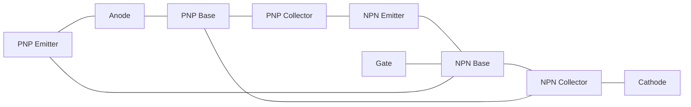
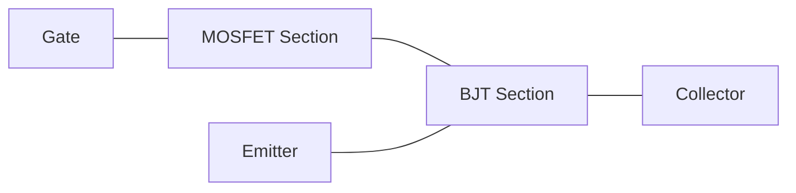
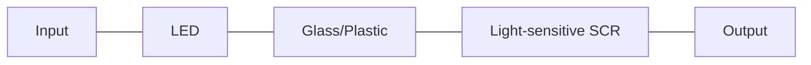
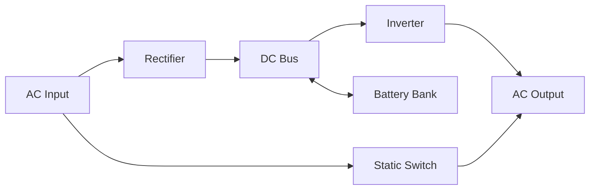
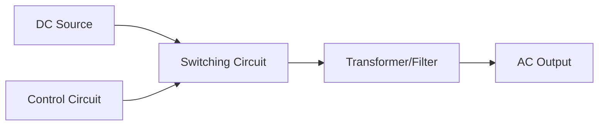
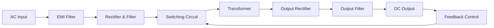
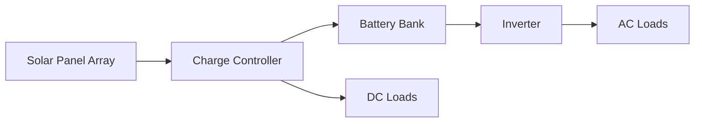
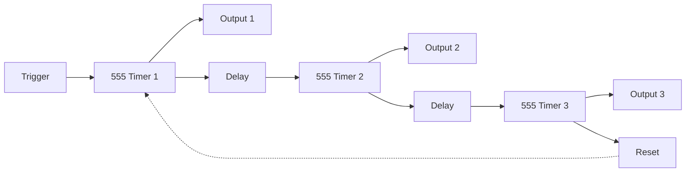
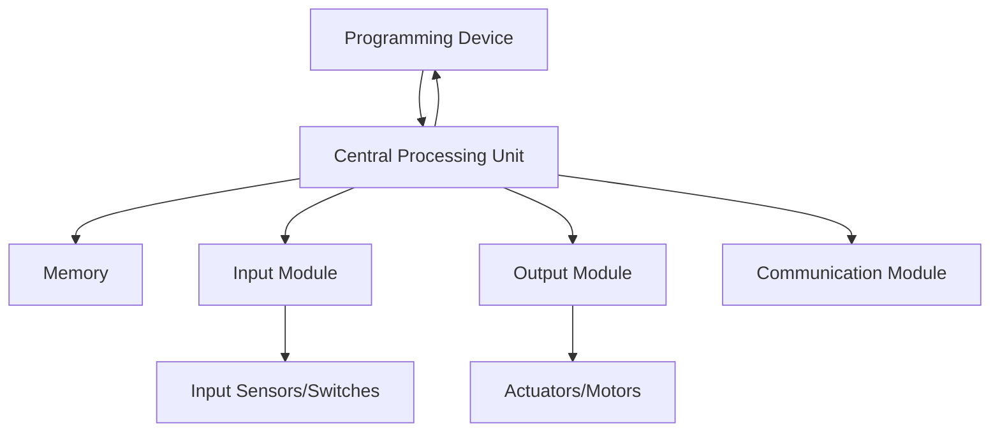
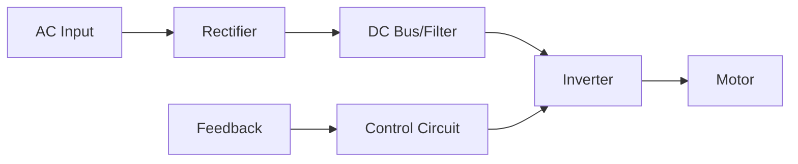

## Question 1(a) [3 marks]

**Explain two transistor analogies of SCR.**

**Answer**:
SCR can be represented as a two-transistor model with interconnected PNP and NPN transistors. 

**Diagram:**



- **Regenerative action**: When gate current triggers NPN, it causes PNP to conduct, creating self-sustaining current
- **Latching mechanism**: Once both transistors are ON, gate loses control as feedback path maintains conduction

**Mnemonic:** "Push-Pull Network Triggers Sustained Conduction"

## Question 1(b) [4 marks]

**Explain working and characteristic of IGBT.**

**Answer**:
IGBT (Insulated Gate Bipolar Transistor) combines MOSFET input characteristics with BJT output capabilities.

**Diagram:**



**Characteristics Table:**

| Feature | Characteristic |
|---------|----------------|
| Switching | Fast turn-on, moderate turn-off |
| Control | Voltage-controlled like MOSFET |
| Conduction | Low forward voltage drop like BJT |
| Applications | High voltage, medium frequency switching |

- **Input advantage**: Voltage-controlled gate with high impedance requires minimal drive power
- **Output advantage**: Low on-state voltage drop even at high current densities

**Mnemonic:** "MOSFET Input, BJT Output, Makes Perfect Power Switch"

## Question 1(c) [7 marks]

**Explain construction, working and characteristic of DIAC.**

**Answer**:
DIAC (DIode for Alternating Current) is a bidirectional triggering device used in thyristor control circuits.

**Diagram:**


**Characteristics Curve:**

```goat
                    I
                    ^
                    |      /
                    |     /
                    |    /
            --------+---/---------> V
                   /|
                  / |
                 /  |
                /   |
               Break-over voltage
```

**Construction & Operation Table:**

| Feature | Description |
|---------|-------------|
| Structure | Five-layer P-N-P-N with no gate terminal |
| Operation | Blocks current until break-over voltage is reached |
| Breakover | Typically 30-40V in either direction |
| Symmetry | Identical response in both directions |
| Application | Trigger device for TRIACs in AC circuits |

- **Blocking state**: Below breakover voltage, high resistance prevents current flow
- **Conducting state**: Above breakover voltage, negative resistance region enables sudden conduction
- **Bidirectional**: Functions identically for positive and negative voltages

**Mnemonic:** "Break Voltage Both Ways, Then Current Flows"

## Question 1(c) OR [7 marks]

**Explain construction and working of Opto-Isolator and Opto-SCR**

**Answer**:
Opto-devices use light to transfer signals while maintaining electrical isolation between circuits.

**Opto-Isolator Diagram:**


**Opto-SCR Diagram:**



**Comparison Table:**

| Feature | Opto-Isolator | Opto-SCR |
|---------|--------------|----------|
| Input | LED | LED |
| Output device | Phototransistor/photodiode | Light-sensitive SCR |
| Isolation | 2-5 kV | 2-5 kV |
| Current handling | Low-medium (100mA) | High (several amps) |
| Applications | Digital signal isolation | Power control, AC switching |

- **Electrical isolation**: Complete electrical separation provides noise immunity and safety
- **Signal transfer**: Light coupling eliminates ground loops and voltage level issues
- **Triggering**: Light replaces gate current for SCR activation in Opto-SCR

**Mnemonic:** "Light Jumps Gaps While Electricity Stays Home"

## Question 2(a) [3 marks]

**Draw symbol and give application of 1) UJT 2) SCS 3) MCT.**

**Answer**:

**UJT (Unijunction Transistor):**

```goat
    B2
     |
     |
     Z
    /|
   / |
B1---+---E
```

**SCS (Silicon Controlled Switch):**

```goat
      A
      |
      |
  G2--+
      |
      |
  G1--+
      |
      |
      C
```

**MCT (MOS-Controlled Thyristor):**

```goat
      A
      |
     _|_
 G--|___|
     _|_
     \_/
      |
      |
      C
```

**Applications Table:**

| Device | Applications |
|--------|--------------|
| UJT | Relaxation oscillators, timing circuits, SCR triggering |
| SCS | Low power switching, level detection, pulse generation |
| MCT | High power switching, motor control, inverters |

**Mnemonic:** "Unique timing, Controlled switching, Master power"

## Question 2(b) [4 marks]

**Explain importance of gate protection for SCR.**

**Answer**:
Gate protection circuits safeguard SCR against spurious triggering and voltage spikes.

**Gate Protection Circuit:**

```goat
        R
    .----www----.
    |           |
    |     D     |
 ---+----->|----+--- To SCR Gate
    |           |
    '-----------'
```

**Protection Table:**

| Problem | Protection Method | Purpose |
|---------|-------------------|---------|
| Reverse voltage | Diode across gate | Prevents gate-cathode junction damage |
| Noise | RC filter | Blocks high-frequency transients |
| dV/dt triggering | RC snubber | Controls rate of voltage rise |
| False triggering | Gate resistor | Limits gate current and avoids noise triggering |

- **Junction protection**: Prevents reverse voltage damage to gate-cathode junction
- **Noise immunity**: Filters out electrical noise that could cause unwanted triggering

**Mnemonic:** "Guard the Gate to Prevent Problems"

## Question 2(c) [7 marks]

**List out various methods of triggering SCR and explain any three of them.**

**Answer**:
SCR triggering methods convert the device from blocking to conducting state through gate activation.

**Triggering Methods Table:**

| Method | Principle | Applications |
|--------|-----------|--------------|
| Gate triggering | Direct current to gate | Most common method |
| Thermal triggering | Temperature increase | Thermal protection |
| Light triggering | Photons on junction | Remote activation |
| dV/dt triggering | Fast voltage rise | Often undesirable triggering |
| Voltage triggering | Exceeding breakover voltage | Protection circuits |
| RF triggering | Radio frequency signals | Wireless control |

**1. Gate Current Triggering:**

```goat
          A
          |
       ___|___
      |   |   |
      |   R   |
G-----+---|<--+
      |___|___|
          |
          K
```

- **Direct control**: Small gate current initiates large anode current flow
- **Current range**: 10-100mA typically required depending on SCR rating

**2. Light Triggering (LASCR):**

```goat
          A
          |
       ___|___
      |  ~~~  |
      |  ~~~  | <-- Light
G-----+---|<--+
      |___|___|
          |
          K
```

- **Optical control**: Photons generate carriers at junction
- **Isolation**: Provides electrical isolation between control and power circuit

**3. dV/dt Triggering:**

```goat
         dV
         -- = high
         dt
          A
          |
       ___|___
      |   |   |
      |       |
G-----+---|<--+
      |___|___|
          |
          K
```

- **Rate sensitivity**: Rapid voltage rise causes junction capacitance charging
- **Prevention**: Snubber circuits (RC networks) control voltage rise rate

**Mnemonic:** "Gates, Light, and Voltage Changes Turn SCRs On"

## Question 2(a) OR [3 marks]

**Explain working of solid state relay using opto-SCR.**

**Answer**:
Solid state relays (SSRs) use opto-SCR for contactless switching with electrical isolation.

**SSR Block Diagram:**


**Operation Table:**

| Stage | Function | Benefit |
|-------|----------|---------|
| Input stage | Drives LED using control signal | Low power control |
| Isolation | Light bridges electrical gap | Safety and noise immunity |
| Triggering | Light activates SCR | No mechanical contacts |
| Switching | Thyristors conduct load current | No arcing or contact wear |

- **Silent operation**: No mechanical noise during switching
- **Long life**: No contact degradation as in electromechanical relays

**Mnemonic:** "Light Links Logic to Load"

## Question 2(b) OR [4 marks]

**Define snubber circuit and explain importance of snubber circuit.**

**Answer**:
A snubber circuit is a protective network that suppresses voltage and current transients in switching devices.

**Basic RC Snubber:**

```goat
          A
          |
     C    |
    |-----|
    |     |
    |     Z SCR
    |     Z
    |     |
   ---    |
   --- R  |
    |     |
    |-----|
          |
          K
```

**Importance Table:**

| Function | Benefit | Implementation |
|----------|---------|----------------|
| dV/dt suppression | Prevents false triggering | RC circuit across SCR |
| Voltage spike reduction | Protects from overvoltage | Capacitor absorbs energy |
| Oscillation damping | Reduces EMI | Resistor provides damping |
| Turn-off assistance | Improves commutation | Diverts current during turn-off |

- **Circuit protection**: Extends thyristor life by limiting stress on the device
- **Noise reduction**: Minimizes electromagnetic interference in surrounding circuits

**Mnemonic:** "Suppress Noise Upsetting Balanced Behaviors Easily Restored"

## Question 2(c) OR [7 marks]

**List various commutation methods of SCR and explain any two of them**

**Answer**:
Commutation is the process of turning OFF an SCR by reducing its anode current below holding value.

**Commutation Methods Table:**

| Method | Principle | Applications |
|--------|-----------|--------------|
| Natural | AC zero crossing | AC power control |
| Forced | External circuit | DC applications |
| Class A | LC resonance | Inverters |
| Class B | Auxiliary SCR | DC choppers |
| Class C | LC with load | Variable frequency |
| Class D | Auxiliary source | Motor control |
| Class E | External pulse | Electronic circuits |

**1. Natural Commutation:**

```goat
        AC
        ~
        |
        Z SCR
        Z
        |
        R Load
        |
       ---
       GND
```

- **Zero crossing**: SCR turns off when AC crosses zero and anode current falls below holding
- **Simplicity**: No additional components required for commutation
- **Limitation**: Works only in AC circuits at fixed frequency

**2. Forced Commutation (Class B):**

```goat
    +Vdc
      |
      |    C
      Z    |
 SCR1 Z    |
      |----+----,
      |    |    |
      R    Z SCR2
 Load |    Z    |
      |    |    |
     ---  ---  ---
     GND  GND  GND
```

- **Auxiliary SCR**: Second SCR (SCR2) discharges capacitor to reverse bias main SCR
- **Timing control**: Precise control over when SCR turns off
- **Application**: Used in DC circuits where natural commutation isn't possible

**Mnemonic:** "Nature Follows Current, Forced Creates Current Collapse"

## Question 3(a) [3 marks]

**Explain advantages of polyphase rectifier over single phase rectifier.**

**Answer**:
Polyphase rectifiers offer significant improvements over single-phase designs in power applications.

**Advantages Table:**

| Parameter | Single Phase | Polyphase |
|-----------|--------------|-----------|
| Ripple factor | Higher (0.482 for FW) | Lower (0.042 for 3-phase) |
| Form factor | Higher | Lower |
| Efficiency | Lower | Higher (better transformer utilization) |
| Power rating | Limited | Higher power handling |
| Harmonic content | More | Less (smoother DC) |

- **Output smoothness**: Significantly less ripple requiring smaller filtering components
- **Transformer utilization**: Better utilization factor (0.955 vs 0.812) reduces transformer size

**Mnemonic:** "More Phases Mean Smoother Power"

## Question 3(b) [4 marks]

**Write short note on UPS.**

**Answer**:
UPS (Uninterruptible Power Supply) provides continuous power during main supply failure.

**UPS Block Diagram:**



**Types of UPS Table:**

| Type | Operation | Applications |
|------|-----------|--------------|
| Online | Always through battery/inverter | Critical systems, medical |
| Offline | Switches to battery on failure | Personal computers, small offices |
| Line-interactive | Voltage regulation + backup | Servers, network equipment |

- **Backup time**: Typically 5-30 minutes depending on battery capacity
- **Protection**: Surge protection, voltage regulation, and frequency stabilization

**Mnemonic:** "Power Constantly Protected Under Switch"

## Question 3(c) [7 marks]

**Give function of Inverter and explain basic principle of Inverter also explain series inverter with neat diagram and waveform.**

**Answer**:
Inverters convert DC power to AC power by switching DC through a transformer or directly to create alternating waveforms.

**Function Table:**

| Function | Description |
|----------|-------------|
| DC to AC conversion | Transforms steady DC to alternating AC |
| Frequency control | Generates variable frequency output |
| Voltage regulation | Maintains stable output despite load variations |
| Wave shaping | Produces sine, square, or modified sine waves |

**Basic Principle Diagram:**



**Series Inverter Circuit:**

```goat
    +Vdc
      |
      |
    __|__
   |     |
   C     L
   |     |
   |     |
   |     |
   |    _|_
   |    \ /
   |    SCR
   |    _|_
   |     |
   |     |
   |     |
  ---   ---
  GND   GND
```

**Waveforms:**

```goat
Voltage
   ^
   |     ____
   |    /    \
   |___/      \____
   |
   |           ____
   |          /    \
   |_________/      \____
   +----------------------> Time
   
Current
   ^
   |    /\
   |   /  \
   |__/    \__/\__
   |           \  \
   |            \  \
   |             \  \
   |              \/
   +----------------------> Time
```

- **Oscillation**: Series LC circuit creates resonant oscillation when SCR triggers
- **Commutation**: SCR turns off naturally when current reverses through resonance
- **Frequency**: Determined by LC values: f = 1/(2π√LC)

**Mnemonic:** "Direct Current Switches To Alternating Current Through Resonant Circuit"

## Question 3(a) OR [3 marks]

**Explain basic principle of chopper.**

**Answer**:
A chopper is a DC-to-DC converter that switches DC input on/off to produce controllable average DC output.

**Basic Chopper Circuit:**

```goat
    +Vdc
      |
      |
     _|_
     \ /
      S Switch
     _|_
      |
      |
      R Load
      |
      |
     ---
     GND
```

**Principle Table:**

| Parameter | Relation | Control |
|-----------|----------|---------|
| Output voltage | Vo = Vdc × (Ton/T) | Duty cycle adjustment |
| Duty cycle | k = Ton/T | Controls output voltage |
| Frequency | f = 1/T | Affects ripple |
| Voltage regulation | Varies with load | Feedback control adjusts duty cycle |

- **Switching action**: Rapidly turns ON/OFF to chop DC input
- **Pulse width modulation**: Controls voltage by varying ON-time ratio

**Mnemonic:** "Chopping Creates Controllable DC"

## Question 3(b) OR [4 marks]

**Draw the block diagram of SMPS and explain function of each block.**

**Answer**:
SMPS (Switched Mode Power Supply) converts input power to regulated output using high-frequency switching.

**SMPS Block Diagram:**



**Blocks Function Table:**

| Block | Function |
|-------|----------|
| EMI Filter | Suppresses noise from entering/leaving SMPS |
| Rectifier & Filter | Converts AC to unregulated DC |
| Switching Circuit | Chops DC at high frequency (20-200kHz) |
| Transformer | Provides isolation and voltage transformation |
| Output Rectifier | Converts high-frequency AC back to DC |
| Output Filter | Smooths DC output and removes ripple |
| Feedback Control | Regulates output by adjusting duty cycle |

- **High efficiency**: 70-90% vs 30-60% for linear supplies
- **Small size**: High frequency allows smaller transformer and components

**Mnemonic:** "Filter, Rectify, Switch Through Transformer, Rectify, Filter"

## Question 3(c) OR [7 marks]

**Explain 1 phase half wave rectifier with waveform also explain 3 phase full wave rectifier with waveform.**

**Answer**:
Rectifiers convert AC to DC by allowing current flow in one direction while blocking reverse flow.

**1-Phase Half Wave Rectifier:**

```goat
      AC
      ~
      |
     _|_
     \ /
      D
     _|_
      |
      R Load
      |
     ---
     GND
```

**1-Phase Half Wave Waveforms:**

```goat
Input AC
   ^
   |    /\         /\
   |   /  \       /  \
   |__/    \_____/    \____
   |
   |        /\         /\
   |       /  \       /  \
   |\     /    \     /    \
   +-----------------------> Time
   
Output DC
   ^
   |    /\         /\
   |   /  \       /  \
   |__/    \_____/    \____
   |
   |                      
   |                      
   |
   +-----------------------> Time
```

**3-Phase Full Wave Rectifier:**

```goat
    A o---D1---.
               |
               |
    B o---D3---+---o +Vdc
               |
               |
    C o---D5---.
               
    A o---D2---.
               |
               |
    B o---D4---+---o -Vdc
               |
               |
    C o---D6---.
```

**3-Phase Full Wave Waveforms:**

```goat
3-Phase Input
   ^
   |    /\    /\    /\    /\
   |   /  \  /  \  /  \  /  \
   |__/____\/____\/____\/____
   |  \ /\ /\ /\ /\ /\ /\ /\
   |   \/  \/  \/  \/  \/  \/
   |
   +-----------------------> Time
   
Rectified Output
   ^
   |   nnnnnnnnnnnnnnnnnnnnnn
   |  n  n  n  n  n  n  n  n
   |_n____n____n____n____n___
   |
   |
   |
   |
   +-----------------------> Time
```

**Comparison Table:**

| Parameter | 1-Phase Half Wave | 3-Phase Full Wave |
|-----------|-------------------|-------------------|
| Ripple factor | 1.21 | 0.042 |
| Rectification efficiency | 40.6% | 95.5% |
| TUF | 0.287 | 0.955 |
| Peak inverse voltage | Vm | 2.09Vm |
| Form factor | 1.57 | 1.0007 |

- **1-Phase Half Wave**: Simplest design but with high ripple and poor efficiency
- **3-Phase Full Wave**: Much smoother output with 6 pulses per cycle

**Mnemonic:** "Half Passes Only Peaks, Three Phases Fill Valleys"

## Question 4(a) [3 marks]

**Describe working of solar photovoltaic based power generation with block diagram.**

**Answer**:
Solar PV power generation converts sunlight directly into electricity through photovoltaic effect.

**Solar PV System Block Diagram:**



**Component Table:**

| Component | Function |
|-----------|----------|
| Solar panels | Convert sunlight to DC electricity |
| Charge controller | Regulates charging, prevents overcharge |
| Battery bank | Stores energy for later use |
| Inverter | Converts DC to AC for household appliances |
| Distribution panel | Routes electricity to loads |

- **Energy conversion**: Photons excite electrons in semiconductor material creating current
- **Scalability**: System size can be adjusted based on power requirements

**Mnemonic:** "Sunlight Produces Voltage, Batteries Invert Loads"

## Question 4(b) [4 marks]

**Explain use of SCR as static switch.**

**Answer**:
SCR functions as a solid-state switch with no moving parts for reliable and fast switching.

**SCR Static Switch Circuit:**

```goat
    +Vdc
      |
      |
     _|_
     \ /
     SCR
     _|_
      |
     ---  Trigger
      |   Circuit
      R   |
 Load |   |
      |---|
      |
     ---
     GND
```

**Applications Table:**

| Application | Advantage | Implementation |
|-------------|-----------|----------------|
| Power control | Precise control, no arcing | Phase angle control |
| Motor starting | Smooth acceleration | Gradual voltage increase |
| Circuit protection | Fast response | Current sensing trigger |
| Heating control | Energy efficient | Zero-crossing switching |

- **Latching action**: Once triggered, continues to conduct until current falls below holding value
- **High reliability**: No mechanical wear due to absence of moving parts

**Mnemonic:** "Semiconductor Switching Controls Running Loads"

## Question 4(c) [7 marks]

**Describe the working principle of Induction heating and dielectric heating also give comparison of Induction heating and dielectric heating.**

**Answer**:
Both heating methods use electromagnetic principles to generate heat without direct contact.

**Induction Heating Diagram:**


**Dielectric Heating Diagram:**


**Comparison Table:**

| Parameter | Induction Heating | Dielectric Heating |
|-----------|-------------------|-------------------|
| Principle | Eddy currents and hysteresis | Molecular friction from oscillating field |
| Materials | Conductive metals | Non-conductive materials (plastics, wood) |
| Frequency | 1-100 kHz | 10-100 MHz |
| Penetration | Surface and shallow depth | Uniform through material |
| Efficiency | 80-90% | 50-70% |
| Applications | Metal hardening, melting, forging | Plastic welding, food processing, drying |

- **Induction heating**: Works through electromagnetic induction creating eddy currents in conductive materials
- **Dielectric heating**: Causes rapid oscillation of polar molecules creating internal friction and heat

**Mnemonic:** "Induction Makes Metals Hot, Dielectrics Heat Non-Metals"

## Question 4(a) OR [3 marks]

**Draw and explain the circuit diagram of photo electric relay using photo diode.**

**Answer**:
Photo-electric relay uses light detection to control switching operations automatically.

**Circuit Diagram:**

```goat
    +Vcc
      |
      R1
      |
      |-------+
      |       |
     ---      |
     / \      |
    Photo    _|_
    Diode    | |_
     ---     |/  |
      |      |   |
      |      |>  |
      |      |   |
      +------+   |
      |          |
      R2         |
      |          |
     ---         |       +Vcc
     GND         |        |
                 |       _|_
                 +-------|  |
                         | /
                         |<
                         |/
                         |
                         Z
                         Z Load
                         |
                        ---
                        GND
```

**Operation Table:**

| Light Condition | Photodiode State | Transistor State | Relay Action |
|-----------------|------------------|------------------|--------------|
| Dark | High resistance | OFF | De-energized |
| Light | Low resistance (conducts) | ON | Energized |

- **Light detection**: Photodiode conducts when illuminated, changing bias on transistor
- **Switching**: Transistor amplifies small photodiode current to drive relay coil

**Mnemonic:** "Light Drives Diode, Diode Drives Transistor, Transistor Drives Relay"

## Question 4(b) OR [4 marks]

**Draw the circuit diagram of AC power control using DIAC-TRIAC and explain it.**

**Answer**:
DIAC-TRIAC circuit enables smooth control of AC power through phase angle adjustment.

**Circuit Diagram:**

```goat
    AC      R1      DIAC
    ~       www     _|_
    |       |       / \
    |-------|-------|--------.
    |       |       \_/      |
    |       |        |       |
    |       |        |       |
    |       C        |      _|_
    |       |        |     |   |
    |       |        |     |   |
    |       |        '-----|GT |
    |       |              |   |
    |       |              |___|
    |       |                | TRIAC
    |       |                |
    Z       |                |
    Z Load  |                |
    |       |                |
    |-------+----------------'
    |
   ---
   GND
```

**Operation Table:**

| Component | Function |
|-----------|----------|
| R1-C | Variable time constant for phase delay |
| DIAC | Triggers TRIAC when capacitor voltage reaches breakover |
| TRIAC | Controls load current based on triggering point |
| Load | Receives partial AC waveform based on phase control |

- **Phase control**: RC network creates delay in triggering point within AC cycle
- **Bidirectional operation**: Works on both halves of AC cycle

**Mnemonic:** "Delay Initiates At Capacitor, Triggers Reliable Independent AC Control"

## Question 4(c) OR [7 marks]

**Explain IC555 three stage sequential timer working with waveform.**

**Answer**:
A three-stage sequential timer uses multiple 555 ICs to generate timed sequences for process control.

**Circuit Diagram:**



**Waveform:**

```goat
Trigger
   _
__|  |___________________________
   
Output 1
    ____________
___|            |________________
             
Output 2
              ____________
_____________|            |______
                       
Output 3
                        ________
_______________________|        |
   
   <-T1->|<--T2-->|<--T3-->|<-T4->
```

**Sequential Operation Table:**

| Stage | Action | Duration | Next Stage Trigger |
|-------|--------|----------|-------------------|
| Initial | All outputs LOW | - | External trigger |
| Stage 1 | Output 1 HIGH | T1 (R1×C1) | Output 1 falling edge |
| Stage 2 | Output 2 HIGH | T2 (R2×C2) | Output 2 falling edge |
| Stage 3 | Output 3 HIGH | T3 (R3×C3) | Output 3 falling edge |
| Reset | All outputs LOW | T4 (reset time) | New external trigger |

- **Cascading connection**: Output of first timer triggers second, and so on
- **Timing control**: Each stage duration independently adjustable with RC values
- **Applications**: Industrial sequencing, process control, automated systems

**Mnemonic:** "First Stage Finishes, Second Starts, Third Succeeds"

## Question 5(a) [3 marks]

**Draw and explain solid state control of DC shunt motor.**

**Answer**:
Solid-state DC motor control uses SCRs to regulate voltage applied to the motor.

**Circuit Diagram:**

```goat
    AC      Bridge      SCR
    ~       Rect      ___|___
    |       ____     |       |
    |------|____|----|       |----.
    |                |_______|    |
    |                    |        |
    |                   _|_       |
    |                   \ /       |
    |                   Gate      |
    |                 Circuit     |
    |                    |        |
    |                    |        |
    |       Field        |        |
    |       Winding      |     ___|___
    |      ______        |    |       |
    |     |      |       |    | DC    |
    |-----|______|-------+----| Motor |
    |                         |_______|
    |                            |
   ---                          ---
   GND                          GND
```

**Control Method Table:**

| Method | Operation | Advantage |
|--------|-----------|-----------|
| Phase control | Varies SCR firing angle | Smooth speed control |
| Chopper control | Pulse width modulation | High efficiency |
| Closed-loop | Feedback from tachometer | Precise speed regulation |

- **Speed regulation**: Controls armature voltage to vary motor speed
- **Torque control**: Maintains high starting torque with current limiting

**Mnemonic:** "SCR Controls Current Delivering Motor Power"

## Question 5(b) [4 marks]

**Explain working principle of stepper motor.**

**Answer**:
Stepper motors convert digital pulses into precise mechanical rotation through electromagnetic principles.

**Stepper Motor Structure:**


**Operation Principle Table:**

| Step Type | Rotation Angle | Control Method |
|-----------|----------------|----------------|
| Full step | Typically 1.8° or 0.9° | One phase at a time |
| Half step | Half of full step | Two phases alternating |
| Micro-step | Fraction of full step | PWM current control |
| Wave drive | Full step angle | One phase energized |

- **Digital positioning**: Each pulse rotates motor by precise angle
- **Holding torque**: Maintains position when energized without rotation

**Mnemonic:** "Pulses Produce Precise Positional Steps"

## Question 5(c) [7 marks]

**Draw the block diagram of PLC and explain function of each block.**

**Answer**:
Programmable Logic Controller (PLC) is an industrial digital computer for automation control.

**PLC Block Diagram:**



**PLC Components Table:**

| Component | Function |
|-----------|----------|
| Power Supply | Converts main power to DC required by PLC |
| CPU | Executes program and makes decisions based on I/O |
| Memory | Stores program and data (ROM, RAM, EEPROM) |
| Input Module | Interfaces with sensors, switches, encoders |
| Output Module | Controls actuators, motors, valves, indicators |
| Communication Module | Connects to other PLCs, computers, networks |
| Programming Device | Used to write, edit, monitor PLC programs |

- **Scan cycle**: Reads inputs, executes program, updates outputs continuously
- **Programming languages**: Ladder logic, function block, structured text, etc.
- **Advantages**: Reliability, flexibility, expandability, diagnostic capabilities

**Mnemonic:** "Power Centralizes Processing, Inputs/Outputs Make Automation"

## Question 5(a) OR [3 marks]

**Draw and explain construction of DC Servo motor.**

**Answer**:
DC servo motors provide precise position control with feedback for automation and robotics.

**Construction Diagram:**

```goat
      Feedback
      Device
        |
        v
    .--------.      Shaft
    |        |---------->
    |        |
    | Motor  |
    |        |
    |        |
    '--------'
        ^
        |
     Control
     Signal
```

**Construction Table:**

| Component | Function |
|-----------|----------|
| Armature | Rotates within magnetic field |
| Field magnets | Creates magnetic field (often permanent magnets) |
| Commutator | Transfers power to rotating armature |
| Feedback device | Encoder/tachometer for position/speed feedback |
| Brushes | Connect power to commutator |

- **Low inertia**: Special design allows rapid acceleration/deceleration
- **High torque-to-inertia ratio**: Responds quickly to control signals

**Mnemonic:** "Precise Position Feedback Drives Exact Control"

## Question 5(b) OR [4 marks]

**Explain working of BLDC motor.**

**Answer**:
Brushless DC (BLDC) motors use electronic commutation instead of mechanical brushes and commutator.

**BLDC Operation Diagram:**


**Working Principle Table:**

| Component | Function |
|-----------|----------|
| Stator | Fixed windings that generate rotating magnetic field |
| Rotor | Permanent magnets that follow rotating field |
| Electronic controller | Replaces mechanical commutation |
| Hall sensors | Detect rotor position for synchronized switching |
| Driver circuit | Provides sequence of currents to stator coils |

- **Commutation**: Electronic switching sequences power to stator windings
- **Efficiency**: Higher efficiency due to elimination of brush losses
- **Reliability**: No brush wear or sparking, longer lifespan

**Mnemonic:** "Electronic Switching Creates Rotation Without Brushes"

## Question 5(c) OR [7 marks]

**Explain construction and working of VFD.**

**Answer**:
Variable Frequency Drive (VFD) controls AC motor speed by varying frequency and voltage.

**VFD Construction Diagram:**



**Construction and Working Table:**

| Section | Components | Function |
|---------|------------|----------|
| Rectifier | Diodes/SCRs | Converts AC to DC |
| DC Bus | Capacitors, inductors | Filters and smooths DC |
| Inverter | IGBTs/transistors | Converts DC to variable frequency AC |
| Control circuit | Microprocessor | Controls switching frequency and patterns |
| Cooling system | Fans, heat sinks | Maintains safe operating temperature |
| Protection circuits | Sensors, relays | Prevents damage from faults |

- **Speed control**: V/f ratio maintained to provide constant torque
- **Energy savings**: Adjusts power to actual load requirements
- **Soft start**: Gradual acceleration prevents mechanical shock

**Mnemonic:** "Rectify, Filter, Invert Frequency For Motor Control"
