## પ્રશ્ન 1(a) [3 ગુણ]

**Opto-Isolators, Opto-TRIAC અને Opto-ટ્રાન્ઝિસ્ટરની લાક્ષણિકતાઓ દોરો.**

**જવાબ**:

**ઓપ્ટો-ઇલેક્ટ્રોનિક ઉપકરણોની લાક્ષણિકતાઓ:**

| Opto-Isolator | Opto-TRIAC | Opto-Transistor |
|:-------------:|:----------:|:---------------:|
|  |  |  |
| LED કરંટ અને ફોટોડિટેક્ટર કરંટ વચ્ચે લીનિયર સંબંધ | થ્રેશોલ્ડ સાથે નોન-લીનિયર ટ્રિગરિંગ રિસ્પોન્સ | લીનિયર કરંટ ટ્રાન્સફર લાક્ષણિકતા |
| CTR (કરંટ ટ્રાન્સફર રેશિયો) મુખ્ય પેરામીટર છે | ચોક્કસ કરંટ થ્રેશોલ્ડ પર ટ્રિગરિંગ થાય છે | કલેક્ટર કરંટ બેઝ ઇલ્યુમિનેશન પર આધાર રાખે છે |

- **CTR (કરંટ ટ્રાન્સફર રેશિયો)**: આઉટપુટ કરંટનો ઇનપુટ કરંટ સાથેનો ગુણોત્તર
- **ટ્રિગર કરંટ**: ડિવાઈસને એક્ટિવેટ કરવા માટે જરૂરી ન્યૂનતમ કરંટ
- **લિનિયારિટી**: આઉટપુટ ઇનપુટ લાઇટના પ્રમાણમાં કેટલું છે

**મેમરી ટ્રીક:** "LTL - લાઇટ ટ્રાન્સફર્સ લાઇક કરંટ ફ્લોઝ – લીનિયર ફોર આઇસોલેટર્સ/ટ્રાન્ઝિસ્ટર્સ, ટ્રિગર્ડ ફોર TRIACs"

## પ્રશ્ન 1(b) [4 ગુણ]

**IGBT ની કાર્યકારી અને બાંધકામ સુવિધાઓનું વર્ણન કરો.**

**જવાબ**:

**IGBT સ્ટ્રક્ચર અને ઓપરેશન:**

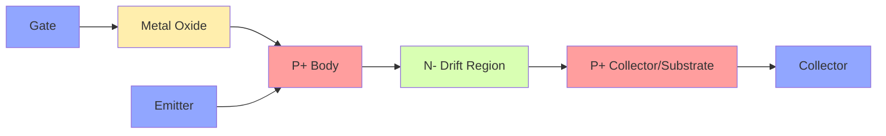

| ફીચર | વર્ણન |
|---------|-------------|
| સ્ટ્રક્ચર | MOSFET ઇનપુટને BJT આઉટપુટ સાથે જોડે છે |
| લેયર્સ | ગેટ/મેટલ ઓક્સાઇડ/P+ બોડી/N- ડ્રિફ્ટ/P+ કલેક્ટર |
| ફાયદાઓ | ઉચ્ચ ઇનપુટ ઇમ્પિડન્સ, ઓછું કન્ડક્શન લોસ |
| સ્વિચિંગ | BJT કરતાં ઝડપી, MOSFET કરતાં વધુ સારી પાવર હેન્ડલિંગ |

- **વોલ્ટેજ કંટ્રોલ્ડ**: MOSFET જેવી ગેટ વોલ્ટેજ દ્વારા નિયંત્રિત ડિવાઇસ
- **કન્ડક્ટિવિટી મોડ્યુલેશન**: P+ કલેક્ટર ડ્રિફ્ટ રિજિયનમાં હોલ્સ ઇન્જેક્ટ કરે છે
- **લો ઓન-સ્ટેટ વોલ્ટેજ**: MOSFET કરતાં ઓછું કન્ડક્શન લોસ

**મેમરી ટ્રીક:** "IGBT MBC" - "ઇનપુટ ફ્રોમ MOS, બોડી હેન્ડલ્સ કરંટ, કલેક્ટર એક્ટ્સ લાઇક BJT"

## પ્રશ્ન 1(c) [7 ગુણ]

**બે-ટ્રાન્ઝિસ્ટર એનાલોજીનો ઉપયોગ કરીને SCR નું કાર્ય સમજાવો.**

**જવાબ**:

**SCR એઝ ટુ-ટ્રાન્ઝિસ્ટર મોડેલ:**

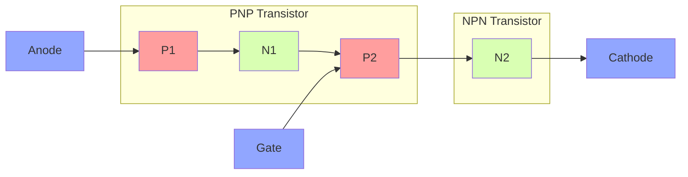

**બે-ટ્રાન્ઝિસ્ટર સમજૂતી:**

| કોમ્પોનન્ટ | ફંક્શન | કનેક્શન્સ |
|-----------|----------|-------------|
| PNP (T1) | ઉપરનો ટ્રાન્ઝિસ્ટર | એમિટર એનોડથી, કલેક્ટર N1 થી, બેઝ P2-N1 જંક્શનથી |
| NPN (T2) | નીચેનો ટ્રાન્ઝિસ્ટર | એમિટર કેથોડથી, કલેક્ટર P1-N1 જંક્શનથી, બેઝ ગેટથી |
| ફીડબેક | રિજનરેટિવ એક્શન | T1નો કલેક્ટર કરંટ = T2નો બેઝ કરંટ અને વાઇસ વર્સા |

- **લેચિંગ મેકેનિઝમ**: એકવાર ટ્રિગર થયા પછી, ટ્રાન્ઝિસ્ટર એકબીજાને ON રાખે છે
- **ટ્રિગરિંગ**: નાનો ગેટ કરંટ → T2 ચાલુ થાય → T1ને બેઝ કરંટ મળે → બંને ચાલુ રહે
- **હોલ્ડિંગ કરંટ**: રિજનરેટિવ એક્શન જાળવી રાખવા માટે જરૂરી ન્યૂનતમ કરંટ
- **ટર્ન-ઓફ**: એનોડ કરંટ હોલ્ડિંગ કરંટથી નીચે જવો જોઈએ

**મેમરી ટ્રીક:** "PPFF" - "પોઝિટિવ ફીડબેક પર્પેચ્યુએટ્સ ફોરવર્ડ કન્ડક્શન"

## પ્રશ્ન 1(c) OR [7 ગુણ]

**ઓપ્ટો-એસસીઆરનો ઉપયોગ કરીને સોલિડ સ્ટેટ રિલેનું કાર્ય સમજાવો.**

**જવાબ**:

**ઓપ્ટો-SCR સાથે સોલિડ સ્ટેટ રિલે:**

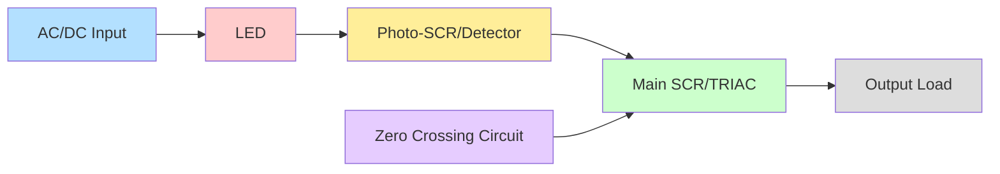

**કાર્ય સિદ્ધાંત અને ઘટકો:**

| સ્ટેજ | ફંક્શન | ફાયદો |
|-------|----------|-----------|
| ઇનપુટ | ઓછા વોલ્ટેજનું કંટ્રોલ સિગ્નલ LED ને એક્ટિવેટ કરે છે | હાઇ પાવરથી આઇસોલેશન |
| ઓપ્ટો-કપલર | LED લાઇટ ફોટો-સેન્સિટિવ SCR ને ટ્રિગર કરે છે | ઇલેક્ટ્રિકલ આઇસોલેશન |
| ડ્રાઇવર સર્કિટ | ફોટો-SCR મુખ્ય સ્વિચિંગ ડિવાઇસને એક્ટિવેટ કરે છે | સ્વિચિંગ ક્ષમતાનું એમ્પ્લિફિકેશન |
| આઉટપુટ સ્ટેજ | મુખ્ય SCR/TRIAC હાઇ-પાવર લોડને નિયંત્રિત કરે છે | લોડ કરંટને સંભાળે છે |
| સ્નબર | RC સર્કિટ વોલ્ટેજ સ્પાઇક્સથી રક્ષણ આપે છે | ખોટા ટ્રિગરિંગને રોકે છે |

- **ઇલેક્ટ્રિકલ આઇસોલેશન**: કંટ્રોલ અને પાવર સર્કિટ વચ્ચે સંપૂર્ણ અલગતા (>1000V)
- **ઝીરો-ક્રોસિંગ**: માત્ર ઝીરો વોલ્ટેજ પર સ્વિચિંગ EMI/RFI નોઇઝ ઘટાડે છે
- **સાયલેન્ટ ઓપરેશન**: પરંપરાગત રિલેથી વિપરીત, કોઈ મેકેનિકલ ક્લિક નથી
- **લાંબી લાઇફ**: પરંપરાગત રિલેમાં જેવા મેકેનિકલ ઘસારો નથી

**મેમરી ટ્રીક:** "LIPO" - "લાઇટ ઇન, પાવર આઉટ - આઇસોલેશન ગેરંટેડ"

## પ્રશ્ન 2(a) [3 ગુણ]

**SCR માટે સ્નબર સર્કિટનું કાર્ય સમજાવો.**

**જવાબ**:

**SCR માટે સ્નબર સર્કિટ:**

```goat
    +---||---+
    |   C1   |
    |        |
A---+        +---R1---+
|                     |
SCR                   |
|                     |
K---------------------+
```

| કોમ્પોનન્ટ | હેતુ | સાઇઝિંગ કન્સિડરેશન |
|-----------|---------|----------------------|
| કેપેસિટર (C1) | dv/dt રેટને મર્યાદિત કરે છે | SCRની મહત્તમ dv/dt રેટિંગ પર આધારિત |
| રેઝિસ્ટર (R1) | ડિસ્ચાર્જ કરંટને મર્યાદિત કરે છે | કેપેસિટર વેલ્યુ અને સ્વિચિંગ ફ્રિક્વન્સી પર આધારિત |

- **dv/dt પ્રોટેક્શન**: ઝડપી વોલ્ટેજ વધારાને કારણે ખોટા ટ્રિગરિંગને રોકે છે
- **ટર્ન-ઓફ સપોર્ટ**: વૈકલ્પિક પાથ પ્રદાન કરીને કમ્યુટેશનમાં મદદ કરે છે
- **એનર્જી એબ્સોર્પશન**: સ્વિચિંગ દરમિયાન ઇન્ડક્ટિવ લોડથી ઊર્જા શોષે છે

**મેમરી ટ્રીક:** "CARD" - "કેપેસિટર એન્ડ રેઝિસ્ટર ડેમ્પ અનવોન્ટેડ ટ્રિગરિંગ"

## પ્રશ્ન 2(b) [4 ગુણ]

**ફોર્સ્ડ અને નેચરલ કોમ્યુટેશન વચ્ચેનો તફાવત લખો.**

**જવાબ**:

**કોમ્યુટેશન પદ્ધતિઓની તુલના:**

| પેરામીટર | ફોર્સ્ડ કોમ્યુટેશન | નેચરલ કોમ્યુટેશન |
|-----------|-------------------|---------------------|
| વ્યાખ્યા | બાહ્ય સર્કિટ SCRને બંધ કરવા માટે દબાણ કરે છે | AC સ્ત્રોત કુદરતી રીતે કરંટને શૂન્ય સુધી ઘટાડે છે |
| એપ્લિકેશન | મુખ્યત્વે DC સર્કિટ્સ | મુખ્યત્વે AC સર્કિટ્સ |
| કોમ્પોનન્ટ્સ | વધારાના ઘટકોની જરૂર પડે છે (કેપેસિટર, ઇન્ડક્ટર) | કોઈ વધારાના ઘટકોની જરૂર નથી |
| કોમ્પ્લેક્સિટી | વધુ જટિલ સર્કિટ ડિઝાઇન | સરળ સર્કિટ ડિઝાઇન |
| એનર્જી | કોમ્યુટેશન માટે વધારાની ઊર્જા જરૂરી | હાલના સ્ત્રોત ઊર્જાનો ઉપયોગ કરે છે |
| કંટ્રોલ | ચોક્કસપણે નિયંત્રિત કરી શકાય છે | AC સાયકલના નિશ્ચિત બિંદુઓએ થાય છે |
| ખર્ચ | વધારાના ઘટકોને કારણે વધારે | ઓછી ખર્ચાળ અમલીકરણ |

- **ટાઇમિંગ કંટ્રોલ**: ફોર્સ્ડ કોમ્યુટેશન વધુ સારો ટાઇમિંગ કંટ્રોલ આપે છે
- **સર્કિટ સાઇઝ**: નેચરલ કોમ્યુટેશનથી નાની સર્કિટ સાઇઝ મળે છે
- **વિશ્વસનીયતા**: નેચરલ કોમ્યુટેશનમાં નિષ્ફળ થવા માટે ઓછા ઘટકો છે

**મેમરી ટ્રીક:** "DANCE" - "DC નીડ્સ એક્ટિવ કોમ્યુટેશન, નેચરલ ફોર AC, કોસ્ટ્સ એક્સ્ટ્રા ફોર ફોર્સ્ડ"

## પ્રશ્ન 2(c) [7 ગુણ]

**બ્લોક ડાયાગ્રામની મદદથી યુપીએસની કામગીરીનું વર્ણન કરો.**

**જવાબ**:

**UPS બ્લોક ડાયાગ્રામ અને ઓપરેશન:**

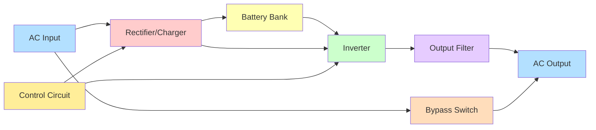

**UPS ઓપરેશન મોડ્સ:**

| મોડ | વર્ણન | પાવર પાથ |
|------|-------------|------------|
| નોર્મલ | AC સ્ત્રોત રેક્ટિફાયર અને ઇન્વર્ટર મારફતે લોડને પાવર આપે છે | AC ઇનપુટ → રેક્ટિફાયર → ઇન્વર્ટર → આઉટપુટ |
| બેટરી | AC નિષ્ફળ થાય ત્યારે બેટરી લોડને પાવર આપે છે | બેટરી → ઇન્વર્ટર → આઉટપુટ |
| બાયપાસ | મેઇન્ટેનન્સ માટે AC સીધા લોડ સાથે જોડાય છે | AC ઇનપુટ → બાયપાસ સ્વિચ → આઉટપુટ |
| ચાર્જિંગ | નોર્મલ મોડમાં બેટરી ચાર્જ થાય છે | રેક્ટિફાયર → બેટરી |

- **ઓનલાઇન UPS**: પાવર હંમેશા રેક્ટિફાયર/ઇન્વર્ટર મારફતે વહે છે (ડબલ કન્વર્ઝન)
- **ઓફલાઇન UPS**: પાવર સીધો લોડમાં જાય છે, પાવર નિષ્ફળ થાય ત્યારે બેટરી પર સ્વિચ થાય છે
- **લાઇન-ઇન્ટરેક્ટિવ**: ઓફલાઇન જેવું પરંતુ વોલ્ટેજ રેગ્યુલેશન સાથે
- **બેકઅપ ટાઇમ**: બેટરી ક્ષમતા અને લોડ જરૂરિયાતો પર આધાર રાખે છે

**મેમરી ટ્રીક:** "BRIC" - "બેટરી રેડી વ્હેન ઇનપુટ કટ્સ ઓફ"

## પ્રશ્ન 2(a) OR [3 ગુણ]

**SCR ની પલ્સ ગેટ ટ્રિગરિંગ પદ્ધતિ સમજાવો.**

**જવાબ**:

**પલ્સ ગેટ ટ્રિગરિંગ મેથડ:**

```goat
      +-----+
      |Pulse|
      |Gen. |
      +--+--+
         |
         v
A---+--------+
|   |        |
|   |  SCR   |
|   |        |
K---+--------+
```

| પેરામીટર | સ્પેસિફિકેશન | ફાયદો |
|-----------|--------------|-----------|
| પલ્સ વિડ્થ | 10-100 μs | યોગ્ય ટર્ન-ઓન સુનિશ્ચિત કરે છે |
| એમ્પ્લિટ્યુડ | થ્રેશોલ્ડથી 1-3V ઉપર | વિશ્વસનીય ટ્રિગરિંગ |
| રાઇઝ ટાઇમ | ફાસ્ટ (<1 μs) | ક્વિક ટર્ન-ઓન |
| ફ્રિક્વન્સી | સિંગલ અથવા ટ્રેન ઓફ પલ્સિસ | ટાઇમિંગ પર કંટ્રોલ |

- **પ્રિસાઇઝ કંટ્રોલ**: SCR ટર્ન-ઓનનો ચોક્કસ સમય
- **નોઇઝ ઇમ્યુનિટી**: ખોટા ટ્રિગરિંગને ઓછું સંવેદનશીલ
- **પાવર એફિશિયન્સી**: ઓછો એવરેજ ગેટ પાવર વપરાશ
- **આઇસોલેશન**: પલ્સ ટ્રાન્સફોર્મર અથવા ઓપ્ટો-આઇસોલેટર મારફતે કપલ કરી શકાય છે

**મેમરી ટ્રીક:** "TRAP" - "ટાઇમ્ડ, રિલાયબલ, એમ્પ્લિટ્યુડ-કંટ્રોલ્ડ પલ્સિસ"

## પ્રશ્ન 2(b) OR [4 ગુણ]

**SCR ની કમ્યુટેશન પદ્ધતિઓની યાદી બનાવો અને કોઈપણ એકને વિગતવાર સમજાવો.**

**જવાબ**:

**SCR ની કમ્યુટેશન પદ્ધતિઓ:**

| પદ્ધતિ | સર્કિટ પ્રકાર | એપ્લિકેશન |
|--------|-------------|-------------|
| ક્લાસ A | LC દ્વારા સેલ્ફ-કોમ્યુટેટેડ | લો-પાવર ઇન્વર્ટર્સ |
| ક્લાસ B | AC સ્ત્રોત દ્વારા સેલ્ફ-કોમ્યુટેટેડ | AC પાવર કંટ્રોલ |
| ક્લાસ C | કોમ્પ્લિમેન્ટરી SCR કોમ્યુટેશન | DC ચોપર્સ |
| ક્લાસ D | એક્સટર્નલ પલ્સ કોમ્યુટેશન | DC/AC કન્વર્ટર્સ |
| ક્લાસ E | એક્સટર્નલ કેપેસિટર કોમ્યુટેશન | DC પાવર કંટ્રોલ |
| ક્લાસ F | લાઇન કોમ્યુટેશન | AC લાઇન કંટ્રોલ્ડ રેક્ટિફાયર્સ |

**ક્લાસ E (કેપેસિટર કોમ્યુટેશન)ની વિગતવાર સમજૂતી:**

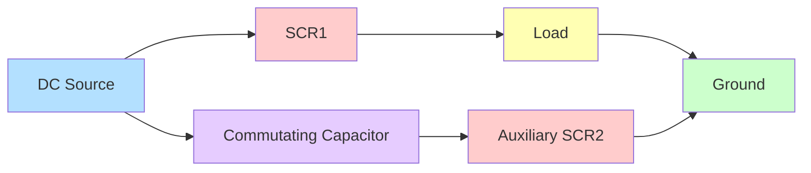

- **કાર્ય સિદ્ધાંત**: જ્યારે SCR1 ચાલુ હોય અને લોડ કરંટ વહન કરતો હોય, ત્યારે SCR2ને ફાયર કરવાથી પ્રી-ચાર્જ્ડ કેપેસિટર SCR1 પર જોડાય છે, જે તેને રિવર્સ બાયસ કરે છે
- **ટર્ન-ઓફ ટાઇમ**: કેપેસિટર વેલ્યુ અને સર્કિટ રેઝિસ્ટન્સ દ્વારા નક્કી થાય છે
- **એપ્લિકેશન્સ**: DC ચોપર્સ, પાવર કંટ્રોલ સર્કિટ્સ, ઇન્વર્ટર્સ
- **ફાયદાઓ**: સરળ સર્કિટ, વિશ્વસનીય ઓપરેશન, કોસ્ટ-ઇફેક્ટિવ

**મેમરી ટ્રીક:** "CARE" - "કેપેસિટર એપ્લાઇઝ રિવર્સ વોલ્ટેજ ફોર એક્સ્ટિંક્શન"

## પ્રશ્ન 2(c) OR [7 ગુણ]

**બ્લોક ડાયાગ્રામની મદદથી SMPS ની કામગીરીનું વર્ણન કરો.**

**જવાબ**:

**SMPS બ્લોક ડાયાગ્રામ અને ઓપરેશન:**

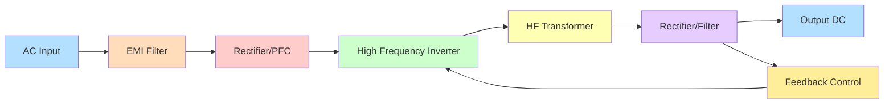

**SMPS કાર્ય સિદ્ધાંત:**

| બ્લોક | ફંક્શન | મુખ્ય ઘટકો |
|-------|----------|----------------|
| EMI ફિલ્ટર | નોઇઝને દબાવે છે | ઇન્ડક્ટર્સ, કેપેસિટર્સ |
| રેક્ટિફાયર/PFC | AC ને DC માં રૂપાંતરિત કરે છે, પાવર ફેક્ટર સુધારે છે | ડાયોડ્સ, બૂસ્ટ કન્વર્ટર |
| HF ઇન્વર્ટર | હાઇ-ફ્રીક્વન્સી AC બનાવે છે | સ્વિચિંગ ટ્રાન્ઝિસ્ટર્સ (MOSFET/IGBT) |
| HF ટ્રાન્સફોર્મર | આઇસોલેટ અને વોલ્ટેજ ટ્રાન્સફોર્મ કરે છે | ફેરાઇટ કોર ટ્રાન્સફોર્મર |
| આઉટપુટ સ્ટેજ | ક્લીન DC માટે રેક્ટિફાઇ અને ફિલ્ટર કરે છે | ફાસ્ટ ડાયોડ્સ, LC ફિલ્ટર |
| ફીડબેક | આઉટપુટ વોલ્ટેજ નિયંત્રિત કરે છે | ઓપ્ટો-આઇસોલેટર, PWM કંટ્રોલર |

- **હાઇ એફિશિયન્સી**: લીનિયર પાવર સપ્લાય 50-60% ની તુલનામાં 70-95% કાર્યક્ષમ
- **સાઇઝ રિડક્શન**: હાઇ-ફ્રીક્વન્સી ઓપરેશન નાના ટ્રાન્સફોર્મર્સને શક્ય બનાવે છે
- **રેગ્યુલેશન**: ફીડબેક લૂપ ઇનપુટ/લોડ પરિવર્તન છતાં સ્થિર આઉટપુટ જાળવે છે
- **પ્રોટેક્શન**: ઓવરકરંટ, ઓવરવોલ્ટેજ, અને થર્મલ પ્રોટેક્શન બિલ્ટ-ઇન

**મેમરી ટ્રીક:** "RELIEF" - "રેક્ટિફાય, એનર્જાઈઝ એટ હાઇ ફ્રીક્વન્સી, આઇસોલેટ, એક્સટ્રેક્ટ DC, ફીડબેક"

## પ્રશ્ન 3(a) [3 ગુણ]

**ઓવરવોલ્ટેજ સામે SCR ને સુરક્ષિત કરવાની પદ્ધતિ જણાવો.**

**જવાબ**:

**SCR ઓવરવોલ્ટેજ પ્રોટેક્શન મેથડ્સ:**

| પદ્ધતિ | સર્કિટ અમલીકરણ | પ્રોટેક્શન લેવલ |
|--------|------------------------|------------------|
| સ્નબર સર્કિટ | SCR પર RC નેટવર્ક | dv/dt પ્રોટેક્શન |
| MOV (મેટલ ઓક્સાઇડ વેરિસ્ટર) | SCR પર કનેક્ટેડ | ટ્રાન્ઝિયન્ટ સપ્રેશન |
| વોલ્ટેજ ક્લેમ્પિંગ | શ્રેણીમાં ઝેનર ડાયોડ્સ | ફિક્સ્ડ વોલ્ટેજ લિમિટિંગ |
| ક્રોબાર સર્કિટ | સેન્સિંગ અને શન્ટિંગ સર્કિટ | સંપૂર્ણ શટડાઉન |

- **વોલ્ટેજ રેટિંગ**: હંમેશા સામાન્ય ઓપરેટિંગ વોલ્ટેજથી 2-3 ગણી વોલ્ટેજ રેટિંગવાળા SCR નો ઉપયોગ કરો
- **રેટ-ઓફ-રાઇઝ**: સ્નબર સર્કિટ્સ (dv/dt પ્રોટેક્શન) સાથે ફાસ્ટ ટ્રાન્ઝિયન્ટથી રક્ષણ કરો
- **બ્રેકડાઉન વોલ્ટેજ**: SCR જંક્શનના રિવર્સ બ્રેકડાઉન વોલ્ટેજને ક્યારેય ઓળંગશો નહીં
- **કોઓર્ડિનેટેડ પ્રોટેક્શન**: ક્રિટિકલ એપ્લિકેશન્સ માટે બહુવિધ પદ્ધતિઓનો ઉપયોગ કરો

**મેમરી ટ્રીક:** "SCRAM" - "સ્નબર સર્કિટ્સ રિડ્યુસ એબનોર્મલ મેક્સિમમ વોલ્ટેજ"

## પ્રશ્ન 3(b) [4 ગુણ]

**સિંગલ-ફેઝ રેક્ટિફાયર કરતાં પોલિફેઝ રેક્ટિફાયરના કોઈપણ ચાર ફાયદા જણાવો.**

**જવાબ**:

**પોલિફેઝ રેક્ટિફાયરના ફાયદાઓ:**

| ફાયદો | સમજૂતી | પ્રભાવ |
|-----------|-------------|--------|
| હાયર પાવર હેન્ડલિંગ | ફેઝ પર લોડ વિતરિત કરે છે | હાઇ-પાવર એપ્લિકેશન્સ માટે યોગ્ય |
| ઘટાડેલું રિપલ | ઓવરલેપિંગ ફેઝ આઉટપુટ રિપલ ઘટાડે છે | ઓછી ફિલ્ટરિંગની જરૂર |
| બેટર ટ્રાન્સફોર્મર યુટિલાઇઝેશન | ઉચ્ચ ટ્રાન્સફોર્મર યુટિલાઇઝેશન ફેક્ટર (0.955 vs 0.812) | વધુ અર્થવ્યવસ્થિત ડિઝાઇન |
| ઇમ્પ્રૂવ્ડ પાવર ફેક્ટર | બેટર લાઇન યુટિલાઇઝેશન | ઘટાડેલા લાઇન લોસિસ |
| લોઅર હાર્મોનિક કન્ટેન્ટ | હાર્મોનિક્સ ઉચ્ચ ફ્રિક્વન્સીથી શરૂ થાય છે | ઘટાડેલા EMI મુદ્દાઓ |
| હાયર એફિશિયન્સી | બેટર ડિસ્ટ્રિબ્યુશનને કારણે ઘટાડેલા લોસિસ | ઓછા ઓપરેટિંગ ખર્ચ |

- **ફોર્મ ફેક્ટર**: નીચો ફોર્મ ફેક્ટર એટલે વધુ સારી DC ક્વોલિટી
- **રિપલ ફ્રિક્વન્સી**: ઉચ્ચ રિપલ ફ્રિક્વન્સી ફિલ્ટર કરવી સરળ છે
- **બેલેન્સ્ડ લોડ**: પોલિફેઝ સપ્લાયમાંથી બેલેન્સ્ડ કરંટ ખેંચે છે
- **સાઇઝ રિડક્શન**: નાના ફિલ્ટર ઘટકોની જરૂર પડે છે

**મેમરી ટ્રીક:** "HERBS" - "હાયર એફિશિયન્સી, ઇવન લોડ, રિડ્યુસ્ડ રિપલ, બેટર PF, સ્મોલર ફિલ્ટર્સ"

## પ્રશ્ન 3(c) [7 ગુણ]

**બ્લોક ડાયાગ્રામની મદદથી સૌર ફોટોવોલ્ટેઇક (PV) આધારિત પાવર જનરેશનની કામગીરીનું વર્ણન કરો.**

**જવાબ**:

**સોલર PV પાવર જનરેશન સિસ્ટમ:**

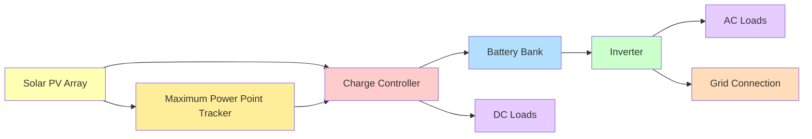

**સિસ્ટમ ઘટકો અને કાર્યો:**

| ઘટક | કાર્ય | મુખ્ય ફીચર્સ |
|-----------|----------|--------------|
| PV એરે | સનલાઇટને DC ઇલેક્ટ્રિસિટીમાં રૂપાંતરિત કરે છે | મલ્ટિપલ સિરીઝ/પેરેલેલ કનેક્ટેડ પેનલ્સ |
| MPPT | પાવર એક્સટ્રેક્શન મહત્તમ કરે છે | ઓપ્ટિમલ ઓપરેટિંગ પોઇન્ટ ટ્રેક કરે છે |
| ચાર્જ કંટ્રોલર | બેટરી ચાર્જિંગ મેનેજ કરે છે | ઓવરચાર્જિંગ/ડીપ ડિસ્ચાર્જ અટકાવે છે |
| બેટરી બેંક | એનર્જી સ્ટોરેજ | વિશ્વસનીયતા માટે ડીપ સાયકલ બેટરી |
| ઇન્વર્ટર | DC ને AC માં રૂપાંતરિત કરે છે | સંવેદનશીલ ઉપકરણો માટે પ્યોર સાઇન વેવ |
| ડિસ્ટ્રિબ્યુશન પેનલ | લોડ્સમાં પાવર રૂટ કરે છે | પ્રોટેક્શન ડિવાઇસિસ સમાવેશ કરે છે |

- **ગ્રિડ-ટાઇડ સિસ્ટમ્સ**: યુટિલિટી ગ્રિડથી જોડાયેલ, વધારાની પાવર વેચી શકે છે
- **ઓફ-ગ્રિડ સિસ્ટમ્સ**: બેટરી સ્ટોરેજ સાથે સ્ટેન્ડઅલોન સિસ્ટમ
- **હાઇબ્રિડ સિસ્ટમ્સ**: બેટરી બેકઅપ સાથે બંને મોડમાં ચાલી શકે છે
- **એફિશિયન્સી**: સૂર્યપ્રકાશથી વપરાશયોગ્ય વીજળી સુધીની સામાન્ય સિસ્ટમ કાર્યક્ષમતા 15-20%

**મેમરી ટ્રીક:** "SIMPLE" - "સન ઇન, મેક્સિમમ પાવર, લોકલ એનર્જી"

## પ્રશ્ન 3(a) OR [3 ગુણ]

**ઓવર કરંટ સામે SCR ને સુરક્ષિત કરવાની પદ્ધતિ જણાવો.**

**જવાબ**:

**SCR ઓવરકરંટ પ્રોટેક્શન મેથડ્સ:**

| મેથડ | અમલીકરણ | રિસ્પોન્સ ટાઇમ |
|--------|----------------|---------------|
| ફ્યુઝ | ફાસ્ટ-એક્ટિંગ સેમિકન્ડક્ટર ફ્યુઝ | ખૂબ ઝડપી (માઇક્રોસેકન્ડ) |
| સર્કિટ બ્રેકર | મેગ્નેટિક/થર્મલ બ્રેકર | મધ્યમ (મિલિસેકન્ડ) |
| કરંટ લિમિટિંગ રિએક્ટર | શ્રેણીમાં ઇન્ડક્ટર | તાત્કાલિક |
| ઇલેક્ટ્રોનિક કરંટ લિમિટિંગ | સેન્સિંગ અને કંટ્રોલ સર્કિટ | ઝડપી (માઇક્રોસેકન્ડ) |

- **કરંટ રેટિંગ**: હંમેશા મહત્તમ ઓપરેટિંગ કરંટથી ઉપરની કરંટ રેટિંગવાળા SCR નો ઉપયોગ કરો
- **di/dt પ્રોટેક્શન**: જંક્શન નુકસાન અટકાવવા માટે કરંટ વૃદ્ધિના દરને મર્યાદિત કરો
- **થર્મલ મેનેજમેન્ટ**: થર્મલ રનવે અટકાવવા માટે યોગ્ય હીટસિંકિંગ
- **કોઓર્ડિનેશન**: SCR ને નુકસાન થાય તે પહેલા પ્રોટેક્શન ડિવાઇસ કાર્ય કરવું જોઈએ

**મેમરી ટ્રીક:** "FIRE" - "ફ્યુઝ ઇમિડિયટલી રિસ્ટ્રિક્ટ એક્સેસિવ કરંટ"

## પ્રશ્ન 3(b) OR [4 ગુણ]

**ડીસી ચોપરનો મૂળ સિદ્ધાંત સમજાવો.**

**જવાબ**:

**DC ચોપર બેઝિક પ્રિન્સિપલ:**

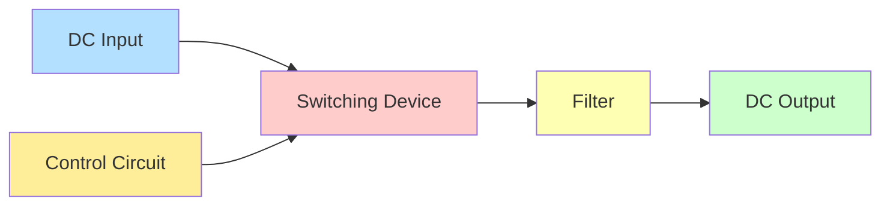

| પેરામીટર | વર્ણન | પ્રભાવ |
|-----------|-------------|--------|
| ડ્યુટી સાયકલ (α) | કુલ પીરિયડમાં ON સમયનો ગુણોત્તર | આઉટપુટ વોલ્ટેજ નિયંત્રિત કરે છે |
| સ્વિચિંગ ફ્રિક્વન્સી | દર સેકન્ડે ON/OFF સાયકલની સંખ્યા | રિપલ અને ફિલ્ટર સાઇઝને અસર કરે છે |
| ચોપિંગ મેથડ | સ્ટેપ-અપ, સ્ટેપ-ડાઉન, બક-બૂસ્ટ | વોલ્ટેજ કન્વર્ઝન નક્કી કરે છે |
| કંટ્રોલ સ્ટ્રેટેજી | PWM, કરંટ મોડ, વગેરે | સિસ્ટમ રિસ્પોન્સને અસર કરે છે |

- **બેઝિક ઇક્વેશન**: Vout = Vin × ડ્યુટી સાયકલ (સ્ટેપ-ડાઉન ચોપર માટે)
- **ઓપરેટિંગ પ્રિન્સિપલ**: રેપિડ સ્વિચિંગ એવરેજ વોલ્ટેજ નિયંત્રિત કરે છે
- **ફાયદાઓ**: ઉચ્ચ કાર્યક્ષમતા, ચોક્કસ નિયંત્રણ, કોમ્પેક્ટ સાઇઝ
- **એપ્લિકેશન્સ**: DC મોટર ડ્રાઇવ, બેટરી ચાર્જિંગ, DC વોલ્ટેજ રેગ્યુલેશન

**મેમરી ટ્રીક:** "DISC" - "ડ્યુટી સાયકલ ઇન્ફ્લુએન્સિસ સ્વિચિંગ ટુ કંટ્રોલ આઉટપુટ"

## પ્રશ્ન 3(c) OR [7 ગુણ]

**ડાયોડનો ઉપયોગ કરીને 3-Φ ફુલ વેવ રેક્ટિફાયરનું સર્કિટ ડાયાગ્રામ દોરો અને સમજાવો.**

**જવાબ**:

**3-ફેઝ ફુલ વેવ ડાયોડ રેક્ટિફાયર (બ્રિજ કોન્ફિગરેશન):**

```goat
    D1      D3      D5
    /\      /\      /\
   /  \    /  \    /  \
  /    \  /    \  /    \
R-----+--+------+--+----+----+
      |           |         |
      |           |     +   |
S-----+--+------+--+----| Load |
      |  |      |  |    |   |
      |  |      |  |    +   |
T-----+--+------+--+----+----+
       \/       \/       \/
       D2       D4       D6
```

**વર્કિંગ પ્રિન્સિપલ:**

| ફેઝ | કન્ડક્શન પેટર્ન | આઉટપુટ કેરેક્ટરિસ્ટિક્સ |
|-------|-------------------|------------------------|
| 0°-60° | D1 અને D6 કન્ડક્ટ | R અને T ફેઝિસ લોડ સાથે કનેક્ટેડ |
| 60°-120° | D1 અને D2 કન્ડક્ટ | R અને S ફેઝિસ લોડ સાથે કનેક્ટેડ |
| 120°-180° | D3 અને D2 કન્ડક્ટ | S અને R ફેઝિસ લોડ સાથે કનેક્ટેડ |
| 180°-240° | D3 અને D4 કન્ડક્ટ | S અને T ફેઝિસ લોડ સાથે કનેક્ટેડ |
| 240°-300° | D5 અને D4 કન્ડક્ટ | T અને S ફેઝિસ લોડ સાથે કનેક્ટેડ |
| 300°-360° | D5 અને D6 કન્ડક્ટ | T અને R ફેઝિસ લોડ સાથે કનેક્ટેડ |

- **રિપલ ફ્રિક્વન્સી**: ઇનપુટ ફ્રિક્વન્સીથી 6 ગણી (50/60Hz ઇનપુટ માટે 300/360Hz)
- **રિપલ ફેક્ટર**: આશરે 4.2% (સિંગલ-ફેઝથી ઘણું ઓછું)
- **એવરેજ આઉટપુટ વોલ્ટેજ**: Vdc = 1.35 × Vrms (લાઇન વોલ્ટેજ)
- **કન્ડક્શન એંગલ**: દરેક ડાયોડ સાયકલના 120° માટે કન્ડક્ટ કરે છે

**મેમરી ટ્રીક:** "PRESTO" - "પેર્સ ઓફ ડાયોડ્સ રેક્ટિફાય એફિશિયન્ટલી, સિક્સ ટાઇમ્સ પર સાયકલ આઉટપુટ"

## પ્રશ્ન 4(a) [3 ગુણ]

**ઇન્ડક્શન હીટિંગની એપ્લિકેશનો લખો.**

**જવાબ**:

**ઇન્ડક્શન હીટિંગની એપ્લિકેશન્સ:**

| એપ્લિકેશન એરિયા | સ્પેસિફિક યુઝેસ | ફાયદાઓ |
|-----------------|--------------|------------|
| મેટલ હીટ ટ્રીટમેન્ટ | હાર્ડનિંગ, એનિલિંગ, ટેમ્પરિંગ | ચોક્કસ નિયંત્રણ, લોકલાઇઝ્ડ હીટિંગ |
| મેલ્ટિંગ | ફાઉન્ડ્રી ઓપરેશન્સ, કિંમતી ધાતુઓ | ક્લીન, કાર્યક્ષમ મેલ્ટિંગ |
| વેલ્ડિંગ | પાઇપ વેલ્ડિંગ, બ્રેઝિંગ, સોલ્ડરિંગ | કેન્દ્રિત ગરમી, નો કોન્ટેક્ટ |
| ફોર્જિંગ | બિલેટ્સ પ્રી-હીટિંગ, હોટ ફોર્મિંગ | રેપિડ હીટિંગ, એનર્જી એફિશિયન્ટ |
| ઘરેલું | ઇન્ડક્શન કુકટોપ | સલામતી, કાર્યક્ષમતા, નિયંત્રણ |
| મેડિકલ | હાઇપરથર્મિયા ટ્રીટમેન્ટ | કંટ્રોલ્ડ ડીપ ટિશ્યુ હીટિંગ |

- **ઔદ્યોગિક ફાયદાઓ**: ઝડપી હીટિંગ, ઊર્જા કાર્યક્ષમતા, ક્લીન પ્રોસેસ
- **કંટ્રોલ બેનિફિટ્સ**: ચોક્કસ તાપમાન નિયંત્રણ, પુનરાવર્તનીય પરિણામો
- **પર્યાવરણીય અસર**: જીવાશ્મ બળતણ હીટિંગની તુલનામાં ઘટાડેલા ઉત્સર્જન
- **મેટલર્જિકલ ક્વોલિટી**: ઘણા એપ્લિકેશન્સમાં સુધારેલા મટીરિયલ પ્રોપર્ટીઝ

**મેમરી ટ્રીક:** "HAMMER" - "હાર્ડનિંગ, એનિલિંગ, મેલ્ટિંગ, મેડિકલ, એડી-કરંટ કુકિંગ, રિશેપિંગ મેટલ્સ"

## પ્રશ્ન 4(b) [4 ગુણ]

**TRIAC અને DIAC નો ઉપયોગ કરીને AC લોડને નિયંત્રિત કરવાની સર્કિટ દોરો અને સમજાવો.**

**જવાબ**:

**TRIAC અને DIAC સાથે AC લોડ કંટ્રોલ:**

```goat
      R1          C1
AC o--/\/\/\--+---||---+
              |        |
              |  DIAC  |
              |   |    |
              |   v    |
              +---+----+
              |        |
              | TRIAC  |
              |        |
AC o----------+--------+---o LOAD
```

**સર્કિટ ઓપરેશન:**

| કોમ્પોનન્ટ | ફંક્શન | સર્કિટ પર અસર |
|-----------|----------|------------------|
| R1 | વેરિએબલ રેઝિસ્ટર | C1 ના ચાર્જિંગ રેટને નિયંત્રિત કરે છે |
| C1 | ટાઇમિંગ કેપેસિટર | ટ્રિગરિંગ માટે ફેઝ શિફ્ટ બનાવે છે |
| DIAC | બાય-ડિરેક્શનલ ટ્રિગર | શાર્પ ટ્રિગરિંગ પલ્સ પ્રદાન કરે છે |
| TRIAC | પાવર કંટ્રોલ ડિવાઇસ | લોડ માટે કરંટ નિયંત્રિત કરે છે |
| RC નેટવર્ક | ફેઝ-શિફ્ટ નેટવર્ક | ફાયરિંગ એંગલ નક્કી કરે છે |

- **ફેઝ કંટ્રોલ**: R1 એડજસ્ટ કરવાથી જે ફેઝ એંગલ પર DIAC ટ્રિગર થાય છે તે બદલાય છે
- **પાવર કંટ્રોલ**: ફાયરિંગ એંગલ બદલવાથી લોડનો એવરેજ પાવર નિયંત્રિત થાય છે
- **બાય-ડિરેક્શનલ કંટ્રોલ**: AC ઇનપુટના બંને અર્ધ-ચક્રો પર કામ કરે છે
- **એપ્લિકેશન્સ**: લાઇટ ડિમર, ફેન સ્પીડ કંટ્રોલ, હીટર કંટ્રોલ

**મેમરી ટ્રીક:** "CRAFT" - "કેપેસિટર અને રેઝિસ્ટર એડજસ્ટ ફાયરિંગ ટાઇમ"

## પ્રશ્ન 4(c) [7 ગુણ]

**વર્કિંગ અને એપ્લિકેશન્સ સાથે સ્પોટ વેલ્ડીંગ સમજાવો.**

**જવાબ**:

**સ્પોટ વેલ્ડિંગ પ્રોસેસ અને એપ્લિકેશન્સ:**


**સ્પોટ વેલ્ડિંગ વર્કિંગ પ્રિન્સિપલ:**

| સ્ટેજ | પ્રોસેસ | પેરામીટર્સ |
|-------|---------|------------|
| સેટઅપ | મટીરિયલ ઇલેક્ટ્રોડ વચ્ચે મૂકવામાં આવે છે | શીટ થિકનેસ, મટીરિયલ ટાઇપ |
| કોન્ટેક્ટ | ઇલેક્ટ્રોડ્સ પ્રેશર લાગુ કરે છે | 200-1000 પાઉન્ડ પ્રેશર |
| કરંટ ફ્લો | વર્કપીસ મારફતે હાઇ કરંટ પસાર થાય છે | 1000-100,000 એમ્પિયર |
| હીટિંગ | રેઝિસ્ટન્સ લોકલાઇઝ્ડ હીટિંગ બનાવે છે | આશરે 2500°F તાપમાન |
| ફ્યુઝન | મટીરિયલ પીગળે છે અને નગેટ બનાવે છે | 0.1-1 સેકન્ડની અવધિ |
| કૂલિંગ | કૂલિંગ દરમિયાન પ્રેશર જાળવવામાં આવે છે | ઇલેક્ટ્રોડ કૂલિંગ મહત્વપૂર્ણ |

**સ્પોટ વેલ્ડિંગના એપ્લિકેશન્સ:**

- **ઓટોમોટિવ**: કાર બોડી એસેમ્બલી, શીટ મેટલ જોઇનિંગ
- **ઇલેક્ટ્રોનિક્સ**: બેટરી ટેબ્સ, નાના કોમ્પોનન્ટ એસેમ્બલી
- **ઉપકરણો**: રેફ્રિજરેટર, વોશિંગ મશીન, ડિશવોશર
- **એરોસ્પેસ**: એરક્રાફ્ટ પેનલ એસેમ્બલી, લાઇટવેઇટ સ્ટ્રક્ચર
- **મેડિકલ**: સર્જિકલ ઇન્સ્ટ્રુમેન્ટ્સ, ઇમ્પ્લાન્ટેબલ ડિવાઇસિસ
- **કન્ઝ્યુમર પ્રોડક્ટ્સ**: મેટલ ફર્નિચર, કન્ટેનર, રમકડાં

**મેમરી ટ્રીક:** "PCAFRI" - "પોઝિશન, કોમ્પ્રેસ, એપ્લાય કરંટ, ફોર્મ નગેટ, રિલીઝ આફ્ટર કૂલિંગ, ઇન્સ્પેક્ટ"

## પ્રશ્ન 4(a) OR [3 ગુણ]

**ડાઇલેક્ટ્રિક હીટિંગની એપ્લિકેશનો લખો.**

**જવાબ**:

**ડાઇલેક્ટ્રિક હીટિંગની એપ્લિકેશન્સ:**

| ઇન્ડસ્ટ્રી | એપ્લિકેશન્સ | ફાયદાઓ |
|----------|--------------|------------|
| ફૂડ પ્રોસેસિંગ | ડિફ્રોસ્ટિંગ, કુકિંગ, પાસ્ટ્યુરાઇઝેશન | યુનિફોર્મ હીટિંગ, સ્પીડ |
| વુડ ઇન્ડસ્ટ્રી | ડ્રાઇંગ, ગ્લુ ક્યુરિંગ, ડિલેમિનેશન | રિડ્યુસ્ડ ટાઇમ, ઇમ્પ્રૂવ્ડ ક્વોલિટી |
| ટેક્સટાઇલ | યાર્ન, ફાઇબર, ફિનિશ્ડ ગુડ્સ ડ્રાઇંગ | એનર્જી એફિશિયન્સી, સ્પીડ |
| પ્લાસ્ટિક્સ | પ્રિહીટિંગ, મોલ્ડિંગ, વેલ્ડિંગ | યુનિફોર્મ હીટિંગ, નો સરફેસ ડેમેજ |
| ફાર્માસ્યુટિકલ | ડ્રાઇંગ, સ્ટેરિલાઇઝેશન | કંટ્રોલ્ડ પ્રોસેસ, સ્પીડ |
| પેપર | ડ્રાઇંગ, ગ્લુ સેટિંગ | યુનિફોર્મ મોઇસ્ચર રિમૂવલ |

- **પ્રોસેસ બેનિફિટ્સ**: વોલ્યુમેટ્રિક હીટિંગ (માત્ર સરફેસ જ નહીં પણ સંપૂર્ણ વસ્તુને ગરમ કરે છે)
- **સ્પીડ એડવાન્ટેજ**: પરંપરાગત હીટિંગથી નોંધપાત્ર રીતે ઝડપી
- **ક્વોલિટી ઇમ્પ્રુવમેન્ટ**: વધુ યુનિફોર્મ હીટિંગ, બેટર પ્રોડક્ટ ક્વોલિટી
- **એનર્જી એફિશિયન્સી**: મટીરિયલમાં ડાયરેક્ટ એનર્જી ટ્રાન્સફર

**મેમરી ટ્રીક:** "FITPP" - "ફૂડ, ઇન્સુલેશન ડ્રાઇંગ, ટેક્સટાઇલ, પ્લાસ્ટિક્સ, ફાર્માસ્યુટિકલ પ્રોડક્ટ્સ"

## પ્રશ્ન 4(b) OR [4 ગુણ]

**SCR ડીલે ટાઈમર પર ટૂંકી નોંધ લખો.**

**જવાબ**:

**SCR ડિલે ટાઇમર:**

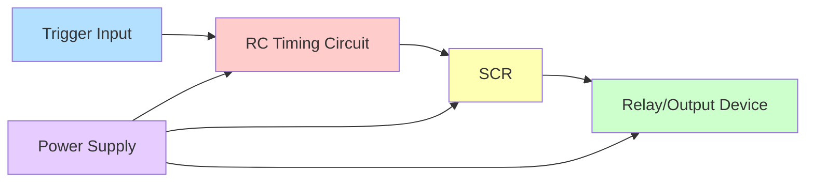

| કોમ્પોનન્ટ | ફંક્શન | સિલેક્શન ક્રાઇટેરિયા |
|-----------|----------|-------------------|
| RC નેટવર્ક | ટાઇમ ડિલે નક્કી કરે છે | R×C આશરે ટાઇમિંગ આપે છે |
| SCR | સ્વિચિંગ એલિમેન્ટ | કરંટ રેટિંગ લોડ પર આધારિત |
| UJT/ટ્રિગર | ગેટ પલ્સ પ્રદાન કરે છે | વિશ્વસનીય ટ્રિગરિંગ સર્કિટ |
| આઉટપુટ સ્ટેજ | લોડને નિયંત્રિત કરે છે | રિલે અથવા ડાયરેક્ટ લોડ કનેક્શન |

- **ટાઇમિંગ પ્રિન્સિપલ**: RC ચાર્જિંગ ટાઇમ ડિલે પીરિયડ નક્કી કરે છે
- **એક્યુરેસી**: સામાન્ય રીતે સેટ ટાઇમના ±5-10%
- **એપ્લિકેશન્સ**: ઔદ્યોગિક પ્રોસેસ કંટ્રોલ, સિક્વન્સ કંટ્રોલ, પ્રોટેક્શન સર્કિટ
- **ફાયદાઓ**: સરળ ડિઝાઇન, વિશ્વસનીય ઓપરેશન, કોસ્ટ-ઇફેક્ટિવ

**મેમરી ટ્રીક:** "TIME" - "ટાઇમિંગ ઇઝ મેનેજ્ડ બાય ઇલેક્ટ્રોનિક્સ"

## પ્રશ્ન 4(c) OR [7 ગુણ]

**સ્ટેટિક સ્વીચ તરીકે SCR નું કાર્ય સમજાવો. સ્ટેટિક સ્વીચના ફાયદા લખો.**

**જવાબ**:

**SCR એઝ સ્ટેટિક સ્વિચ:**

```goat
    +------------------+
    |                  |
AC/DC o------+         |
            SCR        LOAD
             |         |
Control o----|         |
    |        |         |
    +--------+---------+
```

**વર્કિંગ પ્રિન્સિપલ:**

| મોડ | સ્ટેટ | કેરેક્ટરિસ્ટિક |
|------|-------|-----------------|
| OFF સ્ટેટ | કોઈ ગેટ સિગ્નલ નહીં | હાઇ ઇમ્પિડન્સ, મિનિમલ લીકેજ |
| ON સ્ટેટ | ગેટ ટ્રિગર થયેલ | લો ઇમ્પિડન્સ, હાઇ કરંટ ફ્લો |
| ટર્ન-ON | ગેટ પલ્સ એપ્લાઇડ | ફાસ્ટ ટ્રાન્ઝિશન (μs રેન્જ) |
| ટર્ન-OFF | કરંટ હોલ્ડિંગથી નીચે પડે | AC માં ઓટોમેટિક, DC માં કમ્યુટેશનની જરૂર |

- **DC ઓપરેશન**: ટર્ન-ઓફ માટે કમ્યુટેશન સર્કિટની જરૂર પડે છે
- **AC ઓપરેશન**: ઝીરો ક્રોસિંગ પર નેચરલ ટર્ન-ઓફ
- **કંટ્રોલ મેથડ્સ**: ડાયરેક્ટ ગેટ ડ્રાઇવ, પલ્સ ટ્રિગરિંગ, ઓપ્ટો-આઇસોલેશન
- **પ્રોટેક્શન**: સ્નબર સર્કિટ, કરંટ લિમિટિંગની જરૂર પડે છે

**સ્ટેટિક સ્વિચના ફાયદાઓ:**

| ફાયદો | વર્ણન | મિકેનિકલ સાથે તુલના |
|-----------|-------------|---------------------------|
| નો મુવિંગ પાર્ટ્સ | કોઈ મિકેનિકલ ઘસારો નહીં | લાંબી લાઇફટાઇમ (લાખો ઓપરેશન્સ) |
| સાયલન્ટ ઓપરેશન | સ્વિચિંગ દરમિયાન કોઈ ઓડિબલ નોઇઝ નહીં | અવાજ-સંવેદનશીલ એપ્લિકેશન્સમાં મહત્વપૂર્ણ |
| ફાસ્ટ સ્વિચિંગ | માઇક્રોસેકન્ડ રેન્જ સ્વિચિંગ | મિકેનિકલ કોન્ટેક્ટ કરતાં ઘણું ઝડપી |
| નો આર્કિંગ | કોઈ કોન્ટેક્ટ બાઉન્સ કે આર્કિંગ નહીં | જોખમી વાતાવરણમાં વધુ સુરક્ષિત |
| સાઇઝ & વેઇટ | કોમ્પેક્ટ અને હળવું | નોંધપાત્ર સ્પેસ સેવિંગ |
| EMI/RFI | ઓછું ઇલેક્ટ્રોમેગ્નેટિક ઇન્ટરફેરન્સ | સંવેદનશીલ ઇલેક્ટ્રોનિક્સ માટે બેટર |

- **રિલાયબિલિટી**: ઉચ્ચ MTBF (મીન ટાઇમ બિટ્વીન ફેલ્યોર્સ)
- **કંપેટિબિલિટી**: ઇલેક્ટ્રોનિક કંટ્રોલ સિસ્ટમ સાથે કામ કરે છે
- **વોલ્ટેજ આઇસોલેશન**: ઓપ્ટો-આઇસોલેશન સમાવી શકે છે
- **સર્જ હેન્ડલિંગ**: યોગ્ય ડિઝાઇન સાથે બેટર ટ્રાન્ઝિયન્ટ પ્રોટેક્શન

**મેમરી ટ્રીક:** "FANS" - "ફાસ્ટ સ્વિચિંગ, આર્ક-ફ્રી ઓપરેશન, નો મુવિંગ પાર્ટ્સ, સાયલન્ટ ઓપરેશન"

## પ્રશ્ન 5(a) [3 ગુણ]

**ડીસી ડ્રાઇવ શું છે? ડીસી ડ્રાઇવ્સનું વર્ગીકરણ આપો.**

**જવાબ**:

**DC ડ્રાઇવ વ્યાખ્યા અને વર્ગીકરણ:**

| પાસું | વર્ણન |
|--------|-------------|
| વ્યાખ્યા | DC મોટરની સ્પીડ, ટોર્ક અને દિશા નિયંત્રિત કરતી ઇલેક્ટ્રોનિક સિસ્ટમ |
| બેઝિક ફંક્શન | મોટર પેરામીટર્સને નિયંત્રિત કરવા માટે આર્મેચર વોલ્ટેજ અને/અથવા ફિલ્ડ કરંટને નિયંત્રિત કરે છે |

**DC ડ્રાઇવ્સનું વર્ગીકરણ:**

| વર્ગીકરણ આધાર | પ્રકારો | લાક્ષણિકતાઓ |
|---------------------|-------|-----------------|
| પાવર રેટિંગ | ફ્રેક્શનલ, ઇન્ટિગ્રલ, હાઇ પાવર | હોર્સપાવર રેટિંગ પર આધારિત |
| કંટ્રોલ મેથડ | ઓપન લૂપ, ક્લોઝ્ડ લૂપ | ફીડબેક મેકેનિઝમ પર આધારિત |
| ક્વોડ્રન્ટ ઓપરેશન | સિંગલ, ટુ, ફોર ક્વોડ્રન્ટ | સ્પીડ/ટોર્ક દિશા પર આધારિત |
| પાવર સપ્લાય | સિંગલ-ફેઝ, થ્રી-ફેઝ | ઇનપુટ પાવર કોન્ફિગરેશન પર આધારિત |
| કન્વર્ટર ટાઇપ | હાફ-વેવ, ફુલ-વેવ, ચોપર | પાવર કન્વર્ઝન મેથડ પર આધારિત |
| એપ્લિકેશન | જનરલ પર્પઝ, સર્વો, સ્પેશલાઇઝ્ડ | ઇન્ટેન્ડેડ યુઝ પર આધારિત |

- **પાવર રેન્જ**: ફ્રેક્શનલ HP થી લઈને હજારો HP સુધી
- **કંટ્રોલ પ્રિસિઝન**: બેઝિકથી હાઇ-પ્રિસિઝન (0.01%)
- **રિસ્પોન્સ ટાઇમ**: મિલિસેકન્ડથી માઇક્રોસેકન્ડ સુધી
- **પ્રોટેક્શન**: વિવિધ બિલ્ટ-ઇન પ્રોટેક્શન ફીચર્સ

**મેમરી ટ્રીક:** "PQCAS" - "પાવર રેટિંગ, ક્વોડ્રન્ટ્સ, કંટ્રોલ ટાઇપ, AC ઇનપુટ ફેઝિસ, સ્વિચિંગ મેથડ"

## પ્રશ્ન 5(b) [4 ગુણ]

**વેરિએબલ રીલક્ટન્સ પ્રકાર સ્ટેપર મોટરનું બાંધકામ દોરો અને સમજાવો.**

**જવાબ**:

**વેરિએબલ રિલક્ટન્સ સ્ટેપર મોટર કન્સ્ટ્રક્શન:**

```goat
    +-----------------+
    |                 |
    |     Stator      |
    |    +-------+    |
    |    |       |    |
    |    |Rotor  |    |
    |    |       |    |
    |    +-------+    |
    |                 |
    +-----------------+
```

| કોમ્પોનન્ટ | કન્સ્ટ્રક્શન | ફંક્શન |
|-----------|--------------|----------|
| સ્ટેટર | મલ્ટિપલ પોલ્સ અને વાઇન્ડિંગ્સ સાથે લેમિનેટેડ સ્ટીલ | એનર્જાઇઝ થવા પર મેગ્નેટિક ફિલ્ડ બનાવે છે |
| રોટર | સોફ્ટ આયર્ન વિથ મલ્ટિપલ ટીથ, કોઈ પર્મેનન્ટ મેગ્નેટ્સ નહીં | એનર્જાઇઝ્ડ સ્ટેટર પોલ્સ સાથે એલાઇન થાય છે |
| એર ગેપ | રોટર અને સ્ટેટર વચ્ચે નાની જગ્યા | સ્ટેપ એક્યુરેસી અને ટોર્કને અસર કરે છે |
| વાઇન્ડિંગ | સ્ટેટર પર મલ્ટિપલ ફેઝ વાઇન્ડિંગ્સ | ક્રમિક એનર્જાઇઝિંગ રોટેશન બનાવે છે |

- **ટૂથ કોન્ફિગરેશન**: સામાન્ય રીતે રોટર ટીથ સ્ટેટર ટીથ કરતા ઓછી હોય છે
- **સ્ટેપ એંગલ**: આના દ્વારા નક્કી થાય છે: સ્ટેપ એંગલ = 360° ÷ (રોટર ટીથની સંખ્યા × ફેઝની સંખ્યા)
- **કન્સ્ટ્રક્શન સિમ્પ્લિસિટી**: રોટર પર કોઈ પર્મેનન્ટ મેગ્નેટ્સ કે વાઇન્ડિંગ્સ નથી
- **ઓપરેટિંગ પ્રિન્સિપલ**: ફેઝિસ એનર્જાઇઝ થાય ત્યારે મેગ્નેટિક રિલક્ટન્સ પાથ મિનિમાઇઝ થવાનો પ્રયાસ કરે છે

**મેમરી ટ્રીક:** "STAR" - "સ્ટેટર એનર્જાઇઝીસ, ટીથ એલાઇન વિથ મિનિમમ રિલક્ટન્સ"

## પ્રશ્ન 5(c) [7 ગુણ]

**VFD (વેરિએબલ ફ્રીક્વન્સી ડ્રાઇવ) ની કામગીરી સમજાવો.**

**જવાબ**:

**વેરિએબલ ફ્રીક્વન્સી ડ્રાઇવ (VFD) વર્કિંગ:**

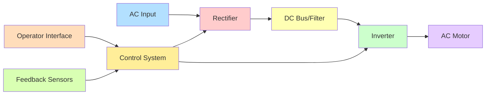

**VFD કોમ્પોનન્ટ્સ અને ફંક્શન્સ:**

| કોમ્પોનન્ટ | ફંક્શન | ફીચર્સ |
|-----------|----------|----------|
| રેક્ટિફાયર | AC ને DC માં કન્વર્ટ કરે છે | 6-પલ્સ અથવા 12-પલ્સ ડિઝાઇન |
| DC બસ | ફિલ્ટર કરે છે અને એનર્જી સ્ટોર કરે છે | કેપેસિટર્સ અને ઇન્ડક્ટર્સ |
| ઇન્વર્ટર | વેરિએબલ ફ્રિક્વન્સી AC બનાવે છે | IGBT અથવા MOSFET આધારિત |
| કંટ્રોલ સિસ્ટમ | સમગ્ર ઓપરેશન મેનેજ કરે છે | માઇક્રોપ્રોસેસર આધારિત |
| HMI | યુઝર ઇન્ટરફેસ | ડિસ્પ્લે, કીપેડ, કમ્યુનિકેશન |
| પ્રોટેક્શન | સિસ્ટમ પ્રોટેક્શન | કરંટ, વોલ્ટેજ, તાપમાન સેન્સર |

**વર્કિંગ પ્રિન્સિપલ:**

- **સ્પીડ કંટ્રોલ ઇક્વેશન**: મોટર સ્પીડ (RPM) = (ફ્રિક્વન્સી × 120) ÷ પોલ્સની સંખ્યા
- **ટોર્ક કંટ્રોલ**: V/F રેશિયો જાળવવાથી ટોર્ક આઉટપુટ નિયંત્રિત થાય છે
- **સોફ્ટ સ્ટાર્ટ**: ક્રમશઃ ફ્રિક્વન્સી/વોલ્ટેજ રેમ્પ-અપ ઇનરશ કરંટ ઘટાડે છે
- **બ્રેકિંગ મેથડ્સ**: રિજનરેટિવ, ડાયનેમિક, અથવા DC ઇન્જેક્શન બ્રેકિંગ
- **એનર્જી સેવિંગ્સ**: ઘટાડેલી સ્પીડ પર નોંધપાત્ર ઊર્જા બચત
- **એડવાન્સ્ડ ફીચર્સ**: PID કંટ્રોલ, નેટવર્ક કમ્યુનિકેશન, પ્રોગ્રામેબલ ફંક્શન્સ

**મેમરી ટ્રીક:** "DRIVE" - "DC કન્વર્ઝન, રેગ્યુલેશન, ઇન્વર્ટર ક્રિએટ્સ, વેરિએબલ ફ્રિક્વન્સી, એફિશિયન્ટ મોટર કંટ્રોલ"

## પ્રશ્ન 5(a) OR [3 ગુણ]

**હોલ ઇફેક્ટ સેન્સર શું છે અને ડીસી મોટર્સમાં તેમની ભૂમિકા શું છે?**

**જવાબ**:

**DC મોટર્સમાં હોલ ઇફેક્ટ સેન્સર:**

| પાસું | વર્ણન |
|--------|-------------|
| વ્યાખ્યા | મેગ્નેટિક ફિલ્ડને ડિટેક્ટ કરતા સેમિકન્ડક્ટર-આધારિત સેન્સર |
| સિદ્ધાંત | મેગ્નેટિક ફિલ્ડમાં કરંટ ફ્લોથી લંબરૂપે વોલ્ટેજ ડિફરન્સ ઉત્પન્ન થાય છે |
| સિગ્નલ આઉટપુટ | ડિજિટલ (ON/OFF) અથવા એનાલોગ (ફિલ્ડ સ્ટ્રેન્થના પ્રમાણમાં) |
| સાઇઝ | કોમ્પેક્ટ, મોટર હાઉસિંગમાં ઇન્ટિગ્રેટેડ થઈ શકે છે |

**DC મોટર્સમાં રોલ:**

| ફંક્શન | એપ્લિકેશન | બેનિફિટ |
|----------|-------------|---------|
| પોઝિશન સેન્સિંગ | રોટર પોઝિશન ડિટેક્શન | પ્રિસાઇઝ કોમ્યુટેશન ટાઇમિંગ |
| સ્પીડ મેઝરમેન્ટ | RPM કેલ્ક્યુલેશન માટે પલ્સ જનરેશન | એક્યુરેટ સ્પીડ ફીડબેક |
| ડિરેક્શન ડિટેક્શન | ફેઝ સિક્વન્સ મોનિટરિંગ | રોટેશન ડિરેક્શન કંટ્રોલ |
| કરંટ સેન્સિંગ | નોન-કોન્ટેક્ટ કરંટ મેઝરમેન્ટ | ઓવરલોડ પ્રોટેક્શન |

- **BLDC મોટર્સ**: ઇલેક્ટ્રોનિક કોમ્યુટેશન (મિકેનિકલ કોમ્યુટેટરને રિપ્લેસ કરવા) માટે ક્રિટિકલ
- **પ્રિસિઝન**: મિકેનિકલ સેન્સર કરતાં ઉચ્ચ ચોકસાઈ
- **રિલાયબિલિટી**: કોઈ મિકેનિકલ ઘસારો નહીં, લાંબી સર્વિસ લાઇફ
- **ઇન્ટિગ્રેશન**: ડ્રાઇવ ઇલેક્ટ્રોનિક્સ સાથે ઇન્ટિગ્રેટેડ થઈ શકે છે

**મેમરી ટ્રીક:** "MAPS" - "મેઝર્સ પોઝિશન, એઇડ્સ કોમ્યુટેશન, પ્રોવાઇડ્સ સ્પીડ ડેટા, સેન્સિસ મેગ્નેટિક ફિલ્ડ્સ"

## પ્રશ્ન 5(b) OR [4 ગુણ]

**સ્ટેપર મોટરના કાર્ય સિદ્ધાંતને સમજાવો.**

**જવાબ**:

**સ્ટેપર મોટર વર્કિંગ પ્રિન્સિપલ:**

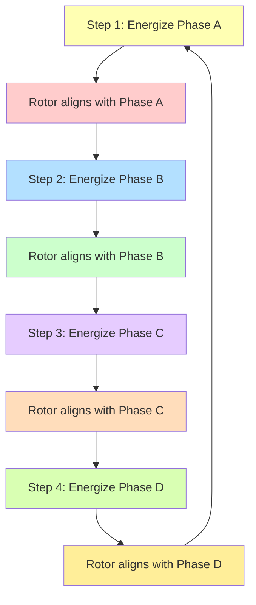

| ઓપરેટિંગ મોડ | વર્ણન | ફાયદાઓ |
|----------------|-------------|------------|
| ફુલ સ્ટેપ | એક સમયે એક ફેઝ એનર્જાઇઝ્ડ | મેક્સિમમ ટોર્ક |
| હાફ સ્ટેપ | વારાફરતી એક અને બે ફેઝિસ એનર્જાઇઝ્ડ | ડબલ રેઝોલ્યુશન, સ્મૂધર |
| માઇક્રોસ્ટેપિંગ | ફેઝિસમાં પ્રોપોર્શનલ કરંટ | વેરી સ્મૂધ મોશન, હાઇ રેઝોલ્યુશન |
| વેવ ડ્રાઇવ | સિક્વેન્શિયલ સિંગલ ફેઝ એનર્જાઇઝેશન | લોઅર પાવર કન્ઝમ્પશન |

- **પોઝિશન કંટ્રોલ**: ફીડબેક વગર ચોક્કસ એન્ગ્યુલર પોઝિશનિંગ
- **સ્ટેપ એંગલ**: સામાન્ય સ્ટેપ એંગલ્સ 1.8° (200 સ્ટેપ્સ/રેવ) અથવા 0.9° (400 સ્ટેપ્સ/રેવ)
- **હોલ્ડિંગ ટોર્ક**: સ્ટેન્ડસ્ટિલ પર ફેઝિસ એનર્જાઇઝ્ડ હોય ત્યારે પોઝિશન જાળવે છે
- **ઓપન-લૂપ કંટ્રોલ**: સામાન્ય રીતે પોઝિશન ફીડબેકની જરૂર નથી
- **સ્પીડ-ટોર્ક**: સ્પીડ વધે તેમ ટોર્ક ઘટે છે

**મેમરી ટ્રીક:** "STEPS" - "સિક્વેન્શિયલ ટ્રિગરિંગ ઓફ ઇલેક્ટ્રોમેગ્નેટિક ફેઝિસ કોઝિસ સ્ટેપિંગ"

## પ્રશ્ન 5(c) OR [7 ગુણ]

**PLC નો બ્લોક ડાયાગ્રામ દોરો અને દરેક બ્લોકની કામગીરી સમજાવો.**

**જવાબ**:

**PLC બ્લોક ડાયાગ્રામ અને ફંક્શન્સ:**

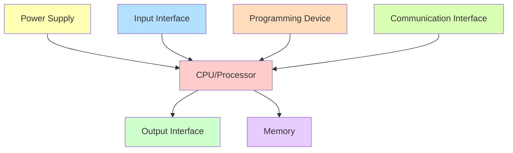

**દરેક બ્લોકનાં ફંક્શન્સ:**

| બ્લોક | ફંક્શન | લાક્ષણિકતાઓ |
|-------|----------|-----------------|
| પાવર સપ્લાય | મુખ્ય પાવરને સિસ્ટમ વોલ્ટેજમાં રૂપાંતરિત કરે છે | રેગ્યુલેટેડ, પ્રોટેક્ટેડ, આઇસોલેશન સાથે |
| CPU/પ્રોસેસર | પ્રોગ્રામ એક્ઝિક્યુટ કરે છે, ઓપરેશન્સ નિયંત્રિત કરે છે | સ્પીડ સ્કેન ટાઇમમાં માપવામાં આવે છે (ms) |
| ઇનપુટ ઇન્ટરફેસ | સેન્સર અને સ્વિચ સાથે કનેક્ટ કરે છે | ડિજિટલ/એનાલોગ, આઇસોલેશન, ફિલ્ટરિંગ |
| આઉટપુટ ઇન્ટરફેસ | એક્ચુએટર અને ઇન્ડિકેટર સાથે કનેક્ટ કરે છે | રિલે/ટ્રાન્ઝિસ્ટર/ટ્રાયક આઉટપુટ |
| મેમરી | પ્રોગ્રામ અને ડેટા સ્ટોર કરે છે | પ્રોગ્રામ, ડેટા, અને સિસ્ટમ મેમરી એરિયા |
| પ્રોગ્રામિંગ ડિવાઇસ | પ્રોગ્રામ્સ ડેવલપ અને લોડ કરવા માટે વપરાય છે | PC, હેન્ડહેલ્ડ પ્રોગ્રામર, સોફ્ટવેર |
| કમ્યુનિકેશન | નેટવર્ક/અન્ય ડિવાઇસિસ સાથે કનેક્ટ કરે છે | ઔદ્યોગિક પ્રોટોકોલ, રિમોટ I/O |

- **સ્કેન સાયકલ**: ઇનપુટ વાંચવા, પ્રોગ્રામ એક્ઝિક્યુટ કરવા, આઉટપુટ અપડેટ કરવાની ક્રમિક પ્રક્રિયા
- **પ્રોગ્રામિંગ લેંગ્વેજિસ**: લેડર ડાયાગ્રામ (LD), ફંક્શન બ્લોક ડાયાગ્રામ (FBD), સ્ટ્રક્ચર્ડ ટેક્સ્ટ (ST), ઇન્સ્ટ્રક્શન લિસ્ટ (IL), સિક્વેન્શિયલ ફંક્શન ચાર્ટ (SFC)
- **મોડ્યુલરિટી**: વધારાના I/O મોડ્યુલ્સ સાથે વિસ્તૃત કરી શકાય છે
- **રોબસ્ટનેસ**: કઠોર ઔદ્યોગિક પર્યાવરણ માટે ડિઝાઇન કરેલ
- **રિલાયાબિલિટી**: સામાન્ય રીતે MTBF >100,000 કલાક

**મેમરી ટ્રીક:** "PICO MPC" - "પાવર, ઇનપુટ્સ, CPU, આઉટપુટ્સ, મેમરી, પ્રોગ્રામિંગ ઇન્ટરફેસ, કમ્યુનિકેશન"
