## Question 1(a) [3 marks]

**Draw characteristics of Opto-Isolators, Opto-TRIAC and Opto-transistor.**

**Answer**:

**Characteristics of Opto-Electronic Devices:**

| Opto-Isolator | Opto-TRIAC | Opto-Transistor |
|:-------------:|:----------:|:---------------:|
|  |  |  |
| Linear relationship between LED current and photodetector current | Non-linear triggering response with threshold | Linear current transfer characteristic |
| CTR (Current Transfer Ratio) is key parameter | Triggering occurs at specific current threshold | Collector current depends on base illumination |

- **CTR (Current Transfer Ratio)**: Ratio of output current to input current
- **Trigger Current**: Minimum current needed to activate the device
- **Linearity**: How proportional the output is to the input light

**Mnemonic:** "LTL - Light Transfers Like current flows – Linear for isolators/transistors, Triggered for TRIACs"

## Question 1(b) [4 marks]

**Describe working & constructional features of IGBT.**

**Answer**:

**IGBT Structure and Operation:**

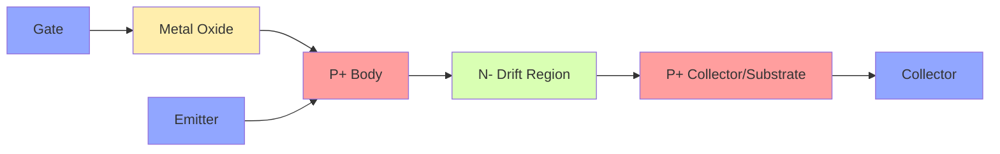

| Feature | Description |
|---------|-------------|
| Structure | Combines MOSFET input with BJT output |
| Layers | Gate/Metal Oxide/P+ Body/N- Drift/P+ Collector |
| Advantages | High input impedance, low conduction loss |
| Switching | Faster than BJT, better power handling than MOSFET |

- **Voltage Controlled**: Device is controlled by gate voltage like MOSFET
- **Conductivity Modulation**: P+ collector injects holes into drift region
- **Low On-State Voltage**: Conduction losses lower than MOSFET

**Mnemonic:** "IGBT MBC" - "Input from MOS, Body handles current, Collector acts like BJT"

## Question 1(c) [7 marks]

**Explain working of SCR using two-transistor analogy.**

**Answer**:

**SCR as Two-Transistor Model:**

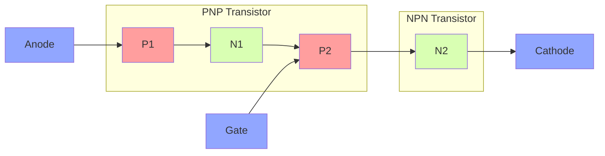

**Two-Transistor Explanation:**

| Component | Function | Connections |
|-----------|----------|-------------|
| PNP (T1) | Upper transistor | Emitter to Anode, Collector to N1, Base to P2-N1 junction |
| NPN (T2) | Lower transistor | Emitter to Cathode, Collector to P1-N1 junction, Base to Gate |
| Feedback | Regenerative action | T1's collector current = T2's base current & vice versa |

- **Latching Mechanism**: Once triggered, transistors keep each other ON
- **Triggering**: Small gate current → T2 turns ON → T1 gets base current → Both remain ON
- **Holding Current**: Minimum current needed to maintain regenerative action
- **Turn-OFF**: Anode current must fall below holding current

**Mnemonic:** "PPFF" - "Positive feedback Perpetuates Forward conduction"

## Question 1(c) OR [7 marks]

**Explain the working of Solid state relay using Opto-SCR.**

**Answer**:

**Solid State Relay with Opto-SCR:**

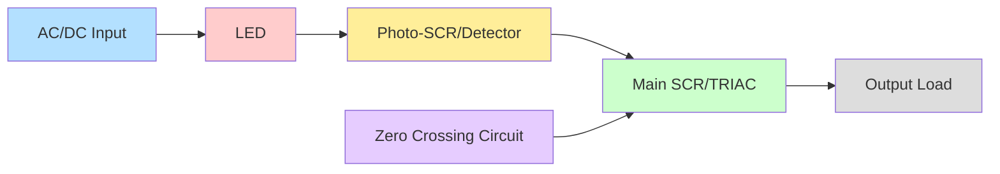

**Working Principle and Components:**

| Stage | Function | Advantage |
|-------|----------|-----------|
| Input | Low voltage control signal activates LED | Isolation from high power |
| Opto-Coupler | LED light triggers photo-sensitive SCR | Electrical isolation |
| Driver Circuit | Photo-SCR activates main switching device | Amplification of switching capacity |
| Output Stage | Main SCR/TRIAC controls high-power load | Handles load current |
| Snubber | RC circuit protects from voltage spikes | Prevents false triggering |

- **Electrical Isolation**: Complete separation between control and power circuits (>1000V)
- **Zero-Crossing**: Switching only at zero voltage reduces EMI/RFI noise
- **Silent Operation**: No mechanical clicks unlike traditional relays
- **Long Life**: No mechanical wear as in conventional relays

**Mnemonic:** "LIPO" - "Light In, Power Out - isolation guaranteed"

## Question 2(a) [3 marks]

**Explain the working of snubber circuit for SCR.**

**Answer**:

**Snubber Circuit for SCR:**

```goat
    +---||---+
    |   C1   |
    |        |
A---+        +---R1---+
|                     |
SCR                   |
|                     |
K---------------------+
```

| Component | Purpose | Sizing Consideration |
|-----------|---------|----------------------|
| Capacitor (C1) | Limits dv/dt rate | Based on max dv/dt rating of SCR |
| Resistor (R1) | Limits discharge current | Based on capacitor value and switching frequency |

- **dv/dt Protection**: Prevents false triggering due to rapid voltage rise
- **Turn-OFF Support**: Helps in commutation by providing alternate path
- **Energy Absorption**: Absorbs energy from inductive loads during switching

**Mnemonic:** "CARD" - "Capacitor And Resistor Damp unwanted triggering"

## Question 2(b) [4 marks]

**Write the differences between forced commutation and natural commutation.**

**Answer**:

**Comparison of Commutation Methods:**

| Parameter | Forced Commutation | Natural Commutation |
|-----------|-------------------|---------------------|
| Definition | External circuit forces SCR to turn OFF | AC source naturally reduces current to zero |
| Application | DC circuits primarily | AC circuits primarily |
| Components | Requires additional components (capacitors, inductors) | No extra components needed |
| Complexity | More complex circuit design | Simpler circuit design |
| Energy | Extra energy needed for commutation | Uses existing source energy |
| Control | Can be controlled precisely | Happens at fixed points of AC cycle |
| Cost | Higher due to extra components | Lower cost implementation |

- **Timing Control**: Forced commutation offers better timing control
- **Circuit Size**: Natural commutation results in smaller circuit size
- **Reliability**: Natural commutation has fewer components to fail

**Mnemonic:** "DANCE" - "DC needs Active commutation, Natural for AC, Costs Extra for forced"

## Question 2(c) [7 marks]

**Describe the working of UPS with the help of block diagram.**

**Answer**:

**UPS Block Diagram and Operation:**

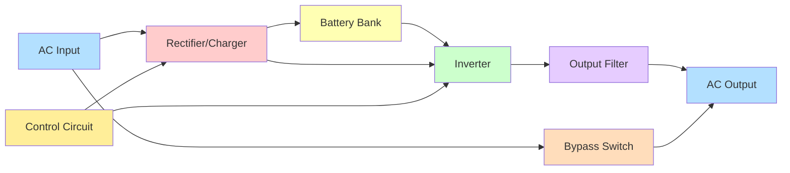

**UPS Operation Modes:**

| Mode | Description | Power Path |
|------|-------------|------------|
| Normal | AC source powers load via rectifier and inverter | AC Input → Rectifier → Inverter → Output |
| Battery | Battery powers load when AC fails | Battery → Inverter → Output |
| Bypass | AC directly connects to load for maintenance | AC Input → Bypass Switch → Output |
| Charging | Battery charges while in normal mode | Rectifier → Battery |

- **Online UPS**: Power always flows through rectifier/inverter (double conversion)
- **Offline UPS**: Power flows directly to load, switches to battery when power fails
- **Line-Interactive**: Similar to offline but with voltage regulation
- **Backup Time**: Depends on battery capacity and load requirements

**Mnemonic:** "BRIC" - "Battery Ready when Input Cuts off"

## Question 2(a) OR [3 marks]

**Explain pulse gate triggering method of SCR.**

**Answer**:

**Pulse Gate Triggering Method:**

```goat
      +-----+
      |Pulse|
      |Gen. |
      +--+--+
         |
         v
A---+--------+
|   |        |
|   |  SCR   |
|   |        |
K---+--------+
```

| Parameter | Specification | Advantage |
|-----------|--------------|-----------|
| Pulse Width | 10-100 μs | Ensures proper turn-on |
| Amplitude | 1-3V above threshold | Reliable triggering |
| Rise Time | Fast (<1 μs) | Quick turn-on |
| Frequency | Single or train of pulses | Control over timing |

- **Precise Control**: Exact timing of SCR turn-on
- **Noise Immunity**: Less susceptible to false triggering
- **Power Efficiency**: Low average gate power consumption
- **Isolation**: Can be coupled through pulse transformer or opto-isolator

**Mnemonic:** "TRAP" - "Timed, Reliable, Amplitude-controlled Pulses"

## Question 2(b) OR [4 marks]

**List the commutation methods of SCR and explain any one in detail.**

**Answer**:

**Commutation Methods of SCR:**

| Method | Circuit Type | Application |
|--------|-------------|-------------|
| Class A | Self-commutated by resonating LC | Low-power inverters |
| Class B | Self-commutated by AC source | AC power control |
| Class C | Complementary SCR commutation | DC choppers |
| Class D | External pulse commutation | DC/AC converters |
| Class E | External capacitor commutation | DC power control |
| Class F | Line commutation | AC line controlled rectifiers |

**Detailed Explanation of Class E (Capacitor Commutation):**

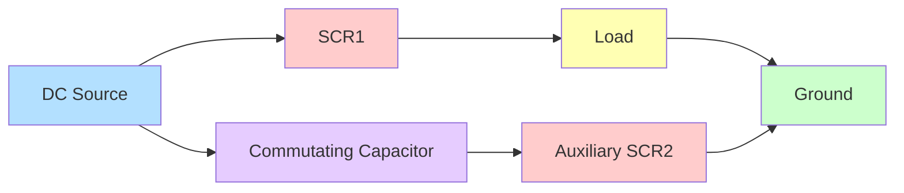

- **Working Principle**: When SCR1 is ON and carrying load current, firing SCR2 connects pre-charged capacitor across SCR1, reverse biasing it
- **Turn-OFF Time**: Determined by capacitor value and circuit resistance
- **Applications**: DC choppers, power control circuits, inverters
- **Advantages**: Simple circuit, reliable operation, cost-effective

**Mnemonic:** "CARE" - "Capacitor Applies Reverse voltage for Extinction"

## Question 2(c) OR [7 marks]

**Describe the working of SMPS with the help of block diagram.**

**Answer**:

**SMPS Block Diagram and Operation:**

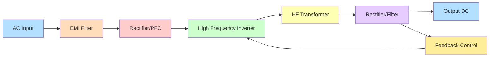

**SMPS Working Principles:**

| Block | Function | Key Components |
|-------|----------|----------------|
| EMI Filter | Suppresses noise | Inductors, capacitors |
| Rectifier/PFC | Converts AC to DC, improves power factor | Diodes, boost converter |
| HF Inverter | Creates high-frequency AC | Switching transistors (MOSFET/IGBT) |
| HF Transformer | Isolates and transforms voltage | Ferrite core transformer |
| Output Stage | Rectifies and filters to clean DC | Fast diodes, LC filter |
| Feedback | Regulates output voltage | Opto-isolator, PWM controller |

- **High Efficiency**: 70-95% efficient compared to 50-60% for linear power supplies
- **Size Reduction**: High-frequency operation allows smaller transformers
- **Regulation**: Feedback loop maintains stable output despite input/load changes
- **Protection**: Built-in overcurrent, overvoltage, and thermal protection

**Mnemonic:** "RELIEF" - "Rectify, Energize at high frequency, Isolate, Extract DC, Feedback"

## Question 3(a) [3 marks]

**State the method to protect SCR against over voltage.**

**Answer**:

**SCR Overvoltage Protection Methods:**

| Method | Circuit Implementation | Protection Level |
|--------|------------------------|------------------|
| Snubber Circuit | RC network across SCR | dv/dt protection |
| MOV (Metal Oxide Varistor) | Connected across SCR | Transient suppression |
| Voltage Clamping | Zener diodes in series | Fixed voltage limiting |
| Crowbar Circuit | Sensing and shunting circuit | Complete shutdown |

- **Voltage Rating**: Always use SCR with voltage rating 2-3 times normal operating voltage
- **Rate-of-Rise**: Protect against fast transients with snubber circuits (dv/dt protection)
- **Breakdown Voltage**: Never exceed reverse breakdown voltage of SCR junction
- **Coordinated Protection**: Use multiple methods for critical applications

**Mnemonic:** "SCRAM" - "Snubber Circuits Reduce Abnormal Maximum voltages"

## Question 3(b) [4 marks]

**State any four advantages of polyphase rectifiers over single-phase rectifiers.**

**Answer**:

**Advantages of Polyphase Rectifiers:**

| Advantage | Explanation | Impact |
|-----------|-------------|--------|
| Higher Power Handling | Distributes load across phases | Suitable for high-power applications |
| Reduced Ripple | Overlapping phases reduce output ripple | Less filtering required |
| Better Transformer Utilization | Higher transformer utilization factor (0.955 vs 0.812) | More economical design |
| Improved Power Factor | Better line utilization | Reduced line losses |
| Lower Harmonic Content | Harmonics start at higher frequencies | Reduced EMI issues |
| Higher Efficiency | Reduced losses due to better distribution | Lower operating costs |

- **Form Factor**: Lower form factor means better DC quality
- **Ripple Frequency**: Higher ripple frequency is easier to filter
- **Balanced Load**: Polyphase draws balanced current from supply
- **Size Reduction**: Smaller filter components needed

**Mnemonic:** "HERBS" - "Higher efficiency, Even load, Reduced ripple, Better PF, Smaller filters"

## Question 3(c) [7 marks]

**Describe the working of solar Photovoltaic (PV) based power generation with the help of block diagram.**

**Answer**:

**Solar PV Power Generation System:**

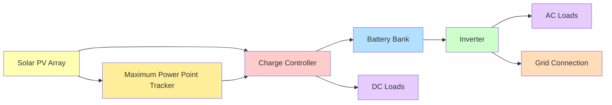

**System Components and Functions:**

| Component | Function | Key Features |
|-----------|----------|--------------|
| PV Array | Converts sunlight to DC electricity | Multiple series/parallel connected panels |
| MPPT | Maximizes power extraction | Tracks optimal operating point |
| Charge Controller | Manages battery charging | Prevents overcharging/deep discharge |
| Battery Bank | Energy storage | Deep cycle batteries for reliability |
| Inverter | Converts DC to AC | Pure sine wave for sensitive equipment |
| Distribution Panel | Routes power to loads | Includes protection devices |

- **Grid-Tied Systems**: Connected to utility grid, can sell excess power
- **Off-Grid Systems**: Standalone systems with battery storage
- **Hybrid Systems**: Can operate in both modes with battery backup
- **Efficiency**: Typical system efficiency 15-20% from sunlight to usable electricity

**Mnemonic:** "SIMPLE" - "Sun In, Maximum Power, Local Energy"

## Question 3(a) OR [3 marks]

**State the method to protect SCR against over current.**

**Answer**:

**SCR Overcurrent Protection Methods:**

| Method | Implementation | Response Time |
|--------|----------------|---------------|
| Fuses | Fast-acting semiconductor fuses | Very fast (microseconds) |
| Circuit Breakers | Magnetic/thermal breakers | Medium (milliseconds) |
| Current Limiting Reactors | Series inductors | Instantaneous |
| Electronic Current Limiting | Sensing and control circuits | Fast (microseconds) |

- **Current Rating**: Always use SCR with current rating above maximum operating current
- **di/dt Protection**: Limit rate of current rise to prevent junction damage
- **Thermal Management**: Proper heatsinking to prevent thermal runaway
- **Coordination**: Protection device must act before SCR is damaged

**Mnemonic:** "FIRE" - "Fuses Immediately Restrict Excessive current"

## Question 3(b) OR [4 marks]

**Explain basic principle of DC chopper.**

**Answer**:

**DC Chopper Basic Principle:**

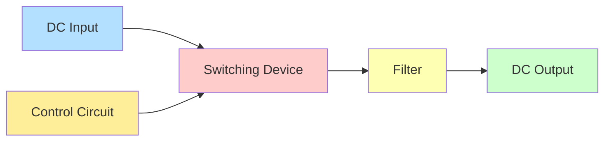

| Parameter | Description | Effect |
|-----------|-------------|--------|
| Duty Cycle (α) | Ratio of ON time to total period | Controls output voltage |
| Switching Frequency | Number of ON/OFF cycles per second | Affects ripple and filter size |
| Chopping Method | Step-up, Step-down, Buck-boost | Determines voltage conversion |
| Control Strategy | PWM, Current mode, etc. | Affects system response |

- **Basic Equation**: Vout = Vin × Duty Cycle (for step-down chopper)
- **Operating Principle**: Rapid switching controls average voltage
- **Advantages**: High efficiency, precise control, compact size
- **Applications**: DC motor drives, battery charging, DC voltage regulation

**Mnemonic:** "DISC" - "Duty cycle Influences Switching to Control output"

## Question 3(c) OR [7 marks]

**Draw the circuit diagram of 3-Φ Full Wave rectifier using diode and explain it's working.**

**Answer**:

**3-Phase Full Wave Diode Rectifier (Bridge Configuration):**

```goat
    D1      D3      D5
    /\      /\      /\
   /  \    /  \    /  \
  /    \  /    \  /    \
R-----+--+------+--+----+----+
      |           |         |
      |           |     +   |
S-----+--+------+--+----| Load |
      |  |      |  |    |   |
      |  |      |  |    +   |
T-----+--+------+--+----+----+
       \/       \/       \/
       D2       D4       D6
```

**Working Principles:**

| Phase | Conduction Pattern | Output Characteristics |
|-------|-------------------|------------------------|
| 0°-60° | D1 and D6 conduct | R and T phases connected to load |
| 60°-120° | D1 and D2 conduct | R and S phases connected to load |
| 120°-180° | D3 and D2 conduct | S and R phases connected to load |
| 180°-240° | D3 and D4 conduct | S and T phases connected to load |
| 240°-300° | D5 and D4 conduct | T and S phases connected to load |
| 300°-360° | D5 and D6 conduct | T and R phases connected to load |

- **Ripple Frequency**: 6 times the input frequency (300/360Hz for 50/60Hz input)
- **Ripple Factor**: Approximately 4.2% (much lower than single-phase)
- **Average Output Voltage**: Vdc = 1.35 × Vrms (line voltage)
- **Conduction Angle**: Each diode conducts for 120° of cycle

**Mnemonic:** "PRESTO" - "Pairs of diodes Rectify Efficiently, Six Times per cycle Output"

## Question 4(a) [3 marks]

**Write the applications of Induction heating.**

**Answer**:

**Applications of Induction Heating:**

| Application Area | Specific Uses | Advantages |
|-----------------|--------------|------------|
| Metal Heat Treatment | Hardening, annealing, tempering | Precise control, localized heating |
| Melting | Foundry operations, precious metals | Clean, efficient melting |
| Welding | Pipe welding, brazing, soldering | Concentrated heat, no contact |
| Forging | Pre-heating billets, hot forming | Rapid heating, energy efficient |
| Domestic | Induction cooktops | Safety, efficiency, control |
| Medical | Hyperthermia treatment | Controlled deep tissue heating |

- **Industrial Advantages**: Fast heating, energy efficiency, clean process
- **Control Benefits**: Precise temperature control, repeatable results
- **Environmental Impact**: Reduced emissions compared to fossil fuel heating
- **Metallurgical Quality**: Improved material properties in many applications

**Mnemonic:** "HAMMER" - "Hardening, Annealing, Melting, Medical, Eddy-current cooking, Reshaping metals"

## Question 4(b) [4 marks]

**Draw and explain the circuit of controlling AC load using TRIAC and DIAC.**

**Answer**:

**AC Load Control with TRIAC and DIAC:**

```goat
      R1          C1
AC o--/\/\/\--+---||---+
              |        |
              |  DIAC  |
              |   |    |
              |   v    |
              +---+----+
              |        |
              | TRIAC  |
              |        |
AC o----------+--------+---o LOAD
```

**Circuit Operation:**

| Component | Function | Effect on Circuit |
|-----------|----------|------------------|
| R1 | Variable resistor | Controls charging rate of C1 |
| C1 | Timing capacitor | Creates phase shift for triggering |
| DIAC | Bi-directional trigger | Provides sharp triggering pulse |
| TRIAC | Power control device | Controls current to load |
| RC Network | Phase-shift network | Determines firing angle |

- **Phase Control**: Adjusting R1 changes phase angle at which DIAC triggers
- **Power Control**: Varying firing angle controls average power to load
- **Bi-directional Control**: Works on both half-cycles of AC input
- **Applications**: Light dimmers, fan speed control, heater control

**Mnemonic:** "CRAFT" - "Capacitor and Resistor Adjust Firing Time"

## Question 4(c) [7 marks]

**Explain Spot Welding with Working and Applications.**

**Answer**:

**Spot Welding Process and Applications:**


**Spot Welding Working Principle:**

| Stage | Process | Parameters |
|-------|---------|------------|
| Setup | Material placed between electrodes | Sheet thickness, material type |
| Contact | Electrodes apply pressure | 200-1000 pounds pressure |
| Current Flow | High current passes through workpiece | 1000-100,000 amperes |
| Heating | Resistance creates localized heating | Temperatures around 2500°F |
| Fusion | Material melts and forms nugget | 0.1-1 seconds duration |
| Cooling | Pressure maintained during cooling | Electrode cooling important |

**Applications of Spot Welding:**

- **Automotive**: Car body assembly, sheet metal joining
- **Electronics**: Battery tabs, small component assembly
- **Appliances**: Refrigerators, washing machines, dishwashers
- **Aerospace**: Aircraft panel assembly, lightweight structures
- **Medical**: Surgical instruments, implantable devices
- **Consumer Products**: Metal furniture, containers, toys

**Mnemonic:** "PCAFRI" - "Position, Compress, Apply current, Form nugget, Release after cooling, Inspect"

## Question 4(a) OR [3 marks]

**Write the applications of Dielectric heating.**

**Answer**:

**Applications of Dielectric Heating:**

| Industry | Applications | Advantages |
|----------|--------------|------------|
| Food Processing | Defrosting, cooking, pasteurization | Uniform heating, speed |
| Wood Industry | Drying, glue curing, delamination | Reduced time, improved quality |
| Textile | Drying yarns, fibers, finished goods | Energy efficiency, speed |
| Plastics | Preheating, molding, welding | Uniform heating, no surface damage |
| Pharmaceutical | Drying, sterilization | Controlled process, speed |
| Paper | Drying, glue setting | Uniform moisture removal |

- **Process Benefits**: Volumetric heating (heats throughout, not just surface)
- **Speed Advantage**: Significantly faster than conventional heating
- **Quality Improvement**: More uniform heating, better product quality
- **Energy Efficiency**: Direct energy transfer to material

**Mnemonic:** "FITPP" - "Food, Insulation drying, Textiles, Plastics, Pharmaceutical products"

## Question 4(b) OR [4 marks]

**Write short note on SCR Delay timer.**

**Answer**:

**SCR Delay Timer:**

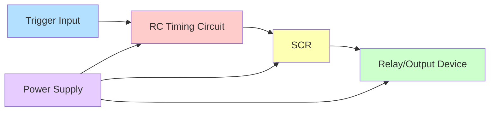

| Component | Function | Selection Criteria |
|-----------|----------|-------------------|
| RC Network | Determines time delay | R×C gives approximate timing |
| SCR | Switching element | Current rating based on load |
| UJT/Trigger | Provides gate pulse | Reliable triggering circuit |
| Output Stage | Controls load | Relay or direct load connection |

- **Timing Principle**: RC charging time determines delay period
- **Accuracy**: Typically ±5-10% of set time
- **Applications**: Industrial process control, sequence control, protection circuits
- **Advantages**: Simple design, reliable operation, cost-effective

**Mnemonic:** "TIME" - "Timing Is Managed by Electronics"

## Question 4(c) OR [7 marks]

**Explain the working of SCR as static switch. Write the advantages of static switch.**

**Answer**:

**SCR as Static Switch:**

```goat
    +------------------+
    |                  |
AC/DC o------+         |
            SCR        LOAD
             |         |
Control o----|         |
    |        |         |
    +--------+---------+
```

**Working Principles:**

| Mode | State | Characteristics |
|------|-------|-----------------|
| OFF State | No gate signal | High impedance, minimal leakage |
| ON State | Gate triggered | Low impedance, high current flow |
| Turn-ON | Gate pulse applied | Fast transition (μs range) |
| Turn-OFF | Current falls below holding | Automatic in AC, needs commutation in DC |

- **DC Operation**: Requires commutation circuit for turn-off
- **AC Operation**: Natural turn-off at zero crossing
- **Control Methods**: Direct gate drive, pulse triggering, opto-isolation
- **Protection**: Requires snubber circuits, current limiting

**Advantages of Static Switches:**

| Advantage | Description | Comparison with Mechanical |
|-----------|-------------|---------------------------|
| No Moving Parts | No mechanical wear or tear | Longer lifetime (millions of operations) |
| Silent Operation | No audible noise during switching | Important in noise-sensitive applications |
| Fast Switching | Microsecond range switching | Much faster than mechanical contacts |
| No Arcing | No contact bounce or arcing | Safer in hazardous environments |
| Size & Weight | Compact and lightweight | Significant space savings |
| EMI/RFI | Less electromagnetic interference | Better for sensitive electronics |

- **Reliability**: Higher MTBF (Mean Time Between Failures)
- **Compatibility**: Works with electronic control systems
- **Voltage Isolation**: Can incorporate opto-isolation
- **Surge Handling**: Better transient protection with proper design

**Mnemonic:** "FANS" - "Fast switching, Arc-free operation, No moving parts, Silent operation"

## Question 5(a) [3 marks]

**What is DC Drive? Give Classification of DC Drives.**

**Answer**:

**DC Drive Definition and Classification:**

| Aspect | Description |
|--------|-------------|
| Definition | Electronic system that controls speed, torque, and direction of DC motors |
| Basic Function | Controls armature voltage and/or field current to regulate motor parameters |

**Classification of DC Drives:**

| Classification Basis | Types | Characteristics |
|---------------------|-------|-----------------|
| Power Rating | Fractional, Integral, High Power | Based on horsepower rating |
| Control Method | Open Loop, Closed Loop | Based on feedback mechanism |
| Quadrant Operation | Single, Two, Four Quadrant | Based on speed/torque direction |
| Power Supply | Single-phase, Three-phase | Based on input power configuration |
| Converter Type | Half-wave, Full-wave, Chopper | Based on power conversion method |
| Application | General Purpose, Servo, Specialized | Based on intended use |

- **Power Range**: From fractional HP to several thousand HP
- **Control Precision**: From basic to high-precision (0.01%)
- **Response Time**: From milliseconds to microseconds
- **Protection**: Various built-in protection features

**Mnemonic:** "PQCAS" - "Power rating, Quadrants, Control type, AC input phases, Switching method"

## Question 5(b) [4 marks]

**Draw and explain the construction of variable reluctance type Stepper motor.**

**Answer**:

**Variable Reluctance Stepper Motor Construction:**

```goat
    +-----------------+
    |                 |
    |     Stator      |
    |    +-------+    |
    |    |       |    |
    |    |Rotor  |    |
    |    |       |    |
    |    +-------+    |
    |                 |
    +-----------------+
```

| Component | Construction | Function |
|-----------|--------------|----------|
| Stator | Laminated steel with multiple poles and windings | Creates magnetic field when energized |
| Rotor | Soft iron with multiple teeth, NO permanent magnets | Aligns with energized stator poles |
| Air Gap | Small space between rotor and stator | Affects step accuracy and torque |
| Windings | Multiple phase windings on stator | Sequential energizing creates rotation |

- **Tooth Configuration**: Typically rotor teeth fewer than stator teeth
- **Step Angle**: Determined by: Step angle = 360° ÷ (Number of rotor teeth × Number of phases)
- **Construction Simplicity**: No permanent magnets or windings on rotor
- **Operating Principle**: Magnetic reluctance path seeks to minimize when phases energized

**Mnemonic:** "STAR" - "Stator energizes, Teeth Align with minimum Reluctance"

## Question 5(c) [7 marks]

**Explain the working of VFD (Variable Frequency Drive).**

**Answer**:

**Variable Frequency Drive (VFD) Working:**

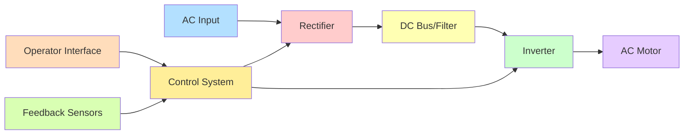

**VFD Components and Functions:**

| Component | Function | Features |
|-----------|----------|----------|
| Rectifier | Converts AC to DC | 6-pulse or 12-pulse designs |
| DC Bus | Filters and stores energy | Capacitors and inductors |
| Inverter | Creates variable frequency AC | IGBT or MOSFET based |
| Control System | Manages overall operation | Microprocessor based |
| HMI | User interface | Display, keypad, communication |
| Protection | System protection | Current, voltage, temperature sensors |

**Working Principles:**

- **Speed Control Equation**: Motor Speed (RPM) = (Frequency × 120) ÷ Number of poles
- **Torque Control**: Maintaining V/F ratio controls torque output
- **Soft Start**: Gradual frequency/voltage ramp-up reduces inrush current
- **Braking Methods**: Regenerative, dynamic, or DC injection braking
- **Energy Savings**: Significant energy savings at reduced speeds
- **Advanced Features**: PID control, network communication, programmable functions

**Mnemonic:** "DRIVE" - "DC conversion, Regulation, Inverter creates, Variable frequency, Efficient motor control"

## Question 5(a) OR [3 marks]

**What are Hall effect sensors and what is their role in DC motors?**

**Answer**:

**Hall Effect Sensors in DC Motors:**

| Aspect | Description |
|--------|-------------|
| Definition | Semiconductor-based sensors that detect magnetic fields |
| Principle | Voltage difference generated perpendicular to current flow in magnetic field |
| Signal Output | Digital (ON/OFF) or analog (proportional to field strength) |
| Size | Compact, can be integrated into motor housing |

**Role in DC Motors:**

| Function | Application | Benefit |
|----------|-------------|---------|
| Position Sensing | Rotor position detection | Precise commutation timing |
| Speed Measurement | Pulse generation for RPM calculation | Accurate speed feedback |
| Direction Detection | Phase sequence monitoring | Rotation direction control |
| Current Sensing | Non-contact current measurement | Overload protection |

- **BLDC Motors**: Critical for electronic commutation (replacing mechanical commutator)
- **Precision**: Higher accuracy than mechanical sensors
- **Reliability**: No mechanical wear, longer service life
- **Integration**: Can be integrated with drive electronics

**Mnemonic:** "MAPS" - "Measures position, Aids commutation, Provides speed data, Senses magnetic fields"

## Question 5(b) OR [4 marks]

**Explain working principle of stepper motor.**

**Answer**:

**Stepper Motor Working Principle:**

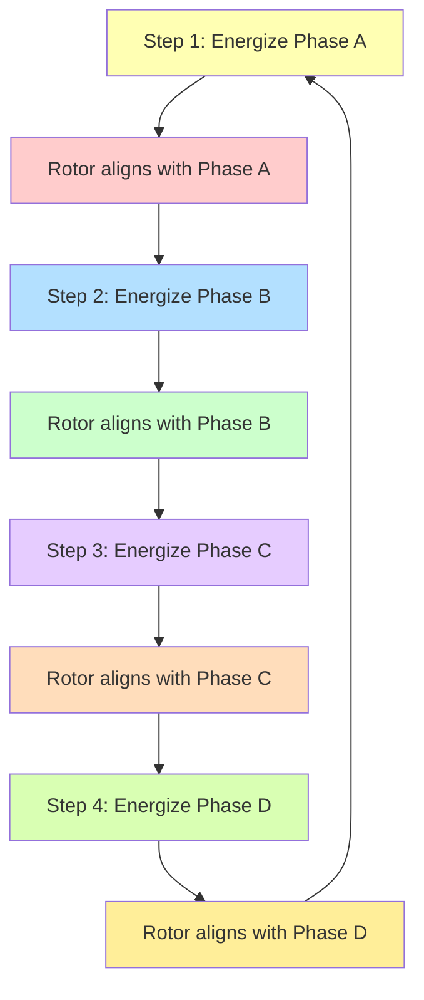

| Operating Mode | Description | Advantages |
|----------------|-------------|------------|
| Full Step | One phase energized at a time | Maximum torque |
| Half Step | Alternating one and two phases energized | Double resolution, smoother |
| Microstepping | Proportional current in phases | Very smooth motion, high resolution |
| Wave Drive | Sequential single phase energization | Lower power consumption |

- **Position Control**: Precise angular positioning without feedback
- **Step Angle**: Common step angles are 1.8° (200 steps/rev) or 0.9° (400 steps/rev)
- **Holding Torque**: Maintains position when phases energized at standstill
- **Open-Loop Control**: No position feedback normally required
- **Speed-Torque**: Torque decreases as speed increases

**Mnemonic:** "STEPS" - "Sequential Triggering of Electromagnetic Phases causes Stepping"

## Question 5(c) OR [7 marks]

**Draw the block diagram of PLC and explain the function of each block.**

**Answer**:

**PLC Block Diagram and Functions:**

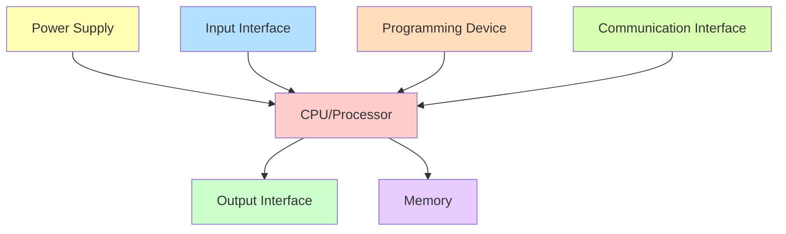

**Functions of Each Block:**

| Block | Function | Characteristics |
|-------|----------|-----------------|
| Power Supply | Converts main power to system voltages | Regulated, protected, with isolation |
| CPU/Processor | Executes program, controls operations | Speed measured in scan time (ms) |
| Input Interface | Connects to sensors and switches | Digital/analog, isolation, filtering |
| Output Interface | Connects to actuators and indicators | Relay/transistor/triac outputs |
| Memory | Stores program and data | Program, data, and system memory areas |
| Programming Device | Used to develop and load programs | PC, handheld programmer, software |
| Communication | Connects to networks/other devices | Industrial protocols, remote I/O |

- **Scan Cycle**: Sequential process of reading inputs, executing program, updating outputs
- **Programming Languages**: Ladder Diagram (LD), Function Block Diagram (FBD), Structured Text (ST), Instruction List (IL), Sequential Function Chart (SFC)
- **Modularity**: Expandable with additional I/O modules
- **Robustness**: Designed for harsh industrial environments
- **Reliability**: Typically MTBF >100,000 hours

**Mnemonic:** "PICO MPC" - "Power, Inputs, CPU, Outputs, Memory, Programming interface, Communication"
