## પ્રશ્ન 1(અ) [3 ગુણ]

**SCR ની રચના દોરો અને સમજાવો.**

**જવાબ**:
SCR (સિલિકોન કંટ્રોલ્ડ રેક્ટિફાયર) એ ચાર-લેયર PNPN સેમિકન્ડક્ટર ડિવાઇસ છે જેમાં ત્રણ ટર્મિનલ્સ છે: એનોડ, કેથોડ અને ગેટ.

**ડાયાગ્રામ:**

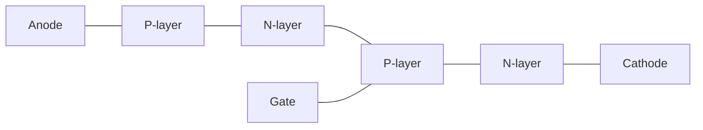

- **P-N-P-N લેયર્સ**: ચાર અલ્ટરનેટિંગ સેમિકન્ડક્ટર લેયર્સ
- **ગેટ ટર્મિનલ**: ડિવાઇસના ટર્ન-ઓન ને નિયંત્રિત કરે છે
- **કરંટ ફ્લો**: ટ્રિગર થવા પર એનોડથી કેથોડ તરફ

**મેમરી ટ્રીક:** "સિલિકોન કંટ્રોલ્સ રેક્ટિફિકેશન" - SCR માત્ર ટ્રિગર થવા પર એક દિશામાં પ્રવાહ નિયંત્રિત કરે છે.

## પ્રશ્ન 1(બ) [4 ગુણ]

**TRIAC ની રચના દોરો અને સમજાવો.**

**જવાબ**:
TRIAC (ટ્રાયોડ ફોર અલ્ટરનેટિંગ કરંટ) એ બાયડાયરેક્શનલ ત્રણ-ટર્મિનલ સેમિકન્ડક્ટર ડિવાઇસ છે જે ટ્રિગર થતાં બંને દિશામાં કન્ડક્ટ કરે છે.

**ડાયાગ્રામ:**


- **બાયડાયરેક્શનલ ઓપરેશન**: ટ્રિગર થવા પર બંને દિશામાં કન્ડક્ટ કરે છે
- **ગેટ કંટ્રોલ**: એક ગેટ બંને દિશામાં કન્ડક્શન નિયંત્રિત કરે છે
- **ઇક્વિવેલન્ટ સર્કિટ**: એન્ટિ-પેરેલલમાં જોડાયેલા બે SCR જેવું કાર્ય કરે છે
- **AC એપ્લિકેશન્સ**: AC પાવર કંટ્રોલ એપ્લિકેશન્સમાં વ્યાપકપણે ઉપયોગ થાય છે

**મેમરી ટ્રીક:** "ટ્રાય-દિશા AC કંટ્રોલર" - AC સર્કિટમાં બંને દિશામાં કરંટ નિયંત્રિત કરે છે.

## પ્રશ્ન 1(ક) [7 ગુણ]

**ઓપ્ટો-આઈસોલેટર, ઓપ્ટો-TRIAC, ઓપ્ટો-SCR, અને ઓપ્ટો-ટ્રાન્ઝિસ્ટરની રચના, કાર્યપદ્ધતિ વર્ણવો અને તેના ઉપયોગો લખો.**

**જવાબ**:
ઓપ્ટો-આઈસોલેટર્સ આઇસોલેટેડ સર્કિટ્સ વચ્ચે ઇલેક્ટ્રિકલ સિગ્નલ્સ ટ્રાન્સફર કરવા માટે પ્રકાશનો ઉપયોગ કરે છે.

**ડાયાગ્રામ:**

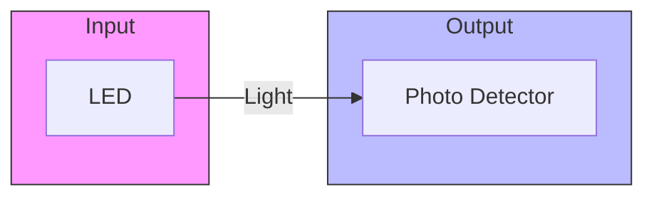

| ડિવાઇસ | રચના | કાર્યપદ્ધતિ | ઉપયોગો |
|--------|--------------|---------|--------------|
| ઓપ્ટો-આઈસોલેટર | LED + ફોટોડિટેક્ટર | જ્યારે ઇનપુટ કરંટ પ્રવાહિત થાય છે ત્યારે LED પ્રકાશ ઉત્સર્જિત કરે છે; ફોટોડિટેક્ટર આઉટપુટ સર્કિટને સક્રિય કરે છે | સિગ્નલ આઇસોલેશન, મેડિકલ ઉપકરણો, ઔદ્યોગિક નિયંત્રણો |
| ઓપ્ટો-TRIAC | LED + ફોટો-TRIAC | LED પ્રકાશ દ્વારા TRIAC ને ટ્રિગર કરે છે; ઇલેક્ટ્રિકલ આઇસોલેશન પ્રદાન કરે છે | AC પાવર કંટ્રોલ, સોલિડ સ્ટેટ રિલે, મોટર કંટ્રોલ |
| ઓપ્ટો-SCR | LED + ફોટો-SCR | LED SCR ને ટ્રિગર કરવા માટે પ્રકાશ ઉત્સર્જિત કરે છે; ઉચ્ચ આઇસોલેશન પ્રદાન કરે છે | DC સ્વિચિંગ, ઔદ્યોગિક નિયંત્રણો, ઉચ્ચ વોલ્ટેજ આઇસોલેશન |
| ઓપ્ટો-ટ્રાન્ઝિસ્ટર | LED + ફોટો-ટ્રાન્ઝિસ્ટર | LED પ્રકાશ ફોટોટ્રાન્ઝિસ્ટરના બેઝ કરંટને નિયંત્રિત કરે છે | એન્કોડર્સ, લેવલ ડિટેક્શન, પોઝિશન સેન્સિંગ |

- **ઇલેક્ટ્રિકલ આઇસોલેશન**: ઇનપુટ અને આઉટપુટ વચ્ચે સંપૂર્ણ અલગતા
- **નોઇઝ ઇમ્યુનિટી**: ઇલેક્ટ્રિકલ નોઇઝ પ્રત્યે ઉચ્ચ પ્રતિરોધ
- **સ્પીડ**: માઇક્રોસેકન્ડ રેન્જમાં રિસ્પોન્સ ટાઇમ

**મેમરી ટ્રીક:** "LOST" - Light Operates Semiconductor Terminals બધા ઓપ્ટો-ડિવાઇસમાં.

## પ્રશ્ન 1(ક) OR [7 ગુણ]

**બે ટ્રાન્ઝીસ્ટર એનાલોગી વડે SCRનું કાર્ય સમજાવો અને SCRનાં ઇન્ડસ્ટ્રીયલ ઉપયોગો લખો.**

**જવાબ**:
SCR ને બે ઇન્ટરકનેક્ટેડ ટ્રાન્ઝિસ્ટર તરીકે મોડેલ કરી શકાય છે: PNP (T1) અને NPN (T2).

**ડાયાગ્રામ:**

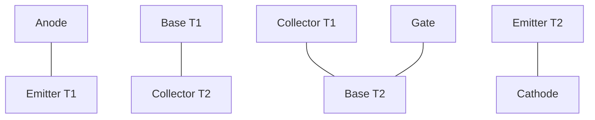

**કાર્ય સિદ્ધાંત:**

| સ્ટેપ | ઓપરેશન |
|------|-----------|
| પ્રારંભિક સ્થિતિ | બંને ટ્રાન્ઝિસ્ટર OFF હોય છે |
| ગેટ ટ્રિગરિંગ | ગેટમાં (T2ના B2માં) કરંટ ઇન્જેક્ટ કરવામાં આવે છે |
| રિજનરેટિવ એક્શન | T2 ON થાય છે → T1 બેઝને કરંટ મળે છે → T1 ON થાય છે → T2 બેઝને વધુ કરંટ મળે છે |
| લેચિંગ | ગેટ સિગ્નલ દૂર કરવામાં આવે તો પણ સ્વ-ટકાઉ કરંટ પ્રવાહ ચાલુ રહે છે |

**SCRના ઔદ્યોગિક ઉપયોગો:**

- **પાવર કંટ્રોલ**: AC/DC મોટર સ્પીડ કંટ્રોલ
- **સ્વિચિંગ**: સ્ટેટિક સ્વિચ, સોલિડ-સ્ટેટ રિલે 
- **ઇન્વર્ટર**: DC થી AC રૂપાંતર
- **પ્રોટેક્શન**: ઓવરવોલ્ટેજ પ્રોટેક્શન સર્કિટ
- **લાઇટિંગ**: લાઇટ ડિમર, ઇલ્યુમિનેશન કંટ્રોલ

**મેમરી ટ્રીક:** "POWER" - Power control, Overvoltage protection, Welding machines, Electronic converters, Regulated supplies.

## પ્રશ્ન 2(અ) [3 ગુણ]

**એસ.સી.આર માં ટ્રિગરીંગ વ્યાખ્યાયીત કરી.કોઈ પણ બે ટ્રિગરીંગ ટેકનિક સમજાવો.**

**જવાબ**:
ટ્રિગરિંગ એ SCRને તેના ગેટ ટર્મિનલ પર યોગ્ય સિગ્નલ લાગુ કરીને ON કરવાની પ્રક્રિયા છે.

**બે ટ્રિગરિંગ ટેકનિક:**

| ટેકનિક | વિગત |
|-----------|-------------|
| ગેટ ટ્રિગરિંગ | ગેટ-કેથોડ સર્કિટમાં ડાયરેક્ટ કરંટ પલ્સ આપવામાં આવે છે |
| લાઇટ ટ્રિગરિંગ | જંક્શન પર અથડાતા ફોટોન્સ કન્ડક્શન માટે ઊર્જા આપે છે |

- **ગેટ ટ્રિગરિંગ**: ઇલેક્ટ્રિકલ પલ્સનો ઉપયોગ કરતી સૌથી સામાન્ય પદ્ધતિ
- **લાઇટ ટ્રિગરિંગ**: ફોટોસેન્સિટિવ સેમિકન્ડક્ટર ગુણધર્મોનો ઉપયોગ કરે છે

**મેમરી ટ્રીક:** "GET" - Gate Electrical Triggering સૌથી સામાન્ય પદ્ધતિ છે.

## પ્રશ્ન 2(બ) [4 ગુણ]

**ફોર્સ્ડ કોમ્યુટેશન અને નેચરલ કોમ્યુટેશન વચ્ચેનો તફાવત લખો.**

**જવાબ**:

| પેરામીટર | ફોર્સ્ડ કોમ્યુટેશન | નેચરલ કોમ્યુટેશન |
|-----------|-------------------|---------------------|
| વ્યાખ્યા | એક્સટર્નલ સર્કિટરી SCRને ફોર્સ કરીને OFF કરે છે | કરંટ હોલ્ડિંગ વેલ્યુથી નીચે જતાં SCR કુદરતી રીતે OFF થાય છે |
| એપ્લિકેશન | DC સર્કિટ્સ | AC સર્કિટ્સ |
| કોમ્પોનન્ટ્સ | વધારાના કોમ્પોનન્ટ્સની જરૂર પડે છે (કેપેસિટર, ઇન્ડક્ટર) | કોઈ વધારાના કોમ્પોનન્ટ્સની જરૂર નથી |
| જટિલતા | જટિલ સર્કિટ ડિઝાઇન | સરળ સર્કિટ ડિઝાઇન |
| ઊર્જા | ટર્ન-ઓફ માટે બાહ્ય ઊર્જાની જરૂર પડે છે | કોઈ બાહ્ય ઊર્જાની જરૂર નથી |

- **ફોર્સ્ડ કોમ્યુટેશન**: બાહ્ય સર્કિટનો ઉપયોગ કરીને SCRને સક્રિયપણે બંધ કરે છે
- **નેચરલ કોમ્યુટેશન**: જ્યારે AC કરંટ શૂન્ય ક્રોસ કરે છે ત્યારે SCR બંધ થાય છે

**મેમરી ટ્રીક:** "FACE" - Forced Active Commutation requires External components.

## પ્રશ્ન 2(ક) [7 ગુણ]

**SCR માટે સ્નબર સર્કિટ ડીઝાઈન કરો.**

**જવાબ**:
સ્નબર સર્કિટ SCRને ઊંચા dV/dt થી રક્ષણ આપે છે અને વોલ્ટેજ વૃદ્ધિના દરને મર્યાદિત કરે છે.

**ડાયાગ્રામ:**

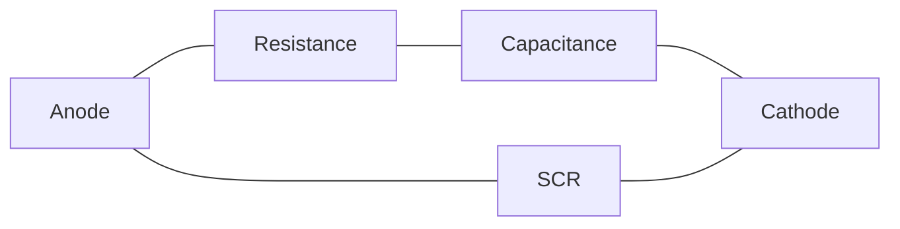

**ડિઝાઇન સ્ટેપ્સ:**

| સ્ટેપ | ગણતરી |
|------|-------------|
| 1. dV/dt રેટિંગની ગણતરી કરો | ડેટાશીટમાંથી (V/μs) |
| 2. R વેલ્યુ નક્કી કરો | R = V₁/IL જ્યાં V₁ એ સપ્લાય વોલ્ટેજ અને IL એ લોડ કરંટ છે |
| 3. C વેલ્યુ નક્કી કરો | C = 1/(R × (dV/dt)max) |
| 4. RC ટાઇમ કોન્સ્ટન્ટ | τ = R × C (SCR ટર્ન-ઓફ ટાઇમ કરતાં વધારે હોવું જોઈએ) |

- **રેઝિસ્ટન્સ R**: કેપેસિટરના ડિસ્ચાર્જ કરંટને મર્યાદિત કરે છે
- **કેપેસિટન્સ C**: ટ્રાન્ઝિયન્ટ એનર્જીને શોષે છે અને dV/dt ને મર્યાદિત કરે છે
- **પ્રોટેક્શન**: ખોટા ટ્રિગરિંગ અને નુકસાનને રોકે છે
- **પાવર રેટિંગ**: R પાસે પૂરતી પાવર રેટિંગ હોવી જોઈએ

**મેમરી ટ્રીક:** "RCSS" - Resistance-Capacitance Saves Silicon from Stress.

## પ્રશ્ન 2(અ) OR [3 ગુણ]

**એસ.સી.આર માટેનું ક્લાસ-ઈ કોમ્યુટેશન સમજાવો.**

**જવાબ**:
કોમ્યુટેશન એ SCRના એનોડ કરંટને હોલ્ડિંગ કરંટ લેવલથી નીચે ઘટાડીને તેને OFF કરવાની પ્રક્રિયા છે.

**ક્લાસ-E કોમ્યુટેશન:**

**ડાયાગ્રામ:**

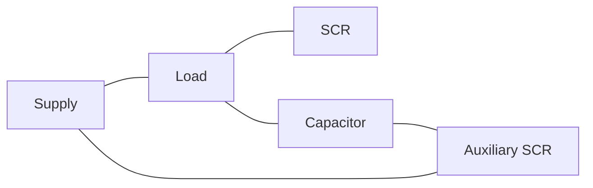

- **ઓક્ઝિલરી SCR**: કોમ્યુટેશન પ્રક્રિયાને નિયંત્રિત કરે છે
- **રેઝોનન્ટ સર્કિટ**: LC રેઝોનન્ટ સર્કિટ બનાવે છે
- **ઓપરેશન**: ઓક્ઝિલરી SCR મેઇન SCRને રિવર્સ-બાયસ કરવા માટે કેપેસિટર ડિસ્ચાર્જને ટ્રિગર કરે છે
- **એપ્લિકેશન**: ઇન્વર્ટર અને ચોપરમાં ઉપયોગ થાય છે

**મેમરી ટ્રીક:** "ACE" - Auxiliary Capacitor Extinguishes conduction.

## પ્રશ્ન 2(બ) OR [4 ગુણ]

**થાઈરિસ્ટરનું ટ્રિગરીંગ વિગતવાર સમજાવો.**

**જવાબ**:

| ટ્રિગરિંગ મેથડ | કાર્ય સિદ્ધાંત |
|-------------------|-------------------|
| ગેટ ટ્રિગરિંગ | ગેટ અને કેથોડ વચ્ચે ઇલેક્ટ્રિકલ પલ્સ આપવામાં આવે છે |
| તાપમાન ટ્રિગરિંગ | જંક્શન તાપમાન ટર્ન-ઓન થવા માટે વધે છે |
| લાઇટ ટ્રિગરિંગ | ફોટોન્સ જંક્શન પર ઇલેક્ટ્રોન-હોલ જોડી બનાવે છે |
| dV/dt ટ્રિગરિંગ | ઝડપી વોલ્ટેજ વૃદ્ધિ કેપેસિટિવ કરંટ પ્રવાહ થવા માટે કારણભૂત છે |
| ફોરવર્ડ વોલ્ટેજ ટ્રિગરિંગ | બ્રેકઓવર વોલ્ટેજને વટાવવાથી એવેલાન્ચ કન્ડક્શન થાય છે |

- **ગેટ ટ્રિગરિંગ**: સૌથી સામાન્ય અને નિયંત્રિત પદ્ધતિ
- **પેરામીટર કંટ્રોલ**: પલ્સ પહોળાઈ, એમ્પ્લિટ્યુડ અને રાઈઝ ટાઈમ
- **ગેટ સેન્સિટિવિટી**: તાપમાન સાથે બદલાય છે
- **પ્રોટેક્શન**: અનિચ્છનીય ટ્રિગરિંગથી રક્ષણ જરૂરી છે

**મેમરી ટ્રીક:** "VITAL" - Voltage, Illumination, Temperature And Level બધી ટ્રિગરિંગ પદ્ધતિઓ છે.

## પ્રશ્ન 2(ક) OR [7 ગુણ]

**એસ.સી.આર ને ઓવર વૉલ્ટેજ અને ઓવર કરંટ થી બચાવવા માટેની મેથડ વિગતવાર સમજાવો.**

**જવાબ**:

**ઓવરવોલ્ટેજ પ્રોટેક્શન:**

**ડાયાગ્રામ:**

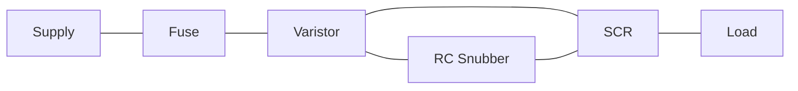

| પ્રોટેક્શન મેથડ | કાર્ય સિદ્ધાંત |
|-------------------|-------------------|
| RC સ્નબર સર્કિટ | વોલ્ટેજના ઉછાળાનો દર (dV/dt) મર્યાદિત કરે છે |
| વોલ્ટેજ ક્લેમ્પિંગ | જેનર ડાયોડ અથવા MOVsનો ઉપયોગ કરીને મહત્તમ વોલ્ટેજ મર્યાદિત કરે છે |
| ક્રોબાર પ્રોટેક્શન | વોલ્ટેજ થ્રેશોલ્ડને વટાવે ત્યારે જાણીજોઈને શોર્ટ-સર્કિટ કરે છે |

**ઓવરકરંટ પ્રોટેક્શન:**

**ડાયાગ્રામ:**


| પ્રોટેક્શન મેથડ | કાર્ય સિદ્ધાંત |
|-------------------|-------------------|
| ફ્યુઝ/સર્કિટ બ્રેકર | ફોલ્ટ સ્થિતિઓ દરમિયાન સર્કિટને ડિસ્કનેક્ટ કરે છે |
| કરંટ લિમિટિંગ રિએક્ટર | ફોલ્ટ કરંટની માત્રા મર્યાદિત કરે છે |
| ઇલેક્ટ્રોનિક કરંટ લિમિટિંગ | સેન્સિંગ અને કંટ્રોલ સર્કિટ્સ કરંટને મર્યાદિત કરે છે |

- **કોઓર્ડિનેશન**: પ્રોટેક્શન ડિવાઇસ સંકલનમાં કામ કરવી જોઈએ
- **રિસ્પોન્સ ટાઇમ**: અસરકારક સુરક્ષા માટે મહત્વપૂર્ણ છે
- **મલ્ટીપલ લેયર્સ**: ક્રિટિકલ એપ્લિકેશન માટે, કેટલીક પદ્ધતિઓને સંયોજિત કરવામાં આવે છે

**મેમરી ટ્રીક:** "SCOPE" - Snubbers, Clamps, Overload sensors, Protectors, and Electronic limiters.

## પ્રશ્ન 3(અ) [3 ગુણ]

**સિંગલ ફેઝ રેક્ટિફાયર અને થ્રી ફેઝ રેક્ટિફાયર વચ્ચેનો તફાવત લખો.**

**જવાબ**:

| પેરામીટર | સિંગલ ફેઝ રેક્ટિફાયર | પોલી ફેઝ રેક્ટિફાયર |
|-----------|------------------------|----------------------|
| ઇનપુટ | સિંગલ ફેઝ AC સપ્લાય | મલ્ટીપલ ફેઝ (સામાન્ય રીતે 3-ફેઝ) AC સપ્લાય |
| આઉટપુટ રિપલ | ઊંચી રિપલ સામગ્રી | નીચી રિપલ સામગ્રી |
| કાર્યક્ષમતા | ઓછી કાર્યક્ષમતા | ઊંચી કાર્યક્ષમતા |
| પાવર રેટિંગ | ઓછા પાવર એપ્લિકેશન માટે યોગ્ય | ઊંચા પાવર એપ્લિકેશન માટે યોગ્ય |
| ટ્રાન્સફોર્મર ઉપયોગિતા | ઓછો ઉપયોગિતા ફેક્ટર | ઊંચો ઉપયોગિતા ફેક્ટર |

- **રિપલ ફેક્ટર**: સિંગલ ફેઝમાં પોલી ફેઝની તુલનામાં ઊંચી રિપલ હોય છે
- **ફોર્મ ફેક્ટર**: પોલી ફેઝ સિસ્ટમમાં વધુ સારો
- **સાઇઝ/વજન**: પોલી ફેઝ સિસ્ટમમાં વધુ સારો પાવર/વજન રેશિયો હોય છે

**મેમરી ટ્રીક:** "PERCH" - Poly phase has Efficiency, Ripple improvement, Capacity, and Higher ratings.

## પ્રશ્ન 3(બ) [4 ગુણ]

**થ્રી ફેઝ હાફ વેવ રેક્ટિફાયર નો સર્કિટ ડાયગ્રામ દોરી તેની કાર્યપદ્ધતિ સમજાવો.**

**જવાબ**:
થ્રી-ફેઝ હાફ-વેવ રેક્ટિફાયર ત્રણ ડાયોડનો ઉપયોગ કરીને થ્રી-ફેઝ ACને પલ્સેટિંગ DCમાં રૂપાંતરિત કરે છે.

**ડાયાગ્રામ:**

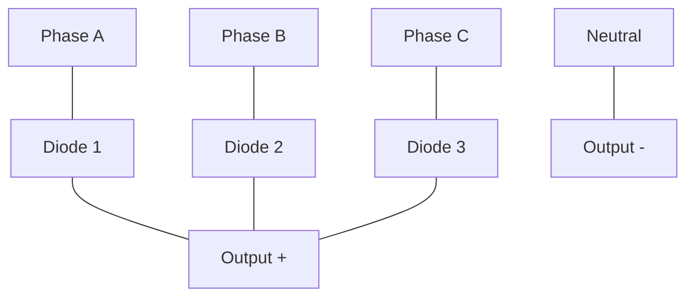

**કાર્યપદ્ધતિ:**

- દરેક ડાયોડ ત્યારે કન્ડક્ટ કરે છે જ્યારે તેનું ફેઝ વોલ્ટેજ સૌથી વધુ પોઝિટિવ હોય છે
- દરેક ડાયોડનો કન્ડક્શન એંગલ 120° છે
- રિપલ ફ્રિક્વન્સી ઇનપુટ ફ્રિક્વન્સીની 3 ગણી છે
- એવરેજ આઉટપુટ વોલ્ટેજ = 3Vm/2π (જ્યાં Vm પીક ફેઝ વોલ્ટેજ છે)
- રિપલ ફેક્ટર = 0.17 (સિંગલ-ફેઝ હાફ-વેવ કરતાં ઘણો ઓછો)

**મેમરી ટ્રીક:** "THREE-D" - THREE Diodes ક્રમશઃ કન્ડક્ટ કરે છે.

## પ્રશ્ન 3(ક) [7 ગુણ]

**બ્લોક ડાયાગ્રામની મદદથી યુપીએસ અને એસએમપીએસની કામગીરીનું વર્ણન કરો.**

**જવાબ**:

**UPS (અનઇન્ટેરપ્ટેબલ પાવર સપ્લાય):**

**ડાયાગ્રામ:**

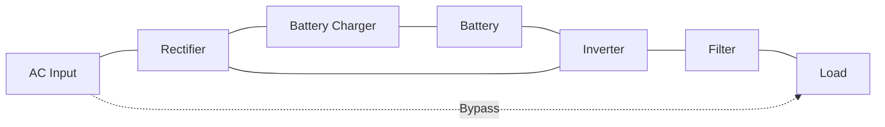

| બ્લોક | કાર્ય |
|-------|----------|
| રેક્ટિફાયર | બેટરી ચાર્જિંગ અને ઇન્વર્ટર માટે ACને DCમાં રૂપાંતરિત કરે છે |
| બેટરી | પાવર ફેલ્યોર દરમિયાન બેકઅપ માટે ઊર્જા સંગ્રહ કરે છે |
| ઇન્વર્ટર | લોડને પાવર આપવા માટે DCને ACમાં રૂપાંતરિત કરે છે |
| ફિલ્ટર | આઉટપુટ વેવફોર્મને સુવ્યવસ્થિત કરે છે |
| બાયપાસ | મેઇન્ટેનન્સ દરમિયાન ડાયરેક્ટ AC પ્રદાન કરે છે |

**SMPS (સ્વિચ્ડ મોડ પાવર સપ્લાય):**

**ડાયાગ્રામ:**

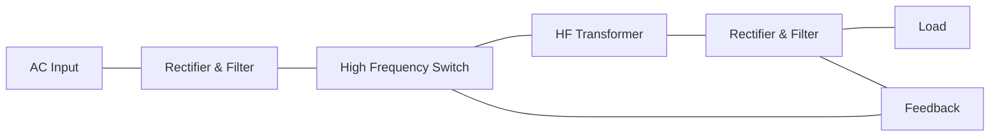

| બ્લોક | કાર્ય |
|-------|----------|
| રેક્ટિફાયર & ફિલ્ટર | ACને અનરેગ્યુલેટેડ DCમાં રૂપાંતરિત કરે છે |
| હાઇ ફ્રિક્વન્સી સ્વિચ | DCને હાઇ-ફ્રિક્વન્સી પલ્સમાં વિભાજિત કરે છે |
| HF ટ્રાન્સફોર્મર | આઇસોલેશન અને વોલ્ટેજ ટ્રાન્સફોર્મેશન પ્રદાન કરે છે |
| આઉટપુટ રેક્ટિફાયર & ફિલ્ટર | હાઇ-ફ્રિક્વન્સી ACને સ્મૂથ DCમાં રૂપાંતરિત કરે છે |
| ફીડબેક સર્કિટ | સ્વિચને નિયંત્રિત કરીને આઉટપુટ વોલ્ટેજને નિયંત્રિત કરે છે |

- **UPS કાર્યક્ષમતા**: 80-90%, બેકઅપ પાવર પ્રદાન કરે છે
- **SMPS કાર્યક્ષમતા**: 70-90%, લિનિયર સપ્લાય કરતાં ઘણી નાની
- **નિયમન**: બંને નિયંત્રિત આઉટપુટ વોલ્ટેજ પ્રદાન કરે છે

**મેમરી ટ્રીક:** "BRIEF" - Battery backup, Rectification, Inversion, Efficient switching, Feedback control.

## પ્રશ્ન 3(અ) OR [3 ગુણ]

**ચોપર સર્કિટના સિદ્ધાંત અને કાર્યને સમજાવો.**

**જવાબ**:
ચોપર એ DC-થી-DC કન્વર્ટર છે જે ફિક્સ્ડ DC ઇનપુટ વોલ્ટેજને વેરિએબલ DC આઉટપુટ વોલ્ટેજમાં રૂપાંતરિત કરે છે.

**ડાયાગ્રામ:**


**સિદ્ધાંત:**

- સ્વિચ (સામાન્ય રીતે SCR, MOSFET, અથવા IGBT) ઝડપથી સ્રોતને લોડ સાથે જોડે છે અને અલગ કરે છે
- આઉટપુટ વોલ્ટેજ ડ્યુટી સાયકલ દ્વારા નિયંત્રિત થાય છે (ON સમય / કુલ સમય)
- સરેરાશ આઉટપુટ વોલ્ટેજ = ઇનપુટ વોલ્ટેજ × ડ્યુટી સાયકલ

- **ટાઇમ રેશિયો કંટ્રોલ**: ફ્રિક્વન્સી સ્થિર રાખીને ડ્યુટી સાયકલ બદલે છે
- **ફ્રિક્વન્સી મોડ્યુલેશન**: ON સમય સ્થિર રાખીને ફ્રિક્વન્સી બદલે છે
- **એપ્લિકેશન**: DC મોટર કંટ્રોલ, બેટરી-પાવર્ડ વાહનો

**મેમરી ટ્રીક:** "CHOP" - Control High-speed Operation with Pulses.

## પ્રશ્ન 3(બ) OR [4 ગુણ]

**સિંગલ-ફેઝ અને પોલી-ફેઝ રેક્ટિફાયર સર્કિટની તુલના કરો.**

**જવાબ**:

| પેરામીટર | સિંગલ-ફેઝ રેક્ટિફાયર | પોલી-ફેઝ રેક્ટિફાયર |
|-----------|------------------------|----------------------|
| સપ્લાય | સિંગલ-ફેઝ AC | ત્રણ અથવા વધુ ફેઝ AC |
| આઉટપુટ વેવફોર્મ | વધુ પલ્સેટિંગ | સ્મૂધર (ઓછું પલ્સેટિંગ) |
| રિપલ કન્ટેન્ટ | ઊંચી (ફુલ વેવ માટે 0.48) | નીચી (3-ફેઝ ફુલ વેવ માટે 0.042) |
| ફિલ્ટરિંગ | વધુ ફિલ્ટરિંગની જરૂર | ઓછા ફિલ્ટરિંગની જરૂર |
| પાવર હેન્ડલિંગ | મર્યાદિત પાવર હેન્ડલિંગ | ઊંચુ પાવર હેન્ડલિંગ |
| ટ્રાન્સફોર્મર ઉપયોગિતા | 0.812 (ફુલ વેવ) | 0.955 (3-ફેઝ ફુલ વેવ) |
| કાર્યક્ષમતા | નીચી | ઊંચી |
| સાઇઝ | સમાન પાવર માટે નાની | ઊંચા પાવર માટે વધુ કોમ્પેક્ટ |

- **હાર્મોનિક કન્ટેન્ટ**: પોલી-ફેઝ સિસ્ટમમાં નીચી
- **TUF (ટ્રાન્સફોર્મર ઉપયોગિતા ફેક્ટર)**: પોલી-ફેઝ સિસ્ટમમાં ઊંચી
- **કોસ્ટ-ઇફેક્ટિવનેસ**: ઊંચા પાવર માટે પોલી-ફેઝ વધુ આર્થિક

**મેમરી ટ્રીક:** "PERIPHERY" - Poly-phase Efficiency Ripple Improvement Power Handling Economy Rating Yield.

## પ્રશ્ન 3(ક) OR [7 ગુણ]

**બ્લોક ડાયાગ્રામની મદદથી સૌર ફોટોવોલ્ટેઇક (PV) આધારિત પાવર જનરેશનની કામગીરીનું વર્ણન કરો.**

**જવાબ**:
સોલર PV પાવર જનરેશન સેમિકન્ડક્ટર મટીરિયલનો ઉપયોગ કરીને સૂર્યપ્રકાશને સીધો ઇલેક્ટ્રિસિટીમાં રૂપાંતરિત કરે છે.

**ડાયાગ્રામ:**

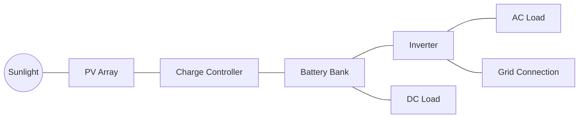

| કોમ્પોનન્ટ | કાર્ય |
|-----------|----------|
| PV એરે | ફોટોવોલ્ટેઇક ઇફેક્ટ દ્વારા સૌર ઊર્જાને DC ઇલેક્ટ્રિસિટીમાં રૂપાંતરિત કરે છે |
| ચાર્જ કંટ્રોલર | બેટરી ચાર્જિંગને નિયંત્રિત કરે છે અને ઓવરચાર્જિંગને રોકે છે |
| બેટરી બેંક | રાત્રે અથવા વાદળી સ્થિતિઓ દરમિયાન ઉપયોગ માટે ઊર્જા સંગ્રહિત કરે છે |
| ઇન્વર્ટર | AC લોડને પાવર આપવા માટે DCને ACમાં રૂપાંતરિત કરે છે |
| ગ્રિડ કનેક્શન | વધારાના પાવરને ગ્રિડમાં ફીડ કરવા માટે વૈકલ્પિક કનેક્શન |

**કાર્ય સિદ્ધાંત:**

- **ફોટોવોલ્ટેઇક ઇફેક્ટ**: સૂર્યપ્રકાશના ફોટોન્સ સેમિકન્ડક્ટરમાં ઇલેક્ટ્રોન્સને મુક્ત કરે છે
- **સેલ સ્ટ્રક્ચર**: P-N જંક્શન ઇલેક્ટ્રિક ફિલ્ડ બનાવે છે
- **વોલ્ટેજ જનરેશન**: ટિપિકલ સેલ 0.5-0.6V DC ઉત્પન્ન કરે છે
- **એરે કોન્ફિગરેશન**: ઇચ્છિત વોલ્ટેજ/કરંટ માટે સીરીઝ-પેરેલલ કનેક્શન

- **કાર્યક્ષમતા**: સામાન્ય રીતે કોમર્શિયલ પેનલ માટે 15-22%
- **એપ્લિકેશન**: રેસિડેન્શિયલ, કોમર્શિયલ, ઔદ્યોગિક પાવર જનરેશન

**મેમરી ટ્રીક:** "SOLAR" - Semiconductors Oriented Light-to-electricity Array Regulation.

## પ્રશ્ન 4(અ) [3 ગુણ]

**સ્ટેટિક સ્વીચના ફાયદા લખો.**

**જવાબ**:

| સ્ટેટિક સ્વીચના ફાયદા |
|-----------------------------|
| કોઈ મૂવિંગ પાર્ટ્સ નથી - ઊંચી વિશ્વસનીયતા |
| સાયલેન્ટ ઓપરેશન |
| ફાસ્ટ સ્વિચિંગ રિસ્પોન્સ (માઇક્રોસેકન્ડ) |
| લાંબી ઓપરેશનલ લાઇફ |
| કોઈ કોન્ટેક્ટ બાઉન્સ અથવા આર્કિંગ નથી |
| કોમ્પેક્ટ સાઇઝ |
| ડિજિટલ કંટ્રોલ સિસ્ટમ સાથે સુસંગત |
| ઓછી મેઇન્ટેનન્સ આવશ્યકતાઓ |

- **વિશ્વસનીયતા**: કોઈ મિકેનિકલ ઘસારો નથી 
- **સ્પીડ**: મિકેનિકલ સ્વિચ કરતાં ઘણી ઝડપી
- **આઇસોલેશન**: ઇલેક્ટ્રિકલ આઇસોલેશન પ્રદાન કરી શકે છે

**મેમરી ટ્રીક:** "SAFE" - Speed, Arc-free, Fast response, Endurance.

## પ્રશ્ન 4(બ) [4 ગુણ]

**DIAC-TRIAC નો ઉપયોગ કરીને A.C. પાવર કંટ્રોલનો સર્કિટ ડાયાગ્રામ દોરો અને તેને સમજાવો.**

**જવાબ**:
DIAC-TRIAC સર્કિટ રેઝિસ્ટિવ અને ઇન્ડક્ટિવ લોડ માટે સ્મૂથ AC પાવર કંટ્રોલ પ્રદાન કરે છે.

**ડાયાગ્રામ:**

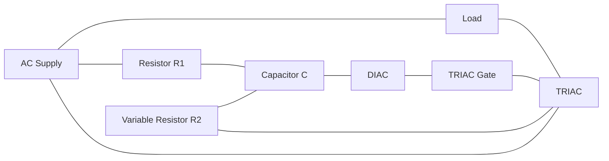

**કાર્યપદ્ધતિ:**

- વેરિએબલ રેઝિસ્ટર R2 કેપેસિટર Cના ચાર્જિંગ રેટને નિયંત્રિત કરે છે
- જ્યારે કેપેસિટર વોલ્ટેજ DIAC બ્રેકઓવર વોલ્ટેજ પર પહોંચે છે, ત્યારે DIAC કન્ડક્ટ કરે છે
- DIAC TRIAC ગેટને ટ્રિગર પલ્સ આપે છે
- TRIAC બાકીના હાફ-સાયકલ માટે કન્ડક્ટ કરે છે
- પ્રક્રિયા બંને હાફ-સાયકલ માટે પુનરાવર્તિત થાય છે

- **ફેઝ કંટ્રોલ**: ફાયરિંગ એન્ગલ બદલીને પાવર નિયંત્રિત કરે છે
- **એપ્લિકેશન**: લાઇટ ડિમર્સ, હીટર કંટ્રોલ, મોટર સ્પીડ કંટ્રોલ
- **પાવર રેન્જ**: લગભગ-શૂન્યથી પૂર્ણ પાવર સુધી નિયંત્રિત કરી શકે છે

**મેમરી ટ્રીક:** "DIRECT" - DIAC Initiates Regulated Energy Control in TRIAC.

## પ્રશ્ન 4(ક) [7 ગુણ]

**ટ્રિગરિંગ સર્કિટમાં UJT સાથે SCR નો ઉપયોગ કરીને DC પાવર કંટ્રોલ સર્કિટના કાર્યનું વર્ણન કરો**

**જવાબ**:
UJT-ટ્રિગર્ડ SCR સર્કિટ લોડમાં DC પાવરનું ચોક્કસ નિયંત્રણ પ્રદાન કરે છે.

**ડાયાગ્રામ:**

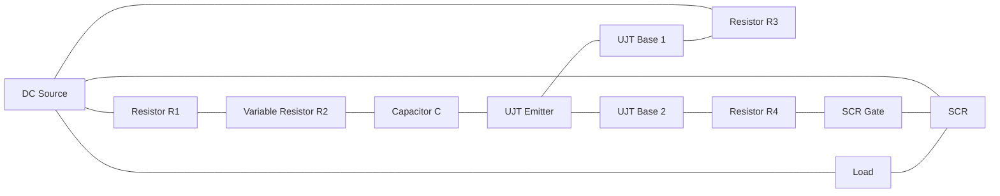

**કાર્ય સિદ્ધાંત:**

| સ્ટેજ | ઓપરેશન |
|-------|-----------|
| ચાર્જિંગ | R1 અને R2 કેપેસિટર Cના ચાર્જિંગ રેટને નિયંત્રિત કરે છે |
| UJT ફાયરિંગ | જ્યારે કેપેસિટર વોલ્ટેજ UJT ફાયરિંગ લેવલ પર પહોંચે, ત્યારે UJT કન્ડક્ટ કરે છે |
| પલ્સ જનરેશન | UJT R4 પર શાર્પ ટ્રિગર પલ્સ જનરેટ કરે છે |
| SCR ટ્રિગરિંગ | પલ્સ SCR ગેટને ટ્રિગર કરે છે, SCRને ON કરી દે છે |
| પાવર કંટ્રોલ | વેરિએબલ રેઝિસ્ટર R2 ટાઈમિંગને એડજસ્ટ કરે છે, એવરેજ પાવરને કંટ્રોલ કરે છે |

- **ચોક્કસ કંટ્રોલ**: UJT સ્થિર, અનુમાનિત ટ્રિગરિંગ પ્રદાન કરે છે
- **એપ્લિકેશન**: બેટરી ચાર્જર, DC મોટર સ્પીડ કંટ્રોલ, તાપમાન નિયંત્રણ
- **ફાયદા**: ઓછી કિંમત, ઉચ્ચ વિશ્વસનીયતા, સારી તાપમાન સ્થિરતા
- **કંટ્રોલ રેન્જ**: લગભગ-શૂન્યથી પૂર્ણ પાવર સુધીની વિશાળ રેન્જ

**મેમરી ટ્રીક:** "SCRUP" - SCR Using Pulse from UJT for Power control.

## પ્રશ્ન 4(અ) OR [3 ગુણ]

**ડાઈ-ઈલેક્ટ્રીક હિટીંગના ઉપયોગો વર્ણવો.**

**જવાબ**:

| ડાઈલેક્ટ્રિક હિટીંગના ઉપયોગો |
|-----------------------------------|
| પ્લાસ્ટિક વેલ્ડિંગ અને સીલિંગ |
| લાકડાના ગ્લુઇંગ અને ક્યુરિંગ |
| ફૂડ પ્રોસેસિંગ (પ્રી-કુકિંગ, ડિફ્રોસ્ટિંગ) |
| ટેક્સટાઇલ ડ્રાઇંગ અને પ્રોસેસિંગ |
| પેપર અને બોર્ડ ડ્રાઇંગ |
| ફાર્માસ્યુટિકલ પ્રોડક્ટ્સ ડ્રાઇંગ |
| મેડિકલ એપ્લિકેશન (હાઇપરથર્મિયા ટ્રીટમેન્ટ) |
| રબર વલ્કેનાઇઝેશન |

- **મટીરિયલ રિક્વાયરમેન્ટ**: પોલર મોલેક્યુલ્સ ધરાવતા નબળા કન્ડક્ટર્સ સાથે શ્રેષ્ઠ કામ કરે છે
- **ફ્રિક્વન્સી રેન્જ**: સામાન્ય રીતે 10-100 MHz
- **ફાયદા**: યુનિફોર્મ હીટિંગ, ઝડપી પ્રોસેસિંગ, ઊર્જા કાર્યક્ષમતા

**મેમરી ટ્રીક:** "POWER" - Plastics, Organics, Wood, Edibles, and Rubber processing.

## પ્રશ્ન 4(બ) OR [4 ગુણ]

**ત્રણ તબક્કાના IC555 ટાઈમર સર્કિટ દોરો અને સમજાવો.**

**જવાબ**:
ત્રણ-સ્ટેજ IC555 ટાઈમર સર્કિટ સિક્વેન્શિયલ ટાઈમિંગ ઓપરેશન્સ પ્રદાન કરે છે.

**ડાયાગ્રામ:**

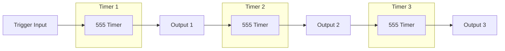

**કાર્યપદ્ધતિ:**

- પ્રથમ ટાઈમર બાહ્ય ટ્રિગર દ્વારા સક્રિય થાય છે
- પ્રથમ ટાઈમરનો આઉટપુટ બીજા ટાઈમરને ટ્રિગર કરે છે
- બીજા ટાઈમરનો આઉટપુટ ત્રીજા ટાઈમરને ટ્રિગર કરે છે
- દરેક ટાઈમર સ્વતંત્ર રીતે એડજસ્ટ કરી શકાય છે

- **એપ્લિકેશન**: ઔદ્યોગિક સિક્વેન્સિંગ, પ્રોસેસ કંટ્રોલ, એનિમેશન ઇફેક્ટ્સ
- **ટાઈમિંગ રેન્જ**: યોગ્ય કોમ્પોનન્ટ પસંદગી સાથે માઇક્રોસેકન્ડથી કલાકો સુધી
- **ફીચર્સ**: સ્થિર ટાઈમિંગ, સપ્લાય વેરિએશન્સથી પ્રતિકાર
- **ફાયદા**: સરળ ડિઝાઇન, વિશ્વસનીય ઓપરેશન, ઓછી કિંમત

**મેમરી ટ્રીક:** "THREE-SET" - THREE Stage Electronic Timers in sequence.

## પ્રશ્ન 4(ક) OR [7 ગુણ]

**ઇન્ડક્શન હીટિંગના કાર્ય સિદ્ધાંતનું વર્ણન કરો. અને ઇન્ડક્શન હીટિંગના ફાયદાઓ-ગેરફાયદાઓની યાદી બનાવો.**

**જવાબ**:
ઇન્ડક્શન હીટિંગ ઇલેક્ટ્રિકલી કન્ડક્ટિવ મટીરિયલ્સને ગરમ કરવા માટે ઇલેક્ટ્રોમેગ્નેટિક ઇન્ડક્શનનો ઉપયોગ કરે છે.

**ડાયાગ્રામ:**

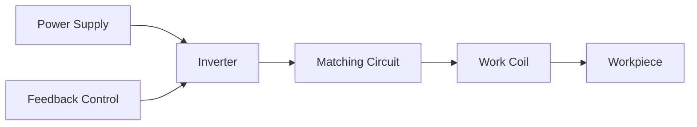

**કાર્ય સિદ્ધાંત:**

- વર્ક કોઇલમાં હાઇ ફ્રિક્વન્સી AC અલ્ટરનેટિંગ મેગ્નેટિક ફિલ્ડ બનાવે છે
- મેગ્નેટિક ફિલ્ડ વર્કપીસમાં એડી કરંટ પ્રેરિત કરે છે
- મટીરિયલના રેઝિસ્ટન્સને કારણે એડી કરંટ ગરમી ઉત્પન્ન કરે છે
- હીટિંગ બાહ્ય સ્રોતથી નહીં, પરંતુ વર્કપીસની અંદર થાય છે

| ફાયદા | ગેરફાયદા |
|--------|----------|
| ઝડપી હીટિંગ | ઊંચી પ્રારંભિક ઉપકરણ કિંમત |
| ઊર્જા કાર્યક્ષમ (80-90%) | ઇલેક્ટ્રિકલી કન્ડક્ટિવ મટીરિયલ્સ પૂરતું મર્યાદિત |
| ચોક્કસ તાપમાન કંટ્રોલ | હાઇ-ફ્રિક્વન્સી પાવર સપ્લાયની જરૂર છે |
| કોઈ દહન વિના ક્લીન પ્રોસેસ | ચોક્કસ એપ્લિકેશન માટે જટિલ કોઇલ ડિઝાઇન |
| લોકેલાઇઝ્ડ હીટિંગ શક્ય | ઊંચી પાવર આવશ્યકતાઓ |
| સુસંગત, પુનરાવર્તનીય પરિણામો | વોટર કૂલિંગ સિસ્ટમની જરૂર છે |
| પર્યાવરણને અનુકૂળ | ઇલેક્ટ્રોમેગ્નેટિક ઇન્ટરફેરન્સ મુદ્દાઓ |
| સુધારેલી કાર્ય સ્થિતિઓ | મર્યાદિત પેનિટ્રેશન ડેપ્થ |

- **ફ્રિક્વન્સી રેન્જ**: એપ્લિકેશન પર આધારિત 1 kHz થી 1 MHz
- **એપ્લિકેશન**: હીટ ટ્રીટમેન્ટ, મેલ્ટિંગ, બ્રેઝિંગ, સોલ્ડરિંગ

**મેમરી ટ્રીક:** "EDDY" - Electromagnetic Device Develops Yield of heat.

## પ્રશ્ન 5(અ) [3 ગુણ]

**ડીસી શન્ટ મોટર સ્પીડને નિયંત્રિત કરવા માટે સોલિડ સ્ટેટ સર્કિટ દોરો અને સમજાવો.**

**જવાબ**:
DC શન્ટ મોટર સ્પીડ કંટ્રોલ માટેની સોલિડ-સ્ટેટ સર્કિટ આર્મેચર વોલ્ટેજને કંટ્રોલ કરવા માટે SCRનો ઉપયોગ કરે છે.

**ડાયાગ્રામ:**

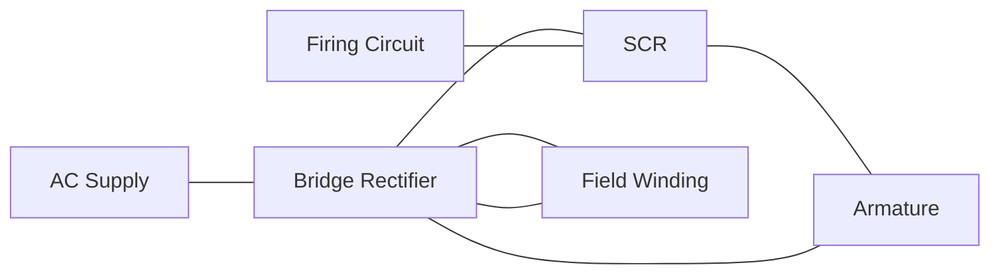

- **આર્મેચર વોલ્ટેજ કંટ્રોલ**: SCR આર્મેચરને વોલ્ટેજ કંટ્રોલ કરે છે
- **ફિલ્ડ વાઇન્ડિંગ**: સીધો DC સપ્લાયથી જોડાયેલ
- **સ્પીડ કંટ્રોલ**: SCR ફાયરિંગ એંગલ બદલીને
- **ફાયદા**: સ્મૂથ કંટ્રોલ, ઊંચી કાર્યક્ષમતા, કોમ્પેક્ટ સાઇઝ

**મેમરી ટ્રીક:** "SAFE" - SCR Armature Firing for Efficient control.

## પ્રશ્ન 5(બ) [4 ગુણ]

**સ્ટેપર મોટરના કાર્ય સિદ્ધાંતને સમજાવો.**

**જવાબ**:
સ્ટેપર મોટર ઇલેક્ટ્રિકલ પલ્સને ડિસ્ક્રીટ મિકેનિકલ મૂવમેન્ટમાં રૂપાંતરિત કરે છે.

**ડાયાગ્રામ:**

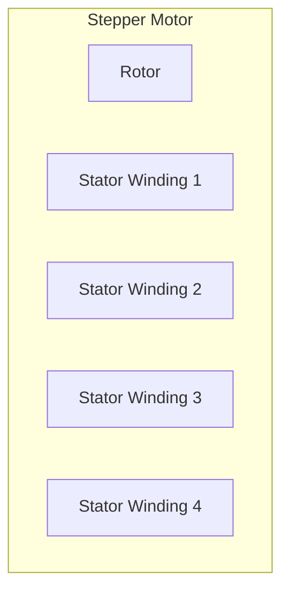

**કાર્ય સિદ્ધાંત:**

- ક્રમમાં સ્ટેટર વાઇન્ડિંગ્સને એનર્જાઇઝ કરવાથી રોટેટિંગ મેગ્નેટિક ફિલ્ડ બને છે
- પર્માનન્ટ મેગ્નેટ રોટર મેગ્નેટિક ફિલ્ડ સાથે એલાઇન થાય છે
- દરેક પલ્સ "સ્ટેપ" એંગલ દ્વારા ચોક્કસ રોટેશન બનાવે છે
- સ્ટેપ એંગલ મોટર કન્સ્ટ્રક્શન દ્વારા નિર્ધારિત થાય છે (સામાન્ય રીતે 1.8° અથવા 0.9°)

| પ્રકાર | ખાસિયતો |
|------|----------------|
| વેરિએબલ રિલક્ટન્સ | કોઈ પર્માનન્ટ મેગ્નેટ નથી, મેગ્નેટિક રિલક્ટન્સ પર આધાર રાખે છે |
| પર્માનન્ટ મેગ્નેટ | પર્માનન્ટ મેગ્નેટ રોટરનો ઉપયોગ કરે છે |
| હાઇબ્રિડ | બંને પ્રકારની ખાસિયતો સંયોજિત કરે છે |

- **ચોક્કસ પોઝિશનિંગ**: ચોક્કસ ઇન્ક્રિમેન્ટ સ્ટેપ્સમાં મૂવમેન્ટ
- **ઓપન-લૂપ કંટ્રોલ**: પોઝિશન કંટ્રોલ માટે કોઈ ફીડબેક જરૂરી નથી
- **હોલ્ડિંગ ટોર્ક**: એનર્જાઇઝ્ડ હોય ત્યારે પોઝિશન જાળવે છે

**મેમરી ટ્રીક:** "STEP" - Sequential Triggering Enables Precise positioning.

## પ્રશ્ન 5(ક) [7 ગુણ]

**PLC નો બ્લોક ડાયાગ્રામ દોરો અને દરેક બ્લોકની કામગીરી સમજાવો.**

**જવાબ**:
પ્રોગ્રામેબલ લોજિક કંટ્રોલર (PLC) એ ઔદ્યોગિક પ્રોસેસના ઓટોમેશન માટે વપરાતું ડિજિટલ કમ્પ્યુટર છે.

**ડાયાગ્રામ:**

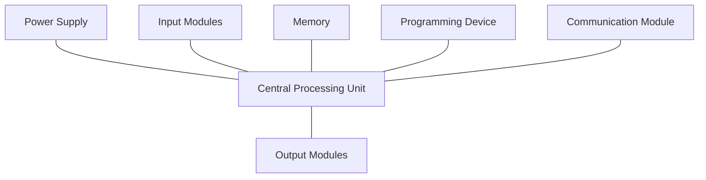

| બ્લોક | કાર્ય |
|-------|----------|
| પાવર સપ્લાય | આંતરિક ઉપયોગ માટે મુખ્ય ACને DCમાં રૂપાંતરિત કરે છે |
| CPU | પ્રોગ્રામ એક્ઝિક્યુટ કરે છે, ડેટા પ્રોસેસ કરે છે, ઓપરેશન્સ મેનેજ કરે છે |
| ઇનપુટ મોડ્યુલ્સ | સેન્સર, સ્વિચ અને ફિલ્ડ ડિવાઇસ સાથે ઇન્ટરફેસ |
| આઉટપુટ મોડ્યુલ્સ | એક્ચ્યુએટર, મોટર, વાલ્વ અને ઇન્ડિકેટર કંટ્રોલ કરે છે |
| મેમરી | પ્રોગ્રામ અને ડેટા સ્ટોર કરે છે (ROM, RAM, EEPROM) |
| પ્રોગ્રામિંગ ડિવાઇસ | પ્રોગ્રામિંગ માટે એક્સટર્નલ કમ્પ્યુટર અથવા ટર્મિનલ |
| કમ્યુનિકેશન મોડ્યુલ | અન્ય PLCs, SCADA, HMI સાથે ઇન્ટરફેસ |

- **સ્કેન સાયકલ**: ઇનપુટ સ્કેનિંગ → પ્રોગ્રામ એક્ઝિક્યુશન → આઉટપુટ અપડેટિંગ
- **ફાયદા**: વિશ્વસનીયતા, ફ્લેક્સિબિલિટી, મોડ્યુલર ડિઝાઇન, સરળ ટ્રબલશૂટિંગ
- **એપ્લિકેશન**: મેન્યુફેક્ચરિંગ ઓટોમેશન, પ્રોસેસ કંટ્રોલ, મટીરિયલ હેન્ડલિંગ
- **પ્રોગ્રામિંગ**: લેડર લોજિક, ફંક્શન બ્લોક ડાયાગ્રામ, સ્ટ્રક્ચર્ડ ટેક્સ્ટ

**મેમરી ટ્રીક:** "PILOT" - Processing Inputs and Logic for Outputs with Timing control.

## પ્રશ્ન 5(અ) OR [3 ગુણ]

**ડીસી સર્વો મોટરનું બંધારણ દોરો અને સમજાવો.**

**જવાબ**:
DC સર્વો મોટર ચોક્કસ પોઝિશન અને સ્પીડ કંટ્રોલ માટે ડિઝાઇન કરવામાં આવે છે.

**ડાયાગ્રામ:**

```mermaid
graph TD
    subgraph "DC Servo Motor"
        A[Armature]
        F[Field Winding]
        S[Shaft]
        FB[Feedback Device]
    end
```

**કોમ્પોનન્ટ્સ:**

- **આર્મેચર**: ઝડપી પ્રતિસાદ માટે લો ઇનર્શિયા
- **ફિલ્ડ સિસ્ટમ**: મેગ્નેટિક ફિલ્ડ પ્રદાન કરે છે (આધુનિક મોટરમાં પર્માનન્ટ મેગ્નેટ્સ)
- **ફીડબેક ડિવાઇસ**: પોઝિશન સેન્સર (એન્કોડર/રિઝોલ્વર/ટેકોમીટર)
- **હાઉસિંગ**: બેરિંગ્સ અને માઉન્ટિંગ પ્રોવિઝન્સ ધરાવે છે

- **હાઇ ટોર્ક-ટુ-ઇનર્શિયા રેશિયો**: ઝડપી સ્ટાર્ટ અને સ્ટોપની મંજૂરી આપે છે
- **લિનિયર ટોર્ક-સ્પીડ કેરેક્ટરિસ્ટિક્સ**: ચોક્કસ કંટ્રોલને સક્ષમ બનાવે છે

**મેમરી ટ્રીક:** "SAFE" - Sensitive Armature with Feedback for Exactness.

## પ્રશ્ન 5(બ) OR [4 ગુણ]

**ડીસી સીરીઝ મોટરની ઝડપને નિયંત્રિત કરવા માટે સર્કિટ દોરો અને સમજાવો.**

**જવાબ**:
SCRનો ઉપયોગ કરીને DC સીરીઝ મોટર સ્પીડ કંટ્રોલ સર્કિટ.

**ડાયાગ્રામ:**

```mermaid
graph LR
    AC[AC Supply] --- BR[Bridge Rectifier]
    BR --- SCR[SCR]
    SCR --- S[Series Field]
    S --- A[Armature]
    A --- BR
    FC[Firing Circuit] --- SCR
    P[Potentiometer] --- FC
```

**કાર્યપદ્ધતિ:**

- બ્રિજ રેક્ટિફાયર ACને DCમાં રૂપાંતરિત કરે છે
- SCR મોટરને એવરેજ વોલ્ટેજ કંટ્રોલ કરે છે
- ફાયરિંગ એંગલ પોટેન્શિયોમીટર દ્વારા નિયંત્રિત થાય છે
- સીરીઝ ફિલ્ડ અને આર્મેચર કરંટ સમાન છે
- ઓછા લોડ પર સ્પીડ વોલ્ટેજના વિપરીત બદલાય છે

- **આર્મેચર વોલ્ટેજ કંટ્રોલ**: સ્પીડ કંટ્રોલ માટે પ્રાથમિક પદ્ધતિ
- **ટોર્ક કેરેક્ટરિસ્ટિક્સ**: ઉચ્ચ સ્ટાર્ટિંગ ટોર્ક જાળવવામાં આવે છે
- **સ્પીડ રેન્જ**: સ્થિર ઓપરેશન માટે સામાન્ય રીતે 3:1

**મેમરી ટ્રીક:** "SCRAM" - SCR Controls Rectified Armature and Motor speed.

## પ્રશ્ન 5(ક) OR [7 ગુણ]

**સ્ટેપર મોટર નું બંધારણ અને કાર્યપદ્ધતિ સમજાવી તેના ઉપયોગો જણાવો**

**જવાબ**:
સ્ટેપર મોટર એ ઇલેક્ટ્રોમેકેનિકલ ડિવાઇસ છે જે ઇલેક્ટ્રિકલ પલ્સને ડિસ્ક્રીટ મિકેનિકલ મૂવમેન્ટમાં રૂપાંતરિત કરે છે.

**બંધારણ:**

**ડાયાગ્રામ:**

```mermaid
graph TD
    subgraph "Stepper Motor"
        R[Rotor - Permanent Magnet]
        S[Stator - Electromagnetic Coils]
        SH[Shaft]
    end
```

| કોમ્પોનન્ટ | વિગત |
|-----------|-------------|
| સ્ટેટર | ફેઝમાં ગોઠવાયેલા મલ્ટિપલ કોઇલ વાઇન્ડિંગ્સ ધરાવે છે |
| રોટર | પર્માનન્ટ મેગ્નેટ અથવા સોફ્ટ આયર્ન (રિલક્ટન્સ પ્રકાર) |
| બેરિંગ્સ | શાફ્ટને સપોર્ટ કરે છે અને રોટેશનની મંજૂરી આપે છે |
| હાઉસિંગ | બધા કોમ્પોનન્ટ્સ ધારણ કરતું મિકેનિકલ સ્ટ્રક્ચર |
| લીડ્સ | સ્ટેટર વાઇન્ડિંગ્સ સાથે ઇલેક્ટ્રિકલ કનેક્શન |

**કાર્ય સિદ્ધાંત:**

- ડિજિટલ પલ્સ ક્રમમાં સ્ટેટર વાઇન્ડિંગ્સને એનર્જાઇઝ કરે છે
- મેગ્નેટિક ફિલ્ડ સ્ટેટરની આસપાસ સ્ટેપ્સમાં ફરે છે
- રોટર ચોક્કસ એંગ્યુલર સ્ટેપ્સમાં મેગ્નેટિક ફિલ્ડને અનુસરે છે
- દિશા એનર્જાઈઝેશનના ક્રમ દ્વારા નિયંત્રિત થાય છે
- સ્પીડ પલ્સ ફ્રિક્વન્સી દ્વારા નિયંત્રિત થાય છે

**સ્ટેપર મોટરના પ્રકાર:**

| પ્રકાર | ખાસિયતો |
|------|----------------|
| વેરિએબલ રિલક્ટન્સ | કોઈ પર્માનન્ટ મેગ્નેટ નહીં, ઉચ્ચ સ્પીડ, ઓછો ટોર્ક |
| પર્માનન્ટ મેગ્નેટ | સરળ ડિઝાઇન, મધ્યમ ટોર્ક, ઓછી રેઝોલ્યુશન |
| હાઇબ્રિડ | બંને ડિઝાઇન્સને સંયોજિત કરે છે, ઉચ્ચ રેઝોલ્યુશન, સારો ટોર્ક |

**ઉપયોગો:**

- CNC મશીન અને 3D પ્રિન્ટર્સ
- રોબોટિક્સ અને ઓટોમેશન
- કેમેરા લેન્સ ફોકસિંગ મિકેનિઝમ
- પ્રિસિઝન પોઝિશનિંગ સિસ્ટમ
- મેડિકલ ઇક્વિપમેન્ટ
- ઓફિસ ઇક્વિપમેન્ટ (પ્રિન્ટર, સ્કેનર)
- ઓટોમોટિવ એપ્લિકેશન (હેડલાઇટ પોઝિશનિંગ)
- નાના કન્ઝ્યુમર ડિવાઇસિસ

**મેમરી ટ્રીક:** "REACT" - Rotation Exactly At Controlled Timing.
