## Question 1(a) [3 marks]

**Draw the construction of SCR and explain it.**

**Answer**:
SCR (Silicon Controlled Rectifier) is a four-layer PNPN semiconductor device with three terminals: Anode, Cathode, and Gate.

**Diagram:**

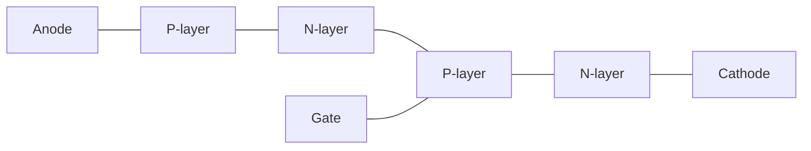

- **P-N-P-N Layers**: Four alternating semiconductor layers
- **Gate Terminal**: Controls turn-on of the device
- **Current Flow**: Anode to cathode when triggered

**Mnemonic:** "Silicon Controls Rectification" - SCR controls current flow in one direction only when triggered.

## Question 1(b) [4 marks]

**Draw construction of TRIAC and explain it.**

**Answer**:
TRIAC (Triode for Alternating Current) is a bidirectional three-terminal semiconductor device that conducts in both directions when triggered.

**Diagram:**


- **Bidirectional Operation**: Conducts in both directions when triggered
- **Gate Control**: Single gate controls conduction in both directions
- **Equivalent Circuit**: Acts like two SCRs connected in anti-parallel
- **AC Applications**: Widely used for AC power control applications

**Mnemonic:** "TRI-direction AC controller" - Controls current in both directions in AC circuits.

## Question 1(c) [7 marks]

**Describe construction & working of Opto-Isolators, Opto-TRIAC, Opto-SCR, and Opto-transistor. And list their applications.**

**Answer**:
Opto-isolators use light to transfer electrical signals between isolated circuits.

**Diagram:**

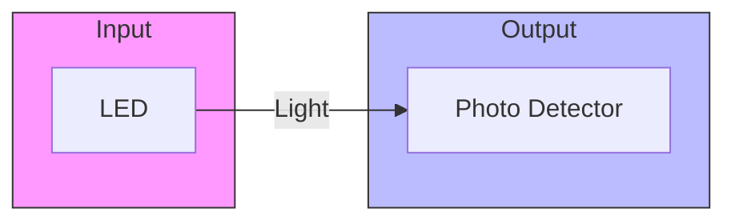

| Device | Construction | Working | Applications |
|--------|--------------|---------|--------------|
| Opto-Isolator | LED + Photodetector | LED emits light when input current flows; photodetector activates output circuit | Signal isolation, Medical equipment, Industrial controls |
| Opto-TRIAC | LED + Photo-TRIAC | LED triggers the TRIAC through light; provides electrical isolation | AC power control, Solid state relays, Motor controls |
| Opto-SCR | LED + Photo-SCR | LED emits light to trigger SCR; provides high isolation | DC switching, Industrial controls, High voltage isolation |
| Opto-transistor | LED + Photo-transistor | LED light controls base current of phototransistor | Encoders, Level detection, Position sensing |

- **Electrical Isolation**: Complete separation between input and output
- **Noise Immunity**: High resistance to electrical noise
- **Speed**: Response times in microseconds range

**Mnemonic:** "LOST" - Light Operates Semiconductor Terminals in all opto-devices.

## Question 1(c) OR [7 marks]

**Describe Explain working of SCR using two transistor analogies. List the various industrial applications of SCR.**

**Answer**:
SCR can be modeled as two interconnected transistors: PNP (T1) and NPN (T2).

**Diagram:**

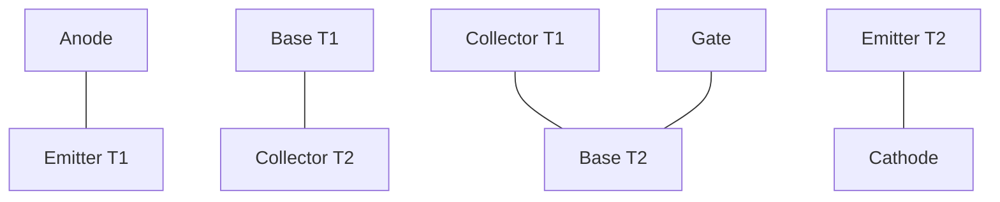

**Working Principle:**

| Step | Operation |
|------|-----------|
| Initial State | Both transistors are OFF |
| Gate Triggering | Current injected into gate (B2 of T2) |
| Regenerative Action | T2 turns ON → T1 base gets current → T1 turns ON → More current to T2 base |
| Latching | Self-sustaining current flow continues even if gate signal is removed |

**Industrial Applications of SCR:**

- **Power Control**: AC/DC motor speed control
- **Switching**: Static switches, solid-state relays
- **Inverters**: DC to AC conversion
- **Protection**: Overvoltage protection circuits
- **Lighting**: Light dimmers, illumination control

**Mnemonic:** "POWER" - Power control, Overvoltage protection, Welding machines, Electronic converters, Regulated supplies.

## Question 2(a) [3 marks]

**Define Triggering in SCR and explain any two triggering techniques.**

**Answer**:
Triggering is the process of turning ON an SCR by applying appropriate signal to its gate terminal.

**Two Triggering Techniques:**

| Technique | Description |
|-----------|-------------|
| Gate Triggering | Direct current pulse applied to gate-cathode circuit |
| Light Triggering | Photons striking junction provide energy for conduction |

- **Gate Triggering**: Most common method using electrical pulse
- **Light Triggering**: Uses photosensitive semiconductor properties

**Mnemonic:** "GET" - Gate Electrical Triggering is the most common method.

## Question 2(b) [4 marks]

**Write the differences between forced commutation and natural commutation.**

**Answer**:

| Parameter | Forced Commutation | Natural Commutation |
|-----------|-------------------|---------------------|
| Definition | External circuitry forces SCR to turn OFF | SCR turns OFF naturally when current falls below holding value |
| Application | DC circuits | AC circuits |
| Components | Requires additional components (capacitors, inductors) | No additional components needed |
| Complexity | Complex circuit design | Simple circuit design |
| Energy | External energy needed for turn-off | No external energy needed |

- **Forced Commutation**: Actively turns OFF SCR using external circuit
- **Natural Commutation**: SCR turns OFF when AC current crosses zero

**Mnemonic:** "FACE" - Forced Active Commutation requires External components.

## Question 2(c) [7 marks]

**Design the snubber circuit for SCR.**

**Answer**:
Snubber circuit protects SCR from high dV/dt and limits rate of voltage rise.

**Diagram:**

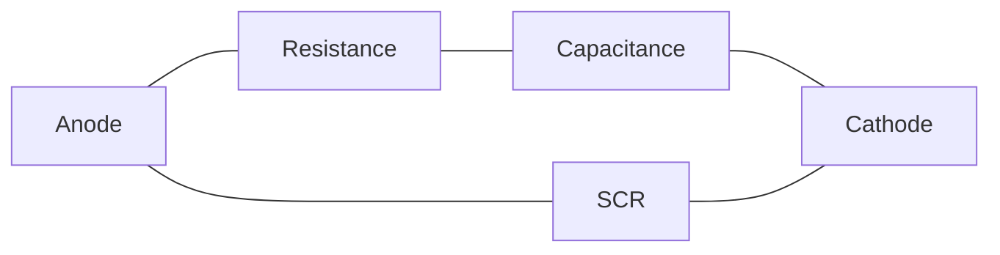

**Design Steps:**

| Step | Calculation |
|------|-------------|
| 1. Calculate dV/dt rating | From datasheet (V/μs) |
| 2. Determine R value | R = V₁/IL where V₁ is supply voltage and IL is load current |
| 3. Determine C value | C = 1/(R × (dV/dt)max) |
| 4. RC time constant | τ = R × C (should be greater than SCR turn-off time) |

- **Resistance R**: Limits discharge current of capacitor
- **Capacitance C**: Absorbs transient energy and limits dV/dt
- **Protection**: Prevents false triggering and damage
- **Power Rating**: R must have sufficient power rating

**Mnemonic:** "RCSS" - Resistance-Capacitance Saves Silicon from Stress.

## Question 2(a) OR [3 marks]

**Define commutation and Explain class-E commutation for SCR.**

**Answer**:
Commutation is the process of turning OFF an SCR by reducing its anode current below the holding current level.

**Class-E Commutation:**

**Diagram:**

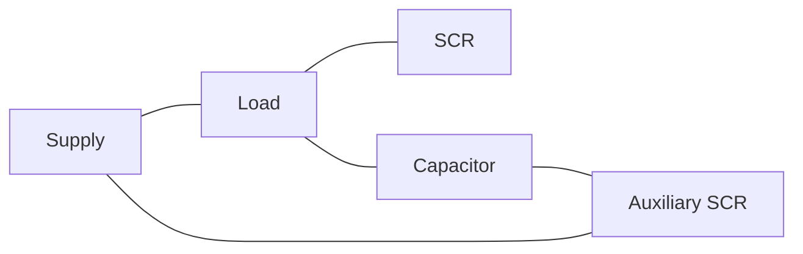

- **Auxiliary SCR**: Controls the commutation process
- **Resonant Circuit**: Forms LC resonant circuit
- **Operation**: Auxiliary SCR triggers capacitor discharge to reverse-bias main SCR
- **Application**: Used in inverters and choppers

**Mnemonic:** "ACE" - Auxiliary Capacitor Extinguishes conduction.

## Question 2(b) OR [4 marks]

**Explain Triggering of Thyristor.**

**Answer**:

| Triggering Method | Working Principle |
|-------------------|-------------------|
| Gate Triggering | Electrical pulse applied between gate and cathode |
| Temperature Triggering | Junction temperature increases to cause turn-on |
| Light Triggering | Photons create electron-hole pairs at junctions |
| dV/dt Triggering | Rapid voltage rise causes capacitive current flow |
| Forward Voltage Triggering | Exceeding breakover voltage causes avalanche conduction |

- **Gate Triggering**: Most common and controllable method
- **Parameter Control**: Pulse width, amplitude, and rise time
- **Gate Sensitivity**: Varies with temperature
- **Protection**: Required against unwanted triggering

**Mnemonic:** "VITAL" - Voltage, Illumination, Temperature And Level are all triggering methods.

## Question 2(c) OR [7 marks]

**Explain methods to protect SCR against over voltage and current in details.**

**Answer**:

**Overvoltage Protection:**

**Diagram:**


| Protection Method | Working Principle |
|-------------------|-------------------|
| RC Snubber Circuit | Limits rate of rise of voltage (dV/dt) |
| Voltage Clamping | Using Zener diodes or MOVs to limit maximum voltage |
| Crowbar Protection | Deliberate short-circuit when voltage exceeds threshold |

**Overcurrent Protection:**

**Diagram:**


| Protection Method | Working Principle |
|-------------------|-------------------|
| Fuses/Circuit Breakers | Disconnects circuit during fault conditions |
| Current Limiting Reactors | Limits fault current magnitude |
| Electronic Current Limiting | Sensing and control circuits limit current |

- **Coordination**: Protection devices must work in coordination
- **Response Time**: Critical for effective protection
- **Multiple Layers**: For critical applications, several methods are combined

**Mnemonic:** "SCOPE" - Snubbers, Clamps, Overload sensors, Protectors, and Electronic limiters.

## Question 3(a) [3 marks]

**List the differences between single phase rectifier and poly phase rectifier.**

**Answer**:

| Parameter | Single Phase Rectifier | Poly Phase Rectifier |
|-----------|------------------------|----------------------|
| Input | Single phase AC supply | Multiple phase (usually 3-phase) AC supply |
| Output Ripple | Higher ripple content | Lower ripple content |
| Efficiency | Lower efficiency | Higher efficiency |
| Power Rating | Suitable for low power applications | Suitable for high power applications |
| Transformer Utilization | Lower utilization factor | Higher utilization factor |

- **Ripple Factor**: Single phase has higher ripple compared to poly phase
- **Form Factor**: Better in poly phase systems
- **Size/Weight**: Poly phase systems have better power/weight ratio

**Mnemonic:** "PERCH" - Poly phase has Efficiency, Ripple improvement, Capacity, and Higher ratings.

## Question 3(b) [4 marks]

**Draw the circuit diagram of three phases Half Wave Rectifier and explain its Working.**

**Answer**:
Three-phase half-wave rectifier converts three-phase AC into pulsating DC using three diodes.

**Diagram:**

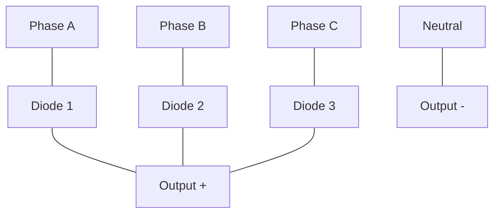

**Working:**

- Each diode conducts when its phase voltage is most positive
- Conduction angle of each diode is 120°
- Ripple frequency is 3 times the input frequency
- Average output voltage = 3Vm/2π (where Vm is peak phase voltage)
- Ripple factor = 0.17 (much lower than single-phase half-wave)

**Mnemonic:** "THREE-D" - THREE Diodes conducting sequentially.

## Question 3(c) [7 marks]

**Describe the working of UPS & SMPS with the help of block diagram.**

**Answer**:

**UPS (Uninterruptible Power Supply):**

**Diagram:**

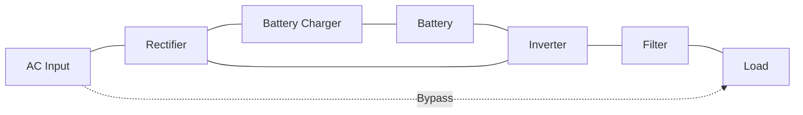

| Block | Function |
|-------|----------|
| Rectifier | Converts AC to DC for battery charging and inverter |
| Battery | Stores energy for backup during power failure |
| Inverter | Converts DC to AC for powering load |
| Filter | Smooths output waveform |
| Bypass | Provides direct AC during maintenance |

**SMPS (Switched Mode Power Supply):**

**Diagram:**

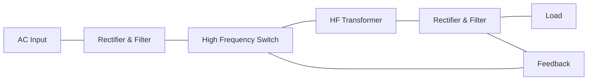

| Block | Function |
|-------|----------|
| Rectifier & Filter | Converts AC to unregulated DC |
| High Frequency Switch | Chops DC into high-frequency pulses |
| HF Transformer | Provides isolation and voltage transformation |
| Output Rectifier & Filter | Converts high-frequency AC to smooth DC |
| Feedback Circuit | Regulates output voltage by controlling switch |

- **UPS Efficiency**: 80-90%, provides backup power
- **SMPS Efficiency**: 70-90%, much smaller than linear supplies
- **Regulation**: Both provide regulated output voltage

**Mnemonic:** "BRIEF" - Battery backup, Rectification, Inversion, Efficient switching, Feedback control.

## Question 3(a) OR [3 marks]

**Explain the Principle & working of Chopper circuits.**

**Answer**:
Chopper is a DC-to-DC converter that converts fixed DC input voltage to variable DC output voltage.

**Diagram:**


**Principle:**

- Switch (typically SCR, MOSFET, or IGBT) rapidly connects and disconnects source to load
- Output voltage controlled by duty cycle (ON time / total time)
- Average output voltage = Input voltage × Duty cycle

- **Time Ratio Control**: Varies duty cycle, keeping frequency constant
- **Frequency Modulation**: Varies frequency, keeping ON time constant
- **Applications**: DC motor control, battery-powered vehicles

**Mnemonic:** "CHOP" - Control High-speed Operation with Pulses.

## Question 3(b) OR [4 marks]

**Compare single-phase and Poly-phase rectifier circuits.**

**Answer**:

| Parameter | Single-Phase Rectifier | Poly-Phase Rectifier |
|-----------|------------------------|----------------------|
| Supply | Single-phase AC | Three or more phase AC |
| Output Waveform | More pulsating | Smoother (less pulsating) |
| Ripple Content | Higher (0.48 for full wave) | Lower (0.042 for 3-phase full wave) |
| Filtering | More filtering required | Less filtering required |
| Power Handling | Limited power handling | Higher power handling |
| Transformer Utilization | 0.812 (full wave) | 0.955 (3-phase full wave) |
| Efficiency | Lower | Higher |
| Size | Smaller for same power | More compact for high power |

- **Harmonic Content**: Lower in poly-phase systems
- **TUF (Transformer Utilization Factor)**: Higher in poly-phase systems
- **Cost-Effectiveness**: Poly-phase more economical for high power

**Mnemonic:** "PERIPHERY" - Poly-phase Efficiency Ripple Improvement Power Handling Economy Rating Yield.

## Question 3(c) OR [7 marks]

**Describe the working of solar Photovoltaic (PV) based power generation with the help of block diagram.**

**Answer**:
Solar PV power generation converts sunlight directly into electricity using semiconductor materials.

**Diagram:**

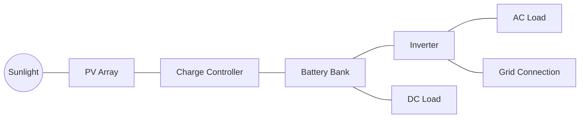

| Component | Function |
|-----------|----------|
| PV Array | Converts solar energy to DC electricity through photovoltaic effect |
| Charge Controller | Regulates battery charging and prevents overcharging |
| Battery Bank | Stores energy for use during night or cloudy conditions |
| Inverter | Converts DC to AC for powering AC loads |
| Grid Connection | Optional connection for feeding excess power to grid |

**Working Principle:**

- **Photovoltaic Effect**: Photons from sunlight knock electrons free in semiconductor
- **Cell Structure**: P-N junction creates electric field
- **Voltage Generation**: Typical cell produces 0.5-0.6V DC
- **Array Configuration**: Series-parallel connections for desired voltage/current

- **Efficiency**: Typically 15-22% for commercial panels
- **Applications**: Residential, commercial, industrial power generation

**Mnemonic:** "SOLAR" - Semiconductors Oriented Light-to-electricity Array Regulation.

## Question 4(a) [3 marks]

**List the advantages of static switch.**

**Answer**:

| Advantages of Static Switch |
|-----------------------------|
| No moving parts - higher reliability |
| Silent operation |
| Fast switching response (microseconds) |
| Longer operational life |
| No contact bounce or arcing |
| Compact size |
| Compatible with digital control systems |
| Lower maintenance requirements |

- **Reliability**: No mechanical wear and tear 
- **Speed**: Much faster than mechanical switches
- **Isolation**: Can provide electrical isolation

**Mnemonic:** "SAFE" - Speed, Arc-free, Fast response, Endurance.

## Question 4(b) [4 marks]

**Draw the circuit diagram of A.C. Power control using DIAC-TRIAC and Explain it.**

**Answer**:
DIAC-TRIAC circuit provides smooth AC power control for resistive and inductive loads.

**Diagram:**

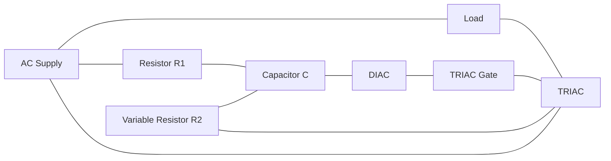

**Working:**

- Variable resistor R2 controls charging rate of capacitor C
- When capacitor voltage reaches DIAC breakover voltage, DIAC conducts
- DIAC delivers trigger pulse to TRIAC gate
- TRIAC conducts for remainder of half-cycle
- Process repeats for both half-cycles

- **Phase Control**: Controls power by varying firing angle
- **Applications**: Light dimmers, heater controls, motor speed control
- **Power Range**: Can control from near-zero to full power

**Mnemonic:** "DIRECT" - DIAC Initiates Regulated Energy Control in TRIAC.

## Question 4(c) [7 marks]

**Describe function of DC power control circuit using SCR with UJT in triggering circuit.**

**Answer**:
UJT-triggered SCR circuit provides precise control of DC power to the load.

**Diagram:**

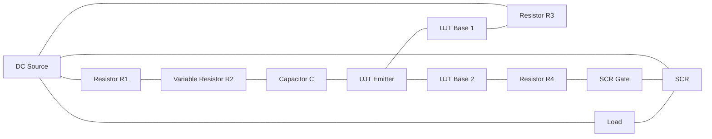

**Working Principle:**

| Stage | Operation |
|-------|-----------|
| Charging | R1 and R2 control charging rate of capacitor C |
| UJT Firing | When capacitor voltage reaches UJT firing level, UJT conducts |
| Pulse Generation | UJT generates sharp trigger pulse across R4 |
| SCR Triggering | Pulse triggers SCR gate, turning SCR ON |
| Power Control | Variable resistor R2 adjusts timing, controlling average power |

- **Precise Control**: UJT provides stable, predictable triggering
- **Applications**: Battery chargers, DC motor speed control, temperature control
- **Advantages**: Low cost, high reliability, good temperature stability
- **Control Range**: Wide range from near-zero to full power

**Mnemonic:** "SCRUP" - SCR Using Pulse from UJT for Power control.

## Question 4(a) OR [3 marks]

**Enlist applications of dielectric heating.**

**Answer**:

| Applications of Dielectric Heating |
|-----------------------------------|
| Plastic welding and sealing |
| Wood gluing and curing |
| Food processing (pre-cooking, defrosting) |
| Textile drying and processing |
| Paper and board drying |
| Pharmaceutical products drying |
| Medical applications (hyperthermia treatment) |
| Rubber vulcanization |

- **Material Requirements**: Works best with poor conductors that have polar molecules
- **Frequency Range**: Typically 10-100 MHz
- **Advantages**: Uniform heating, faster processing, energy efficiency

**Mnemonic:** "POWER" - Plastics, Organics, Wood, Edibles, and Rubber processing.

## Question 4(b) OR [4 marks]

**Draw and explain three stage IC555 timer circuit.**

**Answer**:
Three-stage IC555 timer circuit provides sequential timing operations.

**Diagram:**

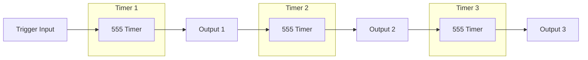

**Working:**

- First timer activated by external trigger
- Output of first timer triggers second timer
- Output of second timer triggers third timer
- Each timer can be independently adjusted

- **Applications**: Industrial sequencing, process control, animation effects
- **Timing Range**: Microseconds to hours with proper component selection
- **Features**: Stable timing, immune to supply variations
- **Advantages**: Simple design, reliable operation, low cost

**Mnemonic:** "THREE-SET" - THREE Stage Electronic Timers in sequence.

## Question 4(c) OR [7 marks]

**Describe the working principle of Induction heating. And List merits-demerits of Induction heating.**

**Answer**:
Induction heating uses electromagnetic induction to heat electrically conductive materials.

**Diagram:**

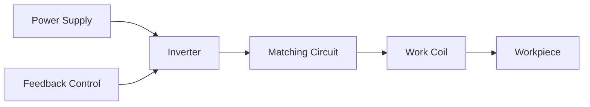

**Working Principle:**

- High frequency AC in work coil creates alternating magnetic field
- Magnetic field induces eddy currents in workpiece
- Eddy currents generate heat due to material resistance
- Heating occurs within the workpiece, not from external source

| Merits | Demerits |
|--------|----------|
| Rapid heating | High initial equipment cost |
| Energy efficient (80-90%) | Limited to electrically conductive materials |
| Precise temperature control | Requires high-frequency power supply |
| Clean process with no combustion | Complex coil design for specific applications |
| Localized heating possible | High power requirements |
| Consistent, repeatable results | Requires water cooling systems |
| Environmentally friendly | Electromagnetic interference issues |
| Improved working conditions | Limited penetration depth |

- **Frequency Range**: 1 kHz to 1 MHz depending on application
- **Applications**: Heat treatment, melting, brazing, soldering

**Mnemonic:** "EDDY" - Electromagnetic Device Develops Yield of heat.

## Question 5(a) [3 marks]

**Draw & explain solid state circuit to control dc shunt motor speed.**

**Answer**:
Solid-state circuit for DC shunt motor speed control uses SCR to control armature voltage.

**Diagram:**

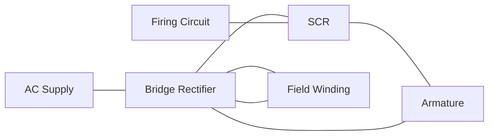

- **Armature Voltage Control**: SCR controls voltage to armature
- **Field Winding**: Connected directly to DC supply
- **Speed Control**: By varying SCR firing angle
- **Advantages**: Smooth control, high efficiency, compact size

**Mnemonic:** "SAFE" - SCR Armature Firing for Efficient control.

## Question 5(b) [4 marks]

**Explain working principle of stepper motor.**

**Answer**:
Stepper motor converts electrical pulses into discrete mechanical movements.

**Diagram:**

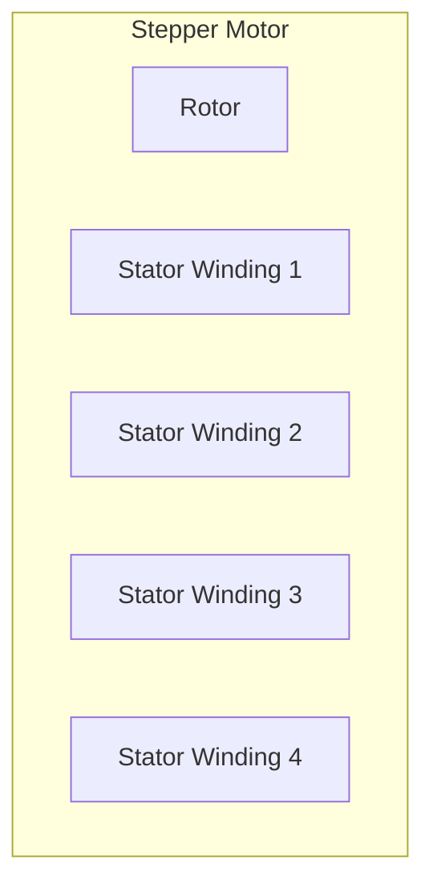

**Working Principle:**

- Energizing stator windings in sequence creates rotating magnetic field
- Permanent magnet rotor aligns with magnetic field
- Each pulse creates rotation by exact "step" angle
- Step angle determined by motor construction (typically 1.8° or 0.9°)

| Type | Characteristics |
|------|----------------|
| Variable Reluctance | No permanent magnet, relies on magnetic reluctance |
| Permanent Magnet | Uses permanent magnet rotor |
| Hybrid | Combines features of both types |

- **Precise Positioning**: Movement in exact increment steps
- **Open-Loop Control**: No feedback needed for position control
- **Holding Torque**: Maintains position when energized

**Mnemonic:** "STEP" - Sequential Triggering Enables Precise positioning.

## Question 5(c) [7 marks]

**Draw the block diagram of PLC and explain the function of each block.**

**Answer**:
Programmable Logic Controller (PLC) is a digital computer used for automation of industrial processes.

**Diagram:**

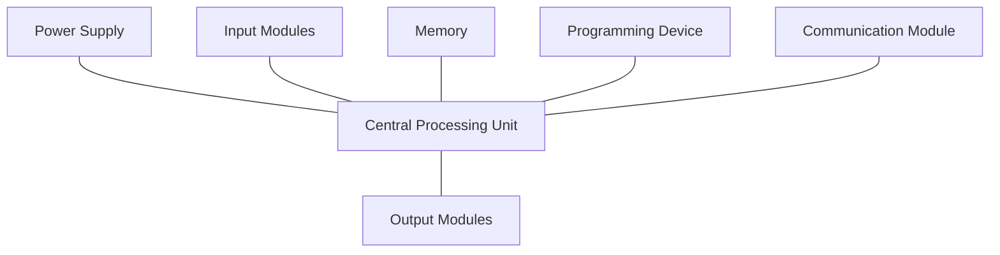

| Block | Function |
|-------|----------|
| Power Supply | Converts main AC to DC for internal use |
| CPU | Executes program, processes data, manages operations |
| Input Modules | Interface with sensors, switches, and field devices |
| Output Modules | Control actuators, motors, valves, and indicators |
| Memory | Stores program and data (ROM, RAM, EEPROM) |
| Programming Device | External computer or terminal for programming |
| Communication Module | Interfaces with other PLCs, SCADA, HMI |

- **Scan Cycle**: Input scanning → Program execution → Output updating
- **Advantages**: Reliability, flexibility, modular design, easy troubleshooting
- **Applications**: Manufacturing automation, process control, material handling
- **Programming**: Ladder logic, function block diagram, structured text

**Mnemonic:** "PILOT" - Processing Inputs and Logic for Outputs with Timing control.

## Question 5(a) OR [3 marks]

**Draw and explain the construction of DC servo motor.**

**Answer**:
DC servo motor is designed for precise position and speed control.

**Diagram:**

```mermaid
graph TD
    subgraph "DC Servo Motor"
        A[Armature]
        F[Field Winding]
        S[Shaft]
        FB[Feedback Device]
    end
```

**Components:**

- **Armature**: Low inertia for quick response
- **Field System**: Provides magnetic field (permanent magnets in modern motors)
- **Commutator & Brushes**: Electrical connection to rotating armature
- **Feedback Device**: Position sensor (encoder/resolver/tachometer)
- **Housing**: Contains bearings and mounting provisions

- **High Torque-to-Inertia Ratio**: Allows quick starts and stops
- **Linear Torque-Speed Characteristics**: Enables precise control
- **Low Electrical Time Constant**: Fast response to control signals

**Mnemonic:** "SAFE" - Sensitive Armature with Feedback for Exactness.

## Question 5(b) OR [4 marks]

**Draw and explain the circuit to control speed of a DC series motor.**

**Answer**:
DC series motor speed control circuit using SCR.

**Diagram:**

```mermaid
graph LR
    AC[AC Supply] --- BR[Bridge Rectifier]
    BR --- SCR[SCR]
    SCR --- S[Series Field]
    S --- A[Armature]
    A --- BR
    FC[Firing Circuit] --- SCR
    P[Potentiometer] --- FC
```

**Working:**

- Bridge rectifier converts AC to DC
- SCR controls average voltage to motor
- Firing angle controlled by potentiometer
- Series field and armature current is the same
- Speed varies inversely with voltage at low loads

- **Armature Voltage Control**: Primary method for speed control
- **Torque Characteristics**: High starting torque maintained
- **Speed Range**: Typically 3:1 for stable operation

**Mnemonic:** "SCRAM" - SCR Controls Rectified Armature and Motor speed.

## Question 5(c) OR [7 marks]

**Explain construction, working of Stepper motor Give and its applications**

**Answer**:
Stepper motor is an electromechanical device that converts electrical pulses into discrete mechanical movements.

**Construction:**

**Diagram:**

```mermaid
graph TD
    subgraph "Stepper Motor"
        R[Rotor - Permanent Magnet]
        S[Stator - Electromagnetic Coils]
        SH[Shaft]
    end
```

| Component | Description |
|-----------|-------------|
| Stator | Contains multiple coil windings arranged in phases |
| Rotor | Permanent magnet or soft iron (reluctance type) |
| Bearings | Support shaft and allow rotation |
| Housing | Mechanical structure holding all components |
| Leads | Electrical connections to stator windings |

**Working Principle:**

- Digital pulses energize stator windings in sequence
- Magnetic field rotates in steps around stator
- Rotor follows magnetic field in precise angular steps
- Direction controlled by sequence of energization
- Speed controlled by pulse frequency

**Types of Stepper Motors:**

| Type | Characteristics |
|------|----------------|
| Variable Reluctance | No permanent magnet, high speed, low torque |
| Permanent Magnet | Simpler design, moderate torque, lower resolution |
| Hybrid | Combines both designs, high resolution, good torque |

**Applications:**

- CNC machines and 3D printers
- Robotics and automation
- Camera lens focusing mechanisms
- Precision positioning systems
- Medical equipment
- Office equipment (printers, scanners)
- Automotive applications (headlight positioning)
- Small consumer devices

**Mnemonic:** "REACT" - Rotation Exactly At Controlled Timing.
