## પ્રશ્ન 1(અ) [3 ગુણ]

**SCRનો સિમ્બોલ અને રચના દોરો. તદુપરાંત SCRના ઉપયોગો લખો.**

**ઉત્તર**:

**SCR સિમ્બોલ અને રચના:**

```goat
    Anode (A)
       |
       v
       _
      | |
      | |
  G ->|_|  
      | |
      |_|
       |
       v
   Cathode (K)
```

**રચના:**

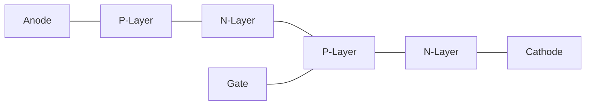

**SCRના ઉપયોગો:**

- **પાવર કંટ્રોલ**: AC/DC પાવર રેગ્યુલેટર્સ
- **મોટર ડ્રાઈવ્સ**: મોટરની ગતિનું નિયંત્રણ
- **લાઈટિંગ કંટ્રોલ**: ડિમર સર્કિટ્સ
- **ઈન્વર્ટર્સ**: DC થી AC રૂપાંતરણ

**મેમરી ટ્રીક:** "PALS" - પાવર કંટ્રોલ, એપ્લાયન્સ કંટ્રોલ, લાઈટિંગ સિસ્ટમ્સ, સ્પીડ રેગ્યુલેટર્સ

## પ્રશ્ન 1(બ) [4 ગુણ]

**પુરા નામ જણાવો (૧) SCS (૨) LASCR (3) MCT (૪) PUT.**

**ઉત્તર**:

| ડિવાઇસ | પૂરું નામ |
|--------|-----------|
| **SCS** | Silicon Controlled Switch |
| **LASCR** | Light Activated Silicon Controlled Rectifier |
| **MCT** | MOS Controlled Thyristor |
| **PUT** | Programmable Unijunction Transistor |

**મેમરી ટ્રીક:** "SLaMP" - Silicon controlled switch, Light activated SCR, MOS controlled thyristor, Programmable UJT

## પ્રશ્ન 1(ક) [7 ગુણ]

**TRIACની V-I લાક્ષણિકતા દોરો અને સમજાવો. તદુપરાંત TRIACના ઉપયોગો લખો.**

**ઉત્તર**:

**TRIAC V-I લાક્ષણિકતા:**

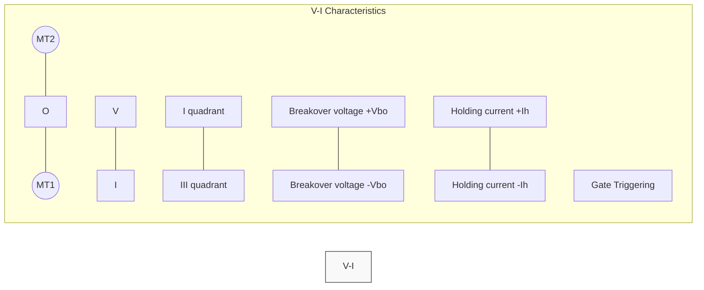

**TRIACની V-I લાક્ષણિકતા સમજૂતી:**

- **દ્વિદિશાત્મક ઉપકરણ**: બંને દિશામાં વહન કરે છે
- **ક્વાડ્રન્ટ ઓપરેશન**: પહેલા અને ત્રીજા ક્વાડ્રન્ટમાં કાર્ય કરે છે
- **બ્રેકઓવર વોલ્ટેજ**: જ્યારે વોલ્ટેજ ±Vbo કરતાં વધે ત્યારે વહન શરૂ થાય
- **હોલ્ડિંગ કરંટ**: ન્યૂનતમ પ્રવાહ જે વહનની સ્થિતિ જાળવી રાખે છે
- **ગેટ ટ્રિગરિંગ**: પોઝિટિવ/નેગેટિવ ગેટ વોલ્ટેજથી ટ્રિગર થઈ શકે છે

**TRIACના ઉપયોગો:**

- **AC પાવર કંટ્રોલ**: લેમ્પ ડિમર્સ, હીટર કંટ્રોલ
- **મોટર સ્પીડ કંટ્રોલ**: AC મોટર રેગ્યુલેટર્સ
- **ફેન રેગ્યુલેટર્સ**: ઘરેલું પંખાની ગતિનું નિયંત્રણ
- **લાઈટ ડિમર્સ**: એડજસ્ટેબલ લાઈટિંગ સિસ્ટમ્સ

**મેમરી ટ્રીક:** "HALF" - હીટર્સ, AC કંટ્રોલ, લાઈટિંગ સિસ્ટમ્સ, ફેન રેગ્યુલેટર્સ

## પ્રશ્ન 1(ક) OR [7 ગુણ]

**IGBT નું કન્સ્ટ્રકશન અને કાર્ય વિગતવાર સમજાવો.**

**ઉત્તર**:

**IGBT કન્સ્ટ્રકશન અને કાર્ય:**


**રચના વિગતો:**

- **ત્રણ-ટર્મિનલ ડિવાઈસ**: ગેટ, એમિટર, કલેક્ટર
- **મલ્ટિલેયર સ્ટ્રક્ચર**: N+, P, N-, N+ બફર, P+ સબસ્ટ્રેટ
- **હાઈબ્રિડ ડિવાઈસ**: MOSFET ઈનપુટ અને BJT આઉટપુટ લાક્ષણિકતાઓનું સંયોજન

**કાર્ય સિદ્ધાંત:**

- **ગેટ કંટ્રોલ**: P-રીજનમાં ગેટ પર પોઝિટિવ વોલ્ટેજ ઇન્વર્ઝન લેયર બનાવે છે
- **ચેનલ ફોર્મેશન**: ઇલેક્ટ્રોન્સ N+ એમિટરથી N- ડ્રિફ્ટ રીજન તરફ વહે છે
- **કન્ડક્ટિવિટી મોડ્યુલેશન**: P-N- જંક્શન હોલ્સ ઇન્જેક્ટ કરે છે, રેઝિસ્ટન્સ ઘટાડે છે
- **ટર્ન-ઓફ પ્રક્રિયા**: ગેટ વોલ્ટેજ દૂર કરવાથી ઇલેક્ટ્રોન ફ્લો બંધ થઈ જાય છે

**IGBTના ફાયદા:**

- **ઊંચી ઈનપુટ ઇમ્પીડન્સ**: સરળ વોલ્ટેજ નિયંત્રણ
- **ઓછા કન્ડક્શન લોસ**: કાર્યક્ષમ પાવર હેન્ડલિંગ
- **ઝડપી સ્વિચિંગ**: ઉચ્ચ ફ્રીક્વન્સી એપ્લિકેશન્સ માટે યોગ્ય

**મેમરી ટ્રીક:** "GIVE" - ગેટ કંટ્રોલ્ડ, ઇનપુટ હાઈ ઇમ્પીડન્સ, વોલ્ટેજ ડ્રિવન, એફિશિયન્ટ કન્ડક્શન

## પ્રશ્ન 2(અ) [3 ગુણ]

**UJTની મદદથી રિલેક્ષેશન ઓસિલેટર સર્કિટની ચર્ચા કરો.**

**ઉત્તર**:

**UJT રિલેક્ષેશન ઓસિલેટર:**

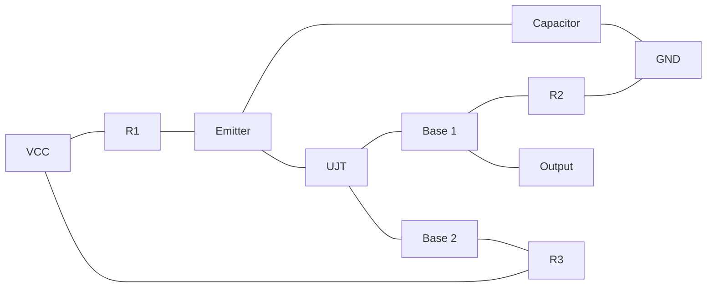

**કાર્ય સિદ્ધાંત:**

- **કેપેસિટર ચાર્જિંગ**: C, R1 દ્વારા UJT ફાયરિંગ વોલ્ટેજ સુધી ચાર્જ થાય છે
- **UJT ફાયર**: જ્યારે એમિટર વોલ્ટેજ પીક પોઈન્ટ વોલ્ટેજ સુધી પહોંચે ત્યારે
- **ડિસ્ચાર્જ સાયકલ**: કેપેસિટર એમિટર-બેઝ1 જંક્શન દ્વારા ડિસ્ચાર્જ થાય છે
- **ઓસિલેશન**: પ્રક્રિયા પુનરાવર્તિત થાય છે અને સોટૂથ વેવફોર્મ બનાવે છે

**મેમરી ટ્રીક:** "CROP" - કેપેસિટર ચાર્જ થાય, રીચ થ્રેશોલ્ડ, ઓસિલેટ થાય, પ્રોડ્યુસ સોટૂથ

## પ્રશ્ન 2(બ) [4 ગુણ]

**SCRની ટ્રીગરિંગ પદ્ધતિઓની ચર્ચા કરો.**

**ઉત્તર**:

| ટ્રિગરિંગ પદ્ધતિ | કાર્ય સિદ્ધાંત |
|-------------------|-------------------|
| **ગેટ ટ્રિગરિંગ** | ગેટ અને કેથોડ વચ્ચે પોઝિટિવ વોલ્ટેજ આપવામાં આવે છે |
| **થર્મલ ટ્રિગરિંગ** | તાપમાન વધારાથી બ્રેકઓવર વોલ્ટેજ ઘટે છે |
| **લાઈટ ટ્રિગરિંગ** | ફોટોન્સ LASCR માં ઇલેક્ટ્રોન-હોલ જોડ બનાવે છે |
| **dv/dt ટ્રિગરિંગ** | SCR પર ઝડપી વોલ્ટેજ વધારો કેપેસિટિવ કરંટ ઉત્પન્ન કરે છે |
| **બ્રેકઓવર ટ્રિગરિંગ** | ગેટ સિગ્નલ વિના વોલ્ટેજ બ્રેકઓવર વોલ્ટેજને ઓળંગે છે |

**મુખ્ય મુદ્દાઓ:**

- **ગેટ ટ્રિગરિંગ**: સૌથી સામાન્ય પદ્ધતિ
- **લાઈટ ટ્રિગરિંગ**: ઓપ્ટો-આઇસોલેટર્સમાં વપરાય છે
- **dv/dt ટ્રિગરિંગ**: ઘણી વખત અવાંછનીય, સ્નબર સર્કિટની જરૂર પડે છે

**મેમરી ટ્રીક:** "GLTDB" - ગેટ, લાઈટ, થર્મલ, dv/dt, બ્રેકઓવર

## પ્રશ્ન 2(ક) [7 ગુણ]

**ક્લાસ એ પ્રકારની કોમ્યુટેશન પદ્ધતિ સમજાવો.**

**ઉત્તર**:

**ક્લાસ A કોમ્યુટેશન (LC સર્કિટ દ્વારા સેલ્ફ-કોમ્યુટેશન):**

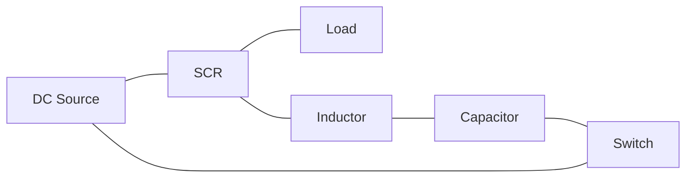

**કાર્ય સિદ્ધાંત:**

- **પ્રારંભિક સ્થિતિ**: SCR વહન કરે છે, કેપેસિટર જમણી બાજુએ (+) પોલારિટી સાથે ચાર્જ થયેલ છે
- **કોમ્યુટેશન શરૂઆત**: જ્યારે સ્વિચ SW બંધ થાય છે
- **રેઝોનન્ટ સર્કિટ**: LC સર્કિટ રેઝોનન્ટ પાથ બનાવે છે
- **રિવર્સ કરંટ**: કેપેસિટર ડિસ્ચાર્જ SCR મારફતે રિવર્સ કરંટ ઉત્પન્ન કરે છે
- **ટર્ન-ઓફ**: જ્યારે કરંટ હોલ્ડિંગ કરંટથી નીચે પડે ત્યારે SCR બંધ થાય છે
- **રિચાર્જિંગ**: કેપેસિટર વિપરીત પોલારિટી સાથે રિચાર્જ થાય છે

**એપ્લિકેશન:**

- **ઇન્વર્ટર સર્કિટ્સ**: DC થી AC રૂપાંતરણ
- **ચોપર સર્કિટ્સ**: DC થી DC રૂપાંતરણ

**મેમરી ટ્રીક:** "SCCRRT" - સ્વિચ ક્લોઝ થાય, કેપેસિટર ડિસ્ચાર્જ થાય, કરંટ રિવર્સ થાય, SCR ટર્ન ઓફ થાય, રિચાર્જિંગ શરૂ થાય, ટર્ન-ઓફ પૂર્ણ થાય

## પ્રશ્ન 2(અ) OR [3 ગુણ]

**GTOનું પૂરું નામ જણાવો અને GTOની રચના દોરો.**

**ઉત્તર**:

**GTOનું પૂરું નામ:** Gate Turn-Off Thyristor

**GTOની રચના:**

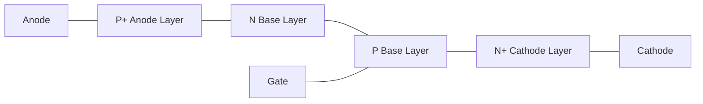

**મેમરી ટ્રીક:** "PANG" - P-એનોડ, એન્ડ, N-બેઝ, ગેટ-કંટ્રોલ્ડ થાયરિસ્ટર

## પ્રશ્ન 2(બ) OR [4 ગુણ]

**SCR માટેની સ્નબર સર્કિટની રચના અને જરૂરિયાતની ચર્ચા કરો.**

**ઉત્તર**:

**SCR માટે સ્નબર સર્કિટ:**

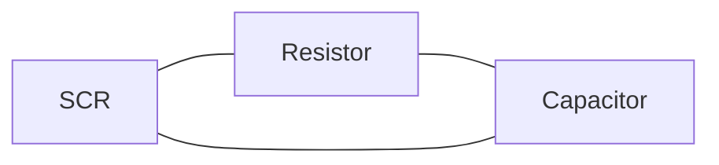

**ડિઝાઇન જરૂરિયાતો:**

- **રેઝિસ્ટર પસંદગી**: કેપેસિટર ડિસ્ચાર્જ કરંટને મર્યાદિત કરે છે
- **કેપેસિટર પસંદગી**: વોલ્ટેજ વૃદ્ધિના દર (dv/dt)ને નિયંત્રિત કરે છે
- **RC ટાઇમ કોન્સ્ટન્ટ**: રિસ્પોન્સ ટાઈમ નક્કી કરે છે

**સ્નબર સર્કિટનો હેતુ:**

- **dv/dt પ્રોટેક્શન**: ઝડપી વોલ્ટેજ પરિવર્તનને લીધે ખોટા ટ્રિગરિંગને અટકાવે છે
- **વોલ્ટેજ સ્પાઈક સપ્રેશન**: ઇન્ડક્ટિવ વોલ્ટેજ સ્પાઈક્સને શોષે છે
- **ટ્રાન્ઝિયન્ટ પ્રોટેક્શન**: સ્વિચિંગ દરમિયાન SCRને રક્ષણ આપે છે

**મેમરી ટ્રીક:** "RAPE" - રેઝિસ્ટર એન્ડ કેપેસિટર પ્રોટેક્ટ અગેઇન્સ્ટ એક્સેસિવ વોલ્ટેજ રાઇઝ

## પ્રશ્ન 2(ક) OR [7 ગુણ]

**ક્લાસ સી પ્રકારની કોમ્યુટેશન પદ્ધતિ સમજાવો.**

**ઉત્તર**:

**ક્લાસ C કોમ્યુટેશન (કોમ્પ્લિમેન્ટરી કોમ્યુટેશન):**

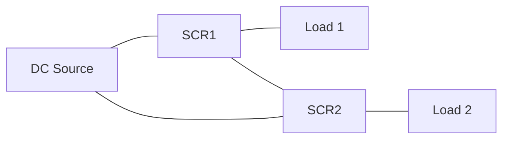

**કાર્ય સિદ્ધાંત:**

- **પ્રારંભિક સ્થિતિ**: SCR1 વહન કરે છે, SCR2 બંધ છે
- **કોમ્યુટેશન શરૂઆત**: SCR2 ટ્રિગર થાય છે
- **લોડ ટ્રાન્સફર**: કરંટ SCR1 થી SCR2 માં ટ્રાન્સફર થાય છે
- **વોલ્ટેજ રિવર્સલ**: SCR1 પર વોલ્ટેજ નેગેટિવ થાય છે
- **ટર્ન-ઓફ**: જ્યારે કરંટ હોલ્ડિંગ કરંટથી નીચે પડે ત્યારે SCR1 બંધ થાય છે
- **વૈકલ્પિક ઓપરેશન**: SCR1 અને SCR2 વૈકલ્પિક રીતે વહન કરે છે

**એપ્લિકેશન:**

- **ઇન્વર્ટર સર્કિટ્સ**: બ્રિજ ઇન્વર્ટરમાં વપરાય છે
- **ડ્યુઅલ લોડ સિસ્ટમ્સ**: જ્યાં વૈકલ્પિક ઓપરેશનની જરૂર હોય

**મેમરી ટ્રીક:** "TACTOR" - ટ્રિગરિંગ ઓલ્ટરનેટ SCRs ક્રિએટ્સ ટર્ન-ઓફ એન્ડ રિવર્સલ

## પ્રશ્ન 3(અ) [3 ગુણ]

**પોલીફેઝ રેક્ટિફાયરના ફાયદા વર્ણવો.**

**ઉત્તર**:

| ફાયદા | વર્ણન |
|-----------|-------------|
| **ઉચ્ચ કાર્યક્ષમતા** | ઓછું પાવર લોસ અને ટ્રાન્સફોર્મર વપરાશમાં સુધારો |
| **ઓછો રિપલ ફેક્ટર** | વધુ સારો DC આઉટપુટ જેથી નાના ફિલ્ટર કોમ્પોનન્ટ્સ જોઈએ |
| **ઉચ્ચ પાવર હેન્ડલિંગ** | સિંગલ ફેઝ કરતાં વધુ પાવર લેવલ હેન્ડલ કરી શકે છે |
| **બેટર ટ્રાન્સફોર્મર ઉપયોગ** | ઉચ્ચ ટ્રાન્સફોર્મર ઉપયોગિતા ફેક્ટર |
| **ઓછી હાર્મોનિક સામગ્રી** | આઉટપુટમાં ઘટેલા હાર્મોનિક ડિસ્ટોર્શન |

**મેમરી ટ્રીક:** "HELPS" - ઉચ્ચ કાર્યક્ષમતા, ઈવન આઉટપુટ, ઓછો રિપલ, પાવર હેન્ડલિંગ બેટર, નાના ફિલ્ટર

## પ્રશ્ન 3(બ) [4 ગુણ]

**સિંગલ ફેઇઝ હાફવેવ રેક્ટીફાયર સર્કિટ દોરો અને સમજાવો. વેવફોર્મ્સ દોરો.**

**ઉત્તર**:

**સિંગલ ફેઝ હાફ વેવ રેક્ટિફાયર:**


**વેવફોર્મ:**

```goat
    Voltage
      ^
      |     /\      /\      /\
      |    /  \    /  \    /  \
      |---/----\--/----\--/----\----> Time
      |         \       \       \
      |          \       \       \
      |
   Input AC
   
    Voltage
      ^
      |     /\      /\      /\
      |    /  \    /  \    /  \
      |---/----\--/----\--/----\----> Time
      |    
      |    
      |
   Output DC (Pulsating)
```

**કાર્ય સિદ્ધાંત:**

- **ફોરવર્ડ બાયસ**: ડાયોડ પોઝિટિવ હાફ-સાયકલ દરમિયાન વહન કરે છે
- **રિવર્સ બાયસ**: ડાયોડ નેગેટિવ હાફ-સાયકલ દરમિયાન કરંટને અવરોધે છે
- **આઉટપુટ**: પલ્સેટિંગ DC જેનો રિપલ ફેક્ટર ઊંચો હોય છે
- **ફ્રિક્વન્સી**: આઉટપુટ ફ્રિક્વન્સી ઇનપુટ ફ્રિક્વન્સી જેટલી જ રહે છે

**મેમરી ટ્રીક:** "PROF" - પોઝિટિવ હાફ કન્ડક્ટ્સ, રિવર્સ હાફ બ્લોક્સ, આઉટપુટ ઇઝ પલ્સેટિંગ, ફ્રિક્વન્સી અનચેન્જ્ડ

## પ્રશ્ન 3(ક) [7 ગુણ]

**બધાજ પ્રકારના ઇન્વર્ટરની યાદી બનાવો. તેમાંથી સિંગલફેઝ ફુલ બ્રિજ ઇન્વર્ટર સમજાવો.**

**ઉત્તર**:

**ઇન્વર્ટરના પ્રકારો:**

1. સર્કિટના આધારે: સીરીઝ, પેરેલલ, બ્રિજ
2. ફેઝના આધારે: સિંગલ-ફેઝ, થ્રી-ફેઝ
3. આઉટપુટના આધારે: સ્ક્વેર વેવ, મોડિફાઇડ સાઇન વેવ, પ્યોર સાઇન વેવ
4. કોમ્યુટેશનના આધારે: SCR-બેઝ્ડ, ટ્રાન્ઝિસ્ટર-બેઝ્ડ

**સિંગલ ફેઝ ફુલ બ્રિજ ઇન્વર્ટર:**

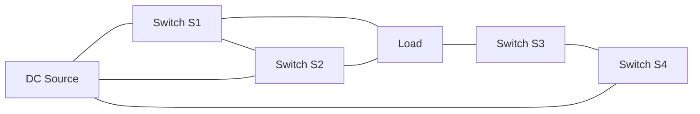

**કાર્ય સિદ્ધાંત:**

- **પ્રથમ અર્ધ-સાયકલ**: S1 અને S4 ON, S2 અને S3 OFF
- **બીજો અર્ધ-સાયકલ**: S2 અને S3 ON, S1 અને S4 OFF
- **આઉટપુટ વેવફોર્મ**: લોડ પર AC સ્ક્વેર વેવ
- **કંટ્રોલ મેથડ**: સ્વિચને 180° ફેઝ શિફ્ટ સાથે ગેટ સિગ્નલ આપવામાં આવે છે

**ફાયદાઓ:**

- **ઉચ્ચ આઉટપુટ પાવર**: હાફ બ્રિજની તુલનામાં બમણો આઉટપુટ
- **બેટર વોલ્ટેજ ઉપયોગ**: લોડ પર સંપૂર્ણ DC બસ વોલ્ટેજ
- **ઓછું કરંટ રેટિંગ**: દરેક સ્વિચ માત્ર લોડ કરંટ જ વહન કરે છે

**મેમરી ટ્રીક:** "SOAP" - સ્વિચેસ ઓપરેટ ઓલ્ટરનેટલી ઇન પેર્સ

## પ્રશ્ન 3(અ) OR [3 ગુણ]

**સરખાવો UPS અને SMPS.**

**ઉત્તર**:

| પેરામીટર | UPS (અનઇન્ટરપ્ટિબલ પાવર સપ્લાય) | SMPS (સ્વિચ્ડ મોડ પાવર સપ્લાય) |
|-----------|-------------------------------------|-----------------------------------|
| **મુખ્ય કાર્ય** | પાવર ફેઇલ થાય ત્યારે બેકઅપ પાવર આપે છે | AC થી રેગ્યુલેટેડ DC માં રૂપાંતર કરે છે |
| **બેટરી બેકઅપ** | બેકઅપ માટે બેટરી ધરાવે છે | કોઈ બેટરી બેકઅપ નથી |
| **આઉટપુટ** | AC આઉટપુટ (મોટેભાગે) | DC આઉટપુટ (મોટેભાગે) |
| **કાર્યક્ષમતા** | ઓછી (70-80%) | ઉચ્ચ (80-95%) |
| **સાઇઝ** | મોટું અને ભારે | કોમ્પેક્ટ અને હલકું |
| **એપ્લિકેશન** | કોમ્પ્યુટર, સર્વર, ક્રિટિકલ ઇક્વિપમેન્ટ | ઇલેક્ટ્રોનિક ડિવાઇસ, ચાર્જર |

**મેમરી ટ્રીક:** "BBOSS" - બેકઅપ બેટરી ઓન્લી ઇન UPS, સ્મોલ સાઇઝ ઇન SMPS

## પ્રશ્ન 3(બ) OR [4 ગુણ]

**થ્રી ફેઇઝ હાફ વેવ રેક્ટીફાયર સર્કિટ દોરો અને સમજાવો. વેવફોર્મ્સદોરો.**

**ઉત્તર**:

**થ્રી ફેઝ હાફ વેવ રેક્ટિફાયર:**

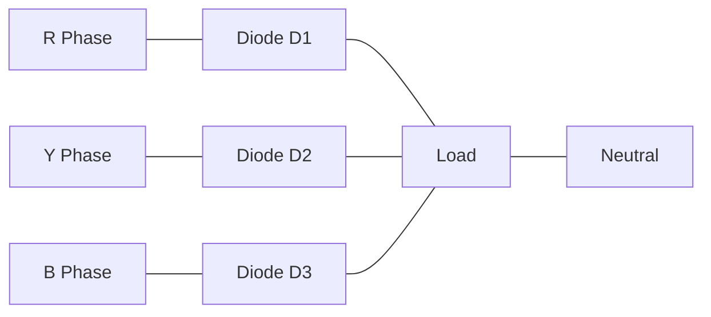

**વેવફોર્મ:**

```goat
     Voltage
       ^
       |   
       |    /\    /\    /\    /\    /\    /\
       |   /  \  /  \  /  \  /  \  /  \  /  \
       |--/----\/----\/----\/----\/----\/----\--> Time
       |   R    Y    B    R    Y    B    R
       |   
    Input (Three phase)
    
     Voltage
       ^
       |   
       |    /\    /\    /\    /\    /\    /\
       |   /  \  /  \  /  \  /  \  /  \  /  \
       |--/----\/----\/----\/----\/----\/----\--> Time
       |      
       |   
    Output DC (Less ripple)
```

**કાર્ય સિદ્ધાંત:**

- **કન્ડક્શન સિક્વન્સ**: જ્યારે તેની ફેઝ વોલ્ટેજ સૌથી વધુ હોય ત્યારે દરેક ડાયોડ વહન કરે છે
- **કન્ડક્શન એંગલ**: દરેક ડાયોડ 120° માટે વહન કરે છે
- **આઉટપુટ રિપલ**: સાયકલ દીઠ 3 પલ્સ, સિંગલ ફેઝ કરતાં ઓછો રિપલ
- **રિપલ ફ્રિક્વન્સી**: ઇનપુટ ફ્રિક્વન્સીથી 3 ગણી

**મેમરી ટ્રીક:** "CROP" - કન્ડક્શન ઓફ 120°, રિપલ રિડ્યુસ્ડ, આઉટપુટ સ્મૂધર, પલ્સ ટ્રિપલ્ડ

## પ્રશ્ન 3(ક) OR [7 ગુણ]

**ચોપરને વ્યાખ્યાયિત કરો. ક્લાસ ડી ચોપરનો પરિપથ દોરો અને સમજાવો.**

**ઉત્તર**:

**ચોપરની વ્યાખ્યા:**
ચોપર એ DC થી DC કન્વર્ટર છે જે ફિક્સ્ડ DC ઇનપુટ વોલ્ટેજને હાઈ-ફ્રિક્વન્સી સ્વિચિંગનો ઉપયોગ કરીને વેરિએબલ DC આઉટપુટ વોલ્ટેજમાં રૂપાંતરિત કરે છે.

**ક્લાસ D ચોપર (બે-ક્વાડ્રન્ટ ચોપર):**

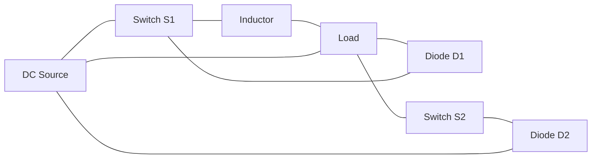

**કાર્ય સિદ્ધાંત:**

- **પ્રથમ ક્વાડ્રન્ટ ઓપરેશન (ફોરવર્ડ મોટરિંગ):**
  - S1 ON, S2 OFF: ઊર્જા સ્ત્રોતથી લોડ તરફ વહે છે
  - S1 OFF, S2 OFF: કરંટ D2 દ્વારા ફ્રીવ્હીલ થાય છે
  
- **બીજા ક્વાડ્રન્ટ ઓપરેશન (ફોરવર્ડ રિજનરેશન):**
  - S1 OFF, S2 ON: ઊર્જા લોડથી સ્ત્રોત તરફ વહે છે
  - S1 OFF, S2 OFF: કરંટ D1 દ્વારા ફ્રીવ્હીલ થાય છે

**એપ્લિકેશન:**

- **DC મોટર ડ્રાઇવ**: ફોરવર્ડ મોટરિંગ અને રિજનરેટિવ બ્રેકિંગ પ્રદાન કરે છે
- **બેટરી ચાર્જિંગ**: ચાર્જિંગ કરંટનું નિયંત્રણ
- **રીન્યુએબલ એનર્જી**: સોલાર પેનલ સાથે ઇન્ટરફેસિંગ

**મેમરી ટ્રીક:** "FRED" - ફોરવર્ડ મોટરિંગ, રિજનરેટિવ બ્રેકિંગ, એનર્જી ફ્લો કંટ્રોલ, ડ્યુઅલ ક્વાડ્રન્ટ ઓપરેશન

## પ્રશ્ન 4(અ) [3 ગુણ]

**SCRનો સ્ટેટિક સ્વીચ તરીકેનો ઉપયોગ સમજાવો.**

**ઉત્તર**:

**SCR એઝ સ્ટેટિક સ્વિચ:**

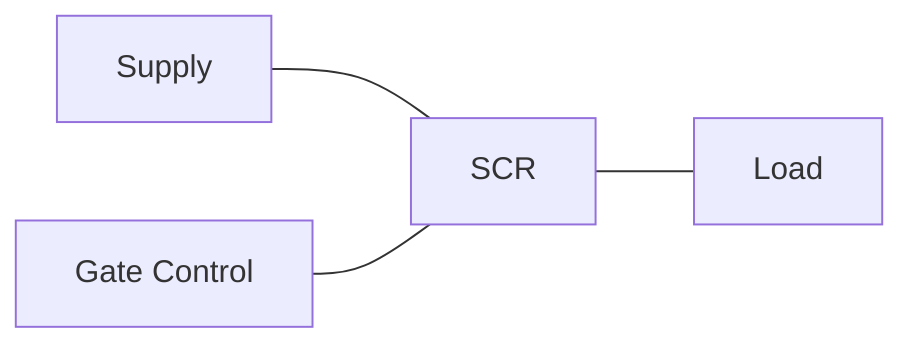

**મુખ્ય વિશેષતાઓ:**

- **કોઈ મૂવિંગ પાર્ટ્સ નહીં**: શુદ્ધ ઇલેક્ટ્રોનિક સ્વિચિંગ
- **ઝડપી સ્વિચિંગ**: માઇક્રોસેકન્ડ રિસ્પોન્સ ટાઈમ
- **ઉચ્ચ વિશ્વસનીયતા**: મિકેનિકલ સ્વિચ કરતાં લાંબું આયુષ્ય
- **નિયંત્રિત ટર્ન-ઓન**: ગેટ સિગ્નલ દ્વારા ચોક્કસ નિયંત્રણ

**મિકેનિકલ સ્વિચ કરતાં ફાયદા:**

- **કોઈ આર્કિંગ નહીં**: કોઈ કોન્ટેક્ટ બાઉન્સ કે ઘસારો નહીં
- **સાયલેન્ટ ઓપરેશન**: કોઈ મિકેનિકલ અવાજ નહીં
- **EMI ઘટાડો**: ઓછું ઇલેક્ટ્રોમેગ્નેટિક ઇન્ટરફેરન્સ

**મેમરી ટ્રીક:** "FANS" - ફાસ્ટ સ્વિચિંગ, આર્ક-ફ્રી ઓપરેશન, નો મિકેનિકલ વેર, સાયલેન્ટ ઓપરેશન

## પ્રશ્ન 4(બ) [4 ગુણ]

**DIAC અને TRIACનો ઉપયોગ કરી A.C પાવર કંટ્રોલનો સર્કિટ ડાયગ્રામ દોરો અને તેનું કાર્ય સમજાવો.**

**ઉત્તર**:

**DIAC અને TRIAC વડે AC પાવર કંટ્રોલ:**

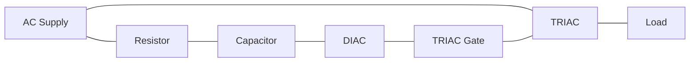

**કાર્ય સિદ્ધાંત:**

- **RC નેટવર્ક**: ગેટ પલ્સને વિલંબિત કરીને ફાયરિંગ એંગલનું નિયંત્રણ કરે છે
- **કેપેસિટર ચાર્જિંગ**: C દરેક હાફ-સાયકલ દરમિયાન R મારફતે ચાર્જ થાય છે
- **DIAC બ્રેકડાઉન**: જ્યારે કેપેસિટર વોલ્ટેજ DIAC બ્રેકઓવર વોલ્ટેજ સુધી પહોંચે
- **TRIAC ટ્રિગરિંગ**: DIAC વહન કરે છે અને TRIAC ટ્રિગર કરે છે
- **પાવર કંટ્રોલ**: R ને બદલવાથી ફાયરિંગ એંગલ અને પાવર ડિલિવરી બદલાય છે

**એપ્લિકેશન:**

- **લાઈટ ડિમર્સ**: લેમ્પની બ્રાઈટનેસ કંટ્રોલ
- **ફેન સ્પીડ કંટ્રોલ**: પંખાની ગતિનું નિયંત્રણ
- **હીટર કંટ્રોલ**: હીટિંગ એલિમેન્ટ્સ એડજસ્ટ કરવા

**મેમરી ટ્રીક:** "CRAFT" - કેપેસિટર ચાર્જેસ, રીચેસ બ્રેકઓવર, એક્ટિવેટ્સ DIAC, ફાયર્સ TRIAC, ટ્રાન્સફર્સ પાવર

## પ્રશ્ન 4(ક) [7 ગુણ]

**ઇન્ડક્શન હીટિંગનો કાર્યકારી સિદ્ધાંત સમજાવો તદુપરાંત ઇન્ડક્શન હીટિંગના ઉપયોગો લખો.**

**ઉત્તર**:

**ઇન્ડક્શન હીટિંગનો કાર્યકારી સિદ્ધાંત:**

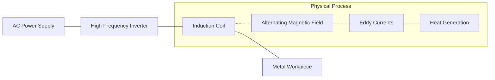

**કાર્ય સિદ્ધાંત:**

- **હાઈ-ફ્રિક્વન્સી કરંટ**: ઇન્ડક્શન કોઈલમાંથી પસાર થાય છે
- **ઇલેક્ટ્રોમેગ્નેટિક ઇન્ડક્શન**: ઓલ્ટરનેટિંગ મેગ્નેટિક ફિલ્ડ ઉત્પન્ન કરે છે
- **એડી કરંટ**: વર્કપીસમાં પ્રેરિત થાય છે
- **રેઝિસ્ટન્સ હીટિંગ**: એડી કરંટ રેઝિસ્ટન્સને કારણે ગરમી ઉત્પન્ન કરે છે
- **સ્કિન ઇફેક્ટ**: સપાટીની નજીક ગરમી કેન્દ્રિત થાય છે
- **નોન-કોન્ટેક્ટ હીટિંગ**: કોઈલ અને વર્કપીસ વચ્ચે કોઈ શારીરિક સંપર્ક નથી

**ઇન્ડક્શન હીટિંગના ઉપયોગો:**

- **મેટલ હીટ ટ્રીટમેન્ટ**: હાર્ડનિંગ, એનિલિંગ, ટેમ્પરિંગ
- **મેટલ મેલ્ટિંગ**: ફાઉન્ડ્રી ઓપરેશન્સ
- **વેલ્ડિંગ અને બ્રેઝિંગ**: મેટલ કોમ્પોનન્ટ્સની જોડાણ
- **ફોર્જિંગ**: ફોર્મિંગ પહેલાં હીટિંગ
- **ઘરેલું રસોઈ**: ઇન્ડક્શન કૂકટોપ
- **સેમિકન્ડક્ટર પ્રોસેસિંગ**: ક્રિસ્ટલ ગ્રોથ

**મેમરી ટ્રીક:** "MASTER" - મેગ્નેટિક ફિલ્ડ, ઓલ્ટરનેટિંગ કરંટ, સરફેસ હીટિંગ, ટેમ્પરેચર કંટ્રોલ, એડી કરંટ્સ, રેઝિસ્ટન્સ હીટિંગ

## પ્રશ્ન 4(અ) OR [3 ગુણ]

**એલડીઆરનો ઉપયોગ કરીને ફોટો રિલે સર્કિટનું કાર્ય સમજાવો.**

**ઉત્તર**:

**LDR વાળો ફોટો રિલે સર્કિટ:**

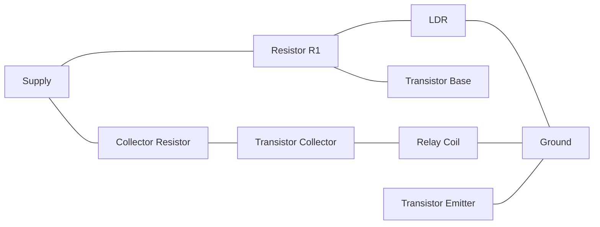

**કાર્ય સિદ્ધાંત:**

- **લાઈટ-ડિપેન્ડન્ટ રેઝિસ્ટર**: પ્રકાશ વધતાં રેઝિસ્ટન્સ ઘટે છે
- **વોલ્ટેજ ડિવાઈડર**: LDR અને R1 વોલ્ટેજ ડિવાઈડર બનાવે છે
- **ટ્રાન્ઝિસ્ટર સ્વિચિંગ**: બેઝ વોલ્ટેજ ટ્રાન્ઝિસ્ટર કન્ડક્શનને નિયંત્રિત કરે છે
- **રિલે ઓપરેશન**: ટ્રાન્ઝિસ્ટર રિલે કોઈલને ડ્રાઈવ કરે છે
- **થ્રેશોલ્ડ એડજસ્ટમેન્ટ**: વેરિએબલ રેઝિસ્ટર વડે સેટ કરી શકાય છે

**એપ્લિકેશન:**

- **ઓટોમેટિક સ્ટ્રીટ લાઈટિંગ**: સાંજ પડતાં લાઈટ ચાલુ કરે છે
- **ડે/નાઈટ સ્વિચિંગ**: એમ્બિયન્ટ લાઈટના આધારે ડિવાઈસ કંટ્રોલ
- **સિક્યોરિટી સિસ્ટમ**: લાઈટ-એક્ટિવેટેડ અલાર્મ

**મેમરી ટ્રીક:** "LARK" - લાઈટ કંટ્રોલ્સ, એક્ટિવેટ્સ ટ્રાન્ઝિસ્ટર, રિલે સ્વિચેસ, કીપ્સ સર્કિટ ઓટોમેટેડ

## પ્રશ્ન 4(બ) OR [4 ગુણ]

**555 ટાઈમર ICની મદદથી ટાઈમર સર્કિટનું કાર્ય સમજાવો.**

**ઉત્તર**:

**555 ટાઇમર સર્કિટ (મોનોસ્ટેબલ):**

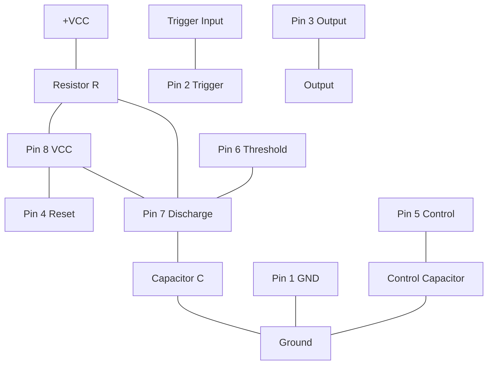

**કાર્ય સિદ્ધાંત:**

- **ટ્રિગર ઇનપુટ**: પિન 2 પર એક્ટિવ લો ટ્રિગર
- **ટાઇમિંગ કોમ્પોનન્ટ્સ**: R અને C ટાઇમિંગ પીરિયડ નક્કી કરે છે (T = 1.1RC)
- **આઉટપુટ હાઈ**: ટ્રિગર થવા પર, આઉટપુટ હાઈ થાય છે
- **કેપેસિટર ચાર્જિંગ**: C, R મારફતે ચાર્જ થાય છે
- **થ્રેશોલ્ડ ડિટેક્શન**: જ્યારે વોલ્ટેજ 2/3 VCC સુધી પહોંચે, આઉટપુટ લો થાય છે
- **ટાઇમર રિસેટ**: પિન 4 વડે સર્કિટ રિસેટ કરી શકાય છે

**એપ્લિકેશન:**

- **ડિલે સર્કિટ્સ**: ટાઈમ ડિલે બનાવવા
- **પલ્સ જનરેશન**: ચોક્કસ પલ્સ જનરેટ કરવા
- **ટાઇમિંગ કંટ્રોલ**: સિક્વેન્શિયલ ટાઇમિંગ ઓપરેશન્સ

**મેમરી ટ્રીક:** "TRACT" - ટ્રિગર એક્ટિવેટ્સ, રેઝિસ્ટર-કેપેસિટર ટાઇમિંગ, એક્યુરેટ ડિલે, કેપેસિટર ચાર્જેસ, થ્રેશોલ્ડ ડિટેક્શન

## પ્રશ્ન 4(ક) OR [7 ગુણ]

**ડાઈઇલેક્ટ્રીક હીટિંગનો કાર્યકારી સિદ્ધાંત સમજાવો તદુપરાંત ડાઈઇલેક્ટ્રીક હીટિંગના ઉપયોગો લખો.**

**ઉત્તર**:

**ડાઈઇલેક્ટ્રીક હીટિંગનો કાર્યકારી સિદ્ધાંત:**

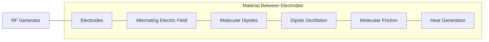

**કાર્ય સિદ્ધાંત:**

- **ઉચ્ચ-ફ્રિક્વન્સી ઇલેક્ટ્રિક ફિલ્ડ**: ઇલેક્ટ્રોડ્સ વચ્ચે લાગુ કરવામાં આવે છે
- **ડાઈઇલેક્ટ્રીક મટીરિયલ**: ઇલેક્ટ્રોડ્સ વચ્ચે મૂકવામાં આવે છે
- **મોલેક્યુલર પોલરાઈઝેશન**: ડાયપોલ્સ ઇલેક્ટ્રિક ફિલ્ડ સાથે એલાઇન થાય છે
- **ફિલ્ડ ઓસિલેશન**: ફિલ્ડની દિશાનું ઝડપી રિવર્સલ
- **મોલેક્યુલર ફ્રિક્શન**: ડાયપોલ્સ ઝડપથી રોટેટ થઈને ફ્રિક્શન ઉત્પન્ન કરે છે
- **વોલ્યુમેટ્રિક હીટિંગ**: સમગ્ર મટીરિયલમાં ગરમી ઉત્પન્ન થાય છે
- **ફ્રિક્વન્સી રેન્જ**: સામાન્ય રીતે 10-100 MHz

**ડાઈઇલેક્ટ્રીક હીટિંગના ઉપયોગો:**

- **ફૂડ પ્રોસેસિંગ**: બેકિંગ, ડ્રાયિંગ, પાશ્ચરાઈઝેશન
- **વુડ ઇન્ડસ્ટ્રી**: ગ્લુઈંગ, ટિમ્બર ડ્રાઈંગ
- **ટેક્સટાઈલ ડ્રાઈંગ**: કાપડમાંથી ભેજ દૂર કરવો
- **પ્લાસ્ટિક વેલ્ડિંગ**: થર્મોપ્લાસ્ટિક્સ જોડવા
- **મેડિકલ એપ્લિકેશન**: થેરાપ્યુટિક ડાયથર્મી
- **પેપર ઇન્ડસ્ટ્રી**: પેપર પ્રોડક્ટ્સ ડ્રાઈંગ

**મેમરી ટ્રીક:** "DIPOLE" - ડાઈઇલેક્ટ્રિક મટિરિયલ, ઇન્ટેન્સ ઇલેક્ટ્રિક ફિલ્ડ, પોલરાઈઝેશન ઓફ મોલેક્યુલ્સ, ઓસિલેશન કોઝેસ, લિંકેજ ઓફ હીટ, ઈવન હીટિંગ થ્રુઆઉટ

## પ્રશ્ન 5(અ) [3 ગુણ]

**AC ડ્રાઈવને વ્યાખ્યાયિત કરો. AC ડ્રાઈવના ઉપયોગો જણાવો.**

**ઉત્તર**:

**AC ડ્રાઈવની વ્યાખ્યા:**
AC ડ્રાઈવ એક ઇલેક્ટ્રોનિક ડિવાઈસ છે જે AC મોટરને આપવામાં આવતા ફ્રિક્વન્સી અને વોલ્ટેજમાં ફેરફાર કરીને AC મોટરની સ્પીડ, ટોર્ક અને દિશાનું નિયંત્રણ કરે છે.

**AC ડ્રાઈવના ઉપયોગો:**

| એપ્લિકેશન એરિયા | ઉદાહરણો |
|------------------|----------|
| **ઔદ્યોગિક** | કન્વેયર સિસ્ટમ્સ, પમ્પ્સ, ફેન્સ, કોમ્પ્રેસર્સ |
| **HVAC** | બ્લોઅર્સ, કૂલિંગ ટાવર્સ, એર હેન્ડલિંગ યુનિટ્સ |
| **વોટર ટ્રીટમેન્ટ** | પમ્પ્સ, મિક્સર્સ, એરેટર્સ |
| **માઈનિંગ** | ક્રશર્સ, કન્વેયર્સ, પમ્પ્સ |
| **ટેક્સટાઈલ** | સ્પિનિંગ મશીન્સ, લૂમ્સ, વાઈન્ડર્સ |
| **મટિરિયલ હેન્ડલિંગ** | ક્રેન્સ, એલિવેટર્સ, એસ્કેલેટર્સ |

**મેમરી ટ્રીક:** "PITCHW" - પમ્પ્સ, ઇન્ડસ્ટ્રિયલ મશીનરી, ટેક્સટાઈલ મશીન્સ, કન્વેયર સિસ્ટમ્સ, HVAC સિસ્ટમ્સ, વોટર ટ્રીટમેન્ટ

## પ્રશ્ન 5(બ) [4 ગુણ]

**ડીસી સંટ મોટરની ગતિને નિયંત્રિત કરવા માટેની કોઈ એક પદ્ધતિ ની સર્કિટ દોરો અને સમજાવો.**

**ઉત્તર**:

**DC શંટ મોટર માટે આર્મેચર વોલ્ટેજ કંટ્રોલ મેથડ:**

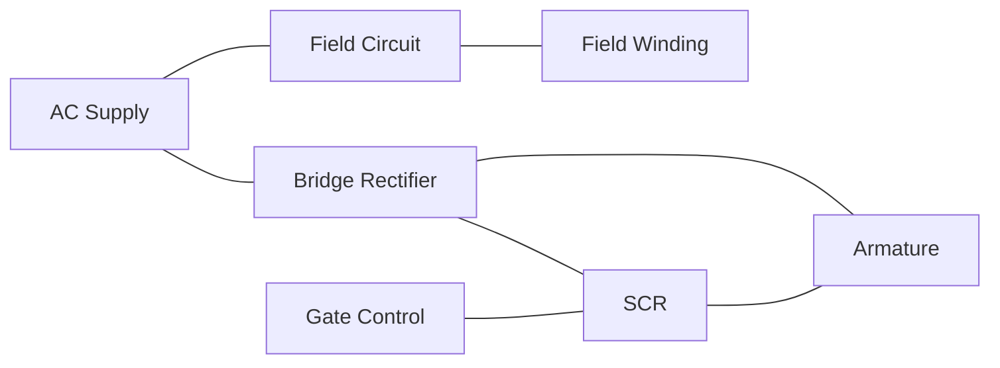

**કાર્ય સિદ્ધાંત:**

- **કોન્સ્ટન્ટ ફિલ્ડ કરંટ**: ફિલ્ડ સપ્લાય સ્થિર રાખવામાં આવે છે
- **વેરિએબલ આર્મેચર વોલ્ટેજ**: SCR દ્વારા નિયંત્રિત
- **સ્પીડ ઈક્વેશન**: N ∝ (Vₐ - IₐRₐ)/Φ
- **સ્પીડ કંટ્રોલ**: આર્મેચર વોલ્ટેજ Vₐ બદલીને
- **ટોર્ક કંટ્રોલ**: આર્મેચર કરંટ ટોર્ક નિયંત્રિત કરે છે

**ફાયદાઓ:**

- **વાઈડ સ્પીડ રેન્જ**: બેઝ સ્પીડની નીચે અને ઉપર સ્પીડ મેળવી શકાય છે
- **સ્મૂધ કંટ્રોલ**: સતત સ્પીડ એડજસ્ટમેન્ટ
- **હાઈ એફિશિયન્સી**: કંટ્રોલ સર્કિટમાં ઓછો પાવર લોસ

**મેમરી ટ્રીક:** "SAVE" - SCR કંટ્રોલ્સ, આર્મેચર વોલ્ટેજ વેરીસ, વેલોસિટી ચેન્જેસ, એફિશિયન્ટ ઓપરેશન

## પ્રશ્ન 5(ક) [7 ગુણ]

**PLCનો બ્લોક ડાયગ્રામ દોરો અને દરેક બ્લોકનું કાર્ય સમજાવો.**

**ઉત્તર**:

**PLC બ્લોક ડાયગ્રામ:**

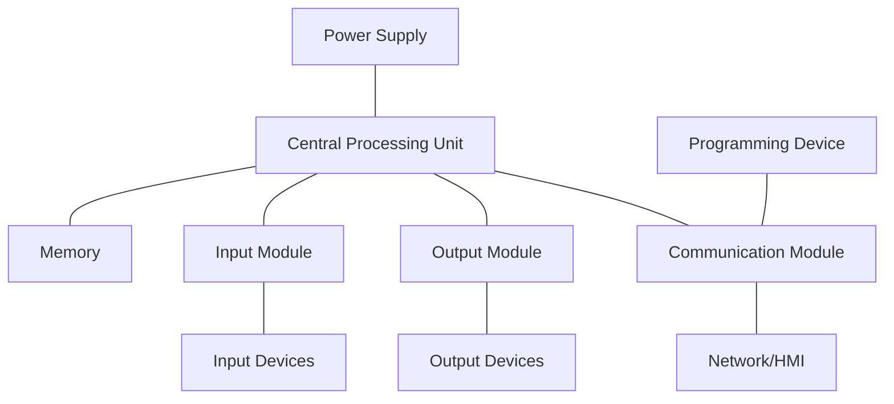

**દરેક બ્લોકનું કાર્ય:**

| બ્લોક | કાર્ય |
|-------|----------|
| **પાવર સપ્લાય** | મેઈન AC સપ્લાયને ઇન્ટરનલ સર્કિટ માટે જરૂરી DC માં રૂપાંતરિત કરે છે |
| **CPU** | પ્રોગ્રામ એક્ઝીક્યુટ કરે છે, I/O પ્રોસેસ કરે છે, કેલ્ક્યુલેશન કરે છે |
| **મેમરી** | પ્રોગ્રામ, ડેટા અને I/O સ્ટેટસ સ્ટોર કરે છે (RAM, ROM, EEPROM) |
| **ઇનપુટ મોડ્યુલ** | ઇનપુટ ડિવાઈસ સાથે ઇન્ટરફેસ કરે છે, આઇસોલેશન, સિગ્નલ કન્ડિશનિંગ આપે છે |
| **આઉટપુટ મોડ્યુલ** | આઉટપુટ ડિવાઈસને ડ્રાઈવ કરે છે, આઇસોલેશન અને પ્રોટેક્શન આપે છે |
| **કોમ્યુનિકેશન મોડ્યુલ** | PLC ને નેટવર્ક, અન્ય PLC અને પ્રોગ્રામિંગ ડિવાઈસ સાથે જોડે છે |
| **પ્રોગ્રામિંગ ડિવાઈસ** | PLC પ્રોગ્રામ ડેવલપ, એડિટ અને મોનિટર કરવા માટે વપરાય છે |

**PLCના ફાયદાઓ:**

- **રિલાયબિલિટી**: સોલિડ-સ્ટેટ કોમ્પોનન્ટ્સ ઉચ્ચ MTBF સાથે
- **ફ્લેક્સિબિલિટી**: વિવિધ એપ્લિકેશન્સ માટે સરળતાથી રીપ્રોગ્રામ થઈ શકે છે
- **કોમ્યુનિકેશન**: ડિસ્ટ્રિબ્યુટેડ કંટ્રોલ માટે નેટવર્ક ક્ષમતાઓ
- **ડાયગ્નોસ્ટિક્સ**: બિલ્ટ-ઇન ડાયગ્નોસ્ટિક્સ અને ટ્રબલશૂટિંગ

**મેમરી ટ્રીક:** "PRIME-C" - પાવર સપ્લાય, RAM/ROM મેમરી, ઇનપુટ મોડ્યુલ, માઇક્રોપ્રોસેસર (CPU), એક્ઝિક્યુશન ઓફ પ્રોગ્રામ, કોમ્યુનિકેશન ઇન્ટરફેસ

## પ્રશ્ન 5(અ) OR [3 ગુણ]

**સ્ટેપર મોટરના ઉપયોગો જણાવો.**

**ઉત્તર**:

| એપ્લિકેશન એરિયા | ઉદાહરણો |
|------------------|----------|
| **પ્રિસિઝન પોઝિશનિંગ** | CNC મશીન્સ, 3D પ્રિન્ટર્સ, રોબોટિક આર્મ્સ |
| **ઓફિસ ઇક્વિપમેન્ટ** | પ્રિન્ટર્સ, સ્કેનર્સ, ફોટોકોપિયર્સ |
| **મેડિકલ ડિવાઈસ** | સર્જિકલ રોબોટ્સ, ફ્લુઈડ પમ્પ્સ, સેમ્પલ હેન્ડલર્સ |
| **ઓટોમોટિવ** | હેડલાઈટ એડજસ્ટમેન્ટ, આઈડલ કંટ્રોલ, મિરર કંટ્રોલ |
| **એરોસ્પેસ** | સેટેલાઈટ પોઝિશનિંગ, એન્ટેના કંટ્રોલ |
| **કન્ઝ્યુમર ઇલેક્ટ્રોનિક્સ** | કેમેરા (ફોકસ/ઝૂમ), ગેમિંગ કંટ્રોલર્સ |

**મેમરી ટ્રીક:** "POMAC" - પોઝિશનિંગ સિસ્ટમ્સ, ઓફિસ ઇક્વિપમેન્ટ, મેડિકલ ડિવાઈસ, ઓટોમોટિવ કંટ્રોલ્સ, કન્ઝ્યુમર ઇલેક્ટ્રોનિક્સ

## પ્રશ્ન 5(બ) OR [4 ગુણ]

**ડીસી સીરીઝ મોટરની ગતિને નિયંત્રિત કરવા માટે સર્કિટ દોરો અને સમજાવો.**

**ઉત્તર**:

**SCR વડે DC સીરીઝ મોટર સ્પીડ કંટ્રોલ:**

```mermaid
graph LR
    AC[AC Supply] --- B[Bridge Rectifier]
    B --- SCR[SCR] --- A[Armature]
    A --- SF[Series Field]
    SF --- B
    GC[Gate Control] --- SCR
```

**કાર્ય સિદ્ધાંત:**

- **સીરીઝ કનેક્શન**: ફિલ્ડ વાઈન્ડિંગ આર્મેચર સાથે સીરીઝમાં
- **SCR કંટ્રોલ**: ફેઝ-કંટ્રોલ્ડ SCR એવરેજ વોલ્ટેજ રેગ્યુલેટ કરે છે
- **સ્પીડ ઈક્વેશન**: N ∝ (V - I(Ra+Rf))/IΦ
- **સ્પીડ-ટોર્ક રિલેશન**: નોન-લિનિયર રિલેશનશિપ
- **એપ્લિકેશન**: જ્યાં હાઈ સ્ટાર્ટિંગ ટોર્ક જરૂરી હોય ત્યાં વપરાય છે

**ફાયદાઓ:**

- **હાઈ સ્ટાર્ટિંગ ટોર્ક**: ટ્રેક્શન એપ્લિકેશન્સ માટે આદર્શ
- **સિમ્પલ કંટ્રોલ**: બેઝિક સર્કિટ ડિઝાઇન
- **કોસ્ટ-ઇફેક્ટિવ**: અન્ય પદ્ધતિઓ કરતાં ઓછા કોમ્પોનન્ટ્સ

**મેમરી ટ્રીક:** "SCAT" - સીરીઝ કનેક્શન, કરંટ કંટ્રોલ્સ ફ્લક્સ, એવરેજ વોલ્ટેજ કંટ્રોલ્ડ બાય SCR, ટોર્ક હાઈએસ્ટ એટ લો સ્પીડ્સ

## પ્રશ્ન 5(ક) OR [7 ગુણ]

**BLDC મોટરની વિસ્તૃતમાં ચર્ચા કરો.**

**ઉત્તર**:

**BLDC મોટર (બ્રશલેસ DC મોટર):**

```mermaid
graph LR
    subgraph "BLDC મોટર કન્સ્ટ્રક્શન"
    Stator[સ્ટેટર વિથ વાઈન્ડિંગ્સ]
    Rotor[રોટર વિથ પર્મેનન્ટ મેગ્નેટ્સ]
    Hall[હોલ સેન્સર્સ]
    end

    subgraph "કંટ્રોલ સિસ્ટમ"
    Controller[ઇલેક્ટ્રોનિક કંટ્રોલર]
    Driver[પાવર ડ્રાઈવર]
    Feedback[પોઝિશન ફીડબેક]
    end
    
    Controller --- Driver
    Driver --- Stator
    Hall --- Feedback
    Feedback --- Controller
```

**રચના:**

- **સ્ટેટર**: વાઈન્ડિંગ્સ ધરાવે છે (સામાન્ય રીતે 3-ફેઝ)
- **રોટર**: રોટર પર પર્મેનન્ટ મેગ્નેટ્સ
- **પોઝિશન સેન્સિંગ**: હોલ ઇફેક્ટ સેન્સર્સ અથવા એન્કોડર્સ
- **કંટ્રોલર**: ઇલેક્ટ્રોનિક કોમ્યુટેશન કંટ્રોલર

**કાર્ય સિદ્ધાંત:**

- **ઇલેક્ટ્રોનિક કોમ્યુટેશન**: મિકેનિકલ બ્રશની જગ્યાએ
- **સિક્વન્સિંગ**: કંટ્રોલર સ્ટેટર કોઈલ્સને સિક્વન્સમાં એનર્જાઈઝ કરે છે
- **પોઝિશન ફીડબેક**: હોલ સેન્સર્સ રોટર પોઝિશન નક્કી કરે છે
- **ફેઝ એનર્જાઈઝિંગ**: રોટર પોઝિશનના આધારે યોગ્ય ફેઝ એનર્જાઈઝ થાય છે

**ફાયદાઓ:**

- **હાઈ એફિશિયન્સી**: કોઈ બ્રશ ફ્રિક્શન લોસ નહીં
- **લો મેઈન્ટેનન્સ**: કોઈ બ્રશ વેર નહીં
- **લાંબુ આયુષ્ય**: વિશ્વસનીય ઓપરેશન
- **બેટર સ્પીડ-ટોર્ક કેરેક્ટરિસ્ટિક્સ**: ફ્લેટ કર્વ
- **લો નોઈઝ**: શાંત ઓપરેશન
- **બેટર હીટ ડિસિપેશન**: સ્ટેટર પર વાઈન્ડિંગ્સ

**એપ્લિકેશન:**

- **કોમ્પ્યુટર કૂલિંગ ફેન્સ**: CPU/GPU કૂલર્સ
- **હાર્ડ ડિસ્ક ડ્રાઈવ્સ**: સ્પિન્ડલ મોટર્સ
- **ઇલેક્ટ્રિક વ્હીકલ્સ**: પ્રોપલ્શન સિસ્ટમ્સ
- **ડ્રોન્સ**: પ્રોપેલર મોટર્સ
- **હોમ એપ્લાયન્સેસ**: વોશિંગ મશીન્સ, રેફ્રિજરેટર્સ
- **ઔદ્યોગિક ઓટોમેશન**: પ્રિસિઝન કંટ્રોલ સિસ્ટમ્સ

**મેમરી ટ્રીક:** "COPPER" - કોમ્યુટેશન ઇલેક્ટ્રોનિક, ઓપરેશન એફિશિયન્ટ, પર્મેનન્ટ મેગ્નેટ્સ, પોઝિશન સેન્સર્સ, ઇલેક્ટ્રોનિક કંટ્રોલ, રિલાયબલ પરફોર્મન્સ
