## Question 1(a) [3 marks]

**Draw symbol and construction of SCR. Also write down applications of SCR.**

**Answer**:

**Symbol and Construction of SCR:**

```goat
    Anode (A)
       |
       v
       _
      | |
      | |
  G ->|_|  
      | |
      |_|
       |
       v
   Cathode (K)
```

**Construction:**

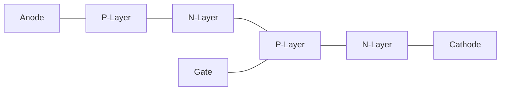

**Applications of SCR:**

- **Power control**: AC/DC power regulators
- **Motor drives**: Speed control of motors
- **Lighting control**: Dimmer circuits
- **Inverters**: DC to AC conversion

**Mnemonic:** "PALS" - Power control, Appliance control, Lighting systems, Speed regulators

## Question 1(b) [4 marks]

**State full form of (i) SCS (ii) LASCR (iii) MCT (iv) PUT.**

**Answer**:

| Device | Full Form |
|--------|-----------|
| **SCS** | Silicon Controlled Switch |
| **LASCR** | Light Activated Silicon Controlled Rectifier |
| **MCT** | MOS Controlled Thyristor |
| **PUT** | Programmable Unijunction Transistor |

**Mnemonic:** "SLaMP" - Silicon controlled switch, Light activated SCR, MOS controlled thyristor, Programmable UJT

## Question 1(c) [7 marks]

**Draw and explain V-I characteristics of TRIAC. Also write down applications of TRIAC.**

**Answer**:

**V-I Characteristics of TRIAC:**

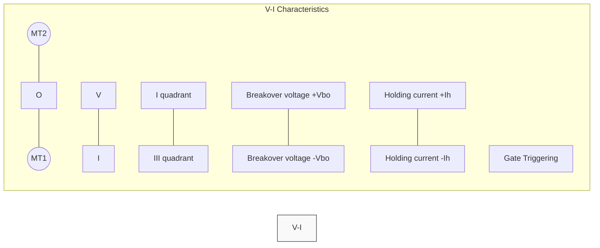

**TRIAC V-I characteristics explanation:**

- **Bidirectional device**: Conducts in both directions
- **Quadrant operation**: Works in 1st and 3rd quadrants
- **Breakover voltage**: Starts conducting when voltage exceeds ±Vbo
- **Holding current**: Minimum current to maintain conduction state
- **Gate triggering**: Can be triggered with positive/negative gate voltage

**Applications of TRIAC:**

- **AC power control**: Lamp dimmers, heater controls
- **Motor speed control**: AC motor regulators
- **Fan regulators**: Domestic fan speed control
- **Light dimmers**: Adjustable lighting systems

**Mnemonic:** "HALF" - Heaters, AC controls, Lighting systems, Fan regulators

## Question 1(c) OR [7 marks]

**Explain construction and working of IGBT in detail.**

**Answer**:

**IGBT Construction and Working:**


**Construction details:**

- **Three-terminal device**: Gate, Emitter, Collector
- **Multilayer structure**: N+, P, N-, N+ buffer, P+ substrate
- **Hybrid device**: Combines MOSFET input with BJT output characteristics

**Working principle:**

- **Gate control**: Positive voltage at gate forms inversion layer in P-region
- **Channel formation**: Electrons flow from N+ emitter to N- drift region
- **Conductivity modulation**: P-N- junction injects holes, lowering resistance
- **Turn-off process**: Removing gate voltage stops electron flow

**Advantages of IGBT:**

- **High input impedance**: Easy voltage control
- **Low conduction losses**: Efficient power handling
- **Fast switching**: Good for high-frequency applications

**Mnemonic:** "GIVE" - Gate controlled, Input high impedance, Voltage driven, Efficient conduction

## Question 2(a) [3 marks]

**Discuss relaxation oscillator circuit using UJT.**

**Answer**:

**UJT Relaxation Oscillator:**

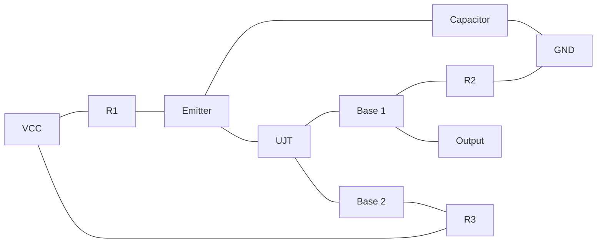

**Working principle:**

- **Capacitor charging**: C charges through R1 until reaching UJT firing voltage
- **UJT fires**: When emitter voltage reaches peak point voltage
- **Discharge cycle**: Capacitor discharges through emitter-base1 junction
- **Oscillation**: Process repeats creating sawtooth waveform

**Mnemonic:** "CROP" - Capacitor charges, Reaches threshold, Oscillates, Produces sawtooth

## Question 2(b) [4 marks]

**Discuss the triggering methods of SCR.**

**Answer**:

| Triggering Method | Working Principle |
|-------------------|-------------------|
| **Gate Triggering** | Applying positive voltage between gate and cathode |
| **Thermal Triggering** | Temperature increase reduces breakover voltage |
| **Light Triggering** | Photons create electron-hole pairs in LASCR |
| **dv/dt Triggering** | Rapid voltage rise across SCR causes capacitive current |
| **Breakover Triggering** | Voltage exceeds breakover voltage without gate signal |

**Key points:**

- **Gate triggering**: Most common method
- **Light triggering**: Used in opto-isolators
- **dv/dt triggering**: Often undesirable, requiring snubber circuits

**Mnemonic:** "GLTDB" - Gate, Light, Thermal, dv/dt, Breakover

## Question 2(c) [7 marks]

**Explain class A type commutation method.**

**Answer**:

**Class A Commutation (Self-commutation by LC circuit):**

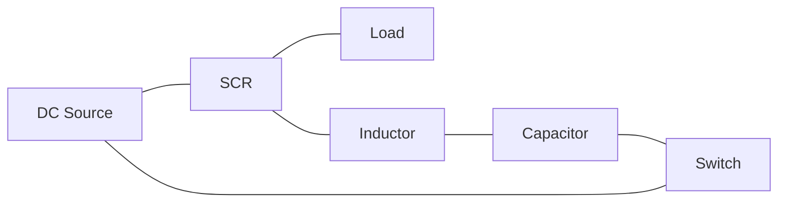

**Working principle:**

- **Initial state**: SCR conducting, capacitor charged with polarity (+) on right
- **Commutation start**: When switch SW closed
- **Resonant circuit**: LC circuit forms resonant path
- **Reverse current**: Capacitor discharge creates reverse current through SCR
- **Turn-off**: SCR turns off when current falls below holding current
- **Recharging**: Capacitor recharges with opposite polarity

**Applications:**

- **Inverter circuits**: DC to AC conversion
- **Chopper circuits**: DC to DC conversion

**Mnemonic:** "SCCRRT" - Switch closes, Capacitor discharges, Current reverses, SCR turns off, Recharging begins, Turn-off complete

## Question 2(a) OR [3 marks]

**State full form of GTO and draw the structure of GTO.**

**Answer**:

**Full form of GTO:** Gate Turn-Off Thyristor

**Structure of GTO:**

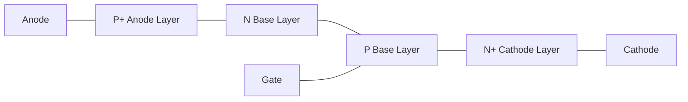

**Mnemonic:** "PANG" - P-anode, And, N-base, Gate-controlled thyristor

## Question 2(b) OR [4 marks]

**Discuss the design and requirement of snubber circuit for SCR.**

**Answer**:

**Snubber Circuit for SCR:**

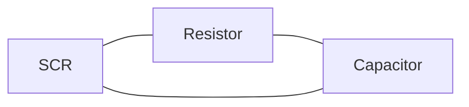

**Design requirements:**

- **Resistor selection**: Limits discharge current of capacitor
- **Capacitor selection**: Controls rate of voltage rise (dv/dt)
- **RC time constant**: Determines response time

**Purpose of snubber circuit:**

- **dv/dt protection**: Prevents false triggering due to rapid voltage changes
- **Voltage spike suppression**: Absorbs inductive voltage spikes
- **Transient protection**: Protects SCR during switching

**Mnemonic:** "RAPE" - Resistor And capacitor Protect against Excessive voltage rise

## Question 2(c) OR [7 marks]

**Explain class C type commutation method.**

**Answer**:

**Class C Commutation (Complementary commutation):**

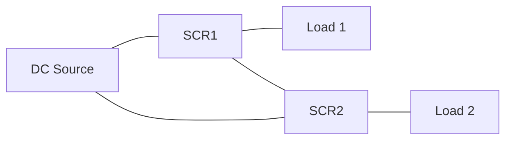

**Working principle:**

- **Initial state**: SCR1 conducting, SCR2 off
- **Commutation start**: SCR2 is triggered
- **Load transfer**: Current transfers from SCR1 to SCR2
- **Voltage reversal**: Voltage across SCR1 becomes negative
- **Turn-off**: SCR1 turns off as current falls below holding current
- **Alternating operation**: SCR1 and SCR2 conduct alternatively

**Applications:**

- **Inverter circuits**: Used in bridge inverters
- **Dual load systems**: Where alternate operation is required

**Mnemonic:** "TACTOR" - Triggering Alternate SCRs Creates Turn-Off and Reversal

## Question 3(a) [3 marks]

**State the advantages of poly-phase rectifier over single phase rectifier.**

**Answer**:

| Advantage | Description |
|-----------|-------------|
| **Higher efficiency** | Lower power loss and better transformer utilization |
| **Lower ripple factor** | Smoother DC output requiring smaller filter components |
| **Higher power handling** | Can handle higher power levels than single phase |
| **Better transformer utilization** | Higher transformer utilization factor |
| **Lower harmonic content** | Reduced harmonic distortion in output |

**Mnemonic:** "HELPS" - Higher efficiency, Even output, Lower ripple, Power handling better, Smaller filter

## Question 3(b) [4 marks]

**Draw and explain the circuit of single phase Half Wave rectifier. Draw the waveforms.**

**Answer**:

**Single Phase Half Wave Rectifier:**


**Waveform:**

```goat
    Voltage
      ^
      |     /\      /\      /\
      |    /  \    /  \    /  \
      |---/----\--/----\--/----\----> Time
      |         \       \       \
      |          \       \       \
      |
   Input AC
   
    Voltage
      ^
      |     /\      /\      /\
      |    /  \    /  \    /  \
      |---/----\--/----\--/----\----> Time
      |    
      |    
      |
   Output DC (Pulsating)
```

**Working principle:**

- **Forward bias**: Diode conducts during positive half-cycle
- **Reverse bias**: Diode blocks current during negative half-cycle
- **Output**: Pulsating DC with high ripple factor
- **Frequency**: Output frequency same as input frequency

**Mnemonic:** "PROF" - Positive half conducts, Reverse half blocks, Output is pulsating, Frequency unchanged

## Question 3(c) [7 marks]

**List all types of Inverters. Out of that explain single phase full bridge Inverter.**

**Answer**:

**Types of Inverters:**

1. Based on circuit: Series, Parallel, Bridge
2. Based on phases: Single-phase, Three-phase
3. Based on output: Square wave, Modified sine wave, Pure sine wave
4. Based on commutation: SCR-based, Transistor-based

**Single Phase Full Bridge Inverter:**

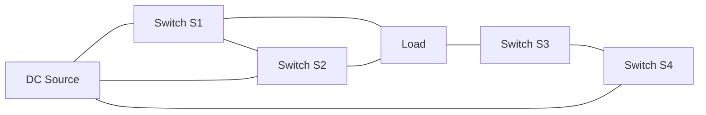

**Working principle:**

- **First half-cycle**: S1 and S4 ON, S2 and S3 OFF
- **Second half-cycle**: S2 and S3 ON, S1 and S4 OFF
- **Output waveform**: AC square wave across load
- **Control method**: Gate signals to switches with 180° phase shift

**Advantages:**

- **Higher output power**: Twice the output of half bridge
- **Better voltage utilization**: Full DC bus voltage across load
- **Lower current rating**: Each switch carries only load current

**Mnemonic:** "SOAP" - Switches Operate Alternately in Pairs

## Question 3(a) OR [3 marks]

**Compare UPS and SMPS.**

**Answer**:

| Parameter | UPS (Uninterruptible Power Supply) | SMPS (Switched Mode Power Supply) |
|-----------|-------------------------------------|-----------------------------------|
| **Primary function** | Provides backup power during outages | Converts AC to regulated DC |
| **Battery backup** | Contains batteries for backup | No battery backup |
| **Output** | AC output (typically) | DC output (typically) |
| **Efficiency** | Lower (70-80%) | Higher (80-95%) |
| **Size** | Larger and heavier | Compact and lightweight |
| **Applications** | Computers, servers, critical equipment | Electronic devices, chargers |

**Mnemonic:** "BBOSS" - Backup Battery Only in UPS, Small Size in SMPS

## Question 3(b) OR [4 marks]

**Draw and explain the circuit of three phase Half Wave rectifier. Draw the waveforms.**

**Answer**:

**Three Phase Half Wave Rectifier:**

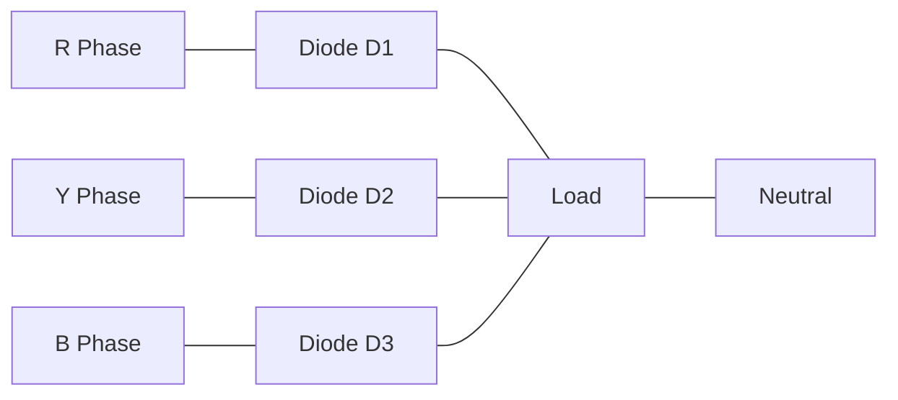

**Waveform:**

```goat
     Voltage
       ^
       |   
       |    /\    /\    /\    /\    /\    /\
       |   /  \  /  \  /  \  /  \  /  \  /  \
       |--/----\/----\/----\/----\/----\/----\--> Time
       |   R    Y    B    R    Y    B    R
       |   
    Input (Three phase)
    
     Voltage
       ^
       |   
       |    /\    /\    /\    /\    /\    /\
       |   /  \  /  \  /  \  /  \  /  \  /  \
       |--/----\/----\/----\/----\/----\/----\--> Time
       |      
       |   
    Output DC (Less ripple)
```

**Working principle:**

- **Conduction sequence**: Each diode conducts when its phase voltage is highest
- **Conduction angle**: Each diode conducts for 120°
- **Output ripple**: 3 pulses per cycle, lower ripple than single phase
- **Ripple frequency**: 3 times the input frequency

**Mnemonic:** "CROP" - Conduction of 120°, Ripple reduced, Output smoother, Pulses tripled

## Question 3(c) OR [7 marks]

**Define chopper. With the help of circuit diagram explain class D chopper.**

**Answer**:

**Definition of Chopper:**
A chopper is a DC to DC converter that converts fixed DC input voltage to variable DC output voltage using high-frequency switching.

**Class D Chopper (Two-quadrant chopper):**

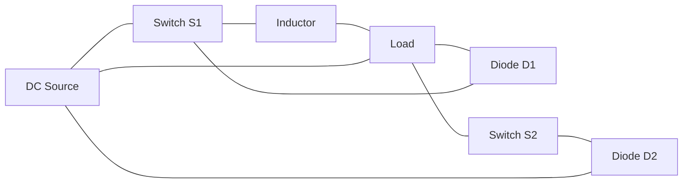

**Working principle:**

- **First quadrant operation (forward motoring):**
  - S1 ON, S2 OFF: Energy flows from source to load
  - S1 OFF, S2 OFF: Current freewheels through D2
  
- **Second quadrant operation (forward regeneration):**
  - S1 OFF, S2 ON: Energy flows from load to source
  - S1 OFF, S2 OFF: Current freewheels through D1

**Applications:**

- **DC motor drives**: Providing forward motoring and regenerative braking
- **Battery charging**: Controlling charging current
- **Renewable energy**: Interfacing with solar panels

**Mnemonic:** "FRED" - Forward motoring, Regenerative braking, Energy flow control, Dual quadrant operation

## Question 4(a) [3 marks]

**Describe the use of SCR as a static switch.**

**Answer**:

**SCR as Static Switch:**

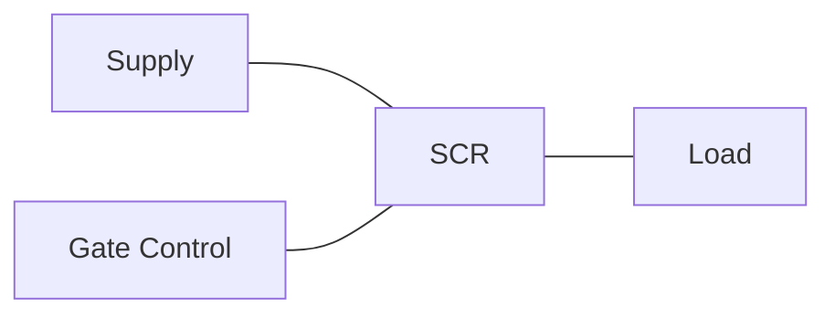

**Key features:**

- **No moving parts**: Purely electronic switching
- **Fast switching**: Microsecond response time
- **High reliability**: Longer lifetime than mechanical switches
- **Controlled turn-on**: Precise control via gate signal

**Advantages over mechanical switches:**

- **No arcing**: No contact bounce or wear
- **Silent operation**: No mechanical noise
- **EMI reduction**: Less electromagnetic interference

**Mnemonic:** "FANS" - Fast switching, Arc-free operation, No mechanical wear, Silent operation

## Question 4(b) [4 marks]

**Draw the circuit diagram of A.C. Power control using DIAC and TRIAC and explain its working.**

**Answer**:

**AC Power Control using DIAC and TRIAC:**

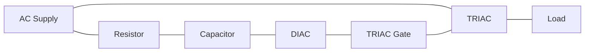

**Working principle:**

- **RC network**: Controls firing angle by delaying gate pulse
- **Capacitor charging**: C charges through R during each half-cycle
- **DIAC breakdown**: When capacitor voltage reaches DIAC breakover voltage
- **TRIAC triggering**: DIAC conducts and triggers TRIAC
- **Power control**: Varying R changes firing angle and thus power delivered

**Applications:**

- **Light dimmers**: Controlling brightness of lamps
- **Fan speed control**: Regulating fan speed
- **Heater control**: Adjusting heating elements

**Mnemonic:** "CRAFT" - Capacitor charges, Reaches breakover, Activates DIAC, Fires TRIAC, Transfers power

## Question 4(c) [7 marks]

**Explain the working principle of induction heating also write the applications of induction heating.**

**Answer**:

**Working Principle of Induction Heating:**

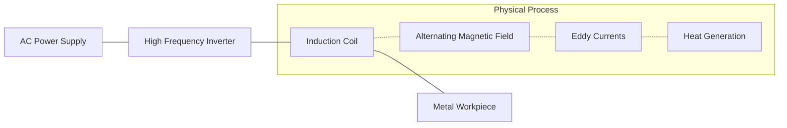

**Working principle:**

- **High-frequency current**: Passes through induction coil
- **Electromagnetic induction**: Creates alternating magnetic field
- **Eddy currents**: Induced in workpiece
- **Resistance heating**: Eddy currents generate heat due to resistance
- **Skin effect**: Heat concentrated near surface
- **Non-contact heating**: No physical contact between coil and workpiece

**Applications of Induction Heating:**

- **Metal heat treatment**: Hardening, annealing, tempering
- **Metal melting**: Foundry operations
- **Welding and brazing**: Joining metal components
- **Forging**: Heating before forming
- **Domestic cooking**: Induction cooktops
- **Semiconductor processing**: Crystal growth

**Mnemonic:** "MASTER" - Magnetic field, Alternating current, Surface heating, Temperature control, Eddy currents, Resistance heating

## Question 4(a) OR [3 marks]

**Explain working of photo relay circuit using LDR.**

**Answer**:

**Photo Relay Circuit using LDR:**

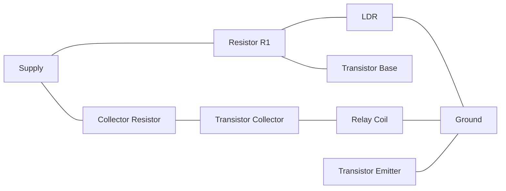

**Working principle:**

- **Light-dependent resistor**: Resistance decreases with increasing light
- **Voltage divider**: LDR and R1 form voltage divider
- **Transistor switching**: Base voltage controls transistor conduction
- **Relay operation**: Transistor drives relay coil
- **Threshold adjustment**: Can be set using variable resistor

**Applications:**

- **Automatic street lighting**: Turns on lights at dusk
- **Day/night switching**: Controls devices based on ambient light
- **Security systems**: Light-activated alarms

**Mnemonic:** "LARK" - Light controls, Activates transistor, Relay switches, Keeps circuit automated

## Question 4(b) OR [4 marks]

**Explain the operation of timer circuit using 555 timer IC.**

**Answer**:

**555 Timer Circuit (Monostable):**

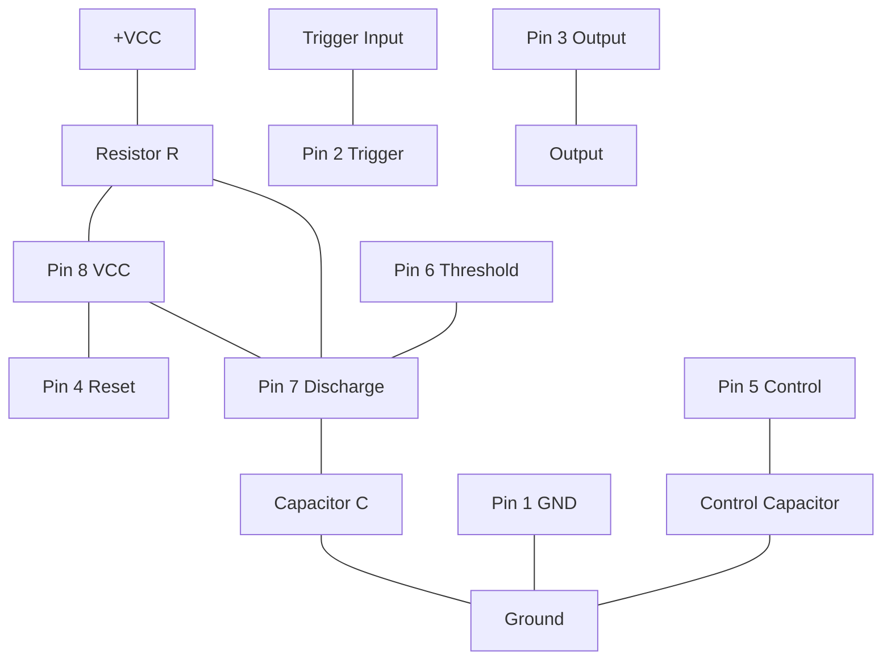

**Working principle:**

- **Trigger input**: Active low trigger at pin 2
- **Timing components**: R and C determine timing period (T = 1.1RC)
- **Output high**: When triggered, output goes high
- **Capacitor charging**: C charges through R
- **Threshold detection**: When voltage reaches 2/3 VCC, output goes low
- **Timer reset**: Circuit can be reset using pin 4

**Applications:**

- **Delay circuits**: Creating time delays
- **Pulse generation**: Generating precise pulses
- **Timing control**: Sequential timing operations

**Mnemonic:** "TRACT" - Trigger activates, Resistor-capacitor timing, Accurate delay, Capacitor charges, Threshold detection

## Question 4(c) OR [7 marks]

**Explain the working principle of dielectric heating also write the applications of dielectric heating.**

**Answer**:

**Working Principle of Dielectric Heating:**

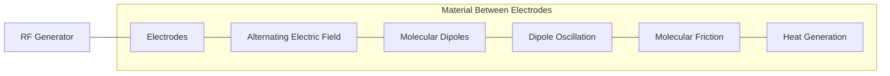

**Working principle:**

- **High-frequency electric field**: Applied between electrodes
- **Dielectric material**: Placed between electrodes
- **Molecular polarization**: Dipoles align with electric field
- **Field oscillation**: Rapid reversal of field direction
- **Molecular friction**: Dipoles rotate rapidly causing friction
- **Volumetric heating**: Heat generated throughout material
- **Frequency range**: Typically 10-100 MHz

**Applications of Dielectric Heating:**

- **Food processing**: Baking, drying, pasteurization
- **Wood industry**: Gluing, drying timber
- **Textile drying**: Removing moisture from fabrics
- **Plastic welding**: Joining thermoplastics
- **Medical applications**: Therapeutic diathermy
- **Paper industry**: Drying paper products

**Mnemonic:** "DIPOLE" - Dielectric material, Intense electric field, Polarization of molecules, Oscillation causes, Linkage of heat, Even heating throughout

## Question 5(a) [3 marks]

**Define AC drive. State applications of AC drives.**

**Answer**:

**Definition of AC Drive:**
An AC drive is an electronic device that controls the speed, torque, and direction of an AC motor by varying the frequency and voltage supplied to the motor.

**Applications of AC Drives:**

| Application Area | Examples |
|------------------|----------|
| **Industrial** | Conveyor systems, pumps, fans, compressors |
| **HVAC** | Blowers, cooling towers, air handling units |
| **Water treatment** | Pumps, mixers, aerators |
| **Mining** | Crushers, conveyors, pumps |
| **Textile** | Spinning machines, looms, winders |
| **Material handling** | Cranes, elevators, escalators |

**Mnemonic:** "PITCHW" - Pumps, Industrial machinery, Textile machines, Conveyor systems, HVAC systems, Water treatment

## Question 5(b) [4 marks]

**Draw and explain any one method for speed control of DC shunt motor.**

**Answer**:

**Armature Voltage Control Method for DC Shunt Motor:**

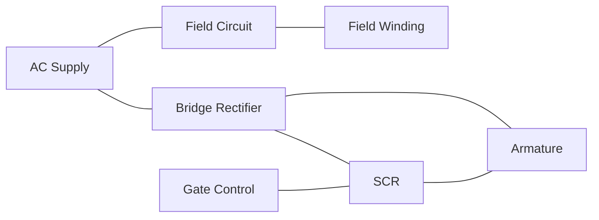

**Working principle:**

- **Constant field current**: Field supply maintained constant
- **Variable armature voltage**: Controlled by SCR
- **Speed equation**: N ∝ (Vₐ - IₐRₐ)/Φ
- **Speed control**: By changing armature voltage Vₐ
- **Torque control**: Armature current controls torque

**Advantages:**

- **Wide speed range**: Can achieve speeds below and above base speed
- **Smooth control**: Continuous speed adjustment
- **High efficiency**: Low power loss in control circuit

**Mnemonic:** "SAVE" - SCR controls, Armature voltage varies, Velocity changes, Efficient operation

## Question 5(c) [7 marks]

**Draw the block diagram of PLC and explain the function of each block.**

**Answer**:

**PLC Block Diagram:**

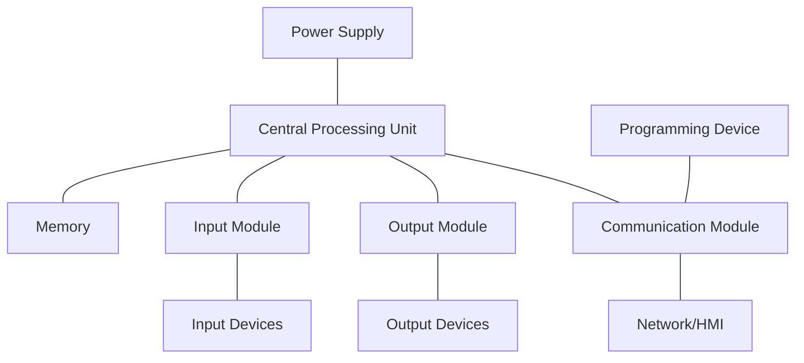

**Functions of each block:**

| Block | Function |
|-------|----------|
| **Power Supply** | Converts main AC supply to DC required for internal circuits |
| **CPU** | Executes program, processes I/O, performs calculations |
| **Memory** | Stores program, data, and I/O status (RAM, ROM, EEPROM) |
| **Input Module** | Interfaces with input devices, provides isolation, signal conditioning |
| **Output Module** | Drives output devices, provides isolation and protection |
| **Communication Module** | Connects PLC to networks, other PLCs, and programming devices |
| **Programming Device** | Used to develop, edit, and monitor PLC programs |

**Advantages of PLC:**

- **Reliability**: Solid-state components with high MTBF
- **Flexibility**: Easily reprogrammable for different applications
- **Communication**: Network capabilities for distributed control
- **Diagnostics**: Built-in diagnostics and troubleshooting

**Mnemonic:** "PRIME-C" - Power supply, RAM/ROM memory, Input module, Microprocessor (CPU), Execution of program, Communication interface

## Question 5(a) OR [3 marks]

**State the applications of stepper motor.**

**Answer**:

| Application Area | Examples |
|------------------|----------|
| **Precision positioning** | CNC machines, 3D printers, robotic arms |
| **Office equipment** | Printers, scanners, photocopiers |
| **Medical devices** | Surgical robots, fluid pumps, sample handlers |
| **Automotive** | Headlight adjustment, idle control, mirror control |
| **Aerospace** | Satellite positioning, antenna control |
| **Consumer electronics** | Cameras (focus/zoom), gaming controllers |

**Mnemonic:** "POMAC" - Positioning systems, Office equipment, Medical devices, Automotive controls, Consumer electronics

## Question 5(b) OR [4 marks]

**Draw and explain the circuit to control speed of a DC series motor.**

**Answer**:

**Speed Control of DC Series Motor using SCR:**

```mermaid
graph LR
    AC[AC Supply] --- B[Bridge Rectifier]
    B --- SCR[SCR] --- A[Armature]
    A --- SF[Series Field]
    SF --- B
    GC[Gate Control] --- SCR
```

**Working principle:**

- **Series connection**: Field winding in series with armature
- **SCR control**: Phase-controlled SCR regulates average voltage
- **Speed equation**: N ∝ (V - I(Ra+Rf))/IΦ
- **Speed-torque relation**: Non-linear relationship
- **Application**: Used when high starting torque required

**Advantages:**

- **High starting torque**: Ideal for traction applications
- **Simple control**: Basic circuit design
- **Cost-effective**: Fewer components than other methods

**Mnemonic:** "SCAT" - Series connection, Current controls flux, Average voltage controlled by SCR, Torque highest at low speeds

## Question 5(c) OR [7 marks]

**Discuss the BLDC motor in brief.**

**Answer**:

**BLDC Motor (Brushless DC Motor):**

```mermaid
graph LR
    subgraph "BLDC Motor Construction"
    Stator[Stator with Windings]
    Rotor[Rotor with Permanent Magnets]
    Hall[Hall Sensors]
    end

    subgraph "Control System"
    Controller[Electronic Controller]
    Driver[Power Driver]
    Feedback[Position Feedback]
    end
    
    Controller --- Driver
    Driver --- Stator
    Hall --- Feedback
    Feedback --- Controller
```

**Construction:**

- **Stator**: Contains windings (typically 3-phase)
- **Rotor**: Permanent magnets on rotor
- **Position sensing**: Hall effect sensors or encoders
- **Controller**: Electronic commutation controller

**Working principle:**

- **Electronic commutation**: Replaces mechanical brushes
- **Sequencing**: Controller energizes stator coils in sequence
- **Position feedback**: Hall sensors determine rotor position
- **Phase energizing**: Proper phase energized based on rotor position

**Advantages:**

- **High efficiency**: No brush friction losses
- **Low maintenance**: No brush wear
- **Longer lifespan**: Reliable operation
- **Better speed-torque characteristics**: Flat curve
- **Low noise**: Quiet operation
- **Better heat dissipation**: Windings on stator

**Applications:**

- **Computer cooling fans**: CPU/GPU coolers
- **Hard disk drives**: Spindle motors
- **Electric vehicles**: Propulsion systems
- **Drones**: Propeller motors
- **Home appliances**: Washing machines, refrigerators
- **Industrial automation**: Precision control systems

**Mnemonic:** "COPPER" - Commutation electronic, Operation efficient, Permanent magnets, Position sensors, Electronic control, Reliable performance
