## પ્રશ્ન 1(અ) [3 માર્ક્સ]

**IGBT ની રચના દોરો અને તેને સમજાવો.**

**જવાબ**:
IGBT MOSFET ના ઇનપુટ અને BJT ના આઉટપુટ લાક્ષણિકતાઓને જોડે છે.

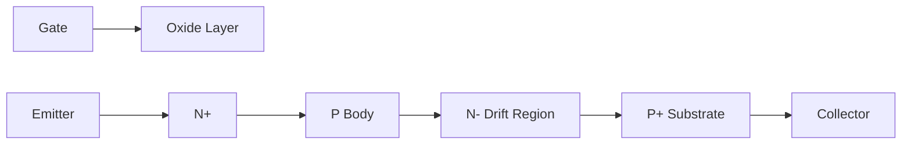

- **ગેટ-ઓક્સાઇડ લેયર**: ડિવાઇસ સ્વિચિંગને નિયંત્રિત કરે છે
- **N+ એમિટર**: ઇલેક્ટ્રોન્સનો સ્ત્રોત
- **P+ કલેક્ટર**: BJT વિભાગ રચે છે

**મેમરી ટ્રીક:** "MOSFET ઇનપુટ, BJT આઉટપુટ, IGBT થ્રુઆઉટ"

## પ્રશ્ન 1(બ) [4 માર્ક્સ]

**SCR નું રચના દોરો અને સમજાવો. તેની લાક્ષણિકતા પણ દોરો.**

**જવાબ**:
SCR એ ચાર-સ્તરીય PNPN અર્ધવાહક ઉપકરણ છે જેમાં ત્રણ ટર્મિનલ છે.

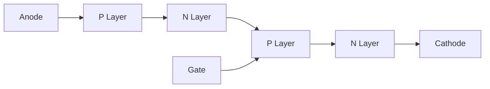

**લાક્ષણિકતા વક્ર:**

```goat
     I
     ^
     |                     Forward
     |                   Conduction
     |                      /
     |                     /
     |                    /
     |          Breakover|
     |               *   |
     |             /     |
     |Forward     |      |
     |Blocking    |      |
     |            |      |
     +------------+------+----> V
     |            |
     |            |
     |Reverse     |
     |Blocking    |
     |            |
     |            V
```

- **P-N-P-N સ્તરો**: બે ટ્રાન્ઝિસ્ટર્સ (PNP, NPN) બનાવે છે
- **ગેટ ટર્મિનલ**: કન્ડક્શન ટ્રિગર કરે છે
- **હોલ્ડિંગ કરંટ**: કન્ડક્શન જાળવવા માટે લઘુત્તમ

**મેમરી ટ્રીક:** "PNPN લેયર્સ બે BJT જોડી બનાવે"

## પ્રશ્ન 1(ક) [7 માર્ક્સ]

**Opto-TRIAC, Opto-SCR અને Opto-ટ્રાન્ઝિસ્ટરનો ઉપયોગ કરીને સર્કિટ ડાયાગ્રામની મદદથી સોલિડ સ્ટેટ રિલેની કામગીરી સમજાવો.**

**જવાબ**:
સોલિડ સ્ટેટ રિલે ઓપ્ટોકપલર્સનો ઉપયોગ કન્ટ્રોલ અને લોડ સર્કિટ વચ્ચે વિદ્યુત અલગતા માટે કરે છે.

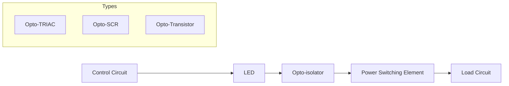

| SSR પ્રકાર | ઇનપુટ સર્કિટ | આઇસોલેશન | આઉટપુટ સર્કિટ | ઉપયોગો |
|----------|--------------|-----------|---------------|--------------|
| Opto-TRIAC | DC કંટ્રોલ સિગ્નલ | LED + TRIAC ડિટેક્ટર | TRIAC પાવર સ્વિચ | AC લોડ |
| Opto-SCR | DC કંટ્રોલ સિગ્નલ | LED + ફોટો-SCR | SCR પાવર સ્વિચ | DC લોડ |
| Opto-Transistor | DC કંટ્રોલ સિગ્નલ | LED + ફોટોટ્રાન્ઝિસ્ટર | પાવર ટ્રાન્ઝિસ્ટર | ઓછી પાવર DC |

- **કાર્ય સિદ્ધાંત**: કંટ્રોલ સિગ્નલ LED સક્રિય કરે → પ્રકાશ ફોટો-સેન્સિટિવ ડિવાઇસને ટ્રિગર કરે → પાવર સર્કિટ સ્વિચ કરે
- **ઝીરો-ક્રોસિંગ ડિટેક્શન**: ઝીરો વોલ્ટેજ પર સ્વિચિંગ કરીને EMI ઘટાડે
- **કોઈ મિકેનિકલ પાર્ટ્સ નથી**: વિશ્વસનીયતા અને આયુષ્ય વધારે છે

**મેમરી ટ્રીક:** "LED પ્રકાશે, ફોટો-ડિવાઇસ કન્ડક્ટ કરે, પાવર વહે"

## પ્રશ્ન 1(ક OR) [7 માર્ક્સ]

**લાક્ષણિકતા આલેખની મદદથી SCR, GTO અને પાવર MOSFET નું કાર્ય અને રચનાની લાક્ષણિકતાઓ વર્ણન કરો.**

**જવાબ**:

| ડિવાઇસ | રચના | લાક્ષણિકતા વક્ર | કાર્ય સિદ્ધાંત |
|--------|--------------|---------------------|-------------------|
| SCR | PNPN 4-લેયર ગેટ સાથે | લેચિંગ - એકવાર ON થયા પછી ON રહે | ગેટ પલ્સ ટ્રિગર કરે, બંધ કરવા માટે બાહ્ય કોમ્યુટેશન જરૂરી |
| GTO | સુધારેલ SCR વધુ સારા ગેટ કંટ્રોલ સાથે | SCR જેવું પરંતુ ગેટ દ્વારા બંધ કરી શકાય | નેગેટિવ ગેટ પલ્સ કેરિયર્સ બહાર કાઢે, બંધ કરે |
| Power MOSFET | ઘણા સેલ્સ સાથે વર્ટિકલ સ્ટ્રક્ચર | નોન-લેચિંગ - ગેટ બાયસની જરૂર | ગેટ વોલ્ટેજ ચેનલ બનાવે, વોલ્ટેજ દૂર કરવાથી બંધ થાય |

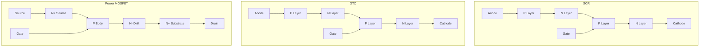

- **SCR**: ઉચ્ચ કરંટ ક્ષમતા, લેચિંગ વર્તન
- **GTO**: સ્વયં બંધ થવાની ક્ષમતા, ઉચ્ચ સ્વિચિંગ સ્પીડ
- **MOSFET**: વોલ્ટેજ-નિયંત્રિત, ફાસ્ટ સ્વિચિંગ, કોઈ સેકન્ડરી બ્રેકડાઉન નહીં

**મેમરી ટ્રીક:** "SCR લેચ કરે, GTO સ્વયં બંધ થાય, MOSFET ચેનલ બનાવે"

## પ્રશ્ન 2(અ) [3 માર્ક્સ]

**એસ આર.સી.ને ઓવર કરંટ થી બચાવવા માટેની પદ્ધતિઓ વિગતવાર સમજાવો.**

**જવાબ**:
SCR ઓવર-કરંટ પ્રોટેક્શન વધુ પડતા કરંટને કારણે ડિવાઇસ નુકસાનને રોકે છે.

| પ્રોટેક્શન પદ્ધતિ | કાર્ય સિદ્ધાંત | અમલીકરણ |
|-------------------|-------------------|----------------|
| ફાસ્ટ-એક્ટિંગ ફ્યુઝ | ફોલ્ટ દરમિયાન ઝડપથી પિગળે | SCR સાથે શ્રેણીમાં |
| સર્કિટ બ્રેકર્સ | કરંટ થ્રેશોલ્ડથી વધે ત્યારે ટ્રિપ થાય | મુખ્ય સર્કિટ પ્રોટેક્શન |
| કરંટ-લિમિટિંગ રિએક્ટર્સ | di/dt અને પીક કરંટ મર્યાદિત કરે | SCR સાથે શ્રેણીમાં |

- **હીટ સિંક**: વધારાની ગરમીને વેડફવામાં મદદ કરે
- **સ્નબર સર્કિટ**: સ્વિચિંગ દરમિયાન કરંટ સ્પાઇક્સ ઘટાડે

**મેમરી ટ્રીક:** "ફ્યુઝ ફાસ્ટ, રિએક્ટર્સ રોકે, બ્રેકર્સ તોડે"

## પ્રશ્ન 2(બ) [4 માર્ક્સ]

**SCRને ચાલુ કરવા માટે કોઈપણ બે પદ્ધતિઓ સમજાવો.**

**જવાબ**:
SCR ને વિવિધ ટ્રિગરિંગ પદ્ધતિઓ દ્વારા ચાલુ કરી શકાય છે.

| ટ્રિગરિંગ પદ્ધતિ | સર્કિટ અમલીકરણ | લાક્ષણિકતાઓ |
|-------------------|------------------------|-----------------|
| ગેટ ટ્રિગરિંગ | ગેટ-કેથોડ વચ્ચે પલ્સ લાગુ | સૌથી સામાન્ય, નિયંત્રિત |
| વોલ્ટેજ ટ્રિગરિંગ | એનોડ વોલ્ટેજ બ્રેકઓવર વોલ્ટેજથી વધે | ગેટ કંટ્રોલ નહીં, ઈમરજન્સી |

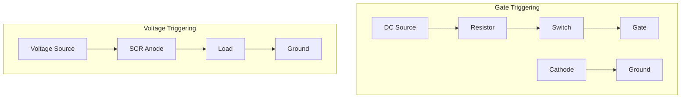

- **ગેટ ટ્રિગરિંગ**: ફાયરિંગ એંગલ ચોક્કસપણે નિયંત્રિત કરે છે
- **વોલ્ટેજ ટ્રિગરિંગ**: ફોરવર્ડ વોલ્ટેજ બ્રેકઓવર વોલ્ટેજથી વધે ત્યારે થાય છે

**મેમરી ટ્રીક:** "ગેટ કંટ્રોલ લાવે, વોલ્ટેજ આપોઆપ વધે"

## પ્રશ્ન 2(ક) [7 માર્ક્સ]

**SCRને બંધ કરવા માટે વિવિધ પદ્ધતિઓની સૂચિ બનાવો અને સર્કિટનો ઉપયોગ કરીને તેમાંથી દરેકને સંક્ષિપ્તમાં સમજાવો.**

**જવાબ**:
SCR કોમ્યુટેશન પદ્ધતિઓ એ ચાલુ SCR ને બંધ કરવાની તકનીકો છે.

| કોમ્યુટેશન પદ્ધતિ | સર્કિટ સિદ્ધાંત | ઉપયોગો |
|--------------------|-------------------|--------------|
| નેચરલ કોમ્યુટેશન | AC સ્ત્રોત ઝીરો પાર કરે | AC સર્કિટ |
| ફોર્સ્ડ કોમ્યુટેશન | બાહ્ય કોમ્પોનન્ટ્સ કરંટને ઝીરો કરવા દબાણ કરે | DC સર્કિટ |
| ક્લાસ A (સેલ્ફ) | સમાંતર LC ઓસિલેટર | સરળ સર્કિટ |
| ક્લાસ B (રેઝોનન્ટ) | LC સર્કિટ SCR સાથે શ્રેણીમાં | મધ્યમ પાવર |
| ક્લાસ C (કોમ્પ્લીમેન્ટરી) | કરંટ ડાયવર્ટ કરવા બીજો SCR | હાઈ પાવર |
| ક્લાસ D (ઓક્ઝિલરી) | ઓક્ઝિલરી SCR + LC | નિયંત્રિત ટાઇમિંગ |
| ક્લાસ E (એક્સટર્નલ) | બાહ્ય વોલ્ટેજ સ્ત્રોત | વિશ્વસનીય પરંતુ જટિલ |

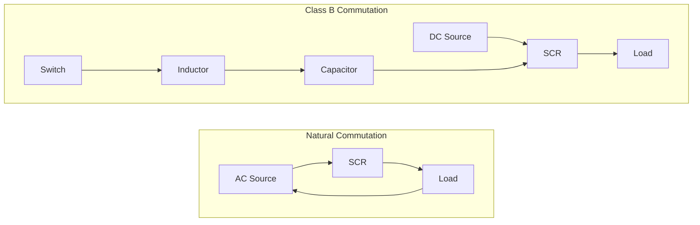

- **નેચરલ કોમ્યુટેશન**: AC સાયકલમાં કરંટ કુદરતી રીતે શૂન્ય થાય છે
- **ફોર્સ્ડ કોમ્યુટેશન**: DC સર્કિટમાં કૃત્રિમ રીતે કરંટને શૂન્ય લાવે છે
- **કોમ્યુનિકેશન ક્લાસ**: A થી E ક્રમશઃ વધુ જટિલ અને વિશ્વસનીય

**મેમરી ટ્રીક:** "કુદરતી શૂન્યતા, ફોર્સ્ડ ઘટકો, ક્લાસ વિશ્વસનીયતા વધારે"

## પ્રશ્ન 2(અ OR) [3 માર્ક્સ]

**એસ આર.સી.ને ઓવર વોલ્ટેજ થી બચાવવા માટેની પદ્ધતિઓ વિગતવાર સમજાવો.**

**જવાબ**:
ઓવર-વોલ્ટેજ પ્રોટેક્શન વોલ્ટેજ ક્ષણિકથી થતા નુકસાનને રોકે છે.

| પ્રોટેક્શન પદ્ધતિ | કાર્ય સિદ્ધાંત | અમલીકરણ |
|-------------------|-------------------|----------------|
| સ્નબર સર્કિટ | RC નેટવર્ક dv/dt મર્યાદિત કરે | SCR સાથે સમાંતર |
| મેટલ ઓક્સાઇડ વેરિસ્ટર્સ | વોલ્ટેજ સ્પાઇક્સ રોકે | SCR સાથે સમાંતર |
| ઝેનર ડાયોડ | સેટ વોલ્ટેજ પર બ્રેકડાઉન થાય | એનોડ-કેથોડ પ્રોટેક્શન |

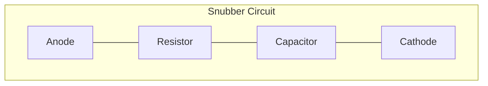

- **સ્નબર સર્કિટ**: વોલ્ટેજ વૃદ્ધિ દર (dv/dt) મર્યાદિત કરે છે
- **MOV**: વોલ્ટેજ સ્પાઇક્સમાંથી ઊર્જા શોષે છે
- **થાયરિસ્ટર રેટિંગ**: હંમેશા સર્કિટ વોલ્ટેજ કરતાં ઉપર માર્જિન સાથે કોમ્પોનન્ટ્સનો ઉપયોગ કરો

**મેમરી ટ્રીક:** "સ્નબર્સ ધીમા કરે, વેરિસ્ટર્સ રોકે, ઝેનર માર્યા"

## પ્રશ્ન 2(બ OR) [4 માર્ક્સ]

**થાઈરિસ્ટરનું ટ્રીગરિંગ વિગતવાર સમજાવો.**

**જવાબ**:
થાયરિસ્ટર ટ્રિગરિંગમાં ડિવાઇસને બ્લોકિંગથી કન્ડક્શન સ્ટેટમાં સક્રિય કરવાનો સમાવેશ થાય છે.

| ટ્રિગરિંગ પદ્ધતિ | કાર્ય પદ્ધતિ | ફાયદા |
|-------------------|-------------------|------------|
| ગેટ ટ્રિગરિંગ | ગેટ-કેથોડ પર લો પાવર પલ્સ | ચોક્કસ નિયંત્રણ |
| R-C ફેઝ શિફ્ટ | નિયંત્રણ માટે ફેઝ એંગલ બદલે | સરળ સર્કિટ |
| UJT ટ્રિગરિંગ | રિલેક્સેશન ઓસિલેટર પલ્સ ઉત્પન્ન કરે | સ્થિર ટાઇમિંગ |
| લાઇટ ટ્રિગરિંગ | ફોટોન્સ કેરિઅર્સ ઉત્પન્ન કરે (LASCR) | વિદ્યુત અલગતા |

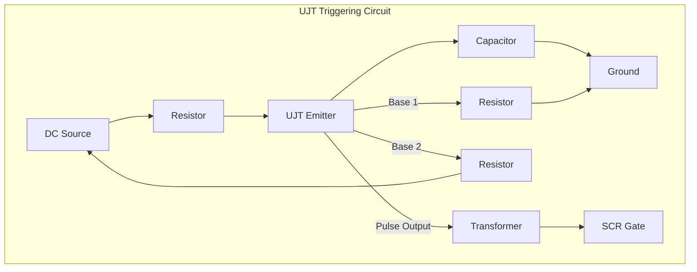

- **ગેટ કરંટ**: લેચિંગ કરંટથી વધારે હોવો જોઈએ
- **ગેટ પલ્સ**: વિશ્વસનીય ટ્રિગરિંગ માટે વિડ્થ અને એમ્પ્લિટ્યુડ મહત્વપૂર્ણ છે
- **ટ્રિગરિંગ એંગલ**: લોડ પર આપવામાં આવતી પાવરને નિયંત્રિત કરે છે

**મેમરી ટ્રીક:** "ગેટ ચાલુ કરે, RC લયબદ્ધ, UJT એકસરખું, લાઇટ મુક્ત કરે"

## પ્રશ્ન 2(ક OR) [7 માર્ક્સ]

**SCR માટે સ્નબર સર્કિટની રચના કરો સમજાવો. તેનું મહત્વ પણ સમજાવો.**

**જવાબ**:
સ્નબર સર્કિટ SCR ને વોલ્ટેજ ઝણકાથી રક્ષણ આપે છે અને સ્વિચિંગ વર્તનને નિયંત્રિત કરે છે.

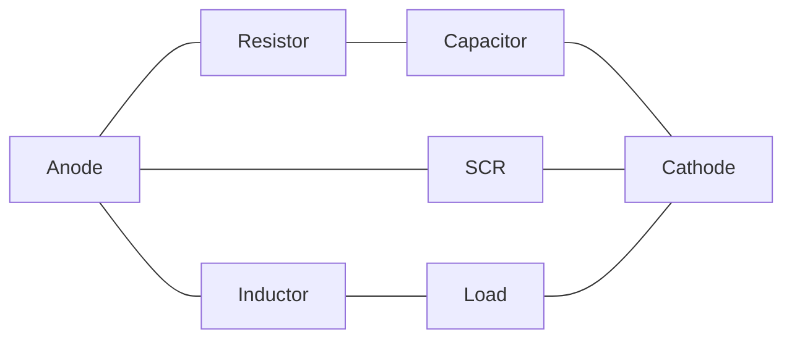

| ઘટક | કાર્ય | પસંદગી માપદંડ |
|-----------|----------|-------------------|
| રેઝિસ્ટર (R) | ડિસ્ચાર્જ કરંટ મર્યાદિત કરે | R > E/I₍max₎ |
| કેપેસિટર (C) | વોલ્ટેજ ક્ષણિકને શોષે | C = I₍load₎/(dv/dt) |
| વૈકલ્પિક ડાયોડ | ડિસ્ચાર્જ પાથ પ્રદાન કરે | ફાસ્ટ રિકવરી પ્રકાર |

**ડિઝાઇન સ્ટેપ્સ:**

1. SCR ડેટાશીટમાંથી મહત્તમ dv/dt ગણો
2. લોડ કરંટ અને સર્કિટ વોલ્ટેજ નક્કી કરો
3. SCR રેટિંગ નીચે dv/dt મર્યાદિત કરવા માટે C પસંદ કરો
4. ડિસ્ચાર્જ કરંટ મર્યાદિત કરવા અને ડેમ્પિંગ પ્રદાન કરવા માટે R પસંદ કરો

**મહત્વ:**

- **dv/dt પ્રોટેક્શન**: ખોટા ટ્રિગરિંગને રોકે છે
- **ટર્ન-ઓફ સપોર્ટ**: કોમ્યુટેશન સુધારે છે
- **સ્વિચિંગ લોસ ઘટાડો**: પાવર ડિસિપેશન ઘટાડે છે
- **EMI ઘટાડો**: વોલ્ટેજ ટ્રાન્ઝિશન સરળ બનાવે છે

**મેમરી ટ્રીક:** "રેઝિસ્ટર રોકે, કેપેસિટર પકડે, ડાયોડ દિશા આપે"

## પ્રશ્ન 3(અ) [3 માર્ક્સ]

**સર્કિટ ડાયાગ્રામનો ઉપયોગ કરીને થ્રી ફેઝ ફુલ વેવ રેક્ટિફાયરનું કાર્ય સમજવો.**

**જવાબ**:
થ્રી-ફેઝ ફુલ-વેવ રેક્ટિફાયર છ ડાયોડ સાથે થ્રી-ફેઝ AC ને DC માં રૂપાંતરિત કરે છે.

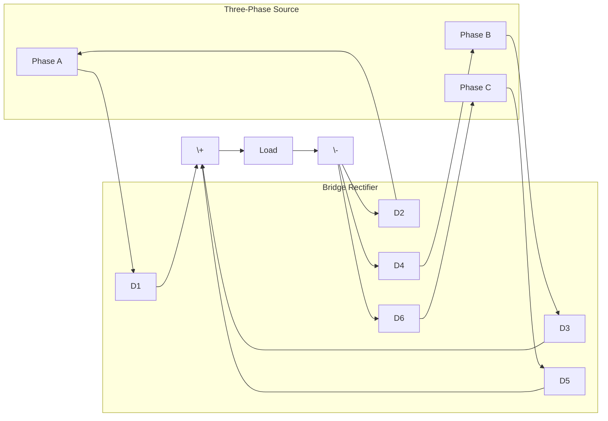

- **છ ડાયોડ**: ત્રણ પોઝિટિવ, ત્રણ નેગેટિવ હાફ-સાયકલ માટે
- **કન્ડક્શન**: દરેક ડાયોડ સાયકલ દીઠ 120° માટે કન્ડક્ટ કરે છે
- **આઉટપુટ**: સિંગલ-ફેઝની સરખામણીએ ઓછો રિપલ (4.2%)

**મેમરી ટ્રીક:** "છ ડાયોડ, ત્રણ ફેઝ, સરળ DC"

## પ્રશ્ન 3(બ) [4 માર્ક્સ]

**સિંગલ ફેઝ અને પોલી ફેઝ રેક્ટિફાયર સર્કિટમાં તફાવત કરો.**

**જવાબ**:

| પેરામીટર | સિંગલ ફેઝ રેક્ટિફાયર | પોલી ફેઝ રેક્ટિફાયર |
|-----------|------------------------|----------------------|
| ઇનપુટ | સિંગલ AC સ્ત્રોત | મલ્ટિપલ AC સ્ત્રોત (3 કે વધુ) |
| જરૂરી ડાયોડ | 2 (હાફ-વેવ), 4 (ફુલ-વેવ) | 3 (હાફ-વેવ), 6 (ફુલ-વેવ) |
| રિપલ ફેક્ટર | 0.482 (ફુલ-વેવ) | 0.042 (3-ફેઝ ફુલ-વેવ) |
| ટ્રાન્સફોર્મર ઉપયોગિતા | નીચી (0.812) | ઉચ્ચ (0.955) |
| આઉટપુટ વેવફોર્મ | પલ્સિંગ | ઘણું વધારે સરળ |
| એફિશિયન્સી | નીચી | ઉચ્ચ |
| ઉપયોગો | ઓછા પાવર એપ્લિકેશન્સ | ઔદ્યોગિક પાવર સપ્લાય |

- **ફોર્મ ફેક્ટર**: પોલી-ફેઝમાં નીચો (વધુ સારી ગુણવત્તાનો DC)
- **પાવર હેન્ડલિંગ**: પોલીફેઝ વધુ કાર્યક્ષમતાથી ઉચ્ચ પાવર હેન્ડલ કરે છે
- **સર્કિટ જટિલતા**: પોલીફેઝ વધુ જટિલ પરંતુ વધુ સારી કામગીરી

**મેમરી ટ્રીક:** "સિંગલ ભારે પલ્સ કરે, પોલી સરળ આપે"

## પ્રશ્ન 3(ક) [7 માર્ક્સ]

**શ્રેણી, સમાંતર અને બ્રિજ પ્રકારના ઇન્વર્ટરના ઉપયોગનું વર્ણન કરો.**

**જવાબ**:

| ઇન્વર્ટર પ્રકાર | સર્કિટ ટોપોલોજી | ઉપયોગો | લાક્ષણિકતાઓ |
|---------------|------------------|--------------|-----------------|
| શ્રેણી ઇન્વર્ટર | રેઝોનન્ટ LC સાથે લોડ શ્રેણીમાં | ઇન્ડક્શન હીટિંગ, અલ્ટ્રાસોનિક જનરેટર્સ | • ઉચ્ચ ફ્રિક્વન્સી<br>• વોલ્ટેજ સ્ત્રોત<br>• સેલ્ફ-કોમ્યુટેટિંગ |
| સમાંતર ઇન્વર્ટર | રેઝોનન્ટ LC સાથે લોડ સમાંતર | અનિન્ટરપ્ટિબલ પાવર સપ્લાય, સોલાર ઇન્વર્ટર્સ | • કરંટ સ્ત્રોત<br>• બેહતર કાર્યક્ષમતા<br>• વાઇડર લોડ રેન્જ |
| બ્રિજ ઇન્વર્ટર | 4 સ્વિચ સાથે H-બ્રિજ | મોટર ડ્રાઇવ્સ, ગ્રિડ-ટાઇડ સિસ્ટમ્સ, સામાન્ય હેતુ | • વોલ્ટેજ/કરંટ સ્ત્રોત<br>• સૌથી વર્સેટાઇલ<br>• વિવિધ કંટ્રોલ પદ્ધતિઓ |

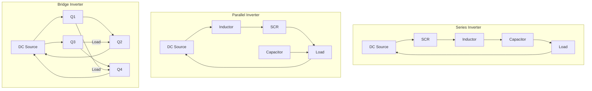

- **શ્રેણી ઇન્વર્ટર**: ફિક્સ્ડ-ફ્રિક્વન્સી, ફિક્સ્ડ-લોડ એપ્લિકેશન માટે શ્રેષ્ઠ
- **સમાંતર ઇન્વર્ટર**: લોડ વેરિએશન્સ વધુ સારી રીતે હેન્ડલ કરે છે
- **બ્રિજ ઇન્વર્ટર**: સામાન્ય એપ્લિકેશન્સ માટે સૌથી વધુ વપરાય છે

**મેમરી ટ્રીક:** "શ્રેણી ઉચ્ચ ફ્રિક્વન્સી પર ગાય, સમાંતર વિવિધતા સાથે કાર્ય કરે, બ્રિજ બહુમુખી પ્રતિભા લાવે"

## પ્રશ્ન 3(અ OR) [3 માર્ક્સ]

**સર્કિટ ડાયાગ્રામનો ઉપયોગ કરીને થ્રી ફેઝ હાફ વેવ રેક્ટિફાયરનું કાર્ય સમજવો.**

**જવાબ**:
થ્રી-ફેઝ હાફ-વેવ રેક્ટિફાયર ત્રણ ડાયોડનો ઉપયોગ કરીને થ્રી-ફેઝ AC ને DC માં રૂપાંતરિત કરે છે.

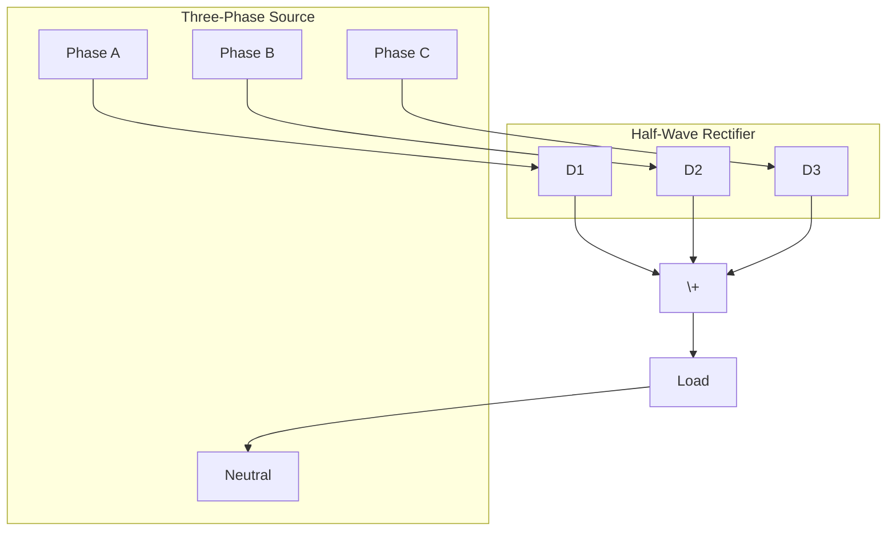

- **ત્રણ ડાયોડ**: દરેક તેના ફેઝના પોઝિટિવ હાફ-સાયકલ દરમિયાન કન્ડક્ટ કરે છે
- **કન્ડક્શન**: દરેક ડાયોડ સાયકલ દીઠ 120° માટે કન્ડક્ટ કરે છે
- **આઉટપુટ**: 13.4% રિપલ (ફુલ-વેવ કરતાં વધારે)

**મેમરી ટ્રીક:** "ત્રણ ડાયોડ, ત્રણ ફેઝ, એક દિશા"

## પ્રશ્ન 3(બ OR) [4 માર્ક્સ]

**વિવિધ પ્રકારની ચાર્જિંગ ટેક્નોલોજીની યાદી બનાવો અને તેની સરખામણી કરો.**

**જવાબ**:

| ચાર્જિંગ ટેક્નોલોજી | કાર્ય સિદ્ધાંત | ફાયદા | ગેરફાયદા |
|--------------------|-------------------|------------|---------------|
| કોન્સ્ટન્ટ કરંટ (CC) | વોલ્ટેજ થ્રેશોલ્ડ સુધી ફિક્સ્ડ કરંટ | સરળ, ઓછી કિંમત | લાંબો ચાર્જિંગ સમય |
| કોન્સ્ટન્ટ વોલ્ટેજ (CV) | ઘટતા કરંટ સાથે ફિક્સ્ડ વોલ્ટેજ | ઝડપી પ્રારંભિક ચાર્જ | શરૂઆતમાં કરંટ મર્યાદિત નથી |
| CC-CV | CC થી શરૂ કરે, CV માં સ્વિચ કરે | ઓપ્ટિમલ ચાર્જિંગ પ્રોફાઇલ | કંટ્રોલર સર્કિટની જરૂર |
| પલ્સ ચાર્જિંગ | આરામ સમય સાથે કરંટ પલ્સ | ગરમી ઘટાડે, બેટરી આયુષ્ય વધારે | જટિલ કંટ્રોલ સર્કિટ |
| ટ્રિકલ ચાર્જિંગ | ખૂબ ઓછો નિરંતર કરંટ | ચાર્જ જાળવે છે | મુખ્ય ચાર્જિંગ માટે યોગ્ય નથી |
| ફાસ્ટ ચાર્જિંગ | ઇન્ટેલિજન્ટ કંટ્રોલ સાથે હાઇ કરંટ | નોંધપાત્ર ઘટાડેલો ચાર્જિંગ સમય | ગરમી ઉત્પત્તિ, બેટરી તણાવ |
| વાયરલેસ ચાર્જિંગ | ઇન્ડક્ટિવ કપલિંગ | સગવડભર્યું, કેબલ્સ નહીં | ઓછી કાર્યક્ષમતા, એલાઇનમેન્ટ સમસ્યાઓ |

- **બેટરી પ્રકાર**: વિવિધ ટેક્નોલોજીઓ વિવિધ બેટરી કેમિસ્ટ્રી માટે યોગ્ય છે
- **ચાર્જિંગ પ્રોફાઇલ**: નુકસાન ટાળવા માટે બેટરી સ્પેસિફિકેશન સાથે મેળ ખાવો જોઈએ
- **તાપમાન મેનેજમેન્ટ**: ચાર્જિંગ કાર્યક્ષમતા અને સુરક્ષામાં મહત્વપૂર્ણ પરિબળ

**મેમરી ટ્રીક:** "કરંટ સતત, વોલ્ટેજ બદલાય, પલ્સ થોભે, ટ્રિકલ ટોચે, ફાસ્ટ ફટાફટ"

## પ્રશ્ન 3(ક OR) [7 માર્ક્સ]

**બ્લોક ડાયાગ્રામની મદદથી સોલાર ફોટોવોલ્ટેઈક (પીવી) આધારિત વીજ ઉત્પાદનની કામગીરી સમજાવો.**

**જવાબ**:
સોલાર PV સિસ્ટમ ફોટોવોલ્ટેઇક ઇફેક્ટ દ્વારા સૂર્યપ્રકાશને સીધો વીજળીમાં રૂપાંતરિત કરે છે.

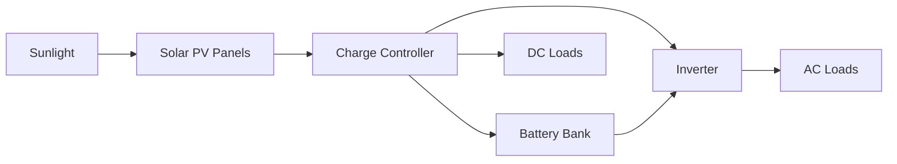

| ઘટક | કાર્ય | પ્રકાર |
|-----------|----------|-------|
| સોલાર પેનલ્સ | પ્રકાશને DC વીજળીમાં રૂપાંતરિત કરે | મોનોક્રિસ્ટલાઇન, પોલીક્રિસ્ટલાઇન, થીન-ફિલ્મ |
| ચાર્જ કંટ્રોલર | બેટરી ચાર્જિંગ નિયંત્રિત કરે | PWM, MPPT |
| બેટરી બેંક | ઊર્જા સંગ્રહિત કરે | લેડ-એસિડ, લિથિયમ-આયન, ફ્લો |
| ઇન્વર્ટર | DC ને AC માં રૂપાંતરિત કરે | પ્યોર સાઇન વેવ, મોડિફાઇડ સાઇન વેવ |
| ડિસ્ટ્રિબ્યુશન સિસ્ટમ | લોડ્સને પાવર પહોંચાડે | ઓફ-ગ્રિડ, ગ્રિડ-ટાઇડ, હાઇબ્રિડ |

- **ફોટોવોલ્ટેઇક ઇફેક્ટ**: પ્રકાશ ઊર્જા અર્ધવાહક સામગ્રીમાં ઇલેક્ટ્રોન ફ્લો બનાવે છે
- **મેક્સિમમ પાવર પોઇન્ટ ટ્રેકિંગ**: બદલાતી પરિસ્થિતિઓ હેઠળ પાવર એક્સટ્રેક્શન ઓપ્ટિમાઇઝ કરે છે
- **ગ્રિડ ઇન્ટિગ્રેશન**: સ્ટેન્ડઅલોન અથવા યુટિલિટી ગ્રિડ સાથે જોડાયેલા કાર્ય કરી શકે છે

**મેમરી ટ્રીક:** "સૂર્ય અર્ધવાહકો પર પડે, કંટ્રોલર ચાર્જ કરે, બેટરી સંગ્રહ કરે, ઇન્વર્ટર ઇન્ટરફેસ કરે"

## પ્રશ્ન 4(અ) [3 માર્ક્સ]

**ઇન્ડક્શન હીટિંગના ફાયદા અને ગેરફાયદા જણાવો.**

**જવાબ**:

| ઇન્ડક્શન હીટિંગના ફાયદા | ઇન્ડક્શન હીટિંગના ગેરફાયદા |
|-----------------------------|-------------------------------|
| સીધા સંપર્ક વિના ઝડપી હીટિંગ | ઉચ્ચ પ્રારંભિક સ્થાપના ખર્ચ |
| ચોક્કસ તાપમાન નિયંત્રણ | વિદ્યુત ઊર્જા સ્ત્રોતની જરૂર |
| ઊર્જા કાર્યક્ષમ (80-90%) | વિદ્યુત વાહક સામગ્રી સુધી મર્યાદિત |
| ક્લીન અને પ્રદૂષણ-મુક્ત | યોગ્ય કૂલિંગ સિસ્ટમની જરૂર |
| સ્થાનિક હીટિંગ શક્ય | EMI ઉત્પાદન નજીકની ઇલેક્ટ્રોનિક્સને અસર કરી શકે |
| સામગ્રીમાં યુનિફોર્મ હીટિંગ | સ્પેશ્યલાઇઝ્ડ કોઇલ ડિઝાઇનની જરૂર પડી શકે |

- **કાર્ય સિદ્ધાંત**: વર્કપીસમાં પ્રેરિત એડી કરંટ ગરમી ઉત્પન્ન કરે છે
- **ઉપયોગો**: મેલ્ટિંગ, હાર્ડનિંગ, એનિલિંગ, વેલ્ડિંગ

**મેમરી ટ્રીક:** "ઝડપી, ફોકસ્ડ, કાર્યક્ષમ પરંતુ ખર્ચાળ, કન્ડક્ટિવ, જટિલ"

## પ્રશ્ન 4(બ) [4 માર્ક્સ]

**IC-555 નો ઉપયોગ કરીને સિક્વન્સીયલ ટાઈમરની સર્કિટ દોરો અને તેનું કાર્ય સમજાવો.**

**જવાબ**:
સિક્વેન્શિયલ ટાઈમર ક્રમમાં મલ્ટિપલ ટાઈમ્ડ આઉટપુટ પ્રદાન કરે છે.

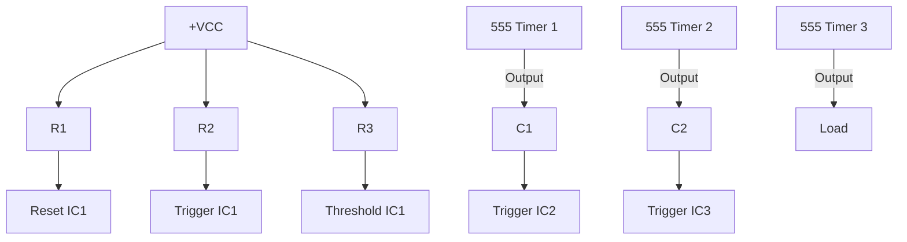

**કાર્યપદ્ધતિ:**

1. પ્રથમ 555 ટાઈમર મોનોસ્ટેબલ મોડમાં કાર્ય કરે
2. પ્રથમ ટાઈમિંગ સાયકલ પૂર્ણ થાય ત્યારે આઉટપુટ બીજા ટાઈમરને ટ્રિગર કરે
3. બીજો ટાઈમર ત્રીજા ટાઈમરને ટ્રિગર કરે
4. દરેક ટાઈમરનો સમયગાળો તેના RC ટાઈમ કોન્સ્ટન્ટ દ્વારા નક્કી થાય

- **RC વેલ્યુઝ**: T = 1.1 × R × C દરેક સ્ટેજનું ટાઈમિંગ નક્કી કરે છે
- **કેસ્કેડિંગ**: મલ્ટિપલ સ્ટેજ ક્રમિક ટાઈમિંગ ઇવેન્ટ્સ પ્રદાન કરે છે
- **ઉપયોગો**: પ્રોસેસ કંટ્રોલ, ઔદ્યોગિક સિક્વન્સિંગ

**મેમરી ટ્રીક:** "એક ટાઈમર બીજાને ક્રમશઃ ટ્રિગર કરે"

## પ્રશ્ન 4(ક) [7 માર્ક્સ]

**TRIAC નો ઉપયોગ કરીને સિંગલ ફેઝ AC પાવર કંટ્રોલની સર્કિટ દોરો અને તેને વિગતવાર સમજાવો.**

**જવાબ**:
TRIAC-આધારિત AC પાવર કંટ્રોલ ફેઝ એંગલ કંટ્રોલ દ્વારા લોડ્સ પર પાવર નિયંત્રિત કરે છે.

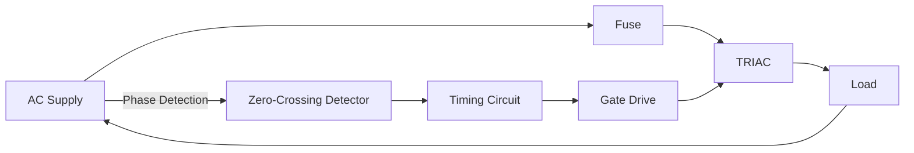

| ઘટક | કાર્ય | પસંદગી માપદંડ |
|-----------|----------|-------------------|
| TRIAC | બાયડાયરેક્શનલ પાવર સ્વિચ | કરંટ રેટિંગ > લોડ કરંટ |
| DIAC | સિમેટ્રિકલી TRIAC ટ્રિગર કરે | બ્રેકઓવર વોલ્ટેજ < ટ્રિગર વોલ્ટેજ |
| RC નેટવર્ક | ફાયરિંગ એંગલ માટે ફેઝ શિફ્ટિંગ | R ફાયરિંગ એંગલ રેન્જ નક્કી કરે |
| સ્નબર સર્કિટ | dv/dt પ્રોટેક્શન | TRIAC સ્પેસિફિકેશન પર આધારિત |

**ઓપરેશન સિદ્ધાંત:**

1. RC નેટવર્ક AC ઇનપુટથી ફેઝ શિફ્ટ બનાવે
2. કેપેસિટર વોલ્ટેજ થ્રેશોલ્ડ પર પહોંચે ત્યારે DIAC બ્રેક ઓવર થાય
3. DIAC ચોક્કસ ફેઝ એંગલ પર TRIAC ટ્રિગર કરે
4. R બદલવાથી ફેઝ એંગલ બદલાય, પાવર કંટ્રોલ થાય

- **ફાયરિંગ એંગલ**: 0° (ફુલ પાવર) થી 180° (ઝીરો પાવર)
- **ઉપયોગો**: લાઇટ ડિમર, હીટર કંટ્રોલ, મોટર સ્પીડ કંટ્રોલ
- **ફાયદાઓ**: સ્મૂધ કંટ્રોલ, કોઈ મૂવિંગ પાર્ટ્સ નથી, ઉચ્ચ વિશ્વસનીયતા

**મેમરી ટ્રીક:** "રેઝિસ્ટન્સ ફેઝ બદલે, DIAC પલ્સ આપે, TRIAC પાવર ટ્રાન્સમિટ કરે"

## પ્રશ્ન 4(અ OR) [3 માર્ક્સ]

**ડાયઈલેક્ટ્રીક હીટિંગના ફાયદા અને ગેરફાયદા જણાવો.**

**જવાબ**:

| ડાયઈલેક્ટ્રીક હીટિંગના ફાયદા | ડાયઈલેક્ટ્રીક હીટિંગના ગેરફાયદા |
|------------------------------|--------------------------------|
| સમગ્ર સામગ્રીમાં યુનિફોર્મ હીટિંગ | ઉચ્ચ પ્રારંભિક ઉપકરણ ખર્ચ |
| ઝડપી હીટિંગ (ઇન્સુલેટર્સ માટે પણ) | ઉચ્ચ ફ્રિક્વન્સી પાવર સ્ત્રોતની જરૂર |
| સિલેક્ટિવ હીટિંગ શક્ય | કન્ડક્ટિવ સામગ્રી માટે અસરકારક નથી |
| ચોક્કસ સામગ્રી માટે ઊર્જા કાર્યક્ષમ | RF રેડિએશન સુરક્ષા ચિંતાઓ |
| ક્લીન અને પ્રદૂષણ-મુક્ત | જટિલ ઇમ્પિડન્સ મેચિંગ આવશ્યકતાઓ |
| નોન-કન્ડક્ટિવ સામગ્રી સાથે કામ કરે | ટ્રાન્સમિશન લાઇનમાં પાવર નુકસાન |

- **કાર્ય સિદ્ધાંત**: ઉચ્ચ-ફ્રિક્વન્સી ઇલેક્ટ્રિક ફીલ્ડમાં ડાયપોલ રોટેશન ગરમી ઉત્પન્ન કરે છે
- **ઉપયોગો**: પ્લાસ્ટિક વેલ્ડિંગ, લાકડા સૂકવણી, ફૂડ પ્રોસેસિંગ

**મેમરી ટ્રીક:** "યુનિફોર્મ, ઝડપી, ઇન્સુલેટર-ફ્રેન્ડલી પરંતુ ખર્ચાળ, જટિલ, RF-તીવ્ર"

## પ્રશ્ન 4(બ OR) [4 માર્ક્સ]

**LDR નો ઉપયોગ કરીને ફોટો-ઇલેક્ટ્રિક રિલેનો સર્કિટ ડાયાગ્રામ દોરો અને તેનું કાર્ય સમજાવો.**

**જવાબ**:
ફોટો-ઇલેક્ટ્રિક રિલે લાઇટ-ડિપેન્ડન્ટ રેઝિસ્ટરનો ઉપયોગ પ્રકાશ શોધવા અને રિલે નિયંત્રિત કરવા માટે કરે છે.

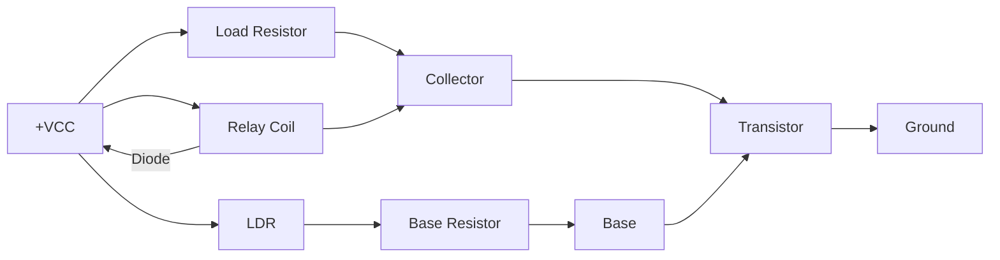

**કાર્યપદ્ધતિ:**

1. જ્યારે પ્રકાશ LDR પર પડે ત્યારે LDR રેઝિસ્ટન્સ ઘટે
2. વોલ્ટેજ ડિવાયડર (LDR + R2) ટ્રાન્ઝિસ્ટરને બેઝ કરંટ પ્રદાન કરે
3. પૂરતો બેઝ કરંટ વહે ત્યારે ટ્રાન્ઝિસ્ટર ON થાય
4. ટ્રાન્ઝિસ્ટર કન્ડક્ટ કરે ત્યારે રિલે સક્રિય થાય

- **લાઇટ થ્રેશોલ્ડ**: પોટેન્શિયોમીટર દ્વારા સમાયોજિત
- **ઉપયોગો**: ઓટોમેટિક લાઇટિંગ, કાઉન્ટિંગ સિસ્ટમ, અલાર્મ સિસ્ટમ
- **LDR લાક્ષણિકતાઓ**: રેઝિસ્ટન્સ પ્રકાશની તીવ્રતાના વ્યસ્ત પ્રમાણમાં

**મેમરી ટ્રીક:** "પ્રકાશ રેઝિસ્ટન્સ ઘટાડે, ટ્રાન્ઝિસ્ટર ચાલુ થાય, રિલે પ્રતિસાદ આપે"

## પ્રશ્ન 4(ક OR) [7 માર્ક્સ]

**ટ્રીગરીંગ સર્કિટમાં UJT સાથે SCR નો ઉપયોગ કરીને ડીસી.પાવર કંટ્રોલની સર્કિટ દોરો અને વિગતવાર સમજાવો.**

**જવાબ**:
UJT-ટ્રિગર્ડ SCR સર્કિટ લોડ્સ પર DC પાવરનું ચોક્કસ નિયંત્રણ પ્રદાન કરે છે.

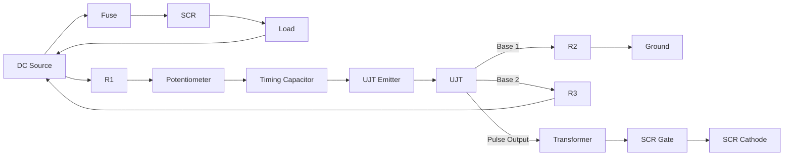

| ઘટક | કાર્ય | પસંદગી માપદંડ |
|-----------|----------|-------------------|
| UJT | ટ્રિગર પલ્સ જનરેટ કરે | η (ઇન્ટ્રિન્સિક સ્ટેન્ડઓફ રેશિયો) = 0.5-0.8 |
| R₁+P | ટાઇમિંગ રેઝિસ્ટર | C₁ ના ચાર્જિંગ રેટને નિયંત્રિત કરે |
| C₁ | ટાઇમિંગ કેપેસિટર | પલ્સ ફ્રિક્વન્સી નક્કી કરે |
| ટ્રાન્સફોર્મર | UJT સર્કિટને SCR થી અલગ કરે | પલ્સ ટ્રાન્સમિશન ક્ષમતા |
| SCR | મુખ્ય પાવર કંટ્રોલ | કરંટ રેટિંગ > લોડ કરંટ |

**કાર્ય સિદ્ધાંત:**

1. UJT રિલેક્સેશન ઓસિલેટર પલ્સ જનરેટ કરે છે
2. પોટેન્શિયોમીટર ચાર્જિંગ રેટ બદલે, પલ્સ ફ્રિક્વન્સી બદલે
3. પલ્સ ટ્રાન્સફોર્મર મારફતે SCR ગેટ પર કપલ થાય
4. SCR ટ્રિગર ટાઇમિંગના આધારે સાયકલના ભાગ માટે કન્ડક્ટ કરે

- **કંટ્રોલ રેંજ**: મિનિમમથી મેક્સિમમ પાવર
- **ફાયદાઓ**: ચોક્કસ નિયંત્રણ, ઉચ્ચ કાર્યક્ષમતા
- **ઉપયોગો**: DC મોટર કંટ્રોલ, હીટિંગ એલિમેન્ટ્સ, બેટરી ચાર્જર

**મેમરી ટ્રીક:** "રેઝિસ્ટર રેટ નિયંત્રિત કરે, UJT પલ્સ છોડે, SCR કરંટ સ્વિચ કરે"

## પ્રશ્ન 5(અ) [3 માર્ક્સ]

**BLDC ડ્રાઈવર સર્કિટમાં હોલ ઈફેક્ટ સેન્સર સમજાવો.**

**જવાબ**:
હોલ ઇફેક્ટ સેન્સર્સ BLDC મોટર્સમાં રોટર પોઝિશન ચોક્કસ કોમ્યુટેશન ટાઇમિંગ માટે શોધે છે.

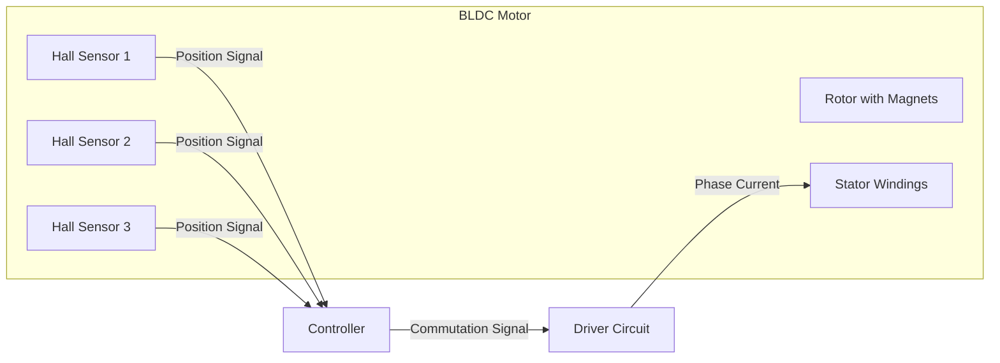

| હોલ સેન્સર | કાર્ય | આઉટપુટ |
|-------------|----------|--------|
| પોઝિશન ડિટેક્શન | રોટરના ચુંબકીય ક્ષેત્રને સેન્સ કરે | ડિજિટલ (ON/OFF) |
| પ્લેસમેન્ટ | 3-ફેઝ મોટર્સ માટે 120° દૂર | 6 અનન્ય સ્ટેટ્સ પ્રદાન કરે |
| સિગ્નલ પ્રોસેસિંગ | માઇક્રોકંટ્રોલરમાં ઇનપુટ | સ્વિચિંગ સિક્વન્સ નક્કી કરે |

- **કાર્ય સિદ્ધાંત**: કરંટ અને ચુંબકીય ક્ષેત્રને લંબરૂપે વોલ્ટેજ ઉત્પન્ન થાય
- **કોમ્યુટેશન સિક્વન્સ**: દરેક સેન્સર પેટર્ન ચોક્કસ સ્વિચિંગ સંયોજનને અનુરૂપ હોય

**મેમરી ટ્રીક:** "ચુંબક ખસે, હોલ સેન્સ કરે, કંટ્રોલર કોમ્યુટેટ કરે"

## પ્રશ્ન 5(બ) [4 માર્ક્સ]

**TRIAC નો ઉપયોગ કરીને સિંગલ ફેઝ ઇન્ડક્શન મોટરની ઝડપને નિયંત્રિત કરવા માટે સોલિડ સ્ટેટ સર્કિટ દોરો અને સમજાવો.**

**જવાબ**:
ઇન્ડક્શન મોટર માટે TRIAC-આધારિત સ્પીડ કંટ્રોલ ફેઝ કંટ્રોલ સિદ્ધાંતોનો ઉપયોગ કરે છે.

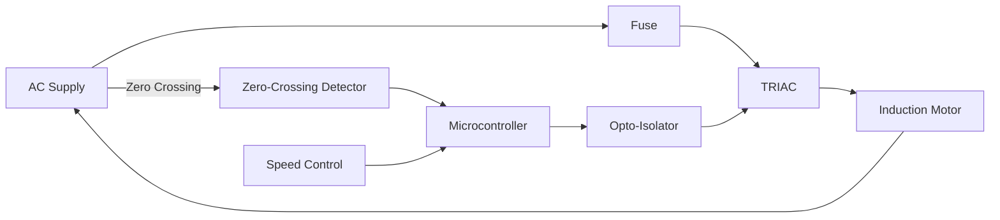

**કાર્ય સિદ્ધાંત:**

1. ઝીરો-ક્રોસિંગ ડિટેક્ટર વોલ્ટેજ ઝીરો-ક્રોસિંગ્સ ઓળખે
2. માઇક્રોકંટ્રોલર સ્પીડ સેટિંગના આધારે ડિલે ગણે
3. ડિલે પછી, ઓપ્ટો-આઇસોલેટર દ્વારા TRIAC ને ગેટ પલ્સ મોકલવામાં આવે
4. TRIAC હાફ-સાયકલના બાકીના ભાગ માટે કન્ડક્ટ કરે
5. ફાયરિંગ એંગલ બદલવાથી મોટરનું વોલ્ટેજ નિયંત્રિત થાય, ઝડપ સમાયોજિત થાય

- **TRIAC રેટિંગ**: સ્ટાર્ટિંગ કરંટ હેન્ડલ કરવું જોઈએ (5-7× રનિંગ કરંટ)
- **સ્પીડ રેન્જ**: મોટર લાક્ષણિકતાઓને કારણે નીચલા છેડે મર્યાદિત
- **ઉપયોગો**: ફેન, પંપ, નાના મશીન ટૂલ્સ

**મેમરી ટ્રીક:** "ઝીરો શોધાયું, ડિલે નક્કી થયું, TRIAC ટ્રિગર થયું"

## પ્રશ્ન 5(ક) [7 માર્ક્સ]

**આકૃતિનો ઉપયોગ કરીને બી.એલ.ડી.સી. મોટરની રચના અને કાર્યને સમજાવો. તેની ઊપયોગીતાની પણ સૂચી બનાવો.**

**જવાબ**:
બ્રશલેસ DC મોટર્સ મિકેનિકલ બ્રશની જગ્યાએ ઇલેક્ટ્રોનિક કોમ્યુટેશનનો ઉપયોગ કરે છે.

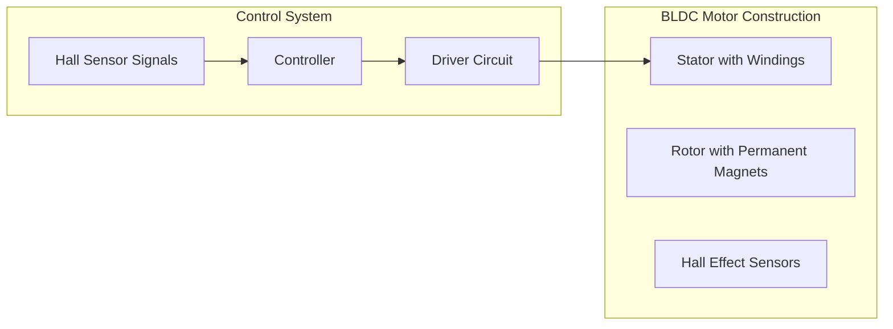

| ઘટક | કાર્ય | પ્રકાર/વેરિએશન |
|-----------|----------|------------------|
| સ્ટેટર | કોપર વાઇન્ડિંગ્સ ધરાવે | સ્લોટેડ/સ્લોટલેસ ડિઝાઇન |
| રોટર | પરમેનન્ટ મેગ્નેટ્સ | સરફેસ/ઇન્ટીરિયર માઉન્ટેડ |
| હોલ સેન્સર | પોઝિશન ડિટેક્શન | 60°/120° કોન્ફિગરેશન |
| કંટ્રોલર | કોમ્યુટેશન લોજિક | માઇક્રોકંટ્રોલર-બેઝ્ડ |
| ડ્રાઇવર | પાવર સ્વિચિંગ | MOSFET/IGBT-આધારિત |

**કાર્ય સિદ્ધાંત:**

1. હોલ સેન્સર રોટર પોઝિશન શોધે
2. કંટ્રોલર યોગ્ય એનર્જાઇઝિંગ સિક્વન્સ નક્કી કરે
3. ડ્રાઇવર યોગ્ય સ્ટેટર વાઇન્ડિંગ્સને પાવર આપે
4. ચુંબકીય ઇન્ટરેક્શન રોટેશન ઉત્પન્ન કરે
5. પ્રક્રિયા સતત ચાલુ રહે

**ઉપયોગો:**

- કમ્પ્યુટર કૂલિંગ ફેન અને હાર્ડ ડ્રાઇવ્સ
- ઇલેક્ટ્રિક વાહનો અને હાઇબ્રિડ કાર
- ઔદ્યોગિક ઓટોમેશન અને રોબોટિક્સ
- મેડિકલ ઉપકરણો (પંપ, વેન્ટિલેટર)
- ડ્રોન અને RC મોડેલ્સ
- હોમ એપ્લાયન્સિસ (વોશર, રેફ્રિજરેટર)
- પ્રિસિઝન ઇન્સ્ટ્રુમેન્ટ્સ

**મેમરી ટ્રીક:** "ચુંબકો ખસે, સેન્સર જુએ, ઇલેક્ટ્રોનિક્સ ઊર્જા આપે"

## પ્રશ્ન 5(અ OR) [3 માર્ક્સ]

**વેરિયેબલ ફ્રીક્વન્સી ડ્રાઇવ (VFD) નું કાર્ય સમજાવો.**

**જવાબ**:
વેરિએબલ ફ્રિક્વન્સી ડ્રાઇવ્સ ફ્રિક્વન્સી અને વોલ્ટેજ બદલીને મોટર સ્પીડ નિયંત્રિત કરે છે.

```mermaid
graph LR
    AC[AC Supply] --> R[Rectifier]
    R --> DC[DC Bus]
    DC --> I[Inverter]
    I --> M[Motor]

    C[Controller] --> I
    S[Speed Reference] --> C
    F[Feedback] --> C
```

| VFD સેક્શન | કાર્ય | ઘટકો |
|-------------|----------|------------|
| રેક્ટિફાયર | AC ને DC માં રૂપાંતરિત કરે | ડાયોડ્સ અથવા SCRs |
| DC બસ | ફિલ્ટર અને એનર્જી સ્ટોર કરે | કેપેસિટર્સ, ઇન્ડક્ટર્સ |
| ઇન્વર્ટર | DC ને વેરિએબલ AC માં રૂપાંતરિત કરે | IGBTs અથવા MOSFETs |
| કંટ્રોલર | ફ્રિક્વન્સી/વોલ્ટેજ મેનેજ કરે | માઇક્રોપ્રોસેસર |

- **V/f કંટ્રોલ**: સ્થિર ટોર્ક માટે કોન્સ્ટન્ટ V/f રેશિયો જાળવે
- **ઓપરેટિંગ રેન્જ**: સામાન્ય રીતે રેટેડ સ્પીડના 10-200%
- **કાર્યક્ષમતા**: વિશાળ સ્પીડ રેન્જ પર ઉચ્ચ કાર્યક્ષમતા

**મેમરી ટ્રીક:** "AC ને DC કરે, DC ને AC કરે, ફ્રિક્વન્સી બદલે"

## પ્રશ્ન 5(બ OR) [4 માર્ક્સ]

**યુનિવર્સલ મોટરની ઝડપને નિયંત્રિત કરવા માટે સર્કિટ દોરો અને સમજાવો.**

**જવાબ**:
યુનિવર્સલ મોટર્સ AC અથવા DC પર ચાલી શકે છે અને સરળ સ્પીડ કંટ્રોલ પદ્ધતિઓની મંજૂરી આપે છે.

```mermaid
graph LR
    AC[AC Supply] --> F[Fuse]
    F --> T[TRIAC]
    T --> M[Universal Motor]
    M --> AC

    AC --> R1[R1]
    R1 --> DIAC[DIAC]
    DIAC --> G[TRIAC Gate]
    R1 --> C1[C1]
    C1 --> P[Potentiometer]
    P --> F
```

**કાર્ય સિદ્ધાંત:**

1. RC નેટવર્ક ઇનપુટ વોલ્ટેજથી ફેઝ શિફ્ટ બનાવે
2. પોટેન્શિયોમીટર ફેઝ શિફ્ટની માત્રા સમાયોજિત કરે
3. વોલ્ટેજ બ્રેકઓવર પર પહોંચે ત્યારે DIAC ટ્રિગર થાય
4. TRIAC હાફ-સાયકલના બાકીના ભાગ માટે કન્ડક્ટ કરે
5. પોટેન્શિયોમીટર સમાયોજિત કરવાથી ફાયરિંગ એંગલ અને મોટર સ્પીડ બદલાય

- **સ્પીડ રેન્જ**: વિશાળ કંટ્રોલ રેન્જ (10-100%)
- **ટોર્ક લાક્ષણિકતાઓ**: નીચી સ્પીડ પર થોડી ઘટે છે
- **ઉપયોગો**: પાવર ટૂલ્સ, ઘરેલું ઉપકરણો, સિલાઈ મશીન

**મેમરી ટ્રીક:** "રેસિસ્ટન્સ ફેઝ બદલે, DIAC આપે, TRIAC કન્ડક્ટ કરે"

## પ્રશ્ન 5(ક OR) [7 માર્ક્સ]

**PLCનો બ્લોક ડાયાગ્રામ દોરો અને દરેક બ્લોકની કામગીરીને સંક્ષિપ્તમાં સમજાવો. અને તેના ફાયદાઓ અને ઉપયોગીતાઓની સૂચી બનવો.**

**જવાબ**:
પ્રોગ્રામેબલ લોજિક કંટ્રોલર્સ (PLCs) ઓટોમેશન કંટ્રોલ માટેના ઔદ્યોગિક કોમ્પ્યુટર છે.

```mermaid
graph LR
    subgraph "PLC System"
    PS[Power Supply]
    CPU[Central Processing Unit]
    IM[Input Modules]
    OM[Output Modules]
    MEM[Memory]
    COM[Communication Interface]
    end

    PS --> CPU
    PS --> IM
    PS --> OM
    PS --> COM
    
    IM --> CPU
    CPU --> OM
    CPU <--> MEM
    CPU <--> COM
    
    FS[Field Sensors] --> IM
    OM --> ACT[Actuators]
    COM <--> HMI[HMI/SCADA]
    COM <--> NET[Network]
```

| PLC બ્લોક | કાર્ય | પ્રકાર/લાક્ષણિકતાઓ |
|-----------|----------|----------------------|
| પાવર સપ્લાય | રેગ્યુલેટેડ પાવર પ્રદાન કરે | સામાન્ય રીતે 24VDC અથવા 110/220VAC |
| CPU | પ્રોગ્રામ એક્ઝિક્યુટ કરે, I/O પ્રોસેસ કરે | સ્કેન-બેઝ્ડ ઓપરેશન |
| ઇનપુટ મોડ્યુલ્સ | ફિલ્ડ સેન્સર સાથે ઇન્ટરફેસ | ડિજિટલ, એનાલોગ, સ્પેશિયલ |
| આઉટપુટ મોડ્યુલ્સ | ફિલ્ડ ડિવાઇસિસ કંટ્રોલ કરે | રિલે, ટ્રાન્ઝિસ્ટર, ટ્રાયક |
| મેમરી | પ્રોગ્રામ અને ડેટા સ્ટોર કરે | RAM, EEPROM, ફ્લેશ |
| કોમ્યુનિકેશન | નેટવર્ક કનેક્ટિવિટી | ઇથરનેટ, પ્રોફિબસ, મોડબસ |

**ફાયદાઓ:**

- કઠોર ઔદ્યોગિક વાતાવરણમાં વિશ્વસનીયતા
- રીપ્રોગ્રામિંગ માટે લચીલાપણું
- રિલે-આધારિત સિસ્ટમોની તુલનામાં કોમ્પેક્ટ સાઇઝ
- બિલ્ટ-ઇન ડાયગ્નોસ્ટિક્સ અને ટ્રબલશૂટિંગ
- મોડ્યુલર એક્સપેન્ડેબિલિટી
- હાઇ-સ્પીડ ઓપરેશન
- જટિલ કંટ્રોલ સિસ્ટમ માટે કોસ્ટ-ઇફેક્ટિવ

**ઉપયોગો:**

- મેન્યુફેક્ચરિંગ પ્રોડક્શન લાઇન્સ
- પ્લાન્ટ્સમાં પ્રોસેસ કંટ્રોલ
- મટીરિયલ હેન્ડલિંગ સિસ્ટમ્સ
- બિલ્ડિંગ ઓટોમેશન
- પાવર જનરેશન અને ડિસ્ટ્રિબ્યુશન
- વોટર/વેસ્ટવોટર ટ્રીટમેન્ટ
- પેકેજિંગ મશીનરી
- ફૂડ પ્રોસેસિંગ

**મેમરી ટ્રીક:** "પાવર આપે, CPU ગણે, ઇનપુટ જાણે, આઉટપુટ કરે, મેમરી જાળવે"
