## Question 1(a) [3 marks]

**Draw the structure of IGBT and explain it.**

**Answer**:
IGBT combines MOSFET's input with BJT's output characteristics.

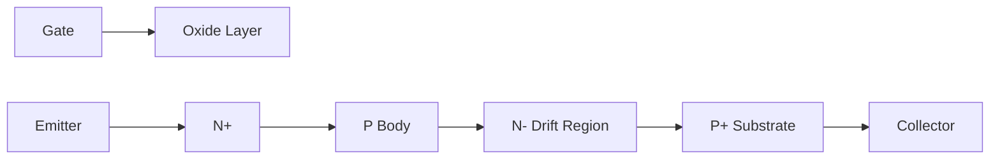

- **Gate-Oxide Layer**: Controls device switching
- **N+ Emitter**: Source of electrons
- **P+ Collector**: Forms BJT section

**Mnemonic:** "MOSFET Input, BJT Output, IGBT Throughout"

## Question 1(b) [4 marks]

**Draw and explain the construction of SCR. Also draw the characteristic curve of it.**

**Answer**:
SCR is a four-layer PNPN semiconductor device with three terminals.

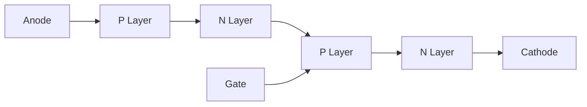

**Characteristic Curve:**

```goat
     I
     ^
     |                     Forward
     |                   Conduction
     |                      /
     |                     /
     |                    /
     |          Breakover|
     |               *   |
     |             /     |
     |Forward     |      |
     |Blocking    |      |
     |            |      |
     +------------+------+----> V
     |            |
     |            |
     |Reverse     |
     |Blocking    |
     |            |
     |            V
```

- **P-N-P-N Layers**: Forms two transistors (PNP, NPN)
- **Gate Terminal**: Triggers conduction
- **Holding Current**: Minimum to maintain conduction

**Mnemonic:** "PNPN Layers Form Two BJT Pairs"

## Question 1(c) [7 marks]

**Explain the working of solid state relay using Opto TRIAC, Opto-SCR and Opto-transistor with the help of circuit diagram.**

**Answer**:
Solid state relays use optocouplers for electrical isolation between control and load circuits.

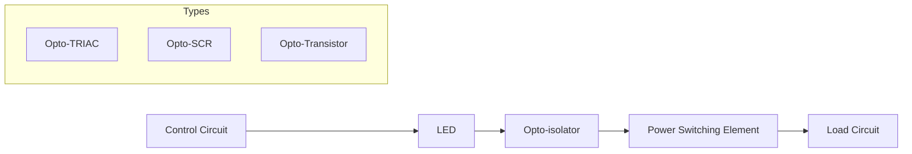

| SSR Type | Input Circuit | Isolation | Output Circuit | Applications |
|----------|--------------|-----------|---------------|--------------|
| Opto-TRIAC | DC control signal | LED + TRIAC detector | TRIAC power switch | AC loads |
| Opto-SCR | DC control signal | LED + photo-SCR | SCR power switch | DC loads |
| Opto-Transistor | DC control signal | LED + phototransistor | Power transistor | Low power DC |

- **Working Principle**: Control signal activates LED → Light triggers photo-sensitive device → Switches power circuit
- **Zero-Crossing Detection**: Reduces EMI by switching at zero voltage
- **No Mechanical Parts**: Increases reliability and life

**Mnemonic:** "LED Illuminates, Photo-device Conducts, Power Flows"

## Question 1(c OR) [7 marks]

**Describe the working and constructional features of SCR, GTO and power MOSFET with the help of characteristic curve.**

**Answer**:

| Device | Construction | Characteristic Curve | Working Principle |
|--------|--------------|---------------------|-------------------|
| SCR | PNPN 4-layer with gate | Latching - once ON stays ON | Gate pulse triggers, requires external commutation to turn OFF |
| GTO | Modified SCR with better gate control | Similar to SCR but can be turned OFF by gate | Negative gate pulse extracts carriers, turns OFF |
| Power MOSFET | Vertical structure with many cells | Non-latching - requires gate bias | Gate voltage creates channel, removed voltage turns OFF |

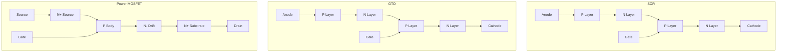

- **SCR**: High current capability, latching behavior
- **GTO**: Self turn-off capability, higher switching speed
- **MOSFET**: Voltage-controlled, fast switching, no secondary breakdown

**Mnemonic:** "SCR Latches, GTO Self-Extinguishes, MOSFET Channels"

## Question 2(a) [3 marks]

**Explain the methods to protect SCR against over current in details.**

**Answer**:
SCR over-current protection prevents device damage due to excessive current.

| Protection Method | Working Principle | Implementation |
|-------------------|-------------------|----------------|
| Fast-acting Fuses | Melts quickly during fault | Series with SCR |
| Circuit Breakers | Trips when current exceeds threshold | Main circuit protection |
| Current-limiting Reactors | Limits di/dt and peak current | Series with SCR |

- **Heat Sinks**: Help dissipate excess heat
- **Snubber Circuits**: Reduce current spikes during switching

**Mnemonic:** "Fuses Fast, Reactors Restrict, Breakers Break"

## Question 2(b) [4 marks]

**Explain any two methods to turn ON the SCR.**

**Answer**:
SCR can be turned ON through different triggering methods.

| Triggering Method | Circuit Implementation | Characteristics |
|-------------------|------------------------|-----------------|
| Gate Triggering | Pulse applied between gate-cathode | Most common, controlled |
| Voltage Triggering | Anode voltage exceeds breakover voltage | No gate control, emergency |

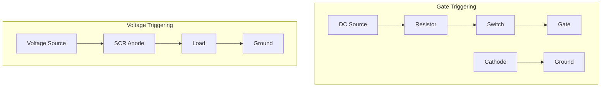

- **Gate Triggering**: Controls firing angle precisely
- **Voltage Triggering**: Happens when forward voltage exceeds breakover voltage

**Mnemonic:** "Gate Gets Control, Voltage Ventures Automatically"

## Question 2(c) [7 marks]

**Enlist the various methods to turn OFF the SCR and explain each of it using circuit diagram in brief.**

**Answer**:
SCR commutation methods are techniques to turn OFF a conducting SCR.

| Commutation Method | Circuit Principle | Applications |
|--------------------|-------------------|--------------|
| Natural Commutation | AC source crosses zero | AC circuits |
| Forced Commutation | External components force current to zero | DC circuits |
| Class A (Self) | Parallel LC oscillator | Simple circuits |
| Class B (Resonant) | LC circuit in series with SCR | Medium power |
| Class C (Complementary) | Second SCR to divert current | High power |
| Class D (Auxiliary) | Auxiliary SCR + LC | Controlled timing |
| Class E (External) | External voltage source | Reliable but complex |

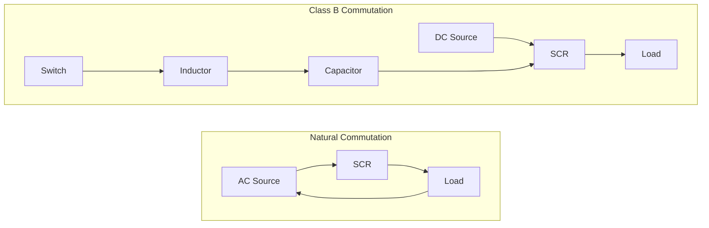

- **Natural Commutation**: Current naturally falls to zero in AC cycles
- **Forced Commutation**: Artificially brings current to zero in DC circuits
- **Communication Classes**: A through E progressively more complex and reliable

**Mnemonic:** "Natural Zeros, Forced Components, Classes Advance Reliability"

## Question 2(a OR) [3 marks]

**Explain the methods to protect SCR against over voltage in details.**

**Answer**:
Over-voltage protection prevents damage from voltage transients.

| Protection Method | Working Principle | Implementation |
|-------------------|-------------------|----------------|
| Snubber Circuits | RC network limits dv/dt | Parallel with SCR |
| Metal Oxide Varistors | Clamps voltage spikes | Parallel with SCR |
| Zener Diodes | Breaks down at set voltage | Anode-cathode protection |

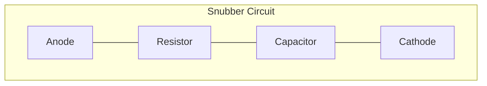

- **Snubber Circuit**: Limits voltage rise rate (dv/dt)
- **MOV**: Absorbs energy from voltage spikes
- **Thyristor Rating**: Always use components with margin above circuit voltage

**Mnemonic:** "Snubbers Slow, Varistors Clamp, Zeners Zap"

## Question 2(b OR) [4 marks]

**Explain triggering of Thyristor in detail.**

**Answer**:
Thyristor triggering involves activating the device from blocking to conduction state.

| Triggering Method | Working Mechanism | Advantages |
|-------------------|-------------------|------------|
| Gate Triggering | Low power pulse at gate-cathode | Precise control |
| R-C Phase Shift | Varies phase angle for control | Simple circuit |
| UJT Triggering | Relaxation oscillator generates pulses | Stable timing |
| Light Triggering | Photons generate carriers (LASCR) | Electrical isolation |

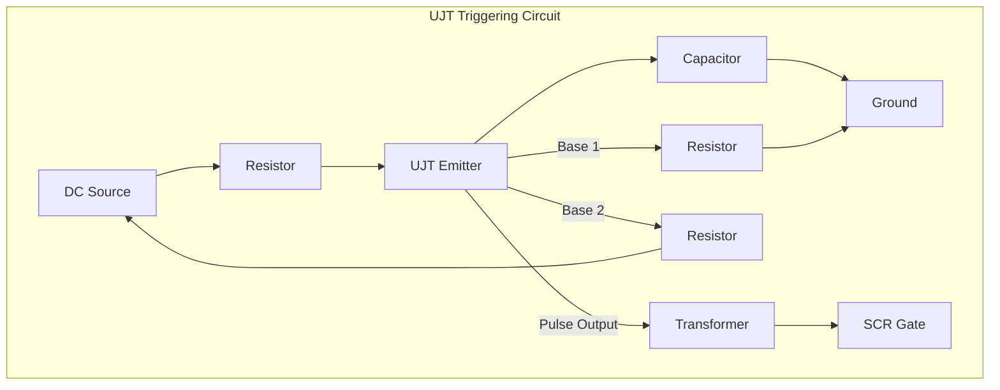

- **Gate Current**: Must exceed latching current
- **Gate Pulse**: Width and amplitude critical for reliable triggering
- **Triggering Angle**: Controls power delivered to load

**Mnemonic:** "Gate Gets Going, RC Rhythmically, UJT Uniformly, Light Liberates"

## Question 2(c OR) [7 marks]

**Design and explain snubber circuit for SCR. Also explain the importance of it.**

**Answer**:
Snubber circuits protect SCR from voltage transients and control switching behavior.

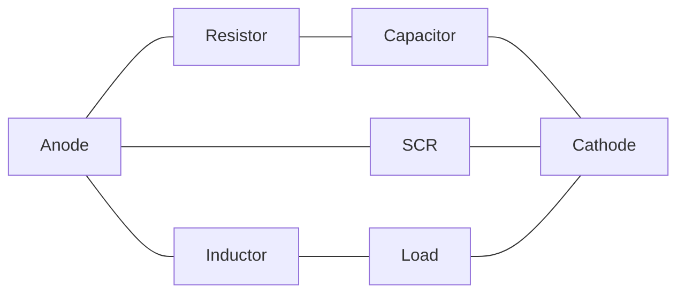

| Component | Function | Selection Criteria |
|-----------|----------|-------------------|
| Resistor (R) | Limits discharge current | R > E/I₍max₎ |
| Capacitor (C) | Absorbs voltage transients | C = I₍load₎/(dv/dt) |
| Optional Diode | Provides discharge path | Fast recovery type |

**Design Steps:**

1. Calculate maximum dv/dt from SCR datasheet
2. Determine load current and circuit voltage
3. Select C to limit dv/dt below SCR rating
4. Select R to limit discharge current and provide damping

**Importance:**

- **dv/dt Protection**: Prevents false triggering
- **Turn-off Support**: Improves commutation
- **Switching Loss Reduction**: Reduces power dissipation
- **EMI Reduction**: Smooths voltage transitions

**Mnemonic:** "Resistor Restrains, Capacitor Catches, Diode Directs"

## Question 3(a) [3 marks]

**Explain the working of three phase Full Wave Rectifier using circuit diagram.**

**Answer**:
Three-phase full-wave rectifier converts three-phase AC to DC with six diodes.

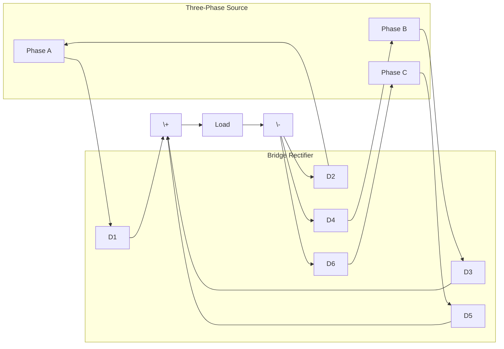

- **Six Diodes**: Three for positive, three for negative half-cycles
- **Conduction**: Each diode conducts for 120° per cycle
- **Output**: Low ripple (4.2%) compared to single-phase

**Mnemonic:** "Six Diodes, Three Phases, Smooth DC"

## Question 3(b) [4 marks]

**Differentiate single phase and poly phase rectifier circuit.**

**Answer**:

| Parameter | Single Phase Rectifier | Poly Phase Rectifier |
|-----------|------------------------|----------------------|
| Input | Single AC source | Multiple AC sources (3 or more) |
| Diodes Required | 2 (half-wave), 4 (full-wave) | 3 (half-wave), 6 (full-wave) |
| Ripple Factor | 0.482 (full-wave) | 0.042 (3-phase full-wave) |
| Transformer Utilization | Lower (0.812) | Higher (0.955) |
| Output Waveform | Pulsating | Much smoother |
| Efficiency | Lower | Higher |
| Applications | Low power applications | Industrial power supplies |

- **Form Factor**: Lower in poly-phase (better quality DC)
- **Power Handling**: Polyphase handles higher power more efficiently
- **Circuit Complexity**: Polyphase more complex but better performance

**Mnemonic:** "Single Pulses Heavily, Poly Provides Smoothly"

## Question 3(c) [7 marks]

**Describe the application of series, parallel and bridge type Inverter.**

**Answer**:

| Inverter Type | Circuit Topology | Applications | Characteristics |
|---------------|------------------|--------------|-----------------|
| Series Inverter | Resonant LC with load in series | Induction heating, Ultrasonic generators | • High frequency<br>• Voltage source<br>• Self-commutating |
| Parallel Inverter | Resonant LC with load in parallel | Uninterruptible power supplies, Solar inverters | • Current source<br>• Better efficiency<br>• Wider load range |
| Bridge Inverter | H-bridge with 4 switches | Motor drives, Grid-tied systems, General purpose | • Voltage/current source<br>• Most versatile<br>• Various control methods |

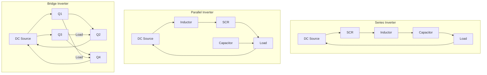

- **Series Inverter**: Best for fixed-frequency, fixed-load applications
- **Parallel Inverter**: Handles load variations better
- **Bridge Inverter**: Most widely used for general applications

**Mnemonic:** "Series Sings at High Frequency, Parallel Performs with Variety, Bridge Brings Versatility"

## Question 3(a OR) [3 marks]

**Explain the working of three phase Half Wave Rectifier using circuit diagram.**

**Answer**:
Three-phase half-wave rectifier uses three diodes to convert three-phase AC to DC.

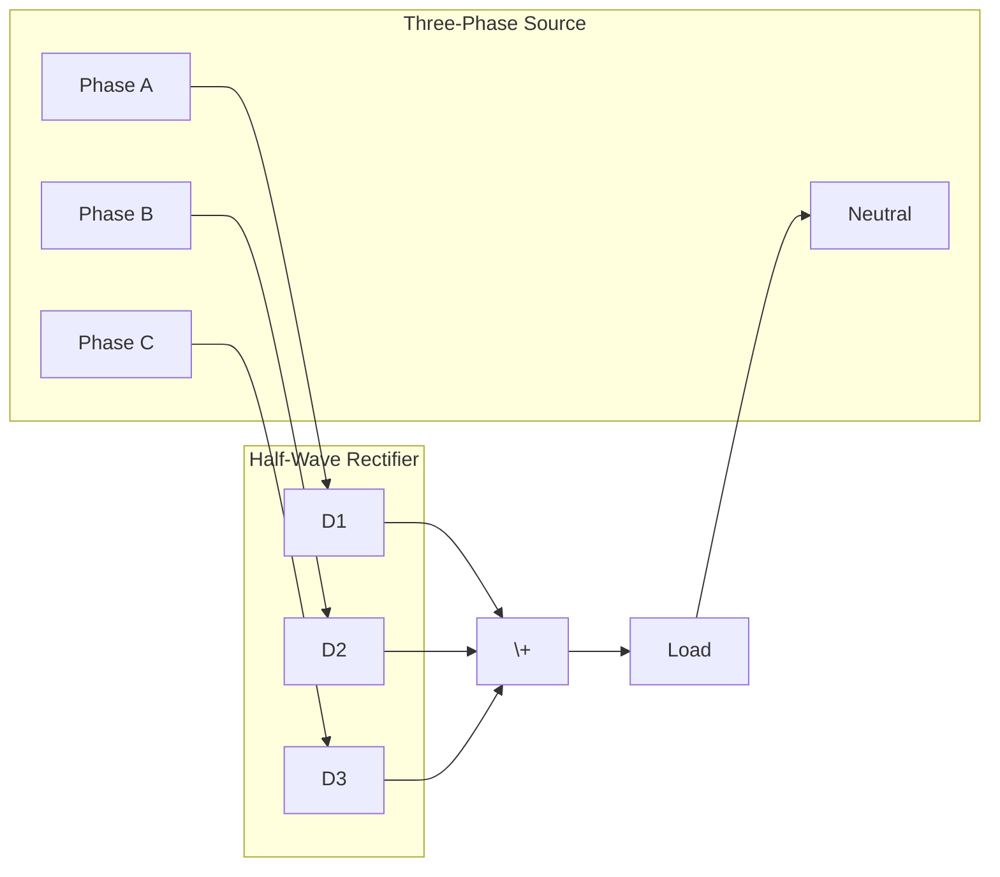

- **Three Diodes**: Each conducts during positive half-cycle of its phase
- **Conduction**: Each diode conducts for 120° per cycle
- **Output**: 13.4% ripple (higher than full-wave)

**Mnemonic:** "Three Diodes, Three Phases, One Direction"

## Question 3(b OR) [4 marks]

**Enlist the different types of charging technology and compare it.**

**Answer**:

| Charging Technology | Working Principle | Advantages | Disadvantages |
|--------------------|-------------------|------------|---------------|
| Constant Current (CC) | Fixed current until voltage threshold | Simple, low cost | Longer charging time |
| Constant Voltage (CV) | Fixed voltage with declining current | Fast initial charge | Current not limited at start |
| CC-CV | Starts with CC, switches to CV | Optimal charging profile | Requires controller circuit |
| Pulse Charging | Current pulses with rest periods | Reduces heat, extends battery life | Complex control circuit |
| Trickle Charging | Very low constant current | Maintains charge | Not suitable for main charging |
| Fast Charging | High current with intelligent control | Significantly reduced charging time | Heat generation, battery stress |
| Wireless Charging | Inductive coupling | Convenient, no cables | Lower efficiency, alignment issues |

- **Battery Types**: Different technologies suit different battery chemistries
- **Charging Profiles**: Must match battery specifications to avoid damage
- **Temperature Management**: Critical factor in charging efficiency and safety

**Mnemonic:** "Current Consistently, Voltage Varies, Pulse Pauses, Trickle Tops, Fast Finishes"

## Question 3(c OR) [7 marks]

**Explain the working of Solar Photovoltaic (PV) based power generation with the help of block diagram.**

**Answer**:
Solar PV systems convert sunlight directly into electricity through the photovoltaic effect.

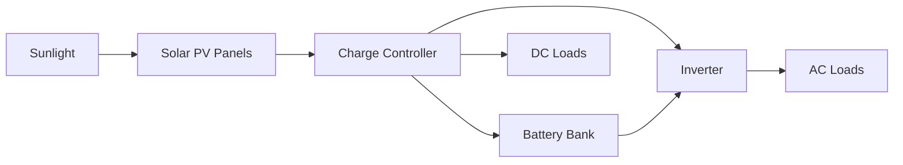

| Component | Function | Types |
|-----------|----------|-------|
| Solar Panels | Convert light to DC electricity | Monocrystalline, Polycrystalline, Thin-film |
| Charge Controller | Regulates battery charging | PWM, MPPT |
| Battery Bank | Stores energy | Lead-acid, Lithium-ion, Flow |
| Inverter | Converts DC to AC | Pure sine wave, Modified sine wave |
| Distribution System | Delivers power to loads | Off-grid, Grid-tied, Hybrid |

- **Photovoltaic Effect**: Light energy creates electron flow in semiconductor material
- **Maximum Power Point Tracking**: Optimizes power extraction under varying conditions
- **Grid Integration**: Can operate standalone or connected to utility grid

**Mnemonic:** "Sunlight Strikes Semiconductors, Controllers Charge, Batteries Bank, Inverters Interface"

## Question 4(a) [3 marks]

**State the merits and demerits of Induction heating.**

**Answer**:

| Merits of Induction Heating | Demerits of Induction Heating |
|-----------------------------|-------------------------------|
| Rapid heating without direct contact | High initial installation cost |
| Precise temperature control | Requires electrical power source |
| Energy efficient (80-90%) | Limited to electrically conductive materials |
| Clean and pollution-free | Requires proper cooling systems |
| Localized heating possible | EMI generation may affect nearby electronics |
| Uniform heating throughout material | May require specialized coil designs |

- **Working Principle**: Eddy currents induced in workpiece generate heat
- **Applications**: Melting, hardening, annealing, welding

**Mnemonic:** "Fast, Focused, Efficient but Costly, Conductive, Complex"

## Question 4(b) [4 marks]

**Draw the circuit of sequential timer using IC-555 and explain its working.**

**Answer**:
Sequential timer provides multiple timed outputs in sequence.

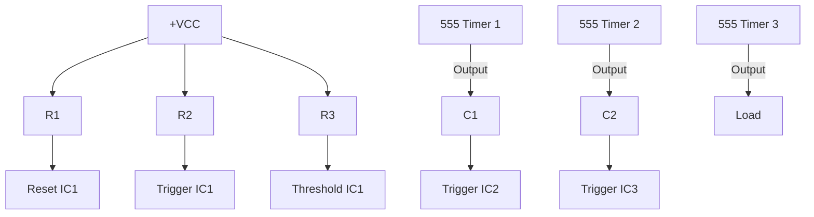

**Working:**

1. First 555 timer operates in monostable mode
2. Output triggers second timer when first timing cycle completes
3. Second timer triggers third timer
4. Each timer's period determined by its RC time constant

- **RC Values**: T = 1.1 × R × C determines each stage's timing
- **Cascading**: Multiple stages provide sequential timing events
- **Applications**: Process control, industrial sequencing

**Mnemonic:** "One Timer Triggers Another Sequentially"

## Question 4(c) [7 marks]

**Draw the schematic circuit for single phase AC power control using TRIAC and explain it in detail.**

**Answer**:
TRIAC-based AC power control regulates power to loads through phase angle control.

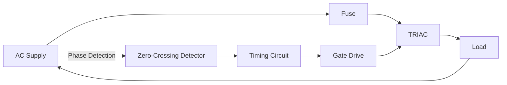

| Component | Function | Selection Criteria |
|-----------|----------|-------------------|
| TRIAC | Bidirectional power switch | Current rating > load current |
| DIAC | Triggers TRIAC symmetrically | Breakover voltage < trigger voltage |
| RC Network | Phase shifting for firing angle | R determines firing angle range |
| Snubber Circuit | dv/dt protection | Based on TRIAC specifications |

**Operation Principle:**

1. RC network creates phase shift from AC input
2. DIAC breaks over when capacitor voltage reaches threshold
3. DIAC triggers TRIAC at specific phase angle
4. Varying R changes phase angle, controlling power

- **Firing Angle**: 0° (full power) to 180° (zero power)
- **Applications**: Light dimmers, heater control, motor speed control
- **Advantages**: Smooth control, no moving parts, high reliability

**Mnemonic:** "Resistance Changes Phase, DIAC Delivers Pulse, TRIAC Transmits Power"

## Question 4(a OR) [3 marks]

**Enlist the merits and demerits of Dielectric heating.**

**Answer**:

| Merits of Dielectric Heating | Demerits of Dielectric Heating |
|------------------------------|--------------------------------|
| Uniform heating throughout material | High initial equipment cost |
| Rapid heating (even for insulators) | High frequency power source required |
| Selective heating possible | Not effective for conductive materials |
| Energy efficient for certain materials | RF radiation safety concerns |
| Clean and pollution-free | Complex impedance matching requirements |
| Works with non-conductive materials | Power loss in transmission lines |

- **Working Principle**: Dipole rotation in high-frequency electric field generates heat
- **Applications**: Plastic welding, wood drying, food processing

**Mnemonic:** "Uniform, Rapid, Insulator-friendly but Expensive, Complex, RF-intensive"

## Question 4(b OR) [4 marks]

**Draw the circuit diagram of photo-electric relay using LDR and explain its working.**

**Answer**:
Photo-electric relay uses light-dependent resistor to detect light and control a relay.

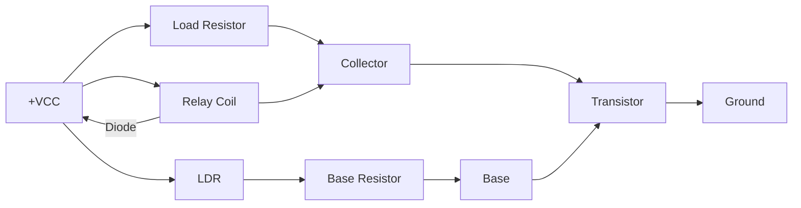

**Working:**

1. LDR resistance decreases when light falls on it
2. Voltage divider (LDR + R2) provides base current to transistor
3. Transistor turns ON when sufficient base current flows
4. Relay activates when transistor conducts

- **Light Threshold**: Adjustable via potentiometer
- **Applications**: Automatic lighting, counting systems, alarm systems
- **LDR Characteristics**: Resistance inversely proportional to light intensity

**Mnemonic:** "Light Lowers Resistance, Transistor Turns, Relay Responds"

## Question 4(c OR) [7 marks]

**Draw the circuit of DC power control using SCR with UJT in triggering circuit and explain in detail.**

**Answer**:
UJT-triggered SCR circuit provides precise control of DC power to loads.

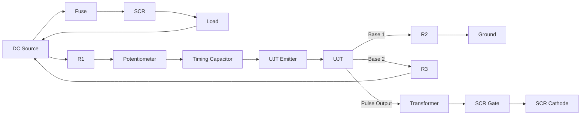

| Component | Function | Selection Criteria |
|-----------|----------|-------------------|
| UJT | Generates trigger pulses | η (intrinsic standoff ratio) = 0.5-0.8 |
| R₁+P | Timing resistor | Controls charging rate of C₁ |
| C₁ | Timing capacitor | Determines pulse frequency |
| Transformer | Isolates UJT circuit from SCR | Pulse transmission capability |
| SCR | Main power control | Current rating > load current |

**Working Principle:**

1. UJT relaxation oscillator generates pulses
2. Potentiometer varies charging rate, changing pulse frequency
3. Pulses are coupled through transformer to SCR gate
4. SCR conducts for portion of cycle based on trigger timing

- **Control Range**: From minimum to maximum power
- **Advantages**: Precise control, high efficiency
- **Applications**: DC motor control, heating elements, battery chargers

**Mnemonic:** "Resistor Regulates Rate, UJT Unleashes Pulses, SCR Switches Current"

## Question 5(a) [3 marks]

**Explain the hall effect sensor in BLDC driver circuit.**

**Answer**:
Hall effect sensors detect rotor position in BLDC motors for precise commutation timing.

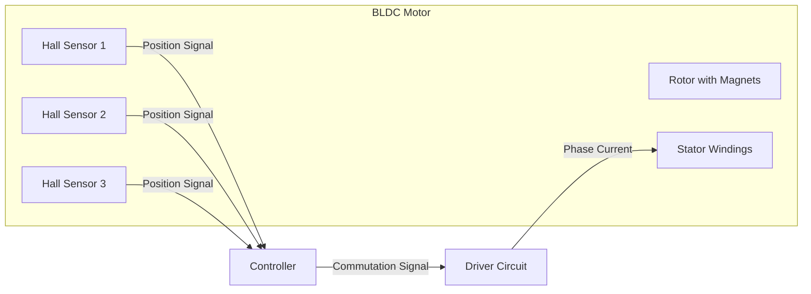

| Hall Sensor | Function | Output |
|-------------|----------|--------|
| Position Detection | Senses magnetic field of rotor | Digital (ON/OFF) |
| Placement | 120° apart for 3-phase motors | Provides 6 unique states |
| Signal Processing | Inputs to microcontroller | Determines switching sequence |

- **Working Principle**: Voltage generated perpendicular to current and magnetic field
- **Commutation Sequence**: Each sensor pattern corresponds to specific switching combination

**Mnemonic:** "Magnet Moves, Hall Senses, Controller Commutates"

## Question 5(b) [4 marks]

**Draw and explain solid state circuit to control speed of single phase Induction motor using TRIAC.**

**Answer**:
TRIAC-based speed control for induction motors uses phase control principles.

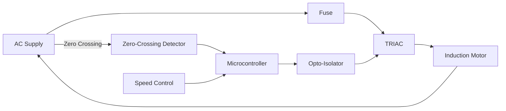

**Working Principle:**

1. Zero-crossing detector identifies voltage zero-crossings
2. Microcontroller calculates delay based on speed setting
3. After delay, gate pulse sent through opto-isolator to TRIAC
4. TRIAC conducts for remainder of half-cycle
5. Varying firing angle controls voltage to motor, adjusting speed

- **TRIAC Rating**: Must handle starting current (5-7× running current)
- **Speed Range**: Limited at low end due to motor characteristics
- **Applications**: Fans, pumps, small machine tools

**Mnemonic:** "Zero Detected, Delay Determined, TRIAC Triggered"

## Question 5(c) [7 marks]

**Explain the construction and working of BLDC motor using diagram. Also enlist its applications.**

**Answer**:
Brushless DC motors use electronic commutation instead of mechanical brushes.

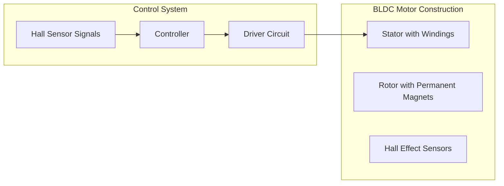

| Component | Function | Types/Variations |
|-----------|----------|------------------|
| Stator | Contains copper windings | Slotted/slotless designs |
| Rotor | Permanent magnets | Surface/interior mounted |
| Hall Sensors | Position detection | 60°/120° configurations |
| Controller | Commutation logic | Microcontroller-based |
| Driver | Power switching | MOSFET/IGBT-based |

**Working Principle:**

1. Hall sensors detect rotor position
2. Controller determines correct energizing sequence
3. Driver powers appropriate stator windings
4. Magnetic interaction produces rotation
5. Process repeats continuously

**Applications:**

- Computer cooling fans and hard drives
- Electric vehicles and hybrid cars
- Industrial automation and robotics
- Medical equipment (pumps, ventilators)
- Drones and RC models
- Home appliances (washers, refrigerators)
- Precision instruments

**Mnemonic:** "Magnets Move, Sensors See, Electronics Energize"

## Question 5(a OR) [3 marks]

**Explain the working of variable frequency drive (VFD).**

**Answer**:
Variable Frequency Drives control motor speed by varying the frequency and voltage.

```mermaid
graph LR
    AC[AC Supply] --> R[Rectifier]
    R --> DC[DC Bus]
    DC --> I[Inverter]
    I --> M[Motor]

    C[Controller] --> I
    S[Speed Reference] --> C
    F[Feedback] --> C
```

| VFD Section | Function | Components |
|-------------|----------|------------|
| Rectifier | Converts AC to DC | Diodes or SCRs |
| DC Bus | Filters and stores energy | Capacitors, inductors |
| Inverter | Converts DC to variable AC | IGBTs or MOSFETs |
| Controller | Manages frequency/voltage | Microprocessor |

- **V/f Control**: Maintains constant V/f ratio for stable torque
- **Operating Range**: Typically 10-200% of rated speed
- **Efficiency**: High efficiency across wide speed range

**Mnemonic:** "Rectify to DC, Invert to AC, Vary Frequency"

## Question 5(b OR) [4 marks]

**Draw and explain the circuit to control speed of Universal motor.**

**Answer**:
Universal motors can run on AC or DC and allow simple speed control methods.

```mermaid
graph LR
    AC[AC Supply] --> F[Fuse]
    F --> T[TRIAC]
    T --> M[Universal Motor]
    M --> AC

    AC --> R1[R1]
    R1 --> DIAC[DIAC]
    DIAC --> G[TRIAC Gate]
    R1 --> C1[C1]
    C1 --> P[Potentiometer]
    P --> F
```

**Working Principle:**

1. RC network creates phase shift from input voltage
2. Potentiometer adjusts phase shift amount
3. DIAC triggers when voltage reaches breakover
4. TRIAC conducts for remainder of half-cycle
5. Adjusting potentiometer varies firing angle and motor speed

- **Speed Range**: Wide control range (10-100%)
- **Torque Characteristics**: Decreases somewhat at lower speeds
- **Applications**: Power tools, household appliances, sewing machines

**Mnemonic:** "Resistance Changes Phase, DIAC Delivers, TRIAC Conducts"

## Question 5(c OR) [7 marks]

**Draw the block diagram of PLC and explain the function of each block in brief. And enlist the advantages and applications of it.**

**Answer**:
Programmable Logic Controllers (PLCs) are industrial computers for automation control.

```mermaid
graph LR
    subgraph "PLC System"
    PS[Power Supply]
    CPU[Central Processing Unit]
    IM[Input Modules]
    OM[Output Modules]
    MEM[Memory]
    COM[Communication Interface]
    end

    PS --> CPU
    PS --> IM
    PS --> OM
    PS --> COM
    
    IM --> CPU
    CPU --> OM
    CPU <--> MEM
    CPU <--> COM
    
    FS[Field Sensors] --> IM
    OM --> ACT[Actuators]
    COM <--> HMI[HMI/SCADA]
    COM <--> NET[Network]
```

| PLC Block | Function | Types/Characteristics |
|-----------|----------|----------------------|
| Power Supply | Provides regulated power | Typically 24VDC or 110/220VAC |
| CPU | Executes program, processes I/O | Scan-based operation |
| Input Modules | Interface with field sensors | Digital, analog, special |
| Output Modules | Control field devices | Relay, transistor, triac |
| Memory | Stores program and data | RAM, EEPROM, Flash |
| Communication | Network connectivity | Ethernet, Profibus, Modbus |

**Advantages:**

- Reliability in harsh industrial environments
- Flexibility for reprogramming
- Compact size compared to relay-based systems
- Built-in diagnostics and troubleshooting
- Modular expandability
- High-speed operation
- Cost-effective for complex control systems

**Applications:**

- Manufacturing production lines
- Process control in plants
- Material handling systems
- Building automation
- Power generation and distribution
- Water/wastewater treatment
- Packaging machinery
- Food processing

**Mnemonic:** "Power Provides, CPU Computes, Inputs Inform, Outputs Operate, Memory Maintains"
