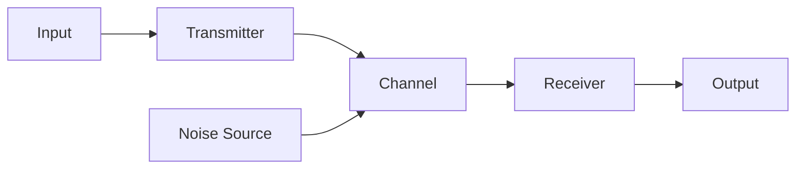
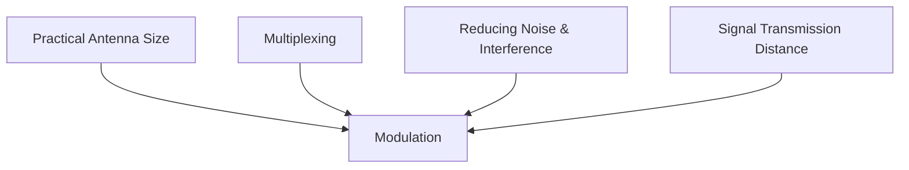
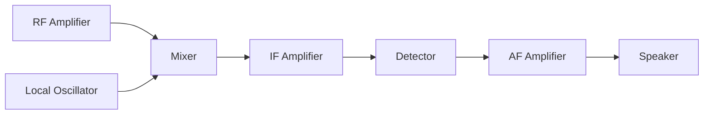
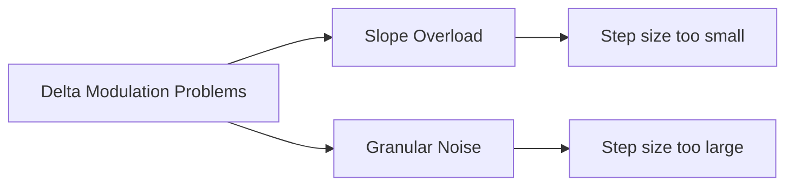
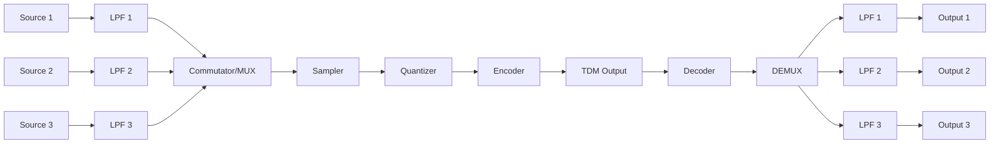

## પ્રશ્ન 1(a) [3 ગુણ]

**સંચાર પ્રણાલી નો બ્લોક ડાયાગ્રામ દોરો અને સમજાવો.**

**જવાબ**:



- **Input**: સ્ત્રોતથી આવતો મેસેજ સિગ્નલ
- **Transmitter**: મેસેજને પ્રસારણ માટે યોગ્ય સ્વરૂપમાં રૂપાંતરિત કરે છે
- **Channel**: જેના દ્વારા સિગ્નલ પ્રવાસ કરે છે તે માધ્યમ
- **Receiver**: પ્રાપ્ત સિગ્નલમાંથી મૂળ સંદેશો કાઢે છે
- **Output**: ગંતવ્ય સ્થાને પહોંચાડવામાં આવેલો સંદેશ
- **Noise Source**: અવાંછિત સિગ્નલ્સ જે સંચારમાં દખલ કરે છે

**મેમરી ટ્રીક:** "સંદેશ પ્રસારક માધ્યમ પ્રાપ્તકર્તા ઉત્પાદન"

## પ્રશ્ન 1(b) [4 ગુણ]

**મોડ્યુલેશનની જરૂરિયાત અને ફાયદા સમજાવો.**

**જવાબ**:

**મોડ્યુલેશનની જરૂરિયાત:**



**મોડ્યુલેશનના ફાયદાઓ:**

- **એન્ટેનાનું ઘટાડેલું કદ**: વ્યવહારિક એન્ટેના લંબાઈ = λ/4, ઊંચી ફ્રિક્વન્સીનો અર્થ નાના એન્ટેના
- **મલ્ટિપ્લેક્સિંગ શક્ય**: એક જ ચેનલ દ્વારા એક સાથે અનેક સિગ્નલો પ્રસારિત થાય છે
- **વધુ રેન્જ**: મોડ્યુલેટેડ સિગ્નલ્સ બેઝબેન્ડ સિગ્નલ્સ કરતાં વધુ દૂર સુધી પહોંચે છે
- **નોઇઝ ઘટાડો**: મોડ્યુલેશન તકનીકો દ્વારા વધુ સારું SNR પ્રાપ્ત થાય છે

**મેમરી ટ્રીક:** "એન્ટેના, મલ્ટિપ્લેક્સિંગ, દૂરગામી પ્રસારણ અને નોઇઝ ઇમ્યુનિટી"

## પ્રશ્ન 1(c) [7 ગુણ]

**મોડ્યુલેશનને વ્યાખ્યાયિત કરો. એમ્પ્લિટ્યુડ મોડ્યુલેશનને વેવફોર્મ સાથે સમજાવો અને મોડ્યુલેટેડ સિગ્નલ માટે વોલ્ટેજ સમીકરણ મેળવો.**

**જવાબ**:

**મોડ્યુલેશન**: કેરિયર સિગ્નલના પરિમાણ (એમ્પ્લિટ્યુડ, ફ્રિક્વન્સી, ફેઝ) ને મેસેજ સિગ્નલના પ્રમાણમાં બદલવાની પ્રક્રિયા.

**એમ્પ્લિટ્યુડ મોડ્યુલેશન વેવફોર્મ:**

```goat
                                      AM Waveform
    │        Carrier           │        Message           │     Modulated Signal
    │                          │                          │
    │  ╱╲    ╱╲    ╱╲    ╱╲    │                          │     ╱╲      ╱╲  
    │ ╱  ╲  ╱  ╲  ╱  ╲  ╱  ╲   │         ╱╲               │    ╱  ╲    ╱  ╲ 
    │╱    ╲╱    ╲╱    ╲╱    ╲  │        ╱  ╲              │   ╱    ╲  ╱    ╲
----┼---------------------     │-------╱----╲---------    │--╱------╲╱------╲-----
    │                          │      ╱      ╲            │ ╱                 ╲
    │                          │     ╱        ╲           │╱                   ╲
    │                          │    ╱          ╲          │                     ╲
```

**AM વોલ્ટેજ સમીકરણની ગાણિતિક સમજ:**

1. કેરિયર સિગ્નલ: vc(t) = Vc sin(ωct)
2. મેસેજ સિગ્નલ: vm(t) = Vm sin(ωmt)
3. મોડ્યુલેટેડ સિગ્નલ: vAM(t) = [Vc + Vm sin(ωmt)] sin(ωct)
4. મોડ્યુલેશન ઇન્ડેક્સ: μ = Vm/Vc
5. અંતિમ AM સમીકરણ: vAM(t) = Vc[1 + μ sin(ωmt)] sin(ωct)

**મેમરી ટ્રીક:** "એમ્પ્લિટ્યુડ મોડ્યુલેશન કેરિયરનું મૂલ્ય બદલે છે"

## પ્રશ્ન 1(c) OR [7 ગુણ]

**ઘોંઘાટને વ્યાખ્યાયિત કરો. ઘોંઘાટનું વર્ગીકરણ આપો અને કોઈપણ ત્રણ આંતરિક ઘોંઘાટના કારણને સમજાવો.**

**જવાબ**:

**ઘોંઘાટ (Noise)**: અવાંછિત સિગ્નલ્સ જે સંચાર સિગ્નલ્સમાં દખલ કરે છે, જેના કારણે વિકૃતિ અથવા ભૂલો થાય છે.

**ઘોંઘાટનું વર્ગીકરણ:**

| બાહ્ય ઘોંઘાટ (External Noise) | આંતરિક ઘોંઘાટ (Internal Noise) |
|----------------|----------------|
| વાતાવરણીય (Atmospheric) | થર્મલ (Thermal) |
| અવકાશીય (Extraterrestrial) | શોટ (Shot) |
| ઔદ્યોગિક (Industrial) | ટ્રાન્ઝિટ-ટાઇમ (Transit-time) |
| | ફ્લિકર (Flicker) |
| | પાર્ટિશન (Partition) |

**આંતરિક ઘોંઘાટના કારણો:**

- **થર્મલ નોઇઝ**:
  - વાહકોમાં ઇલેક્ટ્રોન્સની રેન્ડમ ગતિને કારણે ઉત્પન્ન થાય છે
  - બધા ઇલેક્ટ્રોનિક ઘટકોમાં હાજર હોય છે
  - તાપમાન અને બેન્ડવિડ્થ સાથે સીધા પ્રમાણમાં છે

- **શોટ નોઇઝ**:
  - જંક્શન પર કેરિયર્સની રેન્ડમ આવવાને કારણે ઉત્પન્ન થાય છે
  - ડાયોડ અને ટ્રાન્ઝિસ્ટર જેવા એક્ટિવ ડિવાઇસમાં જોવા મળે છે
  - ડિવાઇસમાં વહેતા DC કરંટના પ્રમાણમાં હોય છે

- **ફ્લિકર નોઇઝ**:
  - સેમીકન્ડક્ટરમાં સરફેસ ડિફેક્ટ્સ અને અશુદ્ધિઓને કારણે ઉત્પન્ન થાય છે
  - ફ્રિક્વન્સીના વ્યસ્ત પ્રમાણમાં હોય છે (1/f નોઇઝ)
  - ઓછી ફ્રિક્વન્સીએ મહત્વપૂર્ણ છે

**મેમરી ટ્રીક:** "થર્મલ શોટ ફ્લિકર સર્વત્ર ઘોંઘાટ છે"

## પ્રશ્ન 2(a) [3 ગુણ]

**વ્યાખ્યાયિત કરો. (૧) મોડ્યુલેશન ઈન્ડેક્સ (એએમ) (2) ઘોંઘાટની ફિગર (3) ડિજીટલ મોડ્યુલેશન**

**જવાબ**:

1. **મોડ્યુલેશન ઈન્ડેક્સ (AM)**: મોડ્યુલેટિંગ સિગ્નલના એમ્પ્લિટ્યુડનો કેરિયર સિગ્નલના એમ્પ્લિટ્યુડ સાથેનો ગુણોત્તર.
   - μ = Vm/Vc
   - વિકૃતિ ટાળવા માટે 0 ≤ μ ≤ 1 હોવું જોઈએ

2. **ઘોંઘાટની ફિગર (Noise Figure)**: કોઈ ડિવાઇસના ઇનપુટ SNR અને આઉટપુટ SNRનો ગુણોત્તર.
   - NF = (SNR)input/(SNR)output
   - સિસ્ટમ દ્વારા ઉમેરાયેલ ઘોંઘાટ દર્શાવે છે
   - હંમેશા ≥ 1, dBમાં વ્યક્ત થાય છે

3. **ડિજીટલ મોડ્યુલેશન**: કેરિયર સિગ્નલના પરિમાણોમાં ફેરફાર કરીને ડિજિટલ ડેટાને રજૂ કરવાની તકનીક.
   - ઉદાહરણો: ASK, FSK, PSK, QAM
   - ડિજિટલ ડેટા ટ્રાન્સમિશન માટે વપરાય છે

**મેમરી ટ્રીક:** "મોડ્યુલેશન માપે, ઘોંઘાટ અંક, ડિજિટલ ડેટા"

## પ્રશ્ન 2(b) [4 ગુણ]

**કેરિયર પાવર અને મોડ્યુલેશન ઈન્ડેક્સ ને ધ્યાનમાં લેતા એમ્પ્લીટ્યુડ મોડ્યુલેટેડ સિગ્નલ માટે પરિવહન થયેલ કુલ પાવર માટે સમીકરણ મેળવો.**

**જવાબ**:

**AMમાં કુલ પાવરનું સમીકરણ:**

1. AM વેવ સમીકરણ: vAM(t) = Vc[1 + μ sin(ωmt)] sin(ωct)

2. પાવર ગણતરી માટે, RMS મૂલ્યો ધ્યાનમાં લો:
   - કેરિયર પાવર (Pc) = Vc²/2R
   - દરેક સાઇડબેન્ડમાં પાવર (PSB) = (μ²Vc²)/(4R)

3. કુલ પાવર સમીકરણ:
   - PT = Pc + PUSB + PLSB
   - PT = Pc + 2PSB (કારણ કે ઉપર અને નીચેના સાઇડબેન્ડમાં સમાન પાવર હોય છે)
   - PT = Vc²/2R + 2(μ²Vc²)/(4R)
   - PT = (Vc²/2R)[1 + (μ²/2)]

4. અંતિમ સમીકરણ: PT = Pc(1 + μ²/2)

**મેમરી ટ્રીક:** "કુલ પાવર = કેરિયર પાવર (1 + μ²/2)"

## પ્રશ્ન 2(c) [7 ગુણ]

**ડબલ સાઇડબેન્ડ દબાયેલા વાહક એમ્પ્લીટ્યુડ મોડ્યુલેશનના મૂળભૂત સિદ્ધાંતને સમજાવો. તેના વોલ્ટેજ સમીકરણ મેળવો અને ડાયોડનો ઉપયોગ કરીને તેની માત્ર મોડ્યુલેટર સરકિટ દોરો.**

**જવાબ**:

**ડબલ સાઇડબેન્ડ સપ્રેસ્ડ કેરિયર (DSBSC) સિદ્ધાંત:**

- કેરિયરને દબાવી દેવામાં આવે છે, માત્ર સાઇડબેન્ડ્સને પ્રસારિત કરવામાં આવે છે
- બધી માહિતી સાઇડબેન્ડમાં સમાયેલ હોય છે
- AMની તુલનામાં વધુ પાવર અસરકારક છે
- ડિમોડ્યુલેશન માટે જટિલ રિસીવરની જરૂર પડે છે

**વોલ્ટેજ સમીકરણની ગાણિતિક સમજ:**

1. AM સિગ્નલ: vAM(t) = Vc[1 + μ sin(ωmt)]sin(ωct)
2. કેરિયર ઘટક દૂર કરવો: vDSBSC(t) = Vc × μ sin(ωmt)sin(ωct)
3. ત્રિકોણમિતીય ઓળખનો ઉપયોગ: sin(A)sin(B) = 0.5[cos(A-B) - cos(A+B)]
4. અંતિમ સમીકરણ: vDSBSC(t) = (Vcμ/2)[cos(ωc-ωm)t - cos(ωc+ωm)t]

**ડાયોડનો ઉપયોગ કરીને બેલેન્સ્ડ મોડ્યુલેટર સર્કિટ:**

```goat
           D1
        |--->|--+
        |       |
     +--+       +--+
     |             |
Vc---|             |---Output
     |             |
     +--+       +--+
        |       |
        |--->|--+
           D2
           |
           |
         Carrier
           |
           V
       Modulating
         Signal
```

**મેમરી ટ્રીક:** "કેરિયર દૂર કરો, બેન્ડવિડ્થ બચાવો, સિગ્નલો જોડો"

## પ્રશ્ન 2(a) OR [3 ગુણ]

**માત્ર રેડિયો રીસીવર નાં સંદર્ભે વ્યાખ્યાયિત કરો, (1) સંવેદનશીલતા (2) સીલેકટીવિટી (3) ફાઈડાલીટી**

**જવાબ**:

1. **સંવેદનશીલતા (Sensitivity)**: નબળા સિગ્નલ્સને શોધવા અને એમ્પ્લિફાય કરવાની રીસીવરની ક્ષમતા.
   - માઇક્રોવોલ્ટ (μV)માં માપવામાં આવે છે
   - નીચું મૂલ્ય વધુ સારી સંવેદનશીલતા દર્શાવે છે
   - વ્યાવસાયિક રિસીવર્સ માટે સામાન્ય રીતે 1-10 μV

2. **સીલેકટીવિટી (Selectivity)**: ઇચ્છિત સિગ્નલ અને અડોસપડોસના દખલ કરતા સિગ્નલ્સ વચ્ચે ભેદ કરવાની ક્ષમતા.
   - -3dB પોઇન્ટ્સ પર બેન્ડવિડ્થ તરીકે માપવામાં આવે છે
   - સાંકડી બેન્ડવિડ્થનો અર્થ વધુ સારી સીલેકટીવિટી
   - અડોસપડોસના ચેનલ ઇન્ટરફેરન્સને રોકે છે

3. **ફાઈડાલીટી (Fidelity)**: રિસીવર મૂળ સંદેશને કેટલી ચોકસાઈથી પુનઃઉત્પાદિત કરે છે તે.
   - પુનઃઉત્પાદનની ગુણવત્તા માપે છે
   - વિકૃતિ અને ઘોંઘાટથી પ્રભાવિત થાય છે
   - ઉચ્ચ ફાઈડાલીટીનો અર્થ વધુ સારી સાઉન્ડ ક્વોલિટી

**મેમરી ટ્રીક:** "સંવેદી પસંદગી વફાદારીથી"

## પ્રશ્ન 2(b) OR [4 ગુણ]

**એએમ સિગ્નલમાં દરેક સાઇડબેન્ડમાં ૨૦૦ વોટ સાથે ૧ કિલો વોટનો કેરિયર પાવર છે. આ માટે મોડ્યુલેશન ઇન્ડેક્સ શોધો.**

**જવાબ**:

**આપેલ:**

- કેરિયર પાવર (Pc) = 1 KW = 1000 W
- દરેક સાઇડબેન્ડમાં પાવર (PSB) = 200 W

**શોધવાનું:** મોડ્યુલેશન ઇન્ડેક્સ (μ)

**ઉકેલ:**

1. કુલ સાઇડબેન્ડ પાવર: PTSB = 2 × PSB = 2 × 200 = 400 W
2. સૂત્રનો ઉપયોગ: PTSB = Pc × μ²/2
3. 400 = 1000 × μ²/2
4. μ² = (400 × 2)/1000 = 800/1000 = 0.8
5. μ = √0.8 = 0.894 = 0.9 (આશરે)

**મેમરી ટ્રીક:** "સાઇડબેન્ડ પાવર મોડ્યુલેશન ઇન્ડેક્સ બતાવે છે"

## પ્રશ્ન 2(c) OR [7 ગુણ]

**લઘુત્તમ સાત પરિમાણો/પાસાને ધ્યાનમાં રાખીને ફ્રિક્વન્સી મોડ્યુલેશન સાથે એમ્પ્લિટ્યૂડ મોડ્યુલેશનની તુલના કરો.**

**જવાબ**:

| પરિમાણ | એમ્પ્લિટ્યૂડ મોડ્યુલેશન (AM) | ફ્રિક્વન્સી મોડ્યુલેશન (FM) |
|-----------|---------------------------|---------------------------|
| **વ્યાખ્યા** | કેરિયરનો એમ્પ્લિટ્યૂડ મેસેજ સાથે બદલાય છે | કેરિયરની ફ્રિક્વન્સી મેસેજ સાથે બદલાય છે |
| **બેન્ડવિડ્થ** | સાંકડી (2 × fm) | વિશાળ (2 × β × fm) |
| **પાવર કાર્યક્ષમતા** | નબળી (કેરિયરમાં ~66% પાવર) | સારી (બધો પાવર સાઇડબેન્ડમાં) |
| **ઘોંઘાટ રક્ષણ** | નબળું (ઘોંઘાટ એમ્પ્લિટ્યૂડને અસર કરે છે) | ઉત્તમ (એમ્પ્લિટ્યૂડ લિમિટર્સ ઘોંઘાટ દૂર કરે છે) |
| **સર્કિટ જટિલતા** | સરળ ટ્રાન્સમીટર અને રિસીવર | જટિલ ટ્રાન્સમીટર અને રિસીવર |
| **ગુણવત્તા** | ઓછી ફાઈડાલીટી | ઉચ્ચ ફાઈડાલીટી |
| **ઉપયોગો** | બ્રોડકાસ્ટિંગ, એરક્રાફ્ટ કમ્યુનિકેશન | FM રેડિયો, TV સાઉન્ડ, વાયરલેસ માઇક |
| **સ્પેક્ટ્રમ** | કેરિયર અને બે સાઇડબેન્ડ ધરાવે છે | અનંત સાઇડબેન્ડ ધરાવે છે |

**મેમરી ટ્રીક:** "બેન્ડવિડ્થ, કાર્યક્ષમતા, ઘોંઘાટ, ગુણવત્તા - AM ઘણી ગુણવત્તા કસોટીઓમાં નિષ્ફળ જાય છે"

## પ્રશ્ન 3(a) [3 ગુણ]

**૧ કિલો હર્ટ્ઝનાં સાઈન વેવ સિગ્નલને ટાઇમ ડોમેઇન અને ફ્રીક્વન્સી ડોમેન માં દોરો અને લેબલ કરો. સિગ્નલના ડોમેન ફ્રીક્વન્સી ડોમેન વિશ્લેષણ નાં ફાયદા જણાવો.**

**જવાબ**:

**ટાઇમ ડોમેઇન રજૂઆત:**

```goat
    Amplitude
        ^
        |
    1   |    /\      /\      /\      /\
        |   /  \    /  \    /  \    /  \
        |  /    \  /    \  /    \  /    \
    0   |-+------+-------+-------+-------+-------> Time
        |  \    /  \    /  \    /  \    /
        |   \  /    \  /    \  /    \  /
   -1   |    \/      \/      \/      \/
        |
     1KHz sine wave (Period = 1ms)
```

**ફ્રિક્વન્સી ડોમેઇન રજૂઆત:**

```goat
    Amplitude
        ^
        |
    1   |    |
        |    |
        |    |
    0   |----+----+----+----+----+----+-------> Frequency
        |    0   1KHz           
        |
     Single spectral line at 1KHz
```

**ફ્રિક્વન્સી ડોમેઇન વિશ્લેષણના ફાયદા:**

- **સિગ્નલ રચના**: સરળતાથી ફ્રિક્વન્સી ઘટકોની ઓળખ
- **ફિલ્ટર ડિઝાઇન**: સરળ ફિલ્ટર પ્રતિસાદ વિશ્લેષણ
- **બેન્ડવિડ્થ નિર્ધારણ**: સ્પેક્ટ્રમ પહોળાઈનું સીધું વિઝ્યુઅલાઇઝેશન
- **ઘોંઘાટ વિશ્લેષણ**: સિગ્નલને ઘોંઘાટથી વધુ સારી રીતે અલગ કરવું

**મેમરી ટ્રીક:** "ફ્રિક્વન્સી સમયમાં છુપાયેલા ઘટકો બતાવે છે"

## પ્રશ્ન 3(b) [4 ગુણ]

**નીચેનાં પ્રશ્નો માટે આવૃત્તિ જણાવો. (1) એએમ રેડિયો માટે આઇએફ (IF) ફ્રિક્વન્સી (૨) એફએમ રેડિયો માટે આઇએફ ફ્રિક્વન્સી (3) એફએમ રેડિયો માટે વપરાતો ફ્રિક્વન્સી બેન્ડ (4) માનવવાણીનો ફ્રિક્વન્સી બેન્ડ.**

**જવાબ**:

| પરિમાણ | આવૃત્તિ |
|-----------|-----------|
| એએમ રેડિયો માટે આઇએફ ફ્રિક્વન્સી | 455 kHz |
| એફએમ રેડિયો માટે આઇએફ ફ્રિક્વન્સી | 10.7 MHz |
| એફએમ રેડિયો માટે વપરાતો ફ્રિક્વન્સી બેન્ડ | 88-108 MHz |
| માનવવાણીનો ફ્રિક્વન્સી બેન્ડ | 300 Hz - 3.4 kHz |

**મેમરી ટ્રીક:** "AM455, FM10.7, બેન્ડ88-108, વાણી300-3.4"

## પ્રશ્ન 3(c) [7 ગુણ]

**સિંગલ સાઇડ બેન્ડ (એસએસબી) મોડ્યુલેશન તેના વેવફોર્મ અને ફાયદા સાથે સમજાવો. બતાવો કે કેવી રીતે SSB ટ્રાન્સમિશનને ડબલ સાઇડબેન્ડ પૂર્ણ વાહક એમ્પ્લીટ્યુડ મોડ્યુલેશન ને અનુલક્ષીને માત્ર ૧/૬ (છઠ્ઠા ભાગના) પાવરની જરૂર છે.**

**જવાબ**:

**સિંગલ સાઇડ બેન્ડ (SSB) મોડ્યુલેશન:**

- માત્ર એક જ સાઇડબેન્ડ (USB અથવા LSB) પ્રસારિત કરે છે
- કેરિયર અને બીજા સાઇડબેન્ડને દબાવી દેવામાં આવે છે
- બેન્ડવિડ્થ અને પાવર બચાવે છે

**SSB વેવફોર્મ:**

```goat
    Frequency Spectrum
        ^
        |
        |                   Regular AM
        |    |              |     |
        |    |              |     |
        |----+----+----+----+-----+-----> Frequency
             fc-fm   fc   fc+fm

        |                   SSB (USB)
        |                  |
        |                  |
        |----+----+----+----+----+-----> Frequency
                         fc+fm
```

**SSBના ફાયદા:**

- **બેન્ડવિડ્થ કાર્યક્ષમતા**: AMની અડધી બેન્ડવિડ્થનો ઉપયોગ કરે છે
- **પાવર કાર્યક્ષમતા**: કેરિયર પર કોઈ પાવર બરબાદ થતો નથી
- **ઓછું ફેડિંગ**: લાંબા અંતરના સંચારમાં સુધારેલ કામગીરી
- **વધુ સારો SNR**: માહિતીમાં વધુ પાવર કેન્દ્રિત

**પાવર તુલના:**

1. AMમાં: PT = Pc(1 + μ²/2)
2. μ = 1 માટે, PT = Pc(1 + 0.5) = 1.5Pc
3. AM પાવર વિતરણ: કેરિયર (Pc) = 67%, સાઇડબેન્ડ્સ = 33%
4. SSB માત્ર એક સાઇડબેન્ડનો ઉપયોગ કરે છે અને કેરિયર નથી
5. SSB પાવર = કુલ AM પાવરનો 16.5% = 1/6 આશરે

**મેમરી ટ્રીક:** "એક બેન્ડ બેન્ડવિડ્થ અને પાવર બચાવે છે"

## પ્રશ્ન 3(a) OR [3 ગુણ]

**જવાબ આપો. (1) જો મોડ્યુલેટિંગ ફ્રિક્વન્સી 5 KHZ હોય તો એમ્પ્લીટ્યુડ મોડ્યુલેટેડ સિગ્નલની બેન્ડવિડ્થ. (2) એએમ રેડિયોમાં જો પસંદ કરેલ સ્ટેશનની આવૃત્તિ 1000 KhZ હોય તો ઈમેજ સિગ્નલ ની આવૃત્તિ (3) બેઝબેન્ડ સિગ્નલની આવૃત્તિ 10 KHz હોય તો તેની સેમ્પલીંગ આવૃત્તિ.**

**જવાબ**:

1. **5 kHz મોડ્યુલેટિંગ ફ્રિક્વન્સી સાથે AM બેન્ડવિડ્થ:**
   - BW = 2 × fm = 2 × 5 kHz = 10 kHz

2. **1000 kHz સ્ટેશન માટે 455 kHz IF સાથે ઇમેજ ફ્રિક્વન્સી:**
   - હાઇ-સાઇડ ઇન્જેક્શન માટે: fimage = fstation + 2 × fIF
   - fimage = 1000 + 2 × 455 = 1000 + 910 = 1910 kHz

3. **10 kHz બેઝબેન્ડ માટે સેમ્પલિંગ ફ્રિક્વન્સી:**
   - fs > 2 × fmax (નાઇક્વિસ્ટ રેટ)
   - fs > 2 × 10 kHz = 20 kHz
   - સેમ્પલિંગ ફ્રિક્વન્સી > 20 kHz હોવી જોઈએ

**મેમરી ટ્રીક:** "બેન્ડવિડ્થ બમણી, ઇમેજ બે-IF ઉમેરે, સેમ્પલિંગ બમણી-ફ્રિક્વન્સી જોઈએ"

## પ્રશ્ન 3(b) OR [4 ગુણ]

**ગાણિતિક સમીકરણ દર્શાવતા નીચે મુજબના સિગ્નલો દોરો. (1) સાઇન વેવ સિગ્નલ (2) યુનિટ સ્ટેપ સિગ્નલ (3) રેમ્પ સિગ્નલ (4) ઇમ્પલ્સ સિગ્નલ.**

**જવાબ**:

**1. સાઇન વેવ:**

- સમીકરણ: f(t) = A sin(ωt + φ)

```goat
        ^
        |
    A   |    /\      /\      
        |   /  \    /  \    
        |  /    \  /    \  
    0   |-+------+-------+----> t
        |  \    /  \    /  
        |   \  /    \  /    
   -A   |    \/      \/      
```

**2. યુનિટ સ્ટેપ સિગ્નલ:**

- સમીકરણ: u(t) = 1 માટે t ≥ 0, 0 માટે t < 0

```goat
        ^
        |
    1   |        |‾‾‾‾‾‾‾‾‾‾‾‾‾‾‾‾
        |        |
        |        |
    0   |‾‾‾‾‾‾‾‾+‾‾‾‾‾‾‾‾‾‾‾‾‾‾‾> t
        |        0
```

**3. રેમ્પ સિગ્નલ:**

- સમીકરણ: r(t) = t માટે t ≥ 0, 0 માટે t < 0

```goat
        ^
        |                /
        |               /
        |              /
        |             /
        |            /
    0   |‾‾‾‾‾‾‾‾‾‾‾+‾‾‾‾‾‾‾‾‾‾‾‾‾‾> t
        |           0
```

**4. ઇમ્પલ્સ સિગ્નલ:**

- સમીકરણ: δ(t) = ∞ માટે t = 0, 0 માટે t ≠ 0

```goat
        ^
        |
        |
        |        |
        |        |
    0   |‾‾‾‾‾‾‾‾+‾‾‾‾‾‾‾‾‾‾‾‾‾‾‾> t
        |        0
```

**મેમરી ટ્રીક:** "સાઇન હલે છે, સ્ટેપ કૂદે છે, રેમ્પ ચઢે છે, ઇમ્પલ્સ ટોચે છે"

## પ્રશ્ન 3(c) OR [7 ગુણ]

**પ્રિ એમ્ફેસીસ અને ડી એમ્ફેસીસ સર્કિટને તેની જરૂરિયાત અને લાક્ષણિક ગ્રાફ સાથે દોરો અને સમજાવો. એફએમ રીસીવરની તુલના વિગતવાર એએમ રીસીવર સાથે પણ કરો.**

**જવાબ**:

**પ્રિ-એમ્ફેસીસ સર્કિટ:**

```goat
        ┌───────┐
        │       │
    ────┤   R   ├────┬──────
        │       │    │
        └───────┘    │
                     │
                  ┌──┴──┐
                  │     │
                  │  C  │
                  │     │
                  └──┬──┘
                     │
                     │
                     ▼
```

**ડી-એમ્ફેસીસ સર્કિટ:**

```goat
                  ┌───────┐
                  │       │
             ┌────┤   R   ├────
             │    │       │
             │    └───────┘
             │
     ────────┴────┐
                  │
               ┌──┴──┐
               │     │
               │  C  │
               │     │
               └─────┘
```

**લાક્ષણિક ગ્રાફ:**

```goat
    Gain(dB)
        ^
        |                 Pre-emphasis
        |              ,/
        |            ,/
        |          ,/
    0   |‾‾‾‾‾‾‾‾‾+‾‾‾‾‾‾‾‾‾‾‾‾‾‾‾> Frequency
        |          fc
        |          \,
        |            \,
        |              \,  De-emphasis
```

**પ્રિ/ડી-એમ્ફેસીસની જરૂરિયાત:**

- **ઘોંઘાટ ઘટાડો**: ઉચ્ચ ફ્રિક્વન્સી ઘોંઘાટ માટે વધુ સંવેદનશીલ
- **SNR સુધારે છે**: ટ્રાન્સમીટર પર ઉચ્ચ ફ્રિક્વન્સીને વધારે, રિસીવર પર ઘટાડે
- **ટાઇમ કોન્સ્ટન્ટ**: FM પ્રસારણમાં સામાન્ય રીતે 75μs

**FM અને AM રિસીવર વચ્ચે તુલના:**

| પરિમાણ | FM રિસીવર | AM રિસીવર |
|-----------|-------------|------------|
| **IF ફ્રિક્વન્સી** | 10.7 MHz | 455 kHz |
| **બેન્ડવિડ્થ** | 200 kHz | 10 kHz |
| **લિમિટર સ્ટેજ** | હાજર | ગેરહાજર |
| **ડિમોડ્યુલેટર** | ડિસ્ક્રિમિનેટર/રેશિયો ડિટેક્ટર | એન્વેલોપ ડિટેક્ટર |
| **પ્રિ/ડી-એમ્ફેસીસ** | હાજર | ગેરહાજર |
| **ઓડિયો ક્વોલિટી** | ઉત્તમ | મધ્યમ |
| **ઘોંઘાટ ઇમ્યુનિટી** | ઉચ્ચ | નીચી |
| **જટિલતા** | વધુ જટિલ | સરળ |

**મેમરી ટ્રીક:** "પ્રિ ઉચ્ચને વધારે, ડી ઉચ્ચને ઘટાડે; FM ઘોંઘાટને AM કરતાં સારી રીતે ફિલ્ટર કરે"

## પ્રશ્ન 4(a) [3 ગુણ]

**રેડિયો રીસીવર માટે ઈમેજ આવૃત્તિ નેવ્યાખ્યાયિત કરો અને યોગ્ય ઉદાહરણ સાથે તેને સમજાવો.**

**જવાબ**:

**ઇમેજ ફ્રિક્વન્સી**: અવાંછિત સિગ્નલ ફ્રિક્વન્સી જે લોકલ ઓસિલેટર સિગ્નલ સાથે મિક્સ થતાં ઇચ્છિત સિગ્નલ જેટલું જ IF ઉત્પન્ન કરે છે.

**સમજૂતી:**

- હાઇ-સાઇડ ઇન્જેક્શન માટે: fimage = fsignal + 2 × fIF
- લો-સાઇડ ઇન્જેક્શન માટે: fimage = fsignal - 2 × fIF

**ઉદાહરણ:**

- ઇચ્છિત સિગ્નલ: 1000 kHz
- IF: 455 kHz
- લોકલ ઓસિલેટર ફ્રિક્વન્સી (હાઇ-સાઇડ): fLO = 1000 + 455 = 1455 kHz
- ઇમેજ ફ્રિક્વન્સી: fimage = fLO + 455 = 1455 + 455 = 1910 kHz
- 1000 kHz અને 1910 kHz બંને 1455 kHz સાથે મિક્સ થતાં 455 kHz IF ઉત્પન્ન કરશે

**મેમરી ટ્રીક:** "ઇમેજ રેડિયોમાં 2IF દૂર દખલ કરે છે"

## પ્રશ્ન 4(b) [4 ગુણ]

**એમ્પ્લિટ્યુડ મોડ્યુલેટેડ સિગ્નલના ડિમોડ્યુલેશન માટે એન્વેલોપ ડિટેક્ટર ની સર્કિટ દોરો અને તેને સમજાવો.**

**જવાબ**:

**એન્વેલોપ ડિટેક્ટર સર્કિટ:**

```goat
         D
    ┌────►|────┬────────┐
    │          │        │
    │          │        │
Inpt│       ┌──┴──┐  ┌──┴──┐ Output
    │       │     │  │     │
    │       │  R  │  │  C  │
    │       │     │  │     │
    └───────┴──┬──┘  └──┬──┘
               │        │
               └────────┴───────
                     Ground
```

**કાર્યપદ્ધતિ:**

- **ડાયોડ**: AM સિગ્નલનું રેક્ટિફિકેશન કરે છે, નેગેટિવ હાફ-સાયકલ્સ દૂર કરે છે
- **RC સર્કિટ**: લો-પાસ ફિલ્ટર તરીકે કામ કરે છે
- **ટાઇમ કોન્સ્ટન્ટ**: RC એ 1/fm >> RC >> 1/fc સંતોષવું જોઈએ
- **આઉટપુટ**: AM સિગ્નલનો એન્વેલોપ, જે મૂળ સંદેશ છે

**એન્વેલોપ ડિટેક્શન પ્રક્રિયા:**

1. ડાયોડ પોઝિટિવ હાફ-સાયકલ્સ દરમિયાન કન્ડક્ટ કરે છે
2. કેપેસિટર પીક વેલ્યુ સુધી ચાર્જ થાય છે
3. નેગેટિવ હાફ-સાયકલ્સ દરમિયાન, કેપેસિટર રેસિસ્ટર દ્વારા ડિસ્ચાર્જ થાય છે
4. આઉટપુટ AM સિગ્નલના એન્વેલોપને અનુસરે છે

**મેમરી ટ્રીક:** "ડાયોડ રેક્ટિફાય કરે, RC એન્વેલોપ સુધારે"

## પ્રશ્ન 4(c) [7 ગુણ]

**એએમ રેડિયો રીસીવરનોબ્લોક ડાયાગ્રામ દોરો અને દરેક બ્લોક/સ્ટેજ ની કામગીરી સમજાવો.**

**જવાબ**:

**AM રેડિયો રિસીવર (સુપરહેટરોડાઇન) બ્લોક ડાયાગ્રામ:**



**દરેક બ્લોકનાં કાર્યો:**

- **RF એમ્પ્લિફાયર**:
  - ટ્યૂન્ડ સર્કિટનો ઉપયોગ કરીને ઇચ્છિત સ્ટેશન સિગ્નલ પસંદ કરે છે
  - પ્રારંભિક એમ્પ્લિફિકેશન પૂરું પાડે છે
  - સંવેદનશીલતા અને સિલેક્ટિવિટી સુધારે છે
  - ઇમેજ ફ્રિક્વન્સી દખલને ઘટાડે છે

- **લોકલ ઓસિલેટર**:
  - ઇનકમિંગ કરતાં IF વેલ્યુ જેટલી ઉંચી ફ્રિક્વન્સી જનરેટ કરે છે
  - સામાન્ય રીતે fLO = fRF + 455 kHz
  - RF એમ્પ્લિફાયર સાથે એક સાથે ટ્યૂન થાય છે

- **મિક્સર**:
  - RF સિગ્નલને લોકલ ઓસિલેટર સાથે જોડે છે
  - સરવાળા અને તફાવતની ફ્રિક્વન્સી ઉત્પન્ન કરે છે
  - ઇન્ટરમીડિયેટ ફ્રિક્વન્સી (IF) આઉટપુટ આપે છે

- **IF એમ્પ્લિફાયર**:
  - ફિક્સ્ડ-ફ્રિક્વન્સી એમ્પ્લિફાયર (455 kHz)
  - રિસીવર ગેઇનનો મોટાભાગનો ભાગ પ્રદાન કરે છે
  - રિસીવરની સિલેક્ટિવિટી નક્કી કરે છે

- **ડિટેક્ટર**:
  - IF સિગ્નલમાંથી મૂળ ઓડિયો કાઢે છે
  - સામાન્ય રીતે ડાયોડ સાથે એન્વેલોપ ડિટેક્ટર
  - RF ઘટક દૂર કરે છે, ઓડિયો પુનઃપ્રાપ્ત કરે છે

- **AF એમ્પ્લિફાયર**:
  - પુનઃપ્રાપ્ત ઓડિયો સિગ્નલને એમ્પ્લિફાય કરે છે
  - વોલ્યુમ કંટ્રોલ શામેલ છે
  - સ્પીકરને સાંભળી શકાય તેવા સ્તરે ડ્રાઇવ કરે છે

- **સ્પીકર**:
  - ઇલેક્ટ્રિકલ સિગ્નલ્સને સાઉન્ડ વેવ્સમાં રૂપાંતરિત કરે છે

**મેમરી ટ્રીક:** "RF મિક્સિંગ IF ડિટેક્ટેડ ઓડિયો સ્પીકર માટે"

## પ્રશ્ન 4(a) OR [3 ગુણ]

**સિગ્નલના સેમ્પલીંગ લેવા માટેના નાઈક્વિસ્ટ માપદંડ જણાવો અને સમજાવો.**

**જવાબ**:

**નાઈક્વિસ્ટ માપદંડ**: બેન્ડલિમિટેડ સિગ્નલને વિકૃતિ વિના પુનઃનિર્માણ કરવા માટે, સેમ્પલિંગ ફ્રિક્વન્સી સિગ્નલમાં ઉચ્ચતમ ફ્રિક્વન્સી ઘટકથી ઓછામાં ઓછી બમણી હોવી જોઈએ.

**ગાણિતિક નિવેદન:**

- fs ≥ 2fmax
- fs = સેમ્પલિંગ ફ્રિક્વન્સી
- fmax = સિગ્નલમાં મહત્તમ ફ્રિક્વન્સી

**સમજૂતી:**

- એલિયાસિંગ (ફ્રિક્વન્સી ઓવરલેપ) થતું ન હોય તેની ખાતરી કરે છે
- લઘુત્તમ સેમ્પલિંગ રેટને નાઈક્વિસ્ટ રેટ કહેવાય છે
- નાઈક્વિસ્ટ રેટથી નીચે સેમ્પલિંગ અપરિવર્તનીય વિકૃતિ પેદા કરે છે
- વ્યવહારમાં, ફિલ્ટરિંગની મંજૂરી આપવા માટે fs > 2.2fmax વાપરવામાં આવે છે

**ઉદાહરણ:**

- fmax = 20 kHz વાળા ઓડિયો માટે
- નાઈક્વિસ્ટ રેટ = 2 × 20 kHz = 40 kHz
- CD સેમ્પલિંગ રેટ = 44.1 kHz (>40 kHz)

**મેમરી ટ્રીક:** "ઉચ્ચતમ ફ્રિક્વન્સી કરતાં ઓછામાં ઓછા બમણા સ્પીડથી સેમ્પલ કરો"

## પ્રશ્ન 4(b) OR [4 ગુણ]

**ડેલ્ટા મોડ્યુલેશન માટે સ્લોપ ઓવરલોડ અને ગ્રેન્યુલર નોઈજ સમજાવો.**

**જવાબ**:

**ડેલ્ટા મોડ્યુલેશન સમસ્યાઓ:**



**સ્લોપ ઓવરલોડ:**

- જ્યારે ઇનપુટ સિગ્નલ DM કરતાં વધુ ઝડપથી બદલાય છે ત્યારે થાય છે
- ઝડપથી બદલાતા સિગ્નલો માટે સ્ટેપ સાઇઝ ખૂબ નાની
- DM આઉટપુટ ઇનપુટને "પકડી" શકતું નથી
- તીક્ષ્ણ ટ્રાન્ઝિશન પર વિકૃતિ ઉત્પન્ન કરે છે
- ઉકેલ: સ્ટેપ સાઇઝ અથવા સેમ્પલિંગ રેટ વધારો

**ગ્રેન્યુલર નોઈઝ:**

- સાપેક્ષ રીતે સ્થિર સિગ્નલના ભાગો દરમિયાન થાય છે
- ધીમી ગતિએ બદલાતા સિગ્નલો માટે સ્ટેપ સાઇઝ ખૂબ મોટી
- આઉટપુટ ઇનપુટ વેલ્યુની આસપાસ આંદોલિત થાય છે
- પુનર્નિર્મિત સિગ્નલમાં "ખરબચડાપણું" ઉત્પન્ન કરે છે
- ઉકેલ: સ્ટેપ સાઇઝ ઘટાડો

**એડેપ્ટિવ ડેલ્ટા મોડ્યુલેશન (ADM):** બંને સમસ્યાઓને ઓછી કરવા માટે ગતિશીલ રીતે સ્ટેપ સાઇઝ એડજસ્ટ કરે છે.

**મેમરી ટ્રીક:** "ઢાળને મોટા સ્ટેપ, સપાટીને નાના સ્ટેપની જરૂર છે"

## પ્રશ્ન 4(c) OR [7 ગુણ]

**પી.સી.એમ. ટ્રાન્સમિટર અને રીસીવરને દોરો અને વિગતવાર સમજાવો.**

**જવાબ**:

**PCM ટ્રાન્સમિટર:**


**PCM રિસીવર:**


**ટ્રાન્સમિટર ઘટકો:**

- **એન્ટી-એલિયાસિંગ ફિલ્ટર**: એલિયાસિંગ અટકાવવા માટે ઇનપુટ બેન્ડવિડ્થ મર્યાદિત કરે છે
- **સેમ્પલ એન્ડ હોલ્ડ**: નિયમિત અંતરાલે ક્ષણિક મૂલ્યો પકડે છે
- **ક્વાન્ટાઇઝર**: સેમ્પલ્સને પૂર્વવ્યાખ્યાયિત ડિસ્ક્રીટ લેવલ્સમાં અનુમાનિત કરે છે
- **એન્કોડર**: ક્વાન્ટાઇઝ્ડ વેલ્યુને બાઇનરી કોડમાં રૂપાંતરિત કરે છે

**રિસીવર ઘટકો:**

- **ડિકોડર**: બાઇનરી કોડને ક્વાન્ટાઇઝ્ડ વેલ્યુમાં પાછો રૂપાંતરિત કરે છે
- **D/A કન્વર્ટર**: ડિસ્ક્રીટ વેલ્યુને સતત વોલ્ટેજમાં રૂપાંતરિત કરે છે
- **રીકન્સ્ટ્રક્શન ફિલ્ટર**: સેમ્પલિંગ ફ્રિક્વન્સી ઘટકો દૂર કરે છે, આઉટપુટને સુધારે છે

**PCM પેરામીટર્સ:**

- **રિઝોલ્યુશન**: પ્રતિ સેમ્પલ બિટ્સ (n) દ્વારા નિર્ધારિત
- **ક્વાન્ટાઇઝેશન લેવલ્સ**: L = 2^n
- **બિટ રેટ**: R = n × fs (બિટ્સ પ્રતિ સેકન્ડ)
- **SNR**: દરેક બિટ ઉમેરતાં ~6dB સુધારો થાય છે

**મેમરી ટ્રીક:** "સેમ્પલ, ક્વાન્ટાઇઝ, એન્કોડ; ડિકોડ, કન્વર્ટ, રીકન્સ્ટ્રક્ટ"

## પ્રશ્ન 5(a) [3 ગુણ]

**યોગ્ય ઉદાહરણ સાથે બીટ, બીટનો દર અને બૌડ દરને વ્યાખ્યાયિત કરો.**

**જવાબ**:

- **બિટ**: ડિજિટલ માહિતીનો સૌથી નાનો એકમ, જે 0 અથવા 1 દર્શાવે છે.
  - ઉદાહરણ: 10110માં 5 બિટ્સ છે

- **બિટ રેટ**: પ્રતિ સેકન્ડ ટ્રાન્સમિટ થતા બિટ્સની સંખ્યા.
  - એકમ: bps (બિટ્સ પ્રતિ સેકન્ડ)
  - ઉદાહરણ: 9600 bps એટલે એક સેકન્ડમાં 9600 બિટ્સ ટ્રાન્સમિટ થાય છે

- **બૌડ રેટ**: પ્રતિ સેકન્ડ સિગ્નલ બદલાવની (સિમ્બોલ્સ) સંખ્યા.
  - એકમ: Baud
  - ઉદાહરણ: QPSKમાં, દરેક સિમ્બોલ 2 બિટ્સ દર્શાવે છે, તેથી 9600 bps = 4800 Baud

**સંબંધ:**

- બિટ રેટ = બૌડ રેટ × પ્રતિ સિમ્બોલ બિટ્સની સંખ્યા
- બાઇનરી સિગ્નલિંગ માટે (1 બિટ/સિમ્બોલ): બિટ રેટ = બૌડ રેટ
- મલ્ટિલેવલ કોડિંગ માટે: બિટ રેટ > બૌડ રેટ

**મેમરી ટ્રીક:** "બિટ્સ ડેટા બનાવે, બૌડ સિમ્બોલ્સ લાવે"

## પ્રશ્ન 5(b) [4 ગુણ]

**મલ્ટિપ્લેક્સિંગને વ્યાખ્યાયિત કરો. તેના પ્રકારો જણાવો. યોગ્ય આકૃતિ સાથે ફ્રીક્વન્શી ડીવીજન મલ્ટિપ્લેક્સિંગ સમજાવો.**

**જવાબ**:

**મલ્ટિપ્લેક્સિંગ**: તકનીક જે મલ્ટિપલ સિગ્નલ્સને સામાન્ય ટ્રાન્સમિશન માધ્યમ શેર કરવાની મંજૂરી આપે છે.

**મલ્ટિપ્લેક્સિંગના પ્રકારો:**

- ફ્રિક્વન્સી ડિવિઝન મલ્ટિપ્લેક્સિંગ (FDM)
- ટાઇમ ડિવિઝન મલ્ટિપ્લેક્સિંગ (TDM)
- કોડ ડિવિઝન મલ્ટિપ્લેક્સિંગ (CDM)
- વેવલેંથ ડિવિઝન મલ્ટિપ્લેક્સિંગ (WDM)

**ફ્રિક્વન્સી ડિવિઝન મલ્ટિપ્લેક્સિંગ:**

```goat
    Frequency
        ^
        |
        |  ┌───┐  ┌───┐  ┌───┐  ┌───┐
        |  │Ch1│  │Ch2│  │Ch3│  │Ch4│
        |  │   │  │   │  │   │  │   │
    0   |--+---+--+---+--+---+--+---+---> Frequency
        |  f1     f2     f3     f4
        |
        |  Guard Bands between channels
```

**FDM કાર્યપદ્ધતિ:**

- દરેક સિગ્નલ અલગ કેરિયર ફ્રિક્વન્સી પર મોડ્યુલેટ થાય છે
- ગાર્ડ બેન્ડ્સ સાથે દરેક ચેનલને બેન્ડવિડ્થ ફાળવવામાં આવે છે
- બધા ચેનલો એક સાથે ટ્રાન્સમિટ થાય છે
- રિસીવર ચેનલોને અલગ કરવા માટે ફિલ્ટર્સનો ઉપયોગ કરે છે
- રેડિયો/TV બ્રોડકાસ્ટિંગ, કેબલ સિસ્ટમમાં વપરાય છે

**મેમરી ટ્રીક:** "ફ્રિક્વન્સી મલ્ટિપલ સિગ્નલને એક સાથે વિભાજિત કરે છે"

## પ્રશ્ન 5(c) [7 ગુણ]

**આકૃતિ સાથે મૂળભૂત PCM-TDM આકૃતિ દોરો અને સમજાવો.**

**જવાબ**:

**PCM-TDM સિસ્ટમ બ્લોક ડાયાગ્રામ:**



**PCM-TDM સિસ્ટમ ઓપરેશન:**

**ટ્રાન્સમિટર સાઇડ:**

- **ઇનપુટ સોર્સ**: મલ્ટિપલ એનાલોગ સિગ્નલ્સ
- **લો-પાસ ફિલ્ટર્સ**: ઇનપુટ સિગ્નલ્સની બેન્ડવિડ્થ મર્યાદિત કરે છે
- **કમ્યુટેટર/MUX**: અનુક્રમે દરેક ઇનપુટને સેમ્પલ કરે છે
- **સેમ્પલર**: સતત સિગ્નલ્સને ડિસ્ક્રીટ સેમ્પલ્સમાં રૂપાંતરિત કરે છે
- **ક્વાન્ટાઇઝર**: સેમ્પલ્સને નજીકના ડિસ્ક્રીટ લેવલ્સમાં અનુમાનિત કરે છે
- **એન્કોડર**: ક્વાન્ટાઇઝ્ડ વેલ્યુને બાઇનરી કોડમાં રૂપાંતરિત કરે છે
- **TDM આઉટપુટ**: બધા ચેનલ્સમાંથી સેમ્પલ્સ ધરાવતા ફ્રેમ્સ ટ્રાન્સમિટ કરે છે

**રિસીવર સાઇડ:**

- **ડિકોડર**: બાઇનરી કોડને ક્વાન્ટાઇઝ્ડ વેલ્યુમાં પાછો રૂપાંતરિત કરે છે
- **DEMUX**: સેમ્પલ્સને યોગ્ય ચેનલ પાથમાં વિતરિત કરે છે
- **લો-પાસ ફિલ્ટર્સ**: મૂળ સિગ્નલ્સનું પુનર્નિર્માણ કરે છે, સેમ્પલિંગ ઘટકો દૂર કરે છે
- **આઉટપુટ્સ**: પુનઃપ્રાપ્ત મૂળ સિગ્નલ્સ

**TDM ફ્રેમ ફોર્મેટ:**

```goat
    ┌──────┬──────┬──────┬──────┬──────┬──────┐
    │ Sync │ Ch 1 │ Ch 2 │ Ch 3 │ Ch 1 │ Ch 2 │...
    └──────┴──────┴──────┴──────┴──────┴──────┘
      Frame header    Channel samples repeat
```

**મેમરી ટ્રીક:** "PCM-TDM: સેમ્પલ, ક્વાન્ટાઇઝ, એન્કોડ, મલ્ટિપ્લેક્સ"

## પ્રશ્ન 5(a) OR [3 ગુણ]

**ટીડીએમના પ્રકારો જણાવો અને તેમાંથી કોઈપણ એકને સમજાવો.**

**જવાબ**:

**TDMના પ્રકારો:**

- સિંક્રોનસ TDM
- એસિંક્રોનસ TDM (સ્ટેટિસ્ટિકલ TDM)
- ઇન્ટેલિજન્ટ TDM

**સિંક્રોનસ TDM:**

- દરેક ચેનલ માટે ફિક્સ્ડ ટાઇમ સ્લોટ્સ ફાળવવામાં આવે છે
- ટાઇમ સ્લોટ્સ ફિક્સ્ડ સિક્વન્સમાં ટ્રાન્સમિટ થાય છે
- ચેનલમાં કોઈ ડેટા ન હોય તો પણ ટાઇમ સ્લોટ્સ ખાલી રહે છે
- સરળ અમલીકરણ પરંતુ ઓછી કાર્યક્ષમતા
- ઉદાહરણ: T1 કેરિયર સિસ્ટમ (24 ચેનલ્સ × 8 બિટ્સ × 8000 સેમ્પલ્સ/સેક = 1.544 Mbps)

**ફ્રેમ સ્ટ્રક્ચર:**

```goat
    ┌──────┬──────┬──────┬──────┬──────┐
    │ Sync │ Ch 1 │ Ch 2 │ Ch 3 │ Ch 4 │
    └──────┴──────┴──────┴──────┴──────┘
      એક્ટિવિટીથી સ્વતંત્ર ફિક્સ્ડ સ્લોટ્સ
```

**મેમરી ટ્રીક:** "સિંક્રોનસ સ્લોટ્સ સ્થિર રહે છે"

## પ્રશ્ન 5(b) OR [4 ગુણ]

**ટીડીએમ (TDM) ને સમજાવો. તેના ફાયદા અને ગેરફાયદા પણ જણાવો.**

**જવાબ**:

**ટાઇમ ડિવિઝન મલ્ટિપ્લેક્સિંગ (TDM):** તકનીક જ્યાં મલ્ટિપલ સિગ્નલ્સ દરેક સિગ્નલને અલગ ટાઇમ સ્લોટ ફાળવીને સમાન ટ્રાન્સમિશન માધ્યમ શેર કરે છે.

**કાર્યપદ્ધતિ:**

- દરેક સિગ્નલ નિયમિત અંતરાલે સેમ્પલ કરવામાં આવે છે
- સેમ્પલ્સ ટાઇમ ડોમેઇનમાં ઇન્ટરલિવ્ડ હોય છે
- સંપૂર્ણ ફ્રેમ દરેક ચેનલમાંથી એક સેમ્પલ ધરાવે છે
- રિસીવર સેમ્પલ્સને અલગ કરીને મૂળ સિગ્નલ્સનું પુનર્નિર્માણ કરે છે

**TDMના ફાયદા:**

- **સિંગલ મીડિયમ**: એક ટ્રાન્સમિશન પાથનો કાર્યક્ષમ ઉપયોગ
- **ડિજિટલ સંગતતા**: કુદરતી રીતે ડિજિટલ સિસ્ટમ્સને અનુરૂપ
- **ક્રોસટોક નાબૂદી**: ચેનલો વચ્ચે કોઈ ઇન્ટરફેરન્સ નથી
- **લવચીક ક્ષમતા**: ચેનલ્સ સરળતાથી ઉમેરી/દૂર કરી શકાય છે
- **કિફાયતી**: હાર્ડવેર જરૂરિયાતો ઘટાડે છે

**TDMના ગેરફાયદા:**

- **સિંક્રોનાઇઝેશન મહત્વપૂર્ણ**: ટાઇમિંગ ભૂલો મોટી સમસ્યાઓ ઉભી કરે છે
- **જટિલ ઇક્વિપમેન્ટ**: ચોક્કસ ટાઇમિંગ સર્કિટની જરૂર પડે છે
- **બેન્ડવિડ્થ મર્યાદા**: ઘણા ચેનલ્સ માટે ઉચ્ચ બિટ રેટની જરૂર પડે છે
- **અકાર્યક્ષમતા**: ચેનલ્સ નિષ્ક્રિય હોય ત્યારે ક્ષમતા બરબાદ કરે છે (સિંક્રોનસ TDMમાં)
- **બફર વિલંબ**: લેટન્સી સમસ્યાઓ ઉભી કરી શકે છે

**મેમરી ટ્રીક:** "સમય વિભાજિત મલ્ટિપલ સિગ્નલ્સ ખર્ચ બચાવે પણ ચોક્કસ ટાઇમિંગની જરૂર પડે"

## પ્રશ્ન 5(c) OR [7 ગુણ]

**લાઇન કોડિંગના ઇચ્છનીય ગુણધર્મો જણાવો. 8 બીટ ડિજીટલ ડેટા 01001110 માટે એકધ્રુવીય RZ, Polar NRZ, અને માન્ચેસ્ટર લાઇન કોડિંગ માટે સમય સંબંધમાં વેવફોર્મ દોરો.**

**જવાબ**:

**લાઇન કોડિંગના ઇચ્છનીય ગુણધર્મો:**

- **DC ઘટક**: ન્યૂનતમ અથવા ગેરહાજર હોવો જોઈએ
- **સેલ્ફ-સિંક્રોનાઇઝેશન**: ટાઇમિંગ માહિતી પ્રદાન કરવી જોઈએ
- **એરર ડિટેક્શન**: ટ્રાન્સમિશન ભૂલોનું શોધન કરવાની મંજૂરી આપવી જોઈએ
- **બેન્ડવિડ્થ કાર્યક્ષમતા**: ન્યૂનતમ બેન્ડવિડ્થની જરૂર પડવી જોઈએ
- **ઘોંઘાટ ઇમ્યુનિટી**: ઘોંઘાટ અને ઇન્ટરફેરન્સ સામે પ્રતિરોધક હોવી જોઈએ
- **ખર્ચ અને જટિલતા**: અમલીકરણ સરળ હોવું જોઈએ

**01001110 માટે લાઇન કોડિંગ વેવફોર્મ્સ:**

```goat
    Bit pattern:  0  1  0  0  1  1  1  0
    
    Unipolar RZ:
        ^
        |
    A   |    ┌─┐     ┌─┐ ┌─┐ ┌─┐
        |    │ │     │ │ │ │ │ │
    0   |────┘ └─────┘ └─┘ └─┘ └───> t
        
    Polar NRZ:
        ^
        |
    +A  |    ┌─────┐     ┌───────┐
        |    │     │     │       │
    0   |────┘     └─────┘       └───> t
        |                            
    -A  |─┐         ┌─────┐           
        | └─────────┘     │           
        
    Manchester:
        ^
        |                            
    +A  |─┐   ┌─┐ ┌─┐   ┌─┐   ┌─┐ ┌─┐
        | │   │ │ │ │   │ │   │ │ │ │
    0   |─┘   └─┘ └─┘   └─┘   └─┘ └─> t
        |                            
    -A  |  ┌─┐       ┌─┐       ┌─┐   
        |  │ │       │ │       │ │   
        |  └─┘       └─┘       └─┘   
        
    Legend: 0 = Low, 1 = High
```

**મુખ્ય લક્ષણો:**

- **યુનિપોલર RZ**: બિટની મધ્યમાં શૂન્ય પર પાછું ફરે છે, માત્ર હકારાત્મક વોલ્ટેજ
- **પોલર NRZ**: શૂન્ય પર પાછા ફરતું નથી, હકારાત્મક અને નકારાત્મક વોલ્ટેજનો ઉપયોગ કરે છે
- **માન્ચેસ્ટર**: મિડ-બિટ ટ્રાન્ઝિશન, ચઢતા ધાર = 0, ઉતરતા ધાર = 1

**મેમરી ટ્રીક:** "યુનિપોલર ઊંચે ચઢે પછી શૂન્ય, પોલર કદી પાછું ન આવે, માન્ચેસ્ટર હંમેશા બદલાય"
