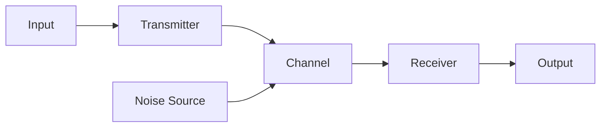
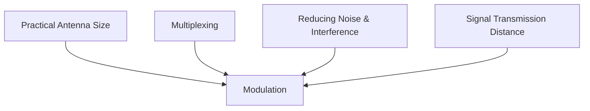
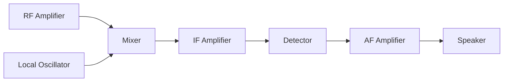
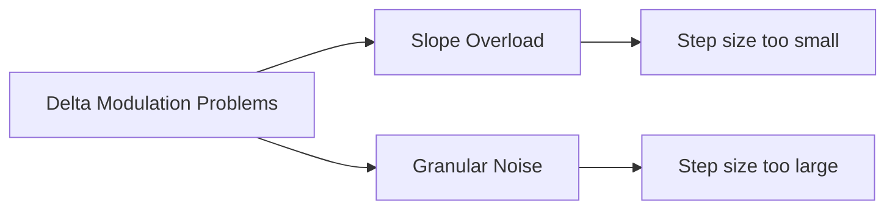
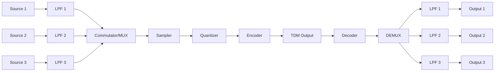

## Question 1(a) [3 marks]

**Draw & explain block diagram of Communication system.**

**Answer**:



- **Input**: Message signal originating from source
- **Transmitter**: Converts message to suitable form for transmission
- **Channel**: Medium through which signal travels
- **Receiver**: Extracts original message from received signal
- **Output**: Delivered message to destination
- **Noise Source**: Unwanted signals that interfere with communication

**Mnemonic:** "I Transmit Clearly Receiving Original Messages"

## Question 1(b) [4 marks]

**Explain need of modulation. State advantages of modulation.**

**Answer**:

**Need for modulation:**



**Advantages of modulation:**

- **Reduced antenna size**: Practical antenna length = λ/4, higher frequency means smaller antenna
- **Multiplexing possible**: Multiple signals transmitted simultaneously through same channel
- **Increased range**: Modulated signals travel farther than baseband signals
- **Noise reduction**: Better SNR achieved through modulation techniques

**Mnemonic:** "Antennas Need Modulation For Reaching Anywhere with Noise Immunity"

## Question 1(c) [7 marks]

**Define modulation. Explain Amplitude modulation with waveform and derive voltage equation for modulated signal.**

**Answer**:

**Modulation**: Process of varying a carrier signal's parameter (amplitude, frequency, phase) proportionally to the message signal.

**Amplitude Modulation Waveform:**

```goat
                                         AM Waveform
    │        Carrier            │        Message           │     Modulated Signal
    │                           │                          │
    │  ╱╲    ╱╲    ╱╲    ╱╲    │                          │     ╱╲      ╱╲  
    │ ╱  ╲  ╱  ╲  ╱  ╲  ╱  ╲   │         ╱╲               │    ╱  ╲    ╱  ╲ 
    │╱    ╲╱    ╲╱    ╲╱    ╲  │        ╱  ╲              │   ╱    ╲  ╱    ╲
----┼---------------------     │-------╱----╲---------    │--╱------╲╱------╲-----
    │                          │      ╱      ╲            │ ╱                 ╲
    │                          │     ╱        ╲           │╱                   ╲
    │                          │    ╱          ╲          │                     ╲
```

**Derivation of AM voltage equation:**

1. Carrier signal: vc(t) = Vc sin(ωct)
2. Message signal: vm(t) = Vm sin(ωmt)
3. Modulated signal: vAM(t) = [Vc + Vm sin(ωmt)] sin(ωct)
4. Modulation index: μ = Vm/Vc
5. Final AM equation: vAM(t) = Vc[1 + μ sin(ωmt)] sin(ωct)

**Mnemonic:** "Amplitude Modulation Makes Carrier Value Change"

## Question 1(c) OR [7 marks]

**Define noise. Give classification of noise and explain cause of any three internal noise.**

**Answer**:

**Noise**: Unwanted signals that interfere with communication signals, causing distortion or errors.

**Classification of Noise:**

| External Noise | Internal Noise |
|----------------|----------------|
| Atmospheric | Thermal |
| Extraterrestrial | Shot |
| Industrial | Transit-time |
| | Flicker |
| | Partition |

**Causes of internal noise:**

- **Thermal noise**: 
  - Caused by random motion of electrons in conductors
  - Present in all electronic components
  - Directly proportional to temperature and bandwidth

- **Shot noise**: 
  - Occurs due to random arrival of carriers at junctions
  - Found in active devices like diodes and transistors
  - Proportional to DC current flowing through device

- **Flicker noise**: 
  - Results from surface defects and impurities in semiconductors
  - Inversely proportional to frequency (1/f noise)
  - Significant at low frequencies

**Mnemonic:** "This Shooting Flicker Is Noisy Everywhere"

## Question 2(a) [3 marks]

**Define (1) Modulation index for AM (2) Noise Figure (3) Digital Modulation**

**Answer**:

1. **Modulation index for AM**: Ratio of amplitude of modulating signal to amplitude of carrier signal.
   - μ = Vm/Vc
   - Must be 0 ≤ μ ≤ 1 to avoid distortion

2. **Noise Figure**: Ratio of input SNR to output SNR of a device.
   - NF = (SNR)input/(SNR)output
   - Indicates noise added by the system
   - Always ≥ 1, expressed in dB

3. **Digital Modulation**: Technique that represents digital data as variations in carrier signal parameters.
   - Examples: ASK, FSK, PSK, QAM
   - Used for digital data transmission

**Mnemonic:** "Modulation Measures, Noise Numbers, Digital Data"

## Question 2(b) [4 marks]

**Derive equation for total power transmitted for amplitude modulated signal considering carrier power and modulation index.**

**Answer**:

**Derivation of total power in AM:**

1. AM wave equation: vAM(t) = Vc[1 + μ sin(ωmt)] sin(ωct)

2. For power calculation, consider RMS values:
   - Carrier power (Pc) = Vc²/2R
   - Power in each sideband (PSB) = (μ²Vc²)/(4R)

3. Total power equation:
   - PT = Pc + PUSB + PLSB
   - PT = Pc + 2PSB (since upper and lower sidebands have equal power)
   - PT = Vc²/2R + 2(μ²Vc²)/(4R)
   - PT = (Vc²/2R)[1 + (μ²/2)]

4. Final equation: PT = Pc(1 + μ²/2)

**Mnemonic:** "Power Total = Power Carrier (1 + μ²/2)"

## Question 2(c) [7 marks]

**Explain basic principle of double sideband suppressed carrier amplitude modulation. Derive its voltage equation & draw only balanced modulator circuit using diode.**

**Answer**:

**Double Sideband Suppressed Carrier (DSBSC) Principle:**

- Carrier is suppressed, only sidebands transmitted
- Contains all information in sidebands
- More power efficient than AM
- Requires complex receiver for demodulation

**Voltage equation derivation:**

1. AM signal: vAM(t) = Vc[1 + μ sin(ωmt)]sin(ωct)
2. Removing carrier component: vDSBSC(t) = Vc × μ sin(ωmt)sin(ωct)
3. Using trigonometric identity: sin(A)sin(B) = 0.5[cos(A-B) - cos(A+B)]
4. Final equation: vDSBSC(t) = (Vcμ/2)[cos(ωc-ωm)t - cos(ωc+ωm)t]

**Balanced Modulator Circuit using Diodes:**

```goat
           D1
        |--->|--+
        |       |
     +--+       +--+
     |             |
Vc---|             |---Output
     |             |
     +--+       +--+
        |       |
        |--->|--+
           D2
           |
           |
         Carrier
           |
           V
       Modulating
         Signal
```

**Mnemonic:** "Delete Carrier, Save Bandwidth, Combine Signals"

## Question 2(a) OR [3 marks]

**Define only, w.r.t. radio receiver (1) Sensitivity (2) Selectivity (3) fidelity**

**Answer**:

1. **Sensitivity**: Ability of a receiver to detect and amplify weak signals.
   - Measured in microvolts (μV)
   - Lower value indicates better sensitivity
   - Typically 1-10 μV for commercial receivers

2. **Selectivity**: Ability to distinguish between desired signal and adjacent interfering signals.
   - Measured as bandwidth at -3dB points
   - Narrower bandwidth means better selectivity
   - Prevents adjacent channel interference

3. **Fidelity**: Accuracy with which receiver reproduces original message.
   - Measures quality of reproduction
   - Affected by distortion and noise
   - Higher fidelity means better sound quality

**Mnemonic:** "Sensitive Selection Faithfully"

## Question 2(b) OR [4 marks]

**An AM signal has carrier power of 1 KW with 200 watt in each sideband. Find out modulation index.**

**Answer**:

**Given:**

- Carrier power (Pc) = 1 KW = 1000 W
- Power in each sideband (PSB) = 200 W

**To find:** Modulation index (μ)

**Solution:**

1. Total sideband power: PTSB = 2 × PSB = 2 × 200 = 400 W
2. Using formula: PTSB = Pc × μ²/2
3. 400 = 1000 × μ²/2
4. μ² = (400 × 2)/1000 = 800/1000 = 0.8
5. μ = √0.8 = 0.894 = 0.9 (approx)

**Mnemonic:** "Sideband Power Reveals Modulation μ"

## Question 2(c) OR [7 marks]

**Compare Amplitude modulation with Frequency Modulation considering minimum seven parameters/aspect.**

**Answer**:

| Parameter | Amplitude Modulation (AM) | Frequency Modulation (FM) |
|-----------|---------------------------|---------------------------|
| **Definition** | Amplitude of carrier varies with message | Frequency of carrier varies with message |
| **Bandwidth** | Narrow (2 × fm) | Wide (2 × β × fm) |
| **Power Efficiency** | Poor (carrier contains ~66% power) | Good (all power in sidebands) |
| **Noise Immunity** | Poor (noise affects amplitude) | Excellent (amplitude limiters remove noise) |
| **Circuit Complexity** | Simple transmitters and receivers | Complex transmitters and receivers |
| **Quality** | Lower fidelity | Higher fidelity |
| **Applications** | Broadcasting, aircraft communication | FM radio, TV sound, wireless mics |
| **Spectrum** | Contains carrier and two sidebands | Contains infinite sidebands |

**Mnemonic:** "Bandwidth, Efficiency, Noise, Quality - AM Fails Many Quality Tests"

## Question 3(a) [3 marks]

**Draw and label sine wave of 1 KHZ in time domain and frequency domain. State advantage of frequency domain analysis of signal.**

**Answer**:

**Time Domain Representation:**

```goat
    Amplitude
        ^
        |
    1   |    /\      /\      /\      /\
        |   /  \    /  \    /  \    /  \
        |  /    \  /    \  /    \  /    \
    0   |-+------+-------+-------+-------+-------> Time
        |  \    /  \    /  \    /  \    /
        |   \  /    \  /    \  /    \  /
   -1   |    \/      \/      \/      \/
        |
     1KHz sine wave (Period = 1ms)
```

**Frequency Domain Representation:**

```goat
    Amplitude
        ^
        |
    1   |    |
        |    |
        |    |
    0   |----+----+----+----+----+----+-------> Frequency
        |    0   1KHz           
        |
     Single spectral line at 1KHz
```

**Advantages of frequency domain analysis:**

- **Signal composition**: Easily identifies frequency components
- **Filter design**: Simplified filter response analysis
- **Bandwidth determination**: Direct visualization of spectrum width
- **Noise analysis**: Better separation of signal from noise

**Mnemonic:** "Frequency Shows Components Hidden in Time"

## Question 3(b) [4 marks]

**State following frequency (1) IF frequency for AM radio (2) IF frequency for FM radio (3) Frequency Band used in FM radio (4) Frequency Band of Human speech.**

**Answer**:

| Parameter | Frequency |
|-----------|-----------|
| IF frequency for AM radio | 455 kHz |
| IF frequency for FM radio | 10.7 MHz |
| Frequency Band used in FM radio | 88-108 MHz |
| Frequency Band of Human speech | 300 Hz - 3.4 kHz |

**Mnemonic:** "AM455, FM10.7, Band88-108, Speech300-3.4"

## Question 3(c) [7 marks]

**Explain Single side band (SSB) modulation with waveform and its advantages. Show how SSB transmission required only 1/6th of power with respect to double sideband full carrier amplitude modulation.**

**Answer**:

**Single Side Band (SSB) Modulation:**

- Transmits only one sideband (USB or LSB)
- Carrier and other sideband suppressed
- Conserves bandwidth and power

**SSB Waveform:**

```goat
    Frequency Spectrum
        ^
        |
        |                   Regular AM
        |    |              |     |
        |    |              |     |
        |----+----+----+----+-----+-----> Frequency
             fc-fm   fc   fc+fm

        |                   SSB (USB)
        |                  |
        |                  |
        |----+----+----+----+----+-----> Frequency
                         fc+fm
```

**Advantages of SSB:**

- **Bandwidth efficiency**: Uses half bandwidth of AM
- **Power efficiency**: No power wasted on carrier
- **Less fading**: Improved performance in long-distance
- **Better SNR**: More power concentrated in information

**Power Comparison:**

1. In AM: PT = Pc(1 + μ²/2)
2. For μ = 1, PT = Pc(1 + 0.5) = 1.5Pc
3. AM power distribution: Carrier (Pc) = 67%, Sidebands = 33%
4. SSB uses only one sideband with no carrier
5. SSB power = 16.5% of total AM power = 1/6 approx.

**Mnemonic:** "Single Side Saves Bandwidth And Power"

## Question 3(a) OR [3 marks]

**State following. (1) Bandwidth of modulated signal if modulating frequency is 5 KHZ. (2) Image frequency if selected station frequency is 1000 KhZ in radio (3) Sampling frequency if baseband signal frequency is 10 KHz.**

**Answer**:

1. **Bandwidth of AM with modulating frequency 5 kHz:**
   - BW = 2 × fm = 2 × 5 kHz = 10 kHz

2. **Image frequency for 1000 kHz station with 455 kHz IF:**
   - For high-side injection: fimage = fstation + 2 × fIF
   - fimage = 1000 + 2 × 455 = 1000 + 910 = 1910 kHz

3. **Sampling frequency for 10 kHz baseband:**
   - fs > 2 × fmax (Nyquist rate)
   - fs > 2 × 10 kHz = 20 kHz
   - Sampling frequency should be > 20 kHz

**Mnemonic:** "Bandwidth Doubles, Image Adds Twice-IF, Sampling Needs Twice-Frequency"

## Question 3(b) OR [4 marks]

**Draw following signal stating its mathematical equation. (1) Sine wave (2) Unit step signal (3) Ramp signal (4) Impulse signal.**

**Answer**:

**1. Sine Wave:**

- Equation: f(t) = A sin(ωt + φ)

```goat
        ^
        |
    A   |    /\      /\      
        |   /  \    /  \    
        |  /    \  /    \  
    0   |-+------+-------+----> t
        |  \    /  \    /  
        |   \  /    \  /    
   -A   |    \/      \/      
```

**2. Unit Step Signal:**

- Equation: u(t) = 1 for t ≥ 0, 0 for t < 0

```goat
        ^
        |
    1   |        |‾‾‾‾‾‾‾‾‾‾‾‾‾‾‾‾
        |        |
        |        |
    0   |‾‾‾‾‾‾‾‾+‾‾‾‾‾‾‾‾‾‾‾‾‾‾‾> t
        |        0
```

**3. Ramp Signal:**

- Equation: r(t) = t for t ≥ 0, 0 for t < 0

```goat
        ^
        |                /
        |               /
        |              /
        |             /
        |            /
    0   |‾‾‾‾‾‾‾‾‾‾‾+‾‾‾‾‾‾‾‾‾‾‾‾‾‾> t
        |           0
```

**4. Impulse Signal:**

- Equation: δ(t) = ∞ for t = 0, 0 for t ≠ 0

```goat
        ^
        |
        |
        |        |
        |        |
    0   |‾‾‾‾‾‾‾‾+‾‾‾‾‾‾‾‾‾‾‾‾‾‾‾> t
        |        0
```

**Mnemonic:** "Sine Oscillates, Step Jumps, Ramp Climbs, Impulse Spikes"

## Question 3(c) OR [7 marks]

**Draw and explain Pre emphasis and De emphasis circuit with its need & characteristic graph. Also compare FM receiver with AM receiver in detail.**

**Answer**:

**Pre-emphasis Circuit:**

```goat
        ┌───────┐
        │       │
    ────┤   R   ├────┬──────
        │       │    │
        └───────┘    │
                     │
                  ┌──┴──┐
                  │     │
                  │  C  │
                  │     │
                  └──┬──┘
                     │
                     │
                     ▼
```

**De-emphasis Circuit:**

```goat
                  ┌───────┐
                  │       │
             ┌────┤   R   ├────
             │    │       │
             │    └───────┘
             │
     ────────┴────┐
                  │
               ┌──┴──┐
               │     │
               │  C  │
               │     │
               └─────┘
```

**Characteristic Graph:**

```goat
    Gain(dB)
        ^
        |                 Pre-emphasis
        |              ,/
        |            ,/
        |          ,/
    0   |‾‾‾‾‾‾‾‾‾+‾‾‾‾‾‾‾‾‾‾‾‾‾‾‾> Frequency
        |          fc
        |          \,
        |            \,
        |              \,  De-emphasis
```

**Need for Pre/De-emphasis:**

- **Noise reduction**: Higher frequencies more susceptible to noise
- **Improves SNR**: Boosts high frequencies at transmitter, attenuates at receiver
- **Time constant**: Typically 75μs in FM broadcasting

**Comparison between FM and AM Receiver:**

| Parameter | FM Receiver | AM Receiver |
|-----------|-------------|------------|
| **IF Frequency** | 10.7 MHz | 455 kHz |
| **Bandwidth** | 200 kHz | 10 kHz |
| **Limiter Stage** | Present | Absent |
| **Demodulator** | Discriminator/ratio detector | Envelope detector |
| **Pre/De-emphasis** | Present | Absent |
| **Audio Quality** | Superior | Moderate |
| **Noise Immunity** | High | Low |
| **Complexity** | More complex | Simpler |

**Mnemonic:** "Pre Boosts Highs, De Cuts Them; FM Filters Noise Better Than AM"

## Question 4(a) [3 marks]

**Define Image frequency in a radio receiver and explain it with suitable example.**

**Answer**:

**Image Frequency**: Unwanted signal frequency that produces the same IF as the desired signal when mixed with local oscillator signal.

**Explanation:**

- For high-side injection: fimage = fsignal + 2 × fIF
- For low-side injection: fimage = fsignal - 2 × fIF

**Example:**

- Desired signal: 1000 kHz
- IF: 455 kHz
- Local oscillator frequency (high-side): fLO = 1000 + 455 = 1455 kHz
- Image frequency: fimage = fLO + 455 = 1455 + 455 = 1910 kHz
- Both 1000 kHz and 1910 kHz will produce 455 kHz IF when mixed with 1455 kHz

**Mnemonic:** "Image In radio Is Interfering 2IF away"

## Question 4(b) [4 marks]

**Draw and explain envelope detector circuit for demodulation of Amplitude modulated signal.**

**Answer**:

**Envelope Detector Circuit:**

```goat
         D
    ┌────►|────┬────────┐
    │          │        │
    │          │        │
Inpt│       ┌──┴──┐  ┌──┴──┐ Output
    │       │     │  │     │
    │       │  R  │  │  C  │
    │       │     │  │     │
    └───────┴──┬──┘  └──┬──┘
               │        │
               └────────┴───────
                     Ground
```

**Working Principle:**

- **Diode**: Rectifies AM signal, removing negative half-cycles
- **RC Circuit**: Acts as low-pass filter
- **Time Constant**: RC must satisfy: 1/fm >> RC >> 1/fc
- **Output**: Envelope of AM signal, which is the original message

**Envelope Detection Process:**

1. Diode conducts during positive half-cycles
2. Capacitor charges to peak value
3. During negative half-cycles, capacitor discharges through resistor
4. Output follows envelope of AM signal

**Mnemonic:** "Diode Rectifies, RC Smooths Envelope"

## Question 4(c) [7 marks]

**Draw block diagram of AM radio receiver and explain working of each block.**

**Answer**:

**AM Radio Receiver (Superheterodyne) Block Diagram:**



**Functions of each block:**

- **RF Amplifier**:
  - Selects desired station signal using tuned circuit
  - Provides initial amplification
  - Improves sensitivity and selectivity
  - Reduces image frequency interference

- **Local Oscillator**:
  - Generates frequency higher than incoming by IF value
  - Typically fLO = fRF + 455 kHz
  - Tuned simultaneously with RF amplifier

- **Mixer**:
  - Combines RF signal with local oscillator
  - Produces sum and difference frequencies
  - Outputs intermediate frequency (IF)

- **IF Amplifier**:
  - Fixed-frequency amplifier (455 kHz)
  - Provides majority of receiver gain
  - Determines selectivity of receiver

- **Detector**:
  - Extracts original audio from IF signal
  - Usually envelope detector with diode
  - Removes RF component, recovers audio

- **AF Amplifier**:
  - Amplifies recovered audio signal
  - Includes volume control
  - Drives speaker to audible levels

- **Speaker**:
  - Converts electrical signals to sound waves

**Mnemonic:** "Radio Mixing Intermediate Detected Audio For Speaker"

## Question 4(a) OR [3 marks]

**State and explain Nyquist Criteria for sampling of signal.**

**Answer**:

**Nyquist Criteria**: To reconstruct a bandlimited signal without distortion, sampling frequency must be at least twice the highest frequency component in the signal.

**Mathematical statement:**

- fs ≥ 2fmax
- fs = sampling frequency
- fmax = maximum frequency in signal

**Explanation:**

- Ensures no aliasing (frequency overlap) occurs
- Minimum sampling rate called Nyquist rate
- Sampling below Nyquist rate causes irreversible distortion
- In practice, fs > 2.2fmax used to allow for filtering

**Example:**

- For audio with fmax = 20 kHz
- Nyquist rate = 2 × 20 kHz = 40 kHz
- CD sampling rate = 44.1 kHz (>40 kHz)

**Mnemonic:** "Sample at least Twice as Fast as Highest Frequency"

## Question 4(b) OR [4 marks]

**Explain slope overload and granular noise for a delta modulation.**

**Answer**:

**Delta Modulation Issues:**



**Slope Overload:**

- Occurs when input signal changes faster than DM can track
- Step size too small for rapidly changing signals
- DM output cannot "catch up" with input
- Creates distortion at sharp transitions
- Solution: Increase step size or sampling rate

**Granular Noise:**

- Occurs during relatively constant signal portions
- Step size too large for slowly changing signals
- Output oscillates around input value
- Creates "roughness" in reconstructed signal
- Solution: Decrease step size

**Adaptive Delta Modulation (ADM):** Dynamically adjusts step size to minimize both problems.

**Mnemonic:** "Slopes Need Bigger Steps, Flats Need Smaller Steps"

## Question 4(c) OR [7 marks]

**Draw and explain PCM transmitter and receiver in detail.**

**Answer**:

**PCM Transmitter:**


**PCM Receiver:**


**Transmitter Components:**

- **Anti-aliasing filter**: Limits input bandwidth to prevent aliasing
- **Sample & Hold**: Captures instantaneous values at regular intervals
- **Quantizer**: Approximates samples to predefined discrete levels
- **Encoder**: Converts quantized values to binary code

**Receiver Components:**

- **Decoder**: Converts binary code back to quantized values
- **D/A Converter**: Transforms discrete values to continuous voltage
- **Reconstruction filter**: Removes sampling frequency components, smooths output

**PCM Parameters:**

- **Resolution**: Determined by bits per sample (n)
- **Quantization levels**: L = 2^n
- **Bit rate**: R = n × fs (bits per second)
- **SNR**: Improves by ~6dB per bit added

**Mnemonic:** "Sample, Quantize, Encode; Decode, Convert, Reconstruct"

## Question 5(a) [3 marks]

**Define Bit, Bit rate and Baud rate with suitable example.**

**Answer**:

- **Bit**: Smallest unit of digital information, representing either 0 or 1.
  - Example: 10110 contains 5 bits

- **Bit Rate**: Number of bits transmitted per second.
  - Unit: bps (bits per second)
  - Example: 9600 bps means 9600 bits transmitted in one second

- **Baud Rate**: Number of signal changes (symbols) per second.
  - Unit: Baud
  - Example: In QPSK, each symbol represents 2 bits, so 9600 bps = 4800 Baud

**Relationship:**

- Bit Rate = Baud Rate × number of bits per symbol
- For binary signaling (1 bit/symbol): Bit Rate = Baud Rate
- For multilevel coding: Bit Rate > Baud Rate

**Mnemonic:** "Bits Build Data, Baud Brings Symbols"

## Question 5(b) [4 marks]

**Define multiplexing. State its types. Explain Frequency division multiplexing with suitable diagram.**

**Answer**:

**Multiplexing**: Technique that allows multiple signals to share a common transmission medium.

**Types of Multiplexing:**

- Frequency Division Multiplexing (FDM)
- Time Division Multiplexing (TDM)
- Code Division Multiplexing (CDM)
- Wavelength Division Multiplexing (WDM)

**Frequency Division Multiplexing:**

```goat
    Frequency
        ^
        |
        |  ┌───┐  ┌───┐  ┌───┐  ┌───┐
        |  │Ch1│  │Ch2│  │Ch3│  │Ch4│
        |  │   │  │   │  │   │  │   │
    0   |--+---+--+---+--+---+--+---+---> Frequency
        |  f1     f2     f3     f4
        |
        |  Guard Bands between channels
```

**FDM Working Principle:**

- Each signal modulated to different carrier frequency
- Bandwidth allocated to each channel with guard bands
- All channels transmitted simultaneously
- Receiver uses filters to separate channels
- Used in radio/TV broadcasting, cable systems

**Mnemonic:** "Frequency Divides Multiple Signals Simultaneously"

## Question 5(c) [7 marks]

**Draw and explain basic PCM-TDM diagram with diagram.**

**Answer**:

**PCM-TDM System Block Diagram:**



**PCM-TDM System Operation:**

**Transmitter Side:**

- **Input Sources**: Multiple analog signals
- **Low-Pass Filters**: Limit bandwidth of input signals
- **Commutator/MUX**: Sequentially samples each input
- **Sampler**: Converts continuous signals to discrete samples
- **Quantizer**: Approximates samples to nearest discrete levels
- **Encoder**: Converts quantized values to binary code
- **TDM Output**: Transmits frames containing samples from all channels

**Receiver Side:**

- **Decoder**: Converts binary code back to quantized values
- **DEMUX**: Distributes samples to appropriate channel paths
- **Low-Pass Filters**: Reconstruct original signals, remove sampling components
- **Outputs**: Recovered original signals

**TDM Frame Format:**

```goat
    ┌──────┬──────┬──────┬──────┬──────┬──────┐
    │ Sync │ Ch 1 │ Ch 2 │ Ch 3 │ Ch 1 │ Ch 2 │...
    └──────┴──────┴──────┴──────┴──────┴──────┘
      Frame header    Channel samples repeat
```

**Mnemonic:** "Pulse Code TDM: Sample, Quantize, Encode, Multiplex"

## Question 5(a) OR [3 marks]

**State types of TDM and explain any one of them.**

**Answer**:

**Types of TDM:**

- Synchronous TDM
- Asynchronous TDM (Statistical TDM)
- Intelligent TDM

**Synchronous TDM:**

- Fixed time slots allocated to each channel
- Time slots transmitted in fixed sequence
- Time slots remain empty if channel has no data
- Simpler implementation but less efficient
- Example: T1 carrier system (24 channels × 8 bits × 8000 samples/sec = 1.544 Mbps)

**Frame Structure:**

```goat
    ┌──────┬──────┬──────┬──────┬──────┐
    │ Sync │ Ch 1 │ Ch 2 │ Ch 3 │ Ch 4 │
    └──────┴──────┴──────┴──────┴──────┘
      Fixed slots regardless of activity
```

**Mnemonic:** "Synchronous Slots Stay Steady"

## Question 5(b) OR [4 marks]

**Explain TDM. Also State its advantages and disadvantages.**

**Answer**:

**Time Division Multiplexing (TDM):** Technique where multiple signals share same transmission medium by allocating different time slots to each signal.

**Working Principle:**

- Each signal sampled at regular intervals
- Samples interleaved in time domain
- Complete frame contains one sample from each channel
- Receiver separates samples to reconstruct original signals

**Advantages of TDM:**

- **Single medium**: Efficiently uses one transmission path
- **Digital compatibility**: Naturally suits digital systems
- **Crosstalk elimination**: No interference between channels
- **Flexible capacity**: Easy to add/remove channels
- **Cost-effective**: Reduces hardware requirements

**Disadvantages of TDM:**

- **Synchronization critical**: Timing errors cause major problems
- **Complex equipment**: Requires precise timing circuits
- **Bandwidth limitation**: High bit rate needed for many channels
- **Inefficiency**: Wastes capacity when channels inactive (in synchronous TDM)
- **Buffer delays**: Can cause latency issues

**Mnemonic:** "Time Divided Multiple signals Save costs But Need Precise timing"

## Question 5(c) OR [7 marks]

**State desirable properties of line coding. Draw waveform in time relation for unipolar RZ, Polar NRZ, and Manchester line coding for a 8 bit digital data 01001110.**

**Answer**:

**Desirable Properties of Line Coding:**

- **DC component**: Should be minimal or absent
- **Self-synchronization**: Should provide timing information
- **Error detection**: Should allow detection of transmission errors
- **Bandwidth efficiency**: Should require minimum bandwidth
- **Noise immunity**: Should be resistant to noise and interference
- **Cost & complexity**: Should be simple to implement

**Line Coding Waveforms for 01001110:**

```goat
    Bit pattern:  0  1  0  0  1  1  1  0
    
    Unipolar RZ:
        ^
        |
    A   |    ┌─┐     ┌─┐ ┌─┐ ┌─┐
        |    │ │     │ │ │ │ │ │
    0   |────┘ └─────┘ └─┘ └─┘ └───> t
        
    Polar NRZ:
        ^
        |
    +A  |    ┌─────┐     ┌───────┐
        |    │     │     │       │
    0   |────┘     └─────┘       └───> t
        |                            
    -A  |─┐         ┌─────┐           
        | └─────────┘     │           
        
    Manchester:
        ^
        |                            
    +A  |─┐   ┌─┐ ┌─┐   ┌─┐   ┌─┐ ┌─┐
        | │   │ │ │ │   │ │   │ │ │ │
    0   |─┘   └─┘ └─┘   └─┘   └─┘ └─> t
        |                            
    -A  |  ┌─┐       ┌─┐       ┌─┐   
        |  │ │       │ │       │ │   
        |  └─┘       └─┘       └─┘   
        
    Legend: 0 = Low, 1 = High
```

**Key characteristics:**

- **Unipolar RZ**: Returns to zero in middle of bit, only positive voltages
- **Polar NRZ**: No return to zero, uses positive and negative voltages
- **Manchester**: Mid-bit transition, rising edge = 0, falling edge = 1

**Mnemonic:** "Unipolar Rises then Zeros, Polar Never Returns, Manchester Always Transitions"
